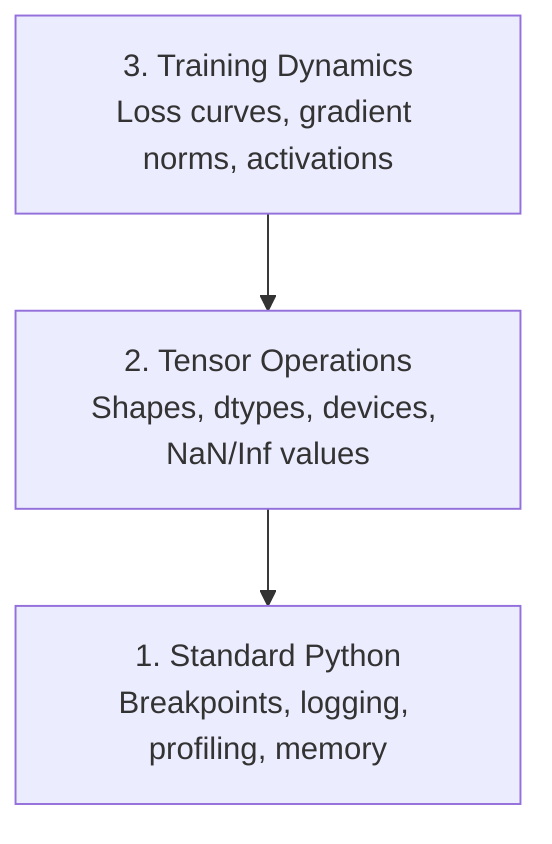

# Débug et profilage 调试与性能分析

> Les pires insectes d'IA ne s'écrasent pas, ils s'entraînent silencieusement sur les ordures et rapportent une belle courbe de perte.
> Les pires bugs d'IA ne font pas tomber les programmes. Ils s'entraînent à la bouche sur les données de déchets, puis rapportent une belle perte.

**Type:** Build | **类型:** 构建
**Language:**Je suis un Python .**语言:**Python
**Prerequisites:** Lesson 1 (Dev Environment), basic PyTorch familiarity | **前置知识:** 第 1 课（开发环境），基本 PyTorch 知识
**Time:** ~60 minutes | **时间:** ~60 分钟

## Objectifs d'apprentissage

- Utilisez conditionné `breakpoint()`et `debug_print`pour inspecter les formes, les types et les valeurs de NaN des tensors au milieu de la formation
  Néo-latin: usage condition`breakpoint()`et `debug_print`En cours de formation, vérifier la forme de la quantité, le type de données et la valeur NaN
- Profil des boucles d' entraînement avec `cProfile`- Je suis là .`line_profiler`, et `tracemalloc`pour trouver des goulots d'étranglement
  Le mot " usage " est traduit par " usage "`cProfile`- Je suis là.`line_profiler`et `tracemalloc`分析训练循环, trouver des performances
- Détecter les bugs d'IA courants: déséquilibres de forme, perte de NaN, fuite de données et tenseurs de mauvais appareil
  Le code de la technologie de l'IA est un code de la technologie de l'IA.
- Configurez TensorBoard pour visualiser les courbes de perte, les histogrammes de poids et les distributions de gradients
  La définition de la carte de la carte de la carte de la carte de la carte de la carte de la carte de la carte de la carte de la carte de la carte de la carte de la carte de la carte de la carte de la carte de la carte de la carte de la carte de la carte de la carte de la carte de la carte de la carte de la carte de la carte de la carte de la carte de la carte de la carte de la carte de la carte de la carte de la carte de la carte de la carte de la carte de la carte de la carte de la carte de la carte de la carte de la carte de la carte de la carte de la carte de la carte de la carte de la carte de la carte de la carte de la carte de la carte de la carte de la carte de la carte de la carte de la carte de la carte de la carte de la carte de la carte de la carte de la carte de la carte de la carte de la carte de la carte de la carte de la carte de la carte de la carte de la carte de la carte de la carte de la carte de la carte de la carte de la carte de la carte de la carte de la carte de la carte de la carte de la carte de la carte de la carte de la carte de la carte de la carte de la carte de la carte de la carte de la carte de la carte de la carte de la carte de la carte de la carte de la carte de la carte de la carte de la carte de la carte de la carte de la carte de la carte de la carte de la carte de la carte de la carte de la carte de la carte de la carte de la carte de la carte de la carte de la carte de la carte de la carte de la carte de la carte de la carte de la carte de la carte de la carte de la carte de la carte de la carte de la carte de la carte de la carte de la carte de la carte de la carte de la carte de la carte de la carte de la carte de la carte de la carte de la carte de la carte de la carte de la carte de la carte de la carte de la carte de la carte de la carte de la carte de la carte de la carte de la carte de la carte de la carte de la carte de la carte de la carte de la carte de la carte de la carte de la carte de la carte de la carte de la carte de la carte de la carte de la carte

> **【中文解读】**
> L'IA 代码的 bug 和普通代码不同: il ne s'effondre pas, mais entraîne silencieusement des erreurs de données dans un modèle inutile.

> **【拓展：AI 调试为什么特别难？】**
> Le bug du développement Web traditionnel a généralement des erreurs évidentes. Mais le bug de l'IA est "Silence Failure" - le modèle s'entraîne sur des données erronées pendant 8 heures, la perte semble normale, mais la prédiction finale est un déchet.

## Le problème .

Un logiciel Web s'écrase avec une trace de pile. Une boucle de formation mal configurée fonctionne pendant 8 heures, brûle 200 $ en temps de GPU et produit un modèle qui prédit la moyenne de chaque entrée. Le code ne fait jamais d'erreur. Le bug était un tensor sur le mauvais appareil, un oublié.`.detach()`, ou des étiquettes qui se détachent des caractéristiques.

> La méthode de défaillance du code AI est différente du code ordinaire. Les applications Web s'effondrent et donnent un tas de suivi. Un cycle de formation de configuration erronée fonctionne pendant 8 heures.`.detach()`、 ou les étiquettes ont été évacuées dans les caractéristiques.

Vous avez besoin d'outils de débogage qui détectent ces défaillances silencieuses avant qu'elles ne vous perdent votre temps et votre calcul.

> Vous devez être capable de les capturer avant de perdre du temps et de calcul.

> **【中文解读】**
> La meilleure façon de tester l'IA est de "silencer": code ne rapporte pas d'erreur, mais le résultat de l'entraînement est complètement erroné.`.detach()`Ces bugs ne provoquent pas d'anomalies, mais permettent au modèle de sortir du déchet.

## Le concept de base.

L'IA débogage fonctionne à trois niveaux:

> L'IA 调试 se déroule sur trois niveaux:



La plupart des gens sautent directement au niveau 3 (en regardant TensorBoard). Mais 80% des bugs d'IA vivent aux niveaux 1 et 2.

> La plupart des gens sautent directement au troisième niveau, mais 80% des bugs existent au premier et au deuxième niveau.

> **【中文解读】**
> L'IA 调试分为三个层次:第一层是标准 Python 调试(断点、日志、内存分析);第二层是张量操作检查(形状、数据类型、设备、NaN 值);第三层是训练动态观察(loss 曲线、梯度分布、激活值) . La plupart des gens regardent directement TensorBoard, mais 80% des bugs sont en réalité dans les deux premiers niveaux.

## Construisez-le et mettez-le en œuvre.
```figure
s0-flame-hot
```

## Faites-le

### Partie 1: Débogage de l'impression (Oui, cela fonctionne)

Pour le code tensor, une déclaration d'impression ciblée vaut mieux que de passer par un débogageur parce que vous devez voir les formes, les types et les gammes de valeurs à la fois.

> Pour le code de volume, une expression d'impression ciblée est plus efficace que le test progressif, car vous devez voir simultanément la forme, le type de données et la gamme de valeurs.

```python
def debug_print(name, tensor):
    print(f"{name}: shape={tensor.shape}, dtype={tensor.dtype}, "
          f"device={tensor.device}, "  # 张量在 CPU 还是 GPU 上？
          f"min={tensor.min().item():.4f}, max={tensor.max().item():.4f}, "
          f"mean={tensor.mean().item():.4f}, "
          f"has_nan={tensor.isnan().any().item()}")  # 检测是否有 NaN 值
```

Appelle-moi après chaque opération suspecte, et quand le bug sera trouvé, retire les empreintes.

> Dans chaque opération douteuse, il est utilisé.

### Partie 2: Débogage Python (pdb et point de rupture)

Le débogageur intégré est sous-estimé pour le travail de l'IA.`breakpoint()`dans votre boucle d'entraînement et inspecter les tensors de manière interactive.

> Les références sont en cours de mise en place dans le cadre de la formation.`breakpoint()`, peut être examiné en ligne.

> **【中文解读】**
> `breakpoint()`C'est la meilleure façon de déclencher un processus. Dans le cycle d'entraînement, la mise en place de conditions de déclenchement (comme une perte soudaine ou une augmentation de la charge) interrompt le processus uniquement en temps exceptionnel.`p`L'ordre de vérification de la taille de la taille de la taille de la taille de la taille de la taille de la taille de la taille de la taille de la taille de la taille de la taille de la taille de la taille de la taille de la taille de la taille de la taille de la taille de la taille de la taille de la taille de la taille de la taille de la taille de la taille de la taille de la taille de la taille de la taille de la taille de la taille de la taille de la taille de la taille de la taille de la taille de la taille de la taille de la taille de la taille de la taille de la taille de la taille de la taille de la taille de la taille de la taille de la taille de la taille de la taille de la taille de la taille de la taille de la taille de la taille de la taille de la taille de la taille de la taille de la taille de la taille de la taille de la taille de la taille de la taille de la taille de la taille de la taille de la taille de la taille de la taille de la taille de la taille de la taille de la taille de la taille de la taille de la taille de la taille de la taille de la taille de la taille de la taille de la taille de la taille de la taille de la taille de la taille de la taille de la taille de la taille de la taille de la taille de la taille de la taille de la taille de la taille de la taille de la taille de la taille de la taille de la taille de la taille de la taille de la taille de la taille de la taille de la taille de la taille de la taille de la taille de la taille de la taille de la taille de la taille de la taille de la taille de la taille de la taille de la taille de la taille de la taille de la taille de la taille de la taille de la taille de la taille de la taille de la taille de la taille de la taille de la taille de la taille de la taille de la taille de la taille de la taille de la taille de la taille de la taille de la taille de la taille de la taille de la taille de la taille de la taille de la taille de la taille de la taille de la taille de la taille de la taille de la taille de la taille de la taille de la taille de la taille de la taille de la taille de la taille de la taille de la taille de la taille de la taille de la taille de la taille de la taille

```python
def training_step(model, batch, criterion, optimizer):
    inputs, labels = batch
    outputs = model(inputs)
    loss = criterion(outputs, labels)

    if loss.item() > 100 or torch.isnan(loss):  # loss 异常大或为 NaN 时触发断点
        breakpoint()  # 进入交互式调试器

    loss.backward()
    optimizer.step()
```

Quand le débogageur vous laisse entrer, des commandes utiles:

> 调试器激活后, ordonnance habituelle:

- `p outputs.shape`pour vérifier les formes
  Le mot grec traduit par " le mot grec "`p outputs.shape`检查形状
- `p loss.item()`pour voir la valeur de perte
  Le mot grec traduit par " le mot grec "`p loss.item()`查看 la perte  valeur
- `p torch.isnan(outputs).sum()`pour compter les NAN
  Le mot grec traduit par " le mot grec "`p torch.isnan(outputs).sum()`统计 NaN 个数
- `p model.fc1.weight.grad`pour vérifier les gradients
  Le mot grec traduit par " le mot grec "`p model.fc1.weight.grad`检查梯度
- `c`pour continuer, `q`de démissionner
  Le mot grec traduit par " le mot grec "`c`continuer,`q` Retrait

C'est un débogage conditionnel, on arrête seulement quand quelque chose semble mal, pour une course d'entraînement de 10 000 étapes, ça compte.

> C'est une condition de test. Tu ne t'arrêtes que lorsque des anomalies surviennent. Pour une formation de 10 000 pas, c'est important.

### Partie 3: Logging Python

Remplacez les déclarations d'impression par des enregistrements lorsque votre débogage dépasse une vérification rapide.

> Lorsque le test dépasse la portée du contrôle rapide, utilisez le journal en remplacement de l'impression 语句。

```python
import logging

logging.basicConfig(
    level=logging.INFO,
    format="%(asctime)s [%(levelname)s] %(message)s",  # 带时间戳和级别的格式
    handlers=[
        logging.FileHandler("training.log"),  # 输出到文件
        logging.StreamHandler()  # 同时输出到终端
    ]
)
logger = logging.getLogger(__name__)

logger.info("Starting training: lr=%.4f, batch_size=%d", lr, batch_size)
logger.warning("Loss spike detected: %.4f at step %d", loss.item(), step)  # 警告级别
logger.error("NaN loss at step %d, stopping", step)  # 错误级别
```

> **【中文解读】**
> J'ai commencé à écrire des articles sur le papier et j'ai commencé à écrire des articles sur le papier.

La saisie vous donne des timestamps, des niveaux de gravité et des sorties de fichiers. Quand une course d'entraînement échoue à 3 heures du matin, vous voulez un fichier de journaux, pas une sortie du terminal qui a déroulé hors de l'écran.

> Lorsque vous échouez à 3 heures du matin, vous avez besoin de votre journal, et non de votre terminal de sortie.

### Partie 4: Sections de code de délais

Savoir où va le temps est la première étape vers l'optimisation.

> Le temps passé là-bas est le premier pas vers l'optimisation.

```python
import time

class Timer:
    def __init__(self, name=""):
        self.name = name

    def __enter__(self):
        self.start = time.perf_counter()  # 高精度计时器
        return self

    def __exit__(self, *args):
        elapsed = time.perf_counter() - self.start
        print(f"[{self.name}] {elapsed:.4f}s")  # 打印耗时

with Timer("data loading"):  # 计时数据加载
    batch = next(dataloader_iter)

with Timer("forward pass"):  # 计时前向传播
    outputs = model(batch)

with Timer("backward pass"):  # 计时反向传播
    loss.backward()
```

Les données sont chargées en 60% du temps de formation.`num_workers > 0`dans votre DataLoader, pas un GPU plus rapide.

> 常见发现: le chargement de données occupe 60% du temps de formation.`num_workers > 0`Je ne peux pas acheter de GPU plus rapide.

> **【中文解读】**
> La première étape de l'optimisation des performances est de trouver le boîtier.`Timer`Le plus courant est que le chargement de données représente 60% du temps de formation. La solution n'est pas d'acheter un GPU plus cher, mais de configurer un DataLoader.`num_workers > 0`Il y a une autre.

> **【拓展：数据加载瓶颈是 AI 训练的头号性能杀手】**
> Dans l'industrie, le taux d'utilisation de GPU est inférieur à 80% en raison du fait que le chargement de données est trop lent, et de GPU dans d'autres domaines.`num_workers`(habituellement设为 4-8)`pin_memory=True`Accélération du processeur-GPU  Transfert  Utilisation `prefetch_factor`预取数据── Google utilise des lignes de formation TPU à l'intérieur de ses propres lignes de traitement des données pour s'assurer que TPU n'a jamais besoin de telles données──

### Partie 5: cProfil et ligne_profiler

Lorsque vous avez besoin de plus que des temporisateurs manuels:

> Quand le temps de déplacement est insuffisant:

```bash
python -m cProfile -s cumtime train.py  # 按累计时间排序的性能分析
```

Ceci montre chaque appel de fonction trié par temps cumulé.

> Cette liste est basée sur le temps cumulé pour chaque fonction.

```bash
pip install line_profiler
```

```python
@profile  # line_profiler 装饰器，逐行统计耗时
def train_step(model, data, target):
    output = model(data)
    loss = F.cross_entropy(output, target)
    loss.backward()
    return loss

# Run with: kernprof -l -v train.py  运行逐行性能分析
```

### Partie 6: Profilisation de la mémoire

> **【中文解读】**
> L'analyse de la mémoire interne partagée entre le CPU et le GPU`tracemalloc`找到分配最内存的代码行,GPU utilisé `torch.cuda.memory_summary()`查看显存使用──OOM(Out of Memory) est l'une des erreurs les plus courantes de l'IA 训练先减批量,再尝试混合精度训练──

#### Mémoire de processeur avec tracemalloc

```python
import tracemalloc

tracemalloc.start()  # 开始跟踪内存分配

# your code here
model = build_model()
data = load_dataset()

snapshot = tracemalloc.take_snapshot()  # 拍摄内存快照
top_stats = snapshot.statistics("lineno")  # 按代码行统计内存
for stat in top_stats[:10]:
    print(stat)
```

#### Mémoire du processeur avec le profil de mémoire

```bash
pip install memory_profiler
```

```python
from memory_profiler import profile

@profile  # 逐行分析内存使用
def load_data():
    raw = read_csv("data.csv")       # watch memory jump here  观察内存跳变
    processed = preprocess(raw)       # and here  数据预处理也会增加内存
    return processed
```

Courez avec `python -m memory_profiler your_script.py`pour voir l'utilisation de la mémoire ligne par ligne.

> 运行  référencement`python -m memory_profiler your_script.py`查看逐行内存使用──

#### Mémoire GPU avec PyTorch

```python
import torch

if torch.cuda.is_available():
    print(torch.cuda.memory_summary())  # GPU 显存完整报告

    print(f"Allocated: {torch.cuda.memory_allocated() / 1e9:.2f} GB")  # 已分配的显存
    print(f"Cached: {torch.cuda.memory_reserved() / 1e9:.2f} GB")  # 缓存的显存
```

Lorsque vous appuyez sur OOM (Out of Memory):

> Quand tu as rencontré une insuffisance de mémoire:

1. Réduire la taille du lot (dans la première tentative, toujours)
   La taille du lot est réduite.
2. Utilisation `torch.cuda.empty_cache()`pour libérer la mémoire en cache
   Le mot " usage " est traduit par " usage "`torch.cuda.empty_cache()`释放缓存内存
3. Utilisation `del tensor`suivie de `torch.cuda.empty_cache()`pour les grands intermédiaires
   Le mot grec traduit par " grande taille " est traduit par " grande taille ".`del tensor` `torch.cuda.empty_cache()`
4. Utiliser une précision mixte (`torch.cuda.amp`) pour réduire de moitié la consommation de mémoire
   Le mot grec traduit par " mélange " est traduit par " mélange "`torch.cuda.amp`) réduit à moitié l'utilisation de la mémoire
5. Utiliser la vérification des gradients pour les modèles très profonds
   Pour un modèle très profond, utilisez le gradient de contrôle.

### Partie 7: Les insectes d'IA courants et comment les attraper

> **【中文解读】**
> C'est la partie la plus pratique du chapitre. Les quatre bugs les plus courants de l'IA: forme non correspondante, perte de NaN, explosion de valeur, fuite de données, erreur d'appareil, utilisation du processeur et du GPU.

#### Des écarts de forme

Le plus fréquent bug.`[batch, features]`lorsque le modèle s' attend `[batch, channels, height, width]`- Je suis désolé .

> Le plus courant de bugs.`[batch, features]`, mais le modèle est attendu .`[batch, channels, height, width]`Il y a une autre.

```python
def check_shapes(model, sample_input):
    print(f"Input: {sample_input.shape}")  # 打印输入形状
    hooks = []

    def make_hook(name):
        def hook(module, inp, out):
            in_shape = inp[0].shape if isinstance(inp, tuple) else inp.shape
            out_shape = out.shape if hasattr(out, "shape") else type(out)
            print(f"  {name}: {in_shape} -> {out_shape}")  # 打印每层的输入输出形状
        return hook

    for name, module in model.named_modules():
        hooks.append(module.register_forward_hook(make_hook(name)))  # 注册钩子函数

    with torch.no_grad():  # 不计算梯度，仅检查形状
        model(sample_input)

    for h in hooks:
        h.remove()  # 清理钩子
```

Faites-le une fois avec un échantillon, il trace chaque transformation de forme dans votre modèle.

> Utilisez un échantillon de lot 运行一次──它会映射模型中的每一个形状变化──

#### Perte de la valeur

La perte de NaN signifie quelque chose qui a explosé.

> La perte de NaN signifie que quelque chose a explosé.

> **【拓展：NaN 在大模型训练中的灾难性影响】**
> Dans le cadre de l'entraînement LLM, NaN apparaît une fois dans la gradience, et se propage à travers la propagation inverse à tous les paramètres, ce qui conduit à un modèle entier irréversible.

- Taux d'apprentissage trop élevé
  Le taux d'apprentissage est trop élevé
- Divisions par zéro en pertes douanières
  Définition de la perte de la valeur
- Logique de zéro ou de nombre négatif
  Le nombre de personnes qui ont été victimes de la maladie
- Gradients explosants dans les RNN
  Le récit de la guerre civile

```python
def detect_nan(model, loss, step):
    if torch.isnan(loss):  # 检测 loss 是否为 NaN
        print(f"NaN loss at step {step}")
        for name, param in model.named_parameters():
            if param.grad is not None:
                if torch.isnan(param.grad).any():  # 检测梯度中的 NaN
                    print(f"  NaN gradient in {name}")
                if torch.isinf(param.grad).any():  # 检测梯度中的 Inf
                    print(f"  Inf gradient in {name}")
        return True
    return False
```

#### Fuite de données

Votre modèle a une précision de 99% sur le plateau de test.

> Votre modèle a obtenu un taux d'exactitude de 99% sur le test.

```python
def check_data_leakage(train_set, test_set, id_column="id"):
    train_ids = set(train_set[id_column].tolist())  # 训练集 ID 集合
    test_ids = set(test_set[id_column].tolist())  # 测试集 ID 集合
    overlap = train_ids & test_ids  # 取交集
    if overlap:
        print(f"DATA LEAKAGE: {len(overlap)} samples in both train and test")  # 发现重叠！
        return True
    return False
```

Vérifiez également la fuite temporelle: en utilisant des données futures pour prédire le passé.

> Il faut aussi vérifier les fuites de temps: avec les données futures prévoir le passé.

#### Faute de dispositif

Les tensors sur différents appareils (CPU vs GPU) causent des erreurs de fonctionnement. Mais parfois un tensor reste silencieux sur le CPU pendant que tout le reste est sur le GPU, et l'entraînement fonctionne lentement.

> Les différences de volume de CPU et de GPU entraînent des erreurs de fonctionnement. Mais parfois, une quantité de CPU reste sur le GPU, tandis que les autres sont sur le GPU.

```python
def check_devices(model, *tensors):
    model_device = next(model.parameters()).device  # 获取模型所在设备
    print(f"Model device: {model_device}")
    for i, t in enumerate(tensors):
        if t.device != model_device:  # 检查张量和模型是否在同一设备
            print(f"  WARNING: tensor {i} on {t.device}, model on {model_device}")
```

### Partie 8: Les bases de la table à tensions

Le TensorBoard vous montre ce qui se passe à l'intérieur de l'entraînement au fil du temps.

> Le tableau de bord de tension montre les changements qui se produisent au cours du processus d'entraînement.

```bash
pip install tensorboard  # 安装 TensorBoard
```

```python
from torch.utils.tensorboard import SummaryWriter

writer = SummaryWriter("runs/experiment_1")  # 创建日志写入器

for step in range(num_steps):
    loss = train_step(model, batch)

    writer.add_scalar("loss/train", loss.item(), step)  # 记录训练 loss
    writer.add_scalar("lr", optimizer.param_groups[0]["lr"], step)  # 记录学习率

    if step % 100 == 0:
        for name, param in model.named_parameters():
            writer.add_histogram(f"weights/{name}", param, step)  # 记录权重分布
            if param.grad is not None:
                writer.add_histogram(f"grads/{name}", param.grad, step)  # 记录梯度分布

writer.close()
```

Lancez-le !

> Initialement de la carte TensorBoard:

```bash
tensorboard --logdir=runs  # 启动 TensorBoard 可视化服务
```

À quoi chercher:

> 观察要点:

- **Loss not decreasing**: taux d'apprentissage trop bas ou problème d'architecture de modèle
  Le mot grec traduit par " le mot grec "**Loss 不降**Le taux d'apprentissage est trop faible, ou la structure du modèle est problématique
- **Loss oscillating wildly**: taux d'apprentissage trop élevé
  Le mot grec traduit par " le mot grec "**Loss 剧烈震荡**: taux d'apprentissage trop élevé
- **Loss goes to NaN**: Instabilité numérique (voir la section NaN ci-dessus)
  Le mot grec traduit par " le mot grec "**Loss 变 NaN**: nombre de valeurs est instable (voir ci-dessus)
- **Train loss decreasing, val loss increasing**: surmontant
  Le mot grec traduit par " le mot grec "**训练 loss 降但验证 loss 升**Il est plus approprié.
- **Weight histograms collapsing to zero**: dégradations qui disparaissent
  Le mot grec traduit par " le mot grec "**权重直方图趋零**: la disparition
- **Gradient histograms exploding**: besoin de coupe de gradient
  Le mot grec traduit par " le mot grec "**梯度直方图爆炸**: besoin de taille

> **【中文解读】**
> Le TensorBoard est un outil standard de formation visualisée. Il est essentiel de noter que le taux d'apprentissage est trop bas ou que la structure du modèle est en difficulté.

> **【拓展：Weights & Biases 与 TensorBoard 的对比】**
> TensorBoard est un outil de formation open source de Google, adapté aux individus et aux petites équipes. Les poids et les biais (W&B) sont des outils commerciaux, qui augmentent les expériences par rapport aux expériences, la collaboration en équipe, la recherche de superparamètres, etc. Dans OpenAI, les sociétés comme Anthropic, W&B sont des plateformes de suivi des expériences standard. Un type de test de grande taille suit des milliers d'indicateurs: perte, taux d'apprentissage, échelle de taille, répartition des poids de poids, taux d'utilisation de GPU, etc. Ces données aident les ingénieurs à trouver les meilleurs superparamètres dans des centaines d'expériences.

### Partie 9: Débugger de code VS

Pour le débogage interactif, configurer le code VS avec un `launch.json`- Le numéro de la liste:

> Pour la communication, utilisez`launch.json`配置 VS Code:

```json
{
    "version": "0.2.0",
    "configurations": [
        {
            "name": "Debug Training",
            "type": "debugpy",
            "request": "launch",
            "program": "${file}",  // 调试当前打开的文件
            "console": "integratedTerminal",  // 使用集成终端
            "justMyCode": false  // 允许调试第三方库代码
        }
    ]
}
```

Définir les points de rupture en cliquant sur la goutte. Utilisez le volet variables pour inspecter les propriétés du tensor. La console de débogage vous permet d'exécuter des expressions Python arbitraires au milieu de l'exécution.

> Cliquez sur le numéro de la page de l'exécution pour obtenir le code de la page de l'exécution.

Utilisée pour passer par des pipelines de pré-traitement des données où vous voulez voir chaque transformation.

>  s'applique à la mise en œuvre progressive de la ligne de traitement des données pré-processée, voir les résultats de chaque changement 

## Utilisez-le avec le cadre de réalisation

> **【中文解读】**
> 实践中的调试工作流分五步: entraînement préusage `check_shapes`验证维度;前 10 步用 `debug_print`检查张量值; entraînement en utilisant TensorBoard  surveillance;`breakpoint()`交互调试; performance bott avec un compteur et un analyseur de mémoire pour le classement.

Voici le débogage du flux de travail qui capture la plupart des bugs de l'IA:

> Voici les flux de travail qui peuvent capturer la plupart des bugs de l'IA:

1. **Before training**Retour`check_shapes`avec un lot d'échantillon. vérifier que les dimensions d'entrée et de sortie correspondent aux attentes.
   Le mot grec traduit par " le mot grec "**训练前**: avec le modèle de lot 运行 `check_shapes`, vérifier si la quantité de l'entrée et de la sortie est conforme à l'expectation;;
2. **First 10 steps**Utilisation `debug_print`Confirmez que rien n'est NaN et que les valeurs sont dans des intervalles raisonnables.
   Le mot grec traduit par " le mot grec "**前 10 步**: à la perte, à la production et à la consommation`debug_print`, confirme qu'il n'y a pas de valeur de NaN dans une plage raisonnable.
3. **During training**: Perte de journaux, taux d'apprentissage et normes de gradients. Utilisez TensorBoard pour la visualisation.
   Le mot grec traduit par " le mot grec "**训练中**Le taux d'apprentissage et de formation sont considérés comme des éléments de la formation.
4. **When something breaks**Laissez tomber .`breakpoint()`- En cas de défaillance, inspectez les tensors.
   Le mot grec traduit par " le mot grec "**出问题时**: dans le cas où vous êtes inscrit`breakpoint()`, , , , , , , , , , , , , , , , , , , , , , , , , , , , , , , , , , , , , , , , , , , , , , , , , , , , , , , , , , , , , , , , , , , , , , , , , , , , , , , , , , , , , , , , , , , , , , , , , , , , , , , , , , , , , , , , , , , , , , , , , , , , , , , , , , , , , , , , , , , , , , , , , , , , , , , , , , , , , , , , , , , , , , , , , , , , , , , , , , , , , , , , , , , , , , , , , , , , , , , , , , , , , , , , , , , , , , , , , , , , , , , , , , , , , , , , , , , , , , , , , , , , , , , , , , , , , , , , , , , , , , , , , , , , , , , , , , , , , , , , , , , , , , , , , , , , , , , , , , , , , , , , , , , , , , , , , , , , , , , , , , , , , , , , , , , , , , , , , , , , , , , , , , , , , , , , , , , , , , , , , , , , , , , , , , , , , , , , , , , , , , , , , , , , , , , , , , , , , , , , , , , , , , , , , , , , , , , , , , , , , , , , , , , , , , , , , , , , , , , , , , , , , , , , , , , , , , , , , , , , , , , , , , , , , , , , , , , , , , , , , , , , , , , , , , , , , , , , , , , , , , , , , , , , , ,
5. **For performance**Le temps de chargement des données versus l'avant vers l'arrière passe.
   Le mot grec traduit par " le mot grec "**性能优化**: séparation des données de chargement, de diffusion et de diffusion.

## Envoyez-le . Produit .

Exécutez le script de débogage:

> 运行调试工具脚本:

```bash
python phases/00-setup-and-tooling/12-debugging-and-profiling/code/debug_tools.py
```

Regardez !`outputs/prompt-debug-ai-code.md`pour une demande qui aide à diagnostiquer des bugs spécifiques à l'IA.

> 参见 `outputs/prompt-debug-ai-code.md`, qui contient des informations pour aider à diagnostiquer un bug spécifique.

## Les exercices

1. On court .`debug_tools.py`Modifiez le modèle de mannequin pour introduire un NaN (indice: divisez par zéro dans le passage avant) et regardez le détecteur le capturer.
   运行调试工具脚本, modifier le modèle introduit NaN, observer le contrôleur comment le capturer
2. Profiler une boucle d' entraînement avec `cProfile`et identifier la fonction la plus lente.
   Utilisez cProfile  Analyse de cycle de formation, pour trouver la fonction la plus lente
3. Utilisation `tracemalloc`pour trouver quelle ligne de votre pipeline de chargement de données alloue le plus de mémoire.
   Utilisez le tracémoloc pour trouver la ligne de données qui a le plus de mémoire distribuée
4. Configurez TensorBoard pour une simple séance d'entraînement et identifiez si le modèle est trop adapté.
   settings TensorBoard  suivi du processus de formation, juger si le modèle est trop adapté
5. Utilisation `breakpoint()`Pratiquez l'inspection des formes, des dispositifs et des valeurs de gradient du débogageur.
   Dans le cycle d'entraînement, l'utilisation de points de rupture (en anglais seulement) est utilisée pour l'exercice de la vérification de la taille, de la forme, de l'équipement et de la valeur de la gradience.
