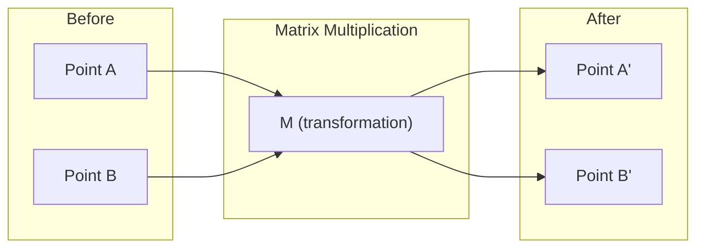
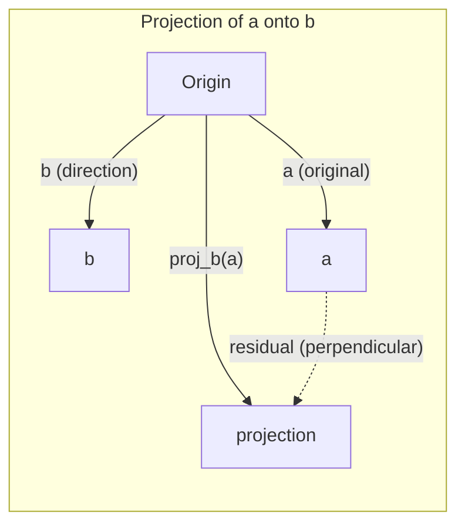

# L'intuition de l'algèbre linéaire
# 线性代数直觉

> Chaque modèle d'IA est juste mathématiques de matrice portant un chapeau chic.
> Chaque modèle d'IA est en fait une matrice de fonctionnement avec un costume élégant.

**Type:** Learn | **类型:** 学习 | **Languages:** Python, Julia | **语言:** Python, Julia | **Prerequisites:** Phase 0 | **前置知识:** Phase 0 | **Time:** ~60 minutes | **时间:** ~60 分钟

## Objectifs d'apprentissage

- Implémenter les opérations vectorielles et matricielles (addition, produit de point, multiplication de matrice) à partir de zéro en Python
  De la réalisation de la dimension et du calcul de la matrice (à partir de zéro)
- Expliquer géométriquement ce que font le produit des points, la projection et le processus Gram-Schmidt
  À partir d'un point de vue géographique, expliquer le point de calcul, la projection, le processus de Gram-Schmidt
- Déterminez l'indépendance linéaire, le rang et la base d'un ensemble de vecteurs en utilisant la réduction de rang
  Utilisation simplifiée (高斯消元) jugement ligneux
- Connectez les concepts d'algèbre linéaire à leurs applications d'IA: intégrations, scores d'attention et LoRA
  **将线性代数概念与 AI 应用对接：词嵌入、注意力分数、LoRA 微调**

## Le problème c' est pourquoi il faut apprendre ça.

Ouvrez n'importe quel document ML. Dans la première page, vous verrez des vecteurs, des matrices, des produits de points et des transformations. Sans l'intuition de l'algèbre linéaire, ce ne sont que des symboles. Avec elle, vous pouvez voir ce qu'un réseau neural fait réellement - déplacer des points dans l'espace.

Vous n'avez pas besoin d'être mathématicien, vous devez voir ce que ces opérations signifient géométriquement, puis les coder vous-même.

> **【中文解读】**翻开任何一篇机器学习论文,第一页就会出现向量、矩阵、点积、变化──没有线性代数直觉,这些只是符号──有直觉,你就能"看穿"神经网络在做什么在空间中的移动点位置──你不需要成为数学家,只需要理解这些操作的几何含义,然后自己写代码实现──

## Le concept de base.

### Les vecteurs sont des points (et des directions)

Un vecteur est juste une liste de nombres. Mais ces nombres signifient quelque chose -- ce sont des coordonnées dans l'espace.

**2D vector [3, 2]:**

| x | y | Point |
|---|---|-------|
| 3 | 2 | The vector points from origin (0,0) to (3, 2) on the plane |

Le vecteur a une magnitude carré ((3^2 + 2^2) = carré ((13) et pointe vers le haut et à droite.

Dans l'IA, les vecteurs représentent tout:
- Un mot → un vecteur de 768 nombres (son "signe" dans l'espace d'intégration)
- Une image → un vecteur de millions de valeurs de pixels
- Un utilisateur → un vecteur de préférences

> **【中文解读】**À la quantité est un ensemble de nombres, représentant le coordinat de l'espace.`[3, 2]`Indiquer le point de départ (0,0) à l'orientation (3,2) du point de départ, la longueur = √(32+22) = √13。
> > > > > > > > > > > > > > > > > > > > > > > > > > > > > > > > > > > > > > > > > > > > > > > > > > > > > > > > > > > > > > > > > > > > > > > > > > > > > > > > > > > > > > > > > > > > > > > > > > > > > > > > > > > > > > > > > > > > > > > > > > > > > > > > > > > > > > > > > > > > > > > > > > > > > > > > > > > > > > > > > > > > > > > > > > > > > > > > > > > > > > > > > > > > > > > > > > > > > > > > > > > > > > > > > > > > > > > > > > > > > > > > > > > > > > > > > > > > > > > > > > > > > > > > > > > > > > > > > > > > > > > > > > > > > > > > > > > > > > > > > > > > > > > > > > > > > > > > > > > > > > > > > > > > > > > > > > > > > > > > > > > > > > > > > > > > > > > > > > > > > > > > > > > > > > > > > > > > > > > > > > > > > > > > > > > > > > > > > > > > > > > > > > > > > > > > > > > > > > > > > > > > > > > > > > > > > > > > > > > > > > > > > > > > > > > > > > > > > > > > > > > > > > > > > > > > > > > > > > > > > > > > > > > > > > > > > > > > > > > > > > > > > > > > > > > > > > > > > > > > > > > > > > > > > >
> **【拓展：向量在 AI 中的化身】**
> - **词嵌入 (Word Embedding)**Le mot " roi " et " reine " sont très proches, car le mot " roi " est associé à la signification.
> - **图片特征**Une image couleur de 224×224 = 150,528 volumes numériques.
> - **用户画像**: Recommandation système de mettre votre navigation / achat historique en un flux de préférence, puis de trouver le plus similaire flux de marchandises recommandé à vous.

### Les matrices sont des transformations.

Une matrice transforme un vecteur en un autre.



Dans l'IA, les matrices sont le modèle:
- Poids de réseau neuronal → matrices qui transforment les entrées en sorties
- Points d'attention → matrices qui décident de ce sur quoi se concentrer
- Embeddings → matrices qui cartographient les mots en vecteurs

> **【中文解读】**La matrice est une " règle de changement ": entre un émetteur, sortie d'un autre émetteur, peut tourner, se réduire, se étendre, projeter.
> > > > > > > > > > > > > > > > > > > > > > > > > > > > > > > > > > > > > > > > > > > > > > > > > > > > > > > > > > > > > > > > > > > > > > > > > > > > > > > > > > > > > > > > > > > > > > > > > > > > > > > > > > > > > > > > > > > > > > > > > > > > > > > > > > > > > > > > > > > > > > > > > > > > > > > > > > > > > > > > > > > > > > > > > > > > > > > > > > > > > > > > > > > > > > > > > > > > > > > > > > > > > > > > > > > > > > > > > > > > > > > > > > > > > > > > > > > > > > > > > > > > > > > > > > > > > > > > > > > > > > > > > > > > > > > > > > > > > > > > > > > > > > > > > > > > > > > > > > > > > > > > > > > > > > > > > > > > > > > > > > > > > > > > > > > > > > > > > > > > > > > > > > > > > > > > > > > > > > > > > > > > > > > > > > > > > > > > > > > > > > > > > > > > > > > > > > > > > > > > > > > > > > > > > > > > > > > > > > > > > > > > > > > > > > > > > > > > > > > > > > > > > > > > > > > > > > > > > > > > > > > > > > > > > > > > > > > > > > > > > > > > > > > > > > > > > > > > > > > > > > > > > > > > > >
> **【拓展：神经网络就是矩阵乘法的嵌套】**
> Une couche de réseau`output = W × input + bias`
> - Il est le même que le premier.
> - L'entrée est l'entrée vers l'entrée vers l'entrée vers l'entrée vers l'entrée vers l'entrée vers l'entrée vers l'entrée vers l'entrée vers l'entrée vers l'entrée vers l'entrée vers l'entrée vers l'entrée vers l'entrée vers l'entrée vers l'entrée vers l'entrée vers l'entrée vers l'entrée vers l'entrée vers l'entrée vers l'entrée vers l'entrée vers l'entrée vers l'entrée vers l'entrée vers l'entrée vers l'entrée vers l'entrée vers l'entrée vers l'entrée vers l'entrée vers l'entrée vers l'entrée vers l'entrée vers l'entrée vers l'entrée vers l'entrée vers l'entrée vers l'entrée vers l'entrée vers l'entrée vers l'entrée vers l'entrée vers l'entrée vers l'entrée vers l'entrée vers l'entrée vers l'entrée vers l'entrée vers l'entrée vers l'entrée vers l'entrée vers l'entrée vers l'entrée vers l'entrée vers l'entrée vers l'entrée vers l'entrée vers l'entrée vers l'entrée vers l'entrée vers l'entrée vers l'entrée vers l'entrée vers l'entrée vers l'entrée vers l'entrée vers l'entrée vers l'entrée vers l'entrée vers l'entrée vers l'entrée vers l'entrée vers l'entrée vers l'entrée vers l'entrée vers l'entrée vers l'entrée vers l'entrée vers l'entrée vers l'entrée versant
> - Un réseau de 3 couches est un réseau de 3 fois de la fréquence multiplicative.
> - GPT-3 a 1750 milliards de paramètres, en fait, c'est quelques centaines de matrices géantes.
> - **训练**= Avec le degré de baisse continue de régler ces chiffres dans les matrices

### Le point mesure la similitude du produit.

Le produit des points de deux vecteurs vous indique à quel point ils sont similaires.

```
a · b = a₁×b₁ + a₂×b₂ + ... + aₙ×bₙ

Same direction:      a · b > 0  (similar)
Perpendicular:       a · b = 0  (unrelated)
Opposite direction:  a · b < 0  (dissimilar)
```

C'est littéralement ainsi que les moteurs de recherche, les systèmes de recommandation et RAG fonctionnent: trouver des vecteurs avec des produits à haute fréquence.

> **【中文解读】**Pour les résultats de l'étude, le résultat est de 0 directions de comparaison, = 0 垂直无关, < 0 方向相反.
> > > > > > > > > > > > > > > > > > > > > > > > > > > > > > > > > > > > > > > > > > > > > > > > > > > > > > > > > > > > > > > > > > > > > > > > > > > > > > > > > > > > > > > > > > > > > > > > > > > > > > > > > > > > > > > > > > > > > > > > > > > > > > > > > > > > > > > > > > > > > > > > > > > > > > > > > > > > > > > > > > > > > > > > > > > > > > > > > > > > > > > > > > > > > > > > > > > > > > > > > > > > > > > > > > > > > > > > > > > > > > > > > > > > > > > > > > > > > > > > > > > > > > > > > > > > > > > > > > > > > > > > > > > > > > > > > > > > > > > > > > > > > > > > > > > > > > > > > > > > > > > > > > > > > > > > > > > > > > > > > > > > > > > > > > > > > > > > > > > > > > > > > > > > > > > > > > > > > > > > > > > > > > > > > > > > > > > > > > > > > > > > > > > > > > > > > > > > > > > > > > > > > > > > > > > > > > > > > > > > > > > > > > > > > > > > > > > > > > > > > > > > > > > > > > > > > > > > > > > > > > > > > > > > > > > > > > > > > > > > > > > > > > > > > > > > > > > > > > > > > > > > > > > > > >
> **【拓展：点积是 AI 最核心的数学操作】**
> 1. **Transformer Attention**- Le numéro de la liste:`Attention(Q,K,V) = softmax(Q·K^T / √d)·V`
>    - Q(consultation) 和 K(键) 的点积 = "Je devrais me concentrer davantage sur ce mot"
>    - C'est le mécanisme central de tous les grands modèles.
> 2. **RAG 检索**: faire des points de compilation de tous les documents, trouver les documents les plus pertinents
> 3. **推荐系统**: préférence des utilisateurs · 商品特征向量 = 推分数
> 4. **余弦相似度**= 归一化后的点积,`cos(a,b) = a·b / (|a|×|b|)`, valeur [-1, 1]
>    Je ne vois pas la longueur, je ne vois pas la longueur, je ne vois pas la longueur.

### Indépendance linéaire.

Les vecteurs sont linéairement indépendants si aucun vecteur dans l'ensemble ne peut être écrit comme une combinaison des autres. Si v1, v2, v3 sont indépendants, ils couvrent un espace 3D. Si l'un est une combinaison des autres, ils couvrent seulement un plan.

Pourquoi cela importe pour l'IA: votre matrice de caractéristiques devrait avoir des colonnes linéairement indépendantes. Si deux caractéristiques sont parfaitement corrélées (linéairement dépendantes), le modèle ne peut pas distinguer leurs effets. Cela provoque une multicollinéarité en régression - la matrice de poids devient instable, et de petites modifications d'entrée produisent des oscillations de sortie sauvages.

**Concrete example:**

```
v1 = [1, 0, 0]
v2 = [0, 1, 0]
v3 = [2, 1, 0]   # v3 = 2*v1 + v2
```

v1 et v2 sont indépendants - ni un multiple escalier ni une combinaison de l'autre. Mais v3 = 2 * v1 + v2, donc {v1, v2, v3} est un ensemble dépendant. Ces trois vecteurs sont tous situés dans le plan xy. Peu importe comment vous les combinez, vous ne pouvez pas atteindre [0, 0, 1]. Vous avez trois vecteurs mais seulement deux dimensions de liberté.

Dans un ensemble de données: si feature_3 = 2*feature_1 + feature_2, l'ajout de feature_3 donne au modèle zéro nouvelles informations. Pire encore, il rend les équations normales singulières - il n'y a pas de solution unique pour les poids.

> **【中文解读】**Un groupe de vecteurs "lineurel·né" = 没有任何一个能被其他向量出──
> > > > > > > > > > > > > > > > > > > > > > > > > > > > > > > > > > > > > > > > > > > > > > > > > > > > > > > > > > > > > > > > > > > > > > > > > > > > > > > > > > > > > > > > > > > > > > > > > > > > > > > > > > > > > > > > > > > > > > > > > > > > > > > > > > > > > > > > > > > > > > > > > > > > > > > > > > > > > > > > > > > > > > > > > > > > > > > > > > > > > > > > > > > > > > > > > > > > > > > > > > > > > > > > > > > > > > > > > > > > > > > > > > > > > > > > > > > > > > > > > > > > > > > > > > > > > > > > > > > > > > > > > > > > > > > > > > > > > > > > > > > > > > > > > > > > > > > > > > > > > > > > > > > > > > > > > > > > > > > > > > > > > > > > > > > > > > > > > > > > > > > > > > > > > > > > > > > > > > > > > > > > > > > > > > > > > > > > > > > > > > > > > > > > > > > > > > > > > > > > > > > > > > > > > > > > > > > > > > > > > > > > > > > > > > > > > > > > > > > > > > > > > > > > > > > > > > > > > > > > > > > > > > > > > > > > > > > > > > > > > > > > > > > > > > > > > > > > > > > > > > > > > > > > > >
> Exemple:`[1,0,0]`- Je suis là .`[0,1,0]`- Je suis là .`[0,0,1]`相互独立 ✓
>     `[1,0,0]`- Je suis là .`[0,1,0]`- Je suis là .`[2,1,0]`(第三个 = 2x第一个 + 第二个)
> > > > > > > > > > > > > > > > > > > > > > > > > > > > > > > > > > > > > > > > > > > > > > > > > > > > > > > > > > > > > > > > > > > > > > > > > > > > > > > > > > > > > > > > > > > > > > > > > > > > > > > > > > > > > > > > > > > > > > > > > > > > > > > > > > > > > > > > > > > > > > > > > > > > > > > > > > > > > > > > > > > > > > > > > > > > > > > > > > > > > > > > > > > > > > > > > > > > > > > > > > > > > > > > > > > > > > > > > > > > > > > > > > > > > > > > > > > > > > > > > > > > > > > > > > > > > > > > > > > > > > > > > > > > > > > > > > > > > > > > > > > > > > > > > > > > > > > > > > > > > > > > > > > > > > > > > > > > > > > > > > > > > > > > > > > > > > > > > > > > > > > > > > > > > > > > > > > > > > > > > > > > > > > > > > > > > > > > > > > > > > > > > > > > > > > > > > > > > > > > > > > > > > > > > > > > > > > > > > > > > > > > > > > > > > > > > > > > > > > > > > > > > > > > > > > > > > > > > > > > > > > > > > > > > > > > > > > > > > > > > > > > > > > > > > > > > > > > > > > > > > > > > > > > > >
> **【拓展：多重共线性问题】**
> Dans les données financières, il est courant que, par exemple, les " prix de la maison en dollars " et " prix de la maison en yuan " soient totalement liés,
> Dans le même temps, la mise en place du modèle entraîne un poids instable, le modèle est trop adapté.

### Base et rang

Une base est un ensemble minimal de vecteurs indépendants linéairement qui couvrent l'ensemble de l'espace.

La base standard pour l'espace 3D est {[1,0,0], [0,1,0], [0,0,1]}. Mais n'importe quel vecteur indépendant en 3D forme une base valide.

Rangoir d'une matrice = nombre de colonnes linéairement indépendantes = nombre de lignes linéairement indépendantes. Si le rang < min(lignes, colons), la matrice est déficient de rang.
- Le système a infiniment de solutions (ou pas)
- L'information est perdue dans la transformation
- La matrice ne peut pas être inversée

| Situation | Rank | What it means for ML |
|-----------|------|---------------------|
| Full rank (rank = min(m, n)) | Maximum possible | Unique least-squares solution exists. Model is well-conditioned. |
| Rank deficient (rank < min(m, n)) | Below maximum | Features are redundant. Infinitely many weight solutions. Regularization needed. |
| Rank 1 | 1 | Every column is a scaled copy of one vector. All data lies on a line. |
| Near rank-deficient (small singular values) | Numerically low | Matrix is ill-conditioned. Tiny input noise causes large output changes. Use SVD truncation or ridge regression. |

> **【中文解读】**
> - **基 (Basis)**: décrire un espace nécessaire pour le minimum de volumes. Les critères de l'espace 3D sont [1,0,0], [0,1,0], [0,0,1]。
> - **秩 (Rank)**: réellement indépendants dans la même situation.
> > > > > > > > > > > > > > > > > > > > > > > > > > > > > > > > > > > > > > > > > > > > > > > > > > > > > > > > > > > > > > > > > > > > > > > > > > > > > > > > > > > > > > > > > > > > > > > > > > > > > > > > > > > > > > > > > > > > > > > > > > > > > > > > > > > > > > > > > > > > > > > > > > > > > > > > > > > > > > > > > > > > > > > > > > > > > > > > > > > > > > > > > > > > > > > > > > > > > > > > > > > > > > > > > > > > > > > > > > > > > > > > > > > > > > > > > > > > > > > > > > > > > > > > > > > > > > > > > > > > > > > > > > > > > > > > > > > > > > > > > > > > > > > > > > > > > > > > > > > > > > > > > > > > > > > > > > > > > > > > > > > > > > > > > > > > > > > > > > > > > > > > > > > > > > > > > > > > > > > > > > > > > > > > > > > > > > > > > > > > > > > > > > > > > > > > > > > > > > > > > > > > > > > > > > > > > > > > > > > > > > > > > > > > > > > > > > > > > > > > > > > > > > > > > > > > > > > > > > > > > > > > > > > > > > > > > > > > > > > > > > > > > > > > > > > > > > > > > > > > > > > > > > > > > >
> La situation a une signification.
> Je suis désolé.
> Il n'y a qu'une seule solution, le modèle est stable.
> Il y a des choses à faire, il faut les normaliser.
> Les données sont presque entièrement en ligne. Toutes les informations sont dans une direction.
> > > > > > > > > > > > > > > > > > > > > > > > > > > > > > > > > > > > > > > > > > > > > > > > > > > > > > > > > > > > > > > > > > > > > > > > > > > > > > > > > > > > > > > > > > > > > > > > > > > > > > > > > > > > > > > > > > > > > > > > > > > > > > > > > > > > > > > > > > > > > > > > > > > > > > > > > > > > > > > > > > > > > > > > > > > > > > > > > > > > > > > > > > > > > > > > > > > > > > > > > > > > > > > > > > > > > > > > > > > > > > > > > > > > > > > > > > > > > > > > > > > > > > > > > > > > > > > > > > > > > > > > > > > > > > > > > > > > > > > > > > > > > > > > > > > > > > > > > > > > > > > > > > > > > > > > > > > > > > > > > > > > > > > > > > > > > > > > > > > > > > > > > > > > > > > > > > > > > > > > > > > > > > > > > > > > > > > > > > > > > > > > > > > > > > > > > > > > > > > > > > > > > > > > > > > > > > > > > > > > > > > > > > > > > > > > > > > > > > > > > > > > > > > > > > > > > > > > > > > > > > > > > > > > > > > > > > > > > > > > > > > > > > > > > > > > > > > > > > > > > > > > > > > > > >
> **【拓展：LoRA —— 秩在 AI 中最惊艳的应用】**
> L'analyse de la réaction de la société à la réaction de l'entreprise à la réaction de la société à la réaction de l'entreprise à la réaction de l'entreprise à la réaction de l'entreprise à la réaction de l'entreprise à la réaction de l'entreprise à la réaction de l'entreprise à la réaction de l'entreprise à la réaction de l'entreprise à la réaction de l'entreprise à la réaction de l'entreprise à la réaction de l'entreprise à la réaction de l'entreprise à la réaction de l'entreprise à la réaction de l'entreprise à la réaction de l'entreprise à la réaction de l'entreprise à la réaction de l'entreprise à la réaction de l'entreprise à la réaction de l'entreprise à la réaction de l'entreprise à la réaction de l'entreprise à la réaction de l'entreprise à la réaction de l'entreprise à la réaction de l'entreprise à la réaction de l'entreprise à la réaction de l'entreprise.
> - Le poids de la matrice W est de 4096×4096
> - 微调时,权重更新 ΔW 实际上是"低排"的(le vrai changement ne se produit que dans quelques directions)
> - LoRA mettre ΔW divisé en deux petites matrices A(4096×16) et B(16×4096)
> - Le nombre de 16 millions → 130.000, réduit**99%**Mais les résultats sont presque inattendus.
> - C'est un exemple de changement direct du concept de "秩".

### Je suis en train de faire une projection .

Vecteur de projection **a**sur le vecteur **b**donne la composante de **a**dans la direction de **b**- Le numéro de la liste:

```
proj_b(a) = (a dot b / b dot b) * b
```

Le résidu (a - proj_b(a)) est perpendiculaire à b. Cette décomposition orthogonale est la base de l'ajustement des carrés les plus faibles.

La projection est partout dans ML:
- La régression linéaire réduit au minimum la distance entre les observations et l'espace de colonne - la solution est une projection
- PCA projette des données sur les directions de variance maximale
- L'attention dans les transformateurs compute les projections des requêtes sur les touches



**Example:**a = [3, 4], b = [1, 0]

Le nombre de points de référence est le nombre de points de référence.

La projection fait tomber la composante y. C'est la réduction de dimensionnalité sous sa forme la plus simple -- jeter les directions qui ne vous intéressent pas.

> **【中文解读】**投影 = 向量在某一方向上的"ombre"
> `a=[3,4]`投影到 x 轴 `[1,0]`上 = `[3,0]`Je ne peux pas le faire.
> Résultat de l'évaluation`[0,4]`, avec direction de projection vertical
> > > > > > > > > > > > > > > > > > > > > > > > > > > > > > > > > > > > > > > > > > > > > > > > > > > > > > > > > > > > > > > > > > > > > > > > > > > > > > > > > > > > > > > > > > > > > > > > > > > > > > > > > > > > > > > > > > > > > > > > > > > > > > > > > > > > > > > > > > > > > > > > > > > > > > > > > > > > > > > > > > > > > > > > > > > > > > > > > > > > > > > > > > > > > > > > > > > > > > > > > > > > > > > > > > > > > > > > > > > > > > > > > > > > > > > > > > > > > > > > > > > > > > > > > > > > > > > > > > > > > > > > > > > > > > > > > > > > > > > > > > > > > > > > > > > > > > > > > > > > > > > > > > > > > > > > > > > > > > > > > > > > > > > > > > > > > > > > > > > > > > > > > > > > > > > > > > > > > > > > > > > > > > > > > > > > > > > > > > > > > > > > > > > > > > > > > > > > > > > > > > > > > > > > > > > > > > > > > > > > > > > > > > > > > > > > > > > > > > > > > > > > > > > > > > > > > > > > > > > > > > > > > > > > > > > > > > > > > > > > > > > > > > > > > > > > > > > > > > > > > > > > > > > > > >
> **【拓展：投影与降维的关系】**
> 投影是最简单的降维抛掉不关心的方向──PCA
> Il ne se déplace pas dans une direction fixe, mais il se déplace automatiquement dans la direction de la projection.
> Pour les données de 1000 dimensions projetées à 50 dimensions, conservez 95% de l'information.

### Le processus Gram-Schmidt est en train de se transformer.

Convertir n'importe quel ensemble de vecteurs indépendants en une base orthonormale.

L' algorithme:
1. Prenez le premier vecteur, normaliser
2. Prenez le deuxième vecteur, soustraire sa projection sur le premier, normaliser
3. Prenez le troisième vecteur, soustraire ses projections sur tous les vecteurs précédents, normaliser
4. Répétez pour les vecteurs restants

```
Input:  v1, v2, v3, ... (linearly independent)

u1 = v1 / |v1|

w2 = v2 - (v2 dot u1) * u1
u2 = w2 / |w2|

w3 = v3 - (v3 dot u1) * u1 - (v3 dot u2) * u2
u3 = w3 / |w3|

Output: u1, u2, u3, ... (orthonormal basis)
```

C'est ainsi que la décomposition QR fonctionne en interne. Q est la base orthonormale, R capture les coefficients de projection.
- Résolution des systèmes linéaires (plus stables que l'élimination gaussienne)
- Compteur des valeurs propres (algorithme de RQ)
- Régrésion des carrés minimaux (méthode numérique standard)

> **【中文解读】**Pour faire de l'ensemble de la quantité de métal "verticalement + longueur pour 1" un standard de la quantité de métal.
> > > > > > > > > > > > > > > > > > > > > > > > > > > > > > > > > > > > > > > > > > > > > > > > > > > > > > > > > > > > > > > > > > > > > > > > > > > > > > > > > > > > > > > > > > > > > > > > > > > > > > > > > > > > > > > > > > > > > > > > > > > > > > > > > > > > > > > > > > > > > > > > > > > > > > > > > > > > > > > > > > > > > > > > > > > > > > > > > > > > > > > > > > > > > > > > > > > > > > > > > > > > > > > > > > > > > > > > > > > > > > > > > > > > > > > > > > > > > > > > > > > > > > > > > > > > > > > > > > > > > > > > > > > > > > > > > > > > > > > > > > > > > > > > > > > > > > > > > > > > > > > > > > > > > > > > > > > > > > > > > > > > > > > > > > > > > > > > > > > > > > > > > > > > > > > > > > > > > > > > > > > > > > > > > > > > > > > > > > > > > > > > > > > > > > > > > > > > > > > > > > > > > > > > > > > > > > > > > > > > > > > > > > > > > > > > > > > > > > > > > > > > > > > > > > > > > > > > > > > > > > > > > > > > > > > > > > > > > > > > > > > > > > > > > > > > > > > > > > > > > > > > > > > > > >
> L'émission est une série de films réalisés par des artistes de cinéma, qui ont été créés par des artistes de cinéma.
> Comme si chaque bloc avait choisi une nouvelle direction, sans se replier sur les autres.
> > > > > > > > > > > > > > > > > > > > > > > > > > > > > > > > > > > > > > > > > > > > > > > > > > > > > > > > > > > > > > > > > > > > > > > > > > > > > > > > > > > > > > > > > > > > > > > > > > > > > > > > > > > > > > > > > > > > > > > > > > > > > > > > > > > > > > > > > > > > > > > > > > > > > > > > > > > > > > > > > > > > > > > > > > > > > > > > > > > > > > > > > > > > > > > > > > > > > > > > > > > > > > > > > > > > > > > > > > > > > > > > > > > > > > > > > > > > > > > > > > > > > > > > > > > > > > > > > > > > > > > > > > > > > > > > > > > > > > > > > > > > > > > > > > > > > > > > > > > > > > > > > > > > > > > > > > > > > > > > > > > > > > > > > > > > > > > > > > > > > > > > > > > > > > > > > > > > > > > > > > > > > > > > > > > > > > > > > > > > > > > > > > > > > > > > > > > > > > > > > > > > > > > > > > > > > > > > > > > > > > > > > > > > > > > > > > > > > > > > > > > > > > > > > > > > > > > > > > > > > > > > > > > > > > > > > > > > > > > > > > > > > > > > > > > > > > > > > > > > > > > > > > > > > >
> **【拓展：为什么"正交"这么重要？】**
> Si les calculs sont "inéquilibrés" entre les calculs, les erreurs de calcul augmentent de plus en plus.
> QR 分解(Gram-Schmidt's矩阵形式) est une pierre de fondation pour le calcul des valeurs numériques:
> - Le niveau de base de l'équation est le QR 分解
> - Caractéristiques de calcul de la valeur QR
> - La définition des valeurs de référence

## Construisez-le et mettez-le en œuvre.
```figure
eigen-directions
```

## Faites-le

### Étape 1: Vecteurs à partir de zéro (Python)

```python
class Vector:
    def __init__(self, components):
        self.components = list(components)
        self.dim = len(self.components)

    def __add__(self, other):
        return Vector([a + b for a, b in zip(self.components, other.components)])

    def __sub__(self, other):
        return Vector([a - b for a, b in zip(self.components, other.components)])

    def dot(self, other):
        # 点积：对应分量相乘后求和。AI 中最核心的相似度度量。
        return sum(a * b for a, b in zip(self.components, other.components))

    def magnitude(self):
        return sum(x**2 for x in self.components) ** 0.5

    def normalize(self):
        # 归一化：缩放到长度1。归一化后点积=余弦相似度。
        mag = self.magnitude()
        return Vector([x / mag for x in self.components])

    def cosine_similarity(self, other):
        # 余弦相似度：只看方向不看长度，值域[-1,1]
        return self.dot(other) / (self.magnitude() * other.magnitude())

    def __repr__(self):
        return f"Vector({self.components})"


a = Vector([1, 2, 3])
b = Vector([4, 5, 6])

print(f"a + b = {a + b}")
print(f"a · b = {a.dot(b)}")
print(f"|a| = {a.magnitude():.4f}")
print(f"cosine similarity = {a.cosine_similarity(b):.4f}")
```

### Étape 2: Matrices à partir de zéro (Python)

```python
class Matrix:
    def __init__(self, rows):
        self.rows = [list(row) for row in rows]
        self.shape = (len(self.rows), len(self.rows[0]))

    def __matmul__(self, other):
        # 矩阵乘法 = 神经网络一层的前向传播
        if isinstance(other, Vector):
            return Vector([
                sum(self.rows[i][j] * other.components[j] for j in range(self.shape[1]))
                for i in range(self.shape[0])
            ])
        rows = []
        for i in range(self.shape[0]):
            row = []
            for j in range(other.shape[1]):
                row.append(sum(
                    self.rows[i][k] * other.rows[k][j]
                    for k in range(self.shape[1])
                ))
            rows.append(row)
        return Matrix(rows)

    def transpose(self):
        return Matrix([
            [self.rows[j][i] for j in range(self.shape[0])]
            for i in range(self.shape[1])
        ])

    def __repr__(self):
        return f"Matrix({self.rows})"


rotation_90 = Matrix([[0, -1], [1, 0]])
point = Vector([3, 1])

rotated = rotation_90 @ point
print(f"Original: {point}")
print(f"Rotated 90°: {rotated}")
```

### Étape 3: Pourquoi cela importe pour l'IA ? Étape 3: Qu'est-ce que cela a à voir avec l'IA ?

```python
import random

random.seed(42)
weights = Matrix([[random.gauss(0, 0.1) for _ in range(3)] for _ in range(2)])
input_vector = Vector([1.0, 0.5, -0.3])

output = weights @ input_vector
print(f"Input (3D): {input_vector}")
print(f"Output (2D): {output}")
print("This is what a neural network layer does -- matrix multiplication.")
# 矩阵乘法：3维输入 → 2维输出。这就是神经网络一层的全部计算。
# 一个真正的网络就是把很多这样的层串起来，每层都有一个权重矩阵。
```

### Étape 4: La version de Julia

```julia
a = [1.0, 2.0, 3.0]
b = [4.0, 5.0, 6.0]

println("a + b = ", a + b)
println("a · b = ", a ⋅ b)       # Julia supports unicode operators
println("|a| = ", √(a ⋅ a))
println("cosine = ", (a ⋅ b) / (√(a ⋅ a) * √(b ⋅ b)))

# Matrix-vector multiplication
W = [0.1 -0.2 0.3; 0.4 0.5 -0.1]
x = [1.0, 0.5, -0.3]
println("Wx = ", W * x)
println("This is a neural network layer.")
```

### Étape 5: Indépendance linéaire et projection à partir de zéro (Python)

```python
def is_linearly_independent(vectors):
    # 高斯消元法：把向量排成矩阵，化简，看秩是否等于向量个数
    n = len(vectors)
    dim = len(vectors[0].components)
    mat = Matrix([v.components[:] for v in vectors])
    rows = [row[:] for row in mat.rows]
    rank = 0
    for col in range(dim):
        pivot = None
        for row in range(rank, len(rows)):
            if abs(rows[row][col]) > 1e-10:
                pivot = row
                break
        if pivot is None:
            continue
        rows[rank], rows[pivot] = rows[pivot], rows[rank]
        scale = rows[rank][col]
        rows[rank] = [x / scale for x in rows[rank]]
        for row in range(len(rows)):
            if row != rank and abs(rows[row][col]) > 1e-10:
                factor = rows[row][col]
                rows[row] = [rows[row][j] - factor * rows[rank][j] for j in range(dim)]
        rank += 1
    return rank == n


def project(a, b):
    # 投影：a 在 b 方向上的"影子"
    scalar = a.dot(b) / b.dot(b)
    return Vector([scalar * x for x in b.components])


def gram_schmidt(vectors):
    # 正交化：每个向量减去在已有方向上的投影，只保留新方向
    orthonormal = []
    for v in vectors:
        w = v
        for u in orthonormal:
            proj = project(w, u)
            w = w - proj
        if w.magnitude() < 1e-10:
            continue
        orthonormal.append(w.normalize())
    return orthonormal


v1 = Vector([1, 0, 0])
v2 = Vector([1, 1, 0])
v3 = Vector([1, 1, 1])
basis = gram_schmidt([v1, v2, v3])
for i, u in enumerate(basis):
    print(f"u{i+1} = {u}")
    print(f"  |u{i+1}| = {u.magnitude():.6f}")

print(f"u1 · u2 = {basis[0].dot(basis[1]):.6f}")
print(f"u1 · u3 = {basis[0].dot(basis[2]):.6f}")
print(f"u2 · u3 = {basis[1].dot(basis[2]):.6f}")
```

## Utilisez-le avec le cadre pour réaliser la façon dont vous allez vraiment l'utiliser en guerre réelle)

Maintenant, la même chose avec NumPy -- ce que vous allez utiliser en pratique:
Maintenant, avec NumPy, c'est ce que vous utilisez:

```python
import numpy as np

a = np.array([1, 2, 3], dtype=float)
b = np.array([4, 5, 6], dtype=float)

print(f"a + b = {a + b}")
print(f"a · b = {np.dot(a, b)}")
print(f"|a| = {np.linalg.norm(a):.4f}")
print(f"cosine = {np.dot(a, b) / (np.linalg.norm(a) * np.linalg.norm(b)):.4f}")

W = np.random.randn(2, 3) * 0.1
x = np.array([1.0, 0.5, -0.3])
print(f"Wx = {W @ x}")
```

### Rango, projection et QR avec NumPy 秩、投影和QR 分解

```python
import numpy as np

A = np.array([[1, 2], [2, 4]])
print(f"Rank: {np.linalg.matrix_rank(A)}")  # 秩=1，第2行是第1行的2倍

a = np.array([3, 4])
b = np.array([1, 0])
proj = (np.dot(a, b) / np.dot(b, b)) * b
print(f"Projection of {a} onto {b}: {proj}")

Q, R = np.linalg.qr(np.random.randn(3, 3))  # QR 分解 = Gram-Schmidt 的矩阵形式
print(f"Q is orthogonal: {np.allclose(Q @ Q.T, np.eye(3))}")  # Q 正交
print(f"R is upper triangular: {np.allclose(R, np.triu(R))}")  # R 上三角
```

### PyTorch -- Les tensors sont des vecteurs avec autodiff

```python
import torch

x = torch.randn(3, requires_grad=True)  # 3维向量，开启自动求导
y = torch.tensor([1.0, 0.0, 0.0])

similarity = torch.dot(x, y)  # 点积
similarity.backward()          # 自动求导！

print(f"x = {x.data}")
print(f"y = {y.data}")
print(f"dot product = {similarity.item():.4f}")
print(f"d(dot)/dx = {x.grad}")  # 梯度 = y 本身，因为 d(x·y)/dx = y
```

> **【拓展：自动求导的魔法】**
> PyTorch de `backward()`Automatisez le calcul de la gradience d ((x·y) / dx = y。
> Le récit de la rédaction de la lettre de la lettre de la lettre de la lettre de la lettre de la lettre de la lettre de la lettre de la lettre de la lettre de la lettre de la lettre de la lettre de la lettre de la lettre de la lettre de la lettre de la lettre de la lettre de la lettre de la lettre de la lettre de la lettre de la lettre de la lettre de la lettre de la lettre de la lettre de la lettre de la lettre de la lettre de la lettre de la lettre de la lettre de la lettre de la lettre de la lettre de la lettre de la lettre de la lettre de la lettre de la lettre de la lettre de la lettre de la lettre de la lettre de la lettre de la lettre de la lettre de la lettre de la lettre de la lettre de la lettre de la lettre de la lettre de la lettre de la lettre de la lettre de la lettre de la lettre de la lettre de la lettre de la lettre de la lettre de la lettre de la lettre de la lettre de la lettre de la lettre de la lettre de la lettre de la lettre de la lettre de la lettre de la lettre de la lettre de la lettre de la lettre de la lettre de la lettre de la lettre de la lettre de la lettre de la lettre de la lettre de la lettre de la lettre de la lettre de la lettre de la lettre de la lettre de la lettre de la lettre de la lettre de la lettre de la lettre de la lettre de la lettre de la lettre de la lettre de la lettre de la lettre de la lettre de la lettre de la lettre de la
> 1. Il y a une autre façon de faire.
> 2. 计算损失 (en anglais seulement)
> 3. Réaction à la propagation`backward()`Automatisez-vous à chaque échelle de poids)
> 4. 更新权重(梯度下降) Je suis en train de faire une petite partie de la série.
> Par exemple, les deux étapes suivantes sont les suivantes:

Le gradient du produit de la dot par rapport à x est juste y. PyTorch a calculé cela automatiquement. Chaque opération dans un réseau neural est construit à partir d'opérations comme celle-ci - les multiplicateurs de matrice, les produits de points, les projections - et les traces de gradients auto-différentes à travers tous.

Vous avez construit à partir de zéro ce que NumPy fait en une seule ligne.
Tu viens de réaliser ce que NumPy a fait depuis le zéro.

## Envoyez-le . Produit .

Cette leçon donne:
- `outputs/prompt-linear-algebra-tutor.md`-- une invitation pour les assistants d'IA à enseigner l'algèbre linéaire à travers l'intuition géométrique

## Les liens concept

Tout dans cette leçon se connecte à des parties spécifiques de l'IA moderne:
Ce cours est consacré à chaque concept directement à un composant de l'IA moderne:

| Concept 概念 | Where it shows up 在 AI 中的位置 |
|---------|------------------|
| Dot product 点积 | Attention scores in transformers, cosine similarity in RAG / Transformer 的注意力分数、RAG 的余弦相似度 |
| Matrix multiply 矩阵乘法 | Every neural network layer, every linear transformation / 神经网络的每一层 |
| Linear independence 线性无关 | Feature selection, avoiding multicollinearity / 特征选择、避免多重共线性 |
| Rank 秩 | Determining if a system is solvable, LoRA (low-rank adaptation) / 方程可解性判断、LoRA 微调 |
| Projection 投影 | Linear regression (projecting onto column space), PCA / 线性回归、PCA 降维 |
| Gram-Schmidt / QR | Numerical solvers, eigenvalue computation / 数值求解器、特征值计算 |
| Orthonormal basis 正交基 | Stable numerical computation, whitening transforms / 数值稳定计算、白化变换 |

LoRA mérite une mention spéciale. Il affinera les grands modèles linguistiques en décomposant les mises à jour de poids en matrices de bas rang. Au lieu de mettre à jour une matrice de poids 4096x4096 (16M paramètres), LoRA met à jour deux matrices de taille 4096x16 et 16x4096 (131K paramètres). La contrainte de rang 16 signifie que LoRA suppose que la mise à jour du poids vit dans un sous-espace 16 dimensions de l'espace complet 4096 dimensions. C'est l'algèbre linéaire qui fait du vrai travail.

> **【中文解读】LoRA 特别值得一提。**Il décrit le processus de micro-régulation du grand modèle en calcul de la règle basse.
> Il faut mettre à jour la puissance de 4096×4096
> LoRA ne fait que mettre à jour 4096×16 et 16×4096  Deux petites matrices
> "秩=16" signifie: le pouvoir de réviser se produit réellement seulement sur 16 directions, et non sur un espace complet de 4096 dimensions.
> C'est l'application la plus rentable de l'IA en termes de facteurs de ligne.

## Les exercices

1. Mise en œuvre `Vector.angle_between(other)`qui renvoie l'angle en degrés entre deux vecteurs
   **实现计算两向量夹角的方法（返回角度）**
2. Créer une matrice d'échelle 2D qui double la coordonnée x et triple la coordonnée y, puis l'appliquer au vecteur [1, 1]
   **创建一个 2D 缩放矩阵（x坐标翻倍，y坐标三倍），应用到向量 [1, 1]**
3. Compte tenu de 5 vecteurs aléatoires de type mot (dimension 50), trouvez les deux plus similaires en utilisant la similitude cosine
   **给定5个随机50维"词向量"，用余弦相似度找最相似的2个**
4. Vérifiez que la sortie Gram-Schmidt est vraiment orthonormale: vérifiez que chaque paire a un produit de point 0 et chaque vecteur a une magnitude 1
   **验证 Gram-Schmidt 输出确实正交：任意两个点积=0，每个长度=1**
5. Créer une matrice 3x3 avec rang 2. Vérifiez en utilisant le `rank()`Expliquez ensuite quel objet géométrique les colonnes couvrent.
   **构造一个秩为2的3×3矩阵，验证秩，解释它的列向量张成什么几何体（答案：一个平面）**
6. Le vecteur [1, 2, 3] est projeté sur [1, 1, 1].
   **把 [1,2,3] 投影到 [1,1,1] 上，几何含义是什么？（答案：在对角线方向上的分量）**

## Les termes clés

| Term 英文 | What people say 常见误解 | What it actually means 准确含义 |
|------|----------------|----------------------|
| Vector 向量 | "An arrow 一根箭头" | A list of numbers representing a point or direction in n-dimensional space / n维空间中的点或方向 |
| Matrix 矩阵 | "A table of numbers 一堆数字" | A transformation that maps vectors from one space to another / 把向量从一个空间映射到另一个空间的变换 |
| Dot product 点积 | "Multiply and sum 乘完加起来" | A measure of how aligned two vectors are -- the core of similarity search / 衡量对齐程度——相似度搜索的核心 |
| Embedding 嵌入 | "Some AI magic AI魔法" | A vector that represents the meaning of something (word, image, user) / 表示事物"意义"的向量 |
| Linear independence 线性无关 | "They don't overlap 不重叠" | No vector in the set can be written as a combination of the others / 没有向量能用其他向量凑出来 |
| Rank 秩 | "How many dimensions 几个维度" | The number of linearly independent columns (or rows) in a matrix / 独立列（行）的数量 |
| Projection 投影 | "The shadow 影子" | The component of one vector in the direction of another / 一个向量在另一个方向上的分量 |
| Basis 基 | "The coordinate axes 坐标轴" | A minimal set of independent vectors that span the space / 张成整个空间的最少独立向量 |
| Orthonormal 正交归一 | "Perpendicular unit vectors 垂直单位向量" | Vectors that are mutually perpendicular and each have length 1 / 互相垂直且长度各为1 |
