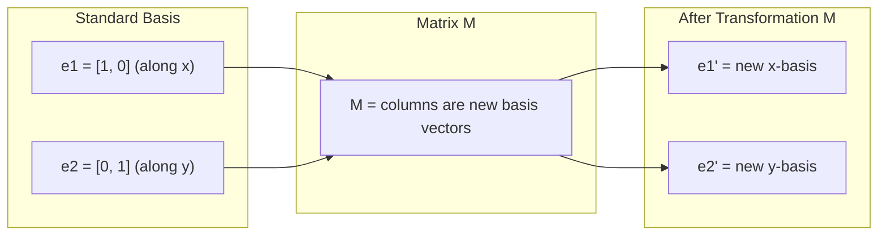
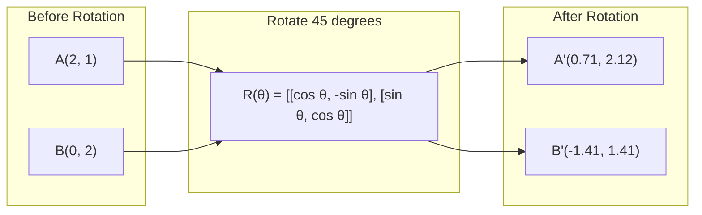
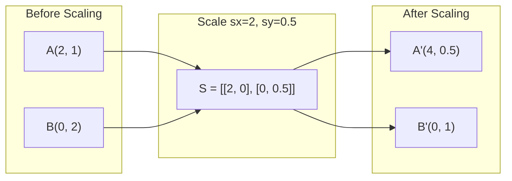
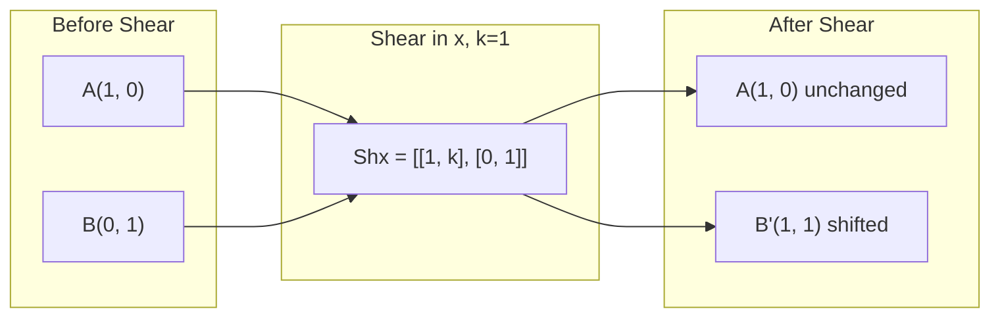
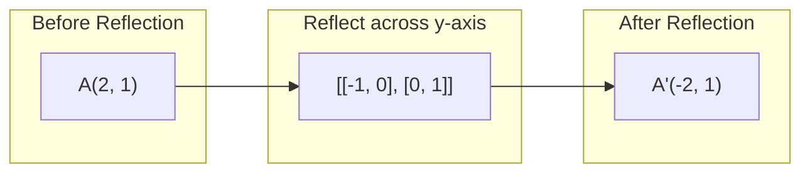
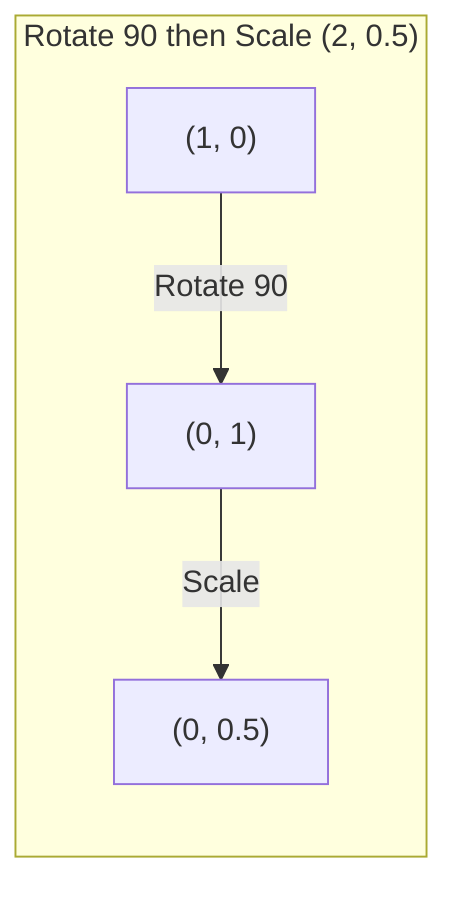
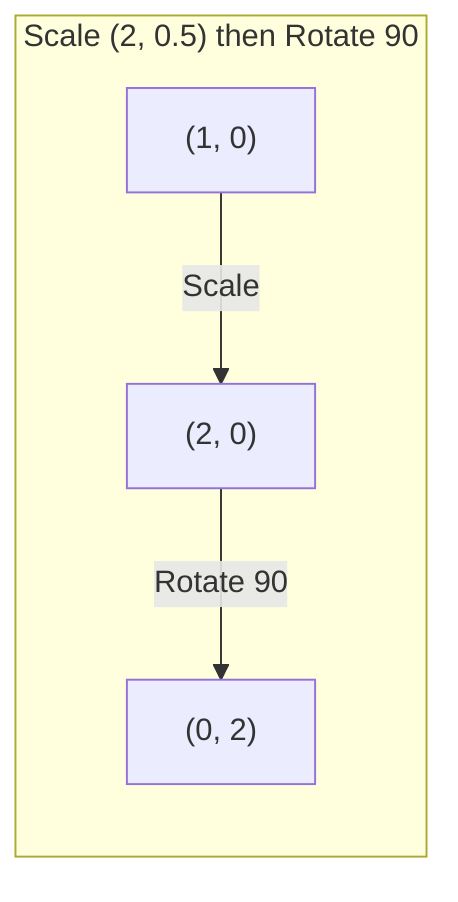

# Les transformations de la matrice

> Une matrice est une machine qui remodèle l'espace. Apprenez ce qu'elle fait à chaque point, et vous comprenez toute la transformation.

> La matrice est une machine de "réforme de l'espace". Comprendre son rôle sur chaque point, c'est comprendre l'ensemble des changements.

**Type:** Build | **类型:** 动手
**Languages:** Python, Julia | **语言:** Python, Julia
**Prerequisites:** Phase 1, Lessons 01-02 (Linear Algebra Intuition, Vectors & Matrices Operations) | **前置知识:** Phase 1, Lessons 01-02（线性代数直觉、向量与矩阵运算）
**Time:** ~75 minutes | **时间:** ~75 分钟

## Objectifs d'apprentissage

- Construire des matrices de rotation, d'échelle, de découpe et de réflexion et les appliquer aux points 2D et 3D
  construire des rotations, des éclaboussures, des coups, des réflexions et des réflexions pour les points 2D et 3D
- Composer plusieurs transformations par multiplication de matrice et vérifier que l'ordre est important
  通过矩阵乘法组合多个变变, l'importance du séquence de vérification
- Compute les valeurs propres et les propres vecteurs des matrices 2x2 à partir de l'équation caractéristique
  Compte de la caractéristique équation 2x2  valeurs de caractéristique et de la caractéristique de la matrice
- Expliquer pourquoi les valeurs propres déterminent les directions PCA, la stabilité RNN et le comportement de regroupement spectrique
  解释特征值为何决定 PCA 方向、RNN 稳定性和谱聚类行为

> **【中文解读】**
> La matrice est le changement de rotation, de resserrement, de coupage, de reprise de l'espace. Après avoir compris le sens géométrique de la matrice, la PCA, la RNN, la stabilité, la répartition des classes de spectre sont devenues intuitives.

> **【拓展：特征值/特征向量在 AI 中的位置】**
> - **PCA（主成分分析）**: trouver la dimension caractéristique de la matrice de la différence de données, c'est la direction la plus large de la différence de données.
> - **RNN 稳定性**Si la valeur absolue de la caractéristique de la matrice de poids est supérieure à 1, le taux d'augmentation du taux d'explosion du taux d'augmentation du taux d'augmentation du taux d'augmentation du taux d'augmentation du taux d'augmentation du taux d'augmentation du taux d'augmentation du taux d'augmentation du taux d'augmentation du taux d'augmentation du taux d'augmentation du taux d'augmentation du taux d'augmentation du taux d'augmentation du taux d'augmentation du taux d'augmentation du taux d'augmentation du taux d'augmentation du taux d'augmentation du taux d'augmentation du taux d'augmentation du taux d'augmentation du taux d'augmentation du taux d'augmentation du taux d'augmentation du taux d'augmentation du taux d'augmentation du taux d'augmentation du taux d'augmentation du taux d'augmentation du taux d'augmentation du taux d'augmentation du taux d'augmentation du taux d'augmentation du taux d'augmentation du taux d'augmentation du taux de diminution du taux de diminution du taux de diminution du taux de diminution du taux de diminution du taux de diminution du taux de diminution du taux de diminution du taux de diminution du taux de diminution du taux de diminution du taux de diminution du taux de diminution du taux de diminution du taux de diminution du taux de diminution du taux de diminution du taux de la proportion de diminution du taux de diminution du taux de diminution du taux de la proportion de diminution du taux de diminution du taux de la proportion de diminution du taux de la proportion de diminution du taux de diminution du taux de la proportion de diminution du taux de la proportion de diminution du taux de la proportion de diminution du taux de la proportion de la d'augmentation du taux de la proportion de la proportion de la proportion de la proportion de la proportion de diminution du taux de la d'augmentation du taux d'augmentation du taux d'augmentation du taux de la proportion de la d'augmentation du taux d'augmentation du taux de la proportion de la proportion de la proportion de la proportion de la d'augmentation du taux de la d'augmentation du taux d
> - **谱聚类**: Utiliser les traits de la matrice de Tulapras pour effectuer un regroupement, plutôt que K-Means pour mieux adapter les données non sphériques.

## Le problème , l' introduction du problème

> **【中文解读】**PCA dit " trouver des caractéristiques de la matrice de différence de coupe ", modèle de stabilité dit " vérifier si la valeur des caractéristiques est inférieure à 1 ", données augmentent dit " rotation au fil du temps " tout cela nécessite de comprendre les changements géographiques de la matrice à l'espace.

## Le concept de base.

> **【拓展：Transformer 中的矩阵变换】**Chaque élément de l'attention du transformateur est dans le processus de transformation de la matrice: Q=W_q·x, K=W_k·x, V=W_v·x, dont W_q/W_k/W_v est un processus d'apprentissage de transformation de la matrice.

### Transformations en matrices

Chaque transformation linéaire en 2D peut être écrite comme une matrice 2x2. La matrice vous dit exactement où les vecteurs de base [1, 0] et [0, 1] finissent.

> Chaque changement de ligne dans l'espace de deux dimensions peut être écrit en une matrice 2x2 . La matrice vous dit que la masse de base [1, 0] et [0, 1] est changée jusqu'à où, le reste de tout est décidé par elle.

> 矩阵的列就是变换后的基向量──如果矩阵第一列是 [2, 0],说明 e1=[1,0] 被映射到 [2,0](沿 x 轴拉伸 2 倍)──



### Retour

Une rotation 2D par angle theta maintient les distances et les angles intacts.

> Deux dimensions de rotation pour maintenir la distance et l'angle inchangés, chaque point se déplaçant le long d'un arc circulaire.

> 旋转矩阵 R(θ) = [[cosθ, -sinθ], [sinθ, cosθ]]。θ 为正表示逆时针旋转。R^T = R^(-1),转置即逆旋转。



En 3D, vous tournez autour d'un axe.

> Dans trois dimensions, vous tournez autour d'un axe. Chaque axe a sa propre rotation.

```
Rz(theta) = | cos  -sin  0 |     Rotate around z-axis
            | sin   cos  0 |     (x-y plane spins, z stays)
            |  0     0   1 |

Rx(theta) = | 1   0     0    |   Rotate around x-axis
            | 0  cos  -sin   |   (y-z plane spins, x stays)
            | 0  sin   cos   |

Ry(theta) = |  cos  0  sin |     Rotate around y-axis
            |   0   1   0  |     (x-z plane spins, y stays)
            | -sin  0  cos |
```

### Écalement

Les étirements ou les compressions de l'échelle se font indépendamment le long de chaque axe.

> 缩放沿每轴独立地拉伸或压缩──

> 缩放矩阵 S = [sx, 0], [0, sy]]―sx、sy peuvent être différentes──



### Coupe de poing

Le découpeur incline un axe tout en maintenant l'autre fixe.

> 切切使一个轴倾斜而保持另一个轴固定,将矩形变成平行四边形.

> 剪切保持面积不变(行列式=1) ・・・ Imagine une 克牌向一边推:底牌不动,顶牌平移──



Matrices de découpe:
- `Shx = [[1, k], [0, 1]]`délocalisations x par k * y
- `Shy = [[1, 0], [k, 1]]`délocalises y par k * x

> 剪切矩阵:`Shx`沿 y 偏移 x(x 新 = x + k*y),`Shy`沿 x 偏移 y(y 新 = y + k*x) 』

### Réflexion

Les reflets reflètent les points sur un axe ou une ligne.

> Réflexion sera pointée sur un certain axis ou ligne de faire des miroirs.

> Réaction changeant direction (réaction = 1) mais maintenant une distance (réaction = 1)



Matrices de réflexion:
- Réflexion à travers l' axe y: `[[-1, 0], [0, 1]]`
- Reflectez à travers l' axe x: `[[1, 0], [0, -1]]`

> Réaction de l'action`[[-1, 0], [0, 1]]`, à propos de l' x axes de réflexion`[[1, 0], [0, -1]]`Il y a une autre.

### Composition: transformations de chaîne

Appliquer la transformation A puis B est la même chose que de multiplier leurs matrices: `result = B @ A @ point`La rotation donne des résultats différents de la rotation.

> Précédent de modification A Rectifier de modification B est égal à la multiplication de leur matrice:`result = B @ A @ point`◊ L'ordre est important  Le résultat du premier cycle est différent du résultat du premier cycle 

> C'est pourquoi la séquence n. de PyTorch est strictement appliquée en mode de séquence, et la séquence de la matrice multiplie en mode de séquence en réaction de transmission en transposition automatique.



Composé: `S @ R = [[0, -2], [0.5, 0]]`

> Avant de se retourner 90° de nouveau (2, 0,5): de (1,0) → 旋转后 (0,1) → 缩放后 (0, 0,5)──组合矩阵 S @ R = [[0, -2], [0,5, 0]]──



Composé: `R @ S = [[0, -0.5], [2, 0]]`

> Avant de se réduire (2, 0,5) Re-rotation 90°: de (1,0) → 缩放后 (2, 0) → 旋转后 (0, 2) ――组合矩阵 R @ S = [[0, -0,5], [2, 0]],与上完全不同──

La multiplication de matrice n'est pas commutative.

> 结果不同──矩阵乘法不满足交换律这就是为什么变压器注意力中 Q、K、V 的相乘顺序至关重要──

### Value propre et vecteurs propres

La plupart des vecteurs changent de direction lorsqu'une matrice les atteint. Les vecteurs propres sont spéciaux: la matrice ne les étalonne que, ne les rotate jamais. Le facteur d'échelle est la valeur propre.

> La plupart des vecteurs sont modifiés par la matrice, mais la direction est modifiée.

> 几何直觉: le trait de la ligne est le changement de direction dans la direction de la ligne.

```
A @ v = lambda * v

v is the eigenvector (direction that survives)
lambda is the eigenvalue (how much it stretches)

Example: A = | 2  1 |
             | 1  2 |

Eigenvector [1, 1] with eigenvalue 3:
  A @ [1,1] = [3, 3] = 3 * [1, 1]     (same direction, scaled by 3)

Eigenvector [1, -1] with eigenvalue 1:
  A @ [1,-1] = [1, -1] = 1 * [1, -1]  (same direction, unchanged)
```

La matrice étend l'espace de 3x le long de [1, 1] et garde [1, -1] inchangé.

> Le côté de la ligne [1, 1] est étendu 3 fois, le côté [1, -1] est maintenu.

### Composition propre

Si une matrice a n vecteurs propres indépendants linéairement, elle peut être décomposée:

> Si la matrice a n'une trace de traits sans rapport avec la masse, elle peut être divisée en A = V D V−1──

> La décomposition des caractéristiques est une décomposition de la différence de la différence de la différence de la différence de la différence de la différence de la différence de la différence de la différence de la différence de la différence de la différence de la différence de la différence de la différence de la différence de la différence de la différence de la différence de la différence de la différence de la différence de la différence de la différence de la différence de la différence de la différence de la différence de la différence de la différence de la différence de la différence de la différence de la différence de la différence de la différence de la différence.

```
A = V @ D @ V^(-1)

V = matrix whose columns are eigenvectors
D = diagonal matrix of eigenvalues
V^(-1) = inverse of V

This says: rotate into eigenvector coordinates, scale along each axis, rotate back.
```

> Cela signifie: tourner vers le symbole de l'équation, à chaque axis, revenir en arrière.

### Pourquoi les valeurs propres comptent

**PCA.**Les propres vecteurs de la matrice de covariance sont les composants principaux. Les valeurs propres vous disent combien de variance chaque composant capture.

> **PCA（主成分分析）。**La valeur de la composition de chaque composition principale indique le nombre de différences.

**Stability.**Dans les réseaux récurrents et les systèmes dynamiques, les valeurs propres avec une magnitude > 1 provoquent une explosion des sorties. La magnitude < 1 les fait disparaître.

> **稳定性。**Dans le réseau circulaire et le système d'énergie, la valeur absolue de la caractéristique > 1 entraîne une explosion de sortie, < 1 entraîne une disparition.

**Spectral methods.**Les réseaux neuraux du graphe utilisent les valeurs propres de la matrice adjacente. Le regroupement spectrique utilise les valeurs propres du Laplacien. Les propres vecteurs révèlent la structure du graphe.

> **谱方法。**Le réseau neural utilise la valeur des caractéristiques de la matrice voisine, le spectre est regroupé en utilisant la valeur des caractéristiques de la matrice rapprochée.

### Déterminant en tant que facteur d'échelle de volume

Le déterminant d'une matrice de transformation vous indique à quel point il étalonne la surface (2D) ou le volume (3D).

> La répartition de la répartition de la répartition vous indique la taille de la répartition de la répartition de la répartition de la répartition de la répartition de la répartition de la répartition de la répartition de la répartition de la répartition de la répartition de la répartition de la répartition de la répartition de la répartition de la répartition de la répartition de la répartition de la répartition de la répartition de la répartition de la répartition de la répartition de la répartition de la répartition de la répartition de la répartition de la répartition de la répartition de la répartition de la répartition de la répartition de la répartition de la répartition de la répartition de la répartition de la répartition de la répartition de la répartition de la répartition de la répartition de la répartition de la répartition de la répartition de la répartition de la répartition de la répartition de la répartition de la répartition de la répartition de la répartition de la répartition de la répartition de la répartition de la répartition de la répartition de la répartition de la répartition de la répartition de la répartition de la répartition de la répartition de la répartition de la répartition de la répartition de la répartition de la répartition de la répartition de la répartition de la répartition de la répartition de la répartition.

> dé = 0 est " catastrophe " la matrice réduit l'espace à un niveau bas (((comme 2D → 1D 线), information perdue, la matrice est irréversible。

```
det = 1:   area preserved (rotation)
det = 2:   area doubled
det = 0:   space crushed to lower dimension (singular)
det = -1:  area preserved but orientation flipped (reflection)

| det(Rotation) | = 1        (always)
| det(Scale sx, sy) | = sx * sy
| det(Shear) | = 1           (area preserved)
| det(Reflection) | = -1     (orientation flipped)
```

> Résumé: 1 de la surface de l'espace est réduite à un niveau inférieur à 1 de la surface de l'espace.

## Construisez-le et mettez-le en œuvre.
```figure
matrix-transform
```

## Faites-le

### Étape 1: Matrices de transformation à partir de zéro (Python)

> 1-Etapes: de zéro à zéro

> De la 0 réaliser rotation, élargissement, coupage, réaction de la matrice, tous les changements sont 2x2 de la matrice, réaliser aussi mat_vec_mul et mat_mul pour le changement de la masse et de la composition de la matrice.

```python
import math

def rotation_2d(theta):
    c, s = math.cos(theta), math.sin(theta)
    return [[c, -s], [s, c]]

def scaling_2d(sx, sy):
    return [[sx, 0], [0, sy]]

def shearing_2d(kx, ky):
    return [[1, kx], [ky, 1]]

def reflection_x():
    return [[1, 0], [0, -1]]

def reflection_y():
    return [[-1, 0], [0, 1]]

def mat_vec_mul(matrix, vector):
    return [
        sum(matrix[i][j] * vector[j] for j in range(len(vector)))
        for i in range(len(matrix))
    ]

def mat_mul(a, b):
    rows_a, cols_b = len(a), len(b[0])
    cols_a = len(a[0])
    return [
        [sum(a[i][k] * b[k][j] for k in range(cols_a)) for j in range(cols_b)]
        for i in range(rows_a)
    ]

point = [1.0, 0.0]
angle = math.pi / 4

rotated = mat_vec_mul(rotation_2d(angle), point)
print(f"Rotate (1,0) by 45 deg: ({rotated[0]:.4f}, {rotated[1]:.4f})")

scaled = mat_vec_mul(scaling_2d(2, 3), [1.0, 1.0])
print(f"Scale (1,1) by (2,3): ({scaled[0]:.1f}, {scaled[1]:.1f})")

sheared = mat_vec_mul(shearing_2d(1, 0), [1.0, 1.0])
print(f"Shear (1,1) kx=1: ({sheared[0]:.1f}, {sheared[1]:.1f})")

reflected = mat_vec_mul(reflection_y(), [2.0, 1.0])
print(f"Reflect (2,1) across y: ({reflected[0]:.1f}, {reflected[1]:.1f})")
```

### Étape 2: Composition des transformations

> Deuxième étape: changement de composition

> 验证矩阵乘法不可交换:先旋转90° 再缩放 (2, 0.5) et先缩放再旋转 obtiennent des résultats totalement différents.

```python
R = rotation_2d(math.pi / 2)
S = scaling_2d(2, 0.5)

rotate_then_scale = mat_mul(S, R)
scale_then_rotate = mat_mul(R, S)

point = [1.0, 0.0]
result1 = mat_vec_mul(rotate_then_scale, point)
result2 = mat_vec_mul(scale_then_rotate, point)

print(f"Rotate 90 then scale: ({result1[0]:.2f}, {result1[1]:.2f})")
print(f"Scale then rotate 90: ({result2[0]:.2f}, {result2[1]:.2f})")
print(f"Same? {result1 == result2}")
```

> 验证: premier tour et puis élargissement, le résultat est différent du premier tour et après élargissement.

### Étape 3: Value propre à partir de zéro (2x2)

> 第3 étape: à partir de la valeur des caractéristiques de calcul

> 2x2 矩阵的特征值通过解二次方程 λ2 - trace·λ + det = 0 得到, dont trace=a+d,det=ad-bc。特征向量通过 (A - λI) v = 0 求解。

Pour une matrice 2x2 `[[a, b], [c, d]]`, les valeurs propres résolvent l'équation caractéristique: `lambda^2 - (a+d)*lambda + (ad - bc) = 0`- Je suis désolé .

> Pour 2x2`[[a, b], [c, d]]`,特征值满足特征方程 λ2 - (a+d)λ + (ad-bc) = 0── parmi lesquels (a+d) est une trace, (ad-bc) est une marche.

```python
def eigenvalues_2x2(matrix):
    a, b = matrix[0]
    c, d = matrix[1]
    trace = a + d
    det = a * d - b * c
    discriminant = trace ** 2 - 4 * det
    if discriminant < 0:
        real = trace / 2
        imag = (-discriminant) ** 0.5 / 2
        return (complex(real, imag), complex(real, -imag))
    sqrt_disc = discriminant ** 0.5
    return ((trace + sqrt_disc) / 2, (trace - sqrt_disc) / 2)

def eigenvector_2x2(matrix, eigenvalue):
    a, b = matrix[0]
    c, d = matrix[1]
    if abs(b) > 1e-10:
        v = [b, eigenvalue - a]
    elif abs(c) > 1e-10:
        v = [eigenvalue - d, c]
    else:
        if abs(a - eigenvalue) < 1e-10:
            v = [1, 0]
        else:
            v = [0, 1]
    mag = (v[0] ** 2 + v[1] ** 2) ** 0.5
    return [v[0] / mag, v[1] / mag]

A = [[2, 1], [1, 2]]
vals = eigenvalues_2x2(A)
print(f"Matrix: {A}")
print(f"Eigenvalues: {vals[0]:.4f}, {vals[1]:.4f}")

for val in vals:
    vec = eigenvector_2x2(A, val)
    result = mat_vec_mul(A, vec)
    scaled = [val * vec[0], val * vec[1]]
    print(f"  lambda={val:.1f}, v={[round(x,4) for x in vec]}")
    print(f"    A@v = {[round(x,4) for x in result]}")
    print(f"    l*v = {[round(x,4) for x in scaled]}")
```

> 验证 A=[[2,1],[1,2]] de la valeur des caractéristiques est 3 和 1,对应特征向量 [1,1]/√2 和 [1,-1]/√2。验证 A@v = λ×v 成立。

### Étape 4: Déterminant en tant que facteur d'échelle de volume

> 第4 étape: la ligne de conduite en tant que facteur de taille réduite

```python
def det_2x2(matrix):
    return matrix[0][0] * matrix[1][1] - matrix[0][1] * matrix[1][0]

print(f"det(rotation 45) = {det_2x2(rotation_2d(math.pi/4)):.4f}")
print(f"det(scale 2,3)   = {det_2x2(scaling_2d(2, 3)):.1f}")
print(f"det(shear kx=1)  = {det_2x2(shearing_2d(1, 0)):.1f}")
print(f"det(reflect y)   = {det_2x2(reflection_y()):.1f}")

singular = [[1, 2], [2, 4]]
print(f"det(singular)     = {det_2x2(singular):.1f}")
print("Singular: columns are proportional, space collapses to a line.")
```

> Exemple de la ligne de référence: [1, 2], [2, 4]]: le nombre de lignes est 0, car les lignes sont proportionnelles.

## Utilisez-le avec le cadre de réalisation

NumPy gère tout cela avec des routines optimisées.

> NumPy utilise des méthodes d'optimisation pour traiter toutes ces opérations.

> NumPy `np.linalg.eig`et `np.linalg.det`底层调用 LAPACK(C/Fortran 写的线性代数库),比手写 Python 快 100-1000 倍──

```python
import numpy as np

theta = np.pi / 4
R = np.array([[np.cos(theta), -np.sin(theta)],
              [np.sin(theta),  np.cos(theta)]])

point = np.array([1.0, 0.0])
print(f"Rotate (1,0) by 45 deg: {R @ point}")

S = np.diag([2.0, 3.0])
composed = S @ R
print(f"Scale(2,3) after Rotate(45): {composed @ point}")

A = np.array([[2, 1], [1, 2]], dtype=float)
eigenvalues, eigenvectors = np.linalg.eig(A)
print(f"\nEigenvalues: {eigenvalues}")
print(f"Eigenvectors (columns):\n{eigenvectors}")

for i in range(len(eigenvalues)):
    v = eigenvectors[:, i]
    lam = eigenvalues[i]
    print(f"  A @ v{i} = {A @ v}, lambda * v{i} = {lam * v}")

print(f"\ndet(R) = {np.linalg.det(R):.4f}")
print(f"det(S) = {np.linalg.det(S):.1f}")

B = np.array([[3, 1], [0, 2]], dtype=float)
vals, vecs = np.linalg.eig(B)
D = np.diag(vals)
V = vecs
reconstructed = V @ D @ np.linalg.inv(V)
print(f"\nEigendecomposition A = V @ D @ V^-1:")
print(f"Original:\n{B}")
print(f"Reconstructed:\n{reconstructed}")
```

> C'est ainsi que toute matrice de réglage peut être décomposée en " rotation → resserrement → rentrée " trois étapes.

### Rotations 3D avec NumPy

```python
def rotation_3d_z(theta):
    c, s = np.cos(theta), np.sin(theta)
    return np.array([[c, -s, 0], [s, c, 0], [0, 0, 1]])

def rotation_3d_x(theta):
    c, s = np.cos(theta), np.sin(theta)
    return np.array([[1, 0, 0], [0, c, -s], [0, s, c]])

point_3d = np.array([1.0, 0.0, 0.0])
rotated_z = rotation_3d_z(np.pi / 2) @ point_3d
rotated_x = rotation_3d_x(np.pi / 2) @ point_3d

print(f"\n3D point: {point_3d}")
print(f"Rotate 90 around z: {np.round(rotated_z, 4)}")
print(f"Rotate 90 around x: {np.round(rotated_x, 4)}")
```

> NumPy  Réalisation de la 3D  Rotation de la matrice: autour de z 轴 et autour de x 轴 chacun a une 3x3  rotation indépendante de la matrice ⋅ 3D 图形学、机器人学、计算机视觉都依赖这些矩阵──

## Envoyez-le . Produit .

Cette leçon construit les bases géométriques de l'analyse de la PCA (phase 2) et du poids du réseau neuronal. Le code de valeur propre/eigenvecteur construit ici est le même algorithme qui alimente la réduction de dimensionnalité, le regroupement spectrique et l'analyse de stabilité dans les systèmes ML de production.

> Ce cours a construit la géométrie de l'analyse de la PCA (Phase 2) et du poids de réseau neuronal.

> Le code peut être directement utilisé pour comprendre les sujets de haut niveau tels que PCA, génétique, génétique, génétique, génétique, génétique, génétique, génétique, génétique, génétique, génétique, génétique, génétique, génétique, génétique, génétique, génétique, génétique, génétique, génétique, génétique, génétique, génétique, génétique, génétique, génétique, génétique, génétique, génétique, génétique, génétique, génétique, génétique, génétique, génétique, génétique, génétique, génétique, génétique, génétique, génétique, génétique, génétique, génétique, génétique, génétique, génétique, génétique, génétique, génétique, génétique, génétique, génétique, génétique, génétique, génétique, génétique, génétique, génétique, génétique, génétique, génétique, génétique, génétique, génétique, génétique, génétique, génétique, génétique, génétique, génétique, génétique, génétique, génétique, génétique, génétique, génétique, génétique, génétique, génétique, génétique, génétique, génétique, génétique, génétique, génétique, génétique, génétique, génétique, génétique, génétique, géné.

## Les exercices

1. Appliquez la rotation, l'échelle et la découpe sur un carré unitaire (cornes à [0,0], [1,0], [1,1], [0,1]). Imprimez les coins transformés pour chacun. Vérifiez que la rotation préserve les distances entre les coins.
   Pour chaque unité de forme carrée ((角在 [0,0]、[1,0]、[1,1]、[0,1]) appliquer le rotation, l'agrandissement, la taille, l'impression de chaque changement de côté de la corde.

2. Trouvez les valeurs propres de la matrice [[4, 2], [1, 3]] à la main en utilisant l'équation caractéristique.
   Hand工用特征方程求矩阵的特征值 [4, 2], [1, 3], puis utiliser de la fonction et du NumPy 验证从零实现的函数和从零实现的函数和NumPy 验证──

3. Créer une composition de trois transformations (rotation de 30 degrés, échelle par [1,5, 0,8], coupe avec kx=0,3) et appliquer à 8 points disposés dans un cercle. Imprimer avant et après les coordonnées. Compute le déterminant de la matrice composée et vérifier qu'il est égal au produit des déterminants individuels.
   组合三个变换(旋转30°、缩放 [1.5, 0.8]、剪切 kx=0.3), appliqué à 8 个点圆上的.

## Les termes clés

| Term | What people say | What it actually means |
|------|----------------|----------------------|
| Rotation matrix | "Spins things" | An orthogonal matrix that moves points along circular arcs while preserving distances and angles. Determinant is always 1. |
| Scaling matrix | "Makes things bigger" | A diagonal matrix that stretches or compresses independently along each axis. Determinant is the product of scale factors. |
| Shearing matrix | "Slants things" | A matrix that shifts one coordinate proportionally to another, turning rectangles into parallelograms. Determinant is 1. |
| Reflection | "Mirrors things" | A matrix that flips space across an axis or plane. Determinant is -1. |
| Composition | "Do two things" | Multiplying transformation matrices to chain operations. Order matters: B @ A means apply A first, then B. |
| Eigenvector | "Special direction" | A direction that the matrix only scales, never rotates. The transformation's fingerprint. |
| Eigenvalue | "How much it stretches" | The scalar factor by which the matrix scales its eigenvector. Can be negative (flip) or complex (rotation). |
| Eigendecomposition | "Break the matrix apart" | Writing a matrix as V @ D @ V^(-1), separating it into its fundamental scaling directions and magnitudes. |
| Determinant | "A single number from a matrix" | The factor by which the transformation scales area (2D) or volume (3D). Zero means the transformation is irreversible. |
| Characteristic equation | "Where eigenvalues come from" | det(A - lambda * I) = 0. The polynomial whose roots are the eigenvalues. |

> 术语速查:Matrice de rotation(矩阵旋转,正交,行列式=1) √Matrice d'échelle(矩阵缩缩,对角) √Scaring(剪切,矩形→平行四边形) √Réflexion(反射,行列式=-1) √Composition(组合,B@A 表示先 A 后 B) √Eigenvector(特征向量,只缩放不值旋转的方向) √Eigenvalue(特征缩放倍数,可为负负或复数) √Eigendecomposition √特征分解 A=VDV−1) √Determinant行列式,面积/体积缩放因子,0 = 奇异) √ Caractéristique de l'équation √特征方程 √A-λ-I=0) √

## Encore une lecture

- [3Blue1Brown: Linear Transformations](https://www.3blue1brown.com/lessons/linear-transformations)-- l'intuition visuelle pour la façon dont les matrices remodelent l'espace
- [3Blue1Brown: Eigenvectors and Eigenvalues](https://www.3blue1brown.com/lessons/eigenvalues)-- la meilleure explication visuelle de ce que les propres vecteurs signifient géométriquement
- [MIT 18.06 Lecture 21: Eigenvalues and Eigenvectors](https://ocw.mit.edu/courses/18-06-linear-algebra-spring-2010/)- Le traitement classique de Gilbert Strang
