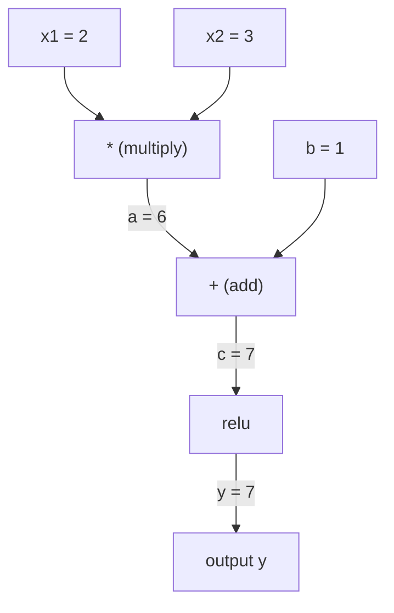
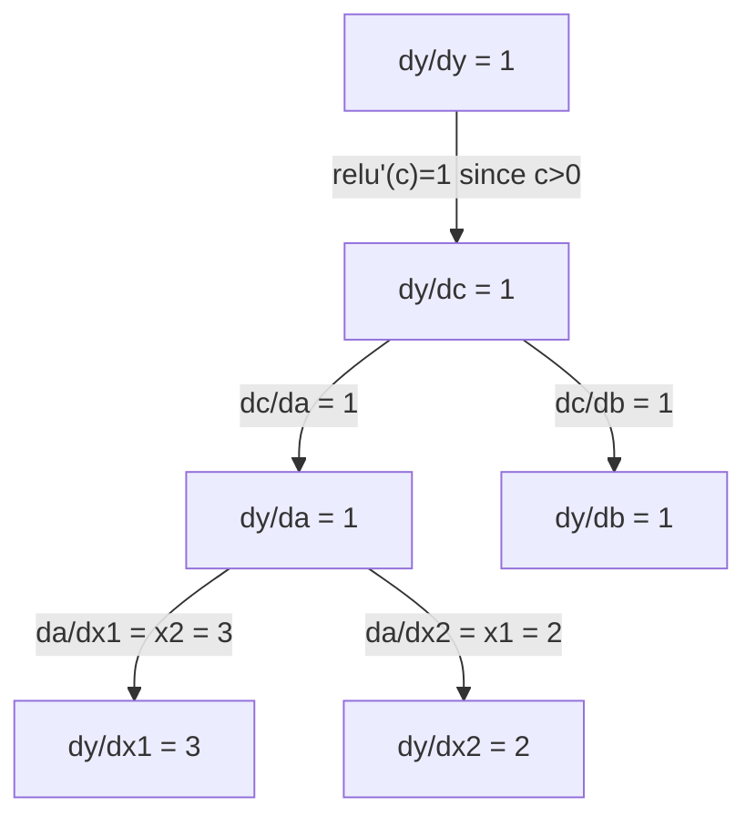

# Règles de chaîne et différenciation automatique

> La règle de la chaîne est le moteur derrière chaque réseau neuronal qui apprend.

**Type:** Build | **类型:** 动手
**Language:**Je suis un Python .**语言:**Python
**Prerequisites:** Phase 1, Lesson 04 (Derivatives & Gradients) | **前置知识:** Phase 1, Lesson 04（导数与梯度）
**Time:** ~90 minutes | **时间:** ~90 分钟

## Objectifs d'apprentissage

- Construire un moteur autograd minimal (classe de valeur) qui enregistre les opérations et calcule les gradients via l'autodiff en mode inverse
  构建最小化 autograd 引擎(Value 类),记录运算并通过反向模式自动微分计算梯度
- Implémenter des passages vers l'avant et vers l'arrière à travers un graphique de calcul en utilisant le tri topologique
  Utilisation de la distribution de l'ordre pour réaliser la propagation du calcul avant et contre
- Construire et entraîner un perceptron multicouche sur XOR en utilisant uniquement le moteur autograd de zéro
   utiliser uniquement un moteur autograd réalisé à partir de zéro construire et entraîner XOR à la machine de perception multi-couches
- Vérifiez la précision de l'auto-diffusion en utilisant la vérification des gradients contre les différences finites numériques
  Avec un nombre limité de différences pour effectuer des vérifications de degré, vérifier la validité de l'autodéfense

> **【中文解读】**
> Le système de chaînes est un système de chaînes qui est composé de plusieurs centaines de fonctions.

> **【拓展：链式法则 → 反向传播 → PyTorch autograd】**
> La loi de la chaîne est la base mathématique de la propagation de la propagation.`autograd`、TensorFlow de `GradientTape`Vous construirez un moteur de votre auto-grade à partir de zéro dans ce chapitre.

## Le problème , l' introduction du problème

Vous pouvez calculer des dérivés de fonctions simples. Mais un réseau neuronal n'est pas une fonction simple. Il s'agit de centaines de fonctions composées ensemble: matrice multipliée, ajouter biais, appliquer l'activation, matrice multipliée à nouveau, softmax, perte d'entropie croisée.

> Vous pouvez calculer la quantité de la fonction simple. Mais le réseau neuroptique n'est pas une simple fonction. Il s'agit d'une combinaison de centaines de fonctions: la fonction de la fonction multiplicative, la fonction de la fonction de la fonction de la fonction de la fonction de la fonction de la fonction de la fonction de la fonction de la fonction de la fonction de la fonction de la fonction de la fonction de la fonction de la fonction de la fonction de la fonction de la fonction de la fonction de la fonction de la fonction de la fonction de la fonction de la fonction de la fonction de la fonction de la fonction de la fonction de la fonction de la fonction de la fonction de la fonction de la fonction de la fonction de la fonction de la fonction de la fonction de la fonction de la fonction de la fonction de la fonction de la fonction de la fonction de la fonction de la fonction de la fonction de la fonction de la fonction de la fonction de la fonction de la fonction de la fonction de la .

Pour former le réseau, il faut le gradient de perte par rapport à chaque poids. Le faire à la main est impossible pour des millions de paramètres. Le faire numériquement (différences finites) est trop lent.

> Pour entraîner le réseau, vous devez perdre à chaque échelle de poids.

La règle de la chaîne vous donne les mathématiques. La différenciation automatique vous donne l'algorithme. Ensemble, ils vous permettent de calculer des gradients exacts à travers des compositions arbitraires de fonctions dans le temps proportionnelles à un seul passage vers l'avant.

> La loi de la chaîne donne des mathématiques, la différence automatique donne des algorithmes. Les deux combinés vous permettent de calculer la gradience précise de la fonction de la chaîne de la chaîne de la chaîne de la chaîne de la chaîne de la chaîne.

C'est ainsi que PyTorch, TensorFlow et JAX fonctionnent. Vous construirez une version miniature à partir de zéro.

> C'est le travail de PyTorch, TensorFlow et JAX. Vous allez construire une version micro à partir de zéro.

> **【中文解读】**神经网络 = 函数的函数的函数──链式法则让你逐层解解复合函数的导数:dL/dw = dL/d_out × d_out/d_hidden × d_hidden/d_w──自动求导把这个过程自动化PyTorch的`backward()`Une ligne de code pour déterminer le degré des millions de paramètres

## Le concept de base.

> **【拓展：自动求导是深度学习的引擎】**PyTorch de `loss.backward()`Utilisation de la méthode de recherche automatique à l'opposé: de la sortie à la rentrée, à la chaîne de l'application à niveau.`backward()`Une fois, on peut calculer la gradience de tous les paramètres. Sans guide automatique, l'apprentissage en profondeur est impossible à traiter avec un modèle aussi énorme.

### La règle de la chaîne

Si vous`y = f(g(x))`, le dérivé de `y`en ce qui concerne `x`est:

> Si `y = f(g(x))`,y pour x est:

```
dy/dx = dy/dg * dg/dx = f'(g(x)) * g'(x)
```

Multipliez les dérivés le long de la chaîne.

> 沿链路乘导数―― chaque étape contribue à sa direction locale――

Exemple: `y = sin(x^2)`

```
g(x) = x^2       g'(x) = 2x
f(g) = sin(g)     f'(g) = cos(g)

dy/dx = cos(x^2) * 2x
```

> Pour les autres, le nombre de cycles est de 2, x x x x x x x x x x x x x x x x x x x x x x x x x x x x x x x x x x x x x x x x x x x x x x x x x x x x x x x x x x x x x x x x x x x x x x x x x x x x x x x x x x x x x x x x x x x x x x x x x x x x x x x x x x x x x x x x x x x x x x x x x x x x x x x x x x x x x x x x x x x x x x x x x x x x x x x x x x x x x x x x x x x x x x x x x x x x x x x x x x x x x x x x x x x x x x x x x x x x x x x x x x x x x x x x x x x x x x x x x x x x x x x x x x x x x x x x x x x x x x x x x x x x x x x x x x x x x x x x x x x x x x x x x x x x x x x x x x x x x x x x x x x x x x x x x x x x x x x x x x x x x x x x x x x x x x x x x x x x x x x x x x x x x x x x x x x x x x x x x x x x x x x x x x x x x x x x x x x x x x x x x x x x x x x x x x x x x x x x x x x x x x x x x x x x x x x x x x x x x x x x x x x x x x x x x x x x x x x x x x x x x x x x x x x x x x x x x x x x x x x x x x x x x x x x x x x x x x x x x x x x x x x x x x x x x x x x x x x x x x x x x x x x x x x x x x x x x x x x x x

Pour les compositions plus profondes, la chaîne s'étend:

```
y = f(g(h(x)))

dy/dx = f'(g(h(x))) * g'(h(x)) * h'(x)
```

> Y'a été ajouté à la liste des éléments suivants:

Chaque couche d'un réseau neuronal est un seul maillon de cette chaîne.

> Chaque couche du réseau neural est un élément de cette chaîne.

### Graphiques de calcul

Un graphique de calcul rend la règle de la chaîne visuelle. Chaque opération devient un nœud. Les données circulent vers l'avant à travers le graphique.

> 計算圖讓链式法则可視化── chaque opération devient un nœud, les données fluctuent vers l'avant, les échelles fluent vers l'arrière──

> 计算图是 PyTorch autograd's abstraction de base:节点是运算,前向时存储中值,反向时计算局部梯度,

**Forward pass (compute values):**



**Backward pass (compute gradients):**



Le passage à l'arrière applique la règle de la chaîne à chaque nœud, propagant les gradients de la sortie aux entrées.

> En effet, la propagation inverse à chaque point de l'application de la chaîne de l'ordre, sera la échelle de propagation de l'extrait à l'entrée.

### Mode avant vers le mode arrière

Il y a deux façons d'appliquer la règle de la chaîne à travers un graphique.

> Il existe deux façons de calculer la loi de la chaîne.

**Forward mode**Il commence par les entrées et pousse les dérivés vers l'avant.`dx/dx = 1`C'est bon quand on a peu d'entrée et beaucoup de sortie.

> **前向模式**De l'entrée à la progression à la progression à la progression.`dx/dx = 1`Il est également utilisé pour la transmission de données.

```
Forward mode: seed dx/dx = 1, propagate forward

  x = 2       (dx/dx = 1)
  a = x^2     (da/dx = 2x = 4)
  y = sin(a)  (dy/dx = cos(a) * da/dx = cos(4) * 4 = -2.615)
```

**Reverse mode**Il commence à la sortie et tire les gradients en arrière.`dy/dy = 1`Il est bon quand vous avez beaucoup d'entrées et peu de sorties.

> **反向模式**De la sortie à la sortie à la sortie à la sortie.`dy/dy = 1`Il est inversement par chaque opération. Lorsque l'entrée est trop grande, l'entrée est trop petite.

```
Reverse mode: seed dy/dy = 1, propagate backward

  y = sin(a)  (dy/dy = 1)
  a = x^2     (dy/da = cos(a) = cos(4) = -0.654)
  x = 2       (dy/dx = dy/da * da/dx = -0.654 * 4 = -2.615)
```

Les réseaux neuronaux ont des millions d'entrées (poids) et une sortie (perte). Le mode inverse calcule tous les gradients dans un seul passage arrière. C'est pourquoi la propagation arrière utilise le mode inverse.

> Le réseau neural a un million d'entrées et de pertes.

| Mode | Seed | Direction | Best when |
|------|------|-----------|-----------|
| Forward | `dx_i/dx_i = 1` | Input to output | Few inputs, many outputs |
| Reverse | `dy/dy = 1` | Output to input | Many inputs, few outputs (neural nets) |

> 两种模式对比:前向模式种子 dx/dx = 1,输入到输出,适合少输入多输出;反向模式种子 dy/dy = 1,输出到输入,适合多输入少输出(réseau du cerveau)

### Numéros doubles pour le mode avant

Le mode avant peut être mis en œuvre avec élégance avec des nombres doubles.`a + b*epsilon`où `epsilon^2 = 0`- Je suis désolé .

> Le modèle de pré-orientation peut être réalisé avec une forme de parité.`a + b*ε`, parmi lesquels `ε² = 0`Il y a une autre.

```
Dual number: (value, derivative)

(2, 1) means: value is 2, derivative w.r.t. x is 1

Arithmetic rules:
  (a, a') + (b, b') = (a+b, a'+b')
  (a, a') * (b, b') = (a*b, a'*b + a*b')
  sin(a, a')         = (sin(a), cos(a)*a')
```

> Pour le nombre d'occasions: (((value, 导数) ―― règle d'algorithme:加法对应分量相加;乘法用积的求导法则;sin 用链式法则。把输入的导数种子设为1,导数会自动通过每个运算传播。

Sélectionnez la variable d'entrée avec dérivé 1. La dérivé se propage automatiquement à chaque opération.

> Pour les variables d'entrée, les nombres de référence sont placés en 1, les nombres de référence sont automatiquement diffusés par chaque calcul.

### Construire un moteur Autograd

Un moteur autograd a besoin de trois choses:

1. **Value wrapping.**Enveloppez chaque nombre dans un objet qui stocke sa valeur et son gradient.
2. **Graph recording.**Chaque opération enregistre ses entrées et la fonction de gradient local.
3. **Backward pass.**On triera le graphique topologiquement, puis on le marche à l'envers, en appliquant la règle de la chaîne à chaque nœud.

> Autograd Motore a besoin de trois choses: 1.**数值包装**: mettre chaque chiffre en emballage en objet de valeur de stockage et de gradience;**图记录**: chaque opération enregistre ses entrées et fonction de degré local;**反向传播**: à chaque étape, à chaque étape, à chaque étape, à chaque étape, à chaque étape, à chaque étape.

C'est exactement ce que PyTorch est.`autograd`- Il est.`torch.Tensor`classe enveloppe les valeurs, enregistre les opérations lorsque `requires_grad=True`, et compute les gradients quand vous appelez `.backward()`- Je suis désolé .

> C' est la PyTorch.`autograd`Faire quelque chose.`torch.Tensor`包装数值,当 `requires_grad=True`时记录操作,调用 `.backward()`Il y a une grande différence.

### Comment fonctionne le pyTorch Autograd sous le capot

Quand vous écrivez le code PyTorch:

```python
x = torch.tensor(2.0, requires_grad=True)
y = x ** 2 + 3 * x + 1
y.backward()
print(x.grad)  # 7.0 = 2*x + 3 = 2*2 + 3
```

> Quand vous écrivez PyTorch 代码时:x 设 requires_grad=True,运算自动记录,调用倒向() 后 x.grad 自动算出梯度 7.0。

PyTorch à l'intérieur:

1. C' est une`Tensor`nœud pour `x`avec `requires_grad=True`
2. Chaque opération (`**`- Je suis là .`*`- Je suis là .`+`) crée un nouveau nœud et enregistre la fonction rétroactive
3. `y.backward()`déclenche le démarrage automatique en mode inverse à travers le graphique enregistré
4. Chaque nœud est `grad_fn`Compute les gradients locaux et les passe aux nœuds parents
5. Les gradients s' accumulent dans `.grad`attributs par addition (pas remplacement)

> PyTorch 内部:1) Pour x  créer le point de tension;2) Chaque calcul (**、*、+) Créer un nouveau point et enregistrer la fonction inversée;3) y.backward() 触发反向自动微分;4) Chaque point de grad_fn 计算局部梯度并传给父节点;5) 梯度通过加法累积到 .grad 属性(不是替代)

Le graphique est dynamique (définition par course). Un nouveau graphique est construit sur chaque passage avant.

> 計算圖是動态的 (~) ‧définir par exécution (~) ‧ 每次前向传播都构建新图──这是PyTorch 支持模型内部控制流 (~) ‧如果/else、循环) 的原因──

## Construisez-le et mettez-le en œuvre.
```figure
chain-rule
```

## Faites-le

### Étape 1: La classe de valeur

```python
class Value:
    def __init__(self, data, children=(), op=''):
        self.data = data
        self.grad = 0.0
        self._backward = lambda: None
        self._prev = set(children)
        self._op = op

    def __repr__(self):
        return f"Value(data={self.data:.4f}, grad={self.grad:.4f})"
```

> La valeur 类是 l'architecture de données de l'autograde. Chaque valeur est la valeur de la valeur de stockage, la gradience, la direction inverse de la fonction et le point de départ.

Chaque .`Value`stocke ses données numériques, son gradient (initialement zéro), une fonction rétroactive et pointe vers les nœuds enfants qui l'ont produit.

> Chaque .`Value`存储数值、梯度(初始为零) 、反向函数和产生它的子节点指针──

### Étape 2: Opérations arithmétiques avec suivi des gradients

```python
    def __add__(self, other):
        other = other if isinstance(other, Value) else Value(other)
        out = Value(self.data + other.data, (self, other), '+')
        def _backward():
            self.grad += out.grad
            other.grad += out.grad
        out._backward = _backward
        return out

    def __mul__(self, other):
        other = other if isinstance(other, Value) else Value(other)
        out = Value(self.data * other.data, (self, other), '*')
        def _backward():
            self.grad += other.data * out.grad
            other.grad += self.data * out.grad
        out._backward = _backward
        return out

    def relu(self):
        out = Value(max(0, self.data), (self,), 'relu')
        def _backward():
            self.grad += (1.0 if out.data > 0 else 0.0) * out.grad
        out._backward = _backward
        return out
```

Chaque opération crée une fermeture qui sait calculer les gradients locaux et multiplier par le gradient en amont (`out.grad`Le `+=`traite le cas où une valeur est utilisée dans plusieurs opérations.

> Chaque opération crée un bloc, sachant comment calculer la échelle locale et la échelle de déplacement.`+=`处理一个值被多操作使用情况 (): 处理一个值被多操作使用情况 (): 处理一个值被多操作使用情况) 处理一个值被多操作的情况 (): 处理一个值被多操作被多操作被多操作被多操作被多操作被多操作被多操作被多操作被多操作被多操作被多操作被多操作被多操作被多操作被多操作被多操作被多操作被多操作被多操作被多操作被多操作被多操作被多操作被多操作被多操作被多操作被多操作被多操作被多操作被多操作被多操作被多操作被多操作被多操作被多操作被多操作被多操作被多操作被多操作被多操作被多操作被多操作被多操作被多操作被多操作被多操作被多操作被多操作被多操作被多操作被多操作被多操作被多多操作被多操作被多次被多多操作被多多多操作被多多多操作被多多多被多被多多被多被多被多被多被多被多被多被多被多被多被多被多被多被多被多被多被多被多被多被多被多被多被多被多被多被多被多被多被多被多被多被多被多被多被多被多被多被多被多被多被多被多被多被多被多被多被多被多被多被多被多被多被多被多被被多被多被多被被多被被被被被被多被被被被被多被被被被被被多被被被被被被被被被被被被被被被被被被被被被被被被被被被被被被被被被被被被被被被被被被被被被被被被被被被被被被被被被被被被被被被被被被被被被被被被被被被被被被被被被被被被被被被被被被被被被被被被被被被被被被被被被被被被被被被被被被被被被被被被被被被被被被被被被被被被被被被被

> 关键设计:加法的反向是 1(梯度直接传给两个输入),乘法的反向是另一个操作数(链式法则:d(a*b)/da = b)。relu 的反向是 0 或 1 ((取决于前向是否激活)。

### Étape 3: Pass en arrière

```python
    def backward(self):
        topo = []
        visited = set()
        def build_topo(v):
            if v not in visited:
                visited.add(v)
                for child in v._prev:
                    build_topo(child)
                topo.append(v)
        build_topo(self)

        self.grad = 1.0
        for v in reversed(topo):
            v._backward()
```

Le tri topologique assure que le gradient de chaque nœud est entièrement calculé avant de se propager à ses enfants.

> 拓排序 拓排序 拓排序 拓排序 拓排序 拓排序 拓排序 拓排序 拓排序 拓排序 拓排序 拓排序 拓排序 拓排序 拓排序 拓排序 拓排序 拓排序 拓排序 拓排序 拓排序 拓排序 拓排序 拓排序 拓排序 拓排序 拓排序 拓排序 拓排序 拓排序 拓排序 拓排序 拓排序 拓排序 拓排序 拓排序 拓排序 拓排序 拓排序 拓排序 拓排序 拓排序 拓排序 拓排序 拓排序 排序 排序 排序 排序 排序 排序 排序 排序 排序 排序 排序 排序 排序 排序 排序 排序 排序 排序 排序 排名 排名 排名 排名 排名 排名 排名 排名 排名 排名 排名 排名 排名 排名 排名 排名 排名 排名 排名 排名 排名 排名 排名 排名 排名 排名 排名 排名 排名 排名 排名 排名 排名 排名 排名 排名 排名 排名 排名 排名 排名 排名 排名 排名 排名 排名 排名 排名 排名 排名 排名 排名 排名 排名 排名 排名 排名 排名 排名 排名 排名 排名 排名 排名 排名 排名 排名 排名 排名 排名 排名 排名 排名 排名 排名 排名

> Retour en arrière (revers) 算法: d'abord avec le retour à la construction de chaque étape (revers)

### Étape 4: Plus d'opérations pour un moteur complet

La classe de valeur de base traite l'addition, la multiplication et le relou. Un véritable moteur autograd a besoin de plus. Voici les opérations dont vous avez besoin pour construire des réseaux neuronaux:

> Un véritable moteur d'autogradation a besoin de plus d'opérations:

```python
    def __neg__(self):
        return self * -1

    def __sub__(self, other):
        return self + (-other)

    def __radd__(self, other):
        return self + other

    def __rmul__(self, other):
        return self * other

    def __rsub__(self, other):
        return other + (-self)

    def __pow__(self, n):
        out = Value(self.data ** n, (self,), f'**{n}')
        def _backward():
            self.grad += n * (self.data ** (n - 1)) * out.grad
        out._backward = _backward
        return out

    def __truediv__(self, other):
        return self * (other ** -1) if isinstance(other, Value) else self * (Value(other) ** -1)

    def exp(self):
        import math
        e = math.exp(self.data)
        out = Value(e, (self,), 'exp')
        def _backward():
            self.grad += e * out.grad
        out._backward = _backward
        return out

    def log(self):
        import math
        out = Value(math.log(self.data), (self,), 'log')
        def _backward():
            self.grad += (1.0 / self.data) * out.grad
        out._backward = _backward
        return out

    def tanh(self):
        import math
        t = math.tanh(self.data)
        out = Value(t, (self,), 'tanh')
        def _backward():
            self.grad += (1 - t ** 2) * out.grad
        out._backward = _backward
        return out
```

**Why each operation matters:**

| Operation | Backward rule | Used in |
|-----------|--------------|---------|
| `__sub__` | Reuses add + neg | Loss computation (pred - target) |
| `__pow__` | n * x^(n-1) | Polynomial activations, MSE (error^2) |
| `__truediv__` | Reuses mul + pow(-1) | Normalization, learning rate scaling |
| `exp` | exp(x) * upstream | Softmax, log-likelihood |
| `log` | (1/x) * upstream | Cross-entropy loss, log probabilities |
| `tanh` | (1 - tanh^2) * upstream | Classic activation function |

> Règles de réaction à l'opération: diminution de la réaction à la réaction à la réaction à la réaction à la réaction à la réaction à la réaction à la réaction à la réaction à la réaction à la réaction à la réaction à la réaction à la réaction à la réaction à la réaction à la réaction à la réaction à la réaction à la réaction à la réaction à la réaction à la réaction à la réaction à la réaction à la réaction à la réaction à la réaction à la réaction à la réaction à la réaction à la réaction à la réaction à la réaction à la réaction à la réaction à la réaction à la réaction à la réaction à la réaction à la réaction à la réaction à la réaction à la réaction à la réaction à la réaction à la réaction à la réaction à la réaction à la réaction à la réaction à la réaction à la réaction à la réaction à la réaction à la réaction à la réaction à la réaction à la réaction à la réaction à la réaction à la réaction à la réaction à la réaction à la réaction à la réaction à la réaction à la réaction à la réaction à la réaction à la réaction à la réaction à la réaction à la réaction à la réaction à la réaction à la réaction à la réaction à la réaction à la réaction à la réaction à la réaction à la réaction à la réaction à la réaction à la réaction à la réaction à la réaction à la réaction à la réaction à la réaction à la réaction à la réaction à la réaction à la réaction à la réaction à la réaction à la réaction à la réaction à la réaction à la réaction à la réaction à la réaction à la réaction à la réaction à la réaction à la réaction à la réaction à la réaction à la réaction à la réaction à la réaction à la réaction à la réaction à la réaction à la réaction à la réaction à la réaction à la réaction à la réaction à la réaction à la réaction à la réaction à la réaction

La partie intelligente:`__sub__`et `__truediv__`Les valeurs de la chaîne sont définies en termes d'opérations existantes.

> Il est très bien.`__sub__`et `__truediv__`                                                                                                                                                                                                                                                              

### Étape 5: Mini MLP à partir de zéro

Avec une classe de valeurs complète, vous pouvez construire un réseau neural sans PyTorch, sans NumPy, juste des valeurs et la règle de la chaîne.

> Avec une classe de valeur complète, vous pouvez construire un réseau neuronal. Pas besoin de PyTorch. Pas besoin de NumPy.

```python
import random

class Neuron:
    def __init__(self, n_inputs):
        self.w = [Value(random.uniform(-1, 1)) for _ in range(n_inputs)]
        self.b = Value(0.0)

    def __call__(self, x):
        act = sum((wi * xi for wi, xi in zip(self.w, x)), self.b)
        return act.tanh()

    def parameters(self):
        return self.w + [self.b]

class Layer:
    def __init__(self, n_inputs, n_outputs):
        self.neurons = [Neuron(n_inputs) for _ in range(n_outputs)]

    def __call__(self, x):
        return [n(x) for n in self.neurons]

    def parameters(self):
        return [p for n in self.neurons for p in n.parameters()]

class MLP:
    def __init__(self, sizes):
        self.layers = [Layer(sizes[i], sizes[i+1]) for i in range(len(sizes)-1)]

    def __call__(self, x):
        for layer in self.layers:
            x = layer(x)
        return x[0] if len(x) == 1 else x

    def parameters(self):
        return [p for layer in self.layers for p in layer.parameters()]
```

Une .`Neuron`calculs `tanh(w1*x1 + w2*x2 + ... + b)`- Je suis un .`Layer`est une liste de neurones.`MLP`Chaque poids est un`Value`, alors appelez `loss.backward()`Propage les gradients à chaque paramètre.

> Une .`Neuron`计算 `tanh(w1*x1 + w2*x2 + ... + b)`Une.`Layer`C'est une sorte de réflexion.`MLP`Chaque couche est en charge.`Value`, donc调用 `loss.backward()`La gradience se propagera à chaque paramètre.

**Training on XOR:**

> **在 XOR 上训练**:XOR est un classique problème de détection non-lineaire, un seul niveau de perception ne peut être résolu, il doit être utilisé avec au moins un niveau caché.

```python
random.seed(42)
model = MLP([2, 4, 1])  # 2 inputs, 4 hidden neurons, 1 output

xs = [[0, 0], [0, 1], [1, 0], [1, 1]]
ys = [-1, 1, 1, -1]  # XOR pattern (using -1/1 for tanh)

for step in range(100):
    preds = [model(x) for x in xs]
    loss = sum((p - y) ** 2 for p, y in zip(preds, ys))

    for p in model.parameters():
        p.grad = 0.0
    loss.backward()

    lr = 0.05
    for p in model.parameters():
        p.data -= lr * p.grad

    if step % 20 == 0:
        print(f"step {step:3d}  loss = {loss.data:.4f}")

print("\nPredictions after training:")
for x, y in zip(xs, ys):
    print(f"  input={x}  target={y:2d}  pred={model(x).data:6.3f}")
```

C'est un micrograde. Une boucle d'entraînement complète de réseau neuronal en Python pur avec une différenciation automatique.

> C'est le micrograd. Le cycle de formation complet du réseau neuronal et des microtécens automatisés réalisés avec Python pur sont utilisés. Chaque cadre d'apprentissage en profondeur commercial fait de même à une plus grande échelle.

>  Le cycle de formation 5 步:1)                                                                                                                                                                                                                                                          

### Étape 6: vérification des degrés

Comment savoir si votre auto-diff est correct ? Comparer avec des dérivés numériques.

> Comment savoir si votre auto-défense est correcte ?

```python
def gradient_check(build_expr, x_val, h=1e-7):
    x = Value(x_val)
    y = build_expr(x)
    y.backward()
    autodiff_grad = x.grad

    y_plus = build_expr(Value(x_val + h)).data
    y_minus = build_expr(Value(x_val - h)).data
    numerical_grad = (y_plus - y_minus) / (2 * h)

    diff = abs(autodiff_grad - numerical_grad)
    return autodiff_grad, numerical_grad, diff
```

Testez-le sur une expression complexe:

```python
def expr(x):
    return (x ** 3 + x * 2 + 1).tanh()

ad, num, diff = gradient_check(expr, 0.5)
print(f"Autodiff:  {ad:.8f}")
print(f"Numerical: {num:.8f}")
print(f"Difference: {diff:.2e}")
# Difference should be < 1e-5
```

> 测试复杂表达式:(x3 + 2x + 1) 的 tanh 在 x=0.5 处的梯度──autodiff 和数值导数 的差异应 < 1e-5,验证反向传播实现正确──

La vérification des degrés est essentielle lors de la mise en œuvre de nouvelles opérations. Si votre passe arrière a un bug, la vérification numérique le détecte.

> Le contrôle de la profondeur est indispensable à la mise en œuvre d'une nouvelle opération. Si le bug est propagé à l'encontre de la direction, le contrôle de la valeur numérique peut être trouvé.

**When to use gradient checking:**

| Situation | Do gradient check? |
|-----------|-------------------|
| Adding a new operation to your autograd | Yes, always |
| Debugging a training loop that won't converge | Yes, check gradients first |
| Production training | No, too slow (2x forward passes per parameter) |
| Unit tests for autograd code | Yes, automate it |

> 何时使用梯度检查:给自升加新操作(永远要);调试不收的训练循环(先查梯度);生产训练(不要,太慢);自升单元测试(自动化)

### Étape 7: Vérifiez contre le calcul manuel

```python
x1 = Value(2.0)
x2 = Value(3.0)
a = x1 * x2          # a = 6.0
b = a + Value(1.0)    # b = 7.0
y = b.relu()          # y = 7.0

y.backward()

print(f"y = {y.data}")          # 7.0
print(f"dy/dx1 = {x1.grad}")   # 3.0 (= x2)
print(f"dy/dx2 = {x2.grad}")   # 2.0 (= x1)
```

> Le résultat de la machine est complètement correspondant.

Vérifie manuelle: `y = relu(x1*x2 + 1)`Depuis .`x1*x2 + 1 = 7 > 0`Relu est l'identité.
`dy/dx1 = x2 = 3`- Je suis là .`dy/dx2 = x1 = 2`- Le moteur correspond.

## Utilisez-le avec le cadre de réalisation

### Vérifiez contre PyTorch

> Comparison avec PyTorch: avec torche, réécriture similaire, par rapport à la échelle de résultats.

```python
import torch

x1 = torch.tensor(2.0, requires_grad=True)
x2 = torch.tensor(3.0, requires_grad=True)
a = x1 * x2
b = a + 1.0
y = torch.relu(b)
y.backward()

print(f"PyTorch dy/dx1 = {x1.grad.item()}")  # 3.0
print(f"PyTorch dy/dx2 = {x2.grad.item()}")  # 2.0
```

Votre moteur compute le même résultat que PyTorch parce que les mathématiques sont les mêmes: inverse mode auto-diffusion via la règle de la chaîne.

> Le même degré: votre moteur et PyTorch calculent les mêmes résultats, car les mathématiques sont les mêmes:

## Envoyez-le . Produit .

Cette leçon donne:
- `outputs/skill-autodiff.md`-- une compétence pour la construction et le débogage de systèmes autograd
- `code/autodiff.py`-- un moteur autograd minimal que vous pouvez étendre

> 本课产出: Construire et modifier le code de l'autograd 系统的技能文档 + 可扩展的最小的autograd 引擎代码──

La classe de valeur construite ici est la base pour la boucle d'entraînement du réseau neuronal dans la phase 3.

> Le type de valeur construit dans ce type est la base du cycle de formation de la phase 3 du réseau neuronal.

### Une expression plus complexe

```python
a = Value(2.0)
b = Value(-3.0)
c = Value(10.0)
f = (a * b + c).relu()  # relu(2*(-3) + 10) = relu(4) = 4

f.backward()
print(f"df/da = {a.grad}")  # -3.0 (= b)
print(f"df/db = {b.grad}")  #  2.0 (= a)
print(f"df/dc = {c.grad}")  #  1.0
```

> Réponse: a*b + c) Dans un = 2, b=-3, c=10 处, le résultat est relu(4) = 4。df/da = b = -3,df/db = a = 2,df/dc = 1。

## Les exercices

1. Ajouter `__pow__`à la classe de valeur pour pouvoir calculer `x ** n`Vérifiez ça .`d/dx(x^3)`à`x=2`égale `12.0`- Je suis désolé .
   给 Value 类添加 `__pow__`Je peux compter .`x ** n` vérification `d/dx(x^3)`Dans le`x=2`- Je suis là.`12.0`Il y a une autre.

2. Ajouter `tanh`comme une fonction d'activation.`tanh'(0) = 1`et `tanh'(2) = 0.0707`- Je suis d'accord.
   添加 `tanh`激活函数──验证 `tanh'(0) = 1`- Je suis désolé .`tanh'(2) ≈ 0.0707`Il y a une autre.

3. Construisez un graphique de calcul pour un seul neurone: `y = relu(w1*x1 + w2*x2 + b)`Compute les cinq gradients et vérifie contre PyTorch.
   Pour un seul neuron construire calcul:`y = relu(w1*x1 + w2*x2 + b)`◊ calcul de tous les 5 degrés并与 PyTorch 验证──

4. Implémenter l'autodiff en mode avant en utilisant des numéros doubles.`Dual`classe et vérifier qu'il donne les mêmes dérivés que votre moteur en mode inverse.
   Utilisez le nombre d'occasions pour réaliser le modèle avant-centre automatiquement.`Dual`Il donne le même nombre de directions que votre moteur de mode inversé.

## Les termes clés

| Term | What people say | What it actually means |
|------|----------------|----------------------|
| Chain rule | "Multiply the derivatives" | The derivative of composed functions equals the product of each function's local derivative, evaluated at the right point |
| Computational graph | "The network diagram" | A directed acyclic graph where nodes are operations and edges carry values (forward) or gradients (backward) |
| Forward mode | "Push derivatives forward" | Autodiff that propagates derivatives from inputs to outputs. One pass per input variable. |
| Reverse mode | "Backpropagation" | Autodiff that propagates gradients from outputs to inputs. One pass per output variable. |
| Autograd | "Automatic gradients" | A system that records operations on values, builds a graph, and computes exact gradients via the chain rule |
| Dual numbers | "Value plus derivative" | Numbers of the form a + b*epsilon (epsilon^2 = 0) that carry derivative information through arithmetic |
| Topological sort | "Dependency order" | Ordering graph nodes so every node comes after all its dependencies. Required for correct gradient propagation. |
| Gradient accumulation | "Add, don't replace" | When a value feeds into multiple operations, its gradient is the sum of all incoming gradient contributions |
| Dynamic graph | "Define by run" | A computation graph rebuilt on every forward pass, allowing Python control flow inside models (PyTorch style) |
| Gradient checking | "Numerical verification" | Comparing autodiff gradients against numerical finite-difference gradients to verify correctness. Essential for debugging. |
| MLP | "Multi-layer perceptron" | A neural network with one or more hidden layers of neurons. Each neuron computes a weighted sum plus bias, then applies an activation function. |
| Neuron | "Weighted sum + activation" | The basic unit: output = activation(w1*x1 + w2*x2 + ... + b). The weights and bias are learnable parameters. |

> 术语速查:Règle de chaîne 术语速查:Règle de chaîne 术语速查:Règle de chaîne 术语速查:Règle de chaîne 术语速查:Règle de chaîne 术语速查:Règle de chaîne 术语速查:Règle de chaîne 术语速查:Règle de chaîne 术语速查:Règle de chaîne 术语速查:Règle de chaîne 术语速查:Règle de chaîne 术语速查:Règle de chaîne 术语速查:Règle de chaîne 术语速查:Règle de chaîne 术语速查:Règle de chaîne 术语 链式法则 复合函数导数 = 积分数 = 积分的各局部导数) 计算机图 计算图 运算为节的有向无环图 计算图 计算图 计算图 运算为节的有向无环图 运算的有向无环图 转图 转换方式 进步方式 进步方式 进步方式 进步方式 进步方式 进步方式 进步方式 进步方式 进步方式 进步方式 进步方式 进步方式 进步方式 进步方式 进步方式 进步方式 进步方式 进步方式 进步方式 进步方式 进步 进步 进步 进步 进步 进步 进步 进步 进步 进步 进步 进步 进步 进步 进步 进步 进步 进步 进步 进步 进步 进步 进步 进步 进步 进步 进步 进步 进步 进步 进步 进步 进步 进步 进步 进步 进步 进步 进步 进步 进步 进步 进步 进步 进步 进步 进步 进步 进步 进步 进步 进步 进步 进步 进步 

## Encore une lecture

- [3Blue1Brown: Backpropagation calculus](https://www.youtube.com/watch?v=tIeHLnjs5U8)-- une explication visuelle de la règle de la chaîne dans les réseaux neuronaux
- [PyTorch Autograd mechanics](https://pytorch.org/docs/stable/notes/autograd.html)- comment le système réel fonctionne
- [Baydin et al., Automatic Differentiation in Machine Learning: a Survey](https://arxiv.org/abs/1502.05767)-- référence globale
