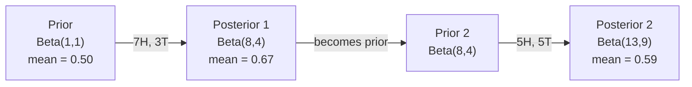

# Le théorème de Bayes.

> La probabilité est ce que vous attendez, le théorème de Bayes est ce que vous apprenez.
> La probabilité dépend de vos attentes.

**Type:** Build | **类型:** 动手
**Language:**Je suis un Python .**语言:**Python
**Prerequisites:** Phase 1, Lesson 06 (Probability Fundamentals) | **前置知识:** Phase 1, Lesson 06（概率基础）
**Time:** ~75 minutes | **时间:** ~75 分钟

## Objectifs d'apprentissage

- Appliquer le théorème de Bayes pour calculer les probabilités ultérieures à partir de prédécesseurs, de probabilités et de preuves
- Construisez un classificateur de texte naïf Bayes à partir de zéro avec Laplace lissage et le calcul de l'espace log
- Comparer l'estimation de MLE et de MAP et expliquer comment le MAP correspond à la régularisation de L2
- Implementer une mise à jour séquentielle bayésienne à l'aide de préjôts conjugués bêta-binomial pour les tests A/B

> **【中文解读】**
> 贝叶斯定理的核心思想: Using new evidence update your belief──先验概率 (previous probability)  似然 (previous probability)  似然 (previous probability)  后验概率 (previous probability)  后验概率 (previous probability)  更新后的猜测)  本章  零 构建 朴素贝叶斯文本分类器──

> **【拓展：贝叶斯在 AI 中的位置】**
> - **朴素贝叶斯分类器**Le code de la décharge est le code de la décharge.`GaussianNB`- Je suis là.`MultinomialNB`Il y a une autre.
> - **贝叶斯优化**Il est également utilisé pour la recherche de données.
> - **MAP 与正则化**Le prix de l'équipement est égal à L2 et il est "préventif sur mesure" à l'échelle de Bayes.

## Le problème , l' introduction du problème

> **【中文解读】**Un test médical confirme 99% du taux de mortalité, vous avez une probabilité positive, quelle est la probabilité de maladie réelle ?

## Le concept de base.

> **【拓展：贝叶斯思维是 AI 的核心范式】**La décision de Bayes`P(假设|证据) = P(证据|假设) × P(假设) / P(证据)`Dans l'IA, il n'y a pas de monde:**朴素贝叶斯分类器**:垃圾邮件过的经典方法;(2) **贝叶斯优化**:调超参数的高效方法(比网格搜索快 10 倍);(3) **MAP = L2 正则化**: la plus grande estimation ultérieure équivaut à un supplément de L2 penalty, expliquant du point de vue de Bayès pourquoi la normalisation peut être adaptée;**贝叶斯神经网络**Je sais pas.

La plupart des gens disent 99%. La vraie réponse dépend de la rareté de la maladie. Si 1 personne sur 10 000 en souffre, un résultat positif ne donne qu'environ 1% de chances de tomber malade. Les autres 99% des résultats positifs sont de fausses alarmes de personnes en bonne santé.

> La plupart des gens disent que 99% [...]. La vraie réponse dépend de la rareté des maladies. Si l'un des millions de personnes est malade, le résultat positif ne donne qu'environ 1% de probabilité de maladie. Les 99% restants des résultats positifs sont des faux positifs de personnes en bonne santé.

Ce n'est pas une question de ruse. C'est le théorème de Bayes. Chaque filtre de spam, chaque diagnostic médical, chaque modèle d'apprentissage automatique qui quantifie l'incertitude utilise ce raisonnement exact. Vous commencez par une croyance. Vous voyez des preuves. Vous mettez à jour.

> Ce n'est pas un changement de cerveau rapide. C'est la théorie de Bayes. Chaque filtre à spam, chaque diagnostic médical, chaque modèle de mémoire de l'incertitude quantique utilise la même théorie:

Si vous construisez des systèmes de machine à écrire sans comprendre cela, vous interpréterez mal les résultats des modèles, fixerez de mauvais seuils et vous enverrez des prédictions trop confiantes.

> Si vous ne comprenez pas cela, vous allez faire une erreur de jugement sur le modèle de production, de mise en place de valeurs erronées, de prédiction de surconfiance.

## Le concept de base.

### De la probabilité commune à Bayes

Vous savez déjà de la leçon 06 que la probabilité conditionnelle est:

> Vous avez appris les conditions de la classe 6:

```
P(A|B) = P(A and B) / P(B)
```

Et symétriquement:

```
P(B|A) = P(A and B) / P(A)
```

Les deux expressions partagent le même numérateur: P(A et B.

> ∆ deux expressions communes de la même molécule: P  A et B                                                                                                                                                                                                                                                      

```
P(A and B) = P(A|B) * P(B) = P(B|A) * P(A)

Therefore:

P(A|B) = P(B|A) * P(A) / P(B)
```

C'est le théorème de Bayes, quatre quantités, une équation.

> C'est la théorie de Béaïs.

### Les quatre parties

| Part | Name | What it means |
|------|------|---------------|
| P(A\|B) | Posterior / 后验 | Your updated belief about A after seeing evidence B / 看到证据 B 后对 A 的更新信念 |
| P(B\|A) | Likelihood / 似然 | How probable the evidence B is if A is true / 如果 A 为真，证据 B 出现的概率 |
| P(A) | Prior / 先验 | Your belief about A before seeing any evidence / 看到任何证据前对 A 的信念 |
| P(B) | Evidence / 证据 | Total probability of seeing B under all possibilities / 在所有可能情况下看到 B 的总概率 |

Le terme preuve P(B) agit comme un normalisateur. Vous pouvez l'étendre en utilisant la loi de la probabilité totale:

> 证据项 P(B) 作为归一化因子──可以用全概率公式展开:

```
P(B) = P(B|A) * P(A) + P(B|not A) * P(not A)
```

### Exemple de test médical

Une maladie touche 1 personne sur 10 000. Le test est 99% précis (capture 99% des malades, donne de faux résultats 1% du temps).

> Une maladie affecte un millier de personnes.

```
P(sick)          = 0.0001     (prior: disease is rare)
P(positive|sick) = 0.99       (likelihood: test catches it)
P(positive|healthy) = 0.01    (false positive rate)

P(positive) = P(positive|sick) * P(sick) + P(positive|healthy) * P(healthy)
            = 0.99 * 0.0001 + 0.01 * 0.9999
            = 0.000099 + 0.009999
            = 0.010098

P(sick|positive) = P(positive|sick) * P(sick) / P(positive)
                 = 0.99 * 0.0001 / 0.010098
                 = 0.0098
                 = 0.98%
```

Les tests préliminaires dominent, et même les tests précis donnent des résultats fausses.

> Les tests précoces sont généralement plus rares, même si les tests précis sont principalement faux positifs.

### Exemple de filtre à spam

Vous recevez un e-mail contenant le mot "loterie". Est-ce du spam?

> Vous avez reçu un mail contenant "loterie" ?

```
P(spam)                = 0.3      (30% of email is spam)
P("lottery"|spam)      = 0.05     (5% of spam emails contain "lottery")
P("lottery"|not spam)  = 0.001    (0.1% of legitimate emails contain "lottery")

P("lottery") = 0.05 * 0.3 + 0.001 * 0.7
             = 0.015 + 0.0007
             = 0.0157

P(spam|"lottery") = 0.05 * 0.3 / 0.0157
                  = 0.955
                  = 95.5%
```

Un mot change la probabilité de 30% à 95,5%. Un vrai filtre de spam applique Bayes sur des centaines de mots simultanément.

> Un mot peut être utilisé de 30% à 95,5%.

### Bayes naïf: supposition d'indépendance

Naïve Bayes étend cela à plusieurs caractéristiques en supposant que toutes les caractéristiques sont conditionnellement indépendantes étant donné la classe:

> Le simple Béries s'étend à plusieurs caractéristiques, en supposant que toutes les caractéristiques soient indépendantes les unes des autres dans des conditions de catégorie donnée:

```
P(class | feature_1, feature_2, ..., feature_n)
  = P(class) * P(feature_1|class) * P(feature_2|class) * ... * P(feature_n|class)
    / P(feature_1, feature_2, ..., feature_n)
```

La partie "naïve" est l'hypothèse d'indépendance. Dans le texte, les occurrences de mots ne sont pas indépendantes ("New" et "York" sont corrélés). Mais l'hypothèse fonctionne étonnamment bien dans la pratique parce que le classifiant ne doit que classer les classes, pas produire des probabilités calibrées.

> La partie " simple " est une hypothèse d'indépendance. Dans le texte, l'émergence de mots n'est pas indépendante.

Comme le dénominateur est le même pour toutes les classes, vous pouvez le sauter et simplement comparer les numérateurs:

> Comme la partition est la même pour tous les types, on peut le surpasser, en comparant seulement les molécules:

```
score(class) = P(class) * product of P(feature_i | class)
```

Choisissez la classe avec le score le plus élevé.

> 选择得分最高的类──

### Évaluation maximale de probabilité (MLE)

Comment obtenir la P "feature " (class de fonctionnement) des données de formation ?

> Comment obtenir des données de formation dans la classe de fonctionnalités ?

```
P("free"|spam) = (number of spam emails containing "free") / (total spam emails)
```

C'est MLE: choisissez les valeurs de paramètre qui rendent les données observées les plus probables. Vous maximiserez la fonction de probabilité, qui pour les comptes discrets se réduit à la fréquence relative.

> C'est le MLE: choisir la valeur de paramètre la plus probable pour l'observation des données.

Problème: si un mot n'apparaît jamais dans le spam pendant la formation, MLE lui donne une probabilité zéro. Un mot invisible tue l'ensemble du produit.

> 问题: si un mot n'est jamais apparu dans le spam pendant l'entraînement, MLE lui donne la probabilité de zéro.

```
P(word|class) = (count(word, class) + 1) / (total_words_in_class + vocabulary_size)
```

Ajouter 1 à chaque compte assure qu'aucune probabilité n'est jamais nulle.

> Donnez à chaque chiffre plus 1 pour que la probabilité ne soit jamais nulle.

### Le maximum a posteriori (MAP)

MLE pose la question: quels paramètres maximisent les paramètres de données P ?

> MLE 问: Quels paramètres permettent de calculer les paramètres de données maximaux ?

Le MAP pose la question: quels paramètres maximisent les paramètres P  dans les données ?

> MAP 问: Quels paramètres de P  parametres dans les données) max?

Selon le théorème de Bayes:

> Selon la théorie de Bayes:

```
P(parameters|data) proportional to P(data|parameters) * P(parameters)
```

Le MAP ajoute un prior sur les paramètres eux-mêmes. Si vous pensez que les paramètres devraient être petits, vous le codez comme un prior qui pénalise les grandes valeurs.

> MAP ajoute une première valeur au livre des paramètres. Si vous pensez que les paramètres devraient être plus petits, utilisez la première punition de la grande valeur. Ceci est égal à la L2 de ML.

| Estimation | Optimizes | ML equivalent |
|------------|-----------|---------------|
| MLE | P(data\|params) | Unregularized training / 无正则化训练 |
| MAP | P(data\|params) * P(params) | L2 / L1 regularization / L2/L1 正则化 |

### Bayésien et fréquentiste: la différence pratique

Les fréquentistes considèrent les paramètres comme des inconnus fixes. " Si je répetais cette expérience plusieurs fois, demandent- ils, que se passerait- il? "

> Les élèves de fréquence considèrent les paramètres comme des quantités inconnues fixes. Ils se demandent: "Si je répète cette expérience plusieurs fois, que se passerait-il ?"

Les Bayésiens considèrent les paramètres comme des répartitions. " Compte tenu de ce que j'ai observé, que crois- je des paramètres? " demandent- ils.

> Les Bayesian Schools considèrent les paramètres comme distribués. Ils demandent: "D'après ce que j'ai observé, quelle est ma conviction sur les paramètres ?"

Pour la construction de systèmes ML, la différence pratique:

> Pour la construction de systèmes de gestion de contenu, la différence réelle réside dans:

| Aspect | Frequentist | Bayesian |
|--------|-------------|----------|
| Output | Point estimate / 点估计 | Distribution over values / 值的分布 |
| Uncertainty | Confidence intervals (about procedure) / 置信区间（关于过程） | Credible intervals (about parameter) / 可信区间（关于参数） |
| Small data | Can overfit / 可能过拟合 | Prior acts as regularization / 先验充当正则化 |
| Computation | Usually faster / 通常更快 | Often requires sampling (MCMC) / 通常需要采样（MCMC） |

La plupart des méthodes de production sont fréquentistes (SGD, estimations de points). Les méthodes bayésiennes brillent lorsque vous avez besoin d'une incertitude calibrée (décisions médicales, systèmes critiques pour la sécurité) ou lorsque les données sont rares (apprentissage à quelques coups, démarrage à froid).

> La plupart des productions de l'AML sont fréquentes (SGD, point estimation) et lorsque vous avez besoin d'un accélération de l'incertitude (médicale, décision, système de sécurité) ou de données rares (les exemples sont peu nombreux), la méthode de Bayes se présente en plein éclat.

### Pourquoi la pensée bayésienne est importante pour l'IM

Le lien est plus profond que l' analogie:

> Ce type de lien est plus profond que:

**Priors are regularization.**Un préalable gaussien sur les poids est la régularisation de L2. Un préalable de Laplace est L1. Chaque fois que vous ajoutez un terme de régularisation, vous faites une déclaration bayésienne sur les valeurs de paramètre que vous attendez.

> **先验就是正则化。**Le premier niveau de l'équilibre est L2 et le premier niveau est L1. Chaque fois que vous ajoutez un premier niveau, vous faites une déclaration de base sur la valeur de l'expectative paramétrique.

**Posteriors are uncertainty.**Une seule probabilité prévue ne vous dit rien sur la confiance du modèle dans cette estimation.

> **后验就是不确定性。**单个预测概率 ne peut pas vous dire combien le modèle est confiant à cette estimation.

**Bayes updates are online learning.**Le postérieur d'aujourd'hui devient le prior de demain. Quand votre modèle voit de nouvelles données, il met à jour ses croyances progressivement au lieu de se réapproprier à partir de zéro.

> **贝叶斯更新就是在线学习。**L'expérience d'aujourd'hui devient l'expérience de demain. Lorsque le modèle voit de nouveaux données, il renouvelle sa conviction plutôt que de se remettre en forme.

**Model comparison is Bayesian.**Le critère Bayésien de l'information (BIC), la probabilité marginale et les facteurs Bayésiens utilisent tous le raisonnement Bayésien pour choisir entre des modèles sans sur-adaptation.

> **模型比较是贝叶斯的。**Les facteurs de Bélies et de Bélies utilisent les logiques de Bélies pour choisir entre les modèles sans entraîner une suradaptation.

## Construisez-le et mettez-le en œuvre.
```figure
bayes-update
```

## Faites-le

### Étape 1: Fonction du théorème de Bayes

```python
def bayes(prior, likelihood, false_positive_rate):
    evidence = likelihood * prior + false_positive_rate * (1 - prior)
    posterior = likelihood * prior / evidence
    return posterior

result = bayes(prior=0.0001, likelihood=0.99, false_positive_rate=0.01)
print(f"P(sick|positive) = {result:.4f}")
```

### Étape 2: Classificateur Bayes naïf

```python
import math
from collections import defaultdict

class NaiveBayes:
    def __init__(self, smoothing=1.0):
        self.smoothing = smoothing
        self.class_counts = defaultdict(int)
        self.word_counts = defaultdict(lambda: defaultdict(int))
        self.class_word_totals = defaultdict(int)
        self.vocab = set()

    def train(self, documents, labels):
        for doc, label in zip(documents, labels):
            self.class_counts[label] += 1
            words = doc.lower().split()
            for word in words:
                self.word_counts[label][word] += 1
                self.class_word_totals[label] += 1
                self.vocab.add(word)

    def predict(self, document):
        words = document.lower().split()
        total_docs = sum(self.class_counts.values())
        vocab_size = len(self.vocab)
        best_class = None
        best_score = float("-inf")
        for cls in self.class_counts:
            score = math.log(self.class_counts[cls] / total_docs)
            for word in words:
                count = self.word_counts[cls].get(word, 0)
                total = self.class_word_totals[cls]
                score += math.log((count + self.smoothing) / (total + self.smoothing * vocab_size))
            if score > best_score:
                best_score = score
                best_class = cls
        return best_class
```

Les probabilités de logs empêchent le sous-flow. Multiplication de nombreuses petites probabilités produit des nombres trop petits pour un point flottant. La somme des probabilités de logs est numériquement stable et mathématiquement équivalente.

> Pour les probabilités numériques, il y a beaucoup de petites probabilités qui se multiplient par des nombres trop petits pour les points de décalage.

### Étape 3: Trainer les données de spam

```python
train_docs = [
    "win free money now",
    "free lottery ticket winner",
    "claim your prize today free",
    "urgent offer free cash",
    "congratulations you won free",
    "meeting tomorrow at noon",
    "project update attached",
    "can we schedule a call",
    "quarterly report review",
    "lunch on thursday sounds good",
    "team standup notes attached",
    "please review the pull request",
]

train_labels = [
    "spam", "spam", "spam", "spam", "spam",
    "ham", "ham", "ham", "ham", "ham", "ham", "ham",
]

classifier = NaiveBayes()
classifier.train(train_docs, train_labels)

test_messages = [
    "free money waiting for you",
    "meeting rescheduled to friday",
    "you won a free prize",
    "please review the attached report",
]

for msg in test_messages:
    print(f"  '{msg}' -> {classifier.predict(msg)}")
```

### Étape 4: Examinez les probabilités apprises

```python
def show_top_words(classifier, cls, n=5):
    vocab_size = len(classifier.vocab)
    total = classifier.class_word_totals[cls]
    probs = {}
    for word in classifier.vocab:
        count = classifier.word_counts[cls].get(word, 0)
        probs[word] = (count + classifier.smoothing) / (total + classifier.smoothing * vocab_size)
    sorted_words = sorted(probs.items(), key=lambda x: x[1], reverse=True)
    for word, prob in sorted_words[:n]:
        print(f"    {word}: {prob:.4f}")

print("\nTop spam words:")
show_top_words(classifier, "spam")
print("\nTop ham words:")
show_top_words(classifier, "ham")
```

## Utilisez-le avec le cadre de réalisation

Les navires de ski-apprentissage prêts à la production

> Le scikit-learn a fourni des réalisations simples de production déjà préparée:

```python
from sklearn.feature_extraction.text import CountVectorizer
from sklearn.naive_bayes import MultinomialNB
from sklearn.metrics import classification_report

vectorizer = CountVectorizer()
X_train = vectorizer.fit_transform(train_docs)
clf = MultinomialNB()
clf.fit(X_train, train_labels)

X_test = vectorizer.transform(test_messages)
predictions = clf.predict(X_test)
for msg, pred in zip(test_messages, predictions):
    print(f"  '{msg}' -> {pred}")
```

Le même algorithme. CountVectorizer gère la symbolisation et la construction du vocabulaire. MultinomialNB gère le smoothing et les probabilités de journaux en interne. Votre version à partir de zéro fait la même chose en 40 lignes.

> Le même algorithme, le même calcul, le même calcul, le même calcul, le même calcul, le même calcul, le même calcul, le même calcul, le même calcul, le même calcul, le même calcul, le même calcul, le même calcul, le même calcul, le même calcul, le même calcul, le même calcul, le même calcul, le même calcul, le même calcul, le même calcul, le même calcul, le même calcul, le même calcul, le même calcul, le même calcul, le même calcul, le même calcul, le même calcul, le même calcul, le même calcul, le même calcul, le même calcul, le même calcul, le même calcul, le même calcul, le même calcul, le même calcul, le même calcul, le même calcul, le même calcul, le même calcul, le même calcul, le même calcul, le même calcul, le même calcul, le même calcul, le même calcul, le même calcul, le même calcul, le même calcul, le même calcul, le même calcul, le même calcul, le même calcul, le même calcul, le même calcul, le même calcul, le même calcul, etc.

## Envoyez-le . Produit .

La classe NaiveBayes construite ici démontre l'ensemble du pipeline: la tokenization, l'estimation de probabilité avec le lissage de Laplace, la prédiction de l'espace log.`code/bayes.py`fonctionne de bout en bout sans dépendances au-delà de la bibliothèque standard de Python.

> La catégorie NaiveBayes qui y est construite présente un processus complet:`code/bayes.py`Le code central est utilisé de bout en bout, sans dépendance à l'extérieur de la base de données Python.

### Les prédécesseurs conjugaux

Lorsque le précédent et le posterior appartiennent à la même famille de distributions, le prior est appelé "conjugé". Cela rend la mise à jour algébrique bayésienne propre - vous obtenez une forme fermée de l'arrière sans intégration numérique.

> Lorsque les premières expériences et les dernières expériences appartiennent à la même distribution, les premières expériences sont appelées "communautées".

| Likelihood | Conjugate Prior | Posterior | Example |
|-----------|----------------|-----------|---------|
| Bernoulli | Beta(a, b) | Beta(a + successes, b + failures) | Coin flip bias estimation / 抛硬币偏差估计 |
| Normal (known variance) | Normal(mu_0, sigma_0) | Normal(weighted mean, smaller variance) | Sensor calibration / 传感器校准 |
| Poisson | Gamma(a, b) | Gamma(a + sum of counts, b + n) | Modeling arrival rates / 建模到达率 |
| Multinomial | Dirichlet(alpha) | Dirichlet(alpha + counts) | Topic modeling, language models / 主题建模，语言模型 |

Pourquoi cela importe: sans précédents conjugués, vous avez besoin de l'échantillonnage de Monte Carlo ou d'une inférence variationnelle pour approximer le posterior.

> Pourquoi c'est important: sans précédent commun, vous avez besoin de montage de calcul ou de calcul pour approcher la précédente expérience.

La répartition bêta est le précurseur conjugué le plus courant en pratique. Beta(a, b) représente votre croyance sur un paramètre de probabilité. La moyenne est a/(a+b). Plus a+b est grand, plus la répartition est concentrée (confiante).

> Beta 分布是实践中最常用的共先验──Beta(a, b) Exprimez votre conviction d'un paramètre de probabilité── la valeur moyenne est a/(a+b)──a+b 越大,分布越集中(越自信)──

Cas particuliers de la période de Beta précédente:
- Beta(1, 1) = uniforme. Vous n'avez pas d'opinion sur le paramètre.
  Vous avez une vision de la distribution.
- Beta ((10, 10) = atteint le point culminant à 0,5. Vous croyez fermement que le paramètre est proche de 0,5.
  En français, le nombre de points de pointe est de 0,5.
- Beta(1, 10) = dévié vers 0, vous pensez que le paramètre est petit.
  Vous pensez que le nombre est très petit.

La règle de mise à jour est très simple:

> 更新规则极其简单:

```
Prior:     Beta(a, b)
Data:      s successes, f failures
Posterior: Beta(a + s, b + f)
```

Pas d'intégrales, pas de prélèvement, juste d'addition.

> Il n'y a pas besoin de la taille, il n'y a pas besoin de la taille.

### Mise à jour séquentielle bayésienne

L'inférence bayésienne est naturellement séquentielle. Le postérieur d'aujourd'hui devient le prior de demain. C'est ainsi que les systèmes réels apprennent progressivement sans refaire tout le traitement des données historiques.

> La théorie de Bayes est naturelle. L'expérience d'aujourd'hui devient l'expérience de demain.

Exemple concret: évaluer si une pièce est juste.

> 具体例: estimation de l'équité d'une pièce de monnaie

**Day 1: No data yet.**
Commencez par Beta: 1, 1 -- un précurseur uniforme. Vous n'avez pas d'opinion.
- Moyenne antérieure: 0,5
- Le prior est plat à travers [0, 1]

> **第 1 天：还没有数据。**Depuis Beta(1, 1) 开始均先验, tu n'as pas de pré pré-série vue。

**Day 2: Observe 7 heads, 3 tails.**
Le référentiel est le référentiel de la carte de crédit.
- Moyenne postérieure: 8/12 = 0,667
- Les preuves suggèrent que la pièce est orientée vers les têtes

> **第 2 天：观察到 7 次正面，3 次反面。**后验 = Beta(8, 4), valeur moyenne de 0,667, preuves suggèrent que la monnaie est orientée vers la droite.

**Day 3: Observe 5 more heads, 5 more tails.**
Utilisez le postérieur d'hier comme le prior d'aujourd'hui.
Le arrière est Beta(8 + 5, 4 + 5) = Beta(13, 9)
- Moyenne postérieure: 13/22 = 0,591
- Les nouvelles données équilibrées ont ramené l'estimation vers 0,5.

> **第 3 天：又观察 5 次正面，5 次反面。**Utilisez les résultats d'hier comme les résultats d'aujourd'hui.



L'ordre des observations n'a pas d'importance. Beta(1,1) mis à jour avec les 12 têtes et 8 queues à la fois donne Beta(13, 9) - le même résultat. La mise à jour séquentielle et la mise à jour de lot sont mathématiquement équivalentes. Mais la mise à jour séquentielle vous permet de prendre des décisions à chaque étape sans stocker des données brutes.

> 观测序列无关紧要――Beta(1,1) Une fois de usage complet 12 fois positive et 8 fois negative est mise à jour Beta(13, 9) Le même résultat― 序序更新和批量更新在数学上等价――但序序更新让你能在每步做决策而无需存储原始数据──

C'est la base de l'apprentissage en ligne dans les systèmes ML de production. L'échantillonnage de Thompson pour les bandits, les systèmes de recommandation incrémentielle et les détecteurs d'anomalies de streaming utilisent tous ce modèle.

> C'est la base de l'apprentissage en ligne dans le système de production de machines à sous.

### Connexion aux tests A/B

Les tests A/B sont des déductions bayésiennes déguisées.

> A/B 测试就是 une hypothèse de Bayes.

Configuration: vous testez deux couleurs de boutons: la variante A (bleu) et la variante B (vert). Vous voulez savoir lequel obtient le plus de clics.

> 设置:你在测试两种按颜色──变体 A(蓝色) 和变体 B(绿色)──你想知道哪个得到更多点击──

Le test Bayésien A/B:

> 贝叶斯 A/B 测试步骤:

1. **Prior.**Commencez par Beta(1, 1) pour les deux variantes.
2. **Data.**La variante A: 50 clics sur 1000 vues. La variante B: 65 clics sur 1000 vues.
3. **Posteriors.**
   - R: Beta(1 + 50, 1 + 950) = Beta(51, 951). La moyenne est de 0,051
   - B: Beta(1 + 65, 1 + 935) = Beta(66, 936). La moyenne = 0,066
4. **Decision.**Compute P ((B > A) -- la probabilité que le taux de conversion vrai de B est plus élevé que celui de A.

Le calcul de P (B) est difficile, mais Monte Carlo le rend trivial.

> 解析计算 P(B > A) 很难――但蒙特卡洛让这变得轻松而易举:

```
1. Draw 100,000 samples from Beta(51, 951)  -> samples_A
2. Draw 100,000 samples from Beta(66, 936)  -> samples_B
3. P(B > A) = fraction of samples where B > A
```

Si P(B > A) > 0,95, vous expédez la variante B. Si elle est entre 0,05 et 0,95, vous continuez à collecter des données. Si P(B > A) < 0,05, vous expédez la variante A.

> Si P(B > A) > 0,95, publiez le changement B。 Si entre 0,05 et 0,95, continuez à collecter les données。 Si P(B > A) < 0,05, publiez le changement A。

Les avantages par rapport aux tests A/B fréquentistes:
- Vous obtenez une déclaration de probabilité directe: "il y a 97% de chances que B est meilleur"
  Vous obtenez une probabilité directe: "B meilleur probabilité est de 97%".
- Pas de confusion sur la valeur de p, pas de couverture "faut rejeter l'hypothèse nulle".
  Le mot "non-faible" est une expression de la phrase "non-faible".
- Vous pouvez vérifier les résultats à tout moment sans gonfler de taux de faux positifs (pas de "problème de recherche")
  Vous pouvez regarder le résultat à tout moment sans augmenter le taux de faux positivité.
- Vous pouvez intégrer des connaissances préalables (par exemple, des tests antérieurs suggèrent que les taux de conversion sont généralement de 3-8%)
  Traduction anglaise: vous pouvez intégrer des connaissances préalables.

| Aspect | Frequentist A/B | Bayesian A/B |
|--------|----------------|--------------|
| Output | p-value / p 值 | P(B > A) |
| Interpretation | "How surprising is this data if A=B?" / "如果 A=B，数据有多令人惊讶？" | "How likely is B better than A?" / "B 比 A 好的可能性有多大？" |
| Early stopping | Inflates false positives / 会增加假阳性 | Safe at any point (given a well-chosen prior and correctly specified model) / 随时安全（假设先验选择合理且模型正确） |
| Prior knowledge | Not used / 不使用 | Encoded as Beta prior / 编码为 Beta 先验 |
| Decision rule | p < 0.05 | P(B > A) > threshold / P(B > A) > 阈值 |

## Les exercices

1. **Multiple tests.**Un patient testé positif deux fois sur des tests indépendants (les deux 99% précis, prévalence de la maladie 1 sur 10.000).

2. **Smoothing impact.**Exécutez le classifiateur de spam avec des valeurs de lissage de 0.01, 0.1, 1.0 et 10.0. Comment les probabilités de mots supérieurs changent-elles?

3. **Add features.**Extension de la classe NaiveBayes pour utiliser également la longueur du message (courte/longue) comme fonctionnalité aux côtés du nombre de mots.

4. **MAP by hand.**Compte tenu des données observées (7 têtes sur 10 lancements de pièces), calculer l'estimation du MAP du biais en utilisant un précédent Beta(2,2).

## Les termes clés

| Term | What people say | What it actually means |
|------|----------------|----------------------|
| Prior | "My initial guess" / "我的初始猜测" | P(hypothesis) before observing evidence. In ML: the regularization term. / 观测证据前的 P(hypothesis)。在 ML 中：正则化项。 |
| Likelihood | "How well the data fits" / "数据拟合得好不好" | P(evidence\|hypothesis). How probable the observed data is under a specific hypothesis. / 在特定假设下观测数据的概率。 |
| Posterior | "My updated belief" / "我的更新信念" | P(hypothesis\|evidence). The prior multiplied by the likelihood, then normalized. / 先验乘以似然再归一化。 |
| Evidence | "The normalizing constant" / "归一化常数" | P(data) across all hypotheses. Ensures the posterior sums to 1. / 所有假设下 P(data) 的总和，确保后验求和为 1。 |
| Naive Bayes | "That simple text classifier" / "那个简单的文本分类器" | A classifier that assumes features are independent given the class. Works well despite the false assumption. / 假设特征在给定类别下独立的分类器，尽管假设不成立但效果很好。 |
| Laplace smoothing | "Add-one smoothing" / "加一平滑" | Adding a small count to every feature to prevent zero probabilities from unseen data. / 给每个特征加一个小计数以防止未见数据的零概率。 |
| MLE | "Just use the frequencies" / "直接用频率" | Choose parameters that maximize P(data\|parameters). No prior. Can overfit with small data. / 选择使 P(data\|parameters) 最大的参数。无先验，小数据可能过拟合。 |
| MAP | "MLE with a prior" / "带先验的 MLE" | Choose parameters that maximize P(data\|parameters) * P(parameters). Equivalent to regularized MLE. / 选择使 P(data\|parameters) * P(parameters) 最大的参数，等价于正则化 MLE。 |
| Log-probability | "Work in log space" / "在对数空间计算" | Using log(P) instead of P to avoid floating-point underflow when multiplying many small numbers. / 用 log(P) 代替 P，避免许多小数相乘时的浮点下溢。 |
| False positive | "A wrong alarm" / "错误警报" | The test says positive, but the true state is negative. Drives the base rate fallacy. / 检测为阳性但实际为阴性，是基本比率谬误的根源。 |

## Encore une lecture

- [3Blue1Brown: Bayes' theorem](https://www.youtube.com/watch?v=HZGCoVF3YvM)- explication visuelle avec l'exemple du test médical
- [Stanford CS229: Generative Learning Algorithms](https://cs229.stanford.edu/notes2022fall/cs229-notes2.pdf)- Bayes naïf et son lien avec les modèles discriminatoires
- [Think Bayes](https://greenteapress.com/wp/think-bayes/)- livre gratuit, statistiques bayésiennes avec code Python
- [scikit-learn Naive Bayes](https://scikit-learn.org/stable/modules/naive_bayes.html)- les mises en œuvre de la production et le moment de l'utilisation de chaque variante
