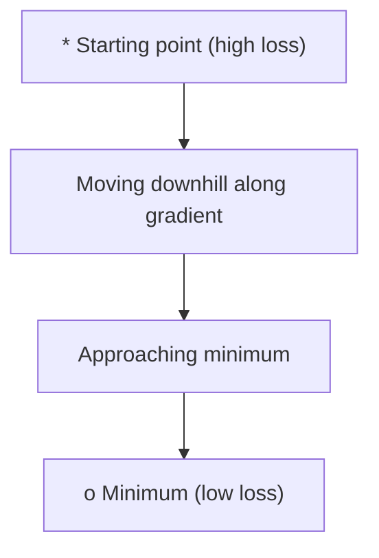
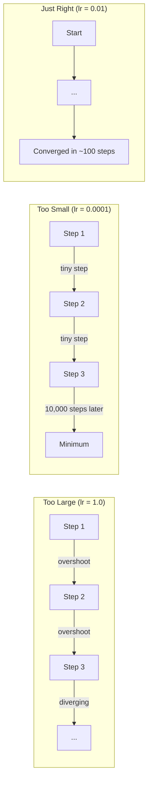
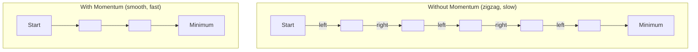
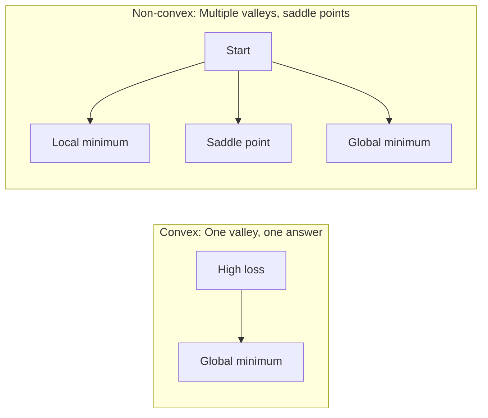
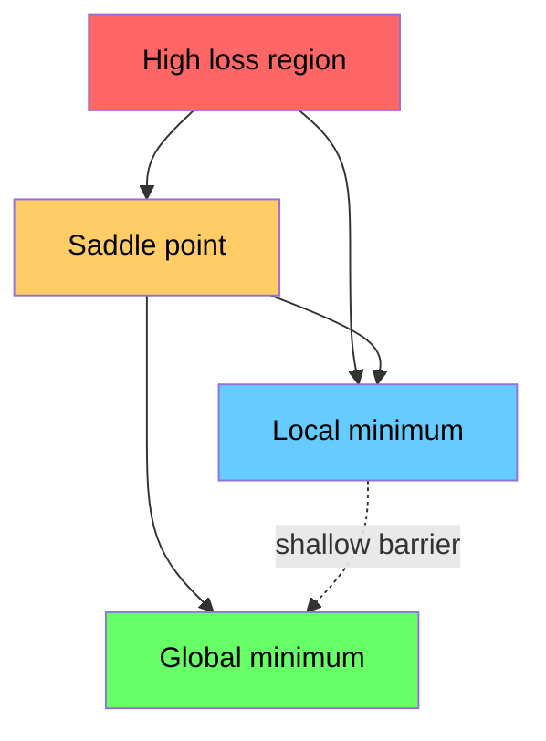

# Optimisation

> Former un réseau neural n'est rien de plus que trouver le fond d'une vallée.
> Le train de la toile de neige est de trouver le point le plus bas de la vallée.

**Type:** Build | **类型:** 动手
**Language:**Je suis un Python .**语言:**Python
**Prerequisites:** Phase 1, Lessons 04-05 (Derivatives, Gradients) | **前置知识:** Phase 1, Lessons 04-05 (Derivatives, Gradients)
**Time:** ~75 minutes | **时间:** ~75 分钟

## Objectifs d'apprentissage

- Mettre en œuvre la descente du gradient de la vanille, SGD avec l'élan, et Adam à partir de zéro
  D'une échelle initiale à zéro, la baisse de la quantité de SGD et Adam
- Comparer la convergence de l'optimisateur sur la fonction Rosenbrock et expliquer pourquoi Adam adapte les taux d'apprentissage par poids
  En fonction de Rosenbrock, expliquez pourquoi Adam a pris en charge le taux d'apprentissage de l'adaptation à chaque poids
- Distinguer les paysages de perte convexes des paysages non convexes et expliquer le rôle des points de selle dans les dimensions élevées
  区分凸与非凸损曲面, expliquer le rôle des points dans l'espace
- Configurer les horaires de taux d'apprentissage (décomposition des étapes, annelement cosine, réchauffement) pour assurer la stabilité de l'entraînement
  配置 learning rate调度(步衰减、余弦退火、预热) afin de garantir la stabilité de l'entraînement

> **【中文解读】**
> 訓練神經網就是"尋找山谷最低點"──損失函数告訴你現在有多少錯誤,梯度告訴你哪一方向能讓錯誤更小,優化器決定你如何走──本章從零实现 SGD、Momentum 和 AdamPyTorch

> **【拓展：优化器在 AI 中的位置】**
> - **SGD**: le " ancêtre " de tous les " optimistes "
> - **Adam**Le taux d'apprentissage de l'apprentissage de l'apprentissage de l'apprentissage de l'apprentissage de l'apprentissage de l'apprentissage de l'apprentissage de l'apprentissage de l'apprentissage de l'apprentissage de l'apprentissage de l'apprentissage de l'apprentissage de l'apprentissage de l'apprentissage de l'apprentissage de l'apprentissage de l'apprentissage de l'apprentissage de l'apprentissage de l'apprentissage de l'apprentissage de l'apprentissage de l'apprentissage de l'apprentissage de l'apprentissage de l'apprentissage de l'apprentissage de l'apprentissage de l'apprentissage de l'apprentissage de l'apprentissage de l'apprentissage de l'apprentissage de l'apprentissage de l'apprentissage de l'apprentissage de l'apprentissage de l'apprentissage de l'apprentissage de l'apprentissage de l'apprentissage de l'apprentissage de l'apprentissage.
> - **学习率调度**Le premier entraînement utilise le grand pas, le plus rapide approche le plus optimal, le second utilise le petit pas, le plus précisément.

## Le problème , l' introduction du problème

Vous avez une fonction de perte. Il vous dit à quel point votre modèle est faux. Vous avez des gradients. Ils vous disent dans quelle direction la perte est pire. Maintenant vous avez besoin d'une stratégie pour descendre la colline.

> Vous avez une fonction de perte, elle vous dit que le modèle est différent. Vous avez une tendance, elle vous dit dans quelle direction faire plus de perte.

L'approche naïve est simple: se déplacer en face du gradient. Étalonnez l'étape par un nombre appelé taux d'apprentissage. Je répète. C'est une descente de gradient, et ça marche. Mais "travaux" a des avertissements. Trop de taux d'apprentissage et vous dépassez complètement la vallée, bondant entre les murs. Trop petit et vous vous déplacez vers la réponse sur des milliers de pas inutiles. Vous frappez un point de selle et vous arrêtez de bouger même si vous n'avez pas trouvé un minimum.

> La méthode est simple: le mouvement de la échelle en direction inverse, le progression du taux d'apprentissage en direction opposée. C'est le déclin de la échelle. Mais la "efficacité" est conditionnelle: le taux d'apprentissage est trop élevé, vous sautez le fond de la vallée entre les deux murs et vous tremblez; trop petit, vous progressez lentement dans les millénaires de pas inutiles.

Chaque optimisateur de l'apprentissage profond est une réponse à la même question: comment arriver au fond de la vallée plus rapidement et plus fiablement ?

> Chaque optimisateur de l'apprentissage en profondeur répond à la même question: comment arriver plus rapidement et plus fiablement au fond du trou ?

> **【中文解读】**Vous avez une perte de fonction (( vous direz avoir beaucoup d'erreurs) et de degré (( vous direz quelles directions peuvent faire les erreurs plus petites) ⋅ Maintenant, vous avez besoin d'une stratégie " aller au point le plus bas de la vallée "⋅ simple méthode: along gradient revers direction ⋅ taux d'apprentissage trop grand→ sauter au-dessus du point le plus bas pour revenir à la convulsion; trop petit→ aller à quelques milliers de pas pour arriver à ⋅ ⋅ point ⋅ s'arrêter mais pas à la plus basse ⋅ tous les optimisateurs répondent à la même question: comment faire pour aller plus rapidement et plus stablement au fond de la vallée ?

## Le concept de base.

### Qu'est-ce que l'optimisation signifie ?

L'optimisation est la recherche des valeurs d'entrée qui minimisent (ou maximisent) une fonction.

> 优化就是找到使函数最小化 (或最大化) 的输入值──在机器学习中,函数是损失函数,输入是模型权重──训练就是优化──

```
minimize L(w) where:
  L = loss function
  w = model weights (could be millions of parameters)
```

> **【拓展：优化是机器学习的引擎】**Le processus de formation du GPT-4 est de: utiliser la fonction de perte de 1,8 milliard de paramètres, par l'intermédiaire d'Adam 优化器代调整参数, de sorte que la prédiction soit plus précise.`w = w - lr * gradient`Il y a une autre.

### La dérive progressive (vanille) 梯度下降 (rédaction originale)

Le plus simple optimisateur. Comptez le gradient de perte par rapport à chaque poids. déplacer chaque poids dans la direction opposée de son gradient. Échanger l'étape par le taux d'apprentissage.

> Le plus simple des optimisateurs. Le calcul des pertes de poids par degré, le mouvement dans la direction opposée, le contrôle du taux d'apprentissage.

```
w = w - lr * gradient
```

C'est l'ensemble de l'algorithme.

> C'est le code parfait.

> **【中文解读】**梯度下降: calculer la perte de poids par échelle, en direction opposée, en direction opposée, en direction opposée, en direction opposée, en direction opposée, en direction opposée, en direction opposée, en direction opposée, en direction opposée, en direction opposée, en direction de la direction opposée, en direction de la direction opposée.`w = w - lr * gradient`, un seul chemin complet.



### Le taux d'apprentissage: le paramètre hyper-important

Le taux d'apprentissage contrôle la taille des étapes.

> Le taux d'apprentissage contrôle le rythme, décide de tout recevoir.



Il n'y a pas de formule pour le bon taux d'apprentissage. Vous le trouvez par expérience. points de départ communs: 0,001 pour Adam, 0,01 pour SGD avec dynamique.

> 没有公式能告诉你正确的学习率──你只能通过实验找到──常见起点:Adam Utilise 0.001,SGD avec élan Utilise 0.01──

> **【拓展：学习率选择的实践指南】**Le taux d'apprentissage est le plus difficile à régler. La règle de l'expérience est: de 0,001 开始 (Adam's default value), observer le train曲线 (Adam's default value), voir le train曲线 (Adam's default value), observer le train曲线 (Adam's default value), observer le train曲线 (Adam's default value), observer le train曲线 (Adam's default value), observer le train曲线 (Adam's default value), observer le train曲线 (Adam's default value), observer le train曲线 (Adam's default value), observer le train曲线 (Adam's default value), observer le train曲线 (Adam's default value), observer le train曲线 (Adam's default value), observer le train曲线 (Adam's default value), observer le train曲线 (Adam's default value), observer le train曲线 (Adam's default value), observer le train曲线 (Adam's default value), observer le train曲线 (Adam's default value), observer le train (Adam's default value), observer (Adam's default value), observer (Adam's default value), observer) ∈ L), observer (Adam'observer) ∈ L), observer (Adam'observer) ∈ L), observer (GPT-3), observe, etc.).

### SGD vs lot vs mini lot . SGD vs totalité des lots vs petite lot .

La descente du gradient de la vanille calcule la descente sur l'ensemble des données avant de prendre une étape.

> La température initiale descend avant de passer à l'étape suivante avec la totalité des données calculées.

La descente du gradient stochastique (SGD) calcule le gradient sur un seul échantillon aléatoire et marche immédiatement.

> 随机梯度下降 (SGD) 随机梯度下降 (SGD) 随机梯度下降 (SGD) 随机梯度下降) 随机梯度下降 (SGD) 随机梯度下降 (SGD) 随机梯度下降) 随机梯度后立即更新──噪音大但快──

La descente de gradient mini-partie divise la différence. Computez le gradient sur un petit lot (32, 64, 128, 256 échantillons), puis passez. C'est ce que tout le monde utilise réellement.

> Le programme de réduction de la température de la petite quantité: avec une petite quantité de données (échantillons 32、64、128、256)

| Variant | Batch size | Gradient quality | Speed per step | Noise |
|---------|-----------|-----------------|---------------|-------|
| Batch GD / 全批量 | Entire dataset | Exact / 精确 | Slow / 慢 | None / 无 |
| SGD / 随机 | 1 sample | Very noisy / 噪声大 | Fast / 快 | High / 高 |
| Mini-batch / 小批量 | 32-256 | Good estimate / 好的估计 | Balanced / 均衡 | Moderate / 中等 |

Le bruit dans les SGD et les mini-parties n'est pas un bug.

> Le bruit de SGD et de petite quantité n'est pas un bug, il aide à échapper à la valeur minimale et aux points de la surface basse.

> **【中文解读】**3°°°°°°°°°°°°°°°°°°°°°°°°°°°°°°°°°°°°°°°°°°°°°°°°°°°°°°°°°°°°°°°°°°°°°°°°°°°°°°°°°°°°°°°°°°°°°°°°°°°°°°°°°°°°°°°°°°°°°°°°°°°°°°°°°°°°°°°°°°°°°°°°°°°°°°°°°°°°°°°°°°°°°°°°°°°°°°°°°°°°°°°°°°°°°°°°°°°°°°°°°°°°°°°°°°°°°°°°°°°°°°°°°°°°°°°°°°°°°°°°°°°°°°°°°°°°°°°°°°°°°°°°°°°°°°°°°°°°°°°°°°°°°°°°°°°°°°°°°°°°°°°°°°°°°°°°°°°°°°°°°°°°°°°°°°°°°°°°°°°°°°°°°°°°°°°°°°°°°°°°°°°°°°°°°°°°°°°°°°°°°°°°°°°°°°°°°°°°°°°°°°°°°°°°°°°°°°°°°°°°°°°°°°°°°°°°°°°°°°°°°°°°°°°°°°°°°°°°°°°°°°°°°°°°°°°°°°°°°°°°°°°°°°°°°°°°°°°°°°°°°°°°°°°°°

### La balle roule en descente.

La descente du gradient de la vanille ne regarde que le gradient courant. Si le gradient zigzag (common dans les vallées étroites), le progrès est lent.

> Si la température est présente dans la vallée étroite, les progrès sont lents. La méthode de la température historique s'accumule à la vitesse pour résoudre ce problème.

```
v = beta * v + gradient
w = w - lr * v
```

L'analogie: une balle qui roule en descente. Elle ne s'arrête pas et ne redémarre pas à chaque bosse.

> 类比: ball from mountain slope rolls down. Il ne s'arrête pas à chaque élévation et se redémarre. Il accumule une vitesse dans la direction correspondante, en supprimant les chocs.



`beta`Un meilleur beta signifie plus de dynamique, des chemins plus lisses, mais une réponse plus lente aux changements de direction.

> `beta`(habituellement à 0,9) contrôle conserve beaucoup de temps. Une bêta plus élevée signifie une plus grande dynamique, un chemin plus lisse, mais une réponse plus lente aux changements de direction.

> **【拓展：动量在深度学习中的效果】**动量法让优化"记住" précédent direction, comme le ball roll down mountain坡.`torch.optim.SGD(lr=0.1, momentum=0.9)`La dynamique = 0,9 est une configuration habituelle.

### Adam: taux d'apprentissage adaptatif Adam: taux d'apprentissage adaptatif

Les poids différents ont besoin de taux d'apprentissage différents. Un poids qui obtient rarement de grands gradients devrait prendre des mesures plus importantes quand il le fera enfin. Un poids qui obtient constamment des gradients énormes devrait prendre des mesures plus petites.

> Les différents poids nécessitent des taux d'apprentissage différents. Peu de poids de grande échelle devraient être plus grands, les poids de grande échelle devraient être plus petits.

Adam (estimation du moment adaptatif) suit deux choses par poids:
  Adam (estimation de l'adaptation) pour chaque pouvoir de suivi deux quantités:

1. Première minute (m): moyenne continue des gradients (comme la vitesse)
   Un épisode (m): moyenne de déplacement de la taille
2. Deuxième moment (v): moyenne continue des gradients carrés (magnitude de gradient)
   Deuxième étape (v): gradience carré de moyenne de déplacement

```
m = beta1 * m + (1 - beta1) * gradient
v = beta2 * v + (1 - beta2) * gradient^2

m_hat = m / (1 - beta1^t)    bias correction
v_hat = v / (1 - beta2^t)    bias correction

w = w - lr * m_hat / (sqrt(v_hat) + epsilon)
```

La division par `sqrt(v_hat)`Les poids avec de grands gradients sont divisés par un grand nombre (petit pas effectif). Les poids avec de petits gradients sont divisés par un petit nombre (grand pas effectif). Chaque poids obtient son propre taux d'apprentissage adaptatif.

> À l' exception de`sqrt(v_hat)`Il est important de noter que chaque élément de la formation est un élément de formation qui permet de déterminer le niveau de formation.

Hyperparamètres par défaut: `lr=0.001, beta1=0.9, beta2=0.999, epsilon=1e-8`Ces défauts fonctionnent bien pour la plupart des problèmes.

> 默认超参数:`lr=0.001, beta1=0.9, beta2=0.999, epsilon=1e-8` Ces valeurs de référence sont efficaces pour la plupart des problèmes

> **【中文解读】**Adam = Momentum + Autodétermination de l'apprentissage. Il est utilisé pour chaque paramètre pour maintenir une "vitesse" indépendante, selon la cadence historique.`torch.optim.Adam(lr=0.001)`C'est presque une option.

### Les horaires de taux d'apprentissage

Un taux d'apprentissage fixe est un compromis. Au début de la formation, vous voulez des grandes étapes pour progresser rapidement.

> Le taux d'apprentissage fixe est un schéma de rupture.

Les horaires communs:
  常见调度方式:

| Schedule / 调度方式 | Formula / 公式 | Use case / 使用场景 |
|----------|---------|----------|
| Step decay / 步衰减 | lr = lr * factor every N epochs | Simple, manual control / 简单手动控制 |
| Exponential decay / 指数衰减 | lr = lr_0 * decay^t | Smooth reduction / 平滑递减 |
| Cosine annealing / 余弦退火 | lr = lr_min + 0.5 * (lr_max - lr_min) * (1 + cos(pi * t / T)) | Transformers, modern training / Transformer、现代训练 |
| Warmup + decay / 预热+衰减 | Linear ramp up, then decay | Large models, prevents early instability / 大模型，防止早期不稳定 |

### Convexe contre non convexe .

Une fonction convexe a un minimum. la descente gradiente le trouve toujours.`f(x) = x^2`est convexe.

> 凸函数 n'a qu'une seule valeur minimale, la gradience descendante est toujours possible de trouver.`f(x) = x^2`Cette seconde fonction est de la consonne.

Les fonctions de perte de réseau neural ne sont pas convexes. Elles ont de nombreux minima locaux, des points de selle et des régions plates.

> La fonction de perte du réseau ne se dégage pas, il existe de nombreuses valeurs minimales locales, y compris les points et les zones plates.



En pratique, les minima locaux dans les réseaux neuronaux haute dimension sont rarement un problème. La plupart des minima locaux ont des valeurs de perte proches du minimum mondial. Les points de selle (palets dans certaines directions, courbes dans d'autres) sont le véritable obstacle.

> En pratique, la perte de la valeur minimale locale dans le réseau neuronal de haute dimension est très rare. La perte de la valeur minimale locale est proche de la valeur minimale globale.

> **【拓展：神经网络的损失曲面为什么是非凸的】**La fonction de perte de la régression linéaire est de taille égale à celle de l'échelle de la ligne. Il n'y a qu'un seul point minimum, il faut le trouver. Mais la perte de la ligne de nerfs a un nombre incalculable de points et de points. Dans l'espace paramétrique de 100 000 dimensions, certains points de la ligne de régression sont beaucoup plus importants que les points de régression.

### Perte de visualisation du paysage Perte de visualisation du visage

La perte est une fonction de tous les poids. Pour un modèle avec 1 million de poids, le paysage de perte vit dans un espace de 1 000 001 dimensions. Nous le visualisons en choisissant deux directions aléatoires dans l'espace de poids et en traçant la perte le long de ces directions, produisant une surface 2D.

> La perte est une fonction de propriété de poids. Pour 100 000 modèles de poids, la perte de poids se situe dans 1 000 001 dimensions de l'espace.



Les minima nettes généralisent mal. Les minima plates généralisent bien. C'est une des raisons pour lesquelles SGD avec dynamique surpasse souvent Adam sur la précision du test final: son bruit empêche de s'installer dans les minima nettes.

> La différence de capacité de généralisation minimale de l'épreuve est la meilleure.
```figure
gradient-descent
```

## Faites-le

## Construisez-le et mettez-le en œuvre.

### Étape 1: Définir une fonction de test.

La fonction Rosenbrock est un critère de référence classique d'optimisation. Son minimum est à (1, 1) à l'intérieur d'une vallée courbe étroite qui est facile à trouver mais difficile à suivre.

> La fonction Rosenbrock est une base de référence classique pour l'optimisation. Sa valeur minimale est (1, 1), elle se trouve dans une vallée étroite facile à trouver mais difficile à suivre.

```
f(x, y) = (1 - x)^2 + 100 * (y - x^2)^2
```

```python
def rosenbrock(params):
    x, y = params
    return (1 - x) ** 2 + 100 * (y - x ** 2) ** 2

def rosenbrock_gradient(params):
    x, y = params
    df_dx = -2 * (1 - x) + 200 * (y - x ** 2) * (-2 * x)
    df_dy = 200 * (y - x ** 2)
    return [df_dx, df_dy]
```

### Étape 2: baisse du gradient de la vanille.

```python
class GradientDescent:
    def __init__(self, lr=0.001):
        self.lr = lr

    def step(self, params, grads):
        return [p - self.lr * g for p, g in zip(params, grads)]
```

### Étape 3: SGD avec le momentum

```python
class SGDMomentum:
    def __init__(self, lr=0.001, momentum=0.9):
        self.lr = lr
        self.momentum = momentum
        self.velocity = None

    def step(self, params, grads):
        if self.velocity is None:
            self.velocity = [0.0] * len(params)
        self.velocity = [
            self.momentum * v + g
            for v, g in zip(self.velocity, grads)
        ]
        return [p - self.lr * v for p, v in zip(params, self.velocity)]
```

### Étape 4: Adam.

```python
class Adam:
    def __init__(self, lr=0.001, beta1=0.9, beta2=0.999, epsilon=1e-8):
        self.lr = lr
        self.beta1 = beta1
        self.beta2 = beta2
        self.epsilon = epsilon
        self.m = None
        self.v = None
        self.t = 0

    def step(self, params, grads):
        if self.m is None:
            self.m = [0.0] * len(params)
            self.v = [0.0] * len(params)

        self.t += 1

        self.m = [
            self.beta1 * m + (1 - self.beta1) * g
            for m, g in zip(self.m, grads)
        ]
        self.v = [
            self.beta2 * v + (1 - self.beta2) * g ** 2
            for v, g in zip(self.v, grads)
        ]

        m_hat = [m / (1 - self.beta1 ** self.t) for m in self.m]
        v_hat = [v / (1 - self.beta2 ** self.t) for v in self.v]

        return [
            p - self.lr * mh / (vh ** 0.5 + self.epsilon)
            for p, mh, vh in zip(params, m_hat, v_hat)
        ]
```

### Étape 5: Courez et comparez

```python
def optimize(optimizer, func, grad_func, start, steps=5000):
    params = list(start)
    history = [params[:]]
    for _ in range(steps):
        grads = grad_func(params)
        params = optimizer.step(params, grads)
        history.append(params[:])
    return history

start = [-1.0, 1.0]

gd_history = optimize(GradientDescent(lr=0.0005), rosenbrock, rosenbrock_gradient, start)
sgd_history = optimize(SGDMomentum(lr=0.0001, momentum=0.9), rosenbrock, rosenbrock_gradient, start)
adam_history = optimize(Adam(lr=0.01), rosenbrock, rosenbrock_gradient, start)

for name, history in [("GD", gd_history), ("SGD+M", sgd_history), ("Adam", adam_history)]:
    final = history[-1]
    loss = rosenbrock(final)
    print(f"{name:6s} -> x={final[0]:.6f}, y={final[1]:.6f}, loss={loss:.8f}")
```

La production attendue: Adam converge le plus rapidement. SGD avec l'élan suit un chemin plus lisse. Vanille GD progresse lentement le long de la vallée étroite.

> 预期输出:Adam 收最快,SGD avec dynamique 路径更平滑,GD original 在狭谷中进展缓慢──

## Utilisez-le avec le cadre de réalisation

En pratique, utilisez des optimisateurs PyTorch ou JAX. Ils gèrent les groupes de paramètres, la dégradation du poids, le coupage des gradients et l'accélération de la GPU.

> En pratique, ils traitent les paramètres, la diminution du poids, la réduction de la température et la GPU.

> **【中文解读】**Utilisation standard de PyTorch 中优化器:`optimizer = torch.optim.Adam(model.parameters(), lr=0.001)`, puis dans le cycle d' entraînement`optimizer.zero_grad()`- Je suis là.`loss.backward()`- Je suis là.`optimizer.step()` Ce code est le cycle central de l'entraînement de l'apprentissage en profondeur

```python
import torch

model = torch.nn.Linear(784, 10)

sgd = torch.optim.SGD(model.parameters(), lr=0.01, momentum=0.9)
adam = torch.optim.Adam(model.parameters(), lr=0.001)
adamw = torch.optim.AdamW(model.parameters(), lr=0.001, weight_decay=0.01)

scheduler = torch.optim.lr_scheduler.CosineAnnealingLR(adam, T_max=100)
```

Règles générales:
  经验法则:

- Commencez par Adam (lr=0,001). Il fonctionne pour la plupart des problèmes sans réglage.
  Depuis Adam (lr=0.001) 开始, il n'y a pas besoin de modification pour résoudre la plupart des problèmes.
- Passez à SGD avec élan (lr=0,01, élan=0,9) lorsque vous avez besoin de la meilleure précision finale et que vous pouvez vous permettre de plus d'ajustement.
  Lorsque vous avez besoin de la meilleure précision finale et de plus de modifications, passez à la SGD avec le plus de dynamique.
- Utilisez AdamW (Adam avec décomposition de poids découplée) pour les transformateurs.
  Transformer 模型使用AdamW(带解权重衰减的Adam)
- Utilisez toujours un calendrier de taux d'apprentissage pour les formations qui durent plus longtemps que quelques périodes.
  trainage sur plusieurs époques 始终使用学习率调度
- Si la formation est instable, réduisez le taux d'apprentissage.
   formation instable  réduction du taux d'apprentissage, formation trop lente  augmentation du taux d'apprentissage universitaire

## Envoyez-le . Produit .

Cette leçon fournit une indication pour choisir le bon optimisateur.`outputs/prompt-optimizer-guide.md`- Je suis désolé .

> Le cours de ce type est livré à un choix adapté à l'optimisation des valeurs.`outputs/prompt-optimizer-guide.md`Il y a une autre.

Les classes d'optimisation construites ici réapparaissent dans la phase 3 lorsque nous entraînons un réseau neuronal à partir de zéro.

> Les classes d'optimisateurs qui y sont construites apparaîtront à nouveau à partir de la phase 3 du réseau neuronal de formation zéro.

## Les exercices

1. **Learning rate sweep.**Exécutez la descente du gradient de vanille sur la fonction Rosenbrock avec les taux d'apprentissage [0.0001, 0.0005, 0.001, 0.005, 0.01].
   **学习率扫描。**Avec différents taux d'apprentissage [0.0001, 0.0005, 0.001, 0.005, 0.01], on peut utiliser la fonction Rosenbrock pour calculer le taux d'apprentissage initial à la baisse.

2. **Momentum comparison.**Exécutez SGD avec des valeurs de momentum [0,0,0,5,0,9,0,99] sur la fonction Rosenbrock. Suivez la perte à chaque étape. Quelle valeur de momentum converge le plus rapidement?
   **动量比较。**Utilisez différentes valeurs de débit [0,0, 0,5, 0,9, 0,99] Dans la fonction Rosenbrock  fonctionnement SGD ⋅ suivi de chaque étape de perte ⋅ Quelle débit de débit recevoir  le plus rapide?

3. **Saddle point escape.**Définir la fonction `f(x, y) = x^2 - y^2`Comparer comment la vanille GD, SGD avec l'élan, et Adam se comportent.
   **鞍点逃逸。**定义函数  définir une fonction`f(x, y) = x^2 - y^2`(original point de la page 01, 0.01) 开始── Comparer GD、SGD avec l'élan 和 Adam's behavior──

4. **Implement learning rate decay.**Ajouter un calendrier de déclin exponentiel à la classe GradientDescent: `lr = lr_0 * 0.999^step`Comparer la convergence avec et sans décomposition de la fonction Rosenbrock.
   **实现学习率衰减。**Dans les catégories de déclin de la croissance,`lr = lr_0 * 0.999^step` Comparer avec la réception sans déclin de la fonction Rosenbrock

## Les termes clés

| Term / 术语 | What people say | What it actually means / 实际含义 |
|------|----------------|----------------------|
| Gradient descent / 梯度下降 | "Go downhill" | Update weights by subtracting the gradient scaled by the learning rate. The most basic optimizer. / 用学习率缩放梯度后从权重中减去，更新权重。最基础的优化器。 |
| Learning rate / 学习率 | "Step size" | A scalar that controls how far each update moves the weights. Too large causes divergence. Too small wastes compute. / 控制每次更新移动多远的标量。太大导致发散，太小浪费算力。 |
| Momentum / 动量 | "Keep rolling" | Accumulate past gradients into a velocity vector. Dampens oscillations and accelerates movement through consistent directions. / 将历史梯度累积到速度向量中。抑制震荡，在一致方向上加速。 |
| SGD / 随机梯度下降 | "Random sampling" | Stochastic gradient descent. Compute gradient on a random subset instead of the full dataset. Almost always means mini-batch SGD in practice. / 随机梯度下降。在随机子集上计算梯度。实践中几乎都指小批量 SGD。 |
| Mini-batch / 小批量 | "A chunk of data" | A small subset of training data (32-256 samples) used to estimate the gradient. Balances speed and gradient accuracy. / 训练数据的小子集（32-256 个样本），用于估计梯度。平衡速度和梯度精度。 |
| Adam / Adam 优化器 | "The default optimizer" | Adaptive Moment Estimation. Tracks per-weight running averages of gradients and squared gradients to give each weight its own learning rate. / 自适应矩估计。跟踪每个权重的梯度和平方梯度的移动平均，为每个权重提供独立的学习率。 |
| Bias correction / 偏差校正 | "Fix the cold start" | Adam's first and second moments are initialized to zero. Bias correction divides by (1 - beta^t) to compensate during early steps. / Adam 的一阶和二阶矩初始化为零。偏差校正除以 (1 - beta^t) 来补偿早期步骤。 |
| Learning rate schedule / 学习率调度 | "Change lr over time" | A function that adjusts the learning rate during training. Large steps early, small steps late. / 训练过程中调整学习率的函数。早期大步，后期小步。 |
| Convex function / 凸函数 | "One valley" | A function where any local minimum is the global minimum. Gradient descent always finds it. Neural network losses are not convex. / 任何局部最小值都是全局最小值的函数。梯度下降总能找到。神经网络损失不是凸的。 |
| Saddle point / 鞍点 | "Flat but not a minimum" | A point where the gradient is zero but it is a minimum in some directions and a maximum in others. Common in high dimensions. / 梯度为零但在某些方向是最小值、某些方向是最大值的点。在高维中常见。 |
| Loss landscape / 损失曲面 | "The terrain" | The loss function plotted over weight space. Visualized by slicing along two random directions. / 在权重空间上绘制的损失函数。通过沿两个随机方向切片来可视化。 |
| Convergence / 收敛 | "Getting there" | The optimizer has reached a point where further steps do not meaningfully reduce the loss. / 优化器已到达一个点，进一步步进不会显著降低损失。 |

## Encore une lecture

- [Sebastian Ruder: An overview of gradient descent optimization algorithms](https://ruder.io/optimizing-gradient-descent/)- enquête exhaustive sur tous les principaux optimisateurs
  梯度下降优化算法综述, couvrant de manière globale tous les principaux optimisateurs
- [Why Momentum Really Works (Distill)](https://distill.pub/2017/momentum/)- visualisation interactive de la dynamique de l'élan
  Pourquoi la dynamique est efficace, la dynamique interactive est visible
- [Adam: A Method for Stochastic Optimization (Kingma & Ba, 2014)](https://arxiv.org/abs/1412.6980)- le papier original Adam, lisible et court
  Adam Origins, en français
- [Visualizing the Loss Landscape of Neural Nets (Li et al., 2018)](https://arxiv.org/abs/1712.09913)- le document qui a montré des minima nettes et plates
   présenter des thèmes de pointe et de valeur minimale
