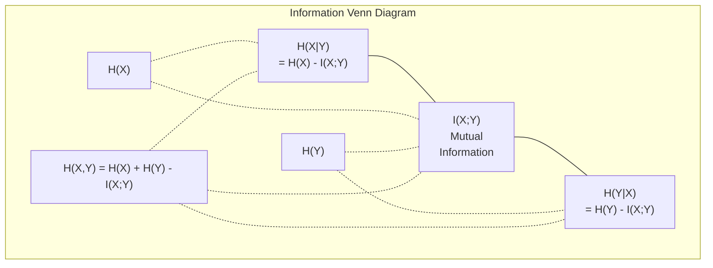

# Théorie de l' information

> La théorie de l'information mesure la surprise.
> 信息论衡惊喜程度──损失函数建立在此──

**Type:** Learn | **类型:** 学习
**Language:**Je suis un Python .**语言:**Python
**Prerequisites:** Phase 1, Lesson 06 (Probability) | **前置知识:** Phase 1, Lesson 06 (Probability)
**Time:** ~60 minutes | **时间:** ~60 分钟

## Objectifs d'apprentissage

- Compute l'entropie, l'entropie croisée et la divergence KL à partir de zéro et explique leur relation
  De la 0 à la 0 à la 0 à la 0 à la 0 à la 0 à la 0 à la 0 à la 0 à la 0 à la 0 à la 0 à la 0 à la 0 à la 0 à la 0 à la 0 à la 0 à la 0 à la 0 à la 0 à la 0 à la 0 à la 0 à la 0 à la 0 à la 0 à la 0 à la 0 à la 0 à la 0 à la 0 à la 0 à la 0 à la 0 à la 0 à la 0 à la 0 à la 0 à la 0 à la 0 à la 0 à la 0 à la 0 à la 0 à la 0 à la 0 à la 0 à la 0 à la 0 à la 0 à la 0 à la 0 à la 0 à la 0 à la 0 à la 0 à la 0 à la 0 à la 0 à la 0 à la 0 à la 0 à la 0 à la 0 à la 0 à 0 à la 0 à la 0 à la 0 à 0 à la 0 à la 0 à 0 à la 0 à la 0 à 0 à la 0 à 0 à la 0 à 0 à la 0 à 0 à la 0 à 0 à la 0 à 0 à 0 à 0 à la 0 à 0 à 0 à 0 à 0 à 0 à la 0 à 0 à 0 à 0 à 0 à 0 à 0 à 0 à 0 à 0 à 0 à 0 à 0 à 0 à 0 à 0 à 0 à 0 à 0 à 0 à 0 à 0 à 0 à 0 à 0 à 0 à 0 à 0 à 0 à 0 à 0 à 0 à 0 à 0 à 0 à 0 à 0 à 0 à 0 à 0 à 0
- Déduire pourquoi minimiser la perte d'entropie croisée est équivalent à maximiser la probabilité de logement
  Pourquoi minimiser les pertes par rapport au prix maximisé par rapport au nombre de similitudes
- Calculer les informations mutuelles entre les caractéristiques et une cible pour classer l'importance des caractéristiques
   importance des caractéristiques de calcul et de l'interaction entre les informations et les objectifs
- Expliquer la perplexité en tant que taille de vocabulaire efficace choisie par un modèle de langue
  解释困惑度作为语言模型选择的有效词汇量

> **【中文解读】**
> 信息论衡量"惊喜程度"越不可能发生的事件,包含信息量越大──交叉损失函数、KL 散度、困惑度(困惑度)

> **【拓展：信息论在 AI 中的位置】**
> - **交叉熵损失**: la fonction standard de perte de tous les modèles et modèles de langage`CrossEntropyLoss`)。
> - **KL 散度**Le but de formation du modèle de récompense du RLHF est de déterminer la valeur de la valeur de l'information.
> - **困惑度(Perplexity)**: 语言模型的评价标准,越低越好,表示模型对下一个词的预测越确定──

## Le problème , l' introduction du problème

> **【中文解读】**Vous êtes en train de faire des exercices.`CrossEntropyLoss()`Les concepts de l'information sont les mêmes concepts de l'information, ils ont simplement changé de capot.

## Le concept de base.

> **【拓展：Shannon 与信息论的诞生】**En 1948, Claude Shannon publie une théorie mathématique de la communication, proposant un cadre pour mesurer la quantité d'information à l'aide de bits. 80 ans plus tard, ce cadre devient la pierre angulaire de l'IA:交叉 est la fonction de perte de toutes les classes et modèles linguistiques, KL 散度 est la production de modèles (VAE、扩散模型) est l'objectif de formation, l'information mutuelle est un outil de sélection des caractéristiques.

### Le contenu de l'information (surprise)

Quand quelque chose d'improbable se produit, il contient plus d'informations.

> Quand quelque chose d'improbable se produit, il est plus facile de le savoir.

Le contenu d'information d'un événement avec probabilité p est:
  概率为 p 的事件的信息量为:

```
I(x) = -log(p(x))
```

L'utilisation de la base log 2 vous donne des bits.
  Utilisation à 2 pour obtenir des bits, utilisation à naturel pour obtenir des nœuds.

```
Event              Probability    Surprise (bits)
Fair coin heads    0.5            1.0
Rolling a 6        0.167          2.58
1-in-1000 event    0.001          9.97
Certain event      1.0            0.0
```

Certains événements ne contiennent aucune information.
> Les événements sont sans information. Vous savez déjà qu'ils se produisent.

### Je suis en train de faire une surprise.

L'entropie est la surprise attendue sur tous les résultats possibles d'une distribution.
> 是 une surprise de l'attente de tous les résultats possibles dans la distribution.

```
H(P) = -sum( p(x) * log(p(x)) )  for all x
```

Une pièce équitable a une entropie maximale pour une variable binaire: 1 bit. Une pièce biaisée (99% de tête) a une entropie faible: 0,08 bits. Vous savez déjà ce qui va se passer, donc chaque détour ne vous dit presque rien.
> Le taux de change de la monnaie équitable par rapport à la monnaie binaire est le plus élevé: 1 par rapport à la monnaie équitable.

```
Fair coin:    H = -(0.5 * log2(0.5) + 0.5 * log2(0.5)) = 1.0 bit
Biased coin:  H = -(0.99 * log2(0.99) + 0.01 * log2(0.01)) = 0.08 bits
```

L'entropie mesure l'incertitude irréductible dans une distribution.
>  L'incertitude de la distribution de mesure est indéterminée.

### La fonction de perte que vous utilisez tous les jours.

L'entropie croisée mesure la surprise moyenne lorsque vous utilisez la distribution Q pour encoder des événements qui proviennent réellement de la distribution P.
> 交叉 Mesurer l'utilisation de la distribution Q 编码 réellement à l'intérieur de vous P de l'événement 

```
H(P, Q) = -sum( p(x) * log(q(x)) )  for all x
```

P est la répartition réelle (les étiquettes). Q est la prédiction de votre modèle. Si Q correspond parfaitement à P, l'entropie croisée est égale à l'entropie.
> P est une réelle distribution, Q est une prédiction du modèle. Si Q est parfaitement en accord avec P, le交叉 est égal à── tout non-conformisme le rendra plus grand.

En classification, P est un vecteur à une chaleur (la vraie classe a une probabilité de 1, tout le reste est 0.) Cela simplifie l'entropie croisée à:
> Dans le classique, P est un-hot 向量(真实类概率为 1,其余为 0)

```
H(P, Q) = -log(q(true_class))
```

C'est la formule de perte de l'entropie croisée pour la classification.
> C'est la formule de la rupture complète de la catégorie.

### KL Divergence (Distance entre les distributions)

La divergence KL mesure la surprise supplémentaire que vous obtenez en utilisant Q au lieu de P.
> KL 散度度衡量使用Q 代替P 时多出的惊喜度──

```
D_KL(P || Q) = sum( p(x) * log(p(x) / q(x)) )  for all x
             = H(P, Q) - H(P)
```

L'entropie croisée est l'entropie plus la divergence KL. Puisque l'entropie de la vraie distribution est constante pendant l'entraînement, minimiser l'entropie croisée est la même chose que minimiser la divergence KL. Vous poussez la distribution de votre modèle vers la vraie distribution.
> 交叉 =  + KL 散度──en raison de la réelle distribution  dans le processus d'entraînement est la constante, la réduction du交叉 est égale à la réduction de KL 散度──en raison de la réelle distribution du modèle.

La divergence KL n'est pas symétrique: D_KL(P ∫ Q) != D_KL(Q ∫ P). Ce n'est pas une mesure de distance réelle.
> KL 散度不对称:D_KL P  Q) != DKL  Q                                                                                                                                                                                                                                                  

### Une information mutuelle .

L'information mutuelle mesure la quantité de savoir une variable vous dit sur une autre.
> L'information est mesurée par savoir combien d'informations une variable peut vous dire sur une autre variable.

```
I(X; Y) = H(X) - H(X|Y)
        = H(X) + H(Y) - H(X, Y)
```

Si X et Y sont indépendants, les informations mutuelles sont zéro. Le fait de connaître l'une ne vous dit rien de l'autre. Si elles sont parfaitement corrélées, les informations mutuelles sont égales à l'entropie de l'une ou l'autre des variables.
> Si X et Y sont indépendants, les informations internes sont zéro. Si X et Y sont complètement liées, les informations internes sont égales à des variables.

Dans la sélection des caractéristiques, une information mutuelle élevée entre une caractéristique et la cible signifie que la caractéristique est utile.
> Dans la sélection des caractéristiques, une information élevée entre les caractéristiques et les objectifs signifie que les caractéristiques sont utiles.

### Entropie conditionnelle.

H(Y de X) mesure la quantité d'incertitude qui reste à propos de Y après l'observation de X.
> H(YX) 衡量在观察到X 后关于Y 剩多少不确定性──

```
H(Y|X) = H(X,Y) - H(X)
```

Deux extrêmes:
  Les deux extrémités:

- Si X détermine complètement Y, alors H(Y ≠X) = 0. Connaître X élimine toute incertitude à propos de Y. Exemple: X = température en Celsius, Y = température en Fahrenheit.
  Si X décide complètement Y, alors H(Y ne X) = 0── savoir X  elimine toute l'incertitude concernant Y──
- Si X ne vous dit rien sur Y, alors H(YX ) = H(Y). Savoir X ne réduit pas votre incertitude du tout. Exemple: X = retour de monnaie, Y = la météo de demain.
  Si X à Y 没有任何信息, alors H  Y X ) = H  Y) 

L'entropie conditionnelle est toujours non négative et ne dépasse jamais H(Y):
> 条件始终非负且不超过 H(Y):

```
0 <= H(Y|X) <= H(Y)
```

Dans l'apprentissage automatique, l'entropie conditionnelle apparaît dans les arbres de décision. À chaque fraction, l'algorithme choisit la fonction X qui minimise H(Y) - la fonction qui élimine la plus grande incertitude sur l'étiquette Y.
> Dans l'apprentissage automatique, les conditions apparaissent dans le bois de décision. À chaque division, l'algorithme sélectionne H  Y Y X) Le plus petit des traits X est celui qui peut éliminer le plus de traits Y incertains.

### Une entropie commune.

H ((X,Y) est l'entropie de la distribution commune de X et Y ensemble.
> H(X,Y) est X 和 Y 联合分布的──

```
H(X,Y) = -sum sum p(x,y) * log(p(x,y))   for all x, y
```

Propriété clé:
  关键性质:

```
H(X,Y) <= H(X) + H(Y)
```

L'égalité est valable lorsque X et Y sont indépendants. Si ils partagent des informations, l'entropie commune est inférieure à la somme des entropies individuelles. L'entropie " manquante " est exactement l'information mutuelle.
> Lorsque X et Y sont formés, ils partagent des informations, et se rejoignent à leur propre différence.



Les relations:
  关系式:

- H(X,Y) = H(X) + H(Y
- Le nombre de personnes concernées est de 0,5% à 0,5%
- H(X,Y) = H(X) + H(Y) - I(X;Y)

### Je suis un homme qui a une bonne idée de ce que je veux dire.

L'information mutuelle I(X;Y) quantifie à quel point la connaissance d'une variable réduit l'incertitude quant à l'autre.
> 互信息 I(X;Y) 量化知道一个变量后对另一个变量不确定性的减少量──

```
I(X;Y) = H(X) - H(X|Y)
       = H(Y) - H(Y|X)
       = H(X) + H(Y) - H(X,Y)
       = sum sum p(x,y) * log(p(x,y) / (p(x) * p(y)))
```

Propriétés:
  Sexualité:

- J'ai toujours X, Y, >= 0, vous ne perdez jamais d'information en observant quelque chose.
  Je suis toujours là pour observer les choses.
- I(X;Y) = 0 si et seulement si X et Y sont indépendants.
  I(X;Y) = 0 lorsque且仅当 X 和 Y 独立。
- Il est symétrique, contrairement à la divergence KL.
  Il est en effet différent de KL.
- I(X;X) = H(X). Une variable partage toutes ses informations avec elle-même.
  I(X;X) = H(X)。

**Mutual information for feature selection.**Dans ML, vous voulez des fonctionnalités qui sont informatives sur la cible.
> **互信息用于特征选择。**Dans l'apprentissage automatique, vous devez avoir des caractéristiques quantité d'information à l'objectif.

1. Pour chaque fonction X_i, calculer I(X_i; Y) où Y est la variable cible.
   Pour chaque caractéristique X_i, calcul I(X_i; Y), Y est l'objectif de la quantité de change.
2. Les caractéristiques de classement par score MI.
   按MI 得分排序特征──
3. Gardez les caractéristiques de haut.
   Pour rester en vie.

Cela fonctionne pour toute relation entre fonction et cible -- linéaire, non linéaire, monotone, ou non. La corrélation ne capture que les relations linéaires.
> Il s'applique à toute relation entre les caractéristiques et les objectifs linéaires  non linéaires  monodéale ou non monodéale                                                                                                                                                                                                                                            

| Method / 方法 | Detects / 检测 | Computational cost / 计算成本 | Handles categorical? / 处理类别型？ |
|--------|---------|-------------------|---------------------|
| Pearson correlation / 皮尔逊相关 | Linear relationships / 线性关系 | O(n) | No / 否 |
| Spearman correlation / 斯皮尔曼相关 | Monotonic relationships / 单调关系 | O(n log n) | No / 否 |
| Mutual information / 互信息 | Any statistical dependency / 任何统计依赖 | O(n log n) with binning | Yes / 是 |

### Étiquette Légiment et entropie croisée

La classification standard utilise des cibles dures: [0, 0, 1, 0]. La vraie classe obtient la probabilité 1, tout le reste obtient 0.
> 标准分类使用硬目标:[0, 0, 1, 0]──真实类概率为 1,其余为 0──标签平滑将其替换为软目标:

```
soft_target = (1 - epsilon) * hard_target + epsilon / num_classes
```

Avec epsilon = 0,1 et 4 classes:
  Quand l'epsilon = 0,1 et il y a 4 catégories:

- Cible difficile: [0, 0, 1, 0]
- Cible douce: [0,025, 0,025, 0,925, 0,025]

D'un point de vue de la théorie de l'information, le lissage des étiquettes augmente l'entropie de la distribution cible. Les cibles dures à une seule chaleur ont une entropie de 0 - il n'y a pas d'incertitude. Les cibles douces ont une entropie positive.
> Du point de vue de l'information, le placement des étiquettes augmente la répartition des objectifs.

Pourquoi cela aide- t- il ?
  Pourquoi ça aide ?

- empêche le modèle de faire passer les logits à des valeurs extrêmes (il faudrait des logits infinies pour correspondre parfaitement à une cible à un seul point chaud sous entropie croisée)
  防止模型将 logits 推到极端值
- Agit comme une régularisation: le modèle ne peut pas être 100% sûr
  作为正则化:模型不能100%自信
- Améliore l'étalonnage: les probabilités prévues reflètent mieux l'incertitude réelle
  améliorer la préparation: prévoir la probabilité mieux refléter la réalité incertaine
- Réduit l'écart entre la formation et le comportement d'inférence
  Réduire les différences entre les pratiques de formation et de recommandation

La perte d'entropie croisée avec l'allumage des étiquettes devient:
> 带标签平滑的交叉损失为:

```
L = (1 - epsilon) * CE(hard_target, prediction) + epsilon * H_uniform(prediction)
```

Le deuxième terme pénalise les prédictions qui sont loin d'être uniformes -- une régularisation directe de la confiance.
> La deuxième punition est la prédiction de la distribution de la distance par rapport à la régularisation directe de la confiance.

### Pourquoi la croisée est la perte de classification

Trois points de vue, la même conclusion.
> Trois points de vue, la même conclusion.

**Information theory view.**L'entropie croisée mesure le nombre de bits que vous gaspillez en utilisant la distribution de votre modèle au lieu de la réelle distribution.
> **信息论视角。**交叉 Mesurer l'utilisation de la distribution de modèle au lieu de la distribution réelle a gaspillé beaucoup de bits― minimiser cela rend votre modèle le plus efficace de la réalité de l'éditeur―

**Maximum likelihood view.**Pour les échantillons de formation N avec des classes vraies y_i:
> **最大似然视角。**Pour le modèle de formation, vraie classe pour y_i:

```
Likelihood     = product( q(y_i) )
Log-likelihood = sum( log(q(y_i)) )
Negative log-likelihood = -sum( log(q(y_i)) )
```

Cette dernière ligne est la perte d'entropie croisée.
> La dernière ligne est le passage à travers le processus de formation.

**Gradient view.**Le gradient de l'entropie croisée par rapport aux logits est simple (prédit - vrai). propre, stable et rapide à calculer. C'est pourquoi il s'accouple parfaitement avec softmax.
> **梯度视角。**交叉对逻辑的梯度就是 (prédit - vrai) 简洁、稳定、计算快速──这就是为什么它与软max 完美搭配──

### Bites contre Nats.

La seule différence est la base du log.
> La seule différence est le nombre inférieur du nombre.

```
log base 2   -> bits      (information theory tradition / 信息论传统)
log base e   -> nats      (machine learning convention / 机器学习惯例)
log base 10  -> hartleys  (rarely used / 很少使用)
```

1 nat = 1/ln(2) bits = 1,4427 bits. PyTorch et TensorFlow utilisent par défaut des logs naturels (nats).
> 1 nat = 1/ln(2) bits = 1,4427 bits。PyTorch 和 TensorFlow 默认使用自然对数(nats)。

### La perplexité.

La perplexité est l'exponentiel de l'entropie croisée.
> La confusion est un indicateur de la différence. Elle vous indique le nombre de choix probables entre les deux.

```
Perplexity = 2^H(P,Q)   (if using bits / 使用 bits 时)
Perplexity = e^H(P,Q)   (if using nats / 使用 nats 时)
```

Un modèle de langage avec une complexité de 50 est, en moyenne, aussi confus qu'il devait choisir uniformément parmi 50 prochains jetons possibles.
> 困惑度为 50 的语言模型,平均就像在 50 个可能的下一个词中均选择一样困惑──越低越好──

GPT-2 a atteint une perplexité de ~30 sur les critères de référence communs.
> Le GPT-2 a atteint un niveau de confusion de ~30 sur le bas de la base de la vie commune.

## Construisez-le et mettez-le en œuvre.
```figure
entropy-kl
```

## Faites-le

### Étape 1: Contenu de l'information et entropie.

```python
import math

def information_content(p, base=2):
    if p <= 0 or p > 1:
        return float('inf') if p <= 0 else 0.0
    return -math.log(p) / math.log(base)

def entropy(probs, base=2):
    return sum(
        p * information_content(p, base)
        for p in probs if p > 0
    )

fair_coin = [0.5, 0.5]
biased_coin = [0.99, 0.01]
fair_die = [1/6] * 6

print(f"Fair coin entropy:   {entropy(fair_coin):.4f} bits")
print(f"Biased coin entropy: {entropy(biased_coin):.4f} bits")
print(f"Fair die entropy:    {entropy(fair_die):.4f} bits")
```

### Étape 2: Entropie croisée et divergence KL

```python
def cross_entropy(p, q, base=2):
    total = 0.0
    for pi, qi in zip(p, q):
        if pi > 0:
            if qi <= 0:
                return float('inf')
            total += pi * (-math.log(qi) / math.log(base))
    return total

def kl_divergence(p, q, base=2):
    return cross_entropy(p, q, base) - entropy(p, base)

true_dist = [0.7, 0.2, 0.1]
good_model = [0.6, 0.25, 0.15]
bad_model = [0.1, 0.1, 0.8]

print(f"Entropy of true dist:     {entropy(true_dist):.4f} bits")
print(f"CE (good model):          {cross_entropy(true_dist, good_model):.4f} bits")
print(f"CE (bad model):           {cross_entropy(true_dist, bad_model):.4f} bits")
print(f"KL divergence (good):     {kl_divergence(true_dist, good_model):.4f} bits")
print(f"KL divergence (bad):      {kl_divergence(true_dist, bad_model):.4f} bits")
```

### Étape 3: Entropie croisée en tant que perte de classification

```python
def softmax(logits):
    max_logit = max(logits)
    exps = [math.exp(z - max_logit) for z in logits]
    total = sum(exps)
    return [e / total for e in exps]

def cross_entropy_loss(true_class, logits):
    probs = softmax(logits)
    return -math.log(probs[true_class])

logits = [2.0, 1.0, 0.1]
true_class = 0

probs = softmax(logits)
loss = cross_entropy_loss(true_class, logits)

print(f"Logits:      {logits}")
print(f"Softmax:     {[f'{p:.4f}' for p in probs]}")
print(f"True class:  {true_class}")
print(f"Loss:        {loss:.4f} nats")
print(f"Perplexity:  {math.exp(loss):.2f}")
```

### Étape 4: L'entropie croisée est égale à la probabilité négative de logement.

```python
import random

random.seed(42)

n_samples = 1000
n_classes = 3
true_labels = [random.randint(0, n_classes - 1) for _ in range(n_samples)]
model_logits = [[random.gauss(0, 1) for _ in range(n_classes)] for _ in range(n_samples)]

ce_loss = sum(
    cross_entropy_loss(label, logits)
    for label, logits in zip(true_labels, model_logits)
) / n_samples

nll = -sum(
    math.log(softmax(logits)[label])
    for label, logits in zip(true_labels, model_logits)
) / n_samples

print(f"Cross-entropy loss:      {ce_loss:.6f}")
print(f"Negative log-likelihood: {nll:.6f}")
print(f"Difference:              {abs(ce_loss - nll):.2e}")
```

### Étape 5: Informations mutuelles

```python
def mutual_information(joint_probs, base=2):
    rows = len(joint_probs)
    cols = len(joint_probs[0])

    margin_x = [sum(joint_probs[i][j] for j in range(cols)) for i in range(rows)]
    margin_y = [sum(joint_probs[i][j] for i in range(rows)) for j in range(cols)]

    mi = 0.0
    for i in range(rows):
        for j in range(cols):
            pxy = joint_probs[i][j]
            if pxy > 0:
                mi += pxy * math.log(pxy / (margin_x[i] * margin_y[j])) / math.log(base)
    return mi

independent = [[0.25, 0.25], [0.25, 0.25]]
dependent = [[0.45, 0.05], [0.05, 0.45]]

print(f"MI (independent): {mutual_information(independent):.4f} bits")
print(f"MI (dependent):   {mutual_information(dependent):.4f} bits")
```

## Utilisez-le avec le cadre de réalisation

Les mêmes concepts utilisant NumPy, la façon dont vous les utiliserez en pratique:
> Utilisez NumPy 实现 le même concept, c'est votre méthode d'utilisation dans la pratique:

```python
import numpy as np

def np_entropy(p):
    p = np.asarray(p, dtype=float)
    mask = p > 0
    result = np.zeros_like(p)
    result[mask] = p[mask] * np.log(p[mask])
    return -result.sum()

def np_cross_entropy(p, q):
    p, q = np.asarray(p, dtype=float), np.asarray(q, dtype=float)
    mask = p > 0
    return -(p[mask] * np.log(q[mask])).sum()

def np_kl_divergence(p, q):
    return np_cross_entropy(p, q) - np_entropy(p)

true = np.array([0.7, 0.2, 0.1])
pred = np.array([0.6, 0.25, 0.15])
print(f"Entropy:    {np_entropy(true):.4f} nats")
print(f"Cross-ent:  {np_cross_entropy(true, pred):.4f} nats")
print(f"KL div:     {np_kl_divergence(true, pred):.4f} nats")
```

Tu as construit de rien .`torch.nn.CrossEntropyLoss()`Vous savez maintenant pourquoi la perte diminue pendant l'entraînement: la distribution prévue de votre modèle approche de la réelle distribution, mesurée en nœuds d'informations gaspillées.
> Tu l'as construit à partir de zéro.`torch.nn.CrossEntropyLoss()`                                                                                                                                                                                                                                                              

## Les exercices

1. Comptez l'entropie de l'alphabet anglais en supposant une répartition uniforme (26 lettres). Puis évaluez-la en utilisant les fréquences de lettres réelles.
   假设均分布计算英文字母表(26 个字母) 的──然后使用实际字母频率估计──哪个更高?为什么?

2. Un modèle donne des logits [5,0, 2.0, 0.5] pour un échantillon avec une classe vraie 1. Calculer la perte d'entropie croisée à la main, puis vérifier avec votre `cross_entropy_loss`Quelle logite donnerait zéro perte ?
   模型对真实类别为 1 的样本输出逻辑 [5.0, 2.0, 0.5]──手算交叉损失,然后用你的函数验证──什么逻辑会给出零损失?

3. Montrez que la divergence KL n'est pas symétrique. Choisissez deux distributions P et Q et comptez D_KL_P_K  Q) et DL Q  P). Expliquez pourquoi elles diffèrent.
   证明 KL 散度不对称──选择两个分布 P 和 Q,计算 D_KL(P 含 Q) 和 D_KL(Q 含 P)──解释为什么它们不同──

4. Construisez une fonction qui calcule la perplexité d'une séquence de prédictions de jetons.
   Construire un jeton de calcul  pré测序列困惑度的函数──给定 (réel jeton 索引, 预测 logits) pour la liste des, retourner la séquence困惑度──

## Les termes clés

| Term / 术语 | What people say | What it actually means / 实际含义 |
|------|----------------|----------------------|
| Information content / 信息量 | "Surprise" | The number of bits (or nats) needed to encode an event: -log(p) / 编码事件所需的比特数（或奈特数）：-log(p) |
| Entropy / 熵 | "Randomness" | The average surprise across all outcomes of a distribution. Measures irreducible uncertainty. / 分布中所有结果的平均惊喜度。衡量不可约减的不确定性。 |
| Cross-entropy / 交叉熵 | "The loss function" | Average surprise when using model distribution Q to encode events from true distribution P. / 使用模型分布 Q 编码来自真实分布 P 的事件时的平均惊喜度。 |
| KL divergence / KL 散度 | "Distance between distributions" | Extra bits wasted by using Q instead of P. Equals cross-entropy minus entropy. Not symmetric. / 使用 Q 代替 P 浪费的额外比特。等于交叉熵减熵。不对称。 |
| Mutual information / 互信息 | "How related are X and Y" | Reduction in uncertainty about X from knowing Y. Zero means independent. / 知道 Y 后关于 X 不确定性的减少。零意味着独立。 |
| Softmax | "Turn logits into probabilities" | Exponentiate and normalize. Maps any real-valued vector to a valid probability distribution. / 指数化并归一化。将任意实值向量映射为有效概率分布。 |
| Perplexity / 困惑度 | "How confused the model is" | Exponential of cross-entropy. The effective vocabulary size the model is choosing from at each step. / 交叉熵的指数。模型每一步选择时的有效词汇量。 |
| Bits / 比特 | "Shannon's unit" | Information measured with log base 2. One bit resolves one fair coin flip. / 用以 2 为底的对数衡量的信息。一比特解决一次公平抛硬币。 |
| Nats / 奈特 | "ML's unit" | Information measured with natural log. Used by PyTorch and TensorFlow by default. / 用自然对数衡量的信息。PyTorch 和 TensorFlow 默认使用。 |
| Negative log-likelihood / 负对数似然 | "NLL loss" | Identical to cross-entropy loss for one-hot labels. Minimizing it maximizes the probability of correct predictions. / 对 one-hot 标签等价于交叉熵损失。最小化它等于最大化正确预测的概率。 |

## Encore une lecture

- [Shannon 1948: A Mathematical Theory of Communication](https://people.math.harvard.edu/~ctm/home/text/others/shannon/entropy/entropy.pdf)- le papier original, toujours lisible
  Originaire, encore à lire
- [Visual Information Theory (Chris Olah)](https://colah.github.io/posts/2015-09-Visual-Information/)- la meilleure explication visuelle de l'entropie et de la divergence KL
   et KL 散度 la meilleure explication visible
- [PyTorch CrossEntropyLoss docs](https://pytorch.org/docs/stable/generated/torch.nn.CrossEntropyLoss.html)- comment le cadre met en œuvre ce que vous venez de construire
  框架 comment réaliser le contenu que vous venez de construire
