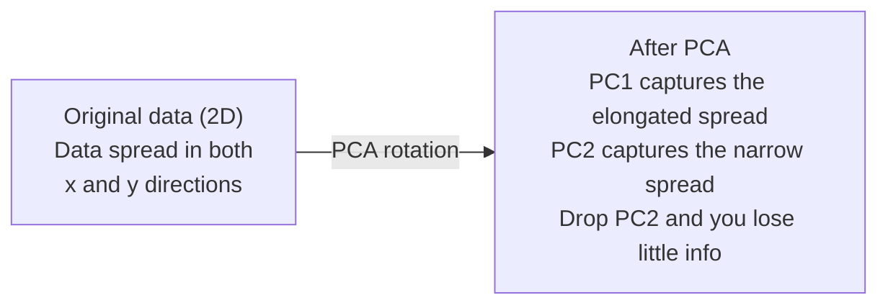

# Réduction de la dimensionnalité

> Les données haute dimension ont une structure. Vous pouvez les trouver en regardant sous le bon angle.
> Les données sont structurées. Vous devez trouver le bon angle pour observer.

**Type:** Build | **类型:** 动手
**Language:**Je suis un Python .**语言:**Python
**Prerequisites:** Phase 1, Lessons 01 (Linear Algebra Intuition), 02 (Vectors, Matrices & Operations), 03 (Eigenvalues & Eigenvectors), 06 (Probability & Distributions) | **前置知识:** Phase 1, Lessons 01-03, 06
**Time:** ~90 minutes | **时间:** ~90 分钟

## Objectifs d'apprentissage

- Implémentation de PCA à partir de zéro: données centrales, calcul de la matrice de covariance, proprecomposition et projet
  De la réalisation de PCA: centralisation des données, calcul de la coefficience de la répartition des valeurs, projection
- Utiliser le ratio de variance expliqué et la méthode du coude pour choisir le nombre de composants principaux
  Utilisation de l'explication de la différence et de l'épaule
- Comparer PCA, t-SNE et UMAP pour visualiser les chiffres MNIST en 2D et expliquer leurs compromis
  Comparer PCA、t-SNE et UMAP en MNIST Handwriting Numbers 2D Effets et poids dans la visualisation
- Appliquer le noyau PCA avec un noyau RBF pour séparer les structures de données non linéaires que le PCA standard ne peut pas gérer
   appliqué avec RBF  nucléaire PCA séparé de PCA standard  non-lineaire structure de données non traitées

> **【中文解读】**
> 784 dimensions de la main écrite Les données numériques ne peuvent être visualisées. La réduction consiste à trouver les données de projection "optimal angle", en conservant le plus de données possible avec le moins de dimensions possible.

> **【拓展：降维在 AI 中的位置】**
> - **PCA**: sklearn de `PCA`Les données sont également utilisées pour la définition des valeurs de décomposition.
> - **t-SNE/UMAP**: High-dimension Data est un outil standard de visualisation en 2D, pratiquement tous les emplacements dans le document sont visualisés avec eux.
> - **推荐系统**Le problème est que les utilisateurs ne peuvent pas se permettre de se faire passer pour des utilisateurs.

## Le problème , l' introduction du problème

> **【中文解读】**784 dimensions de la main écrite numérique données ((28×28 像素) impossible à voir, ni à comprendre directement. Mais la plupart d'entre eux sont redoutables.

Peut-être que c'est des valeurs de pixels de chiffres écrits à la main, peut-être que c'est des niveaux d'expression génique, peut-être que c'est des signaux de comportement de l'utilisateur, vous ne pouvez pas visualiser 784 dimensions, vous ne pouvez pas les tracer, vous ne pouvez même pas y penser.
> Peut-être une image numérique écrite à la main, peut-être un niveau d'expression génétique, peut-être un signal de comportement de l'utilisateur.

Mais la plupart de ces 784 sont redondants. L'information réelle vit sur une surface beaucoup plus petite. Un "7" écrit à la main n'a pas besoin de 784 numéros indépendants pour le décrire. Il a besoin de quelques-uns: l'angle du coup, la longueur de la barre croisée, combien elle penche. Le reste est le bruit.
> Mais la plupart de ces 784 caractéristiques sont redondantes. Les informations vraiment utiles existent sur une surface plus petite. Un "7" écrit à la main n'a pas besoin de 784 chiffres indépendants pour le décrire, il suffit de quelques-uns: angle de peinture, longueur de la ligne, inclination, résiduel de bruit.

La réduction de dimension trouve cette surface plus petite, elle prend vos données 784 dimensions et les comprime à 2, 10 ou 50 dimensions tout en conservant la structure qui compte.
> Il réduira les dimensions de 784 données à 2 10 ou 50 dimensions, tout en conservant une structure significative.

## Le concept de base.

> **【拓展：PCA 与 LoRA 的数学联系】**PCA trouve la direction la plus large de différence entre les données et les composants principaux), ce qui est la même que la pensée centrale de LoRA: le pouvoir de mettre à jour les données de ΔW est concentré sur plusieurs directions.

### La malédiction de la dimensionnalité.

Les espaces haute dimension sont inintuitifs.
> Avec la croissance de la dimension, trois choses se posent.

**Distance becomes meaningless.**Dans les dimensions élevées, la distance entre deux points aléatoires converge à la même valeur. Si chaque point est à peu près la même distance de chaque autre point, la recherche du voisin le plus proche cesse de fonctionner.
> **距离变得无意义。**En hauteur, la distance entre deux points aléatoires approche la même valeur. Si chaque point est à une distance approximative de tous les autres points, la recherche de proximité est perdue.

```
Dimension    Avg distance ratio (max/min between random points)
2            ~5.0
10           ~1.8
100          ~1.2
1000         ~1.02
```

**Volume concentrates in corners.**Un hypercube unitaire en dimensions d a des coins 2D. Dans 100 dimensions, presque tout le volume est dans les coins, loin du centre.
> **体积集中在角落。**Les unités superquadrés ont deux angles. Dans les 100 dimensions, presque tous les objets sont dans un coin, loin du centre.

**You need exponentially more data.**Pour maintenir la même densité d'échantillons dans un espace, passer de 2D à 20D signifie que vous avez besoin de 10 à 18 fois plus de données. Vous n'en avez jamais assez. La réduction des dimensions ramène la densité des données à quelque chose de viable.
> **需要指数级更多的数据。**De 2D à 20D, pour maintenir la même densité d'échantillon, il faut 10 à 18 fois plus de données.

### Trouver les directions qui comptent

L'analyse des composants principaux (PCA) détermine les axes sur lesquels vos données varient le plus. Il fait tourner votre système de coordonnées de sorte que le premier axe capture le plus de variance, le second le plus de variance, et ainsi de suite.
> L'analyse des principaux composants (PCA) trouve le plus grand axe de changement de données. Elle tourne en rotation, permettant au premier axe de capturer le plus grand différent, au second de capturer le plus grand différent, selon ce type de recommandation.

L' algorithme:
  算法步骤:

```
1. Center the data        (subtract the mean from each feature) / 数据中心化
2. Compute covariance     (how features move together) / 计算协方差
3. Eigendecomposition     (find the principal directions) / 特征值分解
4. Sort by eigenvalue     (biggest variance first) / 按特征值排序
5. Project               (keep top k eigenvectors, drop the rest) / 投影
```

Pourquoi la composition propre ? La matrice de covariance est symétrique et semi-définie positive. Ses propres vecteurs sont des directions orthogonales dans l'espace de caractéristiques. Les valeurs propres vous indiquent combien de variance chaque direction capture. Le propre vecteur avec les plus grands points de valeur propre le long de la direction de la variance maximale.
> Pourquoi utiliser la valeur de la décomposition des caractéristiques ? La matrice de différence des caractéristiques est appelée la demi-finition. Le moment de la décomposition des caractéristiques est le moment de la décomposition des caractéristiques dans l'espace. La valeur des caractéristiques vous indique dans chaque direction combien de différences de la différence de la différence. La valeur de la plus grande caractéristique de la décomposition des caractéristiques est indiquée dans la direction de la plus grande différence de la différence de la différence de la différence de la différence de la différence de la différence de la différence.



- **Before PCA:**Le nuage de données est dispersé en diagonale sur les axes x et y
  **PCA 前：**Les données ne sont pas disponibles dans les directions transversales x et y axes
- **After PCA:**Le système de coordonnées est tourné de sorte que PC1 s'aligne avec la direction de la variance maximale (différence allongée) et PC2 avec la direction de la variance minimale (différence étroite).
  **PCA 后：**坐标系旋转,PC1 à la direction la plus large,PC2 à la direction la plus petite
- **Dimensionality reduction:**Le PC2 projette les données sur PC1, perdant très peu d'informations
  **降维：** Jetez PC2 projeter les données sur PC1, perte de très peu d'informations

### Ratio de variance expliqué

Chaque composant principal capture une fraction de la variance totale.
> Chaque composant principal est une partie de la différence totale de capture.

```
Component    Eigenvalue    Explained ratio    Cumulative
PC1          4.73          0.473              0.473
PC2          2.51          0.251              0.724
PC3          1.12          0.112              0.836
PC4          0.89          0.089              0.925
...
```

Lorsque la variance cumulée expliquée atteint 0,95, vous savez que de nombreux composants capturent 95% des informations.
> Lorsque la différence d'explication cumulée atteint 0,95, ces composants capturent 95% de l'information.

### Choisir le nombre de composants

Trois stratégies:
  Trois stratégies:

1. **Threshold.**Conservez suffisamment de composants pour expliquer 90 à 95% de la variance.
   **阈值法。**Gardez suffisamment d'ingrédients pour expliquer la différence de 90 à 95%.
2. **Elbow method.**Le complot explique la variance par composant.
   **肘部法则。** dessiner chaque composant                                                                                                                                                                                                                                                            
3. **Downstream performance.**Utilisez le PCA comme préprocessage.
   **下游性能。**Pour le traitement préalable, la PCA doit être utilisée comme un traitement préalable.

### Réserver les quartiers

t-Distributed Stochastic Neighbor Embedding (t-SNE) est conçu pour la visualisation. Il cartographient les données haute dimension en 2D (ou 3D) tout en préservant les points proches les uns des autres.
> t-SNE 专为可视化设计── il va permettre de visualiser les données en 2D ou en 3D, tout en conservant les points proches les uns des autres──

L'intuition: dans l'espace original, calculer une répartition de probabilité sur des paires de points en fonction de leurs distances. Les points proches obtiennent une probabilité élevée. Les points éloignés obtiennent une probabilité faible. Alors trouver un arrangement 2D où la même répartition de probabilité est valable.
> 直觉: dans l'espace initial, la répartition de probabilité entre les points calculés par distance. La probabilité des points proches est élevée, la probabilité des points éloignés est faible.

Propriétés clés de t-SNE:
  Les caractéristiques clés de t-SNE:

- Il peut déployer des variétés complexes que l'ACP ne peut pas.
  Non-lineur.
- Les différentes courses produisent des dispositions différentes.
  随机性── différentes opérations se produisent dans différentes situations──
- Le paramètre de perplexité détermine le nombre de voisins à considérer (intervalle typique: 5-50).
  Parfait de la complexité 参数控制考虑多少邻居 (typique champ: 5 à 50)
- Les distances entre les grappes dans la sortie ne sont pas significatives.
  La distance entre les classes de sortie est sans signification.
- Lent sur les grands ensembles de données.
  Il est également possible de faire des recherches sur les données.

### UMAP: plus rapide, meilleure structure globale

L'approximation et la projection à manifold uniforme (UMAP) fonctionne de la même manière que t-SNE, mais avec deux avantages:
> L'UMAP est similaire à l'U-SNE, mais présente deux avantages:

- Il utilise des graphiques proches du voisinage plutôt que de calculer toutes les distances par paires.
  En effet, les données de la région de la région de la région de la région de la région de la région de la région de la région de la région de la région de la région de la région de la région de la région de la région de la région de la région de la région de la région de la région de la région de la région de la région de la région de la région de la région de la région de la région de la région de la région de la région de la région de la région de la région de la région de la région de la région de la région de la région de la région de la région de la région de la région de la région de la région de la région de la région de la région de la région de la région de la région de la région de la région de la région de la région de la région de la région de la région de la région de la région de la région de la région de la Sud-Suriné sont plus nombreuses.
- La structure globale améliorée: les positions relatives des groupes dans la production ont tendance à être plus significatives que dans les T-SNE.
  Mieux de structure globale. Les positions relatives des concentrations de sortie sont plus significatives que celles de t-SNE.

UMAP construit un graphique pondéré dans l'espace haute dimension (la "représentation topologique floue") et trouve ensuite un plan bas-dimensionnel qui préserve ce graphique aussi bien que possible.
> UMAP dans le haut espace construire des plans de construction en plus de la structure de l'image, puis trouver le maximum de conservation de la structure de la structure.

Paramètres clés:
  关键参数:

- `n_neighbors`Les valeurs plus élevées préservent une structure plus globale.
  `n_neighbors`: combien de voisins définissent la structure locale (en anglais)
- `min_dist`Les valeurs inférieures créent des grappes plus denses.
  `min_dist`Les valeurs inférieures créent des classes plus denses.

### Quand utiliser quelle ? Quelle méthode ?

| Method / 方法 | Use case / 使用场景 | Preserves / 保留 | Speed / 速度 |
|--------|----------|-----------|-------|
| PCA | Preprocessing before training / 训练前预处理 | Global variance / 全局方差 | Fast (exact), works on millions of samples / 快速（精确），支持百万级样本 |
| PCA | Quick exploratory visualization / 快速探索性可视化 | Linear structure / 线性结构 | Fast / 快 |
| t-SNE | Publication-quality 2D plots / 发表级 2D 图 | Local neighborhoods / 局部邻域 | Slow (< 10k samples ideal) / 慢（<1万样本最佳） |
| UMAP | 2D visualization at scale / 大规模 2D 可视化 | Local + some global structure / 局部+部分全局结构 | Medium (handles millions) / 中等（支持百万级） |
| PCA | Feature reduction for models / 模型特征降维 | Variance-ranked features / 方差排序特征 | Fast / 快 |
| t-SNE / UMAP | Understanding cluster structure / 理解聚类结构 | Cluster separation / 聚类分离 | Medium to slow / 中等到慢 |

Règle générale: utilisez PCA pour le prétraitement et la compression des données. Utilisez t-SNE ou UMAP lorsque vous devez visualiser la structure en 2D.
> 經驗法则:PCA utilisé pour le traitement préalable et la compression de données.

### Le noyau PCA

Le PCA standard trouve des sous-espaces linéaires. Il tourne votre système de coordonnées et dépose les axes. Mais que se passe-t-il si les données se trouvent sur un polyvalent non linéaire? Un cercle en 2D ne peut être séparé par aucune ligne.
> 標準PCA 找线性子空间──但如果数据位于非线性流形上呢?2D Les cycles du milieu ne peuvent être séparés par aucune ligne directe──標準PCA 无能为力──

Le noyau PCA applique le PCA dans un espace de fonctionnalités haute dimension induit par une fonction du noyau, sans calculer explicitement les coordonnées dans cet espace.
>  Le PCA nucléaire est appliqué dans l'espace de haute qualité induit par la fonction nucléaire, sans calculer explicitement les coordonnées de cet espace.

L' algorithme:
  算法步骤:

1. Compute la matrice du noyau K où K_ij = k(x_i, x_j)
   计算核矩阵 K, dont K_ij = k(x_i, x_j)
2. Centrez la matrice du noyau dans l'espace des fonctionnalités
   Dans les caractéristiques de l'espace
3. Eigendecompose la matrice du noyau centrée
   Pour la régulation nucléaire centralisée faire caractériser la valeur de décomposition
4. Les vecteurs propres supérieurs (échelonnés par 1/sqrt(value propre)) sont les projections
   顶部特征向量(缩放 1/sqrt(特征值)) est pour le projet

Fonctions courantes du noyau:
  常见核函数:

| Kernel / 核函数 | Formula / 公式 | Good for / 适用于 |
|--------|---------|----------|
| RBF (Gaussian) | exp(-gamma * \|\|x - y\|\|^2) | Most nonlinear data, smooth manifolds / 大多数非线性数据，光滑流形 |
| Polynomial / 多项式 | (x . y + c)^d | Polynomial relationships / 多项式关系 |
| Sigmoid | tanh(alpha * x . y + c) | Neural network-like mappings / 类神经网络映射 |

Lorsque l'utilisation du noyau PCA par rapport à l'utilisation standard PCA:
  核 PCA vs 标准 PCA  核 PCA  核 PCA  核 PCA  核 PCA  核 PCA  核 PCA  核 PCA  核 PCA  核 PCA 核 PCA 核 PCA 核 PCA 核 PCA 核 PCA 核 PCA 核 PCA 核 PCA 核 PCA 核 PCA 核 PCA 核 PCA 核 PCA 核 PCA 核 PCA 核 PCA 核 PCA 核 PCA 核 PCA 核 PCA 核 PCA 核 PCA 核 PCA 核 PCA 核 核 核 核 核 核 核 核 核 核 核 核 核 核 核 核 核 核 核 核 核 核 核 核 核 核 核 核 核 核 核 核 核 核 核 核 核 核 核 核 核 核 核 核 核 核 核 核 核 核 核 核 核 核 核 核 核 核 核 核 核 核 核 核 核 核 核 核 核 核 核 核 核 核 核 核 核 核 核 核 核 核 核 核 核 核 核 核 核 核 核 核 核 核 核 核 核 核 核 核 核 核 核 核 核 核 核 核 核 核 核 核 核 核 核 核 核 核 核 核 核 核 核 核 核 核 核 核 核 核 核 核 核 核 核 核 核 核 核 核 核 核 核 核 核 核 核 核 核 核 核 核 核 核 核 核 核 核 核 核 核 核 核 核 核 核   核 核 核 核 核 核 核 核 

| Criterion / 标准 | Standard PCA / 标准 PCA | Kernel PCA / 核 PCA |
|-----------|-------------|------------|
| Data structure / 数据结构 | Linear subspace / 线性子空间 | Nonlinear manifold / 非线性流形 |
| Speed / 速度 | O(min(n^2 d, d^2 n)) | O(n^2 d + n^3) |
| Interpretability / 可解释性 | Components are linear combinations of features / 成分是特征的线性组合 | Components lack direct feature interpretation / 成分缺乏直接特征解释 |
| Scalability / 可扩展性 | Works on millions of samples / 支持百万级样本 | Kernel matrix is n x n, memory-limited / 核矩阵为 n x n，受内存限制 |
| Reconstruction / 重建 | Direct inverse transform / 直接逆变换 | Requires pre-image approximation / 需要预图像近似 |

L'exemple classique: cercles concentriques en 2D. Deux cercles de points, l'un à l'intérieur de l'autre. PCA standard projette les deux sur la même ligne - inutile pour la classification. PCA du noyau avec un noyau RBF cartographient le cercle intérieur et le cercle extérieur vers différentes régions, les rendant linéairement séparables.
> 经典例: 2D 同心圆──两圈点,一圈在另一个圈内──标准PCA les projettera sur la même ligne对分类无用──带RBF 核PCA将内圈和外圈映射到不同区域,使其线性可分──

### Erreur de reconstruction

Vous avez comprimé 784 dimensions à 50.
> Vous allez réduire 784 à 50 dimensions.

Mesurer l'erreur de reconstruction:
  测量重建误差:

1. Données du projet à k dimensions: X_réduit = X @ W_k
   Pour projeter les données à l'échelle
2. Reconstruire: X_hat = X_reducé @ W_k^T
   Rédaction
3. MSE de calcul: moyenne (X - X_hat) ^2)
   计算 MSE

Pour PCA, l'erreur de reconstruction a une relation nette avec la variance expliquée:
> Pour PCA, la réconstruction des erreurs et l'explication des différences ont une relation simple:

```
Reconstruction error = sum of eigenvalues NOT included
Total variance = sum of ALL eigenvalues
Fraction lost = (sum of dropped eigenvalues) / (sum of all eigenvalues)
```

Le rapport de variance expliqué pour chaque composant est le suivant:
> Chaque composant est expliqué en deux termes:

```
explained_ratio_k = eigenvalue_k / sum(all eigenvalues)
```

Le tracé de la variance cumulative expliquée par rapport au nombre de composants vous donne la courbe "coup d'épaule".
> 図集 累积解释方差与成分数的关系得到"肘部"曲线──正确成分数在以下位置:

- La courbe s' aplatit (rendement en diminution) / 曲线变平(收益递减)
- La variance cumulée dépasse votre seuil (généralement 0,90 ou 0,95) / 累积方差超值
- Plateaux de performance des tâches en aval / performances des tâches en aval atteignent la période de mise en œuvre

L'erreur de reconstruction est utile au-delà du choix de k. Vous pouvez l'utiliser pour la détection d'anomalies: les échantillons présentant une erreur de reconstruction élevée sont des échantillons hors de rapport qui ne correspondent pas au sous-espace appris.
> Le modèle de la réconstruction de l'erreur de construction n'est pas conforme à la valeur de l'erreur de l'espace de formation. C'est la base de l'examen de l'erreur de construction de PCA dans le système de production.

## Construisez-le et mettez-le en œuvre.
```figure
pca-axes
```

## Faites-le

> **【中文解读】**Le processus complet de la mise en œuvre de PCA est le suivant: datacentration → 协方差矩阵 →特征值分解 → 投影── puis, dans les données du MNIST, le résultat visuel de PCA、t-SNE、UMAP──

### Étape 1: PCA à partir de zéro

```python
import numpy as np

class PCA:
    def __init__(self, n_components):
        self.n_components = n_components
        self.components = None
        self.mean = None
        self.eigenvalues = None
        self.explained_variance_ratio_ = None

    def fit(self, X):
        self.mean = np.mean(X, axis=0)
        X_centered = X - self.mean

        cov_matrix = np.cov(X_centered, rowvar=False)

        eigenvalues, eigenvectors = np.linalg.eigh(cov_matrix)

        sorted_idx = np.argsort(eigenvalues)[::-1]
        eigenvalues = eigenvalues[sorted_idx]
        eigenvectors = eigenvectors[:, sorted_idx]

        self.components = eigenvectors[:, :self.n_components].T
        self.eigenvalues = eigenvalues[:self.n_components]
        total_var = np.sum(eigenvalues)
        self.explained_variance_ratio_ = self.eigenvalues / total_var

        return self

    def transform(self, X):
        X_centered = X - self.mean
        return X_centered @ self.components.T

    def fit_transform(self, X):
        self.fit(X)
        return self.transform(X)
```

### Étape 2: Test sur les données synthétiques.

```python
np.random.seed(42)
n_samples = 500

t = np.random.uniform(0, 2 * np.pi, n_samples)
x1 = 3 * np.cos(t) + np.random.normal(0, 0.2, n_samples)
x2 = 3 * np.sin(t) + np.random.normal(0, 0.2, n_samples)
x3 = 0.5 * x1 + 0.3 * x2 + np.random.normal(0, 0.1, n_samples)

X_synthetic = np.column_stack([x1, x2, x3])

pca = PCA(n_components=2)
X_reduced = pca.fit_transform(X_synthetic)

print(f"Original shape: {X_synthetic.shape}")
print(f"Reduced shape:  {X_reduced.shape}")
print(f"Explained variance ratios: {pca.explained_variance_ratio_}")
print(f"Total variance captured: {sum(pca.explained_variance_ratio_):.4f}")
```

### Étape 3: Les chiffres du MNIST en 2D

```python
from sklearn.datasets import fetch_openml

mnist = fetch_openml("mnist_784", version=1, as_frame=False, parser="auto")
X_mnist = mnist.data[:5000].astype(float)
y_mnist = mnist.target[:5000].astype(int)

pca_mnist = PCA(n_components=50)
X_pca50 = pca_mnist.fit_transform(X_mnist)
print(f"50 components capture {sum(pca_mnist.explained_variance_ratio_):.2%} of variance")

pca_2d = PCA(n_components=2)
X_pca2d = pca_2d.fit_transform(X_mnist)
print(f"2 components capture {sum(pca_2d.explained_variance_ratio_):.2%} of variance")
```

### Étape 4: Comparez avec les produits de la société.

```python
from sklearn.decomposition import PCA as SklearnPCA
from sklearn.manifold import TSNE

sklearn_pca = SklearnPCA(n_components=2)
X_sklearn_pca = sklearn_pca.fit_transform(X_mnist)

print(f"\nOur PCA explained variance:     {pca_2d.explained_variance_ratio_}")
print(f"Sklearn PCA explained variance: {sklearn_pca.explained_variance_ratio_}")

diff = np.abs(np.abs(X_pca2d) - np.abs(X_sklearn_pca))
print(f"Max absolute difference: {diff.max():.10f}")

tsne = TSNE(n_components=2, perplexity=30, random_state=42)
X_tsne = tsne.fit_transform(X_mnist)
print(f"\nt-SNE output shape: {X_tsne.shape}")
```

### Étape 5: Comparer avec l'UMAP

```python
try:
    from umap import UMAP

    reducer = UMAP(n_components=2, n_neighbors=15, min_dist=0.1, random_state=42)
    X_umap = reducer.fit_transform(X_mnist)
    print(f"UMAP output shape: {X_umap.shape}")
except ImportError:
    print("Install umap-learn: pip install umap-learn")
```

## Utilisez-le avec le cadre de réalisation

> **【拓展：t-SNE vs UMAP 选哪个？】**t-SNE: méthode classique, garder localement voisins relations, adapté à la recherche de données dans la structure de la structure de données.

L'APC comme préprocessage avant un classifiant:
> Pré-processage de la PCA en tant que classification:

```python
from sklearn.decomposition import PCA as SklearnPCA
from sklearn.linear_model import LogisticRegression
from sklearn.model_selection import train_test_split
from sklearn.metrics import accuracy_score

X_train, X_test, y_train, y_test = train_test_split(
    X_mnist, y_mnist, test_size=0.2, random_state=42
)

results = {}
for k in [10, 30, 50, 100, 200]:
    pca_k = SklearnPCA(n_components=k)
    X_tr = pca_k.fit_transform(X_train)
    X_te = pca_k.transform(X_test)

    clf = LogisticRegression(max_iter=1000, random_state=42)
    clf.fit(X_tr, y_train)
    acc = accuracy_score(y_test, clf.predict(X_te))
    var_captured = sum(pca_k.explained_variance_ratio_)
    results[k] = (acc, var_captured)
    print(f"k={k:>3d}  accuracy={acc:.4f}  variance={var_captured:.4f}")
```

Des plateaux de performance bien avant les dimensions 784.
> La performance est bien inférieure à 784... et la durée de fonctionnement est la meilleure.

## Envoyez-le . Produit .

Cette leçon donne:
> Le programme de formation

- `outputs/skill-dimensionality-reduction.md`- une aptitude à choisir la bonne technique de réduction de dimensionnalité pour une tâche donnée
  Un document de compétences pour une tâche donnée

## Les exercices

1. Modifier la classe PCA pour soutenir `inverse_transform`. Reconstruire les chiffres MNIST à partir de 10, 50 et 200 composants. Imprimez l'erreur de reconstruction (différence moyenne carré de l'original) pour chacun.
   Modifier les PCA 类以支持 `inverse_transform`△ Utiliser 10、50 和 200 composants pour reconstruire le MNIST

2. Exécuter t-SNE sur le même sous-ensemble MNIST avec des valeurs de perplexité de 5, 30 et 100. Décrivez comment la sortie change. Pourquoi la perplexité affecte-t-elle la fermeté du cluster?
   Utilisez la perplexité  valeurs 5、30 和 100 dans le même MNIST 子集上运行 t-SNE。 description de la sortie de variation。 Pourquoi la perplexité  affecte-t-elle la densité de la cluster ?

3. Prenez un ensemble de données de 50 caractéristiques dont seulement 5 sont informatives (générez une avec `sklearn.datasets.make_classification`) Appliquer le PCA et vérifier si la courbe de variance expliquée identifie correctement que les données sont effectivement cinq dimensions.
   Prenez un ensemble de données qui a 50 caractéristiques mais qui n'est utile que 5 fois. Appliquez PCA, vérifiez si la courbe d'explication est correcte.

## Les termes clés

| Term / 术语 | What people say | What it actually means / 实际含义 |
|------|----------------|----------------------|
| Curse of dimensionality / 维度灾难 | "Too many features" | Distances, volumes, and data density all behave counterintuitively as dimensions grow. Models need exponentially more data to compensate. / 随维度增长，距离、体积和数据密度都反直觉。模型需要指数级更多数据来补偿。 |
| PCA / 主成分分析 | "Reduce dimensions" | Rotate your coordinate system so the axes align with the directions of maximum variance, then drop the low-variance axes. / 旋转坐标系使轴对齐最大方差方向，然后丢弃低方差轴。 |
| Principal component / 主成分 | "An important direction" | An eigenvector of the covariance matrix. The direction in feature space along which the data varies most. / 协方差矩阵的特征向量。特征空间中数据变化最大的方向。 |
| Explained variance ratio / 解释方差比 | "How much info this component has" | The fraction of total variance captured by one principal component. Sum the top k ratios to see how much k components preserve. / 一个主成分捕获的总方差比例。累加前 k 个比率看 k 个成分保留了多少。 |
| Covariance matrix / 协方差矩阵 | "How features correlate" | A symmetric matrix where entry (i,j) measures how feature i and feature j move together. Diagonal entries are individual variances. / 对称矩阵，第 (i,j) 项衡量特征 i 和 j 如何共同变化。对角项是各自方差。 |
| t-SNE | "That cluster plot" | A nonlinear method that maps high-dimensional data to 2D by preserving pairwise neighborhood probabilities. Good for visualization, not for preprocessing. / 非线性方法，通过保留成对邻域概率将高维数据映射到 2D。适合可视化，不适合预处理。 |
| UMAP | "Faster t-SNE" | A nonlinear method based on topological data analysis. Preserves both local and some global structure. Scales better than t-SNE. / 基于拓扑数据分析的非线性方法。保留局部和部分全局结构。扩展性优于 t-SNE。 |
| Perplexity / 困惑度 | "A t-SNE knob" | Controls the effective number of neighbors each point considers. Low perplexity focuses on very local structure. High perplexity captures broader patterns. / 控制每个点考虑的有效邻居数。低困惑度关注局部结构，高困惑度捕获更广模式。 |
| Manifold / 流形 | "The surface the data lives on" | A lower-dimensional surface embedded in a higher-dimensional space. A sheet of paper crumpled in 3D is a 2D manifold. / 嵌入高维空间的低维曲面。揉成团的纸是 2D 流形。 |

## Encore une lecture

- [A Tutorial on Principal Component Analysis](https://arxiv.org/abs/1404.1100)(Shlens) - dérivation claire de l'ACP à partir de zéro
  PCA 清晰推导
- [How to Use t-SNE Effectively](https://distill.pub/2016/misread-tsne/)(Wattenberg et coll.) - guide interactif sur les pièges et les choix de paramètres de l'ENE
  t-SNE 使用指南,交互式展示参数选择和陷
- [UMAP documentation](https://umap-learn.readthedocs.io/)- la théorie et les orientations pratiques des auteurs de l'UMAP
  UMAP 理论与实践指南
