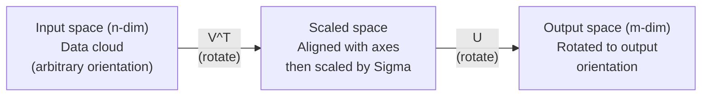
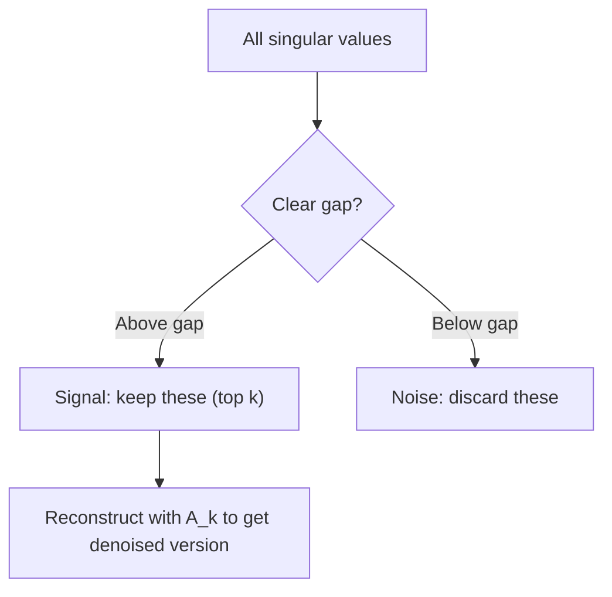

# Décomposition de la valeur singulière .

> Le SVD est le couteau de l'armée suisse de l'algèbre linéaire.
> Le SVD est le "sniper" de l'algorithme de l'ordre. Chaque réaction a un.

**Type:** Build | **类型:** 动手
**Languages:** Python, Julia | **语言:** Python, Julia
**Prerequisites:** Phase 1, Lessons 01 (Linear Algebra Intuition), 02 (Vectors & Matrices Operations), 03 (Matrix Transformations) | **前置知识:** Phase 1, Lessons 01-03
**Time:** ~120 minutes | **时间:** ~120 分钟

## Objectifs d'apprentissage

- Implémenter le SVD par l'itération de puissance et expliquer la signification géométrique de U, Sigma et V^T
  代实现 SVD, expliquer U、Sigma 和 V^T's几何含义
- Appliquer des SVD tronqués pour la compression d'image et mesurer le rapport compression vs erreur de reconstruction
   application de la coupe de SVD  réalisation de la compression d'image, de la compression de mesure par rapport à l'erreur de reconstruction
- Compute la pseudo-inverse Moore-Penrose via SVD pour résoudre les systèmes de plus-quadrés définies
  À travers le SVD  calcul Moore-Penrose  pseudo inverse à la recherche de résolution sur déterminé le système de seconde dimension minimale
- Connecter le SVD à la PCA, les systèmes de recommandation (facteurs latente) et l'analyse sémantique latente en PNL
  L'analyse des implications potentielles de la PNL et du SVD est liée à la PCA, à la PPC.

> **【中文解读】**
> SVD est un symbole de la "Région de guerre" Toutes les répertoires peuvent être divisées en U * Sigma * V^T。

> **【拓展：SVD 在 AI 中的位置】**
> - **推荐系统**Le résultat de la compétition Netflix est la répartition SVD de la matrice de cotes utilisateur-objet.
> - **图像压缩**: 截断 SVD seulement conserver le plus grand nombre de valeur étrangère, en utilisant très peu de données approximatives.
> - **LSA (潜在语义分析)**Le premier modèle de thématique de la PNL, pour le document-word矩阵 faire SVD 发现隐含主题──

## Le problème , l' introduction du problème

> **【中文解读】**Vous avez une matrice de 1000×2000 (en anglais seulement) et vous pouvez la décomposer en trois éléments U·Σ·V^T, révélant la qualité de la matrice.

Peut-être que c'est une liste de fréquences à terme, peut-être que c'est la valeur des pixels d'une image, peut-être que vous devez la compresser, la dénoncer, trouver une structure cachée ou résoudre un système de minuscules carrés avec elle.
> Peut-être est-ce le score de l'utilisateur, peut-être est-ce le tableau de fréquence, peut-être est-ce l'image. Vous devez le compresser, le détromper, trouver une structure cachée, ou l'utiliser pour résoudre le plus petit nombre de fois.

Le SVD fonctionne sur n'importe quelle matrice, n'importe quelle forme, n'importe quel rang, aucune condition, il décompose la matrice en trois facteurs qui révèlent la géométrie de ce que la matrice fait à l'espace.
> SVD est applicable à toute matrice. Il est la plus commune de tous les nombres de ligne.

## Le concept de base.

> **【拓展：SVD 是 LoRA 的数学根基】**LoRA 微调的核心假设:权重更新矩阵 ΔW 是低排的──SVD 告诉我们, toute矩阵 peut être divisée en U·Σ·V^T, parmi lesquelles Σ 中的奇异值按大小排列──LoRA ne conserve que le plus grand k 个奇异值对应的分量 (((即级-k近似), les paramètres de mn 减少到 k  m + n)──这是SVD de la théorie à l'application directement transformation──

### Ce que le SVD fait géométriquement

Chaque matrice, quelle que soit sa forme, effectue trois opérations en séquence: tourner, échelle, tourner.
> Chaque matrice, quelle que soit sa forme, exécute trois opérations en ordre: rotation, rallonge, rotation, SVD pour faire cette décomposition.

```
A = U * Sigma * V^T

      m x n     m x m    m x n    n x n
     (any)    (rotate)  (scale)  (rotate)
```

En fonction de la matrice A, le SVD la classe en:
>  à déterminer la matrice A, le SVD la décompose en:

- V^T fait tourner des vecteurs dans l'espace d'entrée (n-dimensionnel)
  V^T dans le flux de l'espace
- Scales sigma le long de chaque axe (étirement ou comprimé)
  Sigma 沿每个轴缩放 (拉伸或压缩)
- U fait tourner le résultat dans l'espace de sortie (m-dimensionnel)
  Vous allez faire le tour du résultat à l' espace de sortie



Vous donnez à SVD une matrice qui vous dit: " Cette matrice prend une sphère d'entrée, la tourne d'abord par V^T, puis la traîne dans un ellipsoïde par Sigma, puis tourne l'ellipsoïde par U. " Les valeurs singulières sont les longitudes des axes de l'ellipsoïde.
>  Imaginez ceci: vous avez donné la matrice à la SVD, elle vous dit:" Cette matrice reçoit un ensemble de facettes de ballons, tourne d'abord avec V^T, reutilise Sigma 拉伸成球, reutilise U 旋球──"Value étrange est la longueur de chaque axe de la balle──"

### La décomposition complète.

Pour une matrice A de forme m x n:

```
A = U * Sigma * V^T

where:
  U     is m x m, orthogonal (U^T U = I)
  Sigma is m x n, diagonal (singular values on the diagonal)
  V     is n x n, orthogonal (V^T V = I)

The singular values sigma_1 >= sigma_2 >= ... >= sigma_r > 0
where r = rank(A)
```

Les colonnes de U sont appelées vecteurs singuliers gauche. Les colonnes de V sont appelées vecteurs singuliers droites. Les entrées diagonales de Sigma sont appelées valeurs singulières. Elles sont toujours non négatives et classifiées conventionnellement dans un ordre décroissant.
> U des lignes sont appelées à la gauche, V des lignes à la droite, et les éléments de la ligne de coupe de Sigma sont appelés à la gauche.

### Vecteurs singuliers gauche, valeurs singulières, vecteurs singuliers droite

Chaque composant du SVD a une signification géométrique distincte.
> Chaque fraction de la SVD a une signification géométrique unique.

**Right singular vectors (columns of V):**Ces éléments constituent une base orthonormale pour l'espace d'entrée (R^n). Ce sont les directions dans l'espace d'entrée que la matrice trace vers des directions orthogonales dans l'espace de sortie.
> **右奇异向量（V 的列）：**Les matrices de l'espace de sortie sont représentées dans le sens de l'espace de sortie.

**Singular values (diagonal of Sigma):**La valeur singulière de la matrice est la valeur de l'échelle de l'échelle.
> **奇异值（Sigma 的对角线）：**缩放因子──第1 个奇异值告诉你矩阵沿第1个右奇异向量方向拉伸多少──奇异值为零 signifie que la矩阵 est complètement pressée dans cette direction──

**Left singular vectors (columns of U):**Ces éléments constituent une base orthonormale pour l'espace de sortie (R^m). Le ième vecteur singulier gauche est la direction dans l'espace de sortie où le ième vecteur singulier droit atterrit (après l'échelle).
> **左奇异向量（U 的列）：**构成输出空间 (R^m) 的正交基──第 i 个左奇异向量是第 i个右奇异向量(缩放后) 落在输出空间中的方向──

La relation entre eux:
> ¦ Les relations entre elles:

```
A * v_i = sigma_i * u_i

The matrix A takes the i-th right singular vector v_i,
scales it by sigma_i, and maps it to the i-th left singular vector u_i.
```

Cela vous donne une image coordonnée par coordonnée de ce que fait une matrice.
> Ceci vous fournit une image de chaque matrice.

### Une forme de produit externe

Le SVD peut être écrit comme une somme de matrices de rang 1:
> SVD peut être écrit en rangant 1 矩阵之和:

```
A = sigma_1 * u_1 * v_1^T + sigma_2 * u_2 * v_2^T + ... + sigma_r * u_r * v_r^T

Each term sigma_i * u_i * v_i^T is a rank-1 matrix (an outer product).
The full matrix is the sum of r such matrices, where r is the rank.
```

Cette forme est la base de l'approximation de rang inférieur. Chaque terme ajoute une couche de structure. Le premier terme capture le modèle le plus important. Le second capture le plus important suivant. Et ainsi de suite. Truncation de cette somme vous donne la meilleure approximation possible à un rang donné.
> Cette forme est basée sur des approximations de rangement basses. Chaque élément ajouté à une structure est le premier à saisir le modèle le plus important, le second à saisir le plus important, selon ce type de recommandations.

```
Rank-1 approx:    A_1 = sigma_1 * u_1 * v_1^T
                  (captures the dominant pattern)

Rank-2 approx:    A_2 = sigma_1 * u_1 * v_1^T + sigma_2 * u_2 * v_2^T
                  (captures the two most important patterns)

Rank-k approx:    A_k = sum of top k terms
                  (optimal by the Eckart-Young theorem)
```

### La relation avec la composition propre et la relation avec les caractéristiques de la valeur décomposée

Les valeurs et vecteurs singuliers d'A proviennent directement des valeurs et vecteurs propres d'A^T A et A^T.
> SVD et caractéristiques de valeur de décomposition en profondeur associées à A. La valeur et le volume des caractéristiques d'A est directement liés à A^T A et A^T.

```
A^T A = V * Sigma^T * U^T * U * Sigma * V^T
      = V * Sigma^T * Sigma * V^T
      = V * D * V^T

where D = Sigma^T * Sigma is a diagonal matrix with sigma_i^2 on the diagonal.

So:
- The right singular vectors (V) are eigenvectors of A^T A
- The singular values squared (sigma_i^2) are eigenvalues of A^T A

Similarly:
A A^T = U * Sigma * V^T * V * Sigma^T * U^T
      = U * Sigma * Sigma^T * U^T

So:
- The left singular vectors (U) are eigenvectors of A A^T
- The eigenvalues of A A^T are also sigma_i^2
```

Cette connexion vous dit trois choses:
> Ce lien vous dit trois choses:

1. Les valeurs singulières sont toujours réelles et non négatives (elles sont des racines carrées des valeurs propres d'une matrice semi-définie positive).
   奇异值始终为实数且非负──
2. Vous pouvez calculer le SVD par la composition propre de l'A^T A, mais cela square le nombre de condition et perd la précision numérique.
   On peut calculer la valeur de la caractéristique de A^T A par décomposition de SVD, mais cela signifie qu'une valeur de la valeur de la valeur est une valeur de la valeur de la valeur de la valeur de la valeur de la valeur de la valeur de la valeur de la valeur de la valeur de la valeur de la valeur de la valeur de la valeur de la valeur de la valeur de la valeur de la valeur de la valeur de la valeur de la valeur de la valeur de la valeur de la valeur de la valeur de la valeur de la valeur de la valeur de la valeur de la valeur de la valeur de la valeur de la valeur de la valeur de la valeur de la valeur de la valeur de la valeur de la valeur de la valeur de la valeur de la valeur de la valeur de la valeur de la valeur de la valeur de la valeur de la valeur de la valeur de la valeur de la valeur de la valeur de la valeur de la valeur de la valeur de la valeur de la valeur de la valeur de la valeur de la valeur de la valeur de la valeur de la valeur de la valeur de la valeur de la valeur de la valeur de la valeur de la valeur de la valeur de la valeur de la valeur de la valeur de la valeur de la valeur de la valeur de la valeur de la valeur de la valeur de la valeur de la valeur de la valeur de la valeur de la valeur de la valeur de la valeur de la valeur de la valeur de la valeur de la valeur de la valeur de la valeur de la valeur de la valeur de la valeur de la valeur de la valeur de la valeur de la valeur de la valeur de la valeur de la valeur de la valeur de la valeur de la valeur de la valeur de la valeur de la valeur de la valeur de la valeur de la valeur de la valeur de la valeur de la valeur de la valeur de la valeur de la valeur de la valeur de la valeur de la valeur de la valeur de la valeur de la valeur de la valeur de la valeur de la valeur de la valeur de la valeur de la valeur de la valeur de la valeur de la valeur de la valeur de la valeur de la valeur de la valeur de la valeur de la valeur de la valeur de la valeur de la valeur de la valeur de la valeur de la valeur de la valeur de la valeur de la valeur de la valeur de la valeur de la valeur de la valeur de la valeur de la valeur de la valeur de la valeur de la valeur de la valeur de la
3. Lorsque A est carré et symétrique semi-définie, SVD et eigendecomposition sont la même chose.
   Lorsque A est une forme et une forme de temps fixe, SVD et la valeur de caractéristique sont décomposées.

### SVD réduit: approximation de rang inférieur

Le théorème d'Eckart-Young-Mirsky stipule que la meilleure approximation de rang k à A (à la fois Frobenius et la norme spectrale) est obtenue en conservant uniquement les valeurs singulières supérieures de k et leurs vecteurs correspondants:
> Eckart-Young-Mirsky 定理指出,A of the best ranking-k 近似 (à travers le nombre de Frobenius et des échantillons) de seulement conserver la valeur de la valeur étrange et de ses attributs:

```
A_k = U_k * Sigma_k * V_k^T

where:
  U_k     is m x k  (first k columns of U)
  Sigma_k is k x k  (top-left k x k block of Sigma)
  V_k     is n x k  (first k columns of V)

Approximation error = sigma_{k+1}  (in spectral norm)
                    = sqrt(sigma_{k+1}^2 + ... + sigma_r^2)  (in Frobenius norm)
```

Ce n'est pas seulement une approximation "bonne". C'est probablement la meilleure approximation possible du rang k. Aucune autre matrice de rang-k n'est plus proche de A.
> Il n'y a pas de " très bonne " approximation. C'est la meilleure approximation.

| Component | Relative magnitude | Kept in rank-3 approx? / 保留在秩-3 近似中？ |
|-----------|-------------------|------------------------|
| sigma_1 | Largest / 最大 | Yes / 是 |
| sigma_2 | Large / 大 | Yes / 是 |
| sigma_3 | Medium-large / 中大 | Yes / 是 |
| sigma_4 | Medium / 中 | No (error) / 否（误差） |
| sigma_5 | Medium-small / 中小 | No (error) / 否（误差） |
| sigma_6 | Small / 小 | No (error) / 否（误差） |
| sigma_7 | Very small / 很小 | No (error) / 否（误差） |
| sigma_8 | Tiny / 极小 | No (error) / 否（误差） |

Restez au sommet 3: A_3 capture les trois plus grandes valeurs singulières. Error = valeurs restantes (sigma_4 à sigma_8).

Si les valeurs singulières se décomposent rapidement, une petite k capture la majeure partie de la matrice.
> Si la valeur étrangère diminue rapidement, la petite de K peut capturer la majeure partie de la matrice.

### Compression d'image avec SVD

Une image à l'échelle de gris est une matrice d'intensité de pixel. Une image de 800x600 a 480.000 valeurs.
> L'image de gris est une image de la force de la pixel. L'image de 800x600 a une valeur de 480.000.

```
Original image: 800 x 600 = 480,000 values

SVD with rank k:
  U_k:      800 x k values
  Sigma_k:  k values
  V_k:      600 x k values
  Total:    k * (800 + 600 + 1) = k * 1401 values

  k=10:   14,010 values   (2.9% of original)
  k=50:   70,050 values  (14.6% of original)
  k=100: 140,100 values  (29.2% of original)

  The compression ratio improves as k gets smaller,
  but visual quality degrades.
```

Les premières valeurs singulières capturent la structure large (formes, gradients). Les dernières capturent les détails fins et le bruit.
> 关键洞见: la valeur étrange de l'image naturelle se dégrade rapidement. Les premières variations capturent la structure macro-structure, la forme et le degré), les dernières détails et le bruit.

### SVD pour les systèmes de recommandation.

Le prix Netflix a rendu ce film célèbre. Vous avez une matrice de notation de films utilisateur où la plupart des entrées sont manquantes.
> Netflix 竞赛使之出名──你有一个大部分条目缺失的用户电影评分矩阵──

```
             Movie1  Movie2  Movie3  Movie4  Movie5
  User1      [  5      ?       3       ?       1  ]
  User2      [  ?      4       ?       2       ?  ]
  User3      [  3      ?       5       ?       ?  ]
  User4      [  ?      ?       ?       4       3  ]

  ? = unknown rating
```

L'idée: cette matrice de notations a un faible rang. Les utilisateurs n'ont pas de goûts complètement indépendants. Il y a une poignée de facteurs latents (action contre drame, vieil contre nouveau, cérébral contre viscéral) qui expliquent la plupart des préférences.
> 核心思想:评分矩阵是低排的──用户的品味并非完全独立──存在少数隐因子──动作 vs 文艺、老片 vs 新片) (l'utilisation de la plupart des éléments peut expliquer la plupart des préférences──)

Le SVD de la matrice de notation (remplie) la décompose en:
> Pour les résultats de la révision des résultats de la RSI, le RSI doit être défini comme suit:

- U: profils d'utilisateurs dans l'espace de facteurs latents / 隐因子空间中的用户画像
- Sigma: importance de chaque facteur latent / importance de chaque factor
- V^T: profils de films dans l'espace de facteurs latents / 隐因子空间中的电影画像

La note prévue d'un utilisateur pour un film est le produit de point de son profil d'utilisateur avec le profil du film (poussé par des valeurs singulières).
> Le taux de participation des utilisateurs à un film est le taux de participation des utilisateurs à un film.

### SVD en PNL: analyse sémantique latente

L'analyse sémantique latente (LSA), également appelée indexation sémantique latente (LSI), applique le SVD à une matrice de document de terme.
> L'analyse potentielle de la signification (LSA) va être utilisée dans les termes de la SVD.

```
             Doc1   Doc2   Doc3   Doc4
  "cat"      [  3      0      1      0  ]
  "dog"      [  2      0      0      1  ]
  "fish"     [  0      4      1      0  ]
  "pet"      [  1      1      1      1  ]
  "ocean"    [  0      3      0      0  ]

After SVD with rank k=2:

  Each document becomes a point in 2D "concept space."
  Each term becomes a point in the same 2D space.
  Documents about similar topics cluster together.
  Terms with similar meanings cluster together.
```

LSA a été l'une des premières méthodes à succès pour capturer la similitude sémantique à partir de texte brut. Il fonctionne parce que les termes synonymes ont tendance à apparaître dans des documents similaires, de sorte que SVD les regroupe dans les mêmes dimensions latentes.
> LSA est l'une des premières méthodes de réussite de la saisie de la similitude de la synonymie dans le texte original. Elle est efficace car les synonymes apparaissent souvent dans des documents similaires.

### SVD pour réduire le bruit.

Les données bruyantes ont un signal concentré dans les valeurs singulières supérieures et le bruit réparti sur toutes les valeurs singulières.
> Le signal de l'information sur le bruit se concentre sur le haut de la valeur étrange, le bruit est dispersé sur toutes les valeurs étranges.



Cette méthode est utilisée dans le traitement des signaux, la mesure scientifique et le nettoyage des données.
> Il est utilisé pour le traitement des signaux, la mesure scientifique et le nettoyage des données. Si vous avez une matrice de pollution par le bruit additionnel, la coupe de la SVD est une méthode de séparation des signaux du bruit.

### Pseudo-inverse par le SVD

Le pseudo-inverse Moore-Penrose A+ généralise l'inversion de la matrice à des matrices non carrées et singulières.
> Moore-Penrose 伪逆 A+ va faire de la matrice à la inverse une réaction à la non-faction et à la matrice étrange.

```
If A = U * Sigma * V^T, then:

A+ = V * Sigma+ * U^T

where Sigma+ is formed by:
  1. Transpose Sigma (swap rows and columns)
  2. Replace each non-zero diagonal entry sigma_i with 1/sigma_i
  3. Leave zeros as zeros
```

Si Ax = b n'a pas de solution exacte (système surdéterminé), alors x = A + b est la solution de moins de carrés (minimise le jeu de la fois Ax - b).
> 伪逆求解最小二乘解问题──如果 Ax = b 没有精确解(超定系统),则 x = A+ b 是最小二乘解──

### Les avantages de la stabilité numérique

Compteur de la composition propre d'A^T A squares les valeurs singulières (values propres d'A^T A sont sigma_i^2).
> 计算 A^T A 的特征值分解会平方奇异值,平方条件数,放大数值差异──

Les algorithmes SVD modernes (bi-diagonalization Golub-Kahan) fonctionnent directement sur A, ne formant jamais A^T A. C'est pourquoi vous devriez toujours préférer`np.linalg.svd(A)`- Je suis passé .`np.linalg.eig(A.T @ A)`- Je suis désolé .
> 现代 SVD 算法 directement à A 操作, ne forme pas A^T A.`np.linalg.svd(A)`Il n'y a pas de`np.linalg.eig(A.T @ A)`Il y a une autre.

### Connexion à PCA et contact avec PCA

C'est un calcul de données centrées, ce n'est pas une analogie, c'est littéralement le même calcul.
> Le PCA est le SVD pour les données centralisées. Ce n'est pas un classement, c'est le même calcul.

```
Given data matrix X (n_samples x n_features), centered (mean subtracted):

Covariance matrix: C = (1/(n-1)) * X^T X

PCA finds eigenvectors of C. But:

  X = U * Sigma * V^T    (SVD of X)

  X^T X = V * Sigma^2 * V^T

  C = (1/(n-1)) * V * Sigma^2 * V^T

So the principal components are exactly the right singular vectors V.
The explained variance for each component is sigma_i^2 / (n-1).

In sklearn, PCA is implemented using SVD, not eigendecomposition.
It is faster and more numerically stable.
```

Cela signifie que tout ce que vous avez appris sur la réduction de dimensionnalité dans la leçon 10 est SVD sous le capot.
> Cela signifie que la base de la réduction du contenu que vous avez appris en leçon 10 est SVD.

## Construisez-le et mettez-le en œuvre.
```figure
svd-rank-reconstruction
```

## Faites-le

### Étape 1: SVD à partir de zéro en utilisant l'itération de puissance.

L'idée: pour trouver la plus grande valeur singulière et ses vecteurs, utiliser l'itération de puissance sur A^T A (ou A^T).
> C'est pourquoi il faut qu'il y ait une différence entre les deux.

```python
import numpy as np

def power_iteration(M, num_iters=100):
    n = M.shape[1]
    v = np.random.randn(n)
    v = v / np.linalg.norm(v)

    for _ in range(num_iters):
        Mv = M @ v
        v = Mv / np.linalg.norm(Mv)

    eigenvalue = v @ M @ v
    return eigenvalue, v

def svd_from_scratch(A, k=None):
    m, n = A.shape
    if k is None:
        k = min(m, n)

    sigmas = []
    us = []
    vs = []

    A_residual = A.copy().astype(float)

    for _ in range(k):
        AtA = A_residual.T @ A_residual
        eigenvalue, v = power_iteration(AtA, num_iters=200)

        if eigenvalue < 1e-10:
            break

        sigma = np.sqrt(eigenvalue)
        u = A_residual @ v / sigma

        sigmas.append(sigma)
        us.append(u)
        vs.append(v)

        A_residual = A_residual - sigma * np.outer(u, v)

    U = np.column_stack(us) if us else np.empty((m, 0))
    S = np.array(sigmas)
    V = np.column_stack(vs) if vs else np.empty((n, 0))

    return U, S, V
```

### Étape 2: Testez et comparez avec NumPy

```python
np.random.seed(42)
A = np.random.randn(5, 4)

U_ours, S_ours, V_ours = svd_from_scratch(A)
U_np, S_np, Vt_np = np.linalg.svd(A, full_matrices=False)

print("Our singular values:", np.round(S_ours, 4))
print("NumPy singular values:", np.round(S_np, 4))

A_reconstructed = U_ours @ np.diag(S_ours) @ V_ours.T
print(f"Reconstruction error: {np.linalg.norm(A - A_reconstructed):.8f}")
```

### Étape 3: Démo de compression d'image

```python
def compress_image_svd(image_matrix, k):
    U, S, Vt = np.linalg.svd(image_matrix, full_matrices=False)
    compressed = U[:, :k] @ np.diag(S[:k]) @ Vt[:k, :]
    return compressed

image = np.random.seed(42)
rows, cols = 200, 300
image = np.random.randn(rows, cols)

for k in [1, 5, 10, 20, 50]:
    compressed = compress_image_svd(image, k)
    error = np.linalg.norm(image - compressed) / np.linalg.norm(image)
    original_size = rows * cols
    compressed_size = k * (rows + cols + 1)
    ratio = compressed_size / original_size
    print(f"k={k:>3d}  error={error:.4f}  storage={ratio:.1%}")
```

### Étape 4: Réduction du bruit

```python
np.random.seed(42)
clean = np.outer(np.sin(np.linspace(0, 4*np.pi, 100)),
                 np.cos(np.linspace(0, 2*np.pi, 80)))
noise = 0.3 * np.random.randn(100, 80)
noisy = clean + noise

U, S, Vt = np.linalg.svd(noisy, full_matrices=False)
denoised = U[:, :5] @ np.diag(S[:5]) @ Vt[:5, :]

print(f"Noisy error:    {np.linalg.norm(noisy - clean):.4f}")
print(f"Denoised error: {np.linalg.norm(denoised - clean):.4f}")
print(f"Improvement:    {(1 - np.linalg.norm(denoised - clean) / np.linalg.norm(noisy - clean)):.1%}")
```

### Étape 5: Pseudo-inverse

```python
A = np.array([[1, 1], [2, 1], [3, 1]], dtype=float)
b = np.array([3, 5, 6], dtype=float)

U, S, Vt = np.linalg.svd(A, full_matrices=False)
S_inv = np.diag(1.0 / S)
A_pinv = Vt.T @ S_inv @ U.T

x_svd = A_pinv @ b
x_lstsq = np.linalg.lstsq(A, b, rcond=None)[0]
x_pinv = np.linalg.pinv(A) @ b

print(f"SVD pseudoinverse solution:  {x_svd}")
print(f"np.linalg.lstsq solution:   {x_lstsq}")
print(f"np.linalg.pinv solution:    {x_pinv}")
```

## Utilisez-le avec le cadre de réalisation

Des démonstrations de travail sont en cours .`code/svd.py`. Exécutez-le pour voir SVD appliqué à la compression d'image, aux systèmes de recommandation, à l'analyse sémantique latente et à la réduction du bruit.
> 完整可运行的演示在 `code/svd.py`Le système de compression d'image est utilisé pour l'analyse et la réduction du bruit.

```bash
python svd.py
```

La version Julia en `code/svd.jl`démontre les mêmes concepts en utilisant le langage natif de Julia `svd()`fonction et `LinearAlgebra`le colis.
> `code/svd.jl`中的Julia 版本使用Julia 原生 `svd()`函数和 `LinearAlgebra`包演示相同概念──

```bash
julia svd.jl
```

## Envoyez-le . Produit .

Cette leçon donne:
> Le programme de formation

- `outputs/skill-svd.md`- une compétence pour savoir quand et comment appliquer le SVD dans des projets réels
  Un document sur les compétences de la SVD sur le temps et la façon d'appliquer la SVD dans des projets réels

## Les exercices

1. Implémenter la SVD complète à partir de zéro sans utiliser l'itération de puissance. Au lieu de cela, calculer la propre composition d'A^T A pour obtenir V et les valeurs singulières, puis calculer U = A V Sigma^{-1}. Comparer la précision numérique avec votre version d'itération de puissance et avec NumPy.
   Il est possible de calculer la valeur de la caractéristique A^T A pour obtenir une valeur unique, puis calculer U = A V Sigma^{-1}──

2. Chargez une image à l'échelle de gris réelle (ou convertissez-la en échelle de gris). Comprimez-la aux rangs 1, 5, 10, 25, 50, 100. Pour chaque rang, calculer le ratio de compression et l'erreur relative. Trouvez la rangée où l'image devient visuellement acceptable.
   L'image est en réalité une image de grisage.

3. Construisez un système de recommandations minuscule. Créez une matrice de notations de films utilisateur 10x8 avec quelques entrées connues. Remplissez les entrées manquantes avec des moyens de rangée. Computez le SVD et reconstruisez une approximation de rang 3. Utilisez la matrice reconstituée pour prédire les notations manquantes.
   Construire un petit système de recommandation ⋅ Créer 10x8 Utilisateur-film rating matrices ⋅ utiliser la moyenne de la ligne pour remplir les défauts ⋅ calculer SVD 并重建排-3 近似── utiliser la reconstruction matrices ⋅ prévoir la défaut de la ligne de référence ⋅

4. Créer une matrice de 100x50 documents avec 3 sujets synthétiques. Chaque sujet a 5 termes associés. Ajoutez le bruit. Appliquez SVD et vérifiez que les 3 principales valeurs singulières sont beaucoup plus grandes que les autres. Projeter des documents dans l'espace latent 3D et vérifier que les documents du même groupe de sujets ensemble.
    Créer une matrice de mots 100x50 de 3 thèmes synthétiques 文档-词矩阵── chaque thème a 5 mots associés──加噪──应用 SVD 验证前3 奇异值远大于其余──

5. Générez une matrice de bas rang propre (rang 3, taille 50x40) et ajoutez le bruit gaussien à différents niveaux (sigma = 0,1, 0,5, 1,0, 2.0). Pour chaque niveau de bruit, trouvez le rang de troncation optimal en balayant k de 1 à 40 et en mesurant l'erreur de reconstruction par rapport à la matrice propre.
   Pour chaque niveau de bruit, par scan, on trouve le meilleur niveau de bruit.

## Les termes clés

| Term / 术语 | What people say | What it actually means / 实际含义 |
|------|----------------|----------------------|
| SVD / 奇异值分解 | "Factor any matrix" | Decompose A into U Sigma V^T where U and V are orthogonal and Sigma is diagonal with non-negative entries. Works for any matrix of any shape. / 将 A 分解为 U Sigma V^T，U 和 V 正交，Sigma 对角非负。适用于任何形状的矩阵。 |
| Singular value / 奇异值 | "How important this component is" | The i-th diagonal entry of Sigma. Measures how much the matrix stretches along the i-th principal direction. / Sigma 的第 i 个对角线元素。衡量矩阵沿第 i 主方向的拉伸程度。 |
| Left singular vector / 左奇异向量 | "Output direction" | A column of U. The direction in output space that the i-th right singular vector maps to. / U 的列。第 i 个右奇异向量映射到的输出空间方向。 |
| Right singular vector / 右奇异向量 | "Input direction" | A column of V. The direction in input space that the matrix maps to the i-th left singular vector. / V 的列。矩阵映射到第 i 个左奇异向量的输入空间方向。 |
| Truncated SVD / 截断 SVD | "Low-rank approximation" | Keep only the top k singular values and their vectors. Produces the provably best rank-k approximation (Eckart-Young theorem). / 只保留前 k 个奇异值及其向量。产生可证明的最佳秩-k 近似。 |
| Rank / 秩 | "True dimensionality" | The number of non-zero singular values. Tells you how many independent directions the matrix actually uses. / 非零奇异值的数量。告诉你矩阵实际使用多少独立方向。 |
| Pseudoinverse / 伪逆 | "Generalized inverse" | V Sigma+ U^T. Inverts non-zero singular values, leaves zeros as zeros. Solves least-squares for non-square or singular matrices. / V Sigma+ U^T。反转非零奇异值，零保持不变。 |
| Condition number / 条件数 | "How sensitive to errors" | sigma_max / sigma_min. A large condition number means small input changes cause large output changes. / sigma_max / sigma_min。条件数大意味着小的输入变化引起大的输出变化。 |
| Latent factor / 隐因子 | "Hidden variable" | A dimension in the low-rank space discovered by SVD. In recommendations, a genre preference. In NLP, a topic. / SVD 发现的低秩空间中的维度。推荐中是类型偏好，NLP 中是主题。 |
| Frobenius norm / Frobenius 范数 | "Total matrix size" | Square root of the sum of squared entries. Equals sqrt of sum of squared singular values. / 所有元素平方和的平方根。等于奇异值平方和的平方根。 |
| Eckart-Young theorem / Eckart-Young 定理 | "SVD gives the best compression" | For any target rank k, the truncated SVD minimizes the approximation error over all possible rank-k matrices. / 对任意目标秩 k，截断 SVD 在所有可能的秩-k 矩阵中最小化近似误差。 |
| Power iteration / 幂迭代 | "Find the biggest eigenvector" | Repeatedly multiply a random vector by the matrix and normalize. Converges to the largest eigenvector. / 反复将随机向量乘以矩阵并归一化。收敛到最大特征向量。 |

## Encore une lecture

- [Gilbert Strang: Linear Algebra and Its Applications, Chapter 7](https://math.mit.edu/~gs/linearalgebra/)- traitement complet de la SVD avec des applications
  Traitement et application complets du SVD
- [3Blue1Brown: But what is the SVD?](https://www.youtube.com/watch?v=vSczTbgc8Rc)- intuition géométrique pour le SVD
  La réaction de la SVD
- [We Recommend a Singular Value Decomposition](https://www.ams.org/publicoutreach/feature-column/fcarc-svd)- une vue d'ensemble accessible de la Société américaine de mathématiques
  À partir de la SVD de l'AMS
- [Netflix Prize and Matrix Factorization](https://sifter.org/~simon/journal/20061211.html)- Le blog original de Simon Funk sur SVD pour des recommandations
  Simon Funk  À propos de SVD 推的原始博客
- [Latent Semantic Analysis](https://en.wikipedia.org/wiki/Latent_semantic_analysis)- l'application initiale de la PNL de la SVD
  SVD dans la PNL
- [Numerical Linear Algebra by Trefethen and Bau](https://people.maths.ox.ac.uk/trefethen/text.html)- la norme en or pour la compréhension des algorithmes de SVD
  Comprendre les normes de l'algorithme du SVD
