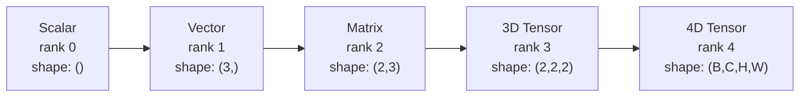
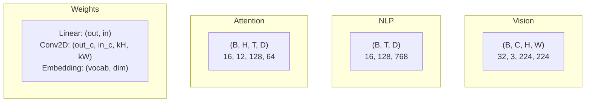
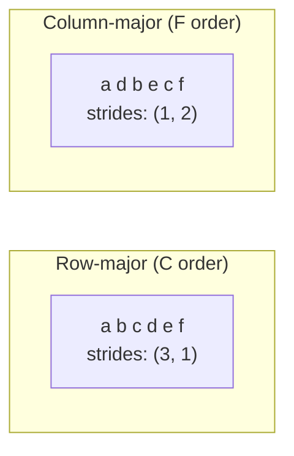
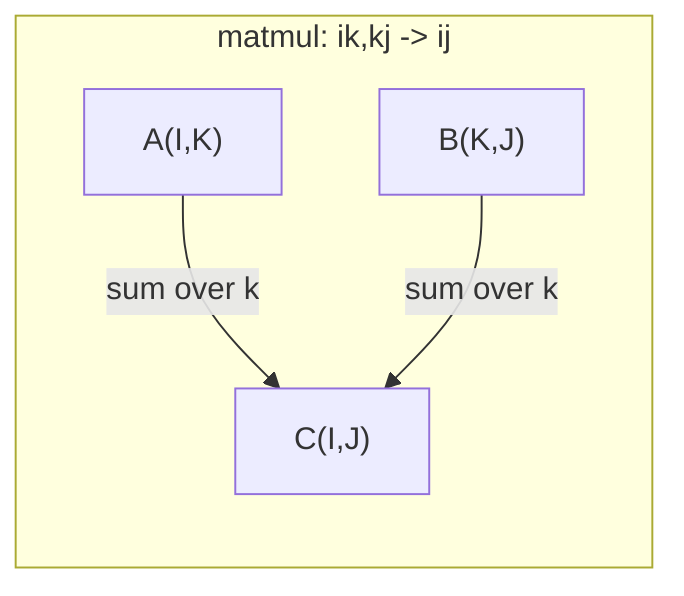

# Les opérations de tension .

> Les tensors sont le langage commun entre les données et l'apprentissage profond.
> 张量是数据和深度学习的通用语言. Chaque image, chaque phrase, chaque échelle est traversée par la张量流动.

**Type:** Build | **类型:** 动手
**Language:**Je suis un Python .**语言:**Python
**Prerequisites:** Phase 1, Lessons 01 (Linear Algebra Intuition), 02 (Vectors, Matrices & Operations) | **前置知识:** Phase 1, Lessons 01-02
**Time:** ~90 minutes | **时间:** ~90 分钟

## Objectifs d'apprentissage

- Implémenter une classe de tensors avec des opérations de forme, de pas, de remodelage, de transposition et de fonctionnement par élément à partir de zéro
  De la réalisation à zéro des formes, des étapes, des réformations, des transformations et des opérations de la masse des éléments
- Appliquer les règles de radiodiffusion pour fonctionner sur des tensors de différentes formes sans copier les données
  应用广播规则 de manipulation des volumes de données de différentes formes sans avoir à copier les données
- Écrire des expressions unis pour les produits dotés, les multiplications de matrice, les produits externes et les opérations en lots
   éditer un somme Expression de réalisation de point de calcul 矩阵乘法 外积和批量操作
- Tracer les formes de tensor exactes à travers chaque étape de l'attention multi-tête
  Suivre la forme exacte de chaque étape de la concentration

> **【中文解读】**
> 张量是数据和深度学习的通用语言──向量是张量,矩阵是二维张量,RGB 图像是三维张量──本章从零实现张量类,理解形状、步长、广播和 einsum──Transformer 多头注意力中 Q/K/V 都是四维张量,理解张量形状是调试的关键──

## Le problème , l' introduction du problème

> **【中文解读】**Tu as construit un transformateur, fonctionne après le coup.`RuntimeError: shapes cannot be multiplied (32x768 and 512x768)` La forme  error est le plus courant bug de l'apprentissage en profondeur.  Le transformateur a plusieurs dizaines de transformations / transposations / transmissions  opérations en ligne, un axe de conduite est un niveau de communication  la quantité est la propagation du vent et de la matrice, la compréhension de la quantité est la fonction fondamentale du réseau neural.

## Le concept de base.

> **【拓展：张量 shape 是 AI 工程师的日常】**调试神经网络 90% du temps dans la forme de traitement 问题──关键工具:`print(tensor.shape)`- Je suis en train de vous dire.`.reshape()`Le poids`.transpose()`- le transfert,`.unsqueeze()`增加维度──PyTorch's einsum`torch.einsum('bhd,bhd->bh', q, k)`Il est également utilisé pour la réalisation de calculs de la quantité de transformateur.

### Quel est le tensor ?

Un tensor est un ensemble multidimensionnel de nombres avec un type de données uniforme.**rank**(ou **order**) Chaque dimension est une dimension**axis**- Le .**shape**est un tuple indiquant la taille le long de chaque axe.
> La quantité de données est un type de données unifiée de plusieurs dimensions.**秩**(ou**阶**), chaque dimension est une**轴**- Je suis désolé .**形状**Il est répertorié dans les grandes et petites catégories.



Le nombre total d'éléments = produit de toutes tailles.`(2, 3, 4)`Il tient`2 * 3 * 4 = 24`Les éléments.
> 总元素数 = 所有维度大小的乘积──形状 `(2, 3, 4)`包含 `2 * 3 * 4 = 24`Il y a des éléments.

### Des formes de tensor dans l'apprentissage profond

Différents types de données sont cartographiés à des formes tensorielles spécifiques par convention.
> Différents types de données sont habituellement cartographiés à des formes de volume spécifiques.



PyTorch utilise NCHW (channels-first). TensorFlow est par défaut NHWC (channels-last).
> PyTorch utilise NCHW (NCHW) (en anglais seulement), TensorFlow (en anglais seulement) (en anglais seulement) (en anglais seulement)

### Comment fonctionne la mise en page de la mémoire

Un tableau 2D dans la mémoire est une séquence 1D de octets. **Strides**vous dire combien d'éléments sauter pour se déplacer un pas le long de chaque axe.
> Le nombre 2D dans l'inventaire est le nombre de caractères 1D.**步长**Je vais vous dire combien d'éléments il faut sauter à chaque étape.



Transpose ne déplace pas les données, il change les pas, ce qui fait le tensor **non-contiguous**-- les éléments d'une rangée ne sont plus adjacents dans la mémoire.
> 转置不移动数据──它交换步长,使张量**不连续** Les éléments de la ligne ne sont plus en mémoire.

### Les règles de la radiodiffusion.

La radiodiffusion vous permet d'opérer sur des tensors de différentes formes sans copier les données. alignez les formes de la droite. Deux dimensions sont compatibles lorsqu'elles sont égales ou une est 1.
> 广播让你对形状的不同张量操作而无需复制数据――从右对齐形状――两个维度相等或其中一个为1 时兼容――较小的维度在左侧填充1――

```
Tensor A:     (8, 1, 6, 1)
Tensor B:        (7, 1, 5)
Padded B:     (1, 7, 1, 5)
Result:       (8, 7, 6, 5)
```

### L'opération de tensor universel

La somme d'Einstein étiquette chaque axe avec une lettre. Les axes dans l'entrée mais pas la sortie sont sumés. Les axes dans les deux sont conservés.
> Einstein a demandé et utilisé des lettres pour marquer chaque axe.



Les principaux modèles: `i,i->`(produit de point / 点积), `i,j->ij`(produit extérieur / 外积), `ii->`(trace / 迹), `ij->ji`(transposer / 转置), `bij,bjk->bik`(batch matmul / 批量矩阵乘法),`bhtd,bhsd->bhts`(Précédents de l'attention / attention).

## Construisez-le et mettez-le en œuvre.
```figure
tensor-broadcast
```

## Faites-le

Le code est en .`code/tensors.py`- chaque étape fait référence à la mise en œuvre.
> Je suis là.`code/tensors.py`Chaque étape est cité dans le texte.

### Étape 1: stockage de tension et étapes.

Un tensor stocke une liste plate de nombres plus des métadonnées de forme.
> 张量存储一个平的数字列表加上形状元数据──步长告诉索引逻辑如何将多维索引映射到平位置──

```python
class Tensor:
    def __init__(self, data, shape=None):
        if isinstance(data, (list, tuple)):
            self._data, self._shape = self._flatten_nested(data)
        elif isinstance(data, np.ndarray):
            self._data = data.flatten().tolist()
            self._shape = tuple(data.shape)
        else:
            self._data = [data]
            self._shape = ()

        if shape is not None:
            total = reduce(lambda a, b: a * b, shape, 1)
            if total != len(self._data):
                raise ValueError(
                    f"Cannot reshape {len(self._data)} elements into shape {shape}"
                )
            self._shape = tuple(shape)

        self._strides = self._compute_strides(self._shape)

    @staticmethod
    def _compute_strides(shape):
        if len(shape) == 0:
            return ()
        strides = [1] * len(shape)
        for i in range(len(shape) - 2, -1, -1):
            strides[i] = strides[i + 1] * shape[i + 1]
        return tuple(strides)
```

Pour la forme `(3, 4)`, les progrès sont `(4, 1)`-- sauter 4 éléments pour avancer une rangée, sauter 1 élément pour avancer une colonne.
> Pour la forme`(3, 4)`,步长为 `(4, 1)` Précédent un passage a sauté 4 éléments, Précédent un passage a sauté 1 élément.

### Étape 2: Ressouffler, compresser, dépresser.

Resshape change la forme sans changer l'ordre des éléments. Le nombre total d'éléments doit rester le même. Utiliser `-1`pour une dimension pour en déduire la taille.
> Ressemble  changer la forme sans changer l'ordre des éléments                                                                                                                                                                                                                                                        `-1`Autonomement, une grande taille.

```python
t = Tensor(list(range(12)), shape=(2, 6))
r = t.reshape((3, 4))
r = t.reshape((-1, 3))
```

Squeeze supprime les axes de taille 1. Unclenchement insère un. Unclenchement est essentiel pour la diffusion - un vecteur de biais`(D,)`ajoutés à un lot `(B, T, D)`Il faut que tu ne le serres pas .`(1, 1, D)`- Je suis désolé .
> Presser 移除大小为 1 的轴, Presser 插入一个── Presser 插入一个── Presser 移除大小为 1 的轴, Presser 插入一个── Presser 插入一个── Préparation 放出 放出 放出 放出 放出 放出 放出 放出 放出 放出 放出 放出 放出 放出 放出 放出 放出 放出 放出 放出 放出 放出 放出 放出 放出 放出 放出 放出 放出 放出 放出 放出 放出 放出 放出 放出 放出 放出 放出 放出 放出 放出 放出 放出 放出 放出 放出 放出 放出 放出 放出 放出 放出 放出 放出 放出 放出 放出 放出 放出 放出 放出 放出 放出 放出 放出 放出 放出 放出 放出 放出 放出 放出 放 放 放 放 放 放 放 放 放 放 放 放 放 放 放 放 放 放 放 放 放 放 放 放 放 放 放 放 放 放 放 放 放 放 放 放 放 放 放 放 放 放 放 放 放 放 放 放 放 放 放 放 放 `(D,)`À la suite de la série`(B, T, D)`Il faut le décapiter .`(1, 1, D)`Il y a une autre.

```python
t = Tensor(list(range(6)), shape=(1, 3, 1, 2))
s = t.squeeze()
v = Tensor([1, 2, 3])
u = v.unsqueeze(0)
```

### Étape 3: Transposer et permuer

Transpose swaps deux axes, permuter réordonne tous les axes, c'est comme ça que vous convertissez entre NCHW et NHWC.
> Transposez 交换两个轴──Permute 重排所有轴── c'est la façon dont on transforme entre le NCHW et le NHWC──

```python
mat = Tensor(list(range(6)), shape=(2, 3))
tr = mat.transpose(0, 1)

t4d = Tensor(list(range(24)), shape=(1, 2, 3, 4))
perm = t4d.permute((0, 2, 3, 1))
```

Après transposition ou permution, le tensor est non contigu à la mémoire.`view`défaillance sur les tensors non contiguës -- utilisation `reshape`ou appeler`.contiguous()`- D'abord.
> 转置或排列后,张量在内存中不连续──PyTorch 中 `view`Dans l'utilisation de la langue`reshape`Ou d'abord`.contiguous()`Il y a une autre.

### Étape 4: Opérations et réductions par élément.

Les opérations de calcul des éléments (add, multiplie, soustrait) s'appliquent indépendamment à chaque élément et conservent la forme.
> 逐元素操作 (加、乘、减) 独立应用于每个元素并保持形状──归约 (summ, mean, max) 折叠一个或多个轴──

```python
a = Tensor([[1, 2], [3, 4]])
b = Tensor([[10, 20], [30, 40]])
c = a + b
d = a * 2
s = a.sum(axis=0)
```

Le taux moyen mondial de pooling dans une CNN: `(B, C, H, W).mean(axis=[2, 3])`produit `(B, C)`. La moyenne de séquence de pooling dans la PNL: `(B, T, D).mean(axis=1)`produit `(B, D)`- Je suis désolé .
> La moyenne de CNN:`(B, C, H, W).mean(axis=[2, 3])` générer `(B, C)` La valeur moyenne des séquences au sein du NLP:`(B, T, D).mean(axis=1)` générer `(B, D)`Il y a une autre.

### Étape 5: La diffusion avec NumPy

Le `demo_broadcasting_numpy()`fonction dans `tensors.py`montre les schémas de base.
> `tensors.py`Le centre`demo_broadcasting_numpy()`La fonction montre le modèle central.

```python
activations = np.random.randn(4, 3)
bias = np.array([0.1, 0.2, 0.3])
result = activations + bias

images = np.random.randn(2, 3, 4, 4)
scale = np.array([0.5, 1.0, 1.5]).reshape(1, 3, 1, 1)
result = images * scale

a = np.array([1, 2, 3]).reshape(-1, 1)
b = np.array([10, 20, 30, 40]).reshape(1, -1)
outer = a * b
```

Distance par paire par diffusion: remodelage `(M, 2)`à `(M, 1, 2)`et `(N, 2)`à `(1, N, 2)`, soustraire, carré, additionner le long de l'axe dernier, prendre la racine carrée.`(M, N)`- Je suis désolé .
> 通过广播计算成对距离:将 `(M, 2)`Réchauffement`(M, 1, 2)`- Je suis désolé .`(N, 2)`Réchauffement`(1, N, 2)`,相减、平方、沿最后轴求和、取平方根── résultat:`(M, N)`Il y a une autre.

### Étape 6: Opérations d'insumation

Le `demo_einsum()`et `demo_einsum_gallery()`Les fonctions traversent tous les modèles communs.
> `demo_einsum()`et `demo_einsum_gallery()`La fonction démontre chaque mode habituel.

```python
a = np.array([1.0, 2.0, 3.0])
b = np.array([4.0, 5.0, 6.0])
dot = np.einsum("i,i->", a, b)

A = np.array([[1, 2], [3, 4], [5, 6]], dtype=float)
B = np.array([[7, 8, 9], [10, 11, 12]], dtype=float)
matmul = np.einsum("ik,kj->ij", A, B)

batch_A = np.random.randn(4, 3, 5)
batch_B = np.random.randn(4, 5, 2)
batch_mm = np.einsum("bij,bjk->bik", batch_A, batch_B)
```

Le coût calculé d'une contraction est le produit de toutes les tailles d'indices (contenues et sumées).`bij,bjk->bik`avec B=32, I=128, J=64, K=128: `32 * 128 * 64 * 128 = 33,554,432`les multiples ajoutés.
> Le coût de calcul de la contraction est le nombre de tous les indices de grandeur conservées et de demande.

### Étape 7: Mécanisme d'attention par l'unisson.

Le `demo_attention_einsum()`La fonction implique une attention multi-tête de bout en bout.
> `demo_attention_einsum()`函数端到端 réaliser plusieurs attentes.

```python
B, H, T, D = 2, 4, 8, 16
E = H * D

X = np.random.randn(B, T, E)
W_q = np.random.randn(E, E) * 0.02

Q = np.einsum("bte,ek->btk", X, W_q)
Q = Q.reshape(B, T, H, D).transpose(0, 2, 1, 3)

scores = np.einsum("bhtd,bhsd->bhts", Q, K) / np.sqrt(D)
weights = softmax(scores, axis=-1)
attn_output = np.einsum("bhts,bhsd->bhtd", weights, V)

concat = attn_output.transpose(0, 2, 1, 3).reshape(B, T, E)
output = np.einsum("bte,ek->btk", concat, W_o)
```

Chaque étape est une opération tensorielle: projection (matmul via einsum), division de tête (reforme + transposition), notes d'attention (batch matmul via einsum), somme pondérée (batch matmul via einsum), fusion de tête (transposition + reforme), projection de sortie (matmul via einsum).
> Chaque étape est une opération de taille: projeture, résume, résume, résume, résume, résume, résume, résume, résume, résume, résume, résume, résume, résume, résume, résume, résume, résume, résume, résume, résume, résume, résume, résume, résume, résume, résume, résume, résume, résume, résume, résume, résume, résume, résume, résume, résume, résume, résume, résume, résume, résume, résume, résume, résume, résume, résume, résume, résume, résume, résume, résume, résume, résume, résume, résume, résume, résume, résume, résume, résume, résume, résume, résume, résume, résume, résume, résume, résume, résume, résume, résume, résume, résume, résume, résume, résume, résume, résume, résume, résume, résume, résume, résume, résume, résume, résume, résume, résume, résume, résume, résume, résume, résume, résume, résume, résume, résume, résume, résume, résume, résume, résume, résume, résume, résume, résume, résume, résume, résume, résume, résume, résume, résume, résume, résume, résume, résume, résume, résume, résume, résume, résume, résume, résume, résume, résume, résume, résume, résume, résume, résume, résume, résume, résume, résume, résume, résume, résume, résume, résume, résume, résume, résume, résume, résume, résume, résume, résume, résume, résume, résume, résume, résume, résume, résume, résume, résume, résume, résume, résume, résume, résume, résume, résume, résume, résume

## Utilisez-le avec le cadre de réalisation

### Scratch contre NumPy

| Operation / 操作 | Scratch (Tensor class) | NumPy |
|---|---|---|
| Create / 创建 | `Tensor([[1,2],[3,4]])` | `np.array([[1,2],[3,4]])` |
| Reshape / 重塑 | `t.reshape((3,4))` | `a.reshape(3,4)` |
| Transpose / 转置 | `t.transpose(0,1)` | `a.T` or `a.transpose(0,1)` |
| Squeeze / 压缩 | `t.squeeze(0)` | `np.squeeze(a, 0)` |
| Sum / 求和 | `t.sum(axis=0)` | `a.sum(axis=0)` |
| Einsum | N/A | `np.einsum("ij,jk->ik", a, b)` |

### Scratch contre PyTorch

```python
import torch

t = torch.tensor([[1, 2, 3], [4, 5, 6]], dtype=torch.float32)
t.shape
t.stride()
t.is_contiguous()

t.reshape(3, 2)
t.unsqueeze(0)
t.transpose(0, 1)
t.transpose(0, 1).contiguous()

torch.einsum("ik,kj->ij", A, B)
```

PyTorch ajoute autograd, support GPU et noyaux BLAS optimisés. La sémantique de forme est identique. Si vous comprenez la version de grattage, les erreurs de forme PyTorch deviennent lisibles.
> PyTorch  augmenté automatiquement micro分、GPU 支持和优化 BLAS 内核──形状语义完全相同──理解手写版本后,PyTorch 形状错误变得可读──

### Chaque couche de réseau neural est une opération tensorielle.

| Operation / 操作 | Tensor Form / 张量形式 | Einsum |
|---|---|---|
| Linear layer / 线性层 | `Y = X @ W.T + b` | `"bd,od->bo"` + bias |
| Attention QKV | `Q = X @ W_q` | `"btd,dh->bth"` |
| Attention scores / 注意力分数 | `Q @ K.T / sqrt(d)` | `"bhtd,bhsd->bhts"` |
| Attention output / 注意力输出 | `softmax(scores) @ V` | `"bhts,bhsd->bhtd"` |
| Batch norm / 批归一化 | `(X - mu) / sigma * gamma` | element-wise + broadcast |
| Softmax | `exp(x) / sum(exp(x))` | element-wise + reduction |

## Envoyez-le . Produit .

Cette leçon produit deux instructions réutilisables:
> Le cours est composé de deux mots de référence:

1. **`outputs/prompt-tensor-shapes.md`**- Une demande systématique pour déboguer les déséquilibres de forme du tensor.
   Une forme de volume de la structure ne correspond pas à la forme de la structure de la structure.

2. **`outputs/prompt-tensor-debugger.md`**-- Une mise en œuvre de débogage étape par étape que vous collez dans n'importe quel assistant d'IA quand une erreur de forme vous bloque.
   Un petit petit petit petit petit petit petit petit petit petit petit petit petit petit petit petit petit petit petit petit petit petit petit petit petit petit petit petit petit petit petit petit petit petit petit petit petit petit petit petit petit petit petit petit petit petit petit petit petit petit petit petit petit petit petit petit petit petit petit petit petit petit petit petit petit petit petit petit petit petit petit petit petit petit petit petit petit petit petit petit petit petit petit petit petit petit petit petit petit petit petit petit petit petit petit petit petit petit petit petit petit petit petit petit petit petit petit petit petit petit petit petit petit petit petit petit petit petit petit petit petit petit petit petit petit petit petit petit petit petit petit petit petit petit petit petit petit petit petit petit petit petit petit petit petit petit petit petit petit petit petit petit petit petit petit petit petit petit petit petit petit petit petit petit petit petit petit petit petit petit petit petit petit petit petit petit petit petit petit petit petit petit petit petit petit petit petit petit petit petit petit petit petit petit petit petit petit petit petit petit petit petit petit petit petit petit petit petit petit petit petit petit petit petit petit petit petit petit petit petit petit petit petit petit petit petit petit petit petit petit petit petit petit petit petit petit petit petit petit petit petit petit petit petit petit petit petit petit petit petit petit petit petit petit petit petit petit petit petit petit petit petit petit petit petit petit petit petit petit petit petit petit petit petit petit petit petit petit petit petit petit petit petit petit petit petit petit petit petit petit petit petit petit petit petit petit petit petit petit petit petit petit petit petit petit petit petit petit petit petit petit petit petit petit petit petit petit petit petit petit petit petit petit petit petit petit petit petit petit petit petit petit petit petit petit petit petit petit petit petit petit petit petit petit petit petit petit petit petit petit petit petit petit petit petit petit petit petit petit petit petit petit petit petit petit petit petit petit petit petit petit petit petit petit petit petit petit petit petit petit petit petit petit petit petit petit petit petit petit petit petit petit petit petit petit petit petit petit petit petit petit petit petit petit petit petit petit petit petit petit petit petit petit petit petit petit petit petit petit petit petit petit petit petit petit petit petit petit petit petit petit petit petit petit petit petit petit petit petit petit petit petit petit petit petit petit petit petit petit petit petit petit petit petit petit petit petit petit petit petit petit petit petit petit petit petit petit petit petit petit petit petit petit petit petit petit petit petit petit petit petit petit petit petit petit petit petit petit petit petit petit petit petit petit petit petit petit petit petit petit petit petit petit petit petit petit petit petit petit

## Les exercices

1. **Easy -- Reshape round-trip.**Prenez un tensor de forme `(2, 3, 4)`- Ressemble à .`(6, 4)`, puis à `(24,)`, puis de retour à `(2, 3, 4)`. L'ordre des éléments de vérification est préservé à chaque étape en imprimant les données plates.
   **简单 -- 重塑往返。**取形状 `(2, 3, 4)`                                                                                                                                                                                                                                                              `(6, 4)`, encore une fois`(24,)`Je reviens .`(2, 3, 4)` L'ordre des éléments de vérification est inchangé.

2. **Medium -- Implement broadcasting.**Élargir le `Tensor`classe avec un `broadcast_to(shape)`méthode qui élargit les dimensions de taille 1 pour correspondre à une forme cible.`_elementwise_op`- l'émission automatique avant le fonctionnement.`(3, 1)`et `(1, 4)`de production `(3, 4)`- Je suis désolé .
   **中等 -- 实现广播。**Dans le`Tensor`类中添加 `broadcast_to(shape)`- Je suis en train de changer.`_elementwise_op`Autonomie et éducation`(3, 1)`et `(1, 4)` générer `(3, 4)`Il y a une autre.

3. **Hard -- Build einsum from scratch.**La mise en œuvre d'une base `einsum(subscripts, *tensors)`fonction qui gère au moins: produit à point (`i,i->`), le multiplicateur de matrice (`ij,jk->ik`), produit externe (`i,j->ij`), et transposer (`ij->ji`) Analysez la chaîne de sous-scripts, identifiez les indices contractés et faites une boucle sur toutes les combinaisons d'indices.`np.einsum`- Je suis désolé .
   **困难 -- 从零构建 einsum。**实现 fondamentaux `einsum`函数处理点积、矩阵乘法、外积和转置──解析下标字符串,识别缩索,遍历所有索引组合──

4. **Hard -- Attention shape tracker.**Écrivez une fonction qui prend `batch_size`- Je suis là .`seq_len`- Je suis là .`embed_dim`, et `num_heads`comme des entrées et imprime la forme exacte à chaque étape de l'attention multi-tête.
   **困难 -- 注意力形状追踪器。**编写函数,输入 `batch_size`- Je suis là.`seq_len`- Je suis là.`embed_dim`et `num_heads`, imprimer plusieurs points d'attention sur chaque étape de la forme précise.

## Les termes clés

| Term / 术语 | What people say | What it actually means / 实际含义 |
|---|---|---|
| Tensor / 张量 | "A matrix but more dimensions" | A multi-dimensional array with uniform type and defined shape, strides, and operations / 具有统一类型和定义的形状、步长、操作的多维数组 |
| Rank / 秩 | "The number of dimensions" | The number of axes. A matrix has rank 2, not rank equal to its matrix rank / 轴的数量。矩阵的秩为 2 |
| Shape / 形状 | "The size of the tensor" | A tuple listing the size along each axis. `(2, 3)` means 2 rows, 3 columns / 列出各轴大小的元组 |
| Stride / 步长 | "How memory is laid out" | The number of elements to skip to advance one position along each axis / 沿每个轴前进一个位置要跳过的元素数 |
| Broadcasting / 广播 | "It just works when shapes differ" | A strict set of rules: align from right, dimensions must be equal or one must be 1 / 严格规则：从右对齐，维度必须相等或一个为 1 |
| Contiguous / 连续 | "The tensor is normal" | Elements stored sequentially in memory with no gaps / 元素在内存中顺序存储无间隙 |
| Einsum | "A fancy way to write matmul" | A general notation that expresses any tensor contraction, outer product, trace, or transpose in one line / 通用表示法，一行表达任何张量收缩、外积、迹或转置 |
| View / 视图 | "Same as reshape" | A tensor sharing the same memory buffer but with different shape/stride metadata. Fails on non-contiguous data / 共享内存缓冲区但形状/步长元数据不同的张量 |
| Contraction / 收缩 | "Summing over an index" | The general operation where a shared index between tensors is multiplied and summed / 共享索引被乘和求和的通用操作 |
| NCHW / NHWC | "PyTorch vs TensorFlow format" | Memory layout conventions for image tensors / 图像张量的内存布局约定 |

## Encore une lecture

- [NumPy Broadcasting](https://numpy.org/doc/stable/user/basics.broadcasting.html)-- Les règles canoniques avec des exemples visuels
  NumPy 广播规则与可视化示例
- [PyTorch Tensor Views](https://pytorch.org/docs/stable/tensor_view.html)- Quand les vues fonctionnent et quand elles copient
  PyTorch 视图何时工作何时复制
- [einops](https://github.com/arogozhnikov/einops)-- Une bibliothèque qui rend la remodeling de tensor lisible et sûr
  让张量重塑可读且安全的库
- [The Illustrated Transformer](https://jalammar.github.io/illustrated-transformer/)-- Visualise les formes de tensors qui circulent à travers l'attention
  Formation de la quantité de mouvement dans l'attention visuelle
- [Einstein Summation in NumPy](https://numpy.org/doc/stable/reference/generated/numpy.einsum.html)-- Documentation complète de l'ensemble avec des exemples
  Numéro d'exemples  complet
