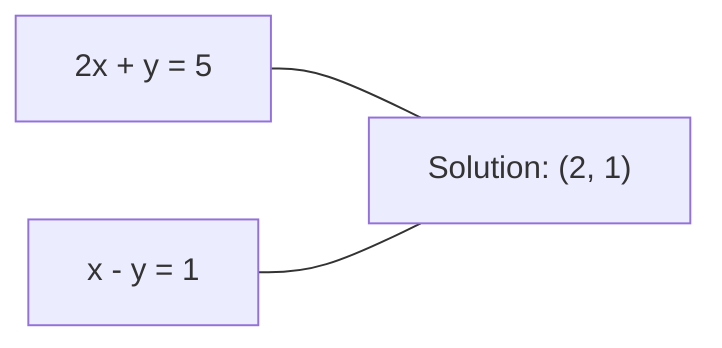
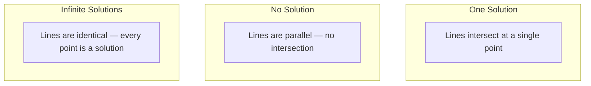

# Systèmes linéaires Systèmes linéaires

> La résolution d'Ax = b est le plus ancien problème en mathématiques qui exploite encore votre réseau neuronal.
> Le problème de l'expression ax = b est le plus ancien problème de la mathématique, qui est toujours à l'origine de votre réseau neuronal.

**Type:** Build | **类型:** 动手
**Language:**Je suis un Python .**语言:**Python
**Prerequisites:** Phase 1, Lessons 01 (Linear Algebra Intuition), 02 (Vectors & Matrices), 03 (Matrix Transformations) | **前置知识:** Phase 1, 第 01 课（线性代数直觉）、第 02 课（向量与矩阵）、第 03 课（矩阵变换）
**Time:** ~120 minutes | **时间:** ~120 分钟

## Objectifs d'apprentissage

- Résoudre Ax = b en utilisant l'élimination gaussienne avec pivots partiels et substitution arrière
  Utilisation avec partie de la sélection principale de la partition de la partition de la partition de la partition de la partition de la partition de la partition de la partition de la partition de la partition de la partition de la partition de la partition de la partition de la partition de la partition de la partition de la partition de la partition de la partition de la partition de la partition de la partition de la partition de la partition de la partition de la partition de la partition de la partition de la partition de la partition de la partition de la partition de la partition de la partition de la partition de la partition de la partition de la partition de la partition de la partition de la partition de la partition de la partition de la partition de la partition de la partition de la partition de la partition de la partition de la partition de la partition de la partition de la partition de la partition de la partition de la partition de la partition de la partition de la partition de la partition de la partition de la partition de la partition de la partition de la partition de la partition de la partition de la partition de la partition de la partition de la partition de la partition de la partition de la partition de la partition de la partition de la partition de la partition de la partition de la partition de la partition de la partition de la partition de la partition de la partition de la partition de la partition de la partition de la partition de la partition de la partition de la partition de la partition de la partition de la partition de la partition de la partition de la partition de la partition de la partition de la partition de la partition de la partition de la partition de la partition de la partition de la partition de la partition de la partition de la partition de la partition de la partition de la partition de la partition de la partition de la partition de la partition de la partition de la partition de la partition de la partition de la partition de la partition de la part
- Matrices facteurs avec les décompositions LU, QR et Cholesky et expliquer quand chacune est appropriée
  Utilisation LU、QR 和 Cholesky 分解(Decomposition) décomposition de la matrice,并解释各方法的适用场景
- Dériver les équations normales pour les carrés les plus faibles et les connecter à la régression linéaire et de la crête
  推导最小二乘法正规方程(Normale Equations),并将其与线性归归和归联系起来
- Diagnosticer les systèmes mal conçus en utilisant le numéro de condition et appliquer la régularisation pour les stabiliser
  Utilisation de la méthode de traitement de la maladie


> **【中文解读】**
> 解 Ax=b est le plus ancien problème de la mathématique. Les équations de régulation de régulation de régulation sont des systèmes de régulation de régulation.

## Le problème , l' introduction du problème

Chaque fois que vous entraînez une régression linéaire, vous résolvez un système linéaire. Chaque fois que vous comptez un ajustement des carrés les plus faibles, vous résolvez un système linéaire. Chaque fois qu'une couche de réseau neural compute.`y = Wx + b`En effet, si vous ajoutez une régularisation, vous modifiez le système. Lorsque vous utilisez des processus gaussiens, vous faites un facteur d'une matrice.

> Chaque entraînement de retour linéaire, vous êtes dans le système de résolution linéaire. Chaque calcul de la plus petite double adaptation, vous êtes dans le système de résolution linéaire. Chaque calcul de niveau de réseau neuronal.`y = Wx + b`, il est sur le côté de l'évaluation du système linéaire. Lorsque vous ajoutez la normalisation, vous modifiez le système. Lorsque vous utilisez le processus Gaussian, vous décomposez le matrice.

L'équation Ax = b apparaît partout. A est une matrice de coefficients connus. b est un vecteur de sorties connues. x est le vecteur des inconnus que vous voulez trouver. En régression linéaire, A est votre matrice de données, b est votre vecteur cible et x est le vecteur de poids. L'ensemble du modèle se réduit à: trouver x de sorte que Ax est aussi proche que possible de b.

> 方程 Ax = b 无处不在──A est une réaction de la réaction de la réaction de la réaction de la réaction de la réaction de la réaction de la réaction de la réaction de la réaction de la réaction de la réaction de la réaction de la réaction de la réaction de la réaction de la réaction de la réaction de la réaction de la réaction de la réaction de la réaction de la réaction de la réaction de la réaction de la réaction de la réaction de la réaction de la réaction de la réaction de la réaction de la réaction de la réaction de la réaction de la réaction de la réaction de la réaction de la réaction de la réaction de la réaction de la réaction de la réaction de la réaction de la réaction de la réaction de la réaction de la réaction de la réaction de la réaction de la réaction de la réaction de la réaction de la réaction de la réaction de la réaction de la réaction de la réaction de la réaction de la réaction de la réaction de la réaction de la réaction de la réaction de la réaction de la réaction de la réaction de la réaction de la réaction de la réaction de la réaction de la réaction de la réaction de la réaction de la réaction de la réaction de la réaction de la réaction de la réaction de la réaction de la réaction de la réaction de la réaction de la réaction de la réaction de la réaction de la réaction de la réaction de la réaction de la réaction de la réaction de la réaction de la réaction de la réaction de la réaction de la réaction de la réaction de la réaction de la réaction de la réaction de la réaction de la réaction de la réaction de la réaction de la réaction de la réaction de la réaction de la réaction de la réaction de la réaction de la réaction de la réaction de la réaction de la réaction de la réaction de la réaction de la réaction de la réaction de la réaction de la réaction de la réaction de la réaction de la réaction de la réaction de la réaction de la

Cette leçon explique toutes les méthodes principales pour résoudre cette équation à partir de zéro. Vous comprendrez pourquoi certaines méthodes sont rapides et d'autres stables, pourquoi certaines fonctionnent uniquement pour les systèmes carrés et d'autres traitent des systèmes surdéterminés, et pourquoi le nombre de conditions de votre matrice détermine si votre réponse signifie quelque chose.

> Ce cours vous permettra de comprendre pourquoi certaines méthodes sont rapides et certaines stables, pourquoi certaines s'appliquent uniquement aux systèmes de matrices et certaines peuvent traiter des supersystèmes fixes, ainsi que pourquoi le nombre de conditions de matrices détermine si votre réponse est significative.

## Le concept de base.

> **【中文解读】**
> Pour le système super-résolu, il n'existe pas de solution précise, le minimum de deux fois le plus possible est de trouver le " meilleur approche " du résidu minimum.

> **【拓展：线性系统在推荐系统中的规模】**
> Dans le cadre de la compétition du prix Netflix, le problème de la répartition de matrices a été abordé par 480.000 utilisateurs et 17.770 films. Cette technique nécessite un algorithme de répartition de matrices de haute efficacité. Le Grand Prix Netflix a favorisé le développement de l'algorithme de répartition de matrices à grande échelle (SVD, ALS), qui est encore aujourd'hui au cœur du système de recommandation.

### Ce que Ax = b signifie géométriquement

Un système d'équations linéaires a une interprétation géométrique. Chaque équation définit un hyperplane. La solution est le point (ou ensemble de points) où tous les hyperplanes se croisent.

> 线性方程组有几何解释── chaque équation définit un super-plane (Hyperplane)──解是所有超平面的交点 (Situation) ──

```
2x + y = 5          Two lines in 2D.
x - y  = 1          They intersect at x=2, y=1.
```



Trois choses peuvent arriver:



En forme de matrice, "une solution" signifie qu'A est inversible. "Aucune solution" signifie que le système est incohérent. "Solution infinies" signifie qu'A a un espace nul. La plupart des problèmes ML appartiennent à la catégorie "aucune solution exacte" parce que vous avez plus d'équations (points de données) que d'inconnus (paramètres). C'est là que les plus petits carrés entrent.

> Utilisé dans une langue, "un解" signifie "un système non conforme" et "un système non conforme" signifie "un système non conforme".

### Image de colonne contre image de rangée

Il y a deux façons de lire Ax = b.

> Il y a deux façons de le faire.

**Row picture.**Chaque ligne de A définit une équation. Chaque équation est un hyperplane. La solution est où ils se croisent tous.

> **行视角。**Chaque ligne d'un a définit un équation. Chaque équation est un super-plan.

**Column picture.**Chaque colonne de A est un vecteur. La question se pose: quelle combinaison linéaire des colonnes de A produit b?

> **列视角。**Chaque rangée de la ligne A est un émetteur.

```
A = | 2  1 |    b = | 5 |
    | 1 -1 |        | 1 |

Row picture: solve 2x + y = 5 and x - y = 1 simultaneously.

Column picture: find x1, x2 such that:
  x1 * [2, 1] + x2 * [1, -1] = [5, 1]
  2 * [2, 1] + 1 * [1, -1] = [4+1, 2-1] = [5, 1]   check.
```

Si b se trouve dans l'espace de colonne de A, le système a une solution. Si b ne le fait pas, vous trouverez le point le plus proche de l'espace de colonne. Ce point le plus proche est la solution des carrés les plus faibles.

> Si b est dans l'espace de la colonne A, le système a une solution. Si b n'est pas dans l'espace de la colonne, vous trouverez le point le plus proche de l'espace.

### Élimination gaussienne

L'élimination gaussienne transforme Ax = b en un système triangulaire supérieur Ux = c que vous résolvez par substitution arrière.

> Le processus de transformation de l'Ax = b se transforme en système de troisième plan Ux = c, puis il est possible de trouver une solution à travers le processus de transformation.

L' algorithme:

```
1. For each column k (the pivot column):
   a. Find the largest entry in column k at or below row k (partial pivoting).
   b. Swap that row with row k.
   c. For each row i below k:
      - Compute multiplier m = A[i][k] / A[k][k]
      - Subtract m times row k from row i.
2. Back substitute: solve from the last equation upward.
```

Exemple:

```
Original:
| 2  1  1 | 8 |       R2 = R2 - (2)R1     | 2  1   1 |  8 |
| 4  3  3 |20 |  -->  R3 = R3 - (1)R1 --> | 0  1   1 |  4 |
| 2  3  1 |12 |                            | 0  2   0 |  4 |

                       R3 = R3 - (2)R2     | 2  1   1 |  8 |
                                       --> | 0  1   1 |  4 |
                                           | 0  0  -2 | -4 |

Back substitute:
  -2 * x3 = -4    -->  x3 = 2
  x2 + 2  = 4     -->  x2 = 2
  2*x1 + 2 + 2 = 8 --> x1 = 2
```

L'élimination Gaussian coûte O ((n^3) opérations. Pour un système 1000x1000, c'est environ un milliard d'opérations à point flottant. Rapide, mais vous pouvez faire mieux si vous devez résoudre plusieurs systèmes avec le même A.

> Pour les systèmes 1000x1000, il faut environ 10 milliards de fois de calcul de points de débit.

> **【中文解读】**
> L'idée de la loi du goût est très simple: en passant par une ligne de changement, la matrice devient une forme de triangle (en anglais: "triangle") et ensuite, à partir de la dernière ligne, la partie principale est sélectionnée (en pivotant partiellement) et chaque étape est la clé pour sélectionner l'élément principal de la plus grande valeur absolue, en évitant de décomposer un nombre très petit entraînant une explosion d'erreur numérique.

### Le pivot partiel: pourquoi cela importe

Sans pivoter, l'élimination gaussienne peut échouer ou produire des déchets. Si un élément pivot est zéro, vous divisez par zéro. Si c'est petit, vous amplifiez les erreurs d'arrondissement.

>  sans sélection de la valeur principale, la loi de la valeur moyenne peut échouer ou produire des résultats dérisoires

```
Bad pivot:                       With partial pivoting:
| 0.001  1 | 1.001 |            Swap rows first:
| 1      1 | 2     |            | 1      1 | 2     |
                                 | 0.001  1 | 1.001 |
m = 1/0.001 = 1000              m = 0.001/1 = 0.001
R2 = R2 - 1000*R1               R2 = R2 - 0.001*R1
| 0.001  1     | 1.001   |      | 1      1     | 2     |
| 0     -999   | -999.0  |      | 0      0.999 | 0.999 |

x2 = 1.000 (correct)            x2 = 1.000 (correct)
x1 = (1.001 - 1)/0.001          x1 = (2 - 1)/1 = 1.000 (correct)
   = 0.001/0.001 = 1.000        Stable because the multiplier is small.
```

En arithmétique à point flottant avec une précision limitée, la version non pivotée peut perdre des chiffres significatifs.

> Dans le calcul des points de décalage à précision limitée, la version sans base de données peut perdre un nombre valide.

### Décomposition de l' LU

L est la base de la matrice de l'élimination de Gauss.

> LU 分解将 A 分解为一个下三角矩阵 L 和一个上三角矩阵 U:A = LU。L 矩阵存储高斯消元中的乘数──U 矩阵是消元的结果──

```
A = L @ U

| 2  1  1 |   | 1  0  0 |   | 2  1   1 |
| 4  3  3 | = | 2  1  0 | @ | 0  1   1 |
| 2  3  1 |   | 1  2  1 |   | 0  0  -2 |
```

Pourquoi facteur au lieu de simplement éliminer? Parce qu'une fois que vous avez L et U, résoudre Ax = b pour n'importe quel nouveau b coûte seulement O ((n ^ 2):

> Pourquoi se décomposer plutôt que de consommer directement ? Parce qu'une fois que l'on a L et U, pour tout nouveau b, il faut seulement O (n^2):

```
Ax = b
LUx = b
Let y = Ux:
  Ly = b    (forward substitution, O(n^2))
  Ux = y    (back substitution, O(n^2))
```

Le coût O (n^3) est payé une fois pendant la facteurisation. Chaque solution ultérieure est O (n^2). Si vous devez résoudre 1000 systèmes avec les mêmes vecteurs A mais différents vecteurs b, LU économise un facteur de 1000/3 dans le travail total.

> Le coût de l'O (n^3) est de 1 fois par découpage. Si l'on a besoin de 1 000 systèmes différents, on économise 1 000/3 fois par rapport au total de l'emploi.

Avec le pivot partiel, vous obtenez PA = LU où P est une matrice de permutation enregistrant les swaps de rangée.

> Utilisation de la partie principale de la sélection, obtenu PA = LU, dont P est enregistré par la matrice de remplacement de la matrice de permutation)

> **【拓展：LU 分解在大规模科学计算中的角色】**
> Dans les études de la structure, les matrices de rigidité sont généralement rares. Les matrices de millions de étages sont super-LU et MUMPS.

### Décomposition de la QR

Les facteurs de décomposition QR A en matrice orthogonale Q et en matrice triangulaire supérieure R: A = QR.

> QR 分解将 A 分解为一个正交矩阵(Matrise orthogonale) Q 和一个上三角矩阵 R:A = QR。

Une matrice orthogonale a la propriété Q^T Q = I. Ses colonnes sont des vecteurs orthonormaux.

> La fréquence de l'équation est de type Q^T Q = I. La fréquence est de type standard.

```
A = Q @ R

Q has orthonormal columns: Q^T Q = I
R is upper triangular

To solve Ax = b:
  QRx = b
  Rx = Q^T b    (just multiply by Q^T, no inversion needed)
  Back substitute to get x.
```

Le QR est numériquement plus stable que LU pour résoudre les problèmes de minuscules carrés.

> QR dans la recherche de la solution du problème de la seconde dimension minimale sur la valeur numérique par rapport à LU plus stable.

```
Given columns a1, a2, ... of A:

q1 = a1 / ||a1||

q2 = a2 - (a2 . q1) * q1        (subtract projection onto q1)
q2 = q2 / ||q2||                (normalize)

q3 = a3 - (a3 . q1) * q1 - (a3 . q2) * q2
q3 = q3 / ||q3||

R[i][j] = qi . aj    for i <= j
```

Chaque étape supprime la composante le long de tous les vecteurs q précédents, ne laissant que la nouvelle direction orthogonale.

> Chaque étape déplace la totalité des points précédents, ne laisse que les nouveaux points positifs.

### Décomposition de Cholesky

Lorsque A est symétrique (A = A^T) et positive définie (toutes les valeurs propres positives), vous pouvez le faire passer en A = L L^T où L est triangulaire inférieur.

> Lorsque A est confronté à la valeur de (((A = A^T) et est correctement fixé ((( toutes les caractéristiques sont positives), vous pouvez le diviser en A = L L^T, dont L est la base de la trois-angle.

```
A = L @ L^T

| 4  2 |   | 2  0 |   | 2  1 |
| 2  5 | = | 1  2 | @ | 0  2 |

L[i][i] = sqrt(A[i][i] - sum(L[i][k]^2 for k < i))
L[i][j] = (A[i][j] - sum(L[i][k]*L[j][k] for k < j)) / L[j][j]    for i > j
```

Cholesky est deux fois plus rapide que LU et nécessite la moitié du stockage.

> Cholesky est plus rapide que LU, il suffit de la moitié de l'espace de stockage.

- Les matrices de covariance sont symétriques positives semi-définites (positives définites avec régularisation).
  La différence de réaction est de la moitié de la réaction.
- La matrice du noyau dans les processus gaussiens est symétrique positive définie.
  La matrice nucléaire du processus de haute émission est la même que la matrice nucléaire.
- Le Hessian d'une fonction convexe au minimum est symétrique positive définie.
  La réaction de la réaction de la réaction de la réaction de la réaction de la réaction de la réaction de la réaction de la réaction de la réaction de la réaction de la réaction de la réaction de la réaction de la réaction de la réaction de la réaction de la réaction de la réaction de la réaction de la réaction de la réaction de la réaction de la réaction de la réaction de la réaction de la réaction de la réaction de la réaction de la réaction de la réaction de la réaction de la réaction de la réaction de la réaction de la réaction de la réaction de la réaction de la réaction de la réaction de la réaction de la réaction de la réaction de la réaction de la réaction de la réaction de la réaction de la ré ré ré ré ré ré ré ré ré ré ré ré ré ré ré ré ré ré ré ré ré ré ré ré ré ré ré ré ré ré ré ré ré ré ré ré ré ré ré ré ré ré ré ré ré ré ré ré ré ré ré ré ré ré ré ré ré ré ré ré ré ré ré ré ré ré ré ré ré ré ré ré ré ré ré ré ré ré ré ré ré ré ré ré ré ré ré ré ré ré ré ré ré ré ré ré ré ré ré ré ré ré ré ré ré ré ré ré ré ré ré ré ré ré ré ré ré ré ré ré ré ré ré ré ré ré ré ré ré ré ré ré ré ré ré ré ré ré ré ré ré ré ré ré ré ré ré ré ré ré ré ré ré ré ré ré ré ré ré ré ré ré ré ré ré ré ré ré ré ré ré ré ré ré ré ré ré ré ré ré ré ré ré ré ré ré ré ré ré ré ré ré ré ré ré ré ré ré ré ré ré ré ré ré ré ré ré ré ré ré ré ré ré ré ré ré ré ré ré ré ré ré ré ré ré ré ré ré ré ré ré ré ré ré ré ré ré ré ré ré ré ré ré ré ré ré ré ré ré ré ré ré ré ré ré ré ré ré ré ré ré ré ré ré ré ré ré ré ré ré ré ré ré ré ré ré ré ré ré ré ré ré ré ré ré ré ré ré ré ré ré ré ré ré ré ré ré ré ré ré ré ré ré ré ré ré ré ré ré ré ré ré ré ré ré ré ré ré ré ré ré
- A^T A est toujours semi-définie symétrique positive.
  A^T A 总是对称半正确的──

Dans les processus gaussiens, vous faites le facteur de la matrice du noyau K avec Cholesky, puis résolvez K alpha = y pour obtenir la moyenne prédictive. Le facteur Cholesky vous donne également le déterminant de log pour la probabilité marginale: log det(K) = 2 * somme(log(diag(L))).

> Pendant le processus de highs, vous utilisez Cholesky pour déchiffrer la matrice nucléaire K, puis vous recherchez K alpha = y  obtenir une valeur moyenne prévue。Cholesky 因子 également donne une ligne similaire à la ligne de calcul pour le nombre:log det(K) = 2 * somme(log(diag(L)))。

> **【中文解读】**
> Cholesky 分解是 LU 分解的" spéciale avantage"适用于对称正定矩阵, mais la vitesse est de deux fois celle de LU. La bonne nouvelle est que dans le ML, tout est pour nommé正定矩阵:协方差矩阵、核矩阵、X^T X、Hessian 矩阵。GPTQ et autres modèles sont également utilisés dans les méthodes de quantification pour traiter Hessian。

### Les carrés minimaux: lorsque Ax = b n'a pas de solution exacte

Si A est m x n avec m > n (plus d'équations que d'inconnues), le système est surdéterminé. Il n'y a pas de solution exacte. Au lieu de cela, vous réduisez l'erreur carrée:

> Si A est m x n 且 m > n 方程数多于未知数), système est superéchéant (overdetermined) 没有精确解.

```
minimize ||Ax - b||^2

This is the sum of squared residuals:
  sum((A[i,:] @ x - b[i])^2 for i in range(m))
```

Le minimiseur satisfait aux équations normales:

```
A^T A x = A^T b
```

Dérivation: expansion de la dérivation Ax - b b b b b b = (Ax - b) ^ T (Ax - b) = x^T A^T A x - 2 x^T A^T b + b^T b. Prenez le gradient par rapport à x, définissez-le à zéro: 2 A^T A x - 2 A^T b = 0.

> 推导:展开A a x - b b b b b b b b b b b b b b b b b b b b b b b b b b b b b b b b b b b b b b b b b b b b b b b b b b b b b b b b b b b b b b b b b b b b b b b b b b b b b b b b b b b b b b b b b b b b b b b b b b b b b b b b b b b b b b b b b b b b b b b b b b b b b b b b b b b b b b b b b b b b b b b b b b b b b b b b b b b b b b b b b b b b b b b b b b b b b b b b b b b b b b b b b b b b b b b b b b b b b b b b b b b b b b b b b b b b b b b b b b b b b b b b b b b b b b b b b b b b b b b b b b b b b b b b b b b b b b b b b b b b b b b b b b b b b b b b b b b b b b b b b b b b b b b b b b b b b b b b b b b b b b b b b b b b b b b b b b b b b b b b b b b b b b b b b b b b b b b b b b b b b b b b b b b b b b b b b b b b b b b b b b b b b b b b b b b b b b b b b b b b b b b b b b b b b b b b b b b b b b b b b b b b b b b b b b b b b b b b b b b b b b b b b b b b b b b b b b b b b b b b b b b b b b b b b b b b b b b b b b b b b b b b b b b b b b b b b b b b b b b b b b b b b b b b b b b b b b b b b b b b

```
Original system (overdetermined, 4 equations, 2 unknowns):
| 1  1 |         | 3 |
| 1  2 | x     = | 5 |       No exact x satisfies all 4 equations.
| 1  3 |         | 6 |
| 1  4 |         | 8 |

Normal equations:
A^T A = | 4  10 |    A^T b = | 22 |
        | 10 30 |            | 63 |

Solve: x = [1.5, 1.7]

This is linear regression. x[0] is the intercept, x[1] is the slope.
```

### Equations normales = régression linéaire

La connexion est exacte. En régression linéaire, votre matrice de données X a une ligne par échantillon et une colonne par fonction. Votre vecteur cible y a une entrée par échantillon. Le vecteur de poids w satisfait:

> Cette relation est précise. Dans le retour en ligne, la matrice de données X chaque ligne d'un échantillon, chaque rangée d'un trait, l'objectif d'un échantillon, l'élément d'un échantillon, l'élément de poids d'un échantillon, le résultat est:

```
X^T X w = X^T y
w = (X^T X)^(-1) X^T y
```

C'est la solution de forme fermée à la régression linéaire.`sklearn.linear_model.LinearRegression.fit()`calculer ce calcul (ou un équivalent via QR ou SVD).

> C'est la résolution de la réintégration.`sklearn.linear_model.LinearRegression.fit()`C'est le cas de la France.

Ajoutez un terme de régulation lambda * I à la matrice et vous obtenez la régression de la crête:

> Je suis revenu à la Ridge Regression:

```
(X^T X + lambda * I) w = X^T y
w = (X^T X + lambda * I)^(-1) X^T y
```

La régulation rend la matrice mieux conditionnée (facile à inverser avec précision) et empêche le surpassage en réduisant les poids vers zéro. La matrice X^T X + lambda * I est toujours symétrique positive définitive lorsque lambda > 0, vous pouvez donc utiliser Cholesky pour la résoudre.

> L'équilibre fait que le nombre de conditions de la matrice est meilleur (plus facile à préciser à l'inverse) et passe par la contraction du poids à zéro pour empêcher le suréquilibre.

> **【拓展：条件数与深度学习训练稳定性】**
> La température de l'entraînement de transformateur est étroitement liée au nombre de conditions. Les conditions de l'entraînement de transformateur sont en grande partie liées à l'amélioration des conditions de chaque niveau.

### Pseudoinverse (Moore-Penrose)

Le pseudoinverse A+ généralise l'inversion de la matrice à des matrices non carrées et singulières.

> 伪逆(Pseudoinverse) A+ va donner une réaction à la réaction à la réaction à la réaction à la réaction à la réaction à la réaction à la réaction à la réaction à la réaction à la réaction à la réaction à la réaction à la réaction à la réaction à la réaction à la réaction à la réaction à la réaction à la réaction à la réaction à la réaction à la réaction à la réaction à la réaction à la réaction à la réaction à la réaction à la réaction à la réaction à la réaction à la réaction à la réaction à la réaction à la réaction à la réaction à la réaction à la réaction à la réaction à la réaction à la réaction à la réaction à la réaction à la réaction à la réaction à la réaction à la réaction à la réaction à la réaction à la réaction à la réaction à la réaction à la réaction à la réaction à la réaction à la réaction à la réaction à la réaction à la réaction à la réaction à la réaction à la réaction à la réaction à la réaction à la réaction à la réaction à la réaction à la réaction à la réaction à la réaction à la réaction à la réaction à la réaction à la réaction à la réaction à la réaction à la réaction à la réaction à la réaction à la réaction à la réaction à la réaction à la réaction à la réaction à la réaction à la réaction à la réaction à la réaction à la réaction à la réaction à la réaction à la réaction à la réaction à la réaction à la réaction à la réaction à la réaction à la réaction à la réaction à la réaction à la réaction à la réaction à la réaction à la réaction à la réaction à la réaction à la réaction à la réaction à la réaction à la réaction à la réaction à la réaction à la réaction à la réaction à la réaction à la réaction à la réaction à la réaction à la réaction à la réaction à la réaction à la réaction à la réaction à la réaction à

```
x = A+ b

where A+ = V Sigma+ U^T    (computed via SVD)
```

Sigma+ est formé en prenant la réciproque de chaque valeur singulière non zéro et en transposant le résultat.

> Sigma+ par chaque non-零奇异值取倒数并转置得到──如果A = U Sigma V^T, alors A+ = V Sigma+ U^T──

```
A = U Sigma V^T        (SVD)

Sigma = | 5  0 |       Sigma+ = | 1/5  0  0 |
        | 0  2 |                | 0  1/2  0 |
        | 0  0 |

A+ = V Sigma+ U^T
```

Le pseudo-inverse donne la solution minimum-norme des plus petits carrés.
- Une solution: A + b donne.
  Une solution: A+ b 给出该解――
- Aucune solution: A + b donne la solution des carrés les moins.
  无解:A+b 给出最小二乘解──
- Des solutions infinies: A+ b donne celui avec le plus petit débit de débit.
  无穷多解:A+b 给出最小的范数之一──

NumPy's `np.linalg.lstsq`et `np.linalg.pinv`Les deux utilisent le SVD en interne.

> NumPy `np.linalg.lstsq`et `np.linalg.pinv`内部都使用 SVD。

### Numéro de condition

Le nombre de condition mesure la sensibilité de la solution aux petits changements de l'entrée.

> 条件数(Condition Numéro) Mesure la sensibilité des petites variations de l'entrée.

```
kappa(A) = ||A|| * ||A^(-1)|| = sigma_max / sigma_min
```

où sigma_max et sigma_min sont les valeurs singulières les plus grandes et les plus petites.

```
Well-conditioned (kappa ~ 1):        Ill-conditioned (kappa ~ 10^15):
Small change in b -->                Small change in b -->
small change in x                    huge change in x

| 2  0 |   kappa = 2/1 = 2          | 1   1          |   kappa ~ 10^15
| 0  1 |   safe to solve            | 1   1+10^(-15) |   solution is garbage
```

Règles générales:
- Kappa < 100: sûr, la solution est précise.
  Sécurité, la réponse est précise.
- Kappa ~ 10 k: vous perdez environ k chiffres de précision de votre arithmétique de point flottant.
  Tu vas perdre la précision de la position.
- Kappa ~ 10^16 (pour float64): la solution est sans sens.
  La matrice est en fait étrange.

En ML, la mauvaise condition est produite lorsque les caractéristiques sont presque collineuses. La régulation (ajout de lambda * I) améliore le nombre de condition de sigma_max / sigma_min à (sigma_max + lambda) / (sigma_min + lambda).

> Dans le ML, lorsque les caractéristiques de proximité sont associées à la ligne de contact, des conditions de traitement sont ajoutées à la ligne de contact.

### Métodes itératives: gradient conjugué

Pour les systèmes très grands et rares (des millions d'inconnus), les méthodes directes comme LU ou Cholesky sont trop coûteuses.

> Pour un système très rare, il y a des millions d'inconnus, LU ou Cholesky, etc.

Le gradient conjugué (CG) résout Ax = b lorsque A est symétrique positive définite. Il trouve la solution exacte dans au plus n itérations (en arithmétique exacte), mais converge généralement beaucoup plus rapidement si les valeurs propres d'A sont regroupées.

> 共梯度法 (Conjugate Gradient, CG) est un nombre de fois de fois de fois de fois de fois de fois de fois de fois de fois de façon à trouver une solution précise, mais si les valeurs de caractères de A se regroupent, elles sont généralement plus rapides.

```
Algorithm sketch:
  x0 = initial guess (often zero)
  r0 = b - A x0           (residual)
  p0 = r0                 (search direction)

  For k = 0, 1, 2, ...:
    alpha = (rk . rk) / (pk . A pk)
    x_{k+1} = xk + alpha * pk
    r_{k+1} = rk - alpha * A pk
    beta = (r_{k+1} . r_{k+1}) / (rk . rk)
    p_{k+1} = r_{k+1} + beta * pk
    if ||r_{k+1}|| < tolerance: stop
```

CG est utilisé dans:
- Optimisation à grande échelle (méthode Newton-CG)
  La méthode de Newton-CG est la méthode de Newton-CG.
- Résout des discrétions de la PDE
   Détermination de la séparation des équations
- Méthodes du noyau où la matrice du noyau est trop grande pour être prise en compte
  La réaction nucléaire est trop grande pour être décomposée.
- Préconditions pour les autres solvants itératifs
  其他代求解器的预处理

Le taux de convergence dépend du nombre de conditions. Les systèmes mieux conditionnés convergent plus rapidement, ce qui est une autre raison pour laquelle la régularisation aide.

> Le taux de réception dépend du nombre de conditions.

> **【中文解读】**
> Il n'est pas nécessaire de stocker toute la matrice (en général, le nombre de matrices est plus élevé que le nombre de matrices), il suffit de stocker la matrice (en général, le nombre de matrices est plus élevé que le nombre de matrices).

### Le tableau complet: quelle méthode

| Method | Requirements | Cost | Use case |
|--------|-------------|------|----------|
| Gaussian elimination | Square, nonsingular A | O(n^3) | One-off solve of a square system |
| LU decomposition | Square, nonsingular A | O(n^3) factor + O(n^2) solve | Multiple solves with the same A |
| QR decomposition | Any A (m >= n) | O(mn^2) | Least squares, numerically stable |
| Cholesky | Symmetric positive definite A | O(n^3/3) | Covariance matrices, Gaussian processes, ridge regression |
| Normal equations | Overdetermined (m > n) | O(mn^2 + n^3) | Linear regression (small n) |
| SVD / pseudoinverse | Any A | O(mn^2) | Rank-deficient systems, minimum-norm solutions |
| Conjugate gradient | Symmetric positive definite, sparse A | O(n * k * nnz) | Large sparse systems, k = iterations |

### Connexion à ML

Chaque méthode de cette leçon est présentée dans la production ML:

> Chaque méthode de cette classe est présente dans la production de ML:

**Linear regression.**La solution de forme fermée résout les équations normales X^T X w = X^T y. Cela se fait par Cholesky (si n est petit) ou QR (si la stabilité numérique est importante) ou SVD (si la matrice pourrait être déficient en rang).

> **线性回归。**解析解求解正规方程 X^T X w = X^T y。通过 Cholesky(n 较小时) ou QR((需要数值稳定性时) ou SVD(矩阵可能不满秩时)完成。

**Ridge regression.**Ajout de lambda * I à X^T X. Le système régularisé (X^T X + lambda * I) w = X^T y est toujours résolvable par Cholesky parce que X^T X + lambda * I est symétrique positive définitive pour lambda > 0.

> **岭回归。**Dans le cadre de la réforme, le système de calcul de la valeur des valeurs de l'économie de marché est le système de calcul de l'économie de marché.

**Gaussian processes.**La moyenne prédictive nécessite de résoudre K alpha = y où K est la matrice du noyau. La factualisation Cholesky de K est l'approche standard.

> **高斯过程。**预测 moyenne valeur doit être obtenue K alpha = y, dont K est la base de la base de données.

**Neural network initialization.**L'initialisation orthogonale utilise la décomposition QR pour créer des matrices de poids dont les colonnes sont orthonormales.

> **神经网络初始化。**L'utilisation de QR décompose la création de la répartition des poids de la répartition des normes.

**Preconditioning.**Les optimisateurs à grande échelle utilisent Cholesky incomplet ou LU incomplet comme préconditions pour les solvants de gradients conjugués.

> **预处理。**L'utilisation d'optimisateurs à grande échelle n'est pas entièrement Cholesky ou pas entièrement LU en tant que condition de pré-traitement du solliciteur à grande échelle.

**Feature engineering.**Le nombre de condition de X^T X vous indique si vos caractéristiques sont collineures.

> **特征工程。**Le nombre de conditions X^T X indique si les caractéristiques sont en ligne commune. Si la kappa est grande, supprimez les caractéristiques ou ajoutez la légitimité.

## Construisez-le et mettez-le en œuvre.
```figure
linear-system-conditioning
```

## Faites-le

### Étape 1: Élimination gaussienne avec pivots partiels

```python
import numpy as np

def gaussian_elimination(A, b):
    n = len(b)
    Ab = np.hstack([A.astype(float), b.reshape(-1, 1).astype(float)])

    for k in range(n):
        max_row = k + np.argmax(np.abs(Ab[k:, k]))  # 部分主元选取：找列中绝对值最大的行
        Ab[[k, max_row]] = Ab[[max_row, k]]           # 交换行使最大元素到主元位置

        if abs(Ab[k, k]) < 1e-12:                     # 检查主元是否接近零（矩阵奇异）
            raise ValueError(f"Matrix is singular or nearly singular at pivot {k}")

        for i in range(k + 1, n):
            m = Ab[i, k] / Ab[k, k]                   # 计算消元乘数
            Ab[i, k:] -= m * Ab[k, k:]                # 消元：将第 k 列第 i 行以下变为零

    x = np.zeros(n)
    for i in range(n - 1, -1, -1):
        x[i] = (Ab[i, -1] - Ab[i, i+1:n] @ x[i+1:n]) / Ab[i, i]  # 回代求解

    return x
```

### Étape 2: décomposition de l' LU

```python
def lu_decompose(A):
    n = A.shape[0]
    L = np.eye(n)
    U = A.astype(float).copy()
    P = np.eye(n)

    for k in range(n):
        max_row = k + np.argmax(np.abs(U[k:, k]))
        if max_row != k:
            U[[k, max_row]] = U[[max_row, k]]
            P[[k, max_row]] = P[[max_row, k]]
            if k > 0:
                L[[k, max_row], :k] = L[[max_row, k], :k]

        for i in range(k + 1, n):
            L[i, k] = U[i, k] / U[k, k]
            U[i, k:] -= L[i, k] * U[k, k:]

    return P, L, U

def lu_solve(P, L, U, b):
    n = len(b)
    Pb = P @ b.astype(float)

    y = np.zeros(n)
    for i in range(n):
        y[i] = Pb[i] - L[i, :i] @ y[:i]

    x = np.zeros(n)
    for i in range(n - 1, -1, -1):
        x[i] = (y[i] - U[i, i+1:] @ x[i+1:]) / U[i, i]

    return x
```

### Étape 3: Décomposition de Cholesky

```python
def cholesky(A):
    n = A.shape[0]
    L = np.zeros_like(A, dtype=float)

    for i in range(n):
        for j in range(i + 1):
            s = A[i, j] - L[i, :j] @ L[j, :j]       # 减去已计算部分的贡献
            if i == j:
                if s <= 0:                             # 对角线元素必须为正（正定条件）
                    raise ValueError("Matrix is not positive definite")
                L[i, j] = np.sqrt(s)                  # 对角线元素 = sqrt(剩余值)
            else:
                L[i, j] = s / L[j, j]                 # 非对角线元素除以对应对角线值

    return L
```

### Étape 4: Les carrés minimaux par équations normales

```python
def least_squares_normal(A, b):
    AtA = A.T @ A
    Atb = A.T @ b
    return gaussian_elimination(AtA, Atb)

def ridge_regression(A, b, lam):
    n = A.shape[1]
    AtA = A.T @ A + lam * np.eye(n)
    Atb = A.T @ b
    L = cholesky(AtA)
    y = np.zeros(n)
    for i in range(n):
        y[i] = (Atb[i] - L[i, :i] @ y[:i]) / L[i, i]
    x = np.zeros(n)
    for i in range(n - 1, -1, -1):
        x[i] = (y[i] - L.T[i, i+1:] @ x[i+1:]) / L.T[i, i]
    return x
```

### Étape 5: Numéro de condition

```python
def condition_number(A):
    U, S, Vt = np.linalg.svd(A)
    return S[0] / S[-1]
```

## Utilisez-le avec le cadre de réalisation

Rassembler les pièces pour la régression linéaire et la régression de la crête sur des données réelles:

> Rassembler ces parties, effectuer des retours et des retours en ligne sur des données réelles:

```python
np.random.seed(42)
X_raw = np.random.randn(100, 3)
w_true = np.array([2.0, -1.0, 0.5])
y = X_raw @ w_true + np.random.randn(100) * 0.1

X = np.column_stack([np.ones(100), X_raw])

w_ols = least_squares_normal(X, y)
print(f"OLS weights (ours):    {w_ols}")

w_np = np.linalg.lstsq(X, y, rcond=None)[0]
print(f"OLS weights (numpy):   {w_np}")
print(f"Max difference: {np.max(np.abs(w_ols - w_np)):.2e}")

w_ridge = ridge_regression(X, y, lam=1.0)
print(f"Ridge weights (ours):  {w_ridge}")

from sklearn.linear_model import Ridge
ridge_sk = Ridge(alpha=1.0, fit_intercept=False)
ridge_sk.fit(X, y)
print(f"Ridge weights (sklearn): {ridge_sk.coef_}")
```

## Envoyez-le . Produit .

Cette leçon donne:
- `code/linear_systems.py`contenant des implementations à partir de zéro de l'élimination gaussienne, de la décomposition de LU, de la décomposition Cholesky, des carrés les moins élevés et de la régression de la crête
  包含高斯消元法、LU 分解、Cholesky 分解、最小二乘法和归归的从零实现
- Une démonstration de travail selon laquelle les équations normales et la régression linéaire de sklearn produisent les mêmes poids
  Régrésion linéaire de la forme et du calcul

## Les exercices

1. Résolvez le système `[[1,2,3],[4,5,6],[7,8,10]] x = [6, 15, 27]`en utilisant votre élimination Gaussian, votre solvant LU, et `np.linalg.solve`Vérifiez que les trois répondent de la même façon dans la tolérance des points flottants.

2. Générer une matrice aléatoire X de 50x5 et cible y = X @ w_true + bruit.`np.linalg.qr`), SVD (via `np.linalg.svd`), et `np.linalg.lstsq`Comparer les quatre solutions, mesurer le nombre de conditions de X^T X et expliquer comment cela affecte la méthode en laquelle vous avez confiance.

3. Créer une matrice quasi singulière en faisant deux colonnes presque identiques (par exemple, colonne 2 = colonne 1 + 1e-10 * bruit). Calculer son numéro de condition. Résoudre Ax = b avec et sans régularisation (ajouter 0.01 * I). Comparer les solutions et les résidus. Expliquer pourquoi la régularisation aide.

4. Implémenter l'algorithme de gradient conjugué pour une matrice définie positive symétrique aléatoire 100x100. Comptez combien d'itérations il faut pour converger à la tolérance 1e-8.

5. Temps de votre solveur Cholesky vs votre solveur LU vs `np.linalg.solve`Sur des matrices positives symétriques de taille 10, 50, 200, 500, tracez les résultats.

## Les termes clés

| Term | What people say | What it actually means |
|------|----------------|----------------------|
| Linear system | "Solve for x" | A set of linear equations Ax = b. Finding x means finding the input that produces output b under transformation A. |
| Gaussian elimination | "Row reduce" | Systematically zero out entries below the diagonal using row operations, producing an upper triangular system solvable by back substitution. O(n^3). |
| Partial pivoting | "Swap rows for stability" | Before eliminating in column k, swap the row with the largest absolute value in that column to the pivot position. Prevents division by small numbers. |
| LU decomposition | "Factor into triangles" | Write A = LU where L is lower triangular (stores multipliers) and U is upper triangular (the eliminated matrix). Amortizes the O(n^3) cost over multiple solves. |
| QR decomposition | "Orthogonal factorization" | Write A = QR where Q has orthonormal columns and R is upper triangular. More stable than LU for least squares. |
| Cholesky decomposition | "Square root of a matrix" | For symmetric positive definite A, write A = LL^T. Half the cost of LU. Used for covariance matrices, kernel matrices, and ridge regression. |
| Least squares | "Best fit when exact is impossible" | Minimize the sum of squared residuals ||Ax - b||^2 when the system is overdetermined (more equations than unknowns). |
| Normal equations | "The calculus shortcut" | A^T A x = A^T b. Setting the gradient of ||Ax - b||^2 to zero. This IS the closed-form solution to linear regression. |
| Pseudoinverse | "Inversion for non-square matrices" | A+ = V Sigma+ U^T via SVD. Gives the minimum-norm least-squares solution for any matrix, square or rectangular, singular or not. |
| Condition number | "How trustworthy is this answer" | kappa = sigma_max / sigma_min. Measures sensitivity to input perturbations. Lose about log10(kappa) digits of precision. |
| Ridge regression | "Regularized least squares" | Solve (X^T X + lambda I) w = X^T y. Adding lambda I improves conditioning and shrinks weights toward zero. Prevents overfitting. |
| Conjugate gradient | "Iterative Ax=b for big matrices" | An iterative solver for symmetric positive definite systems. Converges in at most n steps. Practical for large sparse systems where factorization is too expensive. |
| Overdetermined system | "More data than parameters" | m > n in an m-by-n system. No exact solution exists. Least squares finds the best approximation. This is every regression problem. |
| Back substitution | "Solve from the bottom up" | Given an upper triangular system, solve the last equation first, then substitute backward. O(n^2). |
| Forward substitution | "Solve from the top down" | Given a lower triangular system, solve the first equation first, then substitute forward. O(n^2). Used in the L step of LU solves. |

## Encore une lecture

- [MIT 18.06: Linear Algebra](https://ocw.mit.edu/courses/18-06-linear-algebra-spring-2010/)(Gilbert Strang) -- le cours définitif sur les systèmes linéaires et les facteurisations de matrice
- [Numerical Linear Algebra](https://people.maths.ox.ac.uk/trefethen/text.html)(Trefethen & Bau) -- la référence standard pour comprendre la stabilité numérique, la conditionnement, et pourquoi les algorithmes échouent
- [Matrix Computations](https://www.cs.cornell.edu/cv/GolubVanLoan4/golubandvanloan.htm)(Golub & Van Loan) -- la référence encyclopédique pour chaque algorithme de matrice
- [3Blue1Brown: Inverse Matrices](https://www.3blue1brown.com/lessons/inverse-matrices)-- intuition visuelle pour ce que résoudre Ax = b signifie géométriquement
