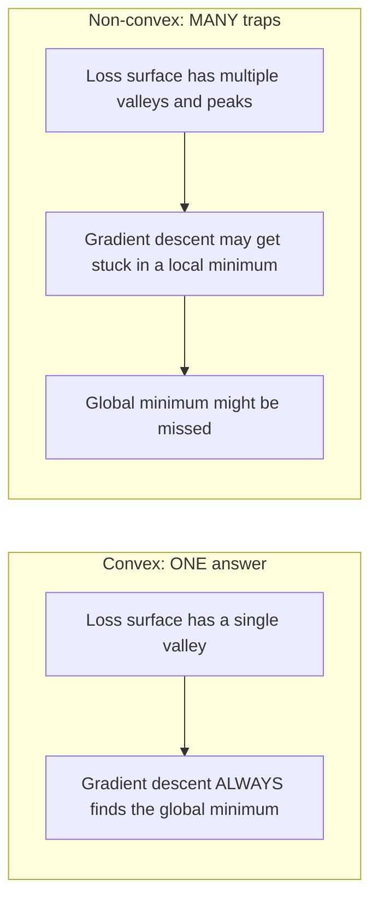
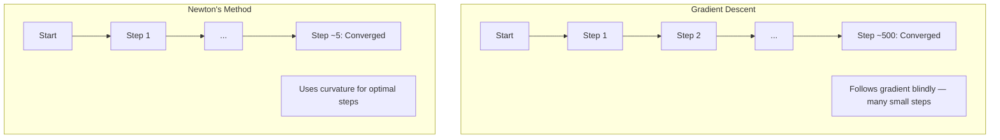
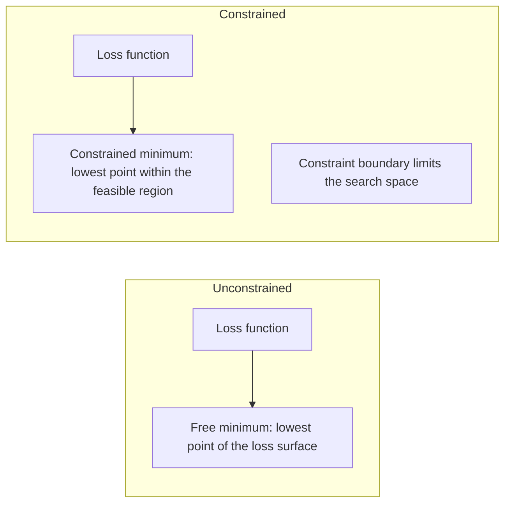
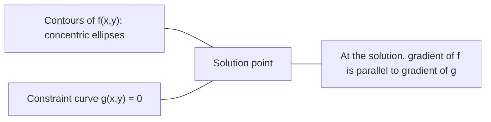

# Optimisation convexe

> Les problèmes convexes ont une vallée, les réseaux neuronaux ont des millions.
> Il n'y a qu'un seul problème. Il y en a des millions.

**Type:** Build | **类型:** 动手
**Language:**Je suis un Python .**语言:**Python
**Prerequisites:** Phase 1, Lessons 04 (Calculus for ML), 08 (Optimization) | **前置知识:** Phase 1, 第 04 课（微积分）、第 08 课（优化）
**Time:** ~90 minutes | **时间:** ~90 分钟

## Objectifs d'apprentissage

- Testez si une fonction est convexe en utilisant la définition, la deuxième dérivée et les critères hessiens
  Utilisation définition、二阶导数和 Hessian 判据测试函数是否为凸函数
- Appliquer la méthode de Newton et comparer sa convergence quadratique contre la baisse du gradient
  实现牛顿法 (Métode de Newton)并比较其二次收与梯度下降
- Résoudre les problèmes d'optimisation restreints à l'aide de multiplicateurs de Lagrange et interpréter les conditions KKT
  Utilisation de la méthode de calcul de la valeur de la valeur de la valeur de la valeur de la valeur de la valeur de la valeur de la valeur de la valeur de la valeur de la valeur de la valeur de la valeur de la valeur de la valeur de la valeur de la valeur de la valeur de la valeur de la valeur de la valeur de la valeur de la valeur de la valeur de la valeur de la valeur de la valeur de la valeur de la valeur de la valeur de la valeur de la valeur de la valeur de la valeur de la valeur de la valeur de la valeur de la valeur de la valeur de la valeur de la valeur de la valeur de la valeur de la valeur de la valeur de la valeur de la valeur de la valeur de la valeur de la valeur de la valeur de la valeur de la valeur de la valeur de la valeur de la valeur de la valeur de la valeur de la valeur de la valeur de la valeur de la valeur de la valeur de la valeur de la valeur de la valeur de la valeur de la valeur de la valeur de la valeur de la valeur
- Expliquez pourquoi les paysages de perte de réseau neural ne sont pas convexes mais SGD trouve toujours de bonnes solutions
  Pourquoi la perte de réseau neural n'est pas évidente, mais la SGD peut toujours trouver une bonne solution.


> **【中文解读】**
> La fonction de la conjoncture n'est qu'une seule vallée, le retour de la ligne est la conjonction, donc il y a nécessairement la conjonction la plus élevée.

## Le problème , l' introduction du problème

La leçon 08 vous a appris la descente de gradient, l'élan et Adam. Ces optimistes marchent en descente sur n'importe quelle surface. Mais ils ne sont pas garanties. La descente de gradient sur un paysage non convexe peut arriver à un mauvais minimum local, rester coincé sur un point de selle, ou osciller pour toujours. Vous l'avez utilisé quand même parce que les réseaux neuraux ne sont pas convexes et qu'il n'y a pas d'alternative.

> Leur capacité à s'élever est de plus en plus élevée que celle de la population humaine.

Mais de nombreux problèmes de machine learning sont convexes. Régrésion linéaire, régression logistique, SVM, LASSO, régression de crête. Pour ceux-ci, quelque chose de plus fort existe: optimisation avec des garanties mathématiques. Un problème convexe a exactement une vallée. Tout algorithme qui descend atteindra le minimum mondial. Pas besoin de redémarrage. Pas de calendriers de taux d'apprentissage. Pas de prière.

> Mais de nombreux problèmes de l'apprentissage automatique sont de la rentrée de ligne, de la rentrée logique, de la rentrée de l'VM, du LASSO, de la rentrée de l'étude. Pour ceux-ci, il existe des choses plus fortes: avec une optimisation mathématique garantie.

La compréhension de la convexité fait trois choses. Premièrement, elle vous indique quand votre problème est facile (convexe) contre difficile (non convexe). Deuxièmement, elle vous donne des outils plus rapides comme la méthode de Newton pour les problèmes convexes. Troisièmement, elle explique les concepts qui apparaissent dans tout ML: la régularisation comme une contrainte, la dualité dans les SVM, et pourquoi l'apprentissage profond fonctionne malgré la violation de toutes les bonnes propriétés que vous donne la convexité.

> Il explique le concept de la LM: la normalisation comme un lien, la parité dans la SVM, et pourquoi l'apprentissage en profondeur reste valable dans le cas de toutes les qualités positives de la conjoncture.

## Le concept de base.

> **【中文解读】**
> La forme de la fonction de la consonne ressemble à une boisson  seulement à un point le plus bas  la meilleure de la situation  ∞ ∞ ∞ ∞ ∞ ∞ ∞ ∞ ∞ ∞ ∞ ∞ ∞ ∞ ∞ ∞ ∞ ∞ ∞ ∞ ∞ ∞ ∞ ∞ ∞ ∞ ∞ ∞ ∞ ∞ ∞ ∞ ∞ ∞ ∞ ∞ ∞ ∞ ∞ ∞ ∞ ∞ ∞ ∞ ∞ ∞ ∞ ∞ ∞ ∞ ∞ ∞ ∞ ∞ ∞ ∞ ∞ ∞ ∞ ∞ ∞ ∞ ∞ ∞ ∞ ∞ ∞ ∞ ∞ ∞ ∞ ∞ ∞ ∞ ∞ ∞ ∞ ∞ ∞ ∞ ∞ ∞ ∞ ∞ ∞ ∞ ∞ ∞ ∞ ∞ ∞ ∞ ∞ ∞ ∞ ∞ ∞ ∞ ∞ ∞ ∞ ∞ ∞ ∞ ∞ ∞ ∞ ∞ ∞ ∞ ∞ ∞ ∞ ∞ ∞ ∞ ∞ ∞ ∞ ∞ ∞ ∞ ∞ ∞ ∞ ∞ ∞ ∞ ∞ ∞ ∞ ∞ ∞ ∞ ∞ ∞ ∞ ∞ ∞ ∞ ∞ ∞ ∞ ∞ ∞ ∞ ∞ ∞ ∞ ∞ ∞ ∞ ∞ ∞ ∞ ∞ ∞ ∞ ∞ ∞ ∞ ∞ ∞ ∞ ∞ ∞ ∞ ∞ ∞ ∞ ∞ ∞ ∞ ∞ ∞ ∞ ∞ ∞ ∞ ∞ ∞ ∞ ∞ ∞ ∞ ∞ ∞ ∞ ∞ ∞ ∞ ∞ ∞ ∞ ∞ ∞ ∞ ∞ ∞ ∞ ∞ ∞ ∞ ∞ ∞ ∞ ∞ ∞ ∞ ∞ ∞ ∞ ∞ ∞ ∞ ∞ ∞ ∞ ∞ ∞ ∞ ∞ ∞ ∞ ∞ ∞ ∞ ∞ ∞ ∞ ∞ ∞ ∞ ∞ ∞ ∞ ∞ ∞

> **【拓展：凸优化在工业中的实际规模】**
> Le système de classement des annonces de Google utilise une logique de retour à grande échelle (REM), traite chaque jour des milliards de requêtes. Le système de classement des annonces de Google est largement utilisé dans les catégories de contenu et de contenu. Le système de classement des annonces de Google peut résoudre en quelques minutes des millions de variables.

### Ensembles convexes

Un ensemble S est convexe si pour deux points de S, le segment de ligne entre eux se trouve également entièrement dans S.

> Si le ensemble S est situé en S, alors S est un ensemble de deux points.

| Convex sets | Not convex |
|---|---|
| **Rectangle**: any two points inside can be connected by a line segment that stays inside | **Star/crescent shape**: a line between two interior points can pass outside the set |
| **Triangle**: same property holds for all interior points | **Donut/annulus**: the hole means some line segments leave the set |
| The line segment between any two points stays within the set | The line segment between some pairs of points exits the set |

Test formel: pour tous les points x, y dans S et tous les t dans [0, 1], le point tx + (1-t) y est également dans S.

> 形式化测试: Pour S au milieu de l'intervalle x、y 和 [0, 1] au milieu de l'intervalle t, point tx + (1-t) y est également au milieu de S。

Exemples d'ensembles convexes:
- Une ligne, un plan, tout R^n
  Une ligne droite, un plan, toute la R^n
- Une boule (cercle, sphère, hypersphère)
  Une boule (ou une boule)
- Un espace à moitié: {x: a^T x <= b}
  Le nombre de personnes concernées est de 0,9%.
- L'intersection de tout nombre d'ensembles convexes
  L'interaction de l'ensemble

Exemples d'ensembles non convexes:
- Un donut (annulus)
  环面(圆环)
- L'union de deux cercles disjoints
  两个不相交交的并集
- Tout ensemble avec un "dent" ou un "trou"
  Toutes les pièges ou les creux

### Fonctions convexes

Une fonction f est convexe si son domaine est un ensemble convexe et pour tous les deux points x, y dans son domaine et tous les t dans [0, 1]:

> Si la définition de la fonction f est un ensemble de couches, et pour les deux points x、y 和 [0, 1] de la définition de la définition,

```
f(tx + (1-t)y) <= t*f(x) + (1-t)*f(y)
```

Géométriquement: le segment de ligne entre deux points sur le graphique se trouve au-dessus ou sur le graphique.

> 几何上: le segment de ligne entre les deux points du diagramme se trouve au-dessus du diagramme ou sur le diagramme.

| Property | Convex function | Non-convex function |
|---|---|---|
| **Line segment test** | The line between any two points on the graph lies **above or on** the curve | The line between some points on the graph dips **below** the curve |
| **Shape** | Single bowl/valley curving upward | Multiple peaks and valleys with mixed curvature |
| **Local minima** | Every local minimum is the global minimum | Multiple local minima may exist at different heights |

Fonctions convexes communes:
- f(x) = x^2 (parabole)
  抛物线
- f(x) = ↓x (valeur absolue)
   Value absolue
- f(x) = e^x (exponentiel)
  Indice de fonction
- f(x) = max(0, x) (RELU, même si par morceaux linéaire)
  RELUCTION (en anglais)
- f(x) = -log(x) pour x > 0 (log négatif)
  负对数
- Toute fonction linéaire f ((x) = a^T x + b (à la fois convexe et concave)
  任何线性函数 ((既是凸的也是的)

### Test de convexité

Trois tests pratiques, du plus facile au plus rigoureux.

> Trois types de tests pratiques, du plus simple au plus strict.

**Test 1: Second derivative test (1D).**Si f'(x) >= 0 pour tous x, alors f est convexe.

> **测试 1：二阶导数测试（一维）。**Si pour tous les x il y a des f'(x) >= 0, alors f est de l'importance.

- F''(x) = x^2: f'''(x) = 2 >= 0. Convexe.
- f''(x) = x^3: f''(x) = 6x. négatif pour x < 0.
- F''(x) = é^x: f''(x) = é^x > 0. Convexe.

**Test 2: Hessian test (multivariate).**Si la matrice hessienne H ((x) est positive semi-définie pour tous les x, alors f est convexe.

> **测试 2：Hessian 测试（多变量）。**Si Hessian 矩阵 H(x) est semi-réaliste pour tous les x, alors f est de l'expression.

**Test 3: Definition test.**Vérifiez directement l'inégalité f(tx + (1-t) y) <= t*f(x) + (1-t) *f(y). Utilisée pour les fonctions où les dérivés sont difficiles à calculer.

> **测试 3：定义测试。**直接检查不等式 f(tx + (1-t) y) <= t*f(x) + (1-t) *f(y)。适用于导数难以计算的函数。

### Pourquoi la convexité est importante

Le théorème central de l'optimisation convexe:

**For a convex function, every local minimum is a global minimum.**

> **对于凸函数，每个局部最小值都是全局最小值。**

Cela signifie que la descente du gradient ne peut pas être piégée. Tout chemin en descente conduit à la même réponse. L'algorithme est garanti de converger à la solution optimale.

> Cela signifie que la baisse de la gradience ne sera pas prise en charge.

> **【中文解读】**
> C'est la théorie centrale de l'optimisation du cum: la valeur minimale de chaque partie de la fonction cumulative est la valeur minimale de l'ensemble. Cela signifie que la baisse de la gradience ne sera jamais basée sur la valeur maximale de la partie " différente ".



Les conséquences:
- Pas besoin de redémarrer au hasard
  Pas besoin de refaire
- Aucun besoin de calendriers sophistiqués de taux d'apprentissage
  Ne nécessite pas de régulation complexe du taux d'apprentissage
- Des preuves de convergence sont possibles (taux dépend des propriétés de la fonction)
  La fréquence dépend de la nature de la fonction)
- La solution est unique (jusqu'à des régions plates)
  解是唯一的(excluant la région plate)

### Convexe contre non convexe dans le ML

| Problem | Convex? | Why |
|---------|---------|-----|
| Linear regression (MSE) | Yes | Loss is quadratic in weights |
| Logistic regression | Yes | Log-loss is convex in weights |
| SVM (hinge loss) | Yes | Maximum of linear functions |
| LASSO (L1 regression) | Yes | Sum of convex functions is convex |
| Ridge regression (L2) | Yes | Quadratic + quadratic = convex |
| Neural network (any loss) | No | Nonlinear activations create non-convex landscape |
| k-means clustering | No | Discrete assignment step |
| Matrix factorization | No | Product of unknowns |

Les modèles linéaires avec des pertes convexes sont convexes.

> Le modèle linéaire avec une perte de couche est un couche. Une fois que vous ajoutez une couche cachée d'activation non linéaire, la couche est brisée.

### La matrice hessienne

Le Hessian H d'une fonction f: R^n -> R est la matrice n x n des dérivés partiels de seconde.

> 函数 f: R^n -> R de Hessian 矩阵 H est n x n de la seconde phase du second épisode de la seconde épisode de la seconde épisode de la seconde épisode de la seconde épisode de la seconde épisode de la seconde épisode de la seconde épisode de la seconde épisode de la seconde épisode de la seconde épisode de la seconde épisode de la seconde épisode de la seconde épisode de la seconde épisode de la seconde épisode de la seconde épisode de la seconde épisode de la seconde épisode de la seconde épisode de la seconde épisode de la seconde épisode de la seconde épisode de la seconde épisode de la seconde épisode de la seconde épisode de la seconde épisode de la seconde épisode de la seconde épisode de la seconde épisode de la seconde épisode.

```
H[i][j] = d^2 f / (dx_i dx_j)
```

Pour f ((x, y) = x^2 + 3xy + y^2:

```
df/dx = 2x + 3y       d^2f/dx^2 = 2      d^2f/dxdy = 3
df/dy = 3x + 2y       d^2f/dydx = 3      d^2f/dy^2 = 2

H = [ 2  3 ]
    [ 3  2 ]
```

Le Hessien vous parle de la courbure:
- Les valeurs propres sont toutes positives: la fonction se déplace vers le haut dans toutes les directions (convexe à ce point)
  C'est une fonction qui est en train de fonctionner dans chaque direction.
- Value propre toutes négatives: courbes vers le bas dans toutes les directions (concave, max local)
  C'est une valeur maximale de chaque direction.
- Signes mixtes: point de selle (curves vers le haut dans certaines directions, vers le bas dans d'autres)
  混合符号: 点(certains directions à l'envers, d'autres directions à l'envers)
- Value propre zéro: plane dans cette direction (dégenerée)
  零特征值:该方向平坦(退化)

Pour la convexité, le hessien doit être semi-définit positif (toutes les valeurs propres >= 0) partout, pas seulement à un seul point.

> Pour la conjugalité, le hessien doit être à moitié fixe partout, et non seulement à un seul point.

### La méthode de Newton

La descente gradiente utilise des informations de premier ordre (le gradient). La méthode de Newton utilise des informations de deuxième ordre (le Hessian). Elle correspond à une approximation quadratique au point courant et saute directement au minimum de ce quadratique.

> 梯度下降使用一阶信息(梯度) ・・・牛顿法使用二阶信息(Hessian) ・・・ il est en cours de point adapté à une deuxième approximation, puis saute directement à la valeur minimale de cette seconde fonction。

```
Update rule:
  x_new = x - H^(-1) * gradient

Compare to gradient descent:
  x_new = x - lr * gradient
```

La méthode de Newton remplace le taux d'apprentissage scalaire par le Hessian inverse.

> 牛顿法用逆赫西安 替代标标量学习率──

> **【拓展：牛顿法在现代 ML 中的实际使用】**
> Bien que la méthode de Newton ne soit pas pratique dans l'apprentissage en profondeur, elle est toujours la principale force dans le ML classique. XGBoost et LightGBM sont utilisés pour la construction de chaque arbre.



Les avantages:
- Convergence quadratique proche du minimum (carrés d'erreur à chaque étape)
  Dans le cas d'une erreur de la valeur minimale, chaque étape est réduite en un niveau de réduction.
- Aucun taux d'apprentissage à régler
  无需调节 taux d'apprentissage
- Invariante d'échelle (fonctionne indépendamment de la façon dont vous paramétrerez le problème)
  La taille ne change pas (tout le travail est possible)

Les inconvénients:
- Le calcul de l'hessian coûte O  n^2) mémoire et O  n^3) à inverser
  计算 Hessian 需要 O(n^2) 内存和 O(n^3) 求逆
- Pour un réseau neural de 1 million de poids, c'est à dire 10 ^ 12 entrées et 10 ^ 18 opérations
  Pour un million de poids de réseau, c'est 10 à 12 éléments et 10 à 18 fois de calcul.
- Pas pratique pour l'apprentissage profond
  Non adapté à l'apprentissage en profondeur

### Optimisation restreinte

Optimisation sans contrainte: minimiser f ((x) sur tous les x.
Optimisation restreinte: minimiser f ((x) sous réserve de contraintes.

> 无约束优化: 在所有 x 上最小化 f(x)。约束优化: 在约束条件下最小化 f(x)。

Les vrais problèmes ont des contraintes. Vous voulez minimiser les coûts mais votre budget est limité. Vous voulez minimiser les erreurs mais votre complexité de modèle est limitée.

> Vous voulez minimiser les coûts mais le budget est limité. Vous voulez minimiser les erreurs mais la complexité du modèle est limitée.



### Multiplicateurs de lagrange

La méthode des multiplicateurs de Lagrange convertit un problème restreint en un problème non restreint.

> La loi de la réglementation se transforme en réglementation.

Problème: réduire au minimum f(x) sous réserve de g(x) = 0.

Solution: introduire une nouvelle variable (la lambda du multiplicateur de Lagrange) et résoudre le problème sans contrainte:

```
L(x, lambda) = f(x) + lambda * g(x)
```

Dans la solution, le gradient de L est zéro:

```
dL/dx = df/dx + lambda * dg/dx = 0
dL/dlambda = g(x) = 0
```

Intuition géométrique: au minimum contraint, le gradient de f doit être parallèle au gradient de la contrainte g. Si elles n'étaient pas parallèles, vous pourriez vous déplacer le long de la surface de la contrainte et réduire encore f.

> 几何直觉: dans la position de la valeur minimale du groupe, le gradient f doit être égal à celui du groupe g. Si ce n'est pas égal, vous pouvez vous déplacer le long du groupe et en réduire encore le f.



Exemple: minimiser f ((x,y) = x^2 + y^2 sous réserve de x + y = 1.

```
L = x^2 + y^2 + lambda(x + y - 1)

dL/dx = 2x + lambda = 0  =>  x = -lambda/2
dL/dy = 2y + lambda = 0  =>  y = -lambda/2
dL/dlambda = x + y - 1 = 0

From first two: x = y
Substituting: 2x = 1, so x = y = 0.5, lambda = -1
```

Le point le plus proche de la ligne x + y = 1 à l'origine est (0,5, 0,5).

> L'orientation directe x + y = 1 est le point le plus proche (0,5, 0,5)

### Conditions de la TCC

Les conditions de Karush-Kuhn-Tucker étendent les multiplicateurs de Lagrange aux contraintes d'inégalité.

> Les conditions de Karush-Kuhn-Tucker) seront prolongées jusqu'à ce que le nombre de passagers soit égal à celui de la population.

Problème: réduire au minimum f(x) sous réserve de g_i(x) <= 0 pour i = 1, ..., m.

Les conditions de KKT (nécessaires pour une optimisation):

```
1. Stationarity:    df/dx + sum(lambda_i * dg_i/dx) = 0
2. Primal feasibility:  g_i(x) <= 0  for all i
3. Dual feasibility:    lambda_i >= 0  for all i
4. Complementary slackness:  lambda_i * g_i(x) = 0  for all i
```

La lenteur complémentaire est la clé: soit la contrainte est active (g_i = 0, la solution se trouve sur la limite) ou le multiplicateur est zéro (la contrainte n'a pas d'importance).

> La lâcheté complémentaire est un élément clé de la capacité de l'homme à se déplacer.

Les conditions KKT sont au cœur des SVM. Les vecteurs de support sont les points de données où la contrainte est active (lambda > 0).

> KKT 条件是 SVM's核心──支持向量──Support Vectors) ⇒是约束活跃的那些数据点──lambda > 0)──所有其他数据点的 lambda = 0,不影响决策边界──

> **【中文解读】**
> La condition KKT est la version populaire de la longue journée de乘子, traitement inégalée de la liaison. La liaison est la plus éclairée: pour chaque liaison, soit elle est "active" (comme pour toucher la frontière), soit elle est "active" (comme pour la liaison), soit elle est "non affectée" (comme pour le multiplicateur à zéro).

### Régularisation en tant qu'optimisation limitée

La régularisation de L1 et L2 ne sont pas des tours arbitraires, mais des problèmes d'optimisation contraintes déguisés.

> L1 et L2 ne sont pas des techniques aléatoires.

**L2 regularization (Ridge):**

```
minimize  Loss(w)  subject to  ||w||^2 <= t

Equivalent unconstrained form:
minimize  Loss(w) + lambda * ||w||^2
```

La contrainte de détection en t <= t définit une boule (cercle en 2D, sphère en 3D).

> 约束 约束 约束 约束 约束 约束 约束 约束 约束 约束 约束 约束 约束 约束 约束 约束 约束 约束 约束 约束 约束 约束 约束 约束 约束 约束 约束 约束 约束 约束 约束 约束 约束 约束 约束 约束 约束 约束 约束 约束 约束 约束 约束 约束 约束 约束 约束 约束 约束 约束 约束 约束 约束 约束 约束 约束 约束 约束 约束 约束 约束 约束 约束 约束 约束 约束 约束 约束 约束 约束 约束 约 约 约 约 约 约 约 约 约 约 约 约 约 约 约 约 约 约 约 约 约 约 约 约 约 约 约 约 约 约 约 约 约 约 约 约 约 约 约 约 约 约 约 约 约 约 约 约 约 约 约 约 约 约 约 约 约 约 约 约 约 约 约 约 约 约 约 约 约 约 约 约 约 约 约 约 约 约 约 约 约 约 约   约 约                                                                                                                             

**L1 regularization (LASSO):**

```
minimize  Loss(w)  subject to  ||w||_1 <= t

Equivalent unconstrained form:
minimize  Loss(w) + lambda * ||w||_1
```

La contrainte de décrire le diamant (carré rotatif en 2D) est définie par la contrainte de décrire le diamant.

> 约束 约束 约束 约束 约束 约束 约束 约束 约束 约束 约束 约束 约束 约束 约束 约束 约束 约束 约束 约束 约束 约束 约束 约束 约束 约束 约束 约束 约束 约束 约束 约束 约束 约束 约束 约束 约束 约束 约束 约束 约束 约束 约束 约束 约束 约束 约束 约束 约束 约束 约束 约束 约束 约束 约束 约束 约束 约束 约束 约束 约束 约束 约束 约束 约束 约束 约束 约束 约束 约束 约束 约束 约束 约束 约束 约束 约束 约束 约束 约束 约束 约束 约束 约束 约束 约束 约束 约束 约束 约束 约 约 约 约 约 约 约 约 约 约 约 约 约 约 约 约 约 约 约 约 约 约 约 约 约 约 约 约 约 约 约 约 约 约 约 约 约 约 约 约 约 约 约 约 约 约 约 约 约 约 约 约 约 约 约 约 约 约 约 约 约 约 约 约 约 约 约 约 约 约 约 约 约 约 约 约 约 约 约 约 约 约 约 约 约 约 约 约 约 约 约 约 约 约 约 约 约 约 约 约 约 约 约 约 约 约 约 约 

| Property | L2 constraint (circle) | L1 constraint (diamond) |
|---|---|---|
| **Constraint shape** | Circle (sphere in higher dims) | Diamond (rotated square in 2D) |
| **Where loss contour touches** | Smooth boundary — any point on the circle | Corner — aligned with an axis |
| **Solution behavior** | Weights are small but nonzero | Some weights are exactly zero (sparse) |
| **Result** | Weight shrinkage | Feature selection |

Cela explique pourquoi L1 produit des modèles rares (sélection de fonctionnalités) tandis que L2 ne réduit que les poids. Le diamant a des coins alignés avec les axes. Les contours de perte sont plus susceptibles de toucher un coin, en fixant un ou plusieurs poids exactement à zéro.

> Ceci explique pourquoi L1  produit un modèle rare (s) et L2 se réduit seulement à un poids réduit.

> **【拓展：L1 正则化与 L2 正则化的几何直觉】**
> L1 est une forme de l'enveloppe en forme de carré rotatif en 2D, L2 est une forme de l'enveloppe en forme de cercle. Les angles de l'enveloppe sont bien placés sur l'axe de la position, de sorte que les lignes de l'enveloppe sont plus faciles à rencontrer. Cela signifie que certains poids sont précisément définis comme zéro. C'est la raison de la sélection des traits que LASSO peut faire automatiquement. Dans l'analyse des données génétiques, LASSO sélectionne souvent plusieurs dizaines de milliers de gènes parmi plusieurs dizaines de milliers de gènes.

### La dualité

Chaque problème d'optimisation restreinte (le primaire) a un problème de compagnon (le dual). Pour les problèmes convexes, le primaire et le dual ont la même valeur optimale.

> Chaque problème d'optimisation de la résolution de problèmes (problèmes originaux) a un problème associé (problèmes originaux) et une valeur optimale est la même pour les problèmes de résolution, les problèmes originaux et les problèmes de résolution de problèmes.

La fonction dual Lagrangienne:

```
Primal: minimize f(x) subject to g(x) <= 0
Lagrangian: L(x, lambda) = f(x) + lambda * g(x)
Dual function: d(lambda) = min_x L(x, lambda)
Dual problem: maximize d(lambda) subject to lambda >= 0
```

Pourquoi la dualité est importante:
- Le problème du double est parfois plus facile à résoudre que le problème primordial.
  Pour les problèmes occasionnels, il est parfois plus facile de les résoudre que pour les problèmes originaux.
- Les SVM sont résolus sous leur forme double, où le problème dépend des produits de point entre les points de données (activer le truc du noyau)
  SVM à la forme de la recherche de solution, le problème dépend uniquement des points entre les points de données afin d'utiliser les techniques nucléaires)
- Le double fournit une limite inférieure à l'optimal primaire, utile pour vérifier la qualité de la solution
  Pour les deux, la valeur optimale initiale est fournie en bas de la limite, pour l'examen de la qualité.

Pour les SVM spécifiquement:

```
Primal: find w, b that maximize the margin 2/||w|| subject to
        y_i(w^T x_i + b) >= 1 for all i

Dual:   maximize sum(alpha_i) - 0.5 * sum_ij(alpha_i * alpha_j * y_i * y_j * x_i^T x_j)
        subject to alpha_i >= 0 and sum(alpha_i * y_i) = 0

The dual only involves dot products x_i^T x_j.
Replace x_i^T x_j with K(x_i, x_j) to get the kernel trick.
```

### Pourquoi l'apprentissage en profondeur fonctionne malgré la non-convexité

Les fonctions de perte de réseau neural sont extrêmement non convexes. Par chaque mesure classique, leur optimisation devrait échouer. Cependant, la baisse du gradient stochastique trouve de bonnes solutions de manière fiable.

> Selon la théorie classique, l'optimisation devrait échouer, mais avec la baisse du degré de dégradation, une bonne solution a été trouvée.

**Most local minima are good enough.**Dans les espaces haute dimension, les points critiques aléatoires (où le gradient est zéro) sont en grande majorité des points de selle, et non des minima locaux. Les quelques minima locaux qui existent ont tendance à avoir des valeurs de perte proches du minimum mondial.

> **大多数局部最小值都足够好。**Dans l'espace élevé, les points critiques (gradient à zéro) sont la majorité des points, et non la valeur minimale locale. La valeur minimale de la perte de la valeur minimale locale d'une minorité existante est souvent proche de la valeur minimale globale.

**Saddle points, not local minima, are the real obstacle.**Dans une fonction avec n paramètres, un point de selle a un mélange de directions de courbure positives et négatives. Pour un point critique aléatoire dans des dimensions élevées, la probabilité que toutes les valeurs propres n soient positives (minimum local) est d'environ 2^(-n).

> **鞍点而非局部最小值才是真正的障碍。**Dans les fonctions de n 个参数, 点 possède une direction de courbure positive négative de la mixture. Pour les points critiques aléatoires de haute dimension, la probabilité que tous les n 个 attributs soient positifs (la valeur minimale locale) est d'environ 2^(-n) .

**Overparameterization smooths the landscape.**Les réseaux avec plus de paramètres que les exemples de formation ont des surfaces de perte plus fluides et plus connectées. Les réseaux plus larges ont moins de mauvais minima locaux.

> **过参数化（Overparameterization）使损失面更平滑。**Les paramètres plus élevés que les réseaux d'entraînement ont une surface de perte plus plate, plus connectée. Les réseaux plus larges ont moins de valeur minimale de défaillance locale.

**Loss landscape structure:**

| Property | Low-dimensional space | High-dimensional space |
|---|---|---|
| **Landscape** | Many isolated peaks and valleys | Smoothly connected valleys |
| **Minima** | Many isolated local minima | Few bad local minima; most are near-optimal |
| **Navigation** | Hard to find global minimum | Many paths lead to good solutions |
| **Critical points** | Mix of local minima and saddle points | Overwhelmingly saddle points, not local minima |

**Stochastic noise acts as implicit regularization.**Les SGD mini-batches ajoutent du bruit qui empêche de s'installer dans des minima nets.

> **随机噪声充当隐式正则化。**Les SGD mini-partie ∆ ajout de bruit empêchant de tomber dans la extrême petite valeur de la pointe  extrême petite valeur  suradaptée  extrême petite valeur  sur la zone plate 

> **【中文解读】**
> Le succès de l'apprentissage profond semble être contraire à la théorie de l'optimisation de la campe: les fonctions non campe devraient être très difficiles à optimiser, mais SGD fonctionne bien.

### Méthodes de deuxième ordre en pratique

La méthode de Newton pure est peu pratique pour les grands modèles.

> La pure méthode de Newton sur le grand modèle n'est pas pratique.

**L-BFGS (Limited-memory BFGS):**Approximation inverse Hessian en utilisant les dernières différences de gradient m. Requiert O(mn) mémoire au lieu d'O(n^2). Fonctionne bien pour les problèmes jusqu'à ~ 10 000 paramètres. Utilisé dans le ML classique (régrésion logistique, CRFs) mais pas en profondeur.

> **L-BFGS：**Utilisation récente m 个梯度差近似逆 Hessian。需要 O(mn) 内存而不是 O(n^2)。 s'applique au plus de 10.000 个参数问题──用于经典 ML(逻辑归归、CRF)

**Natural gradient:**Utilise la matrice d'information Fisher (Hessian attendu de la probabilité de log) au lieu de la Hessian standard. Cela explique la géométrie des distributions de probabilité.

> **自然梯度（Natural Gradient）：**Utiliser Fisher 信息矩阵 (Hessian) pour les attentes de nombre similaires) en remplacement de Hessian . Ceci tient compte de la structure géologique de la distribution de probabilité.

**Hessian-free optimization:**Utilise le gradient conjugué pour résoudre Hx = g sans jamais former H. Il ne nécessite que des produits vectoriels hessiens, qui peuvent être calculés en temps O ((n) par différenciation automatique.

> **无 Hessian 优化：**Utilisation de la fréquence de la fréquence Hx = g et sans formation de H. Il suffit de calculer la fréquence Hessian-Veterité multiplicée en O (n)

**Diagonal approximations:**Le deuxième moment d'Adam est une approximation diagonale de la diagonale de l'Hessian. AdaHessian l'étend en utilisant des éléments diagonales hessiens réels via l'estimatrice de Hutchinson.

> **对角近似：**La seconde phase d'Adam est la approximation hessienne à l'angle de la ligne.

| Method | Memory | Per-step cost | When to use |
|--------|--------|--------------|-------------|
| Gradient descent | O(n) | O(n) | Baseline, large models |
| Newton's method | O(n^2) | O(n^3) | Small convex problems |
| L-BFGS | O(mn) | O(mn) | Medium convex problems |
| Adam | O(n) | O(n) | Deep learning default |
| K-FAC | O(n) | O(n) per layer | Research, large-batch training |

## Construisez-le et mettez-le en œuvre.
```figure
convex-vs-nonconvex
```

## Faites-le

### Étape 1: vérificateur de convexité

Construire une fonction qui teste empiriquement la convexité en prélèvant des points d'échantillonnage et en vérifiant la définition.

> Construire une fonction, en utilisant des échantillons et en examinant la définition pour tester la qualité de l'expérience ∞

```python
import random
import math

def check_convexity(f, dim, bounds=(-5, 5), samples=1000):
    violations = 0
    for _ in range(samples):
        x = [random.uniform(*bounds) for _ in range(dim)]  # 随机采样点 x
        y = [random.uniform(*bounds) for _ in range(dim)]  # 随机采样点 y
        t = random.uniform(0, 1)                            # 随机混合系数
        mid = [t * xi + (1 - t) * yi for xi, yi in zip(x, y)]  # 凸组合 tx + (1-t)y
        lhs = f(mid)                                        # f(凸组合)
        rhs = t * f(x) + (1 - t) * f(y)                    # tf(x) + (1-t)f(y)
        if lhs > rhs + 1e-10:                               # 违反凸性不等式
            violations += 1
    return violations == 0, violations
```

### Étape 2: La méthode de Newton pour la 2D

Appliquez la méthode de Newton en utilisant un Hessian explicite.

> Utilisation de la méthode Hessienne de Newton à la vitesse de la réception par rapport à la vitesse de la diminution du degré.

```python
def newtons_method(f, grad_f, hessian_f, x0, steps=50, tol=1e-12):
    x = list(x0)
    history = [x[:]]
    for _ in range(steps):
        g = grad_f(x)
        H = hessian_f(x)
        det = H[0][0] * H[1][1] - H[0][1] * H[1][0]
        if abs(det) < 1e-15:
            break
        H_inv = [
            [H[1][1] / det, -H[0][1] / det],
            [-H[1][0] / det, H[0][0] / det],
        ]
        dx = [
            H_inv[0][0] * g[0] + H_inv[0][1] * g[1],
            H_inv[1][0] * g[0] + H_inv[1][1] * g[1],
        ]
        x = [x[0] - dx[0], x[1] - dx[1]]
        history.append(x[:])
        if sum(gi ** 2 for gi in g) < tol:
            break
    return history
```

### Étape 3: Solveur de multiplicateur de lagrange

Résoudre l'optimisation restreinte en utilisant la descente de gradient sur le Lagrangian.

> Utilisation de la fonction de la gradience descendante à la résolution de la résolution de la résolution de la résolution de la résolution de la résolution de la résolution de la résolution de la résolution de la résolution de la résolution de la résolution de la résolution de la résolution de la résolution de la résolution de la résolution de la résolution de la résolution de la résolution de la résolution de la résolution de la résolution de la résolution de la résolution de la résolution de la résolution de la résolution de la résolution de la résolution de la résolution de la résolution de la résolution de la résolution de la résolution de la résolution de la résolution de la résolution de la résolution de la résolution de la résolution de la résolution de la résolution de la résolution de la résolution de la résolution de la résolution de la résolution de la résolution de la résolution de la résolution de la résolution de la résolution de la résolution de la résolution.

```python
def lagrange_solve(f_grad, g_val, g_grad, x0, lr=0.01,
                   lr_lambda=0.01, steps=5000):
    x = list(x0)
    lam = 0.0
    history = []
    for _ in range(steps):
        fg = f_grad(x)
        gv = g_val(x)
        gg = g_grad(x)
        x = [
            xi - lr * (fgi + lam * ggi)
            for xi, fgi, ggi in zip(x, fg, gg)
        ]
        lam = lam + lr_lambda * gv
        history.append((x[:], lam, gv))
    return history
```

### Étape 4: Comparer le premier ordre avec le second

Exécutez la descente du gradient et la méthode de Newton sur la même fonction quadratique.

```python
def quadratic(x):
    return 5 * x[0] ** 2 + x[1] ** 2

def quadratic_grad(x):
    return [10 * x[0], 2 * x[1]]

def quadratic_hessian(x):
    return [[10, 0], [0, 2]]
```

La méthode de Newton converge en 1 étape (c'est exactement pour la quadratique). La descente gradiente prendra des centaines de étapes parce que les valeurs propres de l'hessien diffèrent par un facteur 5, créant une vallée allongée.

> La loi de Newton va recevoir en 1 étape la seconde fonction (la seconde fonction est précise) et la diminution du degré nécessite des centaines de étapes, car la différence de 5 fois entre les valeurs des caractéristiques de l'hessien a formé une petite vallée.

## Utilisez-le avec le cadre de réalisation

L'analyse de convexité s'applique directement au choix des modèles et des solvants ML.

> L'analyse de la valeur est directement applicable à la sélection de modèles et de solutions ML.

Pour les problèmes convexes (régrésion logistique, SVM, LASSO):
- Utiliser des résolveurs dédiés (liblinear, CVXPY, scipy.optimize.minimize avec method='L-BFGS-B')
  Utilisation de l'appareil de recherche
- Attendez-vous à une solution unique à l'échelle mondiale
  期望唯一的全局解
- Les méthodes de deuxième ordre sont pratiques et rapides
  Deuxième étape: pratique et rapide

Pour les problèmes non convexes (réseaux neuronaux):
- Utiliser des méthodes de premier ordre (SGD, Adam)
  Utilisez une méthode de première étape
- Acceptez que la solution dépend de l'initialisation et de la randomisation
   acceptation dépend de l'initialisation et du hasard
- Utiliser des horaires de surparamétrisation, de bruit et de taux d'apprentissage comme régularisation implicite
  Utilisation de la régulation du bruit et du taux d'apprentissage comme régulation de la régularisation
- Ne perdez pas de temps à chercher le minimum mondial.
  Ne perdez pas de temps à chercher le minimum de la situation.

```python
from scipy.optimize import minimize

result = minimize(
    fun=lambda w: sum((y - X @ w) ** 2) + 0.1 * sum(w ** 2),
    x0=np.zeros(d),
    method='L-BFGS-B',
    jac=lambda w: -2 * X.T @ (y - X @ w) + 0.2 * w,
)
```

Pour les SVM, la formule double vous permet d'utiliser le truc du noyau:

> Pour SVM, pour une forme occasionnelle, vous pouvez utiliser le truc du noyau:

```python
from sklearn.svm import SVC

svm = SVC(kernel='rbf', C=1.0)
svm.fit(X_train, y_train)
print(f"Support vectors: {svm.n_support_}")
```

## Les exercices

1. **Convexity gallery.**Testez ces fonctions pour la convexité en utilisant le vérificateur: f(x) = x^4, f(x) = sin(x), f(x,y) = x^2 + y^2, f(x,y) = x*y, f(x) = max(x, 0). Expliquez pourquoi chaque résultat est logique.

2. **Newton vs gradient descent race.**Exécutez les deux méthodes sur f ((x,y) = 50*x^2 + y^2 depuis le point de départ (10, 10). Combien d'étapes chaque étape doit atteindre pour atteindre la perte < 1e-10?

3. **Lagrange multiplier geometry.**Réduire au minimum f ((x,y) = (x-3)^2 + (y-3)^2 sous réserve de x + 2y = 4. Vérifiez la solution en vérifiant que le gradient de f est parallèle au gradient de g à la solution.

4. **Regularization constraint.**Mettre en œuvre l'optimisation limitée L1: minimiser (x-3)^2 + (y-2)^2 sous réserve de ≠ x ≠ ≠ ≠ <= 1. Montrez que la solution a une coordonnée égale à zéro (sparse de la contrainte diamant).

5. **Hessian eigenvalue analysis.**Computez le Hessian de la fonction Rosenbrock à (1,1) et à (-1,1). Computez les valeurs propres à ces deux points.

## Les termes clés

| Term | What it means |
|------|---------------|
| Convex set | A set where the line segment between any two points in the set stays inside the set |
| Convex function | A function where the line between any two points on its graph lies above or on the graph. Equivalently, Hessian is positive semidefinite everywhere |
| Local minimum | A point lower than all nearby points. For convex functions, every local minimum is the global minimum |
| Global minimum | The lowest point of a function over its entire domain |
| Hessian matrix | The matrix of all second partial derivatives. Encodes curvature information |
| Positive semidefinite | A matrix whose eigenvalues are all non-negative. The multidimensional analogue of "second derivative >= 0" |
| Condition number | Ratio of largest to smallest eigenvalue of the Hessian. High condition number means elongated valleys and slow gradient descent |
| Newton's method | Second-order optimizer that uses the inverse Hessian to determine step direction and size. Quadratic convergence near the minimum |
| Lagrange multiplier | A variable introduced to convert a constrained optimization problem into an unconstrained one |
| KKT conditions | Necessary conditions for optimality with inequality constraints. Generalize Lagrange multipliers |
| Complementary slackness | At the solution, either a constraint is active or its multiplier is zero. Never both nonzero |
| Duality | Every constrained problem has a companion dual problem. For convex problems, both have the same optimal value |
| Strong duality | Primal and dual optimal values are equal. Holds for convex problems satisfying Slater's condition |
| L-BFGS | Approximate second-order method that stores the last m gradient differences instead of the full Hessian |
| Saddle point | A point where the gradient is zero but it is a minimum in some directions and a maximum in others |
| Overparameterization | Using more parameters than training examples. Smooths the loss landscape and reduces bad local minima |

## Encore une lecture

- [Boyd & Vandenberghe: Convex Optimization](https://web.stanford.edu/~boyd/cvxbook/)- le manuel standard, disponible en ligne
- [Bottou, Curtis, Nocedal: Optimization Methods for Large-Scale Machine Learning (2018)](https://arxiv.org/abs/1606.04838)- des ponts de théorie de l'optimisation convexe et de pratique de l'apprentissage profond
- [Choromanska et al.: The Loss Surfaces of Multilayer Networks (2015)](https://arxiv.org/abs/1412.0233)- pourquoi les paysages de réseaux neuraux non convexes ne sont pas aussi mauvais qu'ils semblent
- [Nocedal & Wright: Numerical Optimization](https://link.springer.com/book/10.1007/978-0-387-40065-5)- référence complète de la méthode de Newton, L-BFGS, et optimisation restreinte
