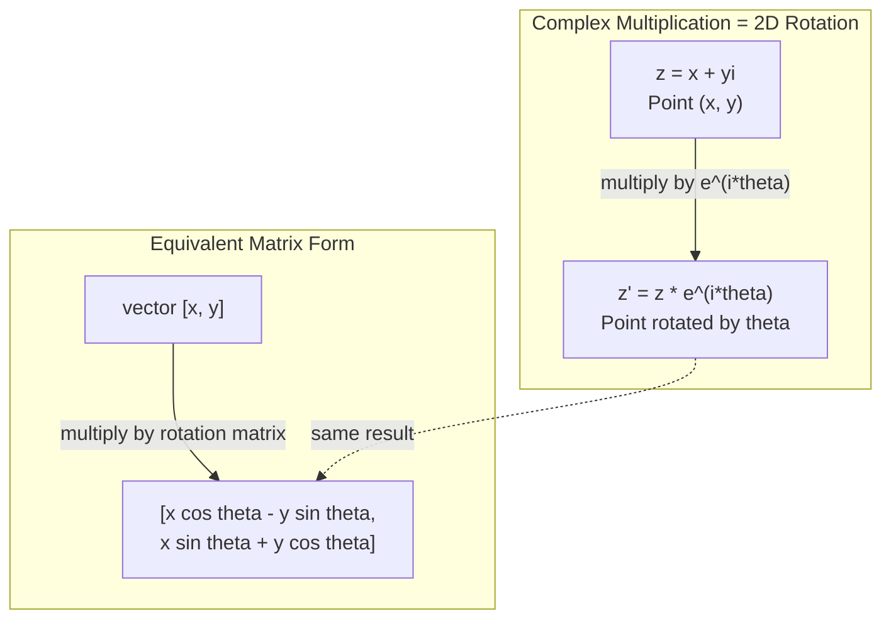
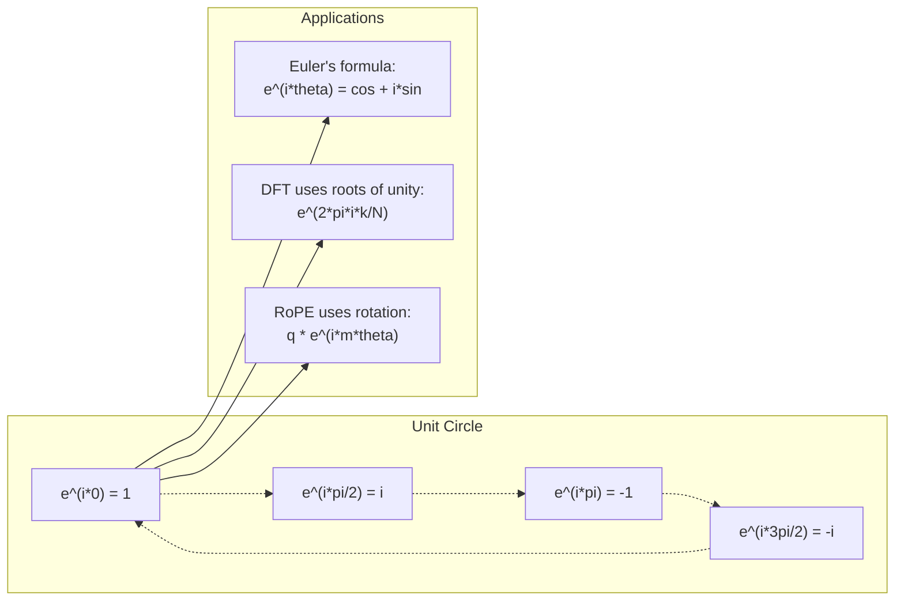

# Numéros complexes pour l'IA

> La racine carrée de -1 n'est pas imaginaire, elle est la clé des rotations, des fréquences et de la moitié du traitement du signal.
> La racine carrée de -1 n'est pas "fausse" de la même façon.

**Type:** Learn | **类型:** 学习
**Language:**Je suis un Python .**语言:**Python
**Prerequisites:** Phase 1, Lessons 01-04 (linear algebra, calculus) | **前置知识:** Phase 1, 第 01-04 课（线性代数、微积分）
**Time:** ~60 minutes | **时间:** ~60 分钟

## Objectifs d'apprentissage

- Exécuter l'arithmétique complexe (ajouter, multiplier, diviser, conjuguer) sous forme rectangulaire et polaire
  执行复数运算(加、乘、除、共), y compris la forme de la ligne droite et la ligne de la ligne de bord
- Appliquer la formule d'Euler pour convertir entre les exponentiels complexes et les fonctions trigonométriques
  应用 欧拉公式在复指数和三角函数之间
- Implémenter la Transformation Fourier discrète en utilisant des racines complexes d'unité
  Utilisation de l'unité pour réaliser la dispersion
- Expliquer comment les rotations complexes sous-tendent les encodements positionnels RoPE et sinusoïdale dans les transformateurs
  Expliquer comment composer le RoPE et le Transformer


> **【中文解读】**
> 虚数 i est la clé du rotation et de la fréquence. Le code de position de la RoPE du transformateur (en anglais: RoPE) est en fait le code de la rotation et de la fréquence.

## Le problème , l' introduction du problème

Vous ouvrez un article sur les transformations de Fourier et il y a`i`Vous regardez les encodements de position des transformateurs et vous voyez`sin`et `cos`Vous lisez sur l'informatique quantique et trouvez tout exprimé dans des espaces vectoriels complexes.

> Tu as ouvert un article sur le changement de style, partout.`i`◊ tu regardes le Transformer  position code, voir différentes fréquences `sin`et `cos` Elles sont la partie physique et la partie imaginaire du récapitulatif.

Les nombres complexes semblent abstraits. Un système de nombres construit sur la racine carrée de -1 semble être une astuce mathématique. Mais ce n'est pas une astuce. C'est le langage naturel des rotations et des oscillations. Chaque fois que quelque chose tourne, vibrera ou oscillera, les nombres complexes sont l'outil idéal.

> Le nombre de fois semble abstrait. Il est construit sur la racine carrée de -1 et ressemble à un jeu mathématique. Mais ce n'est pas un jeu. C'est le langage naturel du tour et de la vibration. Chaque fois qu'un objet tourne, vibrent ou vibrent, le nombre de fois est un instrument correct.

Sans comprendre les nombres complexes, vous ne pouvez pas comprendre la Transformation Fourier discrète. Vous ne pouvez pas comprendre FFT. Vous ne pouvez pas comprendre comment RoPE (Rotary Position Embedding) fonctionne dans les modèles de langage modernes. Vous ne pouvez pas comprendre pourquoi les encodements positionnels sinusoïdes dans le papier Transformer original utilisent les fréquences qu'ils font.

> Je ne comprends pas le nombre de fois, tu ne comprends pas le nombre de fois. Je ne comprends pas le nombre de fois. Je ne comprends pas le nombre de fois.

Cette leçon construit l'arithmétique complexe à partir de zéro, la connecte à la géométrie, et vous montre exactement où apparaissent les nombres complexes dans l'apprentissage automatique.

> Ce cours est basé sur le calcul de complexité, en le reliant à la géographie, et en montrant précisément la position du complexité dans l'apprentissage automatique.

## Le concept de base.

> **【中文解读】**
> 复数的核心洞察:i 不是"虚"的, il s'agit d'une opération de rotation à 90°.

> **【拓展：复数在 AI 中的实际应用规模】**
> La série LLaMA de GPT-4 de OpenAI, META, utilise RoPE, en fait un nombre de rotations. Pour chaque série, 80 points de concentration, la longueur du processus est de 4096 points.

### Qu'est-ce qu'un nombre complexe ?

Un nombre complexe a deux parties: une partie réelle et une partie imaginaire.

> Il y a deux parties: partie réelle et partie imaginaire.

```
z = a + bi

where:
  a is the real part
  b is the imaginary part
  i is the imaginary unit, defined by i^2 = -1
```

C'est tout. Vous étendrez la ligne numérique dans un plan. Les nombres réels sont assis sur un axe. Les nombres imaginaires sont assis sur l'autre. Chaque nombre complexe est un point dans ce plan.

> C'est ainsi que tu as fait de l'axe numérique une extension à un plan. Le nombre réel est sur un axe. Le nombre fictif est sur un autre axe.

### L'arithmétique complexe

**Addition.**Ajoutez les parties réelles, ajoutez les parties imaginaires.

> **加法。**Il y a aussi le fait de faire des choses.

```
(a + bi) + (c + di) = (a + c) + (b + d)i

Example: (3 + 2i) + (1 + 4i) = 4 + 6i
```

**Multiplication.**Utilisez la loi de la répartition et rappelez-vous que i^2 = -1.

> **乘法。**Utilisation de la loi de distribution, se souvenir de l'équivalent de -1

```
(a + bi)(c + di) = ac + adi + bci + bdi^2
                 = ac + adi + bci - bd
                 = (ac - bd) + (ad + bc)i

Example: (3 + 2i)(1 + 4i) = 3 + 12i + 2i + 8i^2
                            = 3 + 14i - 8
                            = -5 + 14i
```

**Conjugate.**Faites tourner le signe de la partie imaginaire.

> **共轭（Conjugate）。**翻转虚部的符号──

```
conjugate of (a + bi) = a - bi
```

Le produit d'un nombre complexe et de son conjugué est toujours réel:

> Le nombre de fois le nombre de fois le nombre de fois est un nombre réel:

```
(a + bi)(a - bi) = a^2 + b^2
```

**Division.**Multipliez le numérateur et le dénominateur par le conjugué du dénominateur.

> **除法。**分子和分母同时乘以分母的共──

```
(a + bi) / (c + di) = (a + bi)(c - di) / (c^2 + d^2)
```

Cela élimine la partie imaginaire du dénominateur, vous donnant un nombre complexe propre.

> Cela élimine le vide de la fraction, obtenant un nombre de fois net.

### Le plan complexe

Le plan complexe trace chaque nombre complexe à un point 2D. L'axe horizontal est l'axe réel, l'axe vertical est l'axe imaginaire.

> Le plan de chaque plan est représenté en 2D. L'axe horizontal est l'axe réel, l'axe vertical est l'axe fictif.

```
z = 3 + 2i  corresponds to the point (3, 2)
z = -1 + 0i corresponds to the point (-1, 0) on the real axis
z = 0 + 4i  corresponds to the point (0, 4) on the imaginary axis
```

Un nombre complexe est simultanément un point et un vecteur de l'origine. Cette interprétation double est ce qui rend les nombres complexes utiles pour la géométrie.

> Le nombre de fois est un point et un épisode de l'émission du point d'origine. Cette double interprétation rend le nombre de fois très utile dans la géométrie.

### Forme polaire

Tout point du plan peut être décrit par sa distance de l'origine et son angle de l'axe réel positif.

> Tout point de la planche peut être décrit à l'angle de sa distance du point d'origine et de son axe réel.

```
z = r * (cos(theta) + i*sin(theta))

where:
  r = |z| = sqrt(a^2 + b^2)     (magnitude, or modulus)
  theta = atan2(b, a)             (phase, or argument)
```

La forme rectangulaire (a + bi) est bonne pour l'addition.

> Pour les personnes âgées de plus de 20 ans, la formation de la formation professionnelle est un processus de formation professionnelle.

**Multiplication in polar form.**Multipliez les magnitudes, ajoutez les angles.

> **极坐标形式的乘法。**Je suis en train de faire une petite histoire.

```
z1 = r1 * e^(i*theta1)
z2 = r2 * e^(i*theta2)

z1 * z2 = (r1 * r2) * e^(i*(theta1 + theta2))
```

C'est pourquoi les nombres complexes sont parfaits pour les rotations. Multiplier par un nombre complexe avec une magnitude 1 est une rotation pure.

> C'est pourquoi le nombre de fois est parfaitement adapté à la rotation.

### La formule d'Euler

Le pont entre les exponentiels complexes et la trigonométrie:

> Le pont entre la réelle et la réelle:

```
e^(i*theta) = cos(theta) + i*sin(theta)
```

C'est la formule la plus importante de cette leçon.

> C'est la formule la plus importante de la classe.

```
e^(i*pi) = cos(pi) + i*sin(pi) = -1 + 0i = -1

Therefore: e^(i*pi) + 1 = 0
```

Cinq constantes fondamentales (e, i, pi, 1, 0) reliées dans une seule équation.

> 五个基本常数 (e、i、pi、1、0) uni uni uni uni dans un équation

### Pourquoi la formule d'Euler est importante pour ML

La formule d'Euler dit que`e^(i*theta)`Le theta = 0, le theta = pi/2, le theta = pi/2, le theta = pi/2, le theta = pi/2, le theta = pi/2, le theta = 3*pi/2, le theta = 0, le theta = pi/2, le theta = pi/1, le theta = pi/2, le theta = pi/0, le theta = pi/2, le theta = pi/0, le theta = pi/0, le theta = pi/0, le theta = pi/0, le theta = pi/0, le theta = pi/0, le theta = pi/0, le theta = pi/0, le theta = pi/0, le theta = pi/0, le theta = pi/0, le theta = pi/0, le theta = pi/0, le theta = pi/0, le theta = pi/0, le theta = pi/0, le theta = pi/0, le theta = pi/0, le theta = pi/pi, le theta = pi/pi, le theta = pi/pi, le theta = pi, le theta = pi, le theta = pi, le pi, le pi, le pi, le pi, le pi, le pi, le pi, le pi, le pi, le pi, le pi, le pi, le pi, le pi, le pi, le pi, le pi, le pi, le pi, le pi, le pi, le pi, le pi, le pi, le pi, le pi, le pi, le pi, le pi, le pi, le pi, le pi, le pi, le pi, le pi, le pi, le pi, le pi, le pi, le pi, le pi, le pi, le pi, le pi, le pi, le pi, le pi, est le pi, et le pi, le pi, le pi, le pi, le pi, le pi, est le pi, et le pi, le pi, le pi, le pi, est le pi, le pi, le pi, le pi, le pi, le pi, est le pi, et le pi, le pi, le pi, est le pi, le pi, le pi, et le pi, est le pi, et le pi, est le pi, et le pi, est le pi, et le pi, est

> 欧拉公式说 `e^(i*theta)`随着 theta 变化描绘单位圆――theta = 0 时在 (1, 0)。theta = pi/2 时在 (0, 1)。theta = pi 时在 (-1, 0)。theta = 3*pi/2 时在 (0, -1)。完整旋转是 theta = 2*pi。

Cela signifie que les exponentiels complexes sont des rotations.

> Cela signifie que le référentiel est en rotation.

> **【中文解读】**
> 欧拉公式 e^(i*theta) = cos(theta) + i*sin(theta) est la formule la plus importante de ce cours. Elle met en place des fonctions index et trois angles ensemble, elle met en place des nombres multiples et des rotations ensemble.

### Connexion à des rotations 2D

Multiplication du nombre complexe (x + yi) par e^(i*theta) fait tourner le point (x, y) par angle theta autour de l'origine.

> 将复数 (x + yi) 乘以 e^(i*theta) 将点 (x, y) 绕原点旋转角 theta。

```
Rotation via complex multiplication:
  (x + yi) * (cos(theta) + i*sin(theta))
  = (x*cos(theta) - y*sin(theta)) + (x*sin(theta) + y*cos(theta))i

Rotation via matrix multiplication:
  [cos(theta)  -sin(theta)] [x]   [x*cos(theta) - y*sin(theta)]
  [sin(theta)   cos(theta)] [y] = [x*sin(theta) + y*cos(theta)]
```

La matrice de rotation est simplement une multiplication complexe écrite en notation de matrice.

> Ils produisent le même résultat. Le nombre de fois est le même en 2D.



### Les phasors et les signaux rotatifs

Un point é*omega*t complexe est un point tournant autour du cercle unitaire à la fréquence angulaire omega.

> 复指数 e^(i*omega*t) est un point de rotation à un rythme de l'onde de l'unité.

La partie réelle de ce point de rotation est cos(omega*t). La partie imaginaire est sin(omega*t). Un signal sinusoïdale est l'ombre d'un nombre complexe en rotation.

> Cette partie de la rotation est un cosmos.

```
e^(i*omega*t) = cos(omega*t) + i*sin(omega*t)

Real part:      cos(omega*t)    -- a cosine wave
Imaginary part: sin(omega*t)    -- a sine wave
```

C'est la représentation du phasor. Au lieu de suivre une onde sinusoïdale mouvementée, vous suivez une flèche qui tourne doucement. Les changements de phase deviennent des compensations d'angle. Les changements d'amplitude deviennent des changements de magnitude. L'ajout de signaux devient l'ajout vectoriel.

> Ceci est la quantité de phase (phasor) qui indique que le phasor ne doit pas suivre les ondes de la ligne d'arrière, mais les flèches de la rotation plane.

### Les racines de l'unité

Les N-e racines de l'unité sont N points équitablement espacés sur le cercle unitaire:

> N°°°°°°°°°°°°°°°°°°°°°°°°°°°°°°°°°°°°°°°°°°°°°°°°°°°°°°°°°°°°°°°°°°°°°°°°°°°°°°°°°°°°°°°°°°°°°°°°°°°°°°°°°°°°°°°°°°°°°°°°°°°°°°°°°°°°°°°°°°°°°°°°°°°°°°°°°°°°°°°°°°°°°°°°°°°°°°°°°°°°°°°°°°°°°°°°°°°°°°°°°°°°°°°°°°°°°°°°°°°°°°°°°°°°°°°°°°°°°°°°°°°°°°°°°°°°°°°°°°°°°°°°°°°°°°°°°°°°°°°°°°°°°°°°°°°°°°°°°°°°°°°°°°°°°°°°°°°°°°°°°°°°°°°°°°°°°°°°°°°°°°°°°°°°°°°°°°°°°°°°°°°°°°°°°°°°°°°°°°°°°°°°°°°°°°°°°°°°°°°°°°°°°°°°°°°°°°°°°°°°°°°°°°°°°°°°°°°°°°°°°°°°°°°°°°°°°°°°°°°°°°°°°°°°°°°°°°°°°°°°°°°°°°°°°°°°°°°°°°°°°°°°°°°°°

```
w_k = e^(2*pi*i*k/N)    for k = 0, 1, 2, ..., N-1
```

Pour N = 4, les racines sont: 1, i, -1, -i (les quatre points de la boussole).
Pour N = 8, vous obtenez les quatre points de la boussole plus les quatre diagonales.

Les racines de l'unité sont la base de la Transformation Fourier discrète.

> L'unité de base est la base de la dispersion des signaux.

> **【中文解读】**
> La racine d'unité est N 个等等等等等等等等等等等等等等等等等等等等等等等等等等等等等等等等等等等等等等等等等等等等等等等等等等等等等等等等等等等等等等等等等等等等等等等等等等等等等等等等等等等等等等等等等等等等等等等等等等等等等等等等等等等等等等等等等等等等等等等等等等等等等等等等等等等等等等等等等等等等等等等等等等等等等等等等等等等等等等等等等等等等等等等等等等等等等等等等等等等等等等等等等等等等等等等等等等等等等等等等等等等等等等等等等等等等等等等等等等等等等等等等等等等等等等等等等等等等等等等等等等等等等等等等等等等等等等等等等等等等等等等等等等等等等等等等等等等等等等等等等等等等等等等等等等等等等等等等等等等等等等等等等等等等等等等等等等等等等等等等等等等等等等等等等等等等等等等等等等等等等等等等等等等等等等等等等等等等等等等等等等等等等等等等等等等等等等等等等等等等等等等等等等等等等等等等等等等等等等等等等等等等等等等等等等等等等等等等等等等等等等等等等等等等等等等等等等等等等等等等等等等等等等等等等等等等等等等等等等等等等等等等等等等等等等等等等等等等等等等等等等等等等等等等等等等等等等等等等等等

### Connexion au DFT

La Transformation Fourier discrète d'un signal x[0], x[1], ..., x[N-1] est:

> 信号 x[0], x[1], ..., x[N-1] de détachement 里叶变换为:

```
X[k] = sum_{n=0}^{N-1} x[n] * e^(-2*pi*i*k*n/N)
```

Chaque X [k] mesure la corrélation du signal avec la racine k de l'unité - un sinus complexe à la fréquence k. Le DFT décompose un signal en N phasers rotatifs et vous indique l'amplitude et la phase de chacun.

> Chaque X[k] mesure le signal avec la connectivité de la racine de l'unité K la fréquence de la réaction de la force K.

### Pourquoi je ne suis pas imaginaire

Le mot "imaginatoire" est un accident historique. Descartes l'a utilisé de manière négative. Mais je ne suis pas plus imaginaire que les nombres négatifs quand les gens les ont rejetés pour la première fois. Les nombres négatifs répondent "qu'est-ce que vous soustraisez 5 de 3 pour obtenir?"

> "虚" est une expression historique de l'accident. Descartes l'utilise pour la réduire. Mais je ne suis pas comparable au nombre négatif d'abord rejeté par les gens.

Plus utile: i est un opérateur de rotation de 90 degrés. Multipliez un nombre réel par i une fois, vous faites tourner 90 degrés vers l'axe imaginaire. Multipliez par i à nouveau (i^2), vous faites tourner 90 degrés de plus - maintenant vous pointez dans la direction réelle négative. C'est pourquoi i^2 = -1. Ce n'est pas mystérieux. C'est un demi-tour construit à partir de deux quarts de virages.

> Pour comprendre mieux: i est un calcul de rotation de 90 degrés. Le nombre de vrais nombres est multiplié par i une fois, tu as fait le tour de 90 degrés jusqu'à un faux axe.

C'est pourquoi les nombres complexes sont partout dans l'ingénierie. Tout ce qui tourne - ondes électromagnétiques, états quantiques, oscillations de signal, codes positionnels - est naturellement décrit par des nombres complexes.

> C'est pourquoi le nombre complexe n'existe pas dans l'ingénierie. Toutes les choses qui tournent sont naturellement utilisées pour décrire le nombre complexe.

### Exponentiels complexes par rapport aux fonctions trigonométriques

Avant la formule d'Euler, les ingénieurs ont écrit des signaux comme A*cos(omega*t + phi) - amplitude A, fréquence omega, phase phi. Cela fonctionne mais rend l'arithmétique douloureuse.

> Avant l'utilisation de la formule, l'ingénieur écrirait le signal en A*cos ((omega*t + phi) 幅度 A、 fréquence omega、相位 phi―.

Avec des exponentiels complexes, le même signal est A*e^(i*(omega*t + phi)). Ajouter deux signaux est juste ajouter deux nombres complexes. Multiplication (modulation) est juste multiplier les magnitudes et ajouter des angles. Les changements de phase deviennent des ajouts d'angle.

> Il est également utilisé pour les signaux de la même façon que les signaux de la même façon.

Le champ entier du traitement des signaux est passé à la notation exponentielle complexe parce que les mathématiques sont plus propres. Le "signal réel" est toujours juste la partie réelle de la représentation complexe.

> Le "signal" est le "real" de la répartition du nombre de caractères.

> **【拓展：复数在量子计算中的角色】**
> La base du calcul quantique est l'état de la quantité de torsion ∙ un quantibit est l'état d'une quantité de torsion alpha ∙0> + bêta 1>, dont ∙alpha 2 + ∙beta 2 = 1,alpha 和 bêta ∙ est le nombre de torsion ∙ quantité  matrice ∙ Google Sycamore 量子芯片 ⋅ 53 ⋅ bits, dont l'état de torsion ⋅ 2 ⋅ 53 ⋅ ⋅ ⋅ ⋅ ⋅ ⋅ ⋅ ⋅ ⋅ ⋅ ⋅ ⋅ ⋅ ⋅ ⋅ ⋅ ⋅ ⋅ ⋅ ⋅ ⋅ ⋅ ⋅ ⋅ ⋅ ⋅ ⋅ ⋅ ⋅ ⋅ ⋅ ⋅ ⋅ ⋅ ⋅ ⋅ ⋅ ⋅ ⋅ ⋅ ⋅ ⋅ ⋅ ⋅ ⋅ ⋅ ⋅ ⋅ ⋅ ⋅ ⋅ ⋅ ⋅ ⋅ ⋅ ⋅ ⋅ ⋅ ⋅ ⋅ ⋅ ⋅ ⋅ ⋅ ⋅ ⋅ ⋅ ⋅ ⋅ ⋅ ⋅ ⋅ ⋅ ⋅ ⋅ ⋅ ⋅ ⋅ ⋅ ⋅ ⋅ ⋅ ⋅ ⋅ ⋅ ⋅ ⋅ ⋅ ⋅ ⋅ ⋅ ⋅ ⋅ ⋅ ⋅ ⋅ ⋅ ⋅ ⋅ ⋅ ⋅ ⋅ ⋅ ⋅ ⋅ ⋅ ⋅ ⋅ ⋅ ⋅ ⋅ ⋅ ⋅ ⋅ ⋅ ⋅ ⋅ ⋅  ⋅ ⋅   ⋅ ⋅                                                                                                                                                

### Connexion aux transformateurs

**Sinusoidal positional encodings**(papier transformateur original):

```
PE(pos, 2i) = sin(pos / 10000^(2i/d))
PE(pos, 2i+1) = cos(pos / 10000^(2i/d))
```

Les paires de péché et de cos sont les parties réelles et imaginaires d'exponentiels complexes à différentes fréquences. Chaque fréquence fournit une "résolution" différente pour la position de codage.

> et cos à des répartitions et des fictions de différents indices de fréquence. Chaque fréquence pour le code de position fournit une " résolution " différente.

**RoPE (Rotary Position Embedding)**Il multiplie explicitement les vecteurs de requête et de clé par des matrices de rotation complexes. La position relative entre deux jetons devient un angle de rotation.

> **RoPE（旋转位置编码）**En outre, il est évident que la requête et la clé sont multipliées par la fréquence de rotation de la matrice.

> **【拓展：RoPE 在 LLaMA 和 GPT-NeoX 中的实现】**
> RoPE va effectuer une requête et une clé pour orienter la quantité par dimension vers le composé de vision, puis multiplier les facteurs de rotation qui changent d'angle à position. Pour le modèle de la dimension d = 4096 , la longueur de séquence L = 4096, RoPE pour chaque parité (q, k)  Exécuter L^2/2 fois le multiplicateur. Comparé au code de position absolu, l'avantage de RoPE est que le angle de rotation de la position relative dépend uniquement de la différence de position, ce qui soutient naturellement " l'extraction " de la formation en 2048 de longueur, la raison peut être étendue à une séquence plus longue.

| Operation | Algebraic Form | Geometric Meaning |
|-----------|---------------|-------------------|
| Addition | (a+c) + (b+d)i | Vector addition in the plane |
| Multiplication | (ac-bd) + (ad+bc)i | Rotate and scale |
| Conjugate | a - bi | Reflect over real axis |
| Magnitude | sqrt(a^2 + b^2) | Distance from origin |
| Phase | atan2(b, a) | Angle from positive real axis |
| Division | multiply by conjugate | Reverse rotation and rescale |
| Power | r^n * e^(i*n*theta) | Rotate n times, scale by r^n |



## Construisez-le et mettez-le en œuvre.
```figure
roots-of-unity
```

## Faites-le

### Étape 1: classe complexe

Construisez une classe de nombres complexes qui prend en charge l'arithmétique, la magnitude, la phase et la conversion entre les formes rectangulaires et polaires.

> Construire un complexe, soutenir le calcul des opérations 模、相位 ainsi que la transformation entre le coordinateur et le coordinateur.

```python
import math

class Complex:
    def __init__(self, real, imag=0.0):
        self.real = real
        self.imag = imag

    def __add__(self, other):
        return Complex(self.real + other.real, self.imag + other.imag)

    def __mul__(self, other):
        r = self.real * other.real - self.imag * other.imag  # 实部：(ac - bd)
        i = self.real * other.imag + self.imag * other.real  # 虚部：(ad + bc)
        return Complex(r, i)

    def __truediv__(self, other):
        denom = other.real ** 2 + other.imag ** 2            # 分母：c^2 + d^2
        r = (self.real * other.real + self.imag * other.imag) / denom  # 乘以共轭后的实部
        i = (self.imag * other.real - self.real * other.imag) / denom  # 乘以共轭后的虚部
        return Complex(r, i)

    def magnitude(self):
        return math.sqrt(self.real ** 2 + self.imag ** 2)

    def phase(self):
        return math.atan2(self.imag, self.real)

    def conjugate(self):
        return Complex(self.real, -self.imag)
```

### Étape 2: Conversion polaire et formule d'Euler

```python
def to_polar(z):
    return z.magnitude(), z.phase()

def from_polar(r, theta):
    return Complex(r * math.cos(theta), r * math.sin(theta))

def euler(theta):
    return Complex(math.cos(theta), math.sin(theta))
```

Vérifiez: `euler(theta).magnitude()`Il devrait toujours être de 1.0.`euler(0)`doit donner (1, 0). `euler(pi)`doit donner (-1, 0).

> 验证:`euler(theta).magnitude()`Il faut le faire.`euler(0)`应给出 (1, 0)`euler(pi)`应给出 (-1, 0)

### Étape 3: Rotation

La rotation d'un point (x, y) par angle theta est une multiplication complexe:

> 将点 (x, y) 旋转角度 theta 只有一个复数乘法:

```python
point = Complex(3, 4)
rotated = point * euler(math.pi / 4)
```

La magnitude reste la même, mais l'angle change.

> 模保持不变──只有角度改变──

### Étape 4: DFT de l'arithmétique complexe

```python
def dft(signal):
    N = len(signal)                               # 信号长度
    result = []
    for k in range(N):
        total = Complex(0, 0)
        for n in range(N):
            angle = -2 * math.pi * k * n / N      # 第 k 个单位根的角度
            total = total + Complex(signal[n], 0) * euler(angle)  # 累加：信号与旋转相量的相关
        result.append(total)
    return result
```

C'est le DFT O(N^2. Chaque sortie X[k] est la somme des échantillons de signal multipliée par les racines d'unité.

> C'est le DFT de O(N^2) ⋅ pour chaque sortie X[k] ⋅ est le signal sample multiplié par unité de racine ⋅ et ⋅

### Étape 5: DFT inversé

Le DFT inverse reconstruit le signal d'origine à partir de son spectre.

> 逆 DFT de la fréquence de reconstruction du signal original.

```python
def idft(spectrum):
    N = len(spectrum)
    result = []
    for n in range(N):
        total = Complex(0, 0)
        for k in range(N):
            angle = 2 * math.pi * k * n / N
            total = total + spectrum[k] * euler(angle)
        result.append(Complex(total.real / N, total.imag / N))
    return result
```

Cela vous donne une reconstruction parfaite. Appliquez DFT, puis IDFT, et vous obtenez le signal original à la précision de la machine. Aucune information n'est perdue.

> Ceci vous donne une reconstruction parfaite. Appliquez DFT, réappliquez IDFT, vous récupérez le signal d'origine avec précision de l'appareil.

### Étape 6: Les racines de l'unité

```python
def roots_of_unity(N):
    return [euler(2 * math.pi * k / N) for k in range(N)]
```

Vérifiez deux propriétés:
- Chaque racine a une magnitude de 1 exactement.
  Chaque racine est bien pour 1.
- La somme de toutes les racines N est nulle (elles sont annulées par symétrie).
  Propriété N 个根之和为零(对称性导致相消)

Ces propriétés sont ce qui rend le DFT inversible.

> Ces caractéristiques rendent la DFT opposable.

## Utilisez-le avec le cadre de réalisation

Python a intégré le support de nombres complexes.`j`représente l'unité imaginaire.

> Python en ligne`j`Indiquer le nombre d'unités.

```python
z = 3 + 2j
w = 1 + 4j

print(z + w)
print(z * w)
print(abs(z))

import cmath
print(cmath.phase(z))
print(cmath.exp(1j * cmath.pi))
```

Pour les matrices, numpy traite les nombres complexes de manière native:

> Pour le nombre, numpy

```python
import numpy as np

z = np.array([1+2j, 3+4j, 5+6j])
print(np.abs(z))
print(np.angle(z))
print(np.conj(z))
print(np.real(z))
print(np.imag(z))

signal = np.sin(2 * np.pi * 5 * np.linspace(0, 1, 128))
spectrum = np.fft.fft(signal)
freqs = np.fft.fftfreq(128, d=1/128)
```

## Envoyez-le . Produit .

On court .`code/complex_numbers.py`pour générer `outputs/skill-complex-arithmetic.md`- Je suis désolé .

> 运行  référencement`code/complex_numbers.py`                  `outputs/skill-complex-arithmetic.md`(复数运算技能文档)

## Les exercices

1. **Complex arithmetic by hand.**Compute (2 + 3i) * (4 - i) et vérifie avec le code. Compute ensuite (5 + 2i) / (1 - 3i). Dessinez les deux résultats sur le plan complexe et vérifiez que la multiplication a tourné et étalé le premier nombre.

2. **Rotation sequence.**Commencez par le point (1, 0). Multipliez par e^(i*pi/6) douze fois. Vérifiez que vous revenez à (1, 0) après 12 multiplications. Imprimez les coordonnées à chaque étape et confirmez qu'elles suivent un 12-gon régulier.

3. **DFT of a known signal.**Créer un signal qui est la somme des sin ((2 * pi * 3 * t) et 0,5 * sin ((2 * pi * 7 * t) échantillonnés à 32 points. Exécuter votre DFT. Vérifiez que le spectre de magnitude a des pics à la fréquence 3 et 7, avec le pic à 7 étant la moitié de la hauteur du pic à 3.

4. **Roots of unity visualization.**Comptez les 8e racines de l'unité. Vérifiez qu'elles s'ajoutent à zéro. Vérifiez que la multiplication de n'importe quelle racine par la racine primitive e^(2 * pi*i/8) donne la racine suivante.

5. **Rotation matrix equivalence.**Pour 10 angles aléatoires et 10 points aléatoires, vérifiez que la multiplication complexe donne le même résultat que la multiplication par matrice-vecteur avec la matrice de rotation 2x2.

## Les termes clés

| Term | What it means |
|------|---------------|
| Complex number | A number a + bi where a is the real part, b is the imaginary part, and i^2 = -1 |
| Imaginary unit | The number i, defined by i^2 = -1. Not imaginary in the philosophical sense -- it is a rotation operator |
| Complex plane | The 2D plane where the x-axis is real and the y-axis is imaginary. Also called the Argand plane |
| Magnitude (modulus) | The distance from the origin: sqrt(a^2 + b^2). Written as \|z\| |
| Phase (argument) | The angle from the positive real axis: atan2(b, a). Written as arg(z) |
| Conjugate | The mirror image across the real axis: conjugate of a + bi is a - bi |
| Polar form | Expressing z as r * e^(i*theta) instead of a + bi. Makes multiplication easy |
| Euler's formula | e^(i*theta) = cos(theta) + i*sin(theta). Connects exponentials to trigonometry |
| Phasor | A rotating complex number e^(i*omega*t) representing a sinusoidal signal |
| Roots of unity | The N complex numbers e^(2*pi*i*k/N) for k = 0 to N-1. N equally spaced points on the unit circle |
| DFT | Discrete Fourier Transform. Decomposes a signal into complex sinusoidal components using roots of unity |
| RoPE | Rotary Position Embedding. Uses complex multiplication to encode relative position in transformer attention |

> 术语速查:numéro complexe(复数 a+bi)、unité imaginaire(虚数单位 i,旋转算子)、plan complexe(复平面)、Magnitude/module(模 √(a2+b2))、Phase/argument(相位 atan2(b,a))、Conjugate(共 a-bi)、Polar formation(极坐标 r·e^(iθ、)) 欧拉公式 e^(iθ)=θ+i·sinθ)、Phasor(旋转相量)、Réces de l'unité (Unités N 个均分单位圆的点)、DFT散离里叶变换)、Rocospéo转位置编码,L(Laospéo utilisée)

## Encore une lecture

- [Visual Introduction to Euler's Formula](https://betterexplained.com/articles/intuitive-understanding-of-eulers-formula/)- construit une intuition géométrique sans notes lourdes
- [Su et al.: RoFormer (2021)](https://arxiv.org/abs/2104.09864)- le document introduisant l'implantation de position rotative à l'aide de rotations complexes
- [Vaswani et al.: Attention Is All You Need (2017)](https://arxiv.org/abs/1706.03762)- le papier transformateur original avec des encodements positionnels sinusoïdes
- [3Blue1Brown: Euler's formula with introductory group theory](https://www.youtube.com/watch?v=mvmuCPvRoWQ)- explication visuelle de la raison pour laquelle e^(i*pi) = -1
- [Needham: Visual Complex Analysis](https://global.oup.com/academic/product/visual-complex-analysis-9780198534464)- le meilleur traitement visuel des nombres complexes, plein de compréhension géométrique
- [Strang: Introduction to Linear Algebra, Ch. 10](https://math.mit.edu/~gs/linearalgebra/)- les nombres complexes dans le contexte de l'algèbre linéaire et des valeurs propres
