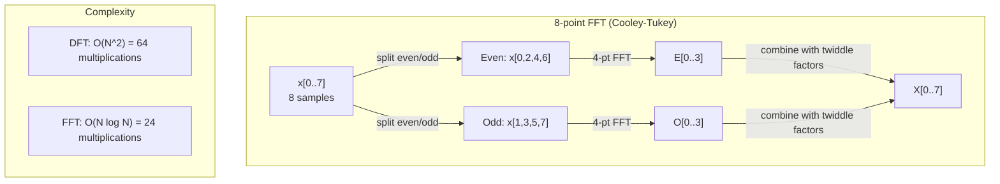
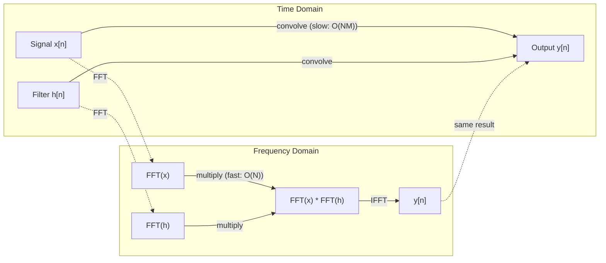

# La transformation de Fourier a changé.

> Chaque signal est une somme d'ondes sinusoïdes.
> Chaque signal est une superposition de la vague de la chaîne.

**Type:** Build | **类型:** 动手
**Language:**Je suis un Python .**语言:**Python
**Prerequisites:** Phase 1, Lessons 01-04, 19 (complex numbers) | **前置知识:** Phase 1, 第 01-04 课、第 19 课（复数）
**Time:** ~90 minutes | **时间:** ~90 分钟

## Objectifs d'apprentissage

- Mettre en œuvre la FFT à partir de zéro et la vérifier contre la FFT O(N log N) Cooley-Tukey
  De la réalisation de la FFT et de la Cooley-Tukey FFT 验证
- Interpréter les coefficients de fréquence: extraire l'amplitude, la phase et le spectre de puissance d'un signal
  解释频率系数: de signal中提取幅度、相位和功率谱(Le spectre de puissance)
- Appliquer le théorème de la convolutions pour effectuer la convolutions par la multiplication FFT
  应用卷积定理通过 FFT 乘法执行卷积
- Connectez la décomposition de fréquence Fourier aux couches de codage positionnel et de convolutions de CNN transformateurs
  Généralement, la fréquence de décomposition est associée à la position du transformateur et à la couche de couverture de la CNN.


> **【中文解读】**
> Tout signal peut être divisé en un référentiel de fréquences. Le traitement de l'image est basé sur la fréquence de fréquences.

## Le problème , l' introduction du problème

Une enregistrement audio est une séquence de mesures de pression au fil du temps. Un prix d'action est une séquence de valeurs sur plusieurs jours. Une image est une grille d'intensités de pixels sur l'espace. Toutes ces données sont dans le domaine du temps (ou domaine de l'espace). Vous voyez des valeurs en changement sur un certain indice.

> L'enregistrement de la fréquence est une séquence de mesure de la pression qui change avec le temps. Le prix de l'action est une séquence de valeur qui change avec le temps. L'image est une séquence de la force de la pixel dans l'espace.

Mais de nombreux modèles sont invisibles dans le domaine temporel. Ce signal audio est-il un ton pur ou un accord? Le prix de l'action a-t-il un cycle hebdomadaire? Cette image a-t-elle une texture répétée? Ces questions concernent le contenu de la fréquence, et le domaine temporel le cache.

> Mais de nombreux modèles sont invisibles dans le domaine du temps. Le signal est pur ou sans sons. Le prix de l'action a-t-il un cycle ?

La transformation de Fourier convertit les données du domaine temporel au domaine de fréquence. Elle prend un signal et le décompose en ondes sinusales de différentes fréquences. Chaque onde sinusale a une amplitude (la force de son amplitude) et une phase (où elle démarre).

> 里叶变换将数据从时域转换到频域──它接收一个信号并将其分解成不同频率的正弦波──每正弦波有幅度(有多强) 和相位──从哪里开始)──里叶变换告诉你两者──

Cela importe pour ML parce que la pensée du domaine de fréquence apparaît partout. Les réseaux neuronaux convolutifs effectuent une convolutions, qui est la multiplication dans le domaine de fréquence. Les encodements positionnels des transformateurs utilisent la décomposition de fréquence pour représenter la position. Les modèles audio (reconnaissance de la parole, génération de musique) fonctionnent sur des spectrogrammes - représentations de fréquence du son. Les modèles de séries temporelles recherchent des modèles périodiques. Comprendre la transformation de Fourier vous donne le vocabulaire pour travailler avec tout cela.

> Ceci est important pour le ML, car le champ de réflexion est inexistant. Le champ de réflexion est le champ d'exécution du réseau de réflexion.

## Le concept de base.

> **【中文解读】**
> 里叶变换的核心思想: tout signal peut être décomposé en différents signaux de fréquence.

> **【拓展：FFT 的计算影响力】**
> Le FFT est reconnu comme l'un des algorithmes numériques les plus importants du XXe siècle. Gauss a découvert la stratégie de division en 1805, mais Cooley-Tukey a seulement fait en 1965 un article qui a permis à FFT d'être largement appliqué. Aujourd'hui, chaque fois que 4G / LTE partage des images, chaque photo JPEG, chaque chanson MP3 est traitée par FFT. Dans le domaine de l'IA, le modèle de sonore à murmur à la seconde de la fréquence de calcul est d'environ 100 fois FFT, le tube de traitement d'images de diffusion stable utilise également une grande quantité d'opérations de fréquence.

### La définition de la DFT

Compte tenu des échantillons N x[0], x[1], ..., x[N-1], la Transformation Fourier discrète produit des coefficients de fréquence N X[0], X[1], ..., X[N-1]:

> 给定 N 个样本 x[0], x[1], ..., x[N-1],离散里叶变换产生 N 个频率系数 X[0], X[1], ..., X[N-1]:

```
X[k] = sum_{n=0}^{N-1} x[n] * e^(-2*pi*i*k*n/N)

for k = 0, 1, ..., N-1
```

Chaque X [k] est un nombre complexe. Sa magnitude. X [k] détecte l'amplitude de la fréquence k. Son angle de phase ((X [k]) vous indique le décalage de phase de cette fréquence.

> Chaque X[k] est un nombre de réponses.

Le point de vue clé: `e^(-2*pi*i*k*n/N)`est un phasor rotatif à la fréquence k. Le DFT calcule la corrélation entre le signal et chacune des fréquences N à espace égal. Si le signal contient de l'énergie à la fréquence k, la corrélation est grande.

> 关键洞察:`e^(-2*pi*i*k*n/N)`Si le signal est à la fréquence k avec une énergie, la connectivité est grande, sinon proche de zéro.

### Ce que chaque coefficient signifie

**X[0]: the DC component.**C'est la somme de tous les échantillons, proportionnelle à la moyenne.

> **X[0]：直流分量（DC Component）。**C'est le total de tous les échantillons et la valeur moyenne en proportion.

```
X[0] = sum_{n=0}^{N-1} x[n] * e^0 = sum of all samples
```

**X[k] for 1 <= k <= N/2: positive frequencies.**X[k] représente les cycles de fréquence k par échantillon N. Un k plus élevé signifie une fréquence plus élevée (oscillation plus rapide).

> **X[k]（1 <= k <= N/2）：正频率。**X[k] 代表每 N 个样本中 k 个周期的频率──k 越大频率越高(振荡越快)──

**X[N/2]: the Nyquist frequency.**La fréquence la plus élevée que vous pouvez représenter avec des échantillons N. Au-dessus de cela, vous obtenez un aliasing -- des fréquences élevées masquant comme des fréquences basses.

> **X[N/2]：Nyquist 频率。**Utilisez le plus haut taux de fréquence de l'indication de N 个样本能.

**X[k] for N/2 < k < N: negative frequencies.**Pour les signaux à valeur réelle, X[N-k] = conj(X[k]). Les fréquences négatives sont des images miroir des signaux positifs. C'est pourquoi les informations utiles sont dans les premiers coefficients N/2 + 1.

> **X[k]（N/2 < k < N）：负频率。**Pour le signal de valeur réelle, X[N-k] = conj(X[k])。 la fréquence négative est l'image de la fréquence correcte。 c'est pourquoi l'information utile est présente dans le premier N/2 + 1 个系数。

### DFT inversé

Le DFT inverse reconstruit le signal d'origine à partir de ses coefficients de fréquence:

```
x[n] = (1/N) * sum_{k=0}^{N-1} X[k] * e^(2*pi*i*k*n/N)

for n = 0, 1, ..., N-1
```

Les seules différences du DFT avant: le signe dans l'exponent est positif (pas négatif), et il y a un facteur de normalisation 1/N.

> La seule différence avec le DFT est que le symbole d'indice est positif (non négatif) et qu'il y a un facteur de régulation 1/N.

Le DFT inverse est une reconstruction parfaite. Aucune information n'est perdue. Vous pouvez passer du domaine temporel au domaine de fréquence et retourner sans aucune erreur. Le DFT est un changement de base - il réexprime les mêmes informations dans un système de coordonnées différent.

> En revanche, le DFT est une reconstruction parfaite. Il n'y a pas de perte d'information. Vous pouvez revenir du domaine de temps au domaine de fréquence sans aucune erreur.

### Le FFT: le rendre rapide

Le DFT tel que défini ci-dessus est O(N^2): pour chacun des coefficients de sortie N, vous sumez sur N échantillons d'entrée.

> Pour chaque N 个输出系数, vous avez besoin de N 个输入样本求和. Pour N = 100 000, c'est 10 ^ 12 fois le calcul.

La transformation rapide de Fourier (FFT) calcule le même résultat en O(N log N. Pour N = 1 million, c'est environ 20 millions d'opérations au lieu d'un trillion.

> Pour N = 100 000 000, il s'agit d'environ 2000 000 000 de calculs et non de 1 000 000 000 de calculs.

> **【中文解读】**
> La quantité de calcul de la DFT est O(N^2), mais la FFT 通过分治策略把它降低到O(N log N) ⋅ Pour le signal de N=100.000, la DFT 需要万次运算, la FFT 需要约2000.000次加速50.000倍!

L'algorithme Cooley-Tukey (le FFT le plus courant) fonctionne par division et conquête:

> Cooley-Tukey 算法 (FFT) plus utilisé (à travers le division et la conquête)

1. Divisez le signal en échantillons indexés par et par.
   Le signal sera divisé en indices de nombres occasionnels et de nombres étranges.
2. Calculer le DFT de chaque moitié de manière récursive.
   Retour à la moitié du DFT.
3. Combinez les deux DFT de taille moyenne en utilisant des "facteurs à double" e^(-2*pi*i*k/N).
   Utilisation de "旋转因子" (facteur de double)

```
X[k] = E[k] + e^(-2*pi*i*k/N) * O[k]          for k = 0, ..., N/2 - 1
X[k + N/2] = E[k] - e^(-2*pi*i*k/N) * O[k]    for k = 0, ..., N/2 - 1

where E = DFT of even-indexed samples
      O = DFT of odd-indexed samples
```

La symétrie signifie que chaque niveau de récursion fonctionne O(N), et il y a des niveaux log2(N. Total: O(N log N).

> Pour la répartition, le travail est effectué à chaque niveau, en commun avec le log2N.



La FFT exige que la longueur du signal soit de puissance 2.

### Analyse spectrale

Le **power spectrum**est X [k] squares - la magnitude carrée de chaque coefficient de fréquence.

Le **phase spectrum**est angle ((X[k]) -- le décalage de phase de chaque fréquence. Pour la plupart des tâches d'analyse, vous vous souciez du spectre de puissance et ignorez la phase.

```
Power at frequency k:  P[k] = |X[k]|^2 = X[k].real^2 + X[k].imag^2
Phase at frequency k:  phi[k] = atan2(X[k].imag, X[k].real)
```

### Résolution de fréquence

La résolution de fréquence du DFT dépend du nombre d'échantillons N et du taux d'échantillonnage fs.

```
Frequency of bin k:      f_k = k * fs / N
Frequency resolution:    delta_f = fs / N
Maximum frequency:       f_max = fs / 2  (Nyquist)
```

Pour résoudre deux fréquences proches, il faut plus d'échantillons.

### Le théorème de la convolutions

C'est l'un des résultats les plus importants dans le traitement des signaux et directement pertinent pour les CNN.

> C'est l'un des résultats les plus importants du traitement des signaux, directement lié à CNN.

**Convolution in the time domain equals pointwise multiplication in the frequency domain.**

> **时域中的卷积等于频域中的逐点相乘。**

```
x * h = IFFT(FFT(x) . FFT(h))

where * is convolution and . is element-wise multiplication
```

Pourquoi cela importe ?

- La convolutions directes de deux signaux de longueur N et M effectuent des opérations O(N*M).
  两个长度为 N 和 M 的信号直接卷积需要 O(N*M) 次运算──
- La convolutions basées sur FFT prennent O(N log N): transformer les deux, multiplier, transformer en arrière.
  基于 FFT 卷积需要 O(N log N):变换两个信号、相乘、逆变换。
- Pour les grands noyaux, la convolutions FFT sont considérablement plus rapides.
  Pour le grand volume, le FFT est plus rapide.
- C'est exactement ce qui se passe dans les couches convolutives avec de grands champs réceptifs.
  C'est exactement ce qui se passe dans les couches de volume de la région.

> **【拓展：卷积定理在 CNN 中的实际应用】**
> Le taux de conversion de FFT est de 7x7 ou plus. Le taux de conversion de FFT est de 92% sur le GLUE. La vitesse de formation est de 7 fois. La fréquence de répétition de la fréquence est de 7 à 7 fois.

Note: le DFT calcule la convulsion circulaire (le signal se retourne). Pour la convulsion linéaire (pas de contour), les deux signaux sont à zéro avant le calcul.

> Attention:DFT  calcul est un cycle de volumes (environ) ⋅ pour un cycle de lignes (environ) ⋅ pour un cycle de lignes (environ) ⋅ pour un cycle de lignes (environ) ⋅ pour un cycle de lignes (environ) ⋅ pour un cycle de lignes (environ) ⋅ pour un cycle de lignes (environ) ⋅ pour un cycle de lignes (environ) ⋅ pour un cycle de lignes (environ) ⋅ pour un cycle de lignes (environ) ⋅ pour un cycle de lignes (environ) ⋅ pour un cycle de lignes (environ) ⋅ pour un cycle de lignes (environ) ⋅ pour un cycle de lignes (environ) ⋅ pour un cycle de lignes (environ) ⋅ pour un cycle de lignes (environ) ⋅ pour un cycle de lignes (environ) ⋅ pour un cycle de lignes (environ) ⋅ pour un cycle de lignes (environ) ⋅ environ) ⋅ en moyenne.



### Les fenêtres

Le DFT suppose que le signal est périodique - il traite les échantillons N comme une période d'un signal infiniment répétitif. Si le signal ne commence pas et ne se termine pas à la même valeur, cela crée une discontinuité à la limite, qui apparaît comme un contenu à haute fréquence faux. Cela s'appelle fuite spectrale.

> DFT 假设信号是周期的它将N个样本视为无限重复信号的一个周期――如果信号不存在相同的值处开始和结束,边界处会产生不连续性,表现为虚假的高频内容――这称为频谱泄漏(Spectral Leakage) ――

Le débit de la fenêtre réduit la fuite en réduisant le signal à zéro à chaque extrémité avant de calculer le DFT.

> 窗函数 (Windows) 通过在计算 DFT 之前将信号两端逐渐衰减到零来减少泄漏──

Les fenêtres communes:

| Window | Shape | Main lobe width | Side lobe level | Use case |
|--------|-------|----------------|-----------------|----------|
| Rectangular | Flat (no window) | Narrowest | Highest (-13 dB) | When signal is exactly periodic in N samples |
| Hann | Raised cosine | Moderate | Low (-31 dB) | General purpose spectral analysis |
| Hamming | Modified cosine | Moderate | Lower (-42 dB) | Audio processing, speech analysis |
| Blackman | Triple cosine | Wide | Very low (-58 dB) | When side lobe suppression is critical |

```
Hann window:    w[n] = 0.5 * (1 - cos(2*pi*n / (N-1)))
Hamming window: w[n] = 0.54 - 0.46 * cos(2*pi*n / (N-1))
```

Appliquer la fenêtre en la multipliant par élément avec le signal avant le DFT: `X = DFT(x * w)`- Je suis désolé .

### Propriétés de DFT

| Property | Time Domain | Frequency Domain |
|----------|-------------|-----------------|
| Linearity | a*x + b*y | a*X + b*Y |
| Time shift | x[n - k] | X[f] * e^(-2*pi*i*f*k/N) |
| Frequency shift | x[n] * e^(2*pi*i*f0*n/N) | X[f - f0] |
| Convolution | x * h | X * H (pointwise) |
| Multiplication | x * h (pointwise) | X * H (circular convolution, scaled by 1/N) |
| Parseval's theorem | sum \|x[n]\|^2 | (1/N) * sum \|X[k]\|^2 |
| Conjugate symmetry (real input) | x[n] real | X[k] = conj(X[N-k]) |

Le théorème de Parseval dit que l'énergie totale est la même dans les deux domaines.

> Parseval 定理说明: la somme totale des deux domaines est la même.

### Connexion à des encodements positionnels

Le Transformer original utilise des codes positionnels sinusoïdes:

```
PE(pos, 2i)   = sin(pos / 10000^(2i/d_model))
PE(pos, 2i+1) = cos(pos / 10000^(2i/d_model))
```

Chaque paire de dimensions (2i, 2i+1) oscille à une fréquence différente. Les fréquences sont géométriquement séparées de haute (dimension 0,1) à basse (dernières dimensions). Cela donne à chaque position un motif unique dans toutes les bandes de fréquences - similaire à la façon dont les coefficients de Fourier identifient uniquement un signal.

> Chaque dimension (2i, 2i+1) est différente de la fréquence de la fréquence de la fréquence de la haute dimension 0,1 à la basse dimension finale.

Les propriétés clés que cela fournit:

- **Uniqueness:**Aucune position n'a le même code.
  **唯一性：**Il n'y a pas deux positions avec le même code.
- **Bounded values:**Le péché et le cos sont toujours dans [-1, 1].
  **有界值：**Sin 和 cos 始终在 [-1, 1] 中──
- **Relative position:**Le codage de la position p+k peut être exprimé comme une fonction linéaire du codage à la position p. Le modèle peut apprendre à attirer les positions relatives.
  **相对位置：**Le code de position p+k peut être représenté par la fonction de position p 编码.

### Connexion à la CNN

Une couche de convolutions applique un filtre (nucle) appris à l'entrée en le faisant glisser à travers le signal ou l'image.

> Le volume est utilisé pour l'entrée.

Selon le théorème de la convolutions, cela équivaut à:
1. FFT l'entrée
   FFT 输入
2. FFT le noyau
   FFT 卷积核
3. Multipliez dans le domaine de fréquence
   Dans le domaine de la fréquence
4. Si le résultat est
   IFFT 结果

Les implémentations standard de CNN utilisent la convulsion directe (plus rapide pour les petits noyaux 3x3). Mais pour les grands noyaux ou la convulsion globale, les approches basées sur FFT sont nettement plus rapides. Certaines architectures (comme FNet) remplacent entièrement l'attention par FFT, atteignant une précision concurrentielle avec O(N log N) au lieu de la complexité O(N^2).

> 标准 CNN 实现使用直接卷积 (小的3x3卷积核更快) ⋅但对于大卷积核或全局卷积,基于FFT的方法显著更快──一些架构 (如Fnet) 完全使用FFT 替代注意力,以O(N log N) 而非O(N^2) ⋅复杂性达到竞争精度──

### Les spectrogrammes et la transformation Fourier à court terme

Un FFT unique vous donne le contenu de fréquence de l'ensemble du signal, mais ne vous dit rien sur quand ces fréquences se produisent.

> 单次 FFT 给你整个信号的频率内容,但不告诉你这些频率在什么时候出现──信号(频率随时间增加的信号) 和和弦(所有频率同时出现) 能有相同的幅谱──

La transformation Fourier à court temps (STFT) résout cette question en calculant des FFT sur des fenêtres de signal qui se chevauchent. Le résultat est un spectrogramme: une représentation 2D avec le temps sur un axe et la fréquence sur l'autre. L'intensité à chaque point montre l'énergie à cette fréquence à ce moment-là.

> 短时里叶变换(STFT) Calcule FFT pour résoudre ce problème en utilisant la fenêtre de superposition du signal. Le résultat est le diagramme de fréquence: une représentation en 2D de l'un des axes de l'axe, la fréquence de l'axe, l'autre axes.

```
STFT procedure:
1. Choose a window size (e.g., 1024 samples)
2. Choose a hop size (e.g., 256 samples -- 75% overlap)
3. For each window position:
   a. Extract the windowed segment
   b. Apply a Hann/Hamming window
   c. Compute FFT
   d. Store the magnitude spectrum as one column of the spectrogram
```

Les spectrogrammes sont la représentation standard des entrées pour les modèles audio ML. Les modèles de reconnaissance de la parole (Whisper, DeepSpeech) fonctionnent sur des spectrogrammes mel - des spectrogrammes avec des fréquences mappées à l'échelle mel, ce qui correspond mieux à la perception du son humain.

> Le spectre est le modèle de l'écoute de l'écoute de l'écoute de l'écoute de l'écoute de l'écoute de l'écoute de l'écoute de l'écoute de l'écoute de l'écoute de l'écoute de l'écoute de l'écoute de l'écoute de l'écoute de l'écoute de l'écoute de l'écoute de l'écoute de l'écoute de l'écoute de l'écoute de l'écoute de l'écoute de l'écoute de l'écoute de l'écoute de l'écoute de l'écoute de l'écoute de l'écoute de l'écoute de l'écoute de l'écoute de l'écoute de l'écoute de l'écoute de l'écoute.

> **【中文解读】**
> 单次FFT ne peut voir que la composition fréquente de l'ensemble du signal, mais ne sait pas quelle fréquence apparaît. 短时里叶变化 (STFT) a résolu ce problème par le biais de la fenêtre de glissage: faire FFT séparément pour chaque section de fenêtre, obtenir trois dimensions de temps- fréquence-énergie.

### Le nom de l'alias

Si un signal contient des fréquences supérieures à fs/2 (la fréquence de Nyquist), l'échantillonnage à la fréquence fs créera des copies alias. Un signal de 90 Hz échantillonné à 100 Hz ressemble à un signal de 10 Hz. Il n'y a aucun moyen de les distinguer des échantillons seuls.

> Si le signal contient une fréquence supérieure à fs/2 (frequence de Nyquist), le taux de fs 采样会产生混混副――90 Hz 信号以100 Hz 采样看起来与10 Hz 信号相同――仅从样本无法区分它们――

```
Example:
  True signal: 90 Hz sine wave
  Sampling rate: 100 Hz
  Apparent frequency: 100 - 90 = 10 Hz

  The samples from the 90 Hz signal at 100 Hz sampling rate
  are identical to the samples from a 10 Hz signal.
  No amount of math can recover the original 90 Hz.
```

C'est pourquoi les convertisseurs analogiques vers numériques incluent des filtres anti-aliasing qui éliminent les fréquences supérieures à Nyquist avant le prélèvement d'échantillons.

> C'est pourquoi les modules de transformation contiennent des anti-confusion des ondes, qui sont déplacées à des fréquences supérieures à celles de Nyquist avant la prise de l'échantillon.

### Le rembourrage à zéro n'augmente pas la résolution

Un malentendu commun: le remplissage à zéro d'un signal avant FFT améliore la résolution de la fréquence. Ce n'est pas le cas. Le remplissage à zéro interpole entre les poubelles de fréquences existantes, ce qui vous donne un spectre plus lisse. Mais il ne peut pas révéler les détails de fréquence qui n'étaient pas présents dans les échantillons originaux.

> 常见误解: avant FFT 补零可以提高频率分辨率──实际上不能──补零在现有频率bin 之间插值,给你一个更平滑的频谱外观──但它不能揭露原始样本中不存在的频率细节──

La résolution de la fréquence réelle dépend uniquement du temps d'observation T = N / fs. Pour résoudre deux fréquences séparées par delta_f, vous avez besoin d'au moins T = 1 / delta_f secondes de données. Aucune quantité de rembourrage zéro ne modifie cette limite fondamentale.

> La résolution de la fréquence réelle ne dépend que du temps d'observation T = N / fs. Pour résoudre les différences entre les deux fréquences de delta_f, au moins besoin de T = 1 / delta_f 秒 de données.

> **【拓展：频谱图在语音 AI 中的标准地位】**
> OpenAI Whisper 模型将音频转换为 log-Mel 频谱图后输入编码器──Mel 刻度模拟人耳对频率的感知(低频区分更细)──Whisper utilisant 80 个 Mel 波器组、25ms 窗口、10ms 步长──一段 30 secondes de son produisent environ 3000 x 80 fréquences 矩阵──Google's WaveNet、Meta's EnCodec sont également utilisés pour les caractéristiques intermédiaires de la bande dessinée ou du domaine de fréquence──

## Construisez-le et mettez-le en œuvre.
```figure
fourier-synthesis
```

## Faites-le

### Étape 1: DFT à partir de zéro

Le DFT O ((N^2) dérive directement de la définition.

```python
import math

class Complex:
    ...

def dft(x):
    N = len(x)
    result = []
    for k in range(N):
        total = Complex(0, 0)
        for n in range(N):
            angle = -2 * math.pi * k * n / N
            w = Complex(math.cos(angle), math.sin(angle))
            xn = x[n] if isinstance(x[n], Complex) else Complex(x[n])
            total = total + xn * w
        result.append(total)
    return result
```

### Étape 2: DFT inversé

La même structure, l'exponent positif, divisé par N.

```python
def idft(X):
    N = len(X)
    result = []
    for n in range(N):
        total = Complex(0, 0)
        for k in range(N):
            angle = 2 * math.pi * k * n / N
            w = Complex(math.cos(angle), math.sin(angle))
            total = total + X[k] * w
        result.append(Complex(total.real / N, total.imag / N))
    return result
```

### Étape 3: FFT (Cooley-Tukey)

La FFT récursive nécessite une puissance de longueur de 2.

```python
def fft(x):
    N = len(x)
    if N <= 1:                                      # 基础情况：长度 1 的 DFT 就是自身
        return [x[0] if isinstance(x[0], Complex) else Complex(x[0])]
    if N % 2 != 0:                                  # 非偶数长度，回退到普通 DFT
        return dft(x)

    even = fft([x[i] for i in range(0, N, 2)])     # 递归：偶数下标子序列
    odd = fft([x[i] for i in range(1, N, 2)])      # 递归：奇数下标子序列

    result = [Complex(0)] * N
    for k in range(N // 2):
        angle = -2 * math.pi * k / N                # 旋转因子角度
        twiddle = Complex(math.cos(angle), math.sin(angle))  # 旋转因子 e^(-2piik/N)
        t = twiddle * odd[k]                        # 蝶形运算：旋转后的奇数部分
        result[k] = even[k] + t                    # 前半：E[k] + twiddle * O[k]
        result[k + N // 2] = even[k] - t           # 后半：E[k] - twiddle * O[k]
    return result
```

### Étape 4: Aide à l'analyse spectrale

```python
def power_spectrum(X):
    return [xk.real ** 2 + xk.imag ** 2 for xk in X]

def convolve_fft(x, h):
    N = len(x) + len(h) - 1                         # 线性卷积的输出长度
    padded_N = 1
    while padded_N < N:
        padded_N *= 2                                # 补零到 2 的幂次

    x_padded = x + [0.0] * (padded_N - len(x))      # 补零避免循环卷积混叠
    h_padded = h + [0.0] * (padded_N - len(h))

    X = fft(x_padded)                               # 信号 FFT
    H = fft(h_padded)                               # 滤波器 FFT

    Y = [xk * hk for xk, hk in zip(X, H)]          # 频域逐点相乘（卷积定理）

    y = idft(Y)                                     # 逆 FFT 回到时域
    return [y[n].real for n in range(N)]
```

## Utilisez-le avec le cadre de réalisation

Pour le vrai travail, utilisez le FFT de numpy qui est pris en charge par des bibliothèques C hautement optimisées.

```python
import numpy as np

signal = np.sin(2 * np.pi * 5 * np.arange(256) / 256)
spectrum = np.fft.fft(signal)
freqs = np.fft.fftfreq(256, d=1/256)

power = np.abs(spectrum) ** 2

positive_freqs = freqs[:len(freqs)//2]
positive_power = power[:len(power)//2]
```

Pour l'analyse des fenêtres et des spectraux plus avancés:

```python
from scipy.signal import windows, stft

window = windows.hann(256)
windowed = signal * window
spectrum = np.fft.fft(windowed)
```

Pour la convolutions:

```python
from scipy.signal import fftconvolve

result = fftconvolve(signal, kernel, mode='full')
```

Pour les spectrogrammes:

```python
from scipy.signal import stft

frequencies, times, Zxx = stft(signal, fs=sample_rate, nperseg=256)
spectrogram = np.abs(Zxx) ** 2
```

La matrice du spectrogramme a une forme (n_frequences, n_time_frames). Chaque colonne est le spectre de puissance à une fenêtre temporelle.

> Le spectre de fréquence est (n_frequences, n_time_frames) ⋅ chaque rangée est un spectre de puissance de la fenêtre de temps ⋅ c'est l'entrée du modèle de l'auteur.

## Envoyez-le . Produit .

On court .`code/fourier.py`pour générer `outputs/prompt-spectral-analyzer.md`- Je suis désolé .

> 运行  référencement`code/fourier.py`                  `outputs/prompt-spectral-analyzer.md`(réponse de l'analyseur de la fréquence)

## Les exercices

1. **Pure tone identification.**Créer un signal avec une seule onde sinus à une fréquence inconnue (entre 1 et 50 Hz), échantillonné à 128 Hz pendant 1 seconde. Utilisez votre DFT pour identifier la fréquence. Vérifiez les correspondances de la réponse. Ajoutez maintenant le bruit gaussien avec déviation standard 0.5 et répète. Comment le bruit affecte-t-il le spectre?

2. **FFT vs DFT verification.**Générer un signal aléatoire de longueur 64. Compute à la fois DFT (O(N^2)) et FFT. Vérifiez que tous les coefficients correspondent à 1e-10. Le temps fonctionne sur les signaux de longueur 256, 512, 1024, et 2048.

3. **Convolution theorem proof by example.**Créer le signal x = [1, 2, 3, 4, 0, 0, 0, 0] et filtrer h = [1, 1, 1, 0, 0, 0, 0, 0]. Computez leur convolutions circulaires directement (boucle nichée). Computez-le ensuite via FFT (transformation, multiplication, transformation inverse). Vérifiez la correspondance des résultats.

4. **Windowing effects.**Créer un signal qui est la somme de deux ondes sinusoïdes à 10 Hz et 12 Hz (très proche). échantillonner à 128 Hz pendant 1 seconde. Compute le spectre de puissance sans fenêtre, fenêtre Hann et fenêtre Hamming. Quelle fenêtre rend le plus facile de distinguer les deux sommets? Pourquoi?

5. **Positional encoding analysis.**Générer les codage positionnaires sinusoïdes pour d_model = 128 et max_pos = 512. Pour chaque paire de positions (p1, p2), calculer le produit des points de leurs codage. Montrez que le produit des points dépend uniquement de p1 - p2 et non des positions absolues. Que se passe-t-il au produit des points à mesure que la distance augmente?

## Les termes clés

| Term | What it means |
|------|---------------|
| DFT (Discrete Fourier Transform) | Converts N time-domain samples into N frequency-domain coefficients. Each coefficient is the correlation with a complex sinusoid at that frequency |
| FFT (Fast Fourier Transform) | An O(N log N) algorithm to compute the DFT. The Cooley-Tukey algorithm splits even/odd indices recursively |
| Inverse DFT | Reconstructs the time-domain signal from frequency coefficients. Same formula as DFT with flipped exponent sign and 1/N scaling |
| Frequency bin | Each index k in the DFT output represents frequency k*fs/N Hz. The "bin" is the discrete frequency slot |
| DC component | X[0], the zero-frequency coefficient. Proportional to the signal mean |
| Nyquist frequency | fs/2, the maximum frequency representable at sampling rate fs. Frequencies above this alias |
| Power spectrum | \|X[k]\|^2, the squared magnitude of each frequency coefficient. Shows energy distribution across frequencies |
| Phase spectrum | angle(X[k]), the phase offset of each frequency component. Often ignored in analysis |
| Spectral leakage | Spurious frequency content caused by treating a non-periodic signal as periodic. Reduced by windowing |
| Window function | A tapering function (Hann, Hamming, Blackman) applied before DFT to reduce spectral leakage |
| Twiddle factor | The complex exponential e^(-2*pi*i*k/N) used to combine sub-DFTs in the FFT butterfly computation |
| Convolution theorem | Convolution in time domain equals pointwise multiplication in frequency domain. Fundamental to signal processing and CNNs |
| Circular convolution | Convolution where the signal wraps around. This is what the DFT naturally computes |
| Linear convolution | Standard convolution without wraparound. Achieved by zero-padding before DFT |
| Parseval's theorem | Total energy is preserved through the Fourier transform. sum \|x[n]\|^2 = (1/N) sum \|X[k]\|^2 |
| Aliasing | When frequencies above Nyquist appear as lower frequencies due to insufficient sampling rate |

> 术语速查:DFT(离散里叶变换)、FFT(快速里叶变换 O(N log N))、Inverse DFT(逆 DFT)、Frequency bin (频率槽)、DC composante(直流分量 X[0])、Nyquist fréquence(奈奎斯特频率 fs/2)、Power spectrum(功率谱X[k]2)、Phase spectrum(相位谱)、Spectral leakage(频谱泄漏)、Window function function function function function (Funktion)、Twiddle factor (Twiddle factor) 旋转因子)、Convolution the卷积定理:时卷积=频域乘法)、Circular/Linear convolution循环/环积 (环积) Parse's the energy 恒定orem (恒定orem) 

## Encore une lecture

- [Cooley & Tukey: An Algorithm for the Machine Calculation of Complex Fourier Series (1965)](https://www.ams.org/journals/mcom/1965-19-090/S0025-5718-1965-0178586-1/)- le papier FFT original qui a changé l'informatique
- [3Blue1Brown: But what is the Fourier Transform?](https://www.youtube.com/watch?v=spUNpyF58BY)- la meilleure introduction visuelle aux transformations de Fourier
- [Lee-Thorp et al.: FNet: Mixing Tokens with Fourier Transforms (2021)](https://arxiv.org/abs/2105.03824)- remplace l'auto-attention par la FFT dans les transformateurs
- [Smith: The Scientist and Engineer's Guide to Digital Signal Processing](http://www.dspguide.com/)- livre en ligne gratuit couvrant en profondeur les FFT, les fenêtres et l'analyse spectrale
- [Vaswani et al.: Attention Is All You Need (2017)](https://arxiv.org/abs/1706.03762)- les encodements positionnels sinusoïdes dérivés de la décomposition de fréquence Fourier
- [Radford et al.: Whisper (2022)](https://arxiv.org/abs/2212.04356)- reconnaissance vocale à l'aide de mélespectogrammes comme représentation d'entrée
