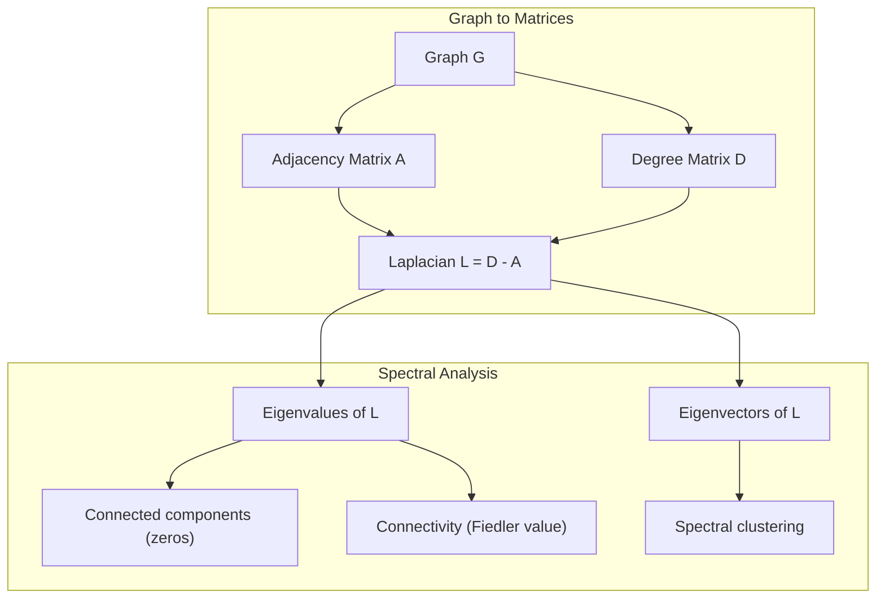
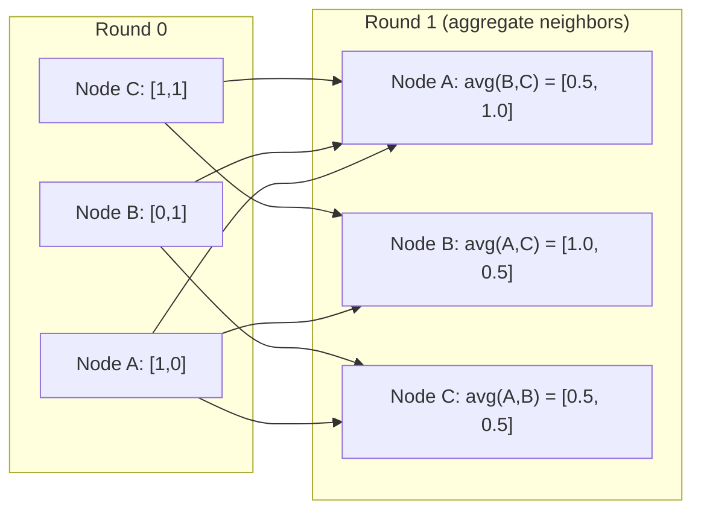

# Théorie des graphiques pour l'apprentissage automatique

> Les graphiques sont la structure des données des relations. Si vos données ont des connexions, vous avez besoin de la théorie des graphiques.
> Si vos données sont connectées, vous avez besoin de diagrammes.

**Type:** Build | **类型:** 动手
**Language:**Je suis un Python .**语言:**Python
**Prerequisites:** Phase 1, Lessons 01-03 (linear algebra, matrices) | **前置知识:** Phase 1, 第 01-03 课（线性代数、矩阵）
**Time:** ~90 minutes | **时间:** ~90 分钟

## Objectifs d'apprentissage

- Construire une classe de graphes avec des représentations de matrice/liste adjacentes et mettre en œuvre des traverses BFS et DFS
  construire avec des matrices/listes voisines représentant des types, réaliser BFS et DFS 
- Compute le graphe Laplacien et utilise ses valeurs propres pour détecter les composants connectés et les nœuds de cluster
  計算图拉普拉斯矩阵(Graphe Laplacien) et utilise ses caractéristiques pour le contrôle de la fraction et du point de concentration
- Implémenter une ronde de message de style GNN passant comme une matrice d'adjacence normalisée
  实现一轮 GNN 风格的消息传递归归归归归归归归归归邻矩阵乘法
- Appliquer le regroupement spectrale pour partager un graphique en utilisant le vecteur Fiedler
  应用谱聚类(Spectral Clustering) à l'aide de Fiedler 向量划分图


> **【中文解读】**
> Le réseau social, la structure moléculaire, le schéma de connaissance sont des diagrammes. Le message transmis par le GNN est en fait le schéma de multiplication de la matrice voisine.

## Le problème , l' introduction du problème

Les réseaux sociaux, les molécules, les bases de connaissances, les réseaux de citations, les cartes routières, tout cela sont des graphiques. La méthode ML traditionnelle traite les données comme des tables plates. Chaque ligne est indépendante. Chaque fonctionnalité est une colonne. Mais quand la structure des connexions compte, les tables échouent.

> Les données sont considérées comme des données simples, indépendantes, mais lorsque la structure de connexion est importante, les données sont déstabilisées.

Considérez un réseau social. Vous voulez prédire quel produit un utilisateur achètera. Son historique d'achat compte. Mais l'historique d'achat de ses amis compte plus. Les connexions portent un signal.

> 考虑社交网络――你想预测用户会买什么产品―― leur histoire d'achat est importante―― mais celle des amis est plus importante――连接带信号――

Ou pensez à une molécule. Vous voulez prédire si elle se lie à une protéine. Les atomes sont importants, mais ce qui compte vraiment, c'est comment les atomes sont liés les uns aux autres. La structure est les données.

> Ou pensez à la molécule. Vous pensez à prévoir si elle est liée à la protéine.

Les réseaux neuraux graphiques (GNN) sont le domaine de l'apprentissage profond qui connaît la croissance la plus rapide. Ils alimentent la découverte de médicaments, la recommandation sociale, la détection de fraude et le raisonnement graphique des connaissances.

> Les réseaux de neurones (GNN) sont les domaines les plus rapides de l'apprentissage en profondeur. Ils sont à l'origine de la découverte de médicaments, de la recommandation sociale, du dépistage de la fraude et des schémas de connaissances.

Il vous faut quatre choses:
1. Une façon de représenter les graphiques comme des matrices (pour les multiplier)
   Le diagramme indique la méthode de la matrice (à savoir la méthode de la matrice)
2. Algorithmes de traverses pour explorer la structure du graphique
   探索图结构的遍历算法
3. Le Laplacien -- la matrice la plus importante dans la théorie des graphiques spectraux
   La matrice la plus importante de la théorie du schéma de rap
4. Passage de messages - l'opération qui fait fonctionner les GNN
   消息传递使 GNN 工作的操作

## Le concept de base.

> **【中文解读】**
> Le réseau social est un élément de la structure des données. Le réseau social est un élément de la structure des données. Le réseau social est un élément de la structure des données. Le réseau social est un élément de la structure des données.

> **【拓展：图神经网络在药物发现中的突破】**
> AlphaFold2 (2020) a utilisé des diagrammes de prévision de la protéine 3D de réseau neural, résolvant le problème de la pliage des protéines du milieu biologique de 50 ans. Il a mis en place des relations spatiales entre les acides aminés restants et les résidus de l'anémie.

### Graphiques: nœuds et bords

Un graphique G = (V, E) est constitué de sommets (nœuds) V et de bords E. Chaque bord relie deux nœuds.

> 图 G = (V, E) 由顶点(节点) V 和边 E 组成──每条边连接两个节点──

**Directed vs undirected.**Dans un graphique non dirigé, bord (u, v) signifie que u se connecte à v et v se connecte à u. Dans un graphe dirigé (digraphe), bord (u, v) signifie que u pointe vers v, mais pas nécessairement l'inverse.

> **有向与无向。**Dans le diagramme,边 (u, v) signifie u 连接 v 且 v 连接 u──

**Weighted vs unweighted.**Dans un graphique non pondéré, les bords existent ou non. Dans un graphique pondéré, chaque bord a un poids numérique - une distance, un coût, une force.

> **加权与无权。**Dans le diagramme sans autorité, le bord doit exister ou non. Dans le diagramme de puissance ajoutée, chaque bord doit avoir une valeur numérique de puissance.

| Graph type | Example |
|-----------|---------|
| Undirected, unweighted | Facebook friendship network |
| Directed, unweighted | Twitter follow network |
| Undirected, weighted | Road map (distances) |
| Directed, weighted | Web page links (PageRank scores) |

### La matrice d'adjacence

La matrice d'adjacence A est la représentation du noyau. Pour un graphique avec n n nodes:

> 邻接矩阵(Adjacency Matrix) A est le centre de la représentation──

```
A[i][j] = 1    if there is an edge from node i to node j
A[i][j] = 0    otherwise
```

Pour les graphiques non dirigés, A est symétrique: A[i][j] = A[j][i]. Pour les graphiques pondérés, A[i][j] = poids de bord (i, j).

> Pour le libre-échange, A est pour le titre: A[i][j] = A[j][i]。 Pour le plus de pouvoir, A[i][j] = 边 (i, j) = 边 (i, j) 的权重──

**Example -- a triangle:**

```
Nodes: 0, 1, 2
Edges: (0,1), (1,2), (0,2)

A = [[0, 1, 1],
     [1, 0, 1],
     [1, 1, 0]]
```

La matrice d'adjacence est l'entrée de chaque GNN. Les opérations de la matrice sur A correspondent aux opérations sur le graphique.

> La matrice voisine est l'entrée de chaque GNN.

> **【中文解读】**
> Le nombre de voies de la ligne d'accès à la ligne de l'accès à la ligne de référence est le nombre de voies de la ligne d'accès à la ligne de référence.

### Diplôme

Le degré d'un nœud est le nombre de bords qui y sont connectés. Pour les graphiques dirigés, vous avez des degrés in-grade (bords entrant) et out-grade (bords sortant).

> Le degré de l'entrée est le degré de sortie, le degré de sortie est le degré de sortie.

La matrice de degrés D est diagonale:

> La matrice de degré est la matrice de l'angle.

```
D[i][i] = degree of node i
D[i][j] = 0    for i != j
```

Pour l'exemple du triangle: D = diag(2, 2, 2) parce que chaque nœud se connecte à deux autres.

Le degré vous indique l'importance des nœuds. Le degré élevé = nœud de hub. La distribution des degrés d'un réseau révèle sa structure. Les réseaux sociaux suivent les lois de puissance (peu de nœuds, beaucoup de nœuds de feuilles). Les graphiques aléatoires ont des degrés distribués par Poisson.

> 库告诉你节点重要性──高度 = 枢纽节点──网络的度分布揭示其结构──社交网络遵循律──少数枢纽,大量叶节点──随机图的度从泊松分布──

### BFS et DFS

Les deux algorithmes de traversage de graphes fondamentaux.

> Il y a deux types de processus de calcul.

**Breadth-First Search (BFS):**Explorez tous les voisins d'abord, puis les voisins des voisins.

> **广度优先搜索（BFS）：**Il faut d'abord explorer tous les voisins, puis les voisins de tous les voisins.

```
BFS from node 0:
  Visit 0
  Queue: [1, 2]        (neighbors of 0)
  Visit 1
  Queue: [2, 3]        (add neighbors of 1)
  Visit 2
  Queue: [3]           (neighbors of 2 already visited)
  Visit 3
  Queue: []            (done)
```

Le BFS trouve les chemins les plus courts dans les graphiques non pondérés. La distance entre le début et un nœud équivaut au niveau du BFS auquel ce nœud est découvert pour la première fois. C'est pourquoi le BFS est utilisé pour les distances de compte hop dans les réseaux sociaux.

> BFS trouve le chemin le plus court dans les diagrammes sans autorité. La distance entre le point de départ et tout nœud est égale au niveau BFS de la première découverte du nœud. C'est pourquoi BFS utilise la distance de saut dans les réseaux sociaux.

**Depth-First Search (DFS):**Faites le plus profond possible avant de revenir en arrière.

> **深度优先搜索（DFS）：**尽可能深入再回溯──使用(后进先出) ou encore

```
DFS from node 0:
  Visit 0
  Stack: [1, 2]        (neighbors of 0)
  Visit 2               (pop from stack)
  Stack: [1, 3]         (add neighbors of 2)
  Visit 3               (pop from stack)
  Stack: [1]
  Visit 1               (pop from stack)
  Stack: []             (done)
```

Le DFS est utile pour:
- Trouver les composants connectés (exécuter DFS à partir de nœuds non visités)
  寻找连通分量(从未访问节点运行 DFS)
- Détection du cycle (marges arrières dans l'arbre DFS)
  环检测(DFS 树中的后向边)
- Sortement topologique (ordre de finition inverse du DFS)
  拓排序(DFS 完成顺序的逆序)

| Algorithm | Data structure | Finds | Use case |
|-----------|---------------|-------|----------|
| BFS | Queue | Shortest paths | Social network distance, knowledge graph traversal |
| DFS | Stack | Components, cycles | Connectivity, topological sort |

### Le graphe laplacien

L = D - A. La matrice la plus importante dans la théorie des graphiques spectraux.

> L = D - A。 la plus importante de la théorie du tableau

Pour le triangle:

```
D = [[2, 0, 0],    A = [[0, 1, 1],    L = [[2, -1, -1],
     [0, 2, 0],         [1, 0, 1],         [-1, 2, -1],
     [0, 0, 2]]         [1, 1, 0]]         [-1, -1,  2]]
```

Le Laplacien possède des propriétés remarquables:

> La matrice de raplas a une nature exceptionnelle:

1. **L is positive semi-definite.**Toutes les valeurs propres sont >= 0.

> 1. **L 是半正定的。**Toutes les caractéristiques >= 0

2. **The number of zero eigenvalues equals the number of connected components.**Un graphique connecté a exactement une valeur propre zéro. Un graphique avec 3 composants déconnectés a trois valeurs propres zéro.

> 2. **零特征值的个数等于连通分量的个数。**Il y a trois valeurs de caractères.

3. **The smallest non-zero eigenvalue (Fiedler value) measures connectivity.**Une grande valeur Fiedler signifie que le graphique est bien connecté. une petite valeur Fiedler signifie que le graphique a un point faible - un goulet d'étranglement.

> 3. **最小非零特征值（Fiedler 值）衡量连通性。**La valeur de fiedler signifie grand et bien connecté.

4. **The eigenvector of the Fiedler value (Fiedler vector) reveals the best split.**Les nœuds avec des valeurs positives vont dans un groupe, les nœuds avec des valeurs négatives vont dans l'autre.

> 4. **Fiedler 值对应的特征向量（Fiedler 向量）揭示最佳划分。**Les nœuds de valeur normale sont classés en un groupe, les nœuds de valeur négative sont classés en un autre groupe.

> **【中文解读】**
> 图拉普拉斯 L = D - A est la plus importante matrice de la théorie du diagramme. Elle a quatre caractéristiques clés: 1) 半正定; 2) 零特征值个数 = 连通分量个数; 3) 最小非零特征值 (Fiedler 值) mesure la connectivité越大越紧密; 4) Le nombre négatif de la masse du fiedler se divise automatiquement en deux.



### Propriétés spectrales

Les valeurs propres de la matrice adjacente et du Laplacien révèlent des propriétés structurelles sans aucune traversée.

> La valeur des caractéristiques des matrices voisines et des matrices rapprochées n'a pas besoin d'être traversée pour révéler la structure de la matrice.

**Spectral clustering**fonctionne comme ceci:
1. Compute le Laplacien L
   计算拉普拉斯矩阵 L
2. Trouvez les plus petits vecteurs propres de L (sautez le premier, qui est tous-un pour les graphiques connectés)
   找到 L's k 个最小特征向量(跳过第一个,连通图中它是全1向量)
3. Utilisez ces propres vecteurs comme nouvelles coordonnées pour chaque nœud
   Ces caractéristiques seront utilisées comme un nouveau symbole de chaque nœud.
4. Exécutez des k-média sur ces coordonnées
   Dans ces couloirs, on va à la ronde.

Pourquoi cela fonctionne-t-il ? Les propres vecteurs de L codent les fonctions " les plus lisses " du graphique. Les nœuds bien connectés obtiennent des valeurs propres similaires. Les nœuds séparés par un goulet d'étranglement obtiennent des valeurs différentes. Les propres vecteurs séparent naturellement des grappes.

> Pourquoi est-il efficace?L'élément de courant de caractère est codé par la fonction "le plus lisse" sur le diagramme. Un bon nœud de connexion obtient une valeur de courant de caractère similaire.

**Random walk connection.**Le Laplacien normalisé se rapporte à des promenades aléatoires sur le graphique. La répartition stationnaire d'une marche aléatoire est proportionnelle au degré de nœud. Le temps de mélange (la rapidité avec laquelle la marche converge) dépend de l'écart spectrique.

> **随机游走联系。**La fréquence de la fréquence de l'écart de l'écart spectrique est déterminée par la fréquence de l'écart spectrique.

### Le message est passé

Le fonctionnement principal des réseaux neuraux graphiques. Chaque nœud collecte des messages de ses voisins, les agrégera et met à jour son propre état.

> 图神经网络的核心操作── chaque nœud de son voisin recueille des informations, les regroupe, et renouvelle son propre état──

```
h_v^(k+1) = UPDATE(h_v^(k), AGGREGATE({h_u^(k) : u in neighbors(v)}))
```

Dans la forme la plus simple, AGGREGATE = moyenne et UPDATE = transformation linéaire + activation:

```
h_v^(k+1) = sigma(W * mean({h_u^(k) : u in neighbors(v)}))
```

C'est la multiplication de matrice déguisée. Si H est la matrice de toutes les caractéristiques du nœud et A est la matrice d'adjacence:

```
H^(k+1) = sigma(A_norm * H^(k) * W)
```

où A_norm est la matrice d'adjacentité normalisée (chaque ligne s'élève à 1).

Une ronde de message de passage permet à chaque nœud de "voir" ses voisins immédiats. Deux rondes lui permettent de voir les voisins des voisins.

> **【拓展：消息传递与 GNN 架构演进】**
> GCN (Kipf & Welling, 2017) est le plus simple des messages GNN: chaque niveau fait une fois de même dans le voisinage de la matrice de multiplication + 线性变换. GAT (Veličković et coll., 2018) 引入注意力机制让节点学习邻居的重要性权重.



### Concepts et applications de l'équipement

| Concept | ML Application |
|---------|---------------|
| Adjacency matrix | GNN input representation |
| Graph Laplacian | Spectral clustering, community detection |
| BFS/DFS | Knowledge graph traversal, path finding |
| Degree distribution | Node importance, feature engineering |
| Message passing | GNN layers (GCN, GAT, GraphSAGE) |
| Eigenvalues of L | Community detection, graph partitioning |
| Spectral clustering | Unsupervised node grouping |
| PageRank | Node importance, web search |

> 概念与 ML 应用对照:邻接矩阵(GNN 输入表示) 图拉普拉斯(谱聚类、社区检测) 、BFS/DFS(知识图谱遍历、路径查找) 度分布(节点重要性、特征工程) 、消息传递(GNN 层 GCN/GAT/GraphSAGE) 、L 的特征值(社区检测聚图、划分) 、谱类(无监督节点分组) 、PageRank(节点重要性、Web 搜索) ⋅

## Construisez-le et mettez-le en œuvre.
```figure
graph-degree-distribution
```

## Faites-le

### Étape 1: Classement de graphique à partir de zéro

```python
class Graph:
    def __init__(self, n_nodes, directed=False):
        self.n = n_nodes
        self.directed = directed
        self.adj = {i: {} for i in range(n_nodes)}

    def add_edge(self, u, v, weight=1.0):
        self.adj[u][v] = weight
        if not self.directed:
            self.adj[v][u] = weight

    def neighbors(self, node):
        return list(self.adj[node].keys())

    def degree(self, node):
        return len(self.adj[node])

    def adjacency_matrix(self):
        import numpy as np
        A = np.zeros((self.n, self.n))
        for u in range(self.n):
            for v, w in self.adj[u].items():
                A[u][v] = w
        return A

    def degree_matrix(self):
        import numpy as np
        D = np.zeros((self.n, self.n))
        for i in range(self.n):
            D[i][i] = self.degree(i)
        return D

    def laplacian(self):
        return self.degree_matrix() - self.adjacency_matrix()
```

La liste des adjacents (`self.adj`La conversion de matrice d'adjacence utilise numpy parce que toutes les opérations spectrales en ont besoin.

> 邻接表`self.adj`) High Efficiency Storage Neighbourhood. Neighbourhood Ratio Conversion utilisation numpy, parce que tous les opérations de la liste ont besoin de lui.

### Étape 2: BFS et DFS

```python
from collections import deque

def bfs(graph, start):
    visited = set()
    order = []
    distances = {}
    queue = deque([(start, 0)])                     # BFS 用队列：先进先出
    visited.add(start)
    while queue:
        node, dist = queue.popleft()                # 取出队列头部的节点
        order.append(node)
        distances[node] = dist                      # 距离 = BFS 层级（最短路径）
        for neighbor in graph.neighbors(node):
            if neighbor not in visited:
                visited.add(neighbor)
                queue.append((neighbor, dist + 1))  # 邻居距离 +1
    return order, distances


def dfs(graph, start):
    visited = set()
    order = []
    stack = [start]
    while stack:
        node = stack.pop()
        if node in visited:
            continue
        visited.add(node)
        order.append(node)
        for neighbor in reversed(graph.neighbors(node)):
            if neighbor not in visited:
                stack.append(neighbor)
    return order
```

BFS utilise une déque (coupe double) pour O(1) pop-left. DFS utilise une liste comme une pile. Les deux visiter chaque nœud exactement une fois - O(V + E) temps.

> BFS Utilisez deque(双端队列) réaliser O(1) pop-left;DFS Utilisez la liste 当──两者都恰好访问每个节点一次时间复杂度 O(V+E)。

### Étape 3: Les composants connectés et les valeurs propres laplaciennes

```python
def connected_components(graph):
    visited = set()
    components = []
    for node in range(graph.n):
        if node not in visited:
            order, _ = bfs(graph, node)
            visited.update(order)
            components.append(order)
    return components


def laplacian_eigenvalues(graph):
    import numpy as np
    L = graph.laplacian()
    eigenvalues = np.linalg.eigvalsh(L)
    return eigenvalues
```

`eigvalsh`est pour les matrices symétriques -- le Laplacien est toujours symétrique pour les graphiques non dirigés. Il renvoie les valeurs propres dans l'ordre ascendant.

> `eigvalsh`Le matrix de rapraise est généralement matrix de rapraise. Il revient à la valeur des caractéristiques de départ.

### Étape 4: Clusterage spectrique

```python
def spectral_clustering(graph, k=2):
    import numpy as np
    L = graph.laplacian()                           # 计算图拉普拉斯矩阵 L = D - A
    eigenvalues, eigenvectors = np.linalg.eigh(L)   # 特征分解（对称矩阵用 eigh）
    features = eigenvectors[:, 1:k+1]               # 取第 2 到 k+1 个特征向量（跳过第一个全 1 向量）

    labels = np.zeros(graph.n, dtype=int)
    for i in range(graph.n):
        if features[i, 0] >= 0:                     # Fiedler 向量 >= 0 → 簇 A
            labels[i] = 0
        else:                                       # Fiedler 向量 < 0 → 簇 B
            labels[i] = 1
    return labels
```

Pour k=2, le signe du vecteur Fiedler divise le graphique en deux graphes. Pour k>2, vous exécutez des moyens k sur les premiers vecteurs propres k (à l'exclusion du vecteur propre trivial tous-un).

> k=2 时,Fiedler 向量的符号把图分成两──k>2 时,在前 k 个特征向量上跑 k-means(跳过平凡的全1特征向量) ⋅

### Étape 5: Transmission du message

```python
def message_passing(graph, features, weight_matrix):
    import numpy as np
    A = graph.adjacency_matrix()
    row_sums = A.sum(axis=1, keepdims=True)
    row_sums[row_sums == 0] = 1
    A_norm = A / row_sums
    aggregated = A_norm @ features
    output = aggregated @ weight_matrix
    return output
```

Il s'agit d'une série de messages GNN. Les nouvelles caractéristiques de chaque nœud sont la moyenne pondérée des caractéristiques de ses voisins, transformée par la matrice de poids.

> C'est une série de messages GNN. Chaque élément de chaque élément est doté d'une nouvelle caractéristique.

## Utilisez-le avec le cadre de réalisation

Avec networkx et numpy, les mêmes opérations sont unliners:

> Avec le réseau x et numpy, le même opérateur est un code:

```python
import networkx as nx
import numpy as np

G = nx.karate_club_graph()

A = nx.adjacency_matrix(G).toarray()
L = nx.laplacian_matrix(G).toarray()

eigenvalues = np.linalg.eigvalsh(L.astype(float))
print(f"Smallest eigenvalues: {eigenvalues[:5]}")
print(f"Connected components: {nx.number_connected_components(G)}")

communities = nx.community.greedy_modularity_communities(G)
print(f"Communities found: {len(communities)}")

pr = nx.pagerank(G)
top_nodes = sorted(pr.items(), key=lambda x: x[1], reverse=True)[:5]
print(f"Top 5 PageRank nodes: {top_nodes}")
```

networkx traite des graphiques de toutes tailles avec des backends C optimisés. Utilisez-le dans la production. Utilisez votre mise en œuvre à partir de zéro pour comprendre ce qu'il fait.

> réseaux utilise le C 后端 optimisé pour traiter des images de taille quelconque.

### analyse spectrale de la nudité

```python
import numpy as np

A = np.array([
    [0, 1, 1, 0, 0],
    [1, 0, 1, 0, 0],
    [1, 1, 0, 1, 0],
    [0, 0, 1, 0, 1],
    [0, 0, 0, 1, 0]
])

D = np.diag(A.sum(axis=1))
L = D - A

eigenvalues, eigenvectors = np.linalg.eigh(L)
print(f"Eigenvalues: {np.round(eigenvalues, 4)}")
print(f"Fiedler value: {eigenvalues[1]:.4f}")
print(f"Fiedler vector: {np.round(eigenvectors[:, 1], 4)}")

fiedler = eigenvectors[:, 1]
group_a = np.where(fiedler >= 0)[0]
group_b = np.where(fiedler < 0)[0]
print(f"Cluster A: {group_a}")
print(f"Cluster B: {group_b}")
```

Le vecteur Fiedler fait le gros du travail. Les entrées positives dans un groupe, négatives dans l'autre. Aucune optimisation itérative n'est nécessaire - juste une propre composition.

## Envoyez-le . Produit .

Cette leçon donne:
- `outputs/skill-graph-analysis.md`-- une référence de compétence pour l'analyse des données structurées par graphique

## Les liens concept

| Concept | Where it shows up |
|---------|------------------|
| Adjacency matrix | GCN, GAT, GraphSAGE input |
| Laplacian | Spectral clustering, ChebNet filters |
| BFS | Knowledge graph traversal, shortest path queries |
| Message passing | Every GNN layer, neural message passing |
| Spectral gap | Graph connectivity, mixing time of random walks |
| Degree distribution | Power-law networks, node feature engineering |
| Connected components | Preprocessing, handling disconnected graphs |
| PageRank | Node importance ranking, attention initialization |

Les GNN méritent une mention spéciale. L'opération de convolutions de graphes dans GCN (Kipf & Welling, 2017) utilise la matrice d'adjacence avec des boucles auto-ajoutées, A_hat = A + I:

```text
H^(l+1) = sigma(D_hat^(-1/2) * A_hat * D_hat^(-1/2) * H^(l) * W^(l))
```

où A_hat = A + I (adjacence plus auto-loops) et D_hat est la matrice de degrés de A_hat. Les boucles autonomes assurent que chaque nœud inclut ses propres caractéristiques lors de l'agrégation. C'est exactement le message qui passe avec une normalisation symétrique. D_hat^(-1/2) * A_hat * D_hat^(-1/2) est la matrice d'adjacence normalisée. Le Laplacien apparaît parce que cette normalisation est liée à L_sym = I - D^(-1/2) * A * D^(-1/2). Comprendre le Laplacien signifie comprendre pourquoi les GCN fonctionnent.

> GNN 值得特别说明。GCN(Kipf & Welling, 2017) 图卷积用加自环的邻属矩阵 A_hat = A + I:H^(l+1) = σ(D_hat^(-1/2) A_hat D_hat^(-1/2) H^(l) W^(l))。自环让每个节点聚合时包含自身特征──这就是对称归结的消息传递──理解拉普拉斯阵阵 =理解GCN 为何有效──

## Les exercices

1. **Implement PageRank from scratch.**Commencez par des scores uniformes. À chaque étape: score(v) = (1-d) /n + d * somme(score(u) /out_degree(u)) pour tous les u pointant vers v. Utilisez d=0,85.

2. **Find communities using spectral clustering.**Créer un graphique avec deux grappes clairement séparées (par exemple, deux cliques reliés par un seul bord). Exécuter le regroupement spectrale et vérifier qu'il trouve la bonne fraction. Que se passe-t-il lorsque vous ajoutez plus de bordes croisées?

3. **Implement Dijkstra's algorithm**Pour les traces les plus courtes dans les graphiques pondérés, comparez les résultats avec BFS sur le même graphique avec des poids uniformes.

4. **Build a 2-layer message passing network.**Appliquez un message qui passe deux fois avec des matrices de poids différentes. Montrez qu'après 2 tours, chaque nœud a des informations de son voisinage de 2 tours.

5. **Analyze a real-world graph.**Utilisez le graphique du Karate Club (34 nœuds, 78 bords). Comptez la répartition des degrés, les valeurs propres de Laplace et le regroupement spectrique. Comparer le résultat du regroupement spectrique avec la fraction de vérité de la terre connue.

## Les termes clés

| Term | What people say | What it actually means |
|------|----------------|----------------------|
| Graph | "Nodes and edges" | A mathematical structure G=(V,E) encoding pairwise relationships |
| Adjacency matrix | "The connection table" | An n x n matrix where A[i][j] = 1 if nodes i and j are connected |
| Degree | "How connected a node is" | The number of edges touching a node |
| Laplacian | "D minus A" | L = D - A, the matrix whose eigenvalues reveal graph structure |
| Fiedler value | "The algebraic connectivity" | The smallest non-zero eigenvalue of L, measuring how well-connected the graph is |
| BFS | "Level-by-level search" | Traversal that visits all neighbors before going deeper, finds shortest paths |
| DFS | "Go deep first" | Traversal that follows one path to its end before backtracking |
| Message passing | "Nodes talk to neighbors" | Each node aggregates information from its neighbors, the core of GNNs |
| Spectral clustering | "Cluster by eigenvectors" | Partition a graph using eigenvectors of its Laplacian |
| Connected component | "A separate piece" | A maximal subgraph where every node can reach every other node |

> 术语速查:Graph(图 G=(V,E))、Adjacency matrix(邻接矩阵 A[i][j]=1 表示 i、j 连接)、Degree(度,节点连接的边数)、Laplacien(拉普拉斯 L=D-A)、Fiedler value(最小非零特征值,代数连通性)、BFS(广度优先,按层遍历)、DFS深度 priority,走到底再回溯)、Message passage(消息传递,GNN 核心)、Spectral clustering using拉普拉斯特征向量聚类)、Connected component(连通量)、

## Encore une lecture

- **Kipf & Welling (2017)**-- "Classification semi-surveillée avec des réseaux convolutifs graphiques". Le document qui a lancé les GNN modernes.
- **Spielman (2012)**-- notes de conférence sur la théorie des graphes spectraux. L'introduction définitive aux Laplaciens, aux lacunes spectrales et à la partition des graphes.
- **Hamilton (2020)**-- "L'apprentissage de la représentation graphique". Livre couvrant les GNN des fondamentaux aux applications.
- **Bronstein et al. (2021)**-- "L'apprentissage géométrique en profondeur: réseaux, groupes, graphiques, géodésiques et gauges". Le document de cadre unificateur.
- **Veličković et al. (2018)**-- "Graph Attention Networks". Élargit le message passé avec des mécanismes d'attention.
