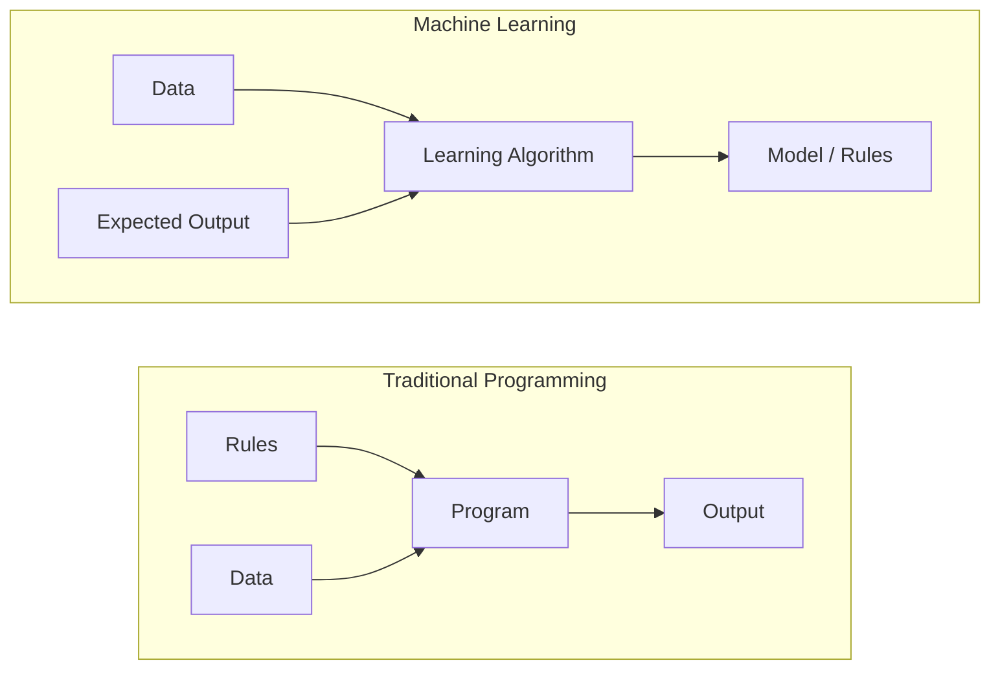
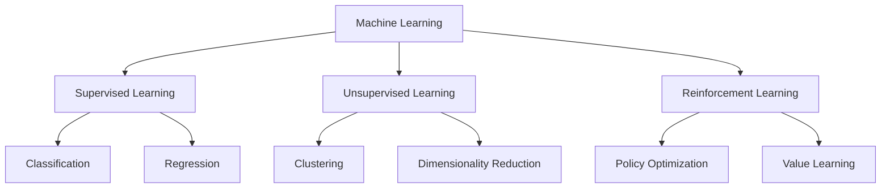
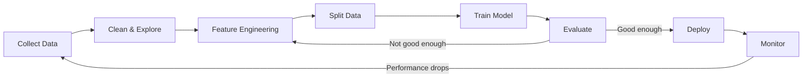
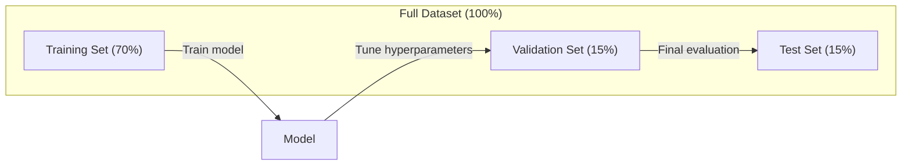
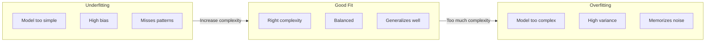
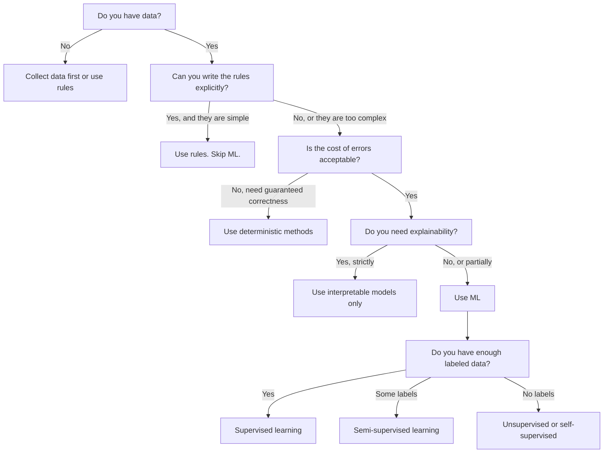

# Ce qu'est l'apprentissage automatique
# Qu'est-ce que le mécanisme d'apprentissage ?


> L'apprentissage automatique enseigne aux ordinateurs à trouver des modèles dans les données au lieu d'écrire des règles à la main.

> L'apprentissage automatique est l'enseignement de la loi de la découverte de données par ordinateur, et non par des règles de rédaction artificielle.

**Type:** Learn | **类型：** 学习
**Languages:** Python
**Prerequisites:** Phase 1 (Math Foundations) | **前置知识：** Phase 1（数学基础）
**Time:** ~45 minutes | **时间：** 约 45 分钟

## Objectifs d'apprentissage

- Expliquez la différence entre l'apprentissage supervisé, non supervisé et renforcé et identifiez le type d'apprentissage qui s'applique à un problème donné
  解释监督学习、无监督学习和强化学习之间的区别,并判断给给定问题适用于哪种类型
- Implémenter un classifiateur centroid le plus proche à partir de zéro et l'évaluer par rapport à une ligne de base aléatoire
  La mise en œuvre de la classification de qualité récente, et l'évaluation comparative avec la base de données
- Distinguer les tâches de classification et de régression et sélectionner la fonction de perte appropriée pour chacune
  区分分类和归归任务, pour chaque tâche choisir la fonction de perte appropriée
- Évaluer si un problème d'entreprise donné est adapté à la ML ou mieux résolu par des règles déterministes
   évaluer si un problème d'entreprise est adapté à la solution de la gestion des risques ou mieux à l'aide de règles de détermination


> **【中文解读】**
> L'apprentissage automatique est de faire en sorte que l'ordinateur apprenne automatiquement des données, et non pas à partir de règles de rédaction artificielle.

> **【拓展：机器学习范式的产业应用】**
> GPT-4 Utilisation de l'auto-surveillance pour apprendre à jouer à la carte de joueur de jeu.

## Le problème , l' introduction du problème

Vous voulez créer un filtre à spam. L'approche traditionnelle: vous asseoir et écrire des centaines de règles. "Si le courrier électronique contient 'FREE MONEY', marquez-le comme spam. Si il a plus de 3 marques d'exclamation, marquez-le comme spam". Vous passez des semaines à écrire des règles. Alors les spammeurs changent leur libellé. Vos règles se cassent. Vous écrivez plus de règles. Le cycle ne se termine jamais.

> Tu veux construire un filtre à spam. La méthode traditionnelle est de s'asseoir et d'écrire des centaines de règles. " Si un message contient de l'argent gratuit, marque-le comme spam. Si plus de trois signes, marque-le comme spam. " Tu as passé quelques semaines à écrire des règles.

L'apprentissage automatique renverse cela. Au lieu d'écrire des règles, vous donnez à l'ordinateur des milliers de courriels étiquetés ("spam" ou "non spam") et laissez-le déterminer les règles par lui-même. L'ordinateur trouve des modèles que vous n'auriez jamais pensé. Lorsque les spammeurs changent de tactique, vous vous entraînez sur de nouvelles données au lieu de réécrire du code.

> L'apprentissage automatique a bouleversé cette façon. Vous n'écrivez pas de règles, mais donnez à un ordinateur des milliers de bons messages marqués. Laissez-le trouver lui-même des règles. L'ordinateur peut trouver un modèle que vous n'avez jamais imaginé. Lorsque l'expéditeur de spam change de stratégie, vous devez simplement vous entraîner sur de nouvelles données, plutôt que de réécrire le code.

Ce changement de " règles de programmation " à " apprendre à partir de données " est le cœur de l'apprentissage automatique.

> Le passage des " règles de programmation " à " l'apprentissage dans les données " est au cœur de l'apprentissage automatique.

> **【中文解读】**
> Le programme traditionnel est "personnaliser les règles, les machines les exécuter"; machine learning est "personnaliser les données, les machines se découvrir les règles"[6].

> **【拓展：垃圾邮件过滤的演进】**
> Le filtre de spam de Gmail traite environ 3 milliards de messages par jour, un taux de précision supérieur à 99,9%.

## Le concept de base.

### Apprendre des données, pas des règles

La programmation traditionnelle et l'apprentissage automatique résolvent les problèmes dans des directions opposées.

> Le programme traditionnel et l'apprentissage automatique résolvent les problèmes dans le sens inverse.



La programmation traditionnelle: vous écrivez les règles. Le programme les applique aux données pour produire des sorties.

> Tradition de programmation: vous écrivez des règles.

L'apprentissage automatique: vous fournissez des données et des résultats attendus. L'algorithme découvre les règles.

> 机器学习:你提供数据和期望输出――algorithme automatiquement trouver les règles――

Le "modèle" qui découle de l'entraînement est les règles, codées en nombre (poids, paramètres).

> Le modèle produit par l'entraînement est la règle elle-même, codée sous forme numérique, elle peut se généraliser à partir d'échantillons déjà vus, pour faire des prévisions sur de nouveaux données jamais vues.

> **【中文解读】**
> La différence de nature entre le programme traditionnel et l'apprentissage automatique: le programme traditionnel entre " règles + données " et " sortie "; le modèle " règles " et " règles " sont les règles du code numérique (les " poids et les paramètres "), il peut faire des prévisions sur les nouvelles données jamais vues.

### Les trois types d'apprentissage automatique



**Supervised Learning**Le modèle apprend à cartographier les entrées aux sorties.
- "Voici 10 000 photos avec des étiquettes de chat ou de chien.
- "Voici les caractéristiques et les prix de la maison.

> **监督学习**Vous avez des données d'entrée-sortie pour le modèle de formation.
> - "Il y a ici 10 000 photos de chats ou de chiens qui sont marquées.
> - " Ici il y a des caractéristiques et des prix. "

**Unsupervised Learning**Il n'y a pas d'étiquettes, le modèle trouve sa structure.
- "Voici 10 000 historiques d'achats des clients.
- "Voici 1000 points de données dimensionnels, réduisez à 2 dimensions tout en conservant la structure".

> **无监督学习**Vous n'avez qu'une seule entrée, aucun label.
> - "Il y a 10 000 clients qui achètent des produits.
> - "Il y a ici 1000 points de données de dimensiones.

**Reinforcement Learning**Un agent prend des mesures dans un environnement et reçoit des récompenses ou des pénalités.
- " Jouez à ce jeu. +1 pour gagner, -1 pour perdre. Déterminez une stratégie. "
- "Contrôle ce bras robot. +1 pour le dépôt de l'objet, -0,01 pour chaque seconde gaspillée".

> **强化学习**Il apprend une stratégie (politique) pour maximiser le total des récompenses (récompenses).
> - " Jouer ce jeu. Gagner +1, perdre -1... trouver une stratégie. "
> - "Contrôle ce bras mécanique. "C'est un gain de main de plus de 1 pour chaque seconde.

La plupart de ce que vous allez construire en pratique utilise l'apprentissage supervisé. L'apprentissage non supervisé est courant pour le préprocessage et l'exploration.

> En pratique, la plupart des systèmes que vous construisez utilisent le contrôle de l'apprentissage.

> **【拓展：三种范式在真实系统中的分工】**
> Netflix 推系统同时使用三种范式:协同过(无监督聚类用户群体) 监督学习(预测用户对电影的评分 1-5 星) 强化学习(A/B 测试选择最优推策略) ;;Tesla Autopilot 使用监督学习(目标检测) + 强化学习(路径规划) ;;Stable Diffusion 训练涉及自监督(图像文本对学习 CLIP) + 监督微调;;

### Au-delà des trois grands

Les trois catégories ci-dessus sont propres, mais la méthode de calcul réel brouille souvent les lignes.

> Les trois catégories sont très claires, mais la réalité du monde réel est souvent déformée.

**Semi-supervised learning**Il utilise un petit ensemble de données étiquetées et un grand ensemble de données non étiquetées. Vous pouvez avoir 100 images médicales étiquetées et 100 000 non étiquetées.

> **半监督学习**Utilisez une petite quantité de données de marquage et une grande quantité de données non marquées. Vous pouvez avoir 100 images médicales et 100 000 images non marquées.

- **Label propagation:**Construisez un graphique reliant des points de données similaires. Les étiquettes se propagent des nœuds étiquetés aux voisins non étiquetés à travers le graphique.
  **标签传播：**Construire une connexion similaire à un point de données.
- **Pseudo-labeling:**Exercez un modèle sur les données étiquetées, utilisez-le pour prédire les étiquettes pour les données non étiquetées, puis reprenez-les.
  **伪标签：**Dans le modèle d'entraînement sur les données de marquage, il prévoit les données non marquées sur les données de marquage, puis il se réentraîne sur toutes les données.
- **Consistency regularization:**Le modèle doit donner la même prédiction pour une entrée et une version légèrement perturbée de cette entrée.
  **一致性正则化：**Le modèle devrait donner la même prédiction à l'entrée et à sa version légèrement perturbée.

**Self-supervised learning**Le modèle crée sa propre tâche de prédiction à partir de la structure des données.

> **自监督学习**Il n'est pas nécessaire de créer de signalisation artificielle.

- **Masked language modeling (BERT):**Cacher 15% des mots dans une phrase, entraîner le modèle à prédire les mots manquants.
  **掩码语言建模（BERT）：**15% des mots de la phrase sont "labels" provenant du texte original.
- **Contrastive learning (SimCLR):**Prenez une image, créez deux versions augmentées.
  **对比学习（SimCLR）：**取一张图像, créer deux versions améliorées.
- **Next-token prediction (GPT):**Prédire le prochain mot en tenant compte de tous les mots précédents.
  **下一 token 预测（GPT）：**给定前面所有词,预测下一个词―― chaque texte est devenu un modèle de formation――

> **【拓展：自监督学习如何驱动大模型革命】**
> Les données de formation de GPT-4 sont d'environ 13 milliards de tokens, si l'étiquetage artificiel est impossible.

Il s'agit d'une stratégie qui combine des idées supervisées et non supervisées. L'apprentissage autosuffisant est techniquement supervisé (le modèle prédit quelque chose), mais les étiquettes sont générées automatiquement, pas par des humains.

> Elles ne sont pas des nouvelles catégories séparées des trois grandes catégories. Elles sont des stratégies combinées de la surveillance et de l'esprit de non-surveillance.

### Classification par rapport à régression

Ce sont les deux principales tâches d'apprentissage supervisé.

> C'est le principal des deux tâches de supervision.

| Aspect | Classification | Regression |
|--------|---------------|------------|
| Output | Discrete categories | Continuous numbers |
| Example | "Is this email spam?" | "What will the house price be?" |
| Output space | {cat, dog, bird} | Any real number |
| Loss function | Cross-entropy, accuracy | Mean squared error, MAE |
| Decision | Boundaries between classes | A curve that fits the data |

| 方面 | 分类 | 回归 |
|------|------|------|
| 输出 | 离散类别 | 连续数值 |
| 示例 | "这封邮件是垃圾邮件吗？" | "房价会是多少？" |
| 输出空间 | {猫, 狗, 鸟} | 任意实数 |
| 损失函数 | 交叉熵、准确率 | 均方误差、MAE |
| 决策方式 | 类别之间的边界 | 拟合数据的曲线 |

La classification répond à "quelle catégorie?" la régression répond à "combien?"

> Répondre à "quels types de personnes?"

Certains problèmes peuvent être encadrés de la même manière. Prédire si une action monte ou descend est une classification. Prédire le prix exact est une régression.

> Certains problèmes peuvent être résolus de deux manières.

> **【中文解读】**
> Les classes et les revenus sont les deux principales tâches de la surveillance des cours. Les classes prédictions de la distribution des classes sont les suivantes:

### Le flux de travail de l'équipement

Chaque projet d'apprentissage automatique suit le même pipeline, indépendamment de l'algorithme.

> Chaque projet d'apprentissage automatique suit le même processus, quel que soit l'algorithme utilisé.



**Collect Data**Les données sont généralement plus importantes que la quantité.

> **收集数据**L'obtention de données originales est presque toujours meilleure, mais la qualité est plus importante que la quantité.

**Clean & Explore**: gérer les valeurs manquantes, supprimer les duplicates, visualiser les distributions, repérer les anomalies.

> **清洗与探索**Cette étape représente généralement 60 à 80% du temps total du projet.

**Feature Engineering**Les données brutes sont transformées en fonctionnalités que le modèle peut utiliser. Transformer les dates en jours de semaine. Normaliser les colonnes numériques. Encoader les variables catégoriques. Les bonnes fonctionnalités comptent plus que les algorithmes fantaisistes.

> **特征工程**Les données originales seront transformées en caractéristiques utiles pour le modèle. Les caractéristiques positives seront transformées en caractéristiques positives.

**Split Data**Les modèles sont formés sur les données de formation, les hyperparametres sont ajustés sur les données de validation et les résultats finaux sont rapportés sur les données de test.

> **划分数据**Le modèle est classé en train de suivre les données de l'essai, vous réglez les superparamètres sur les données de l'essai, vous rapportez les performances finales sur les données de l'essai.

**Train Model**L'algorithme ajuste les paramètres internes pour minimiser une fonction de perte.

> **训练模型**:将训练数据输入算法――算法调整内部参数以最小化损失函数――

**Evaluate**Si les performances ne sont pas acceptables, retournez et essayez différentes fonctionnalités, algorithmes ou hyperparametres.

> **评估**Si les performances sont inacceptables, essayez de différencier les caractéristiques, les algorithmes ou les superparamètres.

**Deploy**: mettre le modèle en production où il fait des prédictions sur de nouvelles données.

> **部署**Le modèle sera mis en production, les données nouvelles seront prélevées.

**Monitor**: Suivre les performances au fil du temps. Les distributions de données changent (drift de données) et les modèles se dégradent.

> **监控**Le modèle se détériore lorsqu'il est en baisse de performance, il est réentraîné.

### Formation, validation et épreuves partagées

C'est le concept le plus important que les débutants se trompent. Vous devez évaluer votre modèle sur des données qu'il n'a jamais vues lors de l'entraînement. Sinon, vous mesurez la mémorisation, pas l'apprentissage.

> C'est le concept le plus important que les débutants puissent commettre. Vous devez évaluer le modèle sur des données jamais vues pendant la formation. Sinon, vous mesurez la capacité de mémoire, et non l'apprentissage.



| Split | Purpose | When used | Typical size |
|-------|---------|-----------|-------------|
| Training | Model learns from this data | During training | 60-80% |
| Validation | Tune hyperparameters, compare models | After each training run | 10-20% |
| Test | Final unbiased performance estimate | Once, at the very end | 10-20% |

| 划分 | 用途 | 使用时机 | 典型比例 |
|------|------|---------|---------|
| 训练集 | 模型从中学习 | 训练期间 | 60-80% |
| 验证集 | 调节超参数，比较模型 | 每次训练后 | 10-20% |
| 测试集 | 最终无偏性能估计 | 最后仅使用一次 | 10-20% |

Le jeu de test est sacré. Vous le regardez exactement une fois. Si vous continuez à ajuster votre modèle en fonction des performances du test, vous vous entraînez efficacement sur le jeu de test et vos chiffres rapportés sont sans signification.

> 测试集是神圣的──你只能看一次── Si vous continuez à vous entraîner sur un ensemble de tests, si vous faites des ajustements de performance en fonction du modèle de test, vos chiffres ne sont pas significatifs──

> **【中文解读】**
> Le calcul des données est l'une des erreurs les plus faciles à commettre dans le ML. Les essais sont utilisés pour l'apprentissage des paramètres, les essais sont utilisés pour la régulation des superparamètres et des modèles de sélection, les essais sont utilisés uniquement pour l'évaluation finale. Si on répéte les essais, on peut dire que l'évaluation des performances du modèle est totalement inefficace.

Pour les petits ensembles de données, utilisez la validation croisée k-fold: divisez les données en k parties, entraînez sur k-1 parties, validez sur la partie restante, tournez et obtenez des résultats moyens.

> Pour les petits ensembles de données, utilisez l'essai de décomposition:

### Sur-adaptation contre sous-adaptation



**Underfitting**Le modèle est trop simple pour capturer les modèles dans les données. Une ligne droite essayant de s'adapter à une relation courbe. L'erreur de formation est élevée. L'erreur de test est élevée.

> **欠拟合**Le modèle est trop simple, impossible à saisir dans les données.

**Overfitting**Le modèle est trop complexe et mémorise les données de formation, y compris son bruit. Une courbe mouvementée qui traverse chaque point de formation mais échoue sur de nouvelles données.

> **过拟合**Le modèle est trop complexe, il est facile de se rappeler le bruit dans les données de formation.

**Good fit**Le modèle capture des modèles réels sans mémoriser le bruit.

> **良好拟合**Le modèle capture le mode réel sans se souvenir du bruit.

> **【中文解读】**
> 欠拟合 = 模型太简单,连训练数据中的规律都没学到;过拟合 = 模型太复杂,把训练数据中的噪音都记得,遇到新数据就"露"―― un bon modèle a bien fonctionné sur les ensembles de formation et de tests―― un critère de jugement: si le taux de précision de l'entraînement est bien supérieur à celui de l'évaluation, c'est le signal typique de l'excès de précision――

Signes de surmatch:
- La précision de la formation est beaucoup plus élevée que celle de la validation
  Le taux de formation est bien supérieur à celui de vérification
- Le modèle fonctionne bien sur les données de formation mais mal sur les nouvelles données
  Le modèle a bien fonctionné sur les données d'entraînement mais ne fonctionne pas sur les nouvelles données
- L'ajout de plus de données de formation améliore les performances (le modèle était la mémorisation, pas l'apprentissage)
  增加训练数据能提升性能 (en particulier dans la mémoire plutôt que dans l'apprentissage)

> 过拟合的迹象:

Les pièces de rechange pour l'excès de montage:
- Obtenez plus de données sur la formation
  obtenir plus de données de formation
- Réduire la complexité du modèle (moins de paramètres, architecture plus simple)
  降低模型复杂度 (moins de paramètres, plus de structure simple)
- Régularisation (ajout d'une pénalité pour les poids élevés)
  Il est un peu plus fort que le temps.
- Démission (néurones aléatoires au cours de l'entraînement)
  Arrêter l'entraînement
- Arrêt précoce (arrêt de formation lorsque l'erreur de validation commence à augmenter)
  Récemment, j'ai commencé à faire des exercices.

> 过拟合的修复方法:

Les pièces de rechange pour les pièces de rechange:
- Utilisez un modèle plus complexe
  Utiliser un modèle plus complexe
- Ajouter d' autres fonctionnalités
  添加更多特征
- Réduire la régularisation
   Réduction des droits
- Le train est plus long
  训练更长时间

> 欠拟合的修复方法:

### Le commerce des variantes partielles

C'est le cadre mathématique derrière le sur-adaptation et le sous-adaptation.

> C'est le cadre mathématique derrière le sur-adaptation et le dépourvu de coïncidence.

**Bias**Un modèle linéaire a un biais élevé lorsque la relation réelle est non linéaire.

> **偏差**Les erreurs de l'hypothèse de modèle sont: lorsqu'une relation réelle est non-lineaire, le modèle de modèle est très différent.

**Variance**Une variance élevée donne des prédictions très différentes lorsqu'elle est formée sur différents sous-ensembles de données.

> **方差**Les modèles de différences de haute fréquence donnent des prévisions très différentes lors de l'entraînement sur différents ensembles de données.

| Model complexity | Bias | Variance | Result |
|-----------------|------|----------|--------|
| Too low (linear model for curved data) | High | Low | Underfitting |
| Just right | Medium | Medium | Good generalization |
| Too high (degree-20 polynomial for 10 points) | Low | High | Overfitting |

| 模型复杂度 | 偏差 | 方差 | 结果 |
|-----------|------|------|------|
| 太低（用线性模型拟合弯曲数据） | 高 | 低 | 欠拟合 |
| 恰好 | 中 | 中 | 良好泛化 |
| 太高（10 个点用 20 次多项式） | 低 | 高 | 过拟合 |

Erreur totale = Bias^2 + Variance + Bruit irréductible

> 总误差 = 偏差^2 + 方差 + incontournable de bruit

Vous ne pouvez pas réduire le bruit irréductible (c'est le hasard dans les données elles-mêmes).

> Vous ne pouvez pas réduire le bruit incontournable (c'est le cas de la données elles-mêmes)

### Il n'y a pas de théorème du déjeuner gratuit

Il n'existe pas d'algorithme unique qui fonctionne le mieux pour chaque problème. Un algorithme qui fonctionne bien sur une classe de problèmes fonctionnera mal sur une autre. C'est pourquoi les scientifiques des données essaient de multiples algorithmes et comparent les résultats.

> Aucun algorithme unique ne peut se démarquer de mieux sur tous les problèmes. Un bon algorithme sur un problème de classe se démarque de mal sur un autre. C'est la raison pour laquelle les chercheurs en données essaient de comparer les résultats de plusieurs algorithmes.

> **【拓展：没有免费午餐定理的实践意义】**
> Cette théorie nous dit: Kaggle  compétition champion presque pas seulement avec un algorithme, mais avec une méthode intégrée ((XGBoost + LightGBM + 神经网络) fusion de plusieurs modèles. Dans les projets réels, habituellement d'abord avec plusieurs types d'algorithmes pour faire une base de ligne par rapport à la logique de retour, avec le bois, la SVM, XGBoost), recéchaîner le meilleur en profondeur.

En pratique, le choix dépend de:
- Combien de données avez-vous
  Vous avez beaucoup de données
- Combien de caractéristiques il y a
  Il y a beaucoup de caractéristiques
- Que la relation soit linéaire ou non linéaire
  La relation est liée ou non liée
- Si vous avez besoin d'interprétation
  Il faut une explication
- Combien de calculs vous pouvez vous permettre
  Vous pouvez supporter combien de coûts de calcul

> Dans la pratique, la sélection dépend de:

### Quand ne pas utiliser l'apprentissage automatique

Le ML est puissant, mais pas toujours le bon outil.

> Le ML est très puissant, mais ce n'est pas toujours un outil approprié. Avant d'utiliser le modèle, demandez-vous si vous en avez vraiment besoin.

**Do not use ML when:**

> **以下情况不要使用 ML：**

- **Rules are simple and well-defined.**Le calcul des impôts, les algorithmes de tri, les conversions d'unités.
  **规则简单且明确。**税费计算、排序算法、单位转换── si vous pouvez utiliser plusieurs si 语句写完逻辑, le modèle ne fera qu'augmenter la complexité sans aucun avantage──
- **You have no data or very little data.**Il faut des exemples pour apprendre. Avec 10 points de données, vous ne pouvez pas former quoi que ce soit de significatif.
  **没有数据或数据极少。**ML 需要从样本中学习──只有10数据点,你不能训练任何有意义的东西──先收集数据──
- **The cost of being wrong is catastrophic and you need guaranteed correctness.**Le calcul médical de la posologie, le contrôle des réacteurs nucléaires, la vérification cryptographique. Les modèles ML sont probabilistiques. Ils seront parfois erronés. Si "parfois erroné" est inacceptable, utilisez des méthodes déterministes.
  **错误的代价是灾难性的且需要保证正确性。** calcul de la dose médicale  contrôle du réacteur nucléaire  codes  验证 ML 模型 est probabiliste, elles se trompent parfois  Si " parfois se trompe " est inacceptable, utilisez une méthode de détermination
- **A lookup table or heuristic solves the problem.**Si un seuil ou un tableau simple couvre 99% des cas, l'ajout de ML augmente les coûts de maintenance sans amélioration significative.
  **查找表或启发式规则就能解决问题。**Si la valeur ajoutée ou la structure simple peut couvrir 99% des situations, la maintenance supplémentaire ne fera qu'augmenter les coûts de maintenance sans amélioration substantielle.
- **You cannot explain the decision and explainability is required.**Les industries réglementées (prêts, assurances, justice pénale) exigent parfois que chaque décision soit entièrement expliquable.
  **无法解释决策但需要可解释性。**Il existe des situations où chaque décision peut être entièrement expliquée.
- **The problem changes faster than you can retrain.**Si les règles changent chaque jour et que la rééducation prend une semaine, le modèle est toujours obsolète.
  **问题变化的速度快于重训练速度。**Si les règles changent chaque jour et que la réentraînement nécessite une semaine, le modèle est toujours dépassé.

Utilisez ce diagramme de flux de décision:

> Utilisation des processus de décision suivants:



## Construisez-le et mettez-le en œuvre.
```figure
f3-learning-boundary
```

## Faites-le

Le code dans `code/ml_intro.py`Il met en œuvre un classifiateur centroid le plus proche à partir de zéro, l'algorithme ML le plus simple possible. Il démontre l'idée fondamentale: apprendre des données, puis prédire sur de nouvelles données.

> `code/ml_intro.py`Le code central a réalisé le dernier classifiateur de qualité à partir de zéro, c'est l'algorithme ML le plus simple. Il exprime le concept de la psychologie nucléaire: apprendre à partir des données, puis faire des prédictions sur les nouvelles données.

> **【中文解读】**
> Le dernier système de classification est le plus simple de l'algorithme ML: entraînement en calculant chaque classe de centre de point (en moyenne), prédiction en distribuant le nouveau échantillon au centre le plus proche. Bien que simple, il montre complètement le processus central de l'ML: adaptation (en utilisant les données) → prédiction (en utilisant les données)  évaluation (en utilisant les données)  et la ligne de base (en utilisant les données).

### Étape 1: Classificateur centroid le plus proche à partir de zéro

Le classifiateur centroid le plus proche calcule le centre (média) de chaque classe dans les données de formation. Pour prédire, il attribue chaque nouveau point à la classe dont le centre est le plus proche.

> La valeur moyenne de chaque classe dans les données de formation de référencement est de 0,00 à 0,00

```python
class NearestCentroid:
    def fit(self, X, y):
        self.classes = np.unique(y)  # 获取所有唯一类别标签
        self.centroids = np.array([
            X[y == c].mean(axis=0) for c in self.classes  # 计算每个类别的质心（均值向量）
        ])

    def predict(self, X):
        distances = np.array([
            np.sqrt(((X - c) ** 2).sum(axis=1))  # 计算每个样本到各质心的欧氏距离
            for c in self.centroids
        ])
        return self.classes[distances.argmin(axis=0)]  # 返回距离最近的质心对应的类别
```

C'est l'algorithme complet. Fit compute deux moyens. Prédiction compute des distances. Pas de descente de gradient, pas d'itération, pas d'hyperparametres.

> C'est tout l'algorithme. Il est parfait pour calculer les deux valeurs moyennes.

### Étape 2: Formation sur les données synthétiques

Nous générons un ensemble de données de classification 2D avec deux classes qui se chevauchent légèrement.

> Nous avons créé un ensemble de données de 2D de catégories légèrement superposées.

```python
rng = np.random.RandomState(42)  # 设置随机种子以保证可复现
X_class0 = rng.randn(100, 2) + np.array([1.0, 1.0])  # 类别 0 的数据：中心在 (1,1) 附近
X_class1 = rng.randn(100, 2) + np.array([-1.0, -1.0])  # 类别 1 的数据：中心在 (-1,-1) 附近
X = np.vstack([X_class0, X_class1])  # 合并所有特征数据
y = np.array([0] * 100 + [1] * 100)  # 创建对应的标签数组
```

### Étape 3: Comparer avec une ligne de départ

Chaque modèle ML doit être comparé à une ligne de base triviale. Ici, la ligne de base prédit une classe aléatoire. Si votre modèle ML ne dépasse pas les devinettes aléatoires, quelque chose ne va pas.

> Chaque modèle ML doit être comparé à une simple base de données. Si votre modèle ML est lié à une base de données, il y a des problèmes.

```python
baseline_preds = rng.choice([0, 1], size=len(y_test))  # 随机猜测作为基线
baseline_acc = np.mean(baseline_preds == y_test)  # 计算基线准确率
```

Le classeur centroid devrait avoir une précision de plus de 90% sur ce ensemble de données propre.

> Le système de classification de qualité dans ce ensemble de données doit atteindre un taux d'exactitude d'environ 90%+.

### Pourquoi cela importe

Le classifiateur centroid le plus proche est trivialement simple. Il n'a pas d'hyperparamètres, aucune itération, aucune descente de gradient.

> Il n'a pas de superparamètres, pas de génération, pas de degré de déclin, mais il capture le modèle de base de ML:

1. **Learn**une représentation des données de formation (les centroïdes)
   **学习**訓練数据的表示(质心)
2. **Predict**sur les nouvelles données utilisant cette représentation (distance la plus proche)
   Utilisation de la définition de nouveaux données**预测**(à une distance de plus)
3. **Evaluate**contre une ligne de base (estimation aléatoire)
   Avec le lien avec le lien**评估**

Chaque algorithme de l'AM, de la régression logistique aux transformateurs, suit ce même schéma en trois étapes. La représentation devient plus complexe, mais le flux de travail reste le même.

> De la logique de retour à Transformer, chaque algorithme de ML suit le même modèle de trois étapes.

### Étape 4: Ce que le Classificateur Centroid ne peut pas faire

Le classifiateur centroid le plus proche suppose que chaque classe forme une seule tache. Il dessine des limites de décision linéaires.

> Récemment, le système de classification a été mis en place pour que chaque classe forme un seul bloc de classe.

- Les classes ont plusieurs grappes (par exemple, le chiffre "1" peut être écrit de plusieurs façons différentes)
  类别有多个 (par exemple, le chiffre "1" peut avoir plusieurs types d'écriture)
- La limite de décision est non linéaire (par exemple, une classe se déroulant autour d'une autre)
   décision frontière est non-lineaire (par exemple, une catégorie entoure une autre catégorie)
- Les caractéristiques ont des échelles très différentes (la distance est dominée par la caractéristique à plus grande échelle)
  Différence de la taille des caractéristiques très grande (à distance de la taille dominante des caractéristiques)

Ces limites motivent tous les autres algorithmes que vous apprendrez. Les voisins K les plus proches gèrent plusieurs grappes. Les arbres de décision gèrent des limites non linéaires. L'échelle des caractéristiques résout le problème d'échelle. Chaque leçon s'appuie sur les limites de l'autre.

> Ces limites ont favorisé chaque autre algorithme que vous allez apprendre.

## Utilisez-le avec le cadre de réalisation

sklearn fournit `NearestCentroid`et générateurs de données synthétiques:

> Les produits sont fournis.`NearestCentroid`Et générateur de données synthétiques:

```python
from sklearn.neighbors import NearestCentroid
from sklearn.datasets import make_classification
from sklearn.model_selection import train_test_split

# 生成 500 个样本、2 个特征的合成分类数据集
X, y = make_classification(
    n_samples=500, n_features=2, n_redundant=0,
    n_clusters_per_class=1, random_state=42
)
# 按 70/30 比例划分训练集和测试集
X_train, X_test, y_train, y_test = train_test_split(X, y, test_size=0.3)

# 创建最近质心分类器并训练
clf = NearestCentroid()
clf.fit(X_train, y_train)
# 在测试集上评估准确率
print(f"Accuracy: {clf.score(X_test, y_test):.3f}")
```

## Envoyez-le . Produit .

Cette leçon produit `outputs/prompt-ml-problem-framer.md`-- une requête qui transforme des problèmes d'affaires vagues en tâches de gestion de données concrètes. Donnez-lui une description du problème (" nous voulons réduire le churn " ou " prédire la demande pour le prochain trimestre ") et il identifie le type d'apprentissage, définit l'objectif de prédiction, énumère les caractéristiques des candidats, choisit une métrique de réussite, établit une ligne de base et détecte les pièges tels que la fuite de données ou le déséquilibre de classe. Utilisez-le au début de tout projet de ML pour éviter de construire la mauvaise chose.

> 本课产 出 `outputs/prompt-ml-problem-framer.md` Un problème d'entreprise qui va être flou se transforme en un mot de passe pour une tâche ML spécifique. Donnez-lui une description de problème. Il reconnaît le type d'apprentissage, définit les objectifs prévisionnels, établit les caractéristiques candidates, choisit les indicateurs de réussite, établit une base de données, et marque les fuites de données ou les inégalités de catégories.

## Les termes clés

| Term | What people say | What it actually means |
|------|----------------|----------------------|
| Model | "The AI" | A mathematical function with learnable parameters that maps inputs to outputs |
| Training | "Teaching the AI" | Running an optimization algorithm to adjust model parameters so predictions match known outputs |
| Feature | "An input column" | A measurable property of the data that the model uses to make predictions |
| Label | "The answer" | The known output for a training example, used to compute the error signal |
| Hyperparameter | "A setting you tweak" | A parameter set before training that controls the learning process (learning rate, number of layers) |
| Loss function | "How wrong the model is" | A function that measures the gap between predicted and actual outputs, which training tries to minimize |
| Overfitting | "It memorized the test" | The model learned training-specific noise instead of general patterns, so it fails on new data |
| Underfitting | "It didn't learn anything" | The model is too simple to capture the real patterns in the data |
| Generalization | "It works on new data" | The model's ability to make accurate predictions on data it was not trained on |
| Cross-validation | "Testing on different chunks" | Repeatedly splitting data into train/test folds and averaging results, giving a more robust performance estimate |
| Regularization | "Keeping weights small" | Adding a penalty term to the loss function that discourages overly complex models |
| Data drift | "The world changed" | The statistical distribution of incoming data shifts over time, debegrading model performance |

| 术语 | 俗称 | 实际含义 |
|------|------|---------|
| Model / 模型 | "AI" | 一个具有可学习参数的数学函数，将输入映射到输出 |
| Training / 训练 | "教 AI" | 运行优化算法调整模型参数，使预测匹配已知输出 |
| Feature / 特征 | "输入列" | 数据中模型用于做预测的可测量属性 |
| Label / 标签 | "答案" | 训练样本的已知输出，用于计算误差信号 |
| Hyperparameter / 超参数 | "你调的设置" | 训练前设置的参数，控制学习过程（学习率、层数） |
| Loss function / 损失函数 | "模型有多错" | 衡量预测与实际输出差距的函数，训练试图最小化它 |
| Overfitting / 过拟合 | "它记住了测试集" | 模型学习了训练数据的噪声而非通用模式，在新数据上失效 |
| Underfitting / 欠拟合 | "它什么都没学到" | 模型太简单，无法捕捉数据中的真实模式 |
| Generalization / 泛化 | "在新数据上有效" | 模型对未训练数据做出准确预测的能力 |
| Cross-validation / 交叉验证 | "在不同块上测试" | 反复将数据划分为训练/测试折并平均结果，给出更稳健的性能估计 |
| Regularization / 正则化 | "保持权重小" | 在损失函数中添加惩罚项，阻止过于复杂的模型 |
| Data drift / 数据漂移 | "世界变了" | 输入数据的统计分布随时间变化，导致模型性能下降 |

## Les exercices

1. Prenez un ensemble de données (par exemple Iris, Titanic) et divisez-le 70/15/15 en train/validation/test. Expliquez pourquoi vous ne devriez pas régler les hyperparamètres sur le jeu de test.
   1. 取任意数据集(如Iris、Titanic) 』 selon 70/15/15 划分为训练/验证/测试集──解释为什么不应在测试集上调节超参数──
2. Pour chaque problème, identifiez s'il s'agit d'une classification, d'une régression ou d'un regroupement, et si il est supervisé ou non.
   2. Pour chaque problème, il est question de savoir si c'est un cluster ou un cluster, et si c'est un cluster ou un cluster.
3. Un modèle obtient une précision de 99% sur les données de formation mais 60% sur les données de test.
   3. Un modèle obtient une précision de 99% sur les données de formation, mais seulement 60% sur les données de test.

## Encore une lecture

- [An Introduction to Statistical Learning](https://www.statlearning.com/)- manuel gratuit couvrant toutes les méthodes classiques de l'EM avec des exemples pratiques
  [An Introduction to Statistical Learning](https://www.statlearning.com/)- 免费教材, avec des exemples concrets couvrant tous les méthodes classiques de l'apprentissage
- [Google's Machine Learning Crash Course](https://developers.google.com/machine-learning/crash-course)- une introduction visuelle concise des concepts de l'éducation
  [Google's Machine Learning Crash Course](https://developers.google.com/machine-learning/crash-course)- 简明的 ML 概念可视化介绍
- [Scikit-learn User Guide](https://scikit-learn.org/stable/user_guide.html)- la référence pratique pour la mise en œuvre de la LM en Python
  [Scikit-learn User Guide](https://scikit-learn.org/stable/user_guide.html)- Python 实现 ML
