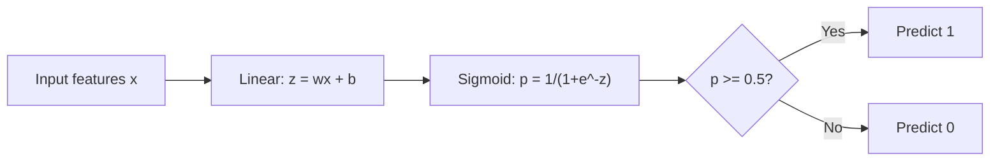
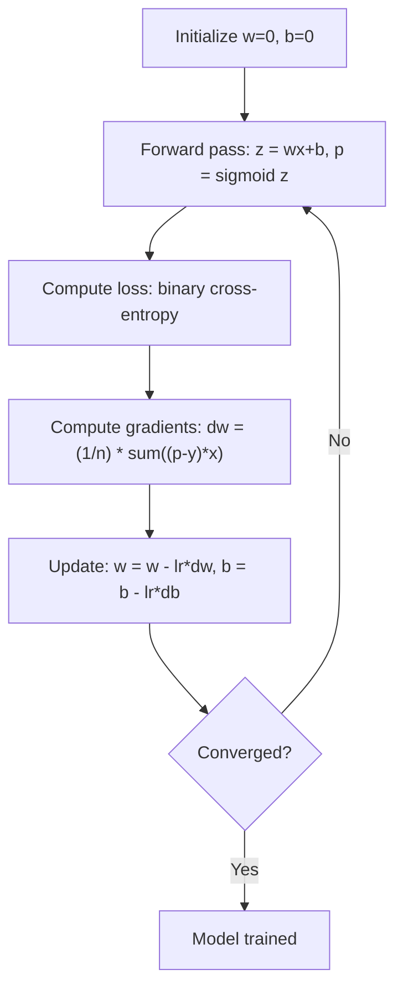

# Régré­sion logistique
# 逻辑回归


> La régression logistique plie une ligne droite dans une courbe S pour répondre aux questions oui ou non avec probabilité.

> 逻辑回归将直线成 S 形曲线, avec la probabilité de répondre à l'inquiétude.

**Type:** Build | **类型：** 构建
**Languages:** Python
**Prerequisites:** Phase 2 Lesson 1-2 (What Is ML, Linear Regression) | **前置知识：** Phase 2 第 1-2 课（什么是机器学习、线性回归）
**Time:** ~90 minutes | **时间：** 约 90 分钟

## Objectifs d'apprentissage

- Implémenter la régression logistique à partir de zéro en utilisant la fonction sigmoïde et la perte binaire d'entropie croisée
  De la réalisation de la logique de retour, la maîtrise de la fonction Sigmoid et de la perte de la seconde
- Compute et interprète la précision, le rappel, le score F1 et la matrice de confusion pour la classification binaire
  計算并解释精确率 (Précision) 召回率 (Rappel)  F1 分数和混矩阵
- Expliquer pourquoi les échanges de devises ne sont pas classés et pourquoi l'entropie binaire transversale produit une surface de coûts convexe
  Expliquer pourquoi l'erreur moyenne (MSE) n'est pas adaptée aux tâches de classe, ainsi que pourquoi le double forfait peut générer des coûts de transformation
- Construire un modèle de régression de softmax pour la classification multi-classes et évaluer les compromis de réglage des seuils
  Construire un modèle de retour Softmax pour effectuer des classes, et évaluer les poids de la valeur


> **【中文解读】**
> La régularité logique est une base de calcul de type II avec la fonction Sigmoid qui permet de calculer la probabilité de la sortie de la ligne de [0,1].

> **【拓展：逻辑回归在工业界的广泛应用】**
> Le système de prévision du taux de clics des annonces de Facebook est basé sur la rétroactivité logique (coupage avec GBMT) et le CTR des annonces de recherche de Google (réévaluation de la rétroactivité logique) est également utilisé à long terme (révalorisation ultérieure pour une étude approfondie). Dans le domaine médical, la rétroactivité logique est utilisée pour prévoir les risques de maladie (comme le cœur, le diabète), l'avantage réside dans la probabilité de sortie explicative.

## Le problème , l' introduction du problème

Vous voulez prédire si une tumeur est maligne ou bénigne compte tenu de sa taille. Vous essayez une régression linéaire. Elle donne des chiffres comme 0,3 ou 1,7 ou -0,5. Qu'est-ce que cela signifie?

> Vous voulez dire que selon la taille du cancer, il est mauvais ou bon. Vous essayez de faire un retour linéaire. Il donne des chiffres de ce type.

La régression logistique résout cela. Elle prend la même combinaison linéaire (wx + b) et la passe à travers la fonction sigmoïde, qui écrasera n'importe quel nombre dans la plage (0, 1).

> 逻辑归归解决了这个问题──它取同样线性组合 (wx + b), via Sigmoid 函数将任意数字压缩到 (0, 1) 范围内──输出是一个概率──你设定一个值(通常 0.5) 做出决策──

Il s'agit de l'un des algorithmes les plus utilisés en pratique. Malgré son nom, la régression logistique est un algorithme de classification, pas un algorithme de régression.

> C'est l'un des algorithmes les plus largement utilisés en pratique. Bien qu'il existe un " retour " dans le nom, le retour en logique est un classification, pas un retour en logique. Le nom est dérivé de la fonction logique utilisée.

> **【中文解读】**
> La rentrée de ligne ne peut pas être directement utilisée dans la catégorie: sa sortie est un nombre de facteurs sans limites (−∞ à +∞), tandis que la catégorie nécessite une probabilité entre 0 et 1 ∞. La rentrée de ligne doit être effectuée par le système de segmoïdes, ce qui permet de générer une probabilité.

## Le concept de base.

### Pourquoi la régression linéaire ne peut être classée

Imaginez prédire le passage/échec (1/0) en fonction des heures d'étude.

> 想象根据学习时间预测通过/不通过(1/0)。线性回归拟合一根直线穿过数据:

```
hours:  1   2   3   4   5   6   7   8   9   10
actual: 0   0   0   0   1   1   1   1   1   1
```

Une correspondance linéaire pourrait produire des prédictions comme -0,2 à l'heure 1 et 1,3 à l'heure 10. Ces valeurs ne sont pas des probabilités. Elles vont en dessous de 0 et au-dessus de 1.

> Les valeurs de l'équilibre peuvent produire -0,2 prévisions en 1 heure, produire 1,3 prévisions en 10 heures. Ces valeurs ne sont pas des probabilités. Elles sont inférieures à 0 ou supérieures à 1 .

La classification a besoin d'une fonction qui:
- Les valeurs de sortie entre 0 et 1 (probabilités)
  输出 0 à 1  之间的 valeur (概率)
- Créer une transition rapide (une limite de décision)
  创建急剧过渡 (rédaction de décision)
- Ne pas être déformé par des écarts loin de la limite
  Une distorsion de la valeur de l'extraordinaire

> 分类 nécessite une fonction, il:

### La fonction sigmoïde

La fonction sigmoïde fait exactement ceci:

> La fonction sigmoïde a fait cela:

```
sigmoid(z) = 1 / (1 + e^(-z))
```

Propriétés:
- Lorsque z est grand et positif, le sigmoïde ((z) approche 1
  Quand z est un grand nombre, le sigmoïde est proche de 1
- Lorsque z est grand et négatif, le sigmoid(z) approche de 0
  Quand z est un grand nombre négatif, le sigmoïde est proche de 0
- Lorsque z = 0, sigmoid(z) = 0,5
  Quand z = 0 时,sigmoid(z) = 0,5
- La sortie est toujours entre 0 et 1
  输出始终在0和1 之间
- La fonction est lisse et différenciable partout
  函数处处平滑可微

La dérivée a une forme pratique: sigmoid'(z) = sigmoid(z) * (1 - sigmoid(z)). Cela rend le calcul des gradients efficace.

> 导数 a une forme facile:sigmoid'(z) = sigmoid(z) * (1 - sigmoid(z))

### Régrésion logistique = modèle linéaire + sigmoïde

Le modèle calcule z = wx + b (même que la régression linéaire), puis applique sigmoïde:

> 模型计算 z = wx + b(与线性归归相同), puis appliquer le sigmoïde:



La sortie p est interprétée comme P ((y=1=x), la probabilité que l'entrée appartient à la classe 1. La limite de décision est où wx + b = 0, ce qui rend la sortie sigmoïde exactement 0,5.

> 输出 p est expliqué comme P  y = 1  x), c'est-à-dire que l'entrée appartient à la catégorie 1  probabilité                                                                                                                                                                                                                                           

### Perte de l'entropie croisée binaire

Vous ne pouvez pas utiliser MSE pour la régression logistique. MSE avec un sigmoïde crée une surface de coûts non convexe avec de nombreux minima locaux.

> Vous ne pouvez pas utiliser MSE. Vous ne pouvez pas utiliser MSE. Vous ne pouvez pas utiliser MSE. Vous ne pouvez pas utiliser MSE. Vous ne pouvez pas utiliser MSE. Vous ne pouvez pas utiliser MSE. Vous ne pouvez pas utiliser MSE. Vous ne pouvez pas utiliser MSE. Vous ne pouvez pas utiliser MSE. Vous ne pouvez pas utiliser MSE. Vous ne pouvez pas utiliser MSE. Vous ne pouvez pas utiliser MSE. Vous ne pouvez pas utiliser MSE. Vous ne pouvez pas utiliser MSE. Vous ne pouvez pas utiliser MSE. Vous ne pouvez pas utiliser MSE. Vous ne pouvez pas utiliser MSE.

```
Loss = -(1/n) * sum(y * log(p) + (1-y) * log(1-p))
```

Pourquoi ça marche:
- Lorsque y=1 et p est proche de 1: log(1) = 0, la perte est proche de 0 (correct, faible coût)
  Lorsque y = 1 et p 接近 1 时:log(1) = 0, perte proche de 0(正确,低代价)
- Lorsque y=1 et p est proche de 0: log(0) approche l'infini négatif, la perte est donc énorme (erreur, coût élevé)
  Quand y = 1 et p 接近 0 时:log(0) 趋向负无穷,损失极大(错误,高代价)
- Lorsque y=0 et p est proche de 0: log(1) = 0, la perte est proche de 0 (correct, faible coût)
  Lorsque y = 0 et p 接近 0 时:log(1) = 0, perte proche 0(正确,低代价)
- Lorsque y=0 et p est proche de 1: log(0) approche l'infini négatif, la perte est donc énorme (erreur, coût élevé)
  Quand y = 0 et p 接近 1 时:log(0) 趋向负无穷,损失极大(错误,高代价)

Cette fonction de perte est convexe pour la régression logistique, garantissant un minimum mondial unique.

> Cette fonction de perte de retour logique est une fonction de coupe, garantissant une valeur minimale unique de l'ensemble.

> **【中文解读】**
> Pourquoi la classification ne peut pas être utilisée par MSE ? Parce que MSE + Sigmoid 会产生非凸的损失函数曲面, il existe de nombreuses localités minimales, la gradience descendue pourrait être accueillie.

> **【拓展：交叉熵损失在深度学习中的核心地位】**
> Le transfert de données est un processus de formation de données qui consiste à analyser les données de la base de données et à analyser les données de la base de données.

### Une baisse progressive de la régression logistique

Les gradients de l'entropie croisée binaire avec le sigmoïde sont de forme propre:

> Le gradient du symbole de Sigmoïde a une forme simple:

```
dL/dw = (1/n) * sum((p - y) * x)
dL/db = (1/n) * sum(p - y)
```

Ces gradients sont identiques aux gradients de régression linéaires. La différence est que p = sigmoid(wx + b) au lieu de p = wx + b. Le sigmoid introduit la non-linéarité, mais la règle de mise à jour du gradient reste la même.

> Ces éléments semblent être complètement identiques à la gradience de retour de la ligne. La différence se trouve dans la p = sigmoïde (wx + b) et non dans la p = wx + b. La sigmoïde a introduit la non-linearité, mais la gradience actuelle reste inchangée.

> **【中文解读】**
> La formule de la gradience de la rentrée logique est similaire à celle de la rentrée de la ligne:`dL/dw = (1/n) * sum((p-y)*x)`La seule différence est que le sigmoïde est un composé de sigmoïde et non un composé de sigmoïde.



### La limite de décision

Pour une entrée 2D (deux caractéristiques), la limite de décision est la ligne où:

> Pour les 2D, les deux caractéristiques sont les suivantes:

```
w1*x1 + w2*x2 + b = 0
```

Les points d'un côté sont classés comme 1, les points de l'autre côté comme 0. La régression logistique produit toujours une limite de décision linéaire.

> Un côté des points est classé en 1, l'autre côté est classé en 0[6]. Le retour logique produit toujours des limites de décision linéaires[6]. Si vous avez besoin de limites de déformation, vous devez ajouter plusieurs caractéristiques, ou utiliser un modèle non linéaire[6].

### Classification multi-classe avec Softmax

La régression logistique binaire traite deux classes. Pour les classes k, utilisez la fonction softmax:

> Pour les deux catégories, utilisez la fonction Softmax:

```
softmax(z_i) = e^(z_i) / sum(e^(z_j) for all j)
```

Chaque classe a son propre vecteur de poids. Le modèle calcule un score z_i pour chaque classe, puis softmax convertit les scores en probabilités qui s'ajoutent à 1.

> Chaque classe a son propre poids. Le modèle pour chaque classe calculera un poids z_i, puis Softmax transformera le poids en probabilité totale et 1 pour la probabilité.

La fonction de perte devient une entropie croisée catégorique:

> 损失函数变为分类交叉:

```
Loss = -(1/n) * sum(sum(y_k * log(p_k)))
```

où y_k est 1 pour la classe vraie et 0 pour toutes les autres (encoding unique).

> Parmi eux, y_k pour les vrais catégories pour 1, d'autres pour 0 ((one-hot 编码) ⋅

### Les mesures d'évaluation

Pour un ensemble de données avec 95% négatif et 5% positif, un modèle qui prédit toujours négatif obtient une précision de 95% mais est inutile.

> Pour un ensemble de données de 95% en cas négatif, 5% en cas réel, un modèle toujours prédictif en cas négatif obtient un taux de 95% en cas négatif, mais en vain.

**Confusion Matrix**- Le numéro de la liste:

> **混淆矩阵**- Le numéro de la liste:

| | Predicted Positive | Predicted Negative |
|---|---|---|
| Actually Positive | True Positive (TP) | False Negative (FN) |
| Actually Negative | False Positive (FP) | True Negative (TN) |

| | 预测为正 | 预测为负 |
|---|---|---|
| 实际为正 | 真正例 (TP) | 假负例 (FN) |
| 实际为负 | 假正例 (FP) | 真负例 (TN) |

**Precision**: De tous les positifs prévus, combien sont effectivement positifs ?
```
Precision = TP / (TP + FP)
```

> **精确率**: parmi tous les pronostics correct, combien sont réels correct ?

**Recall**(Sensibilité): De tous les positifs réels, combien avons-nous attrapé ?
```
Recall = TP / (TP + FN)
```

> **召回率**(Ligérité): Parmi tous les échantillons réels, combien avons-nous trouvé ?

**F1 Score**: moyen harmonieux de précision et de rappel.
```
F1 = 2 * (Precision * Recall) / (Precision + Recall)
```

> **F1 分数**Le taux de précision et le taux de réaction sont les deux indicateurs.

Quand donner la priorité:
- **Precision**: lorsque les faux positifs sont coûteux (filtre de spam, vous ne voulez pas bloquer les courriels légitimes)
  **精确率**: quand faux faux faux prix élevé alors (j'ai pas voulu interférer avec le courrier normal)
- **Recall**: lorsque les faux négatifs sont coûteux (le dépistage du cancer, vous ne voulez pas manquer une tumeur)
  **召回率**Il y a aussi le cancer.
- **F1**: lorsque vous avez besoin d'une seule métrique équilibrée
  **F1**: lorsque vous avez besoin d'un indice unique d'équilibre

>  priorités en ce qui concerne les indicateurs:

> **【中文解读】**
> Dans le cas de la classification de l'évaluation, le taux de prédiction est de 99,9% mais il n'a pas de valeur. Dans le cas de la classification de l'évaluation de l'inégalité, le taux de prédiction est de 99,9% mais il n'a pas de valeur.

> **【拓展：评估指标在真实系统中的选择】**
> Les pages de déchets de recherche Google ont un taux de préférence de précision (en plus de laisser passer des pages de déchets, on ne peut pas non plus les juger de déchets); les images médicales AI (comme le test du cancer du sein de Google Health) ont un taux de réaction de préférence (en plus de faux positifs pour faire revenir le médecin, on ne peut pas non plus éliminer les vrais tumeurs); les règles de contrôle des conducteurs autonomes exigent un taux de précision et de réaction très élevé, F1 est un indicateur global plus approprié.
```figure
logistic-sigmoid
```

## Faites-le

### Étape 1: Fonction Sigmoid et génération de données

```python
import random
import math

def sigmoid(z):
    z = max(-500, min(500, z))  # 裁剪防止数值溢出
    return 1.0 / (1.0 + math.exp(-z))  # Sigmoid 函数：将任意实数映射到 (0,1)


random.seed(42)
N = 200
X = []
y = []

# 生成类别 0 的数据：中心在 (2,2)
for _ in range(N // 2):
    X.append([random.gauss(2, 1), random.gauss(2, 1)])
    y.append(0)

# 生成类别 1 的数据：中心在 (5,5)
for _ in range(N // 2):
    X.append([random.gauss(5, 1), random.gauss(5, 1)])
    y.append(1)

combined = list(zip(X, y))
random.shuffle(combined)
X, y = zip(*combined)
X = list(X)
y = list(y)

print(f"Generated {N} samples (2 classes, 2 features)")
print(f"Class 0 center: (2, 2), Class 1 center: (5, 5)")
print(f"First 5 samples:")
for i in range(5):
    print(f"  Features: [{X[i][0]:.2f}, {X[i][1]:.2f}], Label: {y[i]}")
```

### Étape 2: Régrésion logistique à partir de zéro

```python
class LogisticRegression:
    def __init__(self, n_features, learning_rate=0.01):
        self.weights = [0.0] * n_features  # 权重初始化为 0
        self.bias = 0.0  # 偏置初始化为 0
        self.lr = learning_rate  # 学习率
        self.loss_history = []  # 记录训练损失

    def predict_proba(self, x):
        z = sum(w * xi for w, xi in zip(self.weights, x)) + self.bias  # 线性组合 z = wx + b
        return sigmoid(z)  # 通过 Sigmoid 得到概率

    def predict(self, x, threshold=0.5):
        return 1 if self.predict_proba(x) >= threshold else 0  # 概率 >= 阈值则预测为 1

    def compute_loss(self, X, y):
        n = len(y)
        total = 0.0
        for i in range(n):
            p = self.predict_proba(X[i])
            p = max(1e-15, min(1 - 1e-15, p))  # 裁剪防止 log(0)
            # 二元交叉熵损失
            total += y[i] * math.log(p) + (1 - y[i]) * math.log(1 - p)
        return -total / n  # 取负号得到正值损失

    def fit(self, X, y, epochs=1000, print_every=200):
        n = len(y)
        n_features = len(X[0])
        for epoch in range(epochs):
            dw = [0.0] * n_features
            db = 0.0
            for i in range(n):
                p = self.predict_proba(X[i])
                error = p - y[i]  # 预测概率 - 真实标签
                for j in range(n_features):
                    dw[j] += error * X[i][j]  # 累积权重梯度
                db += error  # 累积偏置梯度
            # 梯度下降更新参数
            for j in range(n_features):
                self.weights[j] -= self.lr * (dw[j] / n)
            self.bias -= self.lr * (db / n)
            loss = self.compute_loss(X, y)
            self.loss_history.append(loss)
            if epoch % print_every == 0:
                print(f"  Epoch {epoch:4d} | Loss: {loss:.4f} | w: [{self.weights[0]:.3f}, {self.weights[1]:.3f}] | b: {self.bias:.3f}")
        return self

    def accuracy(self, X, y):
        correct = sum(1 for i in range(len(y)) if self.predict(X[i]) == y[i])
        return correct / len(y)


split = int(0.8 * N)
X_train, X_test = X[:split], X[split:]
y_train, y_test = y[:split], y[split:]

print("\n=== Training Logistic Regression ===")
model = LogisticRegression(n_features=2, learning_rate=0.1)
model.fit(X_train, y_train, epochs=1000, print_every=200)

print(f"\nTrain accuracy: {model.accuracy(X_train, y_train):.4f}")
print(f"Test accuracy:  {model.accuracy(X_test, y_test):.4f}")
print(f"Weights: [{model.weights[0]:.4f}, {model.weights[1]:.4f}]")
print(f"Bias: {model.bias:.4f}")
```

### Étape 3: Matrice de confusion et métriques à partir de zéro

```python
class ClassificationMetrics:
    def __init__(self, y_true, y_pred):
        # 统计混淆矩阵四个值
        self.tp = sum(1 for t, p in zip(y_true, y_pred) if t == 1 and p == 1)  # 真正例
        self.tn = sum(1 for t, p in zip(y_true, y_pred) if t == 0 and p == 0)  # 真负例
        self.fp = sum(1 for t, p in zip(y_true, y_pred) if t == 0 and p == 1)  # 假正例
        self.fn = sum(1 for t, p in zip(y_true, y_pred) if t == 1 and p == 0)  # 假负例

    def accuracy(self):
        total = self.tp + self.tn + self.fp + self.fn
        return (self.tp + self.tn) / total if total > 0 else 0

    def precision(self):
        denom = self.tp + self.fp
        return self.tp / denom if denom > 0 else 0

    def recall(self):
        denom = self.tp + self.fn
        return self.tp / denom if denom > 0 else 0

    def f1(self):
        p = self.precision()
        r = self.recall()
        return 2 * p * r / (p + r) if (p + r) > 0 else 0

    def print_confusion_matrix(self):
        print(f"\n  Confusion Matrix:")
        print(f"                  Predicted")
        print(f"                  Pos   Neg")
        print(f"  Actual Pos     {self.tp:4d}  {self.fn:4d}")
        print(f"  Actual Neg     {self.fp:4d}  {self.tn:4d}")

    def print_report(self):
        self.print_confusion_matrix()
        print(f"\n  Accuracy:  {self.accuracy():.4f}")
        print(f"  Precision: {self.precision():.4f}")
        print(f"  Recall:    {self.recall():.4f}")
        print(f"  F1 Score:  {self.f1():.4f}")


y_pred_test = [model.predict(x) for x in X_test]
print("\n=== Classification Report (Test Set) ===")
metrics = ClassificationMetrics(y_test, y_pred_test)
metrics.print_report()
```

### Étape 4: Analyse des limites de décision

```python
print("\n=== Decision Boundary ===")
w1, w2 = model.weights
b = model.bias
print(f"Decision boundary: {w1:.4f}*x1 + {w2:.4f}*x2 + {b:.4f} = 0")
if abs(w2) > 1e-10:
    print(f"Solved for x2:     x2 = {-w1/w2:.4f}*x1 + {-b/w2:.4f}")

print("\nSample predictions near the boundary:")
test_points = [
    [3.0, 3.0],
    [3.5, 3.5],
    [4.0, 4.0],
    [2.5, 2.5],
    [5.0, 5.0],
]
for point in test_points:
    prob = model.predict_proba(point)
    pred = model.predict(point)
    print(f"  [{point[0]}, {point[1]}] -> prob={prob:.4f}, class={pred}")
```

### Étape 5: Multi-classe avec softmax

```python
class SoftmaxRegression:
    def __init__(self, n_features, n_classes, learning_rate=0.01):
        self.n_features = n_features
        self.n_classes = n_classes
        self.lr = learning_rate
        self.weights = [[0.0] * n_features for _ in range(n_classes)]
        self.biases = [0.0] * n_classes

    def softmax(self, scores):
        max_score = max(scores)
        exp_scores = [math.exp(s - max_score) for s in scores]
        total = sum(exp_scores)
        return [e / total for e in exp_scores]

    def predict_proba(self, x):
        scores = [
            sum(self.weights[k][j] * x[j] for j in range(self.n_features)) + self.biases[k]
            for k in range(self.n_classes)
        ]
        return self.softmax(scores)

    def predict(self, x):
        probs = self.predict_proba(x)
        return probs.index(max(probs))

    def fit(self, X, y, epochs=1000, print_every=200):
        n = len(y)
        for epoch in range(epochs):
            grad_w = [[0.0] * self.n_features for _ in range(self.n_classes)]
            grad_b = [0.0] * self.n_classes
            total_loss = 0.0
            for i in range(n):
                probs = self.predict_proba(X[i])
                for k in range(self.n_classes):
                    target = 1.0 if y[i] == k else 0.0
                    error = probs[k] - target
                    for j in range(self.n_features):
                        grad_w[k][j] += error * X[i][j]
                    grad_b[k] += error
                true_prob = max(probs[y[i]], 1e-15)
                total_loss -= math.log(true_prob)
            for k in range(self.n_classes):
                for j in range(self.n_features):
                    self.weights[k][j] -= self.lr * (grad_w[k][j] / n)
                self.biases[k] -= self.lr * (grad_b[k] / n)
            if epoch % print_every == 0:
                print(f"  Epoch {epoch:4d} | Loss: {total_loss / n:.4f}")
        return self

    def accuracy(self, X, y):
        correct = sum(1 for i in range(len(y)) if self.predict(X[i]) == y[i])
        return correct / len(y)


random.seed(42)
X_3class = []
y_3class = []

centers = [(1, 1), (5, 1), (3, 5)]
for label, (cx, cy) in enumerate(centers):
    for _ in range(50):
        X_3class.append([random.gauss(cx, 0.8), random.gauss(cy, 0.8)])
        y_3class.append(label)

combined = list(zip(X_3class, y_3class))
random.shuffle(combined)
X_3class, y_3class = zip(*combined)
X_3class = list(X_3class)
y_3class = list(y_3class)

split_3 = int(0.8 * len(X_3class))
X_train_3 = X_3class[:split_3]
y_train_3 = y_3class[:split_3]
X_test_3 = X_3class[split_3:]
y_test_3 = y_3class[split_3:]

print("\n=== Multi-class Softmax Regression (3 classes) ===")
softmax_model = SoftmaxRegression(n_features=2, n_classes=3, learning_rate=0.1)
softmax_model.fit(X_train_3, y_train_3, epochs=1000, print_every=200)
print(f"\nTrain accuracy: {softmax_model.accuracy(X_train_3, y_train_3):.4f}")
print(f"Test accuracy:  {softmax_model.accuracy(X_test_3, y_test_3):.4f}")

print("\nSample predictions:")
for i in range(5):
    probs = softmax_model.predict_proba(X_test_3[i])
    pred = softmax_model.predict(X_test_3[i])
    print(f"  True: {y_test_3[i]}, Predicted: {pred}, Probs: [{', '.join(f'{p:.3f}' for p in probs)}]")
```

### Étape 6: réglage du seuil

```python
print("\n=== Threshold Tuning ===")
print("Default threshold: 0.5. Adjusting the threshold trades precision for recall.\n")

thresholds = [0.3, 0.4, 0.5, 0.6, 0.7]
print(f"{'Threshold':>10} {'Accuracy':>10} {'Precision':>10} {'Recall':>10} {'F1':>10}")
print("-" * 52)

for t in thresholds:
    y_pred_t = [1 if model.predict_proba(x) >= t else 0 for x in X_test]
    m = ClassificationMetrics(y_test, y_pred_t)
    print(f"{t:>10.1f} {m.accuracy():>10.4f} {m.precision():>10.4f} {m.recall():>10.4f} {m.f1():>10.4f}")
```

## Utilisez-le avec le cadre de réalisation

C'est la même chose avec le scikit-learn.

> Maintenant, avec un petit apprentissage, vous pouvez réaliser la même fonction.

```python
from sklearn.linear_model import LogisticRegression as SklearnLR
from sklearn.metrics import accuracy_score, precision_score, recall_score, f1_score
from sklearn.metrics import confusion_matrix, classification_report
from sklearn.model_selection import train_test_split
from sklearn.preprocessing import StandardScaler
import numpy as np

np.random.seed(42)
X_0 = np.random.randn(100, 2) + [2, 2]
X_1 = np.random.randn(100, 2) + [5, 5]
X_sk = np.vstack([X_0, X_1])
y_sk = np.array([0] * 100 + [1] * 100)

X_tr, X_te, y_tr, y_te = train_test_split(X_sk, y_sk, test_size=0.2, random_state=42)

scaler = StandardScaler()
X_tr_sc = scaler.fit_transform(X_tr)
X_te_sc = scaler.transform(X_te)

lr = SklearnLR()
lr.fit(X_tr_sc, y_tr)
y_pred = lr.predict(X_te_sc)

print("=== Scikit-learn Logistic Regression ===")
print(f"Accuracy:  {accuracy_score(y_te, y_pred):.4f}")
print(f"Precision: {precision_score(y_te, y_pred):.4f}")
print(f"Recall:    {recall_score(y_te, y_pred):.4f}")
print(f"F1:        {f1_score(y_te, y_pred):.4f}")
print(f"\nConfusion Matrix:\n{confusion_matrix(y_te, y_pred)}")
print(f"\nClassification Report:\n{classification_report(y_te, y_pred)}")
```

La mise en œuvre de votre système à partir de zéro produit les mêmes limites et mesures de décision. Scikit-learn ajoute des options de résolution (liblinear, lbfgs, saga), une régularisation automatique, des stratégies multiclasses (un contre un reste, multinomiale) et des optimisations de stabilité numérique.

> Vous avez réalisé à partir de zéro produire les mêmes limites et indicateurs de décision.

## Envoyez-le . Produit .

Cette leçon donne:
- `code/logistic_regression.py`- régression logistique à partir de zéro avec des mesures

> Le programme de formation
> - `code/logistic_regression.py`- Indicateur de retour logique et d'évaluation de la réalisation à partir de zéro

## Les exercices

1. Générer un ensemble de données qui n'est pas séparable linéairement (par exemple, deux cercles concentriques). Exercer la régression logistique et observer son échec. Puis ajouter des caractéristiques polynomielles (x1^2, x2^2, x1*x2) et entraîner à nouveau. Montrez que la précision s'améliore.
   1. Il est devenu un**非**线性可分的数据集 (例如两个同心圆) ⋅ entraînement de la logique rattraper并观察其失败──然后添加多项式特征(x1^2, x2^2, x1*x2)
2. Implémenter une matrice de confusion multi-classe pour le modèle softmax de 3 classes. Compute la précision par classe et rappelle. Quelle classe est la plus difficile à classer?
   2. Pour 3 classes Softmax  Modèle réalisé de la plupart des classes de la matrice de confusion ∙ Calculer le taux de précision et de réaction de chaque classe ∙ Quelle classe est la plus difficile à déterminer ?
3. Construisez une courbe ROC à partir de zéro. Pour 100 valeurs de seuil de 0 à 1, calculez le taux positif vrai et le taux faux positif. Calculez l'AUC (zone sous la courbe) en utilisant la règle trapézoïdale.
   3. De la 0 à la construction de la courbe ROC ∞ pour 100  valeurs entre 0 et 1, calculer le taux de vrais et faux cas ∞ pour calculer la courbe AUC ∞

## Les termes clés

| Term | What people say | What it actually means |
|------|----------------|----------------------|
| Logistic regression | "Regression for classification" | A linear model followed by a sigmoid function that outputs class probabilities |
| Sigmoid function | "The S-curve" | The function 1/(1+e^(-z)) that maps any real number to the range (0, 1) |
| Binary cross-entropy | "Log loss" | The loss function -[y*log(p) + (1-y)*log(1-p)] that penalizes confident wrong predictions severely |
| Decision boundary | "The dividing line" | The surface where the model's output probability equals 0.5, separating predicted classes |
| Softmax | "Multi-class sigmoid" | A function that converts a vector of scores into probabilities that sum to 1 |
| Precision | "How many selected are relevant" | TP / (TP + FP), the fraction of positive predictions that are actually positive |
| Recall | "How many relevant are selected" | TP / (TP + FN), the fraction of actual positives that the model correctly identifies |
| F1 score | "Balanced accuracy" | The harmonic mean of precision and recall: 2*P*R / (P+R) |
| Confusion matrix | "The error breakdown" | A table showing TP, TN, FP, FN counts for each class pair |
| Threshold | "The cutoff" | The probability value above which the model predicts class 1 (default 0.5, tunable) |
| One-hot encoding | "Binary columns for categories" | Representing class k as a vector of zeros with a 1 at position k |
| Categorical cross-entropy | "Multi-class log loss" | The extension of binary cross-entropy to k classes using one-hot encoded labels |
