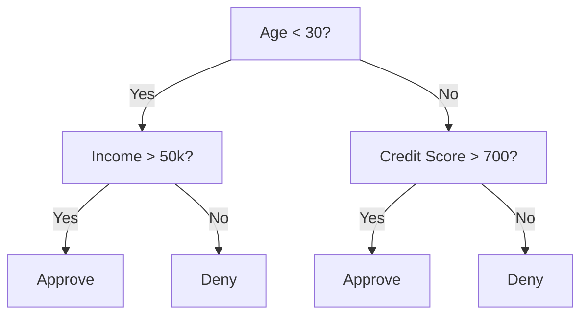
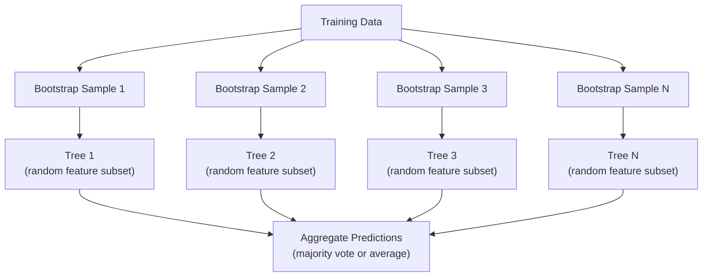

# Les arbres décisionnels et les forêts aléatoires
#  décision arbres et forêts


> Un arbre de décision n'est qu'un diagramme de flux, mais une forêt de ces arbres est l'un des outils les plus puissants de l'intelligence artificielle.

> Un arbre de décision est un plan de processus. Mais un arbre composé de ces processus est l'un des outils les plus puissants de l'apprentissage automatique.

**Type:** Build | **类型：** 构建
**Language:**Je suis un Python .**语言：**Python
**Prerequisites:** Phase 1 (Lessons 09 Information Theory, 06 Probability) | **前置知识：** Phase 1（第 9 课信息论、第 6 课概率论）
**Time:** ~90 minutes | **时间：** 约 90 分钟

## Objectifs d'apprentissage

- Implémenter des calculs d'impureté, d'entropie et de gain d'informations de Gini pour trouver des fractions optimales des arbres de décision
  ¢ réaliser Gini ¢ impureurité   et augmentation de l'information calcul, trouver le meilleur résolution
- Construire un classificateur d'arbre de décision à partir de zéro avec des contrôles de pré-tissage (profondeur maximale, échantillons min)
  Le système de contrôle de la structure à partir de zéro avec un contrôle préalable de la taille maximale
- Construire une forêt aléatoire à l'aide de l'échantillonnage de démarrage et de la randomisation des caractéristiques, et expliquer pourquoi elle réduit la variance
  Utilisez Bootstrap 采样和特征随机化 随机森林构建,并解释为什么它可以降低方差
- Comparer l'importance des caractéristiques de l'IDM avec l'importance de la permutation et déterminer quand l'IDM est biaisé
  Comparer l'importance des caractéristiques de l'IDM et l'importance de la substitution, problème de différenciation de l'IDM


> **【中文解读】**
> 决策树通过 if-else 规则分数据,随机森林是多个决策树的投票组合――sklearn 金融风控医疗诊断中随机森林是基线模型――

> **【拓展：树模型在 Kaggle 和工业界的主导地位】**
> Dans le cadre de la compétition de données structurées, environ 70% des programmes gagnants utilisent des niveaux de hausse des risques. Dans le domaine financier, les taux de crédit sont largement utilisés. Dans les banques, les systèmes de lutte contre la fraude sont souvent utilisés comme lignes de base. Dans les diagnostics médicaux, les risques de réinsertion précoce sont utilisés.

## Le problème , l' introduction du problème

Vous avez des données tabulaires. Les lignes sont des échantillons, les colonnes sont des caractéristiques, et il y a une colonne cible que vous voulez prédire. Vous pouvez y jeter un réseau neuronal. Mais pour les données tabulaires, les modèles basés sur des arbres (arbres de décision, forêts aléatoires, arbres augmentés en gradient) dépassent systématiquement l'apprentissage profond. Les compétitions Kaggle sur les données structurées sont dominées par XGBoost et LightGBM, pas les transformateurs.

> Vous avez des données de format. Vous avez des échantillons, des caractéristiques, et vous avez des objectifs que vous pouvez prévoir. Vous pouvez les traiter avec le réseau neuronal.

Les arbres gèrent des types de caractéristiques mixtes (numériques et catégoriques) sans traitement préalable. Ils gèrent des relations non linéaires sans ingénierie des caractéristiques. Ils sont interprétables: vous pouvez regarder l'arbre et voir exactement pourquoi une prédiction a été faite.

> Pourquoi ? Les modèles de arbres ne nécessitent pas de prédétermination pour traiter les caractéristiques mixtes de types de données numériques et de catégories.

Cette leçon construit des arbres de décision à partir de zéro en utilisant la fraction récursive, puis construit une forêt aléatoire en haut. Vous allez mettre en œuvre les mathématiques derrière les critères de fractionnement (impureté génini, entropie, gain d'information) et comprendre pourquoi un ensemble d'apprenants faibles devient un fort.

> Ce cours commence par la résolution de la division par la résolution de la division, puis se construit sur elle comme une forêt. Vous allez réaliser la mathématique derrière la division.

> **【中文解读】**
> Pour les données de type type type, le modèle de bois est généralement meilleur que l'apprentissage en profondeur.

## Le concept de base.

### Ce que fait un arbre de décision

Un arbre de décision partage l'espace de fonctionnalités en régions rectangulaires en posant une séquence de questions oui/non.

> 决策树通过一系列非问题将特征空间分为矩形区域――



Chaque nœud interne teste une fonctionnalité contre un seuil. Chaque nœud de feuille fait une prédiction. Pour classer un nouveau point de données, vous commencez à la racine et suivez les branches jusqu'à ce que vous atteignez une feuille.

> Chaque nœud interne comparera une caractéristique à une valeur. Chaque nœud de feuille fera une prédiction.

L'arbre est construit de haut en bas en choisissant, à chaque nœud, la fonction et le seuil qui séparent le mieux les données. "Best" est défini par un critère de fractionnement.

> 树自顶向下构建, choisir les caractéristiques et les valeurs les plus distinctes des données à chaque point.

### Critères de partage: mesure de l'impureté

Nous voulons les diviser de façon à ce que les nœuds enfants résultants soient aussi "purs" que possible, ce qui signifie que chaque enfant contient principalement une classe.

> À chaque nœud, nous avons un groupe de modèles. Nous voulons les diviser pour que chaque nœud soit aussi "pure" que possible.

**Gini impurity**mesure la probabilité qu'un échantillon choisi au hasard soit mal classé s'il est étiqueté selon la distribution de classes au nœud.

> **Gini 不纯度**Œuvre de mesure d'un échantillon de sélection aléatoire Si la distribution de catégories de ce point est marquée, la probabilité d'erreur de catégorie est répandue 

```
Gini(S) = 1 - sum(p_k^2)

where p_k is the proportion of class k in set S.
```

Pour un nœud pur (tous une classe), Gini = 0, pour une fraction binaire avec des classes 50/50, Gini = 0,5.

> Pour les points de division purement, Gini = 0, Gini = 0,5...

```
Example: 6 cats, 4 dogs

Gini = 1 - (0.6^2 + 0.4^2) = 1 - (0.36 + 0.16) = 0.48
```

**Entropy**mesure le contenu d'information (trouble) dans un nœud. couvert dans la leçon 09 de la phase 1.

> **熵**衡量节点中的信息内容 (message)  (confusion)  (discussion dans la première phase de la phase 9 课中)

```
Entropy(S) = -sum(p_k * log2(p_k))
```

Pour un nœud pur, entropie = 0, pour une fraction binaire 50/50, entropie = 1,0.

> Pour les points de séparation de 50/50 , = 1,0──越低越好──

```
Example: 6 cats, 4 dogs

Entropy = -(0.6 * log2(0.6) + 0.4 * log2(0.4))
        = -(0.6 * -0.737 + 0.4 * -1.322)
        = 0.442 + 0.529
        = 0.971 bits
```

**Information gain**est la réduction de l'impureté (entropie ou Gini) après une fraction.

> **信息增益**La réduction de la pureté de la division après la division est la même que celle de la Gini.

```
IG(S, feature, threshold) = Impurity(S) - weighted_avg(Impurity(S_left), Impurity(S_right))

where the weights are the proportions of samples in each child.
```

L'algorithme avide de chaque nœud: essayez toutes les fonctionnalités et tous les seuils possibles. Choisissez la paire (fonction, seuil) qui maximize le gain d'informations.

> L'algorithme de l'intérêt de chaque élément: essayer chaque caractéristique et chaque valeur possible.

> **【中文解读】**
> Le système de calcul de la "pureur" des éléments de l'information est un système de calcul de la "pureur" des éléments de l'information.

### Comment fonctionne la séparation

Pour un ensemble de données avec n caractéristiques et m échantillons au nœud courant:

> Pour les n 个特征和 m 个样本的当前节点:

1. Pour chaque caractéristique j (j = 1 à n):
   pour chaque caractéristique j(j = 1 à n):
   - Régler les échantillons par caractéristique j
     按特征 j à la séquence de l'échantillon
   - Essayez chaque point intermédiaire entre des valeurs distinctes consécutives comme un seuil
     尝试对相邻不同值的中点作为值
   - Calculer le gain d'information pour chaque seuil
     计算每值的信息增益
2. Sélectionnez la fonctionnalité et le seuil avec le plus grand gain d'informations
   选择信息增益 增益 增益 增益 增益 增益 增益 增益 增益 增益 增益 增益 增益 增益 增益 增益 增益 增益 增益 增益 增益 增益 增益 增益 增益 增益 增益 增益 增益 增益 增益 增益 增益 增益 增益 增益 增益 增益 增益 增长 增长 增长 增长 增长 增长 增长 增长 增长 增长 增长 增长 增长 增长 增长 增长 增长 增长 增长 增长 增长 增长 增长 增长 增长 增长 增长 增长 增长 增长 增长 增长 增长 增长 增长 增长 增长 增长 增长 增长 增长 增长 增长 增长 增长 增长 增长 增长 增长 增长 增长 增长 增长 增长 增长 增长 增长 增长 增长 增长 增长 增长 增长 增长 增长 增长 增长 增长 增长 增长 增长 增 增 增 增 增 增 增 增 增 增 增 增 增 增 增 增 增 增 增 增 增 增 增 增 增 增 增 增 增 增 增 增 增 增 增 增 增 增 增 增 增 增 增 增 增 增 增 增 增 增 增 增 增 增 增 增 增 增 增 增 增 增 增 增 增 增 增 增 增 增 增 增 增 增 增 增 增 增 增 增 增 增 增 增 增 增 增 增 增
3. Divisez les données en gauche (poids <=) et en droite (poids >)
   Pour les données divisées en gauche, les caractéristiques <= value) et la droite, les caractéristiques > value)
4. Recursion sur chaque enfant
   Pour chaque point de retour

Cette approche avide ne garantit pas l'arbre optimal au niveau mondial. Trouver l'arbre optimal est NP-difficile. Mais la division avide fonctionne bien dans la pratique.

> Cette méthode de l'avidité ne garantit pas la meilleure arbre de la région.

### Conditions d'arrêt

Sans s'arrêter, l'arbre pousse jusqu'à ce que chaque feuille soit pure (un échantillon par feuille).

>  sans conditions de cessation, le arbre ne cesse de croître jusqu'à ce que chaque bout de feuille soit pur                                                                                                                                                                                                                                                 

**Pre-pruning**Arrête l'arbre avant qu'il ne pousse pleinement:
- Profondeur maximale: arrête de se diviser lorsque l'arbre atteint une profondeur définie
  La profondeur maximale: lorsque l'arbre atteint une profondeur déterminée, il cesse de se diviser.
- Primes minimaux par feuille: arrêt si un nœud contient moins de k prémices
  Le nombre d'échantillons minimum par feuille: si le point est inférieur à k 个样本, il s'arrête
- Obtention minimale d'informations: arrêt si la meilleure fraction améliore l'impureté de moins d'un seuil
  Le meilleur effet de la division s'arrête si la pureté de l'amélioration est inférieure à la valeur de la division.
- Nœuds de feuilles maximaux: limiter le nombre total de feuilles
  Nombre maximal de points de contact: limite de nombre total de points de contact

**Post-pruning**Il fait croître l'arbre entier, puis il le coupe.
- Taille de taille de la complexité des coûts (utilisée par scikit-learn): ajouter une pénalité proportionnelle au nombre de feuilles.
  代价复杂度剪枝(scikit-learn 使用): ajouter avec des feuilles de point de nombre en proportion de la peine;; augmenter la peine obtenir plus petit arbre
- Réduction de la taille des erreurs: supprimer un sous-arbre si l'erreur de validation ne s'accroît pas
  减差剪枝: si l'erreur de vérification ne s'accroît pas, alors le tronc est enlevé

La pré-tissage est plus simple et plus rapide. La post-tissage produit souvent de meilleurs arbres, car il n'arrête pas prématurément les fentes qui pourraient conduire à d'autres fentes utiles.

> 预剪枝更简单更快――后剪枝通常 produisent un meilleur arbre, car il ne cesse pas trop tôt et peut entraîner des nœuds de division utiles ultérieures―

### Arbres de décision pour la régression

Pour la régression, la prédiction de la feuille est la moyenne des valeurs cibles de cette feuille.

> Pour le retour, la prédiction des points de départ est la valeur moyenne de la valeur cible de la ligne de départ.

**Variance reduction**remplace le gain d'information:

> **方差减少**替代了信息增益:

```
VR(S, feature, threshold) = Var(S) - weighted_avg(Var(S_left), Var(S_right))
```

Choisissez la fraction qui réduit le plus la variance. L'arbre divise l'espace d'entrée en régions et prédit une constante (la moyenne) dans chaque région.

> 选择方差减少最多的分裂──树将输入空间分为区域,在每个区域预测一个常数(平均值)──

### Les forêts aléatoires: le pouvoir des ensembles

Un seul arbre de décision est très varié. Des petits changements dans les données peuvent produire des arbres complètement différents.

> Les arbres de décision ont des différences élevées. Les petites variations de données produisent des arbres complètement différents.



Deux sources de hasard rendent les arbres divers:

> Les deux sources aléatoires de variété des arbres:

**Bagging (bootstrap aggregating):**Chaque arbre est formé sur un échantillon de démarrage, un échantillon aléatoire avec le remplacement des données de formation. Environ 63% des échantillons originaux apparaissent dans chaque démarrage (le reste sont des échantillons hors sac qui peuvent être utilisés pour la validation).

> **Bagging（Bootstrap 聚合）**: chaque arbre est entraîné sur un échantillon de bootstrap, c'est-à-dire que des données de formation contiennent des échantillons aléatoires de sortie.

**Feature randomization:**Pour chaque division, seul un sous-ensemble aléatoire de caractéristiques est pris en compte. Pour la classification, la valeur par défaut est sqrt(n_factualités). Pour la régression, n_factualités/3. Cela empêche tous les arbres de se diviser sur la même caractéristique dominante.

> **特征随机化**: lors de chaque division, ne considérez que les caractéristiques du groupe.

L'idée principale: en moyenne, de nombreux arbres décorérés réduisent la variance sans augmenter les biais.

> 核心洞察: la moyenne de nombreux arbres associés peut réduire la différence de façade sans augmenter la différence.

> **【中文解读】**
> Les deux mécanismes de randomisation de la forêt sont les suivants: 1) le saccage de chaque arbre avec des échantillons de sortie (environ 63% de l'échantillon original) entraînement; 2) les caractéristiques de randomisation de chaque division ne considèrent que les caractéristiques du groupe de randomisation;

> **【拓展：随机森林 vs 梯度提升树】**
> 随机森林是并行训练 (随机森林是并行训练) 随机森林是并行训练 (随机森林是并行训练) 随机森林是并行训练 (随机森林是并行训练) 随机森林是并行训练 (随机森林是并行训练) 随机森林是并行训练 (随机森林是并行训练) 随机森林是并行训练 (随机森林是并行训练) 随机森林是并行训练 (随机森林是并行训练) 随机森林是并行训练 (随机森林是并行训练) 随机森林是并行训练 (随机森林是并行训练) 随机森林是并行训练 (随机森林是并行训练) 随机森林是并行训练 (随机森林是并行训练) 随机森林是并行训练 (随机森林是并行训练) 随机森林是并行训练) 随机森林的精度通常更高于适合于适度率率率率率率率率率率率率率率率率率率率率率率率率率率率率率率率率率率率率率率率率率率率率率率率率率率率率率率率率率率率率率率率率率率率率率率率率率率率率率率率率率率率率率率率率率率率率率率率率率率率率率率率率率率率率率率率率率率 (%)

### Importance des caractéristiques

Les forêts aléatoires fournissent naturellement des scores d'importance caractéristique.

> Les méthodes les plus courantes:

**Mean Decrease in Impurity (MDI):**Pour chaque caractéristique, additionnez la réduction totale de l'impureté sur tous les arbres et tous les nœuds où cette caractéristique est utilisée.

> **平均不纯度减少（MDI）**Pour chaque caractéristique, il est plus important de produire des caractéristiques plus importantes de réduction de la pureté et de l'impureté dans les fractions antérieures.

```
importance(feature_j) = sum over all nodes where feature_j is used:
    (n_samples_at_node / n_total_samples) * impurity_decrease
```

Ceci est rapide (computé pendant l'entraînement) mais biaisé vers des caractéristiques et des caractéristiques de haute cardinalité avec de nombreux points de fraction possibles.

> C'est très rapide (entraînement) mais avec des caractéristiques de haut niveau et de nombreux points de division possibles.

**Permutation importance**L'alternative est de mélanger les valeurs d'une caractéristique et de mesurer la précision du modèle.

> **置换重要性**Il s'agit d'un modèle de mesure qui est plus fiable mais plus lent.

> **【拓展：特征重要性的陷阱】**
> L'importance des caractéristiques MDI a deux préjugés connus: 1) les caractéristiques de haute base (comme l'identifiant utilisateur) seront très importantes, car il y a plus de points de division à choisir; 2) l'importance de partager les caractéristiques connexes entre elles, ce qui rendra chacun moins important.

### Quand les arbres battent les réseaux neuronaux

Les arbres et les forêts dominent les réseaux neuronaux sur les données tabulaires.

> Les arbres et les forêts sont supérieurs au réseau nerveux.

| Factor | Trees | Neural networks |
|--------|-------|----------------|
| Mixed types (numeric + categorical) | Native support | Need encoding |
| Small datasets (< 10k rows) | Work well | Overfit |
| Feature interactions | Found by splitting | Need architecture design |
| Interpretability | Full transparency | Black box |
| Training time | Minutes | Hours |
| Hyperparameter sensitivity | Low | High |

| 因素 | 树模型 | 神经网络 |
|------|-------|---------|
| 混合类型（数值 + 类别） | 原生支持 | 需要编码 |
| 小数据集（< 1 万行） | 表现良好 | 容易过拟合 |
| 特征交互 | 通过分裂自动发现 | 需要架构设计 |
| 可解释性 | 完全透明 | 黑盒 |
| 训练时间 | 分钟级 | 小时级 |
| 超参数敏感度 | 低 | 高 |

Les réseaux neuraux gagnent lorsque les données ont une structure spatiale ou séquentielle (images, texte, audio).

> Lorsque les données ont une structure spatiale ou séquentielle (image, texte, son) le réseau neural est plus en mesure de gagner une partie.

## Construisez-le et mettez-le en œuvre.
```figure
decision-tree-depth
```

## Faites-le

### Étape 1: Impureté et entropie de Gini

Construisez les deux critères de division à partir de zéro et vérifiez qu'ils sont d'accord sur les divisions qui sont bonnes.

> De la conception de deux critères de division, ils sont conciliés sur le point de savoir quelles sont les bonnes divisions.

```python
import math

def gini_impurity(labels):
    n = len(labels)
    if n == 0:
        return 0.0
    counts = {}
    for label in labels:
        counts[label] = counts.get(label, 0) + 1  # 统计每个类别的出现次数
    # Gini = 1 - sum(p_k^2)，衡量节点的不纯度
    return 1.0 - sum((c / n) ** 2 for c in counts.values())

def entropy(labels):
    n = len(labels)
    if n == 0:
        return 0.0
    counts = {}
    for label in labels:
        counts[label] = counts.get(label, 0) + 1
    # Entropy = -sum(p_k * log2(p_k))，信息论中的不确定性度量
    return -sum(
        (c / n) * math.log2(c / n) for c in counts.values() if c > 0
    )
```

### Étape 2: Trouver la meilleure fraction

Essayez chaque fonctionnalité et chaque seuil.

> 尝试每特征和每值──回复 信息增益最高的一个──

```python
def information_gain(parent_labels, left_labels, right_labels, criterion="gini"):
    measure = gini_impurity if criterion == "gini" else entropy  # 选择不纯度度量
    n = len(parent_labels)
    n_left = len(left_labels)
    n_right = len(right_labels)
    if n_left == 0 or n_right == 0:
        return 0.0  # 空节点无法产生信息增益
    parent_impurity = measure(parent_labels)  # 父节点不纯度
    # 子节点加权不纯度
    child_impurity = (
        (n_left / n) * measure(left_labels) +
        (n_right / n) * measure(right_labels)
    )
    # 信息增益 = 父节点不纯度 - 子节点加权不纯度
    return parent_impurity - child_impurity
```

### Étape 3: Construire la classe DecisionTree

Partage récursif, prédiction et suivi de l'importance des caractéristiques. `_build`est le cœur de l'arbre: il s'arrête quand un nœud est pur ou atteint une limite pré-tissage, sinon il prend la meilleure fraction et se récurre dans les deux enfants.

> 递归分化、预测和特征重要性追踪──

```python
import random

class DecisionTree:
    def __init__(self, max_depth=None, min_samples_split=2,
                 min_samples_leaf=1, criterion="gini",
                 max_features=None):
        self.max_depth = max_depth
        self.min_samples_split = min_samples_split
        self.min_samples_leaf = min_samples_leaf
        self.criterion = criterion
        self.max_features = max_features
        self.tree = None
        self.feature_importances_ = None

    def fit(self, X, y):
        self.n_features = len(X[0])
        self.feature_importances_ = [0.0] * self.n_features
        self.n_samples = len(X)
        self.tree = self._build(X, y, depth=0)
        total = sum(self.feature_importances_)
        if total > 0:
            self.feature_importances_ = [
                fi / total for fi in self.feature_importances_
            ]

    def predict(self, X):
        return [self._predict_one(x, self.tree) for x in X]

    def _build(self, X, y, depth):
        if len(set(y)) == 1:
            return {"leaf": True, "value": y[0]}

        if self.max_depth is not None and depth >= self.max_depth:
            return self._make_leaf(y)

        if len(y) < self.min_samples_split:
            return self._make_leaf(y)

        best_feature, best_threshold, best_gain = self._best_split(X, y)

        if best_feature is None or best_gain <= 0:
            return self._make_leaf(y)

        left_X, left_y, right_X, right_y = self._split_data(
            X, y, best_feature, best_threshold
        )

        if len(left_y) < self.min_samples_leaf or len(right_y) < self.min_samples_leaf:
            return self._make_leaf(y)

        weight = len(y) / self.n_samples
        self.feature_importances_[best_feature] += weight * best_gain

        return {
            "leaf": False,
            "feature": best_feature,
            "threshold": best_threshold,
            "left": self._build(left_X, left_y, depth + 1),
            "right": self._build(right_X, right_y, depth + 1),
        }

    def _make_leaf(self, y):
        counts = {}
        for label in y:
            counts[label] = counts.get(label, 0) + 1
        return {"leaf": True, "value": max(counts, key=counts.get)}

    def _best_split(self, X, y):
        best_feature = None
        best_threshold = None
        best_gain = -1.0

        if self.max_features == "sqrt":
            k = max(1, int(math.sqrt(self.n_features)))
            feature_indices = random.sample(range(self.n_features), k)
        elif isinstance(self.max_features, int):
            if self.max_features < 1:
                raise ValueError("max_features must be at least 1 when given as an integer")
            k = min(self.max_features, self.n_features)
            feature_indices = random.sample(range(self.n_features), k)
        else:
            feature_indices = list(range(self.n_features))

        for feature_idx in feature_indices:
            values = sorted(set(X[i][feature_idx] for i in range(len(X))))
            if len(values) <= 1:
                continue

            for i in range(len(values) - 1):
                threshold = (values[i] + values[i + 1]) / 2.0
                left_y = [y[j] for j in range(len(X)) if X[j][feature_idx] <= threshold]
                right_y = [y[j] for j in range(len(X)) if X[j][feature_idx] > threshold]

                if len(left_y) < self.min_samples_leaf or len(right_y) < self.min_samples_leaf:
                    continue

                gain = information_gain(y, left_y, right_y, self.criterion)
                if gain > best_gain:
                    best_gain = gain
                    best_feature = feature_idx
                    best_threshold = threshold

        return best_feature, best_threshold, best_gain

    def _split_data(self, X, y, feature, threshold):
        left_X, left_y, right_X, right_y = [], [], [], []
        for i in range(len(X)):
            if X[i][feature] <= threshold:
                left_X.append(X[i])
                left_y.append(y[i])
            else:
                right_X.append(X[i])
                right_y.append(y[i])
        return left_X, left_y, right_X, right_y

    def _predict_one(self, x, node):
        if node["leaf"]:
            return node["value"]
        if x[node["feature"]] <= node["threshold"]:
            return self._predict_one(x, node["left"])
        return self._predict_one(x, node["right"])
```

### Étape 4: Construire la classe de Forêt aléatoire

Prise d'échantillons à partir de bootstrap, randomisation des fonctionnalités et vote majoritaire.

> Le démarrage de la campagne de vote

```python
class RandomForest:
    def __init__(self, n_trees=100, max_depth=None,
                 min_samples_split=2, max_features="sqrt",
                 criterion="gini"):
        self.n_trees = n_trees
        self.max_depth = max_depth
        self.min_samples_split = min_samples_split
        self.max_features = max_features
        self.criterion = criterion
        self.trees = []

    def fit(self, X, y):
        n = len(X)
        for _ in range(self.n_trees):
            indices = [random.randint(0, n - 1) for _ in range(n)]
            X_boot = [X[i] for i in indices]
            y_boot = [y[i] for i in indices]
            tree = DecisionTree(
                max_depth=self.max_depth,
                min_samples_split=self.min_samples_split,
                max_features=self.max_features,
                criterion=self.criterion,
            )
            tree.fit(X_boot, y_boot)
            self.trees.append(tree)

    def predict(self, X):
        all_preds = [tree.predict(X) for tree in self.trees]
        predictions = []
        for i in range(len(X)):
            votes = {}
            for preds in all_preds:
                v = preds[i]
                votes[v] = votes.get(v, 0) + 1
            predictions.append(max(votes, key=votes.get))
        return predictions
```

Regardez !`code/trees.py`pour la mise en œuvre complète avec toutes les méthodes auxiliaires.

> 完整实现(含所有辅助方法) voir `code/trees.py`Il y a une autre.

## Utilisez-le avec le cadre de réalisation

> **【中文解读】**
> Les caractéristiques maximales de la forêt ne suffisent pas à être adaptées à cause de la surpopulation des arbres.

Avec scikit-learn, l'entraînement d'une forêt aléatoire est de trois lignes:

> Utilisez un peu de code, vous devez apprendre:

```python
from sklearn.ensemble import RandomForestClassifier
from sklearn.datasets import load_iris
from sklearn.model_selection import train_test_split

X, y = load_iris(return_X_y=True)  # 加载鸢尾花数据集
X_train, X_test, y_train, y_test = train_test_split(X, y, random_state=42)  # 划分训练/测试集

rf = RandomForestClassifier(n_estimators=100, random_state=42)  # 100 棵树的随机森林
rf.fit(X_train, y_train)  # 训练
print(f"Accuracy: {rf.score(X_test, y_test):.4f}")  # 评估准确率
print(f"Feature importances: {rf.feature_importances_}")
```

En pratique, les arbres à augmentation de gradient (XGBoost, LightGBM, CatBoost) sont souvent plus forts que les forêts aléatoires car ils construisent des arbres séquentiellement, chaque arbre corrigeant les erreurs des précédents.

> En pratique, les niveaux de croissance des arbres sont généralement plus élevés que les forêts, car ils sont en ordre de construction, chaque arbre corrige une erreur.

## Envoyez-le . Produit .

Cette leçon produit `outputs/prompt-tree-interpreter.md`-- une requête qui interprète les divisions d'arbres de décision pour les parties prenantes des entreprises. Donnez-lui la structure d'un arbre formé (profondeur, caractéristiques, seuils de division, précision) et il traduit le modèle en règles simples, classe l'importance des caractéristiques, surcharge des drapeaux ou fuite, et recommande les prochaines étapes. Utilisez-le chaque fois que vous avez besoin d'expliquer un modèle basé sur l'arbre à quelqu'un qui ne lit pas le code.

> 本课产 出 `outputs/prompt-tree-interpreter.md` Une partie de l'entreprise explique la structure de l'arbre de la division de la décision  Introduire une bonne structure de l'arbre entraînée  Depth  Traits  Traits  Value  Precision Rate), elle traduira le modèle en règles de langage naturel  importance des traits de rangement  Marqueur  Résultats  Recommandation  Suivant l'étape  Lorsque vous avez besoin d'expliquer le modèle d'arbre à des personnes qui ne regardent pas le code  Utilisez-le lorsque vous avez besoin de l'explication 

> **【中文解读】**
> L'un des plus grands avantages du modèle de bois est l'explicabilité qui peut être clairement vue dans chaque chemin de décision. Ce produit est un modèle rapide, qui va être bien entraîné.

## Les exercices

1. Trainer un seul arbre de décision sur un ensemble de données 2D avec 3 classes. Tracer manuellement les fractions et dessiner les limites de décision rectangulaire. Comparer les limites à max_depth=2 vs max_depth=10.
   1. Dans le cadre de la formation en 3D, le groupe de données 2D est formé à un seul arbre de décision.

2. Implémenter la division de réduction de variance pour les arbres de régression. Générer y = sin(x) + bruit pour 200 points et correspondre à votre arbre de régression.
   2. 实现归归树的方差减少分裂──为 200 个点生成 y = sin(x) + noise,拟合归归树──绘制树的分段常数预测与真曲线──

3. Construisez une forêt aléatoire avec 1, 5, 10, 50 et 200 arbres. Prenez le temps de tester la précision et la précision des essais par rapport au nombre d'arbres. Observez que la précision des essais est des plateaux mais ne diminue pas (les forêts résistent au surmontage).
   3. Les résultats de la formation sont les suivants:

4. Comparer l'impureté Gini vs entropie comme critères divisés sur 5 ensembles de données différents. Mesurer la précision et la profondeur de l'arbre. Dans la plupart des cas, ils produisent des résultats presque identiques. Expliquer pourquoi.
   4. Dans 5 ensembles de données différents, on compare Gini, impureurité et  comme critères de division.

5. Implémenter l'importance de la permutation. Comparer avec l'importance de la MDI sur un ensemble de données où une caractéristique est le bruit aléatoire mais a une grande cardinalité.
   5.  réaliser l'importance du remplacement.  Dans un ensemble de données contenant des caractéristiques de bruit aléatoire mais à haute base, en comparant avec l'importance du MDI.

## Les termes clés

| Term | What people say | What it actually means |
|------|----------------|----------------------|
| Decision tree | "A flowchart for predictions" | A model that partitions feature space into rectangular regions by learning a sequence of if/else splits |
| Gini impurity | "How mixed the node is" | Probability of misclassifying a random sample at a node. 0 = pure, 0.5 = maximum impurity for binary |
| Entropy | "The disorder in a node" | Information content at a node. 0 = pure, 1.0 = maximum uncertainty for binary. From information theory |
| Information gain | "How good a split is" | Reduction in impurity after a split. The greedy criterion for choosing splits |
| Pre-pruning | "Stop the tree early" | Stopping tree growth early by setting max depth, min samples, or min gain thresholds |
| Post-pruning | "Trim the tree after" | Growing the full tree, then removing subtrees that do not improve validation performance |
| Bagging | "Train on random subsets" | Bootstrap aggregating. Train each model on a different random sample with replacement |
| Random forest | "A bunch of trees" | Ensemble of decision trees, each trained on a bootstrap sample with random feature subsets at each split |
| Feature importance (MDI) | "Which features matter" | Total impurity decrease contributed by each feature, summed across all trees and nodes |
| Permutation importance | "Shuffle and check" | Accuracy drop when a feature's values are randomly shuffled. More reliable than MDI for noisy features |
| Variance reduction | "The regression version of info gain" | The regression tree analogue of information gain. Picks the split that reduces target variance the most |
| Bootstrap sample | "Random sample with repeats" | A random sample drawn with replacement from the original dataset. Same size, but with duplicates |

## Encore une lecture

- [Breiman: Random Forests (2001)](https://link.springer.com/article/10.1023/A:1010933404324)- le papier forestier aléatoire original
  [Breiman: Random Forests (2001)](https://link.springer.com/article/10.1023/A:1010933404324)- 随机森林原始论文
- [Grinsztajn et al.: Why do tree-based models still outperform deep learning on tabular data? (2022)](https://arxiv.org/abs/2207.08815)- une comparaison rigoureuse entre les arbres et les réseaux neuraux sur les tâches de tableau
  [Grinsztajn et al.: Why do tree-based models still outperform deep learning on tabular data? (2022)](https://arxiv.org/abs/2207.08815)- Comparer avec le réseau neural les données de la structure
- [scikit-learn Decision Trees documentation](https://scikit-learn.org/stable/modules/tree.html)- guide pratique avec des outils de visualisation
  [scikit-learn 决策树文档](https://scikit-learn.org/stable/modules/tree.html)- outils de gestion et de gestion
- [XGBoost: A Scalable Tree Boosting System (Chen & Guestrin, 2016)](https://arxiv.org/abs/1603.02754)- le papier de levage de la gradience qui domine Kaggle
  [XGBoost: A Scalable Tree Boosting System (Chen & Guestrin, 2016)](https://arxiv.org/abs/1603.02754)- 统治 Kaggle 的梯度提升论文
