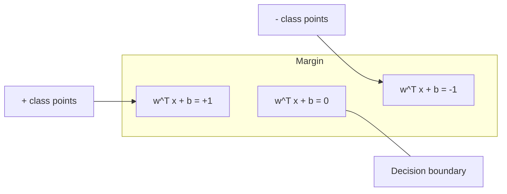
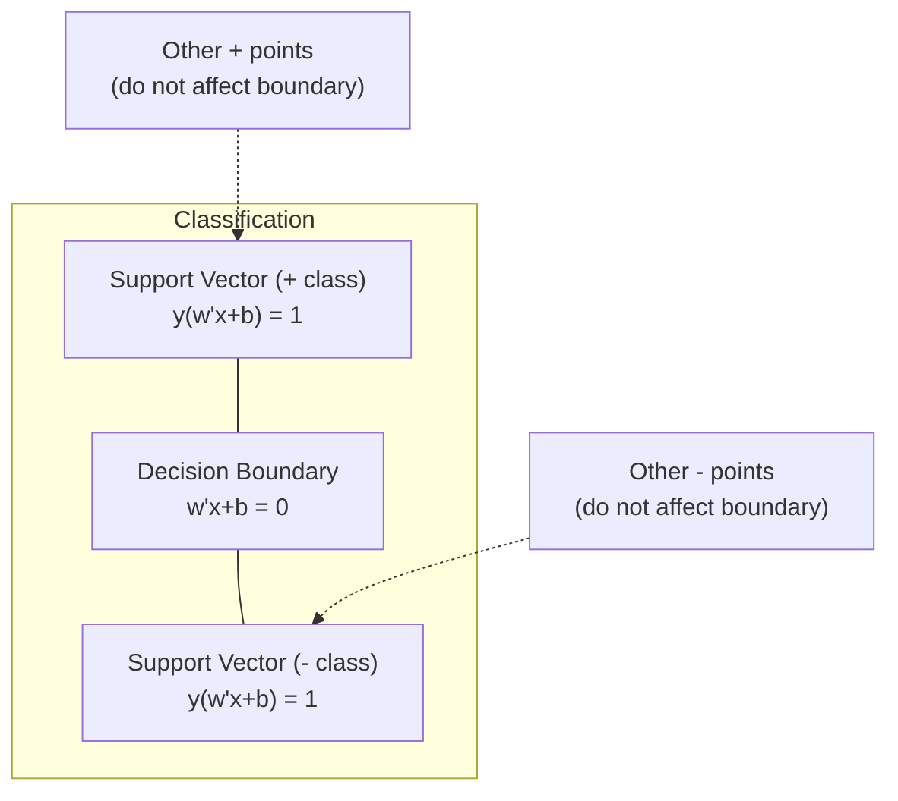
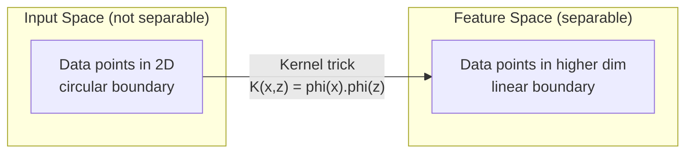

# Machines vectorielles de soutien
# 支持向量机 (SVM)


> Trouvez la rue la plus large entre deux classes.

> Trouver la plus large rue entre les deux catégories.

**Type:** Build | **类型：** 构建
**Language:**Je suis un Python .**语言：**Python
**Prerequisites:** Phase 1 (Lessons 08 Optimization, 14 Norms and Distances, 18 Convex Optimization) | **前置知识：** Phase 1（第 8 课优化、第 14 课范数与距离、第 18 课凸优化）
**Time:** ~90 minutes | **时间：** 约 90 分钟

## Objectifs d'apprentissage

- Implementer un SVM linéaire à partir de zéro en utilisant la perte de charnière et la baisse de gradient sur la formulation primaire
  L'utilisation de la couche de perte et de la gradience à la forme originale a diminué de zéro à réaliser la SVM linéaire
- Expliquer le principe de marge maximale et identifier les vecteurs de soutien d'un modèle formé
  解释最大间隔原理,并从训练好的模型中识别支持向量
- Comparer les noyaux linéaires, polynomiels et RBF et expliquer comment la ruse du noyau évite une cartographie explicite haute dimension
  Comparer nucléaire linéaire, nucléaire multi-étoiles et nucléaire RBF, expliquer comment éviter une projection de haute densité
- Évaluer l'offre contrôlée par le paramètre C entre la largeur des marges et les erreurs de classification
   évaluer le poids entre la largeur d'intervalle et la classe d'erreur du contrôle des paramètres


> **【中文解读】**
> SVM 找到最大间隔的分类边界――核技巧让 SVM 在高维空间中处理非线性问题直观理解就是升维后再切分――sklearn 中的 SVC/SVR──文本分类、图像识别中曾广泛使用──

> **【拓展：SVM 在深度学习时代仍然重要的场景】**
> Le SVM dans les petits ensembles de données (de centaines à milliers d'échantillons) est toujours meilleur que le deep learning. Google utilise le SVM en ligne dans les premiers déchets de messagerie (LIBLINEAR), car le TF-IDF présente des caractéristiques de haute taille mais de faible échantillon.

## Le problème , l' introduction du problème

Vous avez deux classes de points de données et vous devez dessiner une ligne (ou hyperplane) les séparant.

> Vous avez deux types de points de données, vous devez dessiner une ligne (ou un superplaine) pour les séparer.

La marge est la distance entre la limite de décision et les points de données les plus proches de chaque côté.

> L'intervalle le plus grand est la limite de décision à la distance des points de données les plus proches de chaque côté.

Cette intuition conduit à Support Vector Machines, l'un des algorithmes les plus élégants mathématiquement de ML. Les SVM étaient la méthode de classification dominante avant l'apprentissage profond et restent le meilleur choix pour les petits ensembles de données, les données haute dimension et les problèmes où vous avez besoin d'un modèle fondé sur des principes, bien compris avec des garanties théoriques.

> Cette intuition a donné lieu à l'un des algorithmes les plus élégants de la mathématiques intermédiaires. Avant l'apprentissage en profondeur, le SVM était la méthode de classification principale, et il est encore aujourd'hui le meilleur choix pour les questions de petite quantité de données, de haute quantité de données et de garantie théorique.

Les SVM se connectent directement à la phase 1: l'optimisation est convexe (leçon 18), la marge est mesurée avec des normes (leçon 14), et le truc du noyau exploite les produits dotés pour gérer des limites non linéaires sans jamais calculer dans l'espace haute dimension.

> SVM et phase 1 sont directement liés: l'amélioration est de la conjoncture (§ 18), l'intervalle avec le nombre de mesures (§ 14), l'utilisation des techniques nucléaires pour le traitement des points et le traitement des frontières non-linéaires sans avoir besoin de calculer dans le haut espace.

> **【中文解读】**
> Le principe de l'intervalle est le plus large, le plus grand, le plus confiant, le plus généralisé. Il n'y a que quelques points sur la frontière de l'intervalle qui déterminent la frontière de la décision, et les autres points n'affectent pas les résultats.

## Le concept de base.

### Le classement de marge maximale

Compte tenu des données séparables linéairement avec des étiquettes y_i dans {-1, +1} et des vecteurs de fonction x_i, nous voulons un hyperplane w^T x + b = 0 qui sépare les classes.

> 给定标签 y_i 为 {-1, +1} 线性可分数据和特征向量 x_i, nous avons besoin d'un super-plan w^T x + b = 0 pour séparer les catégories。

La distance entre un point x_i et l'hyperplane est:

> Points x_i à la distance de l'extrême plane sont:

```
distance = |w^T x_i + b| / ||w||
```

Pour un point correctement classé: y_i * (w^T x_i + b) > 0. La marge est le double de la distance de l'hyperplane au point le plus proche de chaque côté.

> Pour le point de type: y_i * (w^T x_i + b) > 0──, l'intervalle est supérieur à la surface des deux côtés.



Le problème de l'optimisation:

> 优化问题:

```
maximize    2 / ||w||     (the margin width)
subject to  y_i * (w^T x_i + b) >= 1  for all i
```

En équivalence (minimiser les risques est plus facile à optimiser):

> Égalité de travail:

```
minimize    (1/2) ||w||^2
subject to  y_i * (w^T x_i + b) >= 1  for all i
```

Il s'agit d'un programme quadratique convexe. Il a une solution globale unique. Les points de données qui se trouvent exactement sur les limites de la marge (où y_i * (w^T x_i + b) = 1) sont les vecteurs de support. Ils sont les seuls points qui déterminent la limite de décision.

> Ceci est un problème de planification de seconde dimension. Il a une solution globale unique. Il est bien situé sur un point de données intermédiaire.

### Vecteurs de soutien: les quelques critiques



La plupart des points de formation sont sans importance. Seuls les vecteurs de support comptent. C'est pourquoi les SVM sont efficaces en termes de mémoire au moment de la prédiction: vous n'avez besoin que de stocker les vecteurs de support, pas l'ensemble du jeu de formation.

> La plupart des points de formation sont sans rapport. Seuls les vecteurs de support fonctionnent. C'est la raison pour laquelle SVM est plus efficace en temps de prévision: vous avez seulement besoin de stocker les vecteurs de support, et non l'ensemble du groupe de formation.

Le nombre de vecteurs de support donne également une limite sur l'erreur de généralisation.

> Le nombre de volumes de support donne également la limite de l'erreur de généralisation.

### Marge douce: traitement du bruit avec le paramètre C

Les données réelles sont rarement parfaitement séparables. Certains points peuvent être du mauvais côté de la limite ou à l'intérieur de la marge.

> Les données réelles sont peu complètes. Certains points peuvent être en erreur de bordure, ou en intervalles.

```
minimize    (1/2) ||w||^2 + C * sum(xi_i)
subject to  y_i * (w^T x_i + b) >= 1 - xi_i
            xi_i >= 0  for all i
```

La variable de laxité xi_i mesure la quantité de point i qui viole la marge.

> 松变量 xi_i 衡量点 i 违反间隔的程度──C 控制权衡:

| C value | Behavior |
|---------|----------|
| Large C | Penalizes violations heavily. Narrow margin, fewer misclassifications. Overfits |
| Small C | Allows more violations. Wide margin, more misclassifications. Underfits |

| C 值 | 行为 |
|------|------|
| 大 C | 严重惩罚违规。窄间隔，较少误分类。易过拟合 |
| 小 C | 允许更多违规。宽间隔，较多误分类。易欠拟合 |

C est la force de régulation, inversée.

> C est la force de l'équation opposée.

### Perte de l'accrochage: la fonction de perte de SVM

Le SVM de marge douce peut être réécrit comme une optimisation sans contrainte:

> 软间隔 SVM peut être réécrit pour l'optimisation sans restriction:

```
minimize    (1/2) ||w||^2 + C * sum(max(0, 1 - y_i * (w^T x_i + b)))
```

Le terme max(0, 1 - y_i * f(x_i)) est la perte de charnière. Il est zéro lorsque le point est correctement classé et au-delà de la marge. Il est linéaire lorsque le point est à l'intérieur de la marge ou mal classé.

> 项 max(0, 1 - y_i * f(x_i)) est la perte de page.

```
Hinge loss for a single point:

loss
  |
  | \
  |  \
  |   \
  |    \
  |     \_______________
  |
  +-----|-----|-------->  y * f(x)
       0     1

Zero loss when y*f(x) >= 1 (correctly classified, outside margin).
Linear penalty when y*f(x) < 1.
```

Comparer avec la perte logistique (régrésion logistique):

> Comparer avec la perte logique de la réintégration:

```
Hinge:     max(0, 1 - y*f(x))          Hard cutoff at margin
Logistic:  log(1 + exp(-y*f(x)))        Smooth, never exactly zero
```

La perte de coque produit des solutions rares (seuls les vecteurs de support ont une contribution non nulle). La perte logistique utilise tous les points de données.

> 合页损失产生稀疏解(只有支持向量有非零贡献)―逻辑损失使用所有数据点―这使SVM在预测时更省内存―

### Formation d'un SVM linéaire avec descente de gradient

Vous pouvez entraîner un SVM linéaire en utilisant la descente de gradient sur la perte de charnière plus la régularisation de L2, sans résoudre le QP restreint:

> Vous pouvez utiliser la formation de la L2 sur la formation de la L2 en utilisant la formation de la L2 en utilisant la formation de la L2 en utilisant la L2 en utilisant la L2 en utilisant la L2 en utilisant la L2 en utilisant la L2 en utilisant la L2 en utilisant la L2 en utilisant la L2 en utilisant la L2 en utilisant la L2 en utilisant la L2 en utilisant la L2 en utilisant la L2 en utilisant l'utilisation de l2 en utilisant l'utilisation de l2 en utilisant l'utilisation de l2 en utilisant l'utilisation de l2 en utilisant l'utilisation de l2 en utilisant l2 en utilisant l2 en utilisant l2 en utilisant l2 en utilisant l2 en utilisant l2 en utilisant l2 en utilisant l2 en utilisant l2 en utilisant l2 en utilisant l2 en utilisant l2 en utilisant l2 en utilisant l2 en utilisant l2 en utilisant l2 en utilisant l2 en utilisant l2 en utilisant l2 en utilisant l2 en utilisant l2 en utilisant l2 en utilisant l2 en utilisant l2 en utilisant l2 en utilisant l2 dans l2 dans l2 dans l2 dans l2 dans l2 dans l2 dans l2 dans l2 dans l2 dans l2 dans l2 dans l2 dans l2 dans l2 dans l2 dans l2 dans l2 dans l2 dans l2 dans l2 dans l2 dans l2 dans l2 dans l2 dans l2 dans l2 dans l2 dans l2 dans l2 dans l2 dans l2 dans l2 dans l2 dans l2 dans l2 dans l2 dans l2 dans l2 dans l2 dans l2 dans l2 dans l2 dans l2 dans l2 dans l2 dans l2 dans l2 dans l l2 dans l2 dans l2 dans l2 dans l2 dans l l2 dans l l2 dans l2 dans l l l l l l l l2 dans l2 dans l l2 dans l2 dans l l l l2 dans l l l l l l2 dans l l l l l l l2 dans l l l l l2 dans l l l l

```
L(w, b) = (lambda/2) * ||w||^2 + (1/n) * sum(max(0, 1 - y_i * (w^T x_i + b)))

Gradient with respect to w:
  If y_i * (w^T x_i + b) >= 1:  dL/dw = lambda * w
  If y_i * (w^T x_i + b) < 1:   dL/dw = lambda * w - y_i * x_i

Gradient with respect to b:
  If y_i * (w^T x_i + b) >= 1:  dL/db = 0
  If y_i * (w^T x_i + b) < 1:   dL/db = -y_i
```

Cette formule est appelée la formulation primaire. Elle fonctionne en O ((n * d) par époque, où n est le nombre d'échantillons et d est le nombre de caractéristiques. Pour les données de grande taille, rares, haute dimension (classification du texte), c'est rapide.

> Ceci est appelé forme originale. Pour chaque tour de fonctionnement, le temps est O (n * d), dont n est le nombre de échantillons, d est le nombre de caractéristiques.

> **【中文解读】**
> 合页损失(Hinge Loss) est la fonction de perte centrale de SVM: lorsque le échantillon est correctement classé et à l'extérieur de l'intervalle, la perte est de 0, sinon punition de ligne.

### La double formulation et le truc du noyau

Le double Lagrangien du problème SVM (à partir de la leçon de phase 1, conditions KKT) est:

> La formation en matière de RSE est basée sur la phase 1 (class 18 KKT 条件) pour:

```
maximize    sum(alpha_i) - (1/2) * sum_ij(alpha_i * alpha_j * y_i * y_j * (x_i . x_j))
subject to  0 <= alpha_i <= C
            sum(alpha_i * y_i) = 0
```

Le dual ne concerne que les produits de point x_i. x_j entre les points de données. C'est l'idée clé. Remplacez chaque produit de point par une fonction de noyau K(x_i, x_j) et le SVM peut apprendre les limites non linéaires sans jamais calculer explicitement la transformation.

> Pour une forme occasionnelle, il s'agit uniquement de points de calcul entre les points de données x_i. x_j. Ceci est un aperçu clé.

```
Linear kernel:      K(x, z) = x . z
Polynomial kernel:  K(x, z) = (x . z + c)^d
RBF (Gaussian):     K(x, z) = exp(-gamma * ||x - z||^2)
```

Le noyau RBF cartographiera les données dans un espace dimensionnel infini. Les points proches de l'espace d'entrée ont une valeur de noyau proche de 1.

> RBF 核将数据映射到无限维空间――输入空间中相近点核值接近1――远离点核值接近0――它能学习任何光滑的决策边界――



Le truc du noyau calcule le produit des points dans l'espace haute dimension sans jamais y aller. Pour le noyau polynomial de degré d dans les dimensions D, l'espace de caractéristiques explicite a des dimensions O(D^d. Mais K(x, z) est calculé en temps O(D).

> 核技巧在高维空间中计算点积而无需实际到达那里──对于 D 维中的 d 次多项式核,显式特征空间有 O  D 维──但 K  X, z   时间计算──

> **【中文解读】**
> Le nucléaire est le plus beau des contributions mathématiques du SVM. La forme parallèle ne concerne que les points de données entre les points x_i · x_j, et est remplacé par la fonction nucléaire K(x_i, x_j) qui peut être apprise à haute altitude, même à un niveau illimité dans l'espace, sans avoir besoin de calculs explicites.

> **【拓展：核技巧的思想在现代 AI 中的延续】**
> Le concept de la conception nucléaire est un concept qui est utilisé dans le processus de calcul de la similitude et de la mécanisation de la mécanique de concentration de la transformateur.

### MTS pour la régression (MTS)

Le support vecteur de régression fixe un tube d'epsilon de largeur autour des données. les points à l'intérieur du tube ont une perte zéro. les points à l'extérieur du tube sont pénalisés linéairement.

> 支持向量回归在数据周围拟合一个宽度为一的管道──管道内的点损失为零──管道外的点被线性惩罚──

```
minimize    (1/2) ||w||^2 + C * sum(xi_i + xi_i*)
subject to  y_i - (w^T x_i + b) <= epsilon + xi_i
            (w^T x_i + b) - y_i <= epsilon + xi_i*
            xi_i, xi_i* >= 0
```

Le paramètre epsilon contrôle la largeur du tube. un tube plus large = moins de vecteurs de support = plus lissé. un tube plus étroit = plus de vecteurs de support = plus serré.

> Epsilon paramètres de contrôle du tuyau largeur。 un tuyau plus large = un tuyau plus petit = un tuyau plus étroit = un tuyau plus petit = un tuyau plus étroit

### Pourquoi les SVM ont perdu face à l'apprentissage profond (et quand ils gagnent encore)

Les SVM ont dominé la ML de la fin des années 1990 au début des années 2010.

> Le SVM a dirigé le ML à la fin des années 90 et au début des années 2010.

| Factor | SVMs | Deep learning |
|--------|------|---------------|
| Feature engineering | Requires it | Learns features |
| Scalability | O(n^2) to O(n^3) for kernel | O(n) per epoch with SGD |
| Image/text/audio | Needs handcrafted features | Learns from raw data |
| Large datasets (>100k) | Slow | Scales well |
| GPU acceleration | Limited benefit | Massive speedup |

| 因素 | SVM | 深度学习 |
|------|-----|---------|
| 特征工程 | 需要手动 | 自动学习 |
| 可扩展性 | 核方法 O(n^2) 到 O(n^3) | SGD 每轮 O(n) |
| 图像/文本/音频 | 需要手工特征 | 从原始数据学习 |
| 大数据集（>10 万） | 较慢 | 扩展性好 |
| GPU 加速 | 有限收益 | 大幅提速 |

Les SVM gagnent toujours dans ces situations:
- Petits ensembles de données (de centaines à des milliers d'échantillons)
  小数据集 ((100 à plusieurs milliers de échantillons)
- Données rares à haute dimension (texte avec caractéristiques TF-IDF)
  Résultats de la recherche sur les données
- Lorsque vous avez besoin de garanties mathématiques (limites de marge)
  需要数学保证时(间隔边界)
- Lorsque le temps de formation doit être minimal (la SVM linéaire est très rapide)
  Le temps d'entraînement doit être le plus court
- Classification binaire avec structure de marge claire
  具有清晰间隔结构的二分类
- Détection d'anomalies (MAS de classe unique)
  异常检测(单类 SVM)

> SVM dans les cas suivants encore victoire:

## Construisez-le et mettez-le en œuvre.
```figure
svm-margin
```

## Faites-le

### Étape 1: Perte de crevasse et dégradation

Comptez la perte de charnière pour un lot et sa dégradation.

> 基础―― calculer la perte de couverture et la dégradation d'un ensemble de données―

```python
def hinge_loss(X, y, w, b):
    n = len(X)
    total_loss = 0.0
    for i in range(n):
        margin = y[i] * (dot(w, X[i]) + b)  # 计算样本到决策边界的函数间隔
        total_loss += max(0.0, 1.0 - margin)  # 合页损失：间隔 < 1 时才有惩罚
    return total_loss / n  # 返回平均损失
```

### Étape 2: SVM linéaire par descente de gradient

Traînez en minimisant les pertes de charnières régulières.

> 通过最小化正则合并损失训练──无需 QP 求解器──

```python
class LinearSVM:
    def __init__(self, lr=0.001, lambda_param=0.01, n_epochs=1000):
        self.lr = lr  # 学习率
        self.lambda_param = lambda_param  # 正则化参数（对应 1/C）
        self.n_epochs = n_epochs
        self.w = None  # 权重向量
        self.b = 0.0  # 偏置

    def fit(self, X, y):
        n_features = len(X[0])
        self.w = [0.0] * n_features
        self.b = 0.0

        for epoch in range(self.n_epochs):
            for i in range(len(X)):
                margin = y[i] * (dot(self.w, X[i]) + self.b)  # 函数间隔
                if margin >= 1:
                    # 样本在间隔之外，只需正则化梯度
                    self.w = [wj - self.lr * self.lambda_param * wj
                              for wj in self.w]
                else:
                    # 样本在间隔内或被误分类，需要额外的损失梯度
                    self.w = [wj - self.lr * (self.lambda_param * wj - y[i] * X[i][j])
                              for j, wj in enumerate(self.w)]
                    self.b -= self.lr * (-y[i])

    def predict(self, X):
        return [1 if dot(self.w, x) + self.b >= 0 else -1 for x in X]  # 根据符号预测类别
```

### Étape 3: Fonctions du noyau

Implémenter des noyaux linéaires, polynomiels et RBF.

> 实现线性核、多项式核和 RBF 核──

```python
def linear_kernel(x, z):
    return dot(x, z)  # 线性核：直接点积

def polynomial_kernel(x, z, degree=3, c=1.0):
    return (dot(x, z) + c) ** degree  # 多项式核：(x·z + c)^d

def rbf_kernel(x, z, gamma=0.5):
    diff = [xi - zi for xi, zi in zip(x, z)]  # 计算差向量
    return math.exp(-gamma * dot(diff, diff))  # RBF 核：exp(-γ||x-z||²)
```

### Étape 4: Identification des vecteurs de marge et de support

Après l'entraînement, identifiez quels points sont des vecteurs de support et calculez la largeur de marge.

>  Après l'entraînement, identifiez quels points sont supportés par le volume et calculent l'intervalle de largeur

```python
def find_support_vectors(X, y, w, b, tol=1e-3):
    support_vectors = []
    for i in range(len(X)):
        margin = y[i] * (dot(w, X[i]) + b)
        if abs(margin - 1.0) < tol:
            support_vectors.append(i)
    return support_vectors
```

Regardez !`code/svm.py`pour la mise en œuvre complète avec toutes les démonstrations.

> 完整实现(含所有演示) voir `code/svm.py`Il y a une autre.

## Utilisez-le avec le cadre de réalisation

> **【中文解读】**
> L'utilisation de SVM dans les systèmes de calcul est essentielle: 1) il faut d'abord normaliser les caractéristiques de la SVM à la mesure des caractéristiques, car elles sont sensibles à l'intervalle; 2) le petit groupe de données avec le SVC (supportant la fonction nucléaire), le grand groupe de données avec le LinierSVC (utilisant la forme originale, O (n) chaque tour); 3) le gamma contrôle l'impact de la RBF sur la gamme de la gamme de données, trop grande, trop petite, trop petite, trop petite.

Avec scikit-apprendre:

> Utilisez le scikit-learn:

```python
from sklearn.svm import SVC, LinearSVC, SVR
from sklearn.preprocessing import StandardScaler
from sklearn.pipeline import Pipeline

# 标准化 + SVM 的标准管线
clf = Pipeline([
    ("scaler", StandardScaler()),  # 标准化是 SVM 的必选项
    ("svm", SVC(kernel="rbf", C=1.0, gamma="scale")),  # RBF 核 SVM
])
clf.fit(X_train, y_train)
print(f"Accuracy: {clf.score(X_test, y_test):.4f}")
print(f"Support vectors: {clf['svm'].n_support_}")
```

Important: étalonnez toujours vos caractéristiques avant de former un SVM. Les SVM sont sensibles aux magnitudes des caractéristiques car la marge dépend des caractéristiques non étalonnées et déforment la géométrie.

> important: entraînement SVM                                                                                                                                                                                                                                                           

Pour les grands ensembles de données, utiliser `LinearSVC`(formulation primaire, O(n) par époque) au lieu de `SVC`(double formule, O(n^2) à O(n^3)):

> 对于大数据集,使用 `LinearSVC`(原始形式,每轮 O(n)) plutôt que `SVC`(à titre occasionnel, O(n^2) à O(n^3)):

```python
from sklearn.svm import LinearSVC

clf = Pipeline([
    ("scaler", StandardScaler()),
    ("svm", LinearSVC(C=1.0, max_iter=10000)),
])
```

## Les exercices

1. Générer un ensemble de données séparables linéairement en 2D. Exercer votre LinearSVM et identifier les vecteurs de support. Vérifiez que les vecteurs de support sont les points les plus proches de la limite de décision.
   1. Il est également possible de créer un ensemble de données 2D 线性可分.

2. Varier C de 0,001 à 1000 sur un ensemble de données bruyant. Tracer la limite de décision pour chaque valeur C. Observer la transition de large marge (déficit de coût) à étroite marge (surcoût).
   2. Dans le groupe de données de bruit, le C va passer de 0,001 à 1000. Pour chaque C, la valeur de la décision est de tracer les limites.

3. Créer un ensemble de données où les limites des classes sont circulaires (pas linéaires). Afficher qu'un SVM linéaire échoue. Compute la matrice du noyau RBF et montrer que les classes deviennent séparables dans l'espace des caractéristiques induit par le noyau.
   3.  Créer un ensemble de données de classe limite en forme ronde  non-linear  展示线性 SVM 失败 计算 RBF 核矩阵,展示在核诱导的特征空间中类别变得可分──

4. Comparez la perte de charnière et la perte logistique sur le même ensemble de données. Exercez un SVM linéaire et une régression logistique. Comptez combien de points de formation contribuent à la limite de décision de chaque modèle (vecteurs de support contre tous les points).
   4. Dans le même ensemble de données, comparer les pertes de la page et les pertes logiques.

5. Mettez en œuvre SVR (perte insensible à l'epsilon). Ajoutez-le à y = sin(x) + bruit.
   5. 实现 SVR(epsilon 不敏感损失) ・拟合 y = sin(x) + noise──绘制预测周围的epsilon 管道并标记支持向量(管道外的点)。

## Les termes clés

| Term | What it actually means |
|------|----------------------|
| Support vectors | The training points closest to the decision boundary. The only points that determine the hyperplane |
| Margin | The distance between the decision boundary and the nearest support vectors. SVMs maximize this |
| Hinge loss | max(0, 1 - y*f(x)). Zero when correctly classified and outside the margin. Linear penalty otherwise |
| C parameter | Trade-off between margin width and classification errors. Large C = narrow margin, small C = wide margin |
| Soft margin | SVM formulation that allows margin violations via slack variables. Handles non-separable data |
| Kernel trick | Computing dot products in a high-dimensional feature space without explicitly mapping to that space |
| Linear kernel | K(x, z) = x . z. Equivalent to standard dot product. For linearly separable data |
| RBF kernel | K(x, z) = exp(-gamma * \|\|x-z\|\|^2). Maps to infinite dimensions. Learns any smooth boundary |
| Polynomial kernel | K(x, z) = (x . z + c)^d. Maps to a feature space of polynomial combinations |
| Dual formulation | Reformulation of the SVM problem that depends only on dot products between data points. Enables kernels |
| SVR | Support Vector Regression. Fits an epsilon-tube around the data. Points inside the tube have zero loss |
| Slack variables | xi_i: measures how much a point violates the margin. Zero for correctly classified points outside margin |
| Maximum margin | The principle of choosing the hyperplane that maximizes the distance to the nearest points of each class |

## Encore une lecture

- [Vapnik: The Nature of Statistical Learning Theory (1995)](https://link.springer.com/book/10.1007/978-1-4757-3264-1)- le texte fondamental sur les MSS et l'apprentissage statistique
  [Vapnik: The Nature of Statistical Learning Theory (1995)](https://link.springer.com/book/10.1007/978-1-4757-3264-1)- Le programme de formation et de formation
- [Cortes & Vapnik: Support-vector networks (1995)](https://link.springer.com/article/10.1007/BF00994018)- le papier SVM original
  [Cortes & Vapnik: Support-vector networks (1995)](https://link.springer.com/article/10.1007/BF00994018)- SVM Originaires
- [Platt: Sequential Minimal Optimization (1998)](https://www.microsoft.com/en-us/research/publication/sequential-minimal-optimization-a-fast-algorithm-for-training-support-vector-machines/)- l'algorithme de gestion des risques qui a rendu la formation des risques de gestion des risques pratique
  [Platt: Sequential Minimal Optimization (1998)](https://www.microsoft.com/en-us/research/publication/sequential-minimal-optimization-a-fast-algorithm-for-training-support-vector-machines/)- Pour que l'entraînement SVM devienne pratique
- [scikit-learn SVM documentation](https://scikit-learn.org/stable/modules/svm.html)- un guide pratique avec des détails de mise en œuvre
  [scikit-learn SVM 文档](https://scikit-learn.org/stable/modules/svm.html)- 实用指南及实现细节
- [LIBSVM: A Library for Support Vector Machines](https://www.csie.ntu.edu.tw/~cjlin/libsvm/)- la bibliothèque C++ derrière la plupart des implémentations SVM
  [LIBSVM](https://www.csie.ntu.edu.tw/~cjlin/libsvm/)- La plupart des SVM  réaliser derrière la C++ 库
