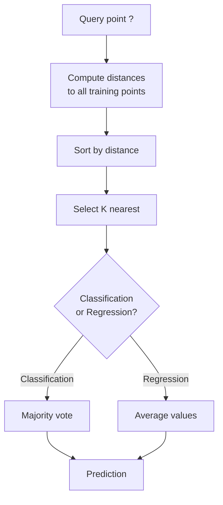
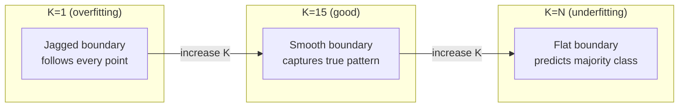
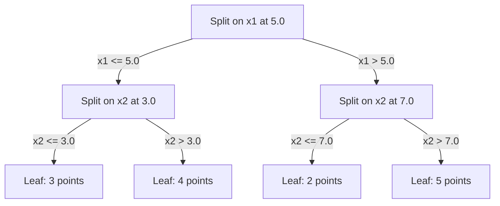

# K- Les voisins les plus proches et les distances
# K proximité avec distance


> On peut tout stocker, prédire en regardant les voisins, l'algorithme le plus simple qui fonctionne.

> 储存一切――预测时看邻居―― le plus simple mais vraiment efficace

**Type:** Build | **类型：** 构建
**Language:**Je suis un Python .**语言：**Python
**Prerequisites:** Phase 1 (Lesson 14 Norms and Distances) | **前置知识：** Phase 1（第 14 课范数与距离）
**Time:** ~90 minutes | **时间：** 约 90 分钟

## Objectifs d'apprentissage

- Implementer la classification et la régression des KNN à partir de zéro avec K configurable et vote pondéré à distance
  Retour à la valeur K et à la distance de la participation au vote
- Comparer les mesures de distance L1, L2, cosine et Minkowski et sélectionner la bonne pour un type de données donné
  Comparer la mesure de distance L1、L2、YY string et可夫斯基, pour choisir la mesure appropriée pour un type de données donné
- Expliquer la malédiction de la dimensionnalité et démontrer pourquoi le KNN se dégrade dans les espaces haute dimension
  Expliquer la dimension catastrophe, démontrer pourquoi KNN dans le haute dimension de l'espace performance baisse
- Construire un arbre KD pour une recherche et une analyse efficaces du voisin le plus proche quand il dépasse la force brute
  Construire KD 树进行高效 近邻搜索,分析它何时优于暴力搜索


> **【中文解读】**
> Le concept central de KNN est de voir à quel type de voisinage le plus proche de vous, de prévoir quel type de voisinage il existe.

> **【拓展：KNN 思想在现代 AI 中的广泛应用】**
> RAG(检索增强生成) 本质就是 KNN:将用户问题编码为向量,在向量数据库中搜索 K 个最相似的文档片段,再将它们提供给 LLM 生成答――Spotify's音乐推使用近似近邻的近邻的方法 (ANN) 在数亿首歌中找到相似的;Pinterest's image search using visual embedding + KNN──KNN's ideas are everywhere, just data structure and size are different──

## Le problème , l' introduction du problème

Vous avez un ensemble de données. Un nouveau point de données arrive. Vous devez le classer ou prédire sa valeur. Au lieu d'apprendre des paramètres à partir des données (comme la régression linéaire ou les SVM), vous trouvez simplement les points de formation K les plus proches du nouveau point et les laissez voter.

> Vous avez un ensemble de données. Un nouveau point de données est arrivé. Vous devez le classer ou prédire sa valeur. Vous n'avez pas besoin d'apprendre des paramètres de données, comme le regression linéaire ou le SVM.

Il n'y a pas de phase d'entraînement, pas de paramètres à apprendre, pas de fonction de perte à minimiser, vous stockez l'ensemble de l'ensemble d'entraînement et comptez les distances au moment de la prédiction.

> C'est le K proche voisinage. Il n'y a pas de phase de formation. Il n'y a pas besoin de paramètres de formation. Il n'y a pas besoin de fonction de perte minimale.

Il semble trop simple à travailler. Mais KNN est étonnamment compétitif pour de nombreux problèmes, en particulier avec de petits à moyens ensembles de données, et sa compréhension révèle profondément des concepts fondamentaux: le choix de la métrique de distance (connexion à la phase 1 Leçon 14), la malédiction de la dimensionnalité, et la différence entre l'apprentissage paresseux et ardent.

> Il semble trop simple, mais le KNN est particulièrement compétitif sur de nombreux problèmes, en particulier pour les petits ensembles de données.

KNN apparaît également partout dans l'IA moderne, sous différents noms. Les bases de données vectorielles recherchent KNN sur les emblèmes. La génération augmentée de récupération (RAG) trouve les trous de documents K les plus proches. Les systèmes de recommandation trouvent des utilisateurs ou des éléments similaires. L'algorithme est le même. L'échelle et les structures de données sont différentes.

> KNN est absent dans l'IA moderne, juste nom différent.

> **【中文解读】**
> Le KNN est un processus d'apprentissage sans formation, prédiction et calcul de distance.

## Le concept de base.

### Comment fonctionne KNN

Compte tenu d'un ensemble de données de points étiquetés et d'un nouveau point de requête:

>  donner un ensemble de données avec un label et un nouveau point de recherche:

1. Calculer la distance de la requête à chaque point de l'ensemble de données
    calculer la distance entre chaque point de recherche et le centre de données
2. Réglage par distance
   按距离排序
3. Prenez les points les plus proches de K
   取 K 个最近的点
4. Pour la classification: vote majoritaire parmi les voisins K
   Répartition des tâches: K 个邻居中多数投票
5. Pour la régression: moyenne (ou moyenne pondérée) des valeurs des voisins K
   Retour à la tâche: K 个邻居值的平均(或加权平均)



C'est l'algorithme, pas de réglage, pas de descente de gradient, pas d'époques.

> C'est le tout. Il n'y a pas de changement.

### Choisir K

K est l'hyperparamètre unique.

> K est le seul superparamètre. Il contrôle le poids du parité-parité:

| K | Behavior |
|---|----------|
| K = 1 | Decision boundary follows every point. Zero training error. High variance. Overfits |
| Small K (3-5) | Sensitive to local structure. Can capture complex boundaries |
| Large K | Smoother boundaries. More robust to noise. May underfit |
| K = N | Predicts the majority class for every point. Maximum bias |

| K | 行为 |
|---|------|
| K = 1 | 决策边界跟随每个点。训练误差为零。高方差。过拟合 |
| 小 K (3-5) | 对局部结构敏感。能捕捉复杂边界 |
| 大 K | 更平滑的边界。对噪声更鲁棒。可能欠拟合 |
| K = N | 每个点都预测多数类。最大偏差 |

Un point de départ commun est K = sqrt(N) pour un ensemble de données de N points.

> La valeur initiale habituelle est K = sqrt(N)(N 为数据集大小)。二分类使用奇数 K 以避免平票。



### Mesures de distance

La fonction de distance définit ce que signifie "près".

> La fonction distance définit le sens de " proche ": différentes mesures produisent différents voisins, différentes prévisions.

**L2 (Euclidean)**est la distance par défaut.

> **L2（欧氏距离）**Il est à la recherche de la solution.

```
d(a, b) = sqrt(sum((a_i - b_i)^2))
```

Sensitif à l'échelle des caractéristiques.

> L2 est essentiel à la normalisation des caractéristiques dans les KNN.

**L1 (Manhattan)**Il est plus robuste à des valeurs étrangères que L2 parce qu'il ne quadrate pas les différences.

> **L1（曼哈顿距离）**Pour une valeur de différence absolue, il faut la comparer à L2, car elle n'est pas de valeur de différence carrée.

```
d(a, b) = sum(|a_i - b_i|)
```

**Cosine distance**Il mesure l'angle entre les vecteurs, sans tenir compte de la magnitude.

> **余弦距离**La mesure des angles entre les volumes, négligez la taille.

```
d(a, b) = 1 - (a . b) / (||a|| * ||b||)
```

**Minkowski**généralise L1 et L2 avec paramètre p.

> **闵可夫斯基距离**Utilisation des paramètres P  推广了 L1 和 L2 ⋅

```
d(a, b) = (sum(|a_i - b_i|^p))^(1/p)

p=1: Manhattan
p=2: Euclidean
p->inf: Chebyshev (max absolute difference)
```

Quelle métrique utiliser dépend des données:

> 选择哪种度取决于数据:

| Data type | Best metric | Why |
|-----------|------------|-----|
| Numeric features, similar scale | L2 (Euclidean) | Default, works for spatial data |
| Numeric features, outliers | L1 (Manhattan) | Robust, does not amplify large differences |
| Text embeddings | Cosine | Magnitude is noise, direction is meaning |
| High-dimensional sparse | Cosine or L1 | L2 suffers from curse of dimensionality |
| Mixed types | Custom distance | Combine metrics per feature type |

| 数据类型 | 最佳度量 | 原因 |
|---------|--------|------|
| 数值特征，量级相近 | L2（欧氏） | 默认选择，适合空间数据 |
| 数值特征，有异常值 | L1（曼哈顿） | 鲁棒，不放大大的差异 |
| 文本嵌入 | 余弦 | 大小是噪声，方向是含义 |
| 高维稀疏 | 余弦或 L1 | L2 受维度灾难影响 |
| 混合类型 | 自定义距离 | 按特征类型组合度量 |

### Nénine pondérée

Le KNN standard donne le même poids à tous les voisins de K. Mais un voisin à distance 0,1 devrait être plus important qu'un voisin à distance 5.0.

> La norme KNN donne le même poids à tous les voisins K. Mais une distance de 0,1 voisin devrait être plus importante que celle de 5,0.

**Distance-weighted KNN**peses de chaque voisin inversement par distance:

> **距离加权 KNN**按距离的倒数加权每邻居:

```
weight_i = 1 / (distance_i + epsilon)

For classification: weighted vote
For regression:     weighted average = sum(w_i * y_i) / sum(w_i)
```

L'epsilon empêche la division par zéro lorsqu'un point de requête correspond exactement à un point d'entraînement.

> Epsilon  empêcher le point de requête de se correspondre complètement

Le KNN pondéré est moins sensible au choix de K parce que les voisins éloignés contribuent très peu indépendamment.

> Le K n'est pas très sensible au choix de K, car les voisins éloignés, peu importe la valeur de K, contribuent très peu.

### La malédiction de la dimensionnalité

Les performances du KNN se dégradent dans de grandes dimensions.

> La performance de KNN est en déclin à un niveau élevé.

**Problem 1: distances converge.**À mesure que la dimensionnalité augmente, le rapport de la distance maximale à la distance minimale approche 1. Tous les points deviennent également "éloignés" de la requête.

> **问题 1：距离趋同。** Avec l'augmentation de la dimension, la distance maximale et la distance minimale se rapprochent de 1 ∙ tout devient différent du point de recherche ∙

```
In d dimensions, for random uniform points:

d=2:    max_dist / min_dist = varies widely
d=100:  max_dist / min_dist ~ 1.01
d=1000: max_dist / min_dist ~ 1.001

When all distances are nearly equal, "nearest" is meaningless.
```

**Problem 2: volume explodes.**Pour capturer les voisins K dans une fraction fixe des données, vous devez étendre votre rayon de recherche pour couvrir une fraction beaucoup plus grande de l'espace de fonctionnalités.

> **问题 2：体积爆炸。**Pour capturer K 个邻居 dans une proportion fixe de données, il faut étendre le demi-sort de recherche à une plus grande proportion de l'espace de couverture.

**Problem 3: corners dominate.**Dans un hypercube d'unité de dimension d, la plupart du volume est concentré près des coins, pas au centre.

> **问题 3：角落主导。**Dans les unités superquadrés, la plupart de l'épaisseur se concentre à proximité du coin, et non au centre. Avec la croissance, la proportion de l'épaisseur contenue dans les sphères du squadré s'approche de zéro.

Consequence pratique: KNN fonctionne bien jusqu'à environ 20 à 50 fonctionnalités. Au-delà de cela, vous avez besoin de réduction de dimensionnalité (PCA, UMAP, t-SNE) avant d'appliquer KNN, ou vous devez utiliser des structures de recherche basées sur des arbres qui exploitent la dimensionnalité inférieure intrinsèque des données.

> 实际后果:KNN 在约20-50 个特征下面效果好――超过这个范围,需要在应用KNN前进行降维(PCA、UMAP、t-SNE),或使用数据内在低维性的树搜索结构――

### Les arbres de KD: recherche rapide du voisin le plus proche

Le KNN de force brute calcule la distance de la requête à chaque point de formation. c'est O(n * d) par requête. Pour les grands ensembles de données, c'est trop lent.

> 暴力 KNN 计算查询点到每训练点的距离――每次查询 O(n * d)―― pour le gros de données cluster est trop lent――

Un arbre KD partage récursivement l'espace le long des axes de caractéristiques.

> KD 树沿特征轴递归划分空间―― chaque couche parallèle à une dimension dans la valeur moyenne est divisée――



Pour trouver le voisin le plus proche, traversez l'arbre jusqu'à la feuille contenant la requête, puis retracez-vous et vérifiez les partitions voisines seulement si elles peuvent contenir des points plus proches.

> Pour trouver le voisin le plus proche, traversez le arbre jusqu'au point de recherche, puis revenez et ne cherchez que dans le quartier le plus proche.

Temps moyen de requête: O(log n) pour les dimensions faibles. Mais les arbres KD se dégradent à O(n) dans les dimensions élevées (d > 20) parce que le retrait élimine de moins en moins de branches.

> 低维平均查询时间:O(log n) ・・・ mais KD 树在高维(d > 20) 时退化为O(n),因为回溯消除的分支越来越少──

### Les arbres à billes: mieux adaptés aux dimensions modérées

Les arbres de boules divisent les données en hypersphères nichées au lieu de boîtes alignées sur les axes. Chaque nœud définit une boule (centre + rayon) qui contient tous les points de ce sous-arbre.

> Le ball tree divisera les données en super-balles de plaques et non en boîtes axées. Chaque nœud définit une boule contenant le centre + le demi-dimension du ball tree.

Avantages par rapport aux KD:
- Fonctionner mieux dans des dimensions modérées (jusqu'à ~50)
  Dans le milieu de la taille (maximum de 50°) l'effet est meilleur
- Manche à structure non alignée sur un axe
  能处理 non axé à structure
- Les volumes de bord sont plus étroits, ce qui signifie que plus de branches sont taillées lors de la recherche.
  Un cercle plus étroit signifie que la recherche coupe plus de branches

Les arbres KD et les arbres à billes sont des algorithmes exacts. Pour la recherche à grande échelle (des millions de points, des centaines de dimensions), les méthodes voisines approximatives (HNSW, IVF, quantification des produits) sont utilisées à la place.

> Pour une recherche à grande échelle, il faut utiliser des méthodes de proximité approximative (HNSW, IVF, multiplication).

### L'apprentissage paresseux contre l'apprentissage par avidité

Le KNN est un apprenant paresseux: il ne travaille pas au moment de la formation et tout travaille au moment de la prédiction. La plupart des autres algorithmes (régrésion linéaire, SVM, réseaux neuronaux) sont des apprenants avides: ils effectuent des calculs lourds au moment de la formation pour construire un modèle compact, puis les prédictions sont rapides.

> KNN est un apprenant inerte: pendant l'entraînement, il ne fait aucun travail, tout est accompli pendant la prédiction. La plupart des autres algorithmes (Linear Returns, SVM, Networks) sont un apprenant actif.

| Aspect | Lazy (KNN) | Eager (SVM, neural net) |
|--------|------------|------------------------|
| Training time | O(1) just store data | O(n * epochs) |
| Prediction time | O(n * d) per query | O(d) or O(parameters) |
| Memory at prediction | Store entire training set | Store model parameters only |
| Adapts to new data | Add points instantly | Retrain the model |
| Decision boundary | Implicit, computed on the fly | Explicit, fixed after training |

| 方面 | 懒惰学习 (KNN) | 积极学习 (SVM, 神经网络) |
|------|---------------|------------------------|
| 训练时间 | O(1) 仅存储数据 | O(n * epochs) |
| 预测时间 | 每次查询 O(n * d) | O(d) 或 O(参数) |
| 预测时内存 | 存储整个训练集 | 仅存储模型参数 |
| 适应新数据 | 即时添加点 | 重新训练模型 |
| 决策边界 | 隐式，即时计算 | 显式，训练后固定 |

L'apprentissage paresseux est idéal lorsque:
- Les données changent fréquemment (ajouter/supprimer des points sans recyclage)
  Numéro de changement de données (non nécessaire)
- Vous avez besoin de prédictions pour très peu de questions
  Il suffit de faire une prédiction pour très peu de questions.
- Vous voulez zéro temps d'entraînement
  需要零训练时间
- Le jeu de données est assez petit pour que la recherche brute force soit rapide
  Les données sont assez petites, la violence est très rapide.

> 惰学习 dans les situations suivantes est le plus idéal:

### KNN pour la régression

Au lieu de voter à la majorité, la KNN pour la régression moyenne les valeurs cibles des voisins K.

> Le KNN ne reçoit pas la majorité des voix, mais la moyenne des cibles de K 个邻居.

```
prediction = (1/K) * sum(y_i for i in K nearest neighbors)

Or with distance weighting:
prediction = sum(w_i * y_i) / sum(w_i)
where w_i = 1 / distance_i
```

La régression KNN produit des prédictions de partage constante (ou partage lisse avec pondération). Elle ne peut pas extrapoler au-delà de la portée des données de formation. Si les objectifs de formation sont tous compris entre 0 et 100, KNN ne prédira jamais 200.

> La prédiction de KNN retour à la production de fractionnement de fréquence (s) ne peut être dépassée par la portée des données de formation. Si la valeur cible de l'entraînement est entre 0 et 100, la KNN ne prédira jamais la prédiction de 200.

> **【中文解读】**
> Le KNN ne peut pas être utilisé comme prédiction de la valeur moyenne de l'objectif de l'entraînement. Si la valeur de l'objectif de l'entraînement est comprise entre 0 et 100, il ne prédit jamais 200.

> **【拓展：大规模最近邻搜索——从 KNN 到 FAISS】**
> Lorsque la taille des données est passée de milliers à des milliards de fois, le KNN est utilisé à la fois. Ces approches approximatives de la FAISS sont utilisées pour réduire la précision des recherches à 100 à 1000 fois plus vite.

## Construisez-le et mettez-le en œuvre.
```figure
knn-smoothness
```

## Faites-le

### Étape 1: Fonctions de distance

Mettez en œuvre les distances L1, L2, cosine et Minkowski.

> ∞ réaliser L1、L2、余弦和可夫斯基距离──

```python
import math

def l2_distance(a, b):
    return math.sqrt(sum((ai - bi) ** 2 for ai, bi in zip(a, b)))  # 欧氏距离（L2 范数）

def l1_distance(a, b):
    return sum(abs(ai - bi) for ai, bi in zip(a, b))  # 曼哈顿距离（L1 范数）

def cosine_distance(a, b):
    dot_val = sum(ai * bi for ai, bi in zip(a, b))  # 点积
    norm_a = math.sqrt(sum(ai ** 2 for ai in a))  # 向量 a 的模
    norm_b = math.sqrt(sum(bi ** 2 for bi in b))  # 向量 b 的模
    if norm_a == 0 or norm_b == 0:
        return 1.0
    return 1.0 - dot_val / (norm_a * norm_b)  # 余弦距离 = 1 - 余弦相似度

def minkowski_distance(a, b, p=2):
    if p == float('inf'):
        return max(abs(ai - bi) for ai, bi in zip(a, b))  # p=∞ 时为切比雪夫距离
    return sum(abs(ai - bi) ** p for ai, bi in zip(a, b)) ** (1 / p)  # 闵可夫斯基距离
```

### Étape 2: Classificateur et régresseur KNN

Construire le KNN complet avec K configurable, mesure de distance et pondération de distance optionnelle.

> Construire une KNN complète, soutenir la configuration K ∆ distance de mesure et la capacité de distance choisie 

```python
class KNN:
    def __init__(self, k=5, distance_fn=l2_distance, weighted=False,
                 task="classification"):
        self.k = k
        self.distance_fn = distance_fn
        self.weighted = weighted
        self.task = task
        self.X_train = None
        self.y_train = None

    def fit(self, X, y):
        self.X_train = X
        self.y_train = y

    def predict(self, X):
        return [self._predict_one(x) for x in X]
```

### Étape 3: Arbre KD pour une recherche efficace

Construisez un arbre KD à partir de zéro qui se divise récursivement sur la médiane de chaque dimension.

> De la conception de KD 树, le centre de chaque dimension est divisé en

```python
class KDTree:
    def __init__(self, X, indices=None, depth=0):
        # Recursively partition the data
        self.axis = depth % len(X[0])
        # Split on median of the current axis
        ...

    def query(self, point, k=1):
        # Traverse to leaf, then backtrack
        ...
```

Regardez !`code/knn.py`pour la mise en œuvre complète avec toutes les méthodes et démonstrations auxiliaires.

> 完整实现 (incluant toutes les méthodes et démonstrations de l'aide) voir `code/knn.py`Il y a une autre.

### Étape 4: Écalement des caractéristiques

KNN nécessite une mise à l'échelle des caractéristiques car les distances sont sensibles aux magnitudes des caractéristiques.

> La KNN a besoin de caractéristiques réduites, car la distance est sensible aux niveaux de caractéristiques.

```python
def standardize(X):
    n = len(X)
    d = len(X[0])
    means = [sum(X[i][j] for i in range(n)) / n for j in range(d)]
    stds = [
        max(1e-10, (sum((X[i][j] - means[j]) ** 2 for i in range(n)) / n) ** 0.5)
        for j in range(d)
    ]
    return [[((X[i][j] - means[j]) / stds[j]) for j in range(d)] for i in range(n)], means, stds
```

## Utilisez-le avec le cadre de réalisation

Avec scikit-apprendre:

> Utilisez le scikit-learn:

```python
from sklearn.neighbors import KNeighborsClassifier
from sklearn.preprocessing import StandardScaler
from sklearn.pipeline import Pipeline

clf = Pipeline([
    ("scaler", StandardScaler()),
    ("knn", KNeighborsClassifier(n_neighbors=5, metric="euclidean")),
])
clf.fit(X_train, y_train)
print(f"Accuracy: {clf.score(X_test, y_test):.4f}")
```

Scikit-learn utilise automatiquement des arbres KD ou des arbres boules lorsque le jeu de données est assez grand et la dimensionnalité est assez basse.`algorithm`Paramètre.

> En effet, les données de la base de données sont assez grandes et de taille suffisamment faible pour être utilisées automatiquement.`algorithm`- Je suis en train de le faire.

Pour la recherche de voisin le plus proche à grande échelle (millions de vecteurs), utilisez FAISS, Annoy ou une base de données vectorielle:

> Pour les recherches de proximité à grande échelle (millions de km/h), utilisez la base de données FAISS、Annoy ou km/h:

```python
import faiss

index = faiss.IndexFlatL2(dimension)
index.add(embeddings)
distances, indices = index.search(query_vectors, k=5)
```

> **【拓展：从 KNN 到向量数据库——AI 基础设施的演进】**
> L'idée de KNN est le cœur de l'infrastructure moderne d'IA. RAC (en anglais seulement: RAG) est de rechercher des documents connexes dans la base de données de données de données de KNN; de recommander le système de recherche de produits similaires dans des centaines de milliards de vecteurs; de rechercher des images avec l'intégration CLIP + FAISS pour réaliser un processus de recherche de données de données de segmentation. Le marché de la base de données de données de segmentation (Pinecone, Milvus, Weaviate, Qdrant) devrait atteindre une taille de 40 milliards de dollars en 2025, son algorithme central reste une variante de haute efficacité de KNN.

## Les exercices

1. Implémenter la classification KNN sur un ensemble de données 2D de 3 classes. Tracer la limite de décision pour K=1, K=5, K=15, et K=N. Observer la transition de la suradaptation à la sous-adaptation.
   1. Dans les 3 catégories de données 2D, réaliser KNN par catégorie.

2. Générez 1000 points aléatoires dans 2, 5, 10, 50, 100 et 500 dimensions. Pour chaque dimensionnalité, calculer le rapport de la distance paritaire maximale à la distance paritaire minimale.
   2. Dans les dimensions 2、5、10、50、100 et 500, chaque dimension génère 1000 points aléatoires. Pour chaque dimension, calculer la proportion maximale de distance à la proportion minimale de distance.

3. Comparer L1, L2 et la distance cosine pour KNN sur un problème de classification du texte (utiliser des vecteurs TF-IDF). Quelle mesure donne la meilleure précision? Pourquoi le cosine a-t-il tendance à gagner pour le texte?
   3. Dans le texte, le taux de précision est le plus élevé. Pourquoi le taux de précision est-il le plus élevé ?

4. Mettez en œuvre un arbre KD et mesurez le temps de requête par rapport à la force brute pour des ensembles de données de 1k, 10k et 100k points en 2D, 10D et 50D. À quelle dimension le arbre KD cesse d'être plus rapide que la force brute?
   4.  réaliser KD 树, mesure 1k、10k 和 100k point entre 2D、10D 和 50D temps de recherche et la recherche violente

5. Construisez un régresseur KNN pondéré pour y = sin(x) + bruit. Comparer avec un KNN non pondéré pour K=3, 10, 30. Montrez que la pondération produit des prédictions plus fluides, en particulier pour les K de grande taille.
   5. Pour y = sin(x) + bruit 构建加权 KNN 回归器──在 K=3、10、30 时与未加权 KNN 比较──展示加权产生更光滑的预测,特别是大 K时──

## Les termes clés

| Term | What it actually means |
|------|----------------------|
| K-nearest neighbors | Non-parametric algorithm that predicts by finding the K closest training points to a query |
| Lazy learning | No computation at training time. All work happens at prediction time. KNN is the canonical example |
| Eager learning | Heavy computation at training time to build a compact model. Most ML algorithms are eager |
| Curse of dimensionality | In high dimensions, distances converge and neighborhoods expand to cover most of the space, making KNN ineffective |
| KD-tree | Binary tree that recursively partitions space along feature axes. O(log n) queries in low dimensions |
| Ball tree | Tree of nested hyperspheres. Works better than KD-trees in moderate dimensions (up to ~50) |
| Weighted KNN | Neighbors weighted inversely by distance. Closer neighbors have more influence on the prediction |
| Feature scaling | Normalizing features to comparable ranges. Required for distance-based methods like KNN |
| Majority vote | Classification by counting which class is most common among K neighbors |
| Brute force search | Computing distance to every training point. O(n*d) per query. Exact but slow for large n |
| Approximate nearest neighbor | Algorithms (HNSW, LSH, IVF) that find approximately nearest points much faster than exact search |
| Voronoi diagram | The partition of space where each region contains all points closer to one training point than any other. K=1 KNN produces Voronoi boundaries |

## Encore une lecture

- [Cover & Hart: Nearest Neighbor Pattern Classification (1967)](https://ieeexplore.ieee.org/document/1053964)- le document KNN fondamental prouvant qu'il a un taux d'erreur au plus deux fois supérieur à l'optimal Bayes
  [Cover & Hart: Nearest Neighbor Pattern Classification (1967)](https://ieeexplore.ieee.org/document/1053964)-                                                                                                                                                                                                                                                                                                                                                                                                                                                                                                                             
- [Friedman, Bentley, Finkel: An Algorithm for Finding Best Matches in Logarithmic Expected Time (1977)](https://dl.acm.org/doi/10.1145/355744.355745)- le papier original KD-tree
  [Friedman, Bentley, Finkel: An Algorithm for Finding Best Matches in Logarithmic Expected Time (1977)](https://dl.acm.org/doi/10.1145/355744.355745)- KD 树原始论文
- [Beyer et al.: When Is "Nearest Neighbor" Meaningful? (1999)](https://link.springer.com/chapter/10.1007/3-540-49257-7_15)- analyse formelle de la malédiction de la dimensionnalité pour le voisin le plus proche
  [Beyer et al.: When Is "Nearest Neighbor" Meaningful? (1999)](https://link.springer.com/chapter/10.1007/3-540-49257-7_15)- Analyse officielle de la catastrophe de la région
- [scikit-learn Nearest Neighbors documentation](https://scikit-learn.org/stable/modules/neighbors.html)- guide pratique avec sélection d'algorithmes
  [scikit-learn 最近邻文档](https://scikit-learn.org/stable/modules/neighbors.html)- 实用指南及算法选择
- [FAISS: A Library for Efficient Similarity Search](https://github.com/facebookresearch/faiss)- La bibliothèque de Meta pour la recherche de voisin le plus proche à l'échelle de milliards
  [FAISS](https://github.com/facebookresearch/faiss)- Meta de la classe des milliards approximativement la plus proche de la recherche
