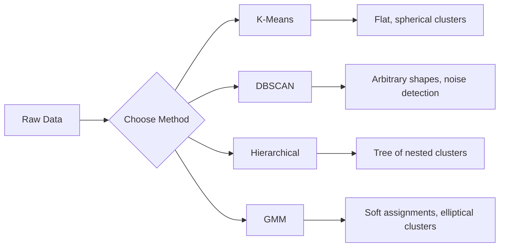

# Apprendre sans surveillance
# 无监督学习


> Aucune étiquette, aucun professeur, l'algorithme trouve sa structure.

> Il n'y a pas de marque, pas de professeur.

**Type:** Build | **类型：** 构建
**Languages:** Python
**Prerequisites:** Phase 1 (Norms & Distances, Probability & Distributions), Phase 2 Lessons 1-6 | **前置知识：** Phase 1（范数与距离、概率与分布），Phase 2 第 1-6 课
**Time:** ~90 minutes | **时间：** 约 90 分钟

## Objectifs d'apprentissage

- Implémenter les modèles K-Means, DBSCAN et Gaussian Mix from scratch et comparer leur comportement de regroupement
  De la réalisation à zéro K-Means、DBSCAN 和高斯混合模型 (GMM), comparer leurs comportements de regroupement
- Évaluer la qualité du cluster en utilisant le score de la silhouette et la méthode du coude pour sélectionner le K optimal
  Utilisation du nombre de roues et du coude pour évaluer la qualité des classes, sélectionner le meilleur K
- Expliquer quand DBSCAN dépasse K-Means et identifier l'algorithme qui traite les grappes et les échelles non sphériques
   Expliquer DBSCAN 何時優越K-Means, identifier quel type d'algorithme peut traiter les formes non-ballées et les valeurs anormales
- Construire un pipeline de détection des anomalies en utilisant des méthodes de regroupement pour désigner les points qui dévient des schémas normaux
  Utilisation de méthode de concentration pour construire des tubes de test anormaux, marquant des points de déviation du mode normal


> **【中文解读】**
> 无监督学习没有标签, l'objectif est de trouver la structure dans les données. K-Means est le plus classique de l'algorithme de cluster.

> **【拓展：无监督学习在真实 AI 系统中的价值】**
> Le système de classification des photos de Google Photos utilise un algorithme similaire à celui des photos de personnages, de lieux et de scènes; la fonction "découvrir" de Spotify utilise le système de classification des utilisateurs de Google Photos; la recherche des flux de données en réseau avec le DBSCAN/Isolation Forest.

## Le problème , l' introduction du problème

Chaque leçon de ML jusqu'à présent a supposé des données étiquetées: " voici une entrée, voici la sortie correcte. " Dans le monde réel, les étiquettes sont chères. Un hôpital a des millions de dossiers de patients, mais personne n'a marqué manuellement chacun d'eux avec une catégorie de maladie. Un site de commerce électronique a des millions de sessions d'utilisateurs mais personne n'a de segments de clients étiquetés à la main. Une équipe de sécurité a des journaux de réseau mais personne n'a détecté chaque anomalie.

>  Tous les cours précédents présumés avoir des données marquées: " C'est une entrée, c'est une sortie correcte. " Dans le monde réel, les marquages sont chers.  Dans un hôpital, il y a des millions de dossiers de patients, mais personne ne marque chaque catégorie de maladies.  Dans un site de commerce électronique, il y a des millions de sessions d'utilisateurs, mais personne ne marque les clients.

L'apprentissage non supervisé trouve des modèles sans qu'on lui dise quoi chercher. Il regroupe des points de données similaires, découvre des structures cachées et supprime des anomalies.

> 无监督学习在没有被告知寻找什么的情况下发现模式――它将相似的数据点分组,发现隐藏结构,揭露异常――如果监督学习是从有答案的教科书学习,无监督学习就是从原始数据到模式自显现――

Le problème: sans étiquettes, vous ne pouvez pas mesurer directement "bien" ou "mal". Vous avez besoin de différents outils pour évaluer si la structure que votre algorithme a trouvée est significative.

> 关键问题: pas de label, vous ne pouvez pas mesurer directement "à" ou "erreur"― vous avez besoin de différents outils pour évaluer si la structure de l'algorithme est significative.

> **【中文解读】**
> Le défi central de l'apprentissage sans surveillance est l'évaluation: aucun étiquette ne peut mesurer directement le " contre-erreur " . Il faut utiliser le contour de la ligne de référence, le code de l'épaule, etc. pour évaluer indirectement la masse de classe .

## Le concept de base.

### Les groupes: regrouper des choses similaires

Le clustering attribue chaque point de données à un groupe (cluster) de sorte que les points du même groupe sont plus similaires les uns aux autres que les points des autres groupes.

> Le groupe distribuera chaque point de données à un groupe, ce qui rendra les points du même groupe plus semblables aux autres.



### K-Means: Le cheval de travail

K-Means partage les données en clusters K exactement. Chaque cluster a un centre de masse, et chaque point appartient au centre de masse le plus proche.

> K-Means va précisément diviser les données en K 个──, chacun a un质心, chacun appartient au dernier质心──.

L'algorithme de Lloyd:

> Lloyd 算法:

1. Choisissez K points aléatoires comme centres initiaux
   随机选择 K 个点作为初始质心
2. Assignez chaque point de données au centre-point le plus proche
   Distribuer chaque point de données au centre de données le plus proche
3. Récupérez chaque centroid comme la moyenne de ses points attribués
   重新计算 pour chaque qualité pour sa valeur moyenne de point de distribution
4. Répétez les étapes 2-3 jusqu'à ce que les tâches cessent de changer
   重复步骤 2-3 jusqu'à ce que la répartition ne change plus

La fonction objective (inertie) mesure la distance carrée totale de chaque point à son centre-point assigné. K-Means le minimise, mais ne trouve qu'un minimum local.

> 目標函数 (慣性) Mesure la distance totale du point à son point de distribution. K-Mens le réduit le plus possible, mais ne trouve que la valeur minimale locale.

### Choisir K

Deux méthodes standard:

> 两种标准方法:

**Elbow method:**Exécuter K-Means pour K = 1, 2, 3, ..., n. Inertie de la trace vs K. Rechercher le "coude-d'épaule" où l'ajout de plus de grappes cesse de réduire l'inertie de manière significative.

> **肘部法则：**Pour K = 1, 2, 3, ..., n 运行 K-Means──绘制惯性对 K 的图──寻找"肘部"增加更多不再显著减少惯性的位置──

**Silhouette score:**Pour chaque point, mesurez à quel point il est similaire à son propre cluster (a) par rapport à l'autre cluster (b). Le coefficient de silhouette est (b - a) / max(a, b), allant de -1 (cluster erroné) à +1 (bien regroupé).

> **轮廓系数：**Pour chaque point, mesurer sa similitude avec soi (a) par rapport aux autres points de similitude (b) ⋅ la fréquence de rotation est (b - a) / max (a, b), la portée va de -1 ⋅ error ⋅ ⋅ ⋅ ⋅ ⋅ ⋅ ⋅ ⋅ ⋅ ⋅ ⋅ ⋅ ⋅ ⋅ ⋅ ⋅ ⋅ ⋅ ⋅ ⋅ ⋅ ⋅ ⋅ ⋅ ⋅ ⋅ ⋅ ⋅ ⋅ ⋅ ⋅ ⋅ ⋅ ⋅ ⋅ ⋅ ⋅ ⋅ ⋅ ⋅ ⋅ ⋅ ⋅ ⋅ ⋅ ⋅ ⋅ ⋅ ⋅ ⋅ ⋅ ⋅ ⋅ ⋅ ⋅ ⋅ ⋅ ⋅ ⋅ ⋅ ⋅ ⋅ ⋅ ⋅ ⋅ ⋅ ⋅ ⋅ ⋅ ⋅ ⋅ ⋅ ⋅ ⋅ ⋅ ⋅ ⋅ ⋅ ⋅ ⋅ ⋅ ⋅ ⋅ ⋅ ⋅ ⋅ ⋅ ⋅ ⋅ ⋅ ⋅ ⋅ ⋅ ⋅ ⋅ ⋅ ⋅ ⋅ ⋅ ⋅ ⋅ ⋅ ⋅ ⋅ ⋅ ⋅ ⋅ ⋅ ⋅ ⋅ ⋅ ⋅ ⋅ ⋅ ⋅ ⋅ ⋅                                                                                                                                                                                                                             

### DBSCAN: Clustering basé sur la densité

K-Means suppose que les amas sont sphériques et vous oblige à choisir K à l'avance. DBSCAN ne fait aucune hypothèse.

> K-Mens 假设是球形的且需要预选 K;;DBSCAN 不做这些假设;;

Deux paramètres:
- **eps**: le rayon d'un quartier
  **eps**: à moitié
- **min_samples**: le nombre minimum de points nécessaires pour former une région dense
  **min_samples**: le nombre minimum de points nécessaires pour former une zone densément peuplée

Trois types de points:
- **Core point**: a au moins min_samples points à distance d'eps
  **核心点**: dans les éps  distance  au moins il y a des min_samples 个点
- **Border point**: dans les épis d'un point central mais pas lui-même un point central
  **边界点**: dans le cadre de l'eps du point central, mais en soi pas le point central
- **Noise point**Les résultats de la recherche ont été obtenus en vue de la réalisation de la recherche et de la recherche.
  **噪声点**Les valeurs de l'économie sont les valeurs de l'économie.

DBSCAN connecte les points de base qui sont à l'intérieur des eps les uns des autres dans le même cluster.

> DBSCAN se connecteront les uns aux autres dans le même point de la scène de l'eps.

Les forces: trouve des amas de toute forme, détermine automatiquement le nombre de clusters, identifie des valeurs anormales.

> 优势: trouver des formes de , déterminer automatiquement  quantité, identifier des valeurs anormales

### Clusterage hiérarchique

Construit un arbre (dendrogramme) de grappes nichées.

> 构建嵌套的树树状图)

Agglomératif (de bas en haut):

> 聚合式 ((自底上):

1. Commencez par chaque point comme son propre cluster
   Chacun commence à être son propre.
2. Fusez les deux amas les plus proches
   合并两个最近的
3. Répétez jusqu' à ce qu' un seul groupe reste
   Je ne veux pas que tu me fasses peur.
4. Coupez le dendrogramme au niveau souhaité pour obtenir des grappes K
   On obtient des coupe-arbre à des niveaux élevés.

La "proximité" entre les amas peut être mesurée comme suit:
- **Single linkage**: distance minimale entre les deux points des deux groupes
  **单链接**: la distance minimale entre deux points
- **Complete linkage**: distance maximale entre les deux points
  **全链接**: la distance maximale entre les deux points
- **Average linkage**: distance moyenne entre toutes les paires
  **平均链接**: la distance moyenne de tous les points
- **Ward's method**: la fusion qui provoque la plus petite augmentation de la variance totale au sein du cluster
  **Ward 方法**: entraînant une augmentation du total des différences

### Modèles de mélange gaussiens (GMM)

K-Means donne des assignations difficiles: chaque point appartient à un cluster précis. GMM donne des assignations douces: chaque point a une probabilité d'appartenir à chaque cluster.

> K-Mens  donner une distribution de fortune: chaque point appartient à un ──GMM  donner une distribution de fortune: chaque point a une probabilité de chaque ──

GMM suppose que les données sont générées à partir d'un mélange de distributions gaussiennes K, chacune avec sa propre moyenne et covariance.

> GMM 假设数据由 K 个高斯分布混合生成, chacun ayant sa propre moyenne et coefficient de différence.

- **E-step**: calculer la probabilité que chaque point appartient à chaque Gaussian
  **E 步**: calculer la probabilité de chaque point de distribution de chaque hauteur
- **M-step**: mettre à jour la moyenne, la covariance et le poids de mélange de chaque Gaussian pour maximiser la probabilité des données
  **M 步**: mettre à jour la moyenne de chaque distribution de hauteur, la différence de coupe et le poids mixte pour maximiser la comparaison des données

GMM peut modéliser des amas elliptiques (pas seulement sphériques comme K-Means) et gère naturellement des amas qui se chevauchent.

> GMM 能建模圆(不只是 K-Means 的球形), natur处理重叠──

### Quand utiliser lequel

| Method | Best for | Avoid when |
|--------|----------|------------|
| K-Means | Large datasets, spherical clusters, known K | Irregular shapes, outliers present |
| DBSCAN | Unknown K, arbitrary shapes, outlier detection | Varying densities, very high dimensions |
| Hierarchical | Small datasets, need dendrogram, unknown K | Large datasets (O(n^2) memory) |
| GMM | Overlapping clusters, soft assignments needed | Very large datasets, too many dimensions |

| 方法 | 最适合 | 避免使用 |
|------|--------|---------|
| K-Means | 大数据集，球形簇，已知 K | 不规则形状，有异常值 |
| DBSCAN | 未知 K，任意形状，异常检测 | 密度不均匀，极高维度 |
| 层次聚类 | 小数据集，需要树状图，未知 K | 大数据集（O(n^2) 内存） |
| GMM | 重叠簇，需要软分配 | 非常大的数据集，维度太高 |

### Détection des anomalies par agglomération

Le regroupement permet naturellement la détection des anomalies:
- **K-Means**: les points éloignés de tout centre sont des anomalies
  **K-Means**Le point de départ est une valeur inhabituelle .
- **DBSCAN**: les points de bruit sont des anomalies par définition
  **DBSCAN**Le bruit est une valeur anormale.
- **GMM**: les points avec une faible probabilité sous tous les Gaussiens sont des anomalies
  **GMM**Dans toutes les régions, la probabilité est très faible.

> 聚类天然支持异常检测:

## Construisez-le et mettez-le en œuvre.

> **【中文解读】**
> De la réalisation à zéro K-Means、DBSCAN 和高斯混合模型──K-Means 的三步代:随机初始化中心 → 分配每个点到最近中心 → 重新计算中心──重复直到收──DBSCAN de la région à haute densité commencer à se développer, automatiser le traitement du bruit dot──
```figure
kmeans-step
```

## Faites-le

### Étape 1: K-Mensures à partir de zéro

```python
import math
import random


def euclidean_distance(a, b):
    return math.sqrt(sum((ai - bi) ** 2 for ai, bi in zip(a, b)))


def kmeans(data, k, max_iterations=100, seed=42):
    random.seed(seed)
    n_features = len(data[0])

    centroids = random.sample(data, k)

    for iteration in range(max_iterations):
        clusters = [[] for _ in range(k)]
        assignments = []

        for point in data:
            distances = [euclidean_distance(point, c) for c in centroids]
            nearest = distances.index(min(distances))
            clusters[nearest].append(point)
            assignments.append(nearest)

        new_centroids = []
        for cluster in clusters:
            if len(cluster) == 0:
                new_centroids.append(random.choice(data))
                continue
            centroid = [
                sum(point[j] for point in cluster) / len(cluster)
                for j in range(n_features)
            ]
            new_centroids.append(centroid)

        if all(
            euclidean_distance(old, new) < 1e-6
            for old, new in zip(centroids, new_centroids)
        ):
            print(f"  Converged at iteration {iteration + 1}")
            break

        centroids = new_centroids

    return assignments, centroids
```

### Étape 2: méthode du coude et score de la silhouette

```python
def compute_inertia(data, assignments, centroids):
    total = 0.0
    for point, cluster_id in zip(data, assignments):
        total += euclidean_distance(point, centroids[cluster_id]) ** 2
    return total


def silhouette_score(data, assignments):
    n = len(data)
    if n < 2:
        return 0.0

    clusters = {}
    for i, c in enumerate(assignments):
        clusters.setdefault(c, []).append(i)

    if len(clusters) < 2:
        return 0.0

    scores = []
    for i in range(n):
        own_cluster = assignments[i]
        own_members = [j for j in clusters[own_cluster] if j != i]

        if len(own_members) == 0:
            scores.append(0.0)
            continue

        a = sum(euclidean_distance(data[i], data[j]) for j in own_members) / len(own_members)

        b = float("inf")
        for cluster_id, members in clusters.items():
            if cluster_id == own_cluster:
                continue
            avg_dist = sum(euclidean_distance(data[i], data[j]) for j in members) / len(members)
            b = min(b, avg_dist)

        if max(a, b) == 0:
            scores.append(0.0)
        else:
            scores.append((b - a) / max(a, b))

    return sum(scores) / len(scores)


def find_best_k(data, max_k=10):
    print("Elbow method:")
    inertias = []
    for k in range(1, max_k + 1):
        assignments, centroids = kmeans(data, k)
        inertia = compute_inertia(data, assignments, centroids)
        inertias.append(inertia)
        print(f"  K={k}: inertia={inertia:.2f}")

    print("\nSilhouette scores:")
    for k in range(2, max_k + 1):
        assignments, centroids = kmeans(data, k)
        score = silhouette_score(data, assignments)
        print(f"  K={k}: silhouette={score:.4f}")

    return inertias
```

### Étape 3: DBSCAN à partir de zéro

```python
def dbscan(data, eps, min_samples):
    n = len(data)
    labels = [-1] * n
    cluster_id = 0

    def region_query(point_idx):
        neighbors = []
        for i in range(n):
            if euclidean_distance(data[point_idx], data[i]) <= eps:
                neighbors.append(i)
        return neighbors

    visited = [False] * n

    for i in range(n):
        if visited[i]:
            continue
        visited[i] = True

        neighbors = region_query(i)

        if len(neighbors) < min_samples:
            labels[i] = -1
            continue

        labels[i] = cluster_id
        seed_set = list(neighbors)
        seed_set.remove(i)

        j = 0
        while j < len(seed_set):
            q = seed_set[j]

            if not visited[q]:
                visited[q] = True
                q_neighbors = region_query(q)
                if len(q_neighbors) >= min_samples:
                    for nb in q_neighbors:
                        if nb not in seed_set:
                            seed_set.append(nb)

            if labels[q] == -1:
                labels[q] = cluster_id

            j += 1

        cluster_id += 1

    return labels
```

### Étape 4: Modèle de mélange gaussien (algorithme EM)

```python
def gmm(data, k, max_iterations=100, seed=42):
    random.seed(seed)
    n = len(data)
    d = len(data[0])

    indices = random.sample(range(n), k)
    means = [list(data[i]) for i in indices]
    variances = [1.0] * k
    weights = [1.0 / k] * k

    def gaussian_pdf(x, mean, variance):
        d = len(x)
        coeff = 1.0 / ((2 * math.pi * variance) ** (d / 2))
        exponent = -sum((xi - mi) ** 2 for xi, mi in zip(x, mean)) / (2 * variance)
        return coeff * math.exp(max(exponent, -500))

    for iteration in range(max_iterations):
        responsibilities = []
        for i in range(n):
            probs = []
            for j in range(k):
                probs.append(weights[j] * gaussian_pdf(data[i], means[j], variances[j]))
            total = sum(probs)
            if total == 0:
                total = 1e-300
            responsibilities.append([p / total for p in probs])

        old_means = [list(m) for m in means]

        for j in range(k):
            r_sum = sum(responsibilities[i][j] for i in range(n))
            if r_sum < 1e-10:
                continue

            weights[j] = r_sum / n

            for dim in range(d):
                means[j][dim] = sum(
                    responsibilities[i][j] * data[i][dim] for i in range(n)
                ) / r_sum

            variances[j] = sum(
                responsibilities[i][j]
                * sum((data[i][dim] - means[j][dim]) ** 2 for dim in range(d))
                for i in range(n)
            ) / (r_sum * d)
            variances[j] = max(variances[j], 1e-6)

        shift = sum(
            euclidean_distance(old_means[j], means[j]) for j in range(k)
        )
        if shift < 1e-6:
            print(f"  GMM converged at iteration {iteration + 1}")
            break

    assignments = []
    for i in range(n):
        assignments.append(responsibilities[i].index(max(responsibilities[i])))

    return assignments, means, weights, responsibilities
```

### Étape 5: Générer des données de test et exécuter tout

```python
def make_blobs(centers, n_per_cluster=50, spread=0.5, seed=42):
    random.seed(seed)
    data = []
    true_labels = []
    for label, (cx, cy) in enumerate(centers):
        for _ in range(n_per_cluster):
            x = cx + random.gauss(0, spread)
            y = cy + random.gauss(0, spread)
            data.append([x, y])
            true_labels.append(label)
    return data, true_labels


def make_moons(n_samples=200, noise=0.1, seed=42):
    random.seed(seed)
    data = []
    labels = []
    n_half = n_samples // 2
    for i in range(n_half):
        angle = math.pi * i / n_half
        x = math.cos(angle) + random.gauss(0, noise)
        y = math.sin(angle) + random.gauss(0, noise)
        data.append([x, y])
        labels.append(0)
    for i in range(n_half):
        angle = math.pi * i / n_half
        x = 1 - math.cos(angle) + random.gauss(0, noise)
        y = 1 - math.sin(angle) - 0.5 + random.gauss(0, noise)
        data.append([x, y])
        labels.append(1)
    return data, labels


if __name__ == "__main__":
    centers = [[2, 2], [8, 3], [5, 8]]
    data, true_labels = make_blobs(centers, n_per_cluster=50, spread=0.8)

    print("=== K-Means on 3 blobs ===")
    assignments, centroids = kmeans(data, k=3)
    print(f"  Centroids: {[[round(c, 2) for c in cent] for cent in centroids]}")
    sil = silhouette_score(data, assignments)
    print(f"  Silhouette score: {sil:.4f}")

    print("\n=== Elbow Method ===")
    find_best_k(data, max_k=6)

    print("\n=== DBSCAN on 3 blobs ===")
    db_labels = dbscan(data, eps=1.5, min_samples=5)
    n_clusters = len(set(db_labels) - {-1})
    n_noise = db_labels.count(-1)
    print(f"  Found {n_clusters} clusters, {n_noise} noise points")

    print("\n=== GMM on 3 blobs ===")
    gmm_assignments, gmm_means, gmm_weights, _ = gmm(data, k=3)
    print(f"  Means: {[[round(m, 2) for m in mean] for mean in gmm_means]}")
    print(f"  Weights: {[round(w, 3) for w in gmm_weights]}")
    gmm_sil = silhouette_score(data, gmm_assignments)
    print(f"  Silhouette score: {gmm_sil:.4f}")

    print("\n=== DBSCAN on moons (non-spherical clusters) ===")
    moon_data, moon_labels = make_moons(n_samples=200, noise=0.1)
    moon_db = dbscan(moon_data, eps=0.3, min_samples=5)
    n_moon_clusters = len(set(moon_db) - {-1})
    n_moon_noise = moon_db.count(-1)
    print(f"  Found {n_moon_clusters} clusters, {n_moon_noise} noise points")

    print("\n=== K-Means on moons (will fail to separate) ===")
    moon_km, moon_centroids = kmeans(moon_data, k=2)
    moon_sil = silhouette_score(moon_data, moon_km)
    print(f"  Silhouette score: {moon_sil:.4f}")
    print("  K-Means splits moons poorly because they are not spherical")

    print("\n=== Anomaly detection with DBSCAN ===")
    anomaly_data = list(data)
    anomaly_data.append([20.0, 20.0])
    anomaly_data.append([-5.0, -5.0])
    anomaly_data.append([15.0, 0.0])
    anomaly_labels = dbscan(anomaly_data, eps=1.5, min_samples=5)
    anomalies = [
        anomaly_data[i]
        for i in range(len(anomaly_labels))
        if anomaly_labels[i] == -1
    ]
    print(f"  Detected {len(anomalies)} anomalies")
    for a in anomalies[-3:]:
        print(f"    Point {[round(v, 2) for v in a]}")
```

## Utilisez-le avec le cadre de réalisation

Avec scikit-learn, les mêmes algorithmes sont un liner:

> Utilisez un peu d'apprentissage, le même algorithme ne nécessite qu'une ligne de code:

```python
from sklearn.cluster import KMeans, DBSCAN, AgglomerativeClustering
from sklearn.mixture import GaussianMixture
from sklearn.metrics import silhouette_score as sklearn_silhouette

km = KMeans(n_clusters=3, random_state=42).fit(data)  # K-Means 聚类（默认 K-Means++ 初始化）
db = DBSCAN(eps=1.5, min_samples=5).fit(data)  # DBSCAN 密度聚类（eps 为邻域半径）
agg = AgglomerativeClustering(n_clusters=3).fit(data)  # 层次聚类
gmm_model = GaussianMixture(n_components=3, random_state=42).fit(data)  # 高斯混合模型（EM 算法）
```

Les versions à partir de zéro vous montrent exactement ce que ces bibliothèques calculent. K-Means itérée entre l'attribution et le recomptage. DBSCAN crée des grappes à partir de graines denses. GMM alternent entre l'attente et la maximisation. Les versions de bibliothèque ajoutent stabilité numérique, initialisation plus intelligente (K-Means++), et l'accélération de la GPU, mais la logique de base est la même.

> De la version zéro à vous montré ces bases de données jusqu'à ce qu'elles calculent. K-Means entre la distribution et le calcul de masse.

## Envoyez-le . Produit .

Cette leçon produit des implémentations de travail de K-Means, DBSCAN et GMM à partir de zéro. Le code de regroupement peut être réutilisé comme base pour des méthodes non supervisées plus avancées.

> Ce cours est issu de la réalisation de K-Means, DBSCAN et GMM.

> **【拓展：聚类在用户分群和推荐系统中的应用】**
> Spotify classifie les utilisateurs en groupes de goûts pour les groupes de musique. Les utilisateurs de chaque groupe ont des habitudes d'écoute similaires. Airbnb utilise les groupes de goûts pour optimiser le classement de recherche. Amazon utilise les groupes de goûts pour les groupes de goûts pour les groupes de goûts.

> **【中文解读】**
> 无监督学习的评估比监督学习更困难──轮系数衡量内密度对间分离度,范围 [-1, 1],越高越好──肘部法则寻找 WCSS(内平方和) Avec K 增加的"拐点"──GMM Utiliser EM 算法(期望最大化)交换更新分配和参数,比 K-Means 更灵活(圆而非球形)

## Les exercices

1. Implémenter l'initialisation K-Means++: au lieu de choisir des centroides aléatoires, choisissez le premier au hasard et chaque centroid suivant avec une probabilité proportionnelle à sa distance carrée du centroid existant le plus proche.
   1. 实现 K-Means++ Initiation: pas de sélection de qualité, mais de sélection de qualité, puis de sélection de probabilité de sélection de la distance carrée de la qualité précédente en comparaison avec la différence entre la vitesse de réception et la qualité initiale.
2. Ajoutez un regroupement hiérarchique à la liste. Implémenter le lien de Ward et produire un dendrogramme (comme une liste de fusions nichée). Coupez-le à différents niveaux et comparez-le aux résultats de K-Means.
   2. Pour la mise en œuvre de la mise en œuvre de la mise en œuvre de la mise en œuvre de la mise en œuvre de la mise en œuvre de la mise en œuvre de la mise en œuvre de la mise en œuvre de la mise en œuvre de la mise en œuvre de la mise en œuvre de la mise en œuvre de la mise en œuvre de la mise en œuvre de la mise en œuvre de la mise en œuvre de la mise en œuvre de la mise en œuvre de la mise en œuvre de la mise en œuvre de la mise en œuvre de la mise en œuvre de la mise en œuvre de la mise en œuvre de la mise en œuvre de la mise en œuvre de la mise en œuvre de la mise en œuvre de la mise en œuvre de la mise en œuvre de la mise en œuvre de la mise en œuvre de la mise en œuvre de la mise en œuvre de la mise en œuvre de la mise en œuvre de la mise en œuvre de la mise en œuvre de la mise en œuvre de la mise en œuvre de la mise en œuvre de la mise en œuvre de la mise en œuvre de la mise en œuvre de la mise en œuvre de la mise en œuvre de la mise en œuvre de la mise en œuvre de la mise en œuvre de la mise en œuvre de la mise en œuvre de la mise en œuvre de la mise en œuvre de la mise en œuvre de la mise en œuvre de la mise en œuvre de la mise en œuvre de la mise en œuvre de la mise en œuvre de la mise en œuvre de la mise en œuvre de la mise en œuvre de la mise en œuvre de la mise en œuvre de la mise en œuvre de la mise en œuvre de la mise en œuvre de la mise en œuvre de la mise en œuvre de la mise en œuvre de la mise en œuvre de la mise en mise en mise en mise en mise en mise en mise en mise en mise en mise en mise en mise en mise en mise en mise en mise en mise en mise en mise en mise en mise en mise en mise en mise en mise en mise en mise en mise en mise en mise en mise en mise en mise en mise en mise en mise en mise en mise en mise en mise en mise en mise en mise en mise en mise en mise en mise en mise en mise en mise en mise en mise en mise en mise en mise en mise en mise en mise en mise en mise en mise en mise en mise en mise en mise en mise en mise en mise en mise en mise en mise en mise en mise en mise en
3. Construire un pipeline simple de détection des anomalies: exécuter DBSCAN et GMM sur les mêmes données, les points de repère que les deux méthodes acceptent sont des avaries (bruit dans DBSCAN, faible probabilité dans GMM). Mesurer le chevauchement et discuter lorsque les méthodes ne sont pas d'accord.
   3. Construire une simple ligne de test d'anomalies: fonctionnant sur les mêmes données DBSCAN et GMM, marquer deux méthodes sont considérées comme des points d'anomalie((Noise dans DBSCAN, point de faible probabilité dans GMM)

## Les termes clés

| Term | What people say | What it actually means |
|------|----------------|----------------------|
| Clustering | "Grouping similar things" | Partitioning data into subsets where within-group similarity exceeds between-group similarity, measured by a specific distance metric |
| Centroid | "The center of a cluster" | The mean of all points assigned to a cluster; used by K-Means as the cluster representative |
| Inertia | "How tight the clusters are" | Sum of squared distances from each point to its assigned centroid; lower is tighter |
| Silhouette score | "How well-separated clusters are" | For each point, (b - a) / max(a, b) where a is mean intra-cluster distance and b is mean nearest-cluster distance |
| Core point | "A point in a dense region" | A point with at least min_samples neighbors within eps distance, in DBSCAN |
| EM algorithm | "Soft K-Means" | Expectation-Maximization: iteratively compute membership probabilities (E-step) and update distribution parameters (M-step) |
| Dendrogram | "A tree of clusters" | A tree diagram showing the order and distance at which clusters were merged in hierarchical clustering |
| Anomaly | "An outlier" | A data point that does not conform to the expected pattern, identified as noise by DBSCAN or low-probability by GMM |

## Encore une lecture

- [Stanford CS229 - Unsupervised Learning](https://cs229.stanford.edu/notes2022fall/main_notes.pdf)- Les notes de conférence d'Andrew Ng sur le clusterage et l'émotion
  [Stanford CS229 - 无监督学习](https://cs229.stanford.edu/notes2022fall/main_notes.pdf)- Andrew Ng's aggregation et éducation
- [scikit-learn Clustering Guide](https://scikit-learn.org/stable/modules/clustering.html)- comparaison pratique de tous les algorithmes de regroupement avec des exemples visuels
  [scikit-learn 聚类指南](https://scikit-learn.org/stable/modules/clustering.html)- comparaison pratique et illustration des exemples de tous les algorithmes de regroupement
- [DBSCAN original paper (Ester et al., 1996)](https://www.aaai.org/Papers/KDD/1996/KDD96-037.pdf)- le papier qui a introduit le clustering basé sur la densité
  [DBSCAN 原始论文 (Ester et al., 1996)](https://www.aaai.org/Papers/KDD/1996/KDD96-037.pdf)- Introduction de documents basés sur la densité
