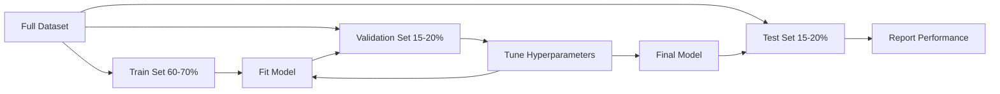

# Évaluation modèle
# 模型评估


> Un modèle n'est que aussi bon que la façon dont vous le mesurez.

> Le bon et le mauvais du modèle dépend de la façon dont vous le mesurerez.

**Type:** Build | **类型：** 构建
**Languages:** Python
**Prerequisites:** Phase 1 (Probability & Distributions, Statistics for ML), Phase 2 Lessons 1-8 | **前置知识：** Phase 1（概率与分布、统计学），Phase 2 第 1-8 课
**Time:** ~90 minutes | **时间：** 约 90 分钟

## Objectifs d'apprentissage

- Implémenter la validation croisée de K-fold et de K-fold stratifiée à partir de zéro et expliquer pourquoi la stratification est importante pour les données déséquilibrées
  De zéro réalisation K 折和分层 K 折交叉验证, expliquer pourquoi la division des niveaux est importante pour les données déséquilibrées
- Comptez à partir de zéro la précision, le rappel, les mesures F1, AUC-ROC et de régression (MSE, RMSE, MAE, R-quadrés)
  De zéro calcul de la précision, du recul, du F1 à l'AUC-ROC et du recul (MSE, RMSE, MAE, R-square)
- Interpréter les courbes d'apprentissage pour déterminer si un modèle souffre d'un biais élevé ou d'une grande variance
                                                                                                                                                                                                                                                                                                                                                                                                                                                                                                                               
- Identifier les erreurs d'évaluation courantes, y compris la fuite de données, la sélection incorrecte de mesures et la contamination des ensembles d'essai
  Identification des erreurs d'évaluation habituelles, y compris les fuites de données, la sélection et la contamination des ensembles de tests


> **【中文解读】**
> 模型评估回答模型到底好不好──准确率、精确率、召回率、F1、AUC-ROC 分类指标;MSE、MAE、R^2 归归指标──交叉验证防止过拟评估──sklearn 中的 cross_val_score/classification_report──

> **【拓展：模型评估失误导致的生产事故】**
> Les données de l'entreprise sont en train d'être analysées et analysées en fonction de la situation actuelle. Les données de l'entreprise sont en train d'être analysées et analysées en fonction de la situation actuelle.

## Le problème , l' introduction du problème

Vous avez formé un modèle qui a une précision de 95% sur vos données.

> Vous avez entraîné un modèle. Il obtient un taux d'exactitude de 95% sur vos données.

- Je sais. - Peut-être pas. Si 95% de vos données appartiennent à une classe, un modèle qui prédit toujours cette classe obtient une précision de 95% tout en étant complètement inutile. Si vous avez évalué sur les mêmes données que vous avez formé sur, le nombre de 95% est sans signification parce que le modèle a juste mémorisé les réponses. Si votre ensemble de données a une composante temporelle et que vous avez mélangé au hasard avant de le diviser, votre modèle pourrait utiliser des données futures pour prédire le passé.

> Peut-être bon, peut-être mauvais. Si 95% des données appartiennent à une catégorie, toujours prédire que le modèle de cette catégorie obtient un taux de précision de 95% mais est totalement inutile. Si vous évaluez sur les données que vous avez entraînées, 95% de ce chiffre n'a pas d'importance, car le modèle se souvient simplement de la réponse. Si votre ensemble de données a une composante temporelle et que vous êtes en train de le diviser, votre modèle peut utiliser le futur pour prédire le passé.

L'évaluation du modèle est le point où la plupart des projets de ML se trompent. La mauvaise métrique rend un mauvais modèle beau. La mauvaise division permet à un modèle de tricher. La mauvaise comparaison vous fait choisir le pire modèle. Obtenir une évaluation correcte n'est pas facultatif. C'est la différence entre un modèle qui fonctionne dans la production et un modèle qui échoue au moment où il voit des données réelles.

> L'évaluation de modèle est le point de départ de la plupart des projets ML. L'évaluation de modèle est la différence entre un modèle efficace dans la production et un modèle qui a échoué en rencontrant des données réelles.

> **【中文解读】**
> L'évaluation du modèle est la plus facile à commettre trois erreurs: 1) l'évaluation sur les données de formation; 2) l'évaluation du modèle est simplement une mémorisation de la réponse; 2) l'évaluation de l'analyse de données avec des indicateurs erronés; 3) la fuite de données; 3) la fuite de données; 3) la fuite de données dans le processus de formation.

## Le concept de base.

### Le train, la validation, le test



Trois divisions, trois objectifs:

> 3 types d'utilisation:

- **Training set**Le modèle apprend à partir de ces données.
  **训练集**Le modèle de l'apprentissage:
- **Validation set**Le modèle ne s'appuie jamais sur ces données, mais ses décisions sont influencées par elles.
  **验证集**Le modèle ne s'entraîne pas sur ces données, mais ses décisions sont influencées.
- **Test set**Si vous regardez les performances des tests et que vous retournez ensuite pour changer votre modèle, ce n'est plus un ensemble de tests.
  **测试集**Si vous regardez les performances des tests et que vous revenez modifier le modèle, il ne s'agit plus d'un ensemble de tests.

L'ensemble de test est votre garantie de résilience que les performances rapportées reflètent la façon dont le modèle se comportera sur des données vraiment invisibles.

> 测试集是您的保留保证, assurez-vous que les performances du rapport reflètent les performances du modèle sur les données réelles non vues.

### Validation croisée K-Poupe

Avec de petits ensembles de données, un train/une seule validation partage les données et donne des estimations bruyantes.

> Pour les petits ensembles de données, les données de formation/évaluation unique sont divisées en dépenses et donnent une estimation du bruit.

```mermaid
flowchart TB
    subgraph Fold1["Fold 1"]
        direction LR
        V1["Val"] --- T1a["Train"] --- T1b["Train"] --- T1c["Train"] --- T1d["Train"]
    end
    subgraph Fold2["Fold 2"]
        direction LR
        T2a["Train"] --- V2["Val"] --- T2b["Train"] --- T2c["Train"] --- T2d["Train"]
    end
    subgraph Fold3["Fold 3"]
        direction LR
        T3a["Train"] --- T3b["Train"] --- V3["Val"] --- T3c["Train"] --- T3d["Train"]
    end
    subgraph Fold4["Fold 4"]
        direction LR
        T4a["Train"] --- T4b["Train"] --- T4c["Train"] --- V4["Val"] --- T4d["Train"]
    end
    subgraph Fold5["Fold 5"]
        direction LR
        T5a["Train"] --- T5b["Train"] --- T5c["Train"] --- T5d["Train"] --- V5["Val"]
    end
    Fold1 --> R["Average scores"]
    Fold2 --> R
    Fold3 --> R
    Fold4 --> R
    Fold5 --> R
```



1. Divisez les données en plies de taille K
   Divisez les données en K 个大相等折
2. Pour chaque pli, entraînez sur les plies K-1 et validez sur le pli restant
   Pour chaque tour, dans la formation K-1, dans le reste de la tour, sur la vérification
3. La moyenne des scores de validation K
   Pour K 个验证分数取平均

Les données sont utilisées pour la validation une seule fois.

> K=5 ou K=10 est le standard de sélection. Chaque point de données est utilisé pour vérifier une fois.

> K=5 ou K=10 est le standard de sélection. Chaque point de données est utilisé pour vérifier une fois.

**Stratified K-fold**Si votre ensemble de données est de 70% classe A et de 30% classe B, chaque pli aura à peu près le même ratio. Ceci est important pour les ensembles de données déséquilibrés où une fraction aléatoire pourrait mettre tous les échantillons minoritaires dans un seul pli.

> **分层 K 折**Si votre ensemble de données est de 70% de catégorie A et de 30% de catégorie B, chaque segment aura une proportion presque identique.

> **分层 K 折**Si le groupe de données est de 70% de catégorie A et de 30% de catégorie B, le groupe de données aura une proportion presque identique.

### Les mesures de classification

**Confusion matrix**Pour la classification binaire:

> **混淆矩阵**Pour les classes suivantes:

> **混淆矩阵**Pour les classes suivantes:

|  | Predicted Positive | Predicted Negative |
|--|---|---|
| Actually Positive | True Positive (TP) | False Negative (FN) |
| Actually Negative | False Positive (FP) | True Negative (TN) |

À partir de cette matrice, toutes les autres mesures suivent:

> De cette même ligne, tous les autres indicateurs sont:

> Dans ce contexte, tous les autres indicateurs sont dérivés de:

- **Accuracy**= (TP + TN) / (TP + TN + FP + FN). Fraction des prédictions correctes.
  **准确率**= (TP + TN) / (TP + TN + FP + FN)。
- **Precision**= TP / (TP + FP). De toutes les choses prédites positives, combien étaient réellement positives ? Utilisez lorsque les faux positifs sont coûteux (par exemple, le filtre de spam marquant le vrai courrier électronique comme spam).
  **精确率**= TP / (TP + FP) ―― parmi tous les prévisions pour vrais échantillons, y a-t-il vraiment beaucoup de vrais pour vrais?
- **Recall**(sensibilité) = TP / (TP + FN). De tous les positifs réels, combien avons-nous capturé ? Utilisez quand les faux négatifs sont coûteux (par exemple, le dépistage du cancer manquant une tumeur).
  **召回率**(sensitivité) = TP / (TP + FN) ⋅ de tous les échantillons réels, nous avons capturé combien?
- **F1 score**= 2 * précision * rappel / (precision + rappel). Moyenne harmonieuse de précision et de rappel.
  **F1 分数**= 2 * taux d'établissement * taux de réaction / ( taux d'établissement + taux de réaction) ─ taux d'établissement et taux de réaction de réaction et moyenne ─ entre les deux sont inconnus.
- **AUC-ROC**: Area Under the Receiver Operating Characteristic curve. Graphique de taux positif vrai vs taux faux positif à différents seuils de classification. AUC = 0,5 signifie deviner au hasard, AUC = 1,0 signifie séparation parfaite. Indépendante du seuil: il mesure à quel point le modèle classe les positifs au-dessus des négatifs, quel que soit le coup de coupe que vous choisissez.
  **AUC-ROC**: ROC 曲线下面积── dans différentes catégories 值下绘制真率和假正率──AUC = 0,5 表示随机猜测,AUC = 1.0 表示完美区分──与值无关:它衡量模型将正样本排在负样本前面的能力,无论你选择什么截值──

### Mesures de régression

- **MSE**(Erreur carrée moyenne) = moyenne((y_true - y_pred) ^ 2). Pénalise les erreurs importantes quadratiquement.
  **均方误差 (MSE)**= moyen (y_true - y_pred) ^2)。
- **RMSE**(Erreur carrée de la racine moyenne) = sqrt(MSE). Les mêmes unités que la variable cible.
  **均方根误差 (RMSE)**= sqrt(MSE)。 avec les mêmes unités de changement de but。比 MSE 更易解释。
- **MAE**(Méthode d'erreur absolue) = moyenne de la vérité - y_predition). Traite toutes les erreurs de manière linéaire.
  **平均绝对误差 (MAE)**= moyenne de la valeur de l'échange de données - y_preuve de l'échange de données -
- **R-squared**= 1 - SS_res / SS_tot, où SS_res = somme((y_true - y_pred) ^2) et SS_tot = somme(((y_true - y_mean) ^2). Fraction de variance expliquée par le modèle. R^2 = 1,0 est parfait. R^2 = 0,0 signifie que le modèle n'est pas meilleur que toujours prédire la moyenne. R^2 peut être négatif si le modèle est pire que la moyenne.
  **决定系数 (R-squared)**= 1 - SS_res / SS_tot, dont SS_res = somme(((y_true - y_pred) ^2), SS_tot = somme((((y_true - y_mean) ^2)。模型解释方差比例──R^2 = 1.0 完美──R^2 = 0.0 表示模型不比始终预测均值好──R^2 可以为负,如果模型比预测均值还差──

### Curves d'apprentissage

Scores de formation et de validation en fonction de la taille du groupe de formation:

> Practices de traçage et de vérification des traces avec les grandes variations du train:

> Prendre le nombre de points d'entraînement et le nombre de points d'essai comme dessin de fonction de grande taille d'un ensemble d'entraînement:

- **High bias (underfitting)**Les deux courbes convergent à un score faible.
  **高偏差（欠拟合）**Deux courbes de données: les données sont plus ou moins nombreuses.
- **High variance (overfitting)**Les résultats de formation sont élevés mais les résultats de validation sont beaucoup plus bas.
  **高方差（过拟合）**Le nombre de points d'entraînement est élevé mais le nombre de points d'essai est beaucoup plus faible.

### Curves de validation

Scores de formation et de validation des parcelles en fonction d'un hyperparamètre:

> Practice de dessin de la formation et de l'évaluation du nombre avec des dérivés de la transformation des superparamètres:

> Le nombre de particules d'entraînement et le nombre de particules d'essai sont dessinés en fonction des superparamètres:

- Avec une faible complexité: les deux scores sont faibles (insuffisance)
  复杂度低时: Deux分数都低(欠拟合)
- La bonne complexité: les deux scores sont élevés et proches de l'autre
  La complexité est adaptée: deux fractions sont élevées et approximatives
- En cas de complexité élevée: le score de formation reste élevé mais le score de validation diminue (surmatch)
  复杂度高时: le nombre de séances d'entraînement reste élevé mais le nombre de séances d'essai baisse

La valeur optimale de l'hyperparamètre est celle où le score de validation atteint son apogée.

> La valeur optimale de l'élément est la position où le point de validation atteint le point culminant.

> La valeur optimale de l'élément est la position où le point de validation atteint le point culminant.

### Évaluation courante

**Data leakage**Les données de l'ensemble de données doivent être analysées en fonction des données de l'ensemble de données, en fonction des données de l'ensemble de données, et les données seront analysées en fonction des données de l'ensemble de données.

> **数据泄漏**: test collection information leakage à l'entraînement en.exemple: pré-division pour un économiseur de données complémentaire à la totalité du volume, pré-division de séquences de temps contient des données futures, utilisation des caractéristiques de l'objectif.

**Class imbalance**Un modèle qui prédit toujours "légalement" obtient une précision de 99%. Utilisez la précision, le rappel, F1, ou AUC-ROC à la place.

> **类别不平衡**:99% des transactions sont légales, 1% sont frauduleuses.

**Wrong metric**: optimiser l'exactitude lorsque vous devez optimiser le rappel (diagnostic médical) ou optimiser le RMSE lorsque vos données présentent des valeurs anormales (utiliser MAE à la place).

> **错误指标**Le taux d'accès à la santé est le plus élevé dans les pays où les données sont disponibles.

**Not using stratified splits**: avec des données déséquilibrées, une fraction aléatoire pourrait mettre très peu d'échantillons minoritaires dans le pli de validation, donnant des estimations instables.

> **不使用分层划分**Les données de l'échantillon sont disponibles en moyenne en moyenne en moyenne par mois.

**Testing too often**: chaque fois que vous regardez les performances de l'essai et que vous vous ajustez, vous vous suradaptez au jeu d'essai.

> **测试过于频繁**Chaque fois que vous regardez le test, vous avez une configuration de performance.

## Construisez-le et mettez-le en œuvre.

> **【中文解读】**
> De la mise en œuvre de l'essai de liens à zéro (K-fold et K-fold) 分类指标 (精确率,召回率, F1、AUC-ROC) et du retour (回归指标)  MSE、RMSE、MAE、R2) ), l'essai de liens à zéro est une méthode standard pour évaluer la nature du modèle, la mise en œuvre de la mise en œuvre de la mise en œuvre de la mise en œuvre de la mise en œuvre de la mise en œuvre de la mise en œuvre de la mise en œuvre de la mise en œuvre de la mise en œuvre de la mise en œuvre de la mise en œuvre de la mise en œuvre de la mise en œuvre de la mise en œuvre de la mise en œuvre de la mise en œuvre de la mise en œuvre de la mise en œuvre de la mise en œuvre de la mise en œuvre de la mise en œuvre de la mise en œuvre de la mise en œuvre de la mise en œuvre de la mise en œuvre de la mise en œuvre de la mise en œuvre de la mise en œuvre de la mise en œuvre de la mise en œuvre de la mise en œuvre de la mise en œuvre de la mise en œuvre de la mise en œuvre de la mise en œuvre de la mise en œuvre de la mise en œuvre de la mise en œuvre de la mise en œuvre de la mise en œuvre de la mise en œuvre de la mise en œuvre de la mise en œuvre de la mise en œuvre de la mise en œuvre de la mise en œuvre de la mise en œuvre de la mise en œuvre de la mise en œuvre de la mise en œuvre de la mise en œuvre de la mise en œuvre de la mise en œuvre de la mise en œuvre de la mise en œuvre de la mise en œuvre de la mise en œuvre de la mise en œuvre de la mise en œuvre de la mise en œuvre de la mise en œuvre de la mise en œuvre de la mise en œuvre de la mise en œuvre de la mise en œuvre de la mise en œuvre de la mise en œuvre de la mise en œuvre de la mise en œuvre de la mise en œuvre de la mise en œuvre de la mise en œuvre de la mise en œuvre de la mise en œuvre de la mise en œuvre de la mise en œuvre de la mise en œuvre de la mise en œuvre de la mise en œuvre de la mise en œuvre de la mise en œuvre de la mise en œuvre de la mise

> **【拓展：学习曲线——诊断模型问题的利器】**
> Curve d'apprentissage) dessin d'erreurs d'apprentissage et d'erreurs d'évaluation avec la tendance à changer de quantité de données d'apprentissage, est un outil intuitif pour diagnostiquer des problèmes d'erreurs d'apprentissage et d'erreurs d'évaluation sont très élevés; il faut des modèles plus complexes; l'erreur d'apprentissage est faible mais l'erreur d'évaluation est élevée; la courbe d'apprentissage peut générer automatiquement ces courbes.
```figure
precision-recall-threshold
```

## Faites-le

### Étape 1: Partage du train/validation/essai

```python
import random
import math


def train_val_test_split(X, y, train_ratio=0.6, val_ratio=0.2, seed=42):
    random.seed(seed)
    n = len(X)
    indices = list(range(n))
    random.shuffle(indices)

    train_end = int(n * train_ratio)
    val_end = int(n * (train_ratio + val_ratio))

    train_idx = indices[:train_end]
    val_idx = indices[train_end:val_end]
    test_idx = indices[val_end:]

    X_train = [X[i] for i in train_idx]
    y_train = [y[i] for i in train_idx]
    X_val = [X[i] for i in val_idx]
    y_val = [y[i] for i in val_idx]
    X_test = [X[i] for i in test_idx]
    y_test = [y[i] for i in test_idx]

    return X_train, y_train, X_val, y_val, X_test, y_test
```

### Étape 2: Validation croisée de K-fold et de K-fold stratifiée

```python
def kfold_split(n, k=5, seed=42):
    random.seed(seed)
    indices = list(range(n))
    random.shuffle(indices)

    fold_size = n // k
    folds = []

    for i in range(k):
        start = i * fold_size
        end = start + fold_size if i < k - 1 else n
        val_idx = indices[start:end]
        train_idx = indices[:start] + indices[end:]
        folds.append((train_idx, val_idx))

    return folds


def stratified_kfold_split(y, k=5, seed=42):
    random.seed(seed)

    class_indices = {}
    for i, label in enumerate(y):
        class_indices.setdefault(label, []).append(i)

    for label in class_indices:
        random.shuffle(class_indices[label])

    folds = [{"train": [], "val": []} for _ in range(k)]

    for label, indices in class_indices.items():
        fold_size = len(indices) // k
        for i in range(k):
            start = i * fold_size
            end = start + fold_size if i < k - 1 else len(indices)
            val_part = indices[start:end]
            train_part = indices[:start] + indices[end:]
            folds[i]["val"].extend(val_part)
            folds[i]["train"].extend(train_part)

    return [(f["train"], f["val"]) for f in folds]


def cross_validate(X, y, model_fn, k=5, metric_fn=None, stratified=False):
    n = len(X)

    if stratified:
        folds = stratified_kfold_split(y, k)
    else:
        folds = kfold_split(n, k)

    scores = []
    for train_idx, val_idx in folds:
        X_train = [X[i] for i in train_idx]
        y_train = [y[i] for i in train_idx]
        X_val = [X[i] for i in val_idx]
        y_val = [y[i] for i in val_idx]

        model = model_fn()
        model.fit(X_train, y_train)
        predictions = [model.predict(x) for x in X_val]

        if metric_fn:
            score = metric_fn(y_val, predictions)
        else:
            score = sum(1 for yt, yp in zip(y_val, predictions) if yt == yp) / len(y_val)
        scores.append(score)

    return scores
```

### Étape 3: Matrice de confusion et métriques de classification

> Troisième étape:混矩阵和分类指标── de la réalisation de TP/TN/FP/FN 计数, de la réintroduction du taux de précision, du taux de précision, du taux de réaction, du taux de réaction F1──ROC 曲线扫描所有可能值,记录每点的 (FPR, TPR),AUC 是曲线下面积的 (AUC 是曲线下面积的)  (AUC 曲线下面积的)

```python
def confusion_matrix(y_true, y_pred):
    tp = sum(1 for yt, yp in zip(y_true, y_pred) if yt == 1 and yp == 1)
    tn = sum(1 for yt, yp in zip(y_true, y_pred) if yt == 0 and yp == 0)
    fp = sum(1 for yt, yp in zip(y_true, y_pred) if yt == 0 and yp == 1)
    fn = sum(1 for yt, yp in zip(y_true, y_pred) if yt == 1 and yp == 0)
    return tp, tn, fp, fn


def accuracy(y_true, y_pred):
    tp, tn, fp, fn = confusion_matrix(y_true, y_pred)
    total = tp + tn + fp + fn
    return (tp + tn) / total if total > 0 else 0.0


def precision(y_true, y_pred):
    tp, tn, fp, fn = confusion_matrix(y_true, y_pred)
    return tp / (tp + fp) if (tp + fp) > 0 else 0.0


def recall(y_true, y_pred):
    tp, tn, fp, fn = confusion_matrix(y_true, y_pred)
    return tp / (tp + fn) if (tp + fn) > 0 else 0.0


def f1_score(y_true, y_pred):
    p = precision(y_true, y_pred)
    r = recall(y_true, y_pred)
    return 2 * p * r / (p + r) if (p + r) > 0 else 0.0


def roc_curve(y_true, y_scores):
    thresholds = sorted(set(y_scores), reverse=True)
    tpr_list = []
    fpr_list = []

    total_positives = sum(y_true)
    total_negatives = len(y_true) - total_positives

    for threshold in thresholds:
        y_pred = [1 if s >= threshold else 0 for s in y_scores]
        tp = sum(1 for yt, yp in zip(y_true, y_pred) if yt == 1 and yp == 1)
        fp = sum(1 for yt, yp in zip(y_true, y_pred) if yt == 0 and yp == 1)

        tpr = tp / total_positives if total_positives > 0 else 0.0
        fpr = fp / total_negatives if total_negatives > 0 else 0.0

        tpr_list.append(tpr)
        fpr_list.append(fpr)

    return fpr_list, tpr_list, thresholds


def auc_roc(y_true, y_scores):
    fpr_list, tpr_list, _ = roc_curve(y_true, y_scores)

    pairs = sorted(zip(fpr_list, tpr_list))
    fpr_sorted = [p[0] for p in pairs]
    tpr_sorted = [p[1] for p in pairs]

    area = 0.0
    for i in range(1, len(fpr_sorted)):
        width = fpr_sorted[i] - fpr_sorted[i - 1]
        height = (tpr_sorted[i] + tpr_sorted[i - 1]) / 2
        area += width * height

    return area
```

### Étape 4: Mesures de régression

> La première étape est la suivante: Retour à l'indicateur.

```python
def mse(y_true, y_pred):
    n = len(y_true)
    return sum((yt - yp) ** 2 for yt, yp in zip(y_true, y_pred)) / n


def rmse(y_true, y_pred):
    return math.sqrt(mse(y_true, y_pred))


def mae(y_true, y_pred):
    n = len(y_true)
    return sum(abs(yt - yp) for yt, yp in zip(y_true, y_pred)) / n


def r_squared(y_true, y_pred):
    mean_y = sum(y_true) / len(y_true)
    ss_res = sum((yt - yp) ** 2 for yt, yp in zip(y_true, y_pred))
    ss_tot = sum((yt - mean_y) ** 2 for yt in y_true)
    if ss_tot == 0:
        return 0.0
    return 1.0 - ss_res / ss_tot
```

### Étape 5: Curves d'apprentissage

> 第五步: apprendre la courbe. Il s'agit d'un outil le plus direct du modèle de diagnostic.

```python
def learning_curve(X, y, model_fn, metric_fn, train_sizes=None, val_ratio=0.2, seed=42):
    random.seed(seed)
    n = len(X)
    indices = list(range(n))
    random.shuffle(indices)

    val_size = int(n * val_ratio)
    val_idx = indices[:val_size]
    pool_idx = indices[val_size:]

    X_val = [X[i] for i in val_idx]
    y_val = [y[i] for i in val_idx]

    if train_sizes is None:
        train_sizes = [int(len(pool_idx) * r) for r in [0.1, 0.2, 0.4, 0.6, 0.8, 1.0]]

    train_scores = []
    val_scores = []

    for size in train_sizes:
        subset = pool_idx[:size]
        X_train = [X[i] for i in subset]
        y_train = [y[i] for i in subset]

        model = model_fn()
        model.fit(X_train, y_train)

        train_pred = [model.predict(x) for x in X_train]
        val_pred = [model.predict(x) for x in X_val]

        train_scores.append(metric_fn(y_train, train_pred))
        val_scores.append(metric_fn(y_val, val_pred))

    return train_sizes, train_scores, val_scores
```

### Étape 6: Un classifiateur simple pour les tests, plus la démo complète

> 第六步: un simple logique de retour à la catégorie, utilisé pour tester évaluer le code.

```python
class SimpleLogistic:
    def __init__(self, lr=0.1, epochs=100):
        self.lr = lr
        self.epochs = epochs
        self.weights = None
        self.bias = 0.0

    def sigmoid(self, z):
        z = max(-500, min(500, z))
        return 1.0 / (1.0 + math.exp(-z))

    def fit(self, X, y):
        n_features = len(X[0])
        self.weights = [0.0] * n_features
        self.bias = 0.0

        for _ in range(self.epochs):
            for xi, yi in zip(X, y):
                z = sum(w * x for w, x in zip(self.weights, xi)) + self.bias
                pred = self.sigmoid(z)
                error = yi - pred
                for j in range(n_features):
                    self.weights[j] += self.lr * error * xi[j]
                self.bias += self.lr * error

    def predict_proba(self, x):
        z = sum(w * xi for w, xi in zip(self.weights, x)) + self.bias
        return self.sigmoid(z)

    def predict(self, x):
        return 1 if self.predict_proba(x) >= 0.5 else 0


class SimpleLinearRegression:
    def __init__(self, lr=0.001, epochs=200):
        self.lr = lr
        self.epochs = epochs
        self.weights = None
        self.bias = 0.0

    def fit(self, X, y):
        n_features = len(X[0])
        self.weights = [0.0] * n_features
        self.bias = 0.0
        n = len(X)

        for _ in range(self.epochs):
            for xi, yi in zip(X, y):
                pred = sum(w * x for w, x in zip(self.weights, xi)) + self.bias
                error = yi - pred
                for j in range(n_features):
                    self.weights[j] += self.lr * error * xi[j] / n
                self.bias += self.lr * error / n

    def predict(self, x):
        return sum(w * xi for w, xi in zip(self.weights, x)) + self.bias


def standardize(values):
    n = len(values)
    mean = sum(values) / n
    var = sum((v - mean) ** 2 for v in values) / n
    std = math.sqrt(var) if var > 0 else 1.0
    return [(v - mean) / std for v in values], mean, std


def make_classification_data(n=300, seed=42):
    random.seed(seed)
    X = []
    y = []
    for _ in range(n):
        x1 = random.gauss(0, 1)
        x2 = random.gauss(0, 1)
        label = 1 if (x1 + x2 + random.gauss(0, 0.5)) > 0 else 0
        X.append([x1, x2])
        y.append(label)
    return X, y


def make_regression_data(n=200, seed=42):
    random.seed(seed)
    X = []
    y = []
    for _ in range(n):
        x1 = random.uniform(0, 10)
        x2 = random.uniform(0, 5)
        target = 3 * x1 + 2 * x2 + random.gauss(0, 2)
        X.append([x1, x2])
        y.append(target)
    return X, y


def make_imbalanced_data(n=300, minority_ratio=0.05, seed=42):
    random.seed(seed)
    X = []
    y = []
    for _ in range(n):
        if random.random() < minority_ratio:
            x1 = random.gauss(3, 0.5)
            x2 = random.gauss(3, 0.5)
            label = 1
        else:
            x1 = random.gauss(0, 1)
            x2 = random.gauss(0, 1)
            label = 0
        X.append([x1, x2])
        y.append(label)
    return X, y


if __name__ == "__main__":
    X_clf, y_clf = make_classification_data(300)

    print("=== Train/Validation/Test Split ===")
    X_train, y_train, X_val, y_val, X_test, y_test = train_val_test_split(X_clf, y_clf)
    print(f"  Train: {len(X_train)}, Val: {len(X_val)}, Test: {len(X_test)}")
    print(f"  Train class distribution: {sum(y_train)}/{len(y_train)} positive")
    print(f"  Val class distribution: {sum(y_val)}/{len(y_val)} positive")

    # 主程序：完整演示训练/验证/测试划分、分类指标（含混淆矩阵、F1、AUC-ROC）、K 折交叉验证、回归指标（MSE/RMSE/MAE/R²）、学习曲线、不平衡数据评估。每个环节都展示具体数值，让评估方法变得具体。

    model = SimpleLogistic(lr=0.1, epochs=200)
    model.fit(X_train, y_train)

    print("\n=== Classification Metrics ===")
    y_pred = [model.predict(x) for x in X_test]
    tp, tn, fp, fn = confusion_matrix(y_test, y_pred)
    print(f"  Confusion matrix: TP={tp}, TN={tn}, FP={fp}, FN={fn}")
    print(f"  Accuracy:  {accuracy(y_test, y_pred):.4f}")
    print(f"  Precision: {precision(y_test, y_pred):.4f}")
    print(f"  Recall:    {recall(y_test, y_pred):.4f}")
    print(f"  F1 Score:  {f1_score(y_test, y_pred):.4f}")

    y_scores = [model.predict_proba(x) for x in X_test]
    auc = auc_roc(y_test, y_scores)
    print(f"  AUC-ROC:   {auc:.4f}")

    print("\n=== K-Fold Cross-Validation (K=5) ===")
    cv_scores = cross_validate(
        X_clf, y_clf,
        model_fn=lambda: SimpleLogistic(lr=0.1, epochs=200),
        k=5,
        metric_fn=accuracy,
    )
    mean_cv = sum(cv_scores) / len(cv_scores)
    std_cv = math.sqrt(sum((s - mean_cv) ** 2 for s in cv_scores) / len(cv_scores))
    print(f"  Fold scores: {[round(s, 4) for s in cv_scores]}")
    print(f"  Mean: {mean_cv:.4f} (+/- {std_cv:.4f})")

    print("\n=== Stratified K-Fold Cross-Validation (K=5) ===")
    strat_scores = cross_validate(
        X_clf, y_clf,
        model_fn=lambda: SimpleLogistic(lr=0.1, epochs=200),
        k=5,
        metric_fn=accuracy,
        stratified=True,
    )
    strat_mean = sum(strat_scores) / len(strat_scores)
    strat_std = math.sqrt(sum((s - strat_mean) ** 2 for s in strat_scores) / len(strat_scores))
    print(f"  Fold scores: {[round(s, 4) for s in strat_scores]}")
    print(f"  Mean: {strat_mean:.4f} (+/- {strat_std:.4f})")

    print("\n=== Imbalanced Data: Why Accuracy Lies ===")
    X_imb, y_imb = make_imbalanced_data(300, minority_ratio=0.05)
    positives = sum(y_imb)
    print(f"  Class distribution: {positives} positive, {len(y_imb) - positives} negative ({positives/len(y_imb)*100:.1f}% positive)")

    always_negative = [0] * len(y_imb)
    print(f"  Always-negative baseline:")
    print(f"    Accuracy:  {accuracy(y_imb, always_negative):.4f}")
    print(f"    Precision: {precision(y_imb, always_negative):.4f}")
    print(f"    Recall:    {recall(y_imb, always_negative):.4f}")
    print(f"    F1 Score:  {f1_score(y_imb, always_negative):.4f}")

    X_tr_i, y_tr_i, X_v_i, y_v_i, X_te_i, y_te_i = train_val_test_split(X_imb, y_imb)
    model_imb = SimpleLogistic(lr=0.5, epochs=500)
    model_imb.fit(X_tr_i, y_tr_i)
    y_pred_imb = [model_imb.predict(x) for x in X_te_i]
    print(f"\n  Trained model on imbalanced data:")
    print(f"    Accuracy:  {accuracy(y_te_i, y_pred_imb):.4f}")
    print(f"    Precision: {precision(y_te_i, y_pred_imb):.4f}")
    print(f"    Recall:    {recall(y_te_i, y_pred_imb):.4f}")
    print(f"    F1 Score:  {f1_score(y_te_i, y_pred_imb):.4f}")

    print("\n=== Regression Metrics ===")
    X_reg, y_reg = make_regression_data(200)

    col0 = [x[0] for x in X_reg]
    col1 = [x[1] for x in X_reg]
    col0_s, m0, s0 = standardize(col0)
    col1_s, m1, s1 = standardize(col1)
    X_reg_scaled = [[col0_s[i], col1_s[i]] for i in range(len(X_reg))]

    X_tr_r, y_tr_r, X_v_r, y_v_r, X_te_r, y_te_r = train_val_test_split(X_reg_scaled, y_reg)
    reg_model = SimpleLinearRegression(lr=0.01, epochs=500)
    reg_model.fit(X_tr_r, y_tr_r)
    y_pred_r = [reg_model.predict(x) for x in X_te_r]

    print(f"  MSE:       {mse(y_te_r, y_pred_r):.4f}")
    print(f"  RMSE:      {rmse(y_te_r, y_pred_r):.4f}")
    print(f"  MAE:       {mae(y_te_r, y_pred_r):.4f}")
    print(f"  R-squared: {r_squared(y_te_r, y_pred_r):.4f}")

    mean_baseline = [sum(y_tr_r) / len(y_tr_r)] * len(y_te_r)
    print(f"\n  Mean baseline:")
    print(f"    MSE:       {mse(y_te_r, mean_baseline):.4f}")
    print(f"    R-squared: {r_squared(y_te_r, mean_baseline):.4f}")

    print("\n=== Learning Curve ===")
    sizes, train_sc, val_sc = learning_curve(
        X_clf, y_clf,
        model_fn=lambda: SimpleLogistic(lr=0.1, epochs=200),
        metric_fn=accuracy,
    )
    print(f"  {'Size':>6} {'Train':>8} {'Val':>8}")
    for s, tr, va in zip(sizes, train_sc, val_sc):
        print(f"  {s:>6} {tr:>8.4f} {va:>8.4f}")

    print("\n=== Statistical Model Comparison ===")
    model_a_scores = cross_validate(
        X_clf, y_clf,
        model_fn=lambda: SimpleLogistic(lr=0.1, epochs=100),
        k=5, metric_fn=accuracy,
    )
    model_b_scores = cross_validate(
        X_clf, y_clf,
        model_fn=lambda: SimpleLogistic(lr=0.1, epochs=500),
        k=5, metric_fn=accuracy,
    )
    diffs = [a - b for a, b in zip(model_a_scores, model_b_scores)]
    mean_diff = sum(diffs) / len(diffs)
    std_diff = math.sqrt(sum((d - mean_diff) ** 2 for d in diffs) / len(diffs))
    t_stat = mean_diff / (std_diff / math.sqrt(len(diffs))) if std_diff > 0 else 0.0
    print(f"  Model A (100 epochs) mean: {sum(model_a_scores)/len(model_a_scores):.4f}")
    print(f"  Model B (500 epochs) mean: {sum(model_b_scores)/len(model_b_scores):.4f}")
    print(f"  Mean difference: {mean_diff:.4f}")
    print(f"  Paired t-statistic: {t_stat:.4f}")
    print(f"  (|t| > 2.78 for significance at p<0.05 with df=4)")
```

## Utilisez-le avec le cadre de réalisation

Avec scikit-learn, l'évaluation est intégrée au flux de travail:

> Utilisation de l'apprentissage, évaluation intégrée dans le flux de travail:

```python
from sklearn.model_selection import cross_val_score, StratifiedKFold, learning_curve
from sklearn.metrics import (
    accuracy_score, precision_score, recall_score, f1_score,
    roc_auc_score, confusion_matrix, mean_squared_error, r2_score,
)
from sklearn.linear_model import LogisticRegression

model = LogisticRegression()
scores = cross_val_score(model, X, y, cv=StratifiedKFold(5), scoring="f1")
```

Les versions à partir de zéro montrent exactement ce que fait la validation croisée (pas de magie, juste les boucles avant et le suivi de l'index), comment chaque métrique est calculée (seulement le comptage de TP /FP /TN / FN), et pourquoi la stratification est importante (préservation des ratios de classe dans chaque pliage).

> De la version zéro, il est précisé que la vérification de la liaison a fait quoi (pas de magie, juste un cycle et un suivi des indices)  comment chaque indicateur est calculé (à la fois le nombre de TP/FP/TN/FN)  et pourquoi les niveaux sont importants (à la fois le ratio de catégories dans chaque coupe)  La version du livre a augmenté la coïncidence  plus d'options de référencement et de tubes de ligne 

## Envoyez-le . Produit .

Cette leçon donne:
- `outputs/skill-evaluation.md`- une compétence couvrant la stratégie d'évaluation des modèles de classification et de régression

> Le programme de formation
> - `outputs/skill-evaluation.md`- les compétences en matière d'évaluation des stratégies de classe et de retour des modèles

> **【拓展：A/B 测试——模型评估的终极标准】**
> Dans l'industrie, les indicateurs d'évaluation de l'offre sont des indices de référence, les véritables évaluations sont des tests A/B en ligne. Google utilise plus de 10 000 tests A/B par an pour évaluer l'amélioration de l'algorithme de recherche. Netflix utilise des tests A/B pour décider si l'algorithme est en ligne.

> **【中文解读】**
> ROC 曲线绘画不同值下 TPR(真率) vs FPR(假正率),AUC est la courbe sous面积(0.5=随机,1.0=完美)。AUPRC(精确率-召回率曲线下面积) on inbalance data on AUC-ROC 更多有信息量──MCC(马修斯相关系数) est un indicateur global sur les données inbalance, compte tenu de l'ensemble des quatre matrices de la courbe de la courbe de la courbe de la courbe de la courbe de la courbe de la courbe de la courbe de la courbe de la courbe de la courbe de la courbe de la courbe de la courbe de la courbe de la courbe de la courbe de la courbe de la courbe de la courbe de la courbe de la courbe de la courbe de la courbe de la courbe de la courbe de la courbe de la courbe de la courbe de la courbe de la courbe de la courbe de la courbe de la courbe de la courbe de la courbe de la courbe de la courbe de la courbe de la courbe de la courbe de la courbe de la courbe de la courbe de la courbe de la courbe de la courbe de courbe de courbe de courbe de courbe de courbe de courbe de courbe de courbe de courbe de courbe de courbe de courbe de courbe de courbe de courbe de courbe.

## Les exercices

1. Implémenter des courbes de rappel de précision: précision de la carte contre rappel à différents seuils. Calculer la précision moyenne (zone sous la courbe de PR). Comparer la courbe de PR à la courbe de ROC sur un ensemble de données déséquilibré et expliquer quand chacune est plus informative.
   1. 实现精确率-召回率曲线: dans différents值下绘制精确率与召回率──计算平均精确率(PR 曲线下面积)── dans un ensemble de données déséquilibré, comparer les PR 曲线与ROC 曲线, expliquer leur quantité de données.
2. Construisez une boucle de validation croisée en nichée: la boucle extérieure évalue les performances du modèle, la boucle interne régle les hyperparamètres. Utilisez-la pour comparer deux modèles équitablement sans fuir de données de validation dans l'évaluation.
   2. 构建嵌套交叉验证循环: externloop evaluation model performance, innerloop调优超参数―― utiliser équitablement comparer deux modèles, ne va pas tester les fuites de données jusqu'à l'évaluation――
3. Implémenter un test de permutation pour la comparaison du modèle: mélanger les étiquettes, retrainer et mesurer les performances. Répétez 100 fois pour construire une distribution nulle. Calculer la valeur p de la performance du modèle observée par rapport à cette distribution.
   3. 实现模型比较的置换检验:打乱标签,重新训练,测量性能──重复 100 times建立零分布──计算观测模型性能对这个分布的p 值──

## Les termes clés

| Term | What people say | What it actually means |
|------|----------------|----------------------|
| Overfitting | "Memorizing the training data" | The model captures noise in the training data, performing well on training but poorly on unseen data |
| Cross-validation | "Testing on different subsets" | Systematically rotating which portion of data is used for validation, averaging results across all rotations |
| Precision | "How many predicted positives are correct" | TP / (TP + FP): the fraction of positive predictions that are actually positive |
| Recall | "How many actual positives we found" | TP / (TP + FN): the fraction of actual positives that were correctly identified |
| AUC-ROC | "How well the model separates classes" | The area under the curve of true positive rate vs false positive rate across all thresholds, from 0.5 (random) to 1.0 (perfect) |
| R-squared | "How much variance is explained" | 1 - (sum of squared residuals / total sum of squares): the fraction of target variance captured by the model |
| Data leakage | "The model cheated" | Using information during training that would not be available at prediction time, leading to optimistic evaluation |
| Learning curve | "How performance changes with more data" | A plot of training and validation scores vs training set size, revealing underfitting or overfitting |
| Stratified split | "Keeping class ratios balanced" | Splitting data so each subset has the same proportion of each class as the full dataset |

## Encore une lecture

- [scikit-learn Model Selection Guide](https://scikit-learn.org/stable/model_selection.html)- une référence complète sur la validation croisée, les mesures et l'ajustement des hyperparamètres
  [scikit-learn 模型选择指南](https://scikit-learn.org/stable/model_selection.html)- une référence complète à la vérification de l'interaction, à l'indication et à la superparamètres
- [Beyond Accuracy: Precision and Recall (Google ML Crash Course)](https://developers.google.com/machine-learning/crash-course/classification/precision-and-recall)- explication claire avec des exemples interactifs
  [Beyond Accuracy: Precision and Recall (Google ML Crash Course)](https://developers.google.com/machine-learning/crash-course/classification/precision-and-recall)- 带交互示例的清晰解释
- [A Survey of Cross-Validation Procedures (Arlot & Celisse, 2010)](https://projecteuclid.org/journals/statistics-surveys/volume-4/issue-none/A-survey-of-cross-validation-procedures-for-model-selection/10.1214/09-SS054.full)- un traitement rigoureux du moment et de la raison pour lesquels différentes stratégies de CV fonctionnent
  [A Survey of Cross-Validation Procedures (Arlot & Celisse, 2010)](https://projecteuclid.org/journals/statistics-surveys/volume-4/issue-none/A-survey-of-cross-validation-procedures-for-model-selection/10.1214/09-SS054.full)- une analyse stricte de la stratégie de vérification de différences
