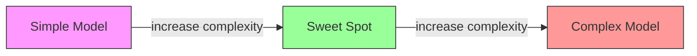
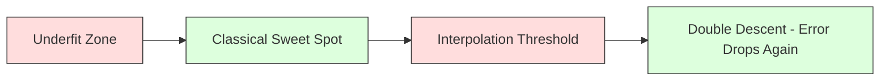
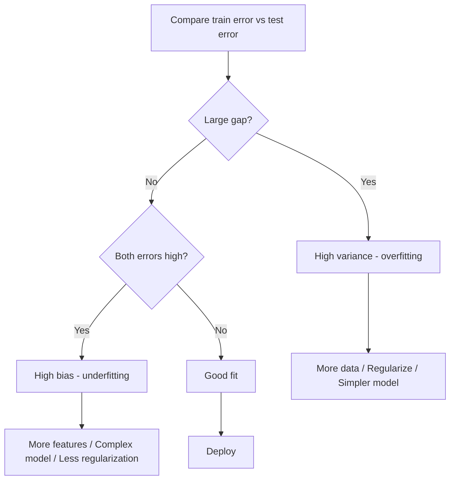
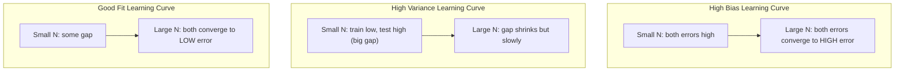
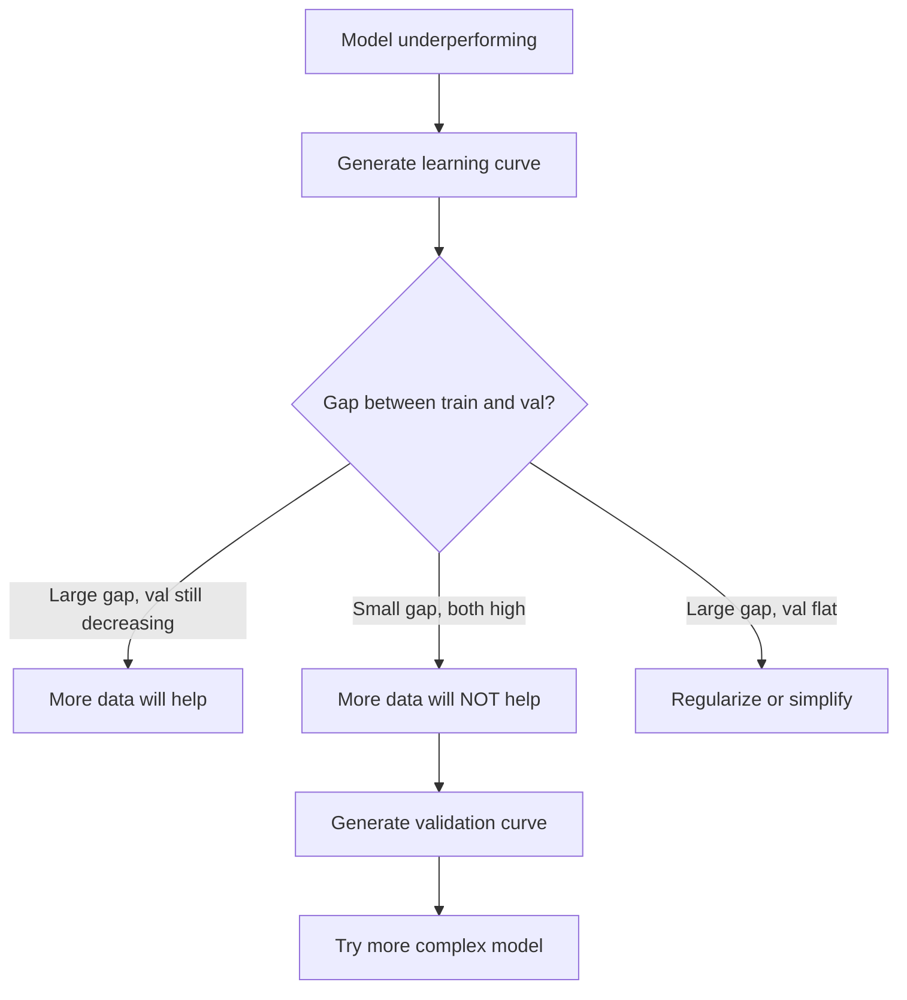

# Commerce des variantes partielles
# 偏差-方差权衡


> Chaque erreur de modèle provient d'une des trois sources: biais, variance ou bruit.

> Chaque erreur de modèle provient de trois sources: préférence, différence de couche ou bruit.

**Type:** Learn | **类型：** 学习
**Language:**Je suis un Python .**语言：**Python
**Prerequisites:** Phase 2, Lessons 01-09 (ML basics, regression, classification, evaluation) | **前置知识：** Phase 2 第 1-9 课（ML 基础、回归、分类、评估）
**Time:** ~75 minutes | **时间：** 约 75 分钟

## Objectifs d'apprentissage

- Dériver la décomposition des variantes de biais de l'erreur de prédiction prévue et expliquer le rôle du bruit irréductible
  推导期望预测 différence de différence de différence de différence de différence de différence de différence de différence, expliquer le rôle du bruit incontournable
- Diagnostication de la présence de biais ou de variance élevés dans un modèle en utilisant des modèles d'erreur de formation et de test
  Utilisation de la formation de l'erreur et du mode d'erreur de test pour déterminer si le modèle est de haute différence ou de haute différence de couleur
- Expliquer comment les techniques de régularisation (L1, L2, abandon, arrêt précoce) traitent de biais pour la variance
  解释正则化技术(L1、L2、Dropout、早停) Comment faire le bilan entre le décalage et le décalage
- Implementer des expériences qui visualisent le compromis de biais-variance entre les modèles de plus en plus complexes
  ¢ réaliser des expériences de mesure des différences de différence par rapport à la complexité du modèle visuel


> **【中文解读】**
> 偏差(模型太简单欠拟合) vs 方差(模型太复杂过拟合) 的平衡──正则化(L1/L2)、增加数据、降低模型复杂度是常用的手段──理解偏差-方差权衡是调调的理论基础──

> **【拓展：偏差-方差在深度学习中的新理解】**
> La théorie classique suppose que le modèle augmenté augmentera le décalage, mais que dans l'apprentissage en profondeur il y a une "double descente" (double descente) de phénomène: le modèle dépasse le "pollué" (environ un certain temps), puis le test d'erreur va à nouveau baisser.

## Le problème , l' introduction du problème

Vous avez formé un modèle, il y a une erreur dans les données des tests.

> Vous avez entraîné un modèle. Il y a des erreurs dans les données de test.

Si votre modèle est trop simple (régrésion linéaire sur un ensemble de données courbes), il manquera constamment le vrai modèle. C'est un biais. Si votre modèle est trop complexe (polynôme de degré 20 sur 15 points de données), il s'adaptera parfaitement aux données de formation mais donnera des prédictions très différentes sur les nouvelles données. C'est la variance.

> Si votre modèle est trop simple (à utiliser en ligne sur un ensemble de données), il continuera à se détourner du vrai mode. C'est le décalage. Si votre modèle est trop complexe (à utiliser en 20 fois plus de données sur 15 points), il sera parfaitement adapté aux données d'entraînement, mais donnera une prédiction très différente sur les nouvelles données.

Vous ne pouvez pas minimiser les deux en même temps pour une capacité de modèle fixe. Poussez le biais vers le bas et la variance monte. Poussez la variance vers le bas et le biais monte. Comprendre ce compromis est la compétence diagnostique la plus utile dans l'apprentissage automatique. Il vous dit si vous devez rendre votre modèle plus complexe ou moins complexe, si vous devez obtenir plus de données ou améliorer les fonctionnalités, si vous devez réguler plus ou moins.

> Pour une capacité de modèle fixe, vous ne pouvez pas minimiser les deux en même temps. La pression basse est de plus en plus élevée. La pression basse est de plus en plus élevée.

> **【中文解读】**
> 误差 = 偏差2 + 方差 + 不可约噪声。偏差来自模型的错误假设(如用直线拟合曲线),偏差来自训练数据波动的过度敏感──诊断方法:训练误差高+测试误差高→高偏差(不适合);训练误差低+测试误差高→高方差(过适合)──对应的解决方案完全不同──

## Le concept de base.

### Particuliers: erreur systématique

Si vous avez formé le même modèle sur plusieurs ensembles de formation différents tirés de la même distribution et avertis les prédictions, le biais est l'écart entre cette moyenne et la vérité.

> 偏差 mesure la différence entre la moyenne prévue de votre modèle et la valeur réelle ⋅ Si vous entraînez le même modèle et le même modèle sur plusieurs ensembles d'entraînements différents tirés de la même distribution, le偏差 est la différence entre cette moyenne et la valeur réelle ⋅

Un biais élevé signifie que le modèle est trop rigide pour capturer le modèle réel. Une ligne droite adaptée à une parabole va toujours manquer la courbe, peu importe la quantité de données que vous lui donnez.

> Le décalage élevé signifie que le modèle est trop délicat, impossible à saisir le vrai modèle.

```
High bias (underfitting):
  Model always predicts roughly the same wrong thing.
  Training error: HIGH
  Test error: HIGH
  Gap between them: SMALL
```

### Variance: sensibilité aux données de formation

La variance mesure la quantité de changement que vos prédictions apportent lorsque vous vous entraînez sur différents sous-ensembles de données.

> 方差 mesure le degré de changement des résultats de prévision lorsque vous vous entraînez sur différents sous-sets de données.

Une variance élevée signifie que le modèle est adapté au bruit dans les données de formation, pas le signal sous-jacent. Un polynôme de degré 20 traversera chaque point de formation mais oscillera de façon sauvage entre eux.

> Le différence de haute fréquence signifie que le modèle est un bruit dans les données de formation adaptées, et non un signal potentiel.

```
High variance (overfitting):
  Model fits training data perfectly but fails on new data.
  Training error: LOW
  Test error: HIGH
  Gap between them: LARGE
```

### La décomposition

Pour n'importe quel point x, l'erreur de prédiction attendue sous perte carrée se décompose exactement:

> Pour un point x, dans le square de perte, l'erreur prévue est décomposée en:

```
Expected Error = Bias^2 + Variance + Irreducible Noise

where:
  Bias^2   = (E[f_hat(x)] - f(x))^2
  Variance = E[(f_hat(x) - E[f_hat(x)])^2]
  Noise    = E[(y - f(x))^2]             (sigma^2)
```

- `f(x)`est la vraie fonction
  `f(x)`est une vraie fonction
- `f_hat(x)`est la prédiction de votre modèle
  `f_hat(x)`est votre modèle de prédiction
- `E[...]`est l'attente sur les différents ensembles de formation
  `E[...]`Il s'agit de l'expectative de formation différente.
- `y`est l'étiquette observée (vraie fonction plus bruit)
  `y`Oui, je suis en train de faire une vidéo.

Le terme bruit est irréductible. Aucun modèle ne peut faire mieux que sigma^2 sur les données bruyantes.

> Le bruit est incontournable. Aucun modèle ne peut faire mieux que sigma2 sur les données contenant du bruit. Votre tâche est de trouver le juste équilibre entre le parcours et le parcours.

### Complicité du modèle par rapport à l'erreur



La courbe classique en forme de U:

> 经典的 U 形曲线:

| Complexity | Bias | Variance | Total Error |
|-----------|------|----------|-------------|
| Too low | HIGH | LOW | HIGH (underfitting) |
| Just right | MODERATE | MODERATE | LOWEST |
| Too high | LOW | HIGH | HIGH (overfitting) |

| 复杂度 | 偏差 | 方差 | 总误差 |
|--------|------|------|--------|
| 太低 | 高 | 低 | 高（欠拟合） |
| 刚好 | 中等 | 中等 | 最低 |
| 太高 | 低 | 高 | 高（过拟合） |

### La régulation comme contrôle des variantes partielles

La régulation augmente délibérément le biais pour réduire la variance.

> L'orgasme est un système qui ne peut pas faire de bruit.

- **L2 (Ridge):**Réduit tous les poids vers zéro, conserve toutes les caractéristiques mais réduit leur influence.
  **L2 (Ridge)**Le droit de propriété sera redéfini à zéro, tout en conservant ses caractéristiques mais en réduisant son impact.
- **L1 (Lasso):**Pousse certains poids exactement à zéro.
  **L1 (Lasso)**:将某些权重精确推至零;; exécutation des caractéristiques de sélection;;
- **Dropout:**Il désactive les neurones au hasard pendant l'entraînement.
  **Dropout**Le temps d'entraînement est de ne pas utiliser les neurones.
- **Early stopping:**Arrête de former avant que le modèle ne s'adapte pleinement aux données de formation.
  **早停**: arrêter de s'entraîner avant de s'entraîner complètement.

La force de régulation (lambda, taux de décrochage, nombre d'époques) contrôle directement où vous vous asseyez sur la courbe de biais-variance.

> L'équilibre des forces (Lambda, Déclination, Déclination, Déclination, Déclination) est un facteur de contrôle direct de votre position sur la courbe des dérives.

### La double descendance: la perspective moderne

La théorie classique dit: après le point doux, plus de complexité fait toujours mal. Mais les recherches depuis 2019 ont montré quelque chose d'inattendu. Si vous continuez à augmenter la capacité du modèle bien au-delà du seuil d'interpolation (où le modèle a suffisamment de paramètres pour s'adapter parfaitement aux données de formation), l'erreur de test peut diminuer à nouveau.

> La théorie classique pense que, après le meilleur de ses points, plus de complexité est toujours nocive. Mais des études réalisées depuis 2019 ont montré des phénomènes inattendus. Si vous continuez à augmenter la capacité du modèle, le modèle a suffisamment de paramètres pour être parfaitement adapté à la formation, les erreurs de test peuvent à nouveau diminuer.



Ce phénomène de "double descente" explique pourquoi les réseaux neuronaux massiquement surparamétrisés (avec beaucoup plus de paramètres que les exemples de formation) se généralisent encore bien.

> Ce phénomène de "double-poids descendants" explique pourquoi le réseau neuronal à grande échelle est trop paramétrique (les paramètres sont bien supérieurs à ceux de l'échantillon d'entraînement) et peut encore être très bien généralisé.

Observations clés sur la double descente:

>  À propos de la chute du poids:

- Il se produit dans les modèles linéaires, les arbres de décision et les réseaux neuronaux
  Il se produit dans les modèles en ligne, les arbres de décision et les réseaux neuronaux.
- Plus de données peuvent en fait nuire dans la région d'interpolation (double descente par échantillonnage)
  Dans la zone de valeur de l'entrée plus de données peuvent en fait être nocives
- Plus d'époques d'entraînement peuvent également le causer (double descente selon l'époque)
  更多训练时代 也可能导致它(époque-wise 双重下降)
- La régulation élimine le pic mais ne l'élimine pas.
  Il a atteint son sommet mais ne peut pas l'éliminer.

Pourquoi cela arrive- t- il ? Au seuil d'interpolation, le modèle a une capacité suffisante pour s'adapter à tous les points de formation. Il est forcé dans une solution très spécifique qui traverse chaque point, et de petites perturbations dans les données provoquent de grands changements dans la couture. C'est là que la variance atteint son apogée. Au-delà du seuil, le modèle dispose de nombreuses solutions possibles qui correspondent parfaitement aux données. L'algorithme d'apprentissage (par exemple, la descente de gradient avec régularisation implicite) a tendance à choisir le plus simple parmi eux. Ce biais implicite vers des solutions simples est la raison pour laquelle les modèles surparamétrisés se généralisent.

> Pourquoi cela se produit-il? Dans une position de valeur ajoutée, le modèle a juste assez de capacité pour s'adapter à tous les points d'entraînement. Il est obligé de trouver une solution spécifique à chaque point, les petites perturbations des données entraînant des changements énormes dans l'adaptation. C'est là que se situe le point culminant de la différence. Après la valeur ajoutée, le modèle a de nombreuses solutions possibles de données parfaitement adaptées.

| Regime | Parameters vs Samples | Behavior |
|--------|----------------------|----------|
| Underparameterized | p << n | Classical tradeoff applies |
| Interpolation threshold | p ~ n | Variance peaks, test error spikes |
| Overparameterized | p >> n | Implicit regularization kicks in, test error drops |

| 状态 | 参数 vs 样本 | 行为 |
|------|-------------|------|
| 欠参数化 | p << n | 经典权衡适用 |
| 插值阈值 | p ~ n | 方差峰值，测试误差飙升 |
| 过参数化 | p >> n | 隐式正则化起效，测试误差下降 |

Pour des raisons pratiques: si vous utilisez des réseaux neuraux ou de grands ensembles d'arbres, ne vous arrêtez pas au seuil d'interpolation. Soyez bien en dessous de celui-ci (avec une régularisation explicite) ou bien en dépassez-le.

>  En pratique, si vous utilisez un réseau de neurones ou une grande intégration d'arbres, ne vous arrêtez pas à placer des valeurs  en position .

### Comment diagnostiquer votre modèle



| Symptom | Diagnosis | Fix |
|---------|-----------|-----|
| High train error, high test error | Bias | More features, complex model, less regularization |
| Low train error, high test error | Variance | More data, regularization, simpler model, dropout |
| Low train error, low test error | Good fit | Ship it |
| Train error decreasing, test error increasing | Overfitting in progress | Early stopping |

| 症状 | 诊断 | 修复 |
|------|------|------|
| 训练误差高，测试误差高 | 偏差 | 更多特征、更复杂的模型、更少的正则化 |
| 训练误差低，测试误差高 | 方差 | 更多数据、正则化、更简单的模型、dropout |
| 训练误差低，测试误差低 | 好的拟合 | 发布它 |
| 训练误差下降，测试误差上升 | 正在过拟合 | 早停 |

### Des stratégies pratiques

**When bias is the problem:**
- Ajouter des caractéristiques polynomielles ou d'interaction
  添加多项式或交互特征
- Utilisez un modèle plus flexible (ensemble d'arbres au lieu de linéaire)
  Utiliser un modèle plus flexible (Rich集成代替线性模型)
- Réduire la force de régularisation
  减小正则化强度
- Trains plus longs (si ils ne convergent pas encore)
  训练更长时间 (si vous avez encore reçu)

**When variance is the problem:**

> **当方差是问题时：**
- Obtenez plus de données sur la formation
  obtenir plus de données de formation
- Utilisation de la sachetation (forêts aléatoires)
  Utilisation de sacs avec des poches
- Augmentation de la régularisation (lambda plus élevé, plus de dérapages)
  增加正则化(更高的 lambda、更多 dropped out)
- Sélection des fonctionnalités (supprimer les fonctionnalités bruyantes)
  C'est une sorte de "commentaire"
- Utilisez la validation croisée pour la détecter précocement
  Utilisation de l'épreuve et de l'examen précoce

### Métodes d'assemblage et réduction des variations

Les méthodes d'assemblage sont l'outil le plus pratique pour combattre les variantes.

> La méthode d'intégration est l'outil le plus pratique pour lutter contre la différence.

**Bagging (Bootstrap Aggregating)**Les modèles de formation sont les plus variés, mais les modèles de formation sont les plus variés.

> **Bagging（Bootstrap 聚合）**Dans les différents exemples de démarrage de formation, on entraîne plusieurs modèles, puis on les prévoit en moyenne. Chaque modèle individuel a une différence de hauteur, mais la valeur moyenne est bien inférieure.

Pourquoi cela fonctionne-t-il mathématiquement: si vous faites en moyenne N prédictions indépendantes, chacune avec une variance sigma^2, la variance de la moyenne est sigma^2 / N. Les modèles ne sont pas vraiment indépendants (ils voient tous des données similaires), donc la réduction est inférieure à 1/N, mais elle est toujours substantielle.

> Principe de mathématiques: si vous prévoyez en moyenne N 个独立预测, chaque carré différencie sigma^2, la valeur moyenne de la carré différencie sigma^2 / N ⋅模型并非真正独立 (elles ne sont pas vraiment indépendantes), alors la réduction est inférieure à 1/N, mais reste très observable.

**Boosting**Le booster peut surpasser si vous ajoutez trop de modèles, vous devez donc arrêter ou régulariser tôt.

> **Boosting**通过顺序构建模型以减少偏差, chaque nouveau modèle se préoccupe jusqu'à présent des erreurs d'intégration ◦梯度提升和AdaBoost sont les principaux exemples ◦ Si vous ajoutez trop de modèles, Boosting pourrait être trop adapté, donc il faut arrêter tôt ou régulariser︎

| Method | Primary Effect | Bias Change | Variance Change |
|--------|---------------|-------------|-----------------|
| Bagging | Reduces variance | No change | Decreases |
| Boosting | Reduces bias | Decreases | Can increase |
| Stacking | Reduces both | Depends on meta-learner | Depends on base models |
| Dropout | Implicit bagging | Slight increase | Decreases |

| 方法 | 主要效果 | 偏差变化 | 方差变化 |
|------|---------|---------|---------|
| Bagging | 减少方差 | 不变 | 下降 |
| Boosting | 减少偏差 | 下降 | 可能增加 |
| Stacking | 减少两者 | 取决于元学习器 | 取决于基模型 |
| Dropout | 隐式 Bagging | 略微增加 | 下降 |

**Practical rule:**Si votre modèle de base a une grande variance (arbres profonds, polynômes de haut degré), utilisez le sachetage.

> **实践规则：**Si votre modèle de base a un décalage de hauteur (en basse ligne), utilisez le Boosting.

### Curves d'apprentissage

Les courbes d'apprentissage tracent l'erreur de formation et de validation en fonction de la taille du jeu d'entraînement. Ce sont les outils de diagnostic les plus pratiques que vous avez. Contrairement à une comparaison de train/test unique, les courbes d'apprentissage vous montrent la trajectoire de votre modèle et vous disent si plus de données vous aideront.

> Les courbes d'apprentissage seront les erreurs d'entraînement et les erreurs d'évaluation comme le dessin de fonction de grande taille de l'ensemble d'entraînement. Elles sont vos outils de diagnostic les plus pratiques.



Comment les lire ?

> Comment expliquer:

| Scenario | Training Error | Validation Error | Gap | What It Means | What to Do |
|----------|---------------|-----------------|-----|---------------|------------|
| High bias | High | High | Small | Model cannot capture the pattern | More features, complex model, less regularization |
| High variance | Low | High | Large | Model memorizes training data | More data, regularization, simpler model |
| Good fit | Moderate | Moderate | Small | Model generalizes well | Ship it |
| High variance, improving | Low | Decreasing with more data | Shrinking | Variance problem that data can fix | Collect more data |
| High bias, flat | High | High and flat | Small and flat | More data will NOT help | Change model architecture |

| 场景 | 训练误差 | 验证误差 | 间隙 | 含义 | 应对 |
|------|---------|---------|------|------|------|
| 高偏差 | 高 | 高 | 小 | 模型无法捕捉模式 | 更多特征、更复杂模型、减少正则化 |
| 高方差 | 低 | 高 | 大 | 模型记住训练数据 | 更多数据、正则化、更简单模型 |
| 好的拟合 | 中等 | 中等 | 小 | 模型泛化良好 | 发布它 |
| 高方差，正在改善 | 低 | 随数据增加而下降 | 缩小 | 数据可以解决的方差问题 | 收集更多数据 |
| 高偏差，平坦 | 高 | 高且平坦 | 小且平坦 | 更多数据不会有帮助 | 更改模型架构 |

L'idée essentielle: si les deux courbes se sont plaquées et que l'écart est petit mais que les deux erreurs sont élevées, plus de données sont inutiles. Vous avez besoin d'un meilleur modèle. Si l'écart est grand et qu'il diminue toujours, plus de données vous aideront.

> 关键洞察: si les deux courbes ont tendance à être pures et à réduire les espaces mais que les deux erreurs sont élevées, plus de données ne sont pas nécessaires. Vous avez besoin d'un meilleur modèle.

### Comment générer des courbes d'apprentissage

Il existe deux approches:

> Il y a deux façons:

**Approach 1: Vary training set size, fixed model.**Gardez le modèle et les hyperparametres constants. Prenez des exercices sur des sous-ensembles de plus en plus grands des données de formation. Mesurez l'erreur de formation et l'erreur de validation à chaque taille.

> **方法 1：变化训练集大小，固定模型。**保持模型和超参数不变── entraînement sur un ensemble de données de formation de plus en plus grand── entraînement sur une erreur de formation et d'évaluation de chaque taille.

**Approach 2: Vary model complexity, fixed data.**La valeur de la valeur de la valeur de la valeur de la valeur de la valeur de la valeur de la valeur de la valeur de la valeur de la valeur de la valeur de la valeur de la valeur de la valeur de la valeur de la valeur de la valeur de la valeur de la valeur de la valeur de la valeur de la valeur de la valeur de la valeur de la valeur de la valeur de la valeur de la valeur de la valeur de la valeur de la valeur de la valeur de la valeur de la valeur de la valeur de la valeur de la valeur de la valeur de la valeur de la valeur de la valeur de la valeur de la valeur de la valeur de la valeur de la valeur de la valeur de la valeur de la valeur de la valeur de la valeur de la valeur de la valeur de la valeur de la valeur de la valeur de la valeur de la valeur de la valeur de la valeur de la valeur de la valeur de la valeur de la valeur de la valeur de la valeur de la valeur de la valeur de la valeur de la valeur de la valeur de la valeur de la valeur de la valeur de la valeur de la valeur de la valeur de la valeur de la valeur de la valeur de la valeur de la valeur de la valeur de la valeur de la valeur de la valeur de la valeur de la valeur de la valeur de la valeur de la valeur de la valeur de la valeur de la valeur de la valeur de la valeur de la valeur de la valeur de la valeur de la valeur de la valeur de la valeur est de la valeur de la valeur est de la valeur est de la valeur de la valeur de la valeur de la valeur de la valeur de la valeur de la valeur de la valeur de la valeur de la valeur de la valeur de la valeur de la valeur de la valeur de la valeur de la valeur de la valeur de la valeur de la valeur de la valeur de la valeur de la valeur de la valeur de la valeur de la valeur de la valeur de la valeur de la valeur de la valeur de la valeur de la valeur de la valeur de la valeur de la valeur de la valeur de la valeur de la valeur de la valeur de la valeur de la valeur est de la valeur de la valeur de la valeur de la valeur est de la valeur est de la valeur de la valeur de la valeur de la valeur de la valeur est de la valeur de la valeur de la valeur est de la valeur de la valeur de la valeur de la valeur de la valeur de la valeur est de la valeur de la valeur de

> **方法 2：变化模型复杂度，固定数据。**保持数据不变──扫描复杂度参数(多项式次数、树深度、层数)──在每个复杂度下测量训练误差和验证误差──这是验证曲线,直接展示偏差-方差权衡──

Les deux approches se complètent. La première vous indique si plus de données vous aideront. La seconde vous indique si un modèle différent vous aidera.

> 两种方法互补――第一种告诉你更多数据是否有帮助――第二种告诉你不同模型是否有帮助――前决定下一步之前,两者都必须运行――



## Construisez-le et mettez-le en œuvre.

> **【中文解读】**
> 通过实验可视化偏差-方差权衡: avec plusieurs éléments de complexité différente, les données sont adaptées au même groupe de données, observant les erreurs de formation et les erreurs de test avec des variations de complexité.
```figure
bias-variance
```

## Faites-le

Le code dans `code/bias_variance.py`Il fait l'expérience complète de décomposition des variantes de biais.

> `code/bias_variance.py`Le code central est utilisé pour la décomposition complète des différences de différences.

### Étape 1: Générer des données synthétiques à partir d'une fonction connue

On utilise`f(x) = sin(1.5x) + 0.5x`Connaître la vraie fonction nous permet de calculer le biais et la variance exacts.

> Nous utilisons`f(x) = sin(1.5x) + 0.5x`GaGaGos noise. Savoir la vraie fonction permet de calculer avec précision les différences de parité et de parité.

```python
def true_function(x):
    return np.sin(1.5 * x) + 0.5 * x

def generate_data(n_samples=30, noise_std=0.5, x_range=(-3, 3), seed=None):
    rng = np.random.RandomState(seed)
    x = rng.uniform(x_range[0], x_range[1], n_samples)
    y = true_function(x) + rng.normal(0, noise_std, n_samples)
    return x, y
```

### Étape 2: Prise d'échantillons à partir de la barre de démarrage et ajustement polynomial

Pour chaque degré polynomial, nous dessinons de nombreux ensembles de formation de démarrage, correspondons au polynôme et enregistrons des prédictions sur une grille de test fixe. Cela nous donne une distribution des prédictions à chaque point de test.

> Pour chaque nombre de tests, nous avons tiré de nombreux bootstrap, préparé plusieurs tests et enregistré des prévisions sur un réseau de tests fixe.

```python
def fit_polynomial(x_train, y_train, degree, lam=0.0):
    X = np.column_stack([x_train ** d for d in range(degree + 1)])
    if lam > 0:
        penalty = lam * np.eye(X.shape[1])
        penalty[0, 0] = 0
        w = np.linalg.solve(X.T @ X + penalty, X.T @ y_train)
    else:
        w = np.linalg.lstsq(X, y_train, rcond=None)[0]
    return w
```

Nous avons mis 200 échantillons différents de démarrage. Chaque échantillon de démarrage est tiré de la même distribution sous-jacente mais contient des points différents.

> Nous sommes en train de créer 200 modèles différents de démarrage. Chaque modèle de démarrage est tiré du même niveau de distribution mais contient des points différents.

### Étape 3: calcul des biais^2, décomposition des variantes

Avec 200 ensembles de prédictions à chaque point de test, nous pouvons calculer la décomposition directement à partir de la définition:

> Avec chaque test de 200 groupes de prédictions, nous pouvons directement décrire calculer:

```python
mean_pred = predictions.mean(axis=0)
bias_sq = np.mean((mean_pred - y_true) ** 2)
variance = np.mean(predictions.var(axis=0))
total_error = np.mean(np.mean((predictions - y_true) ** 2, axis=1))
```

- `mean_pred`est E[f_hat(x)] estimé à partir d'échantillons de démarrage
  `mean_pred`C'est le cas de la première édition de la série.
- `bias_sq`est l'écart carré entre la prédiction moyenne et la vérité
  `bias_sq`est la différence carrée entre la moyenne prédiction et la valeur réelle
- `variance`est la propagation moyenne des prédictions sur les échantillons de démarrage
  `variance`est le démarrage 样本间预测
- `total_error`doit être approximativement égale à la particule^2 + variance + bruit
  `total_error`应约等于 biais^2 + variance + bruit

### Étape 4: Curves d'apprentissage

Les courbes d'apprentissage balayent la taille de l'ensemble d'entraînement tout en conservant la complexité du modèle fixe. Elles montrent si votre modèle est limité par les données ou la capacité.

> Les cours de formation sont basés sur la complexité du modèle fixe, mais ils montrent que votre modèle est limité par les données ou par la capacité.

```python
def demo_learning_curves():
    sizes = [10, 15, 20, 30, 50, 75, 100, 150, 200, 300]
    degree = 5

    for n in sizes:
        train_errors = []
        test_errors = []
        for seed in range(50):
            x_train, y_train = generate_data(n_samples=n, seed=seed * 100)
            w = fit_polynomial(x_train, y_train, degree)
            train_pred = predict_polynomial(x_train, w)
            train_mse = np.mean((train_pred - y_train) ** 2)
            test_pred = predict_polynomial(x_test, w)
            test_mse = np.mean((test_pred - y_test) ** 2)
            train_errors.append(train_mse)
            test_errors.append(test_mse)
        # Average over runs gives the learning curve point
```

Pour un modèle à grande variance (grade 5 avec de petites données), vous voyez:

> Pour le modèle de différence de taille (environ 5 fois plus de données), vous verrez:
- L'erreur de formation commence à bas et augmente à mesure que plus de données rendent la mémorisation plus difficile
  Les erreurs d'entraînement à partir de bas, avec plus de données rendent la mémoire difficile à augmenter.
- L'erreur de test commence à être élevée et diminue à mesure que le modèle reçoit plus de signal
  测试差从高开始, avec le modèle obtenir plus de signaux et de baisse
- L'écart diminue avec plus de données
  间隙 avec plus de données et se réduire

Pour un modèle à forte partialité (grade 1), les deux erreurs convergent rapidement à la même valeur élevée et plus de données ne contribuent pas.

> Pour le modèle de différence de hauteur (x = 1), deux différences rapidement atteignent la même hauteur, plus de données ne sont pas utiles.

### Étape 5: Effacer la régularisation

Le code comprend également `demo_regularization_sweep()`, qui fixe un polynôme de haut degré (grade 15) et balaie la résistance de régulation de Ridge de 0,001 à 100. Cela montre le compromis de biais-variance sous un angle différent: au lieu de varier la complexité du modèle, nous varions la résistance de contrainte.

> 代码 également inclus `demo_regularization_sweep()`, fixée à un niveau élevé de plusieurs éléments ([[15 fois) 并从0.001到100 扫描 Ridge 正则化强度── ceci montre d'un point de vue différent le poids du parité-parité: pas de modifier la complexité du modèle, mais de modifier la force du groupe──

```python
def demo_regularization_sweep():
    alphas = [0.001, 0.005, 0.01, 0.05, 0.1, 0.5, 1.0, 5.0, 10.0, 50.0, 100.0]
    for alpha in alphas:
        results = bias_variance_decomposition([15], lam=alpha)
        r = results[15]
        print(f"alpha={alpha:.3f}  bias={r['bias_sq']:.4f}  var={r['variance']:.4f}")
```

À l'alpha basse, le polynôme de degré 15 est presque sans contrainte. La variance domine parce que le modèle poursuit le bruit dans chaque échantillon de démarrage. À l'alpha élevé, la pénalité est si forte que le modèle devient effectivement une fonction quasi constante.

> En alpha basse, le modèle est presque inégal. Le modèle est dominé par la différence de fréquence, car le modèle poursuit le bruit dans chaque bootstrap.

Il s'agit de la même courbe U à différents degrés polynomials, mais contrôlée par un bouton continu au lieu d'un bouton discret.

> Il est identique à la courbe U de plusieurs variables, mais il est contrôlé par des rotations continues et non séparées. En pratique, la normalisation est la méthode de contrôle de poids, car elle permet de contrôler les caractéristiques de manière précise sans modifier le groupe de caractéristiques.

## Utilisez-le avec le cadre de réalisation

sklearn fournit `learning_curve`et `validation_curve`pour automatiser ces diagnostics sans écrire des boucles de démarrage.

> magasin  fournir `learning_curve`et `validation_curve`Pour automatiser ces diagnostics, il n'est pas nécessaire de rédiger un cycle de démarrage.

### Curve de validation: complexité du modèle de balayage

```python
from sklearn.model_selection import validation_curve
from sklearn.pipeline import make_pipeline
from sklearn.preprocessing import PolynomialFeatures
from sklearn.linear_model import Ridge

degrees = list(range(1, 16))
train_scores_all = []
val_scores_all = []

for d in degrees:
    pipe = make_pipeline(PolynomialFeatures(d), Ridge(alpha=0.01))
    train_scores, val_scores = validation_curve(
        pipe, X, y, param_name="polynomialfeatures__degree",
        param_range=[d], cv=5, scoring="neg_mean_squared_error"
    )
    train_scores_all.append(-train_scores.mean())
    val_scores_all.append(-val_scores.mean())
```

Cela vous donne directement la courbe de compensation des biais-variants. Là où le score de validation est le pire par rapport au score de formation, la variance domine. Là où les deux sont mauvais, le biais domine.

> Ceci donne directement un angle de parité-parité.

### Curve d'apprentissage: taille de l'ensemble de formation

```python
from sklearn.model_selection import learning_curve

pipe = make_pipeline(PolynomialFeatures(5), Ridge(alpha=0.01))
train_sizes, train_scores, val_scores = learning_curve(
    pipe, X, y, train_sizes=np.linspace(0.1, 1.0, 10),
    cv=5, scoring="neg_mean_squared_error"
)
train_mse = -train_scores.mean(axis=1)
val_mse = -val_scores.mean(axis=1)
```

Le film`train_mse`et `val_mse`contre `train_sizes`La forme vous dit tout sur votre modèle.

> Il va`train_mse`et `val_mse`Pour le`train_sizes`La forme vous dit tout sur le modèle.

### Validation croisée avec analyse de régulation

```python
from sklearn.model_selection import cross_val_score

alphas = [0.001, 0.01, 0.1, 1.0, 10.0, 100.0]
for alpha in alphas:
    pipe = make_pipeline(PolynomialFeatures(10), Ridge(alpha=alpha))
    scores = cross_val_score(pipe, X, y, cv=5, scoring="neg_mean_squared_error")
    print(f"alpha={alpha:>7.3f}  MSE={-scores.mean():.4f} +/- {scores.std():.4f}")
```

Cela passe par la force de régularisation pour une complexité de modèle fixe. Vous verrez le même compromis de biais-variance: faible alpha signifie haute variance, haute alpha signifie haut biais.

> Ceci est une analyse de la complexité du modèle fixe et de la force de la régulation. Vous verrez les mêmes écarts de poids: faible alpha signifie haut écarts de poids, haut alpha signifie haut écarts de poids.

### Le travail complet sur le diagnostic

En pratique, vous effectuez ces diagnostics dans la séquence:

> En pratique, vous faites ces diagnostics selon les modalités suivantes:

1. Prenez votre modèle, comptez votre train et testez l'erreur.
   訓練你的模型──計算訓練和測試誤差──
2. Si les deux sont élevés, vous avez un problème de biais.
   Si les deux sont très hauts, vous avez des problèmes de partialité.
3. Si le train est bas mais que le test est élevé: vous avez un problème de variance. Générez une courbe d'apprentissage pour voir si plus de données vous aideront.
   Si l'entraînement est faible mais le test est élevé: vous avez des problèmes de différence.
4. Générez une courbe de validation en balayant votre paramètre de complexité principal.
   Le détail de la complexité de la recherche est le plus important.
5. Si le décalage est encore important, vous avez besoin de plus de données ou de régularisation.
   Dans le meilleur des cas, la formation est une formation. Si le espace est encore grand, vous aurez besoin de plus de données ou de correction.
6. Essayez Ridge/Lasso avec différentes valeurs alpha en utilisant `cross_val_score`Choisissez l'alpha où l'erreur de validation croisée est la plus faible.
   - Je veux le faire .`cross_val_score`尝试不同 alpha 值的Ridge/Lasso──选择交叉验证误差最低的 alpha──

Cela prend 10-15 minutes de calcul pour la plupart des ensembles de données tabulaires et économise des heures de devinettes.

> Pour la plupart des tableaux, cela prend 10-15 minutes de calcul, mais économise quelques heures de devinettes.

## Envoyez-le . Produit .

Cette leçon donne: `outputs/prompt-model-diagnostics.md`

> Le programme de formation`outputs/prompt-model-diagnostics.md`

## Les exercices

1. Exécutez la décomposition avec `noise_std=0`(sans bruit). Que se passe-t-il avec le terme d'erreur irréductible? La complexité optimale change-t-elle?
   1. - Je veux le faire .`noise_std=0`(sans bruit) La fonctionnement de la décomposition.

2. Augmenter la taille du jeu d'entraînement de 30 à 300. Comment cela affecte-t-il la composante de variance?
   2. Le nombre de séances d'entraînement est passé de 30 à 300.

3. Ajouter la régulation L2 (régrésion de Ridge) à l'expérience. Pour un polynôme à degré élevé fixe (grade 15), balayer lambda de 0 à 100.
   3. Dans l'expérience, ajoutez L2 à la règle de la Ridge.

4. Modifier la vraie fonction d' un polynôme à `sin(x)`Comment la décomposition des variantes de biais change-t-il ?
   4. Pour modifier la vraie fonction de plusieurs éléments en `sin(x)`◊ Comment les différences varient-elles ? y a-t-il encore un nombre clair de meilleures possibilités ?

5. Implémenter un simple emballage d'agrégation de la bande de démarrage: entraîner 10 modèles sur des échantillons de bande de démarrage et des prédictions moyennes.
   5. 实现简单的Bootstrap 聚聚包装器: entraînement sur le bootsstrap 样本 10 模型并平均预测;; démonstration qui a réduit la différence de couche et n'a pas augmenté de manière significative la différence de couche;;

> **【中文解读】**
> 偏差-方差分解的数学表达:E[((y - f_hat) ^2] = Bias^2 + Variance + sigma^2──其中 Bias^2 est le modèle systémique d'erreur carrée, Variance est le modèle à la sensibilité de l'entraînement des données à la mouvement, sigma^2 est le bruit incontournable des données elles-mêmes── Réduire le biais de méthode: plus complexe de modèle、 meilleurs caractéristiques── Réduire le façade  Réduire le biais de méthode:

> **【拓展：正则化如何在偏差和方差之间取得平衡】**
> L2 L'éducation (Ridge) est une forme de formation à l'éducation (l'éducation à la lecture et à la lecture) qui oblige le réseau à ne pas dépendre de n'importe quel neurone. Dans l'entraînement GPT-4, l'utilisation de la réduction du poids (la dégradation du poids) et de la décomposition pour contrôler les différences, assure que le modèle peut encore être généré à nouveau après une formation de milliards de tokens.

## Les termes clés

| Term | What people say | What it actually means |
|------|----------------|----------------------|
| Bias | "The model is too simple" | Systematic error from wrong assumptions. The gap between the average model prediction and truth. |
| Variance | "The model is overfitting" | Error from sensitivity to training data. How much predictions change across different training sets. |
| Irreducible error | "Noise in the data" | Error from randomness in the true data-generating process. No model can eliminate it. |
| Underfitting | "Not learning enough" | Model has high bias. It misses the real pattern even on training data. |
| Overfitting | "Memorizing the data" | Model has high variance. It fits noise in training data that does not generalize. |
| Regularization | "Constraining the model" | Adding a penalty to reduce model complexity, trading bias for lower variance. |
| Double descent | "More parameters can help" | Test error decreases again when model capacity far exceeds the interpolation threshold. |
| Model complexity | "How flexible the model is" | The capacity of a model to fit arbitrary patterns. Controlled by architecture, features, or regularization. |

## Encore une lecture

- [Hastie, Tibshirani, Friedman: Elements of Statistical Learning, Ch. 7](https://hastie.su.domains/ElemStatLearn/)-- le traitement définitif de la décomposition des variantes de biais
  [Hastie, Tibshirani, Friedman: Elements of Statistical Learning, Ch. 7](https://hastie.su.domains/ElemStatLearn/)- 偏差-方差分解的权威论述
- [Belkin et al., Reconciling modern machine learning practice and the bias-variance trade-off (2019)](https://arxiv.org/abs/1812.11118)- le papier à double descente
  [Belkin et al., Reconciling modern machine learning practice and the bias-variance trade-off (2019)](https://arxiv.org/abs/1812.11118)- 双重下降论文
- [Nakkiran et al., Deep Double Descent (2019)](https://arxiv.org/abs/1912.02292)-- doubles descentes selon l'époque et l'échantillon
  [Nakkiran et al., Deep Double Descent (2019)](https://arxiv.org/abs/1912.02292)- l'époque et l'échantillon
- [Scott Fortmann-Roe: Understanding the Bias-Variance Tradeoff](http://scott.fortmann-roe.com/docs/BiasVariance.html)- une explication visuelle claire
  [Scott Fortmann-Roe: Understanding the Bias-Variance Tradeoff](http://scott.fortmann-roe.com/docs/BiasVariance.html)- Une explication claire
