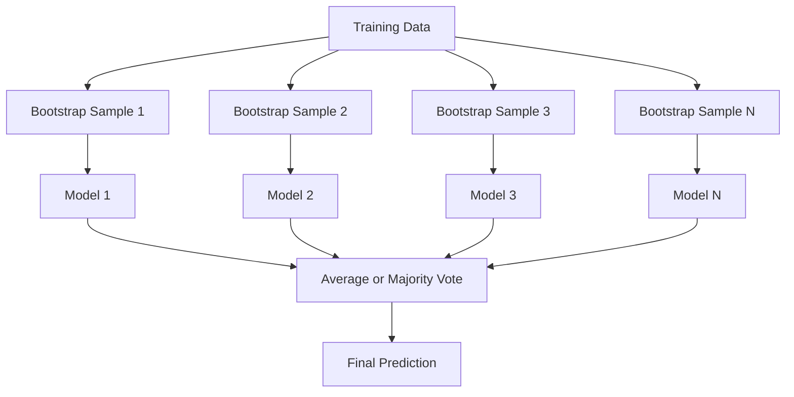
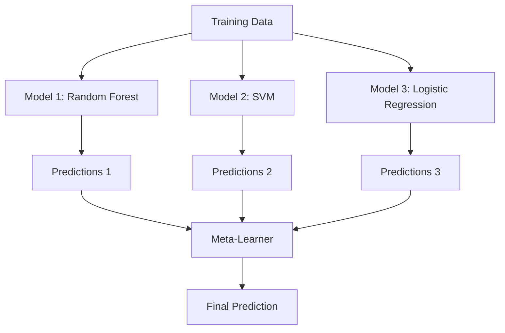

# Métodes de mise en œuvre
# 集成方法


> Un groupe d'apprenants faibles, combinés correctement, deviennent des apprenants forts.

> Une équipe de faibles apprenants, juste après, devient un groupe de forts apprenants.

**Type:** Build | **类型：** 构建
**Language:**Je suis un Python .**语言：**Python
**Prerequisites:** Phase 2, Lesson 10 (Bias-Variance Tradeoff) | **前置知识：** Phase 2 第 10 课（偏差-方差权衡）
**Time:** ~120 minutes | **时间：** 约 120 分钟

## Objectifs d'apprentissage

- Implémenter AdaBoost et gradient boosting à partir de zéro et expliquer comment le boosting réduit séquentiellement les biais
  De zéro réaliser AdaBoost et gradient提升, expliquer Boosting 如何串行减少偏差
- Construire un ensemble de sacs et démontrer comment la moyenne des modèles décorrélés réduit la variance sans augmenter les biais
  construire Bagging intégration, démontrer comment réduire les différences de taille en cas de différence non accrue
- Comparer le sachetage, le renforcement et l'empilage en termes de composants d'erreur que chaque méthode vise
  Comparer le sachetage, le renforcement et l'empilage
- Évaluer la diversité de l'ensemble et expliquer pourquoi la précision des votes majoritaires s'améliore avec des apprenants plus faibles et plus indépendants
  évaluer la diversité intégrée, expliquer pourquoi le taux de participation à la majorité a augmenté avec plus de machines d'apprentissage indépendantes


> **【中文解读】**
> 集成方法组合多个弱模型成一个强模型――Bagging(随机森林) réduire la différence de couleur, Boosting(XGBoost) réduire la différence de couleur――XGBoost/LightGBM 在 Kaggle 比赛中占据统治地位――金融风控、推系统广泛使用――

> **【拓展：集成方法在 Kaggle 和工业界的主导地位】**
> Dans le cadre de la compétition de données structurées, le classement des 10 meilleurs programmes est presque 100% utilisé pour l'intégration. Le programme gagnant du prix Netflix est l'intégration de 107 modèles.

## Le problème , l' introduction du problème

Un seul arbre de décision est rapide à former et facile à interpréter, mais il dépasse. Un seul modèle linéaire est insuffisant sur des limites complexes. Vous pouvez passer des jours à concevoir l'architecture modèle parfaite. Ou vous pouvez combiner un tas de modèles imparfaits et obtenir quelque chose de mieux que chacun d'eux individuellement.

> 单棵决策树训练快、易解释,但会过拟合――单个线性模型在复杂边界上不适合―― vous pouvez passer quelques jours à concevoir une architecture de modèle parfaite, ou à assembler une pile de modèles imparfaits, obtenir de meilleurs résultats que n'importe lequel―

Les méthodes d'assemblage font exactement cela. Ce sont les techniques les plus fiables pour gagner des concours Kaggle sur des données tabulaires, elles alimentent la plupart des systèmes ML de production et elles illustrent le compromis de variance de biais en action.

> La méthode d'intégration est la meilleure à faire. Elles ont gagné la compétition de données de format Kaggle, ont conduit la plupart des systèmes de production de machines à sous, et ont montré directement le fonctionnement réel du poids des différences de différence.

> **【中文解读】**
> Le principe central de la méthode d'intégration: si plusieurs modèles imparfaits commettent des erreurs différentes, leur prédiction moyenne sera plus précise. Bagging (comme dans la forêt) par l'entraînement de modèles indépendants prend en moyenne pour réduire le décalage; Boosting (comme AdaBoost, GBDT) par l'entraînement en série pour que chaque nouveau modèle corrige l'erreur du précédent pour réduire le décalage; Stacking avec un ensemble de modèles de base de différents types.

## Le concept de base.

### Pourquoi les groupes travaillent

Supposons que vous ayez N classifiateurs indépendants, chacun avec une précision p > 0,5.

> 假设你有N 个独立分类器,每个准确率为p > 0.5──多数投票的准确率为:

```
P(majority correct) = sum over k > N/2 of C(N,k) * p^k * (1-p)^(N-k)
```

Pour 21 classifiateurs, chacun avec une précision de 60%, la précision des voix majoritaires est d'environ 74%. Avec 101 classifiateurs, elle monte à 84%.

> 21 taux d'exactitude de 60% dans les classifications, le taux de majorité de vote est d'environ 74%[6].

L' exigence clé est **diversity**Si tous les modèles commettent les mêmes erreurs, leur combinaison ne sert à rien.

> 关键要求是:**多样性**Si tous les modèles commettent les mêmes erreurs, les assembler n'est pas utile.

- Différents sous-ensembles de formation (de retard)
  Il y a des trucs à faire.
- Les sous-ensembles de caractéristiques différentes (forêts aléatoires)
  Il y a aussi des gens qui ont des problèmes avec la nature.
- Correction d'erreur séquentielle (augmentation)
  顺序错误纠正(Boosting)
- Familles de modèles différentes (en pile)
  Il y a aussi des modèles de la série.

### Les produits de la fabrication de boîtes de chargement

Le sacage crée une diversité en formant chaque modèle sur un échantillon de démarrage différent des données de formation.

> En train de créer une variété de modèles, on peut les emballer en train de former chaque modèle.



Un échantillon de démarrage est tiré avec le remplacement des données originales, de la même taille que l'original. Environ 63,2% des échantillons uniques apparaissent dans chaque démarrage. Les échantillons restants de 36,8% (échantillons hors sac) fournissent un ensemble de validation gratuit.

> Les échantillons de bootstrap sont extraits de données originales, de taille identique à celles d'origine. Environ 63,2% des échantillons uniques sont présents dans chaque bootstrap. Les échantillons restants de 36,8% (en dehors de la poche) fournissent un ensemble de vérification gratuit.

Le sacage réduit la variance sans augmenter grandement le biais. Chaque arbre individuel surpasse son échantillon de raccourci, mais le surpassage est différent pour chaque arbre, de sorte que la moyenne annule le bruit.

> Les sacs sont en train de se déployer sans trop de décalage, réduisant les décalages. Chaque arbre unique est adapté à son modèle de démarrage, mais chaque arbre est différent, de sorte que la moyenne peut résister au bruit.

**Random Forests**Les arbres sont en train de se décomposer avec une torsion supplémentaire: à chaque fraction, seuls un sous-ensemble aléatoire de caractéristiques est pris en compte.`sqrt(n_features)`pour la classification et `n_features / 3`pour la régression.

> **随机森林**C'est le saccage et une technique supplémentaire: à chaque division, il faut considérer un seul ensemble de caractéristiques aléatoires.`sqrt(n_features)`, retour à`n_features / 3`Il y a une autre.

### Résistance (correction d'erreur séquentielle)

Chaque nouveau modèle se concentre sur les exemples que les modèles précédents ont mal interprétés.

> Encourager le modèle de formation. Chaque nouveau modèle se préoccupe de son modèle précédent.


Le boosting réduit les biais. Chaque nouveau modèle corrige les erreurs systématiques de l'ensemble jusqu'à présent. La prédiction finale est une somme pondérée de tous les modèles, où les meilleurs modèles obtiennent des poids plus élevés.

> Encourager  réduire les déviations  chaque nouveau modèle corrige jusqu'à présent les erreurs systémiques intégrées  La prédiction finale est l'augmentation du pouvoir de tous les modèles et, un meilleur modèle obtient un plus grand pouvoir

Le compromis: le booster peut surpasser si vous lancez trop de tirs, car il continue à adapter des exemples plus difficiles, dont certains peuvent être bruyants.

> 权衡: si le rouleau est trop long, le boosting peut être trop adapté, car il continue à s'adapter à des échantillons plus difficiles, dont certains peuvent être du bruit.

### AdaBoost

AdaBoost (Boosting adaptatif) était le premier algorithme de boosting pratique. Il fonctionne avec n'importe quel apprenant de base, généralement des troncs de décision (arbres de profondeur-1).

> AdaBoost (自适应提升) est le premier algorithme de promotion pratique. Il est utilisé pour tout type d'apprentissage, généralement avec un arbre de décision.

L' algorithme:

> Le processus de calcul:

```
1. Initialize sample weights: w_i = 1/N for all i

2. For t = 1 to T:
   a. Train weak learner h_t on weighted data
   b. Compute weighted error:
      err_t = sum(w_i * I(h_t(x_i) != y_i)) / sum(w_i)
   c. Compute model weight:
      alpha_t = 0.5 * ln((1 - err_t) / err_t)
   d. Update sample weights:
      w_i = w_i * exp(-alpha_t * y_i * h_t(x_i))
   e. Normalize weights to sum to 1

3. Final prediction: H(x) = sign(sum(alpha_t * h_t(x)))
```

Les modèles avec moins d'erreur gagnent plus d'alpha.

> Les modèles à faible taux d'erreur obtiennent un alpha plus élevé. Les échantillons à faible taux d'erreur obtiennent un poids plus élevé, de sorte que le prochain modèle se tourne vers eux.

### Un accroissement progressif

Le boosting gradient généralise le boosting à des fonctions de perte arbitraire. Au lieu de ré pondérer les échantillons, il correspond à chaque nouveau modèle aux résidus (gradient négatif de la perte) de l'ensemble actuel.

> 梯度提升将升升推广到任意损失函数──不同于重权样本,它将每个新模型适应到当前集成的残差(损失的负梯度)──

```
1. Initialize: F_0(x) = argmin_c sum(L(y_i, c))

2. For t = 1 to T:
   a. Compute pseudo-residuals:
      r_i = -dL(y_i, F_{t-1}(x_i)) / dF_{t-1}(x_i)
   b. Fit a tree h_t to the residuals r_i
   c. Find optimal step size:
      gamma_t = argmin_gamma sum(L(y_i, F_{t-1}(x_i) + gamma * h_t(x_i)))
   d. Update:
      F_t(x) = F_{t-1}(x) + learning_rate * gamma_t * h_t(x)

3. Final prediction: F_T(x)
```

Pour la perte d'erreur carrée, les pseudo-résidus sont juste les résidus réels: `r_i = y_i - F_{t-1}(x_i)`Chaque arbre correspond littéralement aux erreurs de l'ensemble précédent.

> Pour les pertes de la différence carrée, la différence est la différence réelle:`r_i = y_i - F_{t-1}(x_i)` Tous les arbres sont en fait intégrés à la même manière.

Le taux d'apprentissage (rétrécissement) contrôle la contribution de chaque arbre.

> Le taux d'apprentissage (%) réduit le nombre de contributions de chaque arbre.

### XGBoost: Pourquoi il domine les données tabulaires

XGBoost (eXtreme Gradient Boosting) est un boosting de gradient avec des optimisations d'ingénierie qui le rendent rapide, précis et résistant au surmatch:

> XGBoost (极端梯度提升) est une augmentation du degré d'optimisation de l'équipement, qui permet de le rendre rapide, précis et résistant à l'adaptation:

- **Regularized objective:**Les sanctions L1 et L2 sur les poids des feuilles empêchent les arbres individuels d'être trop confiants
  **正则化目标**L'effet de la peau est de ne pas laisser un seul arbre trop confiant.
- **Second-order approximation:**Utilise à la fois la première et la deuxième dérivées de la perte, donnant de meilleures décisions partagées
  **二阶近似**: en utilisant simultanément les chiffres de perte de première et de deuxième phase, donner une meilleure décision de division
- **Sparsity-aware splits:**Traite les valeurs manquantes de manière native en apprenant la meilleure direction pour les données manquantes à chaque fraction
  **稀疏感知分裂**: traitement de la déficience de la valeur, dans chaque point de division de l'apprentissage de la déficience de données
- **Column subsampling:**Comme les forêts aléatoires, les échantillons sont caractéristiques à chaque fraction pour la diversité
  **列子采样**Comme dans la forêt, les caractéristiques sont prises pour augmenter la diversité à chaque division.
- **Weighted quantile sketch:**Trouve efficacement des points de fractionnement pour les caractéristiques continues sur les données distribuées
  **加权分位数草图**: High efficiency pour trouver des points de division de caractéristiques continuelles dans les données distribuées
- **Cache-aware block structure:**L'état de mémoire optimisé pour les lignes de cache du processeur
  **缓存感知块结构**: une mise en page de l'infrastructure de stockage optimisée pour la CPU

Pour les données de table, XGBoost (et son successeur LightGBM) dépasse systématiquement les réseaux neuraux. Cela ne changera pas prochainement. Si vos données s'inscrivent dans un tableau avec des lignes et des colonnes, commencez par augmenter le gradient.

> Pour le tableau de données, XGBoost et son successeur LightGBM) sont toujours meilleurs que le réseau neuronal.

### L'accumulation (méta-apprentissage)

L'empilage utilise les prédictions de plusieurs modèles de base comme caractéristiques pour un méta-apprenant.

> L'empilage prédit plusieurs modèles de base comme caractéristique du mécanisme d'apprentissage.



Le méta-apprenant apprend quel modèle de base à faire confiance pour quelles entrées. Si la forêt aléatoire est meilleure dans certaines régions et le SVM dans d'autres, le méta-apprenant apprendra à router en conséquence.

> Si le développement de la formation en formation est plus important dans certaines régions, la formation en formation en formation en formation en formation en formation en formation en formation en formation en formation en formation en formation en formation en formation en formation en formation en formation en formation en formation en formation en formation en formation en formation en formation en formation en formation en formation en formation en formation en formation en formation en formation en formation en formation en formation en formation en formation en formation en formation en formation en formation en formation en formation en formation en formation en formation en formation en formation en formation en formation en formation en formation en formation en formation en formation en formation en formation en formation en formation en formation en formation en formation en formation en formation en formation en formation en formation en formation en formation en formation en formation en formation en formation en formation en formation en formation en formation en formation en formation en formation en formation en formation en formation en formation en formation en formation en formation en formation en formation en formation en formation en formation en formation en formation en formation en formation en formation en formation en formation en formation en formation en formation en formation en formation en formation en formation en formation en formation en formation en formation en formation en formation en formation en formation en formation en formation en formation en formation en formation en formation en formation en formation en formation en formation en formation en formation en formation en formation en formation en formation en formation en formation en formation en formation en formation en formation en formation en formation en formation en formation en formation en formation en formation en formation en formation en formation en formation en formation en formation en formation en formation en formation en formation en formation en formation en formation en formation en formation en formation en formation en formation en formation en formation en formation en formation en formation en formation en formation en formation en formation en formation en formation en formation en formation en formation en formation en formation en formation en formation en formation en formation en formation en formation en formation en formation en formation en formation en formation en formation en formation en formation en formation en formation en formation en formation en formation en formation en formation en formation en formation en formation en formation en formation en formation en formation en formation en formation en formation en formation en formation en formation en formation en formation en formation en formation en formation en formation en formation en formation en formation en formation en formation en formation en formation en formation en.

Pour éviter la fuite de données, les prédictions de modèle de base doivent être générées par validation croisée sur l'ensemble de formation.

> Pour éviter la fuite de données, la prédiction du modèle de base doit passer par la production de la vérification de la croisement sur le train de collection.

### Le vote

L'ensemble le plus simple, combiner directement les prédictions.

> Le plus simple est de prévoir un ensemble.

- **Hard voting:**La majorité vote sur les étiquettes de classe.
  **硬投票**: pour les étiquettes à vote majoritaire
- **Soft voting:**Prévues moyennes, choisissez la classe avec la probabilité moyenne la plus élevée, généralement mieux parce qu'elle utilise des informations de confiance.
  **软投票**: moyenne prévision de probabilité, sélectionne la catégorie moyenne de probabilité la plus élevée.

## Construisez-le et mettez-le en œuvre.

> **【中文解读】**
> De la réalisation de zéro trois méthodes d'intégration: Bagging(并行训练独立模型取平均)、AdaBoost(串行训练加权投票)、Gradient Boosting(串行训练纠正残差)。Le cœur de l'AdaBoost est donné à celui qui a été victime d'un précédent modèle de type d'erreur de répartition de l'échantillon pour augmenter le poids, Gradient Boosting de chaque nouveau arbre pour former un arbre de résidues。
```figure
f3-ensemble-average
```

## Faites-le

### Étape 1: Décision de base (apprenant de base)

Le code dans `code/ensembles.py`Nous commençons par un tronc de décision: un arbre avec une seule fraction.

> `code/ensembles.py`Le code central commence par le décisionnel.

```python
class DecisionStump:
    def __init__(self):
        self.feature_idx = None
        self.threshold = None
        self.polarity = 1
        self.alpha = None

    def fit(self, X, y, weights):
        n_samples, n_features = X.shape
        best_error = float("inf")

        for f in range(n_features):
            thresholds = np.unique(X[:, f])
            for thresh in thresholds:
                for polarity in [1, -1]:
                    pred = np.ones(n_samples)
                    pred[polarity * X[:, f] < polarity * thresh] = -1
                    error = np.sum(weights[pred != y])
                    if error < best_error:
                        best_error = error
                        self.feature_idx = f
                        self.threshold = thresh
                        self.polarity = polarity

    def predict(self, X):
        n = X.shape[0]
        pred = np.ones(n)
        idx = self.polarity * X[:, self.feature_idx] < self.polarity * self.threshold
        pred[idx] = -1
        return pred
```

### Étape 2: AdaBoost à partir de zéro

```python
class AdaBoostScratch:
    def __init__(self, n_estimators=50):
        self.n_estimators = n_estimators
        self.stumps = []
        self.alphas = []

    def fit(self, X, y):
        n = X.shape[0]
        weights = np.full(n, 1 / n)

        for _ in range(self.n_estimators):
            stump = DecisionStump()
            stump.fit(X, y, weights)
            pred = stump.predict(X)

            err = np.sum(weights[pred != y])
            err = np.clip(err, 1e-10, 1 - 1e-10)

            alpha = 0.5 * np.log((1 - err) / err)
            weights *= np.exp(-alpha * y * pred)
            weights /= weights.sum()

            stump.alpha = alpha
            self.stumps.append(stump)
            self.alphas.append(alpha)

    def predict(self, X):
        total = sum(a * s.predict(X) for a, s in zip(self.alphas, self.stumps))
        return np.sign(total)
```

### Étape 3: Renforcement graduel à partir de zéro

```python
class GradientBoostingScratch:
    def __init__(self, n_estimators=100, learning_rate=0.1, max_depth=3):
        self.n_estimators = n_estimators
        self.lr = learning_rate
        self.max_depth = max_depth
        self.trees = []
        self.initial_pred = None

    def fit(self, X, y):
        self.initial_pred = np.mean(y)
        current_pred = np.full(len(y), self.initial_pred)

        for _ in range(self.n_estimators):
            residuals = y - current_pred
            tree = SimpleRegressionTree(max_depth=self.max_depth)
            tree.fit(X, residuals)
            update = tree.predict(X)
            current_pred += self.lr * update
            self.trees.append(tree)

    def predict(self, X):
        pred = np.full(X.shape[0], self.initial_pred)
        for tree in self.trees:
            pred += self.lr * tree.predict(X)
        return pred
```

### Étape 4: Comparer avec sklearn

Le code vérifie que nos mises en œuvre dès le départ produisent une précision similaire à celle de sklearn `AdaBoostClassifier`et `GradientBoostingClassifier`, et compare toutes les méthodes côte à côte.

> Codes de vérification nous réalisons à partir de zéro générer avec des produits de vente `AdaBoostClassifier`et `GradientBoostingClassifier`Rapport de la même façon.

## Utilisez-le avec le cadre de réalisation

### Quand utiliser chaque méthode

> Pourquoi utiliser chaque méthode

| Method | Reduces | Best for | Watch out for |
|--------|---------|----------|---------------|
| Bagging / Random Forest | Variance | Noisy data, many features | Does not help with bias |
| AdaBoost | Bias | Clean data, simple base learners | Sensitive to outliers and noise |
| Gradient Boosting | Bias | Tabular data, competitions | Slow to train, easy to overfit without tuning |
| XGBoost / LightGBM | Both | Production tabular ML | Many hyperparameters |
| Stacking | Both | Getting last 1-2% accuracy | Complex, risk of overfitting meta-learner |
| Voting | Variance | Quick combination of diverse models | Only helps if models are diverse |

| 方法 | 减少 | 最适合 | 注意事项 |
|------|------|--------|---------|
| Bagging / 随机森林 | 方差 | 噪声数据、多特征 | 不能帮助偏差 |
| AdaBoost | 偏差 | 干净数据、简单基学习器 | 对异常值和噪声敏感 |
| 梯度提升 | 偏差 | 表格数据、竞赛 | 训练慢、不调参容易过拟合 |
| XGBoost / LightGBM | 两者 | 生产表格 ML | 超参数多 |
| Stacking | 两者 | 获取最后 1-2% 准确率 | 复杂、元学习器有过拟合风险 |
| Voting | 方差 | 快速组合多样模型 | 模型不多样时无帮助 |

### La pile de production des données tabulaires

Pour la plupart des problèmes de prédiction tabulaire, voici l'ordre à essayer:

> Pour la plupart des questions de prédiction de la présentation, voici l'ordre de tentative:

1. **LightGBM or XGBoost**avec des paramètres par défaut
   **LightGBM 或 XGBoost**Utilisation de paramètres
2. Tune n_estimators, taux d'apprentissage, profondeur maximale, poids min_child
   调优 n_estimators、apprentissage_rate、max_depth、min_child_weight
3. Si vous avez besoin de la dernière 0,5%, construisez un ensemble d'empilage avec 3-5 modèles différents
   Si vous avez besoin de 0,5%, construire 3-5 modèles de multiples modèles de stacking  intégration
4. Utiliser la validation croisée tout au long de la période
   Tout le monde utilise le lien

Les réseaux neuraux sur les données tabulaires sont presque toujours pires que l'augmentation du gradient, malgré les tentatives de recherche continues. TabNet, NODE et architectures similaires correspondent parfois mais battent rarement un XGBoost bien ajusté.

> Malgré des tentatives de recherche continuelles, les réseaux neuraux ne sont presque toujours pas en phase avec l'amélioration des données. TabNet, Node et autres structures similaires peuvent parfois être égalés, mais peu peuvent surmonter les modifications XGBoost.

## Envoyez-le . Produit .

Cette leçon produit `outputs/prompt-ensemble-selector.md`- une requête qui vous aide à choisir la bonne méthode ensemble pour un ensemble de données donné. Décrivez vos données (taille, types de fonctionnalités, niveau de bruit, équilibre de classe) et le problème que vous résolvez. La requête passe par une liste de contrôle de décision, recommande une méthode, suggère de démarrer des hyperparametres, et met en garde contre les erreurs courantes pour cette méthode.`outputs/skill-ensemble-builder.md`avec le guide complet de sélection.

> 本课产 出 `outputs/prompt-ensemble-selector.md` Un conseil pour vous aider à choisir correctement la méthode d'intégration d'un ensemble de données.  Décrire vos données (en anglais seulement) et le problème que vous résolvez.  Ce conseil vous guidera dans une liste de décisions, vous recommandera une méthode, vous recommandera de commencer à utiliser des paramètres supérieurs, et vous mettra en garde contre les erreurs courantes de cette méthode.`outputs/skill-ensemble-builder.md`, contient une liste complète de choix.

## Les exercices

1. Modifier la mise en œuvre AdaBoost pour suivre la précision de l'entraînement après chaque tour.
   1. Modifier AdaBoost  Réaliser le taux de précision de suivi après chaque tour  Résoudre le taux de précision par rapport au nombre d'estimateurs  Comment faire ?

2. Mettre en œuvre une forêt aléatoire à partir de zéro en ajoutant une fonction de sous-échantillonnage aléatoire à l'arbre de régression.`max_features=sqrt(n_features)`Comparer la réduction de la variance à un seul arbre.
   2. De la réalisation de la forêt: dans le retour des arbres, ajouter des caractéristiques de la forêt.`max_features=sqrt(n_features)`, moyenne prédiction, comparation avec un seul arbre,

3. Dans la mise en œuvre de la mise en œuvre de la mise en place de la mise en place du gradient, ajoutez l'arrêt précoce: suivre la perte de validation après chaque tour et arrêter lorsqu'elle n'a pas amélioré pendant 10 tours consécutifs.
   3. En effet, les arbres sont en train de s'élever et de se développer.

4. Construisez un ensemble d'empilage avec trois modèles de base (régrésion logistique, arbre de décision, voisines k les plus proches) et un méta-apprenant de régression logistique. Utilisez une validation croisée de 5 fois pour générer des méta-features.
   4. Construire trois modèles de base                                                                                                                                                                                                                                                           

5. Exécutez XGBoost sur le même ensemble de données avec des paramètres par défaut. Comparer sa précision à votre augmentation du gradient à partir de zéro. Temps les deux. Quelle est la différence de vitesse?
   5. Dans le même ensemble de données, XGBoost fonctionne avec des paramètres par défaut. Comparaison de la différence de vitesse avec la différence de la progression de la température par rapport à la précision de la réalisation de zéro.

> **【中文解读】**
> AdaBoost (en anglais seulement) est un système de calcul qui permet de calculer les erreurs de l'arbre. Il est un système de calcul qui permet de calculer les erreurs de l'arbre.

> **【拓展：XGBoost、LightGBM、CatBoost——梯度提升树三巨头】**
> XGBoost (extreme Gradient Boosting) développé par Chen Tianchi en 2014, introduit une méthode de traitement de données rares et de mise en ligne de calcul, devenant un outil de marque de la compétition Kaggle. LightGBM (LightGBM) Microsoft, 2017 utilisant une stratégie de division et de croissance des feuilles basée sur le diagramme vertical.

## Les termes clés

| Term | What people say | What it actually means |
|------|----------------|----------------------|
| Bagging | "Train on random subsets" | Bootstrap aggregating: train models on bootstrap samples, average predictions to reduce variance |
| Boosting | "Focus on hard examples" | Train models sequentially, each correcting errors of the ensemble so far, to reduce bias |
| AdaBoost | "Reweight the data" | Boosting via sample weight updates; misclassified points get higher weight for the next learner |
| Gradient boosting | "Fit the residuals" | Boosting via fitting each new model to the negative gradient of the loss function |
| XGBoost | "The Kaggle weapon" | Gradient boosting with regularization, second-order optimization, and systems-level speed tricks |
| Stacking | "Models on top of models" | Use predictions of base models as input features for a meta-learner |
| Random forest | "Many randomized trees" | Bagging with decision trees, adding random feature subsampling at each split for diversity |
| Ensemble diversity | "Make different mistakes" | Models must be uncorrelated in their errors for the ensemble to improve over individuals |
| Out-of-bag error | "Free validation" | Samples not in a bootstrap draw (~36.8%) serve as a validation set without needing a holdout |

## Encore une lecture

- [Schapire & Freund: Boosting: Foundations and Algorithms](https://mitpress.mit.edu/9780262526036/)-- le livre des créateurs d'AdaBoost
  [Schapire & Freund: Boosting: Foundations and Algorithms](https://mitpress.mit.edu/9780262526036/)- AdaBoost 创始人的著作
- [Friedman: Greedy Function Approximation: A Gradient Boosting Machine (2001)](https://statweb.stanford.edu/~jhf/ftp/trebst.pdf)- le papier d'amélioration du gradient original
  [Friedman: Greedy Function Approximation: A Gradient Boosting Machine (2001)](https://statweb.stanford.edu/~jhf/ftp/trebst.pdf)- 梯度提升 original thèse
- [Chen & Guestrin: XGBoost (2016)](https://arxiv.org/abs/1603.02754)-- le papier XGBoost
  [Chen & Guestrin: XGBoost (2016)](https://arxiv.org/abs/1603.02754)- XGBoost 论文
- [Wolpert: Stacked Generalization (1992)](https://www.sciencedirect.com/science/article/abs/pii/S0893608005800231)- le papier d'empilage original
  [Wolpert: Stacked Generalization (1992)](https://www.sciencedirect.com/science/article/abs/pii/S0893608005800231)- L' épilation
- [scikit-learn Ensemble Methods](https://scikit-learn.org/stable/modules/ensemble.html)-- référence pratique
  [scikit-learn 集成方法](https://scikit-learn.org/stable/modules/ensemble.html)-  实用参考
