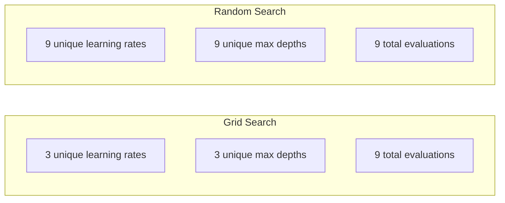
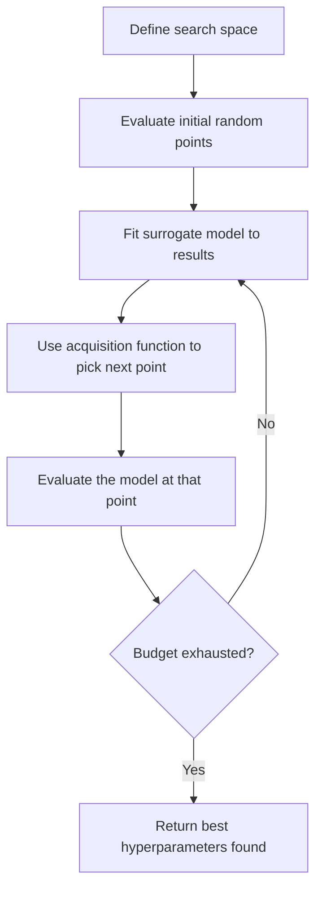
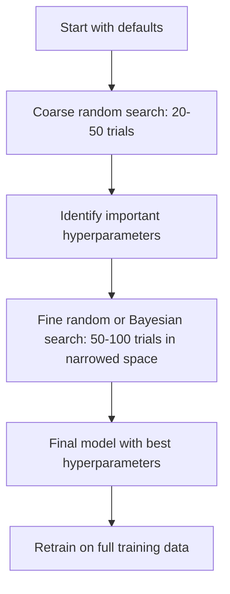
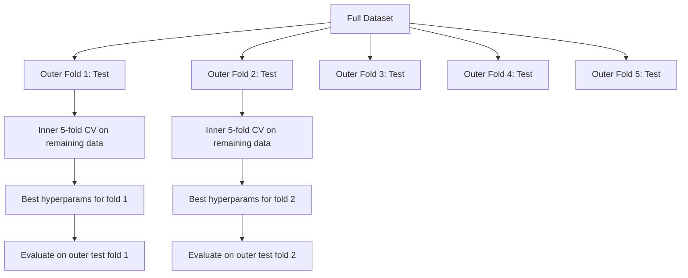

# Téléchargement des paramètres
# 超参数调优


> Les hyperparametres sont les boutons que l'on tourne avant le début de l'entraînement.

> Le super-paramètre est un entraînement pour commencer à faire le tour.

**Type:** Build | **类型：** 构建
**Language:**Je suis un Python .**语言：**Python
**Prerequisites:** Phase 2, Lesson 11 (Ensemble Methods) | **前置知识：** Phase 2 第 11 课（集成方法）
**Time:** ~90 minutes | **时间：** 约 90 分钟

## Objectifs d'apprentissage

- Implémenter la recherche sur grille, la recherche aléatoire et l'optimisation bayésienne à partir de zéro et comparer leur efficacité d'échantillon
  À partir de la recherche en réseau zéro, la recherche en temps réel et l'optimisation des données, comparer leur efficacité de l'échantillonnage
- Expliquez pourquoi la recherche aléatoire surpasse la recherche en grille lorsque la plupart des hyperparametres ont une faible dimensionnalité efficace
   Expliquer pourquoi la recherche aléatoire à la majorité des superparamètres valables à la faible dimension est meilleure que la recherche en ligne
- Construire une boucle d'optimisation bayésienne en utilisant un modèle de substitution et une fonction d'acquisition pour guider la recherche
  Utiliser des modèles de représentation et des fonctions d'extraction pour créer un cycle d'optimisation de base pour guider la recherche
- Conception d'une stratégie de réglage des hyperparamètres qui évite de sur-adapter le jeu de validation par une validation croisée appropriée
  Design par un bon intermédiaire de vérification éviter de suradapter le groupe de vérification


> **【中文解读】**
> Les superparamètres sont des paramètres préétablies dans le modèle de formation (tels que le taux d'apprentissage, la profondeur du tronc), ne peuvent pas être obtenus à partir de données.

> **【拓展：超参数调优在大模型训练中的重要性】**
> L'entraînement du GPT-4 implique des dizaines de superparamètres (régularisation du taux d'apprentissage, taille de lot, baisse de poids, taux de décomposition, etc.), le coût de chaque entraînement complet est d'environ 1 milliard de dollars, impossible à utiliser pour la recherche en ligne.

## Le problème , l' introduction du problème

Votre modèle de stimulation du gradient a un taux d'apprentissage, le nombre d'arbres, la profondeur maximale, les échantillons min par feuille, le ratio sous-échantillon et le ratio échantillon de colonne. Cela représente six hyperparametres. Si chacun a 5 valeurs raisonnables, la grille a 5 ^ 6 = 15.625 combinaisons.

> Votre modèle de levage de la échelle a un taux d'apprentissage, le nombre de arbres, la profondeur maximale, le nombre d'échantillons minimum des niveaux de la formation, le taux de formation et le taux de formation. Il y a six superparamètres. Si chacun a 5 valeurs raisonnables, le réseau a 5^6 = 15 625 types de compositions.

La recherche de grille est l'approche évidente et la pire à l'échelle. La recherche aléatoire fonctionne mieux avec moins de calcul. L'optimisation bayésienne fonctionne encore mieux en apprenant des évaluations passées. Savoir quelle stratégie utiliser et quels hyperparametres comptent vraiment, permet d'économiser des jours de temps de GPU gaspillé.

> La recherche en ligne est une méthode évidente, mais aussi la pire à grande échelle. Comme la recherche en ligne est mieux effectuée avec moins de calculs, l'optimisation de la recherche peut être améliorée en apprenant à l'évaluation passée.

> **【中文解读】**
> 超参数调优的核心矛盾:搜索空间大但每次评估成本高――网格搜索穷举所有组合,成本指数增长;随机搜索随机采样,在同预算下探索更多区域;贝叶斯优化概率模型(高斯过程) prédiction quelles régions pourraient être meilleures, intelligemment sélectionner un prochain point d'évaluation――

## Le concept de base.

### Paramètres contre hyperparamètres

Les paramètres sont apprises pendant la formation (poids, biais, seuils divisés).

> 参数在训练中学习(权重、偏置、分离值) ――超参数在训练开始前设定,控制学习如何发生──

| Hyperparameter | What it controls | Typical range |
|---------------|-----------------|---------------|
| Learning rate | Step size per update | 0.001 to 1.0 |
| Number of trees/epochs | How long to train | 10 to 10,000 |
| Max depth | Model complexity | 1 to 30 |
| Regularization (lambda) | Overfitting prevention | 0.0001 to 100 |
| Batch size | Gradient estimation noise | 16 to 512 |
| Dropout rate | Fraction of neurons dropped | 0.0 to 0.5 |

| 超参数 | 控制什么 | 典型范围 |
|--------|---------|---------|
| 学习率 | 每次更新的步长 | 0.001 到 1.0 |
| 树的数量/epoch 数 | 训练多久 | 10 到 10,000 |
| 最大深度 | 模型复杂度 | 1 到 30 |
| 正则化 (lambda) | 防止过拟合 | 0.0001 到 100 |
| 批量大小 | 梯度估计噪声 | 16 到 512 |
| Dropout 率 | 丢弃的神经元比例 | 0.0 到 0.5 |

### Recherche de la grille

La recherche en grille évalue chaque combinaison de valeurs spécifiées. Elle est exhaustive et facile à comprendre, mais elle s'évalue de manière exponentielle avec le nombre d'hyperparametres.

> 网格搜索评估指定值的每个组合──它尽尽尽且易懂,但随着超参数数指数的数级增长──

```
Grid for 2 hyperparameters:

  learning_rate: [0.01, 0.1, 1.0]
  max_depth:     [3, 5, 7]

  Evaluations: 3 x 3 = 9 combinations

  (0.01, 3)  (0.01, 5)  (0.01, 7)
  (0.1,  3)  (0.1,  5)  (0.1,  7)
  (1.0,  3)  (1.0,  5)  (1.0,  7)
```

La recherche en grille a un défaut fondamental: si un hyperparamètre est important et l'autre non, la plupart des évaluations sont gaspillées.

> 网格搜索有一个根本缺陷: si un paramètre est important et un autre non, la plupart des évaluations sont gaspillées.

### Recherche aléatoire

Les échantillons de recherche aléatoire des hyperparametres de distributions au lieu d'une grille. Avec le même budget de 9 évaluations, vous obtenez 9 valeurs uniques de chaque hyperparamètre.

> 随时搜索从分布中采采样超参数而不是使用网格――, dans le même budget de 9 fois évaluation, vous obtenez 9 valeurs uniques de chaque superparamètre――,



Pourquoi le hasard bat la grille (Bergstra & Bengio, 2012):

> Pourquoi ça va être une bonne idée ?

- La plupart des hyperparametres ont une faible dimensionnalité efficace. Seulement 1-2 des 6 hyperparametres sont généralement importants pour un problème donné.
  La plupart des superparamètres ont une dimension de fonction faible.
- Évaluations des déchets de recherche en grille sur des dimensions non importantes.
  网格搜索在不重要维度上浪费评估──
- La recherche aléatoire couvre les dimensions importantes plus densément pour le même budget.
   Assez rechercher des dimensions importantes dans un pays plus densément couvert dans le même budget
- Dans 60 essais aléatoires, vous avez 95% de chances de trouver un point dans les 5% de l'optimisme (si l'un existe dans l'espace de recherche).
  Dans un essai aléatoire de 60 fois, vous avez 95% de chances de trouver le meilleur score à 5% et la valeur à l'intérieur de la recherche si le meilleur score existe dans l'espace de recherche)

### Optimisation bayésienne

La recherche aléatoire ignore les résultats. Elle n'apprend pas que les taux d'apprentissage élevés provoquent des divergences ou que la profondeur 3 dépasse systématiquement la profondeur 10.

> 随机搜索忽略结果──它不会学到高学习率导致散散或深度 3 始终优于深度 10──贝叶斯优化利用过去的评估来决定下一步搜索哪里──



Les deux éléments clés:

**Surrogate model:**Un modèle bon marché à évaluer (généralement un processus gaussien) qui approximate la fonction objective coûteuse. Il donne à la fois une prédiction et une estimation de l'incertitude à tout moment de l'espace de recherche.

> **代理模型：**Un modèle d'évaluation à bas prix (habituellement le processus de hauteur) est une fonction d'objectif proche et coûteuse.

**Acquisition function:**Décide où évaluer ensuite en équilibrant l'exploitation (recherche près de bons points connus) et l'exploration (recherche où l'incertitude est élevée).

> **采集函数：**通过平衡开发 (搜已知好点附近) 搜寻不确定性高的区域) 探索 (搜不确定性高的区域)                                                                                                                                                                                                                                            

- **Expected Improvement (EI):**Quelle amélioration par rapport à la meilleure actuelle nous attendons à ce stade?
  **期望改进 (EI)：**Quels sont les meilleurs résultats que nous espérons sur ce point ?
- **Upper Confidence Bound (UCB):**La prédiction plus le multiplicateur d'incertitude.
  **上置信界 (UCB)：**预测加上不确定性的倍数──更高的UCB signifie avoir une perspective ou une exploration──
- **Probability of Improvement (PI):**Quelle est la probabilité que ce point soit meilleur que le moment présent ?
  **改进概率 (PI)：**Quelle est la probabilité de ce point sur le meilleur résultat actuel ?

L'optimisation bayésienne trouve généralement de meilleurs hyperparametres que la recherche aléatoire avec 2 à 5 fois moins d'évaluations.

> L'optimisation de la base utilise généralement 2 à 5 fois moins de temps d'évaluation pour trouver de meilleurs superparamètres que la recherche occasionnelle.

> **【中文解读】**
> L'optimisation de Béaïs est le moyen le plus intelligent de modification. Le module central est le modèle de l'optimisation de Béaïs. Il est généralement utilisé pour la fonction de l'objectif de l'optimisation de processus de recherche.

> **【拓展：Optuna——自动化超参数调优的工业标准】**
> Optuna est un cadre de régulation des superparamètres développé par les réseaux préférés japonais, largement utilisé dans les projets de Kaggle et de l'industrie. Il soutient l'optimisation des bases de données.

### Arrêt précoce

Si une configuration est clairement mauvaise après 10 époques, arrêtez-la et passez à autre chose.

> Si une configuration ne va pas bien après 10 épisodes, arrêtez-la et continuez la suivante.

Les stratégies:
- **Patience-based:**Arrêter si la perte de validation n'a pas amélioré pendant N périodes consécutives
  **基于耐心：**Si la perte de preuve continue N 个 époque 没有改善就停止
- **Median pruning:**Arrêtez si le résultat intermédiaire de l'essai est pire que la médiane des essais terminés à la même étape
  **中位数剪枝：**Si le résultat intermédiaire de l'essai est supérieur à celui de l'étape terminée, le débit intermédiaire de l'essai s'arrête.
- **Hyperband:**Allouer de petits budgets à de nombreuses configurations, puis augmenter progressivement le budget pour les meilleures
  **Hyperband：**détablir un budget pour les nombreuses affectations, puis augmenter progressivement le budget de la meilleure affectation

L'hyperband est particulièrement efficace. Il démarre 81 configurations avec 1 époque chacune, conserve le premier tiers, leur donne 3 époques, conserve le troisième supérieur, etc. Cela permet de trouver de bonnes configurations 10 à 50 fois plus rapidement que d'évaluer toutes les configurations pour le budget complet.

> L'hyperbande est particulièrement efficace. Elle commence par 81 configurations à chaque époque, conserve le premier tiers, donne-leur 3 périodes, reconserve le premier tiers, et propose des recommandations de ce type.

### Les programmes d'apprentissage

Le taux d'apprentissage est presque toujours l'hyperparamètre le plus important.

> Le taux d'apprentissage est presque toujours le superparamètre le plus important.

| Scheduler | Formula | When to use |
|-----------|---------|-------------|
| Step decay | Multiply by 0.1 every N epochs | Classic CNN training |
| Cosine annealing | lr * 0.5 * (1 + cos(pi * t / T)) | Modern default |
| Warmup + decay | Linear increase then cosine decay | Transformers |
| One-cycle | Increase then decrease over one cycle | Fast convergence |
| Reduce on plateau | Reduce by factor when metric stalls | Safe default |

| 调度器 | 公式 | 何时使用 |
|--------|------|---------|
| 阶梯衰减 | 每 N 个 epoch 乘以 0.1 | 经典 CNN 训练 |
| 余弦退火 | lr * 0.5 * (1 + cos(pi * t / T)) | 现代默认 |
| 预热+衰减 | 线性增加后余弦衰减 | Transformer |
| 单周期 | 一个周期内先增后减 | 快速收敛 |
| 平台期衰减 | 指标停滞时按因子减小 | 安全默认 |

### Importance de l'hyperparamètre

Les résultats de la recherche sur les forêts aléatoires (Probst et coll., 2019) et l'augmentation des gradients montrent des schémas cohérents:

> Les études sur les phénomènes de croissance et de croissance des niveaux de croissance montrent un modèle cohérent:

**High importance:**
- Taux d'apprentissage (souvent régler en premier)
  Le taux d'apprentissage (始终首先调优)
- Nombre d'estimatrices / époques (utiliser l'arrêt précoce au lieu de l'ajustement)
  估计器数量 / epoch 数(用早停代替调优)
- Résistance à la régulation
  Réglementation de la force

**Medium importance:**
- Profondeur maximale / nombre de couches
  Nombre de profondeurs / niveaux maximaux
- Min des échantillons par feuille / décomposition en poids
  叶节点最小样本数 / 权重衰减
- Ratio de sous-échantillon
  taux de participation

**Low importance:**
- Caractéristiques maximales (pour les forêts aléatoires)
  Le plus grand nombre de caractéristiques
- Choix de fonction d'activation spécifique
  具体激活函数选择
- Taille du lot (dans une plage raisonnable)
  批量大小(在合理范围内)

Tonez d'abord les plus importants, laissez le reste par défaut.

> Il est important de rester dans l'esprit.

### Stratégie pratique



Le flux de travail concret:

> 具体工作流:

1. **Start with library defaults.**Ils sont choisis par des praticiens expérimentés et sont souvent 80% de la route.
   **从库默认值开始。**Elles sont choisies par des praticiens expérimentés, et ont généralement atteint 80% des résultats.
2. **Coarse random search.**Des essais de 20 à 50 minutes, une arrêtée précoce pour tuer les mauvais.
   **粗粒度随机搜索。**宽范围,20-50 次试验──用早停快速终止差的运行──
3. **Analyze results.**Quels hyperparametres sont correlatifs avec les performances ?
   **分析结果。**Quels sont les superparametres liés à la performance ?
4. **Fine search.**Optimisation bayésienne ou recherche aléatoire concentrée dans l'espace étroit. 50 à 100 essais.
   **精细搜索。**Dans un espace réduit, utilisez l'optimisation de la base ou le focus à la recherche.
5. **Retrain on all training data**avec les meilleurs hyperparametres trouvés.
   Utiliser le meilleur superparamètre à trouver**所有训练数据上重新训练**Il y a une autre.

### Intégration de la validation croisée

L'ajustement des hyperparametres sur une seule fraction de validation est risqué. Les meilleurs hyperparametres peuvent être surpassés au pli de validation spécifique.

> Dans un seul test, il est possible de modifier les superparamètres. Les meilleurs superparamètres peuvent être adaptés à un test spécifique.

- **Outer loop**(évaluation): divise les données en train+val et test.
  **外循环**(évaluation): les données seront divisées en formation+évaluation et test.
- **Inner loop**(tuning): divise train+val en train et val. Trouve les meilleurs hyperparamètres.
  **内循环**(调优):将训练+验证分为训练和验证―― trouver le meilleur superparamètres――



Chaque pli extérieur trouve ses propres meilleurs hyperparametres indépendamment.

> Chaque décalage indépendant trouve son meilleur superparamètre.

Avec sklearn:

```python
from sklearn.model_selection import cross_val_score, GridSearchCV
from sklearn.ensemble import GradientBoostingRegressor

inner_cv = GridSearchCV(
    GradientBoostingRegressor(),
    param_grid={
        "learning_rate": [0.01, 0.05, 0.1],
        "max_depth": [2, 3, 5],
        "n_estimators": [50, 100, 200],
    },
    cv=5,
    scoring="neg_mean_squared_error",
)

outer_scores = cross_val_score(
    inner_cv, X, y, cv=5, scoring="neg_mean_squared_error"
)

print(f"Nested CV MSE: {-outer_scores.mean():.4f} +/- {outer_scores.std():.4f}")
```

Ce modèle est coûteux (5 plis extérieurs x 5 plis intérieurs x 27 points de grille = 675 points de grille correspondent au modèle), mais il vous donne une estimation de performance fiable.

> C'est très cher, mais il vous donne une estimation de performance fiable. Dans les articles rapportant les résultats finaux ou les décisions, il est souvent utilisé.

### Conseils pratiques

**Start with the learning rate.**Il s'agit toujours de l'hyperparamètre le plus important pour les méthodes basées sur les gradients. Un mauvais taux d'apprentissage rend tout le reste irrélevant.

> **从学习率开始。**Pour une méthode basée sur la échelle, il est toujours le superparamètre le plus important. Un mauvais taux d'apprentissage rendra tout le reste sans importance.

**Use log-uniform distributions for learning rate and regularization.**La différence entre 0,001 et 0,01 est aussi importante que la différence entre 0,1 et 1,0.

> **对学习率和正则化使用对数均匀分布。**La différence entre 0,001 et 0,01 et la différence entre 0,1 et 1,0 est également importante.

**Use early stopping instead of tuning n_estimators.**Pour les réseaux neuraux et de stimulation, définissez n_estimators ou époques élevées et laissez l'arrêt précoce décider quand arrêter.

> **用早停代替调优 n_estimators。**Pour l'amélioration et le réseau neuronal, les n_estimators ou l'époque numériseront, faire arrêter tôt décider quand arrêter.

**Budget allocation.**Passez 60% de votre budget de réglage sur les 2 hyperparametres les plus importants. Passez les 40% restants sur tout le reste.

> **预算分配。**60% du budget sera ajusté pour les deux premiers superparamètres les plus importants. Les 40% restants seront consacrés à tous les autres paramètres.

**Scale matters.**Ne cherchez jamais la taille du lot sur une échelle de journaux (16, 32, 64 sont acceptables). Cherchez toujours le taux d'apprentissage sur une échelle de journaux.

> **尺度很重要。**永遠不要在数量尺度上搜索批量大小(16、32、64 就行) ∼始终在数量尺度上搜索学习率──搜索分布与超参数影响模型的方式相匹配──

| Model Type | Top Hyperparameters | Recommended Search | Budget |
|-----------|--------------------|--------------------|--------|
| Random Forest | n_estimators, max_depth, min_samples_leaf | Random search, 50 trials | Low (fast training) |
| Gradient Boosting | learning_rate, n_estimators, max_depth | Bayesian, 100 trials + early stopping | Medium |
| Neural Network | learning_rate, weight_decay, batch_size | Bayesian or random, 100+ trials | High (slow training) |
| SVM | C, gamma (RBF kernel) | Grid on log scale, 25-50 trials | Low (2 params) |
| Lasso/Ridge | alpha | 1D search on log scale, 20 trials | Very low |
| XGBoost | learning_rate, max_depth, subsample, colsample | Bayesian, 100-200 trials + early stopping | Medium |

**When in doubt:**recherche aléatoire avec 2 fois le nombre d'hyperparametres comme essais (par exemple, 6 hyperparametres = 12 essais minimum). Vous serez surpris de la fréquence avec laquelle une recherche aléatoire avec 50 essais bat une recherche en grille soigneusement conçue.

> **拿不准时：**随机搜索, le nombre de tests est 2 fois plus grand que le nombre de superparamètres (tels que 6 超参数 = au moins 12 fois) ⋅ Vous serez surpris par 50 fois de tests.

## Construisez-le et mettez-le en œuvre.

> **【中文解读】**
> De la recherche à zéro, la recherche à zéro et l'optimisation de base de données, et l'utilisation du même ensemble de données pour comparer l'efficacité et l'efficacité de trois personnes.

> **【拓展：Hyperband 和 ASHA——大规模超参数搜索的加速器】**
> L'algorithme de halving successif asynchrone (ASHA) est une version différente de l'algorithme de halving asynchrone, utilisé par NNI et Ray Tune de Microsoft.
```figure
k-fold-cv
```

## Faites-le

### Étape 1: Recherche de la grille à partir de zéro

Le code dans `code/tuning.py`Il implique la recherche sur grille, la recherche aléatoire et un simple optimisateur bayésien à partir de zéro.

> `code/tuning.py`Le code central a réalisé la recherche en ligne à partir de zéro, la recherche au hasard et l'optimisation simple de la base de données.

```python
def grid_search(model_fn, param_grid, X_train, y_train, X_val, y_val):
    keys = list(param_grid.keys())
    values = list(param_grid.values())
    best_score = -float("inf")
    best_params = None
    n_evals = 0

    for combo in itertools.product(*values):
        params = dict(zip(keys, combo))
        model = model_fn(**params)
        model.fit(X_train, y_train)
        score = evaluate(model, X_val, y_val)
        n_evals += 1

        if score > best_score:
            best_score = score
            best_params = params

    return best_params, best_score, n_evals
```

### Étape 2: Recherche aléatoire à partir de zéro

```python
def random_search(model_fn, param_distributions, X_train, y_train,
                  X_val, y_val, n_iter=50, seed=42):
    rng = np.random.RandomState(seed)
    best_score = -float("inf")
    best_params = None

    for _ in range(n_iter):
        params = {k: sample(v, rng) for k, v in param_distributions.items()}
        model = model_fn(**params)
        model.fit(X_train, y_train)
        score = evaluate(model, X_val, y_val)

        if score > best_score:
            best_score = score
            best_params = params

    return best_params, best_score, n_iter
```

### Étape 3: Optimisation bayésienne (simplifiée)

L'idée principale: adapter un processus gaussien aux paires observées (hyperparamètre, score), puis utiliser une fonction d'acquisition pour décider où chercher ensuite.

> 核心思想:将高斯过程拟合到观察的(超参数,分数) 对, puis utiliser la fonction d'extraction pour décider de l'étape suivante voir où──

```python
class SimpleBayesianOptimizer:
    def __init__(self, search_space, n_initial=5):
        self.search_space = search_space
        self.n_initial = n_initial
        self.X_observed = []
        self.y_observed = []

    def _kernel(self, x1, x2, length_scale=1.0):
        dists = np.sum((x1[:, None, :] - x2[None, :, :]) ** 2, axis=2)
        return np.exp(-0.5 * dists / length_scale ** 2)

    def _fit_gp(self, X_new):
        X_obs = np.array(self.X_observed)
        y_obs = np.array(self.y_observed)
        y_mean = y_obs.mean()
        y_centered = y_obs - y_mean

        K = self._kernel(X_obs, X_obs) + 1e-4 * np.eye(len(X_obs))
        K_star = self._kernel(X_new, X_obs)

        L = np.linalg.cholesky(K)
        alpha = np.linalg.solve(L.T, np.linalg.solve(L, y_centered))
        mu = K_star @ alpha + y_mean

        v = np.linalg.solve(L, K_star.T)
        var = 1.0 - np.sum(v ** 2, axis=0)
        var = np.maximum(var, 1e-6)

        return mu, var

    def _expected_improvement(self, mu, var, best_y):
        sigma = np.sqrt(var)
        z = (mu - best_y) / (sigma + 1e-10)
        ei = sigma * (z * norm_cdf(z) + norm_pdf(z))
        return ei

    def suggest(self):
        if len(self.X_observed) < self.n_initial:
            return sample_random(self.search_space)

        candidates = [sample_random(self.search_space) for _ in range(500)]
        X_cand = np.array([to_vector(c) for c in candidates])
        mu, var = self._fit_gp(X_cand)
        ei = self._expected_improvement(mu, var, max(self.y_observed))
        return candidates[np.argmax(ei)]

    def observe(self, params, score):
        self.X_observed.append(to_vector(params))
        self.y_observed.append(score)
```

Le GP surrogé donne deux choses à chaque point de candidat: un score prévu (mu) et une incertitude (var). L'amélioration attendue équilibre ces points: il favorise les points où le modèle prédit des scores élevés OU où l'incertitude est élevée.

> GP 代理 dans chaque candidat donne deux choses: prédiction de la part du nombre de points de référence et de l'incertitude de la part du nombre de points de référence.

### Étape 4: Comparer toutes les méthodes

Exécutez les trois méthodes sur le même objectif synthétique et comparez. Cette comparaison utilise un enveloppeur simplifié qui appelle chaque optimisateur avec une fonction objective directe (pas de formation de modèle), de sorte que l'API diffère des implémentations basées sur le modèle ci-dessus:

> Dans le même objectif de synthèse, toutes les trois méthodes sont comparées. Cette comparaison utilise un emballage simplifié, en utilisant directement la fonction objectif pour référer chaque optimisateur (en utilisant une formation sans modèle), de sorte que l'API diffère de l'implémentation basée sur le modèle ci-dessus:

```python
def synthetic_objective(params):
    lr = params["learning_rate"]
    depth = params["max_depth"]
    return -(np.log10(lr) + 2) ** 2 - (depth - 4) ** 2 + 10

param_grid = {
    "learning_rate": [0.001, 0.01, 0.1, 1.0],
    "max_depth": [2, 3, 4, 5, 6, 7, 8],
}

grid_best = None
grid_score = -float("inf")
grid_history = []
for combo in itertools.product(*param_grid.values()):
    params = dict(zip(param_grid.keys(), combo))
    score = synthetic_objective(params)
    grid_history.append((params, score))
    if score > grid_score:
        grid_score = score
        grid_best = params

param_dist = {
    "learning_rate": ("log_float", 0.001, 1.0),
    "max_depth": ("int", 2, 8),
}

rand_best = None
rand_score = -float("inf")
rand_history = []
rng = np.random.RandomState(42)
for _ in range(28):
    params = {k: sample(v, rng) for k, v in param_dist.items()}
    score = synthetic_objective(params)
    rand_history.append((params, score))
    if score > rand_score:
        rand_score = score
        rand_best = params

optimizer = SimpleBayesianOptimizer(param_dist, n_initial=5)
bayes_history = []
for _ in range(28):
    params = optimizer.suggest()
    score = synthetic_objective(params)
    optimizer.observe(params, score)
    bayes_history.append((params, score))
bayes_score = max(s for _, s in bayes_history)

print(f"{'Method':<20} {'Best Score':>12} {'Evaluations':>12}")
print("-" * 50)
print(f"{'Grid Search':<20} {grid_score:>12.4f} {len(grid_history):>12}")
print(f"{'Random Search':<20} {rand_score:>12.4f} {len(rand_history):>12}")
print(f"{'Bayesian Opt':<20} {bayes_score:>12.4f} {len(bayes_history):>12}")
```

Avec le même budget, l'optimisation bayésienne trouve généralement le meilleur score le plus rapidement car elle ne gaspille pas d'évaluations dans des régions clairement mauvaises. La recherche aléatoire couvre plus de terrain que la recherche en grille. La recherche en grille ne gagne que lorsque vous avez très peu d'hyperparametres et pouvez vous permettre d'être exhaustif.

> Dans le même budget, l'optimisation de base trouve généralement le meilleur score, car elle n'a pas d'évaluation de gaspillage régional nettement différente.

## Utilisez-le avec le cadre de réalisation

### L'optuné en pratique

Optuna est la bibliothèque recommandée pour la réglage sérieux des hyperparamètres.

> L'option est une recommandation de la catégorie "références" et "références".

```python
import optuna

def objective(trial):
    lr = trial.suggest_float("learning_rate", 1e-4, 1e-1, log=True)
    n_est = trial.suggest_int("n_estimators", 50, 500)
    max_depth = trial.suggest_int("max_depth", 2, 10)

    model = GradientBoostingRegressor(
        learning_rate=lr,
        n_estimators=n_est,
        max_depth=max_depth,
    )
    model.fit(X_train, y_train)
    return mean_squared_error(y_val, model.predict(X_val))

study = optuna.create_study(direction="minimize")
study.optimize(objective, n_trials=100)

print(f"Best params: {study.best_params}")
print(f"Best MSE: {study.best_value:.4f}")
```

Caractéristiques clés de l'Optuna:
- `suggest_float(..., log=True)`pour les paramètres les mieux recherchés sur l'échelle du journal (taux d'apprentissage, régularisation)
- `suggest_int`pour les paramètres entiers
- `suggest_categorical`pour les choix discrets
- MedianPruner intégré pour arrêter les mauvais essais
- `study.trials_dataframe()`pour l'analyse

### Optuna avec taille

La taille arrête les essais peu prometteurs tôt, économisant ainsi de grands calculs.

> 剪枝及早停止无前景的试验,节省大量计算──以下是模式:

```python
import optuna
from sklearn.model_selection import cross_val_score

def objective(trial):
    params = {
        "learning_rate": trial.suggest_float("lr", 1e-4, 0.5, log=True),
        "max_depth": trial.suggest_int("max_depth", 2, 10),
        "n_estimators": trial.suggest_int("n_estimators", 50, 500),
        "subsample": trial.suggest_float("subsample", 0.5, 1.0),
    }

    model = GradientBoostingRegressor(**params)
    scores = cross_val_score(model, X_train, y_train, cv=3,
                             scoring="neg_mean_squared_error")
    mean_score = -scores.mean()

    trial.report(mean_score, step=0)
    if trial.should_prune():
        raise optuna.TrialPruned()

    return mean_score

pruner = optuna.pruners.MedianPruner(n_startup_trials=10, n_warmup_steps=5)
study = optuna.create_study(direction="minimize", pruner=pruner)
study.optimize(objective, n_trials=200)
```

Le `MedianPruner`Il est possible de supprimer un essai si sa valeur intermédiaire est inférieure à la médiane de tous les essais effectués à la même étape.`trial.report()`à déclarer les mesures intermédiaires et `trial.should_prune()`Pour vérifier si l'essai doit être arrêté.`n_startup_trials=10`Les tests de taille sont effectués en fonction de la taille de l'épreuve, ce qui permet généralement d'économiser 40 à 60% du calcul total.

> `MedianPruner`La différence de moyenne de l'essai par rapport au même étape a été terminée.`trial.report()`rapport intermédiaire,`trial.should_prune()`检查是否应停止──`n_startup_trials=10`¢ s'assurer qu'au moins 10 essais sont effectués avant la fin de la période de coupe ¢ ¢ ¢ ¢ ¢ ¢ ¢ ¢ ¢ ¢ ¢ ¢ ¢ ¢ ¢ ¢ ¢ ¢ ¢ ¢ ¢ ¢ ¢ ¢ ¢ ¢ ¢ ¢ ¢ ¢ ¢ ¢ ¢ ¢ ¢ ¢ ¢ ¢ ¢ ¢ ¢ ¢ ¢ ¢ ¢ ¢ ¢ ¢ ¢ ¢ ¢ ¢ ¢ ¢ ¢ ¢ ¢ ¢ ¢ ¢ ¢ ¢ ¢ ¢ ¢ ¢ ¢ ¢ ¢ ¢ ¢ ¢ ¢ ¢ ¢ ¢ ¢ ¢ ¢ ¢ ¢ ¢ ¢ ¢ ¢ ¢ ¢ ¢ ¢ ¢ ¢ ¢ ¢ ¢ ¢ ¢ ¢ ¢ ¢ ¢ ¢ ¢ ¢ ¢ ¢ ¢ ¢ ¢ ¢ ¢ ¢ ¢ ¢ ¢ ¢ ¢ ¢ ¢ ¢ ¢ ¢ ¢ ¢ ¢ ¢ ¢ ¢ ¢ ¢ ¢ ¢ ¢ ¢ ¢ ¢ ¢ ¢ ¢ ¢ ¢ ¢ ¢ ¢ ¢ ¢ ¢ ¢ ¢ ¢ ¢ ¢ ¢ ¢ ¢ ¢ ¢ ¢ ¢ ¢ ¢ ¢ ¢ ¢ ¢ ¢ ¢ ¢ ¢ ¢ ¢ ¢ ¢ ¢ ¢ ¢ ¢ ¢ ¢ ¢ ¢ ¢ ¢ ¢ ¢ ¢ ¢ ¢ ¢ ¢ ¢ ¢ ¢ ¢ ¢ ¢ ¢ ¢ ¢ ¢ ¢ ¢ ¢ ¢ ¢ ¢ ¢ ¢ ¢ ¢ ¢ ¢ ¢ ¢ ¢ ¢ ¢ ¢ ¢ ¢ ¢ ¢ ¢ ¢ ¢ ¢ ¢ ¢ ¢ ¢ ¢ ¢ ¢ ¢ ¢ ¢ ¢ ¢ ¢ ¢ ¢ ¢ ¢ 

### Les Tuners intégrés de sklearn

Pour des expériences rapides, sklearn fournit `GridSearchCV`- Je suis là .`RandomizedSearchCV`, et `HalvingRandomSearchCV`- Le numéro de la liste:

> Pour une expérience rapide, apprenez à faire`GridSearchCV`- Je suis là.`RandomizedSearchCV`et `HalvingRandomSearchCV`- Le numéro de la liste:

```python
from sklearn.model_selection import RandomizedSearchCV
from scipy.stats import loguniform, randint

param_dist = {
    "learning_rate": loguniform(1e-4, 0.5),
    "max_depth": randint(2, 10),
    "n_estimators": randint(50, 500),
}

search = RandomizedSearchCV(
    GradientBoostingRegressor(),
    param_dist,
    n_iter=100,
    cv=5,
    scoring="neg_mean_squared_error",
    random_state=42,
    n_jobs=-1,
)
search.fit(X_train, y_train)
print(f"Best params: {search.best_params_}")
print(f"Best CV MSE: {-search.best_score_:.4f}")
```

Utilisation `loguniform`Les résultats de l'étude ont été obtenus en fonction des résultats obtenus.`randint`Pour les hyperparametres entiers.`n_jobs=-1`flag parallèle à travers tous les cœurs de CPU.

> Pour le taux d'apprentissage et l'utilisation normale de la sci-fi `loguniform`◊ utiliser le nombre total`randint`Il y a une autre.`n_jobs=-1`标志跨所有CPU 核心并行──

### Erreurs courantes dans l'ajustement des hyperparamètres

**Data leakage through preprocessing.**Si vous montrez un scaler sur l'ensemble complet de données avant la validation croisée, les informations provenant du pli de validation se perdent dans l'entraînement.`Pipeline`Il ne peut donc être utilisé que sur le pli d'entraînement.

> **通过预处理的数据泄漏。**Si vous êtes en train de vérifier la quantité totale de données en utilisant un agrandisseur, les informations de vérification seront divulguées à l'entraînement.`Pipeline`En fait, il ne s'adapte qu'à l'entraînement.

**Overfitting to the validation set.**Utilisez la validation croisée en nid pour les estimations de performance finales, ou tenez un ensemble de tests séparé que vous ne touchez jamais pendant la mise en forme.

> **对验证集过拟合。**运行数千次试验实际上是在验证集上训练――使用嵌套交叉验证进行最终性能估算,或保留一个调优时永远不碰的独立试验集――

**Searching too narrow a range.**Si votre valeur optimale se trouve à la limite de votre espace de recherche, vous n'avez pas assez recherché. La valeur optimale pourrait être hors de votre plage. Vérifiez toujours si les meilleurs paramètres sont aux bords.

> **搜索范围太窄。**Si la meilleure valeur est à la limite de l'espace de recherche, vous recherchez assez peu. La meilleure valeur peut être à l'extérieur de la portée.

**Ignoring interaction effects.**Le taux d'apprentissage et le nombre d'estimatrices interagissent fortement pour stimuler.Un taux d'apprentissage faible nécessite plus d'estimatrices.L'ajustement de ces deux méthodes indépendamment donne de pires résultats que l'ajustement de ces méthodes ensemble.

> **忽略交互效应。**Le taux d'apprentissage et le nombre d'estimatrices sont en forte interaction.

**Not using early stopping for iterative models.**Pour l'augmentation des gradients et les réseaux neuronaux, définissez n_estimators ou époques à une valeur élevée et utilisez l'arrêt précoce.

> **不对迭代模型使用早停。**Pour le gradient augmentation et le réseau neuronal, le nombre d'estimatrices ou d'époques s'arrête à un rythme précoce.

## Les exercices

1. Exécutez une recherche au hasard avec le même budget total (par exemple, 50 évaluations). Comparer les meilleurs scores trouvés. Exécutez l'expérience 10 fois avec des graines différentes.
   1. Dans le même budget total (à savoir 50 fois évaluation) des résultats de recherche en ligne et de recherche au hasard.

2. Implémenter Hyperband à partir de zéro. Commencez par 81 configurations, chacune formée pour 1 époque. Gardez les 1/3 supérieures à chaque tour et triplissez leur budget. Comparer le calcul total (summe de toutes les époques dans toutes les configurations) à l'exécution de 81 configurations pour le budget complet.
   2. De zéro réalisation de la bande passante. Début 81 configurations, chaque entraînement 1 période.

3. Ajouter un programmeur de taux d'apprentissage (annelement de cosine) à la mise en œuvre du gradient à partir de la leçon 11.
   3. En ce qui concerne la formation, le taux d'apprentissage est-il plus élevé que le taux d'apprentissage fixe ?

4. Utilisez Optuna pour régler un classifiateur RandomForest sur un ensemble de données réel (par exemple, le ensemble de données sur le cancer du sein de sklearn). Utilisez `optuna.visualization.plot_param_importances(study)`Pour voir quels hyperparametres comptent le plus.
   4. Utilisation de l'option dans le réel`optuna.visualization.plot_param_importances(study)`Regardez quelles sont les superparamètres les plus importantes.

5. Mettre en œuvre une fonction d'acquisition simple (amélioration attendue) et démontrer l'exploration par rapport à l'exploitation.
   5.  réaliser une simple fonction d'acquisition  exiger des améliorations  démontrer explorer vs développer  tracer la valeur moyenne et l'incertitude du modèle d'intermédiaire  démontrer l'évaluation 

> **【中文解读】**
> Le taux d'apprentissage est presque toujours le plus important superparamètre. La stratégie de régulation est plus efficace que le taux d'apprentissage fixe: Warmup (de 0 线性增加到目标值) + Cosine Decay (余弦退火下降) est le standard de configuration de l'entraînement du transformateur.

## Les termes clés

| Term | What people say | What it actually means |
|------|----------------|----------------------|
| Hyperparameter | "A setting you choose" | A value set before training that controls the learning process, not learned from data |
| Grid search | "Try every combination" | Exhaustive search over a specified parameter grid. Exponential cost. |
| Random search | "Just sample randomly" | Sample hyperparameters from distributions. Covers important dimensions better than grid search. |
| Bayesian optimization | "Smart search" | Uses a surrogate model of the objective to decide where to evaluate next, balancing exploration and exploitation |
| Surrogate model | "A cheap approximation" | A model (usually Gaussian process) that approximates the expensive objective function from observed evaluations |
| Acquisition function | "Where to look next" | Scores candidate points by balancing expected improvement with uncertainty. EI and UCB are common choices. |
| Early stopping | "Stop wasting time" | Terminate training early when validation performance stops improving |
| Hyperband | "Tournament bracket for configs" | Adaptive resource allocation: start many configs with small budgets, keep the best and increase their budgets |
| Learning rate scheduler | "Change lr during training" | A function that adjusts the learning rate over the course of training for better convergence |

## Encore une lecture

- [Bergstra & Bengio: Random Search for Hyper-Parameter Optimization (2012)](https://jmlr.org/papers/v13/bergstra12a.html)- le papier qui a montré des battements aléatoires grille
  [Bergstra & Bengio: Random Search for Hyper-Parameter Optimization (2012)](https://jmlr.org/papers/v13/bergstra12a.html)- 证明随机优于网格的论文
- [Snoek et al., Practical Bayesian Optimization of Machine Learning Algorithms (2012)](https://arxiv.org/abs/1206.2944)-- Optimisation bayésienne pour le ML
  [Snoek et al., Practical Bayesian Optimization of Machine Learning Algorithms (2012)](https://arxiv.org/abs/1206.2944)- Optimisation des résultats de l'étude
- [Li et al., Hyperband: A Novel Bandit-Based Approach (2018)](https://jmlr.org/papers/v18/16-558.html)- le papier hyperbande
  [Li et al., Hyperband (2018)](https://jmlr.org/papers/v18/16-558.html)- Hyperbande 论文
- [Optuna: A Next-generation Hyperparameter Optimization Framework](https://arxiv.org/abs/1907.10902)- Le journal Optuna
  [Optuna](https://arxiv.org/abs/1907.10902)- Optuna 论文
- [Probst et al., Tunability: Importance of Hyperparameters (2019)](https://jmlr.org/papers/v20/18-444.html)-- quels sont les hyperparametres qui comptent
  [Probst et al., Tunability (2019)](https://jmlr.org/papers/v20/18-444.html)- Quels sont les super-paramètres importants
