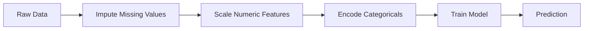
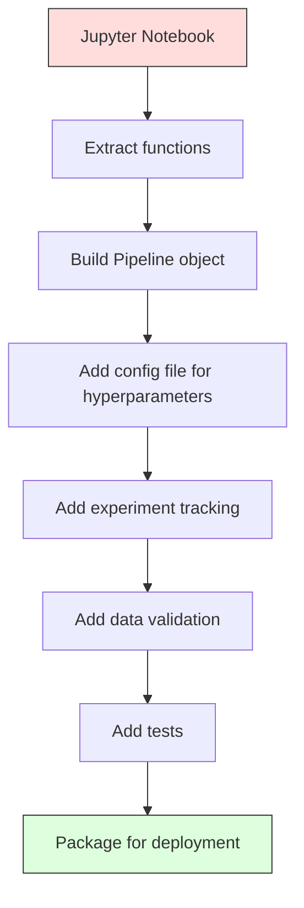

# Les pipelines ML
# ML 管线


> Un modèle n'est pas un produit, mais un pipeline, c'est tout, des données brutes aux prédictions déployées, et chaque étape doit être reproduisable.

> Le modèle n'est pas un produit, le pipeline est un pipeline. Tout, de la base de données à la prédiction de déploiement, doit être réalisable à chaque étape.

**Type:** Build | **类型：** 构建
**Language:**Je suis un Python .**语言：**Python
**Prerequisites:** Phase 2, Lesson 12 (Hyperparameter Tuning) | **前置知识：** Phase 2 第 12 课（超参数调优）
**Time:** ~120 minutes | **时间：** 约 120 分钟

## Objectifs d'apprentissage

- Construire un pipeline ML à partir de zéro qui relie imputation, mise à l'échelle, codage et formation de modèle en un seul objet reproduisable
  De la construction à zéro de la ligne de pipeline ML, le remplissage, l'agrandissement, le codage et le modèle de formation seront liés à un seul objet réalisable
- Identifier les scénarios de fuite de données et expliquer comment les pipelines les empêchent en installant des transformateurs uniquement sur des données de formation
  Identifier les scénarios de fuite de données, expliquer comment les tuyaux passent uniquement sur les données de formation adaptés à des changeurs pour prévenir la fuite
- Construire un colonne-transformateur qui applique différents préprocessements aux caractéristiques numériques et catégoriques
  Construire une colonneTransformer, appliquer des caractéristiques à des valeurs numériques et des catégories
- Implementer la sérialisation des pipelines et démontrer que la même pipeline montée produit des résultats identiques en formation et en production
   réaliser la séquestration des tubes, démontrant le même résultat dans la formation et la production


> **【中文解读】**
> ML 管线把数据预处理、特征工程、模型训练串串成一条流水线──sklearn pipeline 确保训练和推理的数据处理一致──生产环境中管线化是模型部署的基础──

> **【拓展：从 sklearn Pipeline 到 MLOps 工业级管线】**
> Le projet de projet de projet de projet de projet de projet de projet de projet de projet de projet de projet de projet de projet de projet de projet de projet de projet de projet de projet de projet de projet de projet de projet de projet de projet de projet de projet de projet de projet de projet de projet de projet de projet de projet de projet de projet de projet de projet de projet de projet de projet de projet de projet de projet de projet de projet de projet de projet de projet de projet de projet de projet de projet de projet de projet de projet de projet de projet de projet de projet de projet de projet de projet de projet de projet de projet de projet de projet de projet de projet de projet de projet de projet de projet de projet de projet de projet de projet de projet de projet de projet de projet de projet de projet de projet de projet de projet de projet de projet de projet de projet de projet de projet de projet de projet de projet de projet de projet de projet de projet de projet de projet de projet de projet de projet de projet de projet de projet de projet de projet de projet de projet de projet de projet de projet de projet de projet de projet de projet de projet de projet de projet de projet de projet de projet de projet de projet de projet de projet de projet de projet de projet de projet de projet de projet de projet de projet de projet de projet de projet de projet de projet de projet de projet de projet de projet de projet de projet de projet de projet de projet de projet de projet de projet de projet de projet de projet de projet de projet de projet de projet de projet de projet de projet de projet de projet de projet de projet de projet de projet de projet de projet de projet de projet de projet de projet de projet de projet de projet de projet de projet de projet de projet de projet de projet de projet de projet de projet de projet de projet de projet de projet de projet de projet de projet de projet de projet de projet de projet de projet de projet de projet de projet de projet de projet de projet de projet de projet de projet de projet de projet de projet de projet de projet de projet de projet de projet de projet de projet de projet de projet de projet de projet de projet de projet de projet de projet de projet de projet de projet de projet de projet de projet de projet de projet de projet de projet de projet de projet de projet de projet de projet de projet de projet de projet de projet de projet de projet de projet de projet de projet de projet de projet de projet de projet

## Le problème , l' introduction du problème

Vous avez un bloc-notes qui charge des données, remplit les valeurs manquantes avec la médiane, mesure les caractéristiques, entraîne un modèle et imprime la précision.

> Vous avez un carnet, charger des données, remplir des défauts, réduire les caractéristiques, modéliser l'impression, imprimer le taux de précision.

Un mois plus tard, quelqu'un a refait le modèle et a obtenu des résultats différents. La médiane a été calculée sur l'ensemble complet des données, y compris les données d'essai (fuite de données). Les paramètres d'échelle n'ont pas été enregistrés, donc l'inférence utilise des statistiques différentes. Le code technique de fonctionnalités a été copié-coller entre la formation et le service, et les copies divergèrent. Une colonne catégorique a acquis une nouvelle valeur de production que l'encodeur n'a jamais vue.

> Un mois plus tard, quelqu'un a re-entraîné le modèle et a obtenu des résultats différents. Le nombre moyen est calculé sur le total de données contenant les données de test. Les paramètres réduits ne sont pas conservés, la logique utilisant des statistiques différentes.

Les systèmes de production de gaz à effet de serre sont les raisons les plus courantes pour lesquelles les systèmes de production de gaz à serre échouent.

> Ce ne sont pas des hypothèses. Ce sont les causes les plus courantes de l'échec du système de production de machines à sous.

> **【中文解读】**
> Le problème central de la ML est que le traitement des données de la formation et de la théorie doit être entièrement conforme. Le modèle le plus commun de défaillance est la normalisation du calcul moyen de données de la formation avec la totalité du volume de données contenue dans le test.

## Le concept de base.

### Ce qu'est un pipeline

Un pipeline est une séquence ordonnée de transformations de données suivie d'un modèle. Chaque étape prend la sortie de l'étape précédente comme entrée.

> Le pipeline est une séquence de changements de données ordonnée, qui suit un modèle. Chaque étape sera la sortie de l'étape suivante en tant qu'entrée.



Le pipeline garantit:
- Les transformations ne sont montées que sur les données de formation (pas de fuites)
  变换 变换 变换 变换 变换 变换 变换 变换 变换 变换 变换 变换 变换 变换 变换 变换 变换 变换 变换 变换 变换 变换 变换 变换 变换 变换 变换 变换 变换 变换 变换 变换 变换 变换 变换 变换 变换 变换 变换 变换 变换 变换 变换 变换 变换 变换 变换 变换 变换 变换 变换 变换 变换 变换 变换 变换 变换 变换 变换 变换 变换 变换 变换 变换 变换 变换 变换 变换 变换 变换 变换 变换 变换 变换 变换 变换 变换 变换 变换 变换 变换 变换 变换 变换 变换 变换 变换 变换 变变换 变换 变变变变变 变 变 变 变 变 变 变 变 变 变 变 变 变 变 变 变 变 变 变 变 变 变 变 变 变 变 变 变 变 变 变 变 变 变 变 变 变 变 变 变 变 变 变 变 变 变 变 变 变 变 变 变 变 变 变 变 变 变   变 变 变 变     变 变 变         变      变      变        变 变    变             变 变 变                      变         变 变    
- Les mêmes transformations sont appliquées au moment de l'inférence
  推理时应用相同变更
- L'ensemble de l'objet peut être sérialisé et déployé comme un seul artefact
  L'ensemble de l'objet peut être classé et déployé en tant que composant
- La validation croisée s'applique au pipeline par pli, ce qui empêche une fuite subtile
  L'émission de l'émission de téléchargement est réalisée en ligne par le biais de l'émission de téléchargement de téléchargements.

### Leur présence dans les médias

Les fuites de données surviennent lorsque les informations provenant du jeu d'essais ou des données futures contaminent la formation.

> Les fuites de données se produisent lors d'un entraînement en matière de contamination des données de test ou de données futures.

**Leaky (wrong):**
```python
X = df.drop("target", axis=1)
y = df["target"]

scaler = StandardScaler()
X_scaled = scaler.fit_transform(X)

X_train, X_test = X_scaled[:800], X_scaled[800:]
y_train, y_test = y[:800], y[800:]
```

Le scaler a vu les données de test. La moyenne et l'écart standard comprennent les échantillons de test.

> Le test est réalisé en fonction de la valeur moyenne et de la différence de la valeur moyenne.

**Correct:**
```python
X_train, X_test = X[:800], X[800:]

scaler = StandardScaler()
X_train_scaled = scaler.fit_transform(X_train)
X_test_scaled = scaler.transform(X_test)
```

Avec un pipeline, vous n'avez pas besoin de penser à cela.

> Utilisez le tube, vous n'avez pas besoin de penser à cela.

### L'équipement de transport

Les produits de sklearn `Pipeline`Les transformateurs de chaînes et un estimateur.`.fit()`- Je suis là .`.predict()`, et `.score()`qui appliquent toutes les étapes dans l'ordre.

> Les produits de la boutique`Pipeline`Le changeur et l'estimation sont connectés.`.fit()`- Je suis là.`.predict()`et `.score()`, selon l'ordre appliqué tous les étapes:.

```python
from sklearn.pipeline import Pipeline
from sklearn.preprocessing import StandardScaler
from sklearn.linear_model import LogisticRegression

pipe = Pipeline([
    ("scaler", StandardScaler()),
    ("model", LogisticRegression()),
])

pipe.fit(X_train, y_train)
predictions = pipe.predict(X_test)
```

Quand vous appelez`pipe.fit(X_train, y_train)`- Le numéro de la liste:
1. Les appels de l' échelle .`fit_transform`sur le train X
2. Modèles d' appels `fit`sur le train X_scale

Quand vous appelez`pipe.predict(X_test)`- Le numéro de la liste:
1. Les appels de l' échelle .`transform`(pas adapté) sur X_test
2. Modèles d' appels `predict`sur le test X_test à l'échelle

Le scaler ne voit jamais les données de test pendant l'assemblage.

> Quand tu t' en fais`pipe.fit(X_train, y_train)`- Le numéro de la liste:
> 1. 缩放器对 X_train 调用 `fit_transform`
> 2. 模型对缩放后的X_train 调用 `fit`
> > > > > > > > > > > > > > > > > > > > > > > > > > > > > > > > > > > > > > > > > > > > > > > > > > > > > > > > > > > > > > > > > > > > > > > > > > > > > > > > > > > > > > > > > > > > > > > > > > > > > > > > > > > > > > > > > > > > > > > > > > > > > > > > > > > > > > > > > > > > > > > > > > > > > > > > > > > > > > > > > > > > > > > > > > > > > > > > > > > > > > > > > > > > > > > > > > > > > > > > > > > > > > > > > > > > > > > > > > > > > > > > > > > > > > > > > > > > > > > > > > > > > > > > > > > > > > > > > > > > > > > > > > > > > > > > > > > > > > > > > > > > > > > > > > > > > > > > > > > > > > > > > > > > > > > > > > > > > > > > > > > > > > > > > > > > > > > > > > > > > > > > > > > > > > > > > > > > > > > > > > > > > > > > > > > > > > > > > > > > > > > > > > > > > > > > > > > > > > > > > > > > > > > > > > > > > > > > > > > > > > > > > > > > > > > > > > > > > > > > > > > > > > > > > > > > > > > > > > > > > > > > > > > > > > > > > > > > > > > > > > > > > > > > > > > > > > > > > > > > > > > > > > > > > >
> Quand tu t' en fais`pipe.predict(X_test)`- Le numéro de la liste:
> 1. 缩放器对 X_test 调用 `transform`(es pas adapté)
> 2. 模型对缩放后的X_test 调用 `predict`
> > > > > > > > > > > > > > > > > > > > > > > > > > > > > > > > > > > > > > > > > > > > > > > > > > > > > > > > > > > > > > > > > > > > > > > > > > > > > > > > > > > > > > > > > > > > > > > > > > > > > > > > > > > > > > > > > > > > > > > > > > > > > > > > > > > > > > > > > > > > > > > > > > > > > > > > > > > > > > > > > > > > > > > > > > > > > > > > > > > > > > > > > > > > > > > > > > > > > > > > > > > > > > > > > > > > > > > > > > > > > > > > > > > > > > > > > > > > > > > > > > > > > > > > > > > > > > > > > > > > > > > > > > > > > > > > > > > > > > > > > > > > > > > > > > > > > > > > > > > > > > > > > > > > > > > > > > > > > > > > > > > > > > > > > > > > > > > > > > > > > > > > > > > > > > > > > > > > > > > > > > > > > > > > > > > > > > > > > > > > > > > > > > > > > > > > > > > > > > > > > > > > > > > > > > > > > > > > > > > > > > > > > > > > > > > > > > > > > > > > > > > > > > > > > > > > > > > > > > > > > > > > > > > > > > > > > > > > > > > > > > > > > > > > > > > > > > > > > > > > > > > > > > > > > >
> Le compteur est toujours en attente de la date de test.

### ColonneTransformateur: différents pipelines pour différentes colonnes

Les vrais ensembles de données ont des colonnes numériques et catégoriques qui nécessitent un traitement préalable différent. `ColumnTransformer`Il s'occupe de ça.

> Les données réelles ont des rangées de valeurs et des rangées de classes, nécessitant un traitement préalable différent.`ColumnTransformer`- Je vais le faire.

```python
from sklearn.compose import ColumnTransformer
from sklearn.preprocessing import StandardScaler, OneHotEncoder
from sklearn.impute import SimpleImputer

numeric_pipe = Pipeline([
    ("impute", SimpleImputer(strategy="median")),
    ("scale", StandardScaler()),
])

categorical_pipe = Pipeline([
    ("impute", SimpleImputer(strategy="most_frequent")),
    ("encode", OneHotEncoder(handle_unknown="ignore")),
])

preprocessor = ColumnTransformer([
    ("num", numeric_pipe, ["age", "income", "score"]),
    ("cat", categorical_pipe, ["city", "gender", "plan"]),
])

full_pipeline = Pipeline([
    ("preprocess", preprocessor),
    ("model", GradientBoostingClassifier()),
])
```

Le `handle_unknown="ignore"`En effet, une nouvelle catégorie apparaît (une ville que le modèle n'a jamais vue), elle produit un vecteur zéro au lieu de s'écraser.

> UnHotEncoder 中的 `handle_unknown="ignore"`Il est essentiel pour la production. Lorsque de nouvelles catégories de villes apparaissent, elles produisent des évolutions zéroes plutôt que des effondrements.

### Suivi des expériences

Un pipeline rend l'entraînement reproduisable, mais vous devez aussi suivre ce qui s'est passé dans les expériences: quels hyperparametres ont été utilisés, quelle version de l'ensemble de données, quelles étaient les métriques, quel code était en cours d'exécution.

> 管线让训练可复现, mais vous devez également suivre ce qui s'est passé entre les expériences: quelles sont les superparamètres utilisées, quelle est la version du dataset, quel est le code utilisé, quel est le code utilisé.

**MLflow**est la solution open source la plus courante:

> **MLflow**C'est le plus courant des solutions ouvertes:

```python
import mlflow

with mlflow.start_run():
    mlflow.log_param("max_depth", 5)
    mlflow.log_param("n_estimators", 100)
    mlflow.log_param("learning_rate", 0.1)

    pipe.fit(X_train, y_train)
    accuracy = pipe.score(X_test, y_test)

    mlflow.log_metric("accuracy", accuracy)
    mlflow.sklearn.log_model(pipe, "model")
```

Chaque course est enregistrée avec des paramètres, des mesures, des artefacts et le modèle complet.

> Chaque opération enregistre les paramètres, les indicateurs, les composants et le modèle complet. Vous pouvez comparer les opérations, réécrire n'importe quelle expérience, déployer n'importe quelle version du modèle.

**Weights & Biases (wandb)**fournit la même fonctionnalité avec un tableau de bord hébergé:

> **Weights & Biases (wandb)**提供相同功能,带托管仪表盘:

```python
import wandb

wandb.init(project="my-pipeline")
wandb.config.update({"max_depth": 5, "n_estimators": 100})

pipe.fit(X_train, y_train)
accuracy = pipe.score(X_test, y_test)

wandb.log({"accuracy": accuracy})
```

### Modèle de version

Après avoir suivi les expériences, vous devez gérer les versions du modèle.

> Après l'expérience, vous avez besoin de gérer la version du modèle.

Le registre modèle de MLflow fournit:
- **Version tracking:**Chaque modèle enregistré obtient un numéro de version
  **版本追踪：**Chaque modèle conservé a obtenu la version numéro
- **Stage transitions:**"Stage", "Production", "Archivé"
  **阶段转换：**"Stage" ‒ "Production" ‒ "Archivé"
- **Approval workflow:**Les modèles doivent être explicitement promus à la production
  **审批工作流：**Le modèle doit être clairement amélioré pour la production
- **Rollback:**Retournez instantanément à une version précédente
  **回滚：**立即切回之前的版本

### Versionnement des données avec DVC

Le code est versionné avec git. Les données doivent également être versionnées, mais git ne peut pas gérer de grands fichiers.

> 代码使用 git 版本化──数据也应该版本化,但 git 不能处理大文件──DVC(Data Version Control) résoudre ce problème──

```
dvc init
dvc add data/training.csv
git add data/training.csv.dvc data/.gitignore
git commit -m "Track training data"
dvc push
```

DVC stocke les données réelles dans un stockage à distance (S3, GCS, Azure) et conserve une petite quantité de données.`.dvc`Lorsque vous effectuez un commande de Git,`dvc checkout`récupère les données exactes qui ont été utilisées.

> DVC mettre le stockage de données réelle sur le far end ((S3、GCS、Azure), en conservant un petit dans le git`.dvc`Quand tu fais un chèque, tu fais un dépôt.`dvc checkout`恢复 alors utilisé données précises:.

Cela signifie que chaque pin de commande de git a le code et les données.

> Cela signifie que chaque commande est fixée en même temps par le code et les données.

### Experiments reproducibles

Une expérience reproduisable nécessite quatre choses:

> Une expérience réalisable nécessite quatre choses:

1. **Fixed random seeds:**S'établit des graines pour les numpy, les randomisations et le cadre (torche, sklearn)
   **固定随机种子：**Pour numpy、random 和 framework(torch、sklearn)
2. **Pinned dependencies:**requêtes.txt ou poesie.lock avec des versions exactes
   **固定依赖：**requêtes.txt ou poésie.lock 锁定精确版本
3. **Versioned data:**DVC ou similaire
   **版本化数据：**DVC ou outils similaires
4. **Config files:**Tous les hyperparametres dans une configuration, non codés durement
   **配置文件：**Toutes les super-paramètres sont configurés, ne codez pas dur

```python
import numpy as np
import random

def set_seed(seed=42):
    random.seed(seed)
    np.random.seed(seed)
    try:
        import torch
        torch.manual_seed(seed)
        torch.cuda.manual_seed_all(seed)
        torch.backends.cudnn.deterministic = True
    except ImportError:
        pass
```

### De notebook à pipeline de production



La progression typique:

> Le type de jeu:

1. **Notebook exploration:**Des expériences rapides, des visualisations, des idées de fonctionnalités
   **notebook 探索：**Rapidité de l'expérience, de la visualisation, des idées caractéristiques
2. **Extract functions:**Transférer le prétraitement, l'ingénierie des caractéristiques, l'évaluation en modules
   **抽取函数：**Transférer le prélèvement, la caractéristique, l'évaluation dans le module
3. **Build Pipeline:**Transformations de chaînes en pipeline de sklearn ou en classe personnalisée
   **构建 Pipeline：**Transformer la chaîne en pipeline de stockage ou catégorie auto-définie
4. **Config management:**Mettre tous les hyperparametres dans une configuration YAML/JSON
   **配置管理：**Mettre tous les super-parametres à YAML / JSON
5. **Experiment tracking:**Ajouter des logements MLflow ou de la barre
   **实验追踪：**添加 MLflow ou wandb 日志
6. **Data validation:**Vérifiez les schémas, les distributions et les valeurs manquantes avant la formation
   **数据验证：**訓練前检查 schema、分布、缺失模式
7. **Tests:**Tests unitaires pour les transformateurs, tests d'intégration pour l'ensemble du pipeline
   **测试：**Test de l'ensemble des lignes de tuyau
8. **Deployment:**Sérialiser le pipeline, envelopper dans une API (FastAPI, Flask), contenir
   **部署：**L'équipement de transport est équipé d'un système de transport de marchandises.

### Erreurs courantes dans les pipelines

| Mistake | Why it is bad | Fix |
|---------|-------------|-----|
| Fitting on full data before splitting | Data leakage | Use Pipeline with cross_val_score |
| Feature engineering outside pipeline | Different transforms at train vs serve | Put all transforms in the Pipeline |
| Not handling unknown categories | Production crash on new values | OneHotEncoder(handle_unknown="ignore") |
| Hardcoded column names | Breaks when schema changes | Use column name lists from config |
| No data validation | Silently wrong predictions on bad data | Add schema checks before prediction |
| Training/serving skew | Model sees different features in prod | One Pipeline object for both |

| 错误 | 为什么坏 | 修复 |
|------|---------|------|
| 划分前在全量数据上 fit | 数据泄漏 | 用 Pipeline 配合 cross_val_score |
| 管线外做特征工程 | 训练和服务变换不同 | 把所有变换放进 Pipeline |
| 不处理未知类别 | 生产中新值导致崩溃 | OneHotEncoder(handle_unknown="ignore") |
| 硬编码列名 | schema 改变时失效 | 用配置中的列名列表 |
| 没有数据验证 | 坏数据上预测错误无提示 | 预测前加 schema 检查 |
| 训练/服务偏差 | 生产中模型看到不同特征 | 训练和服务用同一个 Pipeline 对象 |

## Construisez-le et mettez-le en œuvre.

> **【中文解读】**
> De la réalisation à zéro ML 管线:自定义 Transformer (construction à la réalisation de l'adaptation/transformation 接口) ‧Pipeline 类 (construction à la réalisation de l'adaptation/transformation) ‧ColumnTransformer (construction à la réalisation de la transformation de plusieurs transformateurs) ‧ColumnTransformer (construction à la réalisation de plusieurs transformateurs) ‧ColumnTransformer (construction à la réalisation de plusieurs transformateurs) ‧ColumnTransformer (construction à la réalisation de plusieurs transformateurs) ‧ColumnTransformer (construction à la réalisation de plusieurs transformateurs) ‧ColumnTransformer (construction à la réalisation de plusieurs transformateurs) ‧ColumnTransformer (construction à la réalisation de plusieurs transformateurs) ‧ColumnTransformer (construction à la réalisation de plusieurs transformateurs) ‧ColumnTransformer (construction à la réalisation de plusieurs transformateurs) ‧ColumnTransformer (construction à la réalisation de plusieurs transformateurs) ‧ColumnTransformer (construction à la réalisation de plusieurs transformateurs) ‧ColumnTransformer (construction à la réalisation de transformateurs) ‧Column Transformer (construction à la réalisation de transformation de transformateurs) ‧Column Transformer (construction à la réalisation de transformation de transformation de transformateurs) ‧Column Transformer (construction à la réalisation de transformation de transformation de transformation de transformation de transformation de transformation de transformation de transformation de transformation de transformation de transformation de transformation de transformation de transformation de transformation de transformation de transformation de transformation de transformation de transformation de transformation de transformation de transformation de transformation de transformation de transformation de transformation de transformation de transformation de transformation de transformation de transformation de transformation de transformation de transformation de transformation de transformation de transformation de transformation de transformation de transformation de transformation de transformation de transformation de transformation de transformation de transformation de transformation de transformation de transformation de transformation de transformation de transformation de

> **【拓展：sklearn Pipeline 在 Kaggle 和工业界的标准模式】**
> Le modèle standard de code Kaggle Grandmaster contient presque toujours un pipeline de calcul: caractéristiques numériques avec SimpleImputer + StandardScaler, caractéristiques de catégorie avec SimpleImputer + OneHotEncoder, par colonneTransformer 组合后输入模型── ce qui garantit:
```figure
f3-pipeline-flow
```

## Faites-le

Le code dans `code/pipeline.py`construit une pipeline ML complète à partir de zéro:

### Étape 1: Transformateur personnalisé

```python
class CustomTransformer:
    def __init__(self):
        self.means = None
        self.stds = None

    def fit(self, X):
        self.means = np.mean(X, axis=0)
        self.stds = np.std(X, axis=0)
        self.stds[self.stds == 0] = 1.0
        return self

    def transform(self, X):
        return (X - self.means) / self.stds

    def fit_transform(self, X):
        return self.fit(X).transform(X)
```

### Étape 2: Pipeline à partir de zéro

```python
class PipelineFromScratch:
    def __init__(self, steps):
        self.steps = steps

    def fit(self, X, y=None):
        X_current = X.copy()
        for name, step in self.steps[:-1]:
            X_current = step.fit_transform(X_current)
        name, model = self.steps[-1]
        model.fit(X_current, y)
        return self

    def predict(self, X):
        X_current = X.copy()
        for name, step in self.steps[:-1]:
            X_current = step.transform(X_current)
        name, model = self.steps[-1]
        return model.predict(X_current)
```

### Étape 3: Validation croisée avec pipeline

Le code démontre comment la validation croisée avec un pipeline empêche la fuite de données: le scaler est monté séparément sur les données de formation de chaque pli.

### Étape 4: Pipeline de production complète avec sklearn

Un pipeline complet avec `ColumnTransformer`, plusieurs chemins de pré-traitement, et un modèle, formé avec une validation croisée et une logerie d'expérience appropriées.

## Envoyez-le . Produit .

Cette leçon donne:
- `outputs/prompt-ml-pipeline.md`-- une compétence pour la construction et le débogage de pipelines ML
- `code/pipeline.py`- un pipeline complet à partir de zéro à travers sklearn

## Les exercices

1. Construire un pipeline qui gère un ensemble de données avec 3 colonnes numériques et 2 colonnes catégoriques. Utilisez `ColumnTransformer`Appliquer l'imputation médiane + l'échelle aux numéros et l'imputation la plus fréquente + l'encodage à un coup à des catégories.
   1. Construire et traiter 3 rangées numériques et 2 rangées de données de catégories `ColumnTransformer`Pour les applications de rangées de valeurs intermédiaires remplissage+ éclosion, pour les applications de rangées de catégories remplissage+ code unique.

2. Introduire délibérément une fuite de données: ajuster le scaler sur l'ensemble complet de données avant de le diviser. Comparer le score de validation croisée (fuite) au score de validation croisée du pipeline (netto). Quelle est la différence?
   2. En effet, l'introduction de fuites de données: quel est le nombre de fuites de données et de fuites de données en comparaison avec le nombre de fuites de données ?

3. Sérialisez votre pipeline avec `joblib.dump`Chargez-le dans un script séparé et faites des prédictions.
   3. - Je veux le faire .`joblib.dump`序列化你的管线──在另一个脚本中加载并运行预测──验证预测完全相同──

4. Ajoutez un transformateur personnalisé au pipeline qui crée des caractéristiques polynomielles (grade 2) pour les deux colonnes numériques les plus importantes.
   4. Dans le tube, ajoutez un changeur de définition automatique, pour créer des caractéristiques multiples pour les deux valeurs numériques les plus importantes.

5. Configurez le suivi des débits de courant de l'équipement pour le pipeline.`mlflow ui`) pour comparer les courses et choisir le meilleur modèle.
   5. Pour le réglage de l'interface MLflow  suivi── avec différents superparamètres`mlflow ui`) comparer les opérations et choisir le meilleur modèle.

> **【中文解读】**
> Le principe de conception clé de la ligne de tuyau: 1) tous les changements doivent être séquencés avec un livre de travail / piquetage  préserver la pipe intégrée, déployée lors de la charge directe; 2) ColonneTransformer  traiter le type mixte  caractéristiques numériques et caractéristiques de classe séparément changement après la fusion; 3) La ligne de tuyau ne peut avoir aucun état général  chaque transformateur ne dépend que de la transmission des données de formation  Ces principes ont assuré la cohérence de la formation-réflexion.

> **【拓展：数据泄漏的六种常见形式】**
> (1) S'adapter à l'échelle des données de la totalité; (2) utiliser la valeur moyenne des données de la totalité; (3) séparer la séquence de temps; (4) choisir des caractéristiques dans la totalité des données; (5) faire plusieurs fois le test de la rupture; (6) utiliser des caractéristiques de l'obtention de talents à l'avenir dans la prédiction.

## Les termes clés

| Term | What people say | What it actually means |
|------|----------------|----------------------|
| Pipeline | "Chain of transforms + model" | An ordered sequence of fitted transformers and a model, applied as one unit to prevent leakage |
| Data leakage | "Test info leaked into training" | Using information from outside the training set to build the model, inflating performance estimates |
| ColumnTransformer | "Different preprocessing per column" | Applies different pipelines to different subsets of columns, combining results |
| Experiment tracking | "Logging your runs" | Recording parameters, metrics, artifacts, and code versions for every training run |
| MLflow | "Track and deploy models" | Open-source platform for experiment tracking, model registry, and deployment |
| DVC | "Git for data" | Version control system for large data files, storing hashes in git and data in remote storage |
| Model registry | "Model version catalog" | A system that tracks model versions with stage labels (staging, production, archived) |
| Training/serving skew | "It worked in the notebook" | Differences between how data is processed during training versus inference, causing silent errors |
| Reproducibility | "Same code, same result" | The ability to get identical results from the same code, data, and configuration |

## Encore une lecture

- [scikit-learn Pipeline docs](https://scikit-learn.org/stable/modules/compose.html)-- la référence officielle du pipeline
  [scikit-learn Pipeline 文档](https://scikit-learn.org/stable/modules/compose.html)- 官方管线参考
- [MLflow documentation](https://mlflow.org/docs/latest/index.html)-- suivi des expériences et registre des modèles
  [MLflow 文档](https://mlflow.org/docs/latest/index.html)- 实验追踪和模型注册
- [DVC documentation](https://dvc.org/doc)-- versionnement des données
  [DVC 文档](https://dvc.org/doc)- gestion de la version des données
- [Sculley et al., Hidden Technical Debt in Machine Learning Systems (2015)](https://papers.nips.cc/paper/2015/hash/86df7dcfd896fcaf2674f757a2463eba-Abstract.html)-- le document de référence sur la complexité des systèmes ML
  [Sculley et al., Hidden Technical Debt in ML Systems (2015)](https://papers.nips.cc/paper/2015/hash/86df7dcfd896fcaf2674f757a2463eba-Abstract.html)- Le système de gestion des ressources humaines
- [Google ML Best Practices: Rules of ML](https://developers.google.com/machine-learning/guides/rules-of-ml)-- conseils pratiques sur les méthodes de production
  [Google ML Best Practices](https://developers.google.com/machine-learning/guides/rules-of-ml)- 实用生产 ML 建议
