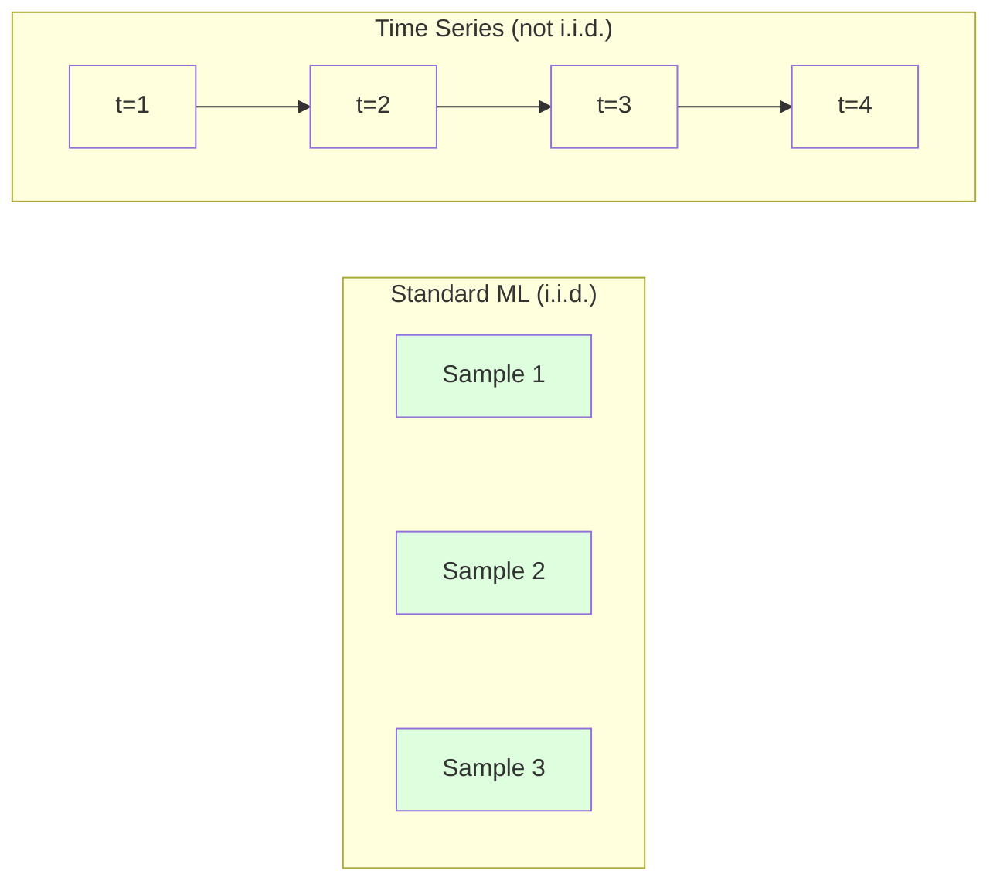
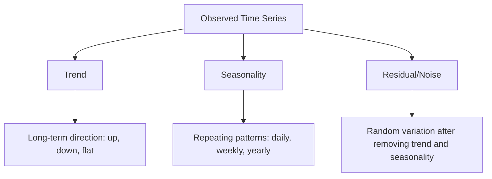
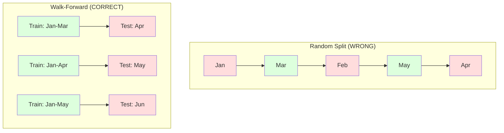

# Les fondements de la série temporelle
# 时间序列基础


> Les performances passées prédisent les résultats futurs si vous vérifiez d'abord la stationnalité.

> Le passé peut vraiment prédire le futur, si vous avez d'abord examiné la stabilité.

**Type:** Build | **类型：** 构建
**Language:**Je suis un Python .**语言：**Python
**Prerequisites:** Phase 2, Lessons 01-09 | **前置知识：** Phase 2 第 1-9 课
**Time:** ~90 minutes | **时间：** 约 90 分钟

## Objectifs d'apprentissage

- Décomposer une série temporelle en composants de tendance, de saisonnalité et de résidu et tester la stationnalité
  Décomposer la séquence de temps en tendances, saisons et déficit de volume, et vérifier l'équilibre
- Implementer des caractéristiques de retard et des statistiques de rotation pour convertir une série temporelle en un problème d'apprentissage supervisé
  实现 l'attraction du retard et la statistique de rotation transformeront la séquence de temps en problème de surveillance de l'apprentissage
- Construire un cadre de validation progressive qui empêche la fuite de données futures dans la formation
  Construire un cadre de vérification de roulement, pour prévenir les fuites de données futures dans le cadre de la formation
- Expliquer pourquoi les fractions aléatoires de train/test sont invalides pour les séries temporelles et démontrer l'écart de performance par rapport aux fractions temporelles appropriées
  Expliquer pourquoi le partage de séquences de temps est inefficace, et ne pas utiliser le partage de temps correct pour démontrer la différence de performance


> **【中文解读】**
> 时间序列是按时间序列排列的数据──ARIMA、指数平滑是经典方法,LSTM/Transformer是深度学习方法──股票预测、销量预测、天气预报是典型应用──

> **【拓展：时间序列预测在金融和供应链中的关键角色】**
> Amazon utilise la prédiction de séquences de temps pour gérer le stock mondial de plusieurs milliards de SKU, la prédiction quotidienne dépasse 4 milliards de fois; Uber utilise la prédiction de séquences de temps pour gérer les coûts; les institutions financières utilisent ARIMA/GARCH pour gérer les risques.

## Le problème , l' introduction du problème

Vous avez des données ordonnées par temps, des ventes quotidiennes, température horaire, utilisation de la CPU par minute, prix hebdomadaires des actions.

> Vous avez des données en temps réel. Le nombre de ventes, la température, le taux d'utilisation du processeur par minute, le prix des actions.

Vous cherchez votre kit d'outils standard: train aléatoire / test divisé, validation croisée, matrice de fonctionnalités, prédiction.

> Vous utilisez les outils standard ML:随机训练/测试划分、交叉验证、特征矩阵输入、预测输出── chaque étape est errata──

La série temporelle brise les hypothèses sur lesquelles repose le système de calcul standard. Les échantillons ne sont pas indépendants - la température d'aujourd'hui dépend de celle d'hier. Les fractions aléatoires filtrent des informations futures dans le passé. Les fonctionnalités qui ont l'air superbes dans les tests arrière échouent dans la production parce qu'elles dépendent de modèles qui changent avec le temps.

> La séquence de temps rompt l'hypothèse de dépendance de la norme ML. Le modèle n'est pas indépendant. La température d'aujourd'hui dépend de celle d'hier.

Un modèle qui obtient une précision de 95% avec une validation croisée aléatoire peut obtenir 55% avec une évaluation en temps réel. La différence n'est pas une technicalité.

> Un modèle obtenu dans une vérification de croisement aléatoire avec un taux d'exactitude de 95% ne peut obtenir que 55% en temps réel.

Cette leçon couvre les fondamentaux: ce qui rend les données de temps différentes, comment évaluer honnêtement les modèles et comment transformer une série de temps en fonctionnalités que les modèles ML standard peuvent consommer.

> Ce cours couvre les connaissances de base: qu'est-ce qui rend les données de temps différentes, comment évaluer honnêtement le modèle, ainsi que comment transformer le séquence de temps en caractéristiques standard ML  modèles peuvent être utilisés.

> **【中文解读】**
> La différence entre les points de données et les valeurs d'aujourd'hui dépendent de celles d'hier. Cela brise l'hypothèse d'indépendance et de distribution de la norme ML. Le concept central de l'analyse de la séquence de temps est: la stabilité; les caractéristiques statistiques ne changent pas avec le temps; les tendances + les saisons + les décompositions; les caractéristiques de retard et la statistique en roulement transforment la séquence en un problème de surveillance.

## Le concept de base.

### Ce qui rend les séries de temps différentes

La norme ML suppose i.i.d. - indépendante et identiquement répartie. Chaque échantillon est tiré de la même distribution, indépendamment des autres échantillons.

> 標準 ML 假设 i.i.d.独立同分布── chaque échantillon est extrait de la même distribution, sans lien avec les autres échantillons── la séquence de temps enfreint ces deux hypothèses:

- **Not independent.**Le prix des actions d'aujourd'hui dépend de celui d'hier. Les ventes de cette semaine sont correlatives avec celles de la semaine dernière.
  Il est également important de noter que les prix des actions de la semaine dernière sont en lien avec les ventes de la semaine dernière.
- **Not identically distributed.**Les ventes en décembre sont différentes des ventes en mars.
  Non-uniquement distribué. Distribution change avec le temps.

Ces violations ne sont pas mineures, elles changent la façon dont vous construisez des fonctionnalités, comment vous évaluez des modèles et quels algorithmes fonctionnent.

> Ces violations ne sont pas des petits problèmes. Elles ont changé la façon dont vous construisez des caractéristiques, comment vous évaluez des modèles et quels algorithmes sont efficaces.



Dans le système de calcul standard, les échantillons sont interchangeables, le mélange ne change rien, dans les séries temporelles, l'ordre est tout, le mélange détruit le signal.

> Dans la norme ML, le modèle est interchangeable.

### Les composants d'une série temporelle

Chaque série de temps est une combinaison de:

> Chaque séquence de temps est composée des composants suivants:



- **Trend**Les revenus augmentent de 10% par an, la température mondiale augmente.
  趋势:长期方向― revenus croissant de 10% par an― température mondiale hausse―
- **Seasonality**Les prix de vente au détail ont augmenté en décembre, les prix de vente à la vente au détail ont augmenté en juillet, les prix de vente à la vente au détail ont augmenté en décembre, les prix de vente à la vente à la vente au détail ont augmenté en décembre, les prix de vente à la vente à la vente à la vente à la vente à la vente à la vente à la vente à la vente à la vente à la vente à la vente à la vente à la vente à la vente à la vente à la vente à la vente à la vente à la vente à la vente à la vente à la vente à la vente à la vente à la vente à la vente à la vente à la vente à la vente à la vente à la vente à la vente à la vente à la vente à la vente à la vente à la vente à la vente à la vente à la vente à la vente à la vente à la vente à la vente à la vente à la vente à la vente à la vente à la vente à la vente à la vente à la vente à la vente à la vente à la vente à la vente à la vente à la vente à la vente à la vente à la vente à la vente à la vente à la vente à la vente à la vente à la vente à la vente à la vente à la vente à la vente à la vente à la vente à la vente à la vente à la vente à la vente à la vente à la vente à la vente à la vente à la vente à la vente à la vente à la vente à la vente à la vente à la vente à la vente à la vente à la vente à la vente à la vente à la vente à la vente à la vente à la vente à la vente à la vente à la vente à la vente à la vente à la vente à la vente à la vente à la vente à la vente à la vente à la vente à la vente à la vente à la vente à la vente à la vente à la vente à la vente à la vente à la vente à la vente à la vente à la vente à la vente à la vente à la vente à la vente à la vente à la vente à la vente à la vente à la vente à la vente à la vente à la vente à la vente à la vente à la vente à la vente à la vente à la vente à la vente à la vente à la vente à la vente à la vente à la vente à la vente à la vente à
  季节性: fixe间隔的重复模式── ventes de détail augmentent en décembre── utilisation de l'air en juillet atteint son sommet──
- **Residual**Si le résidu ressemble au bruit blanc, la décomposition a capturé le signal.
  Résidu: détachement des tendances et des séries postérieures. Si le résidu ressemble à un bruit blanc, indique que la décomposition a capturé le signal.

### Stabilité

Une série temporelle est stationnaire si ses propriétés statistiques (média, variance, autocorrélation) ne changent pas avec le temps.

> Si les caractéristiques statistiques d'une séquence de temps (la valeur moyenne, la différence, la relation) ne changent pas avec le temps, elle est stable.

**Why it matters:**Une série non stationnaire a une moyenne qui dérive. Un modèle formé sur des données de janvier a appris une moyenne différente de celle de février.

> **为什么重要：**La moyenne des séquences non stables se déplace. Elle diffère systématiquement de celle des séquences de données de 1 mois.

**How to check:**Comptez la moyenne de roulement et l'écart standard de roulement sur les fenêtres.

> **如何检查：**計算窗口內滚动平均值和滚动标准差──如果它们漂移,序列就是不平稳的──

**How to fix:**Différenciation. Au lieu de modéliser les valeurs brutes, modélisez le changement entre les valeurs consécutives:

> **如何修复：**差分──不对原始值建模,而是对连续值之间的变化建模:

```
diff[t] = value[t] - value[t-1]
```

Si une série de différenciation ne rend pas la série stationnaire, appliquez-la à nouveau (différenciation de deuxième ordre).

> Si une phase différente ne peut pas rendre la séquence stable, il faut la reappliquer une fois.

**Example:**

> **示例：**

La série originale: [100, 102, 106, 112, 120]
Première différence: [2, 4, 6, 8] (encore tendance à la hausse)
Deuxième différence: [2, 2, 2] (constante -- stationnaire)

La série originale avait une tendance quadratique. La première différenciation la transforme en tendance linéaire. La deuxième différenciation la rend plate.

> La première séquence a deux tendances. La première séquence est transformée en tendance linéaire. La seconde séquence est rendue plate.

**Formal test:**Le test Augmented Dickey-Fuller (ADF) est le test statistique standard pour la stationarité. L'hypothèse nulle est "la série est non stationnaire". Une valeur p inférieure à 0,05 signifie que vous pouvez rejeter la nullité et conclure la stationarité. Nous ne mettons pas en œuvre ADF à partir de zéro (il nécessite des tables de distribution asymptotiques), mais l'approche statistique en roulement dans notre code donne une vérification visuelle pratique.

> **正式检验：**L'examen de Dickey-Fuller augmenté (ADF) est un examen statistique standard de stabilité planeuse. La hypothèse de zéro est " séquence non planeuse " (p) = moins de 0,05 ce qui signifie que vous pouvez refuser la hypothèse de zéro et obtenir des conclusions stables.

### Corrélation automatique

La fonction d'autocorrélation (ACF) trace cette corrélation pour chaque retard k.

> La relation entre la valeur de l'heure t et la valeur du temps t-k  passé k 步 (s)                                                                                                                                                                                                                                                  

**ACF tells you:**
- Si l'ACF tombe à zéro après le retard 5, les valeurs de plus de 5 étapes sont sans importance.
  La mémoire de la séquence est longue. Si l'ACF est en retard de 5 étapes, la valeur de la séquence est réduite à zéro, dépassant 5 étapes précédentes, elle est indépendante.
- Si l'ACF augmente à un retard de 12 (données mensuelles), il y a une saisonnalité annuelle.
  Si l'ACF est en retard de 12 points, il y a des pics, il y a des saisons annuelles.
- Combien de fonctionnalités de retard à créer.
  La formation de la FAC est devenue négligeable.

**PACF (Partial Autocorrelation Function)**Si aujourd'hui est corrélatif à 3 jours auparavant seulement parce que les deux sont corrélatifs à hier, le PACF au retard 3 sera zéro tandis que le ACF au retard 3 ne le sera pas.

> **PACF（偏自相关函数）**Si aujourd'hui et 3 jours précédents sont liés uniquement parce que les deux sont liés à hier, le PACF est en retard de 3 et l'ACF en retard de 3 n'est pas en retard de 0.

### Caractéristiques de la latence: transformer la série de temps en apprentissage supervisé

Les modèles ML standard ont besoin d'une matrice de fonctionnalités X et d'une cible y. La série temporelle vous donne une seule colonne de valeurs.

> 标准 ML 模型 需要特征矩阵 X 和目标 y──时间序列给你一列值──桥梁是滞后特征──

Prenez la série [10, 12, 14, 13, 15] et créez les caractéristiques lag-1 et lag-2:

> 取序列 [10, 12, 14, 13, 15] 并创建滞后 1 和滞后 2 Caractéristiques:

| lag_2 | lag_1 | target |
|-------|-------|--------|
| 10    | 12    | 14     |
| 12    | 14    | 13     |
| 14    | 13    | 15     |

Tout modèle ML (régrésion linéaire, forêt aléatoire, augmentation du gradient) peut prédire la cible à partir des délais.

> Maintenant, vous avez un problème de retour standard. Tout modèle de REM peut être utilisé pour atteindre un objectif de prévision.

Des fonctionnalités supplémentaires que vous pouvez concevoir:
- **Rolling statistics:**moyenne, std, min, max sur les dernières valeurs k
  滚动统计: moyenne de la valeur de la valeur de la valeur de la valeur de la valeur de la valeur de la valeur de la valeur de la valeur de la valeur de la valeur de la valeur de la valeur de la valeur de la valeur de la valeur de la valeur de la valeur de la valeur de la valeur de la valeur de la valeur de la valeur de la valeur de la valeur de la valeur de la valeur de la valeur de la valeur de la valeur de la valeur de la valeur de la valeur de la valeur de la valeur de la valeur de la valeur de la valeur de la valeur de la valeur de la valeur de la valeur de la valeur de la valeur de la valeur de la valeur de la valeur de la valeur de la valeur de la valeur de la valeur de la valeur de la valeur de la valeur de la valeur de la valeur de la valeur de la valeur de la valeur de la valeur de la valeur de la valeur de la valeur de la valeur de la valeur de la valeur de la valeur de la valeur de la valeur de la valeur de la valeur de la valeur de la valeur de la valeur de la valeur de la valeur de la valeur de la valeur de la valeur de la valeur de la valeur de la valeur de la valeur de la valeur de la valeur de la valeur de la valeur de la valeur de la valeur de la valeur de la valeur de la valeur de la valeur de la valeur de la valeur de la valeur de la valeur de la valeur de la valeur de la valeur de la valeur de la valeur de la valeur de la valeur de la valeur de la valeur de la valeur de la valeur de la valeur de la valeur de la valeur de la valeur de la valeur de la valeur de la valeur de la valeur de la valeur de la valeur de la valeur de la valeur de la valeur de la valeur de la valeur de la valeur de la valeur de la valeur de la valeur de la valeur de la valeur de la valeur de la valeur de la valeur de la valeur de la valeur de la valeur de la valeur de la valeur de la valeur de la valeur de la valeur de la valeur de la valeur de la valeur de la valeur de la valeur de la valeur de la valeur de la valeur de la valeur de la valeur de la valeur de la valeur de la valeur de la valeur de la valeur de la valeur de la valeur de la valeur de la valeur de la valeur de la valeur de la valeur de la valeur de la valeur de la valeur de la valeur de la valeur de la
- **Calendar features:**jour de la semaine, mois, jour férié, week-end
  Je suis en train de faire une petite partie de la journée.
- **Differenced values:**changement par rapport à l'étape précédente
  差分值: avec la variation de l'étape précédente
- **Expanding statistics:**moyenne cumulée, somme cumulée
  扩展统计: valeur moyenne accumulée 累积和
- **Ratio features:**valeur courante / moyenne de roulement (combien de distance de la moyenne récente)
  Caractéristiques du taux: valeur actuelle / valeur moyenne en roulement (à l'écart de la valeur moyenne à court terme)
- **Interaction features:**1 * jour de semaine (effets des jours de semaine sur l'élan)
  交互特征:lag_1 * jour_de_la semaine(工作日对动量的影响)

**How many lags?**Utilisez la fonction de corrélation automatique. Si l'ACF est significative jusqu'à 10 délais, utilisez au moins 10 délais. S'il y a une saisonnalité hebdomadaire, inclure 7 délais (et éventuellement 14).

> **用多少个滞后？**Utiliser des fonctions auto-relatives. Si l'ACF est en retard de 10 et est significative, utiliser au moins 10 retard. Si il y a des périodes saisonnières, y compris le retard de 7 (possibilité de 14)

**The target alignment trap.**Lorsque vous créez des fonctionnalités de retard, la cible doit être la valeur au temps t, et toutes les fonctionnalités doivent utiliser des valeurs au temps t-1 ou plus tôt. Si vous incluez accidentellement la valeur au temps t comme une fonctionnalité, vous avez un prédicteur parfait - et un modèle complètement inutile. C'est le bug le plus courant dans l'ingénierie des fonctionnalités de séries temporelles.

> **目标对齐陷阱。**Lorsque vous créez un caractère retardé, l'objectif doit être la valeur de temps t, tous les caractères doivent utiliser la valeur de temps t-1 ou plus tôt. Si vous ne voulez pas que la valeur de temps t soit une caractéristique, vous avez un prédicteur parfait, mais aussi un modèle totalement inutile. C'est le bug le plus courant dans le génie des caractères de séquences de temps.

### Une validation à l'avance

C'est le concept le plus important de cette leçon. La validation croisée standard k-fold attribue aléatoirement des échantillons à former et à tester. Pour les séries temporelles, cela fuit des informations futures.

> C'est le concept le plus important de la classe. Les tests sont distribués de manière aléatoire à des échantillons de formation et de test.



Validation à l'avance:
1. Traîne sur les données à jour t
   En cours d' entraînement
2. Prédiction à l'heure t+1 (ou t+1 à t+k pour plusieurs étapes)
   Dans le temps t+1 预测(或多步预测 t+1 à t+k)
3. Faites glisser la fenêtre vers l' avant
   À l'avant
4. Répétez
   Récapitulatif

Chaque pliage de test contient uniquement des données qui viennent après toutes les données de formation. Aucune fuite future. Cela vous donne une estimation honnête de la performance du modèle lors de son déploiement.

> Chaque décalage de test ne contient que les données de l'entraînement après le début. Il n'y a pas de fuites futures.

**Expanding window**utilise toutes les données historiques pour la formation (les fenêtres grandissent). **Sliding window**Utilisez le glisser lorsque les données anciennes sont toujours pertinentes. Utilisez le glisser lorsque le monde change et que les données anciennes font mal.

> **扩展窗口**Utilisez tous les données historiques pour faire des exercices.**滑动窗口**Utilisez une fenêtre d'entraînement de taille fixe (en anglais seulement) lorsque vous pensez que les données anciennes sont toujours pertinentes. Utilisez une fenêtre d'expansion (en anglais seulement) lorsque le monde change et que les données anciennes sont nocives.

### L'intuition de l'ARIMA

ARIMA est le modèle classique de séries temporelles.

> ARIMA est un modèle classique de séquences de temps. Il a trois composantes:

- **AR (Autoregressive):**Prédire à partir de valeurs passées. AR(p) utilise les dernières valeurs p.
  AR(auto-retour): de la valeur du passé pré测。AR(p)
- **I (Integrated):**Différenciation pour atteindre la stationarité.
  I(积分): par différence pour réaliser la stabilité.
- **MA (Moving Average):**Prédire à partir d'erreurs de prévision passées.
  MA(移动平均): de la prédiction précédente

ARIMA ((p, d, q) combine les trois. Vous choisissez p, d, q en fonction de l'analyse ACF/PACF ou de la recherche automatisée (ARIMA automatique).

> ARIMA(p, d, q) 组合了所有三成分──你基于ACF/PACF 分析或自动搜索(auto-ARIMA) 选择 p、d、q──

Nous ne allons pas mettre en œuvre ARIMA à partir de zéro - il nécessite une optimisation numérique qui est au-delà de la portée de cette leçon.

> Nous ne réaliserons pas ARIMA à partir de zéro, il faut une optimisation numérique au-delà de la portée de la classe.

### Quand utiliser quoi

| Approach | Best For | Handles Seasonality | Handles External Features |
|----------|---------|-------------------|------------------------|
| Lag features + ML | Tabular with many external features | With calendar features | Yes |
| ARIMA | Single univariate series, short-term | SARIMA variant | No (ARIMAX for limited) |
| Exponential smoothing | Simple trend + seasonality | Yes (Holt-Winters) | No |
| Prophet | Business forecasting, holidays | Yes (Fourier terms) | Limited |
| Neural networks (LSTM, Transformer) | Long sequences, many series | Learned | Yes |

Pour la plupart des problèmes pratiques, les caractéristiques de retard + augmentation du gradient sont le point de départ le plus fort.

> Pour la plupart des problèmes réels, le retard + le degré de progression est le point de départ le plus fort.

### Prévision des horizons et des stratégies

La prévision en une seule étape prédit une étape de l'avance.

> 单步预测预测 下一个时间步多步预测预测多个时间步有三种策略:

**Recursive (iterated):**Prédire une étape en avant, utiliser la prédiction comme entrée pour la prochaine étape. Simple mais les erreurs s'accumulent - chaque prédiction utilise la prédiction précédente, donc les erreurs sont compoxes.

> **递归（迭代）：**预测一步,将预测结果作为下一步的输入──简单但误差会积累每预测使用前一个预测,因此错误会叠加──

**Direct:**Exercer un modèle séparé pour chaque horizon. Le modèle 1 prévoit t+1, le modèle 5 prévoit t+5. Aucune accumulation d'erreur, mais chaque modèle a moins d'échantillons de formation et ils ne partagent pas d'informations.

> **直接：**Pour chaque modèle, le champ d'entraînement est unique. Le modèle 1 prévoit t+1, le modèle 5 prévoit t+5 et il n'y a pas d'erreur accumulée, mais le modèle de chaque modèle est plus petit et ne partage pas d'informations.

**Multi-output:**Exercer un modèle qui sort tous les horizons simultanément. Partage des informations à travers les horizons mais nécessite un modèle qui prend en charge plusieurs sorties (ou une fonction de perte personnalisée).

> **多输出：**训练一个模型同时输出所有预测范围――跨范围共享信息,但需要支持多输出模型 (或自定义损失函数) ―

Pour la plupart des problèmes pratiques, commencez par le récursif pour les horizons courts (1-5 étapes) et le direct pour les horizons plus longs.

> Pour la plupart des problèmes réels, la courte portée (environ 1 à 5 étapes) est de retour, la courte portée est de méthode directe.

### Les erreurs courantes dans la chronologie

| Mistake | Why it happens | How to fix |
|---------|---------------|-----------|
| Random train/test split | Habit from standard ML | Use walk-forward or temporal split |
| Using future features | Feature at time t included by mistake | Audit every feature for temporal alignment |
| Overfitting to seasonality | Model memorizes calendar patterns | Hold out a full seasonal cycle in the test set |
| Ignoring scale changes | Revenue doubles but patterns stay | Model percentage change instead of absolute |
| Too many lag features | "More history is better" | Use ACF to determine relevant lags |
| Not differencing | "The model will figure it out" | Tree models handle trends; linear models need stationarity |

## Construisez-le et mettez-le en œuvre.

> **【中文解读】**
> De l'outil central de la séquence de temps à réaliser à zéro: lag lag lag lag lag lag lag attribut generator (en anglais seulement), les séquences seront transformées en un modèle de surveillance de l'apprentissage (en anglais seulement), les statistiques (en anglais seulement), les statistiques (en anglais seulement), les statistiques (en anglais seulement), les statistiques (en anglais seulement), les statistiques (en anglais seulement), les statistiques (en anglais seulement), les statistiques (en anglais seulement), les statistiques (en anglais seulement), les statistiques (en anglais seulement), les statistiques (en anglais seulement), les statistiques (en anglais seulement), les statistiques (en anglais seulement), les statistiques (en anglais seulement), les statistiques (en anglais seulement), les statistiques (en anglais seulement), les statistiques (en anglais seulement), les statistiques (en anglais seulement) et les statistiques (en anglais seulement)

> **【拓展：从 ARIMA 到 Transformer——时间序列预测的进化】**
> 经典时间序列方法 (ARIMA、Holt-Winters) est toujours valable sur un seul variable、短序列. Mais la méthode moderne a considérablement dépassé: Facebook's Prophet Automatic Processing节假日和季节性; Amazon's DeepAR utilise RNN à son retour pour faire des prévisions de probabilité; Google's TimesFM et Amazon's Chronos utilise Transformer architecture, en zéro échantillon ((zéro-shot)
```figure
f3-series-decompose
```

## Faites-le

Le code dans `code/time_series.py`Il met en œuvre les éléments de base de la construction à partir de zéro.

> `code/time_series.py`Le code central a réalisé le module de construction de base à partir de zéro.

### Créateur de fonctionnalités Lag

```python
def make_lag_features(series, n_lags):
    n = len(series)
    X = np.full((n, n_lags), np.nan)
    for lag in range(1, n_lags + 1):
        X[lag:, lag - 1] = series[:-lag]
    valid = ~np.isnan(X).any(axis=1)
    return X[valid], series[valid]
```

Cela convertit une série 1D en une matrice de fonctionnalités où chaque ligne a la dernière `n_lags`Les valeurs sont des caractéristiques et la valeur actuelle est la cible.

> Ce sera une série de caractères, chaque ligne sera la plus proche.`n_lags`个值作为特征,当前值作为目标──

### Validation croisée à l'avance

```python
def walk_forward_split(n_samples, n_splits=5, min_train=50):
    assert min_train < n_samples, "min_train must be less than n_samples"
    step = max(1, (n_samples - min_train) // n_splits)
    for i in range(n_splits):
        train_end = min_train + i * step
        test_end = min(train_end + step, n_samples)
        if train_end >= n_samples:
            break
        yield slice(0, train_end), slice(train_end, test_end)
```

Chaque fraction garantit que les données de formation sont strictement avant les données de test.

> Chaque division assure que les données de formation sont strictement en phase de test.

### Modèle autorégressif simple

Un modèle pur AR est juste une régression linéaire sur les caractéristiques de retard:

> Le modèle pur AR est le retour de la ligne sur les traits de retard:

```python
class SimpleAR:
    def __init__(self, n_lags=5):
        self.n_lags = n_lags
        self.weights = None
        self.bias = None

    def fit(self, series):
        X, y = make_lag_features(series, self.n_lags)
        # Solve via normal equations
        X_b = np.column_stack([np.ones(len(X)), X])
        theta = np.linalg.lstsq(X_b, y, rcond=None)[0]
        self.bias = theta[0]
        self.weights = theta[1:]
        return self
```

Ceci est conceptuellement identique à la régression linéaire de la leçon 02, mais appliqué aux versions retardées du même variable.

> C'est le même concept que le retour de la ligne de la 2ème classe, mais il est appliqué à la même variante en retard de temps.

### Vérifie de la stationnalité

Le code compute les statistiques de roulement pour évaluer visuellement et numériquement la stationnalité:

> 代码计算滚动统计量, évaluer la stabilité de la façon visualisée et numérique:

```python
def check_stationarity(series, window=50):
    rolling_mean = np.array([
        series[max(0, i - window):i].mean()
        for i in range(1, len(series) + 1)
    ])
    rolling_std = np.array([
        series[max(0, i - window):i].std()
        for i in range(1, len(series) + 1)
    ])
    return rolling_mean, rolling_std
```

Si la moyenne de dérive ou la std de roulement change, la série est non stationnaire.

> Si la valeur moyenne de roulement déplace ou de la norme de roulement change, le processus est inégal.

Le code vérifie également la stationnalité en comparant la première moitié et la seconde moitié de la série. Si les moyens diffèrent de plus de la moitié d'un écart standard ou si le rapport de variance dépasse 2x, la série est marquée comme non stationnaire.

> Le code passe également par la première moitié et la seconde moitié de la séquence comparative pour vérifier la stabilité. Si la différence moyenne de valeur dépasse la moitié de la différence standard, ou la différence de dimension dépasse le double, la séquence est marquée comme non-stable.

### Corrélation automatique

```python
def autocorrelation(series, max_lag=20):
    n = len(series)
    mean = series.mean()
    var = series.var()
    acf = np.zeros(max_lag + 1)
    for k in range(max_lag + 1):
        cov = np.mean((series[:n-k] - mean) * (series[k:] - mean))
        acf[k] = cov / var if var > 0 else 0
    return acf
```

## Utilisez-le avec le cadre de réalisation

Avec sklearn, vous utilisez les fonctionnalités de retard directement avec n'importe quel régresseur:

> Utilisez le sklearn, vous pouvez directement traiter le retard pour n'importe quel retourner:

```python
from sklearn.linear_model import Ridge
from sklearn.ensemble import GradientBoostingRegressor

X, y = make_lag_features(series, n_lags=10)

for train_idx, test_idx in walk_forward_split(len(X)):
    model = Ridge(alpha=1.0)
    model.fit(X[train_idx], y[train_idx])
    predictions = model.predict(X[test_idx])
```

Pour ARIMA, utilisez les modèles statistiques:

>  Pour ARIMA, utiliser des modèles statistiques:

```python
from statsmodels.tsa.arima.model import ARIMA

model = ARIMA(train_series, order=(5, 1, 2))
fitted = model.fit()
forecast = fitted.forecast(steps=30)
```

Le code dans `time_series.py`démontre les deux approches et les compare à l'aide de la validation progressive.

> `time_series.py`Le code central a présenté deux méthodes, et utilisé des tests de roulement avant pour comparer.

### sklearn TempsSeriesSplit

sklearn fournit `TimeSeriesSplit`qui met en œuvre la validation progressive:

> Les produits sont fournis.`TimeSeriesSplit`, réalisé l'essai de roulement avant:

```python
from sklearn.model_selection import TimeSeriesSplit

tscv = TimeSeriesSplit(n_splits=5)
for train_index, test_index in tscv.split(X):
    X_train, X_test = X[train_index], X[test_index]
    y_train, y_test = y[train_index], y[test_index]
    model.fit(X_train, y_train)
    score = model.score(X_test, y_test)
```

C' est l' équivalent de notre " à partir de zéro " .`walk_forward_split`Il est intégré dans le cadre de validation croisée de sklearn.`cross_val_score`- Le numéro de la liste:

> C' est l' équivalent de ce que nous réalisons à partir de zéro.`walk_forward_split`Mais intégré dans le cadre de l'évaluation de la transaction de sklearn.`cross_val_score`Une utilisation:

```python
from sklearn.model_selection import cross_val_score

scores = cross_val_score(model, X, y, cv=TimeSeriesSplit(n_splits=5))
print(f"Mean score: {scores.mean():.4f} +/- {scores.std():.4f}")
```

### Les mesures d'évaluation

La prévision des séries temporelles utilise des mesures de régression, mais dans un contexte conscient du temps:

> 时间序列预测 utilise le rétrogradation indice, mais avec le temps sensé ci-dessous:

- **MAE (Mean Absolute Error):**"En moyenne, les prédictions sont déformées de 3,2 degrés".
  MAE( moyenne absolue - différence de moyenne de la valeur moyenne de la valeur de la valeur de la valeur de la valeur de la valeur de la valeur de la valeur de la valeur de la valeur de la valeur de la valeur de la valeur de la valeur de la valeur de la valeur de la valeur de la valeur de la valeur de la valeur de la valeur de la valeur de la valeur de la valeur de la valeur de la valeur de la valeur de la valeur de la valeur de la valeur de la valeur de la valeur de la valeur de la valeur de la valeur de la valeur de la valeur de la valeur de la valeur de la valeur de la valeur de la valeur de la valeur de la valeur de la valeur de la valeur de la valeur de la valeur de la valeur de la valeur de la valeur de la valeur de la valeur de la valeur de la valeur de la valeur de la valeur de la valeur de la valeur de la valeur de la valeur de la valeur de la valeur de la valeur de la valeur de la valeur de la valeur de la valeur de la valeur de la valeur de la valeur de la valeur de la valeur de la valeur de la valeur de la valeur de la valeur de la valeur de la valeur de la valeur de la valeur de la valeur de la valeur de la valeur de la valeur de la valeur de la valeur de la valeur de la valeur de la valeur de la valeur de la valeur de la valeur de la valeur de la valeur de la valeur de la valeur de la valeur de la valeur de la valeur de la valeur de la valeur de la valeur de la valeur de la valeur de la valeur de la valeur de la valeur de la valeur de la valeur de la valeur de la valeur de la valeur de la valeur de la valeur de la valeur de la valeur de la valeur de la valeur de la valeur de la valeur de la valeur de la valeur de la valeur de la valeur de la valeur de la valeur de la valeur de la valeur de la valeur de la valeur de la valeur de la valeur de la valeur de la valeur de la valeur de la valeur de la valeur de la valeur de la valeur de la valeur de la valeur de la valeur de la valeur de la valeur de la valeur de la valeur de la valeur de la valeur de la valeur de la valeur de la valeur de la valeur de la valeur de la valeur de la valeur de la valeur de la valeur de la valeur de la valeur de la valeur de la valeur de la valeur de la valeur de la valeur de la valeur
- **RMSE (Root Mean Squared Error):**La racine carrée de l'erreur carrée moyenne. Pénale les erreurs importantes plus que MAE. Utilisez quand les erreurs importantes sont pires que de nombreuses petites erreurs.
  RMSE: erreur de base: erreur de base de base de base de base de base de base de base de base de base de base de base de base de base de base de base de base de base de base de base de base de base de base de base de base de base de base de base de base de base de base de base de base de base de base de base de base de base de base de base de base de base de base de base de base de base de base de base de base de base de base de base de base de base de base de base de base de base de base de base de base de base de base de base de base de base de base de base de base de base de base de base de base de base de base de base de base de base de base de base de base de base de base de base de base de base de base de base de base de base de base de base de base de base de base de base de base de base de base de base de base de base de base de base de base de base de base de base de base de base de base de base de base de base de base de base de base de base de base de base de base de base de base de base de base de base de base de base de base de base de base de base de base de base de base de base de base de base de base de base de base de base de base de base de base de base de base de base de base de base de base de base de base de base de base de base de base de base de base de base de base de base de base de base de base de base de base de base de base de base de base de base de base de base de base de base de base de base de base de base de base de base de base de base de base de base de base de base de base de base de base de base de base de base de base de base de base de base de base de base de base de base de base de base de base de base de base de base de base de base de base de base de base de base de base de base de base de base de base de base de base de base de base de base de base de base de base de base de base de base de base de base de base de base de base de base de base de base de base de base de base de base de base de base de base de base de base de base de base de base de
- **MAPE (Mean Absolute Percentage Error):**La moyenne de l'erreur / valeur vraie = 100 *. indépendante de l'échelle, utile pour comparer entre différentes séries. Mais indéfinie lorsque les valeurs vraies sont zéro.
  MAPE (en anglais: MAPE) est une méthode de calcul de la valeur moyenne de 100 * qui est utilisée pour une comparaison entre différentes séries.
- **Naive baseline comparison:**La base saisonnière naïve prédit la valeur d'une période antérieure (hier, la semaine dernière). Si votre modèle ne peut pas battre la naïve, quelque chose ne va pas.
  朴素基线比较:始终与简单基线比较──季节性朴素基线预测一个周期前的值(昨天、上周)── Si votre modèle ne peut pas dépasser la ligne de base, expliquez le problème──

### Caractéristiques roulantes

Le code démontre l'ajout de statistiques de roulement (média, std, min, max sur les fenêtres de 7 et 14 jours) pour les caractéristiques de retard.

> Le code présente les statistiques de roulement des fenêtres 7 天 et 14 天 (médiaire, différence standard, valeur minimale, valeur maximale) ajoutées aux traits de retard. Ces traits de retard fournissent des informations de tendances et de volatilité récentes impossibles à capturer pour le modèle.

Par exemple, si la moyenne de roulement augmente, cela suggère une tendance à la hausse. Si la std de roulement augmente, cela suggère une volatilité croissante. Ce sont les types de modèles dont les modèles basés sur des arbres peuvent apprendre mais les modèles linéaires ne peuvent pas.

> Par exemple, si la valeur moyenne de roulement augmente, il y a une tendance à la hausse. Si la différence de norme de roulement augmente, il y a une augmentation de la volatilité.

## Envoyez-le . Produit .

Cette leçon donne:
- `outputs/prompt-time-series-advisor.md`-- une demande pour enquêter les problèmes de séries temporelles
  `outputs/prompt-time-series-advisor.md` 构建时间序列问题提示词
- `code/time_series.py`- fonctionnalités de retard, validation progressive, modèle AR, contrôle de stationnalité
  `code/time_series.py` 滞后特征、前向滚动验证、AR 模型、平稳性检查

### Les limites que vous devez atteindre

Avant de construire un modèle, établir des lignes de base:

> Avant de construire un modèle, établir une base:

1. **Last value (persistence).**Prédire que demain sera le même que aujourd'hui.
   Pour beaucoup de séries, c'est étonnamment difficile à surmonter.
2. **Seasonal naive.**Prédisez que le jour d'aujourd'hui sera le même que le jour de la semaine dernière (ou de l'année dernière).
   季节性朴素──预测 今天与上周(或去年) 相同日──如果你的模型不能超越这个基线,它没有学到任何超季节性有用模式──
3. **Moving average.**Prédire la moyenne des derniers k. Légère le bruit mais ne peut pas capter les changements soudains.
   移动平均──预测 最近 k 个值的平均值──平滑噪音但无法捕捉突变──

Si votre modèle de ML de fantaisie perd à la base saisonnière naïve, vous avez un bug. Le plus souvent: fuite future dans les caractéristiques, mauvaise méthode d'évaluation, ou la série est vraiment aléatoire et imprévisible.

> Si un modèle de gestion de données de programmation bien conçu donne une base de données saisonnière simple, vous avez un bug. Le plus courant est: les fuites futures dans les caractéristiques, les méthodes d'évaluation erronées, ou les séquences sont vraiment aléatoires et imprévisibles.

### Conseils pratiques

1. **Start with plotting.**Avant toute modélisation, tracez la série brute. Cherchez les tendances, la saisonnalité, les valeurs exceptionnelles, les ruptures structurelles (changements soudains de comportement).
   Avant de réaliser un dessin, dessinez la séquence initiale. Avant de réaliser un dessin, recherchez les tendances, les saisons, les valeurs anormales, les changements structurels, les changements brusques de comportement.

2. **Difference first, model second.**Si la série a une tendance claire, différencier avant de créer des caractéristiques de retard. Les modèles basés sur des arbres peuvent gérer les tendances, mais les modèles linéaires ne peuvent pas, et différencier ne fait jamais de mal.
   Si la séquence a une tendance évidente, la tendance avant la création est retardée. Le modèle d'arbre peut traiter la tendance, mais le modèle linéaire ne peut pas, et la tendance ne peut pas avoir d'effet négatif.

3. **Hold out at least one full seasonal cycle.**Si vous avez une saisonnalité hebdomadaire, votre ensemble de tests a besoin d'au moins une semaine complète. Si mensuel, au moins un mois complet. Sinon, vous ne pouvez pas évaluer si le modèle a capturé le schéma saisonnier.
   Si vous avez une saison saison, le test nécessite au moins une saison entière. Si c'est une saison, au moins un mois.

4. **Monitor in production.**Les modèles de séries temporelles se dégradent au fil du temps à mesure que le monde change. Suivez les erreurs de prédiction sur une base régulière. Lorsque les erreurs commencent à augmenter, redéfinissez le modèle sur des données récentes.
   Dans la production, le modèle de séquence de temps est contrôlé et détérioré au fur et à mesure que le monde change.

5. **Beware of regime changes.**Un modèle formé sur des données pré-pandémiques ne prédira pas le comportement post-pandémique.
   Les modèles de formation de données pré-épidémiques ne peuvent pas prédire le comportement post-épidémique.

6. **Log-transform skewed series.**Les revenus, les prix et les comptes sont souvent déviés à droite. Prendre le journal stabilise la variance et rend les modèles multiplicatifs additifs, que les modèles linéaires peuvent gérer. Prévisions dans l'espace du journal, puis exponentiation pour revenir aux unités originales.
   Pour les séquences de variation des nombres, les revenus, les prix et les calculs sont généralement à droite.

## Les exercices

1. **Stationarity experiment.**Générer une série avec une tendance linéaire. Vérifiez la stationarité avec des statistiques de roulement. Appliquez la première différenciation. Vérifiez à nouveau. Combien de tours de différenciation faut-il pour une tendance quadratique?
   1. Produit une séquence de synthèse de temps avec tendance et saisonnière.

2. **Lag selection.**Comptez ACF sur une série saisonnière (période = 7). Quels délais ont la plus grande autocorrélation? Créer des caractéristiques de délais en utilisant uniquement ces délais (pas des délais consécutifs).
   2. 构建滞后特征(lag 1-7)和滚动统计(窗口 3、7、14)。

3. **Walk-forward vs random split.**Exercer une régression Ridge sur les caractéristiques de retard. Évaluer avec une fraction 80/20 aléatoire et avec une validation progressive.
   3. Dans le même ensemble de données, comparer les tests de croisement et les tests de roulement à l'avant.

4. **Feature engineering.**Ajoutez la moyenne de roulement (window=7), la std de roulement (window=7) et les fonctionnalités du jour de la semaine aux fonctionnalités du retard.
   4. 实现 ARIMA(p, d, q) 从零──网格搜索最优参数, Utilisez le modèle le plus efficace de l'AIC.

5. **Multi-step forecasting.**Modifiez le modèle AR pour prédire 5 étapes à l'avant au lieu de 1. Comparer deux stratégies: a) prédire une étape, utiliser la prédiction comme entrée pour la prochaine étape (recursive), et b) entraîner des modèles séparés pour chaque horizon (direct).

> **【中文解读】**
> 时间序列的核心工具箱:ADF 检验判断平稳性(p-value < 0.05 拒绝非平稳假设);差分消除趋势(一阶差分 = 今天 - 昨天);滞后特征将序列转转为监督学习格式(使用t-1, t-2,... 的值预测 t);滚动统计捕获局部趋势(7 天移动平均) ――Walk-forward 验证是唯一正确的评估方法:每次使用过去的数据预测未来,然后滑窗──

## Les termes clés

| Term | What people say | What it actually means |
|------|----------------|----------------------|
| Stationarity | "The stats don't change over time" | A series whose mean, variance, and autocorrelation structure are constant over time |
| Differencing | "Subtract consecutive values" | Computing y[t] - y[t-1] to remove trends and achieve stationarity |
| Autocorrelation (ACF) | "How a series correlates with itself" | The correlation between a time series and a lagged copy of itself, as a function of the lag |
| Partial autocorrelation (PACF) | "Direct correlation only" | Autocorrelation at lag k after removing the effect of all shorter lags |
| Lag features | "Past values as inputs" | Using y[t-1], y[t-2], ..., y[t-k] as features to predict y[t] |
| Walk-forward validation | "Time-respecting cross-validation" | Evaluation where training data always precedes test data chronologically |
| ARIMA | "The classic time series model" | AutoRegressive Integrated Moving Average: combines past values (AR), differencing (I), and past errors (MA) |
| Seasonality | "Repeating calendar patterns" | Regular, predictable cycles in a time series tied to calendar periods (daily, weekly, yearly) |
| Trend | "The long-term direction" | A persistent increase or decrease in the series level over time |
| Expanding window | "Use all history" | Walk-forward validation where the training set grows with each fold |
| Sliding window | "Fixed-size history" | Walk-forward validation where the training set is a fixed-length window that slides forward |

## Encore une lecture

- [Hyndman and Athanasopoulos, Forecasting: Principles and Practice (3rd ed.)](https://otexts.com/fpp3/)-- le meilleur manuel gratuit sur la prévision des séries temporelles
  [Hyndman & Athanasopoulos: Forecasting: Principles and Practice](https://otexts.com/fpp3/)- 免费在线教材
- [scikit-learn Time Series Split](https://scikit-learn.org/stable/modules/generated/sklearn.model_selection.TimeSeriesSplit.html)- le séparateur à marche avant de sklearn
  [statsmodels 时间序列文档](https://www.statsmodels.org/stable/tsa.html)- Python 时间序列分析库
- [statsmodels ARIMA docs](https://www.statsmodels.org/stable/generated/statsmodels.tsa.arima.model.ARIMA.html)-- Implementation de l'ARIMA avec des diagnostics
  [sklearn TimeSeriesSplit](https://scikit-learn.org/stable/modules/cross_validation.html#time-series-cross-validation)
- [Makridakis et al., The M5 Competition (2022)](https://www.sciencedirect.com/science/article/pii/S0169207021001874)-- une concurrence de prévision à grande échelle montrant les méthodes de l'analyse des évolutions et des méthodes statistiques
