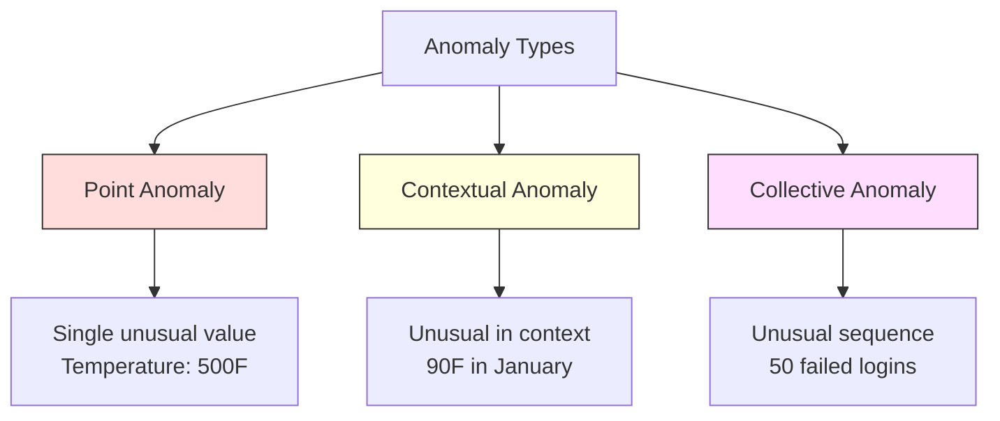
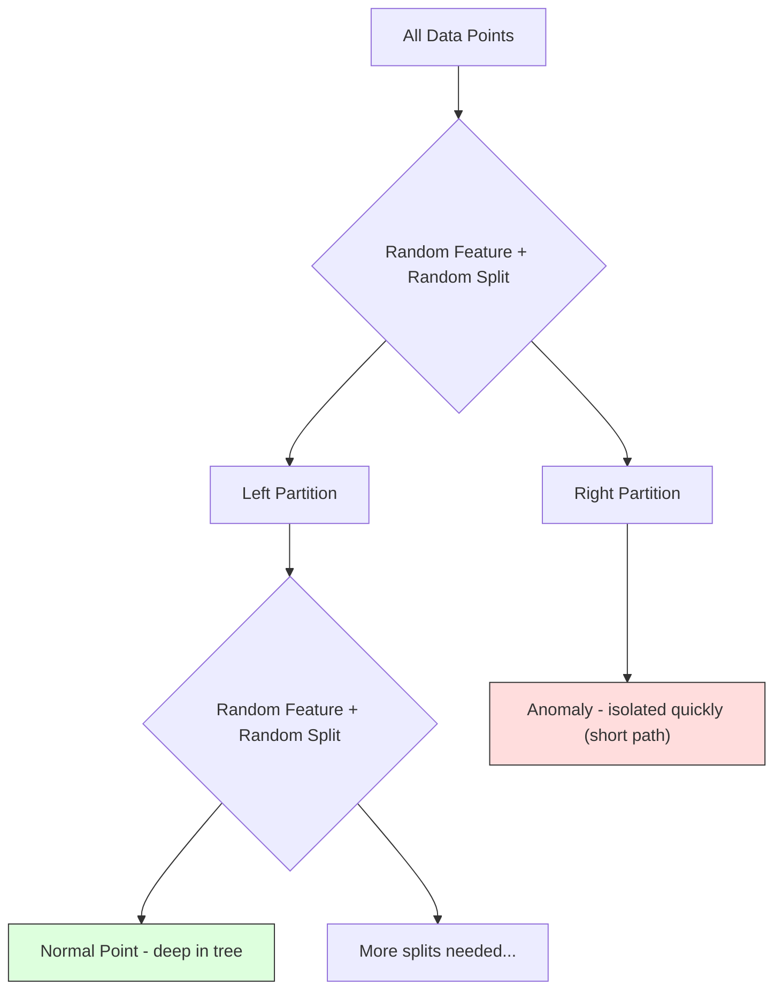
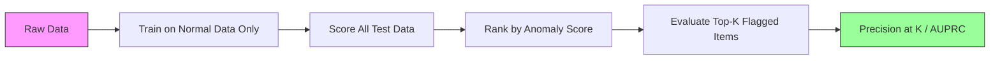

# Détection d'anomalies
# 异常检测


> La normale est facile à définir, l'anormal est ce qui ne va pas.

> Normalement facile à définir.

**Type:** Build | **类型：** 构建
**Language:**Je suis un Python .**语言：**Python
**Prerequisites:** Phase 2, Lessons 01-09 | **前置知识：** Phase 2 第 1-9 课
**Time:** ~75 minutes | **时间：** 约 75 分钟

## Objectifs d'apprentissage

- Mettre en œuvre des méthodes de détection des anomalies forestières à partir de z-score, IQR et isolation
  De zéro réalisation de Z-score, RSI et Isolation Forest  méthode d'examen anormal
- Distinguer les anomalies de point, contextuelles et collectives et sélectionner la méthode de détection appropriée pour chaque
  区分点异常、上下文异常和集合异常, pour chaque méthode de test adaptée à chaque choix
- Expliquer pourquoi la détection des anomalies est définie comme une modélisation des données normales plutôt que comme une classification des anomalies
  Expliquer pourquoi les tests anormaux sont conçus pour modéliser des données normales et non pour les catégories anormales
- Comparer la détection des anomalies non surveillées avec la classification surveillée et évaluer le compromis entre la couverture des anomalies nouvelles et la précision
  Comparer les contrôles et les contrôles de la surveillance, évaluer le taux de couverture et de précision des nouvelles anomalies


> **【中文解读】**
> Les tests de détection de données sont très différents. Les tests de détection de détection de détection de détection de détection de détection de détection de détection de détection de détection de détection de détection de détection de détection de détection de détection de détection de détection de détection de détection de détection de détection de détection de détection de détection de détection de détection de détection de détection de détection de détection de détection de détection de détection de détection de détection de détection de détection de détection de détection de détection de détection de détection de détection de détection de détection de détection de détection de détection de détection de détection de détection de détection de détection de détection de détection de détection de détection de détection de détection de détection de détection de détection de détection de détection de détection de détection de détection de détection de détection de détection de détection de détection de détection de détection de détection de détection de détection de détection de détection de détection de détection de détection de détection de détection de détection de détection de détection de détection de détection de détection de détection de détection de détection de détection de détection de détection de détection de détection de détection de détection de détection de détection de détection de détection de détection de détection de détection de détection de détection de détection de détection de détection de détection de détection de détection de détection de détection de détection de détection de détection de détection de détection de détection

> **【拓展：异常检测在金融和网络安全中的核心应用】**
> Le système de détection de fraude en temps réel de Visa traite environ 76 000 transactions par seconde, en utilisant une méthode mixte de détection anormale + surveillance de l'apprentissage, en environ 150 millisecondes pour juger si c'est de la fraude. Le système de sécurité Web de Google utilise des détections anormales pour détecter des attaques DDoS et des comportements de connexion anormaux. Le système de gestion de la batterie de Tesla utilise des détections anormales préventives pour détecter les défaillances de la batterie. Le défi principal du détection anormale est l'inégalité extrême. Le taux de fraude est généralement inférieur à 0,1%, ce qui rend l'apprentissage de surveillance difficile à utiliser directement.

## Le problème , l' introduction du problème

Une carte de crédit est utilisée à New York à 14h00, puis à Tokyo à 14h05. Un capteur d'usine lit 150 degrés lorsque la plage normale est de 80 à 120. Un serveur envoie 50 000 demandes par seconde lorsque la moyenne quotidienne est de 200.

> Une carte de crédit à 2 heures du matin à New York, puis à 2 heures de l'après-midi à Tokyo.

Les fraudes coûtent des milliards, les pannes d'équipement coûtent des temps d'arrêt, les intrusions de réseau coûtent des données.

> Ces phénomènes sont inhabituels. Ils sont importants à découvrir. La fraude a causé des milliards de pertes. Les défaillances d'appareils ont entraîné une interruption.

Le défi: vous avez rarement étiqueté des exemples d'anomalies. La fraude représente 0,1% des transactions. Les pannes d'équipement se produisent quelques fois par an. Vous ne pouvez pas former un classifiateur standard parce qu'il n'y a presque rien à apprendre dans la classe "anomalie". Même si vous avez des étiquettes, les anomalies que vous avez vues ne sont pas les seules que vous rencontrerez. Le plan de fraude de demain ressemble à celui d'aujourd'hui.

> Le défi réside dans: vous avez très peu de modèles de marque anormaux. La fraude ne représente que 0,1% des transactions. Les défaillances d'appareils ne se produisent que quelques fois par an. Vous ne pouvez pas entraîner les classifications standards, car il n'y a presque rien à apprendre dans la catégorie " anormaux ". Même avec certains modèles, les anomalies que vous avez vues ne sont pas le seul type de fraude que vous rencontrerez.

La détection des anomalies renverse le problème. Au lieu d'apprendre ce qui est anormal, apprenez ce qui est normal. Tout ce qui dévient de la normale est suspect. Cela fonctionne sans étiquettes, s'adapte à de nouveaux types d'anomalies et s'adapte à des ensembles de données massifs.

> 异常检测翻转了问题──不学"什么是异常",而是学"什么是正常"── tout ce qui est déviant de la normale est discutable──

> **【中文解读】**
> 异常检测的关键思路反转:不学"什么是异常",而是学"什么是正常",偏离正常的就是可疑的.

## Le concept de base.

### Types d'anomalies

Toutes les anomalies ne sont pas les mêmes:

> Toutes les choses sont différentes.

- **Point anomalies.**Un seul point de données qui est inhabituel quel que soit le contexte.$50,000 from an account that normally spends $Je suis à 50.
  C'est normal. Quel que soit le niveau de la note, les données sont normales.
- **Contextual anomalies.**Un point de données qui est inhabituel compte tenu de son contexte. Une température de 90 degrés est normale en été, anormale en hiver.
  Les données de l'écriture de l'article sont différentes.
- **Collective anomalies.**Une séquence de points de données qui est inhabituelle en tant que groupe, même si chaque point individuel pourrait être normal. Cinq défaillances de connexion est normal. Cinquante d'une série est une attaque de force brute.
  集合异常──一组数据点作为整体不正常,即使每个单独的点可能是正常──五次登录失败正常──连续五十次就是暴力破解攻击──

La plupart des méthodes détectent des anomalies de point. Les anomalies contextuelles ont besoin de caractéristiques de temps ou de localisation.

> La plupart des méthodes de test de points d'inconvénient.



### Le cadre non surveillé

Dans la classification standard, vous avez des étiquettes pour les deux classes.

> Dans les tests standard, vous avez deux catégories d'étiquettes. Dans les tests anormaux, vous rencontrez généralement l'une des trois situations suivantes:

1. **Fully unsupervised.**Vous mettez le détecteur sur toutes les données et espérez que les anomalies sont assez rares pour ne pas corrompre le modèle "normal".
   完全无监督──完全没有标签──你在所有数据上配合检测器,希望异常足够少,以至于不会破坏"正常"模型──
2. **Semi-supervised.**Vous avez un ensemble de données propre de données normales seulement. Vous vous adaptez à ce ensemble propre et marquer tout le reste. C'est la configuration la plus forte lorsque possible.
   半监督──你只有一个干净的正常数据集──你在这个干净集合上合适,然后对所有其他数据打分──这是可能时最强的设置──
3. **Weakly supervised.**Vous avez quelques anomalies étiquetées. Utilisez-les pour l'évaluation, pas pour l'entraînement.
   弱监督──you have some markings of anomalies──you will use them for evaluation rather than training──you will use them for evaluation rather than training──you will use them for training.

La détection d'anomalies est fondamentalement différente de la classification.

> 关键洞察: l'analyse anormale est fondamentalement différente de la classification.

### Surveillance et non surveillance: le compromis

Si vous avez des anomalies étiquetées, devriez-vous les utiliser pour la formation (classification supervisée) ou uniquement pour l'évaluation (détection non supervisée)?

> Si vous avez des anomalies marquées, devriez-vous les utiliser pour l'entraînement ou seulement pour l'évaluation ?

**Supervised (treat as classification):**
- Il capture les types exacts d'anomalies que vous avez vues auparavant
  Capturez le type d'anomalies que vous avez vues auparavant.
- Une précision plus élevée sur les types d'anomalies connus
  Un taux de précision plus élevé pour les types d'anomalies connus
- Il manque complètement de nouveaux types d'anomalies
  完全错过新类型的异常
- Requiert une reformation lorsque de nouveaux types d'anomalies émergent
  Il faut se remettre à l'entraînement lorsque de nouveaux types d'abnormalité apparaissent.
- Il faut suffisamment d'exemples d'anomalies (souvent trop peu)
  需要足够的异常样本(habituellement trop peu)

**Unsupervised (model normal, flag deviations):**
- Capture de toute déviation de la norme, y compris les types nouveaux
   Capture de toute situation déviant de la normale, y compris de nouveaux types
- Ne nécessite pas d'anomalies étiquetées
  Ne nécessite pas d'étiquette
- Un taux de faux positifs plus élevé (tout ce qui est inhabituel n'est pas mauvais)
  Le taux de faux positifs est plus élevé.
- Plus robuste pour le changement de distribution
  Pour la distribution des dérivés

En pratique, les meilleurs systèmes combinent les deux: détection non supervisée pour une large couverture, modèles supervisés pour les types d'anomalies connues de haute priorité et examen humain pour les cas ambigu.

> En pratique, le meilleur système combine deux: le contrôle sans surveillance est utilisé pour une large couverture, le contrôle de modèle est utilisé pour des types d'abnormalités de haute priorité connus, et le contrôle artificiel est utilisé pour les situations possibles.

### Métode de Z-Score

L'approche la plus simple: calculer la moyenne et l'écart standard de chaque caractéristique.

> La méthode la plus simple est de calculer la valeur moyenne et la différence standard de chaque caractéristique.

```text
z_score = (x - mean) / std
anomaly if |z_score| > threshold
```

Le seuil par défaut est de 3,0 (99,7% des données normales sont dans les limites de 3 écarts standards pour une distribution gaussienne).

> La valeur par défaut est de 3,0 ((99,7% des données normales de la distribution de hauteur sont situées dans 3 différences de référence)

**Strengths:**Simple, rapide, interprétable ("cette valeur est une déviation standard de 4,5 à la normale").

> **优势：**简单――快速――可解释(" Cette valeur est déviée de la normale de 4,5 个标准差")

**Weaknesses:**Supposant que les données sont normalement distribuées.Sensible aux valeurs étrangères dans les données de formation (les valeurs étrangères déplacent la moyenne et gonflent le std, ce qui les rend plus difficiles à détecter).

> **劣势：**假设数据服从正态分布――对训练数据中的异常值敏感异常值会偏移平均值并膨胀标准差,使它们更难检测)―

**When it works well:**Surveillance à fonction unique où les données sont à peu près en forme de cloche. Temps de réponse du serveur, tolérances de fabrication, lectures de capteurs avec lignes de base stables.

> **适用场景：**Les données de la série de données sont en grande partie présentées sous forme de moniteurs.

**When it fails:**Les données multi-clusters (deux bureaux avec des températures de base différentes), les données déformées (montants de transactions où 1000 $ est rare mais pas anormal), les données avec des valeurs anormales dans l'ensemble de formation.

> **失效场景：**Les données de plusieurs catégories sont différentes (les deux bureaux ont des températures de base différentes)  les données de décalage  les transactions de 1000 $ sont rares mais ne sont pas inhabituelles  les données de formation sont inhabituelles 

### Métode de la RCI

Plus robuste que le score Z. Utilise la plage interquartile au lieu de la moyenne et de l'écart standard.

> Avec un score Z, on utilise plus de 4 points pour remplacer la moyenne et la différence de niveau.

```
Q1 = 25th percentile
Q3 = 75th percentile
IQR = Q3 - Q1
lower_bound = Q1 - factor * IQR
upper_bound = Q3 + factor * IQR
anomaly if x < lower_bound or x > upper_bound
```

Le facteur par défaut est de 1.5.

> 默认因子为 1.5 ⋅

**Strengths:**Robuste à des valeurs anormales (les pourcentages ne sont pas affectés par des valeurs extrêmes).

> **优势：**Pour une distribution anormale, le taux de % n'est pas affecté par la valeur extrême.

**Weaknesses:**Univariée uniquement (applique indépendamment à chaque caractéristique). Ne peut détecter des anomalies inhabituelles que lorsque les caractéristiques sont considérées ensemble (un point peut être normal dans chaque caractéristique individuellement mais anormal dans l'espace commun).

> **劣势：**                                                                                                                                                                                                                                                              

**Practical note:**Le facteur 1,5 dans IQR correspond aux moustaches dans une carte de carton. Les points en dehors des moustaches sont des valeurs potentielles. Utiliser 3,0 au lieu de 1,5 rend le détecteur plus conservateur (moins de drapeaux, moins de faux positifs). Le facteur correct dépend de votre tolérance aux fausses alarmes.

> **实践提示：**Le facteur de 1,5 dans le RQ est le facteur de correspondance à la valeur de la carte de la boîte. Le facteur de 1,5 est le facteur de correspondance à la valeur de l'erreur.

### Forêt isolée

L'idée clé: les anomalies sont rares et différentes. Dans une partition aléatoire des données, les anomalies sont plus faciles à isoler - elles ont besoin de moins de fractions aléatoires pour être séparées du reste.

> 关键洞察: les anomalies sont rares et différentes du public. Dans la division des données, les anomalies sont plus faciles à séparer.



**How it works:**
1. Construire de nombreux arbres aléatoires (une forêt isolée)
   构建许多随机树 (la plupart sont des arbres séparés)
2. À chaque nœud, choisissez une fonctionnalité aléatoire et une valeur de fractionnement aléatoire entre la fonctionnalité min et max
   À chaque point, choisissez un caractère et une valeur séparée entre la valeur minimale et la valeur maximale
3. Continuez à séparer jusqu'à ce que chaque point soit isolé (dans sa propre feuille)
   continuer à se séparer jusqu'à ce que chaque point soit séparé  dans son propre point de feuille
4. Les anomalies ont des traces moyennes plus courtes à travers tous les arbres
                                                                                                                                                                                                                                                                 

**Why it works:**Les points normaux vivent dans des régions denses. De nombreuses splits aléatoires sont nécessaires pour les isoler de leurs voisins. Les anomalies vivent dans des régions rares. Une ou deux splits aléatoires suffisent pour les isoler.

> **为什么有效：**Une zone densément peuplée nécessite de nombreuses divisions afin d'isoler un point de son voisin. Une zone rare est une zone où il y a deux divisions suffisantes pour les séparer.

Le score d'anomalie est basé sur la longueur moyenne du chemin sur tous les arbres, normalisée par la longueur de chemin attendue d'un arbre de recherche binaire aléatoire:

>  Le nombre d'éléments anormaux est basé sur la longueur moyenne du chemin dans tous les arbres, regroupée par la longueur de chemin d'attente du tronc de recherche à deux faces aléatoires:

```
score(x) = 2^(-average_path_length(x) / c(n))
```

Où ?`c(n)`est la longueur de cheminée attendue pour n échantillons. Le score près de 1 signifie anomalie. Le score près de 0,5 signifie normal. Le score près de 0 signifie très normal (en profondeur dans les amas denses).

> Parmi eux `c(n)`Le nombre de particules est proche de 0,5 et le nombre de particules est proche de 0,5 et le nombre de particules est proche de 0,5 et le nombre de particules est proche de 0,5 et le nombre de particules est proche de 0,5 et le nombre de particules est proche de 0,5 et le nombre de particules est proche de 0,5 et le nombre de particules est proche de 0,5 et le nombre de particules est proche de 0,5 et le nombre de particules est proche de 0,5 et le nombre de particules est proche de 0,5 et le nombre de particules est proche de 0,5 et le nombre de particules est proche de 0,6 et le nombre de particules est proche de 0,6 et le nombre de particules est proche de 0,6 et le nombre de particules est proche de 0,6 et le nombre de particules est proche de 0,6 et le nombre de particules est proche de 0,6 et le nombre de particules est de 0,6 et le nombre de particules est de 0,6 et le nombre de particules est de 0,6 et le nombre de particules est de 0,6 et de 0,6 et le nombre de particules de 0,6 = 0,6 = 0,6 = 0,6 = 0,6 = 0,6 = 0,6 = 0,6 = 0,6 = 0,6 = 0,6 = 0,6 = 0,6 = 0,6 = 0,6 = 0,6 = 0,6 = 0,6 = 0,6 = 0,6 = 0,6 = 0,6 = 0,6 = 0,6 = 0,6 = 0,6 = 0,6 = 0,6 = 0,6 = 0,6 = 0,6 = 0,6 = 0,6 = 0,6 = 0,6 = 0,6 = 0,6 = 0,6 = 0,6 = 0,6 = 0,6 = 0,6 = 0,6 = 0,6 = 0,6 = 0,6 = 0,6 = 0,6 = 0,6 = 0,6 = 0,6 = 0,6 = 0,6 = 0,6 = 0,6 = 0,6 = 0,6 = = 0,6 = = = = = = = = = = = = 6 = 6 = 6 = 6 = 6 = 6 = 6 = 6 = 6 = 6 = 6 = 6 = 6 = 6 = 6 = 6 = 6 = 6 = 6 = 6 = 6 = 6 = 6 = 6 = 6 = 6 = 6 = 6 = 6 = 6 = 6 = 6 = 6 = 6 = 6 = 6 = 6 = 6 =

**Strengths:**Aucune hypothèse de distribution. Fonctionne dans de grandes dimensions. Équelles bien (sublinéaire en taille d'échantillon parce que chaque arbre utilise un sous-échantillon).

> **优势：**无分布假设──适用高维──扩展性好样本量亚线性,因为每棵树使用子采样)──处理混合特征类型──

**Weaknesses:**Les luttes contre les anomalies dans les régions denses (effet de masquage).

> **劣势：**Les effets de l'éclipse sont difficiles à traiter.

**Key hyperparameters:**
- `n_estimators`Le nombre d'arbres: 100 est généralement suffisant.
  `n_estimators`Le nombre d'arbres: 100, généralement assez, mais le nombre de arbres est plus stable.
- `max_samples`Le nombre d'échantillons par arbre. 256 est le défaut dans le papier original. Les valeurs plus petites rendent les arbres individuels moins précises mais augmentent la diversité. Le sous-échantillonnage est ce qui rend la forêt d'isolement rapide - chaque arbre voit une petite fraction des données.
  `max_samples`Le nombre d'échantillons de chaque arbre. Le nombre de petits arbres est un nombre de milliers de milliers de milliers de milliers de milliers de milliers de milliers de milliers de milliers de milliers de milliers de milliers de milliers de milliers de milliers de milliers de milliers de milliers de milliers de milliers de milliers de milliers de milliers de milliers de milliers de milliers de milliers de milliers de milliers de milliers de milliers de milliers de milliers de milliers de milliers de milliers de milliers de milliers de milliers de milliers de milliers de milliers de milliers de milliers de milliers de milliers de milliers de milliers de milliers de milliers de milliers de milliers de milliers de milliers de milliers de milliers de milliers de milliers de milliers de milliers de milliers de milliers de milliers de milliers de milliers de milliers de milliers de milliers de milliers de milliers de milliers de milliers de milliers de milliers de milliers de milliers de milliers de milliers de milliers de milliers de milliers de milliers de milliers de milliers de milliers de milliers de milliers de milliers de milliers de milliers de milliers de milliers de milliers de milliers de milliers de milliers de milliers de milliers de milliers de milliers de milliers de milliers de milliers de milliers de milli de milliers de milliers de milliers de milliers de milli de milliers de milliers de milliers de milli de milli de milli de milli de milli de milli de milli de milli de milli de milli de milli de milli de milli de milli de milli de milli de milli de milli de milli de milli de milli de milli de milli de milli de milli de milli de milli de milli de milli de milli de milli de milli de milli de milli de milli de milli de milli de milli de milli de milli de milli de milli de milli de milli de milli de milli de milli de milli de milli de milli de milli de milli de milli de milli de milli de milli de milli de milli de milli de milli de milli de milli de milli de milli de milli de milli de milli de milli de milli de milli de milli de milli de milli de milli de milli de milli
- `contamination`: Fraction attendue d'anomalies. Utilisé uniquement pour fixer le seuil.
  `contamination`: prévue de la proportion de différences.

### Facteur local d'outrages (LOF)

LOF compare la densité locale autour d'un point à celle autour de ses voisins.

> LOF comparera la densité locale autour d'un point à la densité autour de son voisin.

**How it works:**
1. Pour chaque point, trouvez ses voisins les plus proches
   Pour chaque point, trouvez son voisin le plus proche.
2. Calculer la densité de disponibilité locale (combien la zone est dense)
   计算局部可达密度 (dans le même ordre d'idées que dans le même ordre d'idées)
3. Comparer la densité de chaque point avec celle de ses voisins.
   Comparer la densité de chaque point à celle de son voisin
4. Si un point a une densité beaucoup plus faible que ses voisins, il est un écart
   Si la densité d'un point est bien inférieure à celle de son voisin, c'est un point anormal.

**LOF score:**
- LOF proche de 1,0 signifie une densité similaire à celle des voisins (normale)
  LOF  proche de 1.0 signifie similaire à la densité du voisinage
- LOF supérieur à 1,0 signifie une densité inférieure à celle des voisins (potentiellement anormale)
  LOF plus grand que 1,0 signifie densité inférieure à celle du voisin ((可能异常)
- LOF beaucoup plus élevé que 1,0 (par exemple, 2,0+) signifie une densité significativement plus faible (anomalie probable)
  LOF 远大于1.0(如2.0+) signifie une densité significativement plus faible(很可能是异常)

La partie "locale" est essentielle. Considérez un ensemble de données avec deux amas: un amas dense de 1000 points et un amas rare de 50 points. Un point au bord du amas rare n'est pas inhabituel au niveau mondial - il a 50 voisins. Mais il est inhabituel au niveau local si ses voisins immédiats sont plus denses qu'il ne l'est. LOF capture cette nuance que les méthodes mondiales manquent.

> " Localité " est essentiel. Considérez un ensemble de données qui a deux catégories de clusters: un cluster de 1000 points et un cluster de 50 points. Le point de bord du cluster de rare élimination n'est pas un cluster de 50 voisins.

**Strengths:**Détecte les anomalies locales (points qui sont inhabituels dans leur voisinage, même s'ils ne sont pas inhabituels dans le monde entier).

> **优势：**检测局部异常 (en anglais seulement) 检测局部异常 (en anglais seulement) 检测局部异常 (en anglais seulement) 检测局部异常 (en anglais seulement) 检测局部异常 (en anglais seulement) 检测局部异常 (en anglais seulement) 检测局部异常 (en anglais seulement) 检测局部异常 (en anglais seulement) 检测局部异常 (en anglais seulement) 检测局部异常 (en anglais seulement) 检测局部异常 (en anglais seulement) 检测局部异常 (en anglais seulement) 检测局部异常 (en anglais seulement) 检测局部异常 (en anglais seulement) 检测局部异常 (en anglais seulement) 检测局部异常) 检测局域 (en anglais seulement) 检测局部异常 (en anglais) 检测) 检测局域 (en anglais) 检测区区区区区区区区区区区区区区区区区区区区区区区区区区区区区区区区区区区区区区区区区区区区区区区区区区区区区区区区区区区区区区区区区区区区区区区区区区区区区区区区区区区区区区区区区区区区区区区区区区区区区区区区区区区区区区区区区区区区区区区区区区区区区区区区区区区区区区区区区区区区区区区区区区区区区区区区区区区区区区区区区区区区区区区区区区区区区区区区区区区区区区区区区区区区区区区区区区区区区区区区区区区区区区区区区区区区区区区区区区区区区区区区区区区区区区区区区区区区区区区区区区区区区区区区区区区区区区区区区区区区区区区区区区区

**Weaknesses:**Légère sur les grands ensembles de données (O(n^2) pour une mise en œuvre naïve.

> **劣势：**Dans le grand ensemble de données, la vitesse est lente (n^2) ⋅ à la sensibilité au choix de k ⋅ à un effet très élevé (n^2) ⋅ à une distance de calcul.

### Comparaison

| Method | Assumptions | Speed | Handles High Dims | Detects Local Anomalies |
|--------|------------|-------|-------------------|------------------------|
| Z-score | Normal distribution | Very fast | Yes (per feature) | No |
| IQR | None (per feature) | Very fast | Yes (per feature) | No |
| Isolation Forest | None | Fast | Yes | Partially |
| LOF | Distance is meaningful | Slow | Poorly | Yes |

### Les défis de l'évaluation

L'évaluation des détecteurs d'anomalies est plus difficile que l'évaluation des classifiants:

> évaluer des inspecteurs d'origine étrangère est plus difficile que d'évaluer des classes:

- **Extreme class imbalance.**Avec des anomalies de 0,1%, prédire "normal" pour tout donne une précision de 99,9%.
  Sous un taux d'inéquilibre de 0,1% , la prédiction totale est " normale " et peut atteindre 99,9% du taux d'exactitude.
- **AUROC is misleading.**Avec un déséquilibre important, l'AUROC peut paraître bon même lorsque le modèle manque la plupart des anomalies aux seuils pratiques.
  AUROC 具有误导性──在严重不平衡时, même si le modèle a été en grande partie dépassé par la plupart des anomalies en valeur réelle, AUROC semble toujours être incorrect──
- **Better metrics:**Precision@k (d'entre les éléments marqués au sommet de k, combien sont d'anomalies réelles), AUPRC (zone sous courbe de rappel de précision) et rappel à un taux de faux positif fixe.
  Mieux indiqué:Précision@k(排名前 k 个标项中有多少是真正异常) 、AUPRC(Précision rate-callback rate曲线下面积) et récallback rate sous un taux de faux positivité fixe。



### Pipeline de détection des anomalies

En pratique, la détection des anomalies suit ce flux de travail:

> En pratique, les tests d'urgence suivent les processus suivants:

1. **Collect baseline data.**Idéalement, une période où vous savez qu'il n'y a pas (ou très peu) d'anomalies.
   收集基线数据── dans l'idéal, c'est un temps où vous savez qu'il n'y a pas (ou très peu) de périodes anormales──
2. **Feature engineering.**Caractéristiques brutes plus caractéristiques dérivées (statistiques de roulement, caractéristiques temporelles, rapports).
   Caractéristiques de l'ingénierie. Caractéristiques originales, plus caractéristiques dérivées.
3. **Train the detector.**Le modèle apprend à quoi ressemble le "normal".
   訓練检测器──在基线数据上拟合──模型学习"正常"的样式──
4. **Score new data.**Chaque nouvelle observation est évaluée comme anomalie.
   Pour chaque nouvelle observation, un nombre d'éléments est donné.
5. **Threshold selection.**C'est une décision commerciale: un seuil plus élevé signifie moins de fausses alarmes mais plus d'anomalies manquées.
   选择值――选择分数截断值―― c'est une décision commerciale: une valeur de débit plus élevée signifie moins d'erreurs, mais plus de défauts
6. **Alert and investigate.**Les points marqués vont à l'examen humain ou à la réponse automatisée.
   告警和调查── point de référence pour une évaluation ou une réponse automatique──
7. **Feedback collection.**Enregistrez si les éléments signalés étaient de vraies anomalies ou de fausses alarmes.
   收集反──记录标记项是真的异常还是错误报道──使用这些数据评估检测器并随时间调优值──

Le pipeline n'est jamais " terminé ". Les distributions de données changent, de nouveaux types d'anomalies émergent et les seuils doivent être ajustés.

> Le "pied" ne sera jamais "achevé" ∼ la distribution des données déplace, de nouveaux types d'anomalies apparaissent, value doit être ajustée ∼ le "pied" est considéré comme un système vivant, et non comme un modèle unique ∼

## Construisez-le et mettez-le en œuvre.

> **【中文解读】**
> De la réalisation de zéro à trois méthodes de dépistage des anomalies: Z-score (basé sur la valeur moyenne et la différence standard, adaptée aux données de répartition de l'état approximatif) IQR (basé sur la distance de quatre positions, sur les anomalies de valeur)  Forêt d'isolement (basé sur des caractéristiques de sélection et des points de séparation de données, des points d'isolement nécessitent en moyenne moins de séparations)  Forêt d'isolement est la méthode de dépistage des anomalies de surveillance la plus courante utilisée dans l'industrie 

> **【拓展：异常检测在 AIOps 和制造业中的应用】**
> Microsoft Azure Monitor utilise des tests inhabituels pour détecter automatiquement les performances inhabituelles des services cloud; Netflix utilise des tests inhabituels pour surveiller les différents indicateurs des services de streaming (la latence, le taux d'erreur, etc.), pour détecter des milliards de points de données par jour; Fujicom utilise des tests inhabituels pour détecter des défaillances d'appareils sur la ligne de production, ce qui réduira le temps de blocage de 30%.
```figure
f3-anomaly-fence
```

## Faites-le

Le code dans `code/anomaly_detection.py`Il implique Z-score, IQR et Isolation Forest à partir de zéro.

> `code/anomaly_detection.py`Le code central a réalisé le score Z à partir de zéro, le RQI et la forêt d'isolement.

### Détecteur de Z-Score

```python
def zscore_detect(X, threshold=3.0):
    mean = X.mean(axis=0)
    std = X.std(axis=0)
    std[std == 0] = 1.0
    z = np.abs((X - mean) / std)
    return z.max(axis=1) > threshold
```

Simple et vectorié, désigne un point si une caractéristique dépasse le seuil.

> 简单且向量化──如果任何特征超过值则标记该点──

### Détecteur de RCI

```python
def iqr_detect(X, factor=1.5):
    q1 = np.percentile(X, 25, axis=0)
    q3 = np.percentile(X, 75, axis=0)
    iqr = q3 - q1
    iqr[iqr == 0] = 1.0
    lower = q1 - factor * iqr
    upper = q3 + factor * iqr
    outside = (X < lower) | (X > upper)
    return outside.any(axis=1)
```

### La forêt d'isolement à partir de rien

L'implémentation à partir de zéro construit des arbres d'isolement qui partagent au hasard l'espace de fonctionnalités:

> De la réalisation de la construction à la séparation des caractéristiques de l'espace:

```python
class IsolationTree:
    def __init__(self, max_depth):
        self.max_depth = max_depth

    def fit(self, X, depth=0):
        n, p = X.shape
        if depth >= self.max_depth or n <= 1:
            self.is_leaf = True
            self.size = n
            return self
        self.is_leaf = False
        self.feature = np.random.randint(p)
        x_min = X[:, self.feature].min()
        x_max = X[:, self.feature].max()
        if x_min == x_max:
            self.is_leaf = True
            self.size = n
            return self
        self.threshold = np.random.uniform(x_min, x_max)
        left_mask = X[:, self.feature] < self.threshold
        self.left = IsolationTree(self.max_depth).fit(X[left_mask], depth + 1)
        self.right = IsolationTree(self.max_depth).fit(X[~left_mask], depth + 1)
        return self
```

La longueur du chemin pour isoler un point détermine son score d'anomalie.

> La longueur du chemin séparé d'un point détermine son nombre de points anormaux.

Le `IsolationForest`classe enveloppe plusieurs arbres:

> `IsolationForest`类包装了多棵树:

```python
class IsolationForest:
    def __init__(self, n_estimators=100, max_samples=256, seed=42):
        self.n_estimators = n_estimators
        self.max_samples = max_samples

    def fit(self, X):
        sample_size = min(self.max_samples, X.shape[0])
        max_depth = int(np.ceil(np.log2(sample_size)))
        for _ in range(self.n_estimators):
            idx = rng.choice(X.shape[0], size=sample_size, replace=False)
            tree = IsolationTree(max_depth=max_depth)
            tree.fit(X[idx])
            self.trees.append(tree)

    def anomaly_score(self, X):
        avg_path = average path length across all trees
        scores = 2.0 ** (-avg_path / c(max_samples))
        return scores
```

Le facteur de normalisation `c(n)`est la longueur de chemin attendue d'une recherche infructueuse dans un arbre de recherche binaire avec n éléments.`2 * H(n-1) - 2*(n-1)/n`où `H`Cette normalisation garantit que les scores sont comparables sur des ensembles de données de différentes tailles.

> 归一化因子 `c(n)`est la longueur du chemin d'attente de la recherche non réussie dans un arbre de recherche de n 个元素.`2 * H(n-1) - 2*(n-1)/n`, parmi lesquels `H`Cette classification assure une comparaison entre les données de différentes tailles.

### Scénarios de démonstration

Le code génère plusieurs scénarios de test:

> 代码生成多个测试场景:

1. **Single cluster with outliers.**Un groupe gaussien 2D avec des anomalies injectées loin du centre.
   Un type de 2D de haute concentration, situé à distance, est inséré dans des types d'inconvénients.
2. **Multimodal data.**Trois grappes de différentes tailles et densités. Les points entre les grappes sont anormaux.
   Les points entre les trois types de clusters de taille et de densité sont inhabituels.
3. **High-dimensional data.**50 caractéristiques, mais les anomalies diffèrent en seulement 5 d'entre elles.
   La méthode de test peut-elle être utilisée pour trouver des anomalies dans les caractéristiques ?

Chaque démo compare toutes les méthodes utilisant la précision, le rappel, F1 et Precision@k.

> Chaque présentation utilise le taux de précision, le taux de réaction F1 et le taux de précision.

## Utilisez-le avec le cadre de réalisation

Avec sklearn (en utilisant des implémentations de bibliothèque, pas à partir de zéro):

> Utilisation de la base de données:

```python
from sklearn.ensemble import IsolationForest
from sklearn.neighbors import LocalOutlierFactor

iso = IsolationForest(n_estimators=100, contamination=0.05, random_state=42)
iso.fit(X_train)
predictions = iso.predict(X_test)

lof = LocalOutlierFactor(n_neighbors=20, contamination=0.05, novelty=True)
lof.fit(X_train)
predictions = lof.predict(X_test)
```

Notes `contamination`La définition correcte est importante -- trop bas manque des anomalies, trop élevé crée de fausses alarmes.

> Attention !`contamination`setting anticipation of abnormal proportion── correctement la mise en place est importantetrop faible risque de rater les abnormalités, trop élevé risque de produire des erreurs──

Le code dans `anomaly_detection.py`Comparer les mises en œuvre à partir de zéro avec les résultats obtenus sur les mêmes données.

> `anomaly_detection.py`Le code central est comparé à partir de zéro réalisation sur les mêmes données.

### Paramètre de contamination

Le `contamination`Le paramètre de sklearn détermine le seuil de conversion des scores d'anomalie continue en prédictions binaires.

> Les produits de la société`contamination`参数决定将连续异常分数转换为二值预测的值──它不改变底层分数──

```python
iso_5 = IsolationForest(contamination=0.05)
iso_10 = IsolationForest(contamination=0.10)
```

Les deux produisent les mêmes scores d'anomalie.`iso_5`les 5% les plus élevés tandis que `iso_10`Si vous ne connaissez pas le taux d'anomalie réel (vous ne le savez généralement pas), définissez la contamination en "auto" et travaillez directement avec les scores bruts.

> Les deux génèrent le même nombre d'éléments étranges.`iso_5`标记前 5%, alors que `iso_10`Si vous ne savez pas le taux d'inconvénients réels, vous ne savez pas toujours, la contamination sera définie comme "auto" et utilisera directement le nombre de particules originales.

### M.S.V. de classe unique

Un autre détecteur d'anomalies non surveillé qui mérite d'être connu.

> Un autre testateur de type unité de surveillance est un testateur de type unité de surveillance.

```python
from sklearn.svm import OneClassSVM

oc_svm = OneClassSVM(kernel="rbf", gamma="auto", nu=0.05)
oc_svm.fit(X_train)
predictions = oc_svm.predict(X_test)
```

Le `nu`Le paramètre approximatif de la fraction d'anomalies. le SVM de classe unique fonctionne bien sur les petits et moyens ensembles de données mais ne s'étend pas à de très grandes données (la matrice du noyau se développe quadratiquement).

> `nu`La proportion de paramètres approximatifs et inhabituels de la SVM de classe unique est bonne dans les petits et moyens ensembles de données, mais ne peut pas être étendue à de très grands données.

### Approche de l'autoencodeur (aperçu)

Les autoencoders sont des réseaux neuronaux qui apprennent à compresser et à reconstruire des données.

> L'auto-encodeur est un réseau neuronal qui apprend à compresser et à reconstruire des données. Lors de l'entraînement sur les données normales, les erreurs de construction sont fréquentes, car les réseaux ne peuvent construire que le mode normal.

Ceci est couvert dans la phase 3 (apprentissage en profondeur), mais le principe est le même: modéliser ce qui est normal, désigner ce qui dévient.

> Ceci est discuté dans la phase 3 mais le principe est le même: construire ce qui est normal, marquer des déviations.

### Ensemble de détection des anomalies

Tout comme les méthodes ensemble améliorent la classification (leçon 11), la combinaison de détecteurs d'anomalies multiples améliore la détection.

> Comme le méthode intégrée pour améliorer le dépistage, assembler plusieurs dépistages anormaux peut améliorer le dépistage.

1. Exécuter plusieurs détecteurs (score Z, IQR, forêt d'isolement, LOF)
   运行多个检测器(Z-score、IQR、Isolation Forêt、LOF)
2. Normalizer les scores de chaque détecteur à [0, 1]
   Régler le nombre de chaque détecteur à [0, 1]
3. Average des scores normalisés
   平均归归归归归归归归归归归归归归归归归归归归归归归归归归归归归归归归归归归归归归归归归归归归归归归归归归归归归归归归归归归归归归归归归归归归归归归归归归归归归归归归归归归归归归归归归归归归归归归归归归归归归归归归归归归归归归归归归归归归归归归归归归归归归归归归归归归归归归归归归归归归归归归归归归归归归归归归归归归归归归归归归归归归归归归归归归归归归归归归归归归归归归归归归归归归归归归归归归归归归归归归归归归归归归归归归归归归归归归归归归归归归归归归归归归归归归归归归归归归归归归归归归归归归归归归归归归归归归归归归归归归归归归归归归归归归归归归归归归归归归归归归归归归归归归归归归归归归归归归归归归归归归归归归归归归归归归归归归归归归归归归归归归归归归归归归归归归归归归归归归归归归归归归归归归归归归归归归归归归归归归归归归归归归归归归归归归归归归归归归归归归归归归归归归归归归归归归归归归归归归归归归归归归归归归归归归归归归归归归归归归归归归归归归归归归归归归归归归归归归归归归归归归归归归归归归归归归归归归归归归归归归归归归归归归归归归归归归归归归归归归归归归归归归归归归归归归归归归归归归归归归归归归归归归归归
4. Points de banderole au-dessus du seuil du score moyen
   标记平均分数超过值的点

Cela réduit les faux positifs parce que différentes méthodes ont des modes d'échec différents. Un point marqué par les quatre méthodes est presque certainement anormal. Un point marqué par une seule pourrait être une particularité de cette méthode.

> Cela réduit le faux positif, car les différentes méthodes ont des modes de défaillance différents.

Les ensembles plus sophistiqués pesent chaque détecteur selon sa fiabilité estimée (mesurée sur un ensemble de validation avec des anomalies connues, le cas échéant).

> Les tests sont effectués en fonction de la capacité de vérification de chaque testeur.

### Considérations concernant la production

1. **Threshold drift.**À mesure que la distribution des données change, un seuil fixe devient obsolète.
   value漂移── avec le déplacement de la distribution des données, la valeur fixe devient obsolète── surveillance de la distribution et de la régularisation du nombre d'éléments étranges──
2. **Alert fatigue.**Trop de fausses alertes et d'opérateurs cessent d'être attentifs. Commencez par un seuil plus élevé (moins d'alertes fiables) et abaissez-le au fur et à mesure que la confiance s'accroît.
   告警疲劳──太多误报会让操作员不再关注──从高值开始(更少、更可靠的告警), avec le fait que la confiance soit établie et redescendée──
3. **Ensemble approach.**En production, combinez plusieurs détecteurs. Marquez un point seulement si plusieurs méthodes conviennent qu'il est anormal. Cela réduit considérablement les faux positifs.
   集成方法──在生产中,组合多种检测器──只有当多种方法一致认为异常时才标记──这显著减少假阳性──
4. **Feature engineering.**Les caractéristiques brutes sont rarement suffisantes. Ajoutez des statistiques de roulement, des ratios, du temps depuis le dernier événement et des caractéristiques spécifiques au domaine.
   Les caractéristiques de l'ingénierie. Les caractéristiques originales sont assez peu nombreuses.
5. **Feedback loop.**Lorsque les opérateurs enquêtent sur les éléments signalés et les confirment ou les rejettent, ils les renvoient au système.
   Contrôle du cycle. Lorsque l'opérateur confirme ou élimine les signes de l'enquête, il met en place un système d'entrée.

## Envoyez-le . Produit .

Cette leçon donne:
- `outputs/skill-anomaly-detector.md`- une compétence de décision pour choisir le bon détecteur
  `outputs/skill-anomaly-detector.md` 选择合适检测器's compétences en matière de décision
- `code/anomaly_detection.py`- Z-score, IQR, et forêt d'isolement à partir de zéro, avec une comparaison sklearn
  `code/anomaly_detection.py` De la réalisation de la Z-score, du RQI et de l'isolement forestier, avec des résultats comparables

### Choisir un seuil

Le score d'anomalie est continu, il faut un seuil pour prendre des décisions binaires, c'est une décision commerciale, pas technique.

> Le nombre d'éléments est continu. Vous avez besoin d'une valeur pour prendre une décision à deux valeurs.

Considérons deux scénarios:
- **Fraud detection.**La fraude manquante est coûteuse (recharges, confiance des clients). Les fausses alertes coûtent à un analyste humain 5 minutes pour enquêter.
   fraude  漏检查欺诈代价高昂退款客户信任)  误报需要分析师 5 分钟调查 设置低值以捕获更多欺诈,接受更多误报
- **Equipment maintenance.**Une fausse alarme signifie une fermeture inutile coûteuse .$50,000. A missed failure means a $500 000 réparations, fixez le seuil pour équilibrer ces coûts.
  设备维护――误报 signifie un arrêt inutile, le coût de 50 000 美元――漏检故障 signifie 500 000 美元 de réparation―― définition值以平衡这些成本――

Dans les deux cas, le seuil optimal dépend du rapport de coûts entre faux positifs et faux négatifs.

> Dans les deux cas, la valeur optimale dépend du coût-ratio entre faux positifs et faux négatifs.

### Échantillonnage à la production

Pour la détection en temps réel d'anomalies en production:

> 对于生产中的实时异常检测:

1. **Batch training, online scoring.**Exercer le modèle périodiquement (daily, weekly) sur les données normales récentes.
   批量训练,在线打分──定期(每天、每周) dans le modèle de formation sur les données normales à court terme──每个新观测到达时打分──
2. **Feature computation must match.**Si vous avez suivi des statistiques en cours de formation pendant 30 jours, vous avez besoin de 30 jours d'histoire pour calculer les caractéristiques d'une nouvelle observation.
   Si vous utilisez 30 jours de formation en statistique roulante, vous avez besoin de 30 jours d'histoire pour obtenir les nouvelles caractéristiques de calcul.
3. **Score distribution monitoring.**Suivre la répartition des scores d'anomalie au fil du temps. Si le score médian dérive vers le haut, soit les données changent, soit le modèle est obsolète.
   Le nombre de points est contrôlé. Le nombre de points est différent.
4. **Explainability.**Lorsque vous marquez une anomalie, dites pourquoi. Z-score: "La caractéristique X est de 4,2 écarts standard au-dessus de la normale".
   "L'isolement forestier:" Le point est en moyenne divisé en 3,1 fois séparé, le point normal nécessite 8,5 fois").

## Les exercices

1. **Threshold tuning.**Exécutez le détecteur de Z-score avec des seuils de 1,0 à 5,0 en étapes de 0,5.
   1. Dans les données en état normal, les taux d'accélération et de recul des forêts isolées sont différents:

2. **Multivariate anomalies.**Créer des données 2D où chaque fonctionnalité semble individuellement normale, mais la combinaison est anormale (par exemple, des points éloignés de la diagonale principale du cluster).
   2. 生成一个上下文异常数据集(valeur normale en hiver et différent en été)  démontrer un simple Z-score en hiver et en été

3. **LOF from scratch.**Implémenter le facteur local outlier en utilisant les voisins les plus proches de k. Comparer avec le facteur local outlier de sklearn sur les mêmes données. Utilisez k=10 et k=50 - comment le choix de k affecte-t-il les résultats?
   3. Construire un arbre d'isolement: entraînement 10 arbres d'isolement, prendre la longueur moyenne du chemin.

4. **Streaming anomaly detection.**Modifier le détecteur de Z-score pour qu'il fonctionne dans un environnement de streaming: mettre à jour la moyenne et la variance en cours d'exécution à mesure que de nouveaux points arrivent (algorithme en ligne de Welford).
   4. Utiliser un autoencodeur, pour réaliser un test de réaction: entraîner un modèle de réaction simple, marquer des erreurs de réaction élevées à des points de réaction.

5. **Real-world evaluation.**Prenez un ensemble de données avec des anomalies connues (fraude par carte de crédit de Kaggle, par exemple). Évaluez les quatre méthodes en utilisant precision@100, precision@500 et AUPRC. Quelle méthode fonctionne le mieux? Pourquoi?

> **【中文解读】**
> L'analyse des données de l'isolement est plus " rare ", les caractéristiques de la division sont plus faciles à séparer. Le nombre moyen de fractions de fractionnement est moins élevé. Cela ne nécessite pas de définir la forme spécifique de " normal ".

## Les termes clés

| Term | What people say | What it actually means |
|------|----------------|----------------------|
| Anomaly | "Outlier, unusual point" | A data point that deviates significantly from the expected pattern of normal data |
| Point anomaly | "A single weird value" | An individual observation that is unusual regardless of context |
| Contextual anomaly | "Normal value, wrong context" | An observation that is unusual given its context (time, location, etc.) but might be normal in another context |
| Isolation Forest | "Random splits to find outliers" | An ensemble of random trees that isolates anomalies with fewer splits than normal points |
| Local Outlier Factor | "Compare density to neighbors" | A method that flags points whose local density is much lower than their neighbors' density |
| Z-score | "Standard deviations from mean" | (x - mean) / std, measuring how far a point is from the center in units of standard deviation |
| IQR | "Interquartile range" | Q3 - Q1, measuring the spread of the middle 50% of data, used for robust outlier detection |
| Contamination | "Expected fraction of anomalies" | A hyperparameter telling the detector what proportion of the data it should flag as anomalous |
| Precision@k | "Of the top k flags, how many are real" | Precision computed on only the k most suspicious points, useful for imbalanced anomaly detection |
| AUPRC | "Area under precision-recall curve" | A metric that summarizes precision-recall performance across all thresholds, better than AUROC for imbalanced data |

## Encore une lecture

- [Liu et al., Isolation Forest (2008)](https://cs.nju.edu.cn/zhouzh/zhouzh.files/publication/icdm08b.pdf)-- le papier original de l'isolement forestier
  [Liu et al.: Isolation Forest (2008)](https://ieeexplore.ieee.org/document/4781136)- Forêt isolée
- [Breunig et al., LOF: Identifying Density-Based Local Outliers (2000)](https://dl.acm.org/doi/10.1145/342009.335388)-- le papier LOF original
  [Chandola et al.: Anomaly Detection: A Survey (2009)](https://dl.acm.org/doi/10.1145/1541880.1541882)- 异常检测综述
- [scikit-learn Outlier Detection docs](https://scikit-learn.org/stable/modules/outlier_detection.html)-- vue d'ensemble de tous les détecteurs d'anomalies de sklearn
  [scikit-learn 异常检测](https://scikit-learn.org/stable/modules/outlier_detection.html)
- [Chandola et al., Anomaly Detection: A Survey (2009)](https://dl.acm.org/doi/10.1145/1541880.1541882)-- un examen complet des méthodes de détection des anomalies
- [Goldstein and Uchida, A Comparative Evaluation of Unsupervised Anomaly Detection Algorithms (2016)](https://journals.plos.org/plosone/article?id=10.1371/journal.pone.0152173)-- comparaison empirique de 10 méthodes sur des ensembles de données réels
