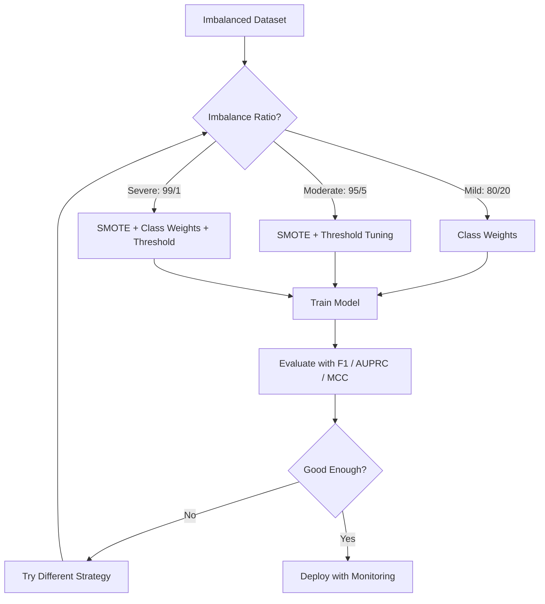
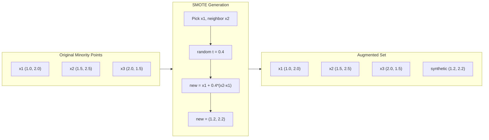
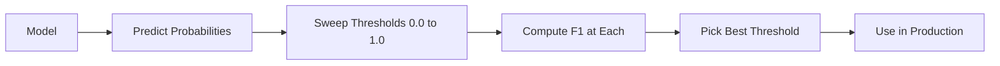
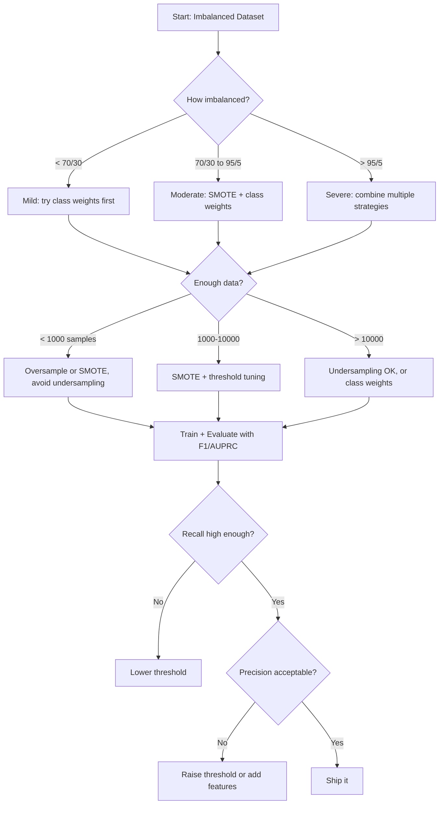

# Traiter les données déséquilibrées
# 处理不平衡数据


> Quand 99% de vos données sont "normales", l'exactitude est un mensonge.

> Lorsque les données de 99% sont "normales", le taux d'exactitude est un mensonge.

**Type:** Build | **类型：** 构建
**Language:**Je suis un Python .**语言：**Python
**Prerequisites:** Phase 2, Lessons 01-09 (especially evaluation metrics) | **前置知识：** Phase 2 第 1-9 课（尤其是评估指标）
**Time:** ~90 minutes | **时间：** 约 90 分钟

## Objectifs d'apprentissage

- Mettre en œuvre SMOTE à partir de zéro et expliquer comment la suréchantillonnage synthétique diffère de la duplication aléatoire
  De zéro réalisation de SMOTE, expliquer la différence entre la synthèse de la sample et la copie au hasard
- Évaluer les classifiants déséquilibrés en utilisant le coefficient de corrélation F1, AUPRC et Matthews au lieu de l'exactitude
  Utilisation de la F1 、AUPRC 和马修斯相关系数 (MCC) 评估不平衡分类器, et non du taux de précision
- Comparer les stratégies de pondération de classe, de réglage des seuils et de reéchantillonnage et choisir la bonne approche pour un ratio de déséquilibre donné
  Comparer les classes de poids, de la valeur et de la répartition des poids, pour une proportion inégale de choix correct
- Construire un pipeline de données complètement déséquilibré qui combine SMOTE, poids de classe et optimisation des seuils
  construire un ensemble de données de SMOTE  classe de poids et de valeur optimale


> **【中文解读】**
> Les données de la catégorie "Inbalance" sont très rares dans les statistiques financières, comme dans les statistiques de la statistique de la statistique de la statistique de la statistique de la statistique de la statistique de la statistique de la statistique de la statistique de la statistique de la statistique de la statistique de la statistique de la statistique de la statistique de la statistique de la statistique de la statistique de la statistique de la statistique de la statistique de la statistique de la statistique de la statistique de la statistique de la statistique de la statistique de la statistique de la statistique de la statistique de la statistique de la statistique de la statistique de la statistique de la statistique de la statistique de la statistique de la statistique de la statistique de la statistique de la statistique de la statistique de la statistique de la statistique de la statistique de la statistique de la statistique de la statistique de la statistique de la statistique de la statistique de la statistique de la statistique de la statistique de la statistique de la statistique de la statistique de la statistique de la statistique de la statistique de la statistique de la statistique de la statistique de la statistique de la statistique de la statistique de la statistique de la statistique de la statistique de la statisti de la statisti de la statisti de la statisti de la statisti de la statisti de la statisti de la statisti de la statisti de la statisti de la statisti de la statisti de la statisti de la statisti de la statisti de la statisti de la statisti de la statisti de la statisti de la statisti de la statisti de la statisti de la statisti de la statisti de la statisti de la statisti de la statisti de la statisti de la statisti de la statisti de la statisti de la statisti de la statisti de la statisti de la statisti de la statisti de la statisti de la statisti de la statisti de la statisti de la statisti de la statisti de la statisti de la statisti de la statisti de la statisti de la statisti de la statisti de la statisti de la statisti de la statisti de la statisti de la statisti de la statisti de la statisti de la statisti de la statisti de la statisti de la statisti de la statisti de la statisti de la statisti de la statisti de la statisti de la statisti de la statisti de la statisti de la statisti de la statisti

> **【拓展：不平衡数据在真实系统中的挑战】**
> PayPal traite quotidiennement environ 4 milliards de transactions, le taux de fraude est de seulement 0,3%, mais chaque jour cela signifie encore environ 120 millions de transactions frauduleuses.

## Le problème , l' introduction du problème

Vous construisez un modèle de détection de fraude, il a une précision de 99,9%, vous célébrez, et vous réalisez qu'il prédit " pas de fraude " pour chaque transaction.

> Vous avez construit un modèle de test de fraude. Il a obtenu un taux d'exactitude de 99,9%.

Il s'agit d'une erreur qui n'est pas une erreur. C'est la chose rationnelle à faire lorsque seulement 0,1% des transactions sont frauduleuses. Le modèle apprend que deviner toujours la classe majoritaire réduit au minimum l'erreur globale. C'est techniquement correct et complètement inutile.

> Ceci n'est pas un bug. Lorsque seulement 0,1% des transactions sont frauduleuses, c'est un comportement raisonnable.

C'est le cas partout où il y a des questions de classification réelles. Diagnostic de maladie: taux positif de 1%. Intrusion au réseau: attaques de 0,01%. défauts de fabrication: 0,5% défectueux. Filtrage de spam: 20% de spam. Prédiction de churn: 5% de churners. Plus la classe minoritaire est conséquente, plus elle a tendance à être rare.

> Ceci se produit dans les lieux où il y a vraiment besoin de catégories. Diagnostication de maladie: 1% taux d'activité. Résultats de l'invasion du réseau: 0.01% attaques.

La précision échoue parce qu'elle traite toutes les prédictions correctes de la même manière. Étiqueter correctement une transaction légitime et attraper correctement la fraude comptent tous deux comme un point de précision. Mais attraper la fraude est la raison entière de l'existence du modèle. Nous avons besoin de mesures, de techniques et de stratégies de formation qui forcent le modèle à prêter attention à la classe rare mais importante.

> 准确率 échoue parce qu'il est égal à tous les prévisions correctes. 正确标记合法交易和正确捕获欺诈率 sont également calculés. 准确率 échoue. 准确率 est une fraction du taux de prévisions. 准确率 est l'un des principaux facteurs de l'existence du modèle.  Nous devons obliger le modèle à se concentrer sur les catégories rares mais importantes d'indicateurs, techniques et stratégies de formation.

> **【中文解读】**
> Le problème central de l'inéquilibre des données: le taux de précision est " mensonge ";; 99,9% le taux de précision est possible à la majorité des catégories; correctement: 1) le changement de paramètre à l'aide de F1 、 AUPRC、 MCC                                                                                                                                                                                                                                                                                                                                                                                                                                                           

## Le concept de base.

### Pourquoi l'exactitude échoue

Considérez un ensemble de données avec 1000 échantillons: 990 négatifs, 10 positifs.

> 考虑一个1000个样本的数据集:990个负样本,10个正样本──一个始终预测负类型的模型:

|  | Predicted Positive | Predicted Negative |
|--|---|---|
| Actually Positive | 0 (TP) | 10 (FN) |
| Actually Negative | 0 (FP) | 990 (TN) |

La précision est de 0 + 990) / 1000 = 99,0%

Le modèle ne détecte aucune fraude, aucune maladie, aucun défaut, mais la précision est de 99%.

> Le modèle a capturé 0 fraudes, 0 maladies, 0 défauts, mais le taux d'exactitude est de 99%.

### Meilleures mesures

**Precision**= TP / (TP + FP). De tout ce qui est marqué comme positif, combien sont-ils réellement?

> **精确率**= TP / (TP + FP) ⋅ parmi tous les échantillons marqués comme positifs, combien sont réellement positifs ?

**Recall**TP / (TP + FN). De tout ce qui est positif, combien avons-nous attrapé ?

> **召回率**= TP / (TP + FN) ⋅ Dans tous les échantillons réels, combien avons-nous capturé ?

**F1 Score**= 2 * précision * rappel / (precision + rappel). La moyenne harmonieuse.

> **F1 分数**= 2 * 精确率 * 召回率 / (精确率 + 召回率) ∼调和平均值──比算术平均值更严厉地惩罚精确率和召回率之间的极端不平衡──

**F-beta Score**= (1 + bêta^2) * précision * rappel / (bêta^2 * précision + rappel). Lorsque bêta > 1, rappel est plus important. Lorsque bêta < 1, la précision est plus importante. F2 est fréquent dans la détection de la fraude (la fraude manquante est pire qu'une fausse alarme).

> **F-beta 分数**= (1 + beta^2) * 精确率 * 召回率 / (beta^2 * 精确率 + 召回率) ・・・ lorsque la bêta > 1 时, le taux de convocation est plus important。 lorsque la bêta < 1 时, le taux d'exactitude est plus important。 F2 在欺诈检测中常用(漏检欺诈比误报更糟)。

**AUPRC**(Area Under Precision-Recall Curve). Comme AUC-ROC mais plus informatif pour les données déséquilibrées. Un classificateur aléatoire a AUPRC égal au taux de classe positive (pas 0,5 comme ROC). Cela facilite la perception des améliorations.

> **AUPRC**(Précision-Callback Rate Curve) ⋅ similaire à AUC-ROC mais avec un volume d'informations plus élevé à l'égard des données déséquilibrées ⋅ AUPRC de l'ordinateur de classe de classe correspond à la proportion de classe normale ⋅ non comme ROC de 0,5) ⋅ ce qui rend les améliorations plus faciles à voir ⋅

**Matthews Correlation Coefficient**= (TP * TN - FP * FN) / sqrt((TP+FP)(TP+FN)(TN+FP)(TN+FN)). Va de -1 à +1. Ne donne un score élevé que lorsque le modèle fonctionne bien sur les deux classes.

> **马修斯相关系数 (MCC)**= (TP * TN - FP * FN) / sqrt((TP+FP)(TP+FN)(TN+FP)(TN+FN))。 la gamme va de -1 à +1── seulement dans les deux catégories les résultats sont bons.

Pour le modèle "prédire toujours négatif" ci-dessus: précision = 0/0 (indéfini, souvent réglé sur 0), rappel = 0/10 = 0, F1 = 0, MCC = 0. Ces mesures identifient correctement le modèle comme sans valeur.

> Pour le modèle "始终预测负类" ci-dessus: précisation = 0/0(未定义, habituellement设为 0), révocation = 0/10 = 0,F1 = 0,MCC = 0──

### Le pipeline de données déséquilibrées



### SMOTE: technique de dépistage des échantillons de la minorité synthétique

Le suréchantillonnage aléatoire duplique les échantillons existants de minorités. Cela fonctionne, mais risque de sur-adapter car le modèle voit à plusieurs reprises les mêmes points.

> Il existe une minorité de modèles existants à copier. Ceci est valable mais il y a un risque de sur-adaptation, car le modèle va voir à nouveau les mêmes points.

SMOTE crée de nouveaux échantillons synthétiques de minorités qui sont plausibles mais pas des copies.

> SMOTE  Créer de nouveaux modèles synthétiques, ils sont raisonnables mais pas secondaires.

1. Pour chaque échantillon minoritaire x, trouvez son voisin le plus proche k parmi les autres échantillons minoritaires
    Pour chaque petit échantillon x, trouver son voisin le plus proche parmi les autres petits échantillons
2. Choisissez un voisin au hasard
   Choisissez un voisin
3. Créez un nouvel échantillon sur le segment de ligne entre x et ce voisin
   Créer un nouveau modèle sur la ligne entre x et le voisin

La formule: `new_sample = x + random(0, 1) * (neighbor - x)`

> 公式:`new_sample = x + random(0, 1) * (neighbor - x)`

Cela interpelle entre des points de minorité réels, créant des échantillons dans la même région de l'espace de fonctionnalités sans simplement copier les données existantes.

> Il s'agit d'une mise en valeur entre une vraie minorité de classes de points, créant des échantillons dans la même région de l'espace caractéristique, et non simplement de copier les données existantes.



### Comparer les stratégies de prélèvement

**Random Oversampling**: dupliquer les échantillons minoritaires pour correspondre au nombre majoritaire.
- Avantages: simple, sans perte d'information
  优点: simple, sans perte d'information
- Cons: les duplicates exactes provoquent un surmatch, augmentent le temps de formation
  缺点: complètement identique vice-dosage conduit à suradapter, augmenter le temps d'entraînement

**Random Undersampling**: supprimer les échantillons majoritaires pour correspondre au nombre de minorités.
- Avantages: entraînement rapide, simple
  优点: entraînement rapide,简单
- Les inconvénients: jeter des données majoritaires potentiellement utiles, plus grande variance
  缺点: abandonner la plupart des données utiles, plus élevé

**SMOTE**: créer des échantillons de minorités synthétiques par interpolation.
- Avantages: génère de nouveaux points de données, réduit le surcodage par rapport à l'échantillonnage aléatoire
  优点: générer de nouveaux points de données, par rapport à l'échantillonnage réduit
- Cons: peut créer des échantillons bruyants près de la limite de décision, ne tient pas compte de la distribution de la classe majoritaire
  缺点: pourrait créer du bruit près de la frontière de la décision, ne pas tenir compte de la majorité des catégories de distribution

| Strategy | Data Changed | Risk | When to Use |
|----------|-------------|------|-------------|
| Oversample | Minority duplicated | Overfitting | Small datasets, moderate imbalance |
| Undersample | Majority removed | Information loss | Large datasets, want fast training |
| SMOTE | Synthetic minority added | Boundary noise | Moderate imbalance, enough minority samples for k-NN |

### Poids de classe

Au lieu de modifier les données, modifiez la façon dont le modèle traite les erreurs.

> Il ne change pas les données, mais modifie la façon dont le modèle traite les erreurs.

Pour un problème binaire avec 950 échantillons négatifs et 50 échantillons positifs:
- Poids pour la classe négative = n_échantillons / (2 * n_négatif) = 1000 / (2 * 950) = 0,526
  负类权重 = n_samples / (2 * n_negatif) = 1000 / (2 * 950) = 0,526
- Poids pour la classe positive = n_échantillons / (2 * n_positif) = 1000 / (2 * 50) = 10,0
  正类权重 = n_samples / (2 * n_positif) = 1000 / (2 * 50) = 10,0

La classe positive a 19 fois le poids. Une mauvaise classification d'un échantillon positif coûte autant que 19 échantillons négatifs.

> L'erreur de classification d'un bon échantillon est égale à l'erreur de classification de 19 échantillons négatifs.

En régression logistique, cela modifie la fonction de perte:

```
weighted_loss = -sum(w_i * [y_i * log(p_i) + (1-y_i) * log(1-p_i)])
```

où w_i dépend de la classe de l'échantillon i.

Les poids de classe sont mathématiquement équivalents à un suréchantillonnage dans l'attente, mais sans créer de nouveaux points de données.

> Le poids des classes est à l'expectative de l'équivalence mathématique, mais ne crée pas de nouveaux points de données. Cela les rend plus rapides et évite le risque de duplication des échantillons.

### Réglage du seuil

La plupart des classifiateurs produisent une probabilité. Le seuil par défaut est de 0,5: si P ((positif) >= 0,5, prédire positif. Mais 0,5 est arbitraire. Lorsque les classes sont déséquilibrées, le seuil optimal est généralement beaucoup plus bas.

> La plupart des catégories ont une probabilité de sortie. La valeur de prédiction est de 0,5. Si P est positive, elle est de 0,5.

Le processus:
1. Formez un modèle
   训练一个模型
2. Obtenez les probabilités prévues sur l'ensemble de validation
   Prévoir des résultats sur les résultats de la recherche
3. Les seuils de balayage de 0,0 à 1,0
   De 0,0 à 1,0                                                                                                                                                                                                                                                                                                                                                                                                                                                                                                                         
4. Comptez F1 (ou votre métrique choisie) à chaque seuil
   Dans chaque valeur calculée F1 ((ou votre choix de l'indicateur)
5. Choisissez le seuil qui maximize votre métrique
   选择最大化你的指标的值



Un modèle peut produire P ((fraude) = 0,15 pour une transaction frauduleuse. Au seuil 0,5, cela est classé comme ne pas être frauduleux. Au seuil 0,10, il est correctement capturé. L'étalonnage de probabilité compte moins que le classement - tant que la fraude a des probabilités plus élevées que la non-fraude, il existe un seuil qui les sépare.

> Le modèle peut être utilisé pour une transaction frauduleuse P (fraude) = 0,15♦, qui est classé comme non frauduleux♦, qui est classé comme non frauduleux♦, qui est correctement capturé♦, la probabilité de réussite est importante, tant que la probabilité d'obtenir une fraude est plus élevée que la non frauduleuse, il existe une valeur qui peut les séparer♦.

### Un apprentissage peu coûteux

Généralisation des poids de classe: au lieu de coûts uniformes, attribuer des coûts de classification erronée spécifiques:

> 类权重的推广──不使用统一代价,而是分配特定的误分类代价:

| | Predict Positive | Predict Negative |
|--|---|---|
| Actually Positive | 0 (correct) | C_FN = 100 |
| Actually Negative | C_FP = 1 | 0 (correct) |

Le manque d'une transaction frauduleuse (FN) coûte 100 fois plus cher qu'une fausse alarme (FP).

> Le prix d'une transaction frauduleuse est de 100 fois supérieur à celui d'une transaction frauduleuse.

C'est l'approche la plus fondée sur les principes pour estimer les coûts réels. Un diagnostic de cancer manqué a un coût très différent d'une fausse alarme qui conduit à une biopsie supplémentaire.

> C'est la méthode la plus efficace pour estimer le coût du monde réel. Le coût du cancer non diagnostiqué est nettement différent de celui des erreurs de diagnostic de survie.

### Tableau de débit des décisions



## Construisez-le et mettez-le en œuvre.

> **【中文解读】**
> De zéro réalisation SMOTE (synthèse de la minorité de classes passées par l'échantillonnage technique): pour chaque petit échantillon, trouver son voisin le plus proche, générer de nouveaux échantillons de synthèse à la fois en ligne et en ligne.

> **【拓展：工业级不平衡数据处理的高级技术】**
> Dans le cadre du contrôle financier réel, la stratégie de traitement des données déséquilibrées est plus complexe que SMOTE: utiliser la perte de concentration, faire en sorte que le modèle se concentre davantage sur la difficulté de décomposition)  deux étapes de formation  d'abord en utilisant la formation de prélèvement, de nouveau en utilisant les données originales  apprentissage sensible aux coûts  de la fraude à 100 fois plus que la transaction normale  de Square  de Square  de Square Inc.
```figure
class-imbalance
```

## Faites-le

### Étape 1: Générer un ensemble de données déséquilibré

```python
import numpy as np


def make_imbalanced_data(n_majority=950, n_minority=50, seed=42):
    rng = np.random.RandomState(seed)

    X_maj = rng.randn(n_majority, 2) * 1.0 + np.array([0.0, 0.0])
    X_min = rng.randn(n_minority, 2) * 0.8 + np.array([2.5, 2.5])

    X = np.vstack([X_maj, X_min])
    y = np.concatenate([np.zeros(n_majority), np.ones(n_minority)])

    shuffle_idx = rng.permutation(len(y))
    return X[shuffle_idx], y[shuffle_idx]
```

### Étape 2: SMOTE à partir de zéro

```python
def euclidean_distance(a, b):
    return np.sqrt(np.sum((a - b) ** 2))


def find_k_neighbors(X, idx, k):
    distances = []
    for i in range(len(X)):
        if i == idx:
            continue
        d = euclidean_distance(X[idx], X[i])
        distances.append((i, d))
    distances.sort(key=lambda x: x[1])
    return [d[0] for d in distances[:k]]


def smote(X_minority, k=5, n_synthetic=100, seed=42):
    rng = np.random.RandomState(seed)
    n_samples = len(X_minority)
    k = min(k, n_samples - 1)
    synthetic = []

    for _ in range(n_synthetic):
        idx = rng.randint(0, n_samples)
        neighbors = find_k_neighbors(X_minority, idx, k)
        neighbor_idx = neighbors[rng.randint(0, len(neighbors))]
        t = rng.random()
        new_point = X_minority[idx] + t * (X_minority[neighbor_idx] - X_minority[idx])
        synthetic.append(new_point)

    return np.array(synthetic)
```

### Étape 3: Prélèvement aléatoire de suréchantillonnage et de sous-échantillonnage

```python
def random_oversample(X, y, seed=42):
    rng = np.random.RandomState(seed)
    classes, counts = np.unique(y, return_counts=True)
    max_count = counts.max()

    X_resampled = list(X)
    y_resampled = list(y)

    for cls, count in zip(classes, counts):
        if count < max_count:
            cls_indices = np.where(y == cls)[0]
            n_needed = max_count - count
            chosen = rng.choice(cls_indices, size=n_needed, replace=True)
            X_resampled.extend(X[chosen])
            y_resampled.extend(y[chosen])

    X_out = np.array(X_resampled)
    y_out = np.array(y_resampled)
    shuffle = rng.permutation(len(y_out))
    return X_out[shuffle], y_out[shuffle]


def random_undersample(X, y, seed=42):
    rng = np.random.RandomState(seed)
    classes, counts = np.unique(y, return_counts=True)
    min_count = counts.min()

    X_resampled = []
    y_resampled = []

    for cls in classes:
        cls_indices = np.where(y == cls)[0]
        chosen = rng.choice(cls_indices, size=min_count, replace=False)
        X_resampled.extend(X[chosen])
        y_resampled.extend(y[chosen])

    X_out = np.array(X_resampled)
    y_out = np.array(y_resampled)
    shuffle = rng.permutation(len(y_out))
    return X_out[shuffle], y_out[shuffle]
```

### Étape 4: Régression logistique avec poids de classe

```python
def sigmoid(z):
    return 1.0 / (1.0 + np.exp(-np.clip(z, -500, 500)))


def logistic_regression_weighted(X, y, weights, lr=0.01, epochs=200):
    n_samples, n_features = X.shape
    w = np.zeros(n_features)
    b = 0.0

    for _ in range(epochs):
        z = X @ w + b
        pred = sigmoid(z)
        error = pred - y
        weighted_error = error * weights

        gradient_w = (X.T @ weighted_error) / n_samples
        gradient_b = np.mean(weighted_error)

        w -= lr * gradient_w
        b -= lr * gradient_b

    return w, b


def compute_class_weights(y):
    classes, counts = np.unique(y, return_counts=True)
    n_samples = len(y)
    n_classes = len(classes)
    weight_map = {}
    for cls, count in zip(classes, counts):
        weight_map[cls] = n_samples / (n_classes * count)
    return np.array([weight_map[yi] for yi in y])
```

### Étape 5: réglage du seuil

```python
def find_optimal_threshold(y_true, y_probs, metric="f1"):
    best_threshold = 0.5
    best_score = -1.0

    for threshold in np.arange(0.05, 0.96, 0.01):
        y_pred = (y_probs >= threshold).astype(int)
        tp = np.sum((y_pred == 1) & (y_true == 1))
        fp = np.sum((y_pred == 1) & (y_true == 0))
        fn = np.sum((y_pred == 0) & (y_true == 1))

        if metric == "f1":
            precision = tp / (tp + fp) if (tp + fp) > 0 else 0.0
            recall = tp / (tp + fn) if (tp + fn) > 0 else 0.0
            score = 2 * precision * recall / (precision + recall) if (precision + recall) > 0 else 0.0
        elif metric == "recall":
            score = tp / (tp + fn) if (tp + fn) > 0 else 0.0
        elif metric == "precision":
            score = tp / (tp + fp) if (tp + fp) > 0 else 0.0

        if score > best_score:
            best_score = score
            best_threshold = threshold

    return best_threshold, best_score
```

### Étape 6: Fonctions d'évaluation

```python
def confusion_matrix_values(y_true, y_pred):
    tp = np.sum((y_pred == 1) & (y_true == 1))
    tn = np.sum((y_pred == 0) & (y_true == 0))
    fp = np.sum((y_pred == 1) & (y_true == 0))
    fn = np.sum((y_pred == 0) & (y_true == 1))
    return tp, tn, fp, fn


def compute_metrics(y_true, y_pred):
    tp, tn, fp, fn = confusion_matrix_values(y_true, y_pred)
    accuracy = (tp + tn) / (tp + tn + fp + fn)
    precision = tp / (tp + fp) if (tp + fp) > 0 else 0.0
    recall = tp / (tp + fn) if (tp + fn) > 0 else 0.0
    f1 = 2 * precision * recall / (precision + recall) if (precision + recall) > 0 else 0.0

    denom = np.sqrt(float((tp + fp) * (tp + fn) * (tn + fp) * (tn + fn)))
    mcc = (tp * tn - fp * fn) / denom if denom > 0 else 0.0

    return {
        "accuracy": accuracy,
        "precision": precision,
        "recall": recall,
        "f1": f1,
        "mcc": mcc,
    }
```

### Étape 7: Comparer toutes les approches

```python
X, y = make_imbalanced_data(950, 50, seed=42)
split = int(0.8 * len(y))
X_train, X_test = X[:split], X[split:]
y_train, y_test = y[:split], y[split:]

# Baseline: no treatment
w_base, b_base = logistic_regression_weighted(
    X_train, y_train, np.ones(len(y_train)), lr=0.1, epochs=300
)
probs_base = sigmoid(X_test @ w_base + b_base)
preds_base = (probs_base >= 0.5).astype(int)

# Oversampled
X_over, y_over = random_oversample(X_train, y_train)
w_over, b_over = logistic_regression_weighted(
    X_over, y_over, np.ones(len(y_over)), lr=0.1, epochs=300
)
preds_over = (sigmoid(X_test @ w_over + b_over) >= 0.5).astype(int)

# SMOTE
minority_mask = y_train == 1
X_minority = X_train[minority_mask]
synthetic = smote(X_minority, k=5, n_synthetic=len(y_train) - 2 * int(minority_mask.sum()))
X_smote = np.vstack([X_train, synthetic])
y_smote = np.concatenate([y_train, np.ones(len(synthetic))])
w_sm, b_sm = logistic_regression_weighted(
    X_smote, y_smote, np.ones(len(y_smote)), lr=0.1, epochs=300
)
preds_smote = (sigmoid(X_test @ w_sm + b_sm) >= 0.5).astype(int)

# Class weights
sample_weights = compute_class_weights(y_train)
w_cw, b_cw = logistic_regression_weighted(
    X_train, y_train, sample_weights, lr=0.1, epochs=300
)
probs_cw = sigmoid(X_test @ w_cw + b_cw)
preds_cw = (probs_cw >= 0.5).astype(int)

# Threshold tuning (tune on held-out validation set, not test set)
probs_val = sigmoid(X_val @ w_cw + b_cw)
best_thresh, best_f1 = find_optimal_threshold(y_val, probs_val, metric="f1")
preds_thresh = (probs_cw >= best_thresh).astype(int)
```

Le fichier de code exécute tout cela dans un seul script et imprime les résultats.

> Le code-fichier fonctionne dans un seul script et imprime les résultats.

## Utilisez-le avec le cadre de réalisation

Avec le scikit-apprentissage et le déséquilibre-apprentissage, ces techniques sont un-liners:

> Utilisez un peu d'apprentissage et un peu d'apprentissage déséquilibré, ces techniques ne nécessitent qu'une ligne de code:

```python
from sklearn.linear_model import LogisticRegression
from sklearn.metrics import classification_report, f1_score
from sklearn.model_selection import train_test_split
from imblearn.over_sampling import SMOTE
from imblearn.under_sampling import RandomUnderSampler
from imblearn.pipeline import Pipeline

X_train, X_test, y_train, y_test = train_test_split(X, y, stratify=y)

model_weighted = LogisticRegression(class_weight="balanced")
model_weighted.fit(X_train, y_train)
print(classification_report(y_test, model_weighted.predict(X_test)))

smote = SMOTE(random_state=42)
X_resampled, y_resampled = smote.fit_resample(X_train, y_train)
model_smote = LogisticRegression()
model_smote.fit(X_resampled, y_resampled)
print(classification_report(y_test, model_smote.predict(X_test)))

pipeline = Pipeline([
    ("smote", SMOTE()),
    ("model", LogisticRegression(class_weight="balanced")),
])
pipeline.fit(X_train, y_train)
print(classification_report(y_test, pipeline.predict(X_test)))
```

Les implémentations à partir de zéro montrent exactement ce que chaque technique fait. SMOTE est juste une interpolation k-NN sur la classe minoritaire. Les poids de classe multiplient la perte.

> De la réalisation à zéro, le rôle de chaque technique est démontré.

## Envoyez-le . Produit .

Cette leçon donne:
- `outputs/skill-imbalanced-data.md`-- une liste de contrôle des décisions pour gérer les problèmes de classification déséquilibrés

## Les exercices

1. **Borderline-SMOTE**: modifier la mise en œuvre de SMOTE pour ne générer que des échantillons synthétiques pour les points minoritaires proches de la limite de décision (ceux dont les voisins k-proches comprennent des échantillons de classes majoritaires).
   1. Il s'agit d'un groupe de données qui se compose de la plupart des groupes de données de la classe de formation de la classe de formation de formation de formation professionnelle.

2. **Cost matrix optimization**: mettre en œuvre un apprentissage sensible aux coûts où la matrice de coûts est un paramètre. Créer une fonction qui prend une matrice de coûts et renvoie des prédictions optimales qui minimisent les coûts attendus. Testez avec différents rapports de coûts (1:10, 1:100, 1:1000) et tracez comment le compromis de rappel de précision change.
   2. Dans le même ensemble de données, comparer avec le SMOTE et le SMOTE, démontrer que le SMOTE produit de meilleures limites de décision.

3. **Threshold calibration**: mettre en œuvre l'échelle de plaques (adapter une régression logistique sur les sorties brutes du modèle pour produire des probabilités calibrées). Comparer la courbe de rappel de précision avant et après l'étalonnage.
   3.  Value de réglage  Optimisation: pour la probabilité de sortie de la logique de retour, analysez la valeur de  0.01 à 0.99, trouvez la valeur de  F1 la plus élevée ── montrer qu'elle est en valeur par défaut  0.5 très peu 

4. **Ensemble with balanced bagging**: entraîner plusieurs modèles, chacun sur un échantillon de démarrage équilibré (toutes les minorités + sous-ensemble aléatoire de la majorité). Avertir leurs prédictions. Comparer cette approche à un seul modèle avec SMOTE. Mesurer à la fois la performance et la variance entre les courses.
   4. 构建完整管线:SMOTE -> 标准化 -> 逻辑归归(class_weight='balanced')-> 值优化──比较管线中移除任一步的性能下降──

5. **Imbalance ratio experiment**Pour chaque rapport, entraînez avec et sans SMOTE. Le ratio F1 contre le ratio de déséquilibre pour les deux approches.

> **【中文解读】**
> 1) évaluer les indicateurs de référence à l'aide de F1/AUPRC/MCC; 2) peser sur les données de la minorité ou de la majorité des données; 3) donner plus de pouvoir à la minorité dans la fonction de perte de données; 4) modifier la valeur de la classe moyenne;

> **【拓展：Focal Loss——深度学习中的不平衡数据解决方案】**
> L'idée principale de l'étude est de réduire le poids de perte de l'échantillon facilement, en faisant en sorte que le modèle se concentre sur le " difficile " échantillon.

## Les termes clés

| Term | What people say | What it actually means |
|------|----------------|----------------------|
| Class imbalance | "One class has way more samples" | The distribution of classes in the dataset is significantly skewed, causing models to favor the majority class |
| SMOTE | "Synthetic oversampling" | Creates new minority samples by interpolating between existing minority samples and their k-nearest minority neighbors |
| Class weights | "Making errors on rare classes more expensive" | Multiplying the loss function by class-specific weights so the model penalizes minority misclassification more heavily |
| Threshold tuning | "Moving the decision boundary" | Changing the probability cutoff for classification from the default 0.5 to a value that optimizes the desired metric |
| Precision-recall tradeoff | "You cannot have both" | Lowering the threshold catches more positives (higher recall) but also flags more false positives (lower precision), and vice versa |
| AUPRC | "Area under the PR curve" | Summarizes the precision-recall curve into a single number; more informative than AUC-ROC when classes are heavily imbalanced |
| Matthews Correlation Coefficient | "The balanced metric" | A correlation between predicted and actual labels that produces a high score only when the model performs well on both classes |
| Cost-sensitive learning | "Different mistakes cost different amounts" | Incorporating real-world misclassification costs into the training objective so the model optimizes for total cost, not error count |
| Random oversampling | "Duplicate the minority" | Repeating minority class samples to balance class counts; simple but risks overfitting to duplicated points |

## Encore une lecture

- [SMOTE: Synthetic Minority Over-sampling Technique (Chawla et al., 2002)](https://arxiv.org/abs/1106.1813)-- le document original de SMOTE, toujours le travail le plus cité sur l'apprentissage déséquilibré
  [Chawla et al.: SMOTE (2002)](https://arxiv.org/abs/1106.1813)- SMOTE
- [Learning from Imbalanced Data (He & Garcia, 2009)](https://ieeexplore.ieee.org/document/5128907)-- enquête globale couvrant les approches d'échantillonnage, de coûts et d'algorithmes
  [He & Garcia: Learning from Imbalanced Data (2009)](https://link.springer.com/article/10.1007/s10115-008-0164-4)- déséquilibre de l'apprentissage
- [imbalanced-learn documentation](https://imbalanced-learn.org/stable/)-- bibliothèque Python avec des variantes SMOTE, des stratégies de sous-échantillonnage et une intégration de pipeline
  [imbalanced-learn 文档](https://imbalanced-learn.org/)- Python déséquilibré
- [The Precision-Recall Plot Is More Informative than the ROC Plot (Saito & Rehmsmeier, 2015)](https://journals.plos.org/plosone/article?id=10.1371/journal.pone.0118432)-- quand et pourquoi préférer les courbes de relations publiques aux courbes de ROC pour les problèmes de déséquilibre
