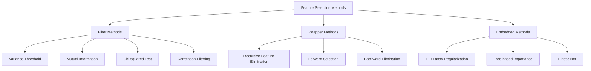
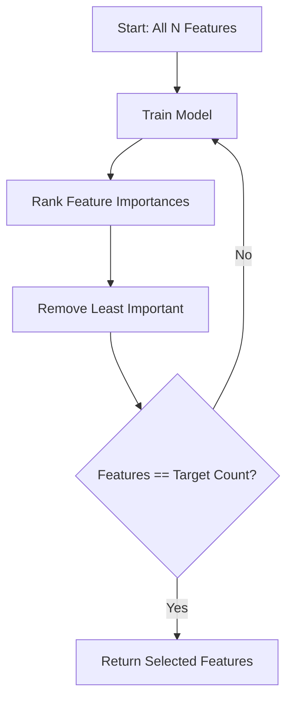
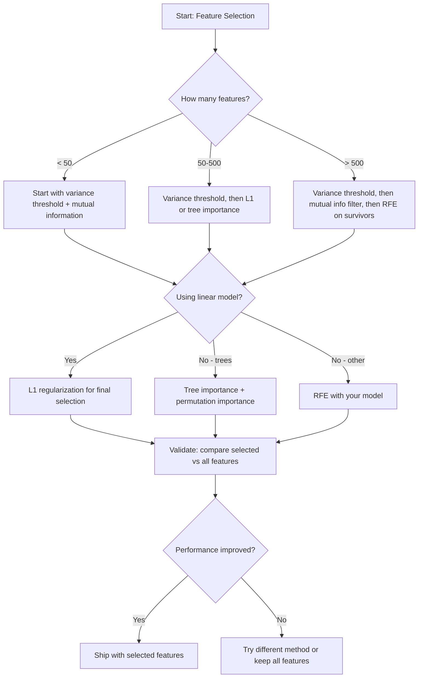

# Sélection de fonctionnalités
# Caractéristiques de sélection


> Plus de fonctionnalités ne sont pas meilleures.

> Le caractère n'est pas plus beau.

**Type:** Build | **类型：** 构建
**Language:**Je suis un Python .**语言：**Python
**Prerequisites:** Phase 2, Lessons 01-09, 08 (feature engineering) | **前置知识：** Phase 2 第 1-9 课、第 8 课（特征工程）
**Time:** ~75 minutes | **时间：** 约 75 分钟

## Objectifs d'apprentissage

- Mettre en œuvre des méthodes de filtrage (poids de variance, information mutuelle, chi-quadré) et des méthodes d'emballage (RFE, sélection avancée) à partir de zéro
  De la réalisation de la technique de la réception et de l'emballage de la réception.
- Expliquer pourquoi les informations mutuelles capturent des relations non linéaires entre caractéristiques et cibles qui manquent de corrélation
  Expliquer pourquoi les informations interpersonnelles peuvent capturer la connectivité des traits non-lineaires des relations cibles
- Comparer la régularisation de L1 (sélection intégrée) avec la RFE (sélection d'emballage) et évaluer leurs compromis informatiques
  Comparer L1 正则化 (嵌入选择) avec RFE (包装选择), évaluer leur calcul
- Construire un pipeline de sélection de fonctionnalités qui combine plusieurs méthodes et démontrer une généralisation améliorée sur les données conservées
  Construire des lignes de sélection de caractéristiques de plusieurs méthodes, démontrant des améliorations généralisées sur les données laissées


> **【中文解读】**
> Les caractéristiques de sélection parmi de nombreuses caractéristiques sont les plus utiles.

> **【拓展：特征选择在工业界的重要性】**
> Dans le modèle de contrôle des finances, le modèle de régulation peut être expliqué doit être capable d'expliquer pourquoi chaque caractéristique est choisie L1 Lasu doit être automatiquement réduite à zéro, tout en réalisant la sélection des caractéristiques et l'entraînement des modèles Dans l'analyse de l'expression génétique, 50 gènes clés ont été sélectionnés parmi 20 000 gènes non seulement pour améliorer les performances du modèle, mais aussi pour la recherche sur les mécanismes de maladie.

## Le problème , l' introduction du problème

Vous avez 500 fonctionnalités, votre modèle s'entraîne lentement, surcharge constamment, et personne ne peut expliquer ce qu'il a appris. Vous ajoutez plus de fonctionnalités dans l'espoir d'améliorer les performances.

> Vous avez 500 caractéristiques. Le modèle s'entraîne lentement, continue à s'adapter, personne ne peut expliquer ce qu'il a appris.

C'est la malédiction de la dimensionnalité en action. Au fur et à mesure que le nombre de caractéristiques augmente, le volume de l'espace de caractéristiques explose. Les points de données deviennent rares. Les distances entre les points convergent. Le modèle a besoin de plus de données exponentiellement pour trouver des motifs réels. Les caractéristiques sonores étouffent les caractéristiques du signal.

> C'est le fonctionnement réel de la dimension maléfique. Avec l'augmentation du nombre de caractéristiques, l'explosion de la masse des caractéristiques spatiales. Les points de données deviennent rares. La distance entre les points devient tendance. Le modèle a besoin de plus de données pour trouver le modèle réel.

La sélection des caractéristiques est l'antidote. Débarrassez-vous du bruit. Éliminez la redondance. Conservez les caractéristiques qui contiennent des informations réelles sur la cible. Le résultat: une formation plus rapide, une meilleure généralisation et des modèles que vous pouvez réellement expliquer.

> Traits de sélection sont des solutions. Éliminer le bruit. Éliminer le redoublement. Rester les caractéristiques qui portent réellement l'information cible.

L'objectif n'est pas d'utiliser toutes les informations disponibles, mais de les utiliser correctement.

> L'objectif n'est pas d'utiliser toutes les informations disponibles, mais d'utiliser les informations exactes.

> **【中文解读】**
> Les trois types de méthodes sont différents: la méthode de sélection des caractéristiques (façade de différence, valeur de l'information, expérience de l'information, expérience de l'information) la plus rapide mais négligeante de l'interaction entre les caractéristiques; la méthode d'emballage (façade de la réaction des caractéristiques); la méthode de sélection des caractéristiques (façade des caractéristiques, mais coût de calcul élevé; la méthode d'intégration (importance des caractéristiques de la mise en valeur des caractéristiques du modèle de bois) la méthode de sélection automatique des caractéristiques, le meilleur équilibre entre efficacité et efficacité dans le processus de formation; l'information mutuelle peut capturer des relations non linéaires, plus complètement que les relations liées.

## Le concept de base.

### Trois catégories de sélection de fonctionnalités

Chaque méthode de sélection de caractéristiques se classe dans une des trois catégories:

> Chaque méthode de sélection des caractéristiques appartient à l'une des trois catégories suivantes:



**Filter methods**Ils ne font pas appel à un modèle, mais ils manquent d'interactions.

> **过滤法**Utilisation de la statistique indépendamment de chaque caractéristique de la notation.

**Wrapper methods**Ils utilisent les performances du modèle comme score.

> **包装法**Le modèle d'entraînement est utilisé pour évaluer les caractéristiques du groupe.

**Embedded methods**Les caractéristiques de la sélection sont déterminées par la régulation de l'élément L1 et la régulation de l'élément L1 entraîne une réduction des poids à zéro.

> **嵌入法**Dans le processus de formation du modèle, la sélection des caractéristiques. L1 L1 L1 L1 L1 L1 L1 L1 L1 L1 L1 L1 L1 L1 L1 L1 L1 L1 L1 L1 L1 L1 L1 L1 L1 L1 L1 L1 L1 L1 L1 L1 L1 L1 L1 L1 L1 L1 L1 L1 L1 L1 L1 L1 L1 L1 L1 L1 L1 L1 L1 L1 L1 L1 L1 L1 L1 L1 L1 L1 L1 L1 L1 L1 L1 L1 L1 L1 L1 L1 L1 L1 L1 L2 L2 L2 L2 L2 L2 L2 L2 L2 L2 L2 L2 L2 L2 L2 L2 L2 L2 L2 L2 L2 L2 L2 L2 L2 L2 L2 L2 L2 L2 L2 L2 L2 L2 L2 L2 L2 L2 L2 L2 L2 L2 L2 L2 L2 L2 L2 L2 L2 L2 L2 L2 L2 L2 L2 L2 L2 L2 L2 L2 L2 L2 L2 L2 L2 L2 L2 L2 L2 L2 L2 L2 L2 L2 L2 L2 L2 L2 L2 L2 L2 L2 L2 L2 L2 L2 L2 L2 L2 L2 L2 L2 L2 L2 L2 L2 L2 L2 L2 L2 L2 L2 L2 L2 L2 L2 L2 L2 L2 L2 L2 L2 L2 L2 L2 L2 L2 L2 L2 L2 L2 L2 L2 L2 L2 L2 L2 L2 L2 L2 L2 L2 L2 L2 L2 L2 L2 L2 L2 L2 L2 L2 L2 L2 L2 L2 L2 L2 L2 L2 L2 L2 L2 L2 L2 L2 L2 L2 L2 L2 L2 L2 L2 L2 L2 L2 L2 L2 L2 L2 L2 L2 L2 L

### Un seuil de variation

Si une caractéristique varie à peine entre les échantillons, elle ne contient presque aucune information.

> Si une caractéristique dans l'échantillon est presque inchangée, elle ne contient presque aucun message.

Considérez une caractéristique qui est 0,0 pour 999 sur 1000 échantillons. Sa variance est proche de zéro. Aucun modèle ne peut l'utiliser pour distinguer entre les classes.

> ⋅ considérer une caractéristique de 999 de 1000 échantillons de 0,0 ⋅ la différence de la surface est proche de zéro ⋅ aucun modèle ne peut l'utiliser pour distinguer les catégories ⋅ le déplacer ⋅

```
variance(x) = mean((x - mean(x))^2)
```

Définir un seuil (par exemple, 0,01). Débarrasser chaque fonctionnalité avec une variance en dessous de celui-ci. Cela supprime les fonctionnalités constantes ou quasi constantes sans regarder la variable cible du tout.

> 设置一个值(如0.01)──删除方差于该值的每个特征──这完全不需要看目标变量就能移除常量或近常量的特征──

Quand utiliser: comme une étape de préprocessage avant d'autres méthodes.

> Quelques années plus tard, les entreprises ont été en mesure de réaliser des travaux de réparation de la surface de l'eau.

Limitation: une caractéristique peut avoir une grande variance et être purement bruyante.

> Limitation: une caractéristique peut avoir une différence de haute fréquence mais reste un bruit pur.

### Informations mutuelles

L'information mutuelle mesure à quel point la connaissance de la valeur de la fonctionnalité X réduit l'incertitude concernant la cible Y.

> 互信息衡量知道特征 X's value can be reduced to a great extent to the uncertainty of the target Y's:

```
I(X; Y) = sum_x sum_y p(x, y) * log(p(x, y) / (p(x) * p(y)))
```

Si X et Y sont indépendants, p(x, y) = p(x) * p(y), alors le terme log est zéro et I(X; Y) = 0. Plus X vous dit sur Y, plus l'information mutuelle est élevée.

> Si X 和 Y 独立,p(x,y) = p(x) * p(y), alors pour le nombre d'éléments pour zéro,I(X;Y) = 0。X 告诉你关于Y的信息越多,互信息越高。

Un élément peut avoir une corrélation zéro avec la cible, mais une information mutuelle élevée parce que la relation est quadratique ou périodique.

> Par rapport à la relation, les principaux avantages sont: l'interinformation capture des relations non-lineaires. Une relation de caractère peut être nulle avec l'objectif, mais, comme la relation est secondaire ou périodique, l'interinformation est très élevée.

Pour les caractéristiques continues, discrétionnez-les en poubelles d'abord (estimation basée sur l'histogramme). Le nombre de poubelles affecte l'estimation - trop peu de poubelles perdent de l'information, trop de poubelles ajoutent du bruit. Un choix courant: sqrt(n) poubelles ou la règle de Sturges (1 + log2(n)).

> Pour les caractéristiques de la continuité, la première séparation en boîtes est basée sur une estimation du diagramme direct.


### Élimination de la caractéristique récursive (RFE)

RFE est une méthode d'emballage. Elle utilise l'importance des caractéristiques d'un modèle pour tailler à plusieurs reprises:

> RFE est un mode d'emballage. Il utilise les caractéristiques du modèle pour découper les branches:

1. Formez le modèle avec toutes les caractéristiques
   Utilisez tous les traits de la formation
2. Caractéristiques de rang par importance (coefficients pour les modèles linéaires, réduction des impuretés pour les arbres)
   按重要性排列特征 (en fonction de l'importance de la ligne, la pureté du modèle est réduite)
3. Supprimer les éléments les moins importants
   Élimination des caractéristiques les plus insignifiantes
4. Répétez jusqu'à ce que le nombre de fonctionnalités souhaité reste
   重复 jusqu'à ce que le nombre de caractéristiques nécessaires restant



La RFE considère les interactions de fonctionnalités parce que le modèle voit toutes les fonctionnalités restantes ensemble.

> RFE 考虑特征交互, car le modèle voit tous les traits restants ensemble. Le retrait d'un trait modifie l'importance des autres traits.

Le coût: vous entraînez le modèle N - temps cible. Avec 500 fonctionnalités et un objectif de 10, c'est 490 séries de formation. Pour les modèles coûteux, c'est lent. Vous pouvez l'accélérer en supprimant plusieurs fonctionnalités par étape (par exemple, supprimer le 10% inférieur à chaque tour).

> 代价:You need to train model N - 目标 次数──500 个特征和目标 10 个,就是 490 个训练── Pour un modèle coûteux, c'est très lent── vous pouvez dégager plusieurs caractéristiques à chaque étape pour accélérer la dégagement de la partie inférieure de la roue (comme 10%)──

### L1 (Lasso) Régularisation

La régulation L1 ajoute la valeur absolue des poids à la fonction de perte:

```
loss = prediction_error + alpha * sum(|w_i|)
```

L'alpha contrôle la taille des caractéristiques, plus élevée signifie que plus de poids atteignent exactement zéro.

> Alpha paramètres de contrôle caractéristique de la branche coupée degré de stimulation.

Pourquoi exactement zéro ? La pénalité L1 crée une région de contrainte en forme de diamant dans l'espace de poids. La solution optimale tend à atterrir dans un coin de ce diamant, où un ou plusieurs poids sont zéro. La régulation L2 (ridge) crée une contrainte circulaire où les poids se rattrapent mais atteignent rarement zéro.

> Pourquoi exactement pour zéro ?L1 惩罚 dans l'espace de poids créer une zone de contrainte en forme de poids. Le meilleur résultat est de tomber sur un coin de forme de poids, où un ou plusieurs poids sont à zéro.L2 correctement.

Il s'agit d'une sélection intégrée de caractéristiques: le modèle apprend au cours de la formation quelles caractéristiques ignorer.

> C'est le choix des caractéristiques de l'intégration: le modèle est en train d'apprendre à ignorer quelles caractéristiques sont en train d'être entraînées.

Avantages: une seule course de formation, des fonctionnalités corrélatives (choisir un et les autres zéros), intégrées à la plupart des mises en œuvre de modèles linéaires.

> 优势:单次训练运行,处理相关特征(选择一个并将其他置零),内置于大多数线性模型实现中──

Limitation: fonctionne uniquement pour les modèles linéaires.

> Limitation: uniquement applicable au modèle linéaire.

### L'importance de la caractéristique d'un arbre

Les arbres de décision et leurs ensembles (forêts aléatoires, augmentation des gradients) classent naturellement les caractéristiques.

> 决策树及其集成 (随机森林,梯度升级) naturellement à la catégorie des caractéristiques.

Pour une forêt aléatoire avec des arbres T:

```
importance(feature_j) = (1/T) * sum over all trees of
    sum over all nodes splitting on feature_j of
        (n_samples * impurity_decrease)
```

Cela donne un score d'importance normalisé pour chaque fonctionnalité.

> Il donne un nombre important de la répartition de chaque caractéristique. Il traite automatiquement les relations non linéaires et les interactions de caractéristiques.

Attention: l'importance basée sur l'arbre est biaisée vers des caractéristiques avec de nombreuses valeurs uniques (haute cardinalité). Une colonne d'identification aléatoire apparaîtra importante car elle divise parfaitement chaque échantillon.

> Note: l'importance du modèle de bois est orientée vers de nombreuses caractéristiques de valeur unique.

### Importance de la permutation

Une méthode agnostique modèle:

> Une méthode sans rapport avec le modèle:

1. Former le modèle et enregistrer les performances de référence sur les données de validation
   训练模型并记录 la performance de base de données de vérification
2. Pour chaque fonction: mélanger ses valeurs au hasard, mesurer la baisse de performance
   Pour chaque caractéristique: à mesure que la valeur est perturbée, les performances de mesure diminuent.
3. Plus la goutte est grande, plus la fonctionnalité est importante
   La baisse est plus importante.

Si le mélange d'une fonctionnalité ne nuit pas à la performance, le modèle n'en dépend pas.

> Si un trait ne perturbe pas les performances, le modèle ne dépend pas de lui. Si les performances s'effondrent, ce trait est essentiel.

L'importance de la permution évitera le biais de la cardinalité de l'importance basée sur l'arbre. Mais elle est lente: une évaluation complète par caractéristique, répétée plusieurs fois pour la stabilité.

> L'importance de la substitution évitera les différences de base de l'importance du modèle de bois. Mais elle est lente: chaque caractéristique doit être évaluée une fois, et la stabilité doit être répétée plusieurs fois.

### Tableau de comparaison

| Method | Type | Speed | Nonlinear | Feature Interactions |
|--------|------|-------|-----------|---------------------|
| Variance threshold | Filter | Very fast | No | No |
| Mutual information | Filter | Fast | Yes | No |
| Correlation filter | Filter | Fast | No | No |
| RFE | Wrapper | Slow | Depends on model | Yes |
| L1 / Lasso | Embedded | Fast | No (linear) | No |
| Tree importance | Embedded | Medium | Yes | Yes |
| Permutation importance | Model-agnostic | Slow | Yes | Yes |

### Tableau de débit des décisions



## Construisez-le et mettez-le en œuvre.

> **【中文解读】**
> De la réalisation de zéro trois types de caractéristiques sélectionnement méthode: 过法(方差值、互信息、卡方检查独立评估每个特征) 包装法(递归特征消除RFE反复训练模型消除最不重要特征) 嵌入法(L1 正规化 Lasso训练时自动将不重要特征权重压缩为零) ⋅通过合成数据(已知哪些特征有用) 验证各方法的效果──

> **【拓展：特征选择在 LLM 时代的新意义】**
> Bien que l'apprentissage en profondeur soit appelé " caractéristique d'apprentissage automatique ", le choix de caractéristiques reste essentiel dans les scénarios suivants: 1) le choix de caractéristiques de données peut améliorer les performances et la vitesse de formation de XGBoost / LightGBM; 2) les exigences explicatives requises dans les domaines médical et financier pour expliquer quelles caractéristiques sont utilisées; 3) l'intégration dans l'espace même en transformateur, nécessite également une " sélection de caractéristiques " intégrée dans le mécanisme de l'attention.
```figure
f3-feature-prune
```

## Faites-le

### Étape 1: Générer des données synthétiques avec une structure de fonctionnalités connue

```python
import numpy as np


def make_feature_selection_data(n_samples=500, seed=42):
    rng = np.random.RandomState(seed)

    x1 = rng.randn(n_samples)
    x2 = rng.randn(n_samples)
    x3 = rng.randn(n_samples)
    x4 = x1 + 0.1 * rng.randn(n_samples)
    x5 = x2 + 0.1 * rng.randn(n_samples)

    informative = np.column_stack([x1, x2, x3, x4, x5])

    correlated = np.column_stack([
        x1 * 0.9 + 0.1 * rng.randn(n_samples),
        x2 * 0.8 + 0.2 * rng.randn(n_samples),
        x3 * 0.7 + 0.3 * rng.randn(n_samples),
        x1 * 0.5 + x2 * 0.5 + 0.1 * rng.randn(n_samples),
        x2 * 0.6 + x3 * 0.4 + 0.1 * rng.randn(n_samples),
    ])

    noise = rng.randn(n_samples, 10) * 0.5

    X = np.hstack([informative, correlated, noise])
    y = (2 * x1 - 1.5 * x2 + x3 + 0.5 * rng.randn(n_samples) > 0).astype(int)

    feature_names = (
        [f"info_{i}" for i in range(5)]
        + [f"corr_{i}" for i in range(5)]
        + [f"noise_{i}" for i in range(10)]
    )

    return X, y, feature_names
```

Nous connaissons la vérité fondamentale: les caractéristiques 0-4 sont informatives (plus 3 et 4 sont des copies corrélatives de 0 et 1), les caractéristiques 5-9 sont corrélatives aux caractéristiques informatives, les caractéristiques 10-19 sont du bruit pur.

> Nous savons que la situation réelle: les caractéristiques 0-4 sont des informations (plus 3 et 4 sont des 0 et 1), les caractéristiques 5-9 sont des informations, les caractéristiques 10-19 sont du bruit pur.

### Étape 2: seuil de variance

```python
def variance_threshold(X, threshold=0.01):
    variances = np.var(X, axis=0)
    mask = variances > threshold
    return mask, variances
```

### Étape 3: Informations mutuelles (discrètes)

```python
def discretize(x, n_bins=10):
    min_val, max_val = x.min(), x.max()
    if max_val == min_val:
        return np.zeros_like(x, dtype=int)
    bin_edges = np.linspace(min_val, max_val, n_bins + 1)
    binned = np.digitize(x, bin_edges[1:-1])
    return binned


def mutual_information(X, y, n_bins=10):
    n_samples, n_features = X.shape
    mi_scores = np.zeros(n_features)

    y_vals, y_counts = np.unique(y, return_counts=True)
    p_y = y_counts / n_samples

    for f in range(n_features):
        x_binned = discretize(X[:, f], n_bins)
        x_vals, x_counts = np.unique(x_binned, return_counts=True)
        p_x = dict(zip(x_vals, x_counts / n_samples))

        mi = 0.0
        for xv in x_vals:
            for yi, yv in enumerate(y_vals):
                joint_mask = (x_binned == xv) & (y == yv)
                p_xy = np.sum(joint_mask) / n_samples
                if p_xy > 0:
                    mi += p_xy * np.log(p_xy / (p_x[xv] * p_y[yi]))
        mi_scores[f] = mi

    return mi_scores
```

### Étape 4: Élimination de la caractéristique récursive

```python
def simple_logistic_importance(X, y, lr=0.1, epochs=100):
    n_samples, n_features = X.shape
    w = np.zeros(n_features)
    b = 0.0

    for _ in range(epochs):
        z = X @ w + b
        pred = 1.0 / (1.0 + np.exp(-np.clip(z, -500, 500)))
        error = pred - y
        w -= lr * (X.T @ error) / n_samples
        b -= lr * np.mean(error)

    return w, b


def rfe(X, y, n_features_to_select=5, lr=0.1, epochs=100):
    n_total = X.shape[1]
    remaining = list(range(n_total))
    rankings = np.ones(n_total, dtype=int)
    rank = n_total

    while len(remaining) > n_features_to_select:
        X_subset = X[:, remaining]
        w, _ = simple_logistic_importance(X_subset, y, lr, epochs)
        importances = np.abs(w)

        least_idx = np.argmin(importances)
        original_idx = remaining[least_idx]
        rankings[original_idx] = rank
        rank -= 1
        remaining.pop(least_idx)

    for idx in remaining:
        rankings[idx] = 1

    selected_mask = rankings == 1
    return selected_mask, rankings
```

### Étape 5: sélection de fonctionnalités L1

```python
def soft_threshold(w, alpha):
    return np.sign(w) * np.maximum(np.abs(w) - alpha, 0)


def l1_feature_selection(X, y, alpha=0.1, lr=0.01, epochs=500):
    n_samples, n_features = X.shape
    w = np.zeros(n_features)
    b = 0.0

    for _ in range(epochs):
        z = X @ w + b
        pred = 1.0 / (1.0 + np.exp(-np.clip(z, -500, 500)))
        error = pred - y

        gradient_w = (X.T @ error) / n_samples
        gradient_b = np.mean(error)

        w -= lr * gradient_w
        w = soft_threshold(w, lr * alpha)
        b -= lr * gradient_b

    selected_mask = np.abs(w) > 1e-6
    return selected_mask, w
```

### Étape 6: Importance basée sur l'arbre (arbre de décision simple)

```python
def gini_impurity(y):
    if len(y) == 0:
        return 0.0
    classes, counts = np.unique(y, return_counts=True)
    probs = counts / len(y)
    return 1.0 - np.sum(probs ** 2)


def best_split(X, y, feature_idx):
    values = np.unique(X[:, feature_idx])
    if len(values) <= 1:
        return None, -1.0

    best_threshold = None
    best_gain = -1.0
    parent_gini = gini_impurity(y)
    n = len(y)

    for i in range(len(values) - 1):
        threshold = (values[i] + values[i + 1]) / 2.0
        left_mask = X[:, feature_idx] <= threshold
        right_mask = ~left_mask

        n_left = np.sum(left_mask)
        n_right = np.sum(right_mask)

        if n_left == 0 or n_right == 0:
            continue

        gain = parent_gini - (n_left / n) * gini_impurity(y[left_mask]) - (n_right / n) * gini_impurity(y[right_mask])

        if gain > best_gain:
            best_gain = gain
            best_threshold = threshold

    return best_threshold, best_gain


def tree_importance(X, y, n_trees=50, max_depth=5, seed=42):
    rng = np.random.RandomState(seed)
    n_samples, n_features = X.shape
    importances = np.zeros(n_features)

    for _ in range(n_trees):
        sample_idx = rng.choice(n_samples, size=n_samples, replace=True)
        feature_subset = rng.choice(n_features, size=max(1, int(np.sqrt(n_features))), replace=False)

        X_boot = X[sample_idx]
        y_boot = y[sample_idx]

        tree_imp = _build_tree_importance(X_boot, y_boot, feature_subset, max_depth)
        importances += tree_imp

    total = importances.sum()
    if total > 0:
        importances /= total

    return importances


def _build_tree_importance(X, y, feature_subset, max_depth, depth=0):
    n_features = X.shape[1]
    importances = np.zeros(n_features)

    if depth >= max_depth or len(np.unique(y)) <= 1 or len(y) < 4:
        return importances

    best_feature = None
    best_threshold = None
    best_gain = -1.0

    for f in feature_subset:
        threshold, gain = best_split(X, y, f)
        if gain > best_gain:
            best_gain = gain
            best_feature = f
            best_threshold = threshold

    if best_feature is None or best_gain <= 0:
        return importances

    importances[best_feature] += best_gain * len(y)

    left_mask = X[:, best_feature] <= best_threshold
    right_mask = ~left_mask

    importances += _build_tree_importance(X[left_mask], y[left_mask], feature_subset, max_depth, depth + 1)
    importances += _build_tree_importance(X[right_mask], y[right_mask], feature_subset, max_depth, depth + 1)

    return importances
```

### Étape 7: Exécutez toutes les méthodes et comparez

Le fichier de code exécute les cinq méthodes sur le même ensemble de données synthétiques et imprime un tableau de comparaison montrant les caractéristiques sélectionnées par chaque méthode.

> Le code file fonctionne sur le même ensemble de données synthétisées sur toutes les cinq méthodes, et imprime un tableau de comparaison montrant quelles caractéristiques chaque méthode a choisies.

## Utilisez-le avec le cadre de réalisation

Avec scikit-learn, la sélection des fonctionnalités est intégrée dans le pipeline:

> Utilisation de l'apprentissage, caractéristiques de sélection intégrées dans le tube:

```python
from sklearn.feature_selection import (
    VarianceThreshold,
    mutual_info_classif,
    RFE,
    SelectFromModel,
)
from sklearn.linear_model import Lasso, LogisticRegression
from sklearn.ensemble import RandomForestClassifier

vt = VarianceThreshold(threshold=0.01)
X_filtered = vt.fit_transform(X)

mi_scores = mutual_info_classif(X, y)
top_k = np.argsort(mi_scores)[-10:]

rfe_selector = RFE(LogisticRegression(), n_features_to_select=10)
rfe_selector.fit(X, y)
X_rfe = rfe_selector.transform(X)

lasso_selector = SelectFromModel(Lasso(alpha=0.01))
lasso_selector.fit(X, y)
X_lasso = lasso_selector.transform(X)

rf = RandomForestClassifier(n_estimators=100)
rf.fit(X, y)
importances = rf.feature_importances_
```

Les implémentations à partir de zéro montrent exactement ce qui se passe à l'intérieur de chaque méthode.`var(X, axis=0)`L'information mutuelle est de compter les fréquences articulaires et marginales dans une table de contingences. RFE est une boucle qui entraîne, rangs et prunes. L1 est une descente de gradient avec un pas de seuil doux. L'importance de l'arbre accumule des réductions d'impuretés à travers les splits. Pas de magie - seulement des statistiques et des boucles.

> De zéro à zéro, il montre exactement ce qui se passe à l'intérieur de chaque méthode.`var(X, axis=0)`Il est également utilisé pour masquer l'information. L'information est la fréquence combinée et la fréquence marginale dans le tableau de calcul. L'RFE est un cycle de formation, de classement et de coupe. L1 est le cycle de la diminution de la température des étapes de la valeur. L'importance de l'arbre est de réduire l'impureté accumulée entre les divisions.

Les versions sklearn ajoutent une robustesse (par exemple, mutual_info_classif utilise l'estimation de la densité k-NN au lieu de binning), la vitesse (implémentations C) et l'intégration du pipeline.

> Les échanges de données ont augmenté avec les données de l'équipe de travail et de l'équipe de travail.

## Envoyez-le . Produit .

Cette leçon donne:
- `outputs/skill-feature-selector.md`-- un arbre de décision de référence rapide pour choisir la bonne méthode de sélection de fonctionnalités

## Les exercices

1. **Forward selection**: mettre en œuvre l'opposé de la RFE. Commencez par zéro fonctionnalités. À chaque étape, ajoutez la fonctionnalité qui améliore le plus les performances du modèle. Arrêtez lorsque l'ajout de fonctionnalités n'aide plus. Comparer les fonctionnalités sélectionnées avec les résultats de la RFE.
   1. Il a été créé un ensemble de données de 100 caractéristiques, dont 10 sont liées à l'objectif, 90 sont le bruit.

2. **Stability selection**: exécuter la sélection de fonctionnalités L1 50 fois, chaque fois sur un sous-échantillon aléatoire de 80% des données, avec des valeurs alpha légèrement différentes. Comptez la fréquence à laquelle chaque fonctionnalité est sélectionnée. Les fonctionnalités sélectionnées dans > 80% des séries sont "stables". Comparer les fonctionnalités stables avec la sélection de L1 à une seule sélection.
   2. 实现后向消除 (), de toutes les caractéristiques à partir de la mise en œuvre, de chaque élimination) ⋅ avec la sélection de la première direction

3. **Multicollinearity detection**: calculer la matrice de corrélation pour toutes les caractéristiques. Implementer une fonction qui, compte tenu d'un seuil de corrélation (par exemple 0,9), supprime une caractéristique de chaque paire hautement corrélative (en gardant celle avec une information mutuelle plus élevée avec la cible). Test sur l'ensemble de données synthétique et vérifier qu'il supprime les caractéristiques corrélatives redondantes.
   3. Les résultats de sélection de L1 et RFE sur le même ensemble de données comparés ont-ils choisi les mêmes caractéristiques ?

4. **Feature selection pipeline**: seuil de variance de chaîne, filtre d'information mutuelle et RFE dans un seul pipeline. D'abord supprimer les caractéristiques de variance proche de zéro, puis garder les 50% supérieurs par information mutuelle, puis exécuter RFE sur les survivants. Comparer ce pipeline avec exécuter RFE seul sur toutes les caractéristiques.
   4. 构建完整的特征选择管线:方差值 -> 相关性过 -> 互信息 -> L1――展示每步移除多少特征以及模型性能的变化──

5. **Permutation importance from scratch**Pour chaque fonctionnalité, mélangez ses valeurs 10 fois, mesurez la baisse moyenne du score F1. Comparer le classement avec l'importance basée sur l'arbre. Trouvez les cas où ils sont en désaccord et expliquez pourquoi (indice: caractéristiques corrélatives).

> **【中文解读】**
> 1) pré-utilisation de la différence de valeur pour supprimer les caractéristiques de fréquence; 2) utilisation de l'information mutuelle pour sélectionner les caractéristiques liées à l'objectif; 3) utilisation de la RFE ou de la L1 pour déterminer l'interaction entre les caractéristiques;

> **【拓展：递归特征消除（RFE）的工业应用】**
> RFE est largement utilisé dans la génomique pour sélectionner 50 à 100 gènes parmi les 20 000 génétiques les plus prédictifs, non seulement pour améliorer les performances du modèle, mais aussi pour trouver des candidatures pour les signes de maladie. Dans le domaine du contrôle financier, RFE aide à sélectionner les caractéristiques finales parmi des centaines de caractéristiques candidates.

## Les termes clés

| Term | What people say | What it actually means |
|------|----------------|----------------------|
| Filter method | "Score features independently" | A feature selection approach that ranks features using a statistical measure without training a model, evaluating each feature in isolation |
| Wrapper method | "Use the model to pick features" | A feature selection approach that evaluates feature subsets by training a model and using its performance as the selection criterion |
| Embedded method | "The model selects features during training" | Feature selection that happens as part of model fitting, such as L1 regularization driving weights to zero |
| Mutual information | "How much one variable tells you about another" | A measure of the reduction in uncertainty about Y given knowledge of X, capturing both linear and nonlinear dependencies |
| Recursive Feature Elimination | "Train, rank, prune, repeat" | An iterative wrapper method that trains a model, removes the least important feature(s), and repeats until a target count is reached |
| L1 / Lasso regularization | "Penalty that kills features" | Adding the sum of absolute weight values to the loss function, which drives unimportant feature weights to exactly zero |
| Variance threshold | "Remove constant features" | Dropping features whose variance across samples falls below a specified threshold, filtering out features that carry no information |
| Feature importance | "Which features matter most" | A score indicating how much each feature contributes to model predictions, computed from split gains (trees) or coefficient magnitudes (linear) |
| Permutation importance | "Shuffle and measure the damage" | Evaluating feature importance by randomly shuffling each feature's values and measuring the resulting drop in model performance |
| Curse of dimensionality | "Too many features, not enough data" | The phenomenon where adding features increases the volume of the feature space exponentially, making data sparse and distances meaningless |

## Encore une lecture

- [An Introduction to Variable and Feature Selection (Guyon & Elisseeff, 2003)](https://jmlr.org/papers/v3/guyon03a.html)-- l'enquête fondamentale sur les méthodes de sélection des caractéristiques, encore largement référencée
  [Guyon & Elisseeff: An Introduction to Variable and Feature Selection (2003)](https://jmlr.org/papers/v3/guyon03a.html)- Caractéristiques
- [scikit-learn Feature Selection Guide](https://scikit-learn.org/stable/modules/feature_selection.html)-- référence pratique pour les méthodes de filtrage, d'emballage et de mise en place avec des exemples de code
  [scikit-learn 特征选择文档](https://scikit-learn.org/stable/modules/feature_selection.html)
- [Stability Selection (Meinshausen & Buhlmann, 2010)](https://arxiv.org/abs/0809.2932)-- combine le sous-échantillonnage avec la sélection des caractéristiques pour des résultats robustes et reproduisables
  [Feature Engineering and Selection](http://www.feat.engineering/)- livre en ligne gratuit
- [Beware Default Random Forest Importances (Strobl et al., 2007)](https://bmcbioinformatics.biomedcentral.com/articles/10.1186/1471-2105-8-25)-- démontre le biais de cardinalité dans l'importance basée sur l'arbre et propose une importance conditionnelle comme alternative
