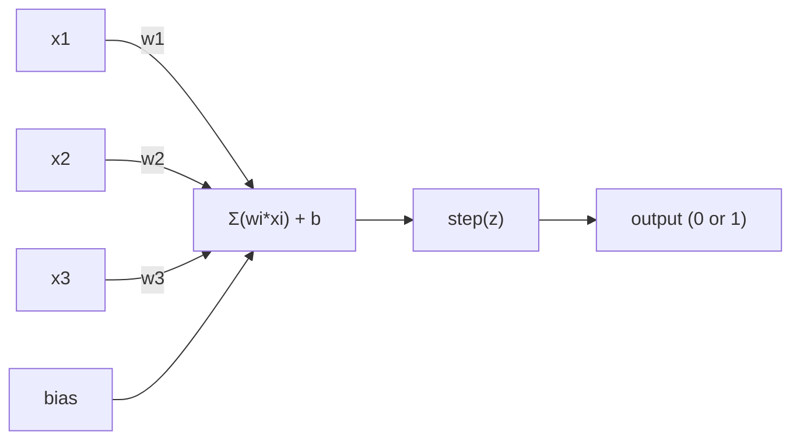
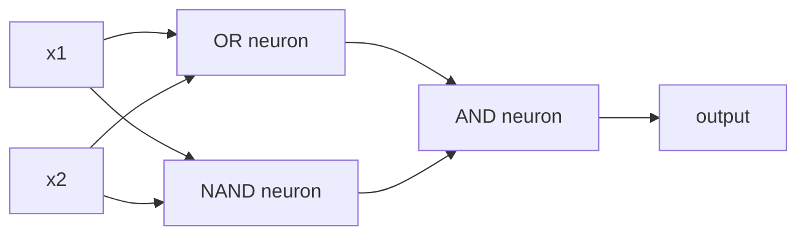

# Le Perceptron.

> Le perceptron est l'atome des réseaux neuronaux.

> Le percepteur est un "atome" du réseau neuronal qui se décompose, il y a un poids, une position et une décision.

> **【中文解读】**La machine à comprendre est la "moyenne" de l'unité d'apprentissage la plus petite du réseau neuronal. Ce qu'elle fait est très simple: mettre l'entrée en charge, ajouter la position, puis prendre une décision de choix.

**Type:** Build
**Languages:** Python
**Prerequisites:** Phase 1 (Linear Algebra Intuition)
**Time:** ~60 minutes

## Objectifs d'apprentissage

- Implémenter un perceptron à partir de zéro en Python, y compris la règle de mise à jour du poids et la fonction d'activation en étapes
  De zéro à Python  réaliser des sensations, y compris des règles de mise à jour de pouvoir et des fonctions d'activation de phase
- Expliquez pourquoi un seul perceptron ne peut résoudre que des problèmes séparables linéairement et démontrer le cas de défaillance XOR
  Expliquer pourquoi une seule machine sensorielle ne peut résoudre que des problèmes de connectivité, et démontrer XOR  cas de défaillance
- Construire un perceptron multicouche en composant les portes OR, NAND et AND pour résoudre XOR
  通过组合OR、NAND 和 AND 门来构建多层感知机以解决XOR
- Formez un réseau à deux couches avec activation sigmoïde et réapprovisionnement pour apprendre automatiquement XOR
  Utilisation de sigmoid  activation et réaction de propagation entraînement à deux niveaux de réseau d'apprentissage automatique XOR

> **【中文解读】**Objectif du chapitre: à partir de zéro réalisation de la machine à sentir, comprendre pourquoi une seule machine à sentir peut seulement résoudre un problème de répartition de la ligne (XOR est un contre-exemple), puis en assemblant plusieurs machines à sentir pour franchir cette limite, finalement avec le pouvoir d'apprentissage automatique de propagation inverse.

## Le problème , l' introduction du problème

Vous connaissez les vecteurs et les produits de points. Vous savez qu'une matrice transforme les entrées en sorties. Mais comment une machine apprend-elle quelle transformation utiliser ?

> Vous savez déjà le volume et le point de résolution. Vous savez que les matrices peuvent être transformées en flux, mais comment les machines utilisent-elles ces changements ?

Le perceptron répond à cela. C'est la machine d'apprentissage la plus simple possible: prendre quelques entrées, multiplier par des poids, ajouter un biais, et prendre une décision binaire. Puis ajuster. C'est tout. Chaque réseau neural jamais construit est des couches de cette idée empilées ensemble.

> La machine de perception répond à cette question. C'est la machine d'apprentissage la plus simple: recevoir des entrées, multiplier le poids, ajouter des paramètres, prendre des décisions de deuxième classe, puis régler.

Comprendre le perceptron signifie comprendre ce que signifie réellement "apprendre" dans le code: ajuster les nombres jusqu'à ce que la sortie correspond à la réalité.

> Comprendre le sens signifie comprendre le vrai sens de "apprendre" dans le code: constamment ajuster les chiffres jusqu'à ce que le sort correspond à la réalité.

> **【中文解读】**Vous savez déjà que le matrix peut transformer l'entrée en sortie. Mais quelles sont les "études" de l'appareil à utiliser ? La machine de perception donne la réponse:

## Le concept de base.

### Un neurone, une décision, un neurone, une décision.

Un perceptron prend n entrées, multiplie chacune par un poids, les résume, ajoute un biais et transmet le résultat à travers une fonction d'activation.

> 感知机接收 n 个输入, va chaque输入乘重,求和,加偏置, puis par activation de la fonction de sortie du résultat.



La fonction étape est brutale: si la somme pondérée plus le biais est >= 0, sortie 1.

> 阶跃函数 est très simple grossier: si le plus ou le plus de déviation est supérieur à 0, le plus ou moins 1, le plus ou moins 0

```
step(z) = 1  if z >= 0
           0  if z < 0
```

Il s'agit d'un classifiant linéaire. Les poids et les biais définissent une ligne (ou un hyperplane dans des dimensions plus élevées) qui divise l'espace d'entrée en deux régions.

> Ceci est un élément de la ligne. Le poids et la position définissent une ligne ou un super-plan dans l'espace de haute dimension.

> **【中文解读】**感知机的计算流程:输入 x 乘权重 w,求和后加偏置 b,最后通过阶跃函数输出 0 或 1──本质上就是一个线性分类器权重和偏置在空间中画一条线(或超平面),把输入空间分成两个区域──

### La limite de décision.

Pour deux entrées, le perceptron trace une ligne à travers l'espace 2D:

> Pour deux entrées, le sensationnel dans l'espace de deux dimensions dessine une ligne droite:

```
  x2
  ┤
  │  Class 1        /
  │    (0)          /
  │                /
  │               / w1·x1 + w2·x2 + b = 0
  │              /
  │             /     Class 2
  │            /        (1)
  ┼───────────/──────────── x1
```

Tout ce qui est de l'un des côtés de la ligne donne des résultats 0. Tout ce qui est de l'autre côté donne des résultats 1.

> Le processus de formation consiste à déplacer cette ligne jusqu'à ce qu'elle soit correctement divisée en différentes catégories.

> **【中文解读】**Le processus de formation est de continuer à bouger jusqu'à ce qu'il ait correctement divisé les différentes catégories de données.

### La règle de l'apprentissage

La règle de l'apprentissage de la perception est simple:

> Les règles d'apprentissage du sens sont très simples:

```
For each training example (x, y_true):     # 对每个训练样本
    y_pred = predict(x)                    # 预测输出
    error = y_true - y_pred                # 计算误差

    For each weight:                       # 对每个权重
        w_i = w_i + learning_rate * error * x_i   # 更新权重
    bias = bias + learning_rate * error    # 更新偏置
```

Si la prédiction est correcte, l'erreur = 0, rien ne change. Si elle prévoit 0 mais devrait être 1, les poids augmentent. Si elle prévoit 1 mais devrait être 0, les poids diminuent. Le taux d'apprentissage contrôle la taille de chaque ajustement.

> Si la prédiction est correcte, l'erreur est de 0, aucun ajustement n'est effectué. Si la prédiction est de 0, mais devrait être de 1, le poids augmente. Si la prédiction est de 1, mais devrait être de 0, le poids diminue.

> **【中文解读】**La règle d'apprentissage de la machine de perception est très directe: prédiction contre on ne bouge pas, prédiction d'erreur selon l'erreur de direction de réglage du poids.`optimizer.step()`Faire quelque chose est essentiellement la même chose, juste calculer plus compliqué.

> **【拓展：梯度下降的起源】**La différence entre le sens de l'apprentissage à un taux d'apprentissage fixe et celui de calcul manuel est que l'adame s'adapte à un taux d'apprentissage ajusté.

### Le problème de XOR

Regardez ces portes logiques:

> C'est là que la perception est défaillante.

```
AND gate:           OR gate:            XOR gate:
x1  x2  out         x1  x2  out         x1  x2  out
0   0   0           0   0   0           0   0   0
0   1   0           0   1   1           0   1   1
1   0   0           1   0   1           1   0   1
1   1   1           1   1   1           1   1   0
```

AND et OR sont séparables linéairement: vous pouvez dessiner une seule ligne pour séparer les 0s des 1s. XOR n'est pas. Aucune seule ligne ne peut séparer [0,1] et [1,0] de [0,0] et [1,1].

> Et 和 OR est ligne de ligne: vous pouvez dessiner une ligne droite sera 0 和 1 分开。XOR 不是。

```
AND (separable):        XOR (not separable):

  x2                      x2
  1 ┤  0     1            1 ┤  1     0
    │     /                 │
  0 ┤  0 / 0              0 ┤  0     1
    ┼──/──────── x1         ┼──────────── x1
       line works!          no single line works!
```

C'est une limite fondamentale. Un seul perceptron ne peut résoudre que des problèmes séparables linéairement. Minsky et Papert ont prouvé cela en 1969 et il a presque tué la recherche sur les réseaux neuronaux pendant une décennie.

> C'est une limitation fondamentale. Une seule machine sensorielle ne peut résoudre que des problèmes de connectivité. Minsky et Papert en 1969 ont prouvé que cela a presque fait que la recherche sur les réseaux neuronaux s'est arrêtée pendant une décennie.

La solution: empiler les percepteurs en couches. Un percepteur multicouche peut résoudre XOR en combinant deux décisions linéaires en une non linéaire.

> Solution: la machine de perception est constituée de plusieurs couches.

> **【中文解读】**Le problème de XOR est le "AkkS之" de la machine de perception: peu importe comment vous dessinez une ligne droite, on ne peut pas distinguer les deux sortes de sorties de XOR. Minsky et Papert en 1969 prouvent que cela a directement conduit à la "première hiver du travail sur le réseau nerveux". Mais la solution est aussi très élégante: mettre plusieurs machines de perception sur plusieurs couches, en utilisant deux combinaisons de lignes directes pour faire des décisions hors ligne.

> **【拓展：为什么深度学习需要"深"】** Un seul capteur peut dessiner une ligne droite, deux couches peuvent dessiner une ligne déformée, trois couches peuvent dessiner une forme quelconque. Plus de couches, plus de fonctions peuvent exprimer plus de complexité. C'est pourquoi GPT-4 a près de 100 couches de transformateur à chaque couche, le modèle est capable d'exprimer des modèles plus complexes. De la capteur à GPT, l'idée centrale est une phase de réaction.

## Construisez-le en main
```figure
perceptron-boundary
```

## Faites-le

### Étape 1: La classe Perceptron

```python
class Perceptron:
    def __init__(self, n_inputs, learning_rate=0.1):
        self.weights = [0.0] * n_inputs   # 权重初始化为 0
        self.bias = 0.0                    # 偏置初始化为 0
        self.lr = learning_rate            # 学习率控制每次调整的幅度

    def predict(self, inputs):
        total = sum(w * x for w, x in zip(self.weights, inputs))  # 加权求和：w·x
        total += self.bias                                         # 加偏置：w·x + b
        return 1 if total >= 0 else 0       # 阶跃函数：>=0 输出 1，否则输出 0

    def train(self, training_data, epochs=100):
        for epoch in range(epochs):
            errors = 0
            for inputs, target in training_data:
                prediction = self.predict(inputs)   # 前向预测
                error = target - prediction          # 计算误差
                if error != 0:
                    errors += 1
                    for i in range(len(self.weights)):
                        self.weights[i] += self.lr * error * inputs[i]  # 权重更新
                    self.bias += self.lr * error      # 偏置更新
            if errors == 0:
                print(f"Converged at epoch {epoch + 1}")  # 全部正确，收敛
                return
        print(f"Did not converge after {epochs} epochs")
```

### Étape 2: entraînement sur les portes de la logique entraînement sur les portes de la logique

```python
and_data = [          # AND 逻辑门数据：两个输入都为 1 时输出 1
    ([0, 0], 0),
    ([0, 1], 0),
    ([1, 0], 0),
    ([1, 1], 1),
]

or_data = [           # OR 逻辑门数据：任一输入为 1 时输出 1
    ([0, 0], 0),
    ([0, 1], 1),
    ([1, 0], 1),
    ([1, 1], 1),
]

not_data = [          # NOT 逻辑门数据：取反
    ([0], 1),
    ([1], 0),
]

print("=== AND Gate ===")
p_and = Perceptron(2)
p_and.train(and_data)
for inputs, _ in and_data:
    print(f"  {inputs} -> {p_and.predict(inputs)}")

print("\n=== OR Gate ===")
p_or = Perceptron(2)
p_or.train(or_data)
for inputs, _ in or_data:
    print(f"  {inputs} -> {p_or.predict(inputs)}")

print("\n=== NOT Gate ===")
p_not = Perceptron(1)
p_not.train(not_data)
for inputs, _ in not_data:
    print(f"  {inputs} -> {p_not.predict(inputs)}")
```

### Étape 3: Regardez XOR échouer

```python
xor_data = [         # XOR 逻辑门数据：两个输入不同时输出 1
    ([0, 0], 0),
    ([0, 1], 1),
    ([1, 0], 1),
    ([1, 1], 0),
]

print("\n=== XOR Gate (single perceptron) ===")
p_xor = Perceptron(2)
p_xor.train(xor_data, epochs=1000)   # 即使训练 1000 轮也无法收敛
for inputs, expected in xor_data:
    result = p_xor.predict(inputs)
    status = "OK" if result == expected else "WRONG"
    print(f"  {inputs} -> {result} (expected {expected}) {status}")
```

C'est la preuve qu'un seul perceptron ne peut pas apprendre XOR.

> Il ne recevra jamais. C'est que la seule machine sensationnelle ne peut pas apprendre le XOR.

> **【中文解读】**单个感知机训练 XOR 永远不会收不管训练多少轮──这是一个数学上的硬限制:一条直线无法正确分成两个类──

### Étape 4: Résoudre XOR avec deux couches avec deux couches de réseau pour résoudre XOR

Le truc: XOR = (x1 ou x2) ET NON (x1 ET x2). Combinez trois percepteurs:

> 技巧:XOR = (x1 OR x2) ET NON (x1 ET x2)



```python
def xor_network(x1, x2):
    or_neuron = Perceptron(2)
    or_neuron.weights = [1.0, 1.0]     # OR 门的权重
    or_neuron.bias = -0.5              # OR 门的偏置

    nand_neuron = Perceptron(2)
    nand_neuron.weights = [-1.0, -1.0]  # NAND 门（AND 的取反）的权重
    nand_neuron.bias = 1.5              # NAND 门的偏置

    and_neuron = Perceptron(2)
    and_neuron.weights = [1.0, 1.0]     # AND 门的权重
    and_neuron.bias = -1.5              # AND 门的偏置

    hidden1 = or_neuron.predict([x1, x2])    # 隐藏层第 1 个神经元：OR
    hidden2 = nand_neuron.predict([x1, x2])  # 隐藏层第 2 个神经元：NAND
    output = and_neuron.predict([hidden1, hidden2])  # 输出层：AND
    return output


print("\n=== XOR Gate (multi-layer network) ===")
for inputs, expected in xor_data:
    result = xor_network(inputs[0], inputs[1])
    print(f"  {inputs} -> {result} (expected {expected})")
```

L'accumulation de percepteurs en couches crée des limites de décision qu'aucun seul percepteur ne peut produire.

> Les quatre cas sont tous corrects. Les machines de perception peuvent créer des couches de perception uniques.

> **【中文解读】**关键洞察:XOR = (x1 OR x2) ET NON(x1 AND x2)。 le premier niveau utilise deux sensations séparées pour faire OR 和 NAND(((двух прямых линий), le second niveau utilise ET met les deux résultats ensemble。

### Étape 5: Formez un réseau à deux couches

La solution est de remplacer la fonction de la marche par sigmoid et d'apprendre les poids automatiquement par réaction.

> Étape 4 La méthode de configuration de poids est efficace pour XOR, mais ne peut pas être utilisée pour connaître le poids réel.

```python
class TwoLayerNetwork:
    def __init__(self, learning_rate=0.5):
        import random
        random.seed(0)
        self.w_hidden = [[random.uniform(-1, 1), random.uniform(-1, 1)] for _ in range(2)]  # 隐藏层权重（2个神经元，各2个输入）
        self.b_hidden = [random.uniform(-1, 1), random.uniform(-1, 1)]   # 隐藏层偏置
        self.w_output = [random.uniform(-1, 1), random.uniform(-1, 1)]   # 输出层权重
        self.b_output = random.uniform(-1, 1)   # 输出层偏置
        self.lr = learning_rate

    def sigmoid(self, x):
        import math
        x = max(-500, min(500, x))   # 裁剪防止溢出
        return 1.0 / (1.0 + math.exp(-x))  # sigmoid 函数：σ(x) = 1/(1+e^(-x))

    def forward(self, inputs):
        self.inputs = inputs
        self.hidden_outputs = []
        for i in range(2):
            z = sum(w * x for w, x in zip(self.w_hidden[i], inputs)) + self.b_hidden[i]  # 隐藏层线性变换
            self.hidden_outputs.append(self.sigmoid(z))  # 隐藏层激活
        z_out = sum(w * h for w, h in zip(self.w_output, self.hidden_outputs)) + self.b_output  # 输出层线性变换
        self.output = self.sigmoid(z_out)   # 输出层激活
        return self.output

    def train(self, training_data, epochs=10000):
        for epoch in range(epochs):
            total_error = 0
            for inputs, target in training_data:
                output = self.forward(inputs)       # 前向传播
                error = target - output              # 误差 = 目标 - 预测
                total_error += error ** 2            # 累计平方误差

                d_output = error * output * (1 - output)   # 输出层梯度（链式法则）

                saved_w_output = self.w_output[:]
                hidden_deltas = []
                for i in range(2):
                    h = self.hidden_outputs[i]
                    hd = d_output * saved_w_output[i] * h * (1 - h)  # 隐藏层梯度（反向传播）
                    hidden_deltas.append(hd)

                # 更新输出层权重
                for i in range(2):
                    self.w_output[i] += self.lr * d_output * self.hidden_outputs[i]
                self.b_output += self.lr * d_output

                # 更新隐藏层权重
                for i in range(2):
                    for j in range(len(inputs)):
                        self.w_hidden[i][j] += self.lr * hidden_deltas[i] * inputs[j]
                    self.b_hidden[i] += self.lr * hidden_deltas[i]
```

```python
net = TwoLayerNetwork(learning_rate=2.0)
net.train(xor_data, epochs=10000)
for inputs, expected in xor_data:
    result = net.forward(inputs)
    predicted = 1 if result >= 0.5 else 0   # 以 0.5 为阈值做二分类
    print(f"  {inputs} -> {result:.4f} (rounded: {predicted}, expected {expected})")
```

Deux différences clés de l'étape 4. Premièrement, sigmoïde remplace la fonction étape -- il est lisse, donc les gradients existent. Deuxièmement, le `train`La méthode propage l'erreur vers l'arrière de la sortie à la couche cachée, ajustant chaque poids proportionnellement à sa contribution à l'erreur.

> Avec l'étape 4, il y a deux différences clés. Premièrement, le sigmoïde a remplacé la fonction de l'étape de l'étape.`train`La méthode permettra de corriger les erreurs de la couche de sortie à la couche cachée en fonction du poids de chaque couche de propagation.

C'est le pont vers la leçon 3.`d_output`et `hidden_deltas`C'est la règle de la chaîne appliquée au graphique de réseau.

> C'est le pont qui mène à la troisième classe.`d_output`et `hidden_deltas`La mathématique est une application de la loi de chaîne sur les graphismes du réseau.

> **【中文解读】**La première étape est de définir manuellement le poids, mais la vraie question est que nous ne savons pas le poids exact.`d_output`et `hidden_deltas`C'est l'application de la loi de chaîne de la sortie de la couche à la reprise de la couche, de la couche à la couche.`loss.backward()`Dans ce que je fais.

> **【拓展：PyTorch autograd 的原理】**L'auto-réalisation de PyTorch est en fait le processus de propagation de l'inverse qui est effectué automatiquement.`backward()`时沿图反向传播梯度──手动写反向传播 (tels que ici) est la meilleure façon de comprendre l'autogradation──

## Utilisez-le dans la pratique.

Tout ce que vous venez de construire à partir de zéro existe dans un seul import:

> Toutes les fonctionnalités de votre construction à partir de zéro peuvent être réalisées par un seul import:

```python
from sklearn.linear_model import Perceptron as SkPerceptron   # sklearn 内置的感知机
import numpy as np

X = np.array([[0,0],[0,1],[1,0],[1,1]])  # 输入数据
y = np.array([0, 0, 0, 1])               # AND 门的标签

clf = SkPerceptron(max_iter=100, tol=1e-3)  # 最多迭代 100 次，容差 0.001
clf.fit(X, y)                                # 训练
print([clf.predict([x])[0] for x in X])     # 预测所有样本
```

Cinq lignes, votre ligne 30.`Perceptron`La version sklearn ajoute des contrôles de convergence, des fonctions de perte multiples et une prise en charge rare - mais la boucle de base est identique: somme pondérée, fonction de pas, mise à jour de poids sur erreur.

> Tu es 30`Perceptron`类做的是同样的事情──sklearn 版本增加收检查、多种损失函数和稀疏输入支持但核心循环完全相同:加权和、阶跃函数、按错误更新权重──

Les réalités de la pauvreté se manifestent à grande échelle.

> La véritable différence est présente sur la taille.

- La fonction de pas devient sigmoïde, ReLU, ou d'autres activations lisses
  阶跃 fonction devient sigmoid、ReLU ou autre fonction activation
- Les poids sont apprises automatiquement par ré-propagation (leçon 03)
  权重通过反向传播自动学习 (Le fait de faire connaître l'esprit de l'homme est une question de savoir si l'homme est capable de faire quelque chose de mal)
- Les couches deviennent plus profondes: 3, 10, 100+ couches
  Le nombre de couches devient plus profond: 3 couches, 10 couches, 100 couches.
- Le même principe est valable: chaque couche crée de nouvelles caractéristiques à partir des sorties de la couche précédente
  基本原理不变: chaque couche de la production de la première couche crée de nouvelles caractéristiques

Un seul perceptron ne peut que dessiner des lignes droites.

> Un seul sensateur ne peut que dessiner une ligne droite.

> **【中文解读】**Le code de Perceptron 五行 里 sklearn 里已经搞定了我们30行做的事情──核心逻辑完全相同:加权求和、阶跃函数、按差更新权重──真正差距在规模:现代网络使用可导的激活函数(如ReLU) 、用反向传播自动学习、有几十到上百层──但基本原理永远是: créer de nouvelles caractéristiques dans chaque couche de sortie de la couche supérieure──

## Envoyez les marchandises .

Cette leçon donne:
- `outputs/skill-perceptron.md`- une compétence qui couvre les besoins en architectures à couche unique et à couche multi-couche

> Le programme de formation`outputs/skill-perceptron.md`- un document de compétences sur l'utilisation des structures à couche unique et à couche multiple

## Les exercices

1. Exercer un perceptron sur une passerelle NAND (la passerelle universelle - tout circuit logique peut être construit à partir de NAND).
   > **练习 1：**Utilisation de l'apprentissage du pouvoir et du biais de la prise de décision.

2. Modifiez la classe Perceptron pour suivre la limite de décision (w1\*x1 + w2\*x2 + b = 0) à chaque époque.
   > **练习 2：**修改 Perceptron 类,在每时代 记录决策边界 (w1\*x1 + w2\*x2 + b = 0) ――打印在训练 AND 门时这条线是如何移动的──

3. Construire un perceptron à 3 entrées qui ne sort 1 que lorsque au moins 2 des 3 entrées sont 1 (une fonction de vote majoritaire).
   > **练习 3：**Construire une 3 输入感知机, lorsque au moins 2 输入为 1 时输出 1 多数投票函数) ⋅ Cette fonction est line性可分的吗? Pourquoi?

## Les termes clés

| Term | What people say | What it actually means |
|------|----------------|----------------------|
| Perceptron | "A fake neuron" | A linear classifier: dot product of inputs and weights, plus bias, through a step function |
| Weight | "How important an input is" | A multiplier that scales each input's contribution to the decision |
| Bias | "The threshold" | A constant that shifts the decision boundary, letting the perceptron fire even with zero inputs |
| Activation function | "The thing that squishes values" | A function applied after the weighted sum - step function for perceptrons, sigmoid/ReLU for modern networks |
| Linearly separable | "You can draw a line between them" | A dataset where a single hyperplane can perfectly separate the classes |
| XOR problem | "The thing perceptrons can't do" | Proof that single-layer networks cannot learn non-linearly-separable functions |
| Decision boundary | "Where the classifier switches" | The hyperplane w\*x + b = 0 that divides input space into two classes |
| Multi-layer perceptron | "A real neural network" | Perceptrons stacked in layers, where each layer's output feeds the next layer's input |

| 术语 | 通俗说法 | 实际含义 |
|------|---------|---------|
| 感知机 (Perceptron) | "假神经元" | 线性分类器：输入与权重的点积加偏置，过阶跃函数 |
| 权重 (Weight) | "输入的重要性" | 缩放每个输入对决策贡献的乘数 |
| 偏置 (Bias) | "阈值" | 偏移决策边界的常数，让感知机在全零输入时也能激活 |
| 激活函数 (Activation function) | "压扁数值的东西" | 加权求和后施加的函数——感知机用阶跃函数，现代网络用 sigmoid/ReLU |
| 线性可分 (Linearly separable) | "能画线分开" | 数据集可以用一个超平面完美分成两类 |
| XOR 问题 | "感知机做不到的事" | 证明单层网络无法学习非线性可分函数 |
| 决策边界 (Decision boundary) | "分类器切换的地方" | w\*x + b = 0 这个超平面，把输入空间分成两类区域 |
| 多层感知机 (MLP) | "真正的神经网络" | 感知机按层堆叠，每层的输出是下一层的输入 |

## Encore une lecture

- Frank Rosenblatt, "Le Perceptron: un modèle probabiliste de stockage et d'organisation de l'information dans le cerveau" (1958) -- le papier original qui a commencé tout cela
  Frank Rosenblatt, 感知机: Brain information storage and organization's probability model
- Minsky & Papert, "Perceptrons" (1969) -- le livre qui a prouvé que XOR était insoluble par les réseaux à couche unique et a tué la recherche perceptron pendant une décennie
  Minsky 和 Papert,感知机(1969) prouve que le réseau de niveau unique ne peut pas résoudre XOR et empêche l'étude de la perception de s'arrêter pendant dix ans
- Michael Nielsen, "Réseaux neuronaux et apprentissage profond", chapitre 1 (http://neuralnetworksanddeeplearning.com/) -- gratuit en ligne, la meilleure explication visuelle de la façon dont les percepteurs se composent en réseaux
  Michael Nielsen,  réseaux neuronaux et profondeur d'apprentissage  1er chapitre  gratuit en ligne, sur la façon dont les machines de perception composent le réseau
