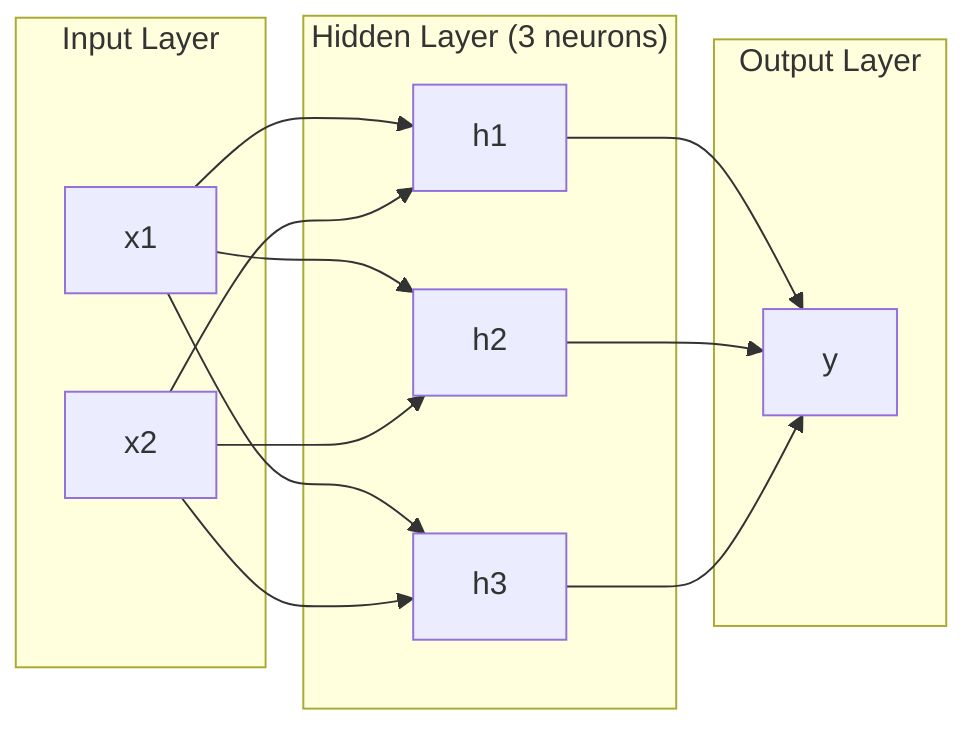
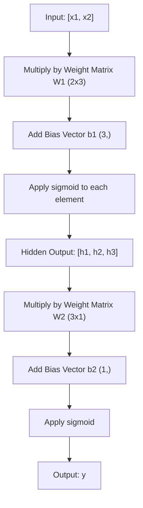
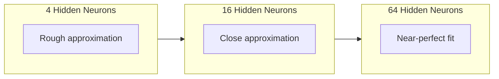

# Réseaux multi-couches et passer à l'avant

> Un neurone dessine une ligne, les empiler, et vous pouvez dessiner n'importe quoi.

> Un neurone dessine une ligne droite.

> **【中文解读】**Un neurone ne peut tracer qu'une ligne droite, mais en superposant plusieurs neurones en plusieurs couches, il peut s'adapter à une courbe de forme quelconque. C'est la valeur centrale du réseau multicouche qui est la limite de la ligne de la machine de perception à couche unique.

**Type:** Build
**Languages:** Python
**Prerequisites:** Phase 01 (Math Foundations), Lesson 03.01 (The Perceptron)
**Time:** ~90 minutes

## Objectifs d'apprentissage

- Construire un réseau multicouche à partir de zéro avec des classes de couche et de réseau qui effectuent un passage complet vers l'avant
  De la construction à zéro avec des couches et des réseaux de type réseau à plusieurs couches, exécuter la propagation intégrale avant vers le haut
- Tracer les dimensions de la matrice à travers chaque couche d'un réseau et identifier les désaccords de forme
   Traceur de la ligne de chaque couche de la dimension de la matrice, problème de reconnaissance de la forme non correspondante
- Expliquez comment l'empilage des activations non linéaires permet à un réseau d'apprendre les limites de décision courbes
  Expliquer comment le réseau peut apprendre à prendre des décisions
- Résoudre le problème XOR en utilisant une architecture 2-2-1 avec des poids sigmoïdes réglés à la main
  Utilisation manuelle de réglage de sigmoid 权重, avec 2-2-1 架构解决 XOR 问题

> **【中文解读】**Objectif du chapitre: de la conception de la couche et du réseau à partir de zéro, comprendre les changements de dimension de la matrice dans la propagation, comprendre pourquoi la fonction activation non linéaire permet au réseau d'apprendre à prendre des décisions.

## Le problème , l' introduction du problème

Un seul neurone est un tiroir de lignes. C'est tout. Une ligne droite à travers vos données. Tout vrai problème dans l'IA - reconnaissance d'images, compréhension du langage, jeu de Go - nécessite des courbes.

> Un seul neurone n'est qu'un outil de ligne de dessin. Il est tout simplement là. Dans vos données, dessinez une ligne droite. Chaque véritable problème de l'IA est de reconnaître des images, de comprendre les langues.

En 1969, Minsky et Papert ont prouvé que cette limitation était fatale: un réseau à couche unique ne peut pas apprendre XOR. Pas " luttes pour apprendre " - mathématiquement ne peut pas. La table de vérité XOR place [0,1] et [1,0] d'un côté, [0,0] et [1,1] de l'autre. Aucune seule ligne ne les sépare.

> En 1969, Minsky 和 Papert prouvent que cette limite est fatale: le réseau de niveau unique ne peut pas apprendre XOR── pas " très difficile à apprendre " est mathématiquement impossible── XOR réelle valeur sera [0,1] 和 [1,0]  placée sur un côté, [0,0] 和 [1,1]  placée sur l'autre côté── pas de ligne droite qui puisse les séparer──

Cela a détruit le financement des réseaux neuronaux pendant plus d'une décennie. La solution était évidente en arrière-plan: cesser d'utiliser une couche. Empiler les neurones en couches. Laissez la première couche tailler l'espace d'entrée en nouvelles fonctionnalités, et la deuxième couche combiner ces fonctionnalités en décisions qu'aucune seule ligne ne pourrait prendre.

> Cela a fait que le financement du réseau neuronal a été interrompu pendant plus de dix ans. La solution est évidente: il ne faut plus utiliser une seule couche.

Cette pile est le réseau multicouche. C'est la base de tous les modèles d'apprentissage profond en production aujourd'hui. Le passage à l'avant - les données qui circulent de l'entrée à la sortie à travers les couches cachées - est la première chose que vous devez construire avant que tout autre fonctionne.

> La mise en place est un réseau multicouche. Elle est la base de chaque modèle d'apprentissage profond dans l'environnement de production actuel.

> **【中文解读】**Les neurones individuels ne peuvent que dessiner une ligne droite, mais les images reconnaissent, comprennent, comprennent, et ces tâches d'IA réelles ont besoin de courbes. En 1969, Minsky et Papert ont prouvé que le réseau de niveau unique ne peut pas apprendre XOR.

## Le concept de base.

### Les couches: entrée, cachée, sortie.

Un réseau multicouche a trois types de couches:

> Les réseaux multicouches ont trois types de couches:

**Input layer**Deux fonctionnalités signifient deux nœuds d'entrée.

> **输入层**其实不算真正的层――它存储原始数据――两个特征意味着两个输入节点――这里没有任何计算――

**Hidden layers**- où le travail se produit. Chaque neurone prend chaque sortie de la couche précédente, applique des poids et un biais, puis passe le résultat par une fonction d'activation. "Caché" parce que vous ne voyez jamais ces valeurs directement dans les données de formation.

> **隐藏层** réellement actives.  Chaque neurone reçoit la première couche de toutes les sorties, applique le poids et la position, puis le résultat sera obtenu par la fonction activation.

**Output layer**Pour la classification binaire, un neurone avec sigmoïde. Pour la classe multi, un neurone par classe.

> **输出层** réponse finale.  2° classe avec un neurone sigmoïde, peut-être classe avec chaque neurone.



C'est un réseau 2-3-1. Deux entrées, trois neurones cachés, une sortie. Chaque connexion porte un poids. Chaque neurone (sauf l'entrée) porte un biais.

> Ceci est un 2-3-1 网络── deux entrées, trois neurones cachés, un sortie── chaque connexion a un poids── chaque neurone (à l'exception de l'entrée de couche) a un parallèle──

Chaque couche produit un vecteur de nombres appelé état caché. Pour le texte, les états cachés augmentent la dimensionnalité - encodant un mot comme 768 nombres pour capturer une signification sémantique. Pour les images, ils réduisent la dimensionnalité - comprimant des millions de pixels dans une représentation gérable.

> Chaque couche produit un vecteur numérique, appelé état caché. Pour le texte, l'état caché augmente la dimension. Pour les images, elles diminuent la dimension.

> **【中文解读】**Trois niveaux: entrée en phase (en utilisant les données de base, sans calcul) 隐藏层 (en utilisant les données de base) 隐藏层 (en utilisant les données de base) 隐藏层 (en utilisant les données de base) 隐藏层 (en utilisant les données de base) 隐藏层 (en utilisant les données de base) 隐藏层 (en utilisant les données de base) 隐藏层 (en utilisant les données de base) 隐藏层 (en utilisant les données de base) 隐藏层 (en utilisant les données de base) 隐藏层 (en utilisant les données de base) 隐藏层 (en utilisant les données de base) 隐藏层 (en utilisant les données de base) 隐藏层 (en utilisant les données de base) 隐藏层 (en utilisant les données de base) 隐藏层 (en utilisant les données de base) 隐藏层 (en utilisant les données de base) 隐藏层 (en utilisant les données de base) 隐藏层 (en utilisant les données de base) 隐藏层 (en utilisant les données de base) 隐藏层 (en utilisant les données de base) 隐藏层 (en utilisant les données de type type type type type type type type type type type type type type type type type type type type type type type type type type type type type type type type type type type type type type type type type type type type type type type type type type type type type type type type type type type type type type type type type type type type type type type type type type type type type type type type type type type type type type type type type type type type type type type type type type type type type type type type type type type type type type type type type type type type type type type type type type type type type type type type type type type type type type type type type type type type type type type type type type type type type type type type type type type type type type type type type type type type type type type type type type type type type type type type type type type type type type type type type type type type type type type type type type type type type type type type type type type type type type type type type type type type type type type type type type

> **【拓展：Transformer 中的隐藏状态】**Dans le GPT/BERT, chaque niveau de transformateur est également un état caché.`model(x).hidden_states[-1]`提取特征用于下游任务──

### Les neurones et les activations

Chaque neurone fait trois choses:

> Chaque neurone fait trois choses:

1. Multipliez chaque entrée par son poids correspondant
   Chaque entrée sera multipliée par le poids du résultat
2. Résumez tous les produits et ajoutez un biais
   Toutes les multiples et les multiples
3. Transférer la somme à travers une fonction d'activation
   Va et passe par activation de la fonction

Pour l'instant, l'activation est sigmoïde:

> Actuellement utilisé pour activer la fonction sigmoid:

```
sigmoid(z) = 1 / (1 + e^(-z))
```

Sigmoid écraser n'importe quel nombre dans la plage (0, 1). Les grandes entrées positives poussent vers 1. Les grandes entrées négatives poussent vers 0.

> Le sigmoïde réduit tout chiffre à (0, 1) ∞. Le grand positif est à 0,0 ∞.

> **【中文解读】**Chaque neurone fait trois choses: introduire le poids multiplicateur, demander et ajouter le poids, activer la fonction. Le sigmoïde met l'individu numérique à 0, 1 dans la zone. La clé est qu'il est disponible pour faire descendre la échelle.

### Pass avant: Comment les données circulent

Le passage avant pousse les données d'entrée à travers le réseau, couche par couche, jusqu'à ce qu'il atteigne la sortie. Aucun apprentissage ne se produit pendant le passage avant. C'est un calcul pur: multiplier, ajouter, activer, répéter.

> Avant de diffuser, l'entrée de données est effectuée à travers le réseau, jusqu'à ce qu'il arrive à la sortie.



À chaque couche, trois opérations se produisent en séquence:

> Dans chaque étage, trois opérations sont effectuées en ordre:

```
z = W * input + b       (linear transformation)    # 线性变换
a = sigmoid(z)           (activation)                # 激活
```

La sortie d'une couche devient l'entrée de la suivante.

> Une sortie de couche devient une sortie de couche inférieure.

> **【中文解读】**Il s'agit de la transmission de données de l'entrée à l'entrée à l'extérieur. Il n'y a pas de formation, de calcul pur.`model(x)`Dans ce que je fais.

### Les dimensions de la matrice

Les dimensions de suivi sont la compétence de débogage la plus importante dans l'apprentissage profond.

> 追踪维度 est la plus importante de la connaissance en profondeur 调试技能──以下是 2-3-1 网络:

| Step | Operation | Dimensions | Result Shape |
|------|-----------|------------|-------------|
| Input | x | -- | (2,) |
| Hidden linear | W1 * x + b1 | W1: (3, 2), b1: (3,) | (3,) |
| Hidden activation | sigmoid(z1) | -- | (3,) |
| Output linear | W2 * h + b2 | W2: (1, 3), b2: (1,) | (1,) |
| Output activation | sigmoid(z2) | -- | (1,) |

| 步骤 | 操作 | 维度 | 结果形状 |
|------|------|------|---------|
| 输入 | x | -- | (2,) |
| 隐藏层线性变换 | W1 * x + b1 | W1: (3, 2), b1: (3,) | (3,) |
| 隐藏层激活 | sigmoid(z1) | -- | (3,) |
| 输出层线性变换 | W2 * h + b2 | W2: (1, 3), b2: (1,) | (1,) |
| 输出层激活 | sigmoid(z2) | -- | (1,) |

La règle: la matrice de poids W à la couche k a une forme (neurones_in_layer_k, neurons_in_layer_k_minus_1). Les lignes correspondent à la couche actuelle. Les colonnes correspondent à la couche précédente. Si les formes ne se alignent pas, vous avez un bug.

> Règles: La forme de la première couche de la gravité de la matrice W est (numéro de neurones de la première couche, numéro de neurones de la première couche) .

> **【中文解读】**La règle est très simple: la règle de la règle de la règle de la règle de la règle de la règle de la règle de la règle de la règle de la règle de la règle de la règle de la règle de la règle de la règle de la règle de la règle de la règle de la règle de la règle de la règle de la règle de la règle de la règle de la règle de la règle de la règle de la règle de la règle de la règle de la règle de la règle de la règle de la règle de la règle de la règle de la règle de la règle de la règle de la règle de la règle de la règle de la règle de la règle de la règle de la règle de la règle de la règle de la règle de la règle de la règle de la règle de la règle de la règle de règle de la règle de la règle de règle de règle de la règle de règle de la règle de règle de règle de règle de règle de règle est la règle de règle de règle de règle de règle de règle.

> **【拓展：维度不匹配是深度学习最常见的 bug】**Dans PyTorch, tu vois souvent `RuntimeError: mat1 and mat2 shapes cannot be multiplied`                                                                                                                                                                                                                                                              `torchsummary`Ou `torchinfo`Je peux vous aider à vérifier automatiquement.

### Le théorème de l'approximation universelle

En 1989, George Cybenko a prouvé quelque chose de remarquable: un réseau neural avec une seule couche cachée et suffisamment de neurones peut approximer toute fonction continue à toute précision souhaitée.

> En 1989, George Cybenko a prouvé une chose inédite: un réseau de neurones doté d'une seule couche cachée et de suffisamment de neurones peut approcher avec toute précision de toute fonction continue.

Cela ne signifie pas qu'une couche cachée est toujours la meilleure. Cela signifie que l'architecture est théoriquement capable.

> Cela ne signifie pas qu'une couche cachée est toujours la meilleure. Cela signifie que l'architecture est théoriquement possible.

L'intuition: chaque neurone dans la couche cachée apprend un "boum" ou une caractéristique. suffisamment de bosses placées dans les bons endroits peuvent approcher n'importe quelle courbe lisse. Plus de neurones, plus de bosses, meilleure approximation.

> 直觉: chaque neurone dans la couche cachée apprend un "combine" ou caractéristique.



> **【中文解读】**En 1989, un niveau de neuropsychiologie est plus proche de la fonction de continuité. Mais cela ne signifie pas qu'un niveau de neuropsychiologie est plus proche de la fonction de continuité.

> **【拓展：为什么"深"比"宽"好】**Œuvre de la théorie, une couche 2 n ∈ N est égale à n ∈ N ∈ N ∈ N ∈ N ∈ N, mais les premières sont de niveau indexé, les dernières sont de niveau linéaire.

### La composibilité est complète.

Les réseaux neuronaux sont composables. Vous pouvez les empiler, les encadrer, les exécuter en parallèle. Un modèle Whisper utilise un réseau d'encodeur pour traiter l'audio et un réseau de décodeur séparé pour générer du texte. Les LLM modernes ne sont que décodeurs. BERT est que décodeur. T5 est encodeur-décodeur. Le choix d'architecture définit ce que le modèle peut faire.

> Le système de gestion de données est un système de gestion de données qui permet de créer des données et de créer des données.

> **【中文解读】**Le réseau de nerfs est assemblable: le murmure avec un codeur pour traiter le texte; le GPT est un codeur pur; le BERT est un codeur pur; le T5 est un codeur-décodeur.

## Construisez-le en main
```figure
mlp-forward
```

## Faites-le

Toutes les opérations de la matrice sont écrites à partir de zéro.

> 純 Python──不用 numpy──每矩阵运算从头写起──

### Étape 1: Activation du sigmoïde

```python
import math

def sigmoid(x):
    x = max(-500.0, min(500.0, x))  # 裁剪到 [-500, 500] 防止指数溢出
    return 1.0 / (1.0 + math.exp(-x))  # σ(x) = 1/(1+e^(-x))
```

La serrure à [500, 500] empêche le débordement. `math.exp(500)`est grand mais fini. `math.exp(1000)`est l'infini.

> - Il faut le faire.`math.exp(500)`Très grand mais limité.`math.exp(1000)`C'est un peu grand.

### Étape 2: Couche de classe

La plus importante opération de l'apprentissage profond est la multiplication de matrice. Chaque couche, chaque tête d'attention, chaque passage vers l'avant - c'est des matmuls tout le chemin vers le bas. Une couche linéaire prend un vecteur d'entrée, le multiplie par une matrice de poids, et ajoute un vecteur de biais: y = Wx + b. Cette équation unique représente 90% du calcul dans un réseau neuronal.

> Le calcul le plus important de l'apprentissage en profondeur est le multiplicateur de la matrice. Chaque couche, chaque tête d'attention, chaque passage avant et avant est un multiplicateur de la matrice.

Une couche contient une matrice de poids et un vecteur de biais.

> Une couche contient une matrice de poids et une vectrice de décalage. Son mode de décalage est de recevoir une vectrice d'entrée et de retourner la sortie après activation.

```python
class Layer:
    def __init__(self, n_inputs, n_neurons, weights=None, biases=None):
        if weights is not None:
            self.weights = weights                       # 使用指定的权重（如手动设置 XOR 的权重）
        else:
            import random
            self.weights = [
                [random.uniform(-1, 1) for _ in range(n_inputs)]  # 随机初始化权重
                for _ in range(n_neurons)
            ]                                           # 形状：(n_neurons, n_inputs)
        if biases is not None:
            self.biases = biases                         # 使用指定的偏置
        else:
            self.biases = [0.0] * n_neurons              # 偏置初始化为 0

    def forward(self, inputs):
        self.last_input = inputs                         # 保存输入（反向传播时需要）
        self.last_output = []
        for neuron_idx in range(len(self.weights)):
            z = sum(
                w * x for w, x in zip(self.weights[neuron_idx], inputs)  # 加权求和
            )
            z += self.biases[neuron_idx]                 # 加偏置
            self.last_output.append(sigmoid(z))          # sigmoid 激活
        return self.last_output
```

La matrice de poids a une forme (n_neurons, n_inputs). Chaque rangée est le poids d'un neurone sur toutes les entrées. La méthode avancée se déplace à travers les neurones, calcule la somme pondérée plus le biais, applique sigmoïde, et recueille les résultats.

> 权重矩阵的形状为 (n_neurons, n_inputs) ⋅ chaque ligne est un neuron à l'égard de tous les entrées de pouvoir ⋅ en avant 方法遍历神经,计算加权和加偏置,应用 sigmoid,并收集结果──

> **【拓展：PyTorch 的 nn.Linear】**La couche est PyTorch .`nn.Linear`De la version simplifiée.`nn.Linear(in_features, out_features)`L' intérieur est aussi un maintien`(out_features, in_features)`Le pouvoir de la force et de l'un.`(out_features,)`Je comprends cela, je comprends le calcul de 90% de l'apprentissage en profondeur.

### Étape 3: Classe réseau Classe réseau

Un réseau est une liste de couches. Le passage avant les enchaîne: la sortie de la couche k alimente la couche k + 1.

> 网络是一个层列表――前向传播将它们串联: 第 k 层的输出作为第 k+1层的输入――

```python
class Network:
    def __init__(self, layers):
        self.layers = layers   # 按顺序存储所有层

    def forward(self, inputs):
        current = inputs               # 当前层的输入
        for layer in self.layers:
            current = layer.forward(current)  # 逐层前向传播
        return current
```

C'est l'ensemble du passage vers l'avant. Quatre lignes de logique. Les données entrent, circulent à travers chaque couche, sortent de l'autre côté.

> C'est tout le processus de propagation.

> **【中文解读】**Réseau 类就是 PyTorch `nn.Sequential`C'est la nature de tout le modèle d'apprentissage profond qui se propage.

### Étape 4: XOR avec des poids réglés à la main avec le poids de réglage XOR à la main

Dans la leçon 01, nous avons résolu XOR en combinant les percepteurs OR, NAND et AND. Maintenant, faites la même chose avec nos classes Layer et Network. L'architecture 2-2-1: deux entrées, deux neurones cachés, une sortie.

> Dans la première classe, nous avons résolu le problème de XOR en combinant OR、NAND 和 AND 感知机.

```python
hidden = Layer(
    n_inputs=2,
    n_neurons=2,
    weights=[[20.0, 20.0], [-20.0, -20.0]],  # 大权重让 sigmoid 接近阶跃函数
    biases=[-10.0, 30.0],                      # 第一个神经元 ≈ OR，第二个 ≈ NAND
)

output = Layer(
    n_inputs=2,
    n_neurons=1,
    weights=[[20.0, 20.0]],                    # 输出层 ≈ AND
    biases=[-30.0],
)

xor_net = Network([hidden, output])

xor_data = [
    ([0, 0], 0),
    ([0, 1], 1),
    ([1, 0], 1),
    ([1, 1], 0),
]

for inputs, expected in xor_data:
    result = xor_net.forward(inputs)
    predicted = 1 if result[0] >= 0.5 else 0
    print(f"  {inputs} -> {result[0]:.6f} (rounded: {predicted}, expected: {expected})")
```

Les grands poids (20, -20) font agir le sigmoïde comme une fonction de pas. Le premier neurone caché approximate OR. Le second approximate NAND. Le neurone de sortie les combine en AND, qui est XOR.

> Le grand poids (20, -20) utilise le sigmoïde pour exprimer une fonction de phase jump.

### Étape 5: Classification des cercles

Un problème plus difficile: classer les points 2D comme à l'intérieur ou à l'extérieur d'un cercle de rayon 0,5 centré sur l'origine. Cela nécessite une limite de décision courbe - impossible pour un seul perceptron.

> Un problème plus difficile: le classement des deux dimensions est basé sur le point d'origine, à l'intérieur ou à l'extérieur d'un cercle de 0,5 de diamètre.

```python
import random
import math

random.seed(42)

data = []
for _ in range(200):
    x = random.uniform(-1, 1)
    y = random.uniform(-1, 1)
    label = 1 if (x * x + y * y) < 0.25 else 0   # 距原点距离 < 0.5 则为"内部"
    data.append(([x, y], label))

circle_net = Network([
    Layer(n_inputs=2, n_neurons=8),   # 隐藏层：8 个神经元
    Layer(n_inputs=8, n_neurons=1),   # 输出层：1 个神经元
])
```

Avec les poids aléatoires, le réseau ne se classera pas bien. Mais le passage avant fonctionne toujours. C'est le point - le passage avant est juste calcul. Apprendre les bons poids est la répartition arrière, venant dans la leçon 03.

> Utilisation du poids au hasard, le résultat de la classification du réseau sera très faible. Mais la propagation du courant peut encore fonctionner.

```python
correct = 0
for inputs, expected in data:
    result = circle_net.forward(inputs)
    predicted = 1 if result[0] >= 0.5 else 0
    if predicted == expected:
        correct += 1

print(f"Accuracy with random weights: {correct}/{len(data)} ({100*correct/len(data):.1f}%)")
```

Les poids aléatoires donnent une mauvaise précision -- souvent pire que de deviner la classe majoritaire. Après l'entraînement (leçon 03), cette même architecture avec 8 neurones cachés dessinera une frontière courbe qui sépare l'intérieur de l'extérieur.

> Le pouvoir de l'accélération donne un taux de précision très faible. Après avoir suivi l'entraînement, il possède également 8 structures de neurones cachés qui tracent les limites de la formation, et qui se séparent à l'intérieur et à l'extérieur du cercle.

> **【中文解读】**Le pouvoir de la communication est très faible. Il est normal que l'on ne s'entraîne pas.

## Utilisez-le dans la pratique.

PyTorch fait tout ce qui est ci-dessus en quatre lignes:

> PyTorch utilise quatre lignes de code pour effectuer toutes les fonctions ci-dessus:

```python
import torch
import torch.nn as nn

model = nn.Sequential(       # 对应我们的 Network 类
    nn.Linear(2, 8),         # 对应 Layer(2, 8)：权重形状 (8, 2)
    nn.Sigmoid(),             # 对应 sigmoid 激活
    nn.Linear(8, 1),         # 对应 Layer(8, 1)：权重形状 (1, 8)
    nn.Sigmoid(),             # 输出层 sigmoid
)

x = torch.tensor([[0.0, 0.0], [0.0, 1.0], [1.0, 0.0], [1.0, 1.0]])  # XOR 输入
output = model(x)             # 前向传播
print(output)
```

`nn.Linear(2, 8)`est votre classe de couche: matrice de poids de forme (8, 2), vecteur de biais de forme (8,). `nn.Sigmoid()`est votre fonction sigmoïde appliquée par élément. `nn.Sequential`est votre classe réseau: couches de chaîne dans l'ordre.

> `nn.Linear(2, 8)`C'est le cas de la couche de l'épaisseur de la couche de l'épaisseur de la couche de l'épaisseur de la couche de l'épaisseur de la couche de l'épaisseur de la couche de l'épaisseur de la couche de l'épaisseur de la couche de l'épaisseur de l'épaisseur de la couche de l'épaisseur de la couche de l'épaisseur de l'épaisseur de la couche de l'épaisseur de la couche de l'épaisseur de l'épaisseur de la couche de l'épaisseur de l'épaisseur de la couche de l'épaisseur.`nn.Sigmoid()`Il s'agit de l'application de chaque élément de la fonction sigmoïde.`nn.Sequential`C'est votre réseau.

La différence est la vitesse et l'échelle. PyTorch fonctionne sur des GPU, traite des lots de millions d'échantillons, et calcule automatiquement les gradients pour la propagation arrière. Mais la logique de passage avant est identique à ce que vous venez de construire à partir de zéro.

> La différence réside dans la vitesse et la taille. PyTorch fonctionne sur le GPU, traite des millions de échantillons en masse et calcule automatiquement la tendance à la propagation inverse.

> **【中文解读】**PyTorch a réalisé toute la logique de notre construction manuelle.`nn.Linear`= Notre couche,`nn.Sequential`= Notre réseau,`nn.Sigmoid()`= Nos sigmoid. La différence réside dans PyTorch  support GPU accélération √ traitement en masse et demande automatique, mais la logique centrale de la transmission avant est complètement la même.

## Envoyez les marchandises .

Cette leçon produit une demande réutilisable pour concevoir des architectures réseau:

> Le cours est basé sur un langage de conception de l'architecture réseau:

- `outputs/prompt-network-architect.md`

Utilisez-le quand vous devez décider combien de couches, combien de neurones par couche, et quelles fonctions d'activation utiliser pour un problème donné.

> Quand vous devez décider de combien de niveaux de neurones par niveau et quelles fonctions d'activation utiliser pour un problème donné, vous pouvez l'utiliser.

## Les exercices

1. Construisez un réseau 2-4-2-1 (deux couches cachées) et exécutez le passage avant sur les données XOR avec des poids aléatoires. Imprimez les sorties de couche cachée intermédiaire pour voir comment la représentation se transforme à chaque couche.
   > **练习 1：**构建 2-4-2-1 网络(两个隐藏层), utiliser le pouvoir de chargement de XOR données avant de se propager── imprimer le milieu de l'extrait de la couche cache, observer comment chaque couche change de données ⋅

2. La taille de la couche cachée dans le classifiateur de cercle passe de 8 à 2, puis à 32.
   > **练习 2：**Pour les neurones cachés, les niveaux de charge sont divisés en 8 et en 2 et en 32 respectivement.

3. La mise en œuvre d'une `count_parameters`Le test de la méthode de la classe réseau qui renvoie le nombre total de poids et de biais entraînables.
   > **练习 3：**Dans le réseau 类中实现 `count_parameters`Le test de l'équipe de formation de MNIST est un test de formation de formation de formation de formation de formation de formation de formation de formation de formation de formation de formation de formation de formation de formation de formation de formation de formation de formation de formation de formation de formation de formation de formation de formation de formation de formation de formation de formation de formation de formation de formation de formation de formation de formation de formation de formation de formation de formation de formation de formation de formation de formation de formation de formation de formation de formation de formation de formation de formation de formation de formation de formation de formation de formation de formation de formation de formation de formation de formation de formation de formation de formation de formation de formation de formation de formation de formation de formation de formation de formation de formation de formation de formation de formation de formation de formation de formation de formation de formation de formation de formation de formation de formation de formation de formation de formation de formation de formation de formation de formation de formation de formation de formation de formation de formation de formation de formation de formation de formation de formation de formation de formation de formation de formation de formation de formation de formation de formation de formation de formation de formation de formation de formation de formation de formation de formation de formation de formation de formation de formation de formation de formation de formation de formation de formation de formation de formation de formation de formation de formation de formation de formation de formation de formation de formation de formation de formation de formation de formation de formation de formation de formation de formation de formation de formation de formation de formation de formation de formation de formation de formation de formation de formation de formation de formation de formation de formation de formation de formation de formation de formation de formation de formation de formation de formation de formation de formation de formation de formation de formation de formation de formation de formation de formation de formation de formation de formation de formation de formation de formation de formation de formation de formation de formation de formation de formation de formation de formation de formation de formation de formation de formation de formation de formation de formation de formation de formation de formation de formation de formation de formation de formation de formation de formation de formation de formation de formation de formation de formation de formation de formation de formation de formation de formation de formation de formation de formation de formation de formation de formation de formation de formation de formation de formation de formation de formation de formation de formation de formation de formation de formation de formation de formation de formation de formation de formation de formation de formation de formation de formation de formation de formation de formation de formation de formation de formation de formation de

4. Construisez un passe avant pour un réseau 3-4-4-2.
   > **练习 4：**Pour 3-4-4-2 网络构建前向传播──输入 RGB 颜色值(归结到0-1), observer les deux sorties── c'est une simple architecture de deux couleurs.

5. Remplacez le sigmoid par une fonction "passe fuite": renvoyez 0,01 * z si z < 0, sinon 1,0. Exécutez le passage avant sur XOR avec les mêmes poids ajustés à la main de l'étape 4. Fonctionne-t-il toujours? Pourquoi le sigmoid lisse est préféré aux coupes dures?
   > **练习 5：**Utilisez la fonction "漏斗阶跃" pour remplacer le sigmoid:z < 0 时返回 0.01\*z, sinon retournez à 1.0。 Utilisez l'étape 4 pour faire fonctionner XOR。

## Les termes clés

| Term | What people say | What it actually means |
|------|----------------|----------------------|
| Forward pass | "Running the model" | Pushing input through every layer -- multiply by weights, add bias, activate -- to produce an output |
| Hidden layer | "The middle part" | Any layer between input and output whose values are not directly observed in the data |
| Multi-layer network | "A deep neural network" | Layers of neurons stacked sequentially, where each layer's output feeds the next layer's input |
| Activation function | "The nonlinearity" | A function applied after the linear transformation that introduces curves into the decision boundary |
| Sigmoid | "The S-curve" | sigma(z) = 1/(1+e^(-z)), squashes any real number to (0,1), smooth and differentiable everywhere |
| Weight matrix | "The parameters" | A matrix W of shape (current_layer_neurons, previous_layer_neurons) containing learnable connection strengths |
| Bias vector | "The offset" | A vector added after the matrix multiply that lets neurons activate even when all inputs are zero |
| Universal approximation | "Neural nets can learn anything" | A single hidden layer with enough neurons can approximate any continuous function -- but "enough" can mean billions |
| Linear transformation | "The matrix multiply step" | z = W * x + b, the computation before activation, which maps inputs to a new space |
| Decision boundary | "Where the classifier switches" | The surface in input space where the network output crosses the classification threshold |

| 术语 | 通俗说法 | 实际含义 |
|------|---------|---------|
| 前向传播 (Forward pass) | "跑模型" | 把输入推过每一层——乘权重、加偏置、激活——得到输出 |
| 隐藏层 (Hidden layer) | "中间那部分" | 输入层和输出层之间的层，其值在训练数据中不可直接观测 |
| 多层网络 (Multi-layer network) | "深度神经网络" | 神经元按层堆叠，每层的输出是下一层的输入 |
| 激活函数 (Activation function) | "非线性" | 线性变换后施加的函数，让决策边界变成曲线 |
| Sigmoid | "S 曲线" | σ(z) = 1/(1+e^(-z))，把任意实数压缩到 (0,1)，处处平滑可导 |
| 权重矩阵 (Weight matrix) | "参数" | 形状为 (当前层神经元, 上一层神经元) 的矩阵，包含可学习的连接强度 |
| 偏置向量 (Bias vector) | "偏移" | 矩阵乘法后加上的向量，让神经元在全零输入时也能激活 |
| 万能逼近 (Universal approximation) | "神经网络什么都能学" | 一个隐藏层 + 足够多神经元可逼近任何连续函数——但"足够"可能意味着数十亿 |
| 线性变换 (Linear transformation) | "矩阵乘法那步" | z = Wx + b，激活前的计算，把输入映射到新空间 |
| 决策边界 (Decision boundary) | "分类器切换的地方" | 输入空间中网络输出跨过分类阈值的曲面 |

## Encore une lecture

- Michael Nielsen, "Réseaux neuronaux et apprentissage profond", chapitre 1-2 (http://neuralnetworksanddeeplearning.com/) -- l'explication libre la plus claire des passages avant et de la structure du réseau, avec des visualisations interactives
  Michael Nielsen,  réseaux neuronaux et l'apprentissage en profondeur  Chapitre 1-2  sur la propagation et la structure de réseau les plus claires explications gratuites, avec une visualisation interactive
- Cybenko, "Approximation par superposition d'une fonction sigmoïdale" (1989) - le premier document sur le théorème de l'approximation universelle, étonnamment lisible
  Cybenko, avec Sigmoid 函数叠加逼近(1989)原始的万能逼近定理论文,出人意料地易读
- 3Blue1Brown, "Mais qu'est-ce qu'un réseau neural?"https://www.youtube.com/watch?v=aircAruvnKk) -- 20 minutes de marche visuelle à travers les couches, les poids et les passages avant qui construit le bon modèle mental
  3Blue1Brown,  Neural Networks est quoi ? 20 minutes de vidéo explication, vous aider à construire une bonne intuition
- Bienfaiteur, Bengio, Courville, "Apprentissage en profondeur", chapitre 6 (https://www.deeplearningbook.org/) -- la référence standard pour les réseaux multicouches, en ligne gratuite
  Bienvenue à la maison, à la maison, à la maison, à la maison, à la maison, à la maison, à la maison, à la maison, à la maison, à la maison, à la maison, à la maison, à la maison, à la maison, à la maison, à la maison, à la maison, à la maison, à la maison, à la maison, à la maison, à la maison, à la maison, à la maison, à la maison, à la maison, à la maison, à la maison, à la maison, à la maison, à la maison, à la maison, à la maison, à la maison, à la maison, à la maison, à la maison, à la maison, à la maison, à la maison, à la maison, à la maison, à la maison, à la maison, à la maison, à la maison, à la maison, à la maison, à la maison, à la maison, à la maison, à la maison, à la maison, à la maison, à la maison, à la maison, à la maison, à la maison, à la maison, à la maison, à la maison, à la maison, à la maison, à la maison, à la maison, à la maison, à la maison, à la maison, à la maison, à la maison, à la maison, à la maison, à la maison, à la maison, à la maison, à la maison, à la maison, à la maison, à la maison, à la maison, à la maison, à la maison, à la maison, à la maison, à la maison, à la maison, à la maison, à la maison, à la maison, à la maison, à la maison, à la maison, à la maison, à la maison, à la maison, à la maison, à la maison, à la maison, à la maison, à la maison, à la maison, à la maison, à la maison, à la maison, à la maison, à la maison, à la maison, à la maison, à la maison, à la maison, à la maison, à la maison, à la maison, à la maison, à la maison, à la maison, à à la maison, à la maison, à à à à à la maison, à à à à à la maison, à à à à à à à à à à à la maison, à à à à à
