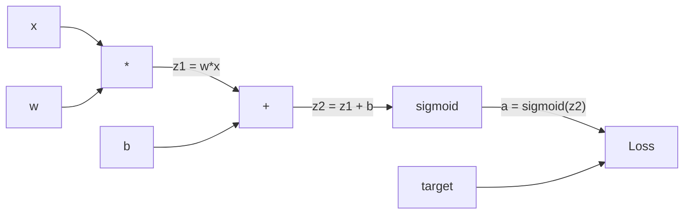
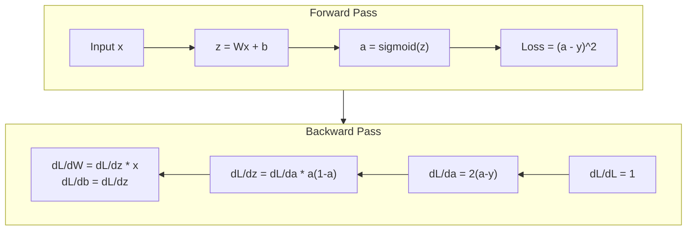
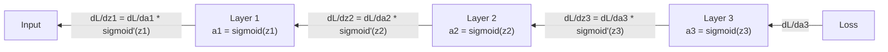

# Réponse de la propagation de la propagation à partir de zéro

> La répartition est l'algorithme qui rend possible l'apprentissage. Sans elle, les réseaux neuraux sont juste des générateurs de nombres aléatoires coûteux.

> Le rétroviseur est un algorithme qui rend possible l'apprentissage. Sans lui, le réseau neural n'est qu'un générateur de nombres aléatoires coûteux.

> **【中文解读】**Le rétroviseur est l'algorithme central permettant au réseau neural de pouvoir "apprendre". Sans lui, le réseau neural n'est qu'un ensemble de nombres aléatoires. Sa nature est de calculer avec une chaîne de haute efficacité le degré de tous les paramètres.

**Type:** Build
**Languages:** Python
**Prerequisites:** Lesson 03.02 (Multi-Layer Networks)
**Time:** ~120 minutes

## Objectifs d'apprentissage

- Implémenter un moteur autograd basé sur la valeur qui construit un graphique de calcul et compute les gradients par tri topologique
  实现 un moteur automatique de calcul basé sur la valeur, construire des diagrammes de calcul et passer par la planification des échelles de calcul
- Dériver le passage arrière pour l'addition, la multiplication et le sigmoïde en utilisant la règle de la chaîne
  Utilisation de la loi de la chaîne pour la propagation de la propagation de la chaîne
- Formez un réseau multicouche sur XOR et la classification de cercle en utilisant uniquement votre moteur de répartition à partir de zéro
   Utilisez uniquement votre moteur de propagation à l'inverse construit à partir de zéro pour entraîner sur des réseaux multilevel XOR et en forme de rouleau
- Identifier le problème de la disparition des gradients dans les réseaux sigmoïdes profonds et expliquer pourquoi les gradients se rétrécissent de manière exponentielle
  Identifier la profondeur de sigmoïde  problème de disparition de la gradience dans le réseau, expliquer pourquoi la gradience s'est réduite

> **【中文解读】**Objectif du chapitre: construire un moteur de décomposition automatique similaire à PyTorch autograd, en utilisant la loi de la chaîne pour induire l'ajout de la propagation de la ligne de mesure, l'entraînement de la classe XOR et de la classe de décomposition, la compréhension du problème de la disparition de la ligne de mesure.

## Le problème , l' introduction du problème

Votre réseau a une seule couche cachée avec 768 entrées et 3072 sorties. C'est 2 359 296 poids. Il a fait une mauvaise prédiction. Quels poids ont causé l'erreur? Tester chaque poids individuellement signifie 2,3 millions de passes en avant. La propagation arrière compute les 2,3 millions de gradients dans un seul pass en arrière. Ce n'est pas une optimisation. C'est la différence entre entraîné et impossible.

> Votre réseau a 768 entrées  3072 sorties cachées ⋅ c'est 2,359,296 pouvoirs ⋅ il a fait une prédiction erronée ⋅ quels pouvoirs ont conduit à une erreur ⋅ test individuel chaque pouvoir signifie 230 millions de fois avant et avant propagation ⋅ contre propagation dans le calcul de tous les 230 millions de degrés dans la propagation unique ⋅ contre propagation ⋅ ce n'est pas une optimisation ⋅ c'est la différence entre entraîné et impossible ⋅

L'approche naïve: prendre un poids, le pousser par une petite quantité, faire le passage vers l'avant à nouveau, mesurer si la perte est montée ou descendue. Cela vous donne le gradient de ce poids. Maintenant faites-le pour chaque poids du réseau. Multipliez par des milliers de pas d'entraînement et des millions de points de données. Vous auriez besoin de temps géologique pour entraîner quelque chose d'utile.

> Paule méthode: prendre un poids, petit à petit, redémarrer, faire avancer, mesurer la perte est de monter ou de descendre.  Ainsi vous obtenez cette échelle de poids. À présent, chaque poids du réseau est fait. Multipliez avec des milliers de étapes de formation et des millions de points de données. Vous avez besoin de temps de géologie pour former quelque chose d'utile.

La propagation en arrière résout ceci. Un passage vers l'avant, un passage vers l'arrière, tous les gradients calculés. Le truc est la règle de chaîne du calcul, appliquée systématiquement à un graphique informatique. C'est l'algorithme qui a rendu l'apprentissage en profondeur pratique. Sans elle, nous serions toujours coincés sur des problèmes de jouets.

> Une fois à l'avant, une fois à l'arrière, toutes les échelles sont calculées.

> **【中文解读】**Un réseau de 235 millions de poids, si l'on essaie individuellement de calculer la gradience, nécessite 235 millions de fois de propagation avant et avant. La propagation contre-orientée ne nécessite qu'une seule fois de propagation avant et avant + une fois de propagation avant et avant pour calculer toutes les gradiences.

## Le concept de base.

### La règle de la chaîne, appliquée aux réseaux.

Vous avez vu la règle de la chaîne dans la phase 01, leçon 05. Rapide résumé: si y = f(g(x)), alors dy/dx = f'(g(x)) * g'(x. Vous multipliez les dérivés le long de la chaîne.

> Vous êtes en train de faire une étude sur la façon dont les données sont utilisées pour la recherche et la recherche de données.

Dans un réseau neuronal, la "chaîne" est la séquence d'opérations de l'entrée à la perte. Chaque couche applique des poids, ajoute des biais, passe par une activation. La fonction de perte compare la sortie finale à la cible. La répartition arrière suit cette chaîne vers l'arrière, calculant comment chaque opération a contribué à l'erreur.

> Dans le réseau neuronal, la "chaîne" est la séquence d'opérations de l'entrée à la perte. Chaque couche d'application de la charge de charge, de la mise à la place, de la fonction d'activation. La fonction de perte sera comparée à l'objectif.

> **【中文解读】**链式法则: si y = f(g(x)),则 dy/dx = f'(g(x)) * g'(x) ・・・ dans le réseau de neurones, "chaîne" est une série d'opérations de l'entrée à la perte。

> **【拓展：PyTorch autograd 的核心】**PyTorch de `loss.backward()`C'est le principe d'exécution automatique de la chaîne. Il est utilisé dans le calcul des valeurs de l'opération avant la propagation, puis dans le processus de propagation à l'arrière.

### Graphiques de calcul

Chaque passage vers l'avant construit un graphique. Chaque nœud est une opération (multiplication, addition, sigmoid). Chaque bord porte une valeur vers l'avant et un gradient vers l'arrière.

> Chaque fois que nous allons vers l'avant, nous construisons un diagramme. Chaque élément est une opération.



Passage vers l'avant: les valeurs circulent de gauche à droite. x et w produisent z1 = w*x. Ajoutez b pour obtenir z2. Sigmoid donne l'activation a. Comparer a à cible y en utilisant la fonction de perte.

> Avant de se propager: valeur de gauche à droite de la circulation. x 和 w 产生 z1 = w*x。加 b 得到 z2。Sigmoid 给出激活 a。用损失函数将 a 与目标 y 进行比较。

Passage à l'envers: les gradients circulent de droite à gauche. Commencez par dL/da (comme la perte change avec l'activation). Multipliez par da/dz2 (dérivé sigmoïde). Cela donne dL/dz2. Divisez en dL/db (qui est égal à dL/dz2, puisque z2 = z1 + b) et dL/dz1.

> Réponse: la différence entre les deux est de la différence de la différence de la différence de la différence de la différence de la différence de la différence de la différence de la différence de la différence de la différence de la différence de la différence de la différence de la différence de la différence de la différence de la différence de la différence de la différence de la différence de la différence de la différence de la différence de la différence de la différence de la différence de la différence de la différence de la différence de la différence de la différence de la différence de la différence de la différence de la différence de la différence de la différence de la différence de la différence de la différence de la différence de la différence de la différence de la différence de la différence de la différence de la différence de la différence de la différence de la différence de la différence de la différence de la différence de la différence de la différence de la différence de la différence de la différence de la différence de la différence de la différence de la différence de la différence de la différence.

Chaque nœud du graphique a une tâche pendant le passage en arrière: prendre le gradient venant d'en haut, multiplier par sa dérivée locale, et le transmettre vers le bas.

> Dans le diagramme, chaque point de propagation à l'inverse a une seule tâche: recevoir la échelle de propagation, multiplier par son propre nombre de directions locales, transmettre, transmettre.

> **【中文解读】**Chaque nœud du diagramme de calcul (à la fois le multiplicateur, le multiplicateur, le sigmoïde) doit faire une seule chose: recevoir le gradient supérieur, multiplier par son propre directrice locale, le transmettre vers le bas.

### Pourvant contre arrière.



Le pass avant stocke toutes les valeurs intermédiaires: z, a, les entrées de chaque couche. Le pass arrière a besoin de ces valeurs stockées pour calculer les gradients. C'est le compromis mémoire-computation au cœur du backprop. Vous échangez la mémoire (activations de stockage) pour la vitesse (un pass au lieu de millions).

> Il faut calculer la température de ces réserves pour calculer la valeur de ces réserves. C'est le poids de calcul du cœur de la circulation.

> **【中文解读】**C'est le poids central de la propagation: une fois contre la propagation et plusieurs millions de fois contre la propagation.

### Le flux graduel à travers un réseau

Pour un réseau à trois couches, la chaîne de gradients à travers chaque couche:

> Pour les réseaux de 3 niveaux, la gradience passe par chaque couche de lien transmis:



À chaque couche, le gradient est multiplié par le dérivé sigmoïde. Le dérivé sigmoïde est un * (1 - a), qui se dégage à 0,25 (lorsque a = 0,5).

> Dans chaque étage, le gradient est multiplié par le nombre de sigmoïdes. Le gradient est un * (1 - a), la valeur maximale est de 0,25 lorsque a = 0,5 时)

### Les Gradients disparaissent.

C'est le problème du gradient qui disparaît. Sigmoid écraser sa sortie entre 0 et 1. Son dérivé est toujours inférieur à 0,25.

> C'est le problème de la disparition des échelles. Le sigmoïde va produire une compression entre 0 et 1. Leur nombre de conducteurs est toujours inférieur à 0,25 et se compose de suffisamment de couches sigmoïdes.

```
sigmoid(z):     Output range [0, 1]              # 输出范围 [0, 1]
sigmoid'(z):    Max value 0.25 (at z = 0)        # 导数最大值 0.25（在 z = 0 时）

After 5 layers:   gradient * 0.25^5 = 0.001x original       # 5 层后梯度缩到 0.001 倍
After 10 layers:  gradient * 0.25^10 = 0.000001x original    # 10 层后梯度几乎为零
```

C'est pourquoi les réseaux sigmoïdes profonds sont presque impossibles à entraîner. La solution - ReLU et ses variantes - est l'objet de la leçon 04. Pour l'instant, comprenez que le backprop fonctionne parfaitement. Le problème est ce qu'il fonctionne.

> C'est pourquoi la profondeur du sigmoïde  réseau est presque impossible à entraîner. La solution  RéLU  et ses variantes  est le sujet de la 4ème classe.

> **【中文解读】**梯度消失: le nombre de lignes de sigmoïde maximale est de 0,25, chaque passage de la première échelle est multiplié par 0,25──5 層后只剩 0.001,10 層后只剩百万分之一──前几层几乎不收到梯度,所以无法学习──这就是现代网络使用 ReLU的原因──导数恒为 1) remplacer le sigmoïde──

> **【拓展：Transformer 中的梯度流】**Transformateur avec un lien restant (Restaurant Connection) pour résoudre le problème de disparition:`output = x + sublayer(x)` cette échelle peut être transmise directement à travers les couches, ce qui permet aux 96 couches de GPT-3 de s'entraîner également.

### Dériver les gradients pour un réseau à deux couches

Mathématiques concrètes pour un réseau avec une entrée x, une couche cachée avec un sigmoïde, une couche de sortie avec un sigmoïde et une perte MSE.

> 具体推导一个具有输入 x、sigmoid 隐藏层、sigmoid 输出层和MSE 损失的网络──

Pass avant:
```
z1 = W1 * x + b1          # 隐藏层线性变换
a1 = sigmoid(z1)           # 隐藏层激活
z2 = W2 * a1 + b2          # 输出层线性变换
a2 = sigmoid(z2)           # 输出层激活
L = (a2 - y)^2             # MSE 损失
```

Pass en arrière (application étape par étape de la règle de la chaîne):
```
dL/da2 = 2(a2 - y)                              # 损失对输出的梯度
da2/dz2 = a2 * (1 - a2)                         # sigmoid 导数
dL/dz2 = dL/da2 * da2/dz2 = 2(a2 - y) * a2 * (1 - a2)  # 链式法则

dL/dW2 = dL/dz2 * a1                            # 输出层权重梯度
dL/db2 = dL/dz2                                  # 输出层偏置梯度

dL/da1 = dL/dz2 * W2                             # 梯度传播到隐藏层
da1/dz1 = a1 * (1 - a1)                          # sigmoid 导数
dL/dz1 = dL/da1 * da1/dz1                        # 链式法则

dL/dW1 = dL/dz1 * x                              # 隐藏层权重梯度
dL/db1 = dL/dz1                                   # 隐藏层偏置梯度
```

Chaque gradient est le produit des dérivés locaux tracés à partir de la perte.

> Chaque échelle est le multiplication du nombre local de la perte de rétroactivité.

> **【中文解读】**Tradition des niveaux de réseau: à partir de la fonction de perte, on utilise le principe de chaîne étape par étape pour le calcul. Tradition de chaque ligne est la connexion de la ligne de ligne locale.

## Construisez-le en main
```figure
backprop-vanishing
```

## Faites-le

### Étape 1: Le Nœud de valeur

Chaque nombre dans notre calcul devient une valeur. Il stocke ses données, son gradient, et comment il a été créé (il sait donc calculer les gradients en arrière).

> Chaque chiffre de notre calcul devient une valeur. Il stocke des données, des échelles et comment il est créé.

```python
class Value:
    def __init__(self, data, children=(), op=''):
        self.data = data                          # 这个节点的数值
        self.grad = 0.0                           # 损失对这个值的梯度（初始为 0）
        self._backward = lambda: None             # 反向传播函数（初始为空操作）
        self._children = set(children)            # 产生这个值的子节点（用于拓扑排序）
        self._op = op                             # 产生这个值的操作（用于调试可视化）
```

Aucune fonction arrière (no-op)`_children`Suivre les valeurs qui ont produit celui-ci, donc nous pouvons topologiquement trier le graphique plus tard.

> Il n'y a pas de gradient (0,0)`_children`Avec quelles valeurs  généré cette valeur, afin que nous puissions plus tard développer la séquence 

### Étape 2: Opérations avec des fonctions arrière avec l'opération de propagation inverse

Chaque opération crée une nouvelle valeur et définit comment les gradients se déroulent en arrière à travers elle.

> Chaque opération crée une nouvelle valeur et définit la échelle de son passage en direction inverse.

```python
def __add__(self, other):
    other = other if isinstance(other, Value) else Value(other)
    out = Value(self.data + other.data, (self, other), '+')

    def _backward():
        self.grad += out.grad        # 加法的梯度：d(a+b)/da = 1，直接传递
        other.grad += out.grad       # d(a+b)/db = 1，直接传递

    out._backward = _backward
    return out

def __mul__(self, other):
    other = other if isinstance(other, Value) else Value(other)
    out = Value(self.data * other.data, (self, other), '*')

    def _backward():
        self.grad += other.data * out.grad   # 乘法的梯度：d(a*b)/da = b
        other.grad += self.data * out.grad   # d(a*b)/db = a

    out._backward = _backward
    return out
```

Pour l'addition: d(a+b)/da = 1, d(a+b)/db = 1. Ainsi, les deux entrées obtiennent directement le gradient de la sortie.

> 加法:d(a+b)/da = 1,d(a+b)/db = 1── donc les deux entrées sont directement obtenues à la échelle de sortie──

Pour la multiplication: d(a*b)/da = b, d(a*b)/db = a. Chaque entrée obtient la valeur de l'autre fois le gradient de sortie.

> 乘法:d(a*b)/da = b,d(a*b)/db = a。 chaque entrée obtient une autre valeur à travers la taille de sortie。

Le `+=`Une valeur peut être utilisée dans plusieurs opérations. son gradient est la somme des gradients de tous les chemins.

> `+=`C'est la clé. Une valeur peut être utilisée dans plusieurs opérations.

> **【中文解读】**La fréquence de la fréquence de la fréquence de la fréquence de la fréquence de la fréquence de la fréquence de la fréquence de la fréquence de la fréquence de la fréquence de la fréquence de la fréquence de la fréquence de la fréquence de la fréquence de la fréquence de la fréquence de la fréquence de la fréquence de la fréquence de la fréquence de la fréquence de la fréquence de la fréquence de la fréquence de la fréquence de la fréquence de la fréquence de la fréquence de la fréquence de la fréquence de la fréquence de la fréquence de la fréquence de la fréquence de la fréquence de la fréquence de la fréquence de la fréquence de la fréquence de la fréquence de la fréquence de la fréquence de la fréquence de la fréquence de la fréquence de la fréquence de la fréquence de la fréquence de la fréquence de la fréquence de la fréquence de la fréquence de la fréquence de la fréquence de la fréquence de la fréquence de la fréquence de la fréquence de la fréquence de la fréquence de la fréquence de la fréquence de la fréquence de la fréquence de la fréquence de la fréquence de la fréquence de la fréquence de la fréquence de la fréquence de la fréquence de la fréquence de la fréquence de la fréquence de la fréquence de la fréquence de la fréquence de la fréquence de la fréquence de la fréquence de la fréquence de la fréquence de la fréquence de la fréquence de la fréquence de la fréquence de la fréquence de la fréquence de la fréquence de la fréquence de la fréquence de la fréquence de la fréquence de la fréquence de la fréquence de la fréquence de la fréquence de la fréquence de la fréquence de la fréquence de la fréquence de la fréquence de la fréquence de la fréquence de la fréquence de la fréquence`+=`Au lieu de`=`, puisqu'une valeur peut être utilisée par plusieurs opérations, la gradience doit être ajoutée à tous les chemins.

### Étape 3: Sigmoid et Perte

```python
import math

def sigmoid(self):
    x = self.data
    x = max(-500, min(500, x))    # 裁剪防止溢出
    s = 1.0 / (1.0 + math.exp(-x))  # 前向：计算 sigmoid
    out = Value(s, (self,), 'sigmoid')

    def _backward():
        self.grad += (s * (1 - s)) * out.grad  # 反向：sigmoid 导数 = σ(x) * (1 - σ(x))

    out._backward = _backward
    return out
```

Le dérivé sigmoïde: sigmoïde ((x) * (1 - sigmoïde ((x)). Nous avons calculé sigmoïde ((x) = s pendant le passage vers l'avant.

> Sigmoid 导数:sigmoid(x) * (1 - sigmoid(x))。

```python
def mse_loss(predicted, target):
    diff = predicted + Value(-target)  # predicted - target
    return diff * diff                  # (predicted - target)^2
```

MSE pour une seule sortie: (prévisible - cible) ^ 2. Nous exprimons la soustraction en addition avec une valeur négative.

> 单输出 MSE:(prévisible - cible) ^2。 我们将减法表示为加上取反的值──

### Étape 4: Pass en arrière.

Le tri topologique nous permet de traiter les nœuds dans le bon ordre - le gradient d'un nœud est complètement accumulé avant de nous propager à travers lui.

> La régulation de l'ordre de traitement des nœuds est assurée par le bon ordre.

```python
def backward(self):
    topo = []                         # 拓扑排序结果
    visited = set()

    def build_topo(v):
        if v not in visited:
            visited.add(v)
            for child in v._children:    # 先访问所有子节点
                build_topo(child)
            topo.append(v)               # 子节点都访问完后，再把自己加入列表

    build_topo(self)
    self.grad = 1.0                     # 损失对自己的梯度 = 1（dL/dL = 1）
    for v in reversed(topo):            # 逆序遍历（从输出到输入）
        v._backward()                   # 每个节点执行自己的反向传播函数
```

Commencez par la perte (gradient = 1.0, puisque dL/dL = 1).`_backward`Elle pousse les gradients à ses enfants.

> Depuis le départ de la perte de l'ordre, la gradience est de 1,0, parce que dL/dL = 1)`_backward`La gradience sera envoyée à ses petits nœuds.

> **【中文解读】**拓排序保证: après une accumulation complète du gradient d'un nœud, il est seulement possible de transmettre son gradient de distribution.`loss.backward()`La logique centrale de la question est de savoir si la réponse est vraie.

### Étape 5: Couche et réseau

```python
import random

class Neuron:
    def __init__(self, n_inputs):
        scale = (2.0 / n_inputs) ** 0.5   # He 初始化缩放因子，防止 sigmoid 饱和
        self.weights = [Value(random.uniform(-scale, scale)) for _ in range(n_inputs)]
        self.bias = Value(0.0)

    def __call__(self, x):
        act = sum((wi * xi for wi, xi in zip(self.weights, x)), self.bias)  # 加权求和 + 偏置
        return act.sigmoid()  # sigmoid 激活

    def parameters(self):
        return self.weights + [self.bias]   # 返回所有可训练参数


class Layer:
    def __init__(self, n_inputs, n_outputs):
        self.neurons = [Neuron(n_inputs) for _ in range(n_outputs)]

    def __call__(self, x):
        out = [n(x) for n in self.neurons]
        return out[0] if len(out) == 1 else out  # 单神经元时直接返回值

    def parameters(self):
        params = []
        for n in self.neurons:
            params.extend(n.parameters())
        return params


class Network:
    def __init__(self, sizes):
        self.layers = []
        for i in range(len(sizes) - 1):
            self.layers.append(Layer(sizes[i], sizes[i + 1]))  # 按尺寸列表构建层

    def __call__(self, x):
        for layer in self.layers:
            x = layer(x)                    # 逐层前向传播
            if not isinstance(x, list):
                x = [x]
        return x[0] if len(x) == 1 else x

    def parameters(self):
        params = []
        for layer in self.layers:
            params.extend(layer.parameters())
        return params

    def zero_grad(self):
        for p in self.parameters():
            p.grad = 0.0    # 清零所有梯度（每次反向传播前必须调用）
```

Un neurone prend les entrées, calcule la somme pondérée + le biais et applique le sigmoïde.`parameters()`La méthode recueille toutes les valeurs appréciables afin que nous puissions les mettre à jour.

> Neurone recevoir, saisir, calculer, ajouter et placer, puis appliquer sigmoid──权重初始化按平方(2/n_inputs) 缩放以防止更深层网络中的 sigmoid和──层是 Neuron 的列表──网络是层 的列表──`parameters()`方法 de collecter tout ce qui peut être appris de la valeur afin de le mettre à jour.

> **【中文解读】**Neurone = un groupe de neurones, réseau = un groupe de niveaux.`parameters()`                                                                                                                                                                                                                                                                                                                                                                                                                                                                                                                             `zero_grad()`清零梯度 (~)                                                                                                                                                                                                                                                           `model.parameters()`et `optimizer.zero_grad()`Le type original.

### Étape 6: entraînement sur XOR entraînement XOR

```python
random.seed(42)
net = Network([2, 4, 1])  # 2 输入 → 4 隐藏神经元 → 1 输出

xor_data = [
    ([0.0, 0.0], 0.0),
    ([0.0, 1.0], 1.0),
    ([1.0, 0.0], 1.0),
    ([1.0, 1.0], 0.0),
]

learning_rate = 1.0

for epoch in range(1000):
    total_loss = Value(0.0)
    for inputs, target in xor_data:
        x = [Value(i) for i in inputs]
        pred = net(x)                          # 前向传播
        loss = mse_loss(pred, target)          # 计算损失
        total_loss = total_loss + loss         # 累积损失

    net.zero_grad()           # 清零梯度
    total_loss.backward()     # 反向传播：计算所有参数的梯度

    for p in net.parameters():
        p.data -= learning_rate * p.grad      # 梯度下降更新权重

    if epoch % 100 == 0:
        print(f"Epoch {epoch:4d} | Loss: {total_loss.data:.6f}")

print("\nXOR Results:")
for inputs, target in xor_data:
    x = [Value(i) for i in inputs]
    pred = net(x)
    print(f"  {inputs} -> {pred.data:.4f} (expected {target})")
```

De prédictions aléatoires à des sorties XOR correctes, entièrement guidées par des gradients de calcul de rétroviseur et des poids poussés dans la bonne direction.

> 观察损失下降── de la prédiction de l'accident à la sortie XOR correcte, entièrement par la gradience de calcul de la propagation inverse et le poids sera poussé dans la bonne direction pour être propulsé──

> **【中文解读】** cycle de formation:                                                                                                                                                                                                                                                            

### Étape 7: Classification du cercle

Dans la leçon 02, vous avez réglé les poids à la main pour la classification des cercles.

> Dans la deuxième classe, tu as réglé manuellement le poids des classes en forme de rouleau.

```python
random.seed(7)

def generate_circle_data(n=100):
    data = []
    for _ in range(n):
        x1 = random.uniform(-1.5, 1.5)
        x2 = random.uniform(-1.5, 1.5)
        label = 1.0 if x1 * x1 + x2 * x2 < 1.0 else 0.0   # 距原点 < 1 则为"内部"
        data.append(([x1, x2], label))
    return data

circle_data = generate_circle_data(80)

circle_net = Network([2, 8, 1])  # 2-8-1 网络
learning_rate = 0.5

for epoch in range(2000):
    random.shuffle(circle_data)       # 打乱数据顺序
    total_loss_val = 0.0
    for inputs, target in circle_data:
        x = [Value(i) for i in inputs]
        pred = circle_net(x)
        loss = mse_loss(pred, target)
        circle_net.zero_grad()         # 清零梯度
        loss.backward()                # 反向传播
        for p in circle_net.parameters():
            p.data -= learning_rate * p.grad  # 更新权重
        total_loss_val += loss.data

    if epoch % 200 == 0:
        correct = 0
        for inputs, target in circle_data:
            x = [Value(i) for i in inputs]
            pred = circle_net(x)
            predicted_class = 1.0 if pred.data > 0.5 else 0.0
            if predicted_class == target:
                correct += 1
        accuracy = correct / len(circle_data) * 100
        print(f"Epoch {epoch:4d} | Loss: {total_loss_val:.4f} | Accuracy: {accuracy:.1f}%")
```

Nous utilisons SGD en ligne ici - mettre à jour les poids après chaque échantillon au lieu d'accumuler le lot complet. Cela rompt la symétrie plus rapidement et évite la saturation sigmoïde sur le paysage de perte complète.

> Il est utilisé en ligne SGD pour mettre à jour le poids après chaque échantillon, plutôt que de rassembler l'ensemble du lot.

Aucun réglage manuel. Le réseau découvre la limite de décision circulaire par lui-même. C'est la puissance de la répartition: vous définissez l'architecture, la fonction de perte et les données. L'algorithme détermine les poids.

> 无需手动调权重――网络自学画圆形决策边界―― voilà la force de la propagation inverse: tu définis l'architecture、 la perte de fonction et de données, l'algorithme trouve lui-même le vrai pouvoir­poids――

> **【中文解读】**Il est utilisé en ligne SGD (en version de l'échantillon) plutôt que de la mise à jour en masse.

## Utilisez-le dans la pratique.

PyTorch fait tout ce qui est ci-dessus en quelques lignes. L'idée de base est identique - autograd construit un graphique de calcul pendant le passage vers l'avant et le trace vers l'arrière pour calculer les gradients.

> PyTorch utilise plusieurs lignes de code pour accomplir toutes les fonctions ci-dessus.

```python
import torch
import torch.nn as nn

model = nn.Sequential(
    nn.Linear(2, 4),       # 对应我们的 Layer(2, 4)
    nn.Sigmoid(),           # 对应 sigmoid 激活
    nn.Linear(4, 1),       # 对应我们的 Layer(4, 1)
    nn.Sigmoid(),
)
optimizer = torch.optim.SGD(model.parameters(), lr=1.0)  # 对应我们的手动梯度下降
criterion = nn.MSELoss()  # 对应我们的 mse_loss

X = torch.tensor([[0,0],[0,1],[1,0],[1,1]], dtype=torch.float32)
y = torch.tensor([[0],[1],[1],[0]], dtype=torch.float32)

for epoch in range(1000):
    pred = model(X)                  # 前向传播
    loss = criterion(pred, y)        # 计算损失
    optimizer.zero_grad()            # 清零梯度（对应 net.zero_grad()）
    loss.backward()                  # 反向传播（对应 total_loss.backward()）
    optimizer.step()                 # 更新权重（对应 p.data -= lr * p.grad）

print("PyTorch XOR Results:")
with torch.no_grad():                # 推理模式，不计算梯度
    for i in range(4):
        pred = model(X[i])
        print(f"  {X[i].tolist()} -> {pred.item():.4f} (expected {y[i].item()})")
```

`loss.backward()`est votre `total_loss.backward()`- Je suis là .`optimizer.step()`C' est votre manuel .`p.data -= lr * p.grad`- Je suis là .`optimizer.zero_grad()`est votre `net.zero_grad()`PyTorch gère l'accélération de la GPU, la précision mixte, le contrôle des gradients et des centaines de types de couches.

> `loss.backward()`C'est à toi !`total_loss.backward()`Il y a une autre.`optimizer.step()`C'est à toi de le faire.`p.data -= lr * p.grad`Il y a une autre.`optimizer.zero_grad()`C'est à toi !`net.zero_grad()` Le même algorithme, réalisation industrielle  PyTorch  traitement de GPU accélération ✓ épreuve mixte ✓ point de vérification de la gradience et des centaines de types de niveaux  Mais la propagation à l'inverse est de mettre en œuvre le même principe de chaîne 

L'entraînement fait le pass avant, puis le pass arrière, puis les peses actualisées. L'inference ne passe que par la passe avant. Pas de dégradations, pas de mises à jour. Cette distinction est importante car l'inférence est ce qui se passe dans la production. Quand vous appelez une API comme Claude ou GPT, vous faites une inférence -- votre prompt passe à travers le réseau, et les jetons sortent de l'autre bout. Aucun changement de poids. Comprendre le backprop est important parce qu'il a façonné chaque poids de ce réseau.

> 训练运行前向传播,然后反向传播,然后更新权重――推理只运行前向传播――没有梯度,没有更新―― Cette différence est importante, car le raisonnement est ce qui se passe dans l'environnement de production―― lorsque vous faites appel à Claude ou GPT etc API, vous effectuez le raisonnement  your提示词前向流过网络,token de l'autre côté sortie――权重不变―― comprendre le contraire-orientation est important, car il a façonné chaque pouvoir dans ce réseau――

> **【中文解读】**PyTorch de `loss.backward()`= Nous avons écrit à la main`backward()`- Je suis désolé .`optimizer.step()`= Nous avons écrit à la main`p.data -= lr * p.grad` entraînement en faisant du pré-orientation + contre-orientation + mise à jour, de la mise en œuvre en faisant du pré-orientation.

## Envoyez les marchandises .

Cette leçon donne:
- `outputs/prompt-gradient-debugger.md`-- une requête réutilisable pour diagnostiquer des problèmes de gradient (disparition, explosion, NaN) dans n'importe quel réseau neuronal

> Le programme de formation`outputs/prompt-gradient-debugger.md`- Un diagnostic récurrent de tout problème de niveau central du réseau neurologique (sortir, exploser, NaN)

## Les exercices

1. Ajouter un `__sub__`La méthode de la classe de valeur (a - b = a + (-1 * b)).`__neg__`La méthode de calcul de la valeur de la valeur de la valeur de la valeur de la valeur de la valeur de la valeur de la valeur de la valeur de la valeur de la valeur de la valeur de la valeur de la valeur de la valeur de la valeur de la valeur de la valeur de la valeur de la valeur de la valeur de la valeur de la valeur de la valeur de la valeur de la valeur de la valeur de la valeur de la valeur de la valeur de la valeur de la valeur de la valeur de la valeur de la valeur de la valeur de la valeur de la valeur de la valeur de la valeur de la valeur de la valeur de la valeur de la valeur de la valeur de la valeur de la valeur de la valeur de la valeur de la valeur de la valeur de la valeur de la valeur de la valeur de la valeur de la valeur de la valeur de la valeur de la valeur de la valeur de la valeur de la valeur de la valeur de la valeur de la valeur de la valeur de la valeur de la valeur de la valeur de la valeur de la valeur de la valeur de la valeur de la valeur de la valeur de la valeur de la valeur de la valeur est est est est la valeur de la valeur de la valeur de la valeur de la valeur de la valeur de la valeur de la valeur de la valeur de la valeur de la valeur de la valeur de la valeur de la valeur de la valeur de la valeur de la valeur de la valeur de la valeur de la valeur de la valeur de la valeur de la valeur de la valeur de la valeur de la valeur de la valeur de la valeur de la valeur de la valeur de la valeur de la valeur de la valeur de la valeur de la valeur de la valeur de la valeur de la valeur de la valeur de la valeur de la valeur de la valeur de la valeur de la valeur de la valeur de la valeur de la valeur est est est est est est est est est est est de la valeur de la valeur de la valeur de la valeur de la valeur de la valeur de la valeur de la valeur de la valeur de la valeur de la valeur est est est est est est est est est est est est est est est est est est est de la valeur de la valeur de la valeur de la valeur de la valeur de la valeur de la valeur de la valeur de la valeur de la valeur de la valeur de la valeur de la valeur de la valeur de la valeur de la valeur de la valeur de la valeur de la valeur de la valeur de la valeur de
   > **练习 1：**给 Value 类加减法和取负操作──用手动计算验证 (a - b) ^ 2 的梯度是否正确──

2. Ajouter un `relu`La méthode de la valeur (exécution max ((0, x), dérivé est 1 si x > 0, alors 0).
   > **练习 2：**给 Value 添加 ReLU 方法──用 ReLU 替换隐藏层的sigmoid,训练 XOR 并对比收速度──ReLU 应该更快──这是下一课的预览──

3. La mise en œuvre d'une `__pow__`La méthode de la valeur pour les puissances entières.`mse_loss`avec un bon`(predicted - target) ** 2`Expression. Vérifiez que les gradients correspondent à l'implémentation originale.
   > **练习 3：**给 Value 添加运算方法, en utilisant cette méthode, réécrire MSE 损失――验证梯度与原实现一致――

4. Ajouter des coups de gradient à la boucle d' entraînement: après appel `backward()`Traînez un réseau plus profond (4+ couches avec sigmoïde) et comparez les courbes de perte avec et sans coupe. C'est votre première défense contre les gradients explosants.
   > **练习 4：**Dans le cycle d'entraînement, la taille est ajoutée à la taille [-1, 1])。 entraînement à la coupe de la ligne de coupe de 4+ couches.

5. Construisez une visualisation: après avoir suivi une formation sur XOR, imprimez le gradient de chaque paramètre du réseau. Identifiez la couche qui a les plus petits gradients. Cela démontre le problème de gradient qui disparaît dont vous avez lu dans la section Concept.
   > **练习 5：**training XOR 后, imprimer chaque paramètre de gradience── trouver quel est le niveau de gradience le plus faible, le problème de disparition de la gradience intuitive──

## Les termes clés

| Term | What people say | What it actually means |
|------|----------------|----------------------|
| Backpropagation | "The network learns" | An algorithm that computes dL/dw for every weight by applying the chain rule backward through the computational graph |
| Computational graph | "The network structure" | A directed acyclic graph where nodes are operations and edges carry values (forward) and gradients (backward) |
| Chain rule | "Multiply the derivatives" | If y = f(g(x)), then dy/dx = f'(g(x)) * g'(x) -- the mathematical foundation of backpropagation |
| Gradient | "The direction of steepest ascent" | The partial derivative of the loss with respect to a parameter -- tells you how to change that parameter to reduce the loss |
| Vanishing gradient | "Deep networks don't learn" | Gradients shrink exponentially as they propagate through layers with saturating activations like sigmoid |
| Forward pass | "Running the network" | Computing the output from inputs by sequentially applying each layer's operations and storing intermediate values |
| Backward pass | "Computing gradients" | Traversing the computational graph in reverse, accumulating gradients at each node using the chain rule |
| Learning rate | "How fast it learns" | A scalar that controls the step size when updating weights: w_new = w_old - lr * gradient |
| Topological sort | "The right order" | An ordering of graph nodes where each node appears after all nodes it depends on -- ensures gradients are fully accumulated before propagation |
| Autograd | "Automatic differentiation" | A system that builds computational graphs during forward computation and automatically computes gradients -- what PyTorch's engine does |

| 术语 | 通俗说法 | 实际含义 |
|------|---------|---------|
| 反向传播 (Backpropagation) | "网络在学习" | 用链式法则沿计算图反向计算每个权重的 dL/dw 的算法 |
| 计算图 (Computational graph) | "网络结构" | 有向无环图，节点是操作，边传递值（前向）和梯度（反向） |
| 链式法则 (Chain rule) | "把导数乘起来" | y = f(g(x)) → dy/dx = f'(g(x)) * g'(x)——反向传播的数学基础 |
| 梯度 (Gradient) | "最陡上升方向" | 损失对参数的偏导数——告诉你怎么改参数能降低损失 |
| 梯度消失 (Vanishing gradient) | "深层网络学不动" | 梯度经过饱和激活函数（如 sigmoid）逐层指数级缩小 |
| 前向传播 (Forward pass) | "跑网络" | 从输入逐层计算输出，存储中间值 |
| 反向传播过程 (Backward pass) | "算梯度" | 逆序遍历计算图，用链式法则逐节点累加梯度 |
| 学习率 (Learning rate) | "学多快" | 控制权重更新步长的标量：w_new = w_old - lr * gradient |
| 拓扑排序 (Topological sort) | "正确的顺序" | 保证每个节点的梯度完全累加后再往下传播的节点排列 |
| 自动微分 (Autograd) | "自动求导" | 前向时构建计算图，自动计算梯度的系统——PyTorch 引擎的核心 |

## Encore une lecture

- Rumelhart, Hinton & Williams, "Apprendre les représentations par erreurs de propagation en arrière" (1986) - le document qui a fait de la propagation en arrière un cours de formation en réseau multi-couches
  Rumelhart、Hinton 和 Williams, 通过反向传播误差学习表示(1986) 让反向传播成为主流并解锁多层网络训练的论文
- 3Blue1Brown, série "Réseaux neuronaux" (https://www.youtube.com/playlist?list=PLZHQObOWTQDNU6R1_67000Dx_ZCJB-3pi) -- la meilleure explication visuelle de la propagation en arrière et du débit de gradients à travers les réseaux
  3Blue1Brown,  Neural Networks série  sur les réactions et les tendances de propagation dans le réseau
