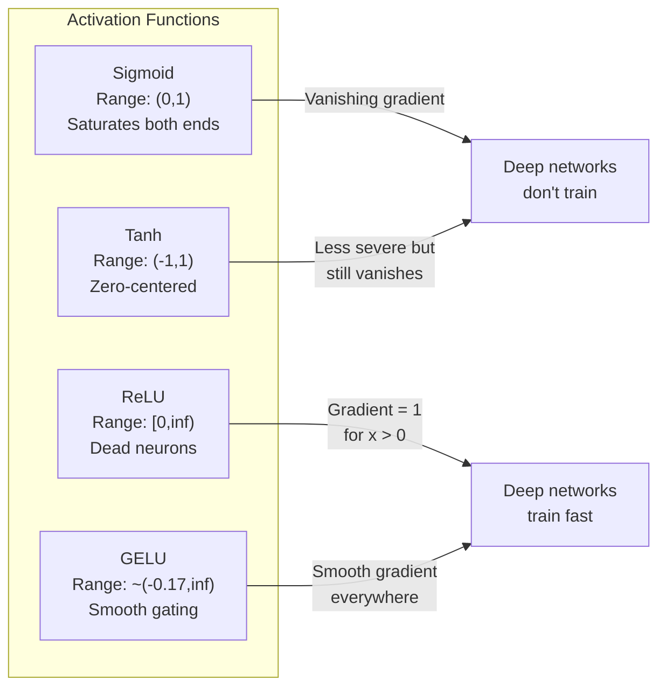
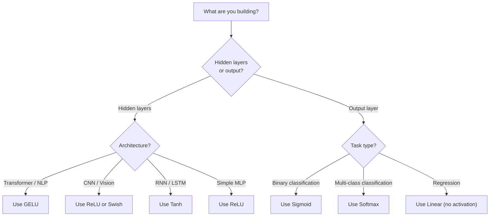

# Fonctions d' activation

> Sans non-linéarité, votre réseau de 100 couches est un matrice de multiplication fantaisiste.

> **【中文解读】**没有非线性激活函数,100 层网络等价于一个矩阵乘法──因为两个线性变换的复合还是线性:W2(W1x+b1)+b2 = (W2W1)x+ (W2b1+b2)──激活函数打破这种线性叠加,让每个层都能为网络增加真正表达能力──

**Type:** Build
**Languages:** Python
**Prerequisites:** Lesson 03.03 (Backpropagation)
**Time:** ~75 minutes

## Objectifs d'apprentissage

- Implémenter sigmoid, tanh, ReLU, Leaky ReLU, GELU, Swish et softmax avec leurs dérivés à partir de zéro
- Diagnosticer le problème de gradient de disparition en mesurant les magnitudes d'activation à travers 10 couches avec différentes activations
- Détecter les neurones morts dans un réseau ReLU et expliquer pourquoi GELU évitera ce mode de défaillance
- Sélectionnez la fonction d'activation correcte pour une architecture donnée (transformateur, CNN, RNN, couche de sortie)

> **【中文解读】**Objectif du chapitre: réaliser 7 types de fonctions actives et leurs directions, en examinant les neurones de mort dans la LUR, en choisissant les fonctions actives adaptées à différentes structures, en examinant les problèmes de disparition de la LUR.

## Le problème , l' introduction du problème

L'étape de deux transformations linéaires: y = W2 ((W1x + b1) + b2. Élargir: y = W2W1x + W2b1 + b2. C'est juste y = Ax + c - une transformation linéaire unique. Peu importe le nombre de couches linéaires que vous empilerez, le résultat s'effondre à une matrice multipliée. Votre réseau de 100 couches a la même puissance de représentation qu'une seule couche.

> 堆叠两层线性变换:y = W2(W1x + b1) + b2。展开后:y = W2W1x + W2b1 + b2。这不过是 y = Ax + c一个单独的线性变换──无论你堆叠多少线性层,结果都会缩短为一次矩阵乘法──你的100层网络和单层网络具有相同表示能力──

Ce n'est pas une curiosité théorique. Cela signifie qu'un réseau linéaire profond ne peut littéralement pas apprendre XOR, ne peut pas classer un ensemble de données spirale, ne peut pas reconnaître un visage. Sans fonctions d'activation, la profondeur est une illusion.

> Ceci n'est pas une curiosité théorique. Cela signifie que le réseau de profondeur linéaire est en réalité incapable d'apprendre XOR, incapable de séparer les données en hélice, incapable de reconnaître les visages humains.

Les fonctions d'activation brisent la linéarité. Ils déforment la sortie de chaque couche à travers une fonction non linéaire, donnant au réseau la capacité de plier les limites de décision, approximer les fonctions arbitraires et d'apprendre réellement. Mais choisissez la mauvaise activation et vos gradients disparaissent à zéro (sigmoïdes dans les réseaux profonds), explosent à l'infini (activations illimitées sans initialisation minutieuse), ou vos neurones meurent définitivement (ReLU avec de grands biais négatifs). Le choix de la fonction d'activation détermine directement si votre réseau apprend du tout.

> Les fonctions activées ont rompu la ligneurité. Elles donnent à chaque niveau de sortie des fonctions non-lineures, la capacité de prendre des décisions et de se rapprocher de n'importe quelle fonction et d'apprendre réellement. Mais elles choisissent une fonction activée, la gradience disparaissant pour être zéro.

> **【中文解读】**堆叠两层线性变换 y = W2(W1x+b1) +b2 展开后就是一个线性变换 y = Ax+c。不管叠加多少层,结果都等价于一个矩阵乘法深度是假的。

## Le concept de base.

### Pourquoi la non-linéarité est nécessaire Pourquoi il faut être non-linéaire

La multiplication de matrice est composable. Multiplier un vecteur par la matrice A puis la matrice B est identique à la multiplication par AB. Cela signifie que l'empilage de dix couches linéaires est mathématiquement équivalent à une couche linéaire avec une grande matrice. Tous ces paramètres, toute cette profondeur - gaspillé. Vous avez besoin de quelque chose pour briser la chaîne. C'est ce que font les fonctions d'activation.

> 矩乘法 est assemblable. △ utiliser la première矩 A 乘量, reutiliser la矩 B 乘, égal à utiliser AB 乘── ceci signifie que compiler dix couches linéaires est mathématiquement égal à une couche linéaire avec une grande矩阵. △ tous ces paramètres, toutes ces profondeurs  sont gaspillés. △ Vous avez besoin de quelque chose pour briser cette chaîne. △ c'est le rôle de la fonction activation.

Voici la preuve. Une couche linéaire compute f ((x) = Wx + b.

```
Layer 1: h = W1 * x + b1         # 第一层线性变换
Layer 2: y = W2 * h + b2         # 第二层线性变换
```

Le substitut:

```
y = W2 * (W1 * x + b1) + b2      # 代入 h
y = (W2 * W1) * x + (W2 * b1 + b2)  # 展开
y = A * x + c                     # 合并为单一矩阵——深度消失了！
```

Une couche. Insérer une activation non linéaire g() entre les couches:

```
h = g(W1 * x + b1)               # 加入非线性激活
y = W2 * h + b2
```

Le réseau peut représenter des fonctions non linéaires. Chaque couche supplémentaire avec une activation ajoute une capacité de représentation.

> 现在代入被打破了──W2 * g(W1 * x + b1) + b2 无法简化为单一线性变化──网络可以表示非线性函数──每个带激活函数的附加层都增加表示能力──

> **【中文解读】**Prouvé mathématique: la combinaison de deux mutations de lignes est encore ligneuse. Mais l'insertion d'activations non lignesseuse g) 后, W2 * g) W1x + b1) + b2 无法合并为单一矩阵每多个带活的层, la capacité d'expression du réseau est vraiment augmentée.

### Sigmoïde

La fonction d'activation originale pour les réseaux neuronaux.

> Fonction d'activation initiale du réseau nerveux

```
sigmoid(x) = 1 / (1 + e^(-x))
```

Range de sortie: (0, 1). Légide, différenciable, correspondant à un nombre réel à une valeur semblable à la probabilité.

> 输出范围:(0, 1)──平滑、可微, va tout nombre réel être cartographié en valeur similaire à la probabilité──

Le dérivé:

> Son numéro est:

```
sigmoid'(x) = sigmoid(x) * (1 - sigmoid(x))
```

La valeur maximale de cette dérivée est de 0,25, se produisant à x = 0. En rétroviseur, les gradients se multiplient à travers les couches.

> La valeur maximale du nombre de directions est de 0,25, apparaissant à x = 0 时. Dans la propagation à l'envers, le gradient est multiplié par le gradient de dix niveaux.

```
0.25^10 = 0.000000953674     # 不到原始信号的百万分之一
```

Moins d'un millionième du signal original. C'est le problème de la dégradation qui disparaît. Les gradients dans les premières couches deviennent si petits que les poids se mettent à peine à jour. Le réseau semble apprendre - la perte diminue dans les couches ultérieures - mais les premières couches sont gelées. Les réseaux sigmoïdes profonds ne s'entraînent tout simplement pas.

> Le niveau de la ligne de ligne est si petit que le poids est presque inchangé. Le niveau de la ligne de ligne semble être en train de diminuer, mais le niveau de la ligne de ligne est complètement bloqué.

Problème supplémentaire: les sorties sigmoïdes sont toujours positives (0 à 1), ce qui signifie que les gradients sur les poids sont toujours le même signe.

> 额外问题:sigmoid 输出总是正数(0到1), ce qui signifie que la gradience du poids est toujours la même.

> **【中文解读】**Le nombre de lignes de direction de Sigmoid est de 0,25,10 et le nombre de lignes de lignes de lignes de lignes de lignes de lignes de lignes de lignes de lignes de lignes de lignes de lignes de lignes de lignes de lignes de lignes de lignes de lignes de lignes de lignes de lignes de lignes de lignes de lignes de lignes de lignes de lignes de lignes de lignes de lignes de lignes de lignes de lignes de lignes de lignes de lignes de lignes de lignes de lignes de lignes de lignes de lignes de lignes de lignes de lignes de lignes de lignes de lignes de lignes de lignes de lignes de lignes de lignes de lignes de lignes de lignes de lignes de lignes de lignes de lignes de lignes de lignes de lignes de lignes de lignes de lignes de lignes de lignes de lignes de lignes de lignes de lignes de lignes de lignes de lignes de lignes de lignes de lignes de lignes de lignes de lignes de lignes de lignes de lignes de lignes de lignes de lignes de lignes de lignes de lignes de lignes de lignes de lignes de lignes de lignes de lignes de lignes de lignes de lignes de lignes de lignes de lignes de lignes de lignes de lignes de lignes de lignes de lignes de lignes de lignes de lignes de lignes de lignes de lignes de lignes de lignes de lignes de lignes de lignes de lignes de lignes de lignes de lignes de lignes de lignes de lignes de lignes de lignes de lignes de lignes de lignes de lignes de lignes de lignes de lignes de lignes de lignes de lignes de lignes de lignes de lignes de lignes de lignes de lignes de lignes de lignes de lignes de lignes de lignes de lignes de lignes de lignes de lignes de lignes de lignes de lignes de lignes de lignes de lignes de lignes de lignes de lignes de lignes de lig

> **【拓展：Sigmoid 在现代 AI 中的位置】**Le sigmoïde, bien que désormais utilisé dans les couches cachées, est toujours utilisé dans les couches sortes et sortes de transformateurs.

### Tanh

La version centrée du sigmoïde.

> La version de l'espace de référence de Sigmoid

```
tanh(x) = (e^x - e^(-x)) / (e^x + e^(-x))
```

Range de sortie: (-1, 1). Centré sur zéro, ce qui élimine le problème du zigzag.

> 输出范围:(-1, 1)──零中心化, éliminée 形问题──

Le dérivé:

> Son numéro est:

```
tanh'(x) = 1 - tanh(x)^2
```

La dérivée maximale est de 1,0 à x = 0 - quatre fois mieux que le sigmoïde. Mais le problème du gradient de disparition existe toujours. Pour les grandes entrées positives ou négatives, la dérivée approche de zéro. Dix couches écrasent encore le gradient, seulement moins agressivement.

> Le nombre de lignes directrices maximale est de 1,0 ((x = 0 时)  par rapport au sigmoïde, bon 4 倍── mais le problème de disparition de la lignes directrices est toujours présent. Pour les grandes entrées positives ou négatives, le nombre de lignes directrices tend à se rapprocher de zéro──10 niveaux encore seront pressés  gradient, mais pas si grave──

> **【中文解读】**Tanh est la version zéro centre du sigmoïde, la portée de sortie (-1, 1), la portée maximale de 1,0(par rapport au sigmoïde, bon 4 fois) ・・・ mais la portée de temps de sortie est toujours proche de zéro, le problème de disparition de la portée est toujours présent, mais il n'y a pas de sérieux。

> **【拓展：LSTM 中的 Tanh】**L'état caché et la mémoire candidate du réseau LSTM sont utilisés pour compresser les valeurs de -1 à 1) ⋅ Bien que le transformateur ait fondamentalement remplacé le LSTM, la compréhension de tanh est importante pour comprendre le modèle de la série RNN ⋅

### La révolution de l'apprentissage profond

L'unité linéaire rectifiée. Popularisée pour l'apprentissage en profondeur par Nair et Hinton en 2010 (la fonction elle-même remonte à l'œuvre de Fukushima de 1969), elle a tout changé.

> 修正线性单元──, développé en 2010 par Nair 和 Hinton pour une étude approfondie, la fonction elle-même remonte au travail de Fukushima en 1969 et a tout changé.

```
relu(x) = max(0, x)
```

La dérivée est trivialement simple:

```
relu'(x) = 1  if x > 0
           0  if x <= 0
```

Aucun gradient de disparition pour les entrées positives. Le gradient est exactement 1, passé directement. C'est pourquoi les réseaux profonds sont devenus entraînables - ReLU préserve la magnitude du gradient à travers les couches.

> Il n'y a pas de problème de disparition de la gradience. La gradience est bonne, elle est directe. C'est la raison pour laquelle la profondeur du réseau est devenue entraînable.

Mais il y a un mode d'échec: le problème des neurones morts. Si l'entrée pondérée d'un neurone est toujours négative (en raison d'un grand biais négatif ou d'une initialization malheureuse du poids), sa sortie est toujours zéro, son gradient est toujours zéro et il ne se met jamais à jour. Il est définitivement mort.

> Mais il existe un modèle défaillant: le problème des neurones de mort. Si l'augmentation de puissance d'un neurone est toujours négative (en raison d'un grand décalage négatif ou d'une mauvaise mise en place), sa production est toujours nulle, le degré est toujours nulle, ne se renouvelle jamais.

> **【中文解读】**La RELU est à l'origine de la formation du réseau profond. Mais il y a un problème de "névres de mort": si l'augmentation de charge d'un neurone est toujours négative, il sort toujours 0 ̊, la RELU est à 0, il est impossible de récupérer.

> **【拓展：ReLU 在 CNN 中的统治地位】**Les structures de la CNN utilisent également la régularité (RLU) ou les variantes (Regularity) de la régularité (Regularity) de la régularité (Regularity) de la régularité (Regularity) de la régularité (Regularity) de la régularité (Regularity) de la régularité (Regularity) de la régularité (Regularity) de la régularité (Regularity) de la régularité (Regularity) de la régularité (Regularity) de la régularité (Regularity) de la régularité (Regularity) de la régularité (Regularity) de la régularité (Regularity) de la régularité (Regularity) de la régularité (Regularity).

### Lecture de la réaction

Le remède le plus simple pour les neurones morts.

> La méthode la plus simple pour réparer le névralgi de la mort.

```
leaky_relu(x) = x        if x > 0
                alpha * x if x <= 0
```

Là où l'alpha est une petite constante, généralement 0,01. Le côté négatif a une petite pente au lieu de zéro, de sorte que les neurones morts reçoivent toujours un signal de gradient et peuvent se remettre.

> Parmi eux, l'alpha est un petit nombre constant, généralement de 0,01[6]. Le côté négatif a une petite inclination plutôt que de zéro, de sorte que les neurones de la mort peuvent encore obtenir un signal de gradient et peuvent se rétablir[6].

> **【中文解读】**Le Leaky ReLU conserve un petit rebond dans la zone négative, et le neurone de la mort peut encore recevoir un signal de degré, il est possible de se rétablir.

### Je suis un homme qui a une vision de l'univers.

Unité linéaire d'erreur Gaussian. Introducé par Hendrycks et Gimpel en 2016.

> 高斯差差线性单元──de Hendrycks 和 Gimpel 于 2016 年提出──BERT、GPT 和大多数现代 Transformer 的默认激活函数──

```
gelu(x) = x * Phi(x)
```

où Phi ((x) est la fonction de distribution cumulée de la distribution normale standard.

```
gelu(x) ~= 0.5 * x * (1 + tanh(sqrt(2/pi) * (x + 0.044715 * x^3)))
```

GELU est lisse partout, permet de petites valeurs négatives (contrairement à ReLU qui clipe dur à zéro), et a une interprétation probabiliste: il pèse chaque entrée par la probabilité qu'elle soit positive sous une distribution gaussienne. Ce gateage lisse surpasse ReLU dans les architectures de transformateurs car il fournit un meilleur débit de gradient et évite le problème des neurones morts entièrement.

> GELU est un système de gestion de la capacité de l'entrée de l'entrée de l'entrée de l'entrée de l'entrée de l'entrée de l'entrée de l'entrée de l'entrée de l'entrée de l'entrée de l'entrée de l'entrée de l'entrée de l'entrée de l'entrée de l'entrée de l'entrée de l'entrée de l'entrée de l'entrée de l'entrée de l'entrée de l'entrée de l'entrée de l'entrée de l'entrée de l'entrée de l'entrée de l'entrée de l'entrée de l'entrée de l'entrée de l'entrée de l'entrée de l'entrée de l'entrée de l'entrée de l'entrée de l'entrée de l'entrée de l'entrée de l'entrée de l'entrée de l'entrée de l'entrée de l'entrée de l'entrée de l'entrée de l'entrée de l'entrée de l'entrée de l'entrée de l'entrée de l'entrée de l'entrée de l'entrée de l'entrée de l'entrée de l'entrée de l'entrée de l'entrée de l'entrée de l'entrée de l'entrée de l'entrée de l'entrée de l'entrée de l'entrée de l'entrée de l'entrée de l'entrée de l'entrée de l'entrée de l'entrée de l'entrée de l'entrée de l'entrée de l'entrée de l'entrée de l'entrée de l'entrée de l'entrée de l'entrée de l'entrée de l'entrée de l'entrée de l'entrée de l'entrée de l'entrée de l'entrée de l'entrée de l'entrée de l'entrée de l'entrée de l'entrée de l'entrée de l'entrée de l'entrée de l'entrée de l'entrée de l'entrée de l'entrée de l'entrée de l'entrée de l'entrée de l'entrée de l'entrée de l'entrée de l'entrée de l'entrée de l'entrée de l'entrée de l'entrée de l'entrée de l'entrée de l'entrée de l'entrée de l'entrée de l'entrée de l'entrée de l'entrée de l'entrée de l'entrée de l'

> **【中文解读】**GELU est la fonction d'activation par défaut de BERT、GPT 和 la plupart des transformateurs modernes. Elle est en phase avec le plantage, permettant une petite valeur négative (à l'exception de ReLU), l'explication de la probabilité est: selon l'entrée pour une probabilité positive augmentée. Le mécanisme de contrôle de la porte de la plantage est supérieur à celui de la ReLU, car il offre une meilleure fluidité de gradient et évite complètement les problèmes de neurones de mort.

> **【拓展：GPT/BERT 中的 GELU】**Dans le réseau de transformateurs, la structure standard est:`Linear → GELU → Linear`PyTorch `nn.GELU()`et `F.gelu()`C'est ce que je veux dire. Je suis en train de faire une petite partie de ce que je veux.

### Suisse / SiLU

L'activation auto-arrêtée découverte par Ramachandran et coll. en 2017 par la recherche automatisée.

```
swish(x) = x * sigmoid(x)
```

Swish est formellement x * sigmoid (x). Google l'a découvert par la recherche automatisée sur l'espace des fonctions d'activation -- un réseau neural qui conçoit des parties de réseaux neuraux.

Comme GELU, il est lisse, non monotonique et permet de petites valeurs négatives. La différence est subtile: Swish utilise sigmoid pour le gateage tandis que GELU utilise le CDF gaussien.

> **【中文解读】**Swish = x * sigmoid(x), par la recherche automatique de la découverte de la fonctionnalité de GELU  quasi identique, avec les caractéristiques de la fonctionnalité de la fonctionnalité de GELU                                                                                                                                                                                                                                                                                                                                                                                                                                                                         

### Softmax: l' activation de sortie

Non utilisé dans les couches cachées. Softmax convertit un vecteur de scores bruts (logits) en une distribution de probabilité.

```
softmax(x_i) = e^(x_i) / sum(e^(x_j) for all j)
```

Chaque sortie est comprise entre 0 et 1. Toutes les sorties s'ajoutent à 1. Cela en fait l'activation finale standard pour la classification multi-classe. La logite la plus grande obtient la plus grande probabilité, mais contrairement à argmax, softmax est différenciable et préserve des informations sur la confiance relative.

> **【中文解读】**Softmax n'est pas utilisé pour les couches cachées, mais pour les couches de sortie. Toutes les sorties sont entre 0 et 1 et 1 et 1 sont les plus grandes.

> **【拓展：Softmax 在 Transformer 中无处不在】**Le mécanisme d'auto-attention du transformateur à l'aide de softmax  calcul du poids de l'attention:`attention = softmax(Q·K^T / sqrt(d_k))` Tous les niveaux de l'attention sont à la hauteur de la douceur.

### Comparison des formes par rapport aux formes



### Quelle activation quand quand quand utiliser quoi activation fonction



> **【中文解读】**经验法则:Transformer/NLP Utilisé GELU,CNN/Visual Utilisé ReLU,RNN/LSTM Utilisé tanh。输出层:二分类 Utilisé sigmoid,多分类 Utilisé softmax,归归不用激活。

## Construisez-le en main
```figure
softmax-temperature
```

## Faites-le

### Étape 1: Implémenter toutes les fonctions d'activation avec des dérivés

Chaque fonction prend une seule flotte et renvoie une flotte. Chaque fonction dérivée prend la même entrée et renvoie le gradient.

```python
import math

def sigmoid(x):
    x = max(-500, min(500, x))  # 裁剪防止溢出
    return 1.0 / (1.0 + math.exp(-x))  # σ(x) = 1/(1+e^(-x))

def sigmoid_derivative(x):
    s = sigmoid(x)
    return s * (1 - s)  # sigmoid 导数 = σ(x)(1 - σ(x))，最大值 0.25

def tanh_act(x):
    return math.tanh(x)  # 双曲正切

def tanh_derivative(x):
    t = math.tanh(x)
    return 1 - t * t  # tanh 导数 = 1 - tanh²(x)，最大值 1.0

def relu(x):
    return max(0.0, x)  # 正区间透传，负区间归零

def relu_derivative(x):
    return 1.0 if x > 0 else 0.0  # 正区间梯度=1，负区间梯度=0

def leaky_relu(x, alpha=0.01):
    return x if x > 0 else alpha * x  # 负区间保留小斜率

def leaky_relu_derivative(x, alpha=0.01):
    return 1.0 if x > 0 else alpha  # 负区间梯度=alpha

def gelu(x):
    # GELU 近似公式，用于 GPT/BERT 等 Transformer
    return 0.5 * x * (1 + math.tanh(math.sqrt(2 / math.pi) * (x + 0.044715 * x ** 3)))

def gelu_derivative(x):
    phi = 0.5 * (1 + math.erf(x / math.sqrt(2)))  # 标准正态 CDF
    pdf = math.exp(-0.5 * x * x) / math.sqrt(2 * math.pi)  # 标准正态 PDF
    return phi + x * pdf

def swish(x):
    return x * sigmoid(x)  # Swish = x * σ(x)，用于 EfficientNet

def swish_derivative(x):
    s = sigmoid(x)
    return s + x * s * (1 - s)  # Swish 导数 = σ(x) + x·σ(x)(1-σ(x))

def softmax(xs):
    max_x = max(xs)  # 数值稳定性：减去最大值
    exps = [math.exp(x - max_x) for x in xs]
    total = sum(exps)
    return [e / total for e in exps]  # 所有输出和为 1
```

### Étape 2: Visualisez où les gradés meurent

Computez le gradient à 100 points uniformément espacés de -5 à 5. Imprimez un histogramme de texte montrant où le gradient de chaque activation est proche de zéro.

```python
def gradient_scan(name, derivative_fn, start=-5, end=5, n=100):
    step = (end - start) / n
    near_zero = 0
    healthy = 0
    for i in range(n):
        x = start + i * step
        g = derivative_fn(x)
        if abs(g) < 0.01:       # 梯度接近零的区域
            near_zero += 1
        else:
            healthy += 1
    pct_dead = near_zero / n * 100
    print(f"{name:15s}: {healthy:3d} healthy, {near_zero:3d} near-zero ({pct_dead:.0f}% dead zone)")

gradient_scan("Sigmoid", sigmoid_derivative)
gradient_scan("Tanh", tanh_derivative)
gradient_scan("ReLU", relu_derivative)
gradient_scan("Leaky ReLU", leaky_relu_derivative)
gradient_scan("GELU", gelu_derivative)
gradient_scan("Swish", swish_derivative)
```

### Étape 3: Expérimentation de disparition graduelle

Passer un signal à travers N couches en utilisant sigmoid vs ReLU. Mesurer comment la magnitude d'activation change.

```python
import random

def vanishing_gradient_experiment(activation_fn, name, n_layers=10, n_inputs=5):
    random.seed(42)
    values = [random.gauss(0, 1) for _ in range(n_inputs)]

    print(f"\n{name} through {n_layers} layers:")
    for layer in range(n_layers):
        weights = [random.gauss(0, 1) for _ in range(n_inputs)]
        z = sum(w * v for w, v in zip(weights, values))  # 加权求和
        activated = activation_fn(z)  # 激活
        magnitude = abs(activated)
        bar = "#" * int(magnitude * 20)
        print(f"  Layer {layer+1:2d}: magnitude = {magnitude:.6f} {bar}")  # 观察 magnitude 是否逐层缩小
        values = [activated] * n_inputs

vanishing_gradient_experiment(sigmoid, "Sigmoid")  # sigmoid 的 magnitude 会快速缩小
vanishing_gradient_experiment(relu, "ReLU")        # ReLU 的 magnitude 不会缩小
vanishing_gradient_experiment(gelu, "GELU")        # GELU 介于两者之间
```

### Étape 4: Détecteur de neurones morts

Créez un réseau ReLU, passez des entrées aléatoires à travers, comptez combien de neurones ne tirent jamais.

```python
def dead_neuron_detector(n_inputs=5, hidden_size=20, n_samples=1000):
    random.seed(0)
    weights = [[random.gauss(0, 1) for _ in range(n_inputs)] for _ in range(hidden_size)]
    biases = [random.gauss(0, 1) for _ in range(hidden_size)]

    fire_counts = [0] * hidden_size  # 记录每个神经元的激活次数

    for _ in range(n_samples):
        inputs = [random.gauss(0, 1) for _ in range(n_inputs)]
        for neuron_idx in range(hidden_size):
            z = sum(w * x for w, x in zip(weights[neuron_idx], inputs)) + biases[neuron_idx]
            if relu(z) > 0:           # ReLU 激活 > 0 算"激活"
                fire_counts[neuron_idx] += 1

    dead = sum(1 for c in fire_counts if c == 0)          # 从未激活 = 死亡
    rarely_fire = sum(1 for c in fire_counts if 0 < c < n_samples * 0.05)  # 极少激活
    healthy = hidden_size - dead - rarely_fire

    print(f"\nDead Neuron Report ({hidden_size} neurons, {n_samples} samples):")
    print(f"  Dead (never fired):     {dead}")
    print(f"  Barely alive (<5%):     {rarely_fire}")
    print(f"  Healthy:                {healthy}")
    print(f"  Dead neuron rate:       {dead/hidden_size*100:.1f}%")

    for i, c in enumerate(fire_counts):
        status = "DEAD" if c == 0 else "WEAK" if c < n_samples * 0.05 else "OK"
        bar = "#" * (c * 40 // n_samples)
        print(f"  Neuron {i:2d}: {c:4d}/{n_samples} fires [{status:4s}] {bar}")

dead_neuron_detector()
```

### Étape 5: Comparison d'entraînement - Sigmoid vs ReLU vs GELU

Exercer le même réseau à deux couches sur le jeu de données de cercle (points à l'intérieur d'un cercle = classe 1, à l'extérieur = classe 0) avec trois activations différentes.

```python
def make_circle_data(n=200, seed=42):
    random.seed(seed)
    data = []
    for _ in range(n):
        x = random.uniform(-2, 2)
        y = random.uniform(-2, 2)
        label = 1.0 if x * x + y * y < 1.5 else 0.0  # 距原点 < sqrt(1.5) 为"内部"
        data.append(([x, y], label))
    return data


class ActivationNetwork:
    """使用指定激活函数的两层网络，用于对比不同激活函数的训练效果"""
    def __init__(self, activation_fn, activation_deriv, hidden_size=8, lr=0.1):
        random.seed(0)
        self.act = activation_fn       # 激活函数
        self.act_d = activation_deriv  # 激活函数导数
        self.lr = lr
        self.hidden_size = hidden_size

        self.w1 = [[random.gauss(0, 0.5) for _ in range(2)] for _ in range(hidden_size)]  # 隐藏层权重
        self.b1 = [0.0] * hidden_size   # 隐藏层偏置
        self.w2 = [random.gauss(0, 0.5) for _ in range(hidden_size)]  # 输出层权重
        self.b2 = 0.0                    # 输出层偏置

    def forward(self, x):
        self.x = x
        self.z1 = []
        self.h = []
        for i in range(self.hidden_size):
            z = self.w1[i][0] * x[0] + self.w1[i][1] * x[1] + self.b1[i]  # 线性变换
            self.z1.append(z)
            self.h.append(self.act(z))  # 激活（这里对比不同激活函数的效果）

        self.z2 = sum(self.w2[i] * self.h[i] for i in range(self.hidden_size)) + self.b2
        self.out = sigmoid(self.z2)  # 输出层用 sigmoid（二分类标准）
        return self.out

    def backward(self, target):
        error = self.out - target
        d_out = error * self.out * (1 - self.out)  # 输出层梯度

        for i in range(self.hidden_size):
            d_h = d_out * self.w2[i] * self.act_d(self.z1[i])  # 隐藏层梯度
            self.w2[i] -= self.lr * d_out * self.h[i]           # 更新输出层权重
            for j in range(2):
                self.w1[i][j] -= self.lr * d_h * self.x[j]     # 更新隐藏层权重
            self.b1[i] -= self.lr * d_h                          # 更新隐藏层偏置
        self.b2 -= self.lr * d_out                               # 更新输出层偏置

    def train(self, data, epochs=200):
        losses = []
        for epoch in range(epochs):
            total_loss = 0
            correct = 0
            for x, y in data:
                pred = self.forward(x)
                self.backward(y)
                total_loss += (pred - y) ** 2
                if (pred >= 0.5) == (y >= 0.5):
                    correct += 1
            avg_loss = total_loss / len(data)
            accuracy = correct / len(data) * 100
            losses.append(avg_loss)
            if epoch % 50 == 0 or epoch == epochs - 1:
                print(f"    Epoch {epoch:3d}: loss={avg_loss:.4f}, accuracy={accuracy:.1f}%")
        return losses


data = make_circle_data()

configs = [
    ("Sigmoid", sigmoid, sigmoid_derivative),    # 预期：收敛慢，梯度消失
    ("ReLU", relu, relu_derivative),              # 预期：收敛快
    ("GELU", gelu, gelu_derivative),              # 预期：收敛快且平滑
]

results = {}
for name, act_fn, act_d_fn in configs:
    print(f"\n=== Training with {name} ===")
    net = ActivationNetwork(act_fn, act_d_fn, hidden_size=8, lr=0.1)
    losses = net.train(data, epochs=200)
    results[name] = losses

print("\n=== Final Loss Comparison ===")
for name, losses in results.items():
    print(f"  {name:10s}: start={losses[0]:.4f} -> end={losses[-1]:.4f} (improvement: {(1 - losses[-1]/losses[0])*100:.1f}%)")
```

## Utilisez-le dans la pratique.

PyTorch fournit toutes ces formes à la fois fonctionnelles et modulaires:

```python
import torch
import torch.nn as nn
import torch.nn.functional as F

x = torch.randn(4, 10)  # 4 个样本，每个 10 维

relu_out = F.relu(x)           # ReLU：对应我们的 relu()
gelu_out = F.gelu(x)           # GELU：对应我们的 gelu()
sigmoid_out = torch.sigmoid(x)  # Sigmoid：对应我们的 sigmoid()
swish_out = F.silu(x)          # Swish/SiLU：对应我们的 swish()

logits = torch.randn(4, 5)     # 4 个样本，5 个类别
probs = F.softmax(logits, dim=1)  # Softmax：对应我们的 softmax()

model = nn.Sequential(
    nn.Linear(10, 64),
    nn.GELU(),          # Transformer 标配：GELU
    nn.Linear(64, 32),
    nn.GELU(),
    nn.Linear(32, 5),   # 输出层：不加激活（logits）
)
```

Couches cachées dans un transformateur: GELU. Couches cachées dans une CNN: ReLU. Couche de sortie pour la classification: softmax. Couche de sortie pour la régression: nul (linéaire). Couche de sortie pour les probabilités: sigmoid. C'est tout. Commencez par ces défauts. Ne les modifiez que lorsque vous avez des preuves.

Les RNN et les LSTM utilisent le tanh pour l'état caché et le sigmoïde pour les portes, mais si vous construisez à partir de zéro aujourd'hui, vous n'utilisez probablement pas les RNN. Si les neurones meurent dans votre réseau ReLU, passez à GELU. Ne touchez pas à Leaky ReLU à moins que vous n'ayez une raison spécifique - GELU résout le problème des neurones morts et donne un meilleur débit de gradient.

> **【中文解读】**PyTorch  fournit toutes les fonctions activées de fonctionnalités et de modules API ⋅ expérience: Transformer 隐藏层用 GELU,CNN 隐藏层用 ReLU,分类输出用 softmax,回归输出不用激活──如果 ReLU 神经元死亡,换 GELU(而不是 Leaky ReLU) ⋅

## Envoyez les marchandises .

Cette leçon donne:
- `outputs/prompt-activation-selector.md`-- une requête réutilisable qui vous aide à choisir la bonne fonction d'activation pour toute architecture

## Les exercices

1. Implémenter le paramétrage paramétrique (PReLU) où la pente négative alpha est un paramètre apprenable.
   > **练习 1：**实现 PRELU(负斜率 alpha 可学习), entraînement sur les données en forme de rouleau并与Leaky ReLU对比──

2. Exécutez l'expérience de gradient de disparition avec 50 couches au lieu de 10. Tracer la magnitude à chaque couche pour sigmoïde, tanh, ReLU et GELU. À quelle couche le signal de chaque activation atteint effectivement zéro?
   > **练习 2：**L'expérience de disparition de la échelle s'est étendue à 50 niveaux. Quel signal de fonction d'activation est le premier à se rendre à zéro ?

3. Implémenter l'ELU (Unité linéaire exponentielle): elu(x) = x si x > 0, alpha * (e^x - 1) si x <= 0. Comparer son taux de neurones morts à ReLU sur le même réseau.
   > **练习 3：**¢ réalisation de l'ELU, sur le même réseau par rapport au taux de mortalité des neurones ELU et RELU¬¬¬¬¬¬¬¬¬¬¬¬¬¬¬¬¬¬¬¬¬¬¬¬¬¬¬¬¬¬¬¬¬¬¬¬¬¬¬¬¬¬¬¬¬¬¬¬¬¬¬¬¬¬¬¬¬¬¬¬¬¬¬¬¬¬¬¬¬¬¬¬¬¬¬¬¬¬¬¬¬¬¬¬¬¬¬¬¬¬¬¬¬¬¬¬¬¬¬¬¬¬¬¬¬¬¬¬¬¬¬¬¬¬¬¬¬¬¬¬¬¬¬¬¬¬¬¬¬¬¬¬¬¬¬¬¬¬¬¬¬¬¬¬¬¬¬¬¬¬¬¬¬¬¬¬¬¬¬¬¬¬¬¬¬¬¬¬¬¬¬¬¬¬¬¬¬¬¬¬¬¬¬¬¬¬¬¬¬¬¬¬¬¬¬¬¬¬¬¬¬¬¬¬¬¬¬¬¬¬¬¬¬¬¬¬¬¬¬¬¬¬¬¬¬¬¬¬¬¬¬¬¬¬¬¬¬¬¬¬¬¬¬¬¬¬¬¬¬¬¬¬¬¬¬¬¬¬¬¬¬¬¬¬¬¬¬¬¬¬¬¬¬¬¬¬¬¬¬¬¬¬¬¬¬¬¬¬¬¬¬¬¬¬¬¬¬¬¬¬¬¬¬¬¬¬¬¬¬¬¬¬¬¬¬¬¬¬¬¬¬¬¬¬¬¬¬¬¬¬¬¬¬¬¬¬¬¬

4. Construisez un "moniteur de santé de gradient" qui fonctionne pendant l'entraînement: à chaque époque, calculez la magnitude moyenne du gradient de chaque couche.
   > **练习 4：**Construire un "moniteur de santé à degré" pour chaque cycle de calcul des niveaux de degré moyen de grandeur, inférieur à 0,001 ou supérieur à 100 heures de surveillance.

5. Modifiez la comparaison d'entraînement pour utiliser le jeu de données XOR de la leçon 01 au lieu de cercles. Quelle activation converge le plus rapidement sur XOR? Pourquoi cela diffère-t-il des résultats du cercle?
   > **练习 5：**Utilisez XOR pour faire une comparaison entre les données en forme de rouleau. Quelle fonction activation reçoit le plus rapidement?

## Les termes clés

| Term | What people say | What it actually means |
|------|----------------|----------------------|
| Activation function | "The nonlinear part" | A function applied to each neuron's output that breaks linearity, enabling the network to learn nonlinear mappings |
| Vanishing gradient | "Gradients disappear in deep networks" | Gradients shrink exponentially through layers when the activation's derivative is less than 1, making early layers untrainable |
| Exploding gradient | "Gradients blow up" | Gradients grow exponentially through layers when the effective multiplier exceeds 1, causing unstable training |
| Dead neuron | "A neuron that stopped learning" | A ReLU neuron whose input is permanently negative, producing zero output and zero gradient |
| Sigmoid | "Squishes values to 0-1" | The logistic function 1/(1+e^-x), historically important but causes vanishing gradients in deep networks |
| ReLU | "Clips negatives to zero" | max(0, x) -- the activation that made deep learning practical by preserving gradient magnitude |
| GELU | "The transformer activation" | Gaussian Error Linear Unit, a smooth activation that weights inputs by their probability of being positive |
| Swish/SiLU | "Self-gated ReLU" | x * sigmoid(x), discovered through automated search, used in EfficientNet |
| Softmax | "Turns scores into probabilities" | Normalizes a vector of logits into a probability distribution where all values are in (0,1) and sum to 1 |
| Leaky ReLU | "ReLU that doesn't die" | max(alpha*x, x) where alpha is small (0.01), preventing dead neurons by allowing small negative gradients |
| Saturation | "The flat part of sigmoid" | Regions where an activation's derivative approaches zero, blocking gradient flow |
| Logit | "The raw score before softmax" | The unnormalized output of the final layer before applying softmax or sigmoid |

| 术语 | 通俗说法 | 实际含义 |
|------|---------|---------|
| 激活函数 (Activation function) | "非线性那部分" | 施加在每个神经元输出上的函数，打破线性，使网络能学习非线性映射 |
| 梯度消失 (Vanishing gradient) | "深层梯度消失" | 导数小于 1 的激活函数导致梯度逐层指数缩小，前面的层无法训练 |
| 梯度爆炸 (Exploding gradient) | "梯度爆炸" | 有效乘数超过 1 时梯度逐层指数增长，训练不稳定 |
| 死亡神经元 (Dead neuron) | "停止学习的神经元" | ReLU 神经元输入永远为负，输出和梯度永远为零 |
| Sigmoid | "压到 0-1" | 逻辑函数 1/(1+e^-x)，历史重要但深层网络中梯度消失 |
| ReLU | "负数变零" | max(0, x)——通过保持梯度幅度让深度学习变得可行的激活函数 |
| GELU | "Transformer 激活" | 高斯误差线性单元，按输入为正的概率加权的平滑激活 |
| Swish/SiLU | "自门控 ReLU" | x * sigmoid(x)，通过自动搜索发现，用于 EfficientNet |
| Softmax | "分数变概率" | 把 logits 归一化为概率分布，所有值在 (0,1) 且和为 1 |
| Leaky ReLU | "不会死的 ReLU" | max(alpha*x, x)，负区间保留小梯度防止神经元死亡 |
| 饱和 (Saturation) | "sigmoid 的平坦区" | 激活函数导数趋近于零的区域，阻断梯度流 |
| Logit | "softmax 前的原始分" | 最终层未归一化的输出 |

## Encore une lecture

- Nair & Hinton, "Unités linéaires rectifiées améliorent les machines Boltzmann restreintes" (2010) -- le document qui a introduit la ReLU et a permis la formation de réseaux profonds
- Hendrycks & Gimpel, " Gaussian Error Linear Units (GELUs) " (2016) -- introduit la fonction d'activation qui est devenue la fonction par défaut pour les transformateurs
- Ramachandran et coll., " Recherche de fonctions d'activation " (2017) -- utilisé la recherche automatisée pour découvrir Swish, montrant que la conception d'activation peut être automatisée
- Glorot & Bengio, "Comprendre la difficulté de former des réseaux neuronaux en flux profond" (2010) -- le document qui a diagnostiqué des gradients disparus/explosifs et proposé l'initialisation Xavier
- Bienvenu, Bengio, Courville, "Apprentissage en profondeur" Chapitre 6.3 (https://www.deeplearningbook.org/) -- traitement rigoureux des unités cachées et des fonctions d'activation
