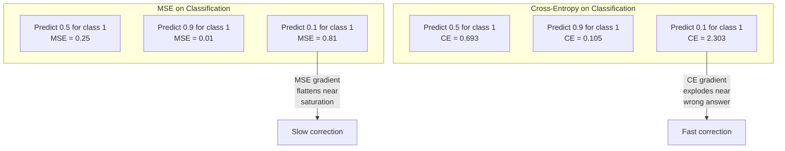
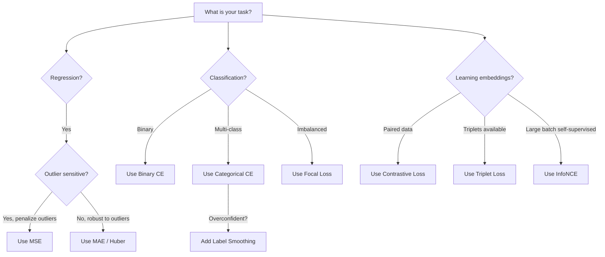

# Perte de fonction

> Votre réseau fait une prédiction. La vérité de base dit le contraire. Combien est-ce mal? Ce nombre est la perte. Choisissez la fonction de perte incorrecte et votre modèle optimise pour la mauvaise chose entièrement.

> **【中文解读】**失失函数 est le seul objectif de l'optimisation du modèle                                                                                                                                                                                                                                                      

**Type:** Build
**Languages:** Python
**Prerequisites:** Lesson 03.04 (Activation Functions)
**Time:** ~75 minutes

## Objectifs d'apprentissage

- Implementer à partir de zéro les MSE, l'entropie croisée binaire, l'entropie croisée catégorique et la perte de contraste (InfoNCE) avec leurs gradients
- Expliquer pourquoi MSE ne réussit pas à être classé en démontrant le mode de défaillance "prévision 0.5 pour tout"
- Appliquer un éclairage de lissage à l'entropie croisée et décrire comment il empêche les prédictions trop confiantes
- Choisissez la bonne fonction de perte pour la régression, la classification binaire, la classification multi-classes et l'intégration des tâches d'apprentissage

> **【中文解读】**Objectif du chapitre: réaliser 5 types de fonction de perte et de degré, comprendre pourquoi les tâches de catégorie ne peuvent pas être utilisées par MSE, apprendre à étiqueter et à comparer les pertes, apprendre à choisir correctement la fonction de perte en fonction des tâches.

## Le problème , l' introduction du problème

Un modèle qui réduit le MSE sur un problème de classification prédit avec confiance 0,5 pour tout.

> Un modèle de MSE minimisé sur les problèmes de catégorie se confie à toutes les prévisions d'entrée 0.5 .

La fonction de perte est la seule chose que votre modèle optimise réellement. Pas de précision. Pas le score de F1. Pas quelle que soit la métrique que vous rapportez à votre manager. L'optimisateur prend le gradient de la fonction de perte et ajuste les poids pour rendre ce nombre plus petit. Si la fonction de perte ne capture pas ce que vous aimez, le modèle trouvera le moyen mathématiquement le moins cher de la satisfaire, et cette façon n'est presque jamais ce que vous vouliez.

> 损失函数 est le seul objectif de l'optimisation réelle de votre modèle. 没有准确率. 没有F1 分数. 没有你向经理报告的任何指标. 优化器获取损失函数的梯度并调整权重使该数字更小. 损失函数没有捕捉到你关心的东西,模型会找到最便宜的方法来满足它,而这种方式几乎永远不是你想要的.

Voici un exemple concret. Vous avez une tâche de classification binaire. Deux classes, 50/50 partagées. Vous utilisez l'ESM comme votre perte. Le modèle prédit 0,5 pour chaque entrée. Le taux moyen d'épilepsie est de 0,25, ce qui est le minimum possible sans vraiment apprendre quoi que ce soit. Le modèle a une capacité discriminatoire zéro mais il a techniquement minimisé votre fonction de perte. Passez à l'entropie croisée et le même modèle est forcé de pousser les prédictions vers 0 ou 1, parce que -log(0.5) = 0.693 est une perte terrible, tandis que -log(0.99) = 0.01 récompense les prédictions correctes en toute confiance. Le choix de la fonction de perte est la différence entre un modèle qui apprend et un modèle qui joue la métrique.

> 具体例:二元分类任务,两类各占50%──你使用MSE 作为损失──模型对每个输入都预测0.5──平均MSE为0.25, c'est la valeur minimale possible dans le cas où vous n'avez pas appris à rien.

Cela devient pire. Dans l'apprentissage autosuffisant, vous n'avez même pas d'étiquettes. La perte de contraste définit entièrement le signal d'apprentissage: ce qui compte comme similaire, ce qui compte comme différent, et à quel point le modèle devrait les séparer. Faites-vous tort par la perte de contraste et vos intégrations s'effondrent à un seul point - chaque entrée correspond au même vecteur. Techniquement, perte zéro. Totalement inutile.

>  situation pire, dans l'apprentissage de l'auto-surveillance, vous n'avez même pas de marque ⋅ contre perte de comparaison définit parfaitement le signal d'apprentissage: ce qui est similaire, ce qui est différent, le modèle devrait les séparer à une grande intensité ⋅ faire une erreur contre perte, votre emplacement se réduira à un point ⋅ chaque entrée est cartographiée à la même quantité ⋅ contre perte technique est de zéro ⋅ mais complètement inutile ⋅

> **【中文解读】**MSE faire la division en temps, le modèle de découverte prédiction 0.5 est la stratégie la plus sûre  perte minimale mais sans distinction de capacité──交叉则通过 -log (p) 惩罚不自信的预测:-log (0.5) = 0.693 (很差)vs -log (0.99) = 0.01 (x) 很好), forçant le modèle à faire un jugement clair── dans l'apprentissage autosuffisant, la perte de par rapport définit l'ensemble des signaux d'apprentissage commis une erreur entraînera l'intégration  contraction à un même point──

## Le concept de base.

### Évolution moyenne carré (MSE)                                                                                                                                                                                                                                                                                                                                                                                                                                                                                                                    

Le paramètre de régression. Comptez la différence carrée entre la prédiction et la cible, moyenne sur tous les échantillons.

> Retour à la tâche de choix par défaut.

```
MSE = (1/n) * sum((y_pred - y_true)^2)
```

Pourquoi le quadratage est important: il pénalise les erreurs importantes quadratiquement. Une erreur de 2 coûte 4 fois plus qu'une erreur de 1. Une erreur de 10 coûte 100 fois. Cela rend MSE sensible aux valeurs anormales - une seule prédiction très erronée domine la perte.

> Pourquoi le carré est important: il est nécessaire de punir deux fois les gros défauts. Le coût d'une erreur de 2 est 4 fois celui d'une erreur de 1 fois. Le coût d'une erreur de 10 fois est 100 fois.

Numéros réels: si votre modèle prédit les prix des logements et est déduit par $10,000 on most houses but off by $200 000 sur un manoir, MSE va tenter de réparer ce manoir, ce qui pourrait nuire à la performance des 99 autres maisons.

> 具体数字: si votre modèle prévoit la valeur de la maison, la plupart des maisons sont en désaccord $10,000，但一栋豪宅偏差 $200 000 personnes, MSE sera activement tenté de réparer cette maison, peut-être endommager les autres 99 maisons.

Le gradient de l'ESM par rapport à une prédiction est le suivant:

> MSE pour la prédiction de la gradience:

```
dMSE/dy_pred = (2/n) * (y_pred - y_true)      # 梯度与误差成线性关系
```

L'erreur est linéaire. Les erreurs plus importantes ont des gradients plus grands. C'est une fonctionnalité de régression (les grandes erreurs nécessitent de grandes corrections) et un bug pour la classification (vous voulez pénaliser les réponses incorrectes en toute confiance de manière exponentielle, pas linéaire).

> Avec des erreurs dans la relation de ligne. Une plus grande erreur obtient une plus grande gradience. Ceci est un avantage.

> **【中文解读】**MSE est la perte par défaut de la tâche de retour: la moyenne carrée des erreurs. La moyenne carrée des erreurs rend les erreurs plus élevées. La punition de la erreur 10 est 100 fois celle de l'erreur 1.

> **【拓展：MSE 在 AI 中的应用】**Dans les modèles de production d'images (comme la diffusion stable), le MSE est également utilisé pour mesurer la production d'images et les différences de géométrie des images cibles.`F.mse_loss(pred, target)`Il y a une autre.

### Perte de l'entropie croisée

La fonction de perte pour la classification. Enracinée dans la théorie de l'information, elle mesure la divergence entre la distribution de probabilité prévue et la distribution réelle.

> La fonction de perte de tâche de classe. Elle est basée sur le thèse de l'information. Elle mesure la différence entre la distribution de probabilité prévue et la distribution réelle.

**Binary Cross-Entropy (BCE) | 二元交叉熵：**

```
BCE = -(y * log(p) + (1 - y) * log(1 - p))
```

Là où y est l'étiquette vraie (0 ou 1) et p est la probabilité prévue.

> Parmi eux y est le réel étiquette ((0 ou 1),p est la probabilité de prédiction。

Pourquoi -log(p) fonctionne: lorsque le vrai label est 1 et que vous prédisez p = 0,99, la perte est -log(0,99) = 0,01. Lorsque vous prédisez p = 0,01, la perte est -log(0,01) = 4,6. Cette différence de 460x est la raison pour laquelle l'entropie croisée fonctionne.

> Pourquoi -log(p) Effectif: lorsque le vrai étiquette est de 1 且你预测 p = 0,99 时, le perte est de -log(0,99) = 0,01── lorsque tu préfètes p = 0,01 时, le perte est de -log(0,01) = 4,6── c'est 460 fois la différence qui est la raison de la différence.

Le gradient raconte la même histoire:

```
dBCE/dp = -(y/p) + (1-y)/(1-p)     # 梯度在预测错误时极大
```

Lorsque y = 1 et p est proche de zéro, le gradient est -1/p qui approche l'infini négatif. Le modèle reçoit un signal énorme pour corriger son erreur.

> **【中文解读】**交叉是分类任务的标配──核心是 -log(p): prédiction correcte et confiante(p=0.99) 时损失只有0.01, prédiction err err err err err err err err err err err err err err err err err err err err err err err err err err err err err err err err err err err err err err err err err err err err err err err err err err err err err err err err err err err err err err err err err err err err err err err err err err err err err err err err err err err err err err err err err err err err err err err err err err err err err err err err err err err err err err err err err err err err err err err err err err err err err err err err err err err err err err err err err err err err err err err err err err err err err err err err err err err err err err err err err err err err err err err err err err err err err err err err err err err err err err err err err err err err err err err err err err err err err err err err err err err err err err err err err err err err err err err err err err err err err err err err err err err err err err err err err err err err err err err err err err err err err err err err err err err err err err err err err err err err err err err err err err err err err err err err err err err err err err err err err err err err err err err err err err err err err err err err err err err err err err err err err err err err err err err err err err err err err err err err err err err err err err err err err err err err err err err err err err err err err err err err err err err err err err err err err err err err err err err err err err err err err err err err err err err err err err err err err err err err err err err err err err err err err err err err err err err err err err err err err err err err err err err err err err err err err err err err err err err err err err err err err err err err err err err err err err err err err err err err err err err err err err err err err err err err err err err err err err err err err err err err err err err err

> **【拓展：交叉熵在 Transformer 中】**Le GPT est un symbole de la différence entre les deux.`F.cross_entropy(logits, labels)`Il y a une autre.

**Categorical Cross-Entropy | 多类交叉熵：**

Pour la classification multi-classe avec des cibles codées uniques.

```
CCE = -sum(y_i * log(p_i))          # 只有真实类别贡献损失
```

Seule la classe vraie contribue à la perte (parce que toutes les autres y_i sont zéro). Si il y a 10 classes et que la classe correcte obtient la probabilité de 0,1 (d'une devinette aléatoire), la perte est -log(0.1) = 2.3.

### Pourquoi MSE ne peut pas être classé ?



Les gradients de MSE s'appliquent lorsque les prédictions sont proches de 0 ou 1 (en raison de la saturation du sigmoïde).

> **【中文解读】**Le niveau de la MSE dans la prévision approche de 0 ou 1 时变平 (en raison du sigmoïde 和), entraînant une correction lente.

### Étiquette Lightening

Les étiquettes standard de l'étiquette "c'est 100% classe 3 et 0% tout le reste" sont très fortes.

> 標準的一热标签说"这是100% 类3,其他都是0%"──这是个强声明──标签平滑软化它:

```
smooth_label = (1 - alpha) * one_hot + alpha / num_classes
```

Avec alpha = 0,1 et 10 classes: au lieu de [0, 0, 1, 0, ...], la cible devient [0, 01, 0, 01, 0, 91, 0, 01, ...].

> alpha = 0,1、10 个类别时: objectif de [0, 0, 1, 0, ...] 变成 [0,01, 0.01, 0.91, 0.01, ...]。模型目标 de 1.0 变成 0.91。

Pourquoi cela fonctionne: un modèle qui tente de produire exactement 1,0 à travers un softmax doit pousser les logits à l'infini. Cela provoque une trop grande confiance, nuit à la généralisation et rend le modèle fragile pour le changement de distribution.

> Pourquoi est-il efficace: pour que softmax output soit correctement 1.0, il faut mettre la logique  push à infinité ⋅ ce qui entraîne une trop grande confiance ⋅ perte de généralisation ⋅ rend le modèle plus délicat ⋅ la limite de distribution est de 0,9 ⋅ alpha = 0,1), ⋅ permet de maintenir la logique ⋅ dans une gamme raisonnable ⋅ GPT et la plupart des modèles modernes utilisent des étiquettes ⋅ et ⋅

> **【中文解读】**标签平滑把硬标签 [0, 0, 1, 0, ...] 变成软标签 [0.01, 0.01, 0.91, 0.01, ...] 由于要让软max 输出 1.0 需要 logit 趋近无穷大, this will lead to overadaptation和过度自信──标签平滑把目标上限降至0.9,保持logit 在合理范围──GPT 和大多数现代模型都使用标签平滑──

### Perte contrepartie par rapport à perte

Pas d'étiquettes, pas de classes, juste des paires d'entrées et la question: sont-elles similaires ou différentes ?

> 没有标签. 没有类别. 只有输入对和这个问题: elles sont similaires ou différentes?

**SimCLR-style contrastive loss (NT-Xent / InfoNCE):**

Prenez une image. Créez deux vues augmentées de celle-ci (croûte, rotation, vibration de couleur). Ce sont les "pares positives" - elles devraient avoir des embrasements similaires. Chaque autre image du lot forme une "parée négative" - elles devraient avoir des embrasements différents.

> 取一张图像── Créer deux visuels renforcés(coupage, rotation, couleur动)── c'est "réal" elles devraient avoir des emplacements similaires── chaque autre image de la série forme "négatif" elles devraient avoir des emplacements différents

```
L = -log(exp(sim(z_i, z_j) / tau) / sum(exp(sim(z_i, z_k) / tau)))
```

Là où sim() est la similitude cosine, z_i et z_j sont la paire positive, la somme est au-dessus de tous les négatifs, et tau (température) contrôle la façon dont la distribution est nette.

> **【中文解读】**Pour comparer les pertes, il n'y a pas besoin de marquer ! Prenez deux versions de l'image comme " juste contre " (( devrait être similaire), les autres images comme " négatif contre " (( devrait être différent) ◊ Perte = -log (( juste contre la similitude / / 所有可能对的相似度之和) ◊ La température tau 越低,区分越严──

> **【拓展：对比学习在 RAG 和嵌入模型中】**Les modèles de mise en place de texte d'OpenAI sont utilisés pour les entraînements d'apprentissage par rapport à ceux d'OpenAI. Dans le RAG, le bon et le mauvais des référents dépendent de la qualité de mise en place, tandis que la qualité de mise en place dépend de la conception de la perte par rapport à la perte.

### Perte de focus.

Pour les ensembles de données déséquilibrés. L'entropie croisée standard traite tous les exemples correctement classés de manière égale.

> Pour une conception de données déséquilibrée, le standard de référence est de traiter tous les échantillons de catégories identiques, et la perte de concentration réduit le poids des échantillons simples.

```
FL = -alpha * (1 - p_t)^gamma * log(p_t)
```

Lorsque p_t est la probabilité prédite de la classe vraie et que la gamma contrôle la mise au point. Avec gamma = 0, c'est une entropie croisée standard. Avec gamma = 2 (la valeur par défaut):

> Parmi les p_t, il y a une probabilité de prédiction de la gamme 控制聚焦程度──gamma = 0 时退化为标准交叉──gamma = 2 时(默认值):

- Exemple simple (p_t = 0,9): poids = (0,1) ^2 = 0,01.
  简单样本(p_t = 0,9):权重 = (0,1) ^2 = 0,01──实际被忽略──
- Exemple dur (p_t = 0,1): poids = (0,9) ^2 = 0,81.
  困难样本(p_t = 0,1):权重 = (0,9) ^2 = 0,81──完整梯度信号──

> **【中文解读】**Le modèle de RetinaNet est utilisé pour le dépistage des problèmes. 99% de la population est le contexte, 1% est le but.

### Loss fonction arbre de décision



> **【中文解读】**选择经验: retour avec MSE/Huber,二分类用 BCE,多分类用 CCE,不平衡用焦损失,学嵌入用对比损失──

## Construisez-le en main
```figure
cross-entropy-loss
```

## Faites-le

### Étape 1: MSE et son degré

```python
def mse(predictions, targets):
    n = len(predictions)
    total = 0.0
    for p, t in zip(predictions, targets):
        total += (p - t) ** 2            # 平方误差
    return total / n                      # 取平均

def mse_gradient(predictions, targets):
    n = len(predictions)
    grads = []
    for p, t in zip(predictions, targets):
        grads.append(2.0 * (p - t) / n)  # 梯度 = 2*(pred - true) / n
    return grads
```

### Étape 2: Entropie binaire croisée

Le problème log(0) est réel. Si le modèle prédit exactement 0 pour un exemple positif, log(0) = infini négatif.

```python
import math

def binary_cross_entropy(predictions, targets, eps=1e-15):
    n = len(predictions)
    total = 0.0
    for p, t in zip(predictions, targets):
        p_clipped = max(eps, min(1 - eps, p))  # 裁剪防止 log(0)
        total += -(t * math.log(p_clipped) + (1 - t) * math.log(1 - p_clipped))  # -[y*log(p) + (1-y)*log(1-p)]
    return total / n

def bce_gradient(predictions, targets, eps=1e-15):
    grads = []
    for p, t in zip(predictions, targets):
        p_clipped = max(eps, min(1 - eps, p))
        grads.append(-(t / p_clipped) + (1 - t) / (1 - p_clipped))  # 梯度 = -y/p + (1-y)/(1-p)
    return grads
```

### Étape 3: Cross-Entropie catégorique avec Softmax

```python
def softmax(logits):
    max_val = max(logits)  # 数值稳定性
    exps = [math.exp(x - max_val) for x in logits]
    total = sum(exps)
    return [e / total for e in exps]

def categorical_cross_entropy(logits, target_index, eps=1e-15):
    probs = softmax(logits)
    p = max(eps, probs[target_index])
    return -math.log(p)  # -log(真实类别的概率)

def cce_gradient(logits, target_index):
    probs = softmax(logits)
    grads = list(probs)              # 复制 softmax 输出
    grads[target_index] -= 1.0      # 真实类别减 1：softmax 输出 - one-hot
    return grads
```

Le gradient de softmax + entropie croisée simplifie magnifiquement: il est juste (probabilité prévue - 1) pour la classe réelle, et (probabilité prévue) pour toutes les autres classes. Cette élégante simplification n'est pas une coïncidence - c'est pourquoi softmax et entropie croisée sont couplés.

> **【中文解读】**Softmax + 交叉的梯度简化为:预测概率减去一热目标──真实类别是p-1,其他类别是p──这个优雅的简化就是为什么 softmax 和交叉总是配对使用──

### Étape 4: Étiquette de lissage

```python
def label_smoothed_cce(logits, target_index, num_classes, alpha=0.1, eps=1e-15):
    probs = softmax(logits)
    loss = 0.0
    for i in range(num_classes):
        if i == target_index:
            smooth_target = 1.0 - alpha + alpha / num_classes  # 目标类别：0.9（alpha=0.1, 10 类）
        else:
            smooth_target = alpha / num_classes                 # 非目标类别：0.01
        p = max(eps, probs[i])
        loss += -smooth_target * math.log(p)
    return loss
```

### Étape 5: Perte de contraste par rapport à la perte.

```python
def cosine_similarity(a, b):
    dot = sum(x * y for x, y in zip(a, b))        # 点积
    norm_a = math.sqrt(sum(x * x for x in a))      # 向量 a 的模
    norm_b = math.sqrt(sum(x * x for x in b))      # 向量 b 的模
    if norm_a < 1e-10 or norm_b < 1e-10:
        return 0.0
    return dot / (norm_a * norm_b)                  # 余弦相似度

def contrastive_loss(anchor, positive, negatives, temperature=0.07):
    sim_pos = cosine_similarity(anchor, positive) / temperature     # 正对相似度 / 温度
    sim_negs = [cosine_similarity(anchor, neg) / temperature for neg in negatives]  # 负对相似度

    max_sim = max(sim_pos, max(sim_negs)) if sim_negs else sim_pos  # 数值稳定性
    exp_pos = math.exp(sim_pos - max_sim)
    exp_negs = [math.exp(s - max_sim) for s in sim_negs]
    total_exp = exp_pos + sum(exp_negs)

    return -math.log(max(1e-15, exp_pos / total_exp))  # -log(正对概率)
```

### Étape 6: MSE vs Cross-Entropy sur la classification

Exercer le même réseau à partir de la leçon 04 (ensemble de données de cercle) avec les deux fonctions de perte.

```python
import random

def sigmoid(x):
    x = max(-500, min(500, x))
    return 1.0 / (1.0 + math.exp(-x))

def make_circle_data(n=200, seed=42):
    random.seed(seed)
    data = []
    for _ in range(n):
        x = random.uniform(-2, 2)
        y = random.uniform(-2, 2)
        label = 1.0 if x * x + y * y < 1.5 else 0.0
        data.append(([x, y], label))
    return data


class LossComparisonNetwork:
    """用不同损失函数训练的网络，对比 MSE 和 BCE 的收敛速度"""
    def __init__(self, loss_type="bce", hidden_size=8, lr=0.1):
        random.seed(0)
        self.loss_type = loss_type  # "mse" 或 "bce"
        self.lr = lr
        self.hidden_size = hidden_size

        self.w1 = [[random.gauss(0, 0.5) for _ in range(2)] for _ in range(hidden_size)]
        self.b1 = [0.0] * hidden_size
        self.w2 = [random.gauss(0, 0.5) for _ in range(hidden_size)]
        self.b2 = 0.0

    def forward(self, x):
        self.x = x
        self.z1 = []
        self.h = []
        for i in range(self.hidden_size):
            z = self.w1[i][0] * x[0] + self.w1[i][1] * x[1] + self.b1[i]
            self.z1.append(z)
            self.h.append(max(0.0, z))  # ReLU 激活

        self.z2 = sum(self.w2[i] * self.h[i] for i in range(self.hidden_size)) + self.b2
        self.out = sigmoid(self.z2)  # 输出层 sigmoid
        return self.out

    def backward(self, target):
        # 根据损失类型选择不同的梯度
        if self.loss_type == "mse":
            d_loss = 2.0 * (self.out - target)  # MSE 梯度：线性
        else:
            eps = 1e-15
            p = max(eps, min(1 - eps, self.out))
            d_loss = -(target / p) + (1 - target) / (1 - p)  # BCE 梯度：在错误预测时极大

        d_sigmoid = self.out * (1 - self.out)
        d_out = d_loss * d_sigmoid

        for i in range(self.hidden_size):
            d_relu = 1.0 if self.z1[i] > 0 else 0.0
            d_h = d_out * self.w2[i] * d_relu
            self.w2[i] -= self.lr * d_out * self.h[i]
            for j in range(2):
                self.w1[i][j] -= self.lr * d_h * self.x[j]
            self.b1[i] -= self.lr * d_h
        self.b2 -= self.lr * d_out

    def compute_loss(self, pred, target):
        if self.loss_type == "mse":
            return (pred - target) ** 2
        else:
            eps = 1e-15
            p = max(eps, min(1 - eps, pred))
            return -(target * math.log(p) + (1 - target) * math.log(1 - p))

    def train(self, data, epochs=200):
        losses = []
        for epoch in range(epochs):
            total_loss = 0.0
            correct = 0
            for x, y in data:
                pred = self.forward(x)
                self.backward(y)
                total_loss += self.compute_loss(pred, y)
                if (pred >= 0.5) == (y >= 0.5):
                    correct += 1
            avg_loss = total_loss / len(data)
            accuracy = correct / len(data) * 100
            losses.append((avg_loss, accuracy))
            if epoch % 50 == 0 or epoch == epochs - 1:
                print(f"    Epoch {epoch:3d}: loss={avg_loss:.4f}, accuracy={accuracy:.1f}%")
        return losses
```

## Utilisez-le dans la pratique.

PyTorch fournit toutes les fonctions de perte standard avec une stabilité numérique intégrée dans:

```python
import torch
import torch.nn as nn
import torch.nn.functional as F

predictions = torch.tensor([0.9, 0.1, 0.7], requires_grad=True)
targets = torch.tensor([1.0, 0.0, 1.0])

mse_loss = F.mse_loss(predictions, targets)              # MSE：回归
bce_loss = F.binary_cross_entropy(predictions, targets)   # BCE：二分类

logits = torch.randn(4, 10)                              # 4 个样本，10 类
labels = torch.tensor([3, 7, 1, 9])
ce_loss = F.cross_entropy(logits, labels)                # CCE：多分类（推荐用法）
ce_smooth = F.cross_entropy(logits, labels, label_smoothing=0.1)  # 带标签平滑
```

Utilisation `F.cross_entropy`(non)`F.nll_loss`Il combine log-softmax et probabilité log négative dans une opération stable numériquement. Appliquer softmax séparément puis prendre le log est moins stable - vous perdez la précision dans la soustraction de grands exponentiels.

Pour l'apprentissage contrasté, la plupart des équipes utilisent des implémentations personnalisées ou des bibliothèques comme `lightly`ou `pytorch-metric-learning`. La boucle de base est toujours la même: calculer des similitudes par paires, créer le softmax sur les positifs et les négatifs, rétrécir.

> **【中文解读】**PyTorch 中 directement `F.cross_entropy(logits, labels)`il est intégré à log-softmax et NLL, valeur de la plupart des stables.`lightly`Ou `pytorch-metric-learning`Je suis là.

## Envoyez les marchandises .

Cette leçon donne:
- `outputs/prompt-loss-function-selector.md`-- une requête réutilisable pour choisir la bonne fonction de perte
- `outputs/prompt-loss-debugger.md`- une demande de diagnostic pour quand votre courbe de perte semble mal

## Les exercices

1. Implémenter la perte de Huber (perte L1 lisse), qui est MSE pour les petites erreurs et MAE pour les grandes erreurs.
   > **练习 1：**实现 Huber 损失(小差差 MSE,大差 MAE) ⋅ 在有5% 异常值的数据上对MSE和Huber⋅

2. Ajouter la perte de focus à la boucle d'entraînement de classification binaire. Créer un ensemble de données déséquilibré (90% classe 0, 10% classe 1). Comparer la perte de focus standard BCE vs. (gamma=2) sur le rappel de classe minoritaire après 200 époques.
   > **练习 2：**Dans le groupe de données de 90:10 sur l'inégalité, le taux de recul de la minorité de la BCE et de la Perte de focus (gamma = 2) est relativement faible.

3. Implémenter la perte de triplets avec l'exploitation négative semi-dure. Générer des données d'intégration 2D pour 5 classes. Pour chaque ancrage, trouver le négatif le plus dur qui est encore plus loin que le positif (semi-dure). Comparer la convergence à la sélection aléatoire de triplets.
   > **练习 3：** réaliser des pertes de trois groupes de déchets à la fois à la vitesse de réception des échantillons à choix aléatoire et à la vitesse de réception des échantillons à choix négatif.

4. Exécutez la comparaison MSE vs entropie croisée, mais suivez les magnitudes de gradient à chaque couche pendant l'entraînement.
   > **练习 4：** Suivre les MSE et les échanges  formation à différents niveaux  formation à différents niveaux                                                                                                                                                                                                                                                                                                                                                                                                                                                                                                        

5. Mettre en œuvre la perte de divergence KL et vérifier que la réduction de la KL ((true des choses prédites) donne les mêmes gradients que l'entropie croisée lorsque la réelle distribution est un-chaud.
   > **练习 5：**实现 KL 散度损失,验证在一个热的真实分布时与交叉梯度相同――然后尝试知识蒸中的软目标――

## Les termes clés

| Term | What people say | What it actually means |
|------|----------------|----------------------|
| Loss function | "How wrong the model is" | A differentiable function mapping predictions and targets to a scalar that the optimizer minimizes |
| MSE | "Average squared error" | Mean of squared differences between predictions and targets; penalizes large errors quadratically |
| Cross-entropy | "The classification loss" | Measures divergence between predicted probability distribution and true distribution using -log(p) |
| Binary cross-entropy | "BCE" | Cross-entropy for two classes: -(y*log(p) + (1-y)*log(1-p)) |
| Label smoothing | "Softening the targets" | Replacing hard 0/1 targets with soft values (e.g., 0.1/0.9) to prevent overconfidence and improve generalization |
| Contrastive loss | "Pull together, push apart" | A loss that learns representations by making similar pairs close and dissimilar pairs far in embedding space |
| InfoNCE | "The CLIP/SimCLR loss" | Normalized temperature-scaled cross-entropy over similarity scores; treats contrastive learning as classification |
| Focal loss | "The imbalanced data fix" | Cross-entropy weighted by (1-p_t)^gamma to down-weight easy examples and focus on hard ones |
| Triplet loss | "Anchor-positive-negative" | Pushes anchor closer to positive than negative by at least a margin in embedding space |
| Temperature | "Sharpness knob" | A scalar divisor on logits/similarities that controls how peaked the resulting distribution is; lower = sharper |

| 术语 | 通俗说法 | 实际含义 |
|------|---------|---------|
| 损失函数 (Loss function) | "模型错多少" | 把预测和目标映射为标量的可导函数，优化器最小化这个值 |
| MSE | "平方误差平均" | 预测与目标的平方差的均值；对大误差二次惩罚 |
| 交叉熵 (Cross-entropy) | "分类损失" | 用 -log(p) 衡量预测分布和真实分布的差异 |
| 二元交叉熵 (BCE) | "二分类损失" | 两类的交叉熵：-(y*log(p) + (1-y)*log(1-p)) |
| 标签平滑 (Label smoothing) | "软化目标" | 把硬标签 0/1 换成软值（如 0.1/0.9），防止过度自信 |
| 对比损失 (Contrastive loss) | "拉近推远" | 让相似样本嵌入接近、不同样本嵌入远离的损失 |
| InfoNCE | "CLIP/SimCLR 损失" | 温度缩放的相似度交叉熵；把对比学习变成分类问题 |
| Focal Loss | "不平衡数据修复" | 交叉熵乘以 (1-p_t)^gamma，降低简单样本权重，聚焦困难样本 |
| 三元组损失 (Triplet loss) | "锚-正-负" | 让锚点离正样本比离负样本近至少一个边距 |
| 温度 (Temperature) | "尖锐度旋钮" | logits/相似度的除数，控制分布尖锐程度；越低越尖锐 |

## Encore une lecture

- Lin et coll., " Perte de focus pour la détection d'objets denses " (2017) -- introduit la perte de focus pour la gestion d'un déséquilibre de classe extrême dans la détection d'objets (RetinaNet)
- Chen et coll., "Un cadre simple pour l'apprentissage contrasté des représentations visuelles" (SimCLR, 2020) -- définit le pipeline d'apprentissage contrasté moderne avec perte NT-Xent
- Szegedy et al., "Rethinking the Inception Architecture" (2016) -- introduit le lissage d'étiquettes comme technique de régularisation, maintenant standard dans la plupart des grands modèles
- Hinton et coll., "Distiller les connaissances dans un réseau neuronal" (2015) -- distillation des connaissances à l'aide de cibles douces et de la divergence KL, fondamental pour la compression des modèles
