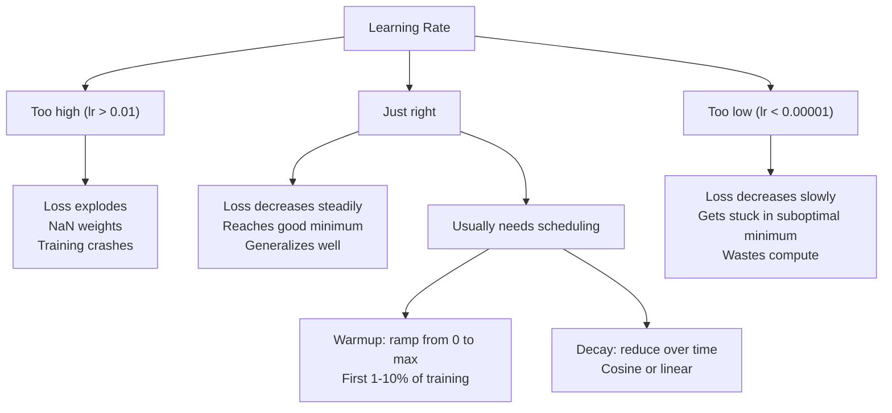
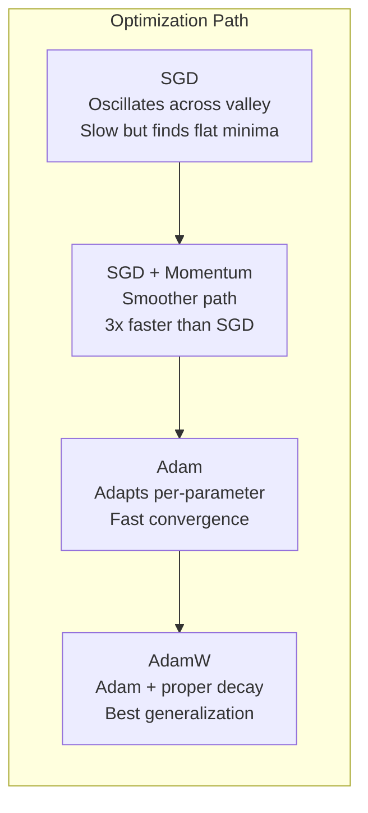
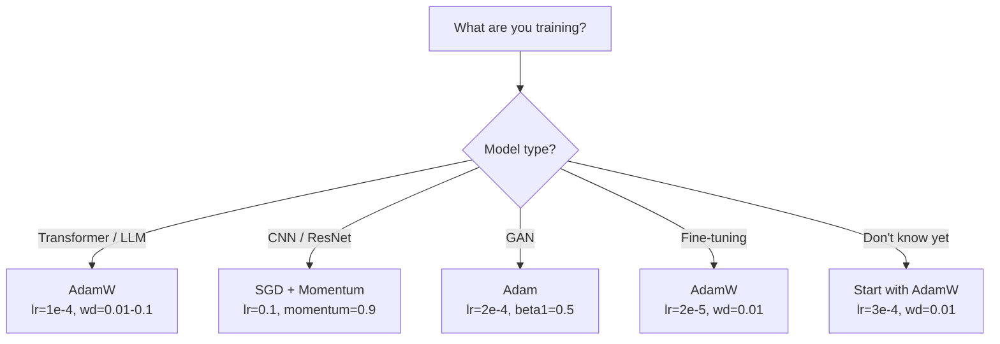

# Optimisateurs

> La descente gradiente vous indique dans quelle direction vous devez vous déplacer, mais elle ne dit rien sur la distance ou la vitesse.

> **【中文解读】**梯度下降告诉你方向, mais ne dit pas pas pas pas pas pas pas pas pas et pas vite. SGD 像指南针只知道方向.

**Type:** Build
**Languages:** Python
**Prerequisites:** Lesson 03.05 (Loss Functions)
**Time:** ~75 minutes

## Objectifs d'apprentissage

- Implémenter SGD, SGD avec dynamique, Adam et AdamW optimisateurs à partir de zéro dans Python
- Expliquez comment la correction du biais d'Adam compense les estimations de moment initiales zéro dans les premières étapes de formation
- Démontre pourquoi AdamW produit une meilleure généralisation que Adam avec une régulation L2 sur la même tâche
- Sélectionnez l'optimisateur et les hyperparametres par défaut appropriés pour les transformateurs, les CNN, les GAN et les réglages

## Le problème , l' introduction du problème

Vous avez calculé les gradients. Vous savez que le poids n ° 4,721 devrait diminuer de 0,003 pour réduire la perte. Mais 0,003 dans quelles unités?

> Vous avez calculé le gradient. Vous savez le poids #4,721  devrait être réduit de 0,003 pour réduire les pertes. Mais 0.003 est une unité?

La baisse du gradient de vanille applique le même taux d'apprentissage à chaque paramètre à chaque étape: gradient w = w - lr *. Cela crée trois problèmes qui rendent la formation des réseaux neuronaux douloureuse en pratique.

> Le degré de dégradation initiale de chaque étape est le même pour chaque paramètre: w = w - lr * gradient.

Tout d'abord, l'oscillation. Le paysage de la perte est rarement en forme de bol lisse. C'est plus comme une longue vallée étroite. Le gradient pointe à travers la vallée (direction raide), pas le long de celle-ci (direction peu profonde). La descente graduelle rebondit en avant et en arrière à travers la dimension étroite tout en faisant de petits progrès le long de la dimension utile. Vous avez vu ceci: la perte diminue rapidement que les plateaux, non pas parce que le modèle converge mais parce qu'il oscilla.

> D'abord, la tige de la tige est plus comme une plaine étroite. La tige se dirige vers le côté de la vallée, plutôt que vers le bas. La tige descend vers le bas et saute vers le haut, tandis que la tige progresse dans une direction utile.

Deuxièmement, un taux d'apprentissage pour tous les paramètres est incorrect. Certains poids ont besoin de grandes mises à jour (ils sont dans la phase initiale, sous-ajustement).

> Deuxièmement, tous les paramètres partagent un taux d'apprentissage est erroné. Certains facteurs nécessitent de grands changements.

Troisièmement, les points de selle. Dans les dimensions élevées, le paysage de perte a de vastes régions plates où le gradient est proche de zéro. SGD vanille rampant à travers ces à la vitesse du gradient, qui est effectivement zéro. Le modèle semble coincé. Il n'est pas coincé - il est dans une région plate avec une descente utile de l'autre côté. Mais SGD n'a aucun mécanisme pour pousser à travers.

> Troisième point. À haute altitude, la surface de la perte de surface est une grande partie de la zone plate, la gradience approchant de zéro. La SGD originale est en train de grimper à la vitesse de zéro.

Adam résout les trois. Il maintient deux moyennes courantes par paramètre - le gradient moyen (momentum, manipulation de l'oscillation) et le gradient moyen carré (taux d'adaptation, manipulation d'échelles différentes). Combiné à la correction des biais pour les premières étapes, il vous donne un seul optimisateur qui fonctionne sur 80% des problèmes avec des hyperparametres par défaut. Cette leçon le construit à partir de zéro pour que vous compreniez exactement quand et pourquoi il échoue sur les 20% restants.

> Adam a résolu tous les trois problèmes. Il maintient deux échelles de moyenne de fonctionnement pour chaque paramètre. Il permet de comprendre exactement quand et pourquoi il échoue dans les 20% suivants.

> **【中文解读】**Il y a trois problèmes: la réaction de la température, le taux de réaction de la température, le taux de réaction de la température, le taux de réaction de la température, le taux de réaction de la température, le taux de réaction de la température, le taux de réaction de la température, le taux de réaction de la température, le taux de réaction de la température, le taux de réaction de la température, le taux de réaction de la température, le taux de réaction de la température, le taux de réaction de la température, le taux de réaction de la température, le taux de réaction de la température, le taux de réaction de la température, le taux de réaction de la température, le taux de réaction de la température, le taux de réaction de la température, le taux de réaction de réaction, le taux de réaction de réaction, le taux de réaction de réaction de la température, le taux de réaction de réaction de réaction de la température, le taux de réaction de réaction de réaction de réaction.

## Le concept de base.

### La dérive du gradient stochastique (SGD)

Le plus simple optimisateur, calculer le gradient sur un mini lot et faire un pas dans la direction opposée.

> Le plus simple des optimisateurs est de calculer la gradience sur un petit volume, puis de faire un pas vers le contraire.

```
w = w - lr * gradient    # 最简单的参数更新公式
```

Le "stochastique" signifie que vous utilisez un sous-ensemble aléatoire (mini-batch) de données pour estimer le gradient, plutôt que l'ensemble des données. Ce bruit est en fait utile - il aide à échapper aux minima locaux. Mais le bruit provoque aussi des oscillations.

> "Aussi" signifie que vous utilisez des volumes de données à l'avenir pour estimer la température, et non l'ensemble du ensemble de données. Ce bruit est en fait utile pour échapper à la valeur minimale locale de la pointe.

Le taux d'apprentissage est le seul bouton. Trop élevé: la perte diverge. Trop bas: la formation prend toujours. La valeur optimale dépend de l'architecture, des données, de la taille du lot et de la phase actuelle de la formation. Pour les SGD de vanille sur les réseaux modernes, les valeurs typiques vont de 0,01 à 0,1.

> Le taux d'apprentissage est unique. Trop élevé: perte de diffusion. Trop bas: l'entraînement est toujours incomplet. La valeur optimale dépend de la structure, des données, de la taille et du volume de l'entraînement. Pour les SGD originaux du réseau moderne, la valeur typique varie de 0,01 à 0,1 .

### Le momentum le mouvement

L'analogie de la descente de la balle est trop utilisée mais exacte. Au lieu de marcher par le gradient seul, vous maintenez une vitesse qui s'accumule par le passé.

> La métaphore du ballroll down mountain slope est trop utilisée mais elle est très précise.

```
m_t = beta * m_{t-1} + gradient    # 速度 = 衰减 × 历史速度 + 当前梯度
w = w - lr * m_t                    # 沿速度方向更新
```

La vitesse de l'évolution est la moyenne des 10 derniers gradients (1 / (1 - 0,9) = 10.

> Beta(habituellement à 0,9) contrôle conserver combien de temps. Lorsque beta = 0,9 时,动量大约是最近的10 个梯度的平均值(1/ (1 - 0,9) = 10) ⋅

Pourquoi cela corrige l'oscillation: les gradients qui pointent dans la même direction s'accumulent. Les gradients qui inversent la direction s'annulent. Dans cette vallée étroite, le composant "cross" fait le tour de chaque étape et est amorti. Le composant "along" reste cohérent et est amplifié. Le résultat est une accélération fluide dans la direction utile.

> Pourquoi cela peut-il réparer le swing: accumuler des gradients dans la même direction. Les gradients de la direction de la rotation s'opposent les uns aux autres. Dans cette vallée étroite, la partition "yonge" est réduite à un rythme de rotation.

Les chiffres réels: SGD seul sur un paysage de perte mal conditionné pourrait prendre 10 000 pas. SGD avec l'élan (beta = 0,9) prend généralement 3 000 à 5 000 pas sur le même problème.

> 具体数字: sur le plan de la perte de la différence de conditions, un SGD unique peut nécessiter 10 000 étapes.

> **【拓展：SGD + Momentum 的 resurgence】**Bien que Adam soit un choix par défaut, les articles de 2023 montrent que SGD+Momentum a encore des avantages sur une tâche spécifique.

### RMSP Prop est en train de se propager.

La première méthode de taux d'apprentissage adaptatif par paramètre qui a réellement fonctionné.

> La première méthode de l'apprentissage de chaque paramètre vraiment efficace.

```
s_t = beta * s_{t-1} + (1 - beta) * gradient^2
w = w - lr * gradient / (sqrt(s_t) + epsilon)
```

s_t suit la moyenne courante des gradients carrés. Les paramètres avec des gradients constamment grands sont divisés par un grand nombre (taux d'apprentissage efficace plus petit).

> s_t                                                                                                                                                                                                                                                                                                                                                                                                                                                                                                                           

Cela résout le problème du " un taux d'apprentissage pour tous les paramètres ". Un poids qui a déjà reçu de grandes mises à jour est probablement proche de son objectif - ralentit. Un poids qui a reçu de petites mises à jour pourrait être sous-entraîné - accélérer.

> Cela a résolu le problème du "partage de tous les paramètres à un taux d'apprentissage" ― un poids qui a déjà été amélioré peut être proche de l'objectif  lentement  un poids qui n'a été amélioré que de manière modérée  accélérer 

L'Epsilon (généralement 1e-8) empêche la division par zéro lorsqu'un paramètre n'a pas été mis à jour.

> Epsilon (habituellement 1e-8) empêche les paramètres de ne pas être mis à jour lorsque le débit est à zéro.

### Adam: Momentum + RMSProp. Adam:动量 + taux d'apprentissage de l'adaptation

Adam combine les deux idées. Il maintient deux moyennes mobiles exponentielles par paramètre:

> Adam a combiné deux types d'idées. Il maintient deux indices de moyenne mobile pour chaque paramètre:

```
m_t = beta1 * m_{t-1} + (1 - beta1) * gradient        (first moment: mean)        # 一阶矩：梯度均值
v_t = beta2 * v_{t-1} + (1 - beta2) * gradient^2       (second moment: variance)   # 二阶矩：梯度方差
```

**Bias correction**La moyenne mobile n'est pas encore réchauffée. La correction de partialité compense:

> **偏差修正**La plupart des explications sont des détails clés.

```
m_hat = m_t / (1 - beta1^t)
v_hat = v_t / (1 - beta2^t)
```

À l'étape 1, avec beta1 = 0,9: m_hat = m_1 / (1 - 0,9) = m_1 / 0.1 = le gradient réel. À l'étape 100: (1 - 0,9^100) est d'environ 1,0, de sorte que la correction disparaît.

> La première étape est la première étape de la phase de l'étape de la phase de l'étape de la phase de l'étape de la phase de l'étape de la phase de la phase de l'étape de la phase de la phase de la phase de l'étape de la phase de la phase de l'étape de la phase de la phase de l'étape de la phase de la phase de la phase de la phase de l'étape de la phase de la phase de la phase de la phase de la phase de la phase de la phase de la phase de la phase de la phase de la phase de la phase de la phase de la phase de la phase de phase de la phase de la phase de phase de la phase de phase de la phase de phase de la phase de phase de phase de phase de phase de phase de phase de phase de phase de phase de phase de phase de phase de phase de phase de phase de phase de phase de phase de phase de phase de phase de phase de phase de phase de phase de phase de phase de phase de phase de phase de phase de phase de phase de phase de phase de phase de phase de phase de phase de phase de phase de phase de phase de phase de phase de phase de phase de phase de phase de phase de phase de phase de phase de phase de phase de phase de phase de phase de phase de phase de phase de phase de phase de phase de phase de phase de phase de phase de phase de phase de phase de phase de phase de phase de phase de phase de phase de phase de phase de phase de phase de phase de phase de phase de phase de phase de phase de phase de phase de phase de phase de phase de phase de phase de phase de phase de phase de phase de phase de phase de phase de phase de phase de phase de phase de phase de phase de phase de phase de phase de phase de phase de phase de phase de phase de phase de phase de phase de phase de phase de phase de phase de phase de phase de phase de phase de phase de phase de phase de phase de phase de phase de phase de phase de phase de phase de phase de phase de phase de phase de phase de phase de phase de phase de phase de phase de phase de phase de phase de phase de phase de phase de phase de phase de phase de phase de phase de phase de phase de phase de phase de phase de phase de phase de phase de phase de phase de phase de

La mise à jour:

> 更新公式:

```
w = w - lr * m_hat / (sqrt(v_hat) + epsilon)
```

Adam par défaut: lr = 0,001, beta1 = 0,9, beta2 = 0,999, epsilon = 1e-8. Ces défauts fonctionnent pour 80% des problèmes.

> Adam 默认值:lr = 0,001,beta1 = 0,9,beta2 = 0,999,epsilon = 1e-8。

> **【拓展：Adam 的局限性】**Bien qu'Adam soit l'optimisateur le plus utilisé, il n'est pas parfait: 1) dans certains problèmes convexes, la réception n'est pas comme SGD; 2) la généralisation d'Adam est parfois différente de SGD; 3) le coût d'apprentissage d'Adam est de 2-3 fois supérieur à celui de SGD; 3) le coût de stockage d'Adam est de 2 à 3 fois supérieur à celui de SGD;

### AdamW: Une perte de poids correcte

La régulation de l'ADM ajoute à la perte de lambda * w^2. dans la SGD de vanille, cela équivaut à la perte de poids (soustraction de lambda * w du poids à chaque étape).

> L2 L'équivalence de l'équivalent est la diminution du poids par étape de l'équivalent.

Loshchilov & Hutter: quand on ajoute L2 à la perte et que Adam traite le gradient, le taux d'apprentissage adaptatif étalonne aussi le terme de régularisation. Les paramètres avec une grande variance de gradient obtiennent moins de régularisation. Les paramètres avec une petite variance obtiennent plus. Ce n'est pas ce que vous voulez - vous voulez une régularisation uniforme indépendamment des statistiques de gradient.

> Loshchilov et Hutter's insight: lorsque vous augmentez L2 à la perte puis Adam traite la gradience, le taux d'apprentissage de l'adaptation se réduit également à la normalisation. Les paramètres de la différence de la gradience obtiennent moins de normalisation.

AdamW corrige ce problème en appliquant directement la dégradation du poids aux poids, après la mise à jour Adam:

```
w = w - lr * m_hat / (sqrt(v_hat) + epsilon) - lr * lambda * w    # Adam 更新 + 解耦权重衰减
```

Le terme de déclin du poids (lr * lambda * w) n'est pas étalé par le facteur d'adaptation d'Adam.

C'est le système d'optimisation par défaut de PyTorch pour la formation de transformateurs, de modèles de diffusion et de la plupart des architectures modernes. BERT, GPT, LLaMA, Stable Diffusion - tous formés avec AdamW.

> **【中文解读】**AdamW's Key Modification: le pouvoir de déclin de poids ne passe pas par l'auto-adaptation d'Adam, directement affectant les paramètres.

> **【拓展：LoRA 微调中的 AdamW】**Avec LoRA 微调 LLM 时, habituellement avec AdamW(lr=2e-5~1e-4, poids_decay=0.01)。LoRA seulement entraîner à réduire la répartition de la matrice A 和 B, le poids d'AdamW diminué aide à contrôler la largeur de ces nouveaux paramètres。

### Taux d'apprentissage: le plus important hyperparamètre



Si vous ajustez un hyperparamètre, ajustez le taux d'apprentissage.

> Si vous ne modifiez qu'un seul paramètre, modifiez le taux d'apprentissage.

- SGD: lr = 0,01 à 0,1
  SGD:lr = 0,01 à 0,1
- Adam/AdamW: lr = 1e-4 à 3e-4
  Adam/AdamW:lr = 1e-4 à 3e-4
- Modèles pré-entraînés à réglage fin: lr = 1e-5 à 5e-5
  微调预训练模型:lr = 1e-5 à 5e-5
- Réchauffement du rythme d'apprentissage: rampe linéaire sur les 1 à 10% des premières étapes
  Rate de réchauffement de l'apprentissage: 1 à 10% de la température de l'apprentissage

### Optimiser Comparison avec Optimiser



### Quand chaque optimisateur gagne



> **【拓展：深度学习中优化器的演进】**De 2012 à 2014, Adam a proposé le développement de l'optimisateur de la création d'AdamW en 2017 pour faire passer l'entraînement de "needs for weeks modification" à "paramètres par défaut pour pouvoir courir"[3].

## Construisez-le et mettez-le en œuvre.

> **【中文解读】**Ci-dessous de zéro réaliser quatre types d'optimisation: SGD → SGD+Momentum → Adam → AdamW── chacun sur la base de l'ancien est ajouter un mécanisme clé── note la correction des préjugés d'AdamW et la décomposition de l'AdamW
```figure
optimizer-trajectory
```

## Faites-le

### Étape 1: SGD de vanille

> SGD: Paramètres directement réduits à taux d'apprentissage par degré.

```python
class SGD:
    def __init__(self, lr=0.01):
        self.lr = lr

    def step(self, params, grads):
        for i in range(len(params)):
            params[i] -= self.lr * grads[i]
```

### Étape 2: SGD avec Momentum

> SGD+Momentum: introduction de la vitesse de variation, accumulation de la gradience historique, indication de la coïncidence des directions de la gradience, de la coïncidence des directions de l'autre.

```python
class SGDMomentum:
    def __init__(self, lr=0.01, beta=0.9):
        self.lr = lr
        self.beta = beta
        self.velocities = None

    def step(self, params, grads):
        if self.velocities is None:
            self.velocities = [0.0] * len(params)
        for i in range(len(params)):
            self.velocities[i] = self.beta * self.velocities[i] + grads[i]
            params[i] -= self.lr * self.velocities[i]
```

### Étape 3: Adam. 3ème étape: Adam. Optimisateur.

> Adam: Maintenir une phase m (%) et une phase v (%) plus des corrections de la différence.

```python
import math

class Adam:
    def __init__(self, lr=0.001, beta1=0.9, beta2=0.999, epsilon=1e-8):
        self.lr = lr
        self.beta1 = beta1
        self.beta2 = beta2
        self.epsilon = epsilon
        self.m = None
        self.v = None
        self.t = 0

    def step(self, params, grads):
        if self.m is None:
            self.m = [0.0] * len(params)
            self.v = [0.0] * len(params)

        self.t += 1

        for i in range(len(params)):
            self.m[i] = self.beta1 * self.m[i] + (1 - self.beta1) * grads[i]
            self.v[i] = self.beta2 * self.v[i] + (1 - self.beta2) * grads[i] ** 2

            m_hat = self.m[i] / (1 - self.beta1 ** self.t)
            v_hat = self.v[i] / (1 - self.beta2 ** self.t)

            params[i] -= self.lr * m_hat / (math.sqrt(v_hat) + self.epsilon)
```

### Étape 4: AdamW.

> AdamW: On peut résoudre la diminution du poids à partir de la gradience à partir de la base d'Adam, en diminuant directement le facteur lui-même, sans passer par l'abréviation de m et v.

```python
class AdamW:
    def __init__(self, lr=0.001, beta1=0.9, beta2=0.999, epsilon=1e-8, weight_decay=0.01):
        self.lr = lr
        self.beta1 = beta1
        self.beta2 = beta2
        self.epsilon = epsilon
        self.weight_decay = weight_decay
        self.m = None
        self.v = None
        self.t = 0

    def step(self, params, grads):
        if self.m is None:
            self.m = [0.0] * len(params)
            self.v = [0.0] * len(params)

        self.t += 1

        for i in range(len(params)):
            self.m[i] = self.beta1 * self.m[i] + (1 - self.beta1) * grads[i]
            self.v[i] = self.beta2 * self.v[i] + (1 - self.beta2) * grads[i] ** 2

            m_hat = self.m[i] / (1 - self.beta1 ** self.t)
            v_hat = self.v[i] / (1 - self.beta2 ** self.t)

            params[i] -= self.lr * m_hat / (math.sqrt(v_hat) + self.epsilon)
            params[i] -= self.lr * self.weight_decay * params[i]
```

### Étape 5: Comparison d'entraînement

Exercez le même réseau à deux couches sur le jeu de données du cercle à partir de la leçon 05 avec les quatre optimisateurs.

> Utilisez la 5ème classe de formation en ensemble de données en forme de rouleau et de réseau à deux niveaux, par rapport à la vitesse de réception de quatre optimisateurs.

```python
import random

def sigmoid(x):
    x = max(-500, min(500, x))
    return 1.0 / (1.0 + math.exp(-x))

def make_circle_data(n=200, seed=42):
    random.seed(seed)
    data = []
    for _ in range(n):
        x = random.uniform(-2, 2)
        y = random.uniform(-2, 2)
        label = 1.0 if x * x + y * y < 1.5 else 0.0
        data.append(([x, y], label))
    return data


class OptimizerTestNetwork:
    def __init__(self, optimizer, hidden_size=8):
        random.seed(0)
        self.hidden_size = hidden_size
        self.optimizer = optimizer

        self.w1 = [[random.gauss(0, 0.5) for _ in range(2)] for _ in range(hidden_size)]
        self.b1 = [0.0] * hidden_size
        self.w2 = [random.gauss(0, 0.5) for _ in range(hidden_size)]
        self.b2 = 0.0

    def get_params(self):
        params = []
        for row in self.w1:
            params.extend(row)
        params.extend(self.b1)
        params.extend(self.w2)
        params.append(self.b2)
        return params

    def set_params(self, params):
        idx = 0
        for i in range(self.hidden_size):
            for j in range(2):
                self.w1[i][j] = params[idx]
                idx += 1
        for i in range(self.hidden_size):
            self.b1[i] = params[idx]
            idx += 1
        for i in range(self.hidden_size):
            self.w2[i] = params[idx]
            idx += 1
        self.b2 = params[idx]

    def forward(self, x):
        self.x = x
        self.z1 = []
        self.h = []
        for i in range(self.hidden_size):
            z = self.w1[i][0] * x[0] + self.w1[i][1] * x[1] + self.b1[i]
            self.z1.append(z)
            self.h.append(max(0.0, z))

        self.z2 = sum(self.w2[i] * self.h[i] for i in range(self.hidden_size)) + self.b2
        self.out = sigmoid(self.z2)
        return self.out

    def compute_grads(self, target):
        eps = 1e-15
        p = max(eps, min(1 - eps, self.out))
        d_loss = -(target / p) + (1 - target) / (1 - p)
        d_sigmoid = self.out * (1 - self.out)
        d_out = d_loss * d_sigmoid

        grads = [0.0] * (self.hidden_size * 2 + self.hidden_size + self.hidden_size + 1)
        idx = 0
        for i in range(self.hidden_size):
            d_relu = 1.0 if self.z1[i] > 0 else 0.0
            d_h = d_out * self.w2[i] * d_relu
            grads[idx] = d_h * self.x[0]
            grads[idx + 1] = d_h * self.x[1]
            idx += 2

        for i in range(self.hidden_size):
            d_relu = 1.0 if self.z1[i] > 0 else 0.0
            grads[idx] = d_out * self.w2[i] * d_relu
            idx += 1

        for i in range(self.hidden_size):
            grads[idx] = d_out * self.h[i]
            idx += 1

        grads[idx] = d_out
        return grads

    def train(self, data, epochs=300):
        losses = []
        for epoch in range(epochs):
            total_loss = 0.0
            correct = 0
            for x, y in data:
                pred = self.forward(x)
                grads = self.compute_grads(y)
                params = self.get_params()
                self.optimizer.step(params, grads)
                self.set_params(params)

                eps = 1e-15
                p = max(eps, min(1 - eps, pred))
                total_loss += -(y * math.log(p) + (1 - y) * math.log(1 - p))
                if (pred >= 0.5) == (y >= 0.5):
                    correct += 1
            avg_loss = total_loss / len(data)
            accuracy = correct / len(data) * 100
            losses.append((avg_loss, accuracy))
            if epoch % 75 == 0 or epoch == epochs - 1:
                print(f"    Epoch {epoch:3d}: loss={avg_loss:.4f}, accuracy={accuracy:.1f}%")
        return losses
```

> **【拓展：GPT 训练中的优化器选择】**Une technique commune à l'entraînement: utiliser différents taux d'apprentissage pour les niveaux d'intégration et de sortie.`optimizer = AdamW([{'params': base_params}, {'params': head_params, 'lr': lr*0.1}])`Il y a une autre.

## Utilisez-le avec le cadre de réalisation

> **【中文解读】**PyTorch 中的训练循环模式:zero_grad → forward → loss → backward → clip → step → schedule。这个顺序不能搞错──CNN 用 SGD+Momentum(lr=0.1),Transformer 用 AdamW(lr=1e-4)──

Les optimisateurs PyTorch gèrent les groupes de paramètres, le coupage des gradients et la planification du taux d'apprentissage:

```python
import torch
import torch.optim as optim

model = torch.nn.Sequential(
    torch.nn.Linear(784, 256),
    torch.nn.ReLU(),
    torch.nn.Linear(256, 10),
)

optimizer = optim.AdamW(model.parameters(), lr=3e-4, weight_decay=0.01)

scheduler = optim.lr_scheduler.CosineAnnealingLR(optimizer, T_max=100)

for epoch in range(100):
    optimizer.zero_grad()
    output = model(torch.randn(32, 784))
    loss = torch.nn.functional.cross_entropy(output, torch.randint(0, 10, (32,)))
    loss.backward()
    torch.nn.utils.clip_grad_norm_(model.parameters(), max_norm=1.0)
    optimizer.step()
    scheduler.step()
```

Le schéma est toujours: zero_grad, forward, loss, backward, (clip), step, (schedule). mémorisez cet ordre. Faire erreur (par exemple, appeler scheduler.step() avant optimiser.step()) est une source commune de bugs subtils.

Pour les CNN, de nombreux praticiens préfèrent toujours SGD + momentum (lr=0,1, momentum=0,9, weight_decay=1e-4) avec un calendrier étape ou cosine. SGD trouve des minima plus plats, qui généralisent souvent mieux. Pour les transformateurs et les LLM, AdamW avec chauffage + cosine décomposition est la norme par défaut.

## Envoyez-le . Produit .

Cette leçon donne:
- `outputs/prompt-optimizer-selector.md`-- une décision rapide pour choisir le bon optimisateur et le taux d'apprentissage pour toute architecture

## Les exercices

1. Implémenter l'élan Nesterov, où vous comptez le gradient à la position "lookhead" (w - lr * beta * v) au lieu de la position actuelle.
   > **练习 1：**实现 Nesterov 动量 (en "précédent" position calcul gradience), par rapport à la vitesse de réception des normes de l'activité.

2. Mettre en œuvre un calendrier de réchauffement de la fréquence d'apprentissage: rampe linéaire de 0 à max_lr au cours des 10% des premières étapes d'entraînement, puis déclin cosine à 0.
   > **练习 2：**¢ réaliser le réchauffement + déclin cosy­nique ¢ apprendre à réguler le taux de réchauffement par rapport au taux de réchauffement ¢ atteindre 90% ¢ exactitude 

3. Suivez le taux d'apprentissage efficace pour chaque paramètre pendant la formation Adam. Le taux d'apprentissage efficace est lr * m_hat / (sqrt(v_hat) + eps).
   > **练习 3：** Suivre Adam  entraînement des taux d'apprentissage efficaces de chaque paramètre, observer les différences de vitesse de mise à jour des différents paramètres 

4. Mettre en œuvre le coupage de gradient (clip par norme globale). Définir la norme maximale de gradient à 1.0. Exercer avec et sans coupage en utilisant un taux d'apprentissage élevé (lr=0,01 pour Adam). Comptez combien de courses divergent (perte va à NaN) avec et sans coupage de plus de 10 graines aléatoires.
   > **练习 4：** réaliser la proportion de formation diffusée en dessous du taux d'apprentissage élevé.

5. Comparer Adam vs AdamW sur un réseau avec de grands poids. Initializer tous les poids à des valeurs aléatoires en [-5, 5] (bien plus grandes que la normale).
   > **练习 5：**Dans le cas d'Adam et AdamW, observez la différence de poids de déclin des effets de la

## Les termes clés

| Term | What people say | What it actually means |
|------|----------------|----------------------|
| Learning rate | "Step size" | The scalar multiplier on the gradient update; the single most impactful hyperparameter in training |
| SGD | "Basic gradient descent" | Stochastic gradient descent: update weights by subtracting lr * gradient, computed on a mini-batch |
| Momentum | "Rolling ball analogy" | Exponential moving average of past gradients; dampens oscillation and accelerates consistent directions |
| RMSProp | "Adaptive learning rate" | Divides each parameter's gradient by the running RMS of its recent gradients; equalizes learning rates |
| Adam | "The default optimizer" | Combines momentum (first moment) and RMSProp (second moment) with bias correction for the initial steps |
| AdamW | "Adam done right" | Adam with decoupled weight decay; applies regularization directly to weights rather than through the gradient |
| Bias correction | "Warmup for running averages" | Dividing by (1 - beta^t) to compensate for the zero-initialization of Adam's moment estimates |
| Weight decay | "Shrink the weights" | Subtracting a fraction of the weight value at each step; a regularizer that penalizes large weights |
| Learning rate schedule | "Changing lr over time" | A function that adjusts the learning rate during training; warmup + cosine decay is the modern default |
| Gradient clipping | "Capping the gradient norm" | Scaling down the gradient vector when its norm exceeds a threshold; prevents exploding gradient updates |

| 术语 | 通俗说法 | 实际含义 |
|------|---------|---------|
| 学习率 (Learning rate) | "步长" | 梯度更新的标量乘数；训练中影响最大的超参数 |
| SGD | "基础梯度下降" | 随机梯度下降：用小批量梯度更新 w -= lr * grad |
| 动量 (Momentum) | "滚球的类比" | 历史梯度的指数移动平均；抑制振荡、加速一致方向 |
| RMSProp | "自适应学习率" | 除以梯度平方的移动平均根；均衡各参数学习速度 |
| Adam | "默认优化器" | 动量 + RMSProp + 偏差修正的统一优化器 |
| AdamW | "正确的 Adam" | Adam + 解耦权重衰减；直接对参数施加正则化 |
| 偏差修正 (Bias correction) | "运行平均的热身" | 除以 (1-beta^t) 补偿 Adam 矩估计的零初始化偏差 |
| 权重衰减 (Weight decay) | "缩小权重" | 每步减去权重的一小部分；惩罚大权重的正则化手段 |
| 学习率调度 (LR schedule) | "随时间改变 lr" | 训练中调整学习率的函数；warmup + cosine decay 是现代标配 |
| 梯度裁剪 (Gradient clipping) | "限制梯度范数" | 梯度范数超限时缩小梯度；防止梯度爆炸 |

## Encore une lecture

- Kingma & Ba, "Adam: une méthode d'optimisation stochastique" (2014) -- le document original Adam avec analyse de convergence et dérivation de la correction de biais
- Loshchilov et Hutter, "Regularization découplée de la perte de poids" (2017) -- prouvé que la régulation de L2 et la perte de poids ne sont pas équivalentes chez Adam, et proposé AdamW
- Smith, "Taux d'apprentissage cycliques pour les réseaux neuronaux de formation" (2017) -- introduit le test LR et les horaires cycliques qui éliminent la nécessité de régler un taux d'apprentissage fixe
- Ruder, "Un aperçu des algorithmes d'optimisation de la descente de la gradience" (2016) -- le meilleur sondage unique de toutes les variantes d'optimisateur, avec des comparaisons et des intuitions claires
