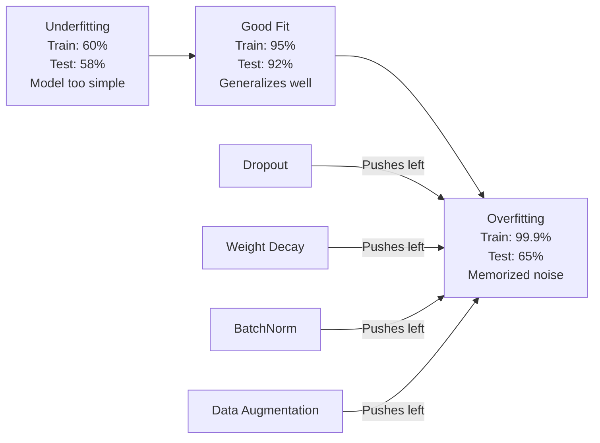
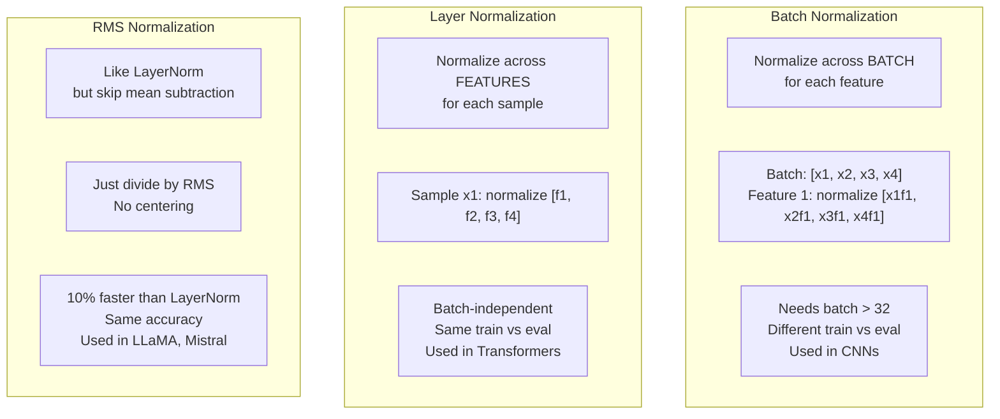
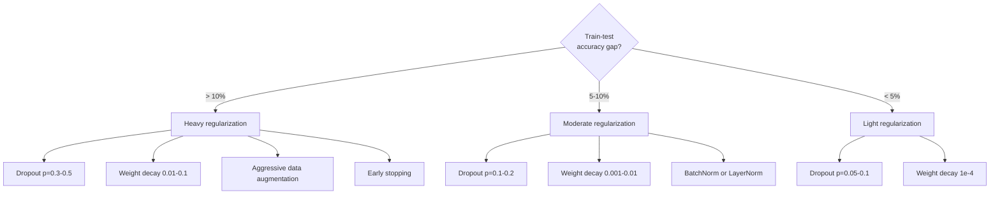

# La régulation.

> Votre modèle reçoit 99% sur les données de formation et 60% sur les données de test. Il mémore au lieu d'apprendre.

> **【中文解读】**Le modèle entraîne 99% mais le test est seulement 60% il est "sortir" et non "apprendre" la normalisation est un facteur de taxation de la complexité, le modèle est fortement généralisé

**Type:** Build
**Languages:** Python
**Prerequisites:** Lesson 03.06 (Optimizers)
**Time:** ~75 minutes

## Objectifs d'apprentissage

- Implémenter le décrochage avec une mise à l'échelle inverse, une diminution du poids L2, une normalisation de lot, une normalisation de couche et une normalisation RMSNorm à partir de zéro
- Mesurer l'écart de précision des essais en train et diagnostiquer le surmatch à l'aide d'expériences de régularisation
- Expliquez pourquoi les transformateurs utilisent LayerNorm au lieu de BatchNorm et pourquoi les LLM modernes préfèrent RMSNorm
- Appliquer la bonne combinaison de techniques de régularisation en fonction de la gravité du surmatch

> **【中文解读】**Le groupe de transformateurs utilise la LayerNorm et non la BatchNorm, ainsi que le groupe de transformateurs utilisant la LayerNorm.

## Le problème , l' introduction du problème

Un réseau neural avec suffisamment de paramètres peut mémoriser n'importe quel ensemble de données. Ce n'est pas une hypothèse - Zhang et coll. (2017) l'a prouvé en entraînant des réseaux standard sur ImageNet avec des étiquettes aléatoires. Les réseaux ont atteint une perte de formation proche de zéro sur des assignations d'étiquettes complètement aléatoires. Ils ont mémorisé un million de paires de saisie-sortie aléatoires sans modèle à apprendre. La perte de formation était parfaite.

> Un réseau neural suffisamment paramétrique peut se souvenir de n'importe quel ensemble de données. Ce n'est pas une hypothèse  Zhang 等人 (2017) 通过在ImageNet上随机标签训练标准网络证明这一点.

C'est le problème du sur-adaptation, et il s'aggrave à mesure que les modèles deviennent plus grands. GPT-3 a 175 milliards de paramètres. Le jeu de formation a environ 500 milliards de jetons. Avec autant de paramètres, le modèle a suffisamment de capacité pour mémoriser des morceaux importants des données de formation verbalement. Sans régularisation, il regurgiterait simplement des exemples de formation au lieu d'apprendre des modèles généralisables.

> C'est un problème de suradaptation, avec le modèle grandissant et devenant pire. Le GPT-3 a 1750 milliards de paramètres.

L'écart entre les performances de formation et les performances d'essai est le décalage de suradéquation. Chaque technique de cette leçon attaque cette lacune sous un angle différent. Le décrochage force le réseau à ne pas compter sur un seul neurone. La perte de poids empêche tout poids de devenir trop gros. La normalisation des lots allume le paysage des pertes afin que l'optimisateur trouve des minima plus plats et plus généralisables. La normalisation de couche fait la même chose, mais fonctionne lorsque la normalisation de lot échoue (petits lots, séquences de longueur variable). RMSNorm le fait 10% plus rapidement en laissant tomber le calcul moyen. Chaque technique est simple. Ensemble, ils sont la différence entre un modèle qui mémore et un modèle qui généralise.

> La différence entre les performances de formation et les performances de test est la différence de suradaptation. Chaque technique de cette classe attaque cette différence sous un angle différent. Le déploiement de réseau obligatoire ne dépend de aucun neurone. La baisse de poids empêche la croissance excessive de tout poids. La différence de suradaptation est la différence de suradaptation. La différence de suradaptation est la même. La différence de suradaptation est la différence de suradaptation.

> **【中文解读】**模型参数越多,越容易过拟合――GPT-3 a 1750 milliards de paramètres、5000 milliards de jetons non normalisé, il ne fait que mémoriser les données de formation── chaque moyen de normalisation attaque des différents angles sur la configuration:Dropout 强制冗余表示、权重减减限制参数幅度、归化平滑损曲面──

> **【拓展：大模型的正则化策略】**La normalisation de GPT-4 et de Llama 3 est très simple: AdamW 权重衰减 (wd=0.01) + Dropout (p=0.1) + RMSNorm。 pas besoin de techniques de normalisation compliquées。

## Le concept de base.

### Le spectre de sur-adaptation est un système de spectre.

Chaque modèle se trouve quelque part sur un spectre, de l'inadaptation (trop simple pour capturer le motif) à la suradaptation (aussi complexe qu'il capture le bruit).

> Chaque modèle est situé à une certaine position sur le spectre du modèle de l'inadaptation (modèle trop simple et impossible à saisir) à celui du modèle de l'adaptation (modèle trop complexe pour capturer le bruit).



### Je me déconne.

La technique de régulation la plus simple avec l'interprétation la plus élégante.

> La technique de normalisation la plus simple et la plus élégante est d'expliquer:

```
output = activation(z) * mask    where mask[i] ~ Bernoulli(1 - p)
```

Avec p = 0,5, la moitié des neurones sont zéro à chaque passage vers l'avant. Le réseau doit apprendre des représentations redondantes parce qu'il ne peut pas prédire quels neurones seront disponibles. Cela empêche la co-adaptation - les neurones apprennent à compter sur d'autres neurones spécifiques étant présents.

> Lorsque p = 0,5 , une moitié des neurones sont placés à zéro par transmission. Le réseau doit apprendre à exécuter les redondantes, car il est impossible de prédire quels neurones sont disponibles.

L'interprétation de l'ensemble: un réseau avec N neurones et un dérapagement crée 2^N sous-réseaux possibles (chaque combinaison de neurones qui sont allumés ou désactivés). La formation avec abandon entraîne approximativement tous les sous-réseaux 2^N simultanément, chacun sur différents mini-parties. Au moment de l'essai, vous utilisez tous les neurones (sans déraillement) et étalonnez les résultats de (1 - p) pour correspondre à la valeur attendue pendant l'entraînement. Cela équivaut à la moyenne des prédictions de 2^N sous-réseaux -- un ensemble massif d'un seul modèle.

> 集成解释: un réseau avec N 个神经元和中断的网络创建2^N 个可能的子网络(神经元开关的每种组合) ⋅ utiliser la formation de la déconnexion 训练大约同时训练所有2^N 个子网络,每个在不同的小组上――测试时,你使用所有神经元(无中断)并按 (1 - p) 缩放输出与匹配值训练期间的期望――这等于对2^N 个子网络的预测平均使用单个模型实现大规模集成――

En pratique, l'évolutivité est appliquée au cours de la formation au lieu des essais (dérapagement inversé):

```
During training:  output = activation(z) * mask / (1 - p)
During testing:   output = activation(z)   (no change needed)
```

C'est plus propre parce que le code de test n'a pas besoin de savoir du tout sur le décrochage.

> C'est plus clair, car il n'y a pas besoin de savoir que le code de test est abandonné.

Taux de défaillance: p = 0,1 pour les transformateurs, p = 0,5 pour les MLP, p = 0,2 à 0,3 pour les CNN.

> 默认比率:Transformateur 用 p = 0,1,MLP 用 p = 0,5,CNN 用 p = 0,2-0,3──découpe 越高 = 正则化越强 = 欠拟合风险越大──

> **【拓展：Dropout 在 BERT 和 GPT 中的不同用法】**BERT utilise le dérapagement p=0.1  应用于注意和隐藏层──GPT-2 utilise également le p=0.1, mais uniquement lors de l'entraînement──C'est intéressant, la suggestion peut être utilisée lors du dérapagement MC(maintain le dérapagement 开启) pour estimer le modèle d'incertitude fonctionne 30-100 fois de différence de prise de vue──C'est très utile dans le cas de l'estimation de l'incertitude dans l'IA médicale et dans les autres domaines.

### La réduction de poids est une régularisation de l'équilibre.

Ajoutez la magnitude carrée de tous les poids à la perte:

> La taille de la propriété est ajoutée à la perte:

```
total_loss = task_loss + (lambda / 2) * sum(w_i^2)
```

Le gradient du terme de régularisation est lambda * w. Cela signifie que à chaque étape, chaque poids est réduit vers zéro d'une fraction proportionnelle à sa taille.

> Le degré de normalisation est lambda * w. Cela signifie que, à chaque étape, chaque poids est réduit à zéro en proportion de sa largeur à sa largeur.

Pourquoi cela aide à la généralisation: les modèles sur-adaptés ont tendance à avoir de grands poids qui amplifient le bruit dans les données de formation.

> Pourquoi cela contribue à la généralisation: le modèle sur-adapté a souvent un poids important, augmente le bruit des données d'entraînement, réduit le poids, maintient le poids plus petit, limite la capacité de fonctionnement du modèle, l'oblige à dépendre des caractéristiques de la généralisation plutôt que des bizarreries de la mémoire.

L'hyperparamètre lambda contrôle la résistance.

> lambda 超参数控制强度── valeur typique:

- 0,01 pour AdamW sur les transformateurs
  Le système de transformation est utilisé pour transformer le système de transformation.
- 1e-4 pour SGD sur les chaînes de télévision
  Le numéro de télévision de la CNN
- 0,1 pour les modèles très surchargés
  0.1 Utilisé pour des modèles très adaptés

Comme nous l'avons expliqué dans la leçon 06: la perte de poids et la régulation de L2 sont équivalentes en SGD mais pas en Adam.

> Comme le montre le chapitre 6, les classes suivantes sont:

### Normalité de lot.

Normalizer la sortie de chaque couche sur le mini-batch avant de le passer à la couche suivante.

> Avant de transférer les sorties de chaque couche à la couche inférieure, le mini-batch est regroupé.

Pour un mini-batch d'activations à une couche:

>  Pour un mini lot  activation:

```
mu = (1/B) * sum(x_i)           (batch mean)
sigma^2 = (1/B) * sum((x_i - mu)^2)   (batch variance)
x_hat = (x_i - mu) / sqrt(sigma^2 + eps)   (normalize)
y = gamma * x_hat + beta        (scale and shift)
```

Gamma et bêta sont des paramètres apprenables qui permettent au réseau de désamorcer la normalisation si c'est optimal. Sans eux, vous forceriez chaque couche de sortie à être une variante unitaire zéro moyenne, ce qui pourrait ne pas être ce que le réseau veut.

> Gamma et bêta sont des paramètres appréciables, si le mieux est de faire en sorte que le retrait du réseau soit intégré. Sans eux, vous forcerez chaque niveau de sortie à être unité de valeur moyenne à zéro, ce qui n'est peut-être pas ce que le réseau veut.

**Training vs inference split:**Pendant l'entraînement, mu et sigma proviennent du mini-batch actuel. Pendant l'inférence, vous utilisez des moyennes de course accumulées pendant l'entraînement (média mobile exponentielle avec momentum = 0,1, ce qui signifie 90% ancien + 10% nouveau).

> **训练与推理的区别：**訓練時,mu 和 sigma 来自当前迷你批次──推理时,使用訓練期间累积的运行平均值(指数移动平均,动量 = 0.1,即90% 旧值 +10% 新值)──

Pourquoi BatchNorm fonctionne est toujours débattu. Le document original prétendait qu'il réduisait le "changement de covariate interne" (la distribution des entrées de couches changeant à mesure que les couches antérieures se mettent à jour). Santurkar et al. (2018) a montré que cette explication est erronée. La raison réelle: BatchNorm rend le paysage des pertes plus lisse. Les gradients sont plus prédictifs, les constantes de Lipschitz sont plus petites, et l'optimisateur peut prendre de plus grands pas en toute sécurité. C'est pourquoi BatchNorm vous permet d'utiliser des taux d'apprentissage plus élevés et de converger plus rapidement.

> La raison pour laquelle la norme de batch est encore en cause est que le débit de la mise en œuvre de la norme de batch est réduit. Le premier article affirme qu'elle réduit la " déviation des variables internes " (la répartition des entrées de couches avec les mises à jour et les changements de couches précédentes).

BatchNorm a une limitation fondamentale: il dépend des statistiques de lot. Avec la taille du lot 1, la moyenne et la variance sont sans signification. Avec les petits lots (< 32), les statistiques sont bruyantes et ont des performances blessées. Cela est important pour des tâches telles que la détection d'objets (où la mémoire limite la taille du lot) et la modélisation du langage (où les longueurs de séquences varient).

> BatchNet a une limite fondamentale: il dépend de la statistique de lot. La taille du lot est de 1 heure, la moyenne et la différence de taille sont insignifiantes.

> **【中文解读】**Les limites fondamentales de BatchNorm: dépend de la statistique de lot. Batch_size=1 时平均值差无意义; batch_size<32 时统计量噪声太大──这就是Transformer 用 LayerNorm的原因语言模型批小、序列长度不一──

### La normalisation des couches.

Normalement, les caractéristiques doivent être normalisées au lieu de toutes les caractéristiques du lot.

> 跨特征维度归化, et non跨批量── Pour un seul échantillon:

```
mu = (1/D) * sum(x_j)           (feature mean)
sigma^2 = (1/D) * sum((x_j - mu)^2)   (feature variance)
x_hat = (x_j - mu) / sqrt(sigma^2 + eps)
y = gamma * x_hat + beta
```

D est la dimension de la fonction. Chaque échantillon est normalisé indépendamment - sans dépendance de la taille du lot. C'est pourquoi les transformateurs utilisent LayerNorm au lieu de BatchNorm. Les séquences ont des longueurs variables, les tailles de lot sont souvent petites (ou 1 pendant la génération), et le calcul est identique entre la formation et l'inférence.

> D est la dimension caractéristique. Chaque échantillon est indépendant de la taille de la masse. C'est pourquoi le transformateur utilise la LayerNorm et non la BatchNorm. La longueur du processus est variable, la taille de la masse est généralement très petite.

LayerNorm dans les transformateurs est appliqué après chaque bloc d'auto-attention et chaque bloc de transfert (Post-LN) ou avant eux (Pre-LN, plus stable pour l'entraînement).

> LayerNorm de transformateur moyen 应用于每个自注意力块和每个前块之后 (post-LN),或之前 (Pre-LN,训练更稳定) ⋅

### RMSNorm est une intégration de la racine moyenne.

LayerNorm sans soustraction moyenne. Proposée par Zhang & Sennrich (2019).

> LayerNorm 去掉均值减法── proposé par Zhang & Sennrich (2019) ──

```
rms = sqrt((1/D) * sum(x_j^2))
y = gamma * x / rms
```

C'est tout. Pas de calcul moyen, pas de paramètre bêta. L'observation: le recentrage (soustraction moyenne) dans LayerNorm contribue très peu aux performances du modèle, mais coûte calcul.

> C'est ainsi. Il n'y a pas de calcul de valeur moyenne, pas de paramètres bêta. Observez: la réduction de valeur moyenne de la couche de travail est très faible, mais la consommation est réduite.

LLaMA, LLaMA 2, LLaMA 3, Mistral et la plupart des LLM modernes utilisent RMSNorm au lieu de LayerNorm.

> LLaMA、LLaMA 2、LLaMA 3、Mistral 和 la plupart des LLM modernes utilisent RMSNorm plutôt que LayerNorm.

> **【拓展：RMSNorm 为什么能省 10%】**LayerNorm  calculer la moyenne et la différence de deux étapes, RMSNorm  sauter la moyenne et calculer la moyenne RMS。 sur la Llama 3 405B(126 étages) sur chaque étape de l'entraînement de la répartition de 252 fois RMSNorm(attention par étage + FFN à chaque fois)。 province 10% signifie pour chaque fois en avant  économie d'environ 25 fois LayerNorm  moyenne et calcul de la moyenne.

### La normalisation Comparison

### La normalisation Comparison



### Augmentation des données comme normalisation

Pas une modification de modèle mais une modification de données.

> Non pas modification du modèle, mais modification des données.

- Images: coupure aléatoire, retour, rotation, frisson de couleur, coupure
  Le mot "réfléchisse" est traduit par "réfléchisse".
- Text: remplacement synonyme, traduction récurrente, suppression aléatoire
  Le mot "réfléchisse" est traduit par "réfléchisse".
- Audio: décalage de temps, changement de ton, addition de bruit
  Le temps est long, le bruit est en train de se déplacer.

L'effet est identique à la régularisation: il augmente la taille effective de l'ensemble de formation, ce qui rend plus difficile pour le modèle de mémoriser des exemples spécifiques. Un modèle qui ne voit chaque image qu'une fois dans sa forme originale peut la mémoriser. Un modèle qui voit 50 versions augmentées de chaque image est obligé d'apprendre la structure invariante.

> L'effet est le même que la normalisation: elle augmente la taille efficace du groupe d'entraînement, rendant le modèle plus difficile à mémoriser un échantillon spécifique.

### Arrêt précoce

Le régulateur le plus simple: arrêtez de vous entraîner lorsque la perte de validation commence à augmenter. Le modèle n'est pas encore surpassé à ce stade. En pratique, vous suivez la perte de validation à chaque époque, sauvegardez le meilleur modèle et continuez à vous entraîner pour une fenêtre de "patience" (généralement 5 à 20 époques). Si la perte de validation ne s'améliore pas dans la fenêtre de patience, vous arrêtez et chargez le modèle le mieux enregistré.

> La méthode la plus simple est de s'arrêter de s'entraîner lorsque la perte de test commence à augmenter. Dans la pratique, vous devez suivre chaque époque avec la perte de test, conserver le meilleur modèle et continuer à s'entraîner dans une fenêtre de "endurance" (habituellement 5 à 20 époques).

> **【拓展：Early Stopping 在大模型中的实践】**GPT 和 Llama 等大模型通常 ne s'emploie pas à arrêter tôt entraînement dans un jeton fixe 数后结束──但在微调阶段 (如LoRA fine-tuning),arrêter tôt 非常重要,因为小数据集上容易过拟合──HuggingFace's Trainer 默认使用早期停止(patience=3),监控 eval_loss──

### Quand appliquer quoi ?



## Construisez-le et mettez-le en œuvre.
```figure
l2-regularization
```

## Faites-le

> **【中文解读】**Les techniques suivantes sont: la mise à l'échelle inverse du décalage (environ 1 p), la mise à l'échelle (environ 1 p), la mise à l'échelle (environ 1 p) et la mise à l'échelle (environ 2 p) du batchNorm.

### Étape 1: Découpe (Mode de train et d'éval)

> La première étape: Découverte 实现──关键是逆转 training时按概率 p 置零,剩余值除以 (1-p) 保持期望不变;推理时直接通过──这样推理代码不需要知道的存在──倒退也需要应用相同的面具(除以 (1-p))──

```python
import random
import math


class Dropout:
    def __init__(self, p=0.5):
        self.p = p
        self.training = True
        self.mask = None

    def forward(self, x):
        if not self.training:
            return list(x)
        self.mask = []
        output = []
        for val in x:
            if random.random() < self.p:
                self.mask.append(0)
                output.append(0.0)
            else:
                self.mask.append(1)
                output.append(val / (1 - self.p))
        return output

    def backward(self, grad_output):
        grads = []
        for g, m in zip(grad_output, self.mask):
            if m == 0:
                grads.append(0.0)
            else:
                grads.append(g / (1 - self.p))
        return grads
```

### Étape 2: L2 Décomposition du poids.

> Deuxième étape: L2 Légers et degrés de réglementation.

```python
def l2_regularization(weights, lambda_reg):
    penalty = 0.0
    for w in weights:
        penalty += w * w
    return lambda_reg * 0.5 * penalty

def l2_gradient(weights, lambda_reg):
    return [lambda_reg * w for w in weights]
```

### Étape 3: Normalité de lot.

> Troisième étape: BatchNorm 实现── entraînement时: Utilisez la moyenne de la moyenne de la série actuelle, en même temps que la moyenne de la série.

```python
class BatchNorm:
    def __init__(self, num_features, momentum=0.1, eps=1e-5):
        self.gamma = [1.0] * num_features
        self.beta = [0.0] * num_features
        self.eps = eps
        self.momentum = momentum
        self.running_mean = [0.0] * num_features
        self.running_var = [1.0] * num_features
        self.training = True
        self.num_features = num_features

    def forward(self, batch):
        batch_size = len(batch)
        if self.training:
            mean = [0.0] * self.num_features
            for sample in batch:
                for j in range(self.num_features):
                    mean[j] += sample[j]
            mean = [m / batch_size for m in mean]

            var = [0.0] * self.num_features
            for sample in batch:
                for j in range(self.num_features):
                    var[j] += (sample[j] - mean[j]) ** 2
            var = [v / batch_size for v in var]

            for j in range(self.num_features):
                self.running_mean[j] = (1 - self.momentum) * self.running_mean[j] + self.momentum * mean[j]
                self.running_var[j] = (1 - self.momentum) * self.running_var[j] + self.momentum * var[j]
        else:
            mean = list(self.running_mean)
            var = list(self.running_var)

        self.x_hat = []
        output = []
        for sample in batch:
            normalized = []
            out_sample = []
            for j in range(self.num_features):
                x_h = (sample[j] - mean[j]) / math.sqrt(var[j] + self.eps)
                normalized.append(x_h)
                out_sample.append(self.gamma[j] * x_h + self.beta[j])
            self.x_hat.append(normalized)
            output.append(out_sample)
        return output
```

### Étape 4: Normalization de la couche

```python
class LayerNorm:
    def __init__(self, num_features, eps=1e-5):
        self.gamma = [1.0] * num_features
        self.beta = [0.0] * num_features
        self.eps = eps
        self.num_features = num_features

    def forward(self, x):
        mean = sum(x) / len(x)
        var = sum((xi - mean) ** 2 for xi in x) / len(x)

        self.x_hat = []
        output = []
        for j in range(self.num_features):
            x_h = (x[j] - mean) / math.sqrt(var + self.eps)
            self.x_hat.append(x_h)
            output.append(self.gamma[j] * x_h + self.beta[j])
        return output
```

### Étape 5: RMSNorm. Étape 5: Régulation de la racine moyenne.

> La première étape: RMSNorm est une version simplifiée de LayerNorm. Il n'y a que RMS (en moyenne de la racine), pas de valeur moyenne réduite, pas de bêta.

```python
class RMSNorm:
    def __init__(self, num_features, eps=1e-6):
        self.gamma = [1.0] * num_features
        self.eps = eps
        self.num_features = num_features

    def forward(self, x):
        rms = math.sqrt(sum(xi * xi for xi in x) / len(x) + self.eps)
        output = []
        for j in range(self.num_features):
            output.append(self.gamma[j] * x[j] / rms)
        return output
```

### Étape 6: entraînement avec et sans régularisation.

> La première étape est la suivante: le taux de formation à l'échelle du groupe de données de type rond peut atteindre 100% de précision, mais seulement 65% de précision.

```python
def sigmoid(x):
    x = max(-500, min(500, x))
    return 1.0 / (1.0 + math.exp(-x))


def make_circle_data(n=200, seed=42):
    random.seed(seed)
    data = []
    for _ in range(n):
        x = random.uniform(-2, 2)
        y = random.uniform(-2, 2)
        label = 1.0 if x * x + y * y < 1.5 else 0.0
        data.append(([x, y], label))
    return data


class RegularizedNetwork:
    def __init__(self, hidden_size=16, lr=0.05, dropout_p=0.0, weight_decay=0.0):
        random.seed(0)
        self.hidden_size = hidden_size
        self.lr = lr
        self.dropout_p = dropout_p
        self.weight_decay = weight_decay
        self.dropout = Dropout(p=dropout_p) if dropout_p > 0 else None

        self.w1 = [[random.gauss(0, 0.5) for _ in range(2)] for _ in range(hidden_size)]
        self.b1 = [0.0] * hidden_size
        self.w2 = [random.gauss(0, 0.5) for _ in range(hidden_size)]
        self.b2 = 0.0

    def forward(self, x, training=True):
        self.x = x
        self.z1 = []
        self.h = []
        for i in range(self.hidden_size):
            z = self.w1[i][0] * x[0] + self.w1[i][1] * x[1] + self.b1[i]
            self.z1.append(z)
            self.h.append(max(0.0, z))

        if self.dropout and training:
            self.dropout.training = True
            self.h = self.dropout.forward(self.h)
        elif self.dropout:
            self.dropout.training = False
            self.h = self.dropout.forward(self.h)

        self.z2 = sum(self.w2[i] * self.h[i] for i in range(self.hidden_size)) + self.b2
        self.out = sigmoid(self.z2)
        return self.out

    def backward(self, target):
        eps = 1e-15
        p = max(eps, min(1 - eps, self.out))
        d_loss = -(target / p) + (1 - target) / (1 - p)
        d_sigmoid = self.out * (1 - self.out)
        d_out = d_loss * d_sigmoid

        for i in range(self.hidden_size):
            d_relu = 1.0 if self.z1[i] > 0 else 0.0
            d_h = d_out * self.w2[i] * d_relu
            self.w2[i] -= self.lr * (d_out * self.h[i] + self.weight_decay * self.w2[i])
            for j in range(2):
                self.w1[i][j] -= self.lr * (d_h * self.x[j] + self.weight_decay * self.w1[i][j])
            self.b1[i] -= self.lr * d_h
        self.b2 -= self.lr * d_out

    def evaluate(self, data):
        correct = 0
        total_loss = 0.0
        for x, y in data:
            pred = self.forward(x, training=False)
            eps = 1e-15
            p = max(eps, min(1 - eps, pred))
            total_loss += -(y * math.log(p) + (1 - y) * math.log(1 - p))
            if (pred >= 0.5) == (y >= 0.5):
                correct += 1
        return total_loss / len(data), correct / len(data) * 100

    def train_model(self, train_data, test_data, epochs=300):
        history = []
        for epoch in range(epochs):
            total_loss = 0.0
            correct = 0
            for x, y in train_data:
                pred = self.forward(x, training=True)
                self.backward(y)
                eps = 1e-15
                p = max(eps, min(1 - eps, pred))
                total_loss += -(y * math.log(p) + (1 - y) * math.log(1 - p))
                if (pred >= 0.5) == (y >= 0.5):
                    correct += 1
            train_loss = total_loss / len(train_data)
            train_acc = correct / len(train_data) * 100
            test_loss, test_acc = self.evaluate(test_data)
            history.append((train_loss, train_acc, test_loss, test_acc))
            if epoch % 75 == 0 or epoch == epochs - 1:
                gap = train_acc - test_acc
                print(f"    Epoch {epoch:3d}: train_acc={train_acc:.1f}%, test_acc={test_acc:.1f}%, gap={gap:.1f}%")
        return history
```

## Utilisez-le avec le cadre de réalisation

> **【中文解读】**PyTorch 中使用正则化的关键:model.train()/model.eval() 切换 Dropout 和 BatchNorm 的行为──在Transformer 中,LayerNorm + Dropout p=0.1 是标配──忘记模型.eval() 是最常见的深度学习 bug之一──

PyTorch fournit toutes les normalisations et régularisations sous forme de modules:

> PyTorch fournira les fonctions de régulation et de régulation en tant que module:

```python
import torch
import torch.nn as nn

model = nn.Sequential(
    nn.Linear(784, 256),
    nn.BatchNorm1d(256),
    nn.ReLU(),
    nn.Dropout(0.3),
    nn.Linear(256, 128),
    nn.BatchNorm1d(128),
    nn.ReLU(),
    nn.Dropout(0.3),
    nn.Linear(128, 10),
)

model.train()
out_train = model(torch.randn(32, 784))

model.eval()
out_test = model(torch.randn(1, 784))
```

Le `model.train()`- Je suis là .`model.eval()`Le commutateur est essentiel. Il commute le dérapagement et dit à BatchNorm d'utiliser les statistiques de lot par rapport aux statistiques de fonctionnement.`model.eval()`La précision de vos tests fluctuera au hasard parce que le dérapagement est toujours actif et que BatchNorm utilise des statistiques mini-parts.

> `model.train()`- Je suis là .`model.eval()`切换至关重要──它开关 dropout 并告诉BatchNorm Utiliser la statistique de masse ou encore la statistique de fonctionnement──推理前忘记`model.eval()`Le taux de dépistage est en constante évolution, car le dépistage est toujours actif, le batchNorm est utilisé en mini-batch.

Pour les transformateurs, le modèle est différent:

> Pour Transformer, mode différent:

```python
class TransformerBlock(nn.Module):
    def __init__(self, d_model=512, nhead=8, dropout=0.1):
        super().__init__()
        self.attention = nn.MultiheadAttention(d_model, nhead, dropout=dropout)
        self.norm1 = nn.LayerNorm(d_model)
        self.ff = nn.Sequential(
            nn.Linear(d_model, d_model * 4),
            nn.GELU(),
            nn.Linear(d_model * 4, d_model),
            nn.Dropout(dropout),
        )
        self.norm2 = nn.LayerNorm(d_model)
        self.dropout = nn.Dropout(dropout)

    def forward(self, x):
        attended, _ = self.attention(x, x, x)
        x = self.norm1(x + self.dropout(attended))
        x = self.norm2(x + self.ff(x))
        return x
```

LayerNorm, pas BatchNorm. Découpe p = 0,1, pas p = 0,5.

> Utilisez LayerNorm, pas BatchNorm.

## Envoyez-le . Produit .

Cette leçon donne:
- `outputs/prompt-regularization-advisor.md`-- une demande qui diagnostique le surcoût et recommande la bonne stratégie de régularisation

> Le programme de formation`outputs/prompt-regularization-advisor.md`- un diagnostic a été conçu et a proposé des conseils de stratégie de correction correcte

## Les exercices

1. Implémenter la décomposition spatiale pour les données 2D: au lieu de laisser tomber des neurones individuels, décomposez des canaux entiers de fonctionnalités. Simuler ceci en traitant des groupes de fonctionnalités consécutives comme des canaux et en laissant tomber des groupes entiers. Comparer l'écart de test en train à la décomposition standard sur le jeu de données de cercle avec hidden_size=32.

2. Mettre en œuvre le lissage des étiquettes de la leçon 05 combiné à l'abandon de cette leçon. Train avec quatre configurations: ni, abandon seulement, étiquette lissage seulement, les deux. Mesurer l'écart de précision final de train-test pour chacun. Quelle combinaison donne le plus petit écart?

3. Ajoutez une couche BatchNorm entre la couche cachée et l'activation dans votre réseau de jeu de données.

4. Mettre en œuvre l'arrêt précoce: suivre la perte de test à chaque époque, économiser les meilleurs poids et arrêter si la perte de test n'a pas amélioré pendant 20 époques. Exécuter le réseau régularisé pendant 1000 époques. Rapporter quelle époque a eu la meilleure précision de test et combien d'époques de calcul vous avez économisé.

5. Comparer LayerNorm vs RMSNorm sur un réseau de 4 couches (pas seulement 2). Initializer les deux avec les mêmes poids. entraînez pendant 200 époques et comparer la précision finale, la vitesse d'entraînement (temps par époque) et les magnitudes de gradient à la première couche. Vérifiez que RMSNorm est plus rapide avec la même précision.

## Les termes clés

| Term | What people say | What it actually means |
|------|----------------|----------------------|
| Overfitting | "Model memorized the data" | When a model's training performance significantly exceeds its test performance, indicating it learned noise rather than signal |
| Regularization | "Preventing overfitting" | Any technique that constrains model complexity to improve generalization: dropout, weight decay, normalization, augmentation |
| Dropout | "Random neuron deletion" | Zeroing random neurons during training with probability p, forcing redundant representations; equivalent to training an ensemble |
| Weight decay | "L2 penalty" | Shrinking all weights toward zero by subtracting lambda * w at each step; penalizes complexity through weight magnitude |
| Batch normalization | "Normalize per batch" | Normalizing layer outputs across the batch dimension using batch statistics during training and running averages during inference |
| Layer normalization | "Normalize per sample" | Normalizing across features within each sample; batch-independent, used in transformers where batch size varies |
| RMSNorm | "LayerNorm without the mean" | Root mean square normalization; drops the mean subtraction from LayerNorm for 10% speedup with equal accuracy |
| Early stopping | "Stop before overfit" | Halting training when validation loss stops improving; the simplest regularizer, often used alongside others |
| Data augmentation | "More data from less" | Transforming training inputs (flip, crop, noise) to increase effective dataset size and force invariance learning |
| Generalization gap | "Train-test split" | The difference between training and test performance; regularization aims to minimize this gap |

## Encore une lecture

- Srivastava et coll., "Dropout: Un moyen simple d'empêcher les réseaux neuronaux de trop se dépasser" (2014) -- le papier original de dépôt avec l'interprétation ensemble et des expériences étendues
  Srivastava 等人,Dropout: une méthode simple pour empêcher le débordement du réseau neural(2014) Originaire débordement 论文, contenant une explication intégrée et de nombreuses expériences
- Ioffe & Szegedy, " Batch Normalization: Accélérer la formation en réseau profond en réduisant le changement de couverture interne " (2015) -- introduit BatchNorm et sa procédure de formation, l'un des documents d'apprentissage profond les plus cités
  Ioffe & Szegedy, 批归一化:通过减少内部协变量偏移加速深度网络训练(2015) 引入BatchNorm 及其训练过程,深度学习中最引用的论文之一
- Zhang & Sennrich, "Rot Mean Square Layer Normalization" (2019) -- a montré que RMSNorm correspond à la précision de LayerNorm avec un calcul réduit; adopté par LLaMA et Mistral
  Zhang & Sennrich,  moyenne de la racine de la couche de regroupe (2019)  prouver RMSNorm 以更少计算达到 LayerNet 相同精度; été adopté par LLaMA 和 Mistral 
- Zhang et coll., "Comprendre l'apprentissage profond nécessite une rééducation générale" (2017) -- le document historique montrant que les réseaux neuraux peuvent mémoriser des étiquettes aléatoires, défiant les vues traditionnelles de la généralisation
  Zhang 等人, comprendre la profondeur de l'apprentissage nécessite de repenser la géné­ration(2017)里程碑论文,证明神经网络可以记得随机标签,挑战传统泛化观点
