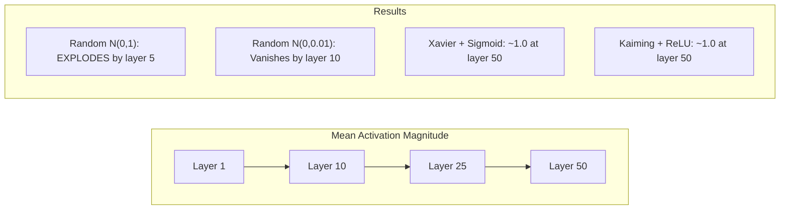
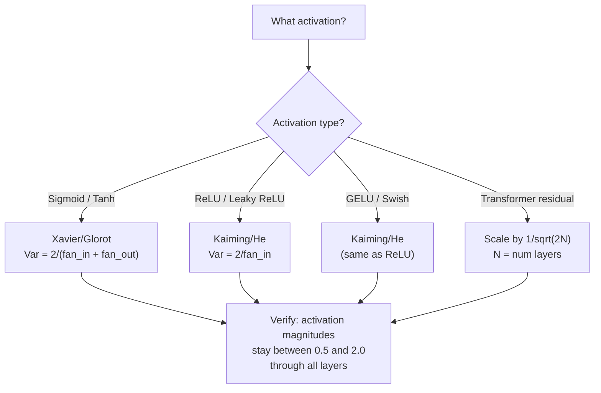

# Poids Initialisation et Stabilité de l' entraînement

> Initialement mal et l'entraînement ne commence jamais.

> **【中文解读】**La formation initiale est une erreur, la formation ne commencera jamais. La formation initiale est une erreur, la formation initiale ne commencera jamais. La formation initiale est une erreur, la formation initiale est une erreur, la formation initiale est une erreur, la formation initiale est une erreur, la formation initiale est une erreur, la formation initiale est une erreur, la formation initiale est une erreur, la formation initiale est une erreur, la formation initiale est une erreur, la formation initiale est une erreur, la formation initiale est une erreur, la formation initiale est une erreur, la formation initiale est une erreur, la formation initiale est une erreur, la formation initiale est une erreur, la formation initiale est une erreur, la formation initiale est une erreur, la formation initiale est une erreur, la formation initiale est une erreur, la formation initiale est une erreur, la formation initiale est une erreur, la formation initiale est une erreur est une erreur, la première est une erreur est une erreur.

**Type:** Build
**Languages:** Python
**Prerequisites:** Lesson 03.04 (Activation Functions), Lesson 03.07 (Regularization)
**Time:** ~90 minutes

## Objectifs d'apprentissage

- Implémenter des stratégies d'initialisation zéro, aléatoire, Xavier/Glorot et Kaiming/He et mesurer leur effet sur les magnitudes d'activation à travers 50 couches
- Déduire pourquoi Xavier init utilise Var(w) = 2/(fan_in + fan_out) et Kaiming utilise Var(w) = 2/fan_in
- Démontre le problème de symétrie avec initialisation zéro et explique pourquoi l'échelle aléatoire seule est insuffisante
- Correspondre la bonne stratégie d'initialisation à la fonction d'activation: Xavier pour sigmoid/tanh, Kaiming pour ReLU/GELU

> **【中文解读】**Le problème principal du chapitre est: comment choisir le poids initial, faire le signal dans le réseau de 50 niveaux déjà disparaître ou exploser.

## Le problème , l' introduction du problème

Toutes les valeurs sont initiales à zéro. Rien n'apprend. Chaque neurone calcule la même fonction, reçoit le même gradient et se met à jour de manière identique. Après 10 000 époques, votre couche cachée de 512 neurones est toujours 512 copies du même neurone. Vous avez payé pour 512 paramètres et obtenu 1.

> Pour chaque neurone calculer la même fonction, recevoir la même échelle, de la même manière de mettre à jour. Après 10 000 âges, votre 512 neurones caché couche est toujours 512 copies du même neurone. Vous avez payé pour 512 paramètres, mais vous n'avez obtenu que 1 .

Les activations explosent à travers le réseau. À la couche 10, les valeurs atteignent 1e15. à la couche 20, elles débordent à l'infini.

> La première est trop grande. La valeur active dans le réseau explose. La première est de 15° à 20°.

Les initialiser au hasard à partir d'une distribution normale standard. Fonctionne pour 3 couches. À 50 couches, le signal s'effondre à zéro ou détonne à l'infini selon que l'échelle aléatoire était légèrement trop petite ou légèrement trop grande. La frontière entre "fonctionne" et "foute" est mince comme une rasoir.

> À partir de la distribution standard, la première est de 3 niveaux, la première est de 50 niveaux, le signal se réduit à zéro ou explose à un maximum, en fonction de la taille du temps, soit de petite taille, soit de petite taille.

L'initialisation du poids est la décision la plus sous-estimée dans l'apprentissage profond. L'architecture obtient des documents. Les optimistes obtiennent des articles de blog. L'initialisation obtient une note de bas de page. Mais faites-le mal et rien d'autre n'a d'importance - votre réseau est mort avant que la formation commence.

> L'initialisation est la décision la plus sous-estimée de l'apprentissage en profondeur. L'architecture peut émettre des articles.

> **【中文解读】**La démarche est la décision la plus sous-estimée de l'apprentissage profond. La démarche de démarche de démarche entraîne une comparaison de tous les neurosciences, la différence de démarche de démarche entraînant la disparition ou l'explosion de 50 niveaux de signaux réseau. Xavier et Kaiming ont résolu ce problème par des méthodes mathématiques.

> **【拓展：GPT-2 的残差缩放技巧】**GPT-2 introduit une réduction des débits de 1sqrt(2N) de N est un nombre de niveaux (N est un nombre de niveaux)。 pour chaque débits de connexion x = x + sous-couche(x) la ville augmentera la différence de 126, de la lampe 3 de niveaux permettra une augmentation de 126 fois。 une réduction des facteurs permettra la différence de maintenir la stabilité。 cette technique est maintenant détenue par le transformateur 采用。

## Le concept de base.

### Le problème de la symétrie

Chaque neurone dans une couche a la même structure: multipliez les entrées par les poids, ajoutez un biais, appliquez l'activation. Si tous les poids commencent à la même valeur (zéro est le cas extrême), chaque neurone calcule la même sortie. Pendant la répartition, chaque neurone reçoit le même gradient. Pendant la phase de mise à jour, chaque neurone change de la même quantité.

> Chaque neurone de la couche a la même structure: l'entrée multiplie le poids, la mise à l'écart, l'application de la fonction d'activation. Si la propriété du poids commence à partir de la même valeur, chaque neurone calculera la même sortie.

Vous êtes coincé. Le réseau a des centaines de paramètres, mais ils se déplacent tous en bloc. Cela s'appelle symétrie, et l'initialisation aléatoire est la façon brute-force de le casser. Chaque neurone commence à un point différent dans l'espace de poids, donc chacun apprend une caractéristique différente.

> Vous êtes coincé. Le réseau a des centaines de paramètres, mais ils se déplacent tous en même temps. On appelle cela la relativité, et l'initialisation du temps est une façon violente de la briser.

Mais le "champ" n'est pas suffisant. L'échelle de la chance détermine si le réseau fonctionne.

> Mais le "cas" n'est pas suffisant.

### Diffusion de variance à travers les couches

Considérez une seule couche avec des entrées fan_in:

> 考虑一个有风扇_in 个输入的单层:

```
z = w1*x1 + w2*x2 + ... + w_n*x_n
```

Si chaque poids wi est tiré d'une distribution avec variance Var(w) et chaque entrée xi a variance Var(x), la variance de sortie est:

> Si chaque poids est divisé par Var (x), chaque entrée est divisée par Var (x), la différence entre les sorties est:

```
Var(z) = fan_in * Var(w) * Var(x)
```

Si Var(w) = 1 et fan_in = 512, la variance de sortie est 512x la variance d'entrée. Après 10 couches: 512 ^ 10 = 1,2e27. Votre signal a explosé.

> Si Var(w) = 1 et fan_in = 512, le débit est de 512 fois le débit de 512 fois le débit de 512 fois le débit de 512 fois le débit de 512 fois le débit de 512 fois le débit de 512 fois le débit de 512 fois le débit de 512 fois le débit de 512 fois le débit de 512 fois le débit de 512 fois le débit de 512 fois le débit de 512 fois le débit de 512 fois le débit de 512 fois le débit de 512 fois le débit de 512 fois le débit de 512 fois le débit de 512 fois le débit de 512 fois le débit de 512 fois le débit de 512 fois le débit de 512 fois le débit de 512 fois le débit de 512 fois le débit de 512 fois le débit de 512 fois le débit de 512 fois le débit de 5 fois le débit de 5 fois le débit de 5 fois le débit de 5 fois le débit de 5 fois le débit de 5 fois.

Si Var ((w) = 0,001, la variance de sortie se réduit de 0,001 * 512 = 0,512 par couche. Après 10 couches: 0,512^10 = 0,00013. Votre signal a disparu.

> Si Var(w) = 0,001, votre signal est parti.

L'objectif: choisir Var(w) afin que Var(z) = Var(x). La magnitude du signal reste constante à travers les couches.

> 目標:选择 Var(w) 使 Var(z) = Var(x)。 signal幅度逐层保持恒定──

> **【中文解读】**方差传播的数学:Var(z) = fan_in * Var(w) * Var(x)。 Si fan_in=512 且 Var(w) = 1,输出方差是输入的 512 倍──10 层后:512^10 = 1.2e27,信号爆炸──Xavier 和 Kaiming 目的都是让 Var(z) = Var(x),使信号幅度逐层保持恒定──

### Je suis en train de faire une première mise en page.

Glorot et Bengio (2010) ont dérivé la solution pour les activations sigmoïdes et tanh.

> Glorot 和 Bengio (2010) a proposé la solution de la fonction activation de sigmoïde 和 tanh afin de maintenir une différence constante entre le courant avant et le courant antiversal:

```
Var(w) = 2 / (fan_in + fan_out)
```

Dans la pratique, les poids sont tirés de:

> 实践中,权重从以下分布抽取:

```
w ~ Uniform(-limit, limit)  where limit = sqrt(6 / (fan_in + fan_out))
```

ou

```
w ~ Normal(0, sqrt(2 / (fan_in + fan_out)))
```

Cela fonctionne parce que le sigmoïde et le tanh sont à peu près linéaires près de zéro, où vivent des activations correctement initiales.

> Ceci est donc efficace, car le sigmoïde et le tanh sont généralement linéaires, tandis que la valeur activée de l'initialisation est réellement stable dans les dix niveaux.

### Il commence à se faire.

La réLU tue la moitié des sorties (tout ce qui est négatif devient zéro). Le fan_in effectif est réduit de moitié parce que en moyenne la moitié des entrées sont zéro. Xavier init ne tient pas compte de cela - il sous-estime la variance nécessaire.

> La RELU réduira la moitié de la sortie de la position de zéro (toutes les valeurs négatives deviennent zéro) ⋅ la moitié de la valeur de la ventilateur valide, car la moitié moyenne de la sortie est mise à zéro.

He et al. (2015) ont ajusté la formule:

> Il 等人 (2015) 调整了公式:

```
Var(w) = 2 / fan_in
```

Les poids sont tirés de:

> 权重从以下分布抽取:

```
w ~ Normal(0, sqrt(2 / fan_in))
```

Le facteur 2 compense le fait que ReLU réduise à zéro la moitié des activations. Sans lui, le signal se réduit de ~ 0,5 fois par couche. Avec 50 couches: 0,5^50 = 8,8e-16.

> Parce que 2  réparation ReLU va mettre la moitié de la valeur activée à zéro ⋅ sans elle, signal de chaque couche diminuer d'environ 0,5 ⋅ 50 ⋅ 50 ⋅ 50 ⋅ 8.8e-16 ⋅ Kaiming initiale empêche cette situation ⋅

> **【拓展：PyTorch 的默认初始化】**PyTorch's nn.Linear 默认使用 Kaiming Uniform 初始化(`nn.init.kaiming_uniform_`,mode='fan_in'), accompagné de LeakyReLU's negative_slope=sqrt(5)`nn.Linear(784, 256)`时,PyTorch 已经帮你选择好初始化――但自定义架构(Transformer、混合专家模型) 需要手动调整──

### La mise en service du transformateur

GPT-2 introduit un modèle différent. Les connexions résiduelles ajoutent la sortie de chaque sous-couche à son entrée:

> GPT-2 introduit un mode différent. Les connexions restantes augmenteront la sortie de chaque sous-couche à son entrée:

```
x = x + sublayer(x)
```

Chaque addition augmente la variance. Avec N couches résiduelles, la variance augmente proportionnellement à N. GPT-2 élève le poids des couches résiduelles par 1/sqrt(2N), où N est le nombre de couches. Cela maintient la magnitude du signal accumulé stable.

> Chaque fois que l'on ajoute, on augmente le squaresme. Il y a N 个残差层时, squaresme selon N 成比例增长.

Llama 3 (405B paramètres, 126 couches) utilise un schéma similaire. Sans cette mise à l'échelle, le flux résiduel augmenterait sans limites à travers 126 couches d'attention et de blocs de flux.

> Llama 3(4050 milliards de paramètres (126 niveaux) utilise des solutions similaires.

> **【拓展：混合专家模型（MoE）的初始化挑战】**Le modèle Mixtral 8x7B 和 GPT-4 等 utilisent l'architecture MoE, chaque jeton seulement activé partie des spécialistes. La mise en œuvre doit être assurée: le pouvoir de mise en œuvre du routeur ne peut pas permettre à tous les jetons de choisir le même spécialiste. La pratique courante est d'utiliser un petit écart de mise en œuvre + un décalage de bruit, pour assurer la mise en œuvre du même.

```mermaid
flowchart TD
    subgraph "Zero Init"
        Z1["Layer 1<br/>All weights = 0"] --> Z2["Layer 2<br/>All neurons identical"]
        Z2 --> Z3["Layer 3<br/>Still identical"]
        Z3 --> ZR["Result: 1 effective neuron<br/>regardless of width"]
    end

    subgraph "Xavier Init"
        X1["Layer 1<br/>Var = 2/(fan_in+fan_out)"] --> X2["Layer 2<br/>Signal stable"]
        X2 --> X3["Layer 50<br/>Signal stable"]
        X3 --> XR["Result: Trains with<br/>sigmoid/tanh"]
    end

    subgraph "Kaiming Init"
        K1["Layer 1<br/>Var = 2/fan_in"] --> K2["Layer 2<br/>Signal stable"]
        K2 --> K3["Layer 50<br/>Signal stable"]
        K3 --> KR["Result: Trains with<br/>ReLU/GELU"]
    end
```



### Magnitude d'activation à travers 50 couches



### Choisir le bon initiateur



## Construisez-le et mettez-le en œuvre.
```figure
weight-init-variance
```

## Faites-le

> **【中文解读】**实验设计:让信号通过50 层网络,测量每层的激活幅度──零初始化 → 所有神经元相同;随机 N(0,1) → 爆炸;随机 N(0,0.01) → 消失;Xavier+tanh / Kaiming+ReLU → 稳定── Cette expérience a montré l'importance du début.

### Étape 1: Stratégies d'initialisation.

Quatre façons d'initialiser une matrice de poids. Chacun renvoie une liste de listes (une matrice 2D) avec des colonnes fan_in et des lignes fan_out.

> 4 modes de réinitialisation du poids de la matrice.

```python
import math
import random


def zero_init(fan_in, fan_out):
    return [[0.0 for _ in range(fan_in)] for _ in range(fan_out)]


def random_init(fan_in, fan_out, scale=1.0):
    return [[random.gauss(0, scale) for _ in range(fan_in)] for _ in range(fan_out)]


def xavier_init(fan_in, fan_out):
    std = math.sqrt(2.0 / (fan_in + fan_out))
    return [[random.gauss(0, std) for _ in range(fan_in)] for _ in range(fan_out)]


def kaiming_init(fan_in, fan_out):
    std = math.sqrt(2.0 / fan_in)
    return [[random.gauss(0, std) for _ in range(fan_in)] for _ in range(fan_out)]
```

### Étape 2: Fonctions d'activation

Nous avons besoin de sigmoid, tanh et ReLU pour tester chaque stratégie init avec son activation prévue.

> Nous avons besoin de sigmoid, tanh et ReLU pour tester chaque stratégie de démarrage et la combinaison des fonctions de réponse activation.

```python
def sigmoid(x):
    x = max(-500, min(500, x))
    return 1.0 / (1.0 + math.exp(-x))


def tanh_act(x):
    return math.tanh(x)


def relu(x):
    return max(0.0, x)
```

### Étape 3: Passer à l'avant à travers 50 couches.

Passer des données aléatoires à travers un réseau profond et mesurer la taille moyenne de l'activation à chaque couche.

> La mesure de la fréquence d'activation moyenne de chaque couche est effectuée à travers le réseau de profondeur.

```python
def forward_deep(init_fn, activation_fn, n_layers=50, width=64, n_samples=100):
    random.seed(42)
    layer_magnitudes = []

    inputs = [[random.gauss(0, 1) for _ in range(width)] for _ in range(n_samples)]

    for layer_idx in range(n_layers):
        weights = init_fn(width, width)
        biases = [0.0] * width

        new_inputs = []
        for sample in inputs:
            output = []
            for neuron_idx in range(width):
                z = sum(weights[neuron_idx][j] * sample[j] for j in range(width)) + biases[neuron_idx]
                output.append(activation_fn(z))
            new_inputs.append(output)
        inputs = new_inputs

        magnitudes = []
        for sample in inputs:
            magnitudes.append(sum(abs(v) for v in sample) / width)
        mean_mag = sum(magnitudes) / len(magnitudes)
        layer_magnitudes.append(mean_mag)

    return layer_magnitudes
```

### Étape 4: L'expérience

Exécutez toutes les combinaisons: init zéro, N(0,1), N(0,0.01 aléatoire), Xavier avec sigmoïde, Xavier avec tanh, Kaiming avec ReLU. Imprimez la magnitude à couches clés.

> 运行所有组合:零初始化、随机 N(0,1)、随机 N(0,0.01)、Xavier + sigmoid、Xavier + tanh、Kaiming + ReLU。打印关键层的幅度──

```python
def run_experiment():
    configs = [
        ("Zero init + Sigmoid", lambda fi, fo: zero_init(fi, fo), sigmoid),
        ("Random N(0,1) + ReLU", lambda fi, fo: random_init(fi, fo, 1.0), relu),
        ("Random N(0,0.01) + ReLU", lambda fi, fo: random_init(fi, fo, 0.01), relu),
        ("Xavier + Sigmoid", xavier_init, sigmoid),
        ("Xavier + Tanh", xavier_init, tanh_act),
        ("Kaiming + ReLU", kaiming_init, relu),
    ]

    print(f"{'Strategy':<30} {'L1':>10} {'L5':>10} {'L10':>10} {'L25':>10} {'L50':>10}")
    print("-" * 80)

    for name, init_fn, act_fn in configs:
        mags = forward_deep(init_fn, act_fn)
        row = f"{name:<30}"
        for idx in [0, 4, 9, 24, 49]:
            val = mags[idx]
            if val > 1e6:
                row += f" {'EXPLODED':>10}"
            elif val < 1e-6:
                row += f" {'VANISHED':>10}"
            else:
                row += f" {val:>10.4f}"
        print(row)
```

### Étape 5: démonstration de symétrie.

Montrez que l'initial zéro produit des neurones identiques.

> 展示零初始化产生完全相同的神经元──

```python
def symmetry_demo():
    random.seed(42)
    weights = zero_init(2, 4)
    biases = [0.0] * 4

    inputs = [0.5, -0.3]
    outputs = []
    for neuron_idx in range(4):
        z = sum(weights[neuron_idx][j] * inputs[j] for j in range(2)) + biases[neuron_idx]
        outputs.append(sigmoid(z))

    print("\nSymmetry Demo (4 neurons, zero init):")
    for i, out in enumerate(outputs):
        print(f"  Neuron {i}: output = {out:.6f}")
    all_same = all(abs(outputs[i] - outputs[0]) < 1e-10 for i in range(len(outputs)))
    print(f"  All identical: {all_same}")
    print(f"  Effective parameters: 1 (not {len(weights) * len(weights[0])})")
```

### Étape 6: Rapport de grandeur couche par couche.

Imprimez un graphique visuel de la grandeur de l'activation à travers 50 couches.

> imprimer 50 couches de la taille de l'activation 

```python
def magnitude_report(name, magnitudes):
    print(f"\n{name}:")
    for i, mag in enumerate(magnitudes):
        if i % 5 == 0 or i == len(magnitudes) - 1:
            if mag > 1e6:
                bar = "X" * 50 + " EXPLODED"
            elif mag < 1e-6:
                bar = "." + " VANISHED"
            else:
                bar_len = min(50, max(1, int(mag * 10)))
                bar = "#" * bar_len
            print(f"  Layer {i+1:3d}: {bar} ({mag:.6f})")
```

## Utilisez-le avec le cadre de réalisation

> **【中文解读】**PyTorch en place`nn.init.xavier_uniform_`- Je suis là.`nn.init.kaiming_normal_`L'utilisation de la ligne est en mode standard, donc le système de configuration doit être automatiquement configuré.

PyTorch fournit ces fonctions intégrées:

> PyTorch va fournir ces comme fonction intégrée:

```python
import torch
import torch.nn as nn

layer = nn.Linear(512, 256)

nn.init.xavier_uniform_(layer.weight)
nn.init.xavier_normal_(layer.weight)

nn.init.kaiming_uniform_(layer.weight, nonlinearity='relu')
nn.init.kaiming_normal_(layer.weight, nonlinearity='relu')

nn.init.zeros_(layer.bias)
```

Quand vous appelez`nn.Linear(512, 256)`C'est pourquoi la plupart des réseaux simples " fonctionnent " - PyTorch a déjà fait le bon choix. Mais quand vous construisez des architectures personnalisées ou allez plus profondément que 20 couches, vous devez comprendre ce qui se passe et potentiellement annuler la défaillance.

> Quand tu t' en fais`nn.Linear(512, 256)`时,PyTorch 默认使用Kaiming 均初始化──这就是为什么大多数简单网络"开箱即用"PyTorch 已经帮助你做出正确选择──但是当你构建自定义架构或超过20层时,你需要理解正在发生什么并可能覆盖默认值──

Pour les transformateurs, les modèles HuggingFace gèrent généralement l'initialisation dans leur`_init_weights`La mise en œuvre de GPT-2 étalonne les projections résiduelles par 1/sqrt ((N). Si vous construisez un transformateur à partir de zéro, vous devez ajouter cela vous-même.

> Pour le Transformer, le visage en accouche est généralement`_init_weights`方法中处理初始化── GPT-2 réalisation将残差投影缩缩放到1/sqrt(N)── Si vous construisez un transformateur à partir de zéro, vous devez vous-même l'ajouter──

## Envoyez-le . Produit .

Cette leçon donne:
- `outputs/prompt-init-strategy.md`-- un prompt qui diagnostique les problèmes d'initialisation du poids et recommande la bonne stratégie

> Le programme de formation`outputs/prompt-init-strategy.md`- un diagnostic de la difficulté de démarrage et de la recommandation de la bonne stratégie

## Les exercices

1. Ajouter l'initialisation LeCun (Var = 1/fan_in, conçu pour l'activation SELU). Exécuter l'expérience de 50 couches avec LeCun init + tanh et comparer à Xavier + tanh.

   1. 添加 LeCun 初始化(Var = 1/fan_in,为 SELU 激活设计) ・・・用 LeCun 初始化 + tanh 跑 50 层实验,和Xavier + tanh 对比──

2. Mettre en œuvre l'échelle résiduelle GPT-2: multipliez la sortie de chaque couche par 1/sqrt ((2*N) avant d'ajouter au flux résiduel.

   2. 实现 GPT-2 Résidual élargissement:把每层输出乘以1/sqrt(2*N) 再加到残差流──跑 50 层有缩放和无缩放,测量残差幅度增速──

3. Créer une fonction "initial health check" qui prend les dimensions de couche d'un réseau et le type d'activation, puis recommande la bonne initialisation et met en garde si l'initial actuel va causer des problèmes.

   3. Créer la fonction "initialiser le contrôle de santé": recevoir le type de dimension et d'activation du réseau, recommander un initialisateur correct, prévenir si un initialisateur actuel entraînera des problèmes.

4. Exécutez l'expérience avec fan_in = 16 vs fan_in = 1024. Xavier et Kaiming s'adaptent à fan_in, mais l'initial aléatoire ne le fait pas. Montrez comment l'écart entre "fonctionne" et "sort" s'élargit avec les couches plus grandes.

   4. Utilisation de la technique de l'équipement de la machine à sous:

5. Implémenter une initialisation orthogonale (générer une matrice aléatoire, calculer son SVD, utiliser la matrice orthogonale U).

   5. 实现正交初始化(生成随机矩阵,计算 SVD,用正交矩阵 U) ⋅在 50 层 ReLU 网络上和 Kaiming对比──

## Les termes clés

| Term | What people say | What it actually means |
|------|----------------|----------------------|
| Weight initialization | "Set starting weights randomly" | The strategy for choosing initial weight values that determines whether a network can train at all |
| Symmetry breaking | "Make neurons different" | Using random initialization to ensure neurons learn distinct features instead of computing identical functions |
| Fan-in | "Number of inputs to a neuron" | The number of incoming connections, which determines how input variance accumulates in the weighted sum |
| Fan-out | "Number of outputs from a neuron" | The number of outgoing connections, relevant for maintaining gradient variance during backpropagation |
| Xavier/Glorot init | "The sigmoid initialization" | Var(w) = 2/(fan_in + fan_out), designed to preserve variance through sigmoid and tanh activations |
| Kaiming/He init | "The ReLU initialization" | Var(w) = 2/fan_in, accounts for ReLU zeroing half the activations |
| Variance propagation | "How signals grow or shrink through layers" | The mathematical analysis of how activation variance changes layer by layer based on weight scale |
| Residual scaling | "GPT-2's init trick" | Scaling residual connection weights by 1/sqrt(2N) to prevent variance growth through N transformer layers |
| Dead network | "Nothing trains" | A network where poor initialization causes all gradients to be zero or all activations to saturate |
| Exploding activations | "Values go to infinity" | When weight variance is too high, causing activation magnitudes to grow exponentially through layers |

| 术语 | 俗称 | 实际含义 |
|------|------|---------|
| Weight initialization / 权重初始化 | "随机设置初始权重" | 选择初始权重值的策略，决定网络能否训练 |
| Symmetry breaking / 对称性破除 | "让神经元不同" | 用随机初始化确保神经元学到不同特征，而不是计算相同函数 |
| Fan-in / 输入连接数 | "神经元的输入数" | 入连接数，决定加权和里输入方差如何累积 |
| Fan-out / 输出连接数 | "神经元的输出数" | 出连接数，与反向传播时保持梯度方差相关 |
| Xavier/Glorot init / Xavier 初始化 | "sigmoid 初始化" | Var(w) = 2/(fan_in + fan_out)，旨在通过 sigmoid/tanh 保持方差 |
| Kaiming/He init / Kaiming 初始化 | "ReLU 初始化" | Var(w) = 2/fan_in，补偿 ReLU 把一半激活置零 |
| Variance propagation / 方差传播 | "信号在层间如何放大或缩小" | 关于激活方差如何基于权重尺度逐层变化的数学分析 |
| Residual scaling / 残差缩放 | "GPT-2 的初始化技巧" | 把残差连接权重缩放 1/sqrt(2N)，防止 N 个 Transformer 层后方差增长 |
| Dead network / 死亡网络 | "什么都不训练" | 初始化不当导致所有梯度为零或所有激活饱和的网络 |
| Exploding activations / 激活爆炸 | "值到无穷" | 权重方差太高，激活幅度在层间指数增长 |

## Encore une lecture

- Glorot & Bengio, "Comprendre la difficulté de former des réseaux neuronaux en flux profond" (2010) -- le document d'initialisation original Xavier avec analyse de variance
  Glorot & Bengio, compréhension train de profondeur  Neural network's difficultés(2010)  original Xavier 初始化论文,包含方差分析
- He et al., "Profondir profondément dans les correcteurs" (2015) -- introduit l'initialisation de Kaiming pour les réseaux ReLU
  Il 等人,深入研究修正器(2015)为 ReLU 网络引入 Kaiming 初始化
- Radford et coll., "Les modèles de langage sont des apprenants multitâches non supervisés" (2019) -- papier GPT-2 avec initialisation de mise à l'échelle résiduelle
  Radford 等人,语言模型是无监督多任务学习器(2019) GPT-2 论文, contenant le reste réduit à la première.
- Mishkin et Matas, "All You Need is a Good Init" (2016) -- initialisation de l'unité-variance de couche séquentielle, une alternative empirique aux formules analytiques
  Mishkin & Matas,You only need a good initiation(2016)层序单位差初始化,解析公式的经验替代方案
