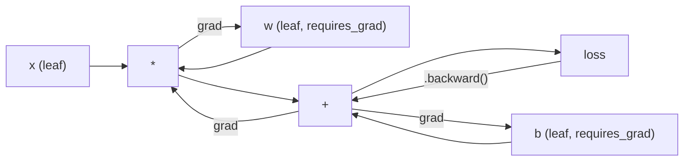
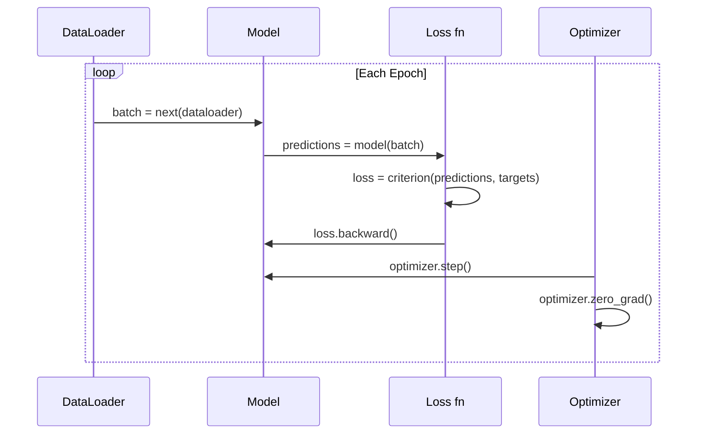

# Introduction à PyTorch

> Vous avez construit le moteur à partir de pistons et de roulements.

> **【中文解读】**Vous avez construit depuis le zéro tous les composants du réseau de l'information.

**Type:** Build
**Languages:** Python
**Prerequisites:** Lesson 03.10 (Build Your Own Mini Framework)
**Time:** ~75 minutes

## Objectifs d'apprentissage

- Construire et former des réseaux neuronaux à l'aide du module nn.Module, nn.Sequentiel et autograd de PyTorch
- Utilisez des tensors PyTorch, une accélération GPU et la boucle d'entraînement standard (zero_grad, avance, perte, arrière, étape)
- Convertir vos composants mini-cadres à partir de zéro à leurs équivalents PyTorch
- Profil et comparer la vitesse d'entraînement entre votre framework Python pur et PyTorch sur la même tâche

> **【中文解读】**Le chapitre de la série de la série de télécommunications de la série de télécommunications de la série de télécommunications de la série de télécommunications de la série de télécommunications de la série de télécommunications de la série de télécommunications de la série de télécommunications de la série de télécommunications de la série de télécommunications de la série de télécommunications de la série de télécommunications de la série de télécommunications de la série de télécommunications de la série de télécommunications de la série de télécommunications de la série de télécommunications de la série de télécommunications de la série de télécommunications de la série de télécommunications de la série de télécommunications de la série de télécommunications de la série de télécommunications de la série de télécommunications de la série de télécommunications de la série de télécommunications de la série de télécommunications de la série de télécommunications de la série de télécommunications de la série de la série de télécommunications de la série de télécommunications de la série de télécommunications de la série de télécommunications de la télécommunications de la télécommunications de la télécommunications de la télécommunications de la télécommunications de la télécommunications de la télécommunications de la télécommunications de la télécommunications de la télécommunications de la télécommunications de la télécommunications de la télécommunications de la télécommunications de la télécommunication de la télécommunication de la télécommunication de la télécommunication de la télécommunication de la télécommunication de la télécommunication de la télécommunication de la télécommunication de la télécommunication de la télécommunication de la télécommunication de la télécommunication de la télécommunication de la télé.

## Le problème , l' introduction du problème

Vous avez un mini framework de travail. couches linéaires, ReLU, dérapagement, norme de lot, Adam, un DataLoader, une boucle d'entraînement. Il entraîne un réseau de 4 couches sur un problème de classification de cercle en Python pur.

> Vous avez un mini framework disponible. La ligne est une couche. La couche est une couche.

C'est aussi 500 fois plus lent que PyTorch sur le même problème.

> Mais il est 500 fois plus lent que PyTorch sur le même problème.

Votre mini-cadre traite un échantillon à la fois avec des boucles Python enlisées. PyTorch envoie les mêmes opérations aux noyaux C++/CUDA optimisés qui fonctionnent sur GPU. Sur une seule NVIDIA A100, PyTorch entraîne un ResNet-50 (25,6 M paramètres) sur ImageNet (1.28 M images) en environ 6 heures. Votre cadre prendrait environ 3000 heures pour la même tâche - si elle ne manquait pas de mémoire en premier.

> Le même système d'exploitation sera déployé sur le GPU pour optimiser la fonctionnalité du C++/CUDA. Sur un seul NVIDIA A100, le même système d'exploitation sera utilisé sur le ImageNet.

La vitesse n'est pas la seule lacune. Votre framework n'a pas de support GPU. Pas de différenciation automatique - vous avez écrit à la main à l'envers pour chaque module. Pas de sérialisation. Pas de formation distribuée. Pas de précision mixte. Pas de moyen de déboguer le flux de gradient sans déclarations d'impression.

> 速度不是唯一差距──你的框架没有GPU 支持──没有自动微分你为每块块手写了后退()──没有序列化──没有分布式训练──没有混合精度──没有不用打印语句就能调试梯度流的方法──

PyTorch comble chacun de ces lacunes. et il le fait tout en gardant le même modèle mental que vous avez déjà construit: module, avant(), paramètres(), arrière(), optimisateur.étape(). Les concepts sont transférés un à un. La syntaxe est presque identique. La différence est que PyTorch enveloppe une décennie d'ingénierie des systèmes derrière la même interface que vous avez conçue à partir de zéro.

> PyTorch a comblé tous ces lacunes. Il a également conservé le même modèle mental que vous avez déjà construit: Module, avance, paramètres, réaction, optimisation, étape.

> **【中文解读】**Votre petit cadre est plus lent que PyTorch 慢 500 倍因为Python 循环个个处理样本,而 PyTorch使用C++/CUDA 内核并行处理。A100 上训练ResNet-50只需6小时,您的框架需要3000小时──但两者的心智模型完全一致:模块、前进、后退、优化器.步骤()──

> **【拓展：PyTorch 为什么赢了 TensorFlow】**En 2017, PyTorch  La publication de PyTorch, TensorFlow  occupe 80% de la part de marché. Mais l'exécution impatiente de PyTorch ️ immédiatement exécutée ️ fait que le développement de la modification et du modèle original soit plus éloigné de TF 1.x ️ Simple ️ jusqu'en 2022, PyTorch dans les travaux de recherche sur l'AM dépasse 75% ️ Meta ️ OpenAI Anthropic  HuggingFace ️ utilisant PyTorch ️ leçons: l'expérience des développeurs est plus importante que la performance absolue️

## Le concept de base.

## Le concept de base.

### Pourquoi PyTorch a gagné Pourquoi PyTorch a gagné Pourquoi

En 2015, TensorFlow vous a demandé de définir un graphique de calcul statique avant d'exécuter quoi que ce soit. Vous avez construit le graphique, compilé, puis alimenté des données à travers lui. Défausser signifiait regarder les visualisations des graphiques.

> En 2015, TensorFlow  exige que vous définissiez un diagramme statique avant de faire quelque chose. Vous construisez un diagramme, vous le complétez, puis vous le faites entrer en données.

PyTorch a été lancé en 2017 avec une philosophie différente: exécution désireuse. Vous écrivez Python. Il fonctionne immédiatement. `y = model(x)`En fait, il compute y en ce moment, pas "ajouter un nœud à un graphique qui calculera y plus tard". Cela signifiait que les outils de débogage Python standard fonctionnaient.

> PyTorch a été lancé en 2017 et a adopté une philosophie différente:`y = model(x)`现在就计算 y, plutôt que "ajouter un petit plus tard calcul y's节点到图中"── ceci signifie que le Python standard 调试工具可用──print() 可用──pdb可用──forward pass 中的 if/else可用──

En 2020, le marché avait parlé. La part de PyTorch dans les documents de recherche ML est passée de 7% (2017) à plus de 75% (2022). Meta, Google DeepMind, OpenAI, Anthropic et Hugging Face utilisent tous PyTorch comme leur cadre principal. TensorFlow 2.x a adopté une exécution enthousiaste en réponse - l'admission tacite que la conception de PyTorch était correcte.

> En 2020, le marché a donné la réponse. La part de PyTorch dans les travaux de recherche sur ML est passée de 7% en 2017 à plus de 75% en 2022.

La leçon: les développeurs expérimentent des composés. Un framework qui est 10% plus lent mais 50% plus rapide à déboguer gagne à chaque fois.

> Les élèves gagnent à 10% mais à 50% de la formation.

### Les tenseurs

Un tensor est un tableau multidimensionnel avec trois propriétés critiques: forme, type d et dispositif.

> La quantité de données est un nombre de dimensions de trois attributs clés: forme, type de données et appareil.

```python
import torch

x = torch.zeros(3, 4)           # shape: (3, 4), dtype: float32, device: cpu
x = torch.randn(2, 3, 224, 224) # batch of 2 RGB images, 224x224
x = torch.tensor([1, 2, 3])     # from a Python list
```

**Shape**est la dimensionnalité. un scalaire est la forme (), un vecteur est (n), une matrice est (m, n), un lot d'images est (batch, canaux, hauteur, largeur).

> **Shape**Il s'agit d'un ensemble de images (partie, canaux, hauteur, largeur)

**Dtype**contrôle la précision et la mémoire.

> **Dtype**- Je ne sais pas.

| dtype | Bits | Range | Use case |
|-------|------|-------|----------|
| float32 | 32 | ~7 decimal digits | Default training |
| float16 | 16 | ~3.3 decimal digits | Mixed precision |
| bfloat16 | 16 | Same range as float32, less precision | LLM training |
| int8 | 8 | -128 to 127 | Quantized inference |

**Device**détermine où se déroule le calcul.

> **Device**Décider de calculer ce qui se passe.

```python
device = torch.device("cuda" if torch.cuda.is_available() else "cpu")
x = torch.randn(3, 4, device=device)
x = x.to("cuda")
x = x.cpu()
```

Chaque opération nécessite tous les tensors sur le même appareil.`RuntimeError: Expected all tensors to be on the same device`- Réglez-le en déplaçant tout dans le même appareil avant le calcul.

> Chaque opération exige que tous les appareils soient sur le même appareil. C'est la première erreur de PyTorch rencontrée par un débutant.`RuntimeError: Expected all tensors to be on the same device` Dans le calcul, tout le contenu sera transféré sur le même appareil.

**Reshaping**est constamment temps -- il change les métadonnées, pas les données.

> **重塑**C'est une opération de temps régulier qui change les données, ne change pas les données.

```python
x = torch.randn(2, 3, 4)
x.view(2, 12)      # reshape to (2, 12) -- must be contiguous
x.reshape(6, 4)    # reshape to (6, 4) -- works always
x.permute(2, 0, 1) # reorder dimensions
x.unsqueeze(0)     # add dimension: (1, 2, 3, 4)
x.squeeze()        # remove size-1 dimensions
```

### Autogradé Autogradé

Votre mini-cadre vous a demandé d'implémenter à l'envers pour chaque module. PyTorch ne le fait pas. Il enregistre chaque opération sur les tensors dans un graphique acyclique dirigé (le graphique de calcul) et traverse ensuite ce graphique à l'envers pour calculer les gradients automatiquement.

> Votre petit cadre vous demande de réaliser chaque module en arrière-plan. PyTorch n'a pas besoin. Il enregistrera chaque opération de la taille de la taille jusqu'à un diagramme sans cercle.



La différence principale avec votre framework: PyTorch utilise un auto-défi basé sur une bande.`.backward()`- Il fait revenir la bande.

> La différence avec votre cadre est que PyTorch utilise des micro-éléments automatiques basés sur des bandes magnétiques.`.backward()`Réaction de la charge magnétique

```python
x = torch.randn(3, requires_grad=True)
y = x ** 2 + 3 * x
z = y.sum()
z.backward()
print(x.grad)  # dz/dx = 2x + 3
```

Trois règles de l'autograd:

> Autograd 的三条规则:

1. Seuls les tensors de feuilles avec `requires_grad=True`accumuler des gradients
   Je ne suis pas là.`requires_grad=True`La quantité de feuilles accumulée
2. Les gradients s' accumulent par défaut -- appel `optimizer.zero_grad()`avant chaque passage en arrière
   Traduction anglaise: gradience de la répartition par rapport à la répartition`optimizer.zero_grad()`
3. `torch.no_grad()`désactiver le suivi des gradients (utilisation lors de l'évaluation)
   Le mot grec traduit par " le mot grec "`torch.no_grad()`禁用梯度追踪 (en anglais seulement)

> **【拓展：混合精度训练如何加速】**Le flot de la A100/H10016 est de 2 à 4 fois le flot de la PyTorch.`torch.amp.autocast`Automélier le temps de déplacement et de déplacement en float16, tout en conservant la douceur et la perte en float32── accompagner le GradScaler  prévenir le float16 梯度下溢── entraînement complet de la lampe 3 avec le bfloat16 混合精度, économisant environ 50% de la réserve et du calcul──

### Nom de l'équipe

`nn.Module`La version de PyTorch ajoute l'enregistrement automatique des paramètres, la découverte de modules récursifs, la gestion des appareils et la sérialisation de dictes d'état.

> `nn.Module`C'est le type de base de chaque composant du réseau neuronal de PyTorch. Vous avez déjà construit cet abstrait en 10e classe. La version de PyTorch a augmenté l'enregistrement automatique des paramètres, la récupération des modules de découverte, la gestion des appareils et la séquestration de la dictation d'état.

```python
import torch.nn as nn

class MLP(nn.Module):
    def __init__(self, input_dim, hidden_dim, output_dim):
        super().__init__()
        self.layer1 = nn.Linear(input_dim, hidden_dim)
        self.relu = nn.ReLU()
        self.layer2 = nn.Linear(hidden_dim, output_dim)

    def forward(self, x):
        x = self.layer1(x)
        x = self.relu(x)
        x = self.layer2(x)
        return x
```

Quand vous attribuez une`nn.Module`ou `nn.Parameter`comme attribut dans `__init__`PyTorch l'enregistre automatiquement.`model.parameters()`C'est pourquoi vous n'avez jamais à collecter manuellement des poids comme vous l'avez fait dans le mini framework.

> Quand tu étais là`__init__`Le directeur`nn.Module`Ou `nn.Parameter`La valeur de l'attribut est attribuée à PyTorch.`model.parameters()`C'est pourquoi vous n'aurez jamais besoin de pouvoir de collecte manuelle comme dans le cadre mini-concrete.

Les éléments clés de la construction:

> 关键构建块:

| Module | What it does | Parameters |
|--------|-------------|------------|
| nn.Linear(in, out) | Wx + b | in*out + out |
| nn.Conv2d(in_ch, out_ch, k) | 2D convolution | in_ch*out_ch*k*k + out_ch |
| nn.BatchNorm1d(features) | Normalize activations | 2 * features |
| nn.Dropout(p) | Random zeroing | 0 |
| nn.ReLU() | max(0, x) | 0 |
| nn.GELU() | Gaussian error linear | 0 |
| nn.Embedding(vocab, dim) | Lookup table | vocab * dim |
| nn.LayerNorm(dim) | Per-sample normalization | 2 * dim |

### Perte de fonctions et d' optimisateurs

PyTorch expédie des versions prêtes à la production de tout ce que vous avez construit.

> PyTorch fournit une version production de toutes les fonctionnalités que vous construisez.

**Loss functions**(de la`torch.nn`):

> **损失函数**(de la`torch.nn`):

| Loss | Task | Input |
|------|------|-------|
| nn.MSELoss() | Regression | Any shape |
| nn.CrossEntropyLoss() | Multi-class classification | Logits (not softmax) |
| nn.BCEWithLogitsLoss() | Binary classification | Logits (not sigmoid) |
| nn.L1Loss() | Regression (robust) | Any shape |
| nn.CTCLoss() | Sequence alignment | Log probabilities |

Remarque: `CrossEntropyLoss`combiné `LogSoftmax`+ `NLLLoss`Il s'agit d'une erreur courante qui produit des gradients incorrects en silence.

> Attention !`CrossEntropyLoss`内部组合了 `LogSoftmax`+ `NLLLoss` Passer dans les logits originaux, ne pas passer à la douceur 输出── c'est une erreur courante, il y aura une tendance à la faiblesse 

**Optimizers**(de la`torch.optim`):

> **优化器**(de la`torch.optim`):

| Optimizer | When to use | Typical LR |
|-----------|-------------|-----------|
| SGD(params, lr, momentum) | CNNs, well-tuned pipelines | 0.01--0.1 |
| Adam(params, lr) | Default starting point | 1e-3 |
| AdamW(params, lr, weight_decay) | Transformers, fine-tuning | 1e-4--1e-3 |
| LBFGS(params) | Small-scale, second-order | 1.0 |

### Le cycle d'entraînement

Chaque cycle d'entraînement PyTorch suit le même schéma de 5 étapes.

> Chaque cycle d'entraînement PyTorch suit le même modèle de 5 étapes.



Le modèle canonique:

> 标准模式:

```python
for epoch in range(num_epochs):
    model.train()
    for inputs, targets in train_loader:
        inputs, targets = inputs.to(device), targets.to(device)
        optimizer.zero_grad()
        outputs = model(inputs)
        loss = criterion(outputs, targets)
        loss.backward()
        optimizer.step()
```

Cinq lignes dans la boucle de lot. Cinq lignes qui ont entraîné GPT-4, Diffusion stable et LLaMA. L'architecture change. Les données changent. Ces cinq lignes ne le font pas.

> 批量循环内五行代码―― entraîné GPT-4、Stable Diffusion 和 LLaMA的五行代码――architecture changera――数据 changera――

### Les données et le DataLoader

Le PyTorch's `Dataset`est une classe abstraite avec deux méthodes: `__len__`et `__getitem__`- Je suis là .`DataLoader`Il est enveloppé par batchage, mélange et chargement de données multi-processus.

> PyTorch de `Dataset`C'est un genre d'abstraction, il y a deux méthodes:`__len__`et `__getitem__`Il y a une autre.`DataLoader`Avec le traitement en série, le désordre et le processus de chargement de données, l'emballage.

```python
from torch.utils.data import Dataset, DataLoader

class MNISTDataset(Dataset):
    def __init__(self, images, labels):
        self.images = images
        self.labels = labels

    def __len__(self):
        return len(self.labels)

    def __getitem__(self, idx):
        return self.images[idx], self.labels[idx]

loader = DataLoader(dataset, batch_size=64, shuffle=True, num_workers=4)
```

`num_workers=4`Il est également possible de faire des tests de formation en utilisant des processeurs de 4 processus pour charger les données en parallèle pendant que le GPU s'entraîne sur le lot courant.

> `num_workers=4` générer 4 processus et charger des données, en même temps que la GPU pendant les séries de formation actuelles ⋅ sur la charge de travail limitée du disque, seul un seul module peut doubler la vitesse de formation ⋅

### - Je suis en train de faire une formation.

Mettre un modèle sur GPU:

> Le modèle sera transféré à la GPU:

```python
device = torch.device("cuda" if torch.cuda.is_available() else "cpu")
model = model.to(device)
```

Cela déplace récursivement chaque paramètre et tampon vers le GPU.

> Ce retour va déplacer chaque paramètre et zone de captage vers la GPU.

```python
inputs, targets = inputs.to(device), targets.to(device)
```

**Mixed precision**réduit de moitié l'utilisation de la mémoire et doublera le débit des GPU modernes (A100, H100, RTX 4090) en fonctionnant en avant/arrière dans float16 tout en conservant les poids principaux dans float32:

> **混合精度**通过在 float16 中运行前向/反向传播, tout en maintenant le pouvoir principal dans float32 , dans le GPU moderne ((A100、H100、RTX 4090) sur le stockage utilisation réduit à moitié, le volume de débit doublement:

```python
from torch.amp import autocast, GradScaler

scaler = GradScaler()
for inputs, targets in loader:
    with autocast(device_type="cuda"):
        outputs = model(inputs)
        loss = criterion(outputs, targets)
    scaler.scale(loss).backward()
    scaler.step(optimizer)
    scaler.update()
    optimizer.zero_grad()
```

### Comparaison: Mini Framework vs PyTorch vs JAX

| Feature | Mini Framework (L10) | PyTorch | JAX |
|---------|---------------------|---------|-----|
| Autodiff | Manual backward() | Tape-based autograd | Functional transforms |
| Execution | Eager (Python loops) | Eager (C++ kernels) | Traced + JIT compiled |
| GPU support | No | Yes (CUDA, ROCm, MPS) | Yes (CUDA, TPU) |
| Speed (MNIST MLP) | ~300s/epoch | ~0.5s/epoch | ~0.3s/epoch |
| Module system | Custom Module class | nn.Module | Stateless functions (Flax/Equinox) |
| Debugging | print() | print(), pdb, breakpoint() | Harder (JIT tracing breaks print) |
| Ecosystem | None | Hugging Face, Lightning, timm | Flax, Optax, Orbax |
| Learning curve | You built it | Moderate | Steep (functional paradigm) |
| Production use | Toy problems | Meta, OpenAI, Anthropic, HF | Google DeepMind, Midjourney |

## Construisez-le et mettez-le en œuvre.

> **【中文解读】**Pour les résultats de la formation, il est nécessaire de faire une formation en 3 niveaux de MLP pour faire un MNIST.
```figure
dropout-mask
```

## Faites-le

Un MLP de 3 couches formé sur le MNIST en utilisant uniquement des primitifs PyTorch.`torchvision.datasets`Nous téléchargons et analysons les données brutes nous-mêmes.

> Utilisation de PyTorch original de formation de 3 niveaux MLP faire MNIST 分类──没有高级封装──没有 `torchvision.datasets` 我们自己下载和分析原始数据──

### Étape 1: Charger MNIST à partir de fichiers bruts

Le MNIST est livré sous forme de 4 fichiers gzipés: images d'entraînement (60.000 x 28 x 28), étiquettes d'entraînement, images d'essai (10.000 x 28 x 28), étiquettes d'essai.

> MNIST utilisant 4 个 gzip 文件提供: entraînement图像(60,000 x 28 x 28) ✓ entraînement étiquette、测试图像(10,000 x 28 x 28) ✓ entraînement étiquette──我们下载它们并解析二进制格式──

```python
import torch
import torch.nn as nn
import struct
import gzip
import urllib.request
import os

def download_mnist(path="./mnist_data"):
    base_url = "https://storage.googleapis.com/cvdf-datasets/mnist/"
    files = [
        "train-images-idx3-ubyte.gz",
        "train-labels-idx1-ubyte.gz",
        "t10k-images-idx3-ubyte.gz",
        "t10k-labels-idx1-ubyte.gz",
    ]
    os.makedirs(path, exist_ok=True)
    for f in files:
        filepath = os.path.join(path, f)
        if not os.path.exists(filepath):
            urllib.request.urlretrieve(base_url + f, filepath)

def load_images(filepath):
    with gzip.open(filepath, "rb") as f:
        magic, num, rows, cols = struct.unpack(">IIII", f.read(16))
        data = f.read()
        images = torch.frombuffer(bytearray(data), dtype=torch.uint8)
        images = images.reshape(num, rows * cols).float() / 255.0
    return images

def load_labels(filepath):
    with gzip.open(filepath, "rb") as f:
        magic, num = struct.unpack(">II", f.read(8))
        data = f.read()
        labels = torch.frombuffer(bytearray(data), dtype=torch.uint8).long()
    return labels
```

### Étape 2: Définir le modèle

Un MLP à 3 couches: 784 -> 256 -> 128 -> 10. Activations de ReLU. Démission pour la régularisation. Aucune norme de lot pour le garder simple.

> Un 3 Layer MLP:784 -> 256 -> 128 -> 10。ReLU 激活──Dropout 正则化──为简单起见不用BatchNorm──

```python
class MNISTModel(nn.Module):
    def __init__(self):
        super().__init__()
        self.net = nn.Sequential(
            nn.Linear(784, 256),
            nn.ReLU(),
            nn.Dropout(0.2),
            nn.Linear(256, 128),
            nn.ReLU(),
            nn.Dropout(0.2),
            nn.Linear(128, 10),
        )

    def forward(self, x):
        return self.net(x)
```

La couche de sortie produit 10 logits bruts (un par chiffre).`CrossEntropyLoss`Il s'occupe de ça en interne.

> 输出层产生 10 个原始logits(每个数字一个) ――不需要软max`CrossEntropyLoss`内部 traitement

Le nombre de paramètres: 784*256 + 256 + 256*128 + 128 + 128*10 + 10 = 235,146. Petit selon les normes modernes.

> 参数:784*256 + 256 + 256*128 + 128 + 128*10 + 10 = 235,146。 selon les normes modernes très petite。 GPT-2 petit il y a 124M。 celui-ci est en quelques secondes on peut s'entraîner complet。

### Étape 3: cycle d'entraînement

Le modèle canonique de l'avant-perte-retour.

> 標準的前进损失后退步模式

```python
def train_one_epoch(model, loader, criterion, optimizer, device):
    model.train()
    total_loss = 0
    correct = 0
    total = 0
    for images, labels in loader:
        images, labels = images.to(device), labels.to(device)
        optimizer.zero_grad()
        outputs = model(images)
        loss = criterion(outputs, labels)
        loss.backward()
        optimizer.step()
        total_loss += loss.item() * images.size(0)
        _, predicted = outputs.max(1)
        correct += predicted.eq(labels).sum().item()
        total += labels.size(0)
    return total_loss / total, correct / total


def evaluate(model, loader, criterion, device):
    model.eval()
    total_loss = 0
    correct = 0
    total = 0
    with torch.no_grad():
        for images, labels in loader:
            images, labels = images.to(device), labels.to(device)
            outputs = model(images)
            loss = criterion(outputs, labels)
            total_loss += loss.item() * images.size(0)
            _, predicted = outputs.max(1)
            correct += predicted.eq(labels).sum().item()
            total += labels.size(0)
    return total_loss / total, correct / total
```

Notes `torch.no_grad()`Ce qui désactive l'autograd, réduit l'utilisation de la mémoire et accélère l'inférence.

> Attention à l'évaluation `torch.no_grad()`Il a désactivé l'autograd, réduit l'utilisation de la mémoire et accélère la réflexion.

### Étape 4: Connectez tout ensemble.

```python
def main():
    device = torch.device("cuda" if torch.cuda.is_available() else "cpu")

    download_mnist()
    train_images = load_images("./mnist_data/train-images-idx3-ubyte.gz")
    train_labels = load_labels("./mnist_data/train-labels-idx1-ubyte.gz")
    test_images = load_images("./mnist_data/t10k-images-idx3-ubyte.gz")
    test_labels = load_labels("./mnist_data/t10k-labels-idx1-ubyte.gz")

    train_dataset = torch.utils.data.TensorDataset(train_images, train_labels)
    test_dataset = torch.utils.data.TensorDataset(test_images, test_labels)
    train_loader = torch.utils.data.DataLoader(
        train_dataset, batch_size=64, shuffle=True
    )
    test_loader = torch.utils.data.DataLoader(
        test_dataset, batch_size=256, shuffle=False
    )

    model = MNISTModel().to(device)
    criterion = nn.CrossEntropyLoss()
    optimizer = torch.optim.Adam(model.parameters(), lr=1e-3)

    num_params = sum(p.numel() for p in model.parameters())
    print(f"Device: {device}")
    print(f"Parameters: {num_params:,}")
    print(f"Train samples: {len(train_dataset):,}")
    print(f"Test samples: {len(test_dataset):,}")
    print()

    for epoch in range(10):
        train_loss, train_acc = train_one_epoch(
            model, train_loader, criterion, optimizer, device
        )
        test_loss, test_acc = evaluate(
            model, test_loader, criterion, device
        )
        print(
            f"Epoch {epoch+1:2d} | "
            f"Train Loss: {train_loss:.4f} | Train Acc: {train_acc:.4f} | "
            f"Test Loss: {test_loss:.4f} | Test Acc: {test_acc:.4f}"
        )

    torch.save(model.state_dict(), "mnist_mlp.pt")
    print(f"\nModel saved to mnist_mlp.pt")
    print(f"Final test accuracy: {test_acc:.4f}")
```

Résultats attendus après 10 époques: ~ 97,8% de précision de test. Temps d'entraînement sur CPU: ~ 30 secondes. Sur GPU: ~ 5 secondes. Sur votre mini-cadre avec la même architecture: ~ 45 minutes.

> 10 个时代 后预期输出: ~97.8% 测试准确率──CPU 训练时间: ~30 秒──GPU: ~5 秒──用迷你框架相同架构: ~45 分钟──

> **【拓展：从 MNIST 到大模型】**Le MNIST MLP 只有 235K 参数──现代模型的规模:GPT-2 small 124M、BERT-base 110M、Llama 3 8B──参数增长 ~1000x,但训练循环的五步模式完全不变──区别在:数据并行(多 GPU)、模型并行(单 GPU 放不下)、梯度检查点(节省显存)、混合精度(加速计算)──这些都是PyTorch 生态系统的一部分──

## Utilisez-le avec le cadre de réalisation

> **【中文解读】**迷你框架和 PyTorch的接口几乎一致──关键区别:PyTorch Uses Autograd 自动微分(不需要手写倒后((、支持GPU(model.to("cuda")) 、支持混合精度训练──保存模型用 state_dict() (可移植的参数典),不要直接酸模型对象──

### Rapide comparation: Mini Framework contre PyTorch

| Mini Framework (Lesson 10) | PyTorch |
|---------------------------|---------|
| `model = Sequential(Linear(784, 256), ReLU(), ...)` | `model = nn.Sequential(nn.Linear(784, 256), nn.ReLU(), ...)` |
| `pred = model.forward(x)` | `pred = model(x)` |
| `optimizer.zero_grad()` | `optimizer.zero_grad()` |
| `grad = criterion.backward()` then `model.backward(grad)` | `loss.backward()` |
| `optimizer.step()` | `optimizer.step()` |
| No GPU | `model.to("cuda")` |
| Manual backward for every module | Autograd handles everything |

L'interface est presque identique, la différence est que tout est sous le capot.

> La différence est dans tout ce qui est au fond.

### Modèles de sauvegarde et de chargement

```python
torch.save(model.state_dict(), "model.pt")

model = MNISTModel()
model.load_state_dict(torch.load("model.pt", weights_only=True))
model.eval()
```

Toujours économiser`state_dict()`Le modèle de l'objet est enregistré avec le pickle, qui se casse lorsque vous réfactez le code.

> 始终保存 `state_dict()`(参数字典), plutôt que de modèle objet.

### Rate de formation Rate de formation Rate de formation

```python
scheduler = torch.optim.lr_scheduler.CosineAnnealingLR(
    optimizer, T_max=10
)
for epoch in range(10):
    train_one_epoch(model, train_loader, criterion, optimizer, device)
    scheduler.step()
```

PyTorch expédie plus de 15 calendriers: StepLR, ExponentialLR, CosineAnnealingLR, OneCycleLR, ReduceLROnPlateau. Tous connectés à la même interface d'optimisation.

> PyTorch  fournir 15+ types de régulateurs:StepLR、ExponentielLR、CosineAnnealingLR、OneCycleLR、ReduceLROnPlateau── tous sont intégrés dans le même réseau d'optimisation──

## Envoyez-le . Produit .

Cette leçon produit deux objets:

> Le cours est publié dans deux dossiers:

- `outputs/prompt-pytorch-debugger.md`-- une mise en garde pour diagnostiquer les défaillances courantes de formation PyTorch
  Le mot grec traduit par " le mot grec "`outputs/prompt-pytorch-debugger.md`- 诊断常见 PyTorch 训练故障的提示词
- `outputs/skill-pytorch-patterns.md`-- une référence des compétences pour les modèles de formation PyTorch
  Le mot grec traduit par " le mot grec "`outputs/skill-pytorch-patterns.md`- PyTorch  training mode de compétences référence

## Les exercices

1. **Add batch normalization.**Insérer `nn.BatchNorm1d`Comparer la précision des essais et la vitesse de formation par rapport à la version de dérapagement seulement.

2. **Implement a learning rate finder.**Traînez pendant une époque avec un taux d'apprentissage croissant de façon exponentielle (de 1e-7 à 1,0). Perte de parcelles par rapport à LR. La LR optimale est juste avant que la perte ne commence à grimper. Utilisez ceci pour choisir une meilleure LR pour le modèle MNIST.

3. **Port to GPU with mixed precision.**Ajouter `torch.amp.autocast`et `GradScaler`La vitesse de débit (échantillons/seconde) avec et sans précision mixte sur la GPU. sur un A100, attendez-vous à une accélération de 2 fois.

4. **Build a custom Dataset.**Télécharger Fashion-MNIST (le même format que MNIST mais avec des vêtements).`FashionMNISTDataset(Dataset)`classe avec `__getitem__`et `__len__`- Prenez la même MLP et comparez la précision.

5. **Replace Adam with SGD + momentum.**Le train avec `SGD(params, lr=0.01, momentum=0.9)`. Comparer les courbes de convergence.`CosineAnnealingLR`Je vais planifier et voir si SGD peut rattraper Adam à l'époque 10.

## Les termes clés

| Term | What people say | What it actually means |
|------|----------------|----------------------|
| Tensor | "A multi-dimensional array" | A typed, device-aware array with automatic differentiation support baked into every operation |
| Autograd | "Automatic backprop" | A tape-based system that records operations during forward pass, then replays them in reverse to compute exact gradients |
| nn.Module | "A layer" | The base class for any differentiable computation block -- registers parameters, supports nesting, handles train/eval modes |
| state_dict | "The model weights" | An OrderedDict mapping parameter names to tensors -- the portable, serializable representation of a trained model |
| .backward() | "Compute gradients" | Traverse the computational graph in reverse, computing and accumulating gradients for every leaf tensor with requires_grad=True |
| .to(device) | "Move to GPU" | Recursively transfer all parameters and buffers to the specified device (CPU, CUDA, MPS) |
| DataLoader | "The data pipeline" | An iterator that batches, shuffles, and optionally parallelizes data loading from a Dataset |
| Mixed precision | "Use float16" | Train with float16 forward/backward for speed while keeping float32 master weights for numerical stability |
| Eager execution | "Run it now" | Operations execute immediately when called, not deferred to a later compilation step -- the core design choice that differentiates PyTorch from TF 1.x |
| zero_grad | "Reset gradients" | Set all parameter gradients to zero before the next backward pass, since PyTorch accumulates gradients by default |

## Encore une lecture

- Paszke et coll., "PyTorch: un style impératif, haute performance de la bibliothèque d'apprentissage profond" (2019) -- le document original expliquant les compromis de conception de PyTorch
  Paszke 等人,PyTorch: un style de haute performance en haute profondeur de l'apprentissage(2019) expliquer PyTorch 设计权衡的原始论文
- Les tutoriels PyTorch: "Apprendre à utiliser des exemples" (https://pytorch.org/tutorials/beginner/pytorch_with_examples.html) -- le chemin officiel des tensors vers nn.Module
  PyTorch enseignement:  avec des exemples apprendre PyTorch  de张量 à nn.Module 
- Guide de réglage des performances de PyTorch (https://pytorch.org/tutorials/recipes/recipes/tuning_guide.html) -- précision mixte, travailleurs de DataLoader, mémoire fixe et autres optimisations de production
  PyTorch  performance调优指南混合精度、DataLoader 工作进程、 fixes内存 et autres optimisations de production
- Horace He, "Making Deep Learning Go Brrrr" (Le fait que l'apprentissage profond soit fait de la musique)https://horace.io/brrr_intro.html) -- pourquoi la formation en GPU est rapide, avec des stratégies d'optimisation spécifiques à PyTorch
  Horace He, 让深度学习飞速运行为什么 GPU 训练快, ainsi que PyTorch 特定优化策略
