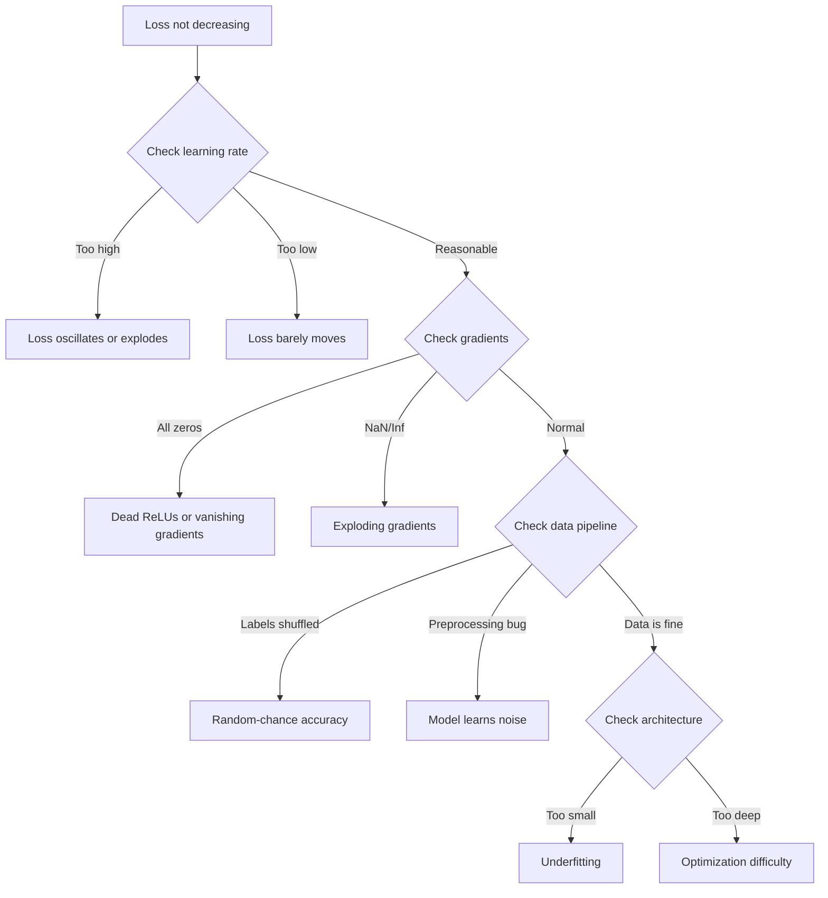
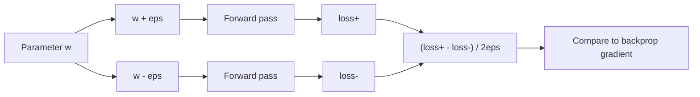
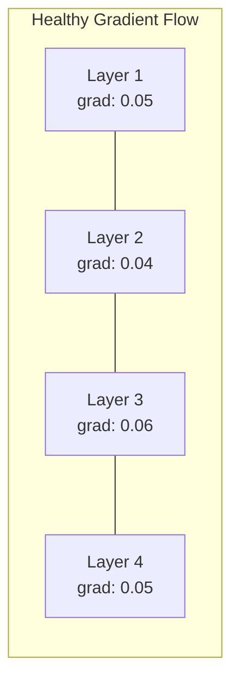
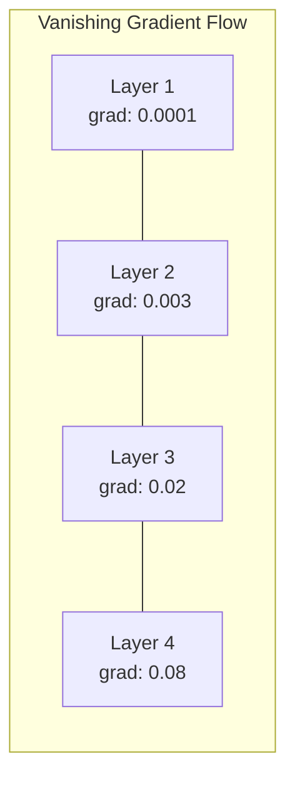
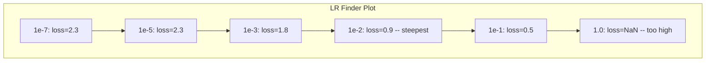

# Déboguer les réseaux neuraux

> Votre réseau a été compilé. Il a fonctionné. Il a produit un numéro. Le numéro est erroné et rien n'a écrasé. Bienvenue dans le type de débogage le plus difficile - le type où il n'y a pas de message d'erreur.

> **【中文解读】**网络编译了、运行了、输出了数字但数字是错误的,没有报错信息――这是最难调试:没有错信息――本章系统介绍深度学习的调试方法论:过拟合单批 → 检查梯度 → 追踪数值稳定性 → 诊断学习率问题――

**Type:** Practice
**Type:** Build
**Languages:** Python, PyTorch
**Prerequisites:** Phase 03 Lessons 01-10 (especially backpropagation, loss functions, optimizers)
**Time:** ~90 minutes

## Objectifs d'apprentissage

- Diagnostication des défaillances courantes du réseau neuronal (perte de NaN, courbe de perte plate, suradaptation, oscillation) en utilisant des stratégies de débogage systématiques
- Appliquez la technique "sur-match" pour vérifier que votre architecture de modèle et votre boucle de formation sont corrects
- Inspecter les magnitudes des gradients, les répartitions d'activation et les normes de poids pour identifier les problèmes de gradients qui disparaissent ou explodent
- Construire une liste de contrôle de débogage qui couvre les problèmes de pipeline de données, d'architecture de modèle, de fonction de perte, d'optimisateur et de taux d'apprentissage

> **【中文解读】**Le programme de référencement de l'équipe de recherche de l'équipe de référencement de l'équipe de référencement de l'équipe de référencement de l'équipe de référencement de l'équipe de référencement de l'équipe de référencement de l'équipe de référencement de l'équipe de référencement de l'équipe de référencement de l'équipe de référencement de l'équipe de référencement de l'équipe de référencement de l'équipe de référencement de l'équipe de référencement de l'équipe de référencement de l'équipe de référencement de l'équipe de référencement de l'équipe de référencement de l'équipe de référencement de l'équipe de référencement de référencement de l'équipe de référencement de référencement de l'équipe de référencement de référencement de l'équipe de référencement de référencement de référencement de l'équipe de référencement de référencement de référencement de référencement de référencement de référencement de référencement de référencement de référencement de référencement de référencement de référencement de référencement de référencement de référencement de référencement de référencement de référencement de référencement de référencement de référencement de référencement de référencement de référencement de référencement de référencement de référencement de référencement de référencement de référencement de référencement de référencement de référencement de référencement de référencement de référencement de référencement de référencement de référencement de référencement de référencement de référencement de référencement de référencement de référencement de référencement de référencement de

## Le problème , l' introduction du problème

Un logiciel traditionnel s'écrase lorsqu'il est cassé. Un pointeur nul lance une exception. Un type de déséquilibre échoue au moment de la compilation. Une erreur de type unique produit une sortie clairement erronée.

> Le type de logiciel traditionnel échoue à la compilation.

Les réseaux neuraux ne vous donnent pas ce luxe.

> Le réseau ne vous donnera pas ce luxe.

Un réseau neural cassé est terminé, imprime une valeur de perte et fait des prédictions. La perte pourrait diminuer. Les prédictions peuvent sembler plausibles. Mais le modèle est silencieusement faux: apprendre des raccourcis, mémoriser le bruit, ou converger à un minimum local inutile. Les chercheurs de Google ont estimé que 60-70% du temps de débogage ML est consacré à des bugs "silencieux" qui ne produisent aucune erreur mais dégradent la qualité du modèle.

> Un réseau neural avec problème peut fonctionner jusqu'à la fin, imprimer la perte de valeur, faire des prévisions. Les pertes peuvent être en baisse. La prévisions peuvent sembler raisonnables. Mais le modèle est en train de commettre des erreurs de chemin d'apprentissage, de se souvenir du bruit ou de recevoir une valeur minimale locale inutile. Les chercheurs de Google estiment que 60-70% du temps de test de l'outil de calcul est passé sur l'erreur " silencieuse " sans produire d'erreurs mais en diminuant la qualité du modèle.

La différence entre un modèle de travail et un modèle cassé réside souvent dans une seule ligne manquante: une ligne manquante `zero_grad()`, une dimension transposée, un taux d'apprentissage de 10 fois supérieur. La recette canonique "Recipe pour la formation des réseaux neuronaux" (2019) commence par: "Les erreurs de réseau neuronal les plus courantes sont les bugs qui ne se crashent pas".

> La différence entre modèle utilisable et modèle mal construit est souvent un code de position incorrecte:`zero_grad()`、维度转置错误、学习率差 10 倍──经典的"训练神经网络的方法" (WEB) 开头写道:" Les erreurs de réseau neural les plus courantes ne sont pas des erreurs qui ne se brisent pas──"

Cette leçon vous apprend à trouver ces insectes.

> Ce cours t'apprend à trouver ces bugs.

> **【中文解读】**Le logiciel traditionnel a des erreurs claires ([[) ]]: ([[) ]] ([[) ]] ([[) ]] ([[) ]] ([[) ]] ([[) ]] ([[) ]] ([[) ]] ([[) ]] ([[) ]] ([[) ]] ([[) ]] ([[) ]] ([[) ]] ([[) ]] ([[) ]] ([[) ]] ([[) ]] ([[) ]] ([[) ]] ([[) ]] ([[) ]] ([[) ]] ([[) ]] ([[) ]] ([[) ]] ([[) ]] ([[) ]] ([[) ]] ([[) ]] ([[) ]] ([[) ]] (]]) (]]) (]]) (]]) (]]) (]]) (]]) (]]) (]]) (]]) (]]) (]]) (]]) (]] (]]) (]]) (]] (]]) (]] (]]) (]] (]]) (]] (]]) (]] (]]) (]] (]] (]]) (]] (]] (]]) (]] (]] (]]) (]] (]] (]]) (D) (D) (D) (D) (D) (D) (D) (D) (D) (D) (D) (D) (D) (D) (D) (D) (D) (D) (D) (D) (D) (D) (D) (D) (D) (D) (D) (D) (D) (D) (D) (D) (D) (D) (D) (D) (D) (D) (D) (D) (D) (D) (D) (D) (D) (D) (D) (D) (D) (D) (D) (D) (D) (D) (D) (D) (D) (D) (D) (D) (D) (D) (D) (D) (D) (D) (D) (D) (D) (D) (D) (D) (D) (D) (D) (D) (D)

> **【拓展：大模型训练中的调试】**訓練 Llama 3 405B 这样型模型(16384块 H100,30.8M GPU 小时), une fois entraînement raté de coûts de hauteur de plusieurs millions de dollars.

## Le concept de base.

### Le débogage de l'esprit.

Oubliez le débogage d'impression et de prélèvement. Le débogage du réseau neuronal nécessite une approche systématique car la boucle de rétroaction est lente (de minutes à heures par séance d'entraînement) et les symptômes sont ambiguës (une mauvaise perte pourrait signifier 20 choses différentes).

> 忘记打印和试试――神经网络调试需要系统化方法,因为反循环很慢(每次训练运行几分钟到几小时),而且症状模糊(差的损失可能意味着20 différents problèmes)

La règle d' or:**start simple, add complexity one piece at a time, and verify each piece independently.**

> La loi de l'or:**从简单开始，一次只加一个复杂度，独立验证每个组件。**

> **【中文解读】**调试神经网络的黄金法则: à partir de la situation la plus simple, chaque fois seulement ajouter un composant, vérifier indépendamment chaque composant.



### Symptome 1: Perte ne diminue pas Symptome 1: Perte ne diminue pas

C'est la plainte la plus courante: la boucle d'entraînement se poursuit, les époques passent, et la perte reste plate ou oscille de façon effrénée.

> C'est le plus courant des plaintes. Le cycle d'entraînement est en cours, une époque après l'autre, mais la perte est toujours immobile ou sévère.

**Wrong learning rate.**Trop élevé: la perte oscille ou saute à NaN. Trop bas: la perte diminue si lentement qu'elle semble plate. Pour Adam, commencez à 1e-3. Pour SGD, commencez à 1e-1 ou 1e-2. Essayez toujours 3 taux d'apprentissage couvrant 10 fois chacun (par exemple, 1e-2, 1e-3, 1e-4) avant de conclure que quelque chose d'autre est mal.

> **学习率错误。**太高:loss 振荡或跳到NaN──太低:loss 下降得太慢,看起来像不动──Adam 从1e-3 开始──SGD 从1e-1 或1e-2 开始──在下结论说有其他问题之前,先尝试3个学习率(相差10倍,如1e-2、1e-3、1e-4)──

**Dead ReLUs.**Si un neurone ReLU reçoit une entrée négative importante, il donne 0 et son gradient est 0. Il ne s'active jamais à nouveau. Si suffisamment de neurones meurent, le réseau ne peut pas apprendre. Vérifiez: imprimez la fraction d'activations qui sont exactement 0 après chaque couche ReLU. Si > 50% sont morts, passez à LeakyReLU ou réduisez le taux d'apprentissage.

> **死亡 ReLU。**Si le neurone ReLU reçoit une grande entrée négative, il sort 0, gradient est 0, ne sera jamais réactivé. Si le neurone meurt, le réseau commence à apprendre à ne rien faire.

**Vanishing gradients.**Dans les réseaux profonds avec des activations sigmoïdes ou tanh, les gradients se rétrécissent de façon exponentielle à mesure qu'ils se propagent vers l'arrière.

> **梯度消失。**Dans le réseau de profondeur activé par le sigmoïde ou le tanh, le gradient inversé à la propagation diminue.

**Exploding gradients.**Le problème inverse - les gradients augmentent de façon exponentielle. communs dans les RNN et les réseaux très profonds.`torch.nn.utils.clip_grad_norm_`), réduire le taux d'apprentissage ou ajouter une normalisation.

> **梯度爆炸。**Le problème est que la température est en hausse.`torch.nn.utils.clip_grad_norm_`• Réduire le taux d'apprentissage ou ajouter à la formation.

### Symptome 2: Perte diminuant mais modèle est mauvais

La perte diminue, la précision de l'entraînement atteint 99%, mais la précision des tests est de 55%, ou le modèle produit des résultats absurdes sur des données réelles.

> Perte en baisse. Le taux d'exactitude de l'entraînement atteint 99%. Mais le taux d'exactitude du test est de seulement 55%.

**Overfitting.**Le modèle mémorise les données d'entraînement au lieu des schémas d'apprentissage. L'écart entre l'entraînement et la perte de validation augmente avec le temps.

> **过拟合。**模型在背诵训练数据而不是学习规律── training loss和验证 loss 之间的差距随时间扩大──修复:更多数据、Dropout、权重减退、早停、数据增强──

**Data leakage.**Les données des tests ont été divulguées dans l'entraînement. La précision est suspectément élevée. Causes courantes: mélange avant la fractionnement, pré-traitement avec des statistiques provenant du jeu complet de données, échantillons dupliqués sur des fractions. Réparation: fractionner en premier, pré-traiter en second, vérifier les duplicates.

> **数据泄漏。**Les données de test sont intégrées à l'entraînement. Le taux de précision est élevé. Les causes courantes sont: pré-processage, pré-processage, pré-processage, pré-processage, pré-processage, pré-processage, pré-processage, pré-processage, pré-processage, pré-processage, pré-processage, pré-processage, pré-processage, pré-processage, pré-processage, pré-processage, pré-processage, pré-processage, pré-processage, pré-processage, pré-processage, pré-processage, pré-processage, pré-processage, pré-processage, pré-processage, pré-processage, pré-processage, pré-processage, pré-processage, pré-processage, pré-processage, pré-processage, pré-processage, pré-processage, pré-processage, pré-processage, pré-processage, pré-processage, pré-processage, pré-processage, pré-processage, pré-processage, pré-processage, pré-processage, pré-processage, pré-processage, pré-process, pré-processage, pré-processage, pré-process, pré-process, pré-process, pré-process, pré-process, pré-process, pré-process, pré-process, pré-process, pré-process, pré-process, pré-process, pré-process, pré-process, pré-process, pré-process, pré-process, pré-process, pré-process, pré-process, pré-process, pré-process, pré-process, pré-process, pré-process, pré-process, pré-process, pré-process, pré-process, pré-process, pré-process, pré-process, pré-process, pré-process, pré-process, pré-process, pré-

**Label errors.**5 à 10% des étiquettes dans la plupart des ensembles de données réels sont erronées (Northcutt et coll., 2021 -- "Erres de l'étiquette pervasives dans les ensembles de test"). Le modèle apprend le bruit.

> **标签错误。**La plupart des données réelles sont concentrées sur les données de 5 à 10% des étiquettes de l'étiquette.

### Symptome 3: Perte de NaN ou d' Inf

La valeur de perte devient `nan`ou `inf`- L'entraînement est mort.

> La perte de valeur est transformée en`nan`Ou `inf`Il est mort.

**Learning rate too high.**Les mises à jour de la phase sont trop longues pour que les poids explosent.

> **学习率太高。**La température est de 10 fois plus bas.

**log(0) or log(negative).**Compute la perte de l' entropie croisée `log(p)`Si votre modèle donne exactement 0 ou une probabilité négative, le journal explose.`[eps, 1-eps]`où `eps=1e-7`- Je suis désolé .

> **log(0) 或 log(负数)。**交叉损失计算 `log(p)`Si le modèle sort correctement 0 ou négatif, le logement va exploser.`[eps, 1-eps]`, parmi lesquels `eps=1e-7`Il y a une autre.

**Division by zero.**La normalisation de lot se divise par déviation standard. Un lot avec des valeurs constantes a std=0. Fix: ajouter l'epsilon au dénominateur (PyTorch le fait par défaut, mais les implémentations personnalisées peuvent ne pas).

> **除以零。**批归一化要除以标准差──一个常数值的批的 std=0──修复:分母加 epsilon(PyTorch 默认这样做,但自定义实现可能没有)──

**Numerical overflow.**De grandes activations sont introduites `exp()`La solution est de soustraire le maximum avant d'exposer (le truc de log-sum-exp).

> **数值溢出。**Value active de l'entrée`exp()`Il est également possible de calculer les valeurs de l'économie de marché.

### Technique 1: vérification progressive 技术 1: vérification de niveau

Comparer vos gradients analytiques (de l'arrière-prop) aux gradients numériques (de la différence finie).

> Comparer votre échelle de résolution avec la échelle de valeur de la propagation de l'optique et la échelle de valeur de la propagation de l'optique si les deux ne sont pas en accord, votre échelle de propagation de l'optique a un bug.

Gradient numérique pour paramètre `w`- Le numéro de la liste:

> 参数 `w`Le nombre de valeurs:

```
grad_numerical = (loss(w + eps) - loss(w - eps)) / (2 * eps)
```

Métrique de l'accord (différence relative):

> Une égale proportion de différences:

```
rel_diff = |grad_analytical - grad_numerical| / max(|grad_analytical|, |grad_numerical|, 1e-8)
```

Si vous`rel_diff < 1e-5`: correct. si`rel_diff > 1e-3`C'est presque certainement un insecte.

> Si `rel_diff < 1e-5`Si c'est vrai.`rel_diff > 1e-3`Il y a un bug.



### Technique 2: Statistique d'activation:

Surveiller la moyenne et l'écart standard des activations après chaque couche pendant l'entraînement.

>                                                                                                                                                                                                                                                               

| Health indicator | Mean | Std | Diagnosis |
|-----------------|------|-----|-----------|
| Healthy | ~0 | ~1 | Network is learning normally |
| Saturated | >>0 or <<0 | ~0 | Activations stuck at extreme values |
| Dead | 0 | 0 | Neurons are dead (all zeros) |
| Exploding | >>10 | >>10 | Activations growing without bound |

| 健康指标 | 均值 | 标准差 | 诊断 |
|---------|------|--------|------|
| 健康 | ~0 | ~1 | 网络正常学习中 |
| 饱和 | >>0 或 <<0 | ~0 | 激活卡在极端值 |
| 死亡 | 0 | 0 | 神经元死了（全零） |
| 爆炸 | >>10 | >>10 | 激活无界增长 |

### Technique 3: Visualization du flux de degré

Dans un réseau sain, les magnitudes de gradients doivent être approximativement similaires entre les couches. Si les premières couches ont des gradients 1000 fois plus petits que les couches ultérieures, vous avez des gradients qui disparaissent.

> Répertorier la largeur moyenne de la gradience de chaque couche Dans un réseau sain, la largeur de la gradience de chaque couche devrait être approximativement similaire Si la largeur de la première couche est 1000 fois plus petite que la grandeur de la seconde, vous avez le problème de la disparition de la gradience





### Technique 4: Le test de sur-fit-un-batch.

La technique de débogage la plus importante dans l'apprentissage profond.

> La technique de recherche en profondeur est la plus importante.

Prenez un petit lot (8-32 échantillons). Exercez-le pendant plus de 100 itérations. La perte devrait aller à presque zéro et la précision de formation devrait atteindre 100%. Si ce n'est pas le cas, votre modèle ou boucle de formation a un bug fondamental - ne pas procéder à la formation complète.

> 取一个小批量(8-32个样本) ――在上训练100+次代――损失应降到接近零,训练准确率应达到100%──如果不,你的模型或训练循环有根本的错不要进入完整训练──

Ce test détecte:
- Fonctions de perte brisées
- Passe-pièces en arrière cassées
- L'architecture est trop petite pour représenter les données
- Optimisateur non connecté aux paramètres du modèle
- Les données et les étiquettes sont mal alignées

> Ce test peut capturer: la fonction de perte de dégradation, la répartition de dégradation, l'architecture trop petite ne peut pas afficher les données, l'optimisateur n'est pas connecté aux paramètres du modèle, les données et les étiquettes ne correspondent pas.

Cela prend 30 secondes pour exécuter et économise des heures de débogage des exercices d'entraînement complets.

> Cela ne prend que 30 secondes pour fonctionner, vous pouvez économiser quelques heures de temps d'entraînement complet.

> **【拓展：Andrej Karpathy 的调试建议】**Karpathy a donné cette recommandation dans "Recipe pour la formation des réseaux neuronaux": 1) ne pas gérer les performances, assurez-vous que la perte est correctement calculée; 2) suradapter un petit ensemble de données fixe; 3) suradapter un échantillon de données à la taille de la taille; 4) surmonter le poids et la taille des échantillons; 5) suradapter un petit modèle, et le développer.

### Technique 5: Rate Finder d'apprentissage 技术 5: taux d'apprentissage

Leslie Smith (2017) a proposé de balayer le taux d'apprentissage de très petit (1e-7) à très grand (10) sur une époque tout en enregistrant la perte.

> Leslie Smith(2017) a proposé à une époque de la réduction du taux d'apprentissage de la petite taille à la grande taille, en même temps que la réduction du taux d'apprentissage de la petite taille à la grande taille.



Le meilleur LR dans cet exemple: ~1e-3 (un ordre de grandeur avant le point le plus raide).

> Le taux d'apprentissage le plus élevé est de 1 à 3 (en moyenne, un niveau de niveau)

### Les torches PyTorch sont communes.

Ce sont les insectes qui perdent le plus d'heures collectives dans la communauté PyTorch:

> Ce sont les bugs les plus fréquents de PyTorch:

> **【拓展：大模型训练中的 loss spike】**Dans le cadre de l'entraînement sur un modèle à grande échelle, comme GPT-4、Llama 3), il y a des pertes de pointe de la perte soudaine, de la valeur normale à une forte reprise.

| Bug | Symptom | Fix |
|-----|---------|-----|
| Forgetting `optimizer.zero_grad()` | Gradients accumulate across batches, loss oscillates | Add `optimizer.zero_grad()` before `loss.backward()` |
| Forgetting `model.eval()` at test time | Dropout and batch norm behave differently, test accuracy varies between runs | Add `model.eval()` and `torch.no_grad()` |
| Wrong tensor shapes | Silent broadcasting produces wrong results, no error | Print shapes after every operation during debugging |
| CPU/GPU mismatch | `RuntimeError: expected CUDA tensor` | Use `.to(device)` on model AND data |
| Not detaching tensors | Computation graph grows forever, OOM | Use `.detach()` or `with torch.no_grad()` |
| In-place operations breaking autograd | `RuntimeError: modified by in-place operation` | Replace `x += 1` with `x = x + 1` |
| Data not normalized | Loss stuck at random-chance level | Normalize inputs to mean=0, std=1 |
| Labels as wrong dtype | Cross-entropy expects `Long`, got `Float` | Cast labels: `labels.long()` |

| Bug | 症状 | 修复 |
|-----|------|------|
| 忘记 `optimizer.zero_grad()` | 梯度跨 batch 累积，loss 振荡 | 在 `loss.backward()` 前加 `optimizer.zero_grad()` |
| 测试时忘记 `model.eval()` | Dropout 和 BN 行为不同，测试准确率波动 | 加 `model.eval()` 和 `torch.no_grad()` |
| 张量形状错误 | 静默广播产生错误结果，无报错 | 调试时每个操作后打印形状 |
| CPU/GPU 不匹配 | `RuntimeError: expected CUDA tensor` | 模型和数据都用 `.to(device)` |
| 没有分离张量 | 计算图永远增长，OOM | 用 `.detach()` 或 `with torch.no_grad()` |
| 原地操作破坏 autograd | `RuntimeError: modified by in-place operation` | 把 `x += 1` 改成 `x = x + 1` |
| 数据未归一化 | Loss 卡在随机猜测水平 | 把输入归一化到 mean=0, std=1 |
| 标签 dtype 错误 | 交叉熵要 `Long`，得到了 `Float` | 转换标签：`labels.long()` |

### Le maître de débogage

| Symptom | Likely cause | First thing to try |
|---------|-------------|-------------------|
| Loss stuck at -log(1/num_classes) | Model predicting uniform distribution | Check data pipeline, verify labels match inputs |
| Loss NaN after a few steps | Learning rate too high | Reduce LR by 10x |
| Loss NaN immediately | log(0) or division by zero | Add epsilon to log/division operations |
| Loss oscillating wildly | LR too high or batch size too small | Reduce LR, increase batch size |
| Loss decreasing then plateaus | LR too high for fine-tuning phase | Add LR schedule (cosine or step decay) |
| Training acc high, test acc low | Overfitting | Add dropout, weight decay, more data |
| Training acc = test acc = chance | Model not learning anything | Run overfit-one-batch test |
| Training acc = test acc but both low | Underfitting | Bigger model, more layers, more features |
| Gradients all zero | Dead ReLUs or detached computation graph | Switch to LeakyReLU, check `.requires_grad` |
| Out of memory during training | Batch too large or graph not freed | Reduce batch size, use `torch.no_grad()` for eval |

| 症状 | 可能原因 | 首选尝试 |
|------|---------|---------|
| Loss 卡在 -log(1/num_classes) | 模型预测均匀分布 | 检查数据管线，验证标签与输入匹配 |
| 几步后 Loss 变 NaN | 学习率太高 | 学习率降低 10 倍 |
| Loss 立即变 NaN | log(0) 或除以零 | 给 log/除法操作加 epsilon |
| Loss 剧烈振荡 | LR 太高或 batch 太小 | 降低 LR，增大 batch |
| Loss 下降后停滞 | 微调阶段 LR 太高 | 加 LR 调度（cosine 或阶梯衰减） |
| 训练 acc 高，测试 acc 低 | 过拟合 | 加 Dropout、权重衰减、更多数据 |
| 训练 acc = 测试 acc = 随机水平 | 模型没学到东西 | 跑过拟合单 batch 测试 |
| 训练 acc = 测试 acc 都低 | 欠拟合 | 更大模型、更多层、更多特征 |
| 梯度全零 | Dead ReLU 或计算图被 detach | 换 LeakyReLU，检查 `.requires_grad` |
| 训练时 OOM | Batch 太大或计算图未释放 | 减小 batch，eval 时用 `torch.no_grad()` |

## Construisez-le et mettez-le en œuvre.

> **【中文解读】**Construire un outil de diagnostic de débogage de réseau: utiliser le crochet avant et le crochet arrière de PyTorch pour enregistrer automatiquement chaque niveau de statistiques actives et de statistiques de degrés.
```figure
learning-curves
```

## Faites-le

Un ensemble d'outils de diagnostic qui surveille les activations, les gradients et les courbes de perte.

> Un ensemble de tests de dépistage de la courbe de la détection de la valeur activée, du degré et de la perte de la détection de la détection de la détection de la détection de la détection de la détection de la détection de la détection de la détection de la détection de la détection de la détection de la détection de la détection de la détection de la détection de la détection de la détection de la détection de la détection de la détection de la détection de la détection de la détection de la détection de la détection de détection de la détection de détection de détection de détection de détection de détection de détection de détection de détection de détection de détection de détection de détection de détection de détection de détection de détection de détection de détection de détection de détection de détection de détection de détection de détection de détection de détection.

### Étape 1: La classe de débogage réseau.

Connecte avec un modèle PyTorch pour enregistrer des statistiques d'activation et de gradient par couche.

> Donnez à PyTorch un modèle de fonctionnement, enregistrez l'activation et la température de chaque niveau.

> Réseau Débogageur utilisant PyTorch's hook avant et hook arrière Automatique surveillance chaque étage。 santé inspection logique:perte 检查(NaN/振荡/不下降)、激活检查(>50% 零值→ mort ReLU, signification: 10→ explos,std<1e-6→缩)、梯度检查(abs_mean<1e-7→消失,>100→explosion,首尾比值>100→梯度比失衡)`print_report()`输出综合诊断报告――

```python
import torch
import torch.nn as nn
import math


class NetworkDebugger:
    def __init__(self, model):
        self.model = model
        self.activation_stats = {}
        self.gradient_stats = {}
        self.loss_history = []
        self.lr_losses = []
        self.hooks = []
        self._register_hooks()

    def _register_hooks(self):
        for name, module in self.model.named_modules():
            if isinstance(module, (nn.Linear, nn.Conv2d, nn.ReLU, nn.LeakyReLU)):
                hook = module.register_forward_hook(self._make_activation_hook(name))
                self.hooks.append(hook)
                hook = module.register_full_backward_hook(self._make_gradient_hook(name))
                self.hooks.append(hook)

    def _make_activation_hook(self, name):
        def hook(module, input, output):
            with torch.no_grad():
                out = output.detach().float()
                self.activation_stats[name] = {
                    "mean": out.mean().item(),
                    "std": out.std().item(),
                    "fraction_zero": (out == 0).float().mean().item(),
                    "min": out.min().item(),
                    "max": out.max().item(),
                }
        return hook

    def _make_gradient_hook(self, name):
        def hook(module, grad_input, grad_output):
            if grad_output[0] is not None:
                with torch.no_grad():
                    grad = grad_output[0].detach().float()
                    self.gradient_stats[name] = {
                        "mean": grad.mean().item(),
                        "std": grad.std().item(),
                        "abs_mean": grad.abs().mean().item(),
                        "max": grad.abs().max().item(),
                    }
        return hook

    def record_loss(self, loss_value):
        self.loss_history.append(loss_value)

    def check_loss_health(self):
        if len(self.loss_history) < 2:
            return "NOT_ENOUGH_DATA"
        recent = self.loss_history[-10:]
        if any(math.isnan(v) or math.isinf(v) for v in recent):
            return "NAN_OR_INF"
        if len(self.loss_history) >= 20:
            first_half = sum(self.loss_history[:10]) / 10
            second_half = sum(self.loss_history[-10:]) / 10
            if second_half >= first_half * 0.99:
                return "NOT_DECREASING"
        if len(recent) >= 5:
            diffs = [recent[i+1] - recent[i] for i in range(len(recent)-1)]
            if max(diffs) - min(diffs) > 2 * abs(sum(diffs) / len(diffs)):
                return "OSCILLATING"
        return "HEALTHY"

    def check_activations(self):
        issues = []
        for name, stats in self.activation_stats.items():
            if stats["fraction_zero"] > 0.5:
                issues.append(f"DEAD_NEURONS: {name} has {stats['fraction_zero']:.0%} zero activations")
            if abs(stats["mean"]) > 10:
                issues.append(f"EXPLODING_ACTIVATIONS: {name} mean={stats['mean']:.2f}")
            if stats["std"] < 1e-6:
                issues.append(f"COLLAPSED_ACTIVATIONS: {name} std={stats['std']:.2e}")
        return issues if issues else ["HEALTHY"]

    def check_gradients(self):
        issues = []
        grad_magnitudes = []
        for name, stats in self.gradient_stats.items():
            grad_magnitudes.append((name, stats["abs_mean"]))
            if stats["abs_mean"] < 1e-7:
                issues.append(f"VANISHING_GRADIENT: {name} abs_mean={stats['abs_mean']:.2e}")
            if stats["abs_mean"] > 100:
                issues.append(f"EXPLODING_GRADIENT: {name} abs_mean={stats['abs_mean']:.2e}")
        if len(grad_magnitudes) >= 2:
            first_mag = grad_magnitudes[0][1]
            last_mag = grad_magnitudes[-1][1]
            if last_mag > 0 and first_mag / last_mag > 100:
                issues.append(f"GRADIENT_RATIO: first/last = {first_mag/last_mag:.0f}x (vanishing)")
        return issues if issues else ["HEALTHY"]

    def print_report(self):
        print("\n=== NETWORK DEBUGGER REPORT ===")
        print(f"\nLoss health: {self.check_loss_health()}")
        if self.loss_history:
            print(f"  Last 5 losses: {[f'{v:.4f}' for v in self.loss_history[-5:]]}")
        print("\nActivation diagnostics:")
        for item in self.check_activations():
            print(f"  {item}")
        print("\nGradient diagnostics:")
        for item in self.check_gradients():
            print(f"  {item}")
        print("\nPer-layer activation stats:")
        for name, stats in self.activation_stats.items():
            print(f"  {name}: mean={stats['mean']:.4f} std={stats['std']:.4f} zero={stats['fraction_zero']:.1%}")
        print("\nPer-layer gradient stats:")
        for name, stats in self.gradient_stats.items():
            print(f"  {name}: abs_mean={stats['abs_mean']:.2e} max={stats['max']:.2e}")

    def remove_hooks(self):
        for hook in self.hooks:
            hook.remove()
        self.hooks.clear()
```

### Étape 2: Le test de sur-fit-un-batch.

> Cette fonction est utilisée en un seul lot de 200 étapes, la perte de validation peut être réduite à près de zéro, le taux de précision peut atteindre 100%.

```python
def overfit_one_batch(model, x_batch, y_batch, criterion, lr=0.01, steps=200):
    optimizer = torch.optim.Adam(model.parameters(), lr=lr)
    model.train()
    print("\n=== OVERFIT ONE BATCH TEST ===")
    print(f"Batch size: {x_batch.shape[0]}, Steps: {steps}")

    for step in range(steps):
        optimizer.zero_grad()
        output = model(x_batch)
        loss = criterion(output, y_batch)
        loss.backward()
        optimizer.step()

        if step % 50 == 0 or step == steps - 1:
            with torch.no_grad():
                preds = (output > 0).float() if output.shape[-1] == 1 else output.argmax(dim=1)
                targets = y_batch if y_batch.dim() == 1 else y_batch.squeeze()
                acc = (preds.squeeze() == targets).float().mean().item()
            print(f"  Step {step:3d} | Loss: {loss.item():.6f} | Accuracy: {acc:.1%}")

    final_loss = loss.item()
    if final_loss > 0.1:
        print(f"\n  FAIL: Loss did not converge ({final_loss:.4f}). Model or training loop is broken.")
        return False
    print(f"\n  PASS: Loss converged to {final_loss:.6f}")
    return True
```

### Étape 3: Lecteur de taux d'apprentissage.

> Cette fonction de taux d'apprentissage de la "perte de la "perte de la "perte de la "perte de la "perte de la "perte de la "perte de la "perte de la "perte de la "perte de la "perte de la "perte de la "perte de la "perte de la "perte de la "perte de la "perte de la "perte de la "perte de la "perte de la "perte de la "perte de la "perte de la "perte de la "perte de la "perte de la "perte de la "perte de la "perte de la "perte de la "perte de la "perte de la "perte de la "perte de la "perte de la "perte de la "perte de la "perte de la "perte de la "perte de la "perte de la "perte de "perte de "perte de "perte de "perte de "perte de "perte" de "perte" de "perte" de "perte" de "perte" de "perte" de "perte" de "perte" de "perte" de "perte" de "perte" de "perte "perte" de "perte" "perte"

```python
def find_learning_rate(model, x_data, y_data, criterion, start_lr=1e-7, end_lr=10, steps=100):
    import copy
    original_state = copy.deepcopy(model.state_dict())
    optimizer = torch.optim.SGD(model.parameters(), lr=start_lr)
    lr_mult = (end_lr / start_lr) ** (1 / steps)

    model.train()
    results = []
    best_loss = float("inf")
    current_lr = start_lr

    print("\n=== LEARNING RATE FINDER ===")

    for step in range(steps):
        optimizer.zero_grad()
        output = model(x_data)
        loss = criterion(output, y_data)

        if math.isnan(loss.item()) or loss.item() > best_loss * 10:
            break

        best_loss = min(best_loss, loss.item())
        results.append((current_lr, loss.item()))

        loss.backward()
        optimizer.step()

        current_lr *= lr_mult
        for param_group in optimizer.param_groups:
            param_group["lr"] = current_lr

    model.load_state_dict(original_state)

    if len(results) < 10:
        print("  Could not complete LR sweep -- loss diverged too quickly")
        return results

    min_loss_idx = min(range(len(results)), key=lambda i: results[i][1])
    suggested_lr = results[max(0, min_loss_idx - 10)][0]

    print(f"  Swept {len(results)} steps from {start_lr:.0e} to {results[-1][0]:.0e}")
    print(f"  Minimum loss {results[min_loss_idx][1]:.4f} at lr={results[min_loss_idx][0]:.2e}")
    print(f"  Suggested learning rate: {suggested_lr:.2e}")

    return results
```

### Étape 4: vérificateur de degré

> Téléchargement des données de la différence de taille: la différence de valeur de chaque paramètre est calculée par rapport à la différence de valeur de chaque paramètre.`rel_diff < 1e-5`Je veux dire,`> 1e-3`Il y a presque certainement un bug.

```python
def _flat_to_multi_index(flat_idx, shape):
    multi_idx = []
    remaining = flat_idx
    for dim in reversed(shape):
        multi_idx.insert(0, remaining % dim)
        remaining //= dim
    return tuple(multi_idx)


def gradient_check(model, x, y, criterion, eps=1e-4):
    model.train()
    x_double = x.double()
    y_double = y.double()
    model_double = model.double()

    print("\n=== GRADIENT CHECK ===")
    overall_max_diff = 0
    checked = 0

    for name, param in model_double.named_parameters():
        if not param.requires_grad:
            continue

        layer_max_diff = 0

        model_double.zero_grad()
        output = model_double(x_double)
        loss = criterion(output, y_double)
        loss.backward()
        analytical_grad = param.grad.clone()

        num_checks = min(5, param.numel())
        for i in range(num_checks):
            idx = _flat_to_multi_index(i, param.shape)
            original = param.data[idx].item()

            param.data[idx] = original + eps
            with torch.no_grad():
                loss_plus = criterion(model_double(x_double), y_double).item()

            param.data[idx] = original - eps
            with torch.no_grad():
                loss_minus = criterion(model_double(x_double), y_double).item()

            param.data[idx] = original

            numerical = (loss_plus - loss_minus) / (2 * eps)
            analytical = analytical_grad[idx].item()

            denom = max(abs(numerical), abs(analytical), 1e-8)
            rel_diff = abs(numerical - analytical) / denom

            layer_max_diff = max(layer_max_diff, rel_diff)
            checked += 1

        overall_max_diff = max(overall_max_diff, layer_max_diff)
        status = "OK" if layer_max_diff < 1e-5 else "MISMATCH"
        print(f"  {name}: max_rel_diff={layer_max_diff:.2e} [{status}]")

    model.float()

    print(f"\n  Checked {checked} parameters")
    if overall_max_diff < 1e-5:
        print("  PASS: Gradients match (rel_diff < 1e-5)")
    elif overall_max_diff < 1e-3:
        print("  WARN: Small differences (1e-5 < rel_diff < 1e-3)")
    else:
        print("  FAIL: Gradient mismatch detected (rel_diff > 1e-3)")
    return overall_max_diff
```

### Étape 5: Les réseaux délibérément cassés.

Appliquez le kit d'outils aux réseaux cassés et diagnostiquez chacun d'eux.

> Il y a trois types de bugs: 1) taux d'apprentissage trop élevé (lr=10), perte de l'observation (résolution); 2) erreur d'initialisation entraînant la mort de la RELU (révalue de la RELU) (révalue de la RELU); 1) taux de mortalité des neurones (révalue de la RELU); 3) négation de la RELU (révalue de la RELU).

```python
def demo_broken_networks():
    torch.manual_seed(42)
    x = torch.randn(64, 10)
    y = (x[:, 0] > 0).long()

    print("\n" + "=" * 60)
    print("BUG 1: Learning rate too high (lr=10)")
    print("=" * 60)
    model1 = nn.Sequential(nn.Linear(10, 32), nn.ReLU(), nn.Linear(32, 2))
    debugger1 = NetworkDebugger(model1)
    optimizer1 = torch.optim.SGD(model1.parameters(), lr=10.0)
    criterion = nn.CrossEntropyLoss()
    for step in range(20):
        optimizer1.zero_grad()
        out = model1(x)
        loss = criterion(out, y)
        debugger1.record_loss(loss.item())
        loss.backward()
        optimizer1.step()
    debugger1.print_report()
    debugger1.remove_hooks()

    print("\n" + "=" * 60)
    print("BUG 2: Dead ReLUs from bad initialization")
    print("=" * 60)
    model2 = nn.Sequential(nn.Linear(10, 32), nn.ReLU(), nn.Linear(32, 32), nn.ReLU(), nn.Linear(32, 2))
    with torch.no_grad():
        for m in model2.modules():
            if isinstance(m, nn.Linear):
                m.weight.fill_(-1.0)
                m.bias.fill_(-5.0)
    debugger2 = NetworkDebugger(model2)
    optimizer2 = torch.optim.Adam(model2.parameters(), lr=1e-3)
    for step in range(50):
        optimizer2.zero_grad()
        out = model2(x)
        loss = criterion(out, y)
        debugger2.record_loss(loss.item())
        loss.backward()
        optimizer2.step()
    debugger2.print_report()
    debugger2.remove_hooks()

    print("\n" + "=" * 60)
    print("BUG 3: Missing zero_grad (gradients accumulate)")
    print("=" * 60)
    model3 = nn.Sequential(nn.Linear(10, 32), nn.ReLU(), nn.Linear(32, 2))
    debugger3 = NetworkDebugger(model3)
    optimizer3 = torch.optim.SGD(model3.parameters(), lr=0.01)
    for step in range(50):
        out = model3(x)
        loss = criterion(out, y)
        debugger3.record_loss(loss.item())
        loss.backward()
        optimizer3.step()
    debugger3.print_report()
    debugger3.remove_hooks()

    print("\n" + "=" * 60)
    print("HEALTHY NETWORK: Correct setup for comparison")
    print("=" * 60)
    model_good = nn.Sequential(nn.Linear(10, 32), nn.ReLU(), nn.Linear(32, 2))
    debugger_good = NetworkDebugger(model_good)
    optimizer_good = torch.optim.Adam(model_good.parameters(), lr=1e-3)
    for step in range(50):
        optimizer_good.zero_grad()
        out = model_good(x)
        loss = criterion(out, y)
        debugger_good.record_loss(loss.item())
        loss.backward()
        optimizer_good.step()
    debugger_good.print_report()
    debugger_good.remove_hooks()

    print("\n" + "=" * 60)
    print("OVERFIT-ONE-BATCH TEST (healthy model)")
    print("=" * 60)
    model_test = nn.Sequential(nn.Linear(10, 32), nn.ReLU(), nn.Linear(32, 2))
    overfit_one_batch(model_test, x[:8], y[:8], criterion)

    print("\n" + "=" * 60)
    print("LEARNING RATE FINDER")
    print("=" * 60)
    model_lr = nn.Sequential(nn.Linear(10, 32), nn.ReLU(), nn.Linear(32, 2))
    find_learning_rate(model_lr, x, y, criterion)

    print("\n" + "=" * 60)
    print("GRADIENT CHECK")
    print("=" * 60)
    model_grad = nn.Sequential(nn.Linear(10, 8), nn.ReLU(), nn.Linear(8, 2))
    gradient_check(model_grad, x[:4], y[:4], criterion)
```

## Utilisez-le avec le cadre de réalisation

> **【中文解读】**PyTorch Input Modifier outil:`torch.autograd.detect_anomaly()`捕获 NaN/Inf`model.named_parameters()`遍历参数和梯度──生产环境用重量和偏差 (wandb) 或 TensorBoard 实时监控损失、梯度直方图、权重分布──

### PyTorch outils intégrés

> PyTorch Input Tool:`detect_anomaly()`Dans le cas d'une épidémie de maladie de la prostate, le patient peut être exposé à des symptômes de la maladie.`named_parameters()`Précédent de la production en utilisant la bande de contrôle / TensorBoard continuous monitoring

```python
import torch
import torch.nn as nn

model = nn.Sequential(
    nn.Linear(768, 256),
    nn.ReLU(),
    nn.Linear(256, 10),
)

with torch.autograd.detect_anomaly():
    output = model(input_tensor)
    loss = criterion(output, target)
    loss.backward()

for name, param in model.named_parameters():
    if param.grad is not None:
        print(f"{name}: grad_mean={param.grad.abs().mean():.2e}")
```

### Les poids et les préjugés Intégration Les poids et les préjugés 集集集

> W&B 集成: chaque époque 记录 loss、学习率、梯度范数,并为每个参数记录梯度直方图──线上仪表盘实时显示训练曲线,能快速发现损失峰、梯度爆炸或参数和──

```python
import wandb

wandb.init(project="debug-training")

for epoch in range(100):
    loss = train_one_epoch()
    wandb.log({
        "loss": loss,
        "lr": optimizer.param_groups[0]["lr"],
        "grad_norm": torch.nn.utils.clip_grad_norm_(model.parameters(), float("inf")),
    })

    for name, param in model.named_parameters():
        if param.grad is not None:
            wandb.log({f"grad/{name}": wandb.Histogram(param.grad.cpu().numpy())})
```

### Le tableau de bord à tension

> Tensionnaire visualisé:`add_scalar`记录标量(perte, précision, taux d'apprentissage),`add_histogram` enregistrer la distribution du poids et de la gradience `tensorboard --logdir=runs/`Initialement local des instruments, réel temps de vérification des changements de la courbe de formation et de la distribution des paramètres 

```python
from torch.utils.tensorboard import SummaryWriter

writer = SummaryWriter("runs/debug_experiment")

for epoch in range(100):
    loss = train_one_epoch()
    writer.add_scalar("Loss/train", loss, epoch)

    for name, param in model.named_parameters():
        writer.add_histogram(f"weights/{name}", param, epoch)
        if param.grad is not None:
            writer.add_histogram(f"gradients/{name}", param.grad, epoch)
```

### La liste de débogage (avant la formation complète)

1. Faites un test de sur-fit à un lot.
2. Récapitulatif du modèle imprimé - vérifier le nombre de paramètres est raisonnable.
3. Exécutez un seul passe avant avec des données aléatoires - vérifiez la forme de sortie.
4. Traînez pendant 5 époques - vérifier les pertes diminue.
5. Vérifiez les statistiques d'activation. Pas de couches mortes, pas d'explosions.
6. Vérifiez le débit de gradient. Pas de disparition, pas d'explosion.
7. Vérifiez le pipeline de données -- imprimez 5 échantillons aléatoires avec des étiquettes.

> 调试清单(完整训练前):
> 1. 跑过拟合单批 测试──失败就停止──
> 2. 打印模型摘要 验证参数数合理──
> 3. Utilisez les données à la fois à l'avance et à la propagation.
> 4. 5 époques de perte de l'essai dans la chute.
> 5. Aucune explosion.
> 6. Il n'y a pas de détection.
> 7. 验证数据管线 印 5 个标签随机样本的

## Envoyez-le . Produit .

Cette leçon donne:
- `outputs/prompt-nn-debugger.md`-- une demande pour diagnostiquer les défaillances de formation des réseaux neuronaux
- `outputs/skill-debug-checklist.md`-- une liste de contrôle des arbres de décision pour les problèmes de débogage de formation

Modèles de déploiement clés pour le débogage:
- Ajouter des crochets de surveillance aux scripts de formation de production
- Activation de journaux et statistiques de gradients à W&B ou TensorBoard à chaque N étapes
- Implementer des alertes automatiques pour la perte de NaN, les neurones morts (> 80% zéro) ou l'explosion de gradient
- Exécuter toujours le test sur-ensemble en un lot lors du changement d'architectures ou de pipelines de données

> Le programme de formation
> - `outputs/prompt-nn-debugger.md` Diagnosis Neural Network Training Failure de la formation
> - `outputs/skill-debug-checklist.md`调试训练 questions de décision tree清单
> > > > > > > > > > > > > > > > > > > > > > > > > > > > > > > > > > > > > > > > > > > > > > > > > > > > > > > > > > > > > > > > > > > > > > > > > > > > > > > > > > > > > > > > > > > > > > > > > > > > > > > > > > > > > > > > > > > > > > > > > > > > > > > > > > > > > > > > > > > > > > > > > > > > > > > > > > > > > > > > > > > > > > > > > > > > > > > > > > > > > > > > > > > > > > > > > > > > > > > > > > > > > > > > > > > > > > > > > > > > > > > > > > > > > > > > > > > > > > > > > > > > > > > > > > > > > > > > > > > > > > > > > > > > > > > > > > > > > > > > > > > > > > > > > > > > > > > > > > > > > > > > > > > > > > > > > > > > > > > > > > > > > > > > > > > > > > > > > > > > > > > > > > > > > > > > > > > > > > > > > > > > > > > > > > > > > > > > > > > > > > > > > > > > > > > > > > > > > > > > > > > > > > > > > > > > > > > > > > > > > > > > > > > > > > > > > > > > > > > > > > > > > > > > > > > > > > > > > > > > > > > > > > > > > > > > > > > > > > > > > > > > > > > > > > > > > > > > > > > > > > > > > > > > > >
> 调试的关键部署模式:
> - 给生产训练脚本加监控子
> - Chaque étape est activée et enregistrée sur W&B ou TensorBoard
> - 实现自动告警:NaN perte 死亡神经元(>80% 零) 梯度爆炸
> - 改架或数据管线时永远先跑过拟合单批 测试

## Les exercices

1. **Add an exploding gradient detector.**Modifier le `NetworkDebugger`Pour détecter lorsque les gradients dépassent un seuil et suggérer automatiquement une valeur de coupure de gradient.

   **添加梯度爆炸检测器。**修改 `NetworkDebugger`, lorsque la température de test dépasse la valeur, il est automatiquement recommandé de la température de coupe de valeur.

2. **Build a dead neuron resurrector.**Écrivez une fonction qui identifie les neurones morts de ReLU (souvent en sortie 0) et réinitialise leurs poids entrants avec l'initialisation de Kaiming. Montrez que cela récupère un réseau où > 70% des neurones sont morts.

   **构建死亡神经元复活器。**写一个函数识别死亡 ReLU 神经元(始终输出 0), utiliser Kaiming 初始化再启动它们的输入权重――展示它能让一个 >70% 神经元死亡的网络恢复――

3. **Implement the learning rate finder with plotting.**Extension `find_learning_rate`pour enregistrer les résultats en tant que CSV et écrire un script séparé qui lit le CSV et affiche la courbe LR vs perte en utilisant matplotlib. Identifier la LR optimale pour ResNet-18 sur CIFAR-10.

   **实现带绘图的学习率搜索器。**扩展 `find_learning_rate`, Save the results for CSV, et write an independent script Read CSV Using matplotlib draw LR vs loss 曲线── dans le ResNet-18 du CIFAR-10 pour trouver le meilleur LR──

4. **Create a data pipeline validator.**Écrivez une fonction qui vérifie: les échantillons dupliqués sur les fractions train/test, le déséquilibre de distribution des étiquettes (> rapport 10:1), la normalisation des entrées (média proche de 0, std proche de 1), et les valeurs NaN/Inf dans les données.

   **创建数据管线验证器。**写一个函数检查:训练/测试划分间的重复样本、标签分布不平衡(>10:1 比例) 输入归结(平均值接近0,std 接近1)、数据中的 NaN/Inf 值──在故意损坏的数据集上运行──

5. **Debug a real failure.**Prenez le mini-cadre de la leçon 10, introduisez un bug subtil (par exemple, transposez la matrice de poids en arrière), et utilisez la vérification des gradients pour localiser exactement quel paramètre a des gradients incorrects.

   **调试一个真实失败。**取第十 课的迷你框架, introduire un bug caché (comme le référencement à la référencement à la référencement à la référencement à la référencement à la référencement à la référencement à la référencement à la référencement à la référencement à la référencement à la référencement à la référencement à la référencement à la référencement à la référencement à la référencement à la référencement à la référencement à la référencement à la référencement à la référencement à la référencement à la référencement à la référencement à la référencement à la référencement à la référencement à la référencement à la référencation à la référencation à la référencation à la référencation à la référencation à la référencation à la référencation à la référencation à la référencation à la référencation à la référencation à la référencation à la référencation à la référencation à la référencée.

## Les termes clés

| Term | What people say | What it actually means |
|------|----------------|----------------------|
| Silent bug | "It runs but gives bad results" | A bug that produces no error but degrades model quality -- the dominant failure mode in ML |
| Dead ReLU | "The neurons died" | A ReLU neuron whose input is always negative, so it outputs 0 and receives 0 gradient permanently |
| Vanishing gradients | "Early layers stop learning" | Gradients shrink exponentially through layers, making weights in early layers effectively frozen |
| Exploding gradients | "Loss went to NaN" | Gradients grow exponentially through layers, causing weight updates so large they overflow |
| Gradient checking | "Verify backprop is correct" | Comparing analytical gradients from backprop to numerical gradients from finite differences |
| Overfit-one-batch | "The most important debug test" | Training on a single small batch to verify the model CAN learn -- if it cannot, something is fundamentally broken |
| LR finder | "Sweep to find the right learning rate" | Exponentially increasing the learning rate over one epoch and picking the rate just before loss diverges |
| Data leakage | "Test data leaked into training" | When information from the test set contaminates training, producing artificially high accuracy |
| Activation statistics | "Monitor layer health" | Tracking mean, std, and zero-fraction of each layer's output to detect dead, saturated, or exploding neurons |
| Gradient clipping | "Cap the gradient magnitude" | Scaling gradients down when their norm exceeds a threshold, preventing exploding gradient updates |

| 术语 | 俗称 | 实际含义 |
|------|------|---------|
| Silent bug / 静默 bug | "能跑但结果差" | 不产生错误但降低模型质量的 bug——ML 中主要的失败模式 |
| Dead ReLU / 死亡 ReLU | "神经元死了" | 输入始终为负的 ReLU 神经元，永远输出 0、梯度为 0 |
| Vanishing gradients / 梯度消失 | "前面层停止学习" | 梯度穿过层时指数缩小，使前面层的权重实际上被冻结 |
| Exploding gradients / 梯度爆炸 | "Loss 变 NaN" | 梯度穿过层时指数增长，权重更新过大而溢出 |
| Gradient checking / 梯度检查 | "验证反向传播正确" | 把反向传播的解析梯度和有限差分的数值梯度做比较 |
| Overfit-one-batch / 过拟合单 batch | "最重要的调试测试" | 在单个小 batch 上训练，验证模型能学习——如果不能，就是根本性错误 |
| LR finder / 学习率搜索器 | "扫一遍找合适学习率" | 一个 epoch 内指数级增加学习率，挑发散前一刻的学习率 |
| Data leakage / 数据泄漏 | "测试数据泄漏到训练" | 测试集信息污染了训练，产生虚假的高准确率 |
| Activation statistics / 激活统计 | "监控层健康" | 追踪每层输出的均值、标准差、零比例，检测死亡、饱和或爆炸神经元 |
| Gradient clipping / 梯度裁剪 | "限制梯度幅度" | 当梯度范数超过阈值时按比例缩小，防止梯度爆炸更新 |

## Encore une lecture

- Smith, "Taux d'apprentissage cycliques pour la formation des réseaux neuronaux" (2017) - le document introduisant le test de la plage de fréquence d'apprentissage (LR finder)
- Northcutt et coll., "Erres de marque généralisées dans les ensembles de test déstabilisent les critères de référence de l'apprentissage automatique" (2021) -- démontre que 3 à 6% des étiquettes de ImageNet, CIFAR-10 et d'autres critères de référence majeurs sont erronés
- Zhang et coll., "Comprendre l'apprentissage profond nécessite une rééducation générale" (2017) -- le document montrant que les réseaux neuraux peuvent mémoriser des étiquettes aléatoires, c'est pourquoi le test sur-ensemble fonctionne
- Documents de PyTorch sur `torch.autograd.detect_anomaly`et `torch.autograd.set_detect_anomaly`pour la détection intégrée de NaN/Inf

> 延伸阅读:
> - Smith,Times d'apprentissage cycliques pour la formation des réseaux neuraux(2017) proposer le taux d'apprentissage
> - Northcutt 等人,Erres de marque généralisées dans les ensembles de tests Déstabiliser les points de référence de l'apprentissage automatique(2021) Prouver ImageNet、CIFAR-10等主要基准的标签 3-6% 是错的
> - Zhang 等人,Comprendre l'apprentissage profond nécessite une rééducation générale(2017) prouver que le réseau neural peut se tenir à jour avec les étiquettes, c'est la raison pour laquelle il est possible de passer à un seul lot 测试有效
> - PyTorch 文档关于 `torch.autograd.detect_anomaly`et `torch.autograd.set_detect_anomaly`Utilisé à l'intérieur NaN/Inf 检测
