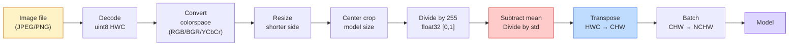
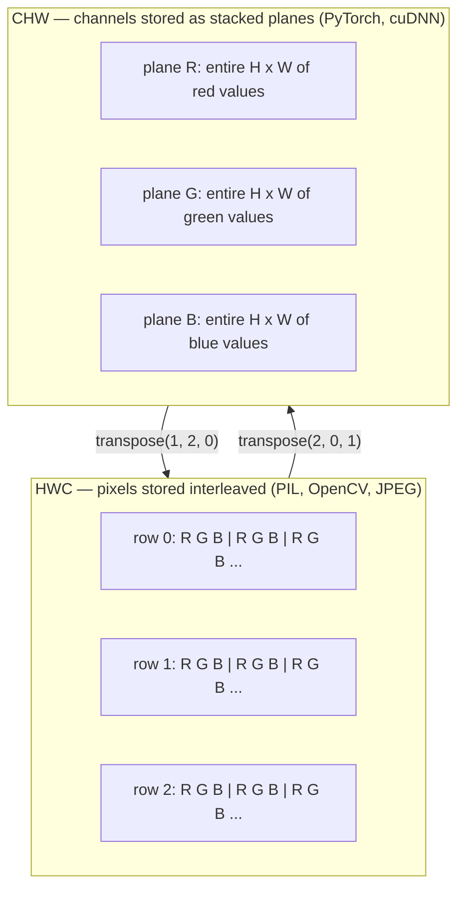

# Fondements d'image  Pixels, canaux, espaces de couleur  Base d'image  Image, canal et espace de couleur

> Une image est un tensor d'échantillons de lumière.

> **【中文解读】**L'image est en fait un ensemble de photographies de photos, qu'elles soient prises par téléphone, ou qu'elles soient GPT-4V, toutes les images sont basées sur ce fait fondamental.

**Type:** Build | **类型:** 动手
**Languages:** Python | **语言:** Python
**Prerequisites:** Phase 1 Lesson 12 (Tensor Operations), Phase 3 Lesson 11 (Intro to PyTorch) | **前置知识:** Phase 1 Lesson 12（张量运算）、Phase 3 Lesson 11（PyTorch 入门）
**Time:** ~45 minutes | **时间:** ~45 分钟

## Objectifs d'apprentissage

- Expliquez comment une scène continue est discrétisée en pixels et pourquoi les décisions d'échantillonnage/quantification fixent le plafond sur chaque modèle en aval
  Expliquer comment les scènes continuelles sont dispersées en images, ainsi que pourquoi la décision de prise de décision décide des limites supérieures de tous les modèles de sous-jeu
- Lire, découper et inspecter les images en tant qu'encadrements NumPy et passer couramment entre les lignes HWC et CHW
  NumPy 数组表示, et se change automatiquement entre HWC et CHW 布局
- Convertir entre RGB, échelle de gris, HSV et YCbCr et justifier l'existence de chaque espace de couleur
  Traduction anglaise: Transformation entre RGB, Grayness, HSV et YCbCr, et explique les raisons de l'existence de chaque espace de couleur
- Appliquer le prétraitement au niveau des pixels (normalité, normalisation, redimensionnement, premier canal) exactement comme le s'y attendent les modèles de vision PyTorch prétraînés
  Le modèle de la vision PyTorch est un modèle de la vision de la vision PyTorch.

## Le problème , l' introduction du problème

Chaque article que vous lirez, chaque poids prétrainé que vous téléchargerez, chaque API de vision que vous appelez suppose un codage spécifique de l'entrée.`uint8`image où le modèle le souhaite `float32`et il continuera à fonctionner  et produira silencieusement des ordures. Donner BGR à un réseau formé sur RGB et la précision s'effondre de dix points. Donner un modèle de canaux - dernière entrée quand il attend des canaux - premier et la première couche de conv traite la hauteur comme un canal fonctionnel. Rien de tout cela ne jette une erreur. Il gâche simplement vos métriques et vous passez une semaine à chasser un bug qui vit dans la façon dont vous avez chargé le fichier.

> Chaque article que vous allez lire, chaque pré-entraînement téléchargé, chaque API vidéo utilisée, vous devrez supposer un code d'entrée spécifique.`uint8` Image transmis à la nécessité `float32`Le modèle fonctionne toujours mais génère des résultats silencieux. Donnez à la BGR un réseau entraîné en RGB, un taux de précise de baisse de dix pour cent. Donnez à la passerelle une entrée finale. Donnez à la passerelle une entrée attendue. Dans le modèle précédent, la première couche de volume considère la hauteur comme une caractéristique de la passerelle.

> **【中文解读】**C'est le "bug de l'inconnu" le plus courant dans l'ingénierie visuelle informatique. Dans l'ingénierie de l'IA, ce type de problème peut entraîner une erreur de couleur rouge-vert.

Une convolutions ne sont pas compliquées une fois que vous savez ce qu'elle fait glisser. La partie difficile est qu'" une image " signifie différentes choses à une caméra, un décodeur JPEG, PIL, OpenCV, torchvision et un noyau CUDA. Chaque pile a son propre ordre d'axe, une gamme de octets et une convention de canaux. Un ingénieur de vision qui ne peut pas garder ces bateaux droits en rupture.

> Une fois que vous savez ce que le curseur est en train de glisser, il n'est pas compliqué. La partie difficile réside dans le fait que les "images" de la machine à photo, du JPEG, du décodeur, du PIL, de l'OpenCV, de la torche et du CUDA, signifient différentes choses. Chaque technique a son propre ordre d'axe, son propre champ de caractères et son propre passage.

Cette leçon fixe les bases pour que le reste de la phase puisse s'y appuyer. À la fin, vous saurez ce qu'est un pixel, pourquoi il y a trois nombres par pixel au lieu d'un, ce que fait réellement "normalizer avec les statistiques d'ImageNet" et comment se déplacer entre les deux ou trois layouts que chaque autre leçon de cette phase prendra.

> Cette formation est basée sur la réalité, afin que le reste du cours de cette phase puisse être construit sur elle. Après avoir étudié, vous saurez ce qu'est un image, pourquoi chaque image a trois chiffres et non un, ce qu'il a fait "avec l'aide de l'imageNet 统计归化" et comment faire le changement entre les deux trois lignes de la hypothèse de son reste.

> **【拓展：数据标注与质量】**L'efficacité des tâches visuelles dépend fortement de la qualité des données de marquage. Le Studio de marquage, CVAT, est l'outil de marquage principal. Dans le monde industriel, l'apprentissage actif peut réduire le coût de marquage.

## Le concept de base.

### Le pipeline de pré-traitement complet à un coup d'œil

Chaque système de vision de production est la même séquence de transformations réversibles.

> Chaque système de production de niveau visuel est le même séquence de changement de réaction.



Les deux boîtes rouges et bleues sont le lieu où 80% des défaillances silencieuses vivent: manque de normalisation et mauvaise mise en page.

> Les deux cadres rouge et bleu sont 80% où le silence est défaillant: manque de normalisation et de mise en page erronée.

> **【中文解读】**80% des erreurs de cache se concentrent sur deux étapes: 1) aucune normalisation, 2) la mise en page des données a fait une erreur, 2) la mise en page des données a fait une erreur, 2) la mise en page des données a fait une erreur, 3) la mise en page des données a fait une erreur, 3) la mise en page des données a fait une erreur, 3) la mise en page des données a fait une erreur, 3) la mise en page des données a fait une erreur, 3) la mise en page des données a fait une erreur, 3) la mise en page des données a fait une erreur, 3) la mise en page des données a fait une erreur, 3) la mise en page des données a fait une erreur, 3) la mise en page des données a fait une erreur, 3) la mise en page des données a fait une erreur, 3) la mise en page de la mise en page de la page de la page de la page de la page de la page de la page de la page de l'article, 3) la mise en page de la page de la page de la page de la page de la page de la page de la page de la page de la page de la page de la page de la page de la page de page de page de page de page de page de page de page de page de page de page de page de page de page de page de page de page de page de page de page de page de page de page de page de page de page de page de page de page de page de page de page de page de page de page de page de page de page de page de page de page de page de page de page de page de page de page de page de page de page de page de page de page de page de page de page de page de page de page de page de page de page de page de page de page de page de page de page de page de page de page de page de page de page de page de page de page de page de page de page de page de page de page de page de page de page de page de page de page de page de page de page de page de page de page de page de page de page de page de page de page de page de page de page de page de page de page de page de page de page de page de page de page de page de page de page de page de page de page de page de page de page

### Un pixel est un échantillon, pas un carré.

Un capteur de caméra compte les photons qui atterrissent sur une grille de détecteurs minuscules. Chaque détecteur intègre la lumière pendant une fraction de seconde et émet une tension proportionnelle au nombre de photons qui l'atteignent. Le capteur discrète ensuite cette tension en un nombre entier. Un détecteur devient un pixel.

> Chaque détecteur de lumière en un petit laps de temps, émet une lumière et émet une tension correcte avec le nombre de ses photons qui l'attaquent.

```
Continuous scene                 Sensor grid                     Digital image
(infinite detail)                (H x W detectors)               (H x W integers)

    ~~~~~                        +--+--+--+--+--+                 210 198 180 155 120
   Je suis un homme qui a une grande expérience.
  - L'équipe de la police de la ville de New York
   ~~~~~                         |  |  |  |  |  |                 195 185 170 148 112
                                 +--+--+--+--+--+                 188 180 165 145 108
```

Deux choix se font à cette étape et ils fixent le plafond sur tout en aval:

- **Spatial sampling**Il y a des détecteurs qui décident combien de détecteurs par degré de scène. trop peu, et les bords deviennent déchirés (aliasing). trop, et le stockage et le calcul explosent.
  Le nombre de détecteurs est très faible.
- **Intensity quantization**Les 8 bits donnent 256 niveaux et sont standard pour l'affichage. 10, 12, 16 bits donnent des gradients et des matières plus lisses pour l'imagerie médicale, HDR et les pipelines de capteurs bruts.
  La puissance décide de la tension de déterminer le niveau de tension de la machine à écrase.

Un pixel n'est pas un carré coloré avec une surface. C'est une seule mesure. Lorsque vous redimensionnez ou tournez, vous reprenez le modèle de la grille de mesure.

> 像素 n'est pas un carré de couleur avec une surface. C'est une mesure. Lorsque vous vous élargissez ou tournez, vous êtes en train de reprendre le réseau de mesure.

> **【中文解读】**Le tableau n'est pas un petit bloc carré, mais un échantillon de points de sensation à une position spatiale. Lors de l'écrasement ou de la rotation d'une image, le concept est particulièrement important dans les images médicales (comme la IRM) et la gamme haute dynamique (HDR).

### Pourquoi trois canaux ? Pourquoi trois canaux ?

Un détecteur compte les photons sur tout le spectre visible  qui est à l'échelle de gris. Pour obtenir la couleur, le capteur recouvre la grille avec une mosaïque de filtres rouges, verts et bleus. Après démoisaïcation, chaque emplacement spatial a trois entiers: la réponse du détecteur filtré rouge, vert-filtré et bleu à proximité. Ces trois entiers sont le triple RGB d'un pixel.

> Pour obtenir la couleur, le capteur utilise le rouge, le vert, le bleu, le rouge, le rouge, le rouge, le rouge, le rouge, le rouge, le rouge, le rouge, le rouge, le rouge, le rouge, le rouge, le rouge, le rouge, le rouge, le rouge, le rouge, le rouge, le rouge, le rouge, le rouge, le rouge, le rouge, le rouge, le rouge, le rouge, le rouge, le rouge, le rouge, le rouge, le rouge, le rouge, le rouge, le rouge, le rouge, le rouge, le rouge, le rouge, le rouge, le rouge, le rouge, le rouge, le rouge, le rouge, le rouge, le rouge, le rouge, le rouge, le rouge, le rouge, le rouge, le rouge, le rouge, le rouge, le rouge, le rouge, le rouge, le rouge, le rouge, le rouge, le rouge, le rouge, le rouge, le rouge, le rouge, le rouge, le rouge, le rouge, le rouge, le rouge, le rouge, le rouge, le rouge, le rouge, le rouge, le rouge, le rouge, le rouge, le rouge, le rouge, le rouge, le rouge, le rouge, le rouge, le rouge, le rouge, le rouge, le rouge, le rouge, le rouge, le rouge, le rouge, le rouge, le rouge, le rouge, le rouge, le rouge, le rouge, le rouge, le rouge, le rouge, le rouge, le rouge, le rouge, le rouge, le rouge, le rouge, le rouge, le rouge, le rouge, le rouge, le rouge, le rouge, le rouge, le rouge, le rouge, le rouge, le rouge, le rouge, le rouge, le rouge, le rouge, le rouge, le rouge, le rouge, le rouge, le rouge, le rouge, le rouge, le rouge, le rouge, le rouge, le rouge, le rouge, le rouge, le rouge, le rouge, le rouge, le rouge, le rouge, le rouge, le rouge, le rouge, le rouge, le rouge, le rouge, le rouge, le rouge, le rouge, le rouge, le rouge, le rouge, le rouge, le rouge, le rouge, le rouge, le rouge, le rouge, le rouge, le rouge, le rouge, le rouge, le rouge,

```
One pixel in memory:

    (R, G, B) = (210, 140, 30)   <- reddish-orange

An H x W RGB image:

    shape (H, W, 3)     stored as   H rows of W pixels of 3 values
                                    each in [0, 255] for uint8
```

Les caméras de profondeur ajoutent un canal Z. Les satellites ajoutent des bandes infrarouges et ultraviolets. Les scanners médicaux ont souvent un canal (rayons X, TC) ou plusieurs (hyperspectraux). Le nombre de canaux est le dernier axe; les couches de convection apprennent à se mélanger à travers elle.

> La photographie de la profondeur augmente la Z. Les voies de Z. Les voies de Z. Les voies de Z. Les voies de Z. Les voies de Z. Les voies de Z.

> **【拓展：多通道图像】**Les images satellite à distance ont généralement des ondes supplémentaires de lumière rouge, ultraviolette, etc. La caméra de contrôle de la lumière médicale ne peut être utilisée qu'un seul canal, les images de profondeur (comme Kinect, iPhone LiDAR) augmentent la profondeur de la caméra de surveillance.

### Deux conventions de mise en page: HWC et CHW.

Le même tensor, deux ordres, chaque bibliothèque en choisit un.

> Avec une seule quantité, deux sortes de séquences.

```
HWC (height, width, channels)           CHW (channels, height, width)

   W ->                                    H ->
  +-----+-----+-----+                     +-----+-----+
H |R G B|R G B|R G B|                   C |R R R R R R|
| +-----+-----+-----+                   | +-----+-----+
v |R G B|R G B|R G B|                   v |G G G G G G|
  +-----+-----+-----+                     +-----+-----+
                                          |B B B B B B|
                                          +-----+-----+

   PIL, OpenCV, matplotlib,              PyTorch, most deep learning
   almost every image file on disk       frameworks, cuDNN kernels
```

CHW existe parce que les noyaux de convolutions glissent à travers H et W. Garder l'axe du canal en premier signifie que chaque noyau voit un plan 2D contigu par canal, qui vectorize de manière propre.

> CHW 之所以存在,是因为卷积核在H 和 W 上滑动──保持通道轴在最前面意味着每个核看到的是每个通道的一个连续2D平面,可以干净地向量化──磁盘格式保持HWC是因为那匹配传感器扫描线的输出方式──

> **【中文解读】**HWC(高×宽×通道) est le format par défaut de PIL、OpenCV 等库, est aussi le format de stockage des images du fichier sur le disque. CHW(通道×高×宽) est le format utilisé par PyTorch 和 GPU 计算(cuDNN), car le volume de la centrale est en H 和 W 上滑时, la préposition du canal permet à chaque nucléaire de voir un plan 2D continu, l'efficacité du calcul est plus élevée.

La conversion en une ligne, vous taperiez mille fois:

> Tu vas faire une transition de 1000 fois:

```
img_chw = img_hwc.transpose(2, 0, 1)      # NumPy
img_chw = img_hwc.permute(2, 0, 1)        # PyTorch tensor
```

L'affichage de la mémoire, visualisé:

> L'écriture de l'écriture:



### Département de données et type d.

Trois assemblées dominent:

> Trois types de régimes:

| Convention | dtype | Range | Where you see it |
|------------|-------|-------|------------------|
| Raw | `uint8` | [0, 255] | Files on disk, PIL, OpenCV output |
| Normalized | `float32` | [0.0, 1.0] | After `img.astype('float32') / 255` |
| Standardized | `float32` | roughly [-2, +2] | After subtracting mean and dividing by std |

Les réseaux convolutifs ont été formés sur des entrées standardisées.`mean=[0.485, 0.456, 0.406]`- Je suis là .`std=[0.229, 0.224, 0.225]`sont la moyenne arithmétique et l'écart standard des trois canaux sur l'ensemble complet de formation ImageNet, calculé sur [0, 1] pixels normalisés.`uint8`Dans un modèle qui s'attend à une flotte standardisée, la défaillance silencieuse la plus commune dans la vision appliquée est la seule.

> 卷积网络 est une formation de standardisation de l'entrée  ImageNet 统计量 `mean=[0.485, 0.456, 0.406]`- Je suis là.`std=[0.229, 0.224, 0.225]`est l'ensemble de l'imageNet 训练集三通道的算术平均值和标准差, calculé sur [0, 1] 归结像素上.`uint8`Le modèle de l'attendue standardisation des flows est le plus commun de l'application de la vision de la défaillance du silence.

> **【中文解读】**三种数据范围:(1)  uint8 [0,255]  文件/PIL/OpenCV 的原始输出;(2) float32 [0,1] 归化后;(3) float32 ≈[-2,+2]  ImageNet 标准化后──把 uint8 直接给期望标准化输入的模型,是最常见的"静默失败"──ImageNet 的平均值和标准差是整个训练集预测出来的,几乎所有训练模型都使用这个组数──

### Les espaces de couleur et pourquoi ils existent

RGB est le format de capture mais ce n'est pas toujours la représentation la plus utile pour un modèle.

> RGB est un format de capture, mais ce n'est pas toujours la représentation la plus utile du modèle.

```
 RGB               HSV                       YCbCr / YUV

 R red             H hue (angle 0-360)       Y luminance (brightness)
 G green           S saturation (0-1)        Cb chroma blue-yellow
 B blue            V value/brightness (0-1)  Cr chroma red-green

 Linear to         Separates color from      Separates brightness from
 sensor output     brightness. Useful for    color. JPEG and most video
                   color thresholding, UI    codecs compress the chroma
                   sliders, simple filters   channels harder because the
                                             human eye is less sensitive
                                             to chroma detail than to Y.
```

Pour la plupart des CNN modernes, vous nourrissez RGB.

> Pour la plupart des CNN modernes, vous avez introduit RGB.

- **HSV** code de CV classique, segmentation basée sur la couleur, équilibrage des blancs.
  Le code de la vie est basé sur la couleur.
- **YCbCr** lecture des internes JPEG, des pipelines vidéo, des modèles de super résolution qui fonctionnent uniquement sur Y.
  Le modèle de résolution de l'intérieur de JPEG est utilisé uniquement dans les systèmes de communication.
- **Grayscale** OCR, modèles de documents, tout cas où la couleur est variable de nuisance plutôt que de signal.
  Le modèle de documentation, la couleur est une perturbation des variables et non un signal.

L'échelle de gris de la RGB est une somme pondérée, pas une moyenne, car l'œil humain est plus sensible au vert que au rouge ou au bleu:

> De RGB 转灰度 est une valeur ajoutée, pas une valeur moyenne, car l'œil humain est plus sensible au vert que au rouge ou au bleu:

```
Y = 0.299 R + 0.587 G + 0.114 B       (ITU-R BT.601, the classic weights)
```

### Le rapport d'aspect, la redimensionnement et l'interpolation

Chaque modèle a une taille d'entrée fixe (224x224 pour la plupart des classifiateurs ImageNet, 384x384 ou 512x512 pour les détecteurs modernes). Vos images correspondent rarement.

> Chaque modèle a une taille d'entrée fixe. La plupart des images sont de 224x224, les tests modernes de 384x384 ou 512x512.

- **Resize shorter side, then center crop** la recette standard d'ImageNet. préserve le rapport d'aspect, jette une bande de pixels de bord.
  En français, le mot "réfléchisse" est traduit par "réfléchisse" en français.
- **Resize and pad** préserve le rapport d'aspect et chaque pixel, ajoute des barres noires.
  En français, traduit par "réfléchir" et "réfléchir" est une expression de la langue française.
- **Resize directly to target**Il est bon pour de nombreuses tâches de classification.
  Le coût est faible, la forme est tordue, mais suffit pour de nombreuses tâches.

La méthode d'interpolation détermine comment les pixels intermédiaires sont calculés lorsque la nouvelle grille ne s'aligne pas avec l'ancienne:

> 插值方法 decide how to calculate middle image when new net格 and old net格 are not in line with old net格

```
Nearest neighbour     fastest, blocky, only choice for masks/labels
Bilinear              fast, smooth, default for most image resizing
Bicubic               slower, sharper on upscaling
Lanczos               slowest, best quality, used for final display
```

Règle générale: bilinéaire pour l'entraînement, bicubique ou lanczos pour les actifs que vous regarderez, le plus proche pour tout ce qui contient des identifiants de classe entière.

> 经验法则: entraînement à double ligne, démonstration à double ou à trois lancots, contenant un nombre complet d'ID de classe à proximité.

> **【中文解读】**缩放时的插值方法选择:近邻 (近邻) 速度最快但会产生, uniquement utilisé pour masquer码/标签图;双线性 (双线性) 又快又平滑,是训练时的默认选择;双三次 (双立方) 慢但放大时更清;Lanczos 最慢但质量最好;;

> **【拓展：工业部署中的视觉系统】**Dans le cadre de la déploiement industriel réel, les modèles visuels doivent prendre en compte la réflexion sur la différence de taille des modèles, l'adaptation des appareils de bord, etc. TensorRT, ONNX Runtime, OpenVINO sont des outils d'accélération de réflexion courants. Les systèmes de conduite autonome (comme Tesla FSD) utilisent généralement plusieurs modèles visuels en temps réel sur les puces de véhicule.
```figure
conv-output-size
```

## Construisez-le en pratique.

### Étape 1: Construire un tensor d'image et inspecter sa forme.

Commencez par une image synthétique déterministe afin que le premier laboratoire se déroule hors ligne avec uniquement NumPy. Le décodeur de fichier est une limite distincte: une fois qu'un décodeur JPEG ou PNG renvoie des octets RGB, chaque opération tensorielle ci-dessous est la même.

> D'une image synthétisée de détermination, la première expérience ne nécessite que NumPy pour pouvoir fonctionner en ligne. Le déchiffrement de fichiers est une autre frontière: une fois que le déchiffreur JPEG ou PNG retourne à la RGB, chaque opération de la base est la même.

```python
import numpy as np

def synthetic_rgb(h=128, w=192, seed=0):
    rng = np.random.default_rng(seed)
    yy, xx = np.meshgrid(np.linspace(0, 1, h), np.linspace(0, 1, w), indexing="ij")
    r = (np.sin(xx * 6) * 0.5 + 0.5) * 255
    g = yy * 255
    b = (1 - yy) * xx * 255
    rgb = np.stack([r, g, b], axis=-1) + rng.normal(0, 6, (h, w, 3))
    return np.clip(rgb, 0, 255).astype(np.uint8)

arr = synthetic_rgb()

print(f"type:   {type(arr).__name__}")
print(f"dtype:  {arr.dtype}")
print(f"shape:  {arr.shape}     # (H, W, C)")
print(f"min:    {arr.min()}")
print(f"max:    {arr.max()}")
print(f"pixel at (0, 0): {arr[0, 0]}")
```

Résultats attendus: `shape: (H, W, 3)`- Je suis là .`dtype: uint8`, la portée `[0, 255]`C'est la représentation décodée canonique que les octets provenaient d'une caméra, d'un décodeur d'image ou d'un générateur synthétique.

> 预期输出:`shape: (H, W, 3)`- Je suis là.`dtype: uint8`La portée`[0, 255]`C'est la règle de l'écodification qui indique que, que le caractère soit de la machine, du décodeur d'image ou du générateur de synthèse.

### Étape 2: Divisez les canaux et redécidez la mise en page.

Retirez R, G, B séparément, puis convertissez de HWC en CHW pour PyTorch.

> R、G、B, puis HWC 转换为 CHW 以供Pytorch使用──

```python
R = arr[:, :, 0]
G = arr[:, :, 1]
B = arr[:, :, 2]
print(f"R shape: {R.shape}, mean: {R.mean():.1f}")
print(f"G shape: {G.shape}, mean: {G.mean():.1f}")
print(f"B shape: {B.shape}, mean: {B.mean():.1f}")

arr_chw = arr.transpose(2, 0, 1)
print(f"\nHWC shape: {arr.shape}")
print(f"CHW shape: {arr_chw.shape}")
```

Trois plans à l'échelle grise, un par canal. CHW réordonne simplement les axes; aucune copie de données n'est strictement requise lorsque la mise en page de la mémoire le permet.

> Les trois dimensions de l'échelle, chaque traversée est une.

### Étape 3: Conversion à l'échelle grise et HSV

L'échelle de grises pondérée, puis un manuel RGB-HSV.

> Accès à la demande et à la gravité, puis réaliser manuellement la RGB 转 HSV.

```python
def rgb_to_grayscale(rgb):
    weights = np.array([0.299, 0.587, 0.114], dtype=np.float32)
    return (rgb.astype(np.float32) @ weights).astype(np.uint8)

def rgb_to_hsv(rgb):
    rgb_f = rgb.astype(np.float32) / 255.0
    r, g, b = rgb_f[..., 0], rgb_f[..., 1], rgb_f[..., 2]
    cmax = np.max(rgb_f, axis=-1)
    cmin = np.min(rgb_f, axis=-1)
    delta = cmax - cmin

    h = np.zeros_like(cmax)
    mask = delta > 0
    argmax = np.argmax(rgb_f, axis=-1)
    rmax = mask & (argmax == 0)
    gmax = mask & (argmax == 1)
    bmax = mask & (argmax == 2)
    h[rmax] = ((g[rmax] - b[rmax]) / delta[rmax]) % 6
    h[gmax] = ((b[gmax] - r[gmax]) / delta[gmax]) + 2
    h[bmax] = ((r[bmax] - g[bmax]) / delta[bmax]) + 4
    h = h * 60.0

    s = np.divide(delta, cmax, out=np.zeros_like(delta), where=cmax > 0)
    v = cmax
    return np.stack([h, s, v], axis=-1)

gray = rgb_to_grayscale(arr)
hsv = rgb_to_hsv(arr)
print(f"gray shape: {gray.shape}, range: [{gray.min()}, {gray.max()}]")
print(f"hsv   shape: {hsv.shape}")
print(f"hue range: [{hsv[..., 0].min():.1f}, {hsv[..., 0].max():.1f}] degrees")
print(f"sat range: [{hsv[..., 1].min():.2f}, {hsv[..., 1].max():.2f}]")
print(f"val range: [{hsv[..., 2].min():.2f}, {hsv[..., 2].max():.2f}]")
```

Hue est exprimé en degrés, saturation et valeur en [0, 1].`hsv_full`La convention.

> La différence entre les données de la taille et la taille est de 0, 1 .`hsv_full`Je suis d'accord.

### Étape 4: normaliser, normaliser et inverser.

Passez des octets bruts au tensor exact qu'un modèle ImageNet prétrainé attend, puis retournez.

> De l'original à l'apprentissage pré-entraînement ImageNet 模型期望的精确张量,再返回──

```python
mean = np.array([0.485, 0.456, 0.406], dtype=np.float32)
std = np.array([0.229, 0.224, 0.225], dtype=np.float32)

def preprocess_imagenet(rgb_uint8):
    x = rgb_uint8.astype(np.float32) / 255.0
    x = (x - mean) / std
    x = x.transpose(2, 0, 1)
    return x

def deprocess_imagenet(chw_float32):
    x = chw_float32.transpose(1, 2, 0)
    x = x * std + mean
    x = np.clip(x * 255.0, 0, 255).astype(np.uint8)
    return x

x = preprocess_imagenet(arr)
print(f"preprocessed shape: {x.shape}     # (C, H, W)")
print(f"preprocessed dtype: {x.dtype}")
print(f"preprocessed mean per channel:  {x.mean(axis=(1, 2)).round(3)}")
print(f"preprocessed std  per channel:  {x.std(axis=(1, 2)).round(3)}")

roundtrip = deprocess_imagenet(x)
max_diff = np.abs(roundtrip.astype(int) - arr.astype(int)).max()
print(f"roundtrip max pixel diff: {max_diff}    # should be 0 or 1")
```

La moyenne par canal doit être proche de zéro, std proche d'un.`transforms.Normalize`L'appel est sous le capot.

> La valeur moyenne de chaque passage doit être proche de zéro, la norme différente de 1.`transforms.Normalize`Il faut faire ce qu'il faut faire au fond.

### Étape 5: Ressessessiez à partir de zéro.

Les coordonnées de sortie des voisins les plus proches sont à un pixel source. L'interpolation bilinéaire trouve les quatre pixels environnants et les mélange par distance.

> Récemment, chaque localisation sortante est fournie à un seul image source. La valeur de l'insertion bilatérale est trouvée autour des quatre images et à distance mixte. Les deux suivants sont réalisés en utilisant des localisations de points de contact, de sorte que la première et la dernière image source restent inactives.

```python
def resize_coordinates(source_length, target_length):
    if target_length == 1:
        return np.zeros(1, dtype=np.float32)
    return np.linspace(0, source_length - 1, target_length, dtype=np.float32)

def nearest_resize(image, target_height, target_width):
    y = np.rint(resize_coordinates(image.shape[0], target_height)).astype(int)
    x = np.rint(resize_coordinates(image.shape[1], target_width)).astype(int)
    return image[y[:, None], x[None, :]]

def bilinear_resize(image, target_height, target_width):
    y = resize_coordinates(image.shape[0], target_height)
    x = resize_coordinates(image.shape[1], target_width)
    y0 = np.floor(y).astype(int)
    x0 = np.floor(x).astype(int)
    y1 = np.minimum(y0 + 1, image.shape[0] - 1)
    x1 = np.minimum(x0 + 1, image.shape[1] - 1)
    wy = (y - y0)[:, None, None]
    wx = (x - x0)[None, :, None]

    source = image.astype(np.float32)
    top = source[y0[:, None], x0[None, :]] * (1 - wx)
    top += source[y0[:, None], x1[None, :]] * wx
    bottom = source[y1[:, None], x0[None, :]] * (1 - wx)
    bottom += source[y1[:, None], x1[None, :]] * wx
    result = top * (1 - wy) + bottom * wy
    return np.clip(np.rint(result), 0, 255).astype(image.dtype)

target_height = arr.shape[0] * 3
target_width = arr.shape[1] * 3
nearest = nearest_resize(arr, target_height, target_width)
bilinear = bilinear_resize(arr, target_height, target_width)

def local_roughness(x):
    gy = np.diff(x.astype(float), axis=0)
    gx = np.diff(x.astype(float), axis=1)
    return float(np.abs(gy).mean() + np.abs(gx).mean())

for name, out in [("nearest", nearest), ("bilinear", bilinear)]:
    print(f"{name:>8}  shape={out.shape}  roughness={local_roughness(out):6.2f}")
```

Le plus proche marque le plus haut sur la rugosité parce qu'il garde les bords durs. Bilinéaire est plus lisse parce que chaque nouveau pixel mélange deux positions sur chaque axe. Le compagnon exécutable étend la même idée séparable à quatre voisins par axe avec un noyau cube Catmull-Rom, puis imprime les trois résultats sans bibliothèque d'images.

> Le code de support fonctionnel est étendu à quatre voisins par axe (Catmull-Rom, 3 nucléos), puis imprime tous les 3 résultats sans utiliser une base d'images.

> **【中文解读】**La nouvelle édition 5e étape de "réformer la taille du PIL" est modifiée pour "réinitialiser le voisinage avec le double ligne"`np.linspace`Rassemblez les indices et les références, puis revenez voir l'emballage de la bibliothèque.`code/main.py`Il a également réalisé Catmull-Rom 双三次核, avec le même ensemble de pouvoir de séparation de poids imprimé le plus proche / bilinéaire / bicube 三种结果对比.

## Utilisez-le dans la pratique.

PyTorch effectue les mêmes opérations sur des tensors en lots, sensibles aux appareils. Le code ci-dessous redimensionne le côté plus court, prend une culture centrale, normalise chaque canal et produit le tensor NCHW qu'un modèle prétrainé attend.

> PyTorch effectue la même opération sur la quantité de l'appareil de perception en masse. Le code ci-dessous est réduit à court margin, réduit au centre, standardisé par voie, et produit la quantité de NCHW pré-entraînement attendue.

```python
import torch
import torch.nn.functional as F

image_hwc = torch.from_numpy(synthetic_rgb(256, 320))
batch = image_hwc.permute(2, 0, 1).unsqueeze(0).float() / 255.0

height, width = batch.shape[-2:]
scale = 256 / min(height, width)
resized_height = round(height * scale)
resized_width = round(width * scale)
batch = F.interpolate(
    batch,
    size=(resized_height, resized_width),
    mode="bilinear",
    align_corners=False,
    antialias=True,
)

top = (resized_height - 224) // 2
left = (resized_width - 224) // 2
batch = batch[:, :, top:top + 224, left:left + 224]

mean = torch.tensor([0.485, 0.456, 0.406]).view(1, 3, 1, 1)
std = torch.tensor([0.229, 0.224, 0.225]).view(1, 3, 1, 1)
batch = (batch - mean) / std

print(f"tensor dtype: {batch.dtype}")
print(f"batched shape: {tuple(batch.shape)}")
print(f"per-channel mean: {batch.mean(dim=(0, 2, 3)).tolist()}")
print(f"per-channel std:  {batch.std(dim=(0, 2, 3)).tolist()}")
```

Quatre étapes, dans cet ordre exact: convertir des octets en flottant et échanger HWC en NCHW, redimensionner le côté plus court à 256, prendre une culture centrale de 224x224, puis soustraire la moyenne d'ImageNet et diviser par son écart standard.

> Quatre étapes, selon cet ordre précis: transformer le caractère en flotage et transformer le HWC en NCHW, réduire le court à 256, couper le centre de 224x224, puis réduire la valeur moyenne d'ImageNet et le déduire de son standard.

> **【中文解读】**Nouvelle édition "Uz Rahmen实现" du`torchvision.transforms`Je suis devenu nu.`torch`+ `torch.nn.functional`Pour le moment, je suis en train de faire une pause.`F.interpolate`缩放短边(注意 `antialias=True`Avec `align_corners=False`Les deux niveaux de production sont par défaut) 张量切片做中心剪剪,广播减平均值除标准差──`transforms.Compose`                                                                                                                                                                                                                                                              

## Envoyez-le .

Cette leçon donne:

> Le programme de formation

- `outputs/prompt-vision-preprocessing-audit.md` une demande qui transforme toute carte modèle ou carte de jeu de données en une liste de contrôle des invariants pré-traitement exacts qu'une équipe doit respecter.
  Le mot grec traduit par " le mot grec "`outputs/prompt-vision-preprocessing-audit.md` Un modèle ou un ensemble de données à transformer en équipe doit respecter les pré-traitement invariable de la liste de conseils.
- `outputs/skill-image-tensor-inspector.md` une compétence qui, compte tenu de tout tensor ou tableau en forme d'image, rapporte dtype, disposition, plage, et si elle semble brune, normalisée ou standardisée.
  Le mot grec traduit par " le mot grec "`outputs/skill-image-tensor-inspector.md` Une compétence: donner une quantité ou un nombre de formes d'image, en rapportant son type d'image, sa mise en page, sa portée de valeur, et en lui donnant l'impression d'être original, unifié ou normalisé.

## Les exercices

> **【中文解读】** Exercices de base selon Easy/Medium/Hard 三个难度递进──建议至少完成  级别的题目,  级别适合深入研究或面试准备──

1. **(Easy)**Créer un RGB 2x2 `uint8`Convertir HWC en CHW et retour, imprimer les deux formes, et prouver que le retour conserve toutes les valeurs.
   Créer un contenant quatre couleurs différentes 2x2 RGB `uint8`Numéro de changement entre HWC et CHW, imprimé en deux formes, et prouvé que le changement de changement conserve chaque valeur.
2. **(Medium)**Écrivez`standardize(img, mean, std)`et son inverse qui ensemble passent un `roundtrip_max_diff <= 1`Vos fonctions doivent fonctionner sur une seule image dans HWC et sur un lot dans NCHW avec le même appel.
   Le nom de la ville est le nom de la ville de la ville de la ville de la ville de la ville de la ville de la ville de la ville de la ville de la ville de la ville de la ville de la ville de la ville de la ville de la ville de la ville de la ville de la ville de la ville de la ville de la ville de la ville de la ville de la ville de la ville de la ville de la ville de la ville de la ville de la ville de la ville de la ville de la ville de la ville de la ville de la ville de la ville de la ville de la ville de la ville de la ville de la ville de la ville de la ville de la ville de la ville de la ville de la ville de la ville de la ville de la ville de la ville de la ville de la ville de la ville de la ville de la ville de la ville de la ville de la ville.`standardize(img, mean, std)` et sa fonction inverse, exigences dans l'interface`roundtrip_max_diff <= 1`测试,且同调用既支持单张图(HWC)
3. **(Hard)**Prenez un tensor standardisé à 3 canaux ImageNet et courez-le à travers un convex 1x1 qui apprend un mélange pondéré de RGB dans un seul canal à échelle de gris.`[0.299, 0.587, 0.114]`, les congeler, et vérifier la sortie correspond à votre manuel `rgb_to_grayscale`Quelles autres transformations classiques de l'espace couleur peuvent être écrites comme des convolutions 1x1 ?
   En anglais, le nombre de pages de l'image est de 0,01 à 0,01 par jour.`[0.299, 0.587, 0.114]`Conclusion, vérification, sortie et manœuvre`rgb_to_grayscale`Réfléchissez: quels sont les changements classiques de l'espace de couleur que l'on peut écrire en 1x1 ?

## Les termes clés

| Term | What people say | What it actually means |
|------|----------------|----------------------|
| Pixel | "A coloured square" | One sample of light intensity at one grid location — three numbers for colour, one for grayscale |
| Channel | "The colour" | One of the parallel spatial grids stacked into an image tensor; last axis in HWC, first in CHW |
| HWC / CHW | "The shape" | Axis orderings for an image tensor; disk and PIL use HWC, PyTorch and cuDNN use CHW |
| Normalize | "Scale the image" | Divide by 255 so pixels live in [0, 1] — necessary but not sufficient |
| Standardize | "Zero-center" | Subtract mean and divide by std per channel so the input distribution matches what the model was trained on |
| Grayscale conversion | "Average the channels" | A weighted sum with coefficients 0.299/0.587/0.114 that matches human luminance perception |
| Interpolation | "How resize picks pixels" | The rule that decides output values when the new grid does not align with the old one — nearest for labels, bilinear for training, bicubic for display |
| Aspect ratio | "Width over height" | The ratio that distinguishes "resize and pad" from "resize and stretch" |

> 术语对照:Pixel=像素、Channel=通道、Normalize=归一化、Standardize=标准化、Grayscale conversion=灰度转换、Interpolation=插值、Aspect ratio=宽高比──完整中文释义见 zh.md 的术语表──

## Encore une lecture

- [Charles Poynton — A Guided Tour of Color Space](https://poynton.ca/PDFs/Guided_tour.pdf) le traitement technique le plus clair de la raison pour laquelle il y a tant d'espaces de couleur et quand chacun d'eux compte
  Traduction anglaise:Charles Poynton 彩色空间导览 解释为什么有如此多彩空间、各自何时重要最清晰技术论述──
- [PyTorch Vision Transforms Docs](https://pytorch.org/vision/stable/transforms.html) l'ensemble des transformations que vous allez réellement composer en production
  Le projet de construction de la société de l'eau de la mer de la région de la Seine est un projet de construction de la ville de la Seine.
- [How JPEG Works (Colt McAnlis)](https://www.youtube.com/watch?v=F1kYBnY6mwg) une visite visuelle nette du sous-échantillonnage de chrome, DCT, et pourquoi JPEG encode YCbCr plutôt que RGB
  Le code JPEG est le code YCbCr et non le RGB.
- [ImageNet Preprocessing Conventions (torchvision models)](https://pytorch.org/vision/stable/models.html) la source de la vérité pour `mean=[0.485, 0.456, 0.406]`et pourquoi chaque modèle au zoo s' y attend
  Le modèle de la vision de la torche`mean=[0.485, 0.456, 0.406]`La source de l'autorité, et pourquoi tout le modèle l'utilise.
