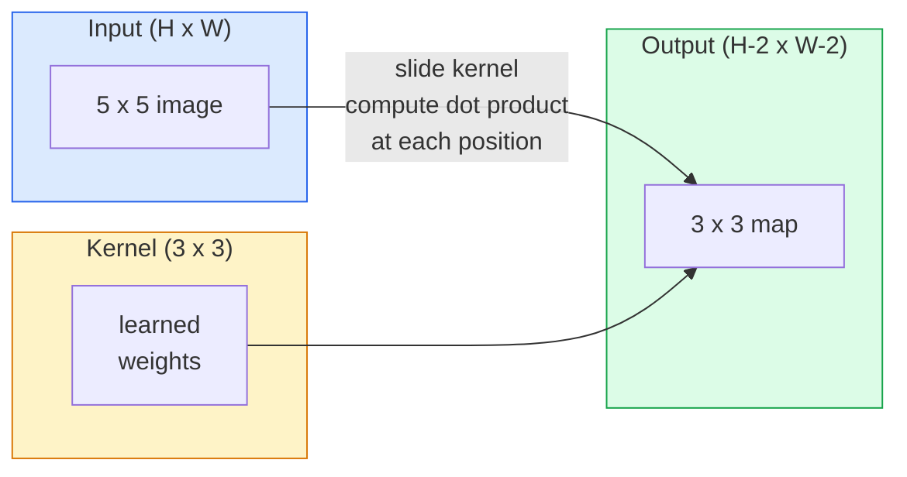
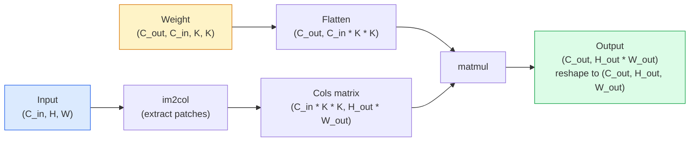

# Des convolutions de zéro à zéro à réaliser des volumes

> Une convolutions est une petite couche dense que vous glissez sur une image, partageant les mêmes poids à chaque emplacement.

> **【中文解读】**Le compteur est essentiellement un " petit tout-connexion de la surface de l'image " avec le même groupe de poids dans chaque position de l'image. Cela nous donne deux caractéristiques clés: la phase de déplacement et de la variation.

**Type:** Build | **类型:** 动手
**Languages:** Python | **语言:** Python
**Prerequisites:** Phase 3 (Deep Learning Core), Phase 4 Lesson 01 (Image Fundamentals) | **前置知识:** Phase 3（深度学习核心），Phase 4 Lesson 01（图像基础）
**Time:** ~75 minutes | **时间:** ~75 分钟

## Objectifs d'apprentissage

- Implementer la convolutions 2D à partir de zéro en utilisant uniquement NumPy, y compris la version en boucle nichée et une vectorisation `im2col`version
  Uniquement avec NumPy de zéro réalisation 2D volume, y compris les emplacements en circulation et la numérotation im2col  version
- Comptez la taille spatiale de sortie pour toute combinaison de taille d'entrée, de taille du noyau, de rembourrage et de marche, et justifiez la `(H - K + 2P) / S + 1`formule
  计算任意输入大小、核大小、填充和步幅组合下输出尺寸, comprendre la formule `(H - K + 2P) / S + 1`
- Des noyaux de conception manuelle (extrémité, flou, affûte, Sobel) et expliquer pourquoi chacun produit le modèle d'activations qu'il fait
  Hand动设计核(边缘检测、模糊、化、Sobel), expliquer pourquoi chaque type de nucléaire produit un mode d'activation de la résistance
- Les convolutions de pile dans un extracteur de caractéristiques et la connexion de la profondeur de pile à la taille du champ réceptif
  En effet, les émotions sont des émotions de la nature.

> **【中文解读】**Les objectifs de l'apprentissage sont énumérés dans la liste des compétences fondamentales que l'on devrait acquérir après avoir terminé la classe.


## Le problème , l' introduction du problème

Une couche entièrement connectée sur une image RGB 224x224 aurait besoin de 224 * 224 * 3 = 150,528 poids d'entrée par neurone. Une seule couche cachée avec 1000 unités est déjà 150 millions de paramètres  avant que vous ayez appris quelque chose d'utile. Pire encore, cette couche n'a aucune idée qu'un chien en haut à gauche et un chien en bas à droite sont le même motif. Il traite chaque position de pixel comme indépendante, ce qui est tout à fait faux pour les images: traduire un chat par trois pixels ne devrait pas forcer le réseau à relever le concept.

> Dans la couche de connexion complète de l'image RGB 224x224 chaque neurone a besoin de 224 * 224 * 3 = 150,528 pouvoirs d'entrée. Une couche cachée de seulement 1000 unités a déjà 1,5 milliard de paramètres avant que vous appreniez quelque chose d'utile. Pire encore, cette couche ne sait pas que le chien du coin gauche et le chien du coin droit est le même modèle. Elle considère chaque position de l'image comme indépendante, ce qui est bien faux pour l'image: le déplacement des trois images ne devrait pas forcer le réseau à relever ce concept.

> **【中文解读】**Les images de traitement de couche totale ont deux problèmes mortels: 1) l'explosion de paramètres  224x224  chaque neurone de l'image nécessite 150.000 poids; 2) le cat du haut-lieu gauche et du haut-lieu droit sont considérés comme des modèles complètement différents.

Les deux propriétés dont un modèle d'image a besoin sont **translation equivariance**(les émissions changent lorsque les émissions changent) et **parameter sharing**Les couches denses ne vous donnent rien, la convolutions vous donnent les deux gratuitement.

> Les deux caractéristiques requises par le modèle d'image sont**平移等变性**(entrée en mouvement) et**参数共享**(Le même type de test fonctionne dans tous les endroits)

La convulsion n'a pas été inventée pour l'apprentissage en profondeur. C'est la même opération qui alimente la compression JPEG, la flouge gaussienne dans Photoshop, la détection des bords dans la vision industrielle et tous les filtres audio jamais expédiés. La raison pour laquelle les CNN ont dominé ImageNet de 2012 à 2020 est que la convulsion est le préalable correct pour les données où les valeurs proches sont liées et le même motif peut apparaître n'importe où.

> Le volume n'a pas été inventé pour l'apprentissage en profondeur. Il est le moteur de la compression JPEG, Photoshop, la surveillance de la marge de la vision industrielle et la même opération de tous les appareils de l'audio. Le CNN a dominé ImageNet de 2012 à 2020 en raison du volume lié à la valeur du voisinage et du même modèle qui peut apparaître à n'importe quel endroit.

> **【拓展：CNN 的工业应用】**Le film est un outil de recherche de l'intelligence artificielle. Dans le domaine de l'IA, CNN a développé des applications de recherche de l'imagerie automatique.

## Le concept de base.

### Un noyau, glissant. Un noyau, glissant.

Une convolutions 2D prend une petite matrice de poids appelée noyau (ou filtre), le déplace sur l'entrée et, à chaque emplacement, calcule la somme des produits intelligents. Cette somme devient un pixel de sortie.

> 2D 卷积取一个称为核或波器的小权重矩阵,在输入上滑动它,在每个位置计算每个元素乘积之和.



Un exemple concret 3x3 sur une entrée 5x5 (pas de rembourrage, étape 1):

> Dans le 5x5 输入上的具体 3x3示例(无填充,步幅 1):

```
Input X (5 x 5):                Kernel W (3 x 3):

  1  2  0  1  2                   1  0 -1
  0  1  3  1  0                   2  0 -2
  2  1  0  2  1                   1  0 -1
  1  0  2  1  3
  2  1  1  0  1

The kernel slides across every valid 3 x 3 window. Output Y is 3 x 3:

 Y[0,0] = sum( W * X[0:3, 0:3] )
 Y[0,1] = sum( W * X[0:3, 1:4] )
 Y[0,2] = sum( W * X[0:3, 2:5] )
 Y[1,0] = sum( W * X[1:4, 0:3] )
 ... and so on
```

Cette formule.**shared weights, locality, sliding window**Tout le reste est la comptabilité.

> Ça fait une forme.**共享权重、局部性、滑动窗口**就是全部思想──其他都是簿记──

> **【中文解读】**Toutes les idées du vol de résolution se résument à trois points: le pouvoir de partage du poids commun (partage du poids commun) du même groupe de paramètres dans toutes les positions (réutilisation) du même groupe de paramètres (partage de la même classe de résolution) du même groupe de résolution (partage de la même classe de résolution) du même groupe de résolution (partage de la même classe de résolution) du même groupe de résolution (partage de la même classe de résolution) du même groupe de résolution (partage de la même classe de résolution) du même groupe de résolution (partage de la même classe de résolution) du même groupe de résolution (partage de résolution) du même groupe de résolution (partage de résolution) du même groupe de résolution (partage de résolution) du même groupe de résolution (partage de résolution) du même groupe de résolution (partie de résolution) du même groupe de résolution (partie de résolution) du même groupe de résolution (partie de résolution) du point de résolution (partie de résolution).

### La formule de taille de sortie

Compte tenu de la taille de l' espace d' entrée `H`, taille du noyau `K`, rembourrage`P`- Je suis en train de faire un pas .`S`- Le numéro de la liste:

```
H_out = floor( (H - K + 2P) / S ) + 1
```

Vous le calculerez des dizaines de fois par architecture.

> Rappelle-toi cette formule. Tu la calculeras dans chaque structure.

> **【中文解读】**输出尺寸公式 `H_out = floor((H - K + 2P) / S) + 1`C'est pourquoi le nucléaire 3x3 le plus populaire est le plus petit de tous les nombres, avec un point central précis.

| Scenario | H | K | P | S | H_out | 中文说明 |
|----------|---|---|---|---|-------|--------|
| Valid conv, no padding | 32 | 3 | 0 | 1 | 30 | 无填充，尺寸缩小 |
| Same conv (preserves size) | 32 | 3 | 1 | 1 | 32 | 同填充，保持尺寸 |
| Downsample by 2 | 32 | 3 | 1 | 2 | 16 | 步幅2，下采样 |
| Pool 2x2 | 32 | 2 | 0 | 2 | 16 | 池化层 |
| Large receptive field | 32 | 7 | 3 | 2 | 16 | 大感受野 |

"Same padding" signifie choisir P de sorte que H_out == H quand S == 1. Pour K impar, c'est P = (K - 1) / 2. C'est pourquoi les noyaux 3x3 dominent  ils sont le plus petit noyau impar qui a encore un centre.

### Je suis en train de le faire .

Sans rembourrage, chaque convolutions réduit la carte de fonctionnalités. En piles 20, votre image 224x224 devient 184x184, ce qui gaspille le calcul sur la frontière et complique les connexions résiduelles qui nécessitent des formes correspondantes.

>  sans remplir, chaque fois que vous faites un rouleau, vous réduisez votre image.  Après avoir compilé 20 couches, votre image 224x224 devient 184x184, vous gaspillez des calculs sur la frontière, et vous compliquez les connexions de résidu de la forme correspondante.

```
Zero padding (P = 1) on a 5 x 5 input:

  0  0  0  0  0  0  0
  0  1  2  0  1  2  0
  0  0  1  3  1  0  0
  0  2  1  0  2  1  0       Now the kernel can centre on pixel
  0  1  0  2  1  3  0       (0, 0) and still have three rows and
  0  2  1  1  0  1  0       three columns of values to multiply.
  0  0  0  0  0  0  0
```

Les modes que vous rencontrez en pratique: `zero`(le plus courant), `reflect`(reflecter le bord, éviter les limites dures dans les modèles génératifs), `replicate`(copie le bord), `circular`(enveloppé, utilisé pour les problèmes toroïdaux).

> 实践中遇到的模式:`zero`Je suis là.`reflect`(à l'image du bord, éviter de générer une bordure dure dans le modèle)`replicate`(réplique le bord)`circular`(environnement, pour les questions environnantes)

### Passez, passez.

La taille de l'étape est la taille de la diapositive. `stride=1`est le défaut. `stride=2`Il est la façon classique de réduire les échantillons à l'intérieur d'une CNN sans couche de pooling séparée.

> Le pas est un pas de mouvement.`stride=1`C'est une valeur de référence.`stride=2`Pour réduire la taille de l'espace à moitié, la méthode classique de chaque structure moderne (resnet, convex, mobile) est utilisée à un certain moment par les utilisateurs de la chaîne de télévision CNN.

```
Stride 1 on a 5 x 5 input, 3 x 3 kernel:

  starts: (0,0) (0,1) (0,2)        -> output row 0
          (1,0) (1,1) (1,2)        -> output row 1
          (2,0) (2,1) (2,2)        -> output row 2

  Output: 3 x 3

Stride 2 on the same input:

  starts: (0,0) (0,2)              -> output row 0
          (2,0) (2,2)              -> output row 1

  Output: 2 x 2
```

### Plusieurs canaux d'entrée.

Les images réelles ont trois canaux. Une convulsion 3x3 sur une entrée RGB est en fait un volume 3x3x3: une tranche 3x3 par canal d'entrée. À chaque position spatiale, vous multipliez et additionnez sur les trois tranches et ajoutez un biais.

> En réalité, chaque image a trois passages. Dans chaque position spatiale, vous passez trois passages pour multiplier et obtenir, et vous ajoutez une position de parité.

```
Input:   (C_in,  H,  W)        3 x 5 x 5
Kernel:  (C_in,  K,  K)        3 x 3 x 3 (one kernel)
Output:  (1,     H', W')       2D map

For a layer that produces C_out output channels, you stack C_out kernels:

Weight:  (C_out, C_in, K, K)   e.g. 64 x 3 x 3 x 3
Output:  (C_out, H', W')       64 x 3 x 3

Parameter count: C_out * C_in * K * K + C_out   (the + C_out is biases)
```

Cette dernière ligne est celle que vous calculerez lors de la planification d'un modèle.`64 * 3 * 3 * 3 + 64 = 1,792`Des paramètres, pas cher.

> La dernière ligne est celle que vous devez calculer en planifiant le modèle.`64 * 3 * 3 * 3 + 64 = 1,792`C'est très bon.

> **【中文解读】**Le nombre de paramètres de la traversée de plusieurs voies est calculé: la traversée = C_out × C_in × K × K + C_out (écarte) ⋅ un 3 输入通道、64 输出通道的3x3 卷积只需要1,792 个参数,远少于全连接层──

### Le truc de l'im2col

Les boucles nichées sont faciles à lire mais lentes. Les GPU veulent des multiples de matrice de grande taille. Le truc: aplanir chaque fenêtre de champ réceptif de l'entrée dans une colonne d'une grande matrice, aplanir le noyau dans une rangée, et toute la convolutions devient une seule matmul.

> 嵌套循环易读但慢──GPU 需要大矩阵乘法──: chaque sensation d'entrée de la fenêtre sera étalée en une seule ligne de grande矩阵, sera nucléaire étalée en une seule ligne, l'ensemble du volume sera transformé en une seule矩阵乘法──



Chaque mise en œuvre de production conv est une variante de cette plus cache-tiling astuces (direct conv, Winograd, FFT conv pour les grands noyaux).

> Chaque phase de production est réalisée par une variante de ce type, avec des techniques de caisse de stockage.

> **【拓展：GPU 加速卷积】**Il s'agit de la mise en œuvre de la mise en œuvre de la mise en œuvre de la mise en œuvre de la mise en œuvre de la mise en œuvre de la mise en œuvre de la mise en œuvre de la mise en œuvre de la mise en œuvre de la mise en œuvre de la mise en œuvre de la mise en œuvre de la mise en œuvre de la mise en œuvre de la mise en œuvre de la mise en œuvre de la mise en œuvre de la mise en œuvre de la mise en œuvre de la mise en œuvre de la mise en œuvre de la mise en œuvre de la mise en œuvre de la mise en œuvre de la mise en œuvre de la mise en œuvre de la mise en œuvre de la mise en œuvre de la mise en œuvre de la mise en œuvre de la mise en œuvre de la mise en œuvre de la mise en œuvre de la mise en œuvre de la mise en œuvre de la mise en œuvre de la mise en œuvre de la mise en œuvre de la mise en œuvre de la mise en œuvre de la mise en œuvre de la mise en œuvre de la mise en œuvre de la mise en œuvre de la mise en œuvre de la mise en œuvre de la mise en œuvre de la mise en œuvre de la mise en œuvre de la mise en œuvre de la mise en œuvre de la mise en œuvre de la mise en œuvre de la mise en œuvre de la mise en œuvre de la mise en œuvre de la mise en œuvre de la mise en œuvre de la mise en œuvre de la mise en œuvre de la mise en œuvre de la mise en œuvre de la mise en œuvre de la mise en œuvre de la mise en œuvre de la mise en œuvre de la mise en œuvre de la mise en œuvre de la mise en œuvre de la mise en œuvre de la mise en œuvre de la mise en œuvre de la mise en œuvre de la mise en œuvre de la mise en œuvre de la mise en œuvre de la mise en œuvre de la mise en œuvre de la mise en œuvre de la mise en œuvre de la mise en œuvre de la mise en œuvre de la mise en œuvre de la mise en œuvre de la mise en œuvre de la mise en œuvre de la mise en œuvre de la mise en œuvre de la mise en œuvre de la mise en œuvre de la mise en mise en en en en œuvre de la mise en en en en en en en en en en en œuvre de mise en en en en œuvre de mise en en en en en en œuvre de mise mise en en en en œuvre de mise

### Un champ réceptif.

Un seul 3x3 conve regarde 9 pixels d'entrée.

> 单个3x3卷积看9 输入像素――堆叠两个3x3卷积,第二层神经元看5x5 输入像素――三个3x3卷积给出7x7――一般来说:

```
RF after L stacked K x K convs (stride 1) = 1 + L * (K - 1)

With strides:   RF grows multiplicatively with stride along each layer.
```

La raison pour laquelle "3x3 tout le chemin vers le bas" fonctionne (VGG, ResNet, ConvNeXt) est que deux conv 3x3 voient la même zone d'entrée qu'un conv 5x5 mais avec moins de paramètres et une non-linéarité supplémentaire entre les deux.

> "Tous les 3x3" (VGG、ResNet、ConvNeXt) sont en effet deux zones d'entrée de 3x3 avec une zone de 5x5 avec une même dimension, mais avec moins de paramètres, il y a une couche de non-linealité au milieu".""

> **【中文解读】**堆叠 L 层 K×K 卷积(步幅为1) du sensoriel野 = 1 + L × (K-1) ・・・ c'est la raison pour laquelle VGG、ResNet et autres réseaux " entièrement utilisés 3x3": deux 3x3 卷积 du sensoriel野 équivaut à un 5x5, mais les paramètres sont moins nombreux, le milieu est également un plus de couche d'activation non linéaire。
```figure
convolution-kernel
```

## Faites-le

## Construisez-le en pratique.

### Étape 1: Placez un tableau.

Commencez par le plus petit primitif: une fonction qui se coupe avec des zéros autour d'un tableau H x W.

> From the smallest of original beginning: une fonction de 0 remplie autour du nombre H x W

```python
import numpy as np

def pad2d(x, p):
    if p == 0:
        return x
    h, w = x.shape[-2:]
    out = np.zeros(x.shape[:-2] + (h + 2 * p, w + 2 * p), dtype=x.dtype)
    out[..., p:p + h, p:p + w] = x
    return out

x = np.arange(9).reshape(3, 3)
print(x)
print()
print(pad2d(x, 1))
```

Le truc des traîneaux .`x.shape[:-2]`signifie que la même fonction fonctionne sur `(H, W)`- Je suis là .`(C, H, W)`ou `(N, C, H, W)`sans modification.

> 尾轴技巧 `x.shape[:-2]`Signifie que la même fonction n'a pas besoin d'être modifiée.`(H, W)`- Je suis là.`(C, H, W)`Ou `(N, C, H, W)`Il y a une autre.

### Étape 2: Convolutions 2D avec des boucles nichées

La mise en œuvre de référence est lente mais sans ambiguïté.`torch.nn.functional.conv2d`Il en est ainsi en principe.

> Il s'agit d'un processus qui est lent mais sans différence.`torch.nn.functional.conv2d`Ce qu'il faut faire.

```python
def conv2d_naive(x, w, b=None, stride=1, padding=0):
    c_in, h, w_in = x.shape       # 输入：通道数、高、宽
    c_out, c_in_w, kh, kw = w.shape  # 权重：输出通道、输入通道、核高、核宽
    assert c_in == c_in_w          # 输入通道数必须匹配

    x_pad = pad2d(x, padding)     # 填充输入
    h_out = (h + 2 * padding - kh) // stride + 1  # 输出高度
    w_out = (w_in + 2 * padding - kw) // stride + 1  # 输出宽度

    out = np.zeros((c_out, h_out, w_out), dtype=np.float32)
    for oc in range(c_out):               # 遍历每个输出通道
        for i in range(h_out):            # 遍历输出高度
            for j in range(w_out):        # 遍历输出宽度
                hs = i * stride           # 输入中的起始行
                ws = j * stride           # 输入中的起始列
                patch = x_pad[:, hs:hs + kh, ws:ws + kw]  # 提取感受野窗口
                out[oc, i, j] = np.sum(patch * w[oc])      # 点积求和
        if b is not None:
            out[oc] += b[oc]              # 加偏置
    return out
```

Quatre boucles nichées (channel de sortie, ligne, colonne, plus la somme implicite sur C_in, kh, kw). C'est la vérité au sol que vous allez vérifier contre chaque mise en œuvre plus rapide.

> Les quatre niveaux de circuits de mise en réseau (en anglais: four-layer nested loop) sont utilisés pour vérifier la valeur réelle de chaque mise en œuvre plus rapide.

### Étape 3: Vérifiez avec un noyau conçu à la main avec un certificat nucléaire conçu à la main

Construisez un noyau vertical de Sobel, appliquez-le sur une image de pas synthétique, et regardez le bord vertical s'éclairer.

> Construire un noyau solide vertical, le mettre en œuvre pour la synthèse d'images d'échelles, observer le lever du côté vertical.

```python
def synthetic_step_image():
    img = np.zeros((1, 16, 16), dtype=np.float32)
    img[:, :, 8:] = 1.0
    return img

sobel_x = np.array([
    [[-1, 0, 1],
     [-2, 0, 2],
     [-1, 0, 1]]
], dtype=np.float32)[None]

x = synthetic_step_image()
y = conv2d_naive(x, sobel_x, padding=1)
print(y[0].round(1))
```

Attendez-vous à de grandes valeurs positives sur la colonne 7 (augmentation de la luminosité de gauche à droite) et des zéros partout ailleurs. Cette seule empreinte est votre vérification de la santé mentale que les mathématiques sont correctes.

> 预期第7 列有大正值(从左到右亮度增加),其他地方为零──那一次打印就是数学是否正确的完整性检查──

### Étape 4: Im2col  Im2col  réaction

Convertir chaque fenêtre de taille de noyau dans l'entrée en une colonne d'une matrice.`C_in=3, K=3`, chaque colonne est de 27 chiffres.

> Pour chaque fenêtre de taille nucléaire, la ligne de l'entrée sera transformée en une colonne de la matrice.`C_in=3, K=3`, chaque rangée est de 27 numéros.

```python
def im2col(x, kh, kw, stride=1, padding=0):
    c_in, h, w = x.shape
    x_pad = pad2d(x, padding)
    h_out = (h + 2 * padding - kh) // stride + 1
    w_out = (w + 2 * padding - kw) // stride + 1

    cols = np.zeros((c_in * kh * kw, h_out * w_out), dtype=x.dtype)
    col = 0
    for i in range(h_out):
        for j in range(w_out):
            hs = i * stride
            ws = j * stride
            patch = x_pad[:, hs:hs + kh, ws:ws + kw]
            cols[:, col] = patch.reshape(-1)
            col += 1
    return cols, h_out, w_out
```

C'est toujours une boucle Python, mais maintenant le lourd soulage sera un matmul vectorié unique.

> Il reste un cycle Python, mais maintenant le travail lourd sera une méthode de multiplication de matrices quantifiée.

### Étape 5: Convection rapide via im2col + matmul avec im2col + 矩阵乘法 accélérer le卷积

Remplacez la boucle quadruple par une multiplication de matrice.

> Utilisez une fois la méthode de rechange de quatre cycles.

```python
def conv2d_im2col(x, w, b=None, stride=1, padding=0):
    c_out, c_in, kh, kw = w.shape
    cols, h_out, w_out = im2col(x, kh, kw, stride, padding)
    w_flat = w.reshape(c_out, -1)
    out = w_flat @ cols
    if b is not None:
        out += b[:, None]
    return out.reshape(c_out, h_out, w_out)
```

Vérifie la précision: exécutez les deux implémentations et comparez.

> L'accès à l'information est possible en fonction des deux éléments.

```python
rng = np.random.default_rng(0)
x = rng.normal(0, 1, (3, 16, 16)).astype(np.float32)
w = rng.normal(0, 1, (8, 3, 3, 3)).astype(np.float32)
b = rng.normal(0, 1, (8,)).astype(np.float32)

y_naive = conv2d_naive(x, w, b, padding=1)
y_im2col = conv2d_im2col(x, w, b, padding=1)

print(f"max abs diff: {np.max(np.abs(y_naive - y_im2col)):.2e}")
```

`max abs diff`Il devrait être là .`1e-5` la différence est l'ordre d'accumulation des points flottants, pas un bug.

> `max abs diff`Il faut que tu le fasses .`1e-5`La différence est due au décalage, pas à un bug.

### Étape 6: Une banque de noyaux conçus à la main

Cinq filtres qui montrent ce qu'une seule couche de conve peut exprimer avant toute formation.

> 5 appareils ont montré ce qu'un seul épisode peut exprimer avant toute formation.

```python
KERNELS = {
    "identity": np.array([[0, 0, 0], [0, 1, 0], [0, 0, 0]], dtype=np.float32),
    "blur_3x3": np.ones((3, 3), dtype=np.float32) / 9.0,
    "sharpen": np.array([[0, -1, 0], [-1, 5, -1], [0, -1, 0]], dtype=np.float32),
    "sobel_x": np.array([[-1, 0, 1], [-2, 0, 2], [-1, 0, 1]], dtype=np.float32),
    "sobel_y": np.array([[-1, -2, -1], [0, 0, 0], [1, 2, 1]], dtype=np.float32),
}

def apply_kernel(img2d, kernel):
    x = img2d[None].astype(np.float32)
    w = kernel[None, None]
    return conv2d_im2col(x, w, padding=1)[0]
```

Appliqué à n'importe quelle image à l'échelle de gris, la brouille se douce, l'aiguille se croise les bords, Sobel-x éclaire les bords verticaux, Sobel-y éclaire les bords horizontaux. Ce sont exactement les modèles que la première couche de conve entraînée dans AlexNet et VGG a fini par apprendre  parce qu'un bon modèle d'image a besoin de détecteurs de bords et de taches quelle que soit la tâche qui se présente plus tard.

>  Appliqué à toute image de gris,模糊柔化、化使边缘清晰、Sobel-x 点亮垂直边缘、Sobel-y 点亮水平边缘──, c'est exactement le modèle apprit par AlexNet et VGG* dans la première formation du module de couche finale, car un bon modèle d'image, quelle que soit la tâche suivante, a besoin d'un bord et d'un détecteur de taches──

> **【拓展：经典卷积核与 CNN 学习】**Les caractéristiques apprises par le premier volet de la réseau AlexNet, VGG, etc. sont presque toujours les détecteurs de bord et les détecteurs de taches de couleur similaires à la hauteur nucléaire de ces conceptions manuelles.

## Utilisez-le dans la pratique.

Le PyTorch's `nn.Conv2d`Il est utilisé pour l'optimisation de la forme, de la sémantique de la forme, de la forme, de la forme, de la forme, de la forme, de la forme, de la forme, de la forme, de la forme, de la forme, de la forme, de la forme, de la forme, de la forme, de la forme, de la forme, de la forme, de la forme, de la forme, de la forme, de la forme, de la forme, de la forme, de la forme, de la forme, de la forme, de la forme, de la forme, de la forme, de la forme, de la forme, de la forme, de la forme, de la forme, de la forme, de la forme, de la forme, de la forme, de la forme, de la forme, de la forme, de la forme, de la forme, de la forme, de la forme, de la forme, de la forme, de la forme, de la forme, de la forme, de la forme, de la forme, de la forme, et de la forme, de la forme, et de la forme, de la forme, de la forme, et de la forme, de la forme, de la forme, de la forme, de la forme, de la forme, de la forme, de la forme, de la forme, de la forme, de la forme, de la forme, de la forme, de la forme, de, de, de, de, de, de, de, de, de, de, de, de, de, de, de, de, de, de, de, de, de, de, de, de, de, de, de, de, de, de, de, de, de, de, de, de, de, de, de, de, de, de, de, de, de, de, de, de, de, de, de, de, de, de, de, de, de, de, de, de, de, de, de, de, de, de, de, de, de, de, de, de, de, de, de, de, de, de, de, de, de, de, de, de, de, de, de, de, de, de, de, de, de, de, de, de, de, de, de, de, de

> PyTorch de `nn.Conv2d`Utilisation automatique de la même fonctionnement.

```python
import torch
import torch.nn as nn

conv = nn.Conv2d(in_channels=3, out_channels=64, kernel_size=3, stride=1, padding=1)
print(conv)
print(f"weight shape: {tuple(conv.weight.shape)}   # (C_out, C_in, K, K)")
print(f"bias shape:   {tuple(conv.bias.shape)}")
print(f"param count:  {sum(p.numel() for p in conv.parameters())}")

x = torch.randn(8, 3, 224, 224)
y = conv(x)
print(f"\ninput  shape: {tuple(x.shape)}")
print(f"output shape: {tuple(y.shape)}")
```

Échange `padding=1`pour `padding=0`et la sortie diminue à 222x222.`stride=1`pour `stride=2`et il tombe à 112x112. la même formule que vous avez mémorisée ci-dessus.

> Je ne sais pas .`padding=1`- Je suis là !`padding=0`, la sortie est réduite à 222x222`stride=1`- Je suis là !`stride=2`Il est tombé à 112x112... comme tu le sais.


> **【拓展：工业部署中的视觉系统】**Dans le cadre de la déploiement industriel réel, les modèles visuels doivent prendre en compte la réflexion sur la différence de taille des modèles, l'adaptation des appareils de bord, etc. TensorRT, ONNX Runtime, OpenVINO sont des outils d'accélération de réflexion courants. Les systèmes de conduite autonome (comme Tesla FSD) utilisent généralement plusieurs modèles visuels en temps réel sur les puces de véhicule.

## Envoyez-le .

Cette leçon donne:

> Le programme de formation

- `outputs/prompt-cnn-architect.md` une requête qui, compte tenu de la taille de l'entrée, du budget des paramètres et du champ réceptif cible, conçoit une pile de `Conv2d`couches avec le K/S/P droit à chaque étape.
  Traduction anglaise: donner une dimension d'entrée, un budget et un objectif, chaque étape ayant une dimension K/S/P correcte`Conv2d`Le mot de passe est "Layer堆的提示词:"
- `outputs/skill-conv-shape-calculator.md` une compétence qui parcourt une couche de spécifications réseau par couche et renvoie la forme de sortie, le champ réceptif et le nombre de paramètres pour chaque bloc.
  Traduction chinoise: niveau par niveau à travers le réseau et retour à chaque bloc de la forme de sortie, des capacités de la perception et du nombre de paramètres.

## Les exercices

> **【中文解读】** Exercices de base selon Easy/Medium/Hard 三个难度递进──建议至少完成  级别的题目,  级别适合深入研究或面试准备──


1. **(Easy | 简单)**Compte tenu d' une entrée de 128x128 grayscale et d' une pile de `[Conv3x3(s=1,p=1), Conv3x3(s=2,p=1), Conv3x3(s=1,p=1), Conv3x3(s=2,p=1)]`, calculer à la main la taille de l'espace de sortie et le champ réceptif à chaque couche.`nn.Sequential`de faux convois.
   Hand calculation four-tier volume de la taille de sortie et de la sensation, avec PyTorch 验证.

2. **(Medium | 中等)**Extension `conv2d_naive`et `conv2d_im2col`d' accepter une`groups`Je veux que tu me montres ça.`groups=C_in=C_out`reproduit une convolutions en profondeur et que son nombre de paramètres est `C * K * K`Au lieu de `C * C * K * K`- Je suis désolé .
   扩展卷积函数支持组 参数,验证深度卷积的参数从C×C×K×K 降至C×K×K。

3. **(Hard | 困难)**Implémenter le passage en arrière de `conv2d_im2col`à la main: compte tenu du gradient de sortie, calculer le gradient de `x`et `w`- Vérifiez contre`torch.autograd.grad`Le truc: le gradient de l'im2col est`col2im`, et il doit accumuler des fenêtres qui se chevauchent.
   Il est nécessaire de réunir les données de l'im2col.

## Les termes clés

| Term | What people say | What it actually means | 中文释义 |
|------|----------------|----------------------|---------|
| Convolution | "Sliding a filter" | A learnable dot product applied at every spatial location with shared weights; mathematically a cross-correlation, but everyone calls it convolution | 卷积：在所有空间位置用共享权重做可学习的点积 |
| Kernel / filter | "The feature detector" | A small weight tensor of shape (C_in, K, K) whose dot product with a window of input produces one output pixel | 核/滤波器：小型权重张量，与输入窗口做点积产生一个输出像素 |
| Stride | "How far you jump" | The step size between consecutive kernel placements; stride 2 halves each spatial dimension | 步幅：核每次滑动的步长，步幅2将空间维度减半 |
| Padding | "Zeros on the edges" | Extra values added around the input so the kernel can centre on border pixels; `same` padding keeps output size equal to input size | 填充：在输入边缘补零，使核能对齐边界像素 |
| Receptive field | "How much the neuron sees" | The patch of original input that a given output activation depends on, growing with depth and stride | 感受野：一个输出激活值所依赖的原始输入区域 |
| im2col | "The GEMM trick" | Rearranging every receptive window into columns so convolution becomes one big matrix multiply — the core of every fast conv kernel | im2col：将感受野窗口重排为列，使卷积变成矩阵乘法 |
| Depthwise conv | "One kernel per channel" | A conv with `groups == C_in`, computing each output channel from only its matching input channel; the backbone of MobileNet and ConvNeXt | 深度卷积：每通道独立卷积，MobileNet/ConvNeXt 的核心组件 |
| Translation equivariance | "Shift in, shift out" | Property that shifting the input by k pixels shifts the output by k pixels; comes for free with shared weights | 平移等变性：输入平移k像素，输出也平移k像素 |


> **【拓展：数据标注与质量】**L'efficacité des tâches visuelles dépend fortement de la qualité des données de marquage. Le Studio de marquage, CVAT, est l'outil de marquage principal. Dans le monde industriel, l'apprentissage actif peut réduire le coût de marquage.

## Encore une lecture

> **【中文解读】**延伸阅读 fournit des ressources de haute qualité pour l'apprentissage en profondeur. Ces articles et cours sont des références classiques dans ce domaine, adaptés aux lecteurs qui ont besoin d'une compréhension approfondie.


- [A guide to convolution arithmetic for deep learning (Dumoulin & Visin, 2016)](https://arxiv.org/abs/1603.07285) les diagrammes définitifs de rembourrage/de décalage/de dilatation que chaque cours copie silencieusement
- [CS231n: Convolutional Neural Networks for Visual Recognition](https://cs231n.github.io/convolutional-networks/) les notes de conférence canoniques, y compris l'explication originale
- [The Annotated ConvNet (fast.ai)](https://nbviewer.org/github/fastai/fastbook/blob/master/13_convolutions.ipynb) un carnet qui passe de la convolutions manuelles à un classificateur numérique formé
- [Receptive Field Arithmetic for CNNs (Dang Ha The Hien)](https://distill.pub/2019/computing-receptive-fields/) l'explicateur interactif de calculs de champs réceptifs de qualité papier
