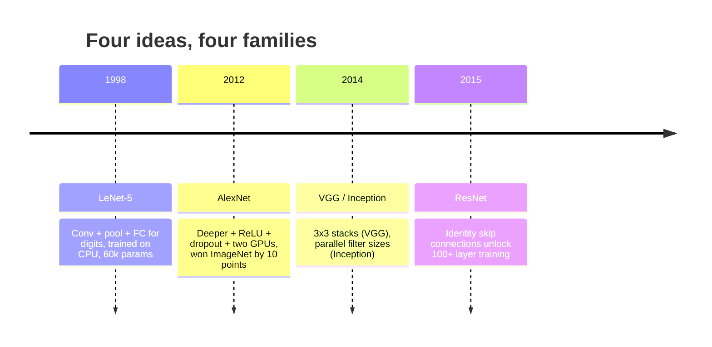
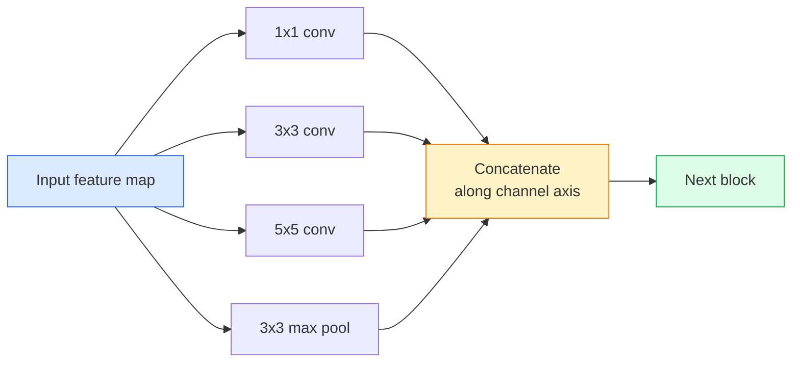
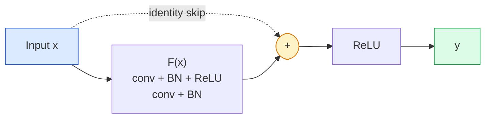

# Les cnnets de lenet à résnet de cnn architecture évoluer de lenet à résnet

> Chaque grande CNN de ces trente dernières années est la même recette de nonlinearité avec une nouvelle idée.

> **【中文解读】**Au cours des trois dernières décennies, toutes les principales chaînes de CNN ont été créées sur le même modèle. Ces innovations ont non seulement changé leur vision, mais ont également été transférées à Transformer et LLM.

**Type:** Learn + Build | **类型:** 学习 + 动手
**Languages:** Python | **语言:** Python
**Prerequisites:** Phase 3 Lesson 11 (PyTorch), Phase 4 Lesson 01 (Image Fundamentals), Phase 4 Lesson 02 (Convolutions from Scratch) | **前置知识:** Phase 3 Lesson 11（PyTorch），Phase 4 Lesson 01（图像基础），Phase 4 Lesson 02（从零实现卷积）
**Time:** ~75 minutes | **时间:** ~75 分钟

## Objectifs d'apprentissage

- Suivez la lignée architecturale LeNet-5 -> AlexNet -> VGG -> Inception -> ResNet et indiquez la seule nouvelle idée que chaque famille a contribuée
- Implémenter LeNet-5, un bloc de style VGG, et un ResNet BasicBlock en PyTorch, chacun sous 40 lignes
- Expliquez pourquoi les connexions résiduelles transforment un réseau de 1000 couches d'intrainable en un réseau de pointe.
- Lisez une colonne vertébrale moderne (ResNet-18, ResNet-50) et prédisez sa forme de sortie, son champ réceptif et le nombre de paramètres avant de regarder la source

> **【中文解读】**Les objectifs de l'apprentissage sont énumérés dans la liste des compétences fondamentales que l'on devrait acquérir après avoir terminé la classe.


## Le problème , l' introduction du problème

En 2011, le meilleur classifiateur ImageNet a obtenu une précision de 74% dans le top-5. En 2012, AlexNet a obtenu 85%. En 2015, ResNet a obtenu un score de 96%. Aucune nouvelle donnée. Pas de nouvelle génération de GPU. Les gains ont été obtenus grâce aux idées d'architecture. Un ingénieur de vision travailleur doit savoir quelle idée est venue de quel papier parce que chaque colonne vertébrale de production que vous expédez en 2026 est une recombinaison de ces mêmes pièces  et parce que les idées continuent de se transférer: les convois regroupés sont passés des CNN à des transformateurs, les connexions résiduelles sont passées de ResNet à chaque LLM existant, la normalisation de lot vit dans les modèles de diffusion.

> En 2011, le meilleur ImageNet classifiateur top-5  Accuracy rate est d'environ 74%  2012 AlexNet  atteint 85%  2015 ResNet  atteint 96%  Aucun nouveau données  Aucun nouveau GPU                                                                                                                                                                                                                                                                                                                                                                                                                                                                             

> **【中文解读】**Entre 2011-2015 l'imagenet 准确率 est passé de 74% 跳升到96%, en se basant non pas sur de nouveaux données ou de nouveaux GPU, mais sur des innovations architecturales.

L'étude de ces réseaux vous protège également contre une erreur commune: trouver le plus grand modèle disponible lorsqu'un réseau de la taille de LeNet résoudrait le problème.

> 按顺序学习这些网络还能让你避免一个常见错误: lorsque LeNet de grande taille réseau se trouve capable de résoudre un problème, utiliser le plus grand modèle disponible. MNIST ne nécessite pas ResNet.

## Le concept de base.

### Les quatre idées qui ont changé la vision



Rien d'autre dans la vision classique n'était aussi important que ces quatre sauts.

> Il n'y a rien de plus important dans la vie classique que ces quatre sauts.

### LeNet-5 (1998)

Le reconnaisseur de chiffres de Yann LeCun. 60.000 paramètres. Deux blocs de pool de convection, deux couches entièrement connectées, activations tanh. Il définit le modèle que chaque CNN hérite:

> Le détecteur numérique de Yann LeCun 60.000 paramètres 2 volumes 2 totaux, 2 couches  actives 2 définit chaque modèle de CNN:

```
input (1, 32, 32)
  conv 5x5 -> (6, 28, 28)
  avg pool 2x2 -> (6, 14, 14)
  conv 5x5 -> (16, 10, 10)
  avg pool 2x2 -> (16, 5, 5)
  flatten -> 400
  dense -> 120
  dense -> 84
  dense -> 10
```

Tout ce que le monde moderne appelle une CNN  des convulsions alternatives et des échantillons de réduction alimentant une petite tête de classifiateur  est LeNet avec plus de couches, de plus de canaux et de meilleures activations.

> Le monde moderne appelle le tout de CNN en un petit classement, ce qui signifie qu'il y a plus de couches, plus de canaux et un LeNet mieux actif.

> **【中文解读】**LeNet-5 définit tous les modèles de base de CNN:卷积 → 池化 → 卷积 → 池化 → 全连接── seulement 60.000 paramètres, mais a établi la structure fondamentale du système visuel de profondeur.

### AlexNet (2012) Le point d'explosion de l'apprentissage profond

Trois changements qui ont brisé ImageNet:

> Trois changements ont été commis pour créer ImageNet:

1. **ReLU**Les gradants cessent de disparaître, l'entraînement s'accélère de six fois.
2. **Dropout**La régulation devient une couche, pas un truc.
3. **Depth and width**Cinq couches de convection, trois couches denses, paramètres 60M, entraînés sur deux GPU avec le modèle divisé à travers eux.

La figure 2 du document montre encore la GPU divisée en deux courants parallèles. Ce parallélisme était une solution matérielle, pas une idée architecturale  mais les trois idées ci-dessus sont toujours dans chaque modèle que vous utilisez.

> Le graphique 2 du thème montre encore que la GPU est divisée en deux coordonnées. Cette coordonnée est la raison de l'utilisation du matériel, pas de l'architecture.

> **【拓展：AlexNet 的遗产】**Les trois innovations introduites par AlexNet sont encore présentes: 1) La fonction activation de ReLU a résolu le problème de disparition de la gradience; 2) La déclinaison et la normalisation empêchent de trop se préparer; 3) la profondeur et la largeur de la mécanique de dimensionnement.

### VGG (2014)  3x3 卷积的极致堆积

VGG a demandé: que se passe-t-il si vous utilisez seulement des convolutions 3x3 et que vous allez profondément ?

> VGG 问道: Si vous utilisez seulement 3x3 卷积, et en profondeur, que se passe-t-il ?

```
stack:   conv 3x3 -> conv 3x3 -> pool 2x2
repeat:  16 or 19 conv layers
```

Deux conv 3x3 voient la même surface d'entrée 5x5 qu'un conv 5x5 mais avec moins de paramètres (2 * 9 * C^2 = 18C^2 vs 25 * C^2) et une ReLU supplémentaire entre les deux. VGG a transformé cette observation en une architecture entière.

> 两个 3x3 卷积见的 5x5 输入区域与一个 5x5 卷积相同,但参数较少(2*9*C^2 = 18C^2 vs 25*C^2), au milieu il y a aussi des réLU。VGG qui vont transformer cette observation en une architecture complète。简洁性一种 type de bloc, réutilisation qui en fait un point de référence pour tout ce qui suit。

Coût: 138 millions de paramètres, lent à l'entraînement, coûteux à l'inférence.

> Le prix est de 1,38 milliards de dollars, entraînement lent, recommandation coûteuse.

### En 2014, la même année.

La réponse de Google à " quelle taille de noyau devrais-je utiliser ? " était: tous en parallèle.

> La réponse de Google à "qu'est-ce que le nucléaire ?" est:



Chaque branche se spécialise en 1x1 pour le mélange de canaux, 3x3 pour la texture locale, 5x5 pour les motifs plus grands, en regroupant pour les caractéristiques invariables de changement et le concat permet à la couche suivante de choisir la branche qui est utile.

> Chaque branche se spécialise dans différents aspects. 1x1 est utilisé pour le mélange de passages, 3x3 pour la structure locale, 5x5 pour un modèle plus grand, la mise en place pour les caractéristiques de déplacement constant.

### Le problème de dégradation.

En 2015, VGG-19 a fonctionné et VGG-32 n'a pas. La profondeur était censée aider, mais après ~ 20 couches, la formation et la perte de test sont devenues plus graves.

> En 2015, le VGG-19 est en mesure de fonctionner mais le VGG-32 ne fonctionne pas. La profondeur devrait être utile, mais plus de 20 niveaux de perte de formation et de test sont devenus plus graves.

```
Plain deep network:
  y = f_L( f_{L-1}( ... f_1(x) ... ) )

Gradient wrt early layer:
  dL/dW_1 = dL/dy * df_L/df_{L-1} * ... * df_2/df_1 * df_1/dW_1

Each multiplicative term has magnitude roughly (weight magnitude) * (activation gain).
Stack 100 of them with gains < 1 and the gradient is effectively zero.
```

La VGG fonctionnait à 19 couches parce que la norme de lot (publiée simultanément) gardait les activations bien étalées.

> Le VGG a été réalisé à 19 niveaux en raison de la bonne concentration de l'activité de l'intégration de la masse (en même temps publié) mais même la concentration de la masse ne peut pas être sauvée à plus de 30 niveaux de profondeur.

### ResNet (2015) Les autres liens sont des percées dans l'apprentissage en profondeur

Lui, Zhang, Ren, Sun ont proposé un changement qui a tout corrigé:

> Il a proposé un changement de tout.

```
standard block:   y = F(x)
residual block:   y = F(x) + x
```

Le `+ x`Cela signifie que la couche peut toujours choisir de ne rien faire en conduisant `F(x)`Un réseau ResNet de 1000 couches est maintenant au maximum aussi mauvais qu'un réseau de 1 couche, parce que chaque bloc supplémentaire a une échappe triviale. Avec cette garantie, l'optimisateur est prêt à rendre chaque bloc * légèrement * utile  et légèrement utile, empilé 100 fois, est de pointe.

> `+ x`Cela signifie que cette couche est toujours possible de passer.`F(x)`趋向零来选择什么都不做―― Un réseau résidentiel de 1000 niveaux est maintenant le plus grand et le plus différent d'un réseau de 1 niveaux, car chaque bloc supplémentaire a une voie de fuite simple― avec cette garantie, l'optimisateur est prêt à faire chaque bloc* un peu* utile un peu utile, se compose 100 fois, c'est le plus avancé―



Deux variantes du bloc apparaissent partout:

> 两种块变体无处不在:

- **BasicBlock**Deux convois 3x3, sautez autour des deux.
  Le texte de la première partie est le suivant:
- **Bottleneck**1x1 en bas, 3x3 au milieu, 1x1 en haut, sautez autour du trio.
  Le nombre de personnes qui sautent et sautent est plus facile à utiliser.

Lorsque le saut doit traverser un échantillon descendant (étape =2), le chemin d'identité est remplacé par un 1x1 étape = 2 conv pour correspondre aux formes.

> Lorsque le saut doit passer par le bas du passage, le chemin est remplacé par un passage par un passage par un passage par un passage par deux.

### Pourquoi les résidus comptent au-delà de la vision

L'idée n'était pas vraiment de la classification d'images. Il s'agissait de transformer les réseaux profonds de "cross-your-fingers et espérer que les gradients survivent" en un outil d'ingénierie fiable et évolutif. Chaque transformateur que vous lirez sur la prochaine phase a exactement la même connexion de saut dans chaque bloc. Sans ResNet, il n'y a pas de GPT.

> Cette idée n'est pas vraiment à propos de la classification des images. Elle est à propos de transformer le réseau profond de la "région de prière survie" en un outil d'ingénierie fiable et extensible.

> **【拓展：残差连接与 Transformer】**Le reste des connexions a non seulement changé la vision, mais elle a fait passer le réseau profond de " prayer gradience can survive " en un outil d'ingénierie fiable. Chaque bloc de transformateur (incluant GPT, BERT, Claude) utilise la même connexion de saut.`y = F(x) + x`On peut dire que c'est l'un des plus importants processus d'apprentissage de la profondeur.

> **【拓展：工业部署中的视觉系统】**Dans le cadre de la déploiement industriel réel, les modèles visuels doivent prendre en compte la réflexion sur la différence de taille des modèles, l'adaptation des appareils de bord, etc. TensorRT, ONNX Runtime, OpenVINO sont des outils d'accélération de réflexion courants. Les systèmes de conduite autonome (comme Tesla FSD) utilisent généralement plusieurs modèles visuels en temps réel sur les puces de véhicule.

```figure
pooling
```

## Faites-le

## Construisez-le en pratique.

### Étape 1: LeNet-5 réaliser LeNet-5

Un LeNet fidèle, un minimum, des activations Tanh, un pooling moyen.`nn.CrossEntropyLoss`en aval au lieu des connexions gaussiennes originales.

> Un LeNet fidèle et minimalisé, un LeNet activé et moyen, un LeNet fidèle et fidèle, un LeNet activé et moyen, un LeNet mécanique, un LeNet mécanique, un LeNet mécanique, un LeNet mécanique, un LeNet mécanique, un LeNet mécanique, un LeNet mécanique, un LeNet mécanique, un LeNet mécanique, un LeNet mécanique, un LeNet mécanique, un LeNet mécanique, un LeNet mécanique, un LeNet mécanique, un LeNet mécanique, un LeNet mécanique, un LeNet mécanique, un LeNet mécanique, un LeNet mécanique, un LeNet mécanique, un LeNet mécanique, un LeNet mécanique, un LeNet mécanique, un LeNet mécanique, un LeNet mécanique, un LeNet mécanique, un LeNet, un LeNet démo`nn.CrossEntropyLoss`Au lieu de la connexion haute originale.

```python
import torch
import torch.nn as nn
import torch.nn.functional as F

class LeNet5(nn.Module):
    def __init__(self, num_classes=10):
        super().__init__()
        self.conv1 = nn.Conv2d(1, 6, kernel_size=5)
        self.conv2 = nn.Conv2d(6, 16, kernel_size=5)
        self.pool = nn.AvgPool2d(2)
        self.fc1 = nn.Linear(16 * 5 * 5, 120)
        self.fc2 = nn.Linear(120, 84)
        self.fc3 = nn.Linear(84, num_classes)

    def forward(self, x):
        x = self.pool(torch.tanh(self.conv1(x)))
        x = self.pool(torch.tanh(self.conv2(x)))
        x = torch.flatten(x, 1)
        x = torch.tanh(self.fc1(x))
        x = torch.tanh(self.fc2(x))
        return self.fc3(x)

net = LeNet5()
x = torch.randn(1, 1, 32, 32)
print(f"output: {net(x).shape}")
print(f"params: {sum(p.numel() for p in net.parameters()):,}")
```

Résultats attendus: `output: torch.Size([1, 10])`- Je suis là .`params: 61,706`C'est le classifiateur de chiffres qui a donné naissance à la vision moderne.

> 预期输出:`output: torch.Size([1, 10])`- Je suis là.`params: 61,706`C'est le début de la classification numérique complète de la vidéo moderne.

### Étape 2: Un bloc VGG pour réaliser un bloc VGG

Un bloc réutilisable: deux convecteurs 3x3, ReLU, norme de lot, maximum de pool.

> Un bloc réutilisable: deux 3x3 卷积、ReLU、批量归归归归归归归归归最大池归归──

```python
class VGGBlock(nn.Module):
    def __init__(self, in_c, out_c):
        super().__init__()
        self.conv1 = nn.Conv2d(in_c, out_c, kernel_size=3, padding=1)
        self.bn1 = nn.BatchNorm2d(out_c)
        self.conv2 = nn.Conv2d(out_c, out_c, kernel_size=3, padding=1)
        self.bn2 = nn.BatchNorm2d(out_c)
        self.pool = nn.MaxPool2d(2)

    def forward(self, x):
        x = F.relu(self.bn1(self.conv1(x)))
        x = F.relu(self.bn2(self.conv2(x)))
        return self.pool(x)

class MiniVGG(nn.Module):
    def __init__(self, num_classes=10):
        super().__init__()
        self.stack = nn.Sequential(
            VGGBlock(3, 32),
            VGGBlock(32, 64),
            VGGBlock(64, 128),
        )
        self.head = nn.Sequential(
            nn.AdaptiveAvgPool2d(1),
            nn.Flatten(),
            nn.Linear(128, num_classes),
        )

    def forward(self, x):
        return self.head(self.stack(x))

net = MiniVGG()
x = torch.randn(1, 3, 32, 32)
print(f"output: {net(x).shape}")
print(f"params: {sum(p.numel() for p in net.parameters()):,}")
```

Trois blocs VGG sur une entrée de taille CIFAR, un bassin adaptatif, une couche linéaire. ~290k paramètres.

> Les trois blocs de VGG de la taille CIFAR sont introduits, une couche de l'adaptation à elle-même, une couche de l'orientation.

### Étape 3: Un bloc de base de ResNet

Le bloc de base de ResNet-18 et ResNet-34.

> Les éléments de base de ResNet-18 et ResNet-34 sont les éléments de base de la structure.

```python
class BasicBlock(nn.Module):
    def __init__(self, in_c, out_c, stride=1):
        super().__init__()
        self.conv1 = nn.Conv2d(in_c, out_c, kernel_size=3, stride=stride, padding=1, bias=False)
        self.bn1 = nn.BatchNorm2d(out_c)
        self.conv2 = nn.Conv2d(out_c, out_c, kernel_size=3, stride=1, padding=1, bias=False)
        self.bn2 = nn.BatchNorm2d(out_c)
        if stride != 1 or in_c != out_c:
            self.shortcut = nn.Sequential(
                nn.Conv2d(in_c, out_c, kernel_size=1, stride=stride, bias=False),
                nn.BatchNorm2d(out_c),
            )
        else:
            self.shortcut = nn.Identity()

    def forward(self, x):
        out = F.relu(self.bn1(self.conv1(x)))
        out = self.bn2(self.conv2(out))
        out = out + self.shortcut(x)
        return F.relu(out)
```

`bias=False`Le paramètre bêta de BN gère déjà le biais, donc le transport du biais de conv est également un gaspillage.`shortcut`Il n'est nécessaire d'avoir un véritable conve que lorsque le nombre de pas ou de canaux change; sinon, il s'agit d'une identité sans opération.

> 卷积层上 `bias=False`Le paramètre bêta de la régulation de la masse a déjà été traité par le décalage, donc en même temps, le décalage est un gaspillage.`shortcut`Il n'y a besoin que d'un véritable volume lorsque le nombre de pas ou de passages change; sinon, il est inexploitable.

### Étape 4: Construisez un petit réseau de résistance

L'accumulation de quatre groupes de BasicBlocks pour obtenir un ResNet fonctionnel pour les entrées de taille CIFAR.

> 堆叠四组 BasicBlock 以获得适用于CIFAR 尺寸输入工作ResNet。

```python
class TinyResNet(nn.Module):
    def __init__(self, num_classes=10):
        super().__init__()
        self.stem = nn.Sequential(
            nn.Conv2d(3, 32, kernel_size=3, stride=1, padding=1, bias=False),
            nn.BatchNorm2d(32),
            nn.ReLU(inplace=True),
        )
        self.layer1 = self._make_group(32, 32, num_blocks=2, stride=1)
        self.layer2 = self._make_group(32, 64, num_blocks=2, stride=2)
        self.layer3 = self._make_group(64, 128, num_blocks=2, stride=2)
        self.layer4 = self._make_group(128, 256, num_blocks=2, stride=2)
        self.head = nn.Sequential(
            nn.AdaptiveAvgPool2d(1),
            nn.Flatten(),
            nn.Linear(256, num_classes),
        )

    def _make_group(self, in_c, out_c, num_blocks, stride):
        blocks = [BasicBlock(in_c, out_c, stride=stride)]
        for _ in range(num_blocks - 1):
            blocks.append(BasicBlock(out_c, out_c, stride=1))
        return nn.Sequential(*blocks)

    def forward(self, x):
        x = self.stem(x)
        x = self.layer1(x)
        x = self.layer2(x)
        x = self.layer3(x)
        x = self.layer4(x)
        return self.head(x)

net = TinyResNet()
x = torch.randn(1, 3, 32, 32)
print(f"output: {net(x).shape}")
print(f"params: {sum(p.numel() for p in net.parameters()):,}")
```

Quatre groupes de deux blocs chacun. étape 2 au début des groupes 2, 3, 4. le nombre de canaux double à chaque échantillon. Parametres approximatifs 2,8M. C'est la recette standard qui équivaut nettement à ResNet-152.

> Chaque groupe de deux blocs. Le deuxième, troisième et quatrième groupe commence à passer par deux.

### Étape 5: Comparer l'efficacité paramètre à caractéristique par rapport à l'efficacité paramétrique

Exécutez la même entrée à travers les trois réseaux et comparez les nombres de paramètres.

> La même entrée sera effectuée à travers les trois réseaux et comparer les nombres de paramètres.

```python
def summary(name, net, x):
    y = net(x)
    params = sum(p.numel() for p in net.parameters())
    print(f"{name:12s}  input {tuple(x.shape)} -> output {tuple(y.shape)}  params {params:>10,}")

x = torch.randn(1, 3, 32, 32)
summary("LeNet5",     LeNet5(),       torch.randn(1, 1, 32, 32))
summary("MiniVGG",    MiniVGG(),      x)
summary("TinyResNet", TinyResNet(),   x)
```

Pour une précision CIFAR-10, vous avez besoin d'environ: LeNet 60%, MiniVGG 89%, TinyResNet 93% après quelques périodes de formation.

> Pour le CIFAR-10, le taux de précision, le train de plusieurs époques 后大致需要:LeNet 60%、MiniVGG 89%、TinyResNet 93%──


## Utilisez-le dans la pratique.

`torchvision.models`La signature d'appel est identique dans toutes les familles, ce qui est exactement le point de l'abstraction de la colonne vertébrale.

> `torchvision.models`给你上述所有模型的预训练版本――调用签名在各家族间完全相同, c'est précisément le sens de l'extraction du réseau de la base de données――

```python
from torchvision.models import resnet18, ResNet18_Weights, vgg16, VGG16_Weights

r18 = resnet18(weights=ResNet18_Weights.IMAGENET1K_V1)
r18.eval()

print(f"ResNet-18 params: {sum(p.numel() for p in r18.parameters()):,}")
print(r18.layer1[0])
print()

v16 = vgg16(weights=VGG16_Weights.IMAGENET1K_V1)
v16.eval()
print(f"VGG-16   params: {sum(p.numel() for p in v16.parameters()):,}")
```

ResNet-18 a 11,7 millions de paramètres. VGG-16 a 138 millions. Une précision similaire à celle de ImageNet top-1 (69,8% contre 71,6%). Les connexions résiduelles vous procurent un gain d'efficacité de paramètre de 12 fois. C'est pourquoi les variantes ResNet ont dominé de 2016 jusqu'à l'arrivée de ViT en 2021  et dominent toujours les déploiements dans le monde réel où le calcul est la contrainte.

> **【中文解读】**ResNet-18(1170 millions de paramètres) contre VGG-16(1.38 milliards de paramètres),ImageNet 准确率相近, mais l'efficacité des paramètres a varié de 12 fois.

Pour l'apprentissage de transfert, la recette est toujours la même: charge préentrainée, congélation de la colonne vertébrale, remplacement de la tête de classification.

> Pour les migrations, le programme est toujours le même: chargement de pré-entraînement,

```python
for p in r18.parameters():
    p.requires_grad = False
r18.fc = nn.Linear(r18.fc.in_features, 10)
```

Vous avez maintenant un classifiateur CIFAR de 10 classes qui hérite des représentations payées par ImageNet.

> Vous avez maintenant un CIFAR de 10 catégories, qui a hérité de la réputation de ImageNet.


> **【拓展：数据标注与质量】**L'efficacité des tâches visuelles dépend fortement de la qualité des données de marquage. Le Studio de marquage, CVAT, est l'outil de marquage principal. Dans le monde industriel, l'apprentissage actif peut réduire le coût de marquage.

## Envoyez-le .

Cette leçon donne:

> Le programme de formation

- `outputs/prompt-backbone-selector.md` une requête qui choisit la bonne famille de CNN (LeNet/VGG/ResNet/MobileNet/ConvNeXt) pour une tâche, une taille de l'ensemble de données et un budget de calcul.
  En français, traduit par " donner des tâches déterminées ", " donner des tâches déterminées ", " donner des données " , " choisir correctement " et " calculer le budget "
- `outputs/skill-residual-block-reviewer.md` une compétence qui lit un module PyTorch et détecte les erreurs de saut de connexion (manque de raccourci sur le changement de pas, ordre d'activation du raccourci, placement BN par rapport à l'addition).
  Le texte de la lettre de la lettre de la lettre de la lettre de la lettre de la lettre de la lettre de la lettre de la lettre de la lettre de la lettre de la lettre de la lettre de la lettre de la lettre de la lettre de la lettre de la lettre de la lettre de la lettre de la lettre de la lettre de la lettre de la lettre de la lettre de la lettre de la lettre de la lettre de la lettre de la lettre de la lettre de la lettre de la lettre de la lettre de la lettre de la lettre de la lettre de la lettre de la lettre de la lettre de la lettre de la lettre de la lettre de la lettre de la lettre de la lettre de la lettre de la lettre de la lettre de la lettre de la lettre de la lettre de la lettre de la lettre de la lettre de la lettre de la lettre de la lettre de la lettre de la lettre de la lettre de la lettre de la lettre de la lettre de la lettre de la lettre de la lettre de la lettre de la lettre de la lettre de la lettre de la lettre de la lettre de la lettre de la lettre de la lettre de la lettre de la lettre de la lettre de la lettre de la lettre de la lettre de la lettre de la lettre de la lettre de la lettre de la lettre de la lettre de la lettre de la lettre de la lettre de la lettre de la lettre de la lettre de la lettre de la lettre de la lettre de la lettre de la lettre de la lettre de la lettre de la lettre de la lettre de la lettre de la lettre de la lettre de la lettre de la lettre de la lettre de la lettre de la lettre de la lettre de la lettre de la lettre de la lettre de la lettre de la lettre de la lettre de la

## Les exercices

> **【中文解读】** Exercices de base selon Easy/Medium/Hard 三个难度递进──建议至少完成  级别的题目,  级别适合深入研究或面试准备──


1. **(Easy | 简单)**Comptez les paramètres à la main pour `TinyResNet`La différence entre les couches`sum(p.numel() for p in net.parameters())`. Où se trouve la majorité du budget des paramètres  convs, BN ou la tête de classification ?
    Calculer par étage le nombre de paramètres de TinyResNet, trouver les principaux paramètres qui se trouvent là-bas.

2. **(Medium | 中等)**Implémenter le bloc de boîte à outils (en 1x1 -> 3x3 -> 1x1 avec saut) et l'utiliser pour construire un réseau de style ResNet-50 pour CIFAR.`TinyResNet`- Je suis désolé .
   实现 Bottleneck 块, construire ResNet-50 风格网络,对比参数量──

3. **(Hard | 困难)**Retirez la connexion skip de `BasicBlock`Le réseau de formation de 34 blocs et le réseau de résistance de 34 blocs sur CIFAR-10 pendant 10 époques chacune.
   Pour les résultats de la formation, il est nécessaire de faire une analyse de la situation et de la situation.

## Les termes clés

| Term | What people say | What it actually means | 中文释义 |
|------|----------------|----------------------|---------|
| Backbone | "The model" | The stack of convolutional blocks that produces the feature map fed to the task head | 骨干网络：产生特征图的卷积块堆叠 |
| Residual connection | "Skip connection" | `y = F(x) + x`; lets the optimiser learn identity by setting F to zero, which makes arbitrary depth trainable | 残差连接/跳跃连接：让任意深度可训练 |
| BasicBlock | "Two 3x3 convs with a skip" | The ResNet-18/34 building block: conv-BN-ReLU-conv-BN-add-ReLU | 基本块：ResNet-18/34 的构建单元 |
| Bottleneck | "1x1 down, 3x3, 1x1 up" | The ResNet-50/101/152 block; cheap at high channel counts because the 3x3 runs on a reduced width | 瓶颈块：1x1降维-3x3卷积-1x1升维 |
| Degradation problem | "Deeper is worse" | Past ~20 plain conv layers, both training and test error increase; solved by residual connections, not by more data | 退化问题：层数加深后训练和测试误差都增大 |
| Stem | "The first layer" | The initial conv that converts 3-channel input into the base feature width; usually 7x7 stride 2 for ImageNet, 3x3 stride 1 for CIFAR | 茎部：网络的初始卷积层 |
| Head | "The classifier" | The layers after the final backbone block: adaptive pool, flatten, linear(s) | 头部：骨干网络之后的分类器层 |
| Transfer learning | "Pretrained weights" | Loading a backbone trained on ImageNet and fine-tuning only the head on your task | 迁移学习：加载预训练权重，只微调头部 |

## Encore une lecture

> **【中文解读】**延伸阅读 fournit des ressources de haute qualité pour l'apprentissage en profondeur. Ces articles et cours sont des références classiques dans ce domaine, adaptés aux lecteurs qui ont besoin d'une compréhension approfondie.


- [Deep Residual Learning for Image Recognition (He et al., 2015)](https://arxiv.org/abs/1512.03385) le document ResNet; chaque chiffre vaut la peine d'être étudié
- [Very Deep Convolutional Networks (Simonyan & Zisserman, 2014)](https://arxiv.org/abs/1409.1556) le papier VGG; toujours la meilleure référence pour "pourquoi 3x3"
- [ImageNet Classification with Deep CNNs (Krizhevsky et al., 2012)](https://papers.nips.cc/paper_files/paper/2012/hash/c399862d3b9d6b76c8436e924a68c45b-Abstract.html) AlexNet; le papier qui a mis fin à l'ère des fonctionnalités faites à la main
- [Going Deeper with Convolutions (Szegedy et al., 2014)](https://arxiv.org/abs/1409.4842) Inception v1; l'idée du filtre parallèle qui apparaît encore dans les transformateurs de vision
