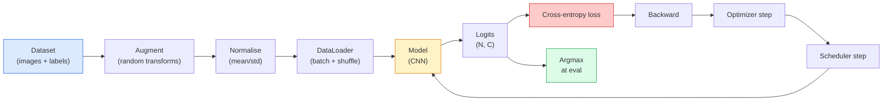

# Classification des images

> Un classifiateur est une fonction des pixels à une distribution de probabilité sur les classes.

> **【中文解读】**L'image classification est essentiellement une fonction de distribution de la probabilité de la classe de la classe de la classe de la classe de la classe de la classe de la classe de la classe de la classe de la classe de la classe de la classe de la classe de la classe de la classe de la classe de la classe de la classe de la classe de la classe de la classe de la classe de la classe de la classe de la classe de la classe de la classe de la classe de la classe de la classe de la classe de la classe de la classe de la classe de la classe de la classe de la classe de la classe de la classe de la classe de la classe de la classe de la classe de la classe de la classe de la classe de la classe de la classe de la classe de la classe de la classe de la classe de la classe de la classe de la classe de la classe de la classe de la classe de la classe de la classe de la classe de la classe de la classe de la classe de la classe de la classe de la classe de la classe de la classe de la classe de la classe de la classe de la classe de la classe de la classe de la classe de la classe de la classe de la classe de la classe de la classe de la classe de la classe de la classe de la classe de la classe de la classe de la classe de la classe de la classe de la classe de la classe de la classe de la classe de la classe de la classe de la classe de la classe de la classe de la classe de la classe de la classe de la classe de la classe de la classe de la classe de la classe de la classe de la classe de la classe de la classe de la classe de la classe de la classe de la classe de la classe de la classe de la classe de la classe de la classe de la classe de la classe de la classe de la classe de la classe de la classe de la classe de la classe de la classe de la classe de la classe de la classe de la classe de la classe de la classe de la classe de la classe de la classe de la classe de la classe de la classe de la classe de la classe de la classe de la classe de la classe de la classe de la classe de la classe de la classe de la classe de la classe de la classe de la classe de la classe de la classe de la classe de la classe de la classe de la classe de la classe de la classe de la classe de la classe de la

**Type:** Build | **类型:** 动手
**Languages:** Python | **语言:** Python
**Prerequisites:** Phase 2 Lesson 09 (Model Evaluation), Phase 3 Lesson 10 (Mini Framework), Phase 4 Lesson 03 (CNNs) | **前置知识:** Phase 2 Lesson 09（模型评估），Phase 3 Lesson 10（迷你框架），Phase 4 Lesson 03（CNN）
**Time:** ~75 minutes | **时间:** ~75 分钟

## Objectifs d'apprentissage

- Construire un pipeline de classification d'images de bout en bout sur le CIFAR-10: ensemble de données, augmentation, modèle, cycle de formation, évaluation
- Expliquer le rôle de chaque composant (chargement de données, perte, optimisateur, planificateur, augmentation) et prédire comment la rupture de l'un d'eux se manifeste dans la courbe de perte
- Mélanger, couper et étiqueter à partir de zéro et justifier quand chacun vaut la peine d'être ajouté
- Lire une matrice de confusion et un tableau de précision/reprise par classe pour diagnostiquer les défaillances de l'ensemble de données et des modèles au-delà de la précision globale

> **【中文解读】**Les objectifs de l'apprentissage sont énumérés dans la liste des compétences fondamentales que l'on devrait acquérir après avoir terminé la classe.


## Le problème , l' introduction du problème

Chaque tâche de vision qui est effectuée se réduit à une classification d'image à un certain niveau. La détection classifie les régions. La segmentation classifie les pixels. La récupération se classe par similitude avec les classe centroid.

> Chaque tâche visuelle livrée se résume dans une certaine mesure à des catégories d'images. Les catégories de zones sont classées en catégories. Les catégories sont classées en fonction de leur classement.

> **【中文解读】**Toutes les tâches visuelles de la mise en œuvre peuvent être résumées en substance en images de catégories: l'objectif est de "partager une région", la division de la catégorie est de "partager une image", la recherche d'images est de "partager une image selon le centre de similitude" et de "connaître chaque élément de la ligne de distribution, de manière à maîtriser toutes les étapes suivantes".

La plupart des bugs de classification ne sont pas dans le modèle. Ils vivent dans le pipeline: une normalisation brisée, un ensemble de formation non mélangé, une augmentation qui déforme les étiquettes, une fraction de validation contaminée par des données de formation, un taux d'apprentissage qui diverge silencieusement après l'époque 30. Une CNN qui atteindrait 93% sur CIFAR-10 avec une configuration correcte marque généralement 70-75% avec une cassée, et la courbe de perte semble plausible tout le temps.

> La plupart des bugs de catégorie ne sont pas dans le modèle. Ils existent dans les flux de données: erreur de regroupement, ensemble de formation non perturbé, augmentation des étiquettes tortueuses, ensemble de vérification de la contamination des données par l'entraînement, taux d'apprentissage de la diffusion silencieuse après la 30e période. Un cf. correctement configuré peut atteindre 93% sur CIFAR-10 de CNN, normalement seulement 70-75% sous une mauvaise configuration, et la courbe de perte semble toujours raisonnable.

Cette leçon câble l'ensemble du pipeline à la main de sorte que chaque partie est inspectable.`torchvision.datasets`Ça pourrait cacher un insecte.

> Cette classe est menée à construire toute la ligne de débit, de sorte que chaque partie soit vérifiable.`torchvision.datasets`Tout ce qui peut être caché.

> **【中文解读】**La plupart des bugs de catégorie ne se trouvent pas dans le modèle lui-même, mais dans le flux de l'eau: regroupement, erreur, formation, désordre, renforcement, destruction de l'étiquette, vérification, contamination des données, taux d'apprentissage, répartition. La configuration correcte peut atteindre 93% du modèle, l'erreur ne peut atteindre que 70-75%, et la perte de la courbe semble être normale. C'est le lieu le plus effrayant.

## Le concept de base.

### Le pipeline de classification



Chaque ligne de cette boucle est où un bug peut vivre.`model(x).softmax()`avant que la perte ne compute le mauvais gradient.

> Chaque ligne de ce cycle est un bug possible.`model(x).softmax()`La ville calcule silencieusement la gravité de l'erreur.

> **【中文解读】**流水线中每一行都可能藏有 bug──交叉接收是原始logits(未经 softmax 的值), si d'abord fait softmax 再传入损失 函数,梯度计算就完全错了但不会报错── Augmentations s'appliquent aux entrées uniquement, pas les étiquettes  sauf pour le mixage, qui mélange les deux. `optimizer.zero_grad()`Il faut le faire une fois par étape, sauter le code accumule des gradients et semble être un taux d'apprentissage extrêmement instable.

### Entrapée croisée, logites et softmax

Un classifiant produit `C`Les nombres par image sont appelés logits.

> Pour chaque image produite`C`个数字, appelés logits. Applique softmax les transformera en distribution de probabilité:

```
softmax(z)_i = exp(z_i) / sum_j exp(z_j)
```

L'entropie croisée mesure la probabilité négative de log de la classe correcte:

> 交叉衡正确类别的负对数概率:

```
CE(z, y) = -log( softmax(z)_y )
        = -z_y + log( sum_j exp(z_j) )
```

La forme de droite est celle numériquement stable (log-sum-exp).`nn.CrossEntropyLoss`Il est possible de faire une commande de logiciel de logiciel de logiciel de logiciel de logiciel de logiciel de logiciel de logiciel de logiciel de logiciel de logiciel de logiciel de logiciel de logiciel de logiciel de logiciel de logiciel de logiciel de logiciel de logiciel de logiciel de logiciel de logiciel de logiciel de logiciel de logiciel de logiciel de logiciel de logiciel de logiciel de logiciel de logiciel de logiciel de logiciel de logiciel de logiciel de logiciel de logiciel de logiciel de logiciel de logiciel de logiciel de logiciel de logiciel de logiciel de logiciel de logiciel de logiciel de logiciel de logiciel de logiciel de logiciel de logiciel de logiciel de logiciel de logiciel de logiciel de logiciel de logiciel de logiciel de logiciel de logiciel de logiciel de logiciel de logiciel de logiciel de logiciel de logiciel de logiciel de logiciel de logiciel de logiciel de logiciel de logiciel de logiciel de logiciel de logiciel de logiciel de logiciel de logiciel de logiciel de logiciel de logiciel de logiciel de logiciel de logiciel de logiciel de logiciel de logiciel de logiciel de logiciel de logiciel de logiciel de logiciel de logiciel de logiciel de logiciel de logiciel de logiciel de logiciel de logiciel de logiciel de logiciel de logiciel de logiciel de logiciel de logiciel de logiciel de logiciel de logiciel de logiciel de logiciel de logiciel de logiciel de logiciel de logiciel de logiciel de logiciel de logiciel de logiciel de logiciel de logiciel de logiciel de logiciel de logiciel de logiciel de logiciel de logiciel de logiciel de logiciel de logiciel de logiciel de logiciel de logiciel de logiciel de logiciel de logiciel de logiciel de logiciel de logiciel de logiciel de logiciel de logiciel de logiciel de logiciel de logiciel de logiciel de logiciel de logiciel de logiciel de logiciel de logiciel de logiciel de logiciel de logiciel de logiciel de logiciel de logiciel de logiciel de logiciel de logiciel de logiciel de logiciel de logiciel de logiciel de logiciel de logiciel de

> La forme droite est la valeur fixe de la quantité.`nn.CrossEntropyLoss`Dans une opération, softmax + NLL est fusionné, recevant directement les logits originaux.

> **【中文解读】**PyTorch de `nn.CrossEntropyLoss`内部 déjà fusionné softmax + 负对数似然, directement传入原始logits 即可──. Si vous modifiez manuellement softmax à nouveau à la perte, cela équivaut à faire deux fois softmax, gradience calculé complètement error──.

### Pourquoi l'augmentation fonctionne

Une CNN a un biais inductif pour la traduction (de partage de poids) mais aucune invariance intégrée aux cultures, aux retours, aux vibrations de couleur ou à l'occlusion. La seule façon de l'enseigner ces invariations est de lui montrer des pixels qui les exercent. Chaque transformation aléatoire pendant l'entraînement est une façon de dire: " ces deux images ont le même étiquette; apprenez les caractéristiques qui ignorent la différence. "

> CNN a attribué un biais à la plate-forme à la distribution de poids, mais à la coupe, à la transformation, au changement de couleur ou à la couverture il n'y a pas d'invariabilité intégrée. Le seul moyen de l'apprendre à ces invariabilités est de montrer leur image. Chaque changement de temps pendant l'entraînement est le suivant: " Ces deux images ont la même étiquette; apprendre à ignorer les caractéristiques de la différence ".

> **【拓展：数据增强与模型泛化】**Le renforcement des données est le plus puissant moyen de normalisation gratuit de l'IA moderne. Dans les entraînements classiques de modèles tels que ResNet、EfficientNet, le bon et le mauvais des stratégies de renforcement ont un impact direct sur le taux de précision de 3-5%.

```
Original crop:  "dog facing left"
Flip:           "dog facing right"       <- same label, different pixels
Rotate(+15):    "dog, slight tilt"
Colour jitter:  "dog in warmer light"
RandomErasing:  "dog with patch missing"
```

La règle: l'augmentation doit préserver l'étiquette. La coupe et la rotation sur un chiffre peuvent faire passer "6" en "9"; pour ce jeu de données, vous utilisez des intervalles de rotation plus petits et choisissez des augmentations qui respectent les invariations spécifiques aux chiffres.

> 規則:增强必须保持标签不变―― pour les chiffres être couvert et rotation peut transformer "6"  into "9"; pour ce groupe de données, vous utilisez une plus petite gamme de rotation, et choisissez de respecter les chiffres spécifiques non changées augmentations――

### mélange et coupure

L'augmentation ordinaire transforme les pixels mais garde les étiquettes un-chaud. **Mixup**et **cutmix**Vous pouvez le casser en interpolant les deux.

> Normalement, les images changent de force mais la marque est un peu chaude.**Mixup**et **cutmix**En effet, les deux parties ont déjà fait une différence.

```
Mixup:
  lambda ~ Beta(a, a)
  x = lambda * x_i + (1 - lambda) * x_j
  y = lambda * y_i + (1 - lambda) * y_j

Cutmix:
  paste a random rectangle of x_j into x_i
  y = area-weighted mix of y_i and y_j
```

Pourquoi cela aide-t-il: le modèle cesse de mémoriser des cibles ponctuelles et apprend à interpolier entre les classes. La perte d'entraînement augmente, la précision des tests augmente. C'est la mise à niveau de robustesse la moins chère pour tout classifiateur.

> Pourquoi cela a-t-il aidé: le modèle de stop memory top-peak a un objectif très chaud, l'apprentissage entre les classes, la perte de formation, le taux de précision des tests, etc.

> **【拓展：Mixup 在大模型中的应用】**L'idée de mélange s'est étendue au domaine de la PNL pour la mélange de valeur de l'intégration de texte. Dans les formations de la LMP, comme le ChatGPT, les techniques de placement et de marquage de logiciels sont également largement utilisées, aidant les modèles à générer des sorties de probabilité plus calibrées, réduisant la confiance excessive.

### Légalisation des étiquettes

Un cousin de confusion.`[0, 0, 1, 0, 0]`, train contre `[eps/C, eps/C, 1-eps, eps/C, eps/C]`Pour un petit`eps`Il permet de réduire la production de logits arbitrairement tranchants et d'améliorer l'étalonnage à presque aucun coût.`nn.CrossEntropyLoss(label_smoothing=0.1)`depuis PyTorch 1.10.

> Mixup of close亲──不使用 `[0, 0, 1, 0, 0]` faire de l'entraînement, mais utiliser `[eps/C, eps/C, 1-eps, eps/C, eps/C]`, parmi lesquels `eps`En effet, les modèles sont en train de se développer en fonction de la taille de la structure de l'appareil.`nn.CrossEntropyLoss(label_smoothing=0.1)`Dans le centre.

### Évaluation au-delà de l'exactitude

La précision globale cache un déséquilibre. Un classificateur binaire de 90 à 10 qui prédit toujours la classe majoritaire marque 90%.

> Le taux de précision total est inéquilibré. Un type de prédiction général de 90 à 10 catégories.

- **Per-class accuracy** un nombre par classe; apparaît immédiatement dans les catégories qui présentent des résultats inférieurs.
  Chaque classe est un nombre; immédiatement exposé à de mauvaises performances.
- **Confusion matrix** Grille C x C avec rangée i col j = nombre de vrais classes i prédites comme classe j; la diagonale est correcte, les hors-diagonales sont là où votre modèle vit.
  Le nombre de catégories j est prédit comme étant le nombre de catégories j; le côté est vrai, le côté non est faux.
- **Top-1 / Top-5** si la classe correcte figure dans les prédictions 1 ou 5 premières; Top-5 compte pour ImageNet parce que des classes comme "Norwich Terrier" vs "Norfolk Terrier" sont vraiment ambiguës.
  Le Top-1 / Top-5 correct classe est-il en 1 ou en 5 prévisions; Le Top-5 pour ImageNet  est important, car des catégories comme "Norwich Terrier" vs "Norfolk Terrier" sont vraiment différentes.
- **Calibration (ECE)** une prédiction de confiance de 0,8 le rend correct 80% du temps ? les réseaux modernes sont systématiquement trop confiants; résoudre avec l'échelle de température ou l'allumage de l'étiquette.
  En anglais, la prédiction de la confiance est de 0,8%.

> **【拓展：工业部署中的视觉系统】**Dans le cadre de la déploiement industriel réel, les modèles visuels doivent prendre en compte la réflexion sur la différence de taille des modèles, l'adaptation des appareils de bord, etc. TensorRT, ONNX Runtime, OpenVINO sont des outils d'accélération de réflexion courants. Les systèmes de conduite autonome (comme Tesla FSD) utilisent généralement plusieurs modèles visuels en temps réel sur les puces de véhicule.


## Construisez-le et mettez-le en œuvre.

> **【中文解读】**Cette méthode "de zéro" peut aider à comprendre le principe derrière le cadre, en cas de problème, ne sera pas bloqué dans une boîte noire.

```figure
receptive-field
```

## Faites-le

### Étape 1: Un ensemble de données synthétiques déterministes

CIFAR-10 vit sur le disque. Pour rendre cette leçon reproduisable et rapide, nous construisons un ensemble de données synthétiques qui ressemble à CIFAR  32x32 images RGB avec une structure spécifique à la classe que le modèle doit apprendre. Le même pipeline fonctionne exactement inchangé sur le vrai CIFAR-10.

> CIFAR-10 est présent sur le disque. Pour rendre cette classe réalisable et rapide, nous avons construit un ensemble de données synthétiques similaire à CIFAR avec des modèles à apprendre de catégories de structures spécifiques 32x32 RGB images.

```python
import numpy as np
import torch
from torch.utils.data import Dataset


def synthetic_cifar(num_per_class=1000, num_classes=10, seed=0):
    rng = np.random.default_rng(seed)
    X = []
    Y = []
    for c in range(num_classes):
        centre = rng.uniform(0, 1, (3,))
        freq = 2 + c
        for _ in range(num_per_class):
            yy, xx = np.meshgrid(np.linspace(0, 1, 32), np.linspace(0, 1, 32), indexing="ij")
            r = np.sin(xx * freq) * 0.5 + centre[0]
            g = np.cos(yy * freq) * 0.5 + centre[1]
            b = (xx + yy) * 0.5 * centre[2]
            img = np.stack([r, g, b], axis=-1)
            img += rng.normal(0, 0.08, img.shape)
            img = np.clip(img, 0, 1)
            X.append(img.astype(np.float32))
            Y.append(c)
    X = np.stack(X)
    Y = np.array(Y)
    idx = rng.permutation(len(X))
    return X[idx], Y[idx]


class ArrayDataset(Dataset):
    def __init__(self, X, Y, transform=None):
        self.X = X
        self.Y = Y
        self.transform = transform

    def __len__(self):
        return len(self.X)

    def __getitem__(self, i):
        img = self.X[i]
        if self.transform is not None:
            img = self.transform(img)
        img = torch.from_numpy(img).permute(2, 0, 1)
        return img, int(self.Y[i])
```

Chaque classe obtient sa propre palette de couleurs et son propre motif de fréquence, plus le bruit gaussien pour forcer le modèle à apprendre le signal plutôt que de mémoriser les pixels.

> Chaque catégorie a son propre modèle de réglage et de fréquence, avec des bruits élevés pour forcer le modèle à apprendre des signaux plutôt que des images de mémoire.

### Étape 2: normalisation et augmentation

Les deux transformations que chaque pipeline de vision a.

> Chaque ligne de vision a deux changements.

```python
def standardize(mean, std):
    mean = np.array(mean, dtype=np.float32)
    std = np.array(std, dtype=np.float32)
    def _fn(img):
        return (img - mean) / std
    return _fn


def random_hflip(p=0.5):
    def _fn(img):
        if np.random.random() < p:
            return img[:, ::-1, :].copy()
        return img
    return _fn


def random_crop(pad=4):
    def _fn(img):
        h, w = img.shape[:2]
        padded = np.pad(img, ((pad, pad), (pad, pad), (0, 0)), mode="reflect")
        y = np.random.randint(0, 2 * pad)
        x = np.random.randint(0, 2 * pad)
        return padded[y:y + h, x:x + w, :]
    return _fn


def compose(*fns):
    def _fn(img):
        for fn in fns:
            img = fn(img)
        return img
    return _fn
```

Réflectez-le avant la récolte, pas le zéro-pad, parce que les frontières noires sont un signal que le modèle apprendrait à ignorer de manière inutile.

> 剪裁前使用反射填充而不是零填充, car le bord noir est un signal négligé par les modèles de l'école de manière inutile.

### Étape 3: mélange

Il mélange deux images et deux étiquettes à l'intérieur de la étape d'entraînement.

> Dans les étapes de formation, il est mélangé à deux images et deux étiquettes.

```python
def mixup_batch(x, y, num_classes, alpha=0.2):
    if alpha <= 0:
        return x, torch.nn.functional.one_hot(y, num_classes).float()
    lam = float(np.random.beta(alpha, alpha))
    idx = torch.randperm(x.size(0), device=x.device)
    x_mixed = lam * x + (1 - lam) * x[idx]
    y_onehot = torch.nn.functional.one_hot(y, num_classes).float()
    y_mixed = lam * y_onehot + (1 - lam) * y_onehot[idx]
    return x_mixed, y_mixed


def soft_cross_entropy(logits, soft_targets):
    log_probs = torch.log_softmax(logits, dim=-1)
    return -(soft_targets * log_probs).sum(dim=-1).mean()
```

`soft_cross_entropy`Il se réduit à la normale de l'un-chaud lorsque la cible est exactement un-chaud.

> `soft_cross_entropy`Il est à l'intersection de la distribution des étiquettes. Lorsque l'objectif est juste un-chaud, il se détériore en un-chaud normal.

### Étape 4: La boucle d'entraînement

La recette complète: une passe sur les données, des gradients une fois par lot, un planificateur une fois par époque.

> Le programme complet: chaque volume de données est calculé à une échelle, chaque époque est réglée à une échelle.

```python
import torch
import torch.nn as nn
from torch.utils.data import DataLoader
from torch.optim import SGD
from torch.optim.lr_scheduler import CosineAnnealingLR

def train_one_epoch(model, loader, optimizer, device, num_classes, use_mixup=True):
    model.train()
    total, correct, loss_sum = 0, 0, 0.0
    for x, y in loader:
        x, y = x.to(device), y.to(device)
        if use_mixup:
            x_m, y_soft = mixup_batch(x, y, num_classes)
            logits = model(x_m)
            loss = soft_cross_entropy(logits, y_soft)
        else:
            logits = model(x)
            loss = nn.functional.cross_entropy(logits, y, label_smoothing=0.1)
        optimizer.zero_grad()
        loss.backward()
        optimizer.step()
        loss_sum += loss.item() * x.size(0)
        total += x.size(0)
        # Training accuracy vs the un-mixed labels `y` is only an approximation
        # when mixup is on (the model saw soft targets, not y). Treat it as a
        # rough progress signal; rely on val accuracy for real performance.
        with torch.no_grad():
            pred = logits.argmax(dim=-1)
            correct += (pred == y).sum().item()
    return loss_sum / total, correct / total


@torch.no_grad()
def evaluate(model, loader, device, num_classes):
    model.eval()
    total, correct = 0, 0
    loss_sum = 0.0
    cm = torch.zeros(num_classes, num_classes, dtype=torch.long)
    for x, y in loader:
        x, y = x.to(device), y.to(device)
        logits = model(x)
        loss = nn.functional.cross_entropy(logits, y)
        pred = logits.argmax(dim=-1)
        for t, p in zip(y.cpu(), pred.cpu()):
            cm[t, p] += 1
        loss_sum += loss.item() * x.size(0)
        total += x.size(0)
        correct += (pred == y).sum().item()
    return loss_sum / total, correct / total, cm
```

Cinq invariants que vous vérifiez à chaque fois que vous écrivez une boucle d'entraînement:

> Cinq variables de chaque cycle d'écriture:

1. `model.train()`avant la formation, `model.eval()`avant l'évaluation  renverse le comportement de la démission et de la normalisation du lot.
2. `.zero_grad()`avant `.backward()`- Je suis désolé .
3. `.item()`Lorsque vous accumulez des métriques, rien ne maintient le graphique de calcul en vie.
4. `@torch.no_grad()`Les résultats de l'évaluation permettent d'économiser la mémoire et le temps, d'éviter les accidents subtils.
5. Argmax contre les logits bruts, pas softmax  le même résultat, une opération en moins.

### Étape 5: Rassemblez-le

Utilisez le `TinyResNet`Je suis en train de faire une évaluation.

> Utilisation de la première classe`TinyResNet`, entraînement de plusieurs époques, évaluation.

```python
from main import synthetic_cifar, ArrayDataset
from main import standardize, random_hflip, random_crop, compose
from main import mixup_batch, soft_cross_entropy
from main import train_one_epoch, evaluate
# TinyResNet comes from the previous lesson (03-cnns-lenet-to-resnet).
# Adjust the import path to wherever you stored the previous lesson's code.
from cnns_lenet_to_resnet import TinyResNet  # example placeholder

X, Y = synthetic_cifar(num_per_class=500)
split = int(0.9 * len(X))
X_train, Y_train = X[:split], Y[:split]
X_val, Y_val = X[split:], Y[split:]

mean = [0.5, 0.5, 0.5]
std = [0.25, 0.25, 0.25]
train_tf = compose(random_hflip(), random_crop(pad=4), standardize(mean, std))
eval_tf = standardize(mean, std)

train_ds = ArrayDataset(X_train, Y_train, transform=train_tf)
val_ds = ArrayDataset(X_val, Y_val, transform=eval_tf)

train_loader = DataLoader(train_ds, batch_size=128, shuffle=True, num_workers=0)
val_loader = DataLoader(val_ds, batch_size=256, shuffle=False, num_workers=0)

device = "cuda" if torch.cuda.is_available() else "cpu"
model = TinyResNet(num_classes=10).to(device)
optimizer = SGD(model.parameters(), lr=0.1, momentum=0.9, weight_decay=5e-4, nesterov=True)
scheduler = CosineAnnealingLR(optimizer, T_max=10)

for epoch in range(10):
    tr_loss, tr_acc = train_one_epoch(model, train_loader, optimizer, device, 10, use_mixup=True)
    va_loss, va_acc, _ = evaluate(model, val_loader, device, 10)
    scheduler.step()
    print(f"epoch {epoch:2d}  lr {scheduler.get_last_lr()[0]:.4f}  "
          f"train {tr_loss:.3f}/{tr_acc:.3f}  val {va_loss:.3f}/{va_acc:.3f}")
```

Sur le jeu de données synthétique, cela atteint une précision de validation presque parfaite dans cinq époques, ce qui est le point: le pipeline est correct, le modèle peut apprendre ce qui est appréciable.

> Dans le cadre de la synthèse des données, il est possible d'atteindre un taux d'exactitude de validation proche de la perfection en cinq périodes, c'est-à-dire que le flux d'eau est correct, le modèle peut apprendre à apprendre quelque chose.

### Étape 6: Lire la matrice de confusion

La précision seule ne vous dit jamais où le modèle échoue.

> Le taux de précision unique ne vous dira jamais où le modèle a échoué.

```python
def print_confusion(cm, labels=None):
    c = cm.shape[0]
    labels = labels or [str(i) for i in range(c)]
    print(f"{'':>6}" + "".join(f"{l:>5}" for l in labels))
    for i in range(c):
        row = cm[i].tolist()
        print(f"{labels[i]:>6}" + "".join(f"{v:>5}" for v in row))
    print()
    tp = cm.diag().float()
    fp = cm.sum(dim=0).float() - tp
    fn = cm.sum(dim=1).float() - tp
    prec = tp / (tp + fp).clamp_min(1)
    rec = tp / (tp + fn).clamp_min(1)
    f1 = 2 * prec * rec / (prec + rec).clamp_min(1e-9)
    for i in range(c):
        print(f"{labels[i]:>6}  prec {prec[i]:.3f}  rec {rec[i]:.3f}  f1 {f1[i]:.3f}")

_, _, cm = evaluate(model, val_loader, device, 10)
print_confusion(cm)
```

Les lignes sont des classes vraies, les colonnes sont des prédictions. Un groupe de nombres hors diagonale entre les classes 3 et 5 signifie que le modèle confond ces deux et vous donne un point de départ pour la collecte de données ciblée ou une augmentation spécifique à la classe.

> Le rassemblement de l'unité de calcul non-controversée entre les catégories 3 et 5 signifie que le modèle a mélangé ces deux catégories et vous a fourni un point de départ de collecte de données ou de renforcement spécifique de la catégorie.


## Utilisez-le avec le cadre de réalisation

> **【中文解读】**Dans ce chapitre, nous allons montrer comment utiliser un cadre mature (comme PyTorch, HuggingFace, etc.) pour appliquer rapidement cette technique.


`torchvision`Pour le vrai CIFAR-10, le pipeline complet est de quatre lignes plus une boucle d'entraînement.

> `torchview`Pour le vrai CIFAR-10, le flux complet est un cycle de formation en quatre lignes de code.

```python
from torchvision.datasets import CIFAR10
from torchvision.transforms import Compose, RandomCrop, RandomHorizontalFlip, ToTensor, Normalize

mean = (0.4914, 0.4822, 0.4465)
std = (0.2470, 0.2435, 0.2616)
train_tf = Compose([
    RandomCrop(32, padding=4, padding_mode="reflect"),
    RandomHorizontalFlip(),
    ToTensor(),
    Normalize(mean, std),
])
eval_tf = Compose([ToTensor(), Normalize(mean, std)])

train_ds = CIFAR10(root="./data", train=True,  download=True, transform=train_tf)
val_ds   = CIFAR10(root="./data", train=False, download=True, transform=eval_tf)
```

Deux choses à noter: la moyenne/std est **dataset-specific** calculé sur le jeu de formation CIFAR-10, pas ImageNet  et le pad de reflet est la politique de culture par défaut de la communauté.

> 两点注意事项: moyenne valeur/standard差**数据集特定的** calculé sur le CIFAR-10 entraînement ensemble, et non ImageNet  refraction remplissage est la stratégie de coupe par défaut communautaire                                                                                                                                                                                                                                            


> **【拓展：数据标注与质量】**L'efficacité des tâches visuelles dépend fortement de la qualité des données de marquage. Le Studio de marquage, CVAT, est l'outil de marquage principal. Dans le monde industriel, l'apprentissage actif peut réduire le coût de marquage.

## Envoyez-le . Produit .

> **【中文解读】**Cette section se concentre sur la façon de déployer le modèle en tant que produit disponible. De l'original au système de production, il faut considérer plusieurs dimensions de l'optimisation des performances, du traitement des erreurs, du contrôle, etc.


Cette leçon donne:

- `outputs/prompt-classifier-pipeline-auditor.md` une demande qui vérifie un script d'entraînement pour les cinq invariants ci-dessus et met en évidence la première violation.
- `outputs/skill-classification-diagnostics.md` une compétence qui, compte tenu d'une matrice de confusion et d'une liste de noms de classes, résume les défaillances par classe et propose la solution la plus efficace.

> **【中文解读】** Exercices de base selon Easy/Medium/Hard 三个难度递进──建议至少完成  级别的题目,  级别适合深入研究或面试准备──


## Les exercices

1. **(Easy | 简单)**Expliquer pourquoi la perte de train avec mélange est plus élevée mais que la précision de la val est similaire ou meilleure.
   C'est le cas de la formation de la formation de la formation de la formation de la formation de la formation de la formation de la formation de la formation de la formation de la formation de la formation de la formation de la formation de la formation de la formation de la formation de la formation de la formation de la formation de la formation de la formation de la formation de la formation de la formation de la formation de la formation de la formation de la formation de la formation de la formation de la formation de la formation de la formation de la formation de la formation de la formation de la formation de la formation de la formation de la formation de la formation de la formation de la formation de la formation de la formation de la formation de la formation de la formation de la formation de la formation de la formation de la formation de la formation de la formation de la formation de la formation de la formation de la formation de la formation de la formation de la formation de la formation de la formation de la formation de la formation de la formation de la formation de la formation de la formation de la formation de la formation de la formation de la formation de la formation de la formation de la formation de la formation de la formation de la formation de la formation de la formation de la formation de la formation de la formation de la formation de la formation de la formation de la formation de la formation de la formation de la formation de la formation de la formation de la formation de la formation de la formation de la formation de la formation de la formation de la formation de la formation de la formation de la formation de la formation de la formation de la formation de la formation de la formation de la formation de la formation de la formation de la formation de la formation de la formation de la formation de la formation de la formation de la formation de la formation de la formation de la formation de la formation de la formation de la formation de la formation de la formation de la formation de la formation de la formation de la formation de la formation de la formation de la formation de la formation de la formation de la formation de la formation de la formation de la formation de la formation de la formation de la formation de la formation de la formation de la formation de la formation de la formation de la formation de la formation de la formation de la formation de la formation de la formation de la formation de la formation de la formation de la formation de la formation de la formation de la formation de la formation de la formation de la formation de la formation de la formation de la formation de la formation de

2. **(Medium | 中等)**Implémenter Cutout  zéro un carré aléatoire 8x8 dans chaque image de formation  et exécuter une ablation contre aucune augmentation, hflip+crop, hflip+crop+cutout, hflip+crop+mixup.
   实现 Cutout (随机遮 8x8 区域),对无增强,翻转+裁剪,翻转+裁剪+Cutout,翻转+裁剪+Mixup 四种方案做消融实验,报告验证准确率──

3. **(Hard | 困难)**Construire un pipeline CIFAR-100 (100 classes, taille d'entrée identique) et reproduire une formation ResNet-34 avec une précision inférieure à 1% de celle publiée.
   搭建 CIFAR-100 流水线(100 类),复现 ResNet-34 entraînement résultat à 1% par rapport au taux de précision publique 以内。进阶:搜索三种学习率和两种权重衰减,记录到 CSV,生成混矩阵中最容易混的类别对──

## Les termes clés

| Term | What people say | What it actually means | 中文释义 |
|------|----------------|----------------------|---------|
| Logits | "Raw outputs" | The pre-softmax vector of C numbers per image; cross-entropy expects these, not softmaxed values | Logits：softmax 之前的原始输出向量，交叉熵直接接收它 |
| Cross-entropy | "The loss" | Negative log-probability of the correct class; combines log-softmax and NLL in one stable op | 交叉熵：正确类别的负对数概率，融合了 log-softmax 和 NLL |
| DataLoader | "The batcher" | Wraps a dataset with shuffling, batching, and (optional) multi-worker loading; gets blamed for half of training bugs | 数据加载器：封装数据集的打乱、分批、多进程加载 |
| Augmentation | "Random transforms" | Any pixel-level transform at training time that preserves the label; teaches invariances the CNN does not have natively | 数据增强：训练时保持标签不变的像素级变换，教会模型 CNN 天生不具备的不变性 |
| Mixup / Cutmix | "Mix two images" | Blend both inputs and labels so the classifier learns smooth interpolations instead of hard boundaries | Mixup/Cutmix：混合两张图像及其标签，让分类器学习平滑插值 |
| Label smoothing | "Softer targets" | Replace one-hot with (1-eps, eps/(C-1), ...); improves calibration and slightly boosts accuracy | 标签平滑：用软标签替代 one-hot，改善概率校准 |
| Top-k accuracy | "Top-5" | The correct class is in the k highest-probability predictions; used on datasets with genuinely ambiguous classes | Top-k 准确率：正确类别在前 k 个预测中即算对 |
| Confusion matrix | "Where errors live" | C x C table where entry (i, j) counts images of true class i predicted as j; diagonal is right, off-diagonal tells you what to fix | 混淆矩阵：C×C 表格，对角线是正确预测，非对角线揭示混淆的类别对 |

> **【中文解读】**延伸阅读 fournit des ressources de haute qualité pour l'apprentissage en profondeur. Ces articles et cours sont des références classiques dans ce domaine, adaptés aux lecteurs qui ont besoin d'une compréhension approfondie.


## Encore une lecture

- [CS231n: Training Neural Networks](https://cs231n.github.io/neural-networks-3/) encore le tour le plus clair du pipeline de formation sur une seule page
- [Bag of Tricks for Image Classification (He et al., 2019)](https://arxiv.org/abs/1812.01187) chaque petit truc qui ensemble ajoute 3-4% à la précision de ResNet sur ImageNet
- [mixup: Beyond Empirical Risk Minimization (Zhang et al., 2017)](https://arxiv.org/abs/1710.09412) le papier original de mélange; trois pages de théorie plus des expériences convaincantes
- [Why temperature scaling matters (Guo et al., 2017)](https://arxiv.org/abs/1706.04599) le papier qui a prouvé que les réseaux modernes sont mal calibrés et fixé avec un paramètre scalaire
