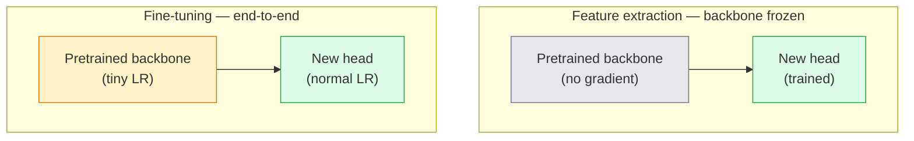

# Transfer Learning & Fine-Tuning  Migration apprendre avec des modifications

> Quelqu'un d'autre a passé un million d'heures de GPU à enseigner à un réseau à quoi ressemblent les bords, les textures et les pièces d'objet.

> **【中文解读】**别人花了一百万GPU 小时教会网络识别边缘、纹理和物件部件──你应该在训练自己的模型之前先借这些特征──迁移学习是AI 工程中最实用的技术预训骨干 +自定义分类头 = 几行代码就能解决新任务──

> **【拓展：迁移学习在工业界的应用】**La plupart des systèmes de production utilisent des images médicales, mais la mise à jour ne prend que quelques minutes.

**Type:** Build | **类型:** 动手
**Languages:** Python | **语言:** Python
**Prerequisites:** Phase 4 Lesson 03 (CNNs), Phase 4 Lesson 04 (Image Classification) | **前置知识:** Phase 4 Lesson 03（CNN），Phase 4 Lesson 04（图像分类）
**Time:** ~75 minutes | **时间:** ~75 分钟

## Objectifs d'apprentissage

- Distinguer l'extraction de fonctionnalités de l'ajustement fin et choisir la bonne en fonction de la taille du jeu de données, la distance de domaine et le budget de calcul
- Charger une colonne vertébrale prétrainée, remplacer sa tête de classifiant et entraîner uniquement la tête vers une ligne de base de travail en moins de 20 lignes
- Défriger progressivement les couches avec des taux d'apprentissage discriminatoires afin que les caractéristiques génériques précoces obtiennent des mises à jour plus petites que celles spécifiques à des tâches tardives
- Diagnostication des trois défaillances courantes: dérive des caractéristiques de LR trop élevé sur les blocs non gelés, effondrement des statistiques BN sur les petits ensembles de données et oubli catastrophique

> **【中文解读】**Les objectifs de l'apprentissage sont énumérés dans la liste des compétences fondamentales que l'on devrait acquérir après avoir terminé la classe.


## Le problème , l' introduction du problème

La formation d'un ResNet-50 sur ImageNet coûte environ 2 000 heures de GPU. Très peu d'équipes ont ce budget pour chaque tâche qu'elles envoient. Ce que presque toutes les équipes envoient en fait est une colonne vertébrale prétrainée avec une nouvelle tête formée sur quelques centaines ou quelques milliers d'images spécifiques à la tâche.

> En effet, la formation de ResNet-50 nécessite environ 2000 GPU. Peu d'équipes ont un budget pour chaque mission de livraison consacré à autant. Presque toutes les équipes livrent réellement un réseau de base de formation préalable, ainsi qu'un nouveau chapitre de formation sur plusieurs centaines ou plusieurs milliers de tâches spécifiques à l'image.

> **【中文解读】**De zéro entraînement ResNet-50 nécessite ~ 2000 GPU, mais le déménagement ne prend que quelques minutes.

Ce n'est pas un raccourci. Le premier bloc de convection de toute CNN formée par ImageNet apprend les bords et les filtres similaires à Gabor. Les prochains blocs apprennent des textures et des motifs simples. Les blocs du milieu apprennent les parties de l'objet. Les derniers blocs apprennent des combinaisons qui commencent à ressembler aux 1000 catégories d'ImageNet. Les 90% de cette hiérarchie sont transférés presque inchangés à l'imagerie médicale, à l'inspection industrielle, aux données satellites et à toutes les autres tâches de vision  parce que la nature a un vocabulaire limité de bords et de textures. Les 10% restants sont ce que vous entraînez.

> Ce n'est pas un raccourci. Toutes les premières séries de l'équipe de CNN sur ImageNet sont en train de se former sur les images et les classes Gabor 波器. Les prochains blocs d'apprentissage sont les éléments de texture et de structure simples. Les derniers blocs d'apprentissage ressemblent à 1000 composants de catégories ImageNet. Les 90% de cette structure de la première classe sont presque inchangés et se déplacent vers l'imagerie médicale, l'analyse industrielle, les données satellites et toutes les autres tâches visuelles.

Pour obtenir le transfert correct, vous avez trois erreurs: détruire des fonctionnalités prétrainées avec un taux d'apprentissage trop élevé, affamer le modèle d'information en congelant trop, et laisser les statistiques en cours de fonctionnement de BatchNorm dériver vers un ensemble de données minuscules dont le reste du réseau n'a jamais appris. Cette leçon marche à chaque d'entre eux délibérément.

> Il y a trois erreurs dans l'apprentissage de l'apprentissage de la migration: le taux d'apprentissage excessif détruit les caractéristiques de l'apprentissage préalable, le fait que trop de données entraînent une pénurie d'informations de modèle, et que la statistique de fonctionnement de BatchNorm dérive vers un réseau où le reste du réseau est un petit ensemble de données jamais appris.

> **【中文解读】**Les trois cratères les plus fréquents de l'apprentissage de migration: 1) le taux d'apprentissage trop élevé a ruiné les caractéristiques de l'entraînement préalable; 2) le fait que trop de niveaux ont conduit au manque de modèles; 3) la statistique de BatchNorm se déplace sur un petit ensemble de données.

## Le concept de base.

> **【中文解读】**Le présent article présente les concepts et les bases théoriques de base. La connaissance de ces concepts est la prémisse de la réalisation de la réalisation de la réalisation, mais aussi le point de connaissance de l'interview et de la pratique de l'ingénierie.


### Extrusion des caractéristiques par rapport à l'ajustement fin

Deux régimes, choisis en fonction de la confiance que vous avez dans les fonctionnalités prétrainées et de la quantité de données que vous avez.

> ∆ Deux types de programmes, dépendant de la confiance que vous avez en vous et de la quantité de données que vous avez.



Règles générales:

> 经验法则:

| Dataset size / 数据量 | Domain distance / 领域距离 | Recipe / 方案 |
|--------------|-----------------|--------|
| < 1k images | close to ImageNet / 接近 ImageNet | Freeze backbone, train head only / 冻结骨干，只训头部 |
| 1k-10k | close / 接近 | Freeze first 2-3 stages, fine-tune the rest / 冻结前2-3阶段，微调其余 |
| 10k-100k | any / 任意 | Fine-tune end-to-end with discriminative LR / 用判别性学习率端到端微调 |
| 100k+ | far / 远 | Fine-tune everything; consider training from scratch if domain is far enough / 全量微调；领域足够远则考虑从头训练 |

"Closer à ImageNet" signifie à peu près des photos RGB naturelles avec un contenu semblable à un objet.

> "Proximité à l'imageNet" signifie en gros une image RGB naturelle contenant des objets.

> **【拓展：迁移学习策略选择】**Dans la pratique industrielle, la taille et la distance des données ont déterminé la stratégie de migration: < 1k de la taille et de la taille des images sont en train de se rapprocher de la taille des images; 10k de la taille et de la taille des images médicales, des images satellites, etc. Dans les domaines éloignés, il faut déchiffrer plus de couches.

### Pourquoi le gel fonctionne-t-il ?

L'imageNet présente une CNN apprend ne sont pas spécialisés dans les 1000 catégories. Ils sont spécialisés dans les statistiques des images naturelles: bordures à des orientations spécifiques, textures, contrastes, formes primitives. Ces statistiques sont stables dans presque tous les domaines visuels qu'un humain peut nommer. C'est pourquoi un modèle formé sur ImageNet et évalué à zéro tir sur CIFAR-10 avec seulement une nouvelle tête linéaire (pas de réglage fin de la colonne vertébrale) atteint une précision de 80%+. La tête apprend quelles caractéristiques déjà apprises sont nécessaires pour cette tâche.

> Les caractéristiques d'ImageNet apprises par CNN ne sont pas uniquement utilisées pour 1000 catégories. Elles sont uniquement utilisées pour les caractéristiques statistiques des images naturelles: bordures, textures, modèles de comparaison, formes et bases de données. Ces caractéristiques statistiques sont stables dans presque tous les domaines visuels humains. C'est pourquoi un modèle formé sur ImageNet, avec seulement un nouveau titre linéaire (réseau de base non réglé) peut atteindre 80% + de précision dans l'évaluation des échantillons CIFAR-10.

### Taux d'apprentissage discriminatoire

Lorsque vous défrichez, les premières couches devraient s'entraîner plus lentement que les dernières couches.

> Lorsque vous déterminez, les niveaux précoces devraient être plus lents que les niveaux tardifs.

```
Typical recipe:

  stage 0 (stem + first group): lr = base_lr / 100    (mostly fixed)
  stage 1:                       lr = base_lr / 10
  stage 2:                       lr = base_lr / 3
  stage 3 (last backbone group): lr = base_lr
  head:                          lr = base_lr  (or slightly higher)
```

Dans PyTorch, il s'agit simplement d'une liste de groupes de paramètres transmis à l'optimisateur.

> Dans PyTorch, il s'agit simplement de transmettre à l'optimisateur une liste de paramètres.

### Le problème de la norme de série

Les couches BN tiennent`running_mean`et `running_var`Si votre tâche a une distribution de pixels différente  un éclairage différent, un capteur différent, un espace de couleur différent  ces tampons sont erronés.

> BN 层持在ImageNet 上计算的 `running_mean`et `running_var`Si votre tâche a une distribution de pixels différente, des éclairages différents, des capteurs différents, des espaces de couleurs différents, les zones de bousculage sont fausses, il y a trois options en ordre de priorité:

1. **Fine-tune with BN in train mode.**Laissez BN mettre à jour ses statistiques de fonctionnement avec tout le reste.
2. **Freeze BN in eval mode.**Gardez les statistiques de l'ImageNet et ne faites que les poids.
3. **Replace BN with GroupNorm.**Il élimine complètement le problème de la moyenne mobile. Utilisé dans les dossiers de détection et de segmentation où la taille du lot par GPU est minuscule.

Faire ça en silence réduit la précision de 5 à 15%.

> 弄错这个会静默地降低 5-15% de la précision du taux.

### Conception de la tête

La tête de classification est de 1 à 3 couches linéaires plus une dérapagement optionnel.

> Chaque tête de type est de 1 à 3 couches de type ligne et une décomposition optionnelle.

```
backbone.fc = nn.Linear(backbone.fc.in_features, num_classes)          # ResNet
backbone.classifier[1] = nn.Linear(..., num_classes)                    # EfficientNet, MobileNet
backbone.heads.head = nn.Linear(..., num_classes)                       # torchvision ViT
```

Pour les petits ensembles de données, une seule couche linéaire est généralement suffisante.

> Pour les petits ensembles de données, un seul niveau de ligne est généralement suffisant. Lorsque la différence de distribution des tâches avec la distribution de formation du réseau de base est plus grande, l'ajout de couches cachées (Linear -> ReLU -> Dropout -> Linear) sera utile.

### L'éclatement de la LR par couche

Une version plus lisse de LR discriminatoire utilisée dans les réglages modernes (BEiT, DINOv2, ViT-B). Au lieu de regrouper les couches en étapes, donnez à chaque couche une LR légèrement plus petite que celle qui est au-dessus:

> 现代微调 (BET, DINOv2, ViT-B 微调) est une version plus simple du taux d'apprentissage de la différence utilisée dans le monde moderne.

```
lr_layer_k = base_lr * decay^(L - k)
```

Avec des blocs de transformateurs de décomposition = 0,75 et L = 12, les premiers blocs de trains à`0.75^11 ≈ 0.04x`Il est plus important pour les transformateurs de musique fine que pour les CNN, où les LR regroupés en scène sont généralement suffisants.

> Lorsque la décomposition = 0,75 et L = 12 blocs de transformateur, le premier bloc a un taux d'apprentissage de la tête.`0.75^11 ≈ 0.04x` formation  à la transformation  à la CNN  plus important encore, le taux d'apprentissage de la section de la CNN en milieu de phase est généralement suffisant

### Ce qu'il faut évaluer

Les courses de transfert-apprentissage ont besoin de deux nombres que vous ne suivriez pas sur une course de grattage:

- **Pretrained-only accuracy**La tête est précise, la colonne vertébrale est gelée.
- **Fine-tuned accuracy**Le même modèle après une formation complète.

Si le niveau d'apprentissage est inférieur à celui de la formation préalable, vous avez un taux d'apprentissage ou un bug BN.

> **【中文解读】**Cette méthode "de zéro" peut aider à comprendre le principe derrière le cadre, en cas de problème, ne sera pas bloqué dans une boîte noire.

> **【拓展：工业部署中的视觉系统】**Dans le cadre de la déploiement industriel réel, les modèles visuels doivent prendre en compte la réflexion sur la différence de taille des modèles, l'adaptation des appareils de bord, etc. TensorRT, ONNX Runtime, OpenVINO sont des outils d'accélération de réflexion courants. Les systèmes de conduite autonome (comme Tesla FSD) utilisent généralement plusieurs modèles visuels en temps réel sur les puces de véhicule.


## Construisez-le et mettez-le en œuvre.
```figure
transfer-learning
```

## Faites-le

### Étape 1: Charger une colonne vertébrale prétrainée et l'inspecter

```python
import torch
import torch.nn as nn
from torchvision.models import resnet18, ResNet18_Weights

backbone = resnet18(weights=ResNet18_Weights.IMAGENET1K_V1)
print(backbone)
print()
print("classifier head:", backbone.fc)
print("feature dim:", backbone.fc.in_features)
```

`ResNet18`a quatre étapes (`layer1..layer4`) plus une tige et une `fc`Chaque colonne vertébrale de la classification de la vision de la torche a une structure analogue.

### Étape 2: Extraction de la fonctionnalité  geler tout, remplacer la tête

```python
def make_feature_extractor(num_classes=10):
    model = resnet18(weights=ResNet18_Weights.IMAGENET1K_V1)
    for p in model.parameters():
        p.requires_grad = False
    model.fc = nn.Linear(model.fc.in_features, num_classes)
    return model

model = make_feature_extractor(num_classes=10)
trainable = sum(p.numel() for p in model.parameters() if p.requires_grad)
frozen = sum(p.numel() for p in model.parameters() if not p.requires_grad)
print(f"trainable: {trainable:>10,}")
print(f"frozen:    {frozen:>10,}")
```

- Je ne sais pas .`model.fc`L'épine dorsale est un extracteur de caractéristiques gelées.

### Étape 3: ajustement de la discrimination

Une application qui construit des groupes de paramètres avec des taux d'apprentissage spécifiques à l'étape.

```python
def discriminative_param_groups(model, base_lr=1e-3, decay=0.3):
    stages = [
        ["conv1", "bn1"],
        ["layer1"],
        ["layer2"],
        ["layer3"],
        ["layer4"],
        ["fc"],
    ]
    groups = []
    for i, names in enumerate(stages):
        lr = base_lr * (decay ** (len(stages) - 1 - i))
        params = [p for n, p in model.named_parameters()
                  if any(n.startswith(k) for k in names)]
        if params:
            groups.append({"params": params, "lr": lr, "name": "_".join(names)})
    return groups

model = resnet18(weights=ResNet18_Weights.IMAGENET1K_V1)
model.fc = nn.Linear(model.fc.in_features, 10)
for p in model.parameters():
    p.requires_grad = True

groups = discriminative_param_groups(model)
for g in groups:
    print(f"{g['name']:>10s}  lr={g['lr']:.2e}  params={sum(p.numel() for p in g['params']):>8,}")
```

`decay=0.3`Les trains à chaque étape sont chargés de 30% du rythme de la prochaine. `fc`Il est en train de se faire`base_lr`- Je suis là .`layer4`Il est en train de se faire`0.3 * base_lr`- Je suis là .`conv1`Il est en train de se faire`0.3^5 * base_lr ≈ 0.00243 * base_lr`- Son extrême, empirieusement, ça marche.

### Étape 4: Traitement de lotNorm

Aide à geler les statistiques de BN sans geler ses poids.

```python
def freeze_bn_stats(model):
    for m in model.modules():
        if isinstance(m, (nn.BatchNorm1d, nn.BatchNorm2d, nn.BatchNorm3d)):
            m.eval()
            for p in m.parameters():
                p.requires_grad = False
    return model
```

Appelle-le après avoir posé .`model.train()`Au début de chaque époque.`model.train()`Le système de formation est en mode de reversation, ce qui ne le fait que pour les couches BN.

### Étape 5: Une boucle de réglage fin de bout en bout minimale

```python
from torch.optim import SGD
from torch.utils.data import DataLoader
from torch.optim.lr_scheduler import CosineAnnealingLR
import torch.nn.functional as F

def fine_tune(model, train_loader, val_loader, device, epochs=5, base_lr=1e-3, freeze_bn=False):
    model = model.to(device)
    groups = discriminative_param_groups(model, base_lr=base_lr)
    optimizer = SGD(groups, momentum=0.9, weight_decay=1e-4, nesterov=True)
    scheduler = CosineAnnealingLR(optimizer, T_max=epochs)

    for epoch in range(epochs):
        model.train()
        if freeze_bn:
            freeze_bn_stats(model)
        tr_loss, tr_correct, tr_total = 0.0, 0, 0
        for x, y in train_loader:
            x, y = x.to(device), y.to(device)
            logits = model(x)
            loss = F.cross_entropy(logits, y, label_smoothing=0.1)
            optimizer.zero_grad()
            loss.backward()
            optimizer.step()
            tr_loss += loss.item() * x.size(0)
            tr_total += x.size(0)
            tr_correct += (logits.argmax(-1) == y).sum().item()
        scheduler.step()

        model.eval()
        va_total, va_correct = 0, 0
        with torch.no_grad():
            for x, y in val_loader:
                x, y = x.to(device), y.to(device)
                pred = model(x).argmax(-1)
                va_total += x.size(0)
                va_correct += (pred == y).sum().item()
        print(f"epoch {epoch}  train {tr_loss/tr_total:.3f}/{tr_correct/tr_total:.3f}  "
              f"val {va_correct/va_total:.3f}")
    return model
```

Cinq époques avec la recette ci-dessus sur CIFAR-10 prend `ResNet18-IMAGENET1K_V1`La tête seule se platerait à 86% sans jamais toucher la colonne vertébrale.

### Étape 6: Défrilage progressif

Un calendrier qui défriche une étape par époque de la fin au début.

```python
def progressive_unfreeze_schedule(model):
    stages = ["layer4", "layer3", "layer2", "layer1"]
    yielded = set()

    def start():
        for p in model.parameters():
            p.requires_grad = False
        for p in model.fc.parameters():
            p.requires_grad = True

    def unfreeze(epoch):
        if epoch < len(stages):
            name = stages[epoch]
            yielded.add(name)
            for n, p in model.named_parameters():
                if n.startswith(name):
                    p.requires_grad = True
            return name
        return None

    return start, unfreeze
```

Appel`start()`Une fois avant la première époque.`unfreeze(epoch)`Réinitialisez l'optimisateur chaque fois que l'ensemble des paramètres entraînables change, sinon les paramètres congelés conservent toujours des moments cachés qui le confondent.


## Utilisez-le avec le cadre de réalisation

> **【中文解读】**Dans ce chapitre, nous allons montrer comment utiliser un cadre mature (comme PyTorch, HuggingFace, etc.) pour appliquer rapidement cette technique.


Pour la plupart des tâches réelles,`torchvision.models`Le matériel le plus lourd au-dessus compte quand on rencontre des problèmes que les défauts de bibliothèque ne peuvent pas résoudre.

```python
from torchvision.models import resnet50, ResNet50_Weights

model = resnet50(weights=ResNet50_Weights.IMAGENET1K_V2)
model.fc = nn.Linear(model.fc.in_features, num_classes)
optimizer = torch.optim.AdamW(model.parameters(), lr=1e-4, weight_decay=1e-4)
```

Deux autres défauts de production:

- `timm`Les navires ont environ 800 os de vision prétrainés avec une API cohérente (`timm.create_model("resnet50", pretrained=True, num_classes=10)`Pour toute harmonie fine au-delà du zoo, c'est la norme.
- Pour les transformateurs, `transformers.AutoModelForImageClassification.from_pretrained(name, num_labels=N)`vous donne ViT / BEiT / DeiT avec la même sémantique de chargement que les modèles de texte.

> **【中文解读】**Cette section se concentre sur la façon de déployer le modèle en tant que produit disponible. De l'original au système de production, il faut considérer plusieurs dimensions de l'optimisation des performances, du traitement des erreurs, du contrôle, etc.


> **【拓展：数据标注与质量】**L'efficacité des tâches visuelles dépend fortement de la qualité des données de marquage. Le Studio de marquage, CVAT, est l'outil de marquage principal. Dans le monde industriel, l'apprentissage actif peut réduire le coût de marquage.

## Envoyez-le . Produit .

Cette leçon donne:

- `outputs/prompt-fine-tune-planner.md` une requête qui choisit l'extraction de fonctionnalités par rapport à l'ajustement progressif par rapport à l'ajustement fin de bout en bout en fonction de la taille du jeu de données, de la distance de domaine et du budget de calcul.
- `outputs/skill-freeze-inspector.md` une compétence qui, compte tenu d'un modèle PyTorch, rapporte quels paramètres sont entraînables, quelles couches BatchNorm sont en mode d'évaluation et si l'optimisateur est réellement alimenté par les paramètres entraînables.

> **【中文解读】** Exercices de base selon Easy/Medium/Hard 三个难度递进──建议至少完成  级别的题目,  级别适合深入研究或面试准备──


## Les exercices

1. **(Easy | 简单)**- Le train a`ResNet18`En tant que sonde linéaire (rétrécissement de la colonne vertébrale) et en tant que réglage complet sur le même ensemble de données CIFAR synthétique.
   Résumé: Le résultat de la mise en œuvre de la résolution de la résolution de la résolution de la résolution de la résolution de la résolution de la résolution de la résolution de la résolution de la résolution de la résolution de la résolution de la résolution de la résolution de la résolution de la résolution de la résolution de la résolution de la résolution de la résolution de la résolution de la résolution de la résolution de la résolution de la résolution de la résolution de la résolution de la résolution de la résolution de la résolution de la résolution de la résolution de la résolution de la résolution de la résolution de la résolution de la résolution de la résolution de la résolution de résolution de résolution de résolution de résolution de résolution de résolution de résolution de résolution de résolution de résolution de résolution de résolution de résolution de résolution de résolution de résolution de résolution de résolution de résolution de résolution de résolution de résolution de résolution de résolution de résolution de résolution de résolution de résolution de résolution de résolution de résolution de résolution de résolution de résolution de résolution de résolution de résolution de résolution de résolution de résolution de résolution de résolution de résolution de résolution de résolution de résolution de résolution de résolution de résolution de résolution de résolution de résolution de résolution de résolution de résolution de résolution de résolution de résolution de résolution de résolution de résolution de résolution de résolution de résolution de résolution de résolution de résolution de résolution de résolution de résolution de résolution de résolution de résolution de résolution de résolution de résolution de résolution de résolution de résolution de résolution de résolution de résolution de résolution de résolution de résolution de résolution de résolution de résolution de résolution de résolution de résolution de résolution de résolution de résolution de résolution de résolution de résolution de résolution de résolution de résolution de résolution de résolution de résolution de résolution de résolution de résolution de résolution de résolution de résolution de résolution de résolution de résolution de résolution de résolution

2. **(Medium | 中等)**Introduire un bug à dessein: set `base_lr = 1e-1`La première étape consiste à faire une projection de la perte d'entraînement en explose, puis à récupérer en appliquant la`discriminative_param_groups`enregistrer la LR à laquelle chaque étape commence à diverger.
                   `base_lr = 1e-1` Fabrication de bug, observation de la perte de formation explosion, puis récupération avec le taux de formation de jugement 

3. **(Hard | 困难)**Prenez un ensemble de données d'imagerie médicale (par exemple CheXpert-small, PatchCamelyon ou HAM10000) et comparez trois régimes: a) L'épine dorsale gelée + tête linéaire prétrainée par ImageNet; b) L'entraînement fin fin fin finé de l'extrémité à l'extrémité; c) l'entraînement à gratter. Rapportez la précision et le coût de calcul pour chacun.
   Les données de base de données utilisées dans les images médicales sont utilisées pour les analyses de données de base de données.

## Les termes clés

| Term | What people say | What it actually means | 中文释义 |
|------|----------------|----------------------|---------|
| Feature extraction | "Freeze and train head" | Backbone parameters frozen, only the new classifier head receives gradient | 特征提取：冻结骨干参数，只训练新的分类头 |
| Fine-tuning | "Retrain end-to-end" | All parameters trainable, usually with much smaller LR than scratch training | 微调：所有参数可训练，学习率远小于从零训练 |
| Discriminative LR | "Smaller LR for early layers" | Optimizer parameter groups where early-stage LR is a fraction of late-stage LR | 判别式学习率：早期层用更小的学习率 |
| Layer-wise LR decay | "Smooth LR gradient" | Per-layer LR multiplied by decay^(L - k); common in transformer fine-tunes | 逐层学习率衰减：每层 LR 乘以衰减系数 |
| Catastrophic forgetting | "The model lost ImageNet" | A too-high LR overwrites pretrained features before the new task signal is learnt | 灾难性遗忘：学习率过高导致预训练特征被覆盖 |
| BN statistics drift | "Running mean is wrong" | BatchNorm running_mean/var computed on a different distribution than the current task, silently hurting accuracy | BN 统计漂移：BatchNorm 的统计量与当前任务分布不匹配 |
| Linear probe | "Frozen backbone + linear head" | Evaluation of pretrained features — accuracy of the best linear classifier on top of the frozen representation | 线性探针：冻结骨干上训练线性分类器，评估预训练特征质量 |
| Catastrophic collapse | "Everything predicts one class" | Happens when fine-tuning with an LR high enough to destroy features before gradients from the head can stabilise | 灾难性崩塌：模型只预测一个类别 |

> **【中文解读】**延伸阅读 fournit des ressources de haute qualité pour l'apprentissage en profondeur. Ces articles et cours sont des références classiques dans ce domaine, adaptés aux lecteurs qui ont besoin d'une compréhension approfondie.


## Encore une lecture

- [How transferable are features in deep neural networks? (Yosinski et al., 2014)](https://arxiv.org/abs/1411.1792) le papier qui a quantifié la transférabilité des caractéristiques entre couches
- [Universal Language Model Fine-tuning (ULMFiT, Howard & Ruder, 2018)](https://arxiv.org/abs/1801.06146) la recette de défrichage discriminatoire LR / progressive originale; les idées se transforment directement dans la vision
- [timm documentation](https://huggingface.co/docs/timm) la référence pour les récepteurs de vision modernes et les défauts précis de réglage fin avec lesquels ils ont été formés
- [A Simple Framework for Linear-Probe Evaluation (Kornblith et al., 2019)](https://arxiv.org/abs/1805.08974) pourquoi la précision de la sonde linéaire est importante et comment la signaler correctement
