# Détection d' objets YOLO depuis le début                                                                                                                                                                                                                                                                                                                                                                                                                                                                                                                  

> La détection est la classification plus la régression, exécutée à chaque position dans une carte de caractéristiques, puis nettoyée avec suppression non maximale.

> **【中文解读】**目標检测 = 分类 + 回归, fonctionne à chaque position du graphique de caractéristiques, puis utilise la non-trême valeur de retenue (NMS) pour nettoyer le re-check box (YOLO)

> **【拓展：YOLO 在自动驾驶中的应用】**YOLO est l'algorithme de test d'objectif en temps réel le plus utilisé dans la conduite autonome, capable de tester simultanément les passagers, les véhicules, les signaux de circulation, etc. De YOLOv1 à YOLOv8, la vitesse et la précision augmentent constamment, est l'un des cadres de test les plus populaires de l'industrie.

**Type:** Build | **类型:** 动手
**Languages:** Python | **语言:** Python
**Prerequisites:** Phase 4 Lesson 03 (CNNs), Phase 4 Lesson 04 (Image Classification), Phase 4 Lesson 05 (Transfer Learning) | **前置知识:** Phase 4 Lesson 03（CNN），Phase 4 Lesson 04（图像分类），Phase 4 Lesson 05（迁移学习）
**Time:** ~75 minutes | **时间:** ~75 分钟

## Objectifs d'apprentissage

- Expliquez la conception de la grille et de l'ancre qui transforme la détection en un problème de prédiction dense et indiquez ce que chaque nombre dans le tensor de sortie signifie
- Comptez l'intersection entre les boîtes et mettez en œuvre la suppression non maximale à partir de zéro
- Construire une tête de style YOLO minimal sur une colonne vertébrale prétrainée, y compris la classification, l'objets et les pertes de régression de boîte
- Lisez une rangée de mesures de détection (precision@0.5, rappel, mAP@0.5, mAP@0.5:0.95) et choisissez le bouton à tourner ensuite

> **【中文解读】**Les objectifs de l'apprentissage sont énumérés dans la liste des compétences fondamentales que l'on devrait acquérir après avoir terminé la classe.


## Le problème , l' introduction du problème

La classification dit "cette image est un chien". La détection dit "il y a un chien à des pixels (112, 40, 280, 210), il y a un chat à (400, 180, 560, 310), et rien d'autre dans le cadre. " Ce changement structurel  prédisant un nombre variable de boîtes étiquetées au lieu d'une étiquette par image  est ce que tous les systèmes autonomes, chaque produit de surveillance, chaque analyseur de la mise en page de documents et chaque ligne de vision d'usine dépendent.

> C'est un changement structurel  prédire un nombre variable de cartouches de marque et non pas chaque image d'un marque  est dépendant de chaque système de conduite autonome  chaque produit de surveillance  chaque résolveur de surface et chaque ligne de production visuelle de l'usine 

> **【中文解读】**C'est une modification structurelle de la prédiction d'un étiquette à la prédiction d'un nombre indéterminé de cartouches avec un cadre de contrôle de la conduite autonome, de la sécurité, de l'analyse de la surface et de la qualité des usines.

La détection est aussi l'endroit où chaque compromis technique dans la vision apparaît à la fois. Vous voulez des boîtes précises (tête de régression), vous voulez la bonne classe pour chaque boîte (tête de classification), vous voulez que le modèle sache quand il n'y a rien à détecter (score d'objets), et vous voulez exactement une prédiction par objet réel (suppression non maximale). Si vous manquez l'un de ces objets, le pipeline ouvre les yeux, rapporte des boîtes hallucinées ou prédit le même objet quinze fois dans des positions légèrement différentes.

> 检测也是视觉中所有的工程权衡同时出现的地方──你要框准确(回归头),你要每个框的类别正确(分类头),你要模型知道哪里没有什么要检测(目标性分数),你要每个真实物体恰好一个预测(非极大值抑制)──缺少任何一个,流水线要么漏检测物体,要么报告幻觉框,要么把同一物体在略微不同的位置预测十五次──

YOLO (You Only Look Once, Redmon et al. 2016) est la conception qui a fait tout cela en temps réel en le faisant avec un seul passage vers l'avant d'un réseau de convection, et les mêmes décisions structurelles sont toujours l'épine dorsale des détecteurs modernes (YOLOv8, YOLOv9, YOLO-NAS, RT-DETR).

> YOLO(You Only Look Once, Redmon et autres 2016) est un design de toutes ces opérations en cours de réalisation, le même processus de décision est toujours le test moderne de YOLOv8、YOLOv9、YOLO-NAS、RT-DETR.

> **【中文解读】**L'analyse est le point de référence de tous les aspects du projet dans la vision: cadre à préciser, catégorie à préciser, catégorie à vérifier, catégorie à vérifier, catégorie à vérifier, catégorie à vérifier, catégorie à vérifier, catégorie à vérifier, catégorie à vérifier, catégorie à vérifier, catégorie à vérifier, catégorie à vérifier, catégorie à vérifier, catégorie à vérifier, catégorie à vérifier, catégorie à vérifier, catégorie à vérifier, catégorie à vérifier, catégorie à vérifier, catégorie à vérifier, catégorie à vérifier, catégorie à vérifier, catégorie à vérifier, catégorie à vérifier, catégorie à vérifier, catégorie à vérifier, catégorie à vérifier, catégorie à vérifier, catégorie à vérifier, catégorie à vérifier, catégorie à vérifier, catégorie à vérifier, catégorie à vérifier, catégorie à vérifier, catégorie à vérifier, catégorie à vérifier, catégorie à vérifier, catégorie à vérifier, catégorie à vérifier, catégorie à vérifier, catégorie à vérifier, catégorie à vérifier, catégorie à vérifier, catégorie à vérifier, catégorie à vérifier, catégorie à vérifier, catégorie à vérifier, catégorie à vérifier, catégorie, à vérifier, à vérifier, à vérifier, à vérifier, à vérifier, à vérifier, à vérifier, à vérifier, à vérifier, à vérifier, à vérifier, à vérifier, à vérifier, à vérifier, à vérifier, à vérifier, à vérifier, à vérifier, à vérifier, à vérifier, à vérifier, à vérifier, à vérifier, à vérifier, à vérifier, à vérifier, à vérifier, à vérifier, à vérifier, à la fois, à la fois, à la fois, à la fois.

## Le concept de base.

> **【中文解读】**Le présent article présente les concepts et les bases théoriques de base. La connaissance de ces concepts est la prémisse de la réalisation de la réalisation de la réalisation, mais aussi le point de connaissance de l'interview et de la pratique de l'ingénierie.


### Détection comme prédiction dense

Un classifiateur donne des numéros C par image.`(S x S x (5 + C))`les nombres par image, où S est la taille de la grille spatiale.

> C 个数字――YOLO 风格的检测器 每张图像输出 `(S x S x (5 + C))`个数字, dont S est un réseau spatial de taille.

```mermaid
flowchart LR
    IMG["Input 416x416 RGB"] --> BB["Backbone<br/>(ResNet, DarkNet, ...)"]
    BB --> FM["Feature map<br/>(C_feat, 13, 13)"]
    FM --> HEAD["Detection head<br/>(1x1 convs)"]
    HEAD --> OUT["Output tensor<br/>(13, 13, B * (5 + C))"]
    OUT --> DEC["Decode<br/>(grid + sigmoid + exp)"]
    DEC --> NMS["Non-max suppression"]
    NMS --> RESULT["Final boxes"]

    style IMG fill:#dbeafe,stroke:#2563eb
    style HEAD fill:#fef3c7,stroke:#d97706
    style NMS fill:#fecaca,stroke:#dc2626
    style RESULT fill:#dcfce7,stroke:#16a34a
```



Chacun des `S * S`Les cellules de grille prédisent `B`Pour chaque boîte:

> Chaque .`S * S`网格单元预测 `B`Pour chaque boîte:

- 4 chiffres décrivent la géométrie: `tx, ty, tw, th`- Je suis désolé .
  Le nombre de personnes qui ont été tuées est de 4 à 5 ans.`tx, ty, tw, th`(centre de déplacement et largeur de taille)
- Le nombre 1 est le score d'objets: "y a-t-il un objet centré dans cette cellule?"
  Le nombre de chiffres est objectif: " Le centre de cette unité a-t-il un objet ? "
- Les nombres C sont des probabilités de classe.
  Le nombre de personnes qui ont été décédées est le nombre de personnes décédées.

Total par cellule: `B * (5 + C)`. pour le VOC avec `S=13, B=2, C=20`, c'est 50 chiffres par cellule.

> Pour chaque unité totale:`B * (5 + C)` Pour les données relatives aux COV,`S=13, B=2, C=20`, c'est-à-dire chaque unité de 50 chiffres.

### Pourquoi les grilles et les ancres

Une régression simple prédirait`(x, y, w, h)`Pour chaque objet comme une coordonnée absolue. C'est difficile pour un réseau conv parce que la traduction de l'image ne devrait pas traduire toutes les prédictions par le même montant  chaque objet est ancré spatialement. La grille répond à cela en attribuant chaque boîte de vérité de base à la cellule de grille dans laquelle son centre tombe; seule cette cellule est responsable de cet objet.

> Je reviendrai à chaque objet.`(x, y, w, h)` comme un parfait coordonné pour prévoir. C'est difficile pour le réseau de volumes, car l'image plane ne devrait pas mettre toutes les prévisions de tous les déplacements plane de la même quantité chaque objet dans l'espace est indépendant. Pour résoudre ce problème, chaque cadre réel est attribué à chaque unité réseau située au centre de celle-ci; seule cette unité est responsable de cet objet.

Les ancres résolvent un deuxième problème. Un convecteur 3x3 ne peut pas facilement régresser une boîte de 500 pixels de large à partir d'une cellule de champ réceptif de 16 pixels.`B`Les modèles de l'ancrage apprennent à choisir la bonne ancrage et à la pousser plutôt que de régresser de nulle part.

> quadro résolve un deuxième problème──3x3 卷积很难从16 像素感受野的特征单元归归归500 像素宽的框──因此我们为每个单元预定义 `B`个先验框形状(框),并预测 relativement à chaque 框的小偏移量──模型学习选择正确的框并微调,而不是从零回归──

```
Anchor box priors (example for 416x416 input):

  small:   (30,  60)
  medium:  (75,  170)
  large:   (200, 380)

At each grid cell, every anchor emits (tx, ty, tw, th, obj, c_1, ..., c_C).
```

Les détecteurs modernes utilisent souvent des FPN avec différents ensembles d'ancrage par résolution  petites ancrages sur des cartes à haute résolution peu profondes, grandes ancrages sur des cartes à haute résolution profonde.

> Les testeurs modernes utilisent généralement FPN (en anglais seulement) et utilisent différents cadres à différentes résolutions.

### Prédictions de décoding

Le brut`tx, ty, tw, th`ne sont pas des coordonnées de boîte; elles sont des cibles de régression à transformer avant la traçage:

>  Originaires`tx, ty, tw, th`Ce ne sont pas des cadres; ils sont des cadres qui doivent être transformés en des cadres.

```
centre x  = (sigmoid(tx) + cell_x) * stride
centre y  = (sigmoid(ty) + cell_y) * stride
width     = anchor_w * exp(tw)
height    = anchor_h * exp(th)
```

`sigmoid`conserve les détournements de centre à l'intérieur de la cellule. `exp`La largeur de l'ancrage est libre sans détour.`stride`Cette étape de décode est la même dans toutes les versions de YOLO depuis v2.

> `sigmoid`La déviation du centre sera limitée à l'intérieur de l'unité.`exp`让宽度可以从框自由缩放而无需符号翻转.`stride`Le schéma de déchiffrement est le même dans toutes les versions de YOLO.

### Le secteur de l'énergie

La métrique de similitude universelle de détection entre deux boîtes:

> 检测中两个框之间的通用相似度度度度:

```
IoU(A, B) = area(A intersect B) / area(A union B)
```

IoU = 1 signifie identique; IoU = 0 signifie aucun chevauchement. IoU entre la prédiction et la boîte de vérité de base est ce qui décide si une prédiction compte comme un vrai positif (habituellement IoU >= 0,5).

> IoU = 1 indique la même chose; IoU = 0 indique la même chose.

### Suppression non maximale

Un réseau de convection formé sur des ancres adjacentes prédit souvent des boîtes qui se chevauchent pour le même objet.

> Le réseau de volumes entraînés sur des cadres voisins prédit généralement plusieurs cadres superposés sur le même objet. Le NMS conserve la prédiction de la plus haute confiance, et supprime avec cette prédiction IoU                                                                                                                                                                                                                                     

```
NMS(boxes, scores, iou_threshold):
    sort boxes by score descending
    keep = []
    while boxes not empty:
        pick the top-scoring box, add to keep
        remove every box with IoU > iou_threshold to the picked box
    return keep
```

Un seuil typique: 0,45 pour la détection d'objets.`soft-NMS`- Je suis là .`DIoU-NMS`, ou apprendre la suppression directement (RT-DETR) mais le but structurel est le même.

> 典型值: objectif检测用 0.45──最近检测器用 `soft-NMS`- Je suis là.`DIoU-NMS`替代标准 NMS, ou directement apprendre à supprimer la stratégie RT-DETR), mais le but de la structure est le même.

### La perte

La perte de YOLO est trois pertes ajoutées avec les poids:

> YOLO 损失是三个损失函数加权求和:

```
L = lambda_coord * L_box(pred, target, where obj=1)
  + lambda_obj   * L_obj(pred, 1,     where obj=1)
  + lambda_noobj * L_obj(pred, 0,     where obj=0)
  + lambda_cls   * L_cls(pred, target, where obj=1)
```

Seules les cellules qui contiennent un objet contribuent à la régression des boîtes et aux pertes de classification.`lambda_noobj`est généralement petite (~0,5) car la grande majorité des cellules sont vides et domineraient autrement la perte totale.

>  Les unités de contenu de l'objet ne contribuent qu'à la régression et à la classification des pertes  Les unités d'objet non contenues contribuent seulement à la perte cible  Les modèles restent silencieux`lambda_noobj`Normalement très petit (environ 0,5), car la majorité des unités sont vides, sinon elles auront une perte totale dominante.

Les variantes modernes échangent la perte de boîte MSE contre la perte de boîte CIoU / DIoU (qui optimise directement la perte de focale pour le déséquilibre de classe) et équilibrent l'objet avec la perte de focale de qualité.

> 现代变体用 CIoU/DIoU(直接优化 IoU) remplacer MSE 框损失, utiliser la perte de focus 处理类别不平衡, utiliser la perte de focus de qualité平衡目标性──三组件结构不变──

### Mesures de détection

La précision ne passe pas à la détection.

> 准确率 non applicable à l'examen.

- **Precision@IoU=0.5** des prédictions comptées comme positives, combien sont réellement correctes.
  Le mot grec traduit par " le mot grec "**Precision@IoU=0.5** Dans les prévisions de prédiction, il y a beaucoup de choses qui sont vraiment correctes.
- **Recall@IoU=0.5** des vrais objets, combien avons-nous trouvé.
  Le mot grec traduit par " le mot grec "**Recall@IoU=0.5** Dans tous les vrais objets, nous avons trouvé beaucoup.
- **AP@0.5** surface de courbe de recul de précision au seuil de l'UIO 0,5; un nombre par classe.
  Le mot grec traduit par " le mot grec "**AP@0.5** IoU  valeur de 0,5 下的精确率-召回率曲线面积;每个类别一个数――
- **mAP@0.5:0.95** moyenne de l'AP sur les seuils de l'UIO 0,5, 0,55, ..., 0,95.
  Le mot grec traduit par " le mot grec "**mAP@0.5:0.95** AP en IoU value 0,5、0.55、...、0.95  ∞ ∞ ∞ ∞ ∞ ∞ ∞ ∞ ∞ ∞ ∞ ∞ ∞ ∞ ∞ ∞ ∞ ∞ ∞ ∞ ∞ ∞ ∞ ∞ ∞ ∞ ∞ ∞ ∞ ∞ ∞ ∞ ∞ ∞ ∞ ∞ ∞ ∞ ∞ ∞ ∞ ∞ ∞ ∞ ∞ ∞ ∞ ∞ ∞ ∞ ∞ ∞ ∞ ∞ ∞ ∞ ∞ ∞ ∞ ∞ ∞ ∞ ∞ ∞ ∞ ∞ ∞ ∞ ∞ ∞ ∞ ∞ ∞ ∞ ∞ ∞ ∞ ∞ ∞ ∞ ∞ ∞ ∞ ∞ ∞ ∞ ∞ ∞ ∞ ∞ ∞ ∞ ∞ ∞ ∞ ∞ ∞ ∞ ∞ ∞ ∞ ∞ ∞ ∞ ∞ ∞ ∞ ∞ ∞ ∞ ∞ ∞ ∞ ∞ ∞ ∞ ∞ ∞ ∞ ∞ ∞ ∞ ∞ ∞ ∞ ∞ ∞ ∞ ∞ ∞ ∞ ∞ ∞ ∞ ∞ ∞ ∞ ∞ ∞ ∞ ∞ ∞ ∞ ∞ ∞ ∞ ∞ ∞ ∞ ∞ ∞ ∞ ∞ ∞ ∞ ∞ ∞ ∞ ∞ ∞ ∞ ∞ ∞ ∞ ∞ ∞ ∞ ∞ ∞ ∞ ∞ ∞ ∞ ∞ ∞ ∞ ∞ ∞ ∞ ∞ ∞ ∞ ∞ ∞ ∞ ∞ ∞ ∞ ∞ ∞ ∞ ∞ ∞ ∞ ∞ ∞ ∞ ∞ ∞ ∞ ∞ ∞ ∞ ∞ ∞ ∞ ∞ ∞ ∞ ∞ ∞ ∞ ∞ ∞ ∞ ∞ ∞ ∞ ∞ ∞ ∞ ∞ ∞ ∞ ∞ ∞ ∞ ∞ ∞ ∞ ∞ ∞ ∞ ∞ ∞ ∞ ∞ ∞ ∞ ∞ ∞ ∞ ∞ ∞ 

Rapporte les quatre. Un détecteur qui est fort sur mAP@0.5 mais faible sur mAP@0.5:0.95 localise approximativement mais pas étroitement; fixe avec une meilleure perte de régression de boîte. Un détecteur avec une grande précision et un rappel faible est trop conservateur; abaisse le seuil de confiance ou augmente le poids de l'objet.

> 報告全部四指标── un détecteur de haute précision à faible résistance, mais faible à faible résistance, mais non précis à l'aide d'un meilleur cadre, pour réparer les pertes.

> **【拓展：工业部署中的视觉系统】**Dans le cadre de la déploiement industriel réel, les modèles visuels doivent prendre en compte la réflexion sur la différence de taille des modèles, l'adaptation des appareils de bord, etc. TensorRT, ONNX Runtime, OpenVINO sont des outils d'accélération de réflexion courants. Les systèmes de conduite autonome (comme Tesla FSD) utilisent généralement plusieurs modèles visuels en temps réel sur les puces de véhicule.

> **【拓展：数据标注与质量】**L'efficacité des tâches visuelles dépend fortement de la qualité des données de marquage. Le Studio de marquage, CVAT, est l'outil de marquage principal. Dans le monde industriel, l'apprentissage actif peut réduire le coût de marquage.


## Construisez-le et mettez-le en œuvre.

> **【中文解读】**Cette méthode "de zéro" peut aider à comprendre le principe derrière le cadre, en cas de problème, ne sera pas bloqué dans une boîte noire.

```figure
object-detection-nms
```

## Faites-le

### Étape 1:

Le cheval de travail de toute la leçon.`(x1, y1, x2, y2)`le format.

> Les outils de base de ce cours`(x1, y1, x2, y2)`格式的框──

```python
import numpy as np

def box_iou(boxes_a, boxes_b):
    ax1, ay1, ax2, ay2 = boxes_a[:, 0], boxes_a[:, 1], boxes_a[:, 2], boxes_a[:, 3]
    bx1, by1, bx2, by2 = boxes_b[:, 0], boxes_b[:, 1], boxes_b[:, 2], boxes_b[:, 3]

    inter_x1 = np.maximum(ax1[:, None], bx1[None, :])
    inter_y1 = np.maximum(ay1[:, None], by1[None, :])
    inter_x2 = np.minimum(ax2[:, None], bx2[None, :])
    inter_y2 = np.minimum(ay2[:, None], by2[None, :])

    inter_w = np.clip(inter_x2 - inter_x1, 0, None)
    inter_h = np.clip(inter_y2 - inter_y1, 0, None)
    inter = inter_w * inter_h

    area_a = (ax2 - ax1) * (ay2 - ay1)
    area_b = (bx2 - bx1) * (by2 - by1)
    union = area_a[:, None] + area_b[None, :] - inter
    return inter / np.clip(union, 1e-8, None)
```

Retourne une `(N_a, N_b)`Utilisez-le contre une seule boîte de vérité de base en faisant une des matrices de forme`(1, 4)`- Je suis désolé .

> Retour`(N_a, N_b)`De l'ensemble de l'ensemble de l'ensemble de l'ensemble de l'ensemble de l'ensemble de l'ensemble de l'ensemble de l'ensemble de l'ensemble de l'ensemble de l'ensemble de l'ensemble de l'ensemble de l'ensemble de l'ensemble de l'ensemble de l'ensemble de l'ensemble de l'ensemble de l'ensemble de l'ensemble de l'ensemble de l'ensemble de l'ensemble de l'ensemble de l'ensemble de l'ensemble de l'ensemble de l'ensemble de l'ensemble de l'ensemble de l'ensemble de l'ensemble de l'ensemble de l'ensemble de l'ensemble de l'ensemble de l'ensemble de l'ensemble de l'ensemble de l'ensemble.`(1, 4)`形状即可对单个真实框使用──

### Étape 2: Suppression non maximale

```python
def nms(boxes, scores, iou_threshold=0.45):
    order = np.argsort(-scores)
    keep = []
    while len(order) > 0:
        i = order[0]
        keep.append(i)
        if len(order) == 1:
            break
        rest = order[1:]
        ious = box_iou(boxes[[i]], boxes[rest])[0]
        order = rest[ious <= iou_threshold]
    return np.array(keep, dtype=np.int64)
```

Déterministe,`O(N log N)`Il est également possible de faire des observations sur les comportements de la personne.`torchvision.ops.nms`sur des entrées identiques.

> 确定性的,排序复杂度 `O(N log N)`, dans le même entrée sur avec`torchvision.ops.nms`Le comportement est cohérent.

### Étape 3: Codage et décoding de boîte

Convertir entre les coordonnées de pixel et le `(tx, ty, tw, th)`Les cibles que le réseau réagit réellement.

```python
def encode(box_xyxy, cell_x, cell_y, stride, anchor_wh):
    x1, y1, x2, y2 = box_xyxy
    cx = 0.5 * (x1 + x2)
    cy = 0.5 * (y1 + y2)
    w = x2 - x1
    h = y2 - y1
    tx = cx / stride - cell_x
    ty = cy / stride - cell_y
    tw = np.log(w / anchor_wh[0] + 1e-8)
    th = np.log(h / anchor_wh[1] + 1e-8)
    return np.array([tx, ty, tw, th])


def decode(tx_ty_tw_th, cell_x, cell_y, stride, anchor_wh):
    tx, ty, tw, th = tx_ty_tw_th
    cx = (sigmoid(tx) + cell_x) * stride
    cy = (sigmoid(ty) + cell_y) * stride
    w = anchor_wh[0] * np.exp(tw)
    h = anchor_wh[1] * np.exp(th)
    return np.array([cx - w / 2, cy - h / 2, cx + w / 2, cy + h / 2])


def sigmoid(x):
    return 1.0 / (1.0 + np.exp(-x))
```

Test: encodez une boîte puis décodez  vous devriez obtenir quelque chose de très proche de l'original (jusqu'à ce que l'inverse sigmoïde ne soit pas parfaitement inversible lorsque `tx`n' est pas dans la plage post-sigmoïde).

### Étape 4: Une tête YOLO minimale

Un convex 1x1 sur une carte de fonctionnalités, remodelant en `(B, S, S, num_anchors, 5 + C)`- Je suis désolé .

```python
import torch
import torch.nn as nn

class YOLOHead(nn.Module):
    def __init__(self, in_c, num_anchors, num_classes):
        super().__init__()
        self.num_anchors = num_anchors
        self.num_classes = num_classes
        self.conv = nn.Conv2d(in_c, num_anchors * (5 + num_classes), kernel_size=1)

    def forward(self, x):
        n, _, h, w = x.shape
        y = self.conv(x)
        y = y.view(n, self.num_anchors, 5 + self.num_classes, h, w)
        y = y.permute(0, 3, 4, 1, 2).contiguous()
        return y
```

Forme de sortie: `(N, H, W, num_anchors, 5 + C)`La dernière dimension est valable .`[tx, ty, tw, th, obj, cls_0, ..., cls_{C-1}]`- Je suis désolé .

### Étape 5: La mission de la vérité fondamentale

Pour chaque boîte de vérité, décidez laquelle.`(cell, anchor)`est responsable.

```python
def assign_targets(boxes_xyxy, classes, anchors, stride, grid_size, num_classes):
    num_anchors = len(anchors)
    target = np.zeros((grid_size, grid_size, num_anchors, 5 + num_classes), dtype=np.float32)
    has_obj = np.zeros((grid_size, grid_size, num_anchors), dtype=bool)

    for box, cls in zip(boxes_xyxy, classes):
        x1, y1, x2, y2 = box
        cx, cy = 0.5 * (x1 + x2), 0.5 * (y1 + y2)
        gx, gy = int(cx / stride), int(cy / stride)
        bw, bh = x2 - x1, y2 - y1

        ious = np.array([
            (min(bw, aw) * min(bh, ah)) / (bw * bh + aw * ah - min(bw, aw) * min(bh, ah))
            for aw, ah in anchors
        ])
        best = int(np.argmax(ious))
        aw, ah = anchors[best]

        target[gy, gx, best, 0] = cx / stride - gx
        target[gy, gx, best, 1] = cy / stride - gy
        target[gy, gx, best, 2] = np.log(bw / aw + 1e-8)
        target[gy, gx, best, 3] = np.log(bh / ah + 1e-8)
        target[gy, gx, best, 4] = 1.0
        target[gy, gx, best, 5 + cls] = 1.0
        has_obj[gy, gx, best] = True
    return target, has_obj
```

La sélection d'ancrage est " meilleure forme IoU avec la vérité de la terre "  un proxy bon marché qui correspond à l'affectation YOLOv2/v3. v5 et plus tard utiliser des stratégies plus sophistiquées (matching aligné sur les tâches, dynamique k) qui affinent la même idée.

### Étape 6: Les trois pertes

```python
def yolo_loss(pred, target, has_obj, lambda_coord=5.0, lambda_obj=1.0, lambda_noobj=0.5, lambda_cls=1.0):
    has_obj_t = torch.from_numpy(has_obj).bool()
    target_t = torch.from_numpy(target).float()

    # box-regression loss: only on cells with objects
    box_pred = pred[..., :4][has_obj_t]
    box_true = target_t[..., :4][has_obj_t]
    loss_box = torch.nn.functional.mse_loss(box_pred, box_true, reduction="sum")

    # objectness loss
    obj_pred = pred[..., 4]
    obj_true = target_t[..., 4]
    loss_obj_pos = torch.nn.functional.binary_cross_entropy_with_logits(
        obj_pred[has_obj_t], obj_true[has_obj_t], reduction="sum")
    loss_obj_neg = torch.nn.functional.binary_cross_entropy_with_logits(
        obj_pred[~has_obj_t], obj_true[~has_obj_t], reduction="sum")

    # classification loss on cells with objects
    cls_pred = pred[..., 5:][has_obj_t]
    cls_true = target_t[..., 5:][has_obj_t]
    loss_cls = torch.nn.functional.binary_cross_entropy_with_logits(
        cls_pred, cls_true, reduction="sum")

    total = (lambda_coord * loss_box
             + lambda_obj * loss_obj_pos
             + lambda_noobj * loss_obj_neg
             + lambda_cls * loss_cls)
    return total, {"box": loss_box.item(), "obj_pos": loss_obj_pos.item(),
                   "obj_neg": loss_obj_neg.item(), "cls": loss_cls.item()}
```

Cinq hyper-paramètres que chaque tutoriel YOLO code ou balaie.`lambda_coord=5, lambda_noobj=0.5`Il reflète le papier original YOLOv1 et fonctionne toujours comme un défaut raisonnable.

### Étape 7: L'oléoduc d'inférence

Décoder la sortie brute de la tête, appliquer sigmoid/exp, seuil sur l'objet et NMS.

```python
def postprocess(pred_tensor, anchors, stride, img_size, conf_threshold=0.25, iou_threshold=0.45):
    pred = pred_tensor.detach().cpu().numpy()
    grid_h, grid_w = pred.shape[1], pred.shape[2]
    num_anchors = len(anchors)

    boxes, scores, classes = [], [], []
    for gy in range(grid_h):
        for gx in range(grid_w):
            for a in range(num_anchors):
                tx, ty, tw, th, obj, *cls = pred[0, gy, gx, a]
                score = sigmoid(obj) * sigmoid(np.array(cls)).max()
                if score < conf_threshold:
                    continue
                cls_idx = int(np.argmax(cls))
                cx = (sigmoid(tx) + gx) * stride
                cy = (sigmoid(ty) + gy) * stride
                w = anchors[a][0] * np.exp(tw)
                h = anchors[a][1] * np.exp(th)
                boxes.append([cx - w / 2, cy - h / 2, cx + w / 2, cy + h / 2])
                scores.append(float(score))
                classes.append(cls_idx)

    if not boxes:
        return np.zeros((0, 4)), np.zeros((0,)), np.zeros((0,), dtype=int)
    boxes = np.array(boxes)
    scores = np.array(scores)
    classes = np.array(classes)
    keep = nms(boxes, scores, iou_threshold)
    return boxes[keep], scores[keep], classes[keep]
```

> **【中文解读】**Dans ce chapitre, nous allons montrer comment utiliser un cadre mature (comme PyTorch, HuggingFace, etc.) pour appliquer rapidement cette technique.


C'est le chemin complet d'évaluation: tête -> décode -> seuil -> NMS.


> **【拓展：视觉模型的持续学习】**Dans un environnement de production, le modèle visuel doit être en constante évolution pour s'adapter à de nouveaux données. La technologie de l'apprentissage continu permet d'éviter que le modèle s'adapte à de nouvelles données et oublie les anciens connaissances.

## Utilisez-le avec le cadre de réalisation

`torchvision.models.detection`Les détecteurs de production de navires ont la même structure conceptuelle.

```python
import torch
from torchvision.models.detection import fasterrcnn_resnet50_fpn_v2

model = fasterrcnn_resnet50_fpn_v2(weights="DEFAULT")
model.eval()
with torch.no_grad():
    predictions = model([torch.randn(3, 400, 600)])
print(predictions[0].keys())
print(f"boxes:  {predictions[0]['boxes'].shape}")
print(f"scores: {predictions[0]['scores'].shape}")
print(f"labels: {predictions[0]['labels'].shape}")
```

Pour les pipelines d'inférence en temps réel, `ultralytics`(YOLOv8/v9) est la norme: `from ultralytics import YOLO; model = YOLO('yolov8n.pt'); model(img)`. Le modèle gère le décoding et le NMS en interne et renvoie le même `boxes / scores / labels`triple que vous avez construit au-dessus.

> **【中文解读】**Cette section se concentre sur la façon de déployer le modèle en tant que produit disponible. De l'original au système de production, il faut considérer plusieurs dimensions de l'optimisation des performances, du traitement des erreurs, du contrôle, etc.


## Envoyez-le . Produit .

Cette leçon donne:

- `outputs/prompt-detection-metric-reader.md` une invitation qui tourne un `precision, recall, AP, mAP@0.5:0.95`En une seule ligne de diagnostic et l'expérience suivante la plus utile.
- `outputs/skill-anchor-designer.md` une compétence qui, compte tenu d'un ensemble de données de boîtes de vérité fondamentale, fonctionne sur k-means `(w, h)`et renvoie les ensembles d'ancrage par niveau FPN plus les statistiques de couverture dont vous avez besoin pour choisir le bon nombre d'ancrages.

> **【中文解读】** Exercices de base selon Easy/Medium/Hard 三个难度递进──建议至少完成  级别的题目,  级别适合深入研究或面试准备──


## Les exercices

1. **(Easy | 简单)**Mise en œuvre `box_iou`et le faire contre .`torchvision.ops.box_iou`Vérifiez que la différence absolue maximale est inférieure.`1e-6`- Je suis désolé .
    réaliser `box_iou`La réalisation de la vision par torch vision est de 1000 à 1000 fois plus grande que celle de la boîte de références.

2. **(Medium | 中等)**Port `yolo_loss`à une version qui utilise `CIoU`La valeur de la valeur de la valeur de l'analyse de l'analyse de la valeur de l'analyse de l'analyse de la valeur de l'analyse de la valeur de l'analyse de la valeur de l'analyse de la valeur de l'analyse de la valeur de l'analyse de la valeur de l'analyse de la valeur de l'analyse de la valeur de l'analyse de la valeur de l'analyse de la valeur de l'analyse de la valeur de l'analyse de la valeur de la valeur de l'analyse de la valeur de la valeur de l'analyse de la valeur de la valeur de l'analyse de la valeur de l'analyse de la valeur de la valeur de l'analyse de la valeur de la valeur de l'analyse de la valeur de l'analyse de la valeur de l'analyse de la valeur de l'analyse de la valeur de l'analyse de la valeur de l'analyse de la valeur de l'analyse de la valeur de l'analyse de la valeur de l'analyse de la valeur de l'analyse de la valeur de la valeur de l'analyse de la valeur de la valeur de l'analyse de la valeur de la valeur de la valeur de l'analyse de la valeur de la valeur de l'analyse de la valeur de la valeur de la valeur de la valeur de la valeur de l'analyse de la valeur de l'analyse de l'analyse de l'analyse de l'analyse de la valeur de l'analyse de la valeur de l'analyse de la valeur de l'analyse de l'analyse de la valeur de l'analyse de la valeur de la valeur de l'analyse de l'analyse de la valeur de la valeur de la valeur de l'analyse de la valeur de l'analyse de la valeur de l'analyse de la valeur de l'analyse de la valeur de la valeur de l'analyse de la valeur de l'analyse de la valeur de l'analyse de la valeur de l'analyse de la valeur de la valeur de la valeur de la valeur de la valeur de la valeur de la valeur de la valeur de la valeur de la valeur de la valeur de la valeur de la valeur de la valeur de la valeur de la valeur de la valeur de la valeur de la valeur de la valeur de la valeur de la valeur de la valeur de la valeur de la valeur de la valeur de la valeur de la valeur de la valeur de la valeur de la valeur de
   Il va`yolo_loss`改为使用CIoU 框损失(替代MSE), dans le complément de données synthétiques prouvant que le CIoU 收到更高的mAP──

3. **(Hard | 困难)**Implémenter l'inférence à plusieurs échelles: alimenter la même image à trois résolutions à travers le modèle, unifier les prédictions de boîte et exécuter un seul NMS à la fin. Mesurer l'inférence à l'échelle unique par rapport à l'élévation de l'AP sur un ensemble de contenu.
   实现多尺度推理: utiliser trois résolutions séparément de l'analyse, combiner et prévoir le cadre de l'analyse, puis unifier le NMS, mesurer la comparaison avec un seul mécanisme de mesure 提升──

## Les termes clés

| Term | What people say | What it actually means | 中文释义 |
|------|----------------|----------------------|---------|
| Anchor | "Box prior" | A pre-defined box shape at each grid cell from which the network predicts deltas instead of absolute coordinates | 锚框：预定义的框形状，网络只预测相对于锚框的偏移量 |
| IoU | "Overlap" | Intersection-over-union of two boxes; the universal similarity measure in detection | IoU：交并比，检测中通用的相似度度量 |
| NMS | "Deduplicate" | Greedy algorithm that keeps highest-score predictions and removes overlapping ones above a threshold | NMS：非极大值抑制，去除重复检测框 |
| Objectness | "Is there something here" | Per-anchor, per-cell scalar predicting whether an object is centred in that cell | 置信度/目标性：预测该位置是否有物体 |
| Grid stride | "Downsample factor" | Pixels per grid cell; a 416-px input with a 13-grid head has stride 32 | 网格步长：每个网格单元对应的像素数 |
| mAP | "Mean average precision" | Average of the area under the precision-recall curve, averaged over classes and (for COCO) IoU thresholds | mAP：平均精度均值，检测的核心评估指标 |
| AP@0.5 | "PASCAL VOC AP" | Average precision with IoU threshold 0.5; the lenient version of the metric | AP@0.5：IoU 阈值 0.5 的平均精度（宽松版） |
| mAP@0.5:0.95 | "COCO AP" | Average over IoU thresholds 0.5..0.95 step 0.05; the strict version and current community standard | mAP@0.5:0.95：多个 IoU 阈值的平均（严格版，COCO 标准） |

> **【中文解读】**延伸阅读 fournit des ressources de haute qualité pour l'apprentissage en profondeur. Ces articles et cours sont des références classiques dans ce domaine, adaptés aux lecteurs qui ont besoin d'une compréhension approfondie.


## Encore une lecture

- [YOLOv1: You Only Look Once (Redmon et al., 2016)](https://arxiv.org/abs/1506.02640) le papier fondateur; chaque YOLO depuis est un raffinement de cette structure
- [YOLOv3 (Redmon & Farhadi, 2018)](https://arxiv.org/abs/1804.02767) le papier qui a introduit des têtes de style FPN à plusieurs échelles; encore le diagramme le plus clair
- [Ultralytics YOLOv8 docs](https://docs.ultralytics.com) la référence de production actuelle; couvre les formats des ensembles de données, les augmentations, les recettes de formation
- [The Illustrated Guide to Object Detection (Jonathan Hui)](https://jonathan-hui.medium.com/object-detection-series-24d03a12f904) la meilleure visite en anglais simple du zoo à détecteur complet; inestimable pour comprendre comment DETR, RetinaNet, FCOS et YOLO se rapportent
