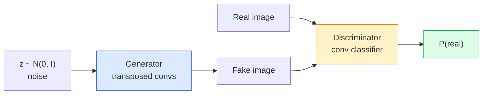
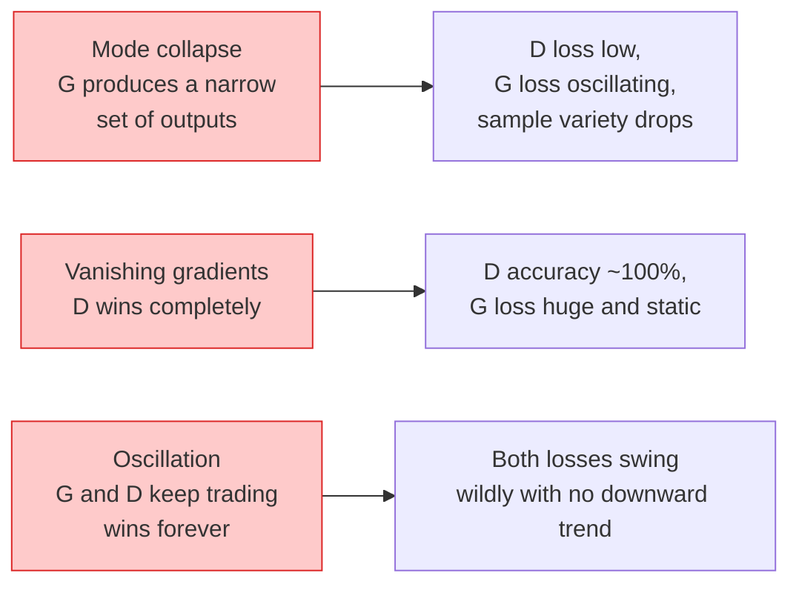

# Génération d'images  GANs  génération d'images  génération de réseaux

> Un GAN est deux réseaux neuronaux dans un jeu fixe, un tirage au sort, un critique, ils s'améliorent ensemble jusqu'à ce que les dessins trompent le critique.

> **【中文解读】**GAN (Generation Against Network) est l'un des deux réseaux de réseaux de neurones: générateur, générateur, générateur, générateur, générateur, générateur, générateur, générateur, générateur, générateur, générateur, générateur, générateur, générateur, générateur, générateur, générateur, générateur, générateur, générateur, générateur, générateur, générateur, générateur, générateur, générateur, générateur, générateur, générateur, générateur, générateur, générateur, générateur, générateur, générateur, générateur, générateur, générateur, générateur, générateur, générateur, générateur, générateur, générateur, générateur, générateur, générateur, générateur, générateur, générateur, générateur, générateur, générateur, générateur, générateur, générateur, générateur, générateur, générateur, générateur, générateur, générateur, générateur, générateur, générateur, générateur, générateur, générateur, générateur, générateur, générateur, générateur, générateur, générateur, générateur, générateur, générateur, générateur, générateur, générateur, générateur, générateur, générateur, générateur, générateur, générateur, générateur, générateur, générateur, générateur, générateur, générateur, générateur, générateur, générateur, générateur, générateur, générateur, générateur, générateur, générateur, générateur, générateur, générateur, générateur, générateur, générateur, générateur, générateur, générateur, générateur, générateur, générateur, générateur, générateur, générateur, générateur, générateur, générateur, générateur, générateur, génér

> **【拓展：GAN 的遗产】**GAN dans StyleGAN ([[face generation]]), CycleGAN ([[风格迁移]]), GAN à super résolution ([[image superrésolution]]) ont une application historique. Bien que le modèle de diffusion de l'image soit devenu le principal courant de génération d'image après 2022, l'idée de l'entraînement anti-GAN est toujours utilisée pour améliorer la qualité des autres modèles de génération.

**Type:** Build | **类型:** 动手
**Languages:** Python | **语言:** Python
**Prerequisites:** Phase 4 Lesson 03 (CNNs), Phase 3 Lesson 06 (Optimizers), Phase 3 Lesson 07 (Regularization) | **前置知识:** Phase 4 Lesson 03（CNN），Phase 3 Lesson 06（优化器），Phase 3 Lesson 07（正则化）
**Time:** ~75 minutes | **时间:** ~75 分钟

## Objectifs d'apprentissage

- Expliquez le jeu minimax entre générateur et discriminateur et pourquoi l'équilibre correspond à p_modèle = p_data
- Implémenter un DCGAN en PyTorch et le faire générer des images synthétiques cohérentes 32x32 en moins de 60 lignes
- Stabiliser la formation GAN avec les trois astuces standard: perte non saturante, norme spectrale, TTUR (règle de mise à jour à deux échelles)
- Lire les courbes d'entraînement qui distinguent la convergence saine de mode effondrement, oscillation, et discriminateur-gains-completement

> **【中文解读】**Les objectifs de l'apprentissage sont énumérés dans la liste des compétences fondamentales que l'on devrait acquérir après avoir terminé la classe.


## Le problème , l' introduction du problème

La classification enseigne à un réseau à cartographier des images sur des étiquettes. La génération inverse le problème: échantillonnez de nouvelles images qui semblent provenir de la même distribution. Il n'y a pas de sortie "correcte" à laquelle vous pouvez vous opposer; il n'y a qu'une distribution que vous voulez imiter.

> Le tableau est cartographié en étiquette. Il se produit une question: le modèle semble provenir d'une nouvelle image de même distribution.

Les fonctions de perte standard (MSE, entropie croisée) ne peuvent pas mesurer " ce modèle provient-il de la réelle distribution. " La réduction de l'erreur par pixel produit des moyennes floues, pas des échantillons réalistes.

> 標準損失函数 (MSE、交叉) ne peut pas mesurer " ce modèle provient-il de la réelle distribution "― minimiser chaque erreur de la image pour générer une moyenne floue, plutôt que de la vraie sample―:

Les GAN (Goodfellow et coll., 2014) ont défini ce cadre. En 2018, StyleGAN produisait 1024x1024 visages indistinguibles des photographies.

> GAN(Goodfellow et autres, 2014) définit ce cadre. En 2018, StyleGAN a déjà pu produire des faces incalculables 1024x1024 avec des photos. Le modèle de diffusion a ensuite pris son rang en termes de qualité et de contrôle, mais chaque technique de diffusion pratique est d'abord comprise dans GAN.

## Le concept de base.

> **【中文解读】**Le présent article présente les concepts et les bases théoriques de base. La connaissance de ces concepts est la prémisse de la réalisation de la réalisation de la réalisation, mais aussi le point de connaissance de l'interview et de la pratique de l'ingénierie.


### Les deux réseaux



Le **generator**G prend un vecteur de bruit `z`et produit une image.**discriminator**D prend une image et produit un seul échelle: la probabilité que l'image soit réelle.

> **生成器**G 接收噪声向量 `z`Il a fait une image.**判别器**D 接收一张图像并输出一个标量: Cette image est la probabilité d'une image réelle.

### Le jeu

G veut que D ait tort, D veut avoir raison.

> Je veux dire, j'ai une idée de la situation.

```
min_G max_D  E_x[log D(x)] + E_z[log(1 - D(G(z)))]
```

Lire de droite à gauche: D maximiser la précision sur le réel (`log D(real)`) et faux (`log (1 - D(fake))`G réduit au minimum l'exactitude de D sur les faux  il veut `D(G(z))`Pour être high.

> De droite à gauche:D dans la maximisation à la vraie image`log D(real)`) et faux images`log(1 - D(fake))`) de la classification de la précision. G en minimisant D à la classification de la fausse image  il est souhaitable `D(G(z))`Le plus haut possible.

Goodfellow a prouvé que ce minimum a un équilibre global où `p_G = p_data`, D donne des sorties de 0,5 partout, et la divergence Jensen-Shannon entre les distributions générées et réelles est de zéro.

> Bon compagnon, il a prouvé que cette petite et grande équipe est un point d'équilibre.`p_G = p_data`,D dans toutes les positions de sortie 0,5, générer une distribution de Jensen-Shannon entre la distribution réelle et la distribution de zéro.

### Perte non saturante

La forme ci-dessus est numériquement instable.`D(G(z))`est proche de zéro pour chaque faux, donc `log(1 - D(G(z)))`Il y a des gradients qui disparaissent par rapport à G. La solution: la perte de G.

> La forme ci-dessus est instable sur la valeur numérique.`D(G(z))`Pour chaque faux modèle, il est presque nul, donc.`log(1 - D(G(z)))`Pour G de la gradience tend à disparaître.

```
L_D = -E_x[log D(x)] - E_z[log(1 - D(G(z)))]
L_G = -E_z[log D(G(z))]                          # non-saturating
```

Maintenant quand ?`D(G(z))`C'est un train de GAN moderne avec cette variante.

> Je suis là.`D(G(z))`La formation de chaque génération moderne utilise ce type de formation.

### Règles d'architecture DCGAN

Radford, Metz, Chintala (2015) ont distillé des années d'expériences ratées en cinq règles qui rendent l'entraînement GAN stable:

> Radford、Metz、Chintala(2015) va à plusieurs années faire l'expérience de l'échec de l'expérimentation pour le 5e Règlement de formation de GAN:

1. Remplacez le regroupement par des convois à pas (les deux filets).
   Le niveau de la formation est de deux niveaux.
2. Utiliser la norme de lot dans le générateur et le discriminateur, à l'exception de la sortie de G et de l'entrée de D.
   Traduction anglaise: dans les générateurs et les déterminateurs, on utilise tous les types de groupement, mais G est exclu de la couche de sortie et D est exclu de la couche d'entrée.
3. Retirez les couches entièrement connectées sur des architectures plus profondes.
   Dans une structure plus profonde, le tout est déplacé.
4. G utilise la LIR sur toutes les couches à l'exception de la sortie (tanh pour la sortie dans [-1, 1]).
   Le niveau de référence est le niveau de référence de la valeur de la valeur de la valeur de la valeur de la valeur de la valeur de la valeur de la valeur de la valeur de la valeur de la valeur de la valeur de la valeur de la valeur de la valeur de la valeur de la valeur de la valeur de la valeur de la valeur de la valeur de la valeur de la valeur de la valeur de la valeur de la valeur de la valeur de la valeur de la valeur de la valeur de la valeur de la valeur de la valeur de la valeur de la valeur de la valeur de la valeur de la valeur de la valeur de la valeur de la valeur de la valeur de la valeur de la valeur de la valeur de la valeur de la valeur de la valeur de la valeur de la valeur de la valeur de la valeur de la valeur de la valeur de la valeur de la valeur de la valeur de la valeur de la valeur de la valeur de la valeur de la valeur de la valeur de la valeur de la valeur de la valeur de la valeur de la valeur de la valeur de la valeur de la valeur de la valeur de la valeur de la valeur de la valeur de la valeur de la valeur de la valeur de la valeur de la valeur de la valeur de la valeur.
5. D utilise LeakyReLU (negative_slope=0.2) sur toutes les couches.
   Leurs résultats sont les suivants:

Chaque GAN moderne basé sur des conve (StyleGAN, BigGAN, GigaGAN) commence toujours à partir de ces règles et remplace les pièces une à la fois.

> Chaque moderne GAN basé sur le volume (StyleGAN, BigGAN, GigaGAN) est toujours issu de ces règles, remplaçant un par un ses composants.

### Les modes d'échec et leurs signatures



- **Mode collapse**: G trouve une image qui trompe D et produit seulement cela.
  Le modèle de la coupe de D est le modèle de la coupe de D.
- **Discriminator wins**Le D devient trop fort, les gradients de G disparaissent.
  Le niveau de G disparaît. Le taux d'apprentissage est réduit.
- **Oscillation**Le résultat de l'opération est le résultat de l'opération de résolution de la situation de l'économie de marché.
  Le système de gestion des ressources humaines est un système de gestion des ressources humaines.

### Évaluation

Les GAN n'ont pas de vérité, alors comment savez-vous qu'ils fonctionnent ?

> GAN  没有标准答案, alors comment juger si elles fonctionnent normalement ?

- **Sample inspection** Regardez seulement 64 échantillons à la fin de chaque époque.
  Le modèle de chaque époque est de 64 échantillons à la fin de l'ère.
- **FID (Fréchet Inception Distance)** distance entre les répartitions de fonctionnalités d'Inception-v3 des ensembles réels et générés.
  Le nombre de personnes qui ont été affectées par la maladie est de 6,7%.
- **Inception Score** plus âgée, plus fragile; préférer la FID.
  Le score d'initiation est plus ancien, plus fragile, et utilise la FID en priorité.
- **Precision/Recall for generative models** mesure séparément la qualité (precision) et la couverture (reprise).
  Le taux d'élimination des données est le taux de réaction des données.

Pour une petite analyse de données synthétiques, l'inspection par échantillon suffit.

> Pour les expériences de données de synthèse à petite échelle, le test de l'échantillon est suffisant.

> **【中文解读】**Cette méthode "de zéro" peut aider à comprendre le principe derrière le cadre, en cas de problème, ne sera pas bloqué dans une boîte noire.

> **【拓展：工业部署中的视觉系统】**Dans le cadre de la déploiement industriel réel, les modèles visuels doivent prendre en compte la réflexion sur la différence de taille des modèles, l'adaptation des appareils de bord, etc. TensorRT, ONNX Runtime, OpenVINO sont des outils d'accélération de réflexion courants. Les systèmes de conduite autonome (comme Tesla FSD) utilisent généralement plusieurs modèles visuels en temps réel sur les puces de véhicule.

> **【拓展：数据标注与质量】**L'efficacité des tâches visuelles dépend fortement de la qualité des données de marquage. Le Studio de marquage, CVAT, est l'outil de marquage principal. Dans le monde industriel, l'apprentissage actif peut réduire le coût de marquage.


## Construisez-le et mettez-le en œuvre.
```figure
cv-gan-image
```

## Faites-le

### Étape 1: Générateur

Un petit générateur DCGAN qui prend le bruit de 64 dimensions et produit une image 32x32.

> Un petit générateur DCGAN, recevant 64 dimensions de bruit et générant 32x32 images.

```python
import torch
import torch.nn as nn

class Generator(nn.Module):
    def __init__(self, z_dim=64, img_channels=3, feat=64):
        super().__init__()
        self.net = nn.Sequential(
            nn.ConvTranspose2d(z_dim, feat * 4, kernel_size=4, stride=1, padding=0, bias=False),
            nn.BatchNorm2d(feat * 4),
            nn.ReLU(inplace=True),
            nn.ConvTranspose2d(feat * 4, feat * 2, kernel_size=4, stride=2, padding=1, bias=False),
            nn.BatchNorm2d(feat * 2),
            nn.ReLU(inplace=True),
            nn.ConvTranspose2d(feat * 2, feat, kernel_size=4, stride=2, padding=1, bias=False),
            nn.BatchNorm2d(feat),
            nn.ReLU(inplace=True),
            nn.ConvTranspose2d(feat, img_channels, kernel_size=4, stride=2, padding=1, bias=False),
            nn.Tanh(),
        )

    def forward(self, z):
        return self.net(z.view(z.size(0), -1, 1, 1))
```

Quatre convois transposés, chacun avec `kernel_size=4, stride=2, padding=1`Ils doublent la taille de l'espace.

> Quatre rouleaux de transformation, pour chaque utilisation `kernel_size=4, stride=2, padding=1`Pour le nettoyage, la taille de l'espace sera multipliée par deux.

### Étape 2: Discriminateur

Le LeakyReLU, les convois à pas, se termine par une logique scalaire.

> L'image du référentiel de l'appareil.

```python
class Discriminator(nn.Module):
    def __init__(self, img_channels=3, feat=64):
        super().__init__()
        self.net = nn.Sequential(
            nn.Conv2d(img_channels, feat, kernel_size=4, stride=2, padding=1),
            nn.LeakyReLU(0.2, inplace=True),
            nn.Conv2d(feat, feat * 2, kernel_size=4, stride=2, padding=1, bias=False),
            nn.BatchNorm2d(feat * 2),
            nn.LeakyReLU(0.2, inplace=True),
            nn.Conv2d(feat * 2, feat * 4, kernel_size=4, stride=2, padding=1, bias=False),
            nn.BatchNorm2d(feat * 4),
            nn.LeakyReLU(0.2, inplace=True),
            nn.Conv2d(feat * 4, 1, kernel_size=4, stride=1, padding=0),
        )

    def forward(self, x):
        return self.net(x).view(-1)
```

La dernière conve réduit un `4x4`carte de caractéristiques à `1x1`. La sortie est un seul scalaire par image; appliquer sigmoid uniquement lors du calcul des pertes.

> Le dernier tome`4x4`Caractéristiques de la réduction`1x1`◊ Pour chaque image, une quantité de signal est produite;

### Étape 3: étape de formation

Alternative: mettre à jour D une fois, puis G une fois, chaque lot.

> 交替进行: chaque lot 先更新 D 一次, 再更新 G 一次。

```python
import torch.nn.functional as F

def train_step(G, D, real, z, opt_g, opt_d, device):
    real = real.to(device)
    bs = real.size(0)

    # D step
    opt_d.zero_grad()
    d_real = D(real)
    d_fake = D(G(z).detach())
    loss_d = (F.binary_cross_entropy_with_logits(d_real, torch.ones_like(d_real))
              + F.binary_cross_entropy_with_logits(d_fake, torch.zeros_like(d_fake)))
    loss_d.backward()
    opt_d.step()

    # G step
    opt_g.zero_grad()
    d_fake = D(G(z))
    loss_g = F.binary_cross_entropy_with_logits(d_fake, torch.ones_like(d_fake))
    loss_g.backward()
    opt_g.step()

    return loss_d.item(), loss_g.item()
```

`G(z).detach()`Dans la phase D, il est essentiel de ne pas laisser les gradients s'écouler dans la phase G pendant la mise à jour.

> D 步骤中的 `G(z).detach()`至关重要: Nous ne voulons pas que la D revienne à la G.

### Étape 4: cycle d'entraînement complet sur les formes synthétiques

```python
from torch.utils.data import DataLoader, TensorDataset
import numpy as np

def synthetic_images(num=2000, size=32, seed=0):
    rng = np.random.default_rng(seed)
    imgs = np.zeros((num, 3, size, size), dtype=np.float32) - 1.0
    for i in range(num):
        r = rng.uniform(6, 12)
        cx, cy = rng.uniform(r, size - r, size=2)
        yy, xx = np.meshgrid(np.arange(size), np.arange(size), indexing="ij")
        mask = (xx - cx) ** 2 + (yy - cy) ** 2 < r ** 2
        color = rng.uniform(-0.5, 1.0, size=3)
        for c in range(3):
            imgs[i, c][mask] = color[c]
    return torch.from_numpy(imgs)

device = "cuda" if torch.cuda.is_available() else "cpu"
data = synthetic_images()
loader = DataLoader(TensorDataset(data), batch_size=64, shuffle=True)

G = Generator(z_dim=64, img_channels=3, feat=32).to(device)
D = Discriminator(img_channels=3, feat=32).to(device)
opt_g = torch.optim.Adam(G.parameters(), lr=2e-4, betas=(0.5, 0.999))
opt_d = torch.optim.Adam(D.parameters(), lr=2e-4, betas=(0.5, 0.999))

for epoch in range(10):
    for (batch,) in loader:
        z = torch.randn(batch.size(0), 64, device=device)
        ld, lg = train_step(G, D, batch, z, opt_g, opt_d, device)
    print(f"epoch {epoch}  D {ld:.3f}  G {lg:.3f}")
```

`Adam(lr=2e-4, betas=(0.5, 0.999))`est la défaillance DCGAN  la faible bêta1 empêche le temps d'élan de stabiliser trop le jeu adversaire.

> `Adam(lr=2e-4, betas=(0.5, 0.999))`La configuration par défaut du DCGAN est plus faible que la beta1 et empêche les mouvements de l'énergie de s'élargir à la résistance à la corrosion.

### Étape 5: Prise d'échantillons

```python
@torch.no_grad()
def sample(G, n=16, z_dim=64, device="cpu"):
    G.eval()
    z = torch.randn(n, z_dim, device=device)
    imgs = G(z)
    imgs = (imgs + 1) / 2
    return imgs.clamp(0, 1)
```

Pour DCGAN, cela compte parce que les statistiques d'exécution de la norme de lot sont utilisées au lieu des statistiques du lot.

> Pour le DCGAN, il est important de passer à l'évaluation, car la collecte de lots utilise la statistique de la mise en œuvre et non la statistique du lot actuel.

### Étape 6: Normalisation spectrale

Un remplacement de BN dans le discriminateur qui garantit le réseau est 1-Lipschitz.

> La répartition des échantillons est une solution de répartition des échantillons dans un appareil de détermination, assurant que le réseau est un 1-Lipschitz de.

```python
from torch.nn.utils import spectral_norm

def build_sn_discriminator(img_channels=3, feat=64):
    return nn.Sequential(
        spectral_norm(nn.Conv2d(img_channels, feat, 4, 2, 1)),
        nn.LeakyReLU(0.2, inplace=True),
        spectral_norm(nn.Conv2d(feat, feat * 2, 4, 2, 1)),
        nn.LeakyReLU(0.2, inplace=True),
        spectral_norm(nn.Conv2d(feat * 2, feat * 4, 4, 2, 1)),
        nn.LeakyReLU(0.2, inplace=True),
        spectral_norm(nn.Conv2d(feat * 4, 1, 4, 1, 0)),
    )
```

> **【中文解读】**Dans ce chapitre, nous allons montrer comment utiliser un cadre mature (comme PyTorch, HuggingFace, etc.) pour appliquer rapidement cette technique.


Échange `Discriminator`pour `build_sn_discriminator()`La norme spectrale est la mise à niveau de robustesse la plus simple que vous puissiez appliquer.

> Il va`Discriminator`替换为 `build_sn_discriminator()`La répartition des échantillons est la plus simple de toutes les améliorations de la répartition des échantillons.


> **【拓展：视觉模型的持续学习】**Dans un environnement de production, le modèle visuel doit être en constante évolution pour s'adapter à de nouveaux données. La technologie de l'apprentissage continu permet d'éviter que le modèle s'adapte à de nouvelles données et oublie les anciens connaissances.

## Utilisez-le avec le cadre de réalisation

Pour la génération sérieuse, utilisez des poids prétraînés ou passez à la diffusion.

- `torch_fidelity`computes le FID / IS sur votre générateur sans écrire un code d'évaluation personnalisé.
- `pytorch-gan-zoo`(héritage) et `StudioGAN`les mises en œuvre testées par le navire de DCGAN, WGAN-GP, SN-GAN, StyleGAN et BigGAN.

En 2026, les GAN sont toujours le meilleur choix pour: génération d'images en temps réel (la latence <10 ms), transfert de style, traduction image-à-image avec contrôle précis (Pix2Pix, CycleGAN).

> **【中文解读】**Cette section se concentre sur la façon de déployer le modèle en tant que produit disponible. De l'original au système de production, il faut considérer plusieurs dimensions de l'optimisation des performances, du traitement des erreurs, du contrôle, etc.


## Envoyez-le . Produit .

Cette leçon donne:

- `outputs/prompt-gan-training-triage.md` une requête qui lit une description de la courbe d'entraînement et choisit le mode défaillance (effondrement du mode, D-wins, oscillation) plus la seule correction recommandée.
- `outputs/skill-dcgan-scaffold.md` une compétence qui écrit un échafaudage DCGAN à partir `z_dim`, cible `image_size`, et `num_channels`, y compris la boucle d'entraînement et le conservateur d'échantillons.

> **【中文解读】** Exercices de base selon Easy/Medium/Hard 三个难度递进──建议至少完成  级别的题目,  级别适合深入研究或面试准备──


## Les exercices

1. **(Easy)**En effet, les données de la série de cercles synthétiques sont généralement utilisées pour la sélection de données de cercles synthétiques.
2. **(Medium)**Remplacez la norme de lot du discriminateur par la norme spectrale. Exercez les deux versions côte à côte.
3. **(Hard)**Implémenter un DCGAN conditionnel: alimenter l'étiquette de classe dans G et D (concentrer un-chaud au bruit dans G, concasser un canal d'intégration de classe dans D).

> **【中文解读】**Dans le tableau des termes, la définition du terme "ce que les gens disent" et "ce qu'il signifie réellement" est différenciée entre le langage quotidien et la signification technique précise.


## Les termes clés

| Term | What people say | What it actually means |
|------|----------------|----------------------|
| Generator (G) | "The draws-stuff net" | Maps noise to images; trained to fool the discriminator |
| Discriminator (D) | "The critic" | Binary classifier; trained to distinguish real from generated images |
| Minimax | "The game" | min over G, max over D of an adversarial loss; equilibrium is p_G = p_data |
| Non-saturating loss | "The numerically sane version" | G's loss is -log(D(G(z))) instead of log(1 - D(G(z))) to avoid vanishing gradients early in training |
| Mode collapse | "Generator makes one thing" | G produces only a small subset of the data distribution; fix with SN, minibatch discrimination, or larger batch |
| TTUR | "Two learning rates" | D learns faster than G, typically by a factor of 2-4; stabilises training |
| Spectral norm | "1-Lipschitz layer" | A weight-normalisation that bounds each layer's Lipschitz constant; stops D from becoming arbitrarily steep |
| FID | "Fréchet Inception Distance" | Distance between Inception-v3 feature distributions of real and generated sets; the standard evaluation metric |

> **【中文解读】**延伸阅读 fournit des ressources de haute qualité pour l'apprentissage en profondeur. Ces articles et cours sont des références classiques dans ce domaine, adaptés aux lecteurs qui ont besoin d'une compréhension approfondie.


## Encore une lecture

- [Generative Adversarial Networks (Goodfellow et al., 2014)](https://arxiv.org/abs/1406.2661)Le journal qui a tout commencé
- [DCGAN (Radford, Metz, Chintala, 2015)](https://arxiv.org/abs/1511.06434) les règles d'architecture qui ont permis de former les GAN
- [Spectral Normalization for GANs (Miyato et al., 2018)](https://arxiv.org/abs/1802.05957) le plus utile des trucs de stabilisation
- [StyleGAN3 (Karras et al., 2021)](https://arxiv.org/abs/2106.12423)Le SOTA GAN, c'est un album de tous les tricks de la dernière décennie.
