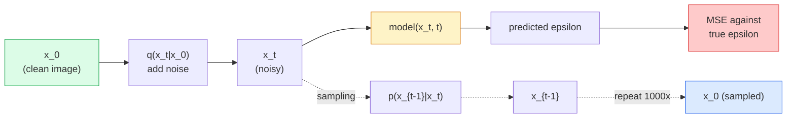

# Génération d'images  Modèles de diffusion  génération d'images  modèle de diffusion

> Un modèle de diffusion apprend à dénoncer, à l'entraîner à enlever un petit peu de bruit d'une image bruyante, à le répéter mille fois en arrière, et vous avez un générateur d'image.

> **【中文解读】**Le modèle de diffusion est le cœur de la diffusion stable, du DALL-E, du Midjourney, etc.

> **【拓展：扩散模型的革命】**Le modèle de diffusion est devenu le principal courant de production d'images en 2022 et est remplacé par le modèle de diffusion en images. La diffusion stable utilise le potentiel de diffusion spatiale.

**Type:** Build | **类型:** 动手
**Languages:** Python | **语言:** Python
**Prerequisites:** Phase 4 Lesson 07 (U-Net), Phase 1 Lesson 06 (Probability), Phase 3 Lesson 06 (Optimizers) | **前置知识:** Phase 4 Lesson 07（U-Net），Phase 1 Lesson 06（概率），Phase 3 Lesson 06（优化器）
**Time:** ~75 minutes | **时间:** ~75 分钟

## Objectifs d'apprentissage

- Dériver le processus de bruit vers l' avant `x_0 -> x_1 -> ... -> x_T`et expliquer pourquoi la forme fermée `q(x_t | x_0)`est valable pour tout t
- Mettre en œuvre un objectif de formation de type DDPM qui régresse le bruit ajouté à chaque étape, et un échantillon qui passe du bruit pur à une image
- Construire un U-Net en temps conditionné (assez petit pour s'entraîner sur le CPU) qui prédit le bruit pour chaque étape du temps
- Expliquer la différence entre l'échantillonnage DDPM et le prélèvement DDIM, et quand chacun est approprié (leçon 23 couvre l'ajustement des débits et le débits rectifié en profondeur)

> **【中文解读】**Les objectifs de l'apprentissage sont énumérés dans la liste des compétences fondamentales que l'on devrait acquérir après avoir terminé la classe.


## Le problème , l' introduction du problème

Les GAN génèrent un seul coup: bruit à l'intérieur, image à l'extérieur, un passage vers l'avant. Ils sont rapides et difficiles à entraîner. Les modèles de diffusion génèrent de manière itérative: à partir de bruit pur, dénoncer en petits pas, apparaître une image. Ils sont lents et faciles à entraîner. Depuis cinq ans, cette dernière propriété a dominé: toute petite équipe peut former un modèle de diffusion et obtenir des échantillons raisonnables; la formation GAN est un métier que l'on apprend sur des années de manquements.

> GAN une seconde génération: bruit d'entrée, image de sortie, une fois de plus de propagation. Elles sont rapides mais difficiles à entraîner. Modèles de propagation génération: de pur bruit à petit pas à bruit, images à petit pas à petit. Elles sont rapides mais faciles à entraîner.

Au-delà de la stabilité de formation, la structure itérative de la diffusion est ce qui déverrouille tout ce que fait la génération d'images moderne: conditionnement de texte, peinture, édition d'image, super-résolution, style contrôlable. Chaque étape de la boucle d'échantillonnage est un lieu pour injecter une nouvelle contrainte. C'est pourquoi Stable Diffusion, Imagen, DALL-E 3, Midjourney, et tous les modèles d'images contrôlables que vous utiliserez sont tous basés sur la diffusion.

> En plus de l'entraînement de la stabilité, la structure générationnelle de la diffusion débloque tout ce qui est fait pour la génération d'images moderne: conditionnement du texte, réparation d'images, édition d'images, ultra-résolution, style contrôlable. Chaque étape du cycle de prélèvement est injectée dans un nouveau groupe.

Cette leçon construit le DDPM minimal: bruit vers l'avant, dénoisage vers l'arrière, boucle d'entraînement.

> Le programme de formation de la formation en matière de diffusion stable (DDPM) est basé sur la formation de la formation en mode diffusion stable (DDPM) et comprend des systèmes de production, des éditeurs et des éditeurs.

## Le concept de base.

> **【中文解读】**Le présent article présente les concepts et les bases théoriques de base. La connaissance de ces concepts est la prémisse de la réalisation de la réalisation de la réalisation, mais aussi le point de connaissance de l'interview et de la pratique de l'ingénierie.


### Le processus de développement

Prenez une photo .`x_0`Ajoutez un petit bruit gaussien pour obtenir`x_1`Ajoutez une petite quantité pour obtenir`x_2`Continuez à marcher jusqu' à l' étape T .`x_T`est presque indistinguible du bruit gaussien pur.

> 取一张图像  Je suis en train de faire une photo`x_0`J'ai un peu plus de bruit.`x_1`Je vais en faire un autre .`x_2`, continuez à faire jusqu' à`x_T`Il est presque impossible de distinguer le bruit du pur-hauteur.

```
q(x_t | x_{t-1}) = N(x_t; sqrt(1 - beta_t) * x_{t-1},  beta_t * I)
```

`beta_t`est un petit schéma de variance, généralement linéaire de 0,0001 à 0,02 sur T=1000 étapes.

> `beta_t`C'est une petite différence de réglage, généralement dans T=1000 étapes, de 0,0001 à 0,02 ∞.

### Le saut en forme fermée

Ajouter du bruit un pas à la fois est une chaîne Markov, mais les mathématiques se plient: vous pouvez échantillonner `x_t`directement à partir de `x_0`En une seule étape.

> Un pas plus de bruit est une chaîne de marque, mais mathématiquement, on peut plier:`x_0`采样 `x_t`Il y a une autre.

```
Define alpha_t = 1 - beta_t
Define alpha_bar_t = prod_{s=1..t} alpha_s

Then:
  q(x_t | x_0) = N(x_t; sqrt(alpha_bar_t) * x_0,  (1 - alpha_bar_t) * I)

Equivalently:
  x_t = sqrt(alpha_bar_t) * x_0 + sqrt(1 - alpha_bar_t) * epsilon
  where epsilon ~ N(0, I)
```

Cette seule équation est la raison pour laquelle la diffusion est pratique.`t`, échantillon `x_t`directement à partir de `x_0`, et le train en une seule étape  pas de simulation de la chaîne de Markov complète nécessaire.

> Cette méthode est la raison principale de l'utilisation pratique du modèle de diffusion.`t`, directement de`x_0`采样 `x_t`Il n'y a pas besoin de simuler une chaîne de marche complète.

### Le processus inverse

Le processus avant est fixe.`p(x_{t-1} | x_t)`Les modèles de diffusion ne prédisent pas`x_{t-1}`directement; ils prédisent le bruit `epsilon`ajouté à l'étape t, et les mathématiques dérive `x_{t-1}`- Je ne sais pas.

> Le processus de direction est fixe.`p(x_{t-1} | x_t)`Il faut apprendre à faire des prédictions.`x_{t-1}`Ils prédisent le bruit de l' accélération.`epsilon`Puis, grâce à la mathématiques, on l'a appris.`x_{t-1}`Il y a une autre.



### La perte de formation

Pour chaque étape de formation:

> Chaque étape d'entraînement:

1. Prenez une vraie image .`x_0`- Je suis désolé .
   Le film est un film de cinéma.`x_0`Il y a une autre.
2. Prenez un échantillon d' étape de temps `t`uniformément à partir de [1, T].
   Le temps passe par le temps.`t`Il y a une autre.
3. L' échantillon de bruit `epsilon ~ N(0, I)`- Je suis désolé .
   Le bruit est de la même façon que le bruit.`epsilon ~ N(0, I)`Il y a une autre.
4. Compte `x_t = sqrt(alpha_bar_t) * x_0 + sqrt(1 - alpha_bar_t) * epsilon`- Je suis désolé .
   Le mot grec traduit par " calcul "`x_t = sqrt(alpha_bar_t) * x_0 + sqrt(1 - alpha_bar_t) * epsilon`Il y a une autre.
5. Prédire`epsilon_theta(x_t, t)`avec le réseau.
   Le mot " prédiction " est traduit par " prédiction "`epsilon_theta(x_t, t)`Il y a une autre.
6. Minimiser `|| epsilon - epsilon_theta(x_t, t) ||^2`- Je suis désolé .
   Le mot " minimum " est traduit par " minimum ".`|| epsilon - epsilon_theta(x_t, t) ||^2`Il y a une autre.

Le réseau neural apprend à prédire le bruit à n'importe quelle étape, la perte est MSE, il n'y a pas de jeu d'adversité, pas d'effondrement, pas d'oscillation.

> C'est ainsi que le système de formation ne peut pas faire de bruit.

### Le prélèvement d'échantillons (DDPM)

Pour générer: à partir de `x_T ~ N(0, I)`et marcher en arrière un pas à la fois.

```
for t = T, T-1, ..., 1:
    eps = model(x_t, t)
    x_{t-1} = (1 / sqrt(alpha_t)) * (x_t - (beta_t / sqrt(1 - alpha_bar_t)) * eps) + sqrt(beta_t) * z
    where z ~ N(0, I) if t > 1, else 0
return x_0
```

La clé est que même si la condition inverse n'est pas connue sous forme fermée en général, pour ce processus avancé gaussien spécifique, c'est le coefficient de la forme laide qui vous donne la règle de Bayes.

> La clé est que, bien que dans la plupart des cas, la probabilité de contre-trotation ne soit pas résolue de manière fermée, il y a des conséquences pour ce processus de haute orientation spécifique.

### Pourquoi 1000 pas ?

Le calendrier de bruit avant est choisi de sorte que chaque étape ajoute juste assez de bruit que la étape inverse est presque gaussienne. Trop peu de étapes et la étape inverse est loin de Gaussienne, le réseau ne peut pas bien le modéliser. Trop de étapes et l'échantillonnage devient coûteux avec une gain décroissante. T = 1000 avec un calendrier linéaire est la DDPM par défaut.

> Le design de la régulation du bruit avant fait que chaque étape ne fait que suffisamment de bruit, ce qui fait que le nombre de pas vers le haut est trop faible, le nombre de pas vers le bas est trop élevé, le réseau ne peut pas être bien construit; le nombre de pas vers le haut est trop cher et le bénéfice est réduit.

### DDIM: prélèvement 20 fois plus rapide

La formation est la même. Les changements de prélèvement d'échantillons. DDIM (Song et al., 2020) définit un processus inversé déterministe qui saute les étapes de temps sans recyclage. L'échantillonnage en 50 étapes avec DDIM donne une qualité de DDPM de près de 1000 étapes. Chaque système de production utilise DDIM ou une variante encore plus rapide (DPM-Solver, ancêtre d'Euler).

> 訓練方式不變,采样方式改变──DDIM(Song等,2020) définit un processus inversé déterminé, qui peut sauter au-delà du temps sans avoir besoin de reentraînement──Utiliser le DDIM 50 étapes afin d'atteindre près de 1000 étapes de la qualité du DDPM── chaque système de production utilise le DDIM ou des variantes plus rapides──DPM-Solver、Euler ancêtre)──

### Conditionnement du temps

Le réseau `epsilon_theta(x_t, t)`Les modèles de diffusion modernes injecteront des`t`via des emplacements de temps sinusoïdes (la même idée que le codage positional dans les transformateurs) qui sont ajoutés aux cartes de fonctionnalités à chaque niveau U-Net.

> 网络 `epsilon_theta(x_t, t)`Il faut savoir quel est le temps de sonnerie. Modèle de propagation moderne à travers le temps de sonnerie.`t`, dans chaque niveau de U-Net des caractéristiques de la carte de la mise en page.

```
t_embedding = sinusoidal(t)
feature_map += MLP(t_embedding)
```

Sans conditionner le temps, le réseau doit deviner le niveau de bruit à partir de l'image elle-même, ce qui fonctionne mais est beaucoup moins efficace.

>  sans temps conditionné, le réseau doit deviner le niveau de bruit de l'image elle-même, de sorte que bien qu'il puisse fonctionner, l'efficacité de l'échantillonnage est beaucoup plus faible.

> **【拓展：工业部署中的视觉系统】**Dans le cadre de la déploiement industriel réel, les modèles visuels doivent prendre en compte la réflexion sur la différence de taille des modèles, l'adaptation des appareils de bord, etc. TensorRT, ONNX Runtime, OpenVINO sont des outils d'accélération de réflexion courants. Les systèmes de conduite autonome (comme Tesla FSD) utilisent généralement plusieurs modèles visuels en temps réel sur les puces de véhicule.

> **【拓展：数据标注与质量】**L'efficacité des tâches visuelles dépend fortement de la qualité des données de marquage. Le Studio de marquage, CVAT, est l'outil de marquage principal. Dans le monde industriel, l'apprentissage actif peut réduire le coût de marquage.


## Construisez-le et mettez-le en œuvre.

> **【中文解读】**Cette méthode "de zéro" peut aider à comprendre le principe derrière le cadre, en cas de problème, ne sera pas bloqué dans une boîte noire.

```figure
cv-diffusion-image
```

## Faites-le

### Étape 1: Calendrier du bruit

```python
import torch

def linear_beta_schedule(T=1000, beta_start=1e-4, beta_end=2e-2):
    return torch.linspace(beta_start, beta_end, T)


def precompute_schedule(betas):
    alphas = 1.0 - betas
    alphas_cumprod = torch.cumprod(alphas, dim=0)
    return {
        "betas": betas,
        "alphas": alphas,
        "alphas_cumprod": alphas_cumprod,
        "sqrt_alphas_cumprod": torch.sqrt(alphas_cumprod),
        "sqrt_one_minus_alphas_cumprod": torch.sqrt(1.0 - alphas_cumprod),
        "sqrt_recip_alphas": torch.sqrt(1.0 / alphas),
    }

schedule = precompute_schedule(linear_beta_schedule(T=1000))
```

Précompte une fois, recueille par index pendant la formation et le prélèvement d'échantillons.

> 预计算一次, entraînement et échantillonnage en utilisant des indices

### Étape 2: Diffusion avant (échantillon q)

```python
def q_sample(x0, t, noise, schedule):
    sqrt_a = schedule["sqrt_alphas_cumprod"][t].view(-1, 1, 1, 1)
    sqrt_one_minus_a = schedule["sqrt_one_minus_alphas_cumprod"][t].view(-1, 1, 1, 1)
    return sqrt_a * x0 + sqrt_one_minus_a * noise
```

Forme fermée à une ligne. `t`est un lot de délais, un par image dans le lot.

> Une ligne fermée en forme...`t`C'est une série de temps, chaque image est une.

### Étape 3: Un petit réseau U-Net à climatisation temporelle

```python
import torch.nn as nn
import torch.nn.functional as F
import math

def timestep_embedding(t, dim=64):
    half = dim // 2
    freqs = torch.exp(-math.log(10000) * torch.arange(half, device=t.device) / half)
    args = t[:, None].float() * freqs[None]
    emb = torch.cat([args.sin(), args.cos()], dim=-1)
    return emb


class TinyUNet(nn.Module):
    def __init__(self, img_channels=3, base=32, t_dim=64):
        super().__init__()
        self.t_mlp = nn.Sequential(
            nn.Linear(t_dim, base * 4),
            nn.SiLU(),
            nn.Linear(base * 4, base * 4),
        )
        self.t_dim = t_dim
        self.enc1 = nn.Conv2d(img_channels, base, 3, padding=1)
        self.enc2 = nn.Conv2d(base, base * 2, 4, stride=2, padding=1)
        self.mid = nn.Conv2d(base * 2, base * 2, 3, padding=1)
        self.dec1 = nn.ConvTranspose2d(base * 2, base, 4, stride=2, padding=1)
        self.dec2 = nn.Conv2d(base * 2, img_channels, 3, padding=1)
        self.time_proj = nn.Linear(base * 4, base * 2)

    def forward(self, x, t):
        t_emb = timestep_embedding(t, self.t_dim)
        t_emb = self.t_mlp(t_emb)
        t_proj = self.time_proj(t_emb)[:, :, None, None]

        h1 = F.silu(self.enc1(x))
        h2 = F.silu(self.enc2(h1)) + t_proj
        h3 = F.silu(self.mid(h2))
        d1 = F.silu(self.dec1(h3))
        d2 = torch.cat([d1, h1], dim=1)
        return self.dec2(d2)
```

U-Net à deux niveaux avec un temps de conditionnement injecté à l'emporte-bouteille.

> 双层U-Net, dans le boîtier 层注入时间条件化── Pour les images réelles, il est possible d'augmenter la profondeur et la largeur──

### Étape 4: cycle d'entraînement

```python
def train_step(model, x0, schedule, optimizer, device, T=1000):
    model.train()
    x0 = x0.to(device)
    bs = x0.size(0)
    t = torch.randint(0, T, (bs,), device=device)
    noise = torch.randn_like(x0)
    x_t = q_sample(x0, t, noise, schedule)
    pred = model(x_t, t)
    loss = F.mse_loss(pred, noise)
    optimizer.zero_grad()
    loss.backward()
    optimizer.step()
    return loss.item()
```

Pas de jeu GAN, pas de perte spécialisée, un appel MSE.

> C'est le cycle de formation complet. Il n'y a pas de GAN contre les bouts, pas de fonction de perte spéciale, il suffit d'un MSE.

### Étape 5: Pratiquant d'échantillons (DDPM)

```python
@torch.no_grad()
def sample(model, schedule, shape, T=1000, device="cpu"):
    model.eval()
    x = torch.randn(shape, device=device)
    betas = schedule["betas"].to(device)
    sqrt_one_minus_a = schedule["sqrt_one_minus_alphas_cumprod"].to(device)
    sqrt_recip_alphas = schedule["sqrt_recip_alphas"].to(device)

    for t in reversed(range(T)):
        t_batch = torch.full((shape[0],), t, dtype=torch.long, device=device)
        eps = model(x, t_batch)
        coef = betas[t] / sqrt_one_minus_a[t]
        mean = sqrt_recip_alphas[t] * (x - coef * eps)
        if t > 0:
            x = mean + torch.sqrt(betas[t]) * torch.randn_like(x)
        else:
            x = mean
    return x
```

1000 passes avant pour produire un lot d'échantillons.

> 1000 fois avant de se propager pour générer un lot de échantillons.

### Étape 6: échantillonneur DDIM (déterministique, ~ 20 fois plus rapide)

```python
@torch.no_grad()
def sample_ddim(model, schedule, shape, steps=50, T=1000, device="cpu", eta=0.0):
    model.eval()
    x = torch.randn(shape, device=device)
    alphas_cumprod = schedule["alphas_cumprod"].to(device)

    ts = torch.linspace(T - 1, 0, steps + 1).long()
    for i in range(steps):
        t = ts[i]
        t_prev = ts[i + 1]
        t_batch = torch.full((shape[0],), t, dtype=torch.long, device=device)
        eps = model(x, t_batch)
        a_t = alphas_cumprod[t]
        a_prev = alphas_cumprod[t_prev] if t_prev >= 0 else torch.tensor(1.0, device=device)
        x0_pred = (x - torch.sqrt(1 - a_t) * eps) / torch.sqrt(a_t)
        sigma = eta * torch.sqrt((1 - a_prev) / (1 - a_t) * (1 - a_t / a_prev))
        dir_xt = torch.sqrt(1 - a_prev - sigma ** 2) * eps
        noise = sigma * torch.randn_like(x) if eta > 0 else 0
        x = torch.sqrt(a_prev) * x0_pred + dir_xt + noise
    return x
```

> **【中文解读】**Dans ce chapitre, nous allons montrer comment utiliser un cadre mature (comme PyTorch, HuggingFace, etc.) pour appliquer rapidement cette technique.


`eta=0`est entièrement déterministe (la même entrée bruyante produit toujours la même sortie). `eta=1`récupère le DDPM.

> `eta=0`Il est parfaitement certain que le même bruit entre en production et sortie.`eta=1`则退化为 DDPM。


> **【拓展：视觉模型的持续学习】**Dans un environnement de production, le modèle visuel doit être en constante évolution pour s'adapter à de nouveaux données. La technologie de l'apprentissage continu permet d'éviter que le modèle s'adapte à de nouvelles données et oublie les anciens connaissances.

## Utilisez-le avec le cadre de réalisation

Pour les travaux de production, utilisez `diffusers`- Le numéro de la liste:

```python
from diffusers import DDPMScheduler, UNet2DModel

unet = UNet2DModel(sample_size=32, in_channels=3, out_channels=3, layers_per_block=2)
scheduler = DDPMScheduler(num_train_timesteps=1000)
```

La bibliothèque envoie des planificateurs prêts à l'emploi (DDPM, DDIM, DPM-Solver, Euler, Heun), des U-Nets configurables, des pipelines pour le texte à l'image et l'image à l'image, et des aides à l'ajustement de LoRA.

Pour la recherche,`k-diffusion`(Katherine Crowson) a les plus fidèles applications de référence et les meilleures variantes d'échantillonnage.

> **【中文解读】**Cette section se concentre sur la façon de déployer le modèle en tant que produit disponible. De l'original au système de production, il faut considérer plusieurs dimensions de l'optimisation des performances, du traitement des erreurs, du contrôle, etc.


## Envoyez-le . Produit .

Cette leçon donne:

- `outputs/prompt-diffusion-sampler-picker.md` une requête qui choisit DDPM / DDIM / DPM-Solver / Euler en fonction de la cible de qualité, du budget de latence et du type de conditionnement.
- `outputs/skill-noise-schedule-designer.md` une compétence qui produit un schéma bêta linéaire, cossin ou sigmoïde donné T et le niveau de corruption cible, plus des graphiques diagnostiques du rapport signal-bruit au fil du temps.

> **【中文解读】** Exercices de base selon Easy/Medium/Hard 三个难度递进──建议至少完成  级别的题目,  级别适合深入研究或面试准备──


## Les exercices

1. **(Easy)**Visualisez le processus: prenez une image et dessinez `x_t`à`t in [0, 100, 250, 500, 750, 1000]`Vérifiez ça .`x_1000`On dirait un bruit gaussien.
2. **(Medium)**Exercer le TinyUNet sur l'ensemble de données de cercles synthétiques pendant 20 époques et échantillonner 16 cercles.
3. **(Hard)**Mettre en œuvre un calendrier de bruit cosine (Nichol & Dhariwal, 2021): `alpha_bar_t = cos^2((t/T + s) / (1 + s) * pi / 2)`- Exercer le même modèle avec des calendriers linéaires et cosinus et montrer que cosine donne de meilleurs échantillons à faible nombre d'étapes.

> **【中文解读】**Dans le tableau des termes, la définition du terme "ce que les gens disent" et "ce qu'il signifie réellement" est différenciée entre le langage quotidien et la signification technique précise.


## Les termes clés

| Term | What people say | What it actually means |
|------|----------------|----------------------|
| Forward process | "Add noise over time" | Fixed Markov chain that corrupts an image into Gaussian noise over T steps |
| Reverse process | "Denoise step by step" | Learned distribution that walks back from noise to image |
| Epsilon prediction | "Predict the noise" | The training target: `epsilon_theta(x_t, t)` predicts the noise added at step t |
| Beta schedule | "Noise amounts" | Sequence of T small variances that define how much noise enters per step |
| alpha_bar_t | "Cumulative retain factor" | Product of (1 - beta_s) up to time t; bigger t means less signal left |
| DDPM sampler | "Ancestral, stochastic" | Samples each x_{t-1} from its conditional Gaussian; 1000 steps |
| DDIM sampler | "Deterministic, fast" | Rewrites sampling as a deterministic ODE; 20-100 steps with similar quality |
| Time conditioning | "Tell the model which t" | Sinusoidal embedding of t injected into the U-Net so it knows the noise level |

> **【中文解读】**延伸阅读 fournit des ressources de haute qualité pour l'apprentissage en profondeur. Ces articles et cours sont des références classiques dans ce domaine, adaptés aux lecteurs qui ont besoin d'une compréhension approfondie.


## Encore une lecture

- [Denoising Diffusion Probabilistic Models (Ho et al., 2020)](https://arxiv.org/abs/2006.11239) le papier qui a rendu la diffusion pratique et a battu les GAN sur FID
- [Improved DDPM (Nichol & Dhariwal, 2021)](https://arxiv.org/abs/2102.09672) calendrier cossin et paramétrage v
- [DDIM (Song, Meng, Ermon, 2020)](https://arxiv.org/abs/2010.02502) le échantillon déterministe qui a rendu possible l'inférence en temps réel
- [Elucidating the Design Space of Diffusion (Karras et al., 2022)](https://arxiv.org/abs/2206.00364) une vue unifiée de chaque choix de conception de diffusion; référence actuelle
