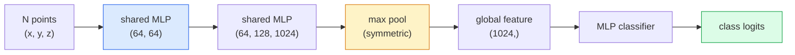

# 3D Vision  Point Clouds & NeRFs  3D Vision  点云与NeRF

> La vision 3D est présentée sous deux formes: les nuages de point sont la production brute du capteur. Les NeRF sont le champ volumétrique appris.

> **【中文解读】**La vision 3D a deux types de modes: point cloud est le détecteur de sensation (LiDAR, profondité de la photo) et NeRF (Neural Radiation Field) est le champ d'épaisseur apprise.

> **【拓展：3D 视觉的应用】**Le NERF est utilisé pour la réalité virtuelle/augmenter la réalité (VR/AR) 、 bâtiment可视化、 autopilotée场景重建──3D Gaussian Splatting(下一课) est un programme de remplacement rapide du NERF, en réalité 染质量更高──点云处理是自动驾驶 LiDAR 感知的核心──

**Type:** Learn + Build | **类型:** 学习 + 动手
**Languages:** Python | **语言:** Python
**Prerequisites:** Phase 4 Lesson 03 (CNNs), Phase 1 Lesson 12 (Tensor Operations) | **前置知识:** Phase 4 Lesson 03（CNN），Phase 1 Lesson 12（张量运算）
**Time:** ~45 minutes | **时间:** ~45 分钟

## Objectifs d'apprentissage

- Distinguer les représentations 3D explicites (nuage de point, maille, voxel) et implicites (campe de distance signé, NeRF) et lorsque chacune est utilisée
- Comprendre le truc de la fonction symétrique de PointNet qui rend un réseau neural invariable en permution sur un ensemble de points non ordonné
- Tracer un passage NeRF vers l'avant: coulée de rayons, rendu volumétrique, codage positionnel, densité MLP + tête de couleur
- Utilisation `nerfstudio`ou `instant-ngp`pour la reconstruction 3D prétrainée à partir d'un petit ensemble d'images posées

> **【中文解读】**Les objectifs de l'apprentissage sont énumérés dans la liste des compétences fondamentales que l'on devrait acquérir après avoir terminé la classe.


## Le problème , l' introduction du problème

Une caméra produit une image 2D. Un LIDAR produit un ensemble de points 3D sans ordre. Un pipeline de structure à partir de mouvement produit un nuage rare de points clés 3D. Un NeRF reconstruit une scène 3D entière à partir d'une poignée d'images posées. Tous ceux-ci sont "vision" mais aucun d'entre eux ressemble au tensor dense qu'une CNN veut.

> L'équipe de révision de la structure de l'eau de la station de radio a été créée en 3D.

La vision 3D est importante car presque toutes les tâches de robot de grande valeur fonctionnent en 3D: saisir, éviter les obstacles, naviguer, occlusion AR, capter le contenu 3D. Un ingénieur de vision qui ne comprend que les images 2D est exclu de la tranche de terrain qui croît le plus rapidement (content AR/VR, robotique, piles de conduite autonome, reconstruction 3D basée sur NeRF pour l'immobilier ou la construction).

> La visualisation 3D est importante car presque toutes les tâches d'ordinateurs à haute valeur sont effectuées en 3D: saisir, éviter, guider, capturer le contenu en 3D.

Les deux représentations dominent pour des raisons différentes. Les nuages de points sont ce que les capteurs vous donnent gratuitement. Les NeRF et leurs successeurs (3D Gaussian splatting, SDF neuraux) sont ce que vous obtenez lorsque vous demandez à un réseau neural d'apprendre une scène.

> 两种表示因不同原因占据主导──点云是传感器免费给你──NeRF 及其后继者(3D 高斯、神经SDF) 是当你让神经网络学习场景时得到的──

## Le concept de base.

> **【中文解读】**Le présent article présente les concepts et les bases théoriques de base. La connaissance de ces concepts est la prémisse de la réalisation de la réalisation de la réalisation, mais aussi le point de connaissance de l'interview et de la pratique de l'ingénierie.


### Nuages de pointe

Un nuage de points est un ensemble non ordonné de N points en R^3, optionnellement chacun avec des caractéristiques (couleur, intensité, normale).

> 点云是 R^3 en N 个点的无序集合, chaque point peut être caractérisé par un certain nombre de caractéristiques (color, intensité, longueur de ligne).

```
cloud = [
  (x1, y1, z1, r1, g1, b1),
  (x2, y2, z2, r2, g2, b2),
  ...
  (xN, yN, zN, rN, gN, bN),
]
```

Aucune grille, aucune connectivité.

> 没有网格,没有连接关系―― Deux caractéristiques le rendent difficile pour le réseau neuronal:

- **Permutation invariance** la sortie ne doit pas dépendre de l'ordre des points.
  Le mot grec traduit par " le mot grec "**置换不变性** Les sorties ne peuvent dépendre de l'ordre des points.
- **Variable N** un seul modèle doit gérer des nuages de différentes tailles.
  Le mot grec traduit par " le mot grec "**可变 N**Un seul modèle doit traiter différents points de taille.

PointNet (Qi et al., 2017) a résolu les deux avec une idée: appliquer un MLP partagé à chaque point, puis agréger avec une fonction symétrique (pools max). Le résultat est un vecteur de taille fixe qui ne dépend pas de l'ordre.

> PointNet ((Qi 等,2017) a résolu deux problèmes avec une idée: pour chaque application partagée MLP, puis avec la fonction de la plus grande pilealisation (glue)). Le résultat est un volume fixe de taille non lié à l'ordre.

```
f(P) = max_{p in P} MLP(p)
```

C'est le cœur de PointNet. Les variantes plus profondes (PointNet++, Point Transformer) ajoutent un échantillonnage hiérarchique et une aggregation locale, mais le truc de fonction symétrique est inchangé.

> C'est le cœur de PointNet. Les variantes plus profondes de PointNet ont augmenté la saisie de niveau et la concentration locale, mais les techniques de fonctionnement ne changent pas.

### L'architecture de PointNet



"MLP partagé" désigne le même MLP qui fonctionne indépendamment sur chaque point.

> "MLP partagé" signifie le même MLP en fonctionnement indépendant à chaque point.

### Les champs de radiance neurale (NeRF)

Les NeRF (Mildenhall et coll., 2020) ont répondu à la question " pouvons-nous reconstruire une scène 3D à partir de N photos ? " et ont répondu avec un réseau neural qui est la scène.`(x, y, z, viewing_direction)`à `(density, colour)`Render une nouvelle vue est une boucle de rayonnement sur ce réseau.

> NeRF(Mildenhall etc,2020) a répondu à la question "ne peut-il pas reconstruire la scène en 3D à partir de N 张照片?"`(x, y, z, 观察方向)`映射到 `(密度, 颜色)`染新视角 est le cycle d'injection de lumière sur ce réseau

```
NeRF MLP:  (x, y, z, theta, phi) -> (sigma, r, g, b)

To render a pixel (u, v) of a new view:
  1. Cast a ray from the camera through pixel (u, v)
  2. Sample points along the ray at distances t_1, t_2, ..., t_N
  3. Query the MLP at each point
  4. Composite the colours weighted by (1 - exp(-sigma * dt))
  5. The sum is the rendered pixel colour
```

Une perte compare le pixel rendu au pixel de vérité au sol dans les photos d'entraînement. Backprop à travers l'étape de rendu met à jour le MLP. Aucune vérité au sol 3D, aucune géométrie explicite  la scène est stockée dans les poids MLP.

> 损失函数 损失函数 损失函数 损失函数 损失函数 损失函数 损失函数 损失函数 损失函数 损失函数 损失函数 损失函数 损失函数 损失函数 损失函数 损失函数 损失函数 损失函数 损失函数 损失函数 损失函数 损失函数 损失函数 损失函数 损失函数 损失函数 损失函数 损失函数 损失函数 损失函数 损失函数 损失函数 损失函数 损失函数 损失函数 损失函数 损失函数 损失函数 损失函数 损失函数 损失函数 损失函数 损失函数 损失函数 损失函数 损失函数 损失函数 损失函数 损失函数 损失

### Codification de position dans le NERF

Une vanille en MLP .`(x, y, z)`NeRF corrige cette situation en encodant chaque coordonnée en vecteur de fonctionnalités de Fourier avant la MLP:

> Le MLP ordinaire`(x, y, z)`La fréquence de diffusion de la LPM est plus élevée que la fréquence de diffusion de la LPM.

```
gamma(p) = (sin(2^0 pi p), cos(2^0 pi p), sin(2^1 pi p), cos(2^1 pi p), ...)
```

Jusqu'à L=10 niveaux de fréquence. C'est le même truc que les transformateurs utilisent pour les positions, et il apparaît à nouveau dans le conditionnement du temps de diffusion (leçon 10).

> Le maximum L=10 个频率级别── ceci est le même que Transformer avec les mêmes techniques de position, également apparaissant à nouveau dans la conditionisation du modèle de diffusion dans le temps (第 10 课)── sans elle, NeRF semble pâle──

### Rendering volumétrique

```
C(r) = sum_i T_i * (1 - exp(-sigma_i * delta_i)) * c_i

T_i  = exp(- sum_{j<i} sigma_j * delta_j)
delta_i = t_{i+1} - t_i
```

`T_i`est la transmission  combien de lumière survit au point i. `(1 - exp(-sigma_i * delta_i))`est l' opacité au point i. `c_i`Le pixel final est une somme pondérée le long du rayon.

> `T_i`Le taux de transpiration est de 1° à 1°.`(1 - exp(-sigma_i * delta_i))`Il y a une grande opacité.`c_i`Le résultat final est l'augmentation de la lumière.

### Ce qui a remplacé les NERF

Les NeRF purs sont lents à s'entraîner (heures) et lents à rendre (secondes par image).

> 純 NeRF 訓練慢(小時級) 且染慢(每张图像秒级) 』后续发展:

- **Instant-NGP**(2022)  Le codage par grille de hachage remplace l'entrée de position du MLP; trains en secondes.
  Le mot grec traduit par " le mot grec "**Instant-NGP**(2022) 哈希网格编码替代 MLP 的位置输入;秒级训练──
- **Mip-NeRF 360** gère des scènes illimitées et anti-aliasing.
  Le mot grec traduit par " le mot grec "**Mip-NeRF 360** traitement de la situation et de l'opposition ──
- **3D Gaussian Splatting**(2023)  remplace le champ volumétrique par des millions de Gaussiens 3D; trains en minutes, renders en temps réel.
  Le mot grec traduit par " le mot grec "**3D 高斯泼溅**(2023)  avec des millions de 3D 高斯替代体积场;分钟级训练,实时染──

Presque tous les produits de la NERF en 2026 sont en fait des splatts gaussiens en 3D. Le modèle mental est toujours la NERF.

> En 2026, presque tous les produits de la NERF sont en réalité 3D, mais le modèle mental reste néorégique.

### Ensembles de données et indicateurs de référence

- **ShapeNet** classification et segmentation des modèles 3D CAD en nuages de points.
  Le modèle de CAD 3D est un modèle de CAD 3D.
- **ScanNet** vrais scanners intérieurs pour la segmentation.
  Le scanner est utilisé pour la sélection.
- **KITTI** nuages de pointe LIDAR extérieurs pour la conduite autonome.
  Le KITTI 户外 LiDAR 点云, utilisé pour la conduite autonome.
- **NeRF Synthetic**- Je suis là .**Blended MVS** Ensembles de données posées pour la synthèse de la vue.
  NéRF Synthétique / Mélangé MVS带位姿的图像数据集,用于视角合成。
- **Mip-NeRF 360**ensemble de données  scènes réelles illimitées.
  Le film est un film de cinéma.

> **【中文解读】**Cette méthode "de zéro" peut aider à comprendre le principe derrière le cadre, en cas de problème, ne sera pas bloqué dans une boîte noire.

> **【拓展：工业部署中的视觉系统】**Dans le cadre de la déploiement industriel réel, les modèles visuels doivent prendre en compte la réflexion sur la différence de taille des modèles, l'adaptation des appareils de bord, etc. TensorRT, ONNX Runtime, OpenVINO sont des outils d'accélération de réflexion courants. Les systèmes de conduite autonome (comme Tesla FSD) utilisent généralement plusieurs modèles visuels en temps réel sur les puces de véhicule.

> **【拓展：数据标注与质量】**L'efficacité des tâches visuelles dépend fortement de la qualité des données de marquage. Le Studio de marquage, CVAT, est l'outil de marquage principal. Dans le monde industriel, l'apprentissage actif peut réduire le coût de marquage.


## Construisez-le et mettez-le en œuvre.
```figure
nerf-rays
```

## Faites-le

### Étape 1: Classificateur PointNet

```python
import torch
import torch.nn as nn

class PointNet(nn.Module):
    def __init__(self, num_classes=10):
        super().__init__()
        self.mlp1 = nn.Sequential(
            nn.Conv1d(3, 64, 1),    nn.BatchNorm1d(64),   nn.ReLU(inplace=True),
            nn.Conv1d(64, 64, 1),   nn.BatchNorm1d(64),   nn.ReLU(inplace=True),
        )
        self.mlp2 = nn.Sequential(
            nn.Conv1d(64, 128, 1),  nn.BatchNorm1d(128),  nn.ReLU(inplace=True),
            nn.Conv1d(128, 1024, 1), nn.BatchNorm1d(1024), nn.ReLU(inplace=True),
        )
        self.head = nn.Sequential(
            nn.Linear(1024, 512),   nn.BatchNorm1d(512),  nn.ReLU(inplace=True),
            nn.Dropout(0.3),
            nn.Linear(512, 256),    nn.BatchNorm1d(256),  nn.ReLU(inplace=True),
            nn.Dropout(0.3),
            nn.Linear(256, num_classes),
        )

    def forward(self, x):
        # x: (N, 3, num_points) — transposed for Conv1d
        x = self.mlp1(x)
        x = self.mlp2(x)
        x = torch.max(x, dim=-1)[0]       # (N, 1024)
        return self.head(x)

pts = torch.randn(4, 3, 1024)
net = PointNet(num_classes=10)
print(f"output: {net(pts).shape}")
print(f"params: {sum(p.numel() for p in net.parameters()):,}")
```

Il fonctionne à 1 024 points par nuage.

> Environ 160 000 paramètres.

### Étape 2: Codage de position

```python
def positional_encoding(x, L=10):
    """
    x: (..., D) -> (..., D * 2 * L)
    """
    freqs = 2.0 ** torch.arange(L, dtype=x.dtype, device=x.device)
    args = x.unsqueeze(-1) * freqs * 3.141592653589793
    sinc = torch.cat([args.sin(), args.cos()], dim=-1)
    return sinc.reshape(*x.shape[:-1], -1)

x = torch.randn(5, 3)
y = positional_encoding(x, L=10)
print(f"input:  {x.shape}")
print(f"encoded: {y.shape}     # (5, 60)")
```

Multiplication par `2^l * pi`Il donne des fréquences progressivement plus élevées.

> - Je suis là .`2^l * pi` surgissent progressivement de fréquence élevée

### Étape 3: L'équipe de formation de la petite NRF

```python
class TinyNeRF(nn.Module):
    def __init__(self, L_pos=10, L_dir=4, hidden=128):
        super().__init__()
        self.L_pos = L_pos
        self.L_dir = L_dir
        pos_dim = 3 * 2 * L_pos
        dir_dim = 3 * 2 * L_dir
        self.trunk = nn.Sequential(
            nn.Linear(pos_dim, hidden), nn.ReLU(inplace=True),
            nn.Linear(hidden, hidden),  nn.ReLU(inplace=True),
            nn.Linear(hidden, hidden),  nn.ReLU(inplace=True),
            nn.Linear(hidden, hidden),  nn.ReLU(inplace=True),
        )
        self.sigma = nn.Linear(hidden, 1)
        self.color = nn.Sequential(
            nn.Linear(hidden + dir_dim, hidden // 2), nn.ReLU(inplace=True),
            nn.Linear(hidden // 2, 3), nn.Sigmoid(),
        )

    def forward(self, x, d):
        x_enc = positional_encoding(x, self.L_pos)
        d_enc = positional_encoding(d, self.L_dir)
        h = self.trunk(x_enc)
        sigma = torch.relu(self.sigma(h)).squeeze(-1)
        rgb = self.color(torch.cat([h, d_enc], dim=-1))
        return sigma, rgb

nerf = TinyNeRF()
x = torch.randn(128, 3)
d = torch.randn(128, 3)
s, c = nerf(x, d)
print(f"sigma: {s.shape}   rgb: {c.shape}")
```

Petit par rapport à l'original NeRF (qui a 2 troncs de MLP de profondeur 8).

> Il y a 2 profondeurs de 8 de la MLP (environ 8 de la NLP) en comparaison avec la NRF originale.

### Étape 4: Renderage volumétrique le long d'un rayon

```python
def volumetric_render(sigma, rgb, t_vals):
    """
    sigma: (..., N_samples)
    rgb:   (..., N_samples, 3)
    t_vals: (N_samples,) distances along the ray
    """
    delta = torch.cat([t_vals[1:] - t_vals[:-1], torch.full_like(t_vals[:1], 1e10)])
    alpha = 1.0 - torch.exp(-sigma * delta)
    trans = torch.cumprod(torch.cat([torch.ones_like(alpha[..., :1]), 1.0 - alpha + 1e-10], dim=-1), dim=-1)[..., :-1]
    weights = alpha * trans
    rendered = (weights.unsqueeze(-1) * rgb).sum(dim=-2)
    depth = (weights * t_vals).sum(dim=-1)
    return rendered, depth, weights


N = 64
t_vals = torch.linspace(2.0, 6.0, N)
sigma = torch.rand(N) * 0.5
rgb = torch.rand(N, 3)
rendered, depth, weights = volumetric_render(sigma, rgb, t_vals)
print(f"rendered colour: {rendered.tolist()}")
print(f"depth:           {depth.item():.2f}")
```

> **【中文解读】**Dans ce chapitre, nous allons montrer comment utiliser un cadre mature (comme PyTorch, HuggingFace, etc.) pour appliquer rapidement cette technique.


Un rayon, 64 échantillons, composés à un seul pixel RGB et une profondeur.

> Une ligne, 64 points d'échantillonnage, ensemble pour devenir une image RGB et une valeur de profondeur.


> **【拓展：视觉模型的持续学习】**Dans un environnement de production, le modèle visuel doit être en constante évolution pour s'adapter à de nouveaux données. La technologie de l'apprentissage continu permet d'éviter que le modèle s'adapte à de nouvelles données et oublie les anciens connaissances.

## Utilisez-le avec le cadre de réalisation

Pour le vrai travail:

- `nerfstudio`(Tancik et coll.)  la bibliothèque de référence actuelle pour NeRF / Instant-NGP / Gaussian Splatting.
- `pytorch3d`(Meta)  rendement différenciable, utilitaires point-cloud, opérations de réseau.
- `open3d` traitement en nuage de point, enregistrement, visualisation.

> **【中文解读】**Cette section se concentre sur la façon de déployer le modèle en tant que produit disponible. De l'original au système de production, il faut considérer plusieurs dimensions de l'optimisation des performances, du traitement des erreurs, du contrôle, etc.


Pour le déploiement, le splating gaussien 3D a largement remplacé les NeRF purs car il rend 100 fois plus rapide.


## Envoyez-le . Produit .

Cette leçon donne:

> **【中文解读】** Exercices de base selon Easy/Medium/Hard 三个难度递进──建议至少完成  级别的题目,  级别适合深入研究或面试准备──


- `outputs/prompt-3d-task-router.md` une requête qui se dirige vers la représentation 3D correcte (nuage de point, mesh, voxel, NeRF, splat gaussien) en fonction des données de tâche et d'entrée.
- `outputs/skill-point-cloud-loader.md`Une compétence qui écrit un PyTorch.`Dataset`pour les fichiers .ply / .pcd / .xyz avec une normalisation, un centrage et un prélèvement de point corrects.

## Les exercices

1. **(Easy)**Montrez que PointNet est invariable en permution: passez le même nuage deux fois, une fois avec des points mélangés. Vérifiez que les sorties sont identiques jusqu'au bruit de point flottant.
2. **(Medium)**Implémenter une fonction de génération de rayons minimale qui, compte tenu de l'intrinsèque de la caméra et de sa pose, produit des origines et des directions de rayons pour chaque pixel d'une image H x W.
3. **(Hard)**Exercer une TinyNeRF sur un ensemble de données synthétiques de vues rendues d'un cube couleur (gérées par le biais d'un rendu différenciable ou d'un simple traceur de rayons).

> **【中文解读】**Dans le tableau des termes, la définition du terme "ce que les gens disent" et "ce qu'il signifie réellement" est différenciée entre le langage quotidien et la signification technique précise.


## Les termes clés

| Term | What people say | What it actually means |
|------|----------------|----------------------|
| Point cloud | "3D points from LIDAR" | Unordered set of (x, y, z) + optional features per point |
| PointNet | "First neural net on point clouds" | Shared MLP per point + symmetric (max) pool; permutation-invariant by construction |
| NeRF | "MLP that is the scene" | Network mapping (x, y, z, dir) to (density, colour); rendered by ray casting |
| Positional encoding | "Fourier features" | Encode each coordinate into sin/cos at multiple frequencies to overcome MLP low-frequency bias |
| Volumetric rendering | "Ray integration" | Composite samples along a ray into a single pixel using transmittance and alpha |
| Instant-NGP | "Hash-grid NeRF" | Replaces NeRF's coordinate MLP with a multi-resolution hash grid; 100-1000x faster |
| 3D Gaussian splatting | "Millions of Gaussians" | Scene = collection of 3D Gaussians; renders in real time, trains in minutes |
| SDF | "Signed distance field" | Function returning signed distance to the nearest surface; another implicit representation |

> **【中文解读】**延伸阅读 fournit des ressources de haute qualité pour l'apprentissage en profondeur. Ces articles et cours sont des références classiques dans ce domaine, adaptés aux lecteurs qui ont besoin d'une compréhension approfondie.


## Encore une lecture

- [PointNet (Qi et al., 2017)](https://arxiv.org/abs/1612.00593) le classifiant des variables de permutation
- [NeRF (Mildenhall et al., 2020)](https://arxiv.org/abs/2003.08934) le papier qui a fait de la reconstruction 3D à partir de photos un problème de réseau neuronal
- [Instant-NGP (Müller et al., 2022)](https://arxiv.org/abs/2201.05989) Grilles de hachage, accélération de 1000 fois
- [3D Gaussian Splatting (Kerbl et al., 2023)](https://arxiv.org/abs/2308.04079) l'architecture qui a remplacé les NERF dans la production
