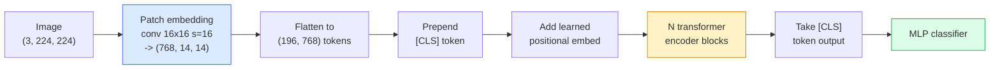

# Les transformateurs de vision (VIT)

> Coupez l'image en patches, traitez chaque patch comme un mot, lancez un transformateur standard.

> **【中文解读】**Pour le traitement de chaque image, il faut utiliser un " mot " et le traitement standard Transformer.

> **【拓展：ViT 与 GPT-4V】**ViT est le programmeur de visualisation de GPT-4V, Claude, LLaVA, etc. De 2021 à aujourd'hui, ViT est devenu l'infrastructure de la visualisation informatique, utilisée dans le modèle CLIP, SAM, DINO, etc. Le patch de ViT a également inspiré la conception de la vidéo Transformer et du modèle multi-modèles.

**Type:** Build | **类型:** 动手
**Languages:** Python | **语言:** Python
**Prerequisites:** Phase 7 Lesson 02 (Self-Attention), Phase 4 Lesson 04 (Image Classification) | **前置知识:** Phase 7 Lesson 02（自注意力），Phase 4 Lesson 04（图像分类）
**Time:** ~45 minutes | **时间:** ~45 分钟

## Objectifs d'apprentissage

- Implémenter l'intégration de patch, l'intégration positionnelle apprise, le jeton de classe et les blocs d'encodeur de transformateur à partir de zéro pour créer un ViT minimal
- Expliquez pourquoi on pensait que la TIV avait besoin de données massives avant l'entraînement jusqu'à ce que la TIV et la TIV aient prouvé le contraire.
- Comparer ViT, Swin et ConvNeXt sur leurs antécédents architecturaux (aucun, attention locale de fenêtre, colonne vertébrale de conve)
- Télégraphie d' un ViT prétrainé sur un petit ensemble de données en utilisant `timm`et la recette standard de sonde linéaire / réglage fin

> **【中文解读】**Les objectifs de l'apprentissage sont énumérés dans la liste des compétences fondamentales que l'on devrait acquérir après avoir terminé la classe.


## Le problème , l' introduction du problème

Pendant une décennie, la convolutions était synonyme de vision par ordinateur. Les CNN avaient de forts biais inductifs  localité, équivariance de traduction  que personne ne pensait pouvoir remplacer. Puis Dosovitskiy et al. (2020) ont montré qu'un transformateur simple appliqué à des patchs d'image aplatisés, sans aucune machine convolutive, pouvait correspondre ou battre les meilleures CNN à l'échelle.

> Depuis dix ans, le curseur est le nom de la vidéo informatique. CNN a une forte tendance à le remplacer. Puis Dosovitskiy et autres ont montré que le transformateur normal est utilisé pour des blocs d'image plats, sans aucun besoin de mécanisme de curseur, pour pouvoir rivaliser ou battre le meilleur CNN à grande échelle.

Le capture était "à grande échelle". ViT sur ImageNet-1k a perdu à ResNet. ViT a été entraîné sur ImageNet-21k ou JFT-300M puis ajusté sur ImageNet-1k. La conclusion était que les transformateurs manquaient de prédécesseurs utiles mais pouvaient les apprendre à partir de suffisamment de données. Des travaux ultérieurs (DeiT, MAE, DINO) ont montré qu'avec les bonnes recettes de formation  augmentation forte, pré-entraînement auto-supervisé, distillation  ViTs entraînent bien sur de petites données aussi.

> La conclusion est que le Transformer manque de précursion utile mais peut apprendre suffisamment de données pour suivre le travail.

En 2026, les CNN pures sont toujours compétitives sur les périphériques de bord (ConvNeXt est le plus fort), mais les transformateurs dominent tout le reste: segmentation (Mask2Former, SegFormer), détection (DETR, RT-DETR), multimodal (CLIP, SigLIP), vidéo (VideoMAE, VJEPA).

> Jusqu'en 2026, la pure CNN sur les appareils de bord est encore en compétition, mais Transformer a dominé tout le reste: division, détection, détection, détection, détection, détection, détection, détection, détection, détection, détection, détection, détection, détection, détection, détection, détection, détection, détection, détection, détection, détection, détection, détection, détection, détection, détection, détection, détection, détection, détection, détection, détection, détection, détection, détection, détection, détection, détection, détection, détection, détection, détection, détection, détection, détection, détection, détection, détection, détection, détection, détection, etc.

## Le concept de base.

> **【中文解读】**Le présent article présente les concepts et les bases théoriques de base. La connaissance de ces concepts est la prémisse de la réalisation de la réalisation de la réalisation, mais aussi le point de connaissance de l'interview et de la pratique de l'ingénierie.


### Le pipeline



Sept étapes. Patches -> tokens -> attention -> classifiant. Chaque variante (DeiT, Swin, ConvNeXt, MAE prétraining) change un ou deux des sept et laisse le reste seul.

> 七步──补丁 -> token -> 注意力 -> 分类器──每个变体(DeiT、Swin、ConvNeXt、MAE 预训练) seulement changer l'un des deux étapes des sept étapes, le reste reste rester intact──

### Embedding de patch

Le premier conv est le secret. taille du noyau 16, étape 16, donc une image 224x224 devient une grille de 14x14 de patches 16x16, chacune projetée à un embed 768-dim. Ce seul conv patch et projet linear.

> Le premier volume est le secret de la résidence. Le premier volume est le secret de la résidence.

```
Input:  (3, 224, 224)
Conv (3 -> 768, k=16, s=16, no padding):
Output: (768, 14, 14)
Flatten spatial: (196, 768)
```

196 patches = 196 jetons. La dimension de fonctionnalité de chaque jeton est de 768 (ViT-B), 1024 (ViT-L) ou 1280 (ViT-H).

> 196 个补丁 = 196 个标签── chaque token a une taille de 768  ViT-B)、1024  ViT-L) ou 1280  ViT-H)──

### Token de classe

Un seul vecteur appris prépendié à la séquence:

> Un émetteur d'apprentissage ajouté à la première partie de la séquence:

```
tokens = [CLS; patch_1; patch_2; ...; patch_196]   shape (197, 768)
```

Après N de blocs transformateurs, le `[CLS]`La tête de classification ne lit que ce vecteur.

> Après avoir passé un morceau de transformateur,`[CLS]`Le résultat est le représentation de l'image globale.

### Embedding positionnel

Les transformateurs n'ont pas de notion de position spatiale intégrée.

> Transformer 没有内置的空间位置概念── donner à chaque jeton plus un émetteur d'apprentissage:

```
tokens = tokens + learned_pos_embedding   (also shape (197, 768))
```

L'intégration est un paramètre du modèle; la formation basée sur le gradient l'adapte à la structure de l'image 2D.

> L'intégration est le paramètre du modèle; l'entraînement basé sur la gradience le rend adapté à la structure d'image en 2D. Il existe un programme de substitution en 2D, mais en réalité il est très peu utilisé.

### Bloc de codeur de transformateur

Attention à soi, MLP, connexions résiduelles, pré-LayerNorm.

> 标准结构──多头自注意力、MLP、残差连接、前置 LayerNorm──

```
x = x + MSA(LN(x))
x = x + MLP(LN(x))

MLP is two-layer with GELU: Linear(d -> 4d) -> GELU -> Linear(4d -> d)
```

ViT-B/16 empile 12 de ces blocs, chacun avec 12 têtes d'attention, totalisant 86M de paramètres.

> ViT-B/16  Compile 12 blocs comme celui-ci, chacun avec 12 têtes d'attention, avec 86 millions de paramètres.

### Pourquoi avant l'A.N.

Les transformateurs utilisés après la fin de la période de transition (`x = LN(x + sublayer(x))`Il a été difficile de se former après les 6 à 8 couches sans se réchauffer.`x = x + sublayer(LN(x))`Les systèmes de formation en ligne et de formation en ligne sont les plus efficaces pour les étudiants.

> 早期 Transformer 使用后置 LN(`x = LN(x + sublayer(x))`), très difficile dans les conditions de préchauffement de l'entraînement de plus de 6-8 niveaux.`x = x + sublayer(LN(x))`Il est nécessaire de préparer un entraînement plus profond.

### Compromise de taille de patch

- 16 parches par 16 par 196 jetons, standard.
  Le code de la page d'accueil est le code de la page d'accueil.
- 32x32 patches -> 49 jetons, plus rapide mais de résolution inférieure.
  Le code de la carte est plus simple.
- 8x8 patches -> 784 jetons, plus fin mais O(n^2) l'attention coûte des échelles mal.
  Le nombre de pièces de rechange est de 78,8 x 8 补丁 -> 784 个 token,更精细但 O(n^2)

Les patches plus grandes = moins de jetons = plus rapide mais moins de détails spatiaux. SwinV2 utilise des patches 4x4 dans les fenêtres hiérarchiques.

> Plus gros supplément = plus petit token = plus rapide mais moins de détails spatiaux。SwinV2 utilise 4x4  supplément dans les fenêtres de classement。

### La recette de DeiT pour former ViT sur ImageNet-1k

Le ViT d'origine avait besoin de JFT-300M pour battre les CNN. DeiT (Touvron et coll., 2020) a entraîné ViT-B à 81,8% en tête de liste sur ImageNet-1k seulement avec quatre changements:

> Il faut que le ViT JFT-300M pour vaincre CNN.

1. Augmentation intensive: augmentation aléatoire, mélange, coupage, effacement aléatoire.
   Le code de la ligne de référence est le code de la ligne de référence.
2. Profondeur stochastique (déposer des blocs entiers au hasard pendant l'entraînement).
   Le temps de formation est de laisser tomber le bloc entier.
3. Augmentation répétée (même image échantillonnée 3 fois par lot).
   Le même image dans chaque lot.
4. Destilation par un enseignant de CNN (optionnelle, améliore encore la précision).
   Le plus souvent, les gens ont des problèmes de santé.

Chaque recette moderne de formation ViT est issue de DeiT.

> Chaque programme de formation moderne de la ViT est basé sur la DeiT.

### Swin contre ConvNeXt

- **Swin**(Liu et coll., 2021)  Attention basée sur la fenêtre. Chaque bloc participe à l'intérieur d'une fenêtre locale; blocs alternés déplacent la fenêtre pour mélanger des informations à travers les fenêtres. Retourne une localité similaire à CNN avant tout en conservant l'opérateur d'attention.
  Le mot grec traduit par " le mot grec "**Swin**(Liu 等,2021)  Attention basée sur la fenêtre. Chaque bloc fait attention à l'intérieur de la fenêtre locale.
- **ConvNeXt**(Liu et coll., 2022)  redessiné CNN qui correspond aux choix d'architecture de Swin (conv en profondeur, LayerNorm, GELU, goulot d'étranglement inversé).
  Le mot grec traduit par " le mot grec "**ConvNeXt**(Liu 等,2022)  Réconfiguré CNN, adapté à Swin's architecture choix(深度可分离卷积、LayerNorm、GELU、倒置瓶)                                                                                                                                                                                                                                       

En 2026, ConvNeXt-V2 et Swin-V2 sont tous deux de qualité de production; le bon choix dépend de votre pile d'inférence (ConvNeXt compile mieux pour le bord) et du corpus de prétrainement.

> 2026 ,ConvNeXt-V2 和 Swin-V2 sont des programmes de production; correctement choisir dépend de la raison de la situation.

### Pré-entraînement

Autoencoder masqué (He et al., 2022): masquer 75% des correctifs au hasard, entraîner le codeur à traiter seulement les 25% visibles, entraîner un petit décodeur à reconstruire les correctifs masqués à partir de la sortie du codeur. Après la pré-entraînement, jeter le décodeur et affiner le codeur.

> 掩码自编码器(He等,2022):随机掩盖75% des correctifs, entraînement编码器 seulement traiter 25% de visible, entraînement un petit décodeur de codeur de sortie reconstruire les correctifs sont masqués.

MAE rend ViT entraînable sur ImageNet-1k seulement, frappe SOTA, et est la recette auto-supervisée par défaut actuelle.

> MAE utilise ViT  seulement en ImageNet-1k 上可训练, atteindre SOTA, est actuellement un programme de formation de surveillance de soi.

> **【中文解读】**Cette méthode "de zéro" peut aider à comprendre le principe derrière le cadre, en cas de problème, ne sera pas bloqué dans une boîte noire.

> **【拓展：工业部署中的视觉系统】**Dans le cadre de la déploiement industriel réel, les modèles visuels doivent prendre en compte la réflexion sur la différence de taille des modèles, l'adaptation des appareils de bord, etc. TensorRT, ONNX Runtime, OpenVINO sont des outils d'accélération de réflexion courants. Les systèmes de conduite autonome (comme Tesla FSD) utilisent généralement plusieurs modèles visuels en temps réel sur les puces de véhicule.

> **【拓展：数据标注与质量】**L'efficacité des tâches visuelles dépend fortement de la qualité des données de marquage. Le Studio de marquage, CVAT, est l'outil de marquage principal. Dans le monde industriel, l'apprentissage actif peut réduire le coût de marquage.


## Construisez-le et mettez-le en œuvre.
```figure
batchnorm-inference
```

## Faites-le

### Étape 1: Embedding du patch

```python
import torch
import torch.nn as nn

class PatchEmbedding(nn.Module):
    def __init__(self, in_channels=3, patch_size=16, dim=192, image_size=64):
        super().__init__()
        assert image_size % patch_size == 0
        self.proj = nn.Conv2d(in_channels, dim, kernel_size=patch_size, stride=patch_size)
        num_patches = (image_size // patch_size) ** 2
        self.num_patches = num_patches

    def forward(self, x):
        x = self.proj(x)
        return x.flatten(2).transpose(1, 2)
```

Une conve, une plane, une transpose.

> Un rouleau, un plan, un transfert.

### Étape 2: blocage du transformateur

Pré-LN, auto-attention à plusieurs têtes, MLP avec GELU, connexions résiduelles.

> Il y a aussi des problèmes de santé.

```python
class Block(nn.Module):
    def __init__(self, dim, num_heads, mlp_ratio=4, dropout=0.0):
        super().__init__()
        self.ln1 = nn.LayerNorm(dim)
        self.attn = nn.MultiheadAttention(dim, num_heads, dropout=dropout, batch_first=True)
        self.ln2 = nn.LayerNorm(dim)
        self.mlp = nn.Sequential(
            nn.Linear(dim, dim * mlp_ratio),
            nn.GELU(),
            nn.Dropout(dropout),
            nn.Linear(dim * mlp_ratio, dim),
            nn.Dropout(dropout),
        )

    def forward(self, x):
        a, _ = self.attn(self.ln1(x), self.ln1(x), self.ln1(x), need_weights=False)
        x = x + a
        x = x + self.mlp(self.ln2(x))
        return x
```

`nn.MultiheadAttention`Il gère la division en têtes, le produit de point à l'échelle et la projection de sortie. `batch_first=True`les formes sont donc `(N, seq, dim)`- Je suis désolé .

> `nn.MultiheadAttention`处理多头拆分、缩放点积和输出投影──`batch_first=True`Pour le faire`(N, seq, dim)`Il y a une autre.

### Étape 3: Le ViT

```python
class ViT(nn.Module):
    def __init__(self, image_size=64, patch_size=16, in_channels=3,
                 num_classes=10, dim=192, depth=6, num_heads=3, mlp_ratio=4):
        super().__init__()
        self.patch = PatchEmbedding(in_channels, patch_size, dim, image_size)
        num_patches = self.patch.num_patches
        self.cls_token = nn.Parameter(torch.zeros(1, 1, dim))
        self.pos_embed = nn.Parameter(torch.zeros(1, num_patches + 1, dim))
        self.blocks = nn.ModuleList([
            Block(dim, num_heads, mlp_ratio) for _ in range(depth)
        ])
        self.ln = nn.LayerNorm(dim)
        self.head = nn.Linear(dim, num_classes)
        nn.init.trunc_normal_(self.pos_embed, std=0.02)
        nn.init.trunc_normal_(self.cls_token, std=0.02)

    def forward(self, x):
        x = self.patch(x)
        cls = self.cls_token.expand(x.size(0), -1, -1)
        x = torch.cat([cls, x], dim=1)
        x = x + self.pos_embed
        for blk in self.blocks:
            x = blk(x)
        x = self.ln(x[:, 0])
        return self.head(x)

vit = ViT(image_size=64, patch_size=16, num_classes=10, dim=192, depth=6, num_heads=3)
x = torch.randn(2, 3, 64, 64)
print(f"output: {vit(x).shape}")
print(f"params: {sum(p.numel() for p in vit.parameters()):,}")
```

Environ 2,8 M de paramètres  un minuscule ViT traitable sur le processeur.`dim=768, depth=12, num_heads=12`- Je suis désolé .

> Environ 280 millions de paramètres sont un petit ViT qui peut être entraîné sur le CPU.`dim=768, depth=12, num_heads=12`Il y a une autre.

### Étape 4: Vérifie la santé mentale  inférence d'image unique

```python
logits = vit(torch.randn(1, 3, 64, 64))
print(f"logits: {logits}")
print(f"probs:  {logits.softmax(-1)}")
```

> **【中文解读】**Dans ce chapitre, nous allons montrer comment utiliser un cadre mature (comme PyTorch, HuggingFace, etc.) pour appliquer rapidement cette technique.


Il devrait fonctionner sans erreur.

> 应无错运行──概率之和为 1──


> **【拓展：视觉模型的持续学习】**Dans un environnement de production, le modèle visuel doit être en constante évolution pour s'adapter à de nouveaux données. La technologie de l'apprentissage continu permet d'éviter que le modèle s'adapte à de nouvelles données et oublie les anciens connaissances.

## Utilisez-le avec le cadre de réalisation

`timm`Il envoie toutes les variantes de ViT avec des poids prétraînés ImageNet.

```python
import timm

model = timm.create_model("vit_base_patch16_224", pretrained=True, num_classes=10)
```

`timm`est la version par défaut de production pour les transformateurs de vision en 2026.

Pour les travaux multimodaux (image + texte), `transformers`Le codeur d'image de tous ces navires est une variante ViT.

> **【中文解读】**Cette section se concentre sur la façon de déployer le modèle en tant que produit disponible. De l'original au système de production, il faut considérer plusieurs dimensions de l'optimisation des performances, du traitement des erreurs, du contrôle, etc.


## Envoyez-le . Produit .

Cette leçon donne:

- `outputs/prompt-vit-vs-cnn-picker.md` une requête qui choisit entre un ViT, un ConvNeXt ou un Swin en fonction de la taille du jeu de données, du calcul et de la pile d'inférence.
- `outputs/skill-vit-patch-and-pos-embed-inspector.md` une compétence qui vérifie que les formes d'intégration de patch et de positionnement d'un ViT correspondent à la longueur de séquence attendue du modèle, capturant les bugs de port les plus courants.

> **【中文解读】** Exercices de base selon Easy/Medium/Hard 三个难度递进──建议至少完成  级别的题目,  级别适合深入研究或面试准备──


## Les exercices

1. **(Easy)**Imprimez les formes de chaque tensor intermédiaire pour passer en avant à travers le minuscule ViT ci-dessus.`(N, 3, 64, 64)`-> patchs `(N, 16, 192)`-> avec CLS `(N, 17, 192)`-> entrée du classifiateur `(N, 192)`-> sortie `(N, num_classes)`- Je suis désolé .
2. **(Medium)**- Je suis un pré-entraîné .`timm`ViT-S/16 sur le jeu de données CIFAR synthétique de la leçon 4. Comparer avec les ajustements résNet-18 sur les mêmes données.
3. **(Hard)**Mettre en œuvre la pré-entraînement MAE pour le minuscule ViT: masquer 75% des correctifs, entraîner le codeur + un petit décodeur pour reconstruire les correctifs masqués. Évaluer la précision de la sonde linéaire sur les données synthétiques avant et après la pré-entraînement.

> **【中文解读】**Dans le tableau des termes, la définition du terme "ce que les gens disent" et "ce qu'il signifie réellement" est différenciée entre le langage quotidien et la signification technique précise.


## Les termes clés

| Term | What people say | What it actually means |
|------|----------------|----------------------|
| Patch embedding | "The first conv" | A conv with kernel size = stride = patch size; turns the image into a grid of token embeddings |
| Class token | "[CLS]" | A learned vector prepended to the token sequence; its final output is the global image representation |
| Positional embedding | "Learned pos" | A learned vector added to every token so the transformer knows where each patch came from |
| Pre-LN | "LayerNorm before sublayer" | The stable transformer variant: `x + sublayer(LN(x))` instead of `LN(x + sublayer(x))` |
| Multi-head attention | "Parallel attention" | Standard transformer attention split into num_heads independent subspaces, concatenated afterwards |
| ViT-B/16 | "Base, patch 16" | The canonical size: dim=768, depth=12, heads=12, patch_size=16, image=224; ~86M params |
| DeiT | "Data-efficient ViT" | ViT trained on ImageNet-1k alone with strong augmentation; proved large pretraining datasets are not strictly required |
| MAE | "Masked autoencoder" | Self-supervised pretraining: mask 75% of patches, reconstruct; the dominant ViT pretraining recipe |

> **【中文解读】**延伸阅读 fournit des ressources de haute qualité pour l'apprentissage en profondeur. Ces articles et cours sont des références classiques dans ce domaine, adaptés aux lecteurs qui ont besoin d'une compréhension approfondie.


## Encore une lecture

- [An Image is Worth 16x16 Words (Dosovitskiy et al., 2020)](https://arxiv.org/abs/2010.11929) le papier ViT
- [DeiT: Data-efficient Image Transformers (Touvron et al., 2020)](https://arxiv.org/abs/2012.12877) comment entraîner ViT sur ImageNet-1k seul
- [Masked Autoencoders are Scalable Vision Learners (He et al., 2022)](https://arxiv.org/abs/2111.06377) Pré-entraînement MAE
- [timm documentation](https://huggingface.co/docs/timm) la référence pour chaque transformateur de vision que vous utiliserez dans la production
